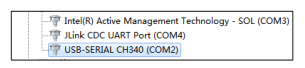

Anhang
======

.. toctree::
  :maxdepth: 5

Anhang 1: Fehler des Bewegungscontrollers und Behandlungsmethoden
------------------------------------------------------------------

.. csv-table::
   :header: "Hauptfehlercode", "Subfehlercode", "Beschreibung"
   :widths: 20, 10, 70

   "0-Kein Fehler", "0", "Kein Fehler"
   "1-Befehlspunktfehler", "1", "Gelenk-Befehlspunktfehler, zurücksetzbar"
   "1-Befehlspunktfehler", "2", "Linearer Zielpunktfehler (einschließlich Werkzeuginkonsistenz), zurücksetzbar"
   "1-Befehlspunktfehler", "3", "Kreisbogen-Zwischenpunktfehler (einschließlich Werkzeuginkonsistenz), zurücksetzbar"
   "1-Befehlspunktfehler", "4", "Kreisbogen-Zielpunktfehler (einschließlich Werkzeuginkonsistenz), zurücksetzbar"
   "1-Befehlspunktfehler", "5", "Abstand zwischen Kreisbogen-Befehlspunkten zu gering, zurücksetzbar"
   "1-Befehlspunktfehler", "6", "Vollkreis/Helix-Zwischenpunkt 1 Fehler (einschließlich Werkzeuginkonsistenz), zurücksetzbar"
   "1-Befehlspunktfehler", "7", "Vollkreis/Helix-Zwischenpunkt 2 Fehler (einschließlich Werkzeuginkonsistenz), zurücksetzbar"
   "1-Befehlspunktfehler", "8", "Vollkreis/Helix-Zwischenpunkt 3 Fehler (einschließlich Werkzeuginkonsistenz), zurücksetzbar"
   "1-Befehlspunktfehler", "9", "Abstand zwischen Vollkreis/Helix-Befehlspunkten zu gering, zurücksetzbar"
   "1-Befehlspunktfehler", "10", "TPD-Befehlspunktfehler, zurücksetzbar"
   "1-Befehlspunktfehler", "11", "TPD-Befehlswerkzeug stimmt nicht mit aktuellem Werkzeug überein, zurücksetzbar"
   "1-Befehlspunktfehler", "12", "Abweichung zwischen Startpunkt des aktuellen TPD-Befehls und nächstem Befehl zu groß, zurücksetzbar"
   "1-Befehlspunktfehler", "13", "Fehler beim Wechsel zwischen internem und externem Werkzeug, zurücksetzbar"
   "1-Befehlspunktfehler", "14", "Fehler am Startpunkt der neuen Helix, zurücksetzbar"
   "1-Befehlspunktfehler", "15", "Fehler an Befehlspunkten des neuen Splines, zurücksetzbar"
   "1-Befehlspunktfehler", "17", "PTP-Gelenkbefehl außerhalb des Grenzwerts, zurücksetzbar"
   "1-Befehlspunktfehler", "18", "TPD-Gelenkbefehl außerhalb des Grenzwerts, zurücksetzbar"
   "1-Befehlspunktfehler", "19", "Ausgeführter LIN/ARC-Gelenkbefehl außerhalb des Grenzwerts, zurücksetzbar"
   "1-Befehlspunktfehler", "20", "Befehl im kartesischen Raum über Geschwindigkeitsbegrenzung, nicht zurücksetzbar"
   "1-Befehlspunktfehler", "21", "Drehmomentbefehl im Gelenkraum außerhalb des Grenzwerts, zurücksetzbar"
   "1-Befehlspunktfehler", "22", "JOG-Gelenkbefehl außerhalb des Grenzwerts, zurücksetzbar"
   "1-Befehlspunktfehler", "23", "Befehlsgeschwindigkeit von Achse 1 im Gelenkraum außerhalb des Grenzwerts, zurücksetzbar"
   "1-Befehlspunktfehler", "24", "Befehlsgeschwindigkeit von Achse 2 im Gelenkraum außerhalb des Grenzwerts, zurücksetzbar"
   "1-Befehlspunktfehler", "25", "Befehlsgeschwindigkeit von Achse 3 im Gelenkraum außerhalb des Grenzwerts, zurücksetzbar"
   "1-Befehlspunktfehler", "26", "Befehlsgeschwindigkeit von Achse 4 im Gelenkraum außerhalb des Grenzwerts, zurücksetzbar"
   "1-Befehlspunktfehler", "27", "Befehlsgeschwindigkeit von Achse 5 im Gelenkraum außerhalb des Grenzwerts, zurücksetzbar"
   "1-Befehlspunktfehler", "28", "Befehlsgeschwindigkeit von Achse 6 im Gelenkraum außerhalb des Grenzwerts, zurücksetzbar"
   "1-Befehlspunktfehler", "29", "Rückgemeldete Gelenkgeschwindigkeit außerhalb des Grenzwerts, nicht zurücksetzbar"
   "1-Befehlspunktfehler", "30", "Abweichung zwischen Gelenkbefehl und Rückmeldung zu groß, nicht zurücksetzbar, Neustart erforderlich"
   "1-Befehlspunktfehler", "31", "DMP-Zielpunktfehler (einschließlich Werkzeuginkonsistenz), zurücksetzbar"
   "1-Befehlspunktfehler", "33", "Gelenkkonfiguration des nächsten Befehls hat sich geändert (nächster Befehl enthält singuläre Pose, bitte PTP-Befehl verwenden oder nächsten Befehlspunkt ändern), zurücksetzbar"
   "1-Befehlspunktfehler", "34", "Gelenkkonfiguration des aktuellen Befehls hat sich geändert (nächster Befehl enthält singuläre Pose, bitte PTP-Befehl verwenden oder nächsten Befehlspunkt ändern), zurücksetzbar"
   "1-Befehlspunktfehler", "35", "Gelenkgeschwindigkeit im LIN-Befehl außerhalb des Grenzwerts, zurücksetzbar"
   "1-Befehlspunktfehler", "36", "Adaptive Geschwindigkeit im LIN-Befehl außerhalb des Schwellwerts, zurücksetzbar"
   "1-Befehlspunktfehler", "37", "Nicht erreichbarer Punkt in der Trajektorie, zurücksetzbar"
   "1-Befehlspunktfehler", "38", "Nicht erreichbarer Punkt in der Trajektorie - singuläre Pose, zurücksetzbar"
   "1-Befehlspunktfehler", "49", "Befehlsfehler: Zwischen ARCSTART und ARCEND sind nur LIN- und ARC-Befehle erlaubt, zurücksetzbar"
   "1-Befehlspunktfehler", "50", "Befehlsfehler: Zwischen WEAVESTART und WEAVEEND sind nur LIN- und ARC-Befehle erlaubt, zurücksetzbar"
   "1-Befehlspunktfehler", "51", "Fehler in den Pendelparametern, zurücksetzbar"
   "1-Befehlspunktfehler", "52", "Abstand zwischen Pendelbefehlspunkten zu gering, zurücksetzbar"
   "1-Befehlspunktfehler", "53", "Nicht erreichbarer Punkt in der Pendeltrajektorie - singuläre Pose, zurücksetzbar"
   "1-Befehlspunktfehler", "54", "Nicht erreichbarer Punkt in der Pendeltrajektorie - Gelenkbefehl außerhalb Grenzwert, zurücksetzbar"
   "1-Befehlspunktfehler", "55", "Nicht erreichbarer Punkt in der Pendeltrajektorie - Planungsanomalie (Werkzeug-z und Bewegungsrichtung-x überlappen), zurücksetzbar"
   "1-Befehlspunktfehler", "56", "Nicht erreichbarer Punkt in der Pendeltrajektorie - Planungsanomalie (Kreisbogenwegpunktfehler), zurücksetzbar"
   "1-Befehlspunktfehler", "65", "Abweichung des Lasersensorbefehls zu groß, zurücksetzbar"
   "1-Befehlspunktfehler", "66", "Lasersensorbefehl unterbrochen, Nahtverfolgung vorzeitig beendet, zurücksetzbar"
   "1-Befehlspunktfehler", "81", "Befehlsgeschwindigkeit der externen Achse außerhalb Grenzwert, zurücksetzbar"
   "1-Befehlspunktfehler", "82", "Abweichung zwischen Befehl und Rückmeldung der externen Achse zu groß, nicht zurücksetzbar, Referenzfahrt oder Neustart erforderlich"
   "1-Befehlspunktfehler", "83", "Kommunikationsfehler mit erweitertem Peripheriegerät (externe Achse/IO), zurücksetzbar"
   "1-Befehlspunktfehler", "84", "Kommunikations-Paketverlustfehler mit erweitertem Peripheriegerät (externe Achse/IO), zurücksetzbar"
   "1-Befehlspunktfehler", "97", "Förderbandverfolgung - Änderung der Orientierung zwischen Startpunkt und Referenzpunkt zu groß, zurücksetzbar"
   "1-Befehlspunktfehler", "113", "Kraftregelung - X-Richtung überschreitet maximalen Anpassungsweg, zurücksetzbar"
   "1-Befehlspunktfehler", "114", "Kraftregelung - Y-Richtung überschreitet maximalen Anpassungsweg, zurücksetzbar"
   "1-Befehlspunktfehler", "115", "Kraftregelung - Z-Richtung überschreitet maximalen Anpassungsweg, zurücksetzbar"
   "1-Befehlspunktfehler", "116", "Kraftregelung - RX-Richtung überschreitet maximalen Anpassungswinkel, zurücksetzbar"
   "1-Befehlspunktfehler", "117", "Kraftregelung - RY-Richtung überschreitet maximalen Anpassungswinkel, zurücksetzbar"
   "1-Befehlspunktfehler", "118", "Kraftregelung - RZ-Richtung überschreitet maximalen Anpassungswinkel, zurücksetzbar"
   "1-Befehlspunktfehler", "119", "Fehler in externen Sensordaten, zurücksetzbar"
   "1-Befehlspunktfehler", "120", "Helix-Erkundungsbewegung fehlgeschlagen, zurücksetzbar"
   "1-Befehlspunktfehler", "121", "Dreheinfügebewegung fehlgeschlagen, zurücksetzbar"
   "1-Befehlspunktfehler", "122", "Lineare Einfügebewegung fehlgeschlagen, zurücksetzbar"
   "1-Befehlspunktfehler", "123", "Oberflächenlokalisierungsbewegung fehlgeschlagen, zurücksetzbar"
   "1-Befehlspunktfehler", "129", "Maximale Anzahl an Drehmomentaufzeichnungspunkten überschritten, zurücksetzbar"
   "1-Befehlspunktfehler", "130", "Fehler beim Geschwindigkeitswechsel, zurücksetzbar"
   "1-Befehlspunktfehler", "147", "Fokusverfolgungsfehler, zurücksetzbar"
   "1-Befehlspunktfehler", "148", "Orientierungsgeschwindigkeit außerhalb Grenzwert, zurücksetzbar"
   "1-Befehlspunktfehler", "149", "Anomalie in der Rückmeldung des Gelenkstatusworts, zurücksetzbar"
   "2-Antriebsfehler", "1", "Fehler in Achse 1 Antrieb, nicht zurücksetzbar"
   "2-Antriebsfehler", "2", "Fehler in Achse 2 Antrieb, nicht zurücksetzbar"
   "2-Antriebsfehler", "3", "Fehler in Achse 3 Antrieb, nicht zurücksetzbar"
   "2-Antriebsfehler", "4", "Fehler in Achse 4 Antrieb, nicht zurücksetzbar"
   "2-Antriebsfehler", "5", "Fehler in Achse 5 Antrieb, nicht zurücksetzbar"
   "2-Antriebsfehler", "6", "Fehler in Achse 6 Antrieb, nicht zurücksetzbar"
   "3-Software-Endschalter-Fehler", "1", "Achse 1 außerhalb Software-Endschalter, zurücksetzbar"
   "3-Software-Endschalter-Fehler", "2", "Achse 2 außerhalb Software-Endschalter, zurücksetzbar"
   "3-Software-Endschalter-Fehler", "3", "Achse 3 außerhalb Software-Endschalter, zurücksetzbar"
   "3-Software-Endschalter-Fehler", "4", "Achse 4 außerhalb Software-Endschalter, zurücksetzbar"
   "3-Software-Endschalter-Fehler", "5", "Achse 5 außerhalb Software-Endschalter, zurücksetzbar"
   "3-Software-Endschalter-Fehler", "6", "Achse 6 außerhalb Software-Endschalter, zurücksetzbar"
   "4-Kollisionsfehler", "1", "Kollision Achse 1, zurücksetzbar"
   "4-Kollisionsfehler", "2", "Kollision Achse 2, zurücksetzbar"
   "4-Kollisionsfehler", "3", "Kollision Achse 3, zurücksetzbar"
   "4-Kollisionsfehler", "4", "Kollision Achse 4, zurücksetzbar"
   "4-Kollisionsfehler", "5", "Kollision Achse 5, zurücksetzbar"
   "4-Kollisionsfehler", "6", "Kollision Achse 6, zurücksetzbar"
   "4-Kollisionsfehler", "7", "Kollision Endeffektor, zurücksetzbar"
   "5-Fehler Anzahl aktiver Slaves", "1", "Fehler in der Anzahl aktiver Slaves, nicht zurücksetzbar"
   "6-Slave-Fehler", "1", "Slave-Verbindungsabbruch, nicht zurücksetzbar"
   "6-Slave-Fehler", "2", "Slave-Status stimmt nicht mit Sollwert überein, nicht zurücksetzbar"
   "6-Slave-Fehler", "3", "Slave nicht konfiguriert, nicht zurücksetzbar"
   "6-Slave-Fehler", "4", "Slave-Konfigurationsfehler, nicht zurücksetzbar"
   "6-Slave-Fehler", "5", "Slave-Initialisierungsfehler, nicht zurücksetzbar"
   "6-Slave-Fehler", "6", "Fehler bei Initialisierung der Slave-Mailbox-Kommunikation, nicht zurücksetzbar"
   "7-IO-Fehler", "1", "Kanalfehler, zurücksetzbar"
   "7-IO-Fehler", "2", "Wertefehler, zurücksetzbar"
   "7-IO-Fehler", "3", "Wartezeit für WaitDI überschritten, zurücksetzbar"
   "7-IO-Fehler", "4", "Wartezeit für WaitAI überschritten, zurücksetzbar"
   "7-IO-Fehler", "5", "Wartezeit für WaitAxleDI überschritten, zurücksetzbar"
   "7-IO-Fehler", "6", "Wartezeit für WaitAxleAI überschritten, zurücksetzbar"
   "7-IO-Fehler", "7", "Fehler in der konfigurierten Kanalfunktion, zurücksetzbar"
   "7-IO-Fehler", "8", "Lichtbogenstart-Zeitüberschreitung, zurücksetzbar"
   "7-IO-Fehler", "9", "Lichtbogenende-Zeitüberschreitung, zurücksetzbar"
   "7-IO-Fehler", "10", "Positionssuche-Zeitüberschreitung, zurücksetzbar"
   "7-IO-Fehler", "11", "Zeitüberschreitung bei Förderband-IO-Erkennung, zurücksetzbar"
   "7-IO-Fehler", "12", "Wartezeit für WaitAuxDI überschritten, zurücksetzbar"
   "7-IO-Fehler", "13", "Wartezeit für WaitAuxAI überschritten, zurücksetzbar"
   "7-IO-Fehler", "14", "Zeitüberschreitung bei Schweißdraht-Positionssuche, zurücksetzbar"
   "8-Greiferfehler", "1", "Zeitüberschreitung bei Greiferbewegung, zurücksetzbar"
   "9-Dateifehler", "1", "Version der zbt-Konfigurationsdatei falsch, Initialisierungsfehler - nicht zurücksetzbar"
   "9-Dateifehler", "2", "Laden der zbt-Konfigurationsdatei fehlgeschlagen, Initialisierungsfehler - nicht zurücksetzbar"
   "9-Dateifehler", "3", "Version der user-Konfigurationsdatei falsch, Initialisierungsfehler - nicht zurücksetzbar"
   "9-Dateifehler", "4", "Laden der user-Konfigurationsdatei fehlgeschlagen, Initialisierungsfehler - nicht zurücksetzbar"
   "9-Dateifehler", "5", "Version der exaxis-Konfigurationsdatei falsch, Initialisierungsfehler - nicht zurücksetzbar"
   "9-Dateifehler", "6", "Laden der exaxis-Konfigurationsdatei fehlgeschlagen, Initialisierungsfehler - nicht zurücksetzbar"
   "9-Dateifehler", "7", "Robotermodell inkonsistent, Neukonfiguration erforderlich - nicht zurücksetzbar"
   "9-Dateifehler", "8", "Version der dhpara-Konfigurationsdatei falsch, Initialisierungsfehler - nicht zurücksetzbar"
   "9-Dateifehler", "9", "Laden der dhpara-Konfigurationsdatei fehlgeschlagen, Initialisierungsfehler - nicht zurücksetzbar"
   "9-Dateifehler", "10", "Robotermodell nicht eingestellt - nicht zurücksetzbar"
   "9-Dateifehler", "11", "Version der load-Konfigurationsdatei falsch, Initialisierungsfehler - nicht zurücksetzbar"
   "9-Dateifehler", "12", "Laden der load-Konfigurationsdatei fehlgeschlagen, Initialisierungsfehler - nicht zurücksetzbar"
   "9-Dateifehler", "13", "Version der speed-Konfigurationsdatei falsch, Initialisierungsfehler - nicht zurücksetzbar"
   "9-Dateifehler", "14", "Laden der speed-Konfigurationsdatei fehlgeschlagen, Initialisierungsfehler - nicht zurücksetzbar"
   "10-Singuläre Pose", "1", "Singuläre Pose"
   "11-Antriebskommunikationsfehler", "1", "Kommunikationsfehler mit Achse 1 Antrieb, nicht zurücksetzbar"
   "11-Antriebskommunikationsfehler", "2", "Kommunikationsfehler mit Achse 2 Antrieb, nicht zurücksetzbar"
   "11-Antriebskommunikationsfehler", "3", "Kommunikationsfehler mit Achse 3 Antrieb, nicht zurücksetzbar"
   "11-Antriebskommunikationsfehler", "4", "Kommunikationsfehler mit Achse 4 Antrieb, nicht zurücksetzbar"
   "11-Antriebskommunikationsfehler", "5", "Kommunikationsfehler mit Achse 5 Antrieb, nicht zurücksetzbar"
   "11-Antriebskommunikationsfehler", "6", "Kommunikationsfehler mit Achse 6 Antrieb, nicht zurücksetzbar"
   "12-Software-Endschalter externe Achse", "1", "Achse 1 außerhalb Software-Endschalter, zurücksetzbar"
   "12-Software-Endschalter externe Achse", "2", "Achse 2 außerhalb Software-Endschalter, zurücksetzbar"
   "12-Software-Endschalter externe Achse", "3", "Achse 3 außerhalb Software-Endschalter, zurücksetzbar"
   "12-Software-Endschalter externe Achse", "4", "Achse 4 außerhalb Software-Endschalter, zurücksetzbar"
   "13-Einstellungsparameterfehler", "1", "Werkzeugnummer außerhalb Grenzwert, zurücksetzbar"
   "13-Einstellungsparameterfehler", "2", "Schwellwert für Positionierung abgeschlossen fehlerhaft, zurücksetzbar"
   "13-Einstellungsparameterfehler", "3", "Kollisionsstufe fehlerhaft, zurücksetzbar"
   "13-Einstellungsparameterfehler", "4", "Lastgewicht fehlerhaft, zurücksetzbar"
   "13-Einstellungsparameterfehler", "5", "Lastschwerpunkt X fehlerhaft, zurücksetzbar"
   "13-Einstellungsparameterfehler", "6", "Lastschwerpunkt Y fehlerhaft, zurücksetzbar"
   "13-Einstellungsparameterfehler", "7", "Lastschwerpunkt Z fehlerhaft, zurücksetzbar"
   "13-Einstellungsparameterfehler", "8", "DI-Filterzeit fehlerhaft, zurücksetzbar"
   "13-Einstellungsparameterfehler", "9", "AxleDI-Filterzeit fehlerhaft, zurücksetzbar"
   "13-Einstellungsparameterfehler", "10", "AI-Filterzeit fehlerhaft, zurücksetzbar"
   "13-Einstellungsparameterfehler", "11", "AxleAI-Filterzeit fehlerhaft, zurücksetzbar"
   "13-Einstellungsparameterfehler", "12", "DI-Pegelbereich fehlerhaft, zurücksetzbar"
   "13-Einstellungsparameterfehler", "13", "DO-Pegelbereich fehlerhaft, zurücksetzbar"
   "13-Einstellungsparameterfehler", "14", "Werkstücknummer außerhalb Grenzwert, zurücksetzbar"
   "13-Einstellungsparameterfehler", "15", "Externe Achsnummer außerhalb Grenzwert, zurücksetzbar"
   "13-Einstellungsparameterfehler", "16", "Fehler im Kanal des Förderband-Encoders, zurücksetzbar"
   "13-Einstellungsparameterfehler", "17", "Fehler in der Achsnummer des Förderband-Werkstücks, zurücksetzbar"

Anhang 2: Fehlertabelle für den Breitspannungs-Steuerschrank
---------------------------------------------------------------------------------

.. list-table::
   :widths: 20 40 80
   :header-rows: 0
   :align: center

   * - **Fehlercode**
     - **Fehlername**
     - **Behandlungsmethode**

   * - 3
     - Hilfs-MCU offline
     - | 1. Firmware der Hilfs-MCU neu flashen
       | 2. Hilfs-MCU reparieren oder Steuerschrank austauschen  

   * - 4
     - Haupt- und Hilfs-MCU Not-Aus-Eingang nicht übereinstimmend
     - | 1. Not-Aus-Kabelbaum der Tasterbox prüfen oder Tasterbox-Baugruppe austauschen
       | 2. Die beiden Not-Aus-Brückenkabelbäume an den Steuerschrankklemmen prüfen  
       | 3. Wenn der Fehler weiterhin besteht, Steuerschrank reparieren oder austauschen 

   * - 5
     - Haupt- und Hilfs-MCU Sicherheitseingang nicht übereinstimmend
     - | 1. Die beiden Sicherheits-Brückenkabelbäume an den Steuerschrankklemmen prüfen
       | 2. Wenn der Fehler weiterhin besteht, Steuerschrank reparieren oder austauschen

   * - 6
     - Haupt- und Hilfs-MCU 3-Stellungs-Freigabe und Not-Aus-Eingang nicht übereinstimmend
     - | 1. 3-Stellungs-Freigabeschalter am Teach-Pendant und den Kabelbaum des Teach-Pendants prüfen
       | 2. Teach-Pendant-Baugruppe austauschen
       | 3. Prüfen, ob der Web im Teach-Pendant-Modus ist und ob das Teach-Pendant angeschlossen ist
       | 4. Wenn der Fehler weiterhin besteht, Steuerschrank reparieren oder austauschen

   * - 7
     - Haupt-STO-Eingang/Ausgang nicht übereinstimmend
     - | 1. Prüfen, ob der Schwerlaststecker des Steuerschranks und der STO-Kabelbaum fest eingesteckt sind
       | 2. Prüfen, ob der Antrieb die STO-Funktion unterstützt
       | 3. Bei Konfiguration Breitspannungs-zertifizierter Steuerschrank + nicht zertifizierter Roboter prüfen, ob der Functional-Safety-Modus aktiviert ist
       | 4. Der Breitspannungs-zertifizierte Steuerschrank aktiviert im Zertifizierungsmodus die STO-Fehlererkennung; der nicht zertifizierte Roboter unterstützt den Functional-Safety-Modus nicht
       | 5. Wenn der Fehler weiterhin besteht, Steuerschrank reparieren oder austauschen

   * - 8
     - Hilfs-STO-Eingang/Ausgang nicht übereinstimmend
     - | 1. Prüfen, ob der Schwerlaststecker des Steuerschranks und der STO-Kabelbaum fest eingesteckt sind
       | 2. Prüfen, ob der Antrieb die STO-Funktion unterstützt
       | 3. Bei Konfiguration Breitspannungs-zertifizierter Steuerschrank + nicht zertifizierter Roboter prüfen, ob der Functional-Safety-Modus aktiviert ist
       | 4. Der Breitspannungs-zertifizierte Steuerschrank aktiviert im Zertifizierungsmodus die STO-Fehlererkennung; der nicht zertifizierte Roboter unterstützt den Functional-Safety-Modus nicht
       | 5. Wenn der Fehler weiterhin besteht, Steuerschrank reparieren oder austauschen

   * - 9
     - Haupt-MCU erkennt 48V-Relais-Eingang/Ausgang nicht übereinstimmend
     - | 1. Eingang und Rückmeldung des zwangsgeführten Relais im Steuerschrank prüfen
       | 2. Prüfen, ob das 48V-Relais im Steuerschrank festklebt
       | 3. Prüfen, ob die 48V-Relais-Rückmeldeschaltung im Steuerschrank ordnungsgemäß funktioniert
       | 4. Wenn der Fehler weiterhin besteht, Steuerschrank reparieren oder austauschen

   * - 10
     - Hilfs-MCU erkennt 48V-Relais-Eingang/Ausgang nicht übereinstimmend
     - | 1. Eingang und Rückmeldung des zwangsgeführten Relais im Steuerschrank prüfen
       | 2. Prüfen, ob das 48V-Relais im Steuerschrank festklebt
       | 3. Prüfen, ob die 48V-Relais-Rückmeldeschaltung im Steuerschrank ordnungsgemäß funktioniert
       | 4. Wenn der Fehler weiterhin besteht, Steuerschrank reparieren oder austauschen

   * - \
     - Steuerschrank stromlos, keine 48V-Ausgangsspannung
     - | 1. Die 24V-Kurzschlussschutz-Chip-Schaltung prüfen und auf Kurzschlüsse bei 24V prüfen
       | 2. Die Brückenkabelbäume der Not-Aus-Eingangs- und Sicherheitseingangsklemmen prüfen
       | 3. Prüfen, ob die 24V-Stromversorgungsplatine im Steuerschrank 24V ausgibt
       | 4. Wenn der Fehler weiterhin besteht, Steuerschrank reparieren oder austauschen

Anhang 3: Fehlercodetabelle des Servoantriebs
----------------------------------------------

.. list-table::
   :widths: 20 40 80
   :header-rows: 0
   :align: center

   * - **Fehlercode**
     - **Fehlerbezeichnung**
     - **Behandlungsmethode**

   * - 1
     - Software-Überstromfehler
     - | 1. Prüfen, ob die Gelenklast oder der Widerstand größer oder anormal geworden ist.
       | 2. Wenn der Fehler weiterhin besteht, die Treiberplatine reparieren oder austauschen.

   * - 2
     - Überspannungsfehler
     - Robotergeschwindigkeit oder -beschleunigung reduzieren.

   * - 3
     - Unterspannungsfehler
     - | 1. Prüfen, ob die 48V-Stromversorgung des Steuerpults eine anormale Ausgangsspannung hat.
       | 2. Prüfen, ob die Treiberplatine und das Gelenkgehäuse kurzgeschlossen sind.
       | 3. Wenn der Fehler weiterhin besteht, die Treiberplatine reparieren oder austauschen.

   * - 4
     - Übertemperaturfehler
     - Robotlast reduzieren oder Robotergeschwindigkeit verringern.

   * - 5
     - Überlastfehler
     - Robotlast reduzieren oder Robotergeschwindigkeit verringern.

   * - 6
     - Überdrehzahlfehler
     - | 1. Prüfen, ob die Magnetgeber-Baugruppe und die Fixierschraube der Motorwelle locker sind.
       | 2. Die Encoder-Nullpunktkalibrierung wiederholen.
       | 3. Wenn der Fehler weiterhin besteht, die Magnetgeber-Baugruppe reparieren oder austauschen.

   * - 7
     - Parameterfehler
     - Treiberplatine reparieren oder austauschen.

   * - 8
     - Motor-Durchgehen-Fehler
     - | 1. Prüfen, ob die Magnetgeber-Baugruppe und die Fixierschraube der Motorwelle locker sind.
       | 2. Die Encoder-Nullpunktkalibrierung wiederholen.
       | 3. Wenn der Fehler weiterhin besteht, die Magnetgeber-Baugruppe reparieren oder austauschen.

   * - 9
     - Positionsfehler
     - | 1. Prüfen, ob die Gelenklast oder der Widerstand größer oder anormal geworden ist.
       | 2. Wenn der Fehler weiterhin besteht, die Treiberplatine reparieren oder austauschen.

   * - 10
     - Positionsüberlauffehler
     - | 1. Prüfen, ob der harte Endanschlag locker ist.
       | 2. Die Roboter-Nullpunktkalibrierung wiederholen.

   * - 11
     - Hardware-Überstromfehler
     - Treiberplatine reparieren oder austauschen.

   * - 12
     - Antriebssperrfehler
     - Nicht aktiviert.

   * - 13
     - Motorblockierfehler
     - | 1. Prüfen, ob die Bremse angezogen ist.
       | 2. Prüfen, ob der Roboter gegen den harten Endanschlag gefahren ist.
       | 3. Wenn der Fehler weiterhin besteht, die Treiberplatine reparieren oder austauschen.

   * - 14
     - Leistungsversorgungsfehler
     - Nicht aktiviert.

   * - 15
     - STO-Fehler
     - Nicht aktiviert.

   * - 16
     - Phasenstrom-AD-Abgleichfehler
     - Treiberplatine reparieren oder austauschen.

   * - 17
     - EEPROM-Fehler
     - Treiberplatine reparieren oder austauschen.

   * - 18
     - Hallsensor-Fehler
     - | 1. Prüfen, ob die Hallsensorkabel fest eingesteckt sind und ob Kurzschluss oder Unterbrechung vorliegt.
       | 2. Wenn der Fehler weiterhin besteht, das Gelenk reparieren oder austauschen.

   * - 19
     - Encoderfehler
     - Magnetgeber-Baugruppe reparieren oder austauschen.

   * - 20
     - Encoder-Nullabgleichfehler
     - | 1. Die Encoder-Nullpunktkalibrierung wiederholen.
       | 2. Wenn der Fehler weiterhin besteht, die Magnetgeber-Baugruppe reparieren oder austauschen.

   * - 21
     - Verlust des Encoder-Z-Impulses
     - Nicht aktiviert.

   * - 22
     - Encoder-Zählfehler
     - Nicht aktiviert.

   * - 23
     - Überlauf der Encoder-Multiturn-Daten
     - Nicht aktiviert.

   * - 24
     - Externer Taktfehler
     - Treiberplatine reparieren oder austauschen.

   * - 25
     - UVW-Phasenfolgefehler
     - Nicht aktiviert.

   * - 26
     - FPGA-Fehler
     - Nicht aktiviert.

   * - 27
     - Referenzpunktfahrt-Fehler
     - Nicht aktiviert.

   * - 28
     - Magnetischer Encoderfehler
     - | 1. Prüfen, ob die Magnetgeber-Baugruppe und die Fixierschraube der Motorwelle locker sind.
       | 2. Wenn der Fehler weiterhin besteht, die Magnetgeber-Baugruppe reparieren oder austauschen.

   * - 29
     - Motorleistungskabelunterbrechung
     - | 1. Prüfen, ob das Motorkabel fest eingesteckt ist und ob Kurzschluss oder Unterbrechung vorliegt.
       | 2. Wenn der Fehler weiterhin besteht, die Treiberplatine reparieren oder austauschen.

   * - 30
     - EtherCAT-Fehler
     - | 1. Prüfen, ob das Netzwerkkabel fest eingesteckt ist und ob Kurzschluss oder Unterbrechung vorliegt.
       | 2. Wenn der Fehler weiterhin besteht, die Treiberplatine reparieren oder austauschen.

   * - 31
     - EtherCAT_SM_DOG-Fehler
     - | 1. Prüfen, ob das Netzwerkkabel fest eingesteckt ist und ob Kurzschluss oder Unterbrechung vorliegt.
       | 2. Wenn der Fehler weiterhin besteht, die Treiberplatine reparieren oder austauschen.

   * - 32
     - EtherCAT_FATALSYNC-Fehler
     - | 1. Prüfen, ob das Netzwerkkabel fest eingesteckt ist und ob Kurzschluss oder Unterbrechung vorliegt.
       | 2. Wenn der Fehler weiterhin besteht, die Treiberplatine reparieren oder austauschen.

   * - 33
     - EtherCAT_SYNC-Fehler
     - | 1. Prüfen, ob das Netzwerkkabel fest eingesteckt ist und ob Kurzschluss oder Unterbrechung vorliegt.
       | 2. Wenn der Fehler weiterhin besteht, die Treiberplatine reparieren oder austauschen.

   * - 34
     - EtherCAT_RFT-Fehler
     - | 1. Prüfen, ob das Netzwerkkabel fest eingesteckt ist und ob Kurzschluss oder Unterbrechung vorliegt.
       | 2. Wenn der Fehler weiterhin besteht, die Treiberplatine reparieren oder austauschen.

   * - 35
     - Antriebs-Achsenadressfehler
     - | 1. Die Achsenadresse des Antriebs neu konfigurieren.
       | 2. Wenn der Fehler weiterhin besteht, die Treiberplatine reparieren oder austauschen.

   * - 36
     - Roboter-Nullpunktkalibrierungsfehler
     - | 1. Die Roboter-Nullpunktkalibrierung wiederholen.
       | 2. Zuerst den FLASH mit JLINK löschen, dann das Programm neu herunterladen und die Nullpunktkalibrierung durchführen.
       | 3. Wenn der Fehler weiterhin besteht, die Treiberplatine reparieren oder austauschen.

   * - 37
     - Encoder-Kommunikationsfehler
     - | 1. Prüfen, ob die Encoder-Kabel fest eingesteckt sind und ob Kurzschluss oder Unterbrechung vorliegt.
       | 2. Wenn der Fehler weiterhin besteht, die Magnetgeber-Baugruppe reparieren oder austauschen.

   * - 40
     - Magnetgebermodul-Fehler - Nullabgleichfehler
     - | 1. Die Nullpunktkalibrierung der Magnetgeber-Baugruppe wiederholen.
       | 2. Wenn der Fehler weiterhin besteht, die Magnetgeber-Baugruppe reparieren oder austauschen.

   * - 41
     - Magnetgebermodul-Fehler - Multiturn-Fehler
     - | 1. Prüfen, ob die Magnetgeber-Baugruppe und die Fixierschraube der Motorwelle locker sind.
       | 2. Wenn der Fehler weiterhin besteht, die Magnetgeber-Baugruppe reparieren oder austauschen.

   * - 42
     - Magnetgebermodul-Fehler - Multiturn-Klein-Magnetgeber-Fehler
     - | 1. Prüfen, ob der Multiturn-Klein-Magnetgeber-Chip anormal ist.
       | 2. Wenn der Fehler weiterhin besteht, die Magnetgeber-Baugruppe reparieren oder austauschen.

   * - 43
     - Magnetgebermodul-Fehler - Multiturn-Groß-Magnetgeber-Fehler
     - | 1. Prüfen, ob der Multiturn-Groß-Magnetgeber-Chip anormal ist.
       | 2. Wenn der Fehler weiterhin besteht, die Magnetgeber-Baugruppe reparieren oder austauschen.

   * - 44
     - Magnetgebermodul-Fehler - Singleturn-Magnetgeber-Fehler
     - | 1. Prüfen, ob der Singleturn-Magnetgeber-Chip anormal ist.
       | 2. Wenn der Fehler weiterhin besteht, die Magnetgeber-Baugruppe reparieren oder austauschen.

   * - 45
     - Magnetgebermodul-Fehler - Optischer Encoder-Fehler
     - | 1. Prüfen, ob die optische Codierscheibe verschmutzt oder nicht fest verklebt ist.
       | 2. Wenn der Fehler weiterhin besteht, die Magnetgeber-Baugruppe reparieren oder austauschen.

   * - 46
     - Robotertyp-Konfigurationsfehler
     - | 1. Ohne Spannungsunterbrechung die Firmware-Versionsnummer des fehlerhaften Antriebs prüfen
       | 2. Robotertyp neu konfigurieren
       | 3. Wenn der Fehler weiterhin besteht, Antriebsplatine austauschen oder reparieren

   * - 47
     - Bremsenspannungsprüfungsfehler
     - | 1. Prüfen, ob die Bremsenverkabelung fehlerhaft ist
       | 2. Prüfen, ob der Bremsenkreis fehlerhaft ist

   * - 50
     - Positionsbefehlfehler
     - | 1. Prüfen, ob der vom Host-Computer (Controller) gesendete Positionsbefehl fehlerhaft ist (oder Positionsbefehlssprung)

   * - 51
     - Magnetischer Encoder-Modulfehler - Optischer Encoder-Fehler
     - | 1. Prüfen, ob die Verkabelung des Drehmomentsensors fehlerhaft ist
       | 2. Wenn der Fehler weiterhin besteht, Drehmomentsensor reparieren oder austauschen

Anhang 4: Endplatten-485-Upgrade
---------------------------------

Bei der Verwendung vor Ort kann es vorkommen, dass die Firmware aktualisiert werden muss, um neue Anforderungen zu erfüllen. Hierfür wird eine neue Upgrade-Datei (XX_XX_MAIN.bin) bereitgestellt. Das Upgrade der Endplatte erfolgt über die 485-Schnittstelle (mit Hilfe eines USB-zu-485-Moduls). Die Upgrade-Schritte sind wie folgt:

**Schritt 1: 485-Verdrahtung:** Am Roboterende befindet sich ein 5-poliger Rundsteckverbinder für die Kommunikation. Die Pin-Belegung des Rundsteckverbinders ist in Abbildung 1 dargestellt. Verbinden Sie die Klemmen 485-A und 485-B am Roboterende mit den Klemmen A und B des USB-zu-485-Werkzeugs mittels Twisted-Pair-Kabel.

.. figure:: appendix/001.png
   :align: center
   :width: 4in

.. centered:: Abbildung 18.3-1 Pin-Belegung des Rundsteckverbinders

**Schritt 2: Hardware-Verbindung:** Verbinden Sie die USB-Seite des USB-zu-485-Werkzeugs mit einem PC. Wenn das USB-zu-485-Werkzeug im PC-Geräte-Manager erkannt wird, erscheint die folgende Oberfläche.

.. centered:: Abbildung 18.3-2 Erkennung des USB-zu-485-Ports

**Schritt 3: Upgrade-Werkzeug:** Öffnen Sie nach Abschluss der Verdrahtung das "FAIRINO Serielles Debug-Assistenten"-Programm. Klicken Sie auf die Schaltfläche "Endplatte". Wählen Sie im Bereich "Serielle Parametereinstellungen" den oben erkannten seriellen Port aus, stellen Sie die Baudrate auf 115200, Datenbits auf 8, Parität auf Keine, Stoppbits auf 1 ein und öffnen Sie dann den seriellen Port. Bei Erfolg erscheint die Meldung "Serieller Port erfolgreich geöffnet".

.. figure:: appendix/003.png
   :align: center
   :width: 4in

.. centered:: Abbildung 18.3-3 Einstellung der seriellen Parameter

**Schritt 4: Firmware-Upgrade:** Wählen Sie "Endplatte" und klicken Sie auf "Firmware-Upgrade", wie in der Abbildung gezeigt:

.. figure:: appendix/004.png
   :align: center
   :width: 6in

.. centered:: Abbildung 18.3-4 Firmware-Upgrade der Endplatte

-   Klicken Sie zuerst auf "Flash löschen". Nach erfolgreichem Löschen erscheint im Datenempfangsbereich ein Hinweis auf den Löscherfolg.

-   Öffnen Sie die Datei (die zu aktualisierende Datei), indem Sie den Speicherpfad auswählen, wie unten gezeigt. Nach der Auswahl wird der Name der zu aktualisierenden Datei im Dateinamen-Anzeigefeld angezeigt.

.. figure:: appendix/005.png
   :align: center
   :width: 6in

.. centered:: Abbildung 18.3-5 Auswahl der Upgrade-Datei

-   Klicken Sie auf "Datei senden". Wenn der Fortschrittsbalken 100% erreicht, ist das Senden der Upgrade-Datei abgeschlossen.

**Schritt 5: Upgrade-Überprüfung:** Starten Sie das System neu (aus- und wieder einschalten). Wählen Sie im Bereich "Wartungsinformationen" die Option "Firmware-Versionsinfo der Endplatte abfragen". Im "Datenempfangsbereich" werden die Firmware-Versionsinformationen angezeigt. Wenn diese mit der Version der aktualisierten Datei übereinstimmen, war das Upgrade erfolgreich, andernfalls ist es fehlgeschlagen.

.. figure:: appendix/006.png
   :align: center
   :width: 6in

.. centered:: Abbildung 18.3-6 Abfrage der Firmware-Versionsinformationen

Anhang 5: Steuerpult-485-Upgrade
---------------------------------

Auf der Platine des Roboter-Steuerpults befindet sich eine "Stromversorgung/Kommunikation"-Schnittstelle. Verbinden Sie die Klemmen A und B des USB-zu-485-Werkzeugs mit den Klemmen "485-A" und "485-B" dieser Schnittstelle.

Der Upgrade-Vorgang ist derselbe wie bei der Endplatte; wählen Sie einfach die entsprechende Software-Option aus. Eine erneute Beschreibung entfällt hier.

.. figure:: appendix/007.png
   :align: center
   :width: 4in

.. centered:: Abbildung 18.4-1 Stromversorgungs-/Kommunikationsschnittstelle

Anhang 6: Liste der Ersatz- und Verschleißteile
------------------------------------------------

.. list-table::
   :widths: 40 40 20
   :header-rows: 0
   :align: center

   * - **Teil**
     - **Nummer**
     - **Menge**

   * - Schraube M8*30
     - 4.0.08.2006185
     - 4

   * - Zylinderstift Typ A 8x20
     - 4.5.00.2013076
     - 2

   * - Sicherung 5x20 6A
     -
     - 1