Werkzeuganwendungen
====================

.. toctree::
   :maxdepth: 6

Roboter verpacken
-----------------

Klicken Sie im Menü "Hilfsanwendungen" -> "Werkzeuganwendungen" auf die Schaltfläche "Roboter verpacken", um die Oberfläche zum Ein-Klick-Verpacken des Roboters aufzurufen.

.. important::
   Bevor Sie die Verpackungsfunktion ausführen, vergewissern Sie sich, dass die Umgebung und der Zustand des Roboters sicher sind, um Kollisionen zu vermeiden.

   Falls der Roboter ausgeliefert werden soll, führen Sie vorher unter Systemeinstellungen - Allgemeine Einstellungen einen Werksreset durch.

**Schritt 1**: Bewegen Sie den Roboter zuerst in die Nullposition, bevor Sie ihn zum Verpackungspunkt bewegen.

**Schritt 2**: Klicken Sie auf die Schaltfläche "In Nullposition fahren" und überprüfen Sie, ob die mechanische Nullposition des Roboters korrekt ist. Die Lücken an den einzelnen Gelenken sollten wie in den orangefarbenen Kreisen in der Abbildung ausgerichtet sein.

**Schritt 3**: Klicken Sie auf die Schaltfläche "Zum Verpackungspunkt fahren". Der Roboter fährt dann gemäß den Gelenkwinkeln des Verpackungsprozesses zum Verpackungspunkt.

.. image:: application/001.png
   :width: 4in
   :align: center

.. centered:: Abbildung 14.1‑1 Roboter per Knopfdruck verpacken

Datensicherung
--------------

1. Klicken Sie im Menü "Hilfsanwendungen" -> "Werkzeuganwendungen" auf "Datensicherung", um die Oberfläche zur Datensicherung aufzurufen, wie in der folgenden Abbildung dargestellt.

.. image:: application/002.png
   :width: 4in
   :align: center

.. centered:: Abbildung 14.2‑1 Oberfläche zur Datensicherung

2. Das Sicherungspaket enthält Daten wie Werkzeugkoordinatensysteme, Systemkonfigurationsdateien, Teach-Punkt-Daten, Benutzerprogramme, Vorlagenprogramme und Benutzerkonfigurationsdateien. Wenn ein Benutzer roboterbezogene Daten von einem Roboter auf einen anderen übertragen möchte, kann dies mit dieser Funktion schnell realisiert werden.

Integritätsprüfung des Sicherungspakets
~~~~~~~~~~~~~~~~~~~~~~~~~~~~~~~~~~~~~~~~~~~~~~~~~~~~~~~~~~~~~~~~~

Um Sicherheitsrisiken zu vermeiden, die beim Importieren eines Sicherungspakets durch inkonsistente Konfigurationen (z. B. Installationsart) entstehen können, wurde eine Prüffunktion für die MD5-Prüfsumme und kritische Parameter des Sicherungspakets beim Import hinzugefügt.

MD5-Prüfsummenprüfung des Sicherungspakets
++++++++++++++++++++++++++++++++++++++++++++++++++++
Um die Integrität des importierten Sicherungspakets sicherzustellen, wird nach dem Hochladen eine MD5-Prüfsummenprüfung durchgeführt. Ist das Sicherungspaket beschädigt oder wurde es unzulässig geändert, schlägt die MD5-Prüfung fehl und es erscheint folgender Hinweis:

.. image:: application/048.png
   :width: 6in
   :align: center

.. centered:: Abbildung 14.2‑2 MD5-Prüfung fehlgeschlagen

Prüfung kritischer Parameter des Sicherungspakets
++++++++++++++++++++++++++++++++++++++++++++++++++++

Beim Import des Sicherungspakets wird eine Prüffunktion aktiviert. Das Sicherungspaket muss hinsichtlich kritischer Parameter mit dem Zielroboter verglichen werden. Die spezifischen Parameter sind in der folgenden Tabelle aufgeführt. Eine ungenaue Einstellung dieser Parameter kann Sicherheitsrisiken bergen. Nur wenn sie vollständig übereinstimmen, kann das Sicherungspaket normal importiert werden.

Tabelle der 5 verglichenen kritischen Parameter:

.. list-table::
   :widths: 15 40 100
   :header-rows: 0
   :class: sheet-center

   * - **Nr.**
     - **Kritischer Parameter**
     - **Bedeutung**

   * - 1
     - ROBOT_TYPE
     - Robotermodell

   * - 2
     - INSTALL_POS
     - Montageart

   * - 3
     - INSTALL_YANGLE
     - Neigungswinkel der Basis

   * - 4
     - INSTALL_ZANGLE
     - Drehwinkel der Basis

   * - 5
     - NEW_TEACH_ENABLE
     - Dynamikkonfiguration

Bei Nichtübereinstimmung wird ein Fehler angezeigt. In diesem Fall muss überprüft werden, ob die kritischen Parameter des Zielroboters mit denen des Sicherungspakets übereinstimmen.

.. image:: application/003.png
   :width: 6in
   :align: center

.. centered:: Abbildung 14.2‑3 Fehlermeldung bei Nichtübereinstimmung kritischer Parameter

Fehler-/Stromausfall-Rollback-Funktion
+++++++++++++++++++++++++++++++++++++++++++++++++++++++++++++++

Tritt während des Imports eines Sicherungspakets eine Anomalie auf oder kommt es während der Datenwiederherstellung zu einem unerwarteten Stromausfall, wodurch die Datenwiederherstellung nicht normal abgeschlossen werden kann, wird das System nach dem Wiedereinschalten automatisch in den Zustand vor dem Vorgang zurückversetzt, um den normalen Betrieb des Geräts zu gewährleisten.

Nach dem Wiedereinschalten erscheint der Hinweis: "Die vorherige Datenwiederherstellung wurde nicht abgeschlossen. Das System wurde automatisch zurückgesetzt. Bitte starten Sie das Steuerpult neu und wiederholen Sie den Vorgang."

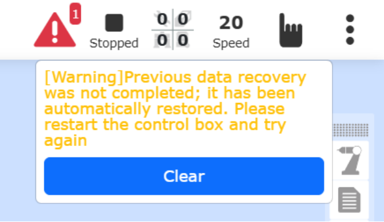

.. centered:: Abbildung 14.2‑4 Warnhinweis nach Stromausfall und Neustart

Versionkompatibilität des Sicherungspakets
~~~~~~~~~~~~~~~~~~~~~~~~~~~~~~~~~~~~~~~~~~~~~~~~~~~~~~~~~~~~~~~~~~~

Der Import und die Wiederherstellung von Daten aus Sicherungspaketen unterstützt derzeit Sicherungspakete, die mit Softwareversionen ≥ v3.8.3 erstellt wurden. Die Sicherungspakete der QX- und LA-Steuerungsserien sind universell einsetzbar.

10-Sekunden-Datenaufzeichnung
------------------------------

Klicken Sie im Menü "Hilfsanwendungen" -> "Werkzeuganwendungen" auf "10s Datenaufzeichnung", um die Oberfläche für die 10-Sekunden-Datenaufzeichnung aufzurufen.

Wählen Sie zuerst den Aufzeichnungstyp: Standardparameteraufzeichnung oder benutzerdefinierte Parameteraufzeichnung. Bei der Standardparameteraufzeichnung werden die Daten automatisch vom System festgelegt. Bei der benutzerdefinierten Parameteraufzeichnung kann der Benutzer die zu erfassenden Parameter selbst auswählen (maximal 15 Parameter). Nachdem Sie die Parameterliste ausgewählt haben, wählen Sie die zu erfassenden Parameter aus und klicken Sie auf die Schaltfläche "Nach rechts verschieben", um die Parameter in der Parameterliste zu konfigurieren. Klicken Sie auf "Aufzeichnung starten", um die Datenaufzeichnung des Roboters zu beginnen, auf "Aufzeichnung stoppen", um sie zu beenden, und auf "Daten herunterladen", um die Daten der letzten 10 Sekunden herunterzuladen.

.. image:: application/004.png
   :width: 4in
   :align: center

.. centered:: Abbildung 14.3‑1 10-Sekunden-Datenaufzeichnung

Endeffektor-LED
---------------

Klicken Sie im Menü "Hilfsanwendungen" -> "Werkzeuganwendungen" auf "Endeffektor-LED", um die Oberfläche zur Konfiguration der LED-Farbe des Endeffektors aufzurufen.

Die LED-Farbe kann auf Grün, Blau und Weiß-Blau konfiguriert werden. Der Benutzer kann die LED-Farben für den Automatikmodus, den Handmodus und den Drag-Modus nach Bedarf konfigurieren. Für verschiedene Modi kann nicht dieselbe Farbe konfiguriert werden.

.. image:: application/005.png
   :width: 4in
   :align: center

.. centered:: Abbildung 14.4‑1 Konfiguration der Endeffektor-LED

Drag-Sperre (Freiheitsgradsperre)
---------------------------------------------

Klicken Sie im Menü "Hilfsanwendungen" -> "Werkzeuganwendungen" auf "Drag-Sperre", um die Oberfläche zur Konfiguration der Freiheitsgradsperre für das Drag & Teach aufzurufen.

Für das Drag & Teach wurde eine Funktion zur Sperrung von Freiheitsgraden hinzugefügt. Wenn der Schalter für die Drag & Teach-Funktion auf "Aktiviert" gesetzt ist, werden die Parameter der einzelnen Freiheitsgrade wirksam, wenn der Benutzer den Roboter manuell führt. Wenn die Parameter beispielsweise auf X:10, Y:0, Z:10, RX:10, RY:10, RZ:10 gesetzt sind, kann der Roboter im Drag-Modus nur in Y-Richtung bewegt werden. Wenn die Pose des Roboters während des Ziehens unverändert bleiben soll und nur Bewegungen in X-, Y- und Z-Richtung erlaubt sein sollen, können X, Y, Z auf 0 und RX, RY, RZ auf 10 gesetzt werden.

.. image:: application/006.png
   :width: 4in
   :align: center

.. centered:: Abbildung 14.5‑1 Konfiguration der Drag & Teach-Sperre

Normale Auslösung des Kollisionsschutzes bei kraftunterstütztem Ziehen
~~~~~~~~~~~~~~~~~~~~~~~~~~~~~~~~~~~~~~~~~~~~~~~~~~~~~~~~~~~~~~~~~~~~~~~~~~

Übersicht
++++++++++++++++++++++

Derzeit können FR-Roboter beim kraftunterstützten Ziehen (mit Kraftsensor) keinen Kollisionsschutz auslösen. Diese Funktion wurde hinzugefügt, um die Sicherheit des Roboters zu erhöhen und Betriebsrisiken zu verringern.

Kollisionsschutz
++++++++++++++++++++++

**Schritt 1**: Klicken Sie auf "Hilfsanwendungen" -> "Werkzeuganwendungen" -> "Drag-Sperre", um die Konfigurationsoberfläche für die kraftunterstützte Sperre aufzurufen. Stellen Sie "Zustandsschalter" und "Kollisionserkennung" auf "Ein", wie in der folgenden Abbildung gezeigt.

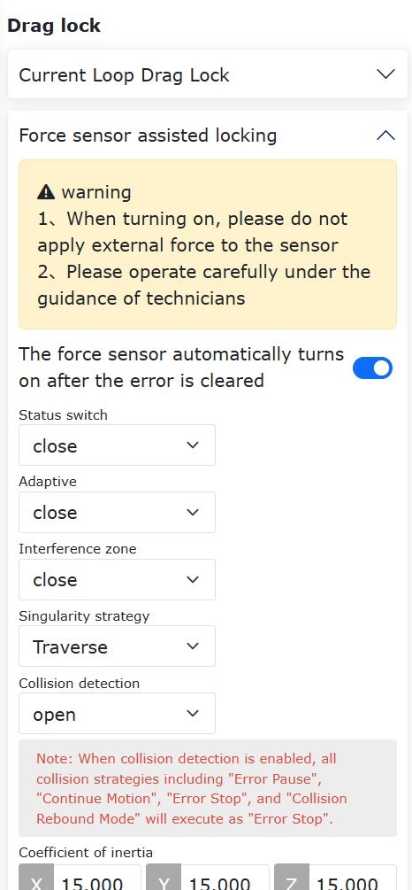

.. image:: application/008.png
   :width: 4in
   :align: center

.. centered:: Abbildung 14.5‑2 Konfiguration der kraftunterstützten Sperre

**Schritt 2**: Ziehen Sie den Roboter. Üben Sie während der Bewegung eine externe Kraft auf ein Gelenk aus, um den Kollisionsschutz auszulösen. Die Weboberfläche meldet den Fehler "Kollisionsfehler bei kraftunterstütztem Ziehen". Der kraftunterstützte Zugmodus kann über die Weboberfläche schnell wiederhergestellt oder deaktiviert werden, wie in der Abbildung gezeigt. Klicken Sie auf "Wiederherstellen", um die Fehlermeldung zu löschen und den kraftunterstützten Zugmodus wieder zu aktivieren. Klicken Sie auf "Deaktivieren", um die Fehlermeldung zu löschen und den kraftunterstützten Zugmodus deaktiviert zu lassen.

.. image:: application/009.png
   :width: 3in
   :align: center

.. centered:: Abbildung 14.5‑3 Kollisionsauslösung beim kraftunterstützten Ziehen

.. note::
   Beim kraftunterstützten Ziehen befindet sich der Roboter im Stillstand. Während des Ziehens kann es eine Differenz zwischen dem Drehmomentbefehl und der Rückmeldung geben. Es wird empfohlen, die Kollisionsstufe auf Stufe 7 oder höher einzustellen. Eine zu niedrig eingestellte Kollisionsstufe kann zu Fehlalarmen führen.

Parametrierung des Gelenkmomentsensors am Gesamtroboter
++++++++++++++++++++++++++++++++++++++++++++++++++++++++++++++++++++++++++++++

Übersicht
************************

Die Empfindlichkeit des Gelenkmomentsensors beschreibt das Verhältnis zwischen der Ausgangsspannung des Sensors und dem gemessenen tatsächlichen Gelenkmoment. Die Linearität misst, wie gut ein Regressionsmodell die beobachteten Daten beschreibt. Die Hysterese ist die maximale Differenz zwischen den Messwerten bei einer Vorwärts- (von klein nach groß) und Rückwärtsmessung (von groß nach klein) unter denselben Testbedingungen. Die Wiederholbarkeit ist das Verhältnis des aktuellen Testergebnisses zum vorherigen Testergebnis und dient zur Beurteilung der Wiederholgenauigkeit des Gelenkmomentsensors.
Die Parametrierungsmethode besteht darin, den Roboter eine vorgegebene Bahn abfahren zu lassen und durch Erfassung der Gelenk-Gravitationsmomente und der Rohdaten des Gelenkmomentsensors in verschiedenen Posen dessen Empfindlichkeit, Linearität, Hysterese und Wiederholgenauigkeit zu berechnen.

Parametrierung
********************************

**Schritt 1**: Stellen Sie das Werkzeugkoordinatensystem auf "Tool0". Klicken Sie auf "Hilfsanwendungen" -> "Werkzeuganwendungen" -> "Drag-Sperre". Aktivieren Sie im Modul für den Gelenkmomentsensor-Gesamtroboter-Zugmodus die Funktion.

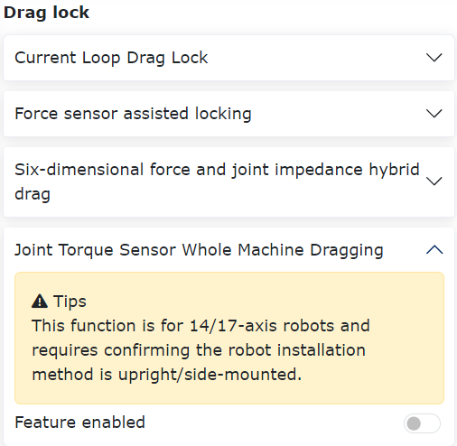

.. centered:: Abbildung 14.5‑4 Funktion aktivieren

**Schritt 2**: Klicken Sie nach der Aktivierung auf "Funktion aktivieren", um die Empfindlichkeitsparametrierung zu starten. Klicken Sie auf "Programm generieren", um das interne LUA-Skript an den Controller zu senden. Schalten Sie den Roboter in den Automatikmodus, stellen Sie die Laufgeschwindigkeit auf "10" ein und klicken Sie auf "Starten". Warten Sie, bis der Roboter die Bewegung abgeschlossen hat.

.. image:: application/038.png
   :width: 4in
   :align: center

.. centered:: Abbildung 14.5‑5 Empfindlichkeitsparametrierung

.. note:: Wenn die Empfindlichkeit des Gelenkmomentsensors bereits parametriert wurde, können Sie direkt mit der Einstellung der Zugfunktionsparameter fortfahren.

**Schritt 3**: Nachdem der Roboter die vorgegebene Bahn abgefahren hat, werden die Ergebnisse für Empfindlichkeit, Linearität, Hysterese und Wiederholbarkeit automatisch auf der Weboberfläche angezeigt. Klicken Sie auf "Einstellen", um sie zu übernehmen.

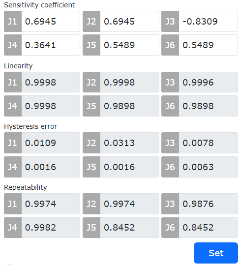

.. centered:: Abbildung 14.5‑6 Ergebnisse der Parametrierung

Kraftschätzung und Drehmomentkompensation basierend auf Momentum-Beobachter
+++++++++++++++++++++++++++++++++++++++++++++++++++++++++++++++++++++++++++++++++++++++

Übersicht
*****************************************

Nach Aktivierung der Drehmomentkompensationsfunktion wird das zum Ziehen erforderliche Drehmoment beim Bewegen des Roboters im Stromregelkreis reduziert, was das Zieherlebnis verbessert.

Ablauf
*****************************************

**Schritt 1**: Stellen Sie die Dynamikkonfiguration auf "Dynamik 2.0". Klicken Sie auf "Hilfsanwendungen" -> "Werkzeuganwendungen" -> "Drag-Sperre". Aktivieren Sie den Funktionsschalter im Modul "Drehmomentkompensation mit Dual-Encoder".

.. image:: application/040.png
   :width: 4in
   :align: center

.. centered:: Abbildung 14.5‑7 Funktion aktivieren

**Schritt 2**: Setzen Sie den "Funktionsschalter" auf "Ein" und stellen Sie den Zugverstärkungsfaktor für jede Achse auf 0,5. Klicken Sie auf "Einstellen", um die Einstellung zu übernehmen, wie in der Abbildung gezeigt.

.. image:: application/041.png
   :width: 4in
   :align: center

.. centered:: Abbildung 14.5‑8 Verstärkungseinstellung

.. note:: Der Einstellbereich für den Zugverstärkungsfaktor ist 0-1. Je größer der Faktor, desto größer das Kompensationsmoment und desto leichter lässt sich der Roboter im Stromregelkreis ziehen.

Optimierte Zugunterstützung basierend auf Gelenkmomentsensoren
+++++++++++++++++++++++++++++++++++++++++++++++++++++++++++++++++++++++++++++++++++++++

Übersicht
*********************************

Dieses Benutzerhandbuch beschreibt die Verwendung der optimierten Zugunterstützungsfunktion basierend auf Gelenkmomentsensoren. Es umfasst 3 Zugmodi, die im Vergleich zu herkömmlichen Drag & Teach-Methoden die Geschmeidigkeit des Ziehens verbessern und die zum Ziehen der einzelnen Gelenke erforderliche Kraft reduzieren.

Optimierte Zugunterstützungsfunktion basierend auf Gelenkmomentsensoren
**************************************************************************************

Nullpunkt- und Empfindlichkeitsparametrierung
""""""""""""""""""""""""""""""""""""""""""""""""""""""""""""""""""""""""

**Schritt 1**: Wenn die Nullpunkt- und Empfindlichkeitsparametrierung bereits durchgeführt wurden (die Anzeigeleuchte vor der Parametrierung ist grün), ist keine erneute Durchführung erforderlich. Nur wenn beim Ziehen ein Schwimmgefühl auftritt, kann die Nullpunktparametrierung wiederholt werden. Der Ablauf der Parametrierung ist unten beschrieben.

.. image:: application/042.png
   :width: 4in
   :align: center

.. centered:: Abbildung 14.5‑9 Anzeigeleuchtenstatus bei abgeschlossener Nullpunkt- und Empfindlichkeitsparametrierung des Gelenkmomentsensors

**Schritt 2**: Nullpunktparametrierung. Klicken Sie auf "Hilfsanwendungen" -> "Werkzeuganwendungen" -> "Drag-Sperre". Gehen Sie zum Modul "Gelenkmomentsensor-Gesamtroboter-Zugmodus". Klicken Sie bei der Nullpunktparametrierung auf die Schaltfläche "Parametrieren", um die Nullpunktdaten des Gelenkmomentsensors zu parametrieren. Wie in der folgenden Abbildung gezeigt, erscheint nach Abschluss der Parametrierung ein "√" und das Ergebnis der Nullpunktparametrierung wird aktualisiert.

.. image:: application/043.png
   :width: 4in
   :align: center

.. centered:: Abbildung 14.5‑10 Nullpunktparametrierung des Gelenkmomentsensors

**Schritt 3**: Empfindlichkeitsparametrierung (Hinweis: Es wird empfohlen, die Parametrierung nur mit dem Roboter selbst und ohne jegliche Last durchzuführen). Schalten Sie den Bewegungsmodus des Roboters in den "Automatikmodus" und stellen Sie die Laufgeschwindigkeit auf "10%". Klicken Sie bei der Empfindlichkeitsparametrierung auf die Schaltfläche "Parametrieren" und warten Sie, bis der Roboter die Bewegung abgeschlossen hat. Nachdem der Roboter die vorgegebene Bahn abgefahren hat, werden die Ergebnisse für den Empfindlichkeitsfaktor, die Linearität, die Hysterese und die Wiederholbarkeit automatisch auf der Weboberfläche angezeigt.

.. image:: application/044.png
   :width: 4in
   :align: center

.. centered:: Abbildung 14.5‑11 Empfindlichkeitsparametrierung des Gelenkmomentsensors

**Schritt 4**: Einstellung der Zugunterstützungsfunktion. Es gibt 3 Zugmodi. Die Einstellung kann nur unter der Voraussetzung einer abgeschlossenen "Nullpunktparametrierung" und "Empfindlichkeitsparametrierung" erfolgen. Wenn keine Einstellung vorgenommen wurde, ist standardmäßig "Modus 3" aktiv, d. h. nach abgeschlossener Parametrierung kann direkt im Drag-Modus mit Drag & Teach begonnen werden.

Zugunterstützungsfunktion - Modus 1
******************************************************************
**Schritt 1**: Wählen Sie als Zugmodus "Modus 1". Wenn der Bewegungsmodus des Roboters auf "Handmodus" eingestellt ist, stellen Sie die Gleitfenstergröße, den Verstärkungsfaktor und die Gelenkgeschwindigkeit ein und klicken Sie auf "Einstellen", um die Einstellung zu übernehmen. Drücken Sie dann den "Zugtaster" am Endeffektor oder wechseln Sie in den Drag-Modus, um mit Drag & Teach zu beginnen.

.. image:: application/045.png
   :width: 4in
   :align: center

.. centered:: Abbildung 14.5‑12 Modus 1: Parametereinstellung

.. note::
   (1) Der empfohlene Wert für das Gleitfenster ist 30, der Maximalwert ist 100.
   (2) Der Verstärkungsfaktor beeinflusst das Gefühl beim Ziehen. Je größer der Faktor, desto empfindlicher das Ziehen, aber es kann zu Instabilitäten kommen. Der empfohlene Wert für J1-J6 ist 0,5.
   (3) Die empfohlene Gelenkgeschwindigkeit ist 6°/s, um Überschwingen beim Anfahren von Punkten zu reduzieren.

Zugunterstützungsfunktion - Modus 2
******************************************************************

**Schritt 1**: Wählen Sie als Zugmodus "Modus 2". Wenn der Bewegungsmodus des Roboters auf "Handmodus" eingestellt ist, stellen Sie den Massenkoeffizienten, den Dämpfungskoeffizienten, den Steifigkeitskoeffizienten und die Kraftschwelle ein und klicken Sie auf "Einstellen", um die Einstellung zu übernehmen. Im Positionsmodus kann dann mit Drag & Teach begonnen werden.

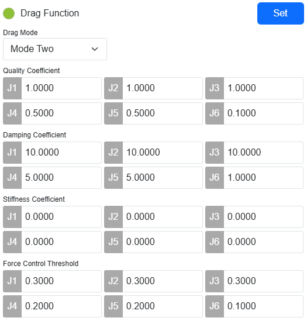

.. centered:: Abbildung 14.5‑13 Modus 2: Parametereinstellung

.. note::
   (1) Der Massenkoeffizient beeinflusst die Gelenkträgheitskraft beim Ziehen. Empfohlene Werte: J1-J3: 1,0, J4-J5: 0,5, J6: 0,1.
   (2) Der Dämpfungskoeffizient beeinflusst das Gefühl beim Ziehen. Je höher die Dämpfung, desto schwerer fühlt sich das Ziehen an. Empfohlene Werte: J1-J3: 10,0, J4-J5: 5,0, J6: 1,0.
   (3) Der Steifigkeitskoeffizient wird auf 0 gesetzt.
   (4) Die Kraftschwelle ist das zum Ziehen erforderliche Anlaufmoment. Empfohlene Werte: J1-J3: 0,3, J4-J5: 0,2, J6: 0,1.

Zugunterstützungsfunktion - Modus 3
******************************************************************

**Schritt 1**: Wählen Sie als Zugmodus "Modus 3". Wenn der Bewegungsmodus des Roboters auf "Handmodus" eingestellt ist, stellen Sie die Verstärkungsfaktoren für die einzelnen Gelenke ein und klicken Sie auf "Einstellen", um die Einstellung zu übernehmen. Drücken Sie dann den "Zugtaster" am Endeffektor oder wechseln Sie in den Drag-Modus, um mit Drag & Teach zu beginnen.

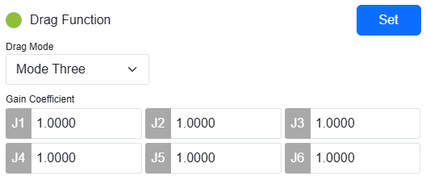

.. centered:: Abbildung 14.5‑14 Modus 3: Parametereinstellung

.. note::
   (1) Der Verstärkungsfaktor beeinflusst die zum Ziehen des Gelenks bei niedrigen Geschwindigkeiten erforderliche Kraft. Im Bereich von 0,1 bis 1,0 erhöht sich mit zunehmendem Faktor der Widerstand beim Ziehen mit niedriger Geschwindigkeit. Für präzises Anfahren von Punkten wird empfohlen, die Verstärkungsfaktoren für J1-J6 auf 1,0 zu setzen. Für leichtgängiges und geschmeidiges Ziehen des gesamten Roboters wird empfohlen, die Verstärkungsfaktoren für J1-J6 auf 0,3 zu setzen.

Schnittpunktgenerierung (Lasertracking-Punktbewegung)
------------------------------------------------------

Während des Schweißprozesses kann bei der Lasertracking-Punktbewegung eine Pose konfiguriert werden, sodass der Roboter beim Erreichen des Zielpunkts die gewünschte Pose einnimmt. Dies ermöglicht die einfache Handhabung spezieller Szenarien wie Kehlnähte und Fugennahtvorbereitung.

Ablauf der Lasertracking-Punktbewegungsfunktion
~~~~~~~~~~~~~~~~~~~~~~~~~~~~~~~~~~~~~~~~~~~~~~~~

**Schritt 1**: Bevor Sie den Lasersensor verwenden, legen Sie zuerst das Werkzeugkoordinatensystem "Schweißbrenner" als aktuelles Werkzeugkoordinatensystem fest. Öffnen Sie die Teach-Seite, klicken Sie nacheinander auf "Initiale Einstellungen", "Basis", "Werkzeugkoordinaten". Wählen Sie den Koordinatensystemnamen "Schweißbrenner" und übernehmen Sie ihn. Das Werkzeugkoordinatensystem in der Systemstatusleiste sollte nun Tool1 anzeigen.

.. figure:: application/010.png
   :align: center
   :width: 4in

.. centered:: Abbildung 14.6‑1 Anwenden des Schweißbrenner-Koordinatensystems

**Schritt 2**: Schreiben Sie ein LUA-Programm für die Lasertracking-Punktbewegung. Klicken Sie nacheinander auf "Teach-Programm" -> "Programmierung" -> "Schaltfläche Neu", um ein neues Benutzerprogramm "testPointRecord.lua" zu erstellen.

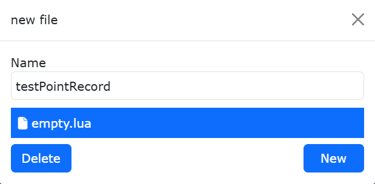

.. centered:: Abbildung 14.6‑2 Neues Programm für Lasertracking-Punktbewegung erstellen

**Schritt 3**: Konfigurieren Sie einen Referenzpose-Teachpunkt (optional). Bewegen Sie den Roboter im Handmodus manuell in die gewünschte Schweißpose. Klicken Sie auf der Teach-Seite nacheinander auf "Teachpunkt aufzeichnen", "Benannten Punkt speichern" und speichern Sie den Pose-Teachpunkt als "referencePoint".

.. figure:: application/012.png
   :align: center
   :width: 4in

.. centered:: Abbildung 14.6‑3 Speichern des Pose-Referenz-Teachpunkts

**Schritt 4**: Generieren Sie das Lasertracking-Punktbewegungsprogramm. Klicken Sie nacheinander auf "Teach-Programm" -> "Programmierung" -> "Schweißbefehle", "Lasertracking", scrollen Sie nach unten zum Abschnitt "Sensor-Punktbewegung". Wählen Sie die gewünschte "Bewegungsart", "Testgeschwindigkeit" und den Pose-Referenzpunkt aus. Das entsprechende Lasertracking-LUA-Programm wird generiert.

Wenn kein Pose-Referenzpunkt ausgewählt wird, wird standardmäßig die Pose während der Punkterfassung für die Bewegung verwendet. Wenn ein Pose-Referenzpunkt ausgewählt wird, wird der Roboter mit der Referenzpose zum Lasertracking-Punkt bewegt.

.. figure:: application/013.png
   :align: center
   :width: 6in

.. centered:: Abbildung 14.6‑4 Auswahl des Pose-Referenz-Teachpunkts

Ausführen der Lasertracking-Punktbewegung. Bewegen Sie den Roboter manuell so, dass der Laserstrahl des Sensors auf den zu teachnden Schweißpunkt zeigt. Der Lasersensor erfasst die Schweißnahtposition und nimmt den Punkt auf. Nach Ausführung der Lasertracking-Punktbewegung fährt der Schweißbrenner mit der Referenzpose zu dem vom Lasersensor gescannten Punkt.

.. figure:: application/014.png
   :align: center
   :width: 4in

.. centered:: Abbildung 14.6‑5 Laser erfasst Schweißnahtposition

.. figure:: application/015.png
   :align: center
   :width: 4in

.. centered:: Abbildung 14.6‑6 Schweißbrenner zeigt mit Referenzpose auf Schweißnahtposition

Berechnung von Schnittpunktkoordinaten aus drei und vier Messpunkten
~~~~~~~~~~~~~~~~~~~~~~~~~~~~~~~~~~~~~~~~~~~~~~~~~~~~~~~~~~~~~~~~~~~~~

Wenn die Position einer Kehlnaht nicht direkt angefahren werden kann, kann der kollaborative Roboter die Position der Kehlnaht berechnen, indem er die Ebenenpositionen auf beiden Seiten der Kehlnaht manuell anfährt oder durch Messung ermittelt und dann den Schnittpunkt der auf den beiden Ebenen erfassten Punkte berechnet, um die Position der Kehlnaht zu generieren.

Für rechtwinklige Schweißnähte kann die Methode mit drei Messpunkten zur Berechnung der Schnittpunktkoordinaten verwendet werden; für nicht rechtwinklige Schweißnähte wird die Methode mit vier Messpunkten verwendet.

Es werden zwei Möglichkeiten angeboten, die Schnittpunktkoordinaten zu erhalten: über Befehle und über LUA-Skripte. Dabei kann eine Referenzpose konfiguriert werden. Der Roboter kann den Schweißbrenner mit der Pose eines Referenz-Teachpunkts zum Schnittpunkt bewegen.

Schnittpunktberechnung über Befehle
+++++++++++++++++++++++++++++++++++

Berechnung des Schnittpunkts aus drei Punkten
*****************************************************

**Schritt 1**: Erfassen Sie drei Berührungspunkte auf den Ebenen und speichern Sie sie als Teachpunkte. Konfigurieren Sie einen Referenz-Teachpunkt.

.. figure:: application/016.png
   :align: center
   :width: 4in

.. centered:: Abbildung 14.6‑7 Auswahl von drei Messpunkten

Die erfassten Berührungspunkte umfassen drei Punkte, wobei zwei Punkte auf derselben Ebene und ein Punkt auf der senkrechten Ebene liegen.

.. note:: Wenn kein Pose-Referenzpunkt ausgewählt wird, stimmt die Pose des generierten Schnittpunkts standardmäßig mit Punkt P3 überein. Wenn ein Pose-Referenzpunkt ausgewählt wird, stimmt sie mit der Pose des Referenz-Teachpunkts überein.

**Schritt 2**: Klicken Sie auf der Teach-Seite nacheinander auf "Hilfsanwendungen", "Werkzeuganwendungen", "Schnittpunktgenerierung". Finden Sie das Funktionsmodul zur Berechnung von Schnittpunktkoordinaten aus drei und vier Punkten.

.. figure:: application/017.png
   :align: center
   :width: 4in

.. centered:: Abbildung 14.6‑8 Auswahl der Messpunkte für die Schnittpunktberechnung

**Schritt 3**: Wählen Sie im Dropdown-Menü "Drei-Punkt-Messung". Wählen Sie nacheinander die drei erfassten Berührungspunkte aus. Klicken Sie auf "Berechnen". Überprüfen Sie im 3D-Modell, ob die Anzeige des generierten Schnittpunkts korrekt ist. Benennen Sie den Schnittpunkt und speichern Sie ihn.

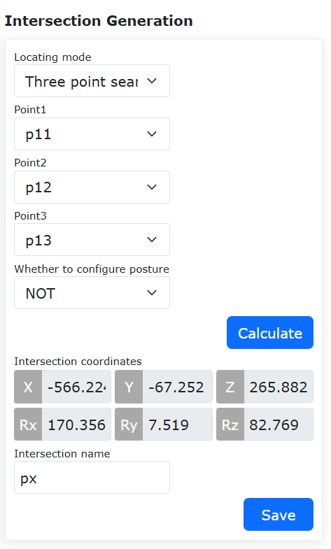

.. centered:: Abbildung 14.6‑9 Schnittpunktkoordinaten berechnen und speichern

**Schritt 4**: Speichern Sie den Teachpunkt. Jetzt kann eine Teach-Bewegung durchgeführt werden.

.. figure:: application/019.png
   :align: center
   :width: 6in

.. centered:: Abbildung 14.6‑10 Schnittpunktkoordinaten als Teachpunkt speichern

Berechnung des Schnittpunkts aus vier Punkten
*****************************************************

**Schritt 1**: Erfassen Sie vier Berührungspunkte auf den Ebenen und speichern Sie sie als Teachpunkte. Konfigurieren Sie einen Referenz-Teachpunkt.

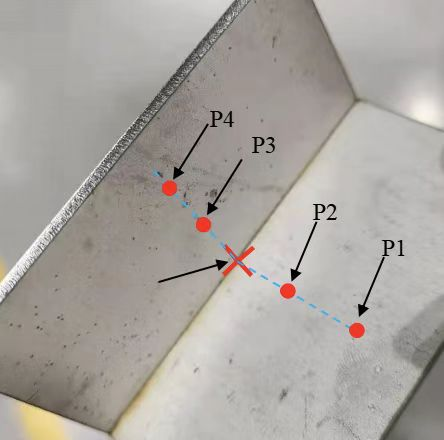

.. centered:: Abbildung 14.6‑11 Auswahl von vier Messpunkten

Die erfassten Berührungspunkte umfassen vier Punkte, wobei die ersten beiden Punkte auf derselben Ebene und die letzten beiden Punkte auf der senkrechten Ebene liegen.

.. note:: Wenn kein Pose-Referenzpunkt ausgewählt wird, stimmt die Pose des generierten Schnittpunkts standardmäßig mit Punkt P4 überein. Wenn ein Pose-Referenzpunkt ausgewählt wird, stimmt sie mit der Pose des Referenz-Teachpunkts überein.

**Schritt 2**: Klicken Sie auf der Teach-Seite nacheinander auf "Initiale Einstellungen", "Peripherie", "Tracking", "Sensor". Finden Sie das Funktionsmodul zur Berechnung von Schnittpunktkoordinaten aus drei und vier Punkten.

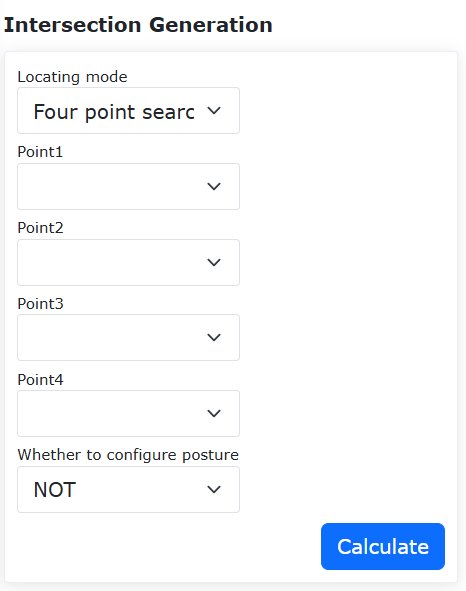

.. centered:: Abbildung 14.6‑12 Auswahl der Messpunkte und des Referenzpunkts für die Schnittpunktberechnung

**Schritt 3**: Wählen Sie im Dropdown-Menü "Vier-Punkt-Messung". Wählen Sie nacheinander die vier erfassten Berührungspunkte aus. Klicken Sie auf "Berechnen". Überprüfen Sie im 3D-Modell, ob die Anzeige des generierten Schnittpunkts korrekt ist. Benennen Sie den Schnittpunkt und speichern Sie ihn.

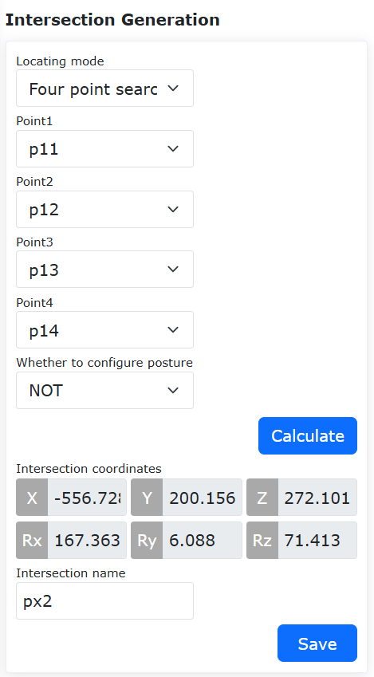

.. centered:: Abbildung 14.6‑13 Schnittpunktkoordinaten berechnen und speichern

**Schritt 4**: Speichern Sie den Teachpunkt. Jetzt kann eine Teach-Bewegung durchgeführt werden.

.. figure:: application/023.png
   :align: center
   :width: 6in

.. centered:: Abbildung 14.6‑14 Schnittpunktkoordinaten als Teachpunkt speichern

Schnittpunktberechnung und Messbewegung über LUA-Skript
++++++++++++++++++++++++++++++++++++++++++++++++++++++++

Berechnung des Schnittpunkts aus drei Punkten
*****************************************************

**Schritt 1**: Erfassen Sie drei Berührungspunkte auf den Ebenen und speichern Sie sie als Teachpunkte. Konfigurieren Sie einen Referenz-Teachpunkt.

.. figure:: application/016.png
   :align: center
   :width: 4in

.. centered:: Abbildung 14.6‑15 Auswahl von drei Messpunkten

Die erfassten Berührungspunkte umfassen drei Punkte, wobei zwei Punkte auf derselben Ebene und ein Punkt auf der senkrechten Ebene liegen.

.. note:: Wenn kein Pose-Referenzpunkt ausgewählt wird, stimmt die Pose des generierten Schnittpunkts standardmäßig mit Punkt P3 überein. Wenn ein Pose-Referenzpunkt ausgewählt wird, stimmt sie mit der Pose des Referenz-Teachpunkts überein.

**Schritt 2**: Schreiben Sie ein LUA-Programm für die Drei-Punkt-Schnittpunktberechnung und Messbewegung. Klicken Sie nacheinander auf "Teach-Programm" -> "Programmierung" -> "Schaltfläche Neu", um ein neues Benutzerprogramm "test3point.lua" zu erstellen.

.. figure:: application/024.png
   :align: center
   :width: 4in

.. centered:: Abbildung 14.6‑16 Neues Programm für Drei-Punkt-Schnittpunktberechnung und Messbewegung erstellen

**Schritt 3**: Generieren Sie das Programm für die Drei-Punkt-Schnittpunktberechnung und Messbewegung. Klicken Sie nacheinander auf "Teach-Programm" -> "Programmierung" -> "Schweißbefehle" -> "Lasertracking". Scrollen Sie nach unten zum Abschnitt "Messung und Schnittpunktberechnung". Wählen Sie die Methode "Drei-Punkt-Messung". Wählen Sie im Dropdown-Menü nacheinander die erfassten Berührungspunkte "Punkt 1", "Punkt 2", "Punkt 3" und den Pose-Referenzpunkt aus. Wählen Sie die gewünschte "Bewegungsart" und "Testgeschwindigkeit". Klicken Sie auf die Schaltflächen "Hinzufügen" und "Übernehmen", um das entsprechende Programm für die Drei-Punkt-Schnittpunktberechnung und Messbewegung zu generieren.

.. figure:: application/025.png
   :align: center
   :width: 4in

.. centered:: Abbildung 14.6‑17 Drei-Punkt-Schnittpunktberechnung und Messbewegung

**Schritt 4**: Klicken Sie im Automatikmodus auf die Schaltfläche "Starten". Der Roboter führt automatisch die Drei-Punkt-Schnittpunktberechnung durch und bewegt den Schweißbrenner mit der Referenzpose zum Schnittpunkt.

Berechnung des Schnittpunkts aus vier Punkten
*****************************************************

**Schritt 1**: Erfassen Sie vier Berührungspunkte auf den Ebenen und speichern Sie sie als Teachpunkte. Konfigurieren Sie einen Referenz-Teachpunkt.

.. centered:: Abbildung 14.6‑18 Auswahl von vier Messpunkten

Die erfassten Berührungspunkte umfassen vier Punkte, wobei zwei Punkte auf derselben Ebene und die letzten beiden Punkte auf der anderen Ebene liegen.

.. note:: Wenn kein Pose-Referenzpunkt ausgewählt wird, stimmt die Pose des generierten Schnittpunkts standardmäßig mit Punkt P4 überein. Wenn ein Pose-Referenzpunkt ausgewählt wird, stimmt sie mit der Pose des Referenz-Teachpunkts überein.

**Schritt 2**: Schreiben Sie ein LUA-Programm für die Vier-Punkt-Schnittpunktberechnung und Messbewegung. Klicken Sie nacheinander auf "Teach-Programm" -> "Programmierung" -> "Schaltfläche Neu", um ein neues Benutzerprogramm "test4point.lua" zu erstellen.

.. figure:: application/026.png
   :align: center
   :width: 4in

.. centered:: Abbildung 14.6‑19 Neues Programm für Vier-Punkt-Schnittpunktberechnung und Messbewegung erstellen

**Schritt 3**: Generieren Sie das Programm für die Vier-Punkt-Schnittpunktberechnung und Messbewegung. Klicken Sie nacheinander auf "Teach-Programm" -> "Programmierung" -> "Schweißbefehle" -> "Lasertracking". Scrollen Sie nach unten zum Abschnitt "Messung und Schnittpunktberechnung". Wählen Sie die Methode "Vier-Punkt-Messung". Wählen Sie im Dropdown-Menü nacheinander die erfassten Berührungspunkte "Punkt 1", "Punkt 2", "Punkt 3", "Punkt 4" und den Pose-Referenzpunkt aus. Wählen Sie die gewünschte "Bewegungsart" und "Testgeschwindigkeit". Klicken Sie auf die Schaltflächen "Hinzufügen" und "Übernehmen", um das entsprechende Programm für die Vier-Punkt-Schnittpunktberechnung und Messbewegung zu generieren.

.. figure:: application/027.png
   :align: center
   :width: 4in

.. centered:: Abbildung 14.6‑20 Vier-Punkt-Schnittpunktberechnung und Messbewegung

**Schritt 4**: Klicken Sie im Automatikmodus auf die Schaltfläche "Starten". Der Roboter führt automatisch die Vier-Punkt-Schnittpunktberechnung durch und bewegt den Schweißbrenner mit der Referenzpose zum Schnittpunkt.

Peripherieprotokolle
--------------------

Klicken Sie im Menü "Hilfsanwendungen" -> "Werkzeuganwendungen" auf "Peripherieprotokoll", um die Oberfläche zur Konfiguration von Peripherieprotokollen aufzurufen.

Diese Seite dient zur Konfiguration von Protokollen für Peripheriegeräte. Der Benutzer kann das Protokoll entsprechend dem aktuell verwendeten Peripheriegerät konfigurieren.

.. image:: application/028.png
   :width: 4in
   :align: center

.. centered:: Abbildung 14.7‑1 Konfiguration von Peripherieprotokollen

In der Programmerstellung wurde eine LUA-Schnittstelle zum Lesen und Schreiben von Registern basierend auf der Modbus-RTU-Kommunikation hinzugefügt. Die Eingangsregisteradresse ist 0x1000 mit 50 Registern, insgesamt 100 Bytes Dateninhalt; die Halteregisteradresse ist 0x2000 mit 50 Registern, insgesamt 100 Bytes Dateninhalt.

::

   ModbusRegRead(fun_code, reg_add, reg_num): Liest Register.

   fun_code: Funktionscode, 0x03 - Halteregister, 0x04 - Eingangsregister

   reg_add: Registeradresse

   reg_num: Anzahl der Register

::

   ModbusRegWrite(fun_code, reg_add, reg_num, reg_value): Schreibt Register.

   fun_code: Funktionscode, 0x06 - Einzelnes Register, 0x10 - Mehrere Register

   reg_add: Registeradresse

   reg_num: Anzahl der Register

   reg_value: Byte-Array

::

   ModbusRegGetData(reg_num): Ruft Registerdaten ab.

   reg_num: Anzahl der Register

   Rückgabewertbeschreibung:

   reg_value: Array-Variable

Beispiel für ein Programm-Screenshot:

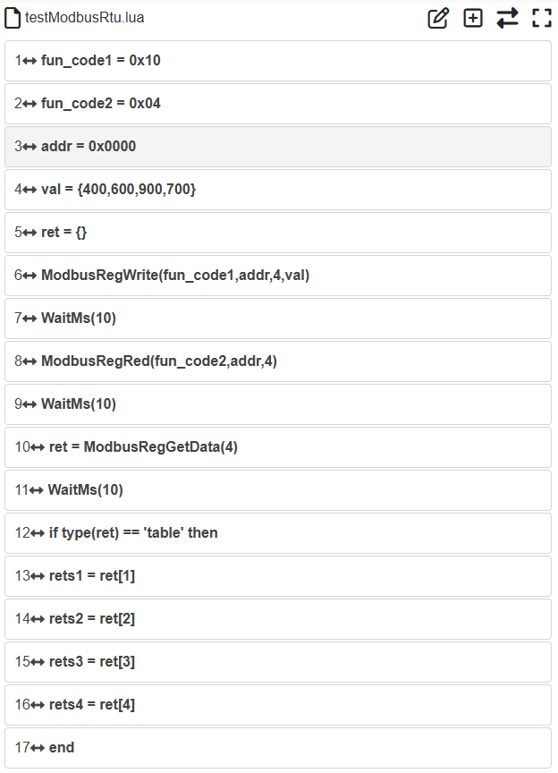

.. centered:: Abbildung 14.7‑2 Beispiel für ein LUA-Programm zur Modbus-RTU-Kommunikation

G-Code zu Roboterbahnplanungsfunktion
--------------------------------------------------------------------------------------------------------

Funktionsübersicht
~~~~~~~~~~~~~~~~~~~~~~~~~~~~~~~~~~~~~~~~~~~~~~~~~~~~~~~~~~~~~~~~~~

Die Funktion zur Konvertierung von G-Code, der von CAD-Software generiert wurde, in eine Roboterbahnplanung ermöglicht es, Pfade wie Linien, Bögen, Kreise und Splines, die in CAD-Software erstellt wurden, in G-Code-Dateien mit der Erweiterung ".gcode" zu exportieren. Der G-Code für Spline-Pfade besteht aus mehreren kleinen Linearcodeblöcken. Durch Importieren der generierten G-Code-Datei über das Web-Interface kann diese in eine LUA-Datei konvertiert werden.

Erläuterung der Funktion zur Konvertierung von G-Code in eine Roboterbahnplanung:

(1) Das Web-Interface kann nur G-Code-Dateien mit der Erweiterung ".gcode" importieren. Nach erfolgreicher Konvertierung wird eine LUA-Datei mit demselben Namen wie die G-Code-Datei generiert. Wenn bereits eine LUA-Datei mit demselben Namen existiert, schlägt die Konvertierung fehl.

(2) Derzeit können die G-Code-Befehle für schnelles Verfahren G0, lineare Interpolation G1, clockwise Kreisinterpolation G2 und counterclockwise Kreisinterpolation G3 konvertiert werden. Dabei entspricht G0 dem MoveJ-Befehl, G1 dem MoveL-Befehl, G2/G3 für Bögen dem MoveC-Befehl und G2/G3 für ganze Kreise dem Circle-Befehl.

(3) Derzeit können nur G-Codes für Bögen und Kreise in der XY-Ebene konvertiert werden.

(4) Das S in G-Code-Befehlen, das die Spindeldrehzahl angibt, entspricht der Geschwindigkeit im MoveJ-Befehl. Die Einheit der Spindeldrehzahl ist U/min, was mm/min Bewegungsgeschwindigkeit entspricht. Die Vorschubgeschwindigkeit F entspricht der Geschwindigkeit in MoveL-, MoveC- und Circle-Befehlen. Die Einheit der Vorschubgeschwindigkeit ist mm/min und entspricht damit der Einheit der Bewegungsgeschwindigkeit. Die Geschwindigkeitseinstellungen im G-Code dürfen die maximale Bewegungsgeschwindigkeit des Roboters nicht überschreiten.

(5) Wenn der Roboter die konvertierte LUA-Datei ausführt, muss der Geschwindigkeitsprozentsatz oben rechts auf der Weboberfläche auf 100 geändert werden.

Ablauf
~~~~~~~~~~~~~~~~~~~~~~~~~~~~~~~~~~~~~~~~~~~~~~~~~~~~~~~~~~~~~~~~~~

Die Berechnung der Roboterpose entlang des Arbeitspfades ist in der folgenden Abbildung dargestellt.

.. image:: application/030.png
   :width: 6in
   :align: center

.. centered:: Abbildung 14.8-1 Schematische Darstellung der Roboterposenberechnung

Dabei ist P-xyz die Pose des aufgezeichneten Referenzpose-Teachpunkts und O-xy das Koordinatensystem des CAD-Zeichnung. Die Pose des Roboters am Startpunkt A ist die Referenzpose. Basierend auf dem Winkel zwischen der Z-Achse der Referenzpose und der Ebene des CAD-Zeichnung sowie dem Winkel zwischen der Projektion der Z-Achse auf die CAD-Zeichnungsebene und der Tangente am Startpunkt des Pfades werden die Roboterposen am Zwischenpunkt B und Endpunkt C berechnet.

Der funktionale Ablauf ist wie folgt:

**Schritt 1**: Verwenden Sie eine CAD-Software mit CAM-Funktion, um den Bearbeitungspfad in eine G-Code-Datei zu konvertieren. Überprüfen Sie den Werkzeugpfad mit einem G-Code-Simulator, z. B. NC Viewer.

**Schritt 2**: Bevor Sie den G-Code in eine Roboterbahnplanung konvertieren, kalibrieren Sie zuerst das Werkzeugkoordinatensystem und das Werkstückkoordinatensystem. Beachten Sie, dass das Werkstückkoordinatensystem mit dem Maschinenkoordinatensystem in der CAD-Software übereinstimmen muss.

.. image:: application/031.png
   :width: 4in
   :align: center

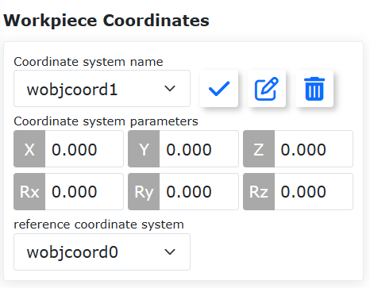

.. centered:: Abbildung 14.8-2 Oberfläche zur Kalibrierung von Werkzeug- und Werkstückkoordinatensystemen

**Schritt 3**: Zeichnen Sie im kalibrierten Werkzeug- und Werkstückkoordinatensystem einen Referenzpose-Teachpunkt auf. Die Pose des Roboters entlang des Arbeitspfades wird unter Verwendung der Pose dieses Referenzpunkts berechnet.

**Schritt 4**: Klicken Sie nacheinander auf "Hilfsanwendungen", "Werkzeuganwendungen", "G-Code Konvertierung", um die Oberfläche zur Konvertierung von G-Code-Dateien in Roboterbewegungs-LUA-Dateien aufzurufen.

.. image:: application/033.png
   :width: 6in
   :align: center

.. centered:: Abbildung 14.8-3 G-Code-Konvertierungsoberfläche

**Schritt 5**: Klicken Sie auf die Schaltfläche "Datei auswählen" und wählen Sie die zu konvertierende G-Code-Datei aus. Beachten Sie, dass die Dateierweiterung der G-Code-Datei ".gcode" sein muss. Wählen Sie als Referenzpose-Punkt den in Schritt 2 aufgezeichneten Referenzpose-Teachpunkt aus. Nach erfolgreicher Auswahl werden das Werkzeug- und Werkstückkoordinatensystem des ausgewählten Teachpunkts unten angezeigt. Klicken Sie abschließend auf die Schaltfläche "Konvertieren". Bei erfolgreicher Konvertierung erscheint ein Hinweis. Wenn bereits eine LUA-Datei mit demselben Namen wie die G-Code-Datei existiert, erscheint beim Klicken auf "Konvertieren" ein Hinweis, dass der Dateiname bereits existiert.

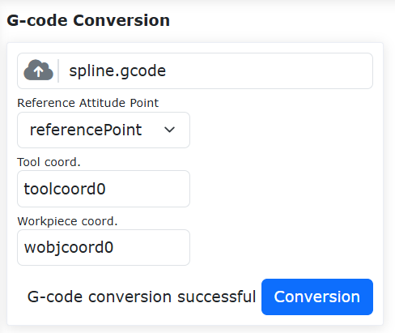

.. centered:: Abbildung 14.8-4 Erfolgreiche G-Code-Konvertierungsoberfläche

.. image:: application/035.png
   :width: 6in
   :align: center

.. centered:: Abbildung 14.8-5 Fehlgeschlagene G-Code-Konvertierungsoberfläche

**Schritt 6**: Klicken Sie auf "Teach-Programmierung" -> "Programmierung", um die nach der G-Code-Konvertierung generierte LUA-Datei zu öffnen. Schalten Sie den Roboter in den Automatikmodus und klicken Sie auf die Schaltfläche "Starten". Der Roboter wird dann den in der G-Code-Datei definierten Pfad reproduzieren.

.. image:: application/036.png
   :width: 6in
   :align: center

.. centered:: Abbildung 14.8-6 Öffnen der konvertierten LUA-Datei