Grundlagen
==========

.. toctree::
   :maxdepth: 6

Montage
-------

Einstellung und Darstellung der Roboter-Montageart
~~~~~~~~~~~~~~~~~~~~~~~~~~~~~~~~~~~~~~~~~~~~~~~~~~~

Klicken Sie auf der Web-Teaching-Seite auf "Initiale Einstellungen" -> "Grundlagen" -> "Montage". Die Seitenaufteilung ist wie folgt dargestellt. Die Erläuterungen im Einzelnen:

1. "Schnellmontage" dient den gängigen Montageeinstellungen des Roboterarms. Von links nach rechts entsprechen sie: Normale Montage, Seitenmontage und Überkopfmontage. Nach dem Anklicken der entsprechenden Schaltfläche werden die Neigungs- und Drehwinkel der Basis automatisch an die Schnittstelle übermittelt und geändert.
2. Entspricht die gewünschte Montageart nicht der Schnellmontage, kann sie durch manuelles Einstellen des Neigungs- und Drehwinkels der Basis konfiguriert werden.
3. Sowohl bei der Schnellmontage als auch bei der manuellen Einstellung muss nach der Konfiguration auf "Übernehmen" geklickt werden, damit die Änderungen wirksam werden.

.. note:: Stellen Sie sicher, dass die eingestellte Montageart mit der tatsächlichen mechanischen Montage des Roboters übereinstimmt, bevor Sie Ziehoperationen durchführen. Andernfalls bestehen Sicherheitsrisiken.

.. image:: teaching_pendant_software/026.png
   :width: 6in
   :align: center

.. centered:: Abbildung 6.1‑1 360-Grad freie Montage

.. important::
   Nach Abschluss der Roboter-Montage MUSS die Montageart korrekt eingestellt werden. Andernfalls sind die Ziehfunktion und die Kollisionserkennung des Roboters beeinträchtigt.

Koordinatensysteme
------------------

Werkzeugkoordinaten
~~~~~~~~~~~~~~~~~~~~

Klicken Sie im Menü "Initiale Einstellungen" -> "Grundlagen" auf "Werkzeugkoordinaten", um zur Seite für Werkzeugkoordinaten zu gelangen.

Hier können Werkzeugkoordinaten geändert, gelöscht, umbenannt und übernommen werden. Wählen Sie in der Dropdown-Liste das entsprechende Koordinatensystem aus. Darunter werden die entsprechenden Koordinatenwerte (der Koordinatensystemname kann benutzerdefiniert vergeben werden), der Werkzeugtyp und die Montageposition (nur bei Sensortyp-Werkzeugen angezeigt) dargestellt. Nach Auswahl eines Koordinatensystems klicken Sie auf "Übernehmen". Das aktuell verwendete Werkzeugkoordinatensystem wechselt dann zu dem ausgewählten, wie unten gezeigt.

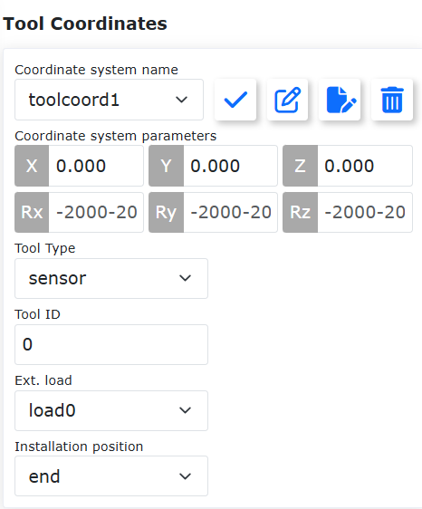

.. centered:: Abbildung 6.2‑1-1 Einstellung der Werkzeugkoordinaten

Klicken Sie auf die Schaltfläche "Umbenennen", um den Namen des Koordinatensystems zu ändern. Klicken Sie erneut darauf oder auf "Übernehmen", um die Änderung abzuschließen, siehe Abbildung unten.

.. image:: base/075.png
   :width: 4in
   :align: center

.. centered:: Abbildung 6.2‑1-2 Umbenennen des Koordinatensystems

Klicken Sie auf "Ändern", um das Werkzeugkoordinatensystem dieser Nummer gemäß den Anweisungen neu einzustellen. Die Kalibriermethoden für Werkzeuge sind die Vier-Punkt-Methode und die Sechs-Punkt-Methode. Die Vier-Punkt-Methode kalibriert nur das TCP (Tool Center Point), d. h. die Position des Werkzeugmittelpunkts. Seine Ausrichtung entspricht standardmäßig der des Endeffektors. Die Sechs-Punkt-Methode fügt zwei weitere Punkte hinzu, um auch die Ausrichtung des Werkzeugs zu kalibrieren. Wir verwenden hier die Sechs-Punkt-Methode als Beispiel.

.. image:: base/002.png
   :width: 4in
   :align: center

.. centered:: Abbildung 6.2‑2 Einstellung der Werkzeugkoordinaten

Wählen Sie einen festen Punkt im Raum des Roboters. Bewegen Sie das Werkzeug in drei verschiedenen Ausrichtungen zu diesem festen Punkt und setzen Sie nacheinander die Punkte 1-3, wie oben links in der Abbildung gezeigt. Bewegen Sie das Werkzeug senkrecht zu diesem festen Punkt, um Punkt 4 zu setzen, wie oben rechts in der Abbildung gezeigt. Bewegen Sie das Werkzeug unter Beibehaltung dieser Ausrichtung horizontal über eine bestimmte Strecke und setzen Sie Punkt 5. Diese Richtung ist die positive X-Achse des einzustellenden Werkzeugkoordinatensystems. Kehren Sie zum festen Punkt zurück, bewegen Sie das Werkzeug senkrecht nach oben über eine bestimmte Strecke und setzen Sie Punkt 6. Diese Richtung ist die positive Z-Achse des Werkzeugkoordinatensystems. Die positive Y-Richtung wird dann durch die Rechte-Hand-Regel bestimmt. Klicken Sie auf die Schaltfläche "Berechnen", um die Werkzeugpose zu berechnen. Wenn Sie die Einstellung wiederholen möchten, klicken Sie auf "Abbrechen", um die Schritte zur Neuerstellung des Werkzeugkoordinatensystems erneut zu durchlaufen.

.. image:: base/003.png
   :width: 3in
   :align: center

.. centered:: Abbildung 6.2‑3 Schematische Darstellung der Sechs-Punkt-Methode

Nach Abschluss der letzten Schritte klicken Sie auf "Fertigstellen", um zur Werkzeugkoordinaten-Oberfläche zurückzukehren. Klicken Sie auf "Speichern", um das soeben erstellte Werkzeugkoordinatensystem zu speichern.

.. important::
   1. Nach der Montage eines Werkzeugs am Endeffektor MUSS das Werkzeugkoordinatensystem kalibriert und angewendet werden. Andernfalls entsprechen Position und Ausrichtung des Werkzeugmittelpunkts bei der Ausführung von Bewegungsbefehlen nicht den Erwartungen.
   2. Für Werkzeugkoordinatensysteme werden in der Regel toolcoord1 bis toolcoord19 verwendet. Die Anwendung von toolcoord0 bedeutet, dass die TCP-Position im Zentrum des Endflansches liegt. Vor der Kalibrierung eines Werkzeugkoordinatensystems muss zunächst toolcoord0 angewendet werden, dann kann ein anderes Koordinatensystem für die Kalibrierung und Anwendung ausgewählt werden.

Externe Werkzeugkoordinaten
~~~~~~~~~~~~~~~~~~~~~~~~~~~~

Klicken Sie im Menü "Initiale Einstellungen" -> "Grundlagen" auf "Externe Werkzeugkoordinaten", um zur Oberfläche für externe Werkzeugkoordinaten zu gelangen.

In der Einstellungsoberfläche für externe Werkzeugkoordinaten können externe Werkzeugkoordinaten geändert, gelöscht und übernommen werden.

Die Dropdown-Liste für externe Werkzeugkoordinaten enthält 15 Nummern von etoolcoord0 bis etoolcoord14. Nach Auswahl des entsprechenden Koordinatensystems werden die entsprechenden Koordinatenwerte darunter angezeigt. Nach Auswahl eines Koordinatensystems klicken Sie auf "Übernehmen". Das aktuell verwendete Werkzeugkoordinatensystem wechselt dann zu dem ausgewählten, wie in der folgenden Abbildung gezeigt.

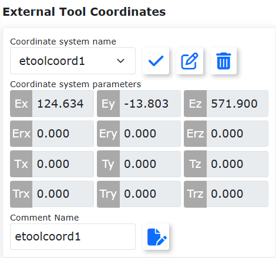

.. centered:: Abbildung 6.2‑4 Externe Werkzeugkoordinaten

Klicken Sie auf "Ändern", um das externe Werkzeugkoordinatensystem dieser Nummer gemäß den Anweisungen neu einzustellen, wie in der folgenden Abbildung gezeigt.

.. image:: base/005.png
   :width: 4in
   :align: center

.. centered:: Abbildung 6.2‑5 Schematische Darstellung der Sechs-Punkt-Methode

**1. Drei-Punkt-Methode zur Bestimmung des externen TCP**

- **Punkt 1 setzen**: Bewegen Sie das TCP des gemessenen Werkzeugs zum externen TCP und klicken Sie auf die Schaltfläche "Punkt 1 setzen".

- **Punkt 2 setzen**: Bewegen Sie sich von Punkt 1 aus entlang der X-Achse des externen TCF-Koordinatensystems über eine bestimmte Strecke und klicken Sie auf die Schaltfläche "Punkt 2 setzen".

- **Punkt 3 setzen**: Kehren Sie zu Punkt 1 zurück, bewegen Sie sich von Punkt 1 aus entlang der Z-Achse des externen TCF-Koordinatensystems über eine bestimmte Strecke und klicken Sie auf die Schaltfläche "Punkt 3 setzen".

- **Berechnen**: Klicken Sie auf die Schaltfläche "Berechnen", um das externe TCF zu erhalten.

**2. Sechs-Punkt-Methode zur Bestimmung des Werkzeug-TCF**

- **Punkte 1-4 setzen**: Wählen Sie einen festen Punkt im Raum des Roboters. Bewegen Sie das Werkzeug aus vier verschiedenen Winkeln zu diesem festen Punkt und setzen Sie nacheinander die Punkte 1-4.

- **Punkt 5 setzen**: Kehren Sie zum festen Punkt zurück, bewegen Sie sich entlang der X-Achse des Werkzeug-TCF über eine bestimmte Strecke und klicken Sie auf die Schaltfläche "Punkt 5 setzen".

- **Punkt 6 setzen**: Kehren Sie zum festen Punkt zurück, bewegen Sie sich entlang der Y-Achse des Werkzeug-TCF über eine bestimmte Strecke und klicken Sie auf die Schaltfläche "Punkt 6 setzen".

- **Berechnen**: Klicken Sie auf die Schaltfläche "Berechnen", um das Werkzeug-TCF zu erhalten.

Wenn Sie die Einstellung wiederholen möchten, klicken Sie auf "Abbrechen", um die Schritte zur Neuerstellung des externen Werkzeugkoordinatensystems erneut zu durchlaufen.

Nach Abschluss der letzten Schritte klicken Sie auf "Fertigstellen", um zur Werkzeugkoordinaten-Oberfläche zurückzukehren. Klicken Sie auf "Speichern", um das soeben erstellte externe Werkzeugkoordinatensystem zu speichern.

.. important::
   1. Bei Verwendung eines externen Werkzeugs MUSS das externe Werkzeugkoordinatensystem kalibriert und angewendet werden. Andernfalls entsprechen Position und Ausrichtung des Werkzeugmittelpunkts bei der Ausführung von Bewegungsbefehlen nicht den Erwartungen.
   2. Für externe Werkzeugkoordinatensysteme werden in der Regel etoolcoord1 bis etoolcoord14 verwendet. Die Anwendung von etoolcoord0 bedeutet, dass die TCP-Position des externen Werkzeugs im Zentrum des Endflansches liegt. Vor der Kalibrierung eines externen Werkzeugkoordinatensystems muss zunächst etoolcoord0 angewendet werden, dann kann ein anderes Koordinatensystem für die Kalibrierung ausgewählt werden.

Werkstückkoordinaten
~~~~~~~~~~~~~~~~~~~~~

Klicken Sie im Menü "Initiale Einstellungen" -> "Grundlagen" auf "Werkstückkoordinaten", um zur Seite für Werkstückkoordinaten zu gelangen. Hier können Werkstückkoordinaten geändert, gelöscht und übernommen werden. Die Dropdown-Liste für Werkstückkoordinatensysteme enthält 15 Nummern. Wählen Sie das entsprechende Koordinatensystem aus (wobjcoord0 ~ wobjcoord14). Darunter werden die entsprechenden Koordinatenwerte im Bereich "Koordinaten des Koordinatensystems" angezeigt. Nach Auswahl eines Koordinatensystems klicken Sie auf "Übernehmen". Das aktuell verwendete Werkstückkoordinatensystem wechselt dann zu dem ausgewählten, wie in der folgenden Abbildung gezeigt.

.. image:: base/006.png
   :width: 4in
   :align: center

.. centered:: Abbildung 6.2‑6 Einstellung der Werkstückkoordinaten

Werkstückkoordinatensysteme werden in der Regel auf Basis des Werkzeugs kalibriert. Die Erstellung eines Werkstückkoordinatensystems setzt ein bereits erstelltes Werkzeugkoordinatensystem voraus. Klicken Sie auf "Ändern", um das Werkstückkoordinatensystem dieser Nummer gemäß den Anweisungen neu einzustellen. Fixieren Sie das Werkstück und wählen Sie die Kalibriermethode "Ursprung-X-Achse-Z-Achse" oder "Ursprung-X-Achse-XY+Ebene". Die Auswahl der ersten beiden Punkte ist bei beiden Methoden gleich, der dritte Punkt unterscheidet sich. Bei der ersten Methode wird die Z-Richtung des Werkstückkoordinatensystems kalibriert, bei der zweiten Methode ein Punkt auf der XY+-Ebene. Kalibrieren Sie gemäß der Abbildung. Klicken Sie auf die Schaltfläche "Berechnen", um die Werkstückpose zu berechnen. Wenn Sie die Einstellung wiederholen möchten, klicken Sie auf "Abbrechen", um die Schritte zur Neuerstellung des Werkstückkoordinatensystems erneut zu durchlaufen.

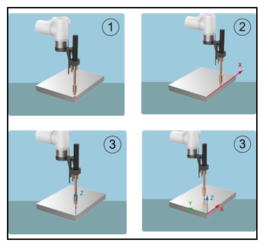

.. centered:: Abbildung 6.2‑7 Schematische Darstellung der Drei-Punkt-Methode

Nach Abschluss der letzten Schritte klicken Sie auf "Fertigstellen", um zur Werkstückkoordinaten-Oberfläche zurückzukehren. Klicken Sie auf "Speichern", um das soeben erstellte Werkstückkoordinatensystem zu speichern.

.. important::
   1. Werkstückkoordinatensysteme werden auf Basis des Werkzeugs kalibriert. Die Erstellung eines Werkstückkoordinatensystems setzt ein bereits erstelltes Werkzeugkoordinatensystem voraus.
   2. Für Werkstückkoordinatensysteme werden in der Regel wobjcoord1 bis wobjcoord14 verwendet. Die Anwendung von wobjcoord0 bedeutet, dass der Ursprung des Werkstückkoordinatensystems im Basiskoordinatenursprung liegt. Vor der Kalibrierung eines Werkstückkoordinatensystems muss zunächst wobjcoord0 angewendet werden, dann kann ein anderes Koordinatensystem für die Kalibrierung und Anwendung ausgewählt werden.

Last
----

Endeffektor
~~~~~~~~~~~

Klicken Sie im Menü "Initiale Einstellungen" -> "Grundlagen" -> "Last" auf "Bahnidentifikation", um zur Oberfläche für die Bahnidentifikation zu gelangen.

Geben Sie bei der Konfiguration der Endeffektorlast die Masse des verwendeten Endeffektorwerkzeugs und die entsprechenden Schwerpunktkoordinaten in die Eingabefelder "Lastmasse" und "Lastschwerpunktkoordinaten X, Y und Z" ein und übernehmen Sie diese.

.. important::
    Die Lastmasse darf den maximalen Lastbereich des Roboters nicht überschreiten. Informationen zum Lastbereich des jeweiligen Robotermodells finden Sie unter 2.1 Grundlegende Parameter. Der Einstellbereich für die Schwerpunktkoordinaten beträgt 0-1000 mm.

.. image:: base/016.png
   :width: 4in
   :align: center

.. centered:: Abbildung 6.3‑1 Schematische Darstellung der Lasteinstellung

.. important::
    Nach der Montage einer Last am Roboterende MÜSSEN die Masse der Endeffektorlast und die Schwerpunktkoordinaten korrekt eingestellt werden. Andernfalls sind die Ziehfunktion und die Kollisionserkennung des Roboters beeinträchtigt.

Wenn der Benutzer sich über die Werkzeugmasse oder den Schwerpunkt unsicher ist, kann er durch Klicken auf "Automatische Identifikation" die Lastidentifikationsfunktion zur Messung der Werkzeugdaten aufrufen.

Stellen Sie vor der Messung sicher, dass die Last montiert ist, und wählen Sie dann die Version aus. Klicken Sie auf die Schaltfläche "Werkzeugdaten messen", um die Oberfläche für den Lastbewegungstest aufzurufen.

.. image:: base/017.png
   :width: 4in
   :align: center

.. centered:: Abbildung 6.3‑2 Einstellung der Gelenke für die Lastidentifikation

Klicken Sie auf "Lastidentifikation starten", um den Test zu beginnen. Stoppen Sie die Bewegung im Notfall rechtzeitig.

.. image:: base/018.png
   :width: 4in
   :align: center

.. centered:: Abbildung 6.3‑3 Start der Lastidentifikation

Klicken Sie nach Bewegungsende auf die Schaltfläche "Identifikationsergebnis abrufen", um die berechneten Werkzeugdaten zu erhalten, die auf der Seite angezeigt werden. Wenn Sie sie auf die Lastdaten anwenden möchten, klicken Sie auf "Übernehmen".

.. image:: base/019.png
   :width: 4in
   :align: center

.. centered:: Abbildung 6.3‑4 Ergebnis der Lastidentifikation

Gelenke
-------

Software-Endschalter (Soft Limits)
~~~~~~~~~~~~~~~~~~~~~~~~~~~~~~~~~~

Klicken Sie im Menü "Initiale Einstellungen" -> "Grundlagen" -> "Gelenke" auf "Soft Limits", um zur Oberfläche für Software-Endschalter zu gelangen.

Im Arbeitsraum des Roboters können sich andere Geräte befinden. Über die Grenzwinkel können Software-Endschalter für den Roboter festgelegt werden, die verhindern, dass der Roboter bestimmte Koordinatenwerte überschreitet und kollidiert. Wenn ein Software-Endschalter ausgelöst wird, stoppt der Roboter automatisch. Es gibt keinen Stoppabstand.

Administratoren können entweder die Standardwerte verwenden oder selbst Winkelwerte eingeben. Durch Eingabe von Winkelwerten können die positiven und negativen Grenzwinkel der Robotergelenke einzeln begrenzt werden. Überschreitet der eingegebene Wert die in der Tabelle der grundlegenden Roboterparameter unter 2.1 aufgeführten Soft-Limit-Winkelwerte des Robotergelenks, wird der Grenzwinkel auf den maximal einstellbaren Wert angepasst. Wenn der Roboter einen Fehler wegen Überschreitung des Befehlsgrenzwerts meldet, muss in den Drag-Modus gewechselt und das Robotergelenk manuell innerhalb des Grenzwinkels bewegt werden. Die Oberfläche ist in der folgenden Abbildung dargestellt:

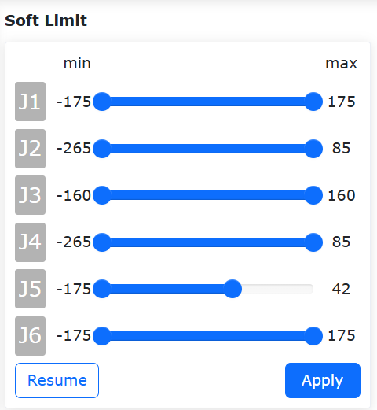

.. centered:: Abbildung 6.4‑1-1 Schematische Darstellung der Roboter-Gelenkbegrenzung

Schutz durch Software-Endschalter (Soft Limits)
++++++++++++++++++++++++++++++++++++++++++++++++

Übersicht
************************

Die Schutzfunktion durch Software-Endschalter ist ein aktiver Schutzmechanismus, der die Bewegung des Bedieners während des Drag & Teach dynamisch einschränkt, wenn dieser die eingestellten Soft Limits überschreitet, indem er den Bewegungszustand der Robotergelenke in Echtzeit überwacht. Diese Funktion macht die Soft Limits auch im Drag-Modus sinnvoll und erhöht so die Sicherheit der Mensch-Roboter-Kollaboration.

Schutz durch Software-Endschalter
*********************************

Für die Schutzfunktion durch Software-Endschalter muss sichergestellt sein, dass das Softwarepaket und die Firmware-Version zusammenpassen, um die beste Erfahrung zu erzielen.

Einstellung der Soft Limits und Aktivierung/Deaktivierung der Funktion
""""""""""""""""""""""""""""""""""""""""""""""""""""""""""""""""""""""

**Schritt 1**: Melden Sie sich an der Weboberfläche an und klicken Sie nacheinander auf "Initiale Einstellungen" -> "Grundlagen" -> "Gelenke" -> "Soft Limits", um zum Einstellmodul für die Software-Endschalter des Roboters zu gelangen.

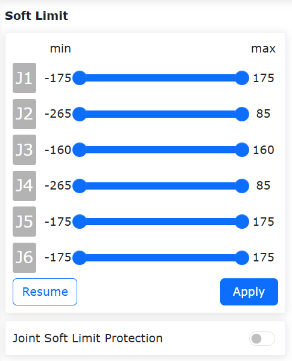

.. centered:: Abbildung 6.4‑1-2 Einstellmodul für die Software-Endschalter des Roboters

**Schritt 2**: Legen Sie basierend auf dem tatsächlichen Arbeitsbereich des Roboters angemessene Soft Limits für jedes Gelenk fest. Überprüfen Sie, ob die aktuellen Gelenkwinkelpositionen des Roboters innerhalb der voreingestellten Soft Limits liegen. Wenn ja, können Sie auf "Übernehmen" klicken, um die voreingestellten Soft Limits zu übernehmen. Wenn nicht, müssen Sie die Gelenke in den voreingestellten Bereich bewegen. Andernfalls wird beim Klicken auf "Übernehmen" eine Fehlermeldung wegen Überschreitung angezeigt (siehe Abbildung unten). In diesem Fall können Sie die betreffenden Gelenke durch Einzelachsansteuerung oder Ziehen in den Bereich der Soft Limits bewegen, um den Fehler zu beheben.

.. image:: base/057.png
   :width: 6in
   :align: center

.. centered:: Abbildung 6.4‑1-3 Fehlermeldung, wenn die tatsächlichen Gelenkwinkelpositionen die eingestellten Soft Limits überschreiten

**Schritt 3**: Nach erfolgreicher Einstellung der Soft Limits können Sie den Schieberegler "Schutz durch Software-Endschalter" aktivieren, um die Funktion zu starten (siehe Abbildung unten). Im Drag-Modus wirken die eingestellten Soft Limits nun einschränkend. Beim Ziehen in die Nähe der Soft Limits ist ein Widerstand spürbar.

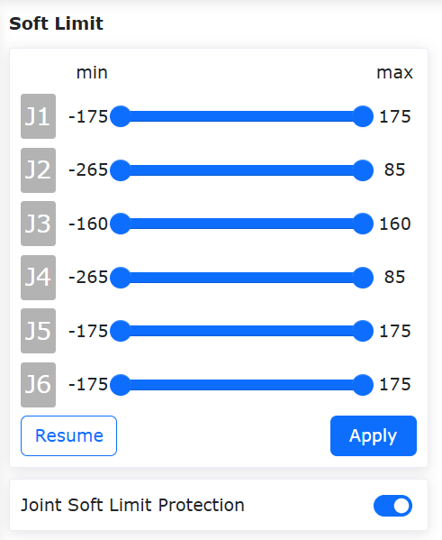

.. centered:: Abbildung 6.4‑1-4 Aktivierung der Schutzfunktion durch Software-Endschalter

**Schritt 4**: Um die Schutzfunktion durch Software-Endschalter zu deaktivieren, klicken Sie erneut auf den Schieberegler "Schutz durch Software-Endschalter".

Kollisionsstufe
~~~~~~~~~~~~~~~

Klicken Sie im Menü "Initiale Einstellungen" -> "Grundlagen" -> "Gelenke" auf "Kollisionsstufe", um zur Oberfläche für die Kollisionsstufe zu gelangen.

Die Kollisionsstufen sind in zehn Stufen unterteilt. Die Stufen eins bis drei sind sehr empfindlich. Der Roboter muss bei diesen Stufen mit der empfohlenen Geschwindigkeit betrieben werden. Es kann auch ein benutzerdefinierter Prozentsatz eingestellt werden; 100% entspricht dabei Stufe 10. Die Kollisionsstrategie legt das Verhalten des Roboters nach einer Kollision fest. Zur Auswahl stehen "Fehler Stopp" und "Bewegung fortsetzen". Der Benutzer kann dies je nach spezifischem Anwendungsbedarf einstellen. Siehe folgende Abbildung:

.. image:: base/021.png
   :width: 4in
   :align: center

.. centered:: Abbildung 6.4‑2 Schematische Darstellung der Kollisionsstufe

Reaktionsstrategien nach Kollision
++++++++++++++++++++++++++++++++++

Zu den bestehenden Kollisionsstrategien während der Bewegung wurden die Modi "Gravitationsmomentmodus" und "Schwingungsantwortmodus" hinzugefügt, um die Sicherheit der Mensch-Roboter-Kollaboration zu gewährleisten.

Bei Auslösung wechseln beide Strategien vom Automatik- oder Handmodus in den Drag-Modus. Der Gravitationsmomentmodus bewegt den Roboter basierend auf Größe und Richtung der Kollisionskraft vom Kollisionspunkt weg. Der Schwingungsantwortmodus hingegen kehrt nach dem Entfernen vom Kollisionspunkt wieder an die Kollisionsstelle zurück. Zusätzlich wurde eine Kollisionserkennung im Stillstand eingeführt.

Kollisionsstrategien
++++++++++++++++++++

Der FT_Guard-Befehl dient zur Implementierung einer kraftsensorbasierten Kollisionserkennung. Bisherige Kollisionsstrategien waren "Stopp bei Kollision", "Pause bei Kollision" und "Bewegung fortsetzen". Um Druckkräfte zwischen Roboter und Objekt nach einer Kollision zu vermeiden, wurden die Strategien "Gravitationsmomentmodus", "Schwingungsantwortmodus" und "Kollisionsrückprallmodus" hinzugefügt.

Bei Auslösung wechseln alle drei Strategien vom Automatik- oder Handmodus in den Drag-Modus und danach zurück in den Handmodus. Der Gravitationsmomentmodus bewegt den Roboter basierend auf Größe und Richtung der Kollisionskraft vom Kollisionspunkt weg. Der Schwingungsantwortmodus kehrt nach dem Entfernen vom Kollisionspunkt an die Kollisionsstelle zurück. Der Kollisionsrückprallmodus bewegt den Roboter gemäß den eingestellten Parametern beschleunigt vom Kollisionspunkt weg.

Gravitationsmomentmodus
***********************

Die Einstellschritte für den Gravitationsmomentmodus in der Kollisionsstrategie sind wie folgt:

**Schritt 1**: Klicken Sie im Menü "Initiale Einstellungen" -> "Grundlagen" -> "Gelenke" auf "Kollisionsstufe", um zur entsprechenden Oberfläche zu gelangen.

**Schritt 2**: Klicken Sie im Feld "Kollisionsstrategie" auf das Dropdown-Menü und wählen Sie "Gravitationsmomentmodus". Die Oberfläche ist in der folgenden Abbildung dargestellt. Klicken Sie dann auf die Schaltfläche "Übernehmen", um die Funktion zu aktivieren.

.. note:: Während des Roboterbetriebs wird die Verwendung dieser Strategie nicht empfohlen, wenn sich die Lastmasse stark ändert oder wenn die Betriebsgeschwindigkeit zu hoch ist.

.. image:: base/022.png
   :width: 4in
   :align: center

.. centered:: Abbildung 6.4-3 Kollisionsstrategie: Gravitationsmomentmodus

Schwingungsantwortmodus
***********************

Die Einstellschritte für den Schwingungsantwortmodus in der Kollisionsstrategie sind wie folgt:

**Schritt 1**: Klicken Sie im Menü "Initiale Einstellungen" -> "Grundlagen" -> "Gelenke" auf "Kollisionsstufe", um zur entsprechenden Oberfläche zu gelangen.

**Schritt 2**: Klicken Sie im Feld "Kollisionsstrategie" auf das Dropdown-Menü und wählen Sie "Schwingungsantwortmodus". Die Oberfläche ist in der folgenden Abbildung dargestellt. Klicken Sie dann auf die Schaltfläche "Übernehmen", um die Funktion zu aktivieren.

.. note:: Während des Roboterbetriebs wird die Verwendung dieser Strategie nicht empfohlen, wenn die Betriebsgeschwindigkeit zu hoch ist.

.. image:: base/023.png
   :width: 4in
   :align: center

.. centered:: Abbildung 6.4-4 Kollisionsstrategie: Schwingungsantwortmodus

Kollisionsrückprallmodus
************************

Die Einstellschritte für den Kollisionsrückprallmodus in der Kollisionsstrategie sind wie folgt:

**Schritt 1**: Klicken Sie im Menü "Roboter-Einstellungen" der "Initialen Einstellungen" auf "Kollisionsstufe", um zur entsprechenden Oberfläche zu gelangen.

**Schritt 2**: Klicken Sie im Feld "Kollisionsstrategie" auf das Dropdown-Menü und wählen Sie "Kollisionsrückprallmodus". Stellen Sie nacheinander die Sicherheitszeit auf 1000 ms, den Sicherheitsabstand auf 150 mm, die Sicherheitsgeschwindigkeit auf 150 mm/s und den Sicherheitsfaktor für jedes Gelenk auf 5 ein. Die spezifische Oberfläche ist in der folgenden Abbildung dargestellt.

.. image:: base/049.png
   :width: 4in
   :align: center

.. centered:: Abbildung 6.4-5 Kollisionsstrategie: Kollisionsrückprallmodus

Bedeutung der einzelnen Parameter:
   - Sicherheitszeit: Gibt die Dauer im Drag-Modus nach dem Wechsel vom Automatikmodus an. Bereich [1000-2000] ms.
   - Sicherheitsabstand: Gibt die Position an, um die sich der Roboter nach einer Kollision vom Kollisionspunkt entfernt. Bereich [150-200] mm.
   - Sicherheitsgeschwindigkeit: Gibt die maximale TCP-Geschwindigkeit an, mit der sich der Roboter nach einer Kollision vom Kollisionspunkt entfernt. Wird die Geschwindigkeitsbegrenzung überschritten, wird die Rückstoßkraft begrenzt. Bereich [50-250] mm/s.
   - Sicherheitsfaktor: Gibt die Abklinggeschwindigkeit der Rückstoßkraft an. Je kleiner der Faktor, desto schneller das Abklingen und desto höher die Rückprallgeschwindigkeit und umgekehrt. Bereich [1-10], dimensionslos.

FT_Guard-Befehl
***************

Der FT_Guard-Befehl dient zur Implementierung einer kraftsensorbasierten Kollisionserkennung. Wählen Sie zunächst die zu überwachende Richtung aus oder alle Richtungen. Erfassen Sie dann die aktuellen Kraftsensordaten als Anfangswert. Legen Sie schließlich einen maximalen und minimalen Schwellwert fest, um die Ober- und Untergrenze für die Kollisionskrafterkennung zu bestimmen. Damit ist die Einrichtung der Kollisionserkennungsfunktion abgeschlossen. Am Beispiel der Z-Konfiguration ist die detaillierte Einstellung in der folgenden Abbildung dargestellt.

.. image:: base/050.png
   :width: 6in
   :align: center

.. centered:: Abbildung 6.4-6 Parametereinstellung des FT_Guard-Befehls

Der FT_Guard-Befehl wird normalerweise zusammen mit Bewegungsbefehlen wie PTP oder Lin verwendet. Ein einfaches Beispiel ist in der Abbildung dargestellt.

.. image:: base/051.png
   :width: 5in
   :align: center

.. centered:: Abbildung 6.3-7 Beispiel für die Kombination von FT_Guard mit Bewegungsbefehlen

Die erste Zeile aktiviert die kraftsensorbasierte Kollisionserkennung, die letzte Zeile deaktiviert sie.

Kollisionserkennung im Stillstand
++++++++++++++++++++++++++++++++++

Die Einstellschritte für die Kollisionserkennung im Stillstand sind wie folgt:

**Schritt 1**: Klicken Sie im Menü "Initiale Einstellungen" -> "Grundlagen" -> "Gelenke" auf "Kollisionsstufe", um zur entsprechenden Oberfläche zu gelangen.

**Schritt 2**: Aktivieren Sie den Schalter für die Kollisionserkennung im Stillstand, wie in der folgenden Abbildung gezeigt. Wenn eine zu große Abweichung zwischen Gelenkmomentbefehl und -rückmeldung festgestellt wird, wechselt der Roboter in den Drag-Modus, um eine anhaltende Druckkraft zu vermeiden.

.. centered:: Abbildung 6.4-8 Kollisionserkennung im Stillstand

Momentenerkennung vor dem Ziehen
+++++++++++++++++++++++++++++++++

Übersicht
*********
Bevor der Roboter in den Drag-Modus wechselt, muss eine Momentenerkennung durchgeführt werden. Diese Funktion verhindert, dass der Roboter nach dem Wechsel in den Drag-Modus aufgrund falscher Lasteinstellungen oder einer falsch gewählten Montageart unerwartete Bewegungen wie Anheben oder Absinken ausführt. Wenn die Gelenkmomente den zulässigen Bereich überschreiten, meldet der Controller sofort einen Fehler und verhindert den Wechsel in den Drag-Modus.

Momentenerkennung vor dem Ziehen
*********************************

**Schritt 1**: Klicken Sie auf "Initiale Einstellungen" -> "Grundlagen" -> "Gelenke" -> "Kollisionsstufe", um zur Oberfläche für die Kollisionsstufeneinstellung zu gelangen. Aktivieren Sie die Funktion "Momentenerkennung vor dem Ziehen", wie in der Abbildung gezeigt.

.. image:: base/069.png
   :width: 4in
   :align: center

.. centered:: Abbildung 6.4-9 Aktivierung der Momentenerkennung vor dem Ziehen

**Schritt 2**: Wechseln Sie in den Drag-Modus. Dies kann über die Weboberfläche durch Klicken auf den Roboter-Drag-Status im Statusbereich, durch langes Drücken der Taste "Teach-Modus" am Bedienkasten oder durch langes Drücken der Zugtaste am Roboterende erfolgen. Wenn der Controller einen Fehler meldet und der Roboter nicht in den Drag-Modus wechselt (wie in Abbildung 2-2), überprüfen Sie, ob die Roboterlastkonfiguration und die Montageart korrekt sind.

.. image:: base/070.png
   :width: 4in
   :align: center

.. centered:: Abbildung 6.4-10 Momentenüberschreitung, Controller meldet Fehler

**Schritt 3**: Überprüfen Sie die Lastkonfiguration und die Montageart. Klicken Sie auf "Initiale Einstellungen" -> "Grundlagen" -> "Last" -> "Endeffektor" und prüfen Sie, ob die in der Weboberfläche konfigurierte Endeffektorlast mit der tatsächlich montierten Last übereinstimmt. Klicken Sie auf "Initiale Einstellungen" -> "Grundlagen" -> "Montage" -> "Freie Montage" und prüfen Sie, ob die in der Weboberfläche eingestellte Montageart mit der tatsächlichen Montageart übereinstimmt.

Fehlalarm-Erkennungsfunktion
+++++++++++++++++++++++++++++

Übersicht
*********

Die Kollisionsfunktionsoptimierung fügt auf Basis der Kollisionserkennung einen Fehlalarmschalter hinzu, der das Risiko von Fehlalarmen vermeiden kann.

Einstellung der Kollisionsstufe
********************************

**Schritt 1**: Melden Sie sich an der Weboberfläche an und klicken Sie nacheinander auf "Initiale Einstellungen" -> "Grundlagen" -> "Gelenke" -> "Kollisionsstufe", um zum Einstellmodul für die Kollisionsstufe zu gelangen.

Je höher die Kollisionsstufe, desto größer das für eine Kollision erforderliche Moment und desto unempfindlicher die Kollisionsreaktion. Die Momentwerte für die einzelnen Kollisionsstufen sind beispielhaft angegeben; 38,4 NM bei Stufe 10 ist das theoretische Moment, das für die Auslösung einer Kollision an Achse 1 erforderlich ist.

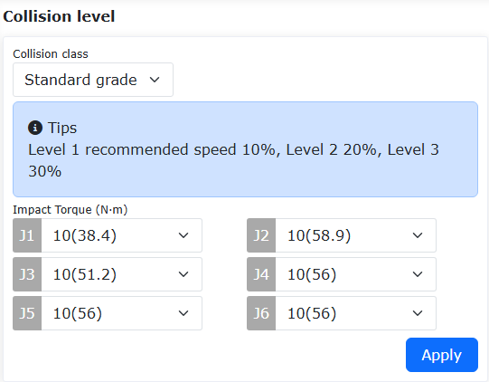

.. centered:: Abbildung 6.4-11 Einstellmodul für die Kollisionsstufe

**Schritt 2**: Der Schalter für die Fehlalarmerkennung ist standardmäßig aktiviert. Wenn Sie die Funktion nicht nutzen möchten, können Sie den Erkennungsschalter auf "Deaktiviert" setzen, wie in der folgenden Abbildung gezeigt.

.. image:: base/094.png
   :width: 4in
   :align: center

.. centered:: Abbildung 6.4-12 Fehlalarm-Erkennungsschalter

Reibungskompensation
~~~~~~~~~~~~~~~~~~~~

Klicken Sie im Menü "Initiale Einstellungen" -> "Grundlagen" -> "Gelenke" auf "Reibungskompensation", um zur Oberfläche für die Reibungskompensationseinstellung zu gelangen.

**Reibungskompensationsfaktor**: Die Reibungskompensation findet nur im Drag-Modus Anwendung. Der Reibungskompensationsfaktor kann im Bereich 0-1 eingestellt werden. Je höher der Wert, desto größer die kompensierte Kraft beim Ziehen. Der Reibungskompensationsfaktor muss je nach Montageart für jede Achse separat eingestellt werden.

**Reibungskompensationsschalter**: Der Benutzer kann die Reibungskompensation basierend auf dem tatsächlichen Roboter und seinen Nutzungsgewohnheiten ein- oder ausschalten.

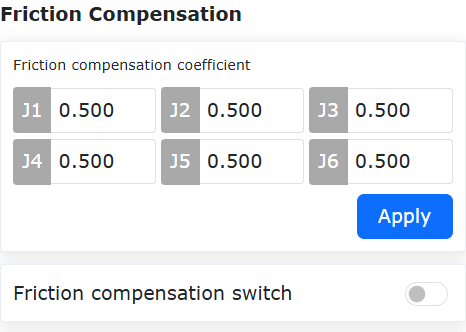

.. centered:: Abbildung 6.4-13 Reibungskompensationseinstellung

.. important::
    Die Reibungskompensationsfunktion des Roboters sollte mit Bedacht verwendet werden. Stellen Sie je nach tatsächlicher Situation einen angemessenen Kompensationsfaktor ein. Im Allgemeinen wird ein mittlerer Wert von etwa 0,5 empfohlen.

Funktion zur Anpassung des Reibungskompensationsfaktors
~~~~~~~~~~~~~~~~~~~~~~~~~~~~~~~~~~~~~~~~~~~~~~~~~~~~~~~

Übersicht
+++++++++
Die Funktion zur Anpassung des Reibungskompensationsfaktors dient hauptsächlich dazu, den Wert der Reibungskompensation innerhalb der Steuerung anzupassen.

Im Drag-Modus kann die Anpassung des Reibungskompensationsfaktors das Ziehen des Roboters erleichtern. Im Automatikmodus kann die Anpassung des Reibungskompensationsfaktors die Güte der Anpassung zwischen Drehmomentbefehl und Drehmomentrückmeldung verbessern.

Anpassung des Reibungskompensationsfaktors
++++++++++++++++++++++++++++++++++++++++++

Der Reibungskompensationsfaktor ist werkseitig auf 0,5 voreingestellt, ein allgemeiner Parameter. Benutzer können die Reibungsverstärkung je nach tatsächlicher Situation anpassen, um eine bessere Erfahrung zu erzielen.

Konfiguration des Reibungskompensationsfaktors
**************************************************

**Schritt 1**: Melden Sie sich an der Weboberfläche an und klicken Sie nacheinander auf "Initiale Einstellungen" -> "Grundlagen" -> "Gelenke" -> "Reibungskompensation", um zum Einstellmodul für die Reibungskompensation zu gelangen.

.. image:: base/092.png
   :width: 4in
   :align: center

.. centered:: Abbildung 6.4-14 Einstellmodul für die Reibungskompensation

**Schritt 2**: Der Reibungskompensationsfaktor ist standardmäßig auf 0,5 eingestellt, der Schalter für die Reibungskompensation ist wie in der Abbildung gezeigt aktiviert. Nach Aktivierung der Funktion fühlt sich das Ziehen geschmeidiger an als zuvor; ohne Aktivierung fühlt es sich schwerer an.

**Schritt 3**: Parametereinstellung: Der Bereich des Reibungskompensationsfaktors ist [0-1]. Wenn das Ziehen etwas schwer ist, können die Parameter der entsprechenden Achsen je nach tatsächlicher Situation erhöht werden. Wenn der Roboter während des Ziehens nicht anhält oder Gelenkschwingungen auftreten, müssen die Parameter der entsprechenden Achsen verringert werden.

**Schritt 4**: Um die Reibungskompensationsfunktion zu deaktivieren, stellen Sie den Kompensationsschalter auf "Deaktiviert".

Zugkraftkompensation
~~~~~~~~~~~~~~~~~~~~

Übersicht
+++++++++

Die Zugkraftoptimierung kompensiert basierend auf der aktuellen Stromregelkreisbewegung ein bestimmtes Moment entsprechend der Bewegungstendenz des Roboters. Dies dient dazu, Momente zu kompensieren, die durch ungenaue Modellierung verursacht werden, und so das Ziehen des Roboters geschmeidiger zu machen.

Roboter-Zugkraftoptimierung
+++++++++++++++++++++++++++

Für die Zugkraftoptimierungsfunktion muss sichergestellt sein, dass die Softwareversion und die Firmware-Version zusammenpassen, um eine gute Erfahrung zu erzielen.

Konfiguration der Zugkraftoptimierungsfunktion
************************************************
**Schritt 1**: Melden Sie sich an der Weboberfläche an und klicken Sie nacheinander auf "Initiale Einstellungen" -> "Grundlagen" -> "Gelenke" -> "Reibungskompensation", um zum Einstellmodul für die Zugkraftkompensation zu gelangen (siehe Abbildung).

.. image:: base/068.png
   :width: 4in
   :align: center

.. centered:: Abbildung 6.4-15 Einstellmodul für die Zugkraftkompensation

**Schritt 2**: Stellen Sie den Kompensationsschalter auf "Ein" und den Adaptionsschalter auf "Aus". Konfigurieren Sie die Parameter wie in der Abbildung gezeigt und klicken Sie auf "Übernehmen". Die Funktion ist damit erfolgreich aktiviert. Drücken Sie die Zugtaste, dann kann der Roboter gezogen werden. Das Ziehgefühl ist im Vergleich zu vor der Aktivierung der Funktion geschmeidiger.

**Schritt 3**: Parametereinstellung: Der Bereich des Kompensationsfaktors ist [0-1]. Wenn das Ziehen etwas schwer ist, können die Parameter der entsprechenden Achsen erhöht werden. Wenn der Roboter während des Ziehens nicht anhält oder Gelenkschwingungen auftreten, müssen die Parameter der entsprechenden Achsen verringert werden. Gleichzeitig tritt während des Ziehens ein Dämpfungsgefühl auf, das zur Verlangsamung dient und den Roboter zum Stillstand bringt.

**Schritt 4**: Um die Zugkraftkompensationsfunktion zu deaktivieren, stellen Sie den Kompensationsschalter auf "Deaktiviert".

I/O-Einstellungen
------------------

LUA-Programmpause
~~~~~~~~~~~~~~~~~

Während der Ausführung eines LUA-Programms kann durch Klicken auf die Schaltfläche "Pause/Fortsetzen" die Ausführung des LUA-Programms pausiert werden. Der Roboterstatus wechselt zu "Pause". Durch erneutes Klicken auf die Schaltfläche wird das Programm ab der pausierten Stelle fortgesetzt, und der Roboterstatus wechselt wieder zu "Running".

Alle gestarteten Hintergrundprogramme werden während der Pause ebenfalls pausiert und fortgesetzt. Unterschiedliche LUA-Befehlstypen verhalten sich während einer Pause unterschiedlich:

**① Bewegungsbefehle**: Bei einer Pause stoppt der Roboter sofort. Bei Fortsetzung setzt der Roboter die Bewegung fort und fährt das Ziel dieses Befehls an.

**② Logische Befehle wie SetDO, GetDI, GetInverseKinRef**: Wenn das Programm während der Ausführung eines solchen Befehls pausiert wird, wird der Befehl zu Ende ausgeführt. Dann wartet das LUA-Programm auf das Ende des Pausenzustands, bevor der nächste Befehl ausgeführt wird.

**③ Wartebefehle wie WaitDI, ModbusMasterWaitDI**: Wenn das Programm während des Wartens pausiert wird, wird die Wartezeit nicht auf die Zeitüberschreitung angerechnet.

**④ Schlafbefehle wie sleep_ms, WaitMs**: Wenn das Programm während des Schlafens pausiert wird, wird die Schlafzeit nicht auf die eingestellte Schlafdauer angerechnet.

.. image:: base/066.png
   :width: 4in
   :align: center

.. centered:: Abbildung 6.5‑1 LUA-Programm pausiert

.. image:: base/067.png
   :width: 4in
   :align: center

.. centered:: Abbildung 6.5‑2 LUA-Programm in Ausführung

I/O-Konfiguration
~~~~~~~~~~~~~~~~~

Klicken Sie im Menü "Initiale Einstellungen" -> "Grundlagen" -> "I/O Einstellungen" und dann auf die Untermenüs "DI" und "DO", um die DI- und DO-Konfigurationsoberflächen aufzurufen. Hier können die CI0-CI7 und CO0-CO7 des Steuerpults sowie die DI0 und DI1 des Endeffektors konfiguriert werden.

DI-Konfiguration
++++++++++++++++

Wenn in der Produktion ein kollaborativer Roboter mit Peripheriegeräten verbunden werden muss oder aufgrund eines Fehlers oder anderer Faktoren plötzlich anhält, kann ein DO-Signal ausgegeben werden, um einen akustischen und optischen Alarm auszulösen. Die konfigurierbaren Funktionen für die Eingänge sind in der folgenden Tabelle aufgeführt:

.. centered:: Tabelle 6.5‑1 Konfigurierbare Funktionen der Steuerpult-Eingänge

.. list-table::
   :widths: 15 30 100
   :header-rows: 1
   :align: center

   * - Funktionsnummer
     - Funktionsname
     - Funktionsbeschreibung
   * - 0
     - Keine
     - Keine
   * - 1
     - Lichtbogenzündung erfolgreich
     - Schweißgerät hat Lichtbogen erfolgreich gezündet, Roboter gibt Zündsignal an Schweißgerät aus.
   * - 2
     - Schweißbereitschaftssignal
     - Signal, dass der Roboter und das Schweißgerät bereit sind.
   * - 3
     - Förderbanderkennung
     - DI-Konfigurationssignal für den Förderband-Erkennungsschalter.
   * - 4
     - Pause
     - Signal zum Pausieren der Roboterbewegung während des Schweißens.
   * - 5
     - Fortsetzen
     - Wird der Schweißvorgang durch eine unbeabsichtigte Unterbrechung des Lichtbogens oder einen manuellen Pausenbefehl unterbrochen, kann durch ein externes Signal an den Roboter (Wechsel von inaktiv zu aktiv) die Schweißung automatisch an der unterbrochenen Stelle fortgesetzt werden.
   * - 6
     - Start
     - Wählen Sie in der DI-Konfiguration für einen konfigurierbaren Eingang "CIO" als "Start" und klicken Sie auf "Übernehmen". Wählen Sie als aktiven Zustand "High-Pegel aktiv". Wenn der CI0-Pegel von Low auf High wechselt, wird die "Start"-Funktion ausgelöst und das aktuell in der Teach-Programmoberfläche geöffnete Programm gestartet. Ist keine Oberfläche geöffnet, wird das zuletzt gespeicherte Programm ausgeführt. Wählen Sie "Low-Pegel aktiv", wird die "Start"-Funktion beim Wechsel von High auf Low ausgelöst.
   * - 7
     - Stopp
     - Signal zum Stoppen der Roboterbewegung während des Schweißens.
   * - 8
     - Pause/Fortsetzen
     - Zyklisches Signal zum Pausieren/Fortsetzen der Bewegung nach dem Start.
   * - 9
     - Start/Stopp
     - Zyklisches Signal zum Starten/Stoppen der Bewegung nach dem Start.
   * - 10
     - Fußtaster-Zugschalter
     - Bewegungssignal für den Fußtaster-Zugmodus.
   * - 11
     - Zum Arbeitsursprung fahren
     - Signal, den Roboter mit der aktuellen Pose als Arbeitsursprung zu diesem Ursprung zu fahren.
   * - 12
     - Hand/Auto Umschaltung (Impulssignal)
     - Wählen Sie in der DI-Konfiguration für einen konfigurierbaren Eingang "CIO" als "Hand/Auto Umschaltung (Impulssignal)" und klicken Sie auf "Übernehmen". Wählen Sie "High-Pegel aktiv", wird bei jedem Wechsel von Low auf High der Betriebsmodus umgeschaltet. Wählen Sie "Low-Pegel aktiv", wird bei jedem Wechsel von High auf Low umgeschaltet.
   * - 13
     - Schweißdraht-Positionssuche erfolgreich
     - Signal, dass die Schweißdraht-Positionssuche erfolgreich war.
   * - 14
     - Bewegungsunterbrechung
     - Signal für Unterbrechung des Roboter-Bewegungsprogramms.
   * - 15
     - Hauptprogramm starten
     - Signal zum Starten des Roboter-Hauptprogramms.
   * - 16
     - Rückwärtslauf starten
     - Signal zum Starten des Programm-Rückwärtslaufs.
   * - 17
     - Startbestätigung
     - Bestätigungssignal für den Programmstart.
   * - 18
     - Lasererkennungssignal X
     - X-Signal der Lasererkennung.
   * - 19
     - Lasererkennungssignal Y
     - Y-Signal der Lasererkennung.
   * - 20
     - Externer Not-Halt Eingang 1
     - Externer Not-Halt Eingang 1. ① Wird nur unter QX angezeigt. ② Unter LA kann die Konfiguration unter "Initiale Einstellungen" -> "Sicherheit" -> "I/O Sicherheit" -> "DIO Sicherheitsfunktionskonfiguration" erfolgen.
   * - 21
     - Externer Not-Halt Eingang 2
     - Externer Not-Halt Eingang 2. ① Wird nur unter QX angezeigt. ② Unter LA kann die Konfiguration unter "Initiale Einstellungen" -> "Sicherheit" -> "I/O Sicherheit" -> "DIO Sicherheitsfunktionskonfiguration" erfolgen.
   * - 22
     - Reduktionsmodus Stufe 1
     - Reduktionsmodus Stufe 1. ① Wird nur unter QX angezeigt. ② Unter LA kann die Konfiguration unter "Initiale Einstellungen" -> "Sicherheit" -> "I/O Sicherheit" -> "DIO Sicherheitsfunktionskonfiguration" erfolgen.
   * - 23
     - Reduktionsmodus Stufe 2
     - Reduktionsmodus Stufe 2. ① Wird nur unter QX angezeigt. ② Unter LA kann die Konfiguration unter "Initiale Einstellungen" -> "Sicherheit" -> "I/O Sicherheit" -> "DIO Sicherheitsfunktionskonfiguration" erfolgen.
   * - 24
     - Reduktionsmodus Stufe 3 (Stopp)
     - Reduktionsmodus Stufe 3 (Stopp). ① Wird nur unter QX angezeigt. ② Unter LA kann die Konfiguration unter "Initiale Einstellungen" -> "Sicherheit" -> "I/O Sicherheit" -> "DIO Sicherheitsfunktionskonfiguration" erfolgen.
   * - 25
     - Schweißen fortsetzen
     - Signal zum Fortsetzen des Schweißvorgangs nach einer Unterbrechung.
   * - 26
     - Schweißen beenden
     - Signal zum Beenden des Schweißvorgangs.
   * - 27
     - Assistiertes Ziehen einschalten
     - Signal zum Einschalten der kraftunterstützten Zugfunktion über Steuerpult-DI.
   * - 28
     - Assistiertes Ziehen ausschalten
     - Signal zum Ausschalten der kraftunterstützten Zugfunktion über Steuerpult-DI.
   * - 29
     - Assistiertes Ziehen ein/aus (zyklisch)
     - Signal zum zyklischen Ein-/Ausschalten der kraftunterstützten Zugfunktion über Steuerpult-DI.
   * - 30
     - Alle Fehler löschen
     - Signal zum Löschen aller ausgelösten Roboterfehler.
   * - 31
     - Hand/Auto Umschaltung (High/Low-Pegel)
     - Wählen Sie in der DI-Konfiguration für einen konfigurierbaren Eingang "CIO" als "Hand/Auto Umschaltung (High/Low-Pegel)" und klicken Sie auf "Übernehmen". Wählen Sie "High-Pegel aktiv", wechselt der Roboter bei High-Pegel in den Automatikmodus. Wählen Sie "Low-Pegel aktiv", wechselt er bei Low-Pegel in den Automatikmodus.
   * - 32
     - Aktivieren (Enable)
     - Steuert die Roboteraktivierung.
   * - 33
     - Deaktivieren (Disable)
     - Steuert die Roboterdeaktivierung.
   * - 34
     - Aktivieren/Deaktivieren (steigende/fallende Flanke)
     - Steigende und fallende Flanke des gültigen Eingangssignals lösen jeweils Aktivierung und Deaktivierung des Roboters aus.

Erweiterung der konfigurierbaren Funktionen für Endeffektor-DI
***************************************************************

Übersicht
"""""""""

Die Synchronisation aller Funktionen der Steuerpult-CI auf die Endeffektor-CI zielt darauf ab, ein Kontrollsystem mit logisch gleichwertigen, physisch komplementären Schnittstellen zu schaffen. Die beiden Schnittstellen sind logisch vollständig gleichwertig und können parallel oder selektiv genutzt werden, sodass das Robotersteuerungssystem den Signalpfad basierend auf Aufgabenszenario, physischem Gerätelayout und Zuverlässigkeitsanforderungen intelligent zuweisen kann.

Ablauf
"""""""

**Schritt 1**: Klicken Sie nacheinander auf "Initiale Einstellungen" -> "Grundlagen" -> "I/O Einstellungen" -> "DI", um zur DI-Konfigurationsoberfläche zu gelangen. Wählen Sie End DI0 und End DI1, um die Funktionen der Robotereingänge am Endeffektor zu konfigurieren.

.. image:: base/095.png
   :width: 4in
   :align: center

.. centered:: Abbildung 6.5‑3 Parametereinstellung der Endeffektor-DI

**Schritt 2**: Die vom Roboterende unterstützten DI-Signale sind in der folgenden Tabelle aufgeführt. Benutzer können die entsprechenden Signale entsprechend ihren tatsächlichen Nutzungsanforderungen konfigurieren.

.. centered:: Tabelle 6.5‑2 Konfigurierbare Funktionen der Endeffektor-Eingänge

.. list-table::
   :widths: 15 30 100
   :header-rows: 1
   :align: center

   * - Funktionsnummer
     - Funktionsname
     - Funktionsbeschreibung
   * - 0
     - Keine
     - Keine
   * - 1
     - Drag-Modus
     - Signal zum Aktivieren des Drag-Modus über Roboterende.
   * - 2
     - Teachpunkt aufzeichnen
     - Signal zum Aufzeichnen eines Teachpunkts über Roboterende. Speichert aktuelle Roboter-Positionsdaten.
   * - 3
     - Hand/Auto Umschaltung
     - Signal zum Umschalten zwischen Hand- und Automatikmodus.
   * - 4
     - TPD-Bahnaufzeichnung Start/Stopp
     - Signal zum Starten/Stoppen der Bahnaufzeichnung nach Beginn der TPD-Bewegung.
   * - 5
     - Pause
     - Signal zum Pausieren der Roboterbewegung.
   * - 6
     - Fortsetzen
     - Signal zum Fortsetzen der Roboterbewegung.
   * - 7
     - Start
     - Signal zum Starten des Roboterprogramms.
   * - 8
     - Stopp
     - Signal zum Stoppen des Roboterprogramms.
   * - 9
     - Pause/Fortsetzen (zyklisch)
     - Zyklisches Signal zum Pausieren/Fortsetzen der Bewegung nach dem Start.
   * - 10
     - Start/Stopp (zyklisch)
     - Zyklisches Signal zum Starten/Stoppen der Bewegung nach dem Start.
   * - 11
     - Assistiertes Ziehen einschalten
     - Signal zum Einschalten der kraftunterstützten Zugfunktion über Steuerpult-DI.
   * - 12
     - Assistiertes Ziehen ausschalten
     - Signal zum Ausschalten der kraftunterstützten Zugfunktion über Steuerpult-DI.
   * - 13
     - Assistiertes Ziehen ein/aus (zyklisch)
     - Signal zum zyklischen Ein-/Ausschalten der kraftunterstützten Zugfunktion über Steuerpult-DI.
   * - 14
     - Lasererkennungssignal X
     - X-Signal der Lasererkennung.
   * - 15
     - Lasererkennungssignal Y
     - Y-Signal der Lasererkennung.
   * - 16
     - Zum Arbeitsursprung fahren
     - Signal zum Bewegen des Roboters zum Arbeitsursprung.
   * - 17
     - Bewegungsunterbrechung
     - Signal für Unterbrechung des Roboter-Bewegungsprogramms.
   * - 18
     - Hauptprogramm starten
     - Signal zum Starten des Roboter-Hauptprogramms.
   * - 19
     - Rückwärtslauf starten
     - Signal zum Starten des Programm-Rückwärtslaufs.
   * - 20
     - Startbestätigung
     - Bestätigungssignal für den Programmstart.
   * - 21
     - Schweißen fortsetzen
     - Signal zum Fortsetzen des Schweißvorgangs nach einer Unterbrechung.
   * - 22
     - Schweißen beenden
     - Signal zum Beenden des Schweißvorgangs.
   * - 23
     - Fehlermeldungen löschen
     - Signal zum Löschen aller ausgelösten Roboterfehler.
   * - 24
     - Hand/Auto Umschaltung (High/Low-Pegel)
     - Bei Wahl von "High-Pegel aktiv": High-Pegel schaltet in Automatik; bei "Low-Pegel aktiv": Low-Pegel schaltet in Automatik.
   * - 25
     - Aktivieren (Enable)
     - Steuert die Roboteraktivierung.
   * - 26
     - Deaktivieren (Disable)
     - Steuert die Roboterdeaktivierung.
   * - 27
     - Aktivieren/Deaktivieren (steigende/fallende Flanke)
     - Steigende und fallende Flanke lösen jeweils Aktivierung und Deaktivierung aus.
   * - 28
     - Laser-Servo-Tracking Start/Stopp Signal
     - Wenn die Funktion "Laseraufzeichnung mit Tracking und IO-Start/Stopp" aktiviert ist, löst das entsprechende Endeffektor-CI-Signal den Start des Lasertrackings aus; das Entfernen des Signals beendet das Tracking.

Die Standardkonfiguration des Steuerpults: CO0 = 1 - Roboterfehler, CO1 = 2 - Roboter in Bewegung.

.. image:: base/026.png
   :width: 6in
   :align: center

.. centered:: Abbildung 6.5‑3 Steuerpult DI- und DO-Konfiguration

**Endeffektor-DI Standardkonfiguration**: DI0 = Drag & Teach, DI1 = Teachpunkt aufzeichnen.

.. image:: base/027.png
   :width: 4in
   :align: center

.. centered:: Abbildung 6.5‑4 Endeffektor-DI Konfiguration

Nach Abschluss der Konfiguration können die entsprechenden DO-Status auf der I/O-Seite des Steuerpults unter dem entsprechenden Zustand eingesehen werden.

.. important::
    Konfigurierte DI und DO dürfen nicht in der Programmierung verwendet werden.

**Reduktionsmodus-Konfiguration (Stufe 1, 2, 3)**: In den Reduktionsmodi Stufe 1 und 2 können Gelenkgeschwindigkeiten und TCP-Geschwindigkeit konfiguriert werden. Stufe 3 ist ein Stopp, hier muss keine Geschwindigkeit konfiguriert werden.

.. image:: base/032.png
   :width: 4in
   :align: center

.. image:: base/033.png
   :width: 4in
   :align: center

.. centered:: Abbildung 6.5‑5 Reduktionsmodus-Konfiguration

DO-Konfiguration
++++++++++++++++

Die konfigurierbaren Funktionen für die Ausgänge sind in der folgenden Tabelle aufgeführt:

.. centered:: Tabelle 6.5‑3 Konfigurierbare Funktionen der Steuerpult-Ausgänge

.. list-table::
   :widths: 15 30 100
   :header-rows: 1
   :align: center

   * - Funktionsnummer
     - Funktionsname
     - Funktionsbeschreibung
   * - 0
     - Keine
     - Keine
   * - 1
     - Fehler
     - DO gibt Fehlersignal aus.
   * - 2
     - Bewegung
     - Roboterbewegungssignal.
   * - 3
     - Sprühstart/Stopp
     - Signal zum Starten/Stoppen des Sprühvorgangs.
   * - 4
     - Sprühdüsenreinigung
     - Signal zur Sprühdüsenreinigung.
   * - 5
     - Lichtbogenzündung
     - DO-Ausgangsport des Roboters zur Steuerung der Lichtbogenzündung des Schweißgeräts. Wenn das Roboterprogramm den Lichtbogenzündbefehl ausführt, wird der entsprechende DO-Ausgangsport automatisch aktiv.
   * - 6
     - Gaszufuhr
     - DO-Ausgangsport des Roboters zur Steuerung der Gaszufuhr des Schweißgeräts. Wenn das Roboterprogramm den Gaszufuhrbefehl ausführt, wird der entsprechende DO-Ausgangsport automatisch aktiv.
   * - 7
     - Vorwärts Drahtvorschub
     - DO-Ausgangsport des Roboters zur Steuerung des Vorwärts-Drahtvorschubs des Schweißgeräts. Wenn das Roboterprogramm den Vorwärts-Drahtvorschubbefehl ausführt, wird der entsprechende DO-Ausgangsport automatisch aktiv.
   * - 8
     - Rückwärts Drahtvorschub
     - DO-Ausgangsport des Roboters zur Steuerung des Rückwärts-Drahtvorschubs des Schweißgeräts. Wenn das Roboterprogramm den Rückwärts-Drahtvorschubbefehl ausführt, wird der entsprechende DO-Ausgangsport automatisch aktiv.
   * - 9
     - JOB Eingang 1
     - Signal für JOB-Eingangsport 1.
   * - 10
     - JOB Eingang 2
     - Signal für JOB-Eingangsport 2.
   * - 11
     - JOB Eingang 3
     - Signal für JOB-Eingangsport 3.
   * - 12
     - Förderband Start/Stopp
     - Signal zum Starten/Stoppen der Förderbandbewegung.
   * - 13
     - Pause
     - Signal zum Pausieren der Roboterbewegung.
   * - 14
     - Arbeitsursprung erreicht
     - Signal, dass der Roboter den Arbeitsursprung erreicht hat.
   * - 15
     - Interferenzzone betreten
     - Signal, dass der Roboter die Interferenzzone betreten hat.
   * - 16
     - Schweißdraht-Positionssuche Start/Stopp
     - Signal zum Starten/Stoppen der Schweißdraht-Positionssuche.
   * - 17
     - Roboterstart abgeschlossen
     - Signal, dass der Roboterstart abgeschlossen ist.
   * - 18
     - Programm Start/Stopp
     - Signal zum Starten/Stoppen des Roboter-Bewegungsprogramms.
   * - 19
     - Auto/Hand Modus
     - Signal für den Wechsel zwischen Auto- und Handmodus.
   * - 20
     - Not-Halt Ausgangssignal 1
     - Not-Halt Ausgangssignal 1. ① Wird nur unter QX angezeigt. ② Unter LA kann die Konfiguration unter "Initiale Einstellungen" -> "Sicherheit" -> "I/O Sicherheit" -> "DIO Sicherheitsfunktionskonfiguration" erfolgen.
   * - 21
     - Not-Halt Ausgangssignal 2
     - Not-Halt Ausgangssignal 2. ① Wird nur unter QX angezeigt. ② Unter LA kann die Konfiguration unter "Initiale Einstellungen" -> "Sicherheit" -> "I/O Sicherheit" -> "DIO Sicherheitsfunktionskonfiguration" erfolgen.
   * - 22
     - LUA-Skript Programm läuft/gestoppt
     - Signal für Lauf/Stopp des LUA-Skriptprogramms.
   * - 23
     - Sicherheitsstatusausgang
     - Sicherheitsstatusausgang. ① Wird nur unter QX angezeigt. ② Unter LA kann die Konfiguration unter "Initiale Einstellungen" -> "Sicherheit" -> "I/O Sicherheit" -> "DIO Sicherheitsfunktionskonfiguration" erfolgen.
   * - 24
     - Schützender Stopp Statusausgang
     - Statusausgang für schützenden Stopp. ① Wird nur unter QX angezeigt. ② Unter LA kann die Konfiguration unter "Initiale Einstellungen" -> "Sicherheit" -> "I/O Sicherheit" -> "DIO Sicherheitsfunktionskonfiguration" erfolgen.
   * - 25
     - Roboter in Bewegung
     - Statussignal für Roboter in Bewegung. ① Wird nur unter QX angezeigt. ② Unter LA kann die Konfiguration unter "Initiale Einstellungen" -> "Sicherheit" -> "I/O Sicherheit" -> "DIO Sicherheitsfunktionskonfiguration" erfolgen.
   * - 26
     - Roboter Reduktionsmodus
     - Signal für Reduktionsmodus. ① Wird nur unter QX angezeigt. ② Unter LA kann die Konfiguration unter "Initiale Einstellungen" -> "Sicherheit" -> "I/O Sicherheit" -> "DIO Sicherheitsfunktionskonfiguration" erfolgen.
   * - 27
     - Roboter Nicht-Reduktionsmodus
     - Signal für Nicht-Reduktionsmodus. ① Wird nur unter QX angezeigt. ② Unter LA kann die Konfiguration unter "Initiale Einstellungen" -> "Sicherheit" -> "I/O Sicherheit" -> "DIO Sicherheitsfunktionskonfiguration" erfolgen.
   * - 28
     - Reserviert
     - Reserviert.
   * - 29
     - Befehlspunktfehler
     - Signal für Gelenk-Befehlspunktfehler.
   * - 30
     - Antriebsfehler
     - Signal für Antriebsfehler.
   * - 31
     - Fehler Soft-Limit-Überschreitung
     - Signal für Überschreitung der Software-Endschalter. Anpassung der entsprechenden Gelenk-Soft-Limits erforderlich.
   * - 32
     - Kollisionsfehler
     - Signal für Roboter-Kollisionsfehler.
   * - 33
     - Fehler Anzahl aktiver Slaves
     - Fehlersignal für falsche Anzahl aktiver Slaves.
   * - 34
     - Slave-Fehler
     - Fehlersignal für Slave-Anomalie.
   * - 35
     - I/O-Fehler
     - I/O-Fehlersignal.
   * - 36
     - Greiferfehler
     - Fehlersignal für Greiferkonfiguration.
   * - 37
     - Dateifehler
     - Fehlersignal für Konfigurationsdatei-Ladefehler.
   * - 38
     - Singuläre Pose Fehler
     - Fehlersignal, wenn der Roboter während der Bewegung eine singuläre Pose erreicht.
   * - 39
     - Antriebskommunikationsfehler
     - Fehlersignal für Roboterantriebskommunikationsfehler.
   * - 40
     - Parameterfehler
     - Fehler im DO-Pegelbereich.
   * - 41
     - Externe Achse Soft-Limit-Überschreitung Fehler
     - Fehlersignal für Soft-Limit-Überschreitung an externen Achsen 1-4.
   * - 42
     - Planungs- und Zeitüberschreitungswarnung
     - Warnstatus für Planung und Zeitüberschreitung.
   * - 43
     - Sicherheitstür Warnung
     - Auslösestatus der Sicherheitstür.
   * - 44
     - Bewegungswarnung
     - Bewegungswarnstatus.
   * - 45
     - Interferenzzonen-Warnung
     - Warnstatus für Betreten der Interferenzzone.
   * - 46
     - Sicherheitswand-Warnung
     - Warnstatus für Betreten des Sicherheitswandbereichs.
   * - 47
     - Roboter aktiviert (Enable)
     - Status der Roboteraktivierung.

Konfigurierbare High/Low-Pegel-Ausgänge des Steuerpults
~~~~~~~~~~~~~~~~~~~~~~~~~~~~~~~~~~~~~~~~~~~~~~~~~~~~~~~~

Übersicht
+++++++++

Vom Einschalten des Steuerpults bis zur Aktivierung des Roboters können die DO je nach spezifischem Anwendungsszenario auf den gewünschten Ausgangszustand konfiguriert werden. Dies ermöglicht eine flexiblere und bequemere Nutzung.

Vorgehen
+++++++++

Gehen Sie zu "Initiale Einstellungen" -> "Grundlagen" -> "I/O Einstellungen" -> "DO" und konfigurieren Sie den gewünschten High/Low-Pegel für die Steuerpult-DO während der Einschaltphase.

.. image:: base/055.png
   :width: 4in
   :align: center

.. centered:: Abbildung 6.5‑6 Konfiguration der Steuerpult-DO während der Einschaltphase

I/O-Alias-Konfiguration
~~~~~~~~~~~~~~~~~~~~~~~

Klicken Sie auf das Menü "Initiale Einstellungen" -> "Grundlagen" -> "I/O Einstellungen" und dann auf das Untermenü "Alias", um die Konfigurationsoberfläche aufzurufen. Vergeben Sie hier je nach tatsächlichem Anwendungsszenario aussagekräftige Namen (Aliase) für die Steuerpult- und Endeffektor-IO-Signale. Nach erfolgreicher Konfiguration werden in den Modulen, die IO-Signale betreffen, die entsprechenden Aliase angezeigt. Betroffene Module:

.. image:: base/028.png
   :width: 4in
   :align: center

.. centered:: Abbildung 6.5‑7 IO-Alias-Konfiguration

I/O-Filterung
~~~~~~~~~~~~~~

Klicken Sie auf das Menü "Initiale Einstellungen" -> "Grundlagen" -> "I/O Einstellungen" und dann auf das Untermenü "Filter", um die Oberfläche zur Einstellung der I/O-Filterzeiten aufzurufen. Diese umfasst:

- Steuerpult DI Filterzeit
- Endeffektorplatine DI Filterzeit
- Steuerpult AI0 Filterzeit
- Steuerpult AI1 Filterzeit
- Endeffektorplatine AI0 Filterzeit
- Bedienkasten DI Filterzeit
- Erweiterungs-DI Filterzeit
- Erweiterungs-AI0 Filterzeit
- Erweiterungs-AI1 Filterzeit
- Erweiterungs-AI2 Filterzeit
- Erweiterungs-AI3 Filterzeit
- Smart DI Filterzeit

Benutzer können alle Filterparameterwerte einsehen und die entsprechenden Parameter entsprechend ihren Anforderungen einstellen. Wählen Sie den entsprechenden Parameter aus und geben Sie den gewünschten Wert ein. Siehe folgende Abbildung:

.. image:: base/029.png
   :width: 4in
   :align: center

.. image:: base/076.png
   :width: 4in
   :align: center

.. centered:: Abbildung 6.5‑8 Filteroberfläche

.. important::
   Der Bereich für die I/O-Filterzeit ist [0~200] ms.

Ausgangs-Reset-Konfiguration
~~~~~~~~~~~~~~~~~~~~~~~~~~~~~

Klicken Sie auf das Menü "Initiale Einstellungen" -> "Grundlagen" -> "I/O Einstellungen" und dann auf das Untermenü "Ausgangs-Reset", um die Konfigurationsoberfläche aufzurufen. Konfigurieren Sie hier je nach Bedarf, ob verschiedene Ausgänge nach einem Stopp/Pause zurückgesetzt werden sollen oder nicht. Derzeit umfasst dies:

- Steuerpult DO
- Steuerpult AO
- Endeffektorplatine DO
- Endeffektorplatine AO
- Erweiterungs-DO
- Erweiterungs-AO
- SmartTool DO

.. image:: base/030.png
   :width: 4in
   :align: center

.. centered:: Abbildung 6.5‑9 Ausgangs-Reset-Konfiguration

Konfigurierbare DO-Reset-Zustände nach Pause/Fortsetzen
~~~~~~~~~~~~~~~~~~~~~~~~~~~~~~~~~~~~~~~~~~~~~~~~~~~~~~~~~~~~~~~~~~~~~~~~~~~~~~~~~~~~

Übersicht
+++++++++
Diese Funktion optimiert die bestehende Ausgangs-Reset-Funktion, indem in den I/O-Einstellungen konfigurierbare Optionen hinzugefügt werden. Der Zustand kann als "Halten" oder "Zurücksetzen" eingestellt werden. Bei "Zurücksetzen" kann zusätzlich festgelegt werden, ob der Zustand vor dem Zurücksetzen wiederhergestellt werden soll oder nicht. Benutzer können je nach tatsächlichem Bedarf verschiedene Konfigurationsoptionen wählen.

Ablauf
++++++
**Schritt 1**: Klicken Sie nacheinander auf "Initiale Einstellungen" -> "I/O Einstellungen" -> "Ausgangs-Reset". Stellen Sie je nach tatsächlichem Bedarf den Ausgangszustand von DO oder AO nach Stopp/Pause ein. Der Zustand kann als "Halten" oder "Zurücksetzen" konfiguriert werden. Nur wenn "Zurücksetzen" ausgewählt ist, kann zusätzlich "Zustand vor Zurücksetzen wiederherstellen" konfiguriert werden.

**Schritt 2**: Stellen Sie den Zustand auf "Halten". Wird während der Ausführung eines LUA-Programms auf Pause und dann auf Fortsetzen geklickt, bleibt der DO/AO-Ausgangszustand während des gesamten Vorgangs unverändert (im ausgelösten Zustand). Wird das Programm gestoppt, bleibt der DO/AO-Ausgangszustand ebenfalls unverändert. Die Parametereinstellung ist in der folgenden Abbildung dargestellt.

.. image:: base/030.png
   :width: 4in
   :align: center

.. centered:: Abbildung 6.5‑10 Zustand auf "Halten" gesetzt

**Schritt 3**: Stellen Sie den Zustand auf "Zurücksetzen" und "Zustand vor Zurücksetzen wiederherstellen" auf "Nein". Wird während der Ausführung eines LUA-Programms auf Pause geklickt, wird der DO/AO-Ausgangszustand zurückgesetzt. Wird dann auf Fortsetzen geklickt, bleibt der DO/AO-Ausgangszustand zurückgesetzt. Wird das Programm gestoppt, wird der DO/AO-Ausgangszustand ebenfalls zurückgesetzt. Die Parametereinstellung ist in der folgenden Abbildung dargestellt.

.. image:: base/096.png
   :width: 4in
   :align: center

.. centered:: Abbildung 6.5‑11 Zustand auf "Zurücksetzen" + "Nein" gesetzt

**Schritt 4**: Stellen Sie den Zustand auf "Zurücksetzen" und "Zustand vor Zurücksetzen wiederherstellen" auf "Ja". Wird während der Ausführung eines LUA-Programms auf Pause geklickt, wird der DO/AO-Ausgangszustand zurückgesetzt. Wird dann auf Fortsetzen geklickt, wird der DO/AO-Ausgangszustand wiederhergestellt (neu geladen). Wird das Programm gestoppt, wird der DO/AO-Ausgangszustand zurückgesetzt. Die Parametereinstellung ist in der folgenden Abbildung dargestellt.

.. image:: base/097.png
   :width: 4in
   :align: center

.. centered:: Abbildung 6.5‑12 Zustand auf "Zurücksetzen" + "Ja" gesetzt

Arbeitsursprung
---------------

Klicken Sie im Menü "Initiale Einstellungen" -> "Grundlagen" auf "Arbeitsursprung", um die Konfigurationsoberfläche für den Arbeitsursprung aufzurufen.

Diese Seite zeigt den Namen des Arbeitsursprungs und die Gelenkpositionsinformationen an. Der Arbeitsursprung ist fest mit dem Namen "pHome" benannt. Klicken Sie auf "Setzen", um die aktuelle Roboterpose als Arbeitsursprung festzulegen. Klicken Sie auf "Zu diesem Punkt fahren", bewegt sich der Roboter zum Arbeitsursprung. Darüber hinaus wurde der DI-Konfiguration die konfigurierbare Option "Zum Arbeitsursprung fahren" und der DO-Konfiguration die konfigurierbare Option "Arbeitsursprung erreicht" hinzugefügt.

.. image:: base/077.png
   :width: 4in
   :align: center

.. centered:: Abbildung 6.6‑1 Arbeitsursprung

.. (Die folgenden Abschnitte waren auskommentiert und werden daher nicht übersetzt)
.. .. Konfigurationsimport/-export
.. .. ~~~~~~~~~~~~~~~~~~~~~~~~~~~~~~~
..
.. .. Klicken Sie im Menü "Roboter-Einstellungen" der "Initialen Einstellungen" auf "Konfigurationsimport/-export", um zur entsprechenden Oberfläche zu gelangen.
..
.. .. **Roboter-Konfigurationsdatei importieren**: Der Benutzer importiert eine Roboter-Konfigurationsdatei mit dem Namen user.config, die die verschiedenen Parameter der Roboter-Einstellungsfunktionen enthält. Klicken Sie auf "Datei auswählen", wählen Sie die modifizierte und inhaltlich korrekte Konfigurationsdatei aus, klicken Sie auf "Importieren". Wenn der Hinweis erscheint, dass der Import abgeschlossen ist, wurden die Parameter in der Datei erfolgreich gesetzt.
..
.. .. **Roboter-Konfigurationsdatei exportieren**: Klicken Sie auf "Exportieren", um die Roboter-Konfigurationsdatei user.config lokal zu speichern.
..
.. .. **Controller-Datenbank importieren**: Der Benutzer importiert eine Controller-Datenbankdatei mit dem Namen fr_controller_data.db. Klicken Sie auf "Datei auswählen", wählen Sie die modifizierte und inhaltlich korrekte Datenbankdatei aus, klicken Sie auf "Importieren". Wenn der Hinweis erscheint, dass der Import abgeschlossen ist, wurden die Parameter in der Datei erfolgreich gesetzt.
..
.. .. **Controller-Datenbank exportieren**: Klicken Sie auf "Exportieren", um die Roboter-Controller-Datenbankdatei lokal zu speichern.
..
.. .. .. image:: base/031.png
.. ..    :width: 3in
.. ..    :align: center
..
.. .. .. centered:: Abbildung 6.5-1 Konfigurationsimport/-export

Automatische TCP-Kalibrierung mit Lichtschranke
-------------------------------------------------------------------

Übersicht
~~~~~~~~~

Wenn sich die TCP-Position aufgrund einer Kollision des Roboterwerkzeugs verschiebt, kann die automatische TCP-Kalibrierungsfunktion mit Lichtschranke aktiviert werden. Diese Funktion berechnet und kompensiert die Positionsabweichung automatisch und ermöglicht so eine schnelle Neukalibrierung des Werkzeugkoordinatensystems. Dies reduziert Ausfallzeiten erheblich und erhöht die Betriebseffizienz und Produktionsstabilität.

Ablauf
~~~~~~

**Schritt 1**: Platzieren Sie die Lichtschranke im Arbeitsraum des Roboters. Verbinden Sie die beiden Gruppen von Signaladern (braun, blau und schwarz) der Lichtschranke entweder mit den beiden Gruppen der 24V-, 0V- und CI0-, CI1-Anschlüssen des Roboter-Steuerpults (beliebige verfügbare konfigurierbare digitale Signaleingänge) oder mit den beiden Gruppen der 24V-, 0V- und End-DI0-, End-DI1-Anschlüssen am Roboterende.

**Schritt 2**: Kalibrieren Sie das Koordinatensystem der Lichtschranke. Das Koordinatensystem der Lichtschranke ist im Wesentlichen ein Werkstückkoordinatensystem. Seine Genauigkeit hat einen erheblichen Einfluss auf die spätere Kalibrierung des Werkzeug-TCP. Es kann auf verschiedene Weise bestimmt werden:

- (1) Verwendung der Kalibriermethode für Werkstückkoordinatensysteme. Der Ursprung ist der Schnittpunkt der beiden Laserstrahlen, die die X- und Y-Achse bilden. Die Z-Achse zeigt senkrecht von der Lichtschranke weg.
- (2) Angabe durch ein externes Messgerät (z. B. Kamera).
- (3) Kalibrierung über die Konfiguration des Lichtschrankengeräts in der automatischen Lichtschranken-Kalibrierungsfunktion. Bei dieser Option muss ein Werkzeug mit bekannten, präzisen Abmessungen und ein einigermaßen genaues Werkstückkoordinatensystem verwendet und angewendet werden. Klicken Sie zuerst auf "Initiale Einstellungen" -> "Werkzeugkoordinaten", wenden Sie Werkzeugkoordinatensystem 0 an. Klicken Sie dann auf die Schaltfläche "Koordinatensystem kalibrieren" des präzisen Werkzeugkoordinatensystems (z. B. Koordinatensystem 1) und dann auf "Übernehmen". Wählen Sie anschließend "Automatische Lichtschranken-Kalibrierungsfunktion".

.. image:: base/034.png
   :width: 4in
   :align: center

.. centered:: Abbildung 6.7-1 Auswahl der automatischen Lichtschranken-Kalibrierung

Gehen Sie zum Bereich "Lichtschrankengerät konfiguriert", konfigurieren Sie die IO-Triggersignale, legen Sie den Teach-Mittelpunkt fest und stellen Sie die Offset-Parameter ein. Klicken Sie dann auf "Starten", um das Sensorkoordinatensystem zu kalibrieren. Wenden Sie das Kalibrierungsergebnis anschließend manuell auf das Werkstückkoordinatensystem an.

.. image:: base/035.png
   :width: 4in
   :align: center

.. centered:: Abbildung 6.7-2 Kalibrierung des Sensorkoordinatensystems

**Schritt 3**: Kalibrieren Sie das Werkzeugkoordinatensystem. Durch Schritt 2 wurde ein präzises Werkstückkoordinatensystem erhalten und angewendet. Das Werkzeugkoordinatensystem vor der Kollision ist bekannt und wird angewendet. Klicken Sie zuerst auf "Initiale Einstellungen" -> "Werkzeugkoordinaten", wenden Sie Werkzeugkoordinatensystem 0 an. Klicken Sie dann auf die Schaltfläche "Koordinatensystem kalibrieren" des Werkzeugkoordinatensystems vor der Kollision (z. B. Koordinatensystem 1) und dann auf "Übernehmen". Wählen Sie anschließend "Automatische Lichtschranken-Kalibrierungsfunktion". Stellen Sie im Bereich "Kalibrierparameter der Lichtschranke konfiguriert" die Kalibrierparameter ein.

.. image:: base/036.png
   :width: 4in
   :align: center

.. centered:: Abbildung 6.7-3 Einstellung der automatischen Lichtschranken-Kalibrierparameter

Nach Abschluss der Einstellungen klicken Sie auf "Fertigstellen", um zum vorherigen Menü zurückzukehren. Klicken Sie dann auf die Schaltfläche "Kalibrieren", um die TCP-Kalibrierung durchzuführen. Speichern Sie das Kalibrierungsergebnis nach Abschluss durch Klicken auf die Schaltfläche "Speichern".

.. image:: base/037.png
   :width: 4in
   :align: center

.. centered:: Abbildung 6.7-4 Kalibrierung und Speicherung bei der automatischen Lichtschranken-Kalibrierung

TCP-Kalibrierung mit Plattenwerkzeug
-------------------------------------

Übersicht
~~~~~~~~~

Bei der TCP-Kalibrierung eines Werkzeugs mit der "Vier-Punkt-Methode" muss der Roboter manuell bewegt werden, um eine präzise Punkt-zu-Punkt-Übereinstimmung mit bloßem Auge zu erreichen. Die Effizienz und Genauigkeit der Kalibrierung werden daher maßgeblich von der Erfahrung des Bedieners beeinflusst.

Das Prinzip der TCP-Kalibrierung mit einem Plattenwerkzeug ist wie folgt: Das Roboterwerkzeug berührt mehrfach beliebige Punkte auf einer Platte. Durch die Erstellung eines Kalibriermodells wird dann der TCP des Werkzeugs berechnet. Der gesamte Kalibrierprozess läuft automatisch ab, was die Effizienz erhöht und die Abhängigkeit vom manuellen Eingriff reduziert.

Ablauf der TCP-Kalibrierungsfunktion mit Plattenwerkzeug
~~~~~~~~~~~~~~~~~~~~~~~~~~~~~~~~~~~~~~~~~~~~~~~~~~~~~~~~~

Fixieren Sie die Kalibrierplatte im Arbeitsraum des Roboters. Die Platte darf nicht wackeln und sollte eine gute elektrische Leitfähigkeit aufweisen. Positionieren Sie die Werkzeugspitze annähernd senkrecht über der Kalibrierplatte in einem Abstand von ca. 50 mm.

.. image:: base/043.png
   :width: 4in
   :align: center

.. centered:: Abbildung 6.8‑1 Schematische Darstellung des Kalibrieraufbaus

Klicken Sie nacheinander auf "Teach-Programm" -> "Programmierung", wählen Sie die Kalibrierdatei "FR_CalibrateTheToolTcpPlane.lua" aus und öffnen Sie sie.

.. image:: base/044.png
   :width: 4in
   :align: center

.. centered:: Abbildung 6.8‑2 Öffnen der Kalibrierdatei

Klicken Sie nacheinander auf "Initiale Einstellungen" -> "Grundlagen" -> "Koordinatensysteme" -> "Werkzeug", um zur Oberfläche "Aktuelles Koordinatensystem" zu gelangen. Wählen Sie in "Koordinatensystemname" das zu kalibrierende Koordinatensystem aus (z. B. toolcord1). Klicken Sie auf die Schaltfläche "Ändern", um zur Auswahloberfläche für die TCP-Kalibriermethode zu gelangen.

.. centered:: Abbildung 6.8‑3 Werkzeugkoordinatensystem einstellen

Wählen Sie im "Änderungsassistenten" die Option "Plattenwerkzeug-Kalibrierung", um zur Oberfläche für die Plattenwerkzeug-Kalibrierung zu gelangen.

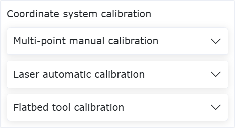

.. centered:: Abbildung 6.8‑4 Auswahl der Kalibriermethode

Klicken Sie in der Oberfläche "Plattenwerkzeug-Kalibrierung" auf die Schaltfläche "Eintreten", um die Plattenwerkzeug-Konfiguration vorzunehmen. Klicken Sie auf die Schaltfläche "Aufzeichnen", um die Kalibrier-Referenzpunkte aufzuzeichnen. Nach Abschluss der Konfiguration klicken Sie auf "Fertigstellen", um zur Oberfläche "Plattenwerkzeug-Kalibrierung" zurückzukehren.

.. image:: base/046.png
   :width: 4in
   :align: center

.. centered:: Abbildung 6.8‑5 Plattenwerkzeug-Konfiguration

Klicken Sie in der Oberfläche "Plattenwerkzeug-Kalibrierung" auf die Schaltfläche "Starten". Der Roboter führt automatisch die TCP-Kalibrierung des Werkzeugs durch. Nach Abschluss der Kalibrierung werden die TCP-Koordinaten des Werkzeugs angezeigt. Klicken Sie auf "Speichern", um das Kalibrierungsergebnis an die Oberfläche "Aktuelles Werkzeugkoordinatensystem" zurückzugeben.

.. image:: base/047.png
   :width: 4in
   :align: center

.. centered:: Abbildung 6.8‑6 Kalibrierungsergebnis

Klicken Sie in der Oberfläche "Aktuelles Werkzeugkoordinatensystem" auf "Übernehmen", um das TCP-Kalibrierungsergebnis des Werkzeugs zu speichern und anzuwenden.

.. image:: base/048.png
   :width: 4in
   :align: center

.. centered:: Abbildung 6.8‑7 Anwendung des Kalibrierungsergebnisses

Lichtbogen-Tracking-Funktion mit analoger Rückmeldung des Steuerpults
-----------------------------------------------------------------------

Übersicht
~~~~~~~~~

Die Lichtbogen-Tracking-Funktion mit analoger Rückmeldung des Steuerpults erfasst analoge Strom- und Spannungssignale des Schweißgeräts, um eine Lichtbogen-Tracking-Kompensation zu realisieren. Die Funktion wird durch die Konfiguration der entsprechenden AI- und AO-Kanäle des Steuerpults implementiert.

.. image:: base/059.png
   :width: 4in
   :align: center

.. centered:: Abbildung 6.9‑1 Topologie der Lichtbogen-Tracking-Funktion basierend auf analoger Signalkommunikation
.. centered:: a: Computer; b: Roboter und Steuerpult; c: Schweißgerät

Konfigurationsablauf für Steuerpult-Analogeingänge (AI)
~~~~~~~~~~~~~~~~~~~~~~~~~~~~~~~~~~~~~~~~~~~~~~~~~~~~~~~~

Gehen Sie auf der Web- Steueroberfläche des Roboters nacheinander zu "Initiale Einstellungen" -> "Grundlagen" -> "I/O Einstellungen" -> "AI", um zur "AI-Konfigurations"-Oberfläche zu gelangen.

Wählen Sie im Bereich "Lichtbogen-Tracking-Kanal" der "AI-Konfigurations"-Oberfläche in den Dropdown-Menüs "Schweißstromregelung AI" und "Schweißspannungsregelung AI" jeweils "Ctrl-AI0" und "Ctrl-AI1" als Analogkanäle für Strom und Spannung aus. Klicken Sie jeweils auf "Konfigurieren", um die AI-Konfiguration des Steuerpults abzuschließen.

.. image:: base/060.png
   :width: 3in
   :align: center

.. centered:: Abbildung 6.9‑2 AI-Kanalkonfiguration

Die Parametereinstellungen in den Bereichen "A-V" und "V-V" des "Analog Strom-Spannungs-Diagramms" in der AI-Kanalkonfiguration müssen unter Bezugnahme auf die Analogempfangs- und -ausgabetabellen/-diagramme des verwendeten Schweißgeräts erfolgen.

Konfigurieren Sie beispielsweise die untere und obere Grenze des Schweißstroms für den Steuerpult-Strom-Analogeingang AI auf 0 A und 500 A. Konfigurieren Sie die untere und obere Grenze der Ausgangsspannung für den Steuerpult-Strom-Analogeingang AI auf 0 V und 5 V. Diese Werte dienen als Konfigurationsparameter im Bereich "A-V" des "Analog Strom-Spannungs-Diagramms" in der AI-Kanalkonfiguration. Klicken Sie auf "Konfigurieren", um die Konfiguration des Steuerpult-Strom-Analogeingangs AI abzuschließen.

.. image:: base/061.png
   :width: 3in
   :align: center

.. centered:: Abbildung 6.9‑3 Konfiguration des Steuerpult-Strom-Analogeingangs AI

Konfigurieren Sie beispielsweise die untere und obere Grenze der Schweißspannung für den Steuerpult-Spannungs-Analogeingang AI auf 0 V und 50 V. Konfigurieren Sie die untere und obere Grenze der Ausgangsspannung für den Steuerpult-Spannungs-Analogeingang AI auf 1,018 V und 10 V. Diese Werte dienen als Konfigurationsparameter im Bereich "V-V" des "Analog Strom-Spannungs-Diagramms" in der AI-Kanalkonfiguration. Klicken Sie auf "Konfigurieren", um die Konfiguration des Steuerpult-Spannungs-Analogeingangs AI abzuschließen.

.. image:: base/062.png
   :width: 3in
   :align: center

.. centered:: Abbildung 6.9‑4 Konfiguration des Steuerpult-Spannungs-Analogeingangs AI

Konfigurationsablauf für Steuerpult-Analogausgänge (AO)
~~~~~~~~~~~~~~~~~~~~~~~~~~~~~~~~~~~~~~~~~~~~~~~~~~~~~~~~

Gehen Sie auf der Web- Steueroberfläche des Roboters nacheinander zu "Initiale Einstellungen" -> "Peripherie" -> "Schweißgerät", um zur "Schweißgerät-Konfigurations"-Oberfläche zu gelangen.

.. image:: base/063.png
   :width: 6in
   :align: center

.. centered:: Abbildung 6.9‑5 Schweißgerät-Konfiguration

Im Bereich "Schweißfunktions I/O-Konfiguration" der "Schweißgerät-Konfigurations"-Oberfläche können in den Bereichen "DI" und "DO" die Steuerpult-CI- und -CO-Kanäle benutzerdefiniert konfiguriert werden. Wählen Sie im Dropdown-Menü "Steuerungstyp" die Option "Controller I/O", um mit der Konfiguration der Steuerpult-Analogausgangs-AO-Kanäle zu beginnen.

Die Parametereinstellungen in den Bereichen "A-V" und "V-V" des "Analog Strom-Spannungs-Diagramms" in der "Schweißgerät-Konfigurations"-Oberfläche müssen unter Bezugnahme auf die Analogempfangs- und -ausgabetabellen/-diagramme des verwendeten Schweißgeräts erfolgen.

Konfigurieren Sie beispielsweise die untere und obere Grenze des Schweißstroms für den Steuerpult-Strom-Analogausgang AO auf 0 A und 495 A. Konfigurieren Sie die untere und obere Grenze der Ausgangsspannung für den Steuerpult-Strom-Analogausgang AO auf 1 V und 10 V. Diese Werte dienen als Konfigurationsparameter für den Steuerpult-Strom-Analogausgang in der AO-Kanalkonfiguration. Wählen Sie im Dropdown-Menü "Schweißstromregelung AO" die Option "Ctrl-AO0" aus und klicken Sie auf "Konfigurieren", um die Konfiguration des Steuerpult-Strom-Analogausgangs AO abzuschließen.

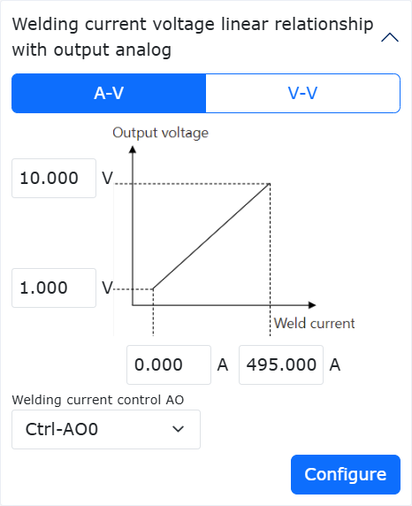

.. centered:: Abbildung 6.9‑6 Konfiguration des Steuerpult-Strom-Analogausgangs AO

Konfigurieren Sie beispielsweise die untere und obere Grenze der Schweißspannung für den Steuerpult-Spannungs-Analogausgang AO auf 10 V und 45 V. Konfigurieren Sie die untere und obere Grenze der Ausgangsspannung für den Steuerpult-Spannungs-Analogausgang AO auf 1 V und 10 V. Diese Werte dienen als Konfigurationsparameter für den Steuerpult-Spannungs-Analogausgang in der AO-Kanalkonfiguration.

Wählen Sie im Dropdown-Menü "Schweißspannungsregelung AO" die Option "Ctrl-AO1" aus und klicken Sie auf "Konfigurieren", um die Konfiguration des Steuerpult-Spannungs-Analogausgangs AO abzuschließen.

.. image:: base/065.png
   :width: 3in
   :align: center

.. centered:: Abbildung 6.9‑7 Konfiguration des Steuerpult-Spannungs-Analogausgangs AO

Kollisionserkennung für Linearzahnstangenführungen
----------------------------------------------------------------------

Übersicht
~~~~~~~~~

Die Kollisionserkennungsfunktion für Linearzahnstangenführungen dient dazu, bei asynchronem oder synchronem Betrieb einen Alarm auszulösen und einen Notstopp einzuleiten, wenn die Führung oder der Roboter mit einem Objekt in der Umgebung kollidiert. Durch Überwachung der Drehmomentrückmeldung der Führung wird anhand eines eingestellten Schwellwerts entschieden, ob eine Kollision stattgefunden hat. Bei einer Kollision stoppt die Führung sofort, wodurch vermieden wird, dass Führung und Roboter eine anhaltende Kraft auf das kollidierte Objekt ausüben. Dies erhöht die Sicherheit der Mensch-Roboter-Kollaboration weiter.

Kollisionserkennungsfunktion für Linearzahnstangenführungen
~~~~~~~~~~~~~~~~~~~~~~~~~~~~~~~~~~~~~~~~~~~~~~~~~~~~~~~~~~~~

Für die Kollisionserkennungsfunktion muss nach der Aktivierung der Führung das Programm "Rail_Adaptation_Program.lua" ausgeführt werden. Dadurch wird sichergestellt, dass die Funktion an die jeweilige Führung und Belastungssituation angepasst werden kann, um die beste Kollisionserkennungsleistung zu erzielen. Ohne diese Anpassung ist die Kollisionserkennungsleistung deutlich geringer und die zum Auslösen einer Kollision erforderliche externe Kraft ist größer.

Parametereinstellung und Aktivierung der Linearzahnstangenführung
+++++++++++++++++++++++++++++++++++++++++++++++++++++++++++++++++

**Schritt 1**: Melden Sie sich an der Weboberfläche an und klicken Sie nacheinander auf "Initiale Einstellungen" -> "Peripherie" -> "Erweiterungsachse", um zum Einstellmodul für das Erweiterungsachsen-Koordinatensystem zu gelangen (siehe Abbildung).

.. image:: base/078.png
   :width: 4in
   :align: center

.. centered:: Abbildung 6.10‑1 Einstellmodul für das Erweiterungsachsen-Koordinatensystem

**Schritt 2**: Basierend auf der tatsächlichen Arbeitsweise von Erweiterungsachse und Roboter nehmen Sie die Parametereinstellung vor und kalibrieren Sie bei Bedarf. Klicken Sie in der Abbildung auf "Bearbeiten". Setzen Sie den Namen des Erweiterungsachsen-Koordinatensystems auf "exaxis1", wählen Sie als Schema "0-Einzelfreiheitsgrad Linearführung" und als Erweiterungsachsennummer "1". Wenn Führung und Roboter nur asynchron betrieben werden, ist keine Kalibrierung erforderlich. Für synchronen Betrieb MUSS eine Kalibrierung durchgeführt werden. Der Kalibrierablauf kann dem entsprechenden Benutzerhandbuch entnommen oder bei Fachpersonal erfragt werden. Nach Abschluss der Parametereinstellung klicken Sie auf "Speichern" und übernehmen das entsprechende Koordinatensystem (siehe Abbildung 2-2).

.. image:: base/079.png
   :width: 4in
   :align: center

.. centered:: Abbildung 6.10‑2 Parametereinstellung des Erweiterungsachsen-Koordinatensystems

**Schritt 3**: Richten Sie eine UDP-Kommunikation zwischen Erweiterungsachse und Roboter ein und stellen Sie sicher, dass das SPS-Programm der Erweiterungsachse die Drehmomentrückmeldung des Antriebsmotors (nach Untersetzung) an die Robotersteuerung zurücksenden kann. Klicken Sie nacheinander auf "Initiale Einstellungen" -> "Peripherie" -> "Erweiterungsachse", um zur UDP-Kommunikationskonfigurationsseite zu gelangen. Wählen Sie das in Schritt 2 eingestellte Koordinatensystem aus und übernehmen Sie es. Klicken Sie auf das "Bearbeiten"-Symbol der UDP-Kommunikationskonfiguration, um die Kommunikation zu konfigurieren und zu laden. Die IP-Adressen von SPS und Laptop müssen im selben Netzwerksegment wie die Steuerung liegen (siehe Abbildung 2-3). Wichtig ist, dass das SPS-Programm der Erweiterungsachse die Drehmomentrückmeldung des Antriebsmotors (nach Untersetzung) mit einer Abtastperiode von möglichst 1 ms (maximal 4 ms) an die Robotersteuerung zurücksenden kann, da sonst die Kollisionserkennungsfunktion unwirksam ist.

.. image:: base/080.png
   :width: 4in
   :align: center

.. centered:: Abbildung 6.10‑3 UDP-Kommunikationskonfigurationsseite

**Schritt 4**: Nehmen Sie die Parametereinstellung für die UDP-Erweiterungsachse vor. Die Seite zur Parametereinstellung der UDP-Erweiterungsachse ist in Abbildung 2-4 dargestellt. Wählen Sie den Achsentyp "Linearführung" und die Achsrichtung "Positiv". Die übrigen Parameter müssen entsprechend der tatsächlichen Situation konfiguriert werden. Dabei sind Spindelsteigung und Encoderauflösung fest und von der Führung abhängig. Die Obergrenzen für Laufgeschwindigkeit und Beschleunigung werden von der Motorleistung beeinflusst. Die in dieser Funktion verwendeten Obergrenzen sind in Abbildung 2-4 dargestellt. Bei der Konfiguration abweichender Obergrenzen wenden Sie sich bitte an Fachpersonal.

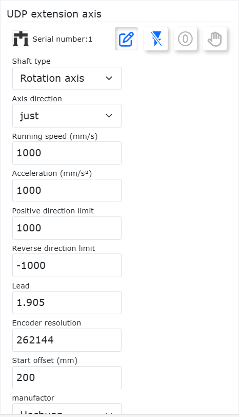

.. centered:: Abbildung 6.10‑4 Parametereinstellung der UDP-Erweiterungsachse

**Schritt 5**: Aktivieren Sie die Linearzahnstangenführung und bewegen Sie sie zum Startpunkt. Aktivieren Sie die Linearzahnstangenführung über die Schaltfläche "Deaktivieren" in Abbildung 2-4 oder die Schaltfläche "Servo aktivieren" in Abbildung 2-5. Wenn sich der Schlitten der Führung nicht am Startpunkt befindet, kann er über "Rückwärtsdrehung" oder "Vorwärtsdrehung" zum Startpunkt bewegt werden (Hinweis: Die Laufgeschwindigkeit sollte 15% nicht unterschreiten). Nachdem der Startpunkt erreicht ist, klicken Sie auf "Nullpunkt setzen" und führen Sie die Referenzpunktfahrt mit der Option "Aktuelle Position als Nullpunkt" durch.

.. image:: base/082.png
   :width: 4in
   :align: center

.. centered:: Abbildung 6.10‑5 Aktivierung und Bewegung der Linearzahnstangenführung

Aktivierung der Kollisionserkennungsfunktion für die Linearzahnstangenführung
++++++++++++++++++++++++++++++++++++++++++++++++++++++++++++++++++++++++++++++

**Schritt 1**: Stellen Sie sicher, dass sowohl die Führung als auch der Roboter in normaler (aufrechter) Position montiert sind. Überprüfen Sie vor der Aktivierung der Kollisionserkennungsfunktion, ob die Montageart "normale Montage" ist. Stellen Sie konkret sicher, dass Führung und Roboter normal montiert sind. Klicken Sie dann nacheinander auf "Initiale Einstellungen" -> "Grundlagen" -> "Montage", um zur Seite "Freie Montage" zu gelangen. Wenn "Basisrotation" und "Basisneigung" beide 0 sind, ist die Software auf normale Montage eingestellt. Andernfalls müssen die Werte auf 0 geändert werden. Wenn sie nicht 0 sind, zeigt die Oberfläche eine Fehlermeldung an (siehe Abbildung 2-6).

.. image:: base/083.png
   :width: 6in
   :align: center

.. centered:: Abbildung 6.10‑6 Fehlermeldung bei nicht normaler Montageart

**Schritt 2**: Aktivieren Sie die Kollisionserkennungsfunktion für die Linearzahnstangenführung und stellen Sie die Parameter ein. Klicken Sie nacheinander auf "Initiale Einstellungen" -> "Grundlagen" -> "Gelenke" -> "Kollisionsstufe", um zur Seite für die Kollisionsstufeneinstellung zu gelangen. Nach dem Aktivieren des Schiebereglers "Kollisionserkennung für Linearzahnstangenführung" stellen Sie den Zahnradradius und die Schlittenmasse ein. Der Zahnradradius kann aus Spindelsteigung und Untersetzungsverhältnis berechnet werden. Die Schlittenmasse umfasst nicht den Roboter und seine Endeffektorlast. Es gibt 11 Optionen für die Führungsstufe, wobei Level1 am leichtesten und Level10 am schwersten eine Kollision auslöst. Setzen Sie die Kollisionsstufe zunächst auf "Aus", bevor das Anpassungsprogramm ausgeführt wurde (nach dem Einschalten der Steuerung).

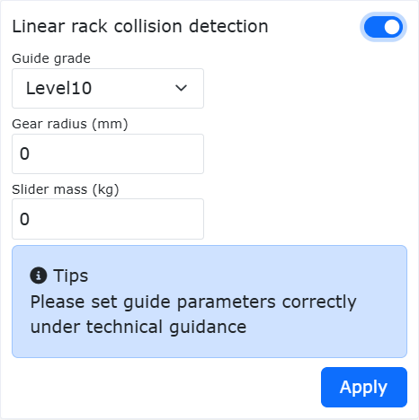

.. centered:: Abbildung 6.10‑7 Kollisionserkennungsfunktion für Linearzahnstangenführung

**Schritt 3**: Führen Sie das Programm "Rail_Adaptation_Program.lua" aus, um es an die aktuelle Führung anzupassen. Nach jedem Neustart der Steuerung muss das Programm "Rail_Adaptation_Program.lua" ausgeführt werden (um zu verhindern, dass Änderungen des Robotertyps oder anderer Faktoren die dynamischen Eigenschaften der Führung beeinflussen). Stellen Sie vor der Ausführung des Programms sicher, dass die Kollisionsstufe der Führung auf "Aus" gesetzt ist. Führen Sie das Lua-Programm im Automatikmodus mit 100% der Oberflächengeschwindigkeit aus. Die Anpassung ist abgeschlossen, nachdem das Programm einen Zyklus durchlaufen hat. Das Programm kann dann gestoppt werden.

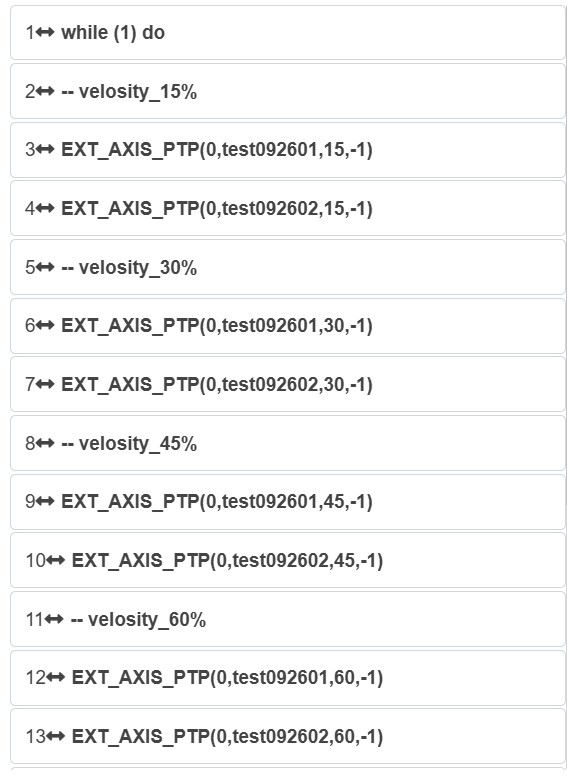

.. centered:: Abbildung 6.10‑8 Ausführung des Programms "Rail_Adaptation_Program.lua" zur Anpassung an die aktuelle Führung

**Schritt 4**: Stellen Sie die Kollisionsstufe der Führung angemessen ein und führen Sie die Aufgabe aus. Benutzer können die Kollisionsstufe der Führung basierend auf der Motorantriebsleistung und der Aufgabenlaufgeschwindigkeit angemessen einstellen. Bei asynchronem Betrieb von Führung und Roboter kann eine Kollision des Roboters oder der Führung den Fehler "8-Achsen-Kollisionsfehler, zurücksetzbar" auslösen, woraufhin die Führung anhält (siehe Abbildung 2-9). Bei synchronem Betrieb kann eine Kollision des Roboters einen Alarm auslösen, der die Führung anhält, während der Roboter gemäß der eingestellten Kollisionsstrategie reagiert.

.. image:: base/086.png
   :width: 4in
   :align: center

.. centered:: Abbildung 6.10‑9 Führung löst Kollisionsfehler aus

Nullpunktkalibrierung des Kraftsensors unter Last und Admittanzparameter für freie Ausrichtung
------------------------------------------------------------------------------------------------------------

Übersicht
~~~~~~~~~

Die Funktion zur Nullpunktkalibrierung des Kraftsensors unter Last ermöglicht es dem Roboter, mit einem Schnellwechslerkopf Lasten zu wechseln, ohne den Kopf abnehmen zu müssen, und dabei die Nullpunktdrift des Sensors schnell zu korrigieren. Die Admittanzparameter für die freie Ausrichtung dienen dem Benutzer, die Ausrichtung basierend auf dem tatsächlichen Drehmoment während der Kraftregelung anzupassen.

Nullpunktkalibrierung des Kraftsensors unter Last
~~~~~~~~~~~~~~~~~~~~~~~~~~~~~~~~~~~~~~~~~~~~~~~~~~

**Schritt 1**: Installieren und aktivieren Sie den Kraftsensor. Klicken Sie im Menü "Initiale Einstellungen" -> "Peripherie" -> "Kraftsensor" auf "Angepasstes Gerät", um zur Konfigurationsoberfläche zu gelangen. Nach Abschluss der Kraftsensorkonfiguration wählen Sie die Nummer des konfigurierten Kraftsensors aus und klicken auf "Zurücksetzen". Nachdem die Seite den erfolgreichen Befehlsversand anzeigt, klicken Sie auf die Schaltfläche "Aktivieren". Prüfen Sie den Aktivierungsstatus in der Kraftsensor-Informationsliste, um festzustellen, ob die Aktivierung erfolgreich war. Der Kraftsensor hat einen Anfangswert. Benutzer können je nach Bedarf "Nullpunktkorrektur" und "Nullpunkt entfernen" wählen (siehe Abbildung). Die Nullpunktkorrektur des Kraftsensors erfordert, dass der Kraftsensor horizontal und senkrecht nach unten ausgerichtet ist und sich keine Last unter dem Sensor befindet.

.. image:: base/087.png
   :width: 4in
   :align: center

.. centered:: Abbildung 6.11‑1 Kraftsensor-Konfigurationsinformationen

**Schritt 2**: Lastidentifikation des Kraftsensors. Klicken Sie im Menü "Initiale Einstellungen" -> "Grundlagen" -> "Last" auf "Automatische Identifikation", um zur Oberfläche für die Kraft-/Drehmomentsensorlast zu gelangen. Führen Sie eine automatische Nullpunktkalibrierung des Sensors durch. Nachdem die Anfangsposition aufgezeichnet wurde, schalten Sie den Roboter in den Automatikmodus und klicken Sie auf "Automatische Nullpunktkalibrierung", wie in Abbildung 2-2 gezeigt.

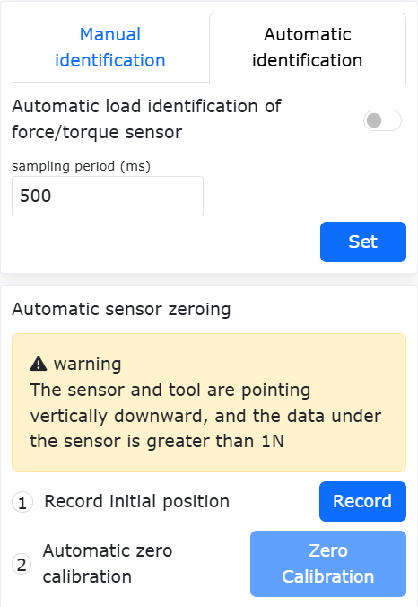

.. centered:: Abbildung 6.11‑2 Lastidentifikation des Kraftsensors

**Schritt 3**: Wenn die tatsächliche Last am Ende des Kraftsensors ausgetauscht wird, geben Sie das Lastgewicht und die Schwerpunktkoordinaten im Lastkonfigurationsmodul ein. Klicken Sie auf "Übernehmen", um die Lastkonfiguration zu aktualisieren und die Nullpunktkalibrierung des Kraftsensors unter Last abzuschließen.

Admittanzparameter für freie Ausrichtung
~~~~~~~~~~~~~~~~~~~~~~~~~~~~~~~~~~~~~~~~

**Schritt 1**: Klicken Sie auf "Initiale Einstellungen" -> "Grundlagen" -> "Werkzeugkoordinaten", um zur Oberfläche für die Werkzeugkoordinateneinstellung zu gelangen. Wählen Sie "Koordinatensystemname" und stellen Sie die Koordinatensystemparameter entsprechend dem Endeffektorwerkzeug ein, wie in Abbildung 3-1 gezeigt.

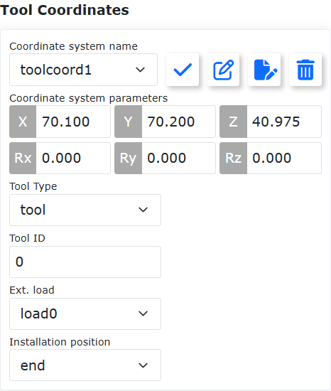

.. centered:: Abbildung 6.11‑3 Werkzeugkoordinateneinstellung

**Schritt 2**: Klicken Sie auf "Teach-Programm" -> "Programmierung". Schreiben Sie ein Lua-Skript für die Kraftregelung. Wählen Sie "Kraftregelungsset" -> "Control". Fügen Sie einen Kraftregelungs-Bewegungsbefehl hinzu. Setzen Sie die Ausrichtungsanpassung auf "Ein". Stellen Sie den Trägheitskoeffizienten und den Dämpfungskoeffizienten ein. Der maximale Anpassungswinkel wird als Schwellwert für den Ausrichtungsanpassungswinkel festgelegt, wie in Abbildung 3-2 gezeigt.

.. image:: base/090.png
   :width: 4in
   :align: center

.. centered:: Abbildung 6.11‑4 Admittanzparameter für freie Ausrichtung

**Schritt 3**: Klicken Sie auf der Weboberfläche auf "FT". Stellen Sie das Referenzkoordinatensystem des Kraftsensors ein. Wählen Sie als Referenzkoordinatensystem "Benutzerdefiniertes Koordinatensystem" und setzen Sie die entsprechenden Koordinatensystemparameter auf "0", wie in Abbildung 3-3 gezeigt.

.. image:: base/091.png
   :width: 4in
   :align: center

.. centered:: Abbildung 6.11‑5 Einstellung des Referenzkoordinatensystems des Kraftsensors

**Schritt 4**: Führen Sie das Skript aus und beobachten Sie die Wirkung der Ausrichtungsanpassung. Der Trägheitsparameter beeinflusst die Beschleunigungsreaktion und die Störfestigkeit. Je größer die Trägheit, desto ausgeprägter die Hysterese des Roboters. Der Dämpfungskoeffizient beeinflusst die Glätte der Ausrichtungsanpassung. Je größer die Dämpfung, desto schwieriger ist die Ausrichtungsanpassung.