Programmierung
==============

.. toctree::
   :maxdepth: 6

Einführung
~~~~~~~~~~

Durch Klicken auf die Befehle auf der linken Seite können dem Programmbaum Programmknoten hinzugefügt werden. Während der Programmausführung wird der aktuell ausgeführte Programmknoten grün hervorgehoben.

Im Handmodus können Sie durch Klicken auf das erste Symbol rechts neben einem Knoten den Roboter diesen Befehl einzeln ausführen lassen. Das zweite Symbol dient zum Bearbeiten des Knoteninhalts.

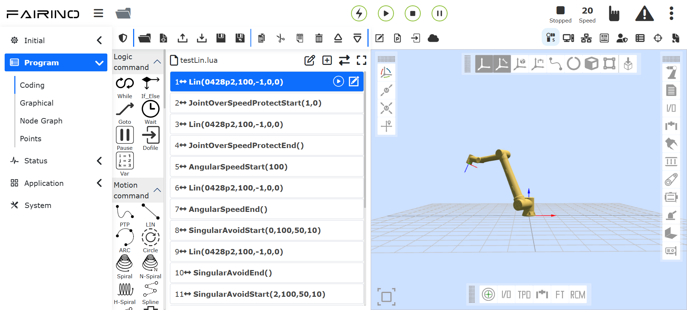

.. centered:: Abbildung 9.1-1 Programmbaum-Oberfläche

Durch Klicken auf "⇄" zum Umschalten des Modus kann der Teach-Programmtext in den Bearbeitungszustand versetzt werden.

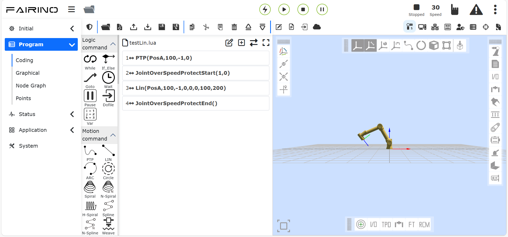

.. centered:: Abbildung 9.1‑2 Bearbeitungszustand des Teach-Programms

Die Bedeutung der Symbole rechts neben dem Programmnamen ist wie folgt:

.. note::
   .. image:: coding/003.png
      :height: 0.75in
      :align: left

   Bezeichnung: **Ein-/Ausklappen / Zoomen**

   Funktion: Ein-/Ausklappen / Zoomen der Programmbaum-Oberfläche

.. note::
   .. image:: coding/004.png
      :height: 0.75in
      :align: left

   Bezeichnung: **Neuen Teachpunkt hinzufügen**

   Funktion: Fügt einen lokalen Teachpunkt für das aktuelle Programm hinzu.

.. note::
   .. image:: coding/005.png
      :height: 0.75in
      :align: left

   Bezeichnung: **Umbenennen**

   Funktion: Benennt das aktuelle Programm um.

Werkzeugleiste
~~~~~~~~~~~~~~

Verwenden Sie die Werkzeugleiste am oberen Rand des Programmbaums, um diesen zu bearbeiten.

.. note::
   .. image:: coding/006.png
      :height: 0.75in
      :align: left

   Bezeichnung: **Öffnen**

   Funktion: Öffnet eine Benutzerprogrammdatei.

.. note::
   .. image:: coding/007.png
      :height: 0.75in
      :align: left

   Bezeichnung: **Neu**

   Funktion: Wählt eine Vorlage aus, um eine neue Programmdatei zu erstellen.

.. note::
   .. image:: coding/008.png
      :height: 0.75in
      :align: left

   Bezeichnung: **Importieren**

   Funktion: Importiert eine Datei in den Benutzerprogramm-Ordner.

.. note::
   .. image:: coding/009.png
      :height: 0.75in
      :align: left

   Bezeichnung: **Exportieren**

   Funktion: Exportiert eine Benutzerprogrammdatei auf den lokalen Computer.

.. note::
   .. image:: coding/010.png
      :height: 0.75in
      :align: left

   Bezeichnung: **Speichern**

   Funktion: Speichert den bearbeiteten Inhalt der Datei.

.. note::
   .. image:: coding/011.png
      :height: 0.75in
      :align: left

   Bezeichnung: **Speichern unter**

   Funktion: Benennt die Datei um und speichert sie im Ordner für Benutzerprogramme oder Vorlagen.

.. note::
   .. image:: coding/012.png
      :height: 0.75in
      :align: left

   Bezeichnung: **Kopieren**

   Funktion: Kopiert einen Knoten und ermöglicht seine Verwendung für andere Operationen (z. B. Einfügen an einer anderen Stelle im Programmbaum).

.. note::
   .. image:: coding/013.png
      :height: 0.75in
      :align: left

   Bezeichnung: **Einfügen**

   Funktion: Ermöglicht das Einfügen eines zuvor ausgeschnittenen oder kopierten Knotens.

.. note::
   .. image:: coding/014.png
      :height: 0.75in
      :align: left

   Bezeichnung: **Ausschneiden**

   Funktion: Schneidet einen Knoten aus und ermöglicht seine Verwendung für andere Operationen (z. B. Einfügen an einer anderen Stelle im Programmbaum).

.. note::
   .. image:: coding/015.png
      :height: 0.75in
      :align: left

   Bezeichnung: **Löschen**

   Funktion: Entfernt einen Knoten aus dem Programmbaum.

.. note::
   .. image:: coding/016.png
      :height: 0.75in
      :align: left

   Bezeichnung: **Nach oben**

   Funktion: Verschiebt den Knoten nach oben.

.. note::
   .. image:: coding/017.png
      :height: 0.75in
      :align: left

   Bezeichnung: **Nach unten**

   Funktion: Verschiebt den Knoten nach unten.

.. note::
   .. image:: coding/018.png
      :height: 0.75in
      :align: left

   Bezeichnung: **Edit-Modus wechseln**

   Funktion: Wechselt zwischen Programmbaum-Modus und Lua-Editier-Modus.

Die Bedeutung der Symbole oben rechts ist wie folgt:

.. note::
   .. image:: coding/240.png
      :height: 0.75in
      :align: left

   Bezeichnung: **Programmierung hinzufügen/bearbeiten**

   Funktion: Fügt Inhalt zum aktuellen Programmbefehl hinzu / bearbeitet ihn.

.. note::
   .. image:: coding/241.png
      :height: 0.75in
      :align: left

   Bezeichnung: **Robotermodell**

   Funktion: Kehrt zur 3D-Modell-Oberfläche des Roboters zurück.

.. note::
   .. image:: coding/242.png
      :height: 0.75in
      :align: left

   Bezeichnung: **NewDofile-Unterprogramm-Oberfläche**

   Funktion: Wenn im aktuellen Programmbefehl ein NewDofile-Befehl vorhanden ist, klicken Sie hier, um den Unterprogrammnamen auszuwählen und den Inhalt des Unterprogramms anzuzeigen.

.. note::
   .. image:: coding/243.png
      :height: 0.75in
      :align: left

   Bezeichnung: **Modbus TCP Einstellungen**

   Funktion: Konfiguriert die Parameter für die Modbus TCP-Kommunikation.

.. note::
   .. image:: coding/244.png
      :height: 0.75in
      :align: left

   Bezeichnung: **Aktuelles Teach-Programm-Backup**

   Funktion: Zeichnet den Änderungsinhalt des aktuellen Programms auf.

.. note::
   .. image:: coding/245.png
      :height: 0.75in
      :align: left

   Bezeichnung: **Lokale Teachpunkte**

   Funktion: Teachpunkte, die nur im aktuellen Programm verwendet werden.

Programmbefehle
~~~~~~~~~~~~~~~

Auf der linken Seite können hauptsächlich Programmbefehle hinzugefügt werden. Klicken Sie auf das Symbol über den jeweiligen Schlüsselwörtern, um auf der rechten Seite die detaillierte Oberfläche zum Hinzufügen von Programmbefehlen zu öffnen. Es gibt hauptsächlich zwei Methoden, um Programmbefehle zu einer Datei hinzuzufügen:

- 1. Öffnen Sie den entsprechenden Befehl und klicken Sie auf "Übernehmen", um den Befehl zum Programm hinzuzufügen.
- 2. Klicken Sie zuerst auf die Schaltfläche "Hinzufügen". Der Befehl wird zu diesem Zeitpunkt noch nicht in der Programmdatei gespeichert. Klicken Sie dann auf "Übernehmen", um den Befehl in der Datei zu speichern.

Die zweite Methode wird häufig verwendet, wenn mehrere Befehle desselben Typs gesendet werden. Für diese Art von Befehlen wurde die Schaltfläche "Hinzufügen" und eine Funktion zur Anzeige der hinzugefügten Befehle implementiert. Durch Klicken auf "Hinzufügen" kann ein Befehl hinzugefügt werden. "Hinzugefügte Befehle" zeigt alle hinzugefügten Befehle an. Durch Klicken auf "Übernehmen" werden die hinzugefügten Befehle in der rechts geöffneten Datei gespeichert.

Logikbefehls-Oberfläche
~~~~~~~~~~~~~~~~~~~~~~~

.. image:: coding/019.png
   :width: 6in
   :align: center

.. centered:: Abbildung 9.4 Logikbefehls-Oberfläche

Schleifen-Befehl
++++++++++++++++

Klicken Sie auf das Symbol "Schleife", um die Bearbeitungsoberfläche für den While-Befehl zu öffnen.

Wählen Sie das Schleifenszenario für den While-Befehl. Die Szenarien sind wie folgt:

- Immer wiederholen
- Endliche Wiederholungen: Eingabe der Wiederholungsanzahl und des Variablennamens.
- Wiederholen, solange Ausdruck wahr ist: Klicken Sie in das Eingabefeld, um den Ausdruckseditor zu öffnen, und wählen Sie den entsprechenden Ausdruck je nach Anwendungssituation aus.

.. image:: coding/020.png
   :width: 6in
   :align: center

.. centered:: Abbildung 9.4-1-1 While-Befehls-Oberfläche

.. image:: coding/236.png
   :width: 6in
   :align: center

.. centered:: Abbildung 9.4-1-2 While-Befehl – Immer wiederholen

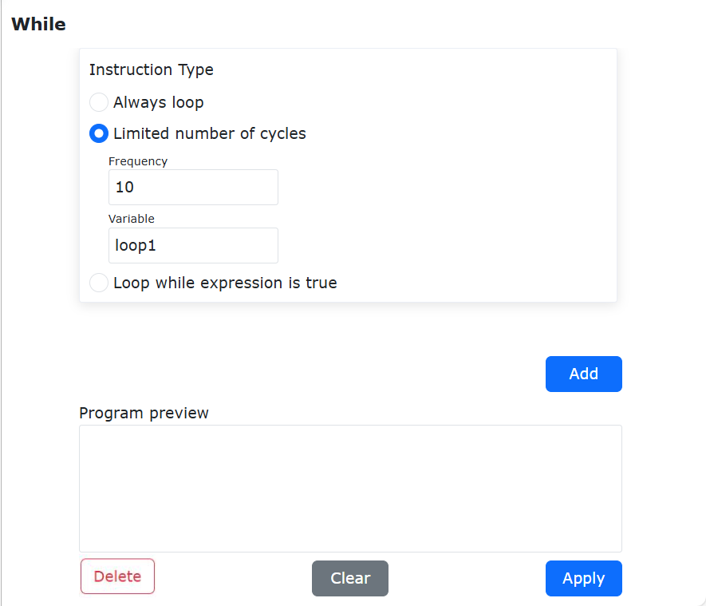

.. centered:: Abbildung 9.4-1-3 While-Befehl – Endliche Wiederholungen

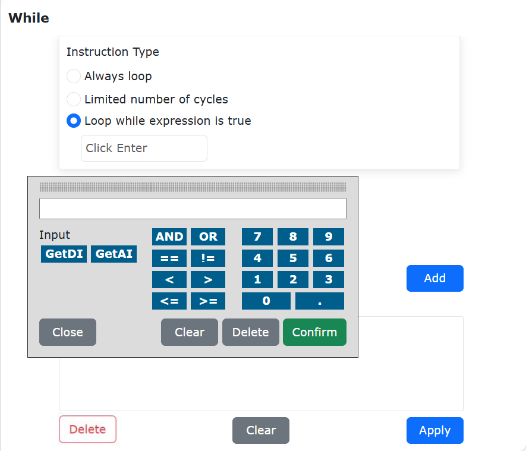

.. centered:: Abbildung 9.4-1-4 While-Befehl – Ausdruckseditor

.. image:: coding/239.png
   :width: 6in
   :align: center

.. centered:: Abbildung 9.4-1-5 While-Befehl – Wiederholen, solange Ausdruck wahr ist

Zur einfacheren Bedienung kann der Inhalt von "do" beliebig eingegeben werden. Im Programm können andere Befehle zur Einfügung bearbeitet werden.

Entscheidungs-Befehl
++++++++++++++++++++

Klicken Sie auf die Schaltfläche "Entscheidung", um die Bearbeitungsoberfläche für den if...else-Befehl zu öffnen.

Dieser Befehl enthält die folgenden Schaltflächen:

- Else if hinzufügen: Wenn kein "else"-Ausdruck vorhanden ist, klicken Sie auf diese Schaltfläche, um einen "else if"-Ausdruck hinzuzufügen.
- Else if entfernen: Wenn ein "else if"-Ausdruck vorhanden ist, klicken Sie auf diese Schaltfläche, um ihn zu löschen.
- Else hinzufügen: Klicken Sie auf diese Schaltfläche, um einen "else"-Ausdruck hinzuzufügen.
- Else entfernen: Klicken Sie auf diese Schaltfläche, um den "else"-Ausdruck zu löschen.

Nach dem Hinzufügen durch Klicken auf die entsprechende Schaltfläche klicken Sie in das Eingabefeld, um den Ausdruckseditor zu öffnen, und wählen Sie den entsprechenden Ausdruck je nach Anwendungssituation aus. Klicken Sie nach dem Hinzufügen auf "Hinzufügen" und dann auf "Übernehmen".

Dieser Befehl erfordert grundlegende Programmierkenntnisse. Bei Bedarf wenden Sie sich bitte an uns.

.. image:: coding/021.png
   :width: 6in
   :align: center

.. centered:: Abbildung 9.4-2 if...else-Befehls-Oberfläche

Sprung-Befehl
+++++++++++++

Klicken Sie auf die Schaltfläche "Sprung", um die Bearbeitungsoberfläche für den Goto-Befehl zu öffnen.

Der Goto-Befehl ist ein Sprungbefehl. Geben Sie die Anweisung in das rechte Eingabefeld ein. Klicken Sie nach der Bearbeitung auf "Hinzufügen" und dann auf "Übernehmen". (Dieser Befehl erfordert grundlegende Programmierkenntnisse. Bei Bedarf wenden Sie sich bitte an uns.)

.. image:: coding/022.png
   :width: 6in
   :align: center

.. centered:: Abbildung 9.4-3 Goto-Befehls-Oberfläche

Warte-Befehl
++++++++++++

Klicken Sie auf das Symbol "Warten", um die Bearbeitungsoberfläche für den Wait-Befehl zu öffnen.

Dieser Befehl ist ein Verzögerungsbefehl und besteht aus drei Teilen: "WaitMs", "WaitDI" und "WaitAI".

Beim "WaitTime"-Befehl ist die Verzögerungseinheit Millisekunden. Geben Sie die Anzahl der zu wartenden Millisekunden ein und klicken Sie auf "Hinzufügen" und dann auf "Übernehmen".

.. image:: coding/023.png
   :width: 6in
   :align: center

.. centered:: Abbildung 9.4-4 WaitTime-Befehls-Oberfläche

Der "WaitDI"-Befehl ist ein Einzel-DI-Wartebefehl. Wählen Sie die zu wartende IO-Portnummer, den Wartezustand, die maximale Wartezeit und die Behandlungsmethode bei Zeitüberschreitung aus und klicken Sie auf "Hinzufügen" und dann auf "Übernehmen".

.. centered:: Abbildung 9.4-5 WaitDI-Befehls-Oberfläche

Der "WaitMultiDI"-Befehl ist ein Multi-DI-Wartebefehl. Wählen Sie zuerst die Bedingung für das Eintreten des Multi-DI-Zustands, dann die zu wartenden DI-Ports und deren Zustände aus. Legen Sie schließlich die maximale Wartezeit und die Behandlungsmethode bei Zeitüberschreitung fest. Klicken Sie auf "Hinzufügen" und dann auf "Übernehmen".

.. image:: coding/025.png
   :width: 6in
   :align: center

.. centered:: Abbildung 9.4-6 WaitMultiDI-Befehls-Oberfläche

Beim "WaitAI"-Befehl wählen Sie den zu wartenden Analogwert, den Wert, die maximale Wartezeit und die Behandlungsmethode bei Zeitüberschreitung aus. Klicken Sie auf "Hinzufügen" und dann auf "Übernehmen".

.. image:: coding/026.png
   :width: 6in
   :align: center

.. centered:: Abbildung 9.4-7 WaitAI-Befehls-Oberfläche

Pausen-Befehl
+++++++++++++

Klicken Sie auf das Symbol "Pause", um die Bearbeitungsoberfläche für den Pause-Befehl zu öffnen.

Dieser Befehl ist ein Pausenbefehl. Wenn Sie ihn in das Programm einfügen und das Programm an dieser Stelle ankommt, wechselt der Roboter in den Pausenzustand. Um fortzufahren, klicken Sie im Steuerbereich auf die Schaltfläche "Pause/Fortsetzen".

.. image:: coding/027.png
   :width: 6in
   :align: center

.. centered:: Abbildung 9.4-8 Pause-Befehls-Oberfläche

Unterprogramm-Befehl
++++++++++++++++++++

Klicken Sie auf das Symbol "Unterprogramm", um die Bearbeitungsoberfläche für den Dofile-Befehl zu öffnen.

Der Dofile-Befehl ruft ein Programm im Controller auf. Bei Verwendung des Dofile-Befehls muss das aufgerufene Unterprogramm gespeichert werden. Das Hauptprogramm muss nicht erneut gespeichert werden, wenn es unverändert ist. Der Dofile-Befehl unterstützt zwei Aufrufebenen. Zwei Parametereinstellungen sind wichtig: erstens, auf welcher Ebene sich dieser Aufruf befindet, und zweitens die ID-Nummer dieses Aufrufs. Grundsätzlich dürfen im selben Programm keine identischen IDs vorkommen.

.. image:: coding/028.png
   :width: 6in
   :align: center

.. centered:: Abbildung 9.4-9 Dofile-Befehls-Oberfläche

Variablen-Befehl
++++++++++++++++

Klicken Sie auf das Symbol "Variable", um die Bearbeitungsoberfläche für den Var-Befehl zu öffnen.

Dieser Befehl ist ein Befehl des Variablensystems und besteht aus zwei Teilen: Definition von Lua-Variablen sowie Variablenabfrage und Umbenennung von Sys-Variablen, Abrufen von Werten, Setzen von Werten. Mit der Lua-Variablendefinition kann eine Variable deklariert und mit einem Anfangswert versehen werden. Sie wird in Verbindung mit Befehlen wie while, if-else verwendet. Mit dem Lua-Variablenabfragebefehl kann der Wert des eingegebenen Variablennamens in Echtzeit abgefragt und in der Statusleiste angezeigt werden. Die Anzahl der Sys-Variablen ist fest. Sie können umbenannt werden, ihre Werte können abgerufen und gesetzt werden. Die in diesen Variablen gespeicherten Werte gehen beim Ausschalten des Systems nicht verloren.

.. image:: coding/029.png
   :width: 6in
   :align: center

.. centered:: Abbildung 9.4-10 Var-Befehls-Oberfläche

.. important:: Variablennamen müssen mit einem Buchstaben oder einem Unterstrich beginnen und dürfen nicht mit einer Ziffer oder einem anderen Sonderzeichen beginnen.

Bewegungsbefehls-Oberfläche
~~~~~~~~~~~~~~~~~~~~~~~~~~~~

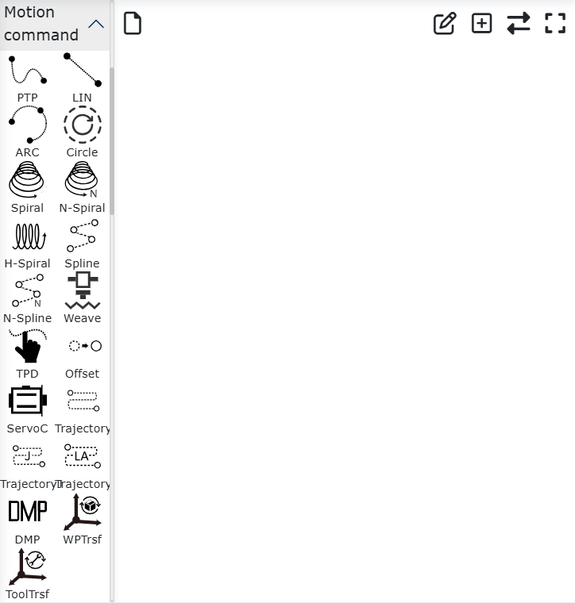

.. centered:: Abbildung 9.5 Bewegungsbefehls-Oberfläche

Punkt-zu-Punkt-Befehl
+++++++++++++++++++++

Klicken Sie auf das Symbol "Punkt-zu-Punkt", um die Bearbeitungsoberfläche für den PTP-Befehl zu öffnen.

Sie können den zu erreichenden Punkt auswählen. Durch die Einstellung der Glättungsübergangszeit kann die Bewegung von diesem Punkt zum nächsten kontinuierlich erfolgen. Bei der Einstellung "Ob Versatz" können Sie einen Versatz basierend auf dem Basiskoordinatensystem oder dem Werkzeugkoordinatensystem auswählen. Es öffnen sich dann Eingabefelder für den Versatz in x, y, z, rx, ry, rz. Der spezifische PTP-Pfad ist der optimale Pfad, der automatisch vom Bewegungscontroller geplant wird. Klicken Sie auf "Hinzufügen" und dann auf "Übernehmen", um diesen Befehl zu speichern.

.. image:: coding/031.png
   :width: 6in
   :align: center

.. centered:: Abbildung 9.5-1 PTP-Befehls-Oberfläche

Punkt-zu-Punkt Relativbewegung
********************************
Der Roboter bewegt sich von seiner aktuellen Position aus um eine bestimmte Strecke relativ. Wählen Sie auf der Seite zum Hinzufügen von PTP-Befehlen als Punktnamen "CurrentPos". Wählen Sie je nach Situation das Versatzkoordinatensystem (Basiskoordinatensystem oder Werkzeugkoordinatensystem) und geben Sie den Versatz ein. Der Roboter führt dann basierend auf seiner aktuellen Position eine Versatzbewegung entlang des eingestellten Koordinatensystems durch. ("CurrentPos" ist ein Systempunkt und muss nicht angefahren werden.)

.. image:: coding/515.png
   :width: 6in
   :align: center

.. centered:: Abbildung 9.5-1-1 PTP-Relativbewegungsbefehl

Klicken Sie auf die Schaltflächen "Hinzufügen" und "Übernehmen", um dem Lua-Programm einen PTP-Relativbewegungsbefehl für den Roboter hinzuzufügen. Schalten Sie den Roboter in den Automatikmodus und klicken Sie auf die Starttaste. Im Beispielprogramm bewegt sich der Roboter von seiner aktuellen Position aus 100 mm in die positive X-Richtung des Basiskoordinatensystems.

.. image:: coding/516.png
   :width: 6in
   :align: center

.. centered:: Abbildung 9.5-1-2 Hinzufügen eines PTP-Relativbewegungsbefehls

Lin-Befehl
++++++++++

Klicken Sie auf das Symbol "Linie", um die Bearbeitungsoberfläche für den Lin-Befehl zu öffnen.

Die Funktion dieses Befehls ähnelt der des "PTP"-Befehls, jedoch ist der Pfad zum Zielpunkt eine gerade Linie.

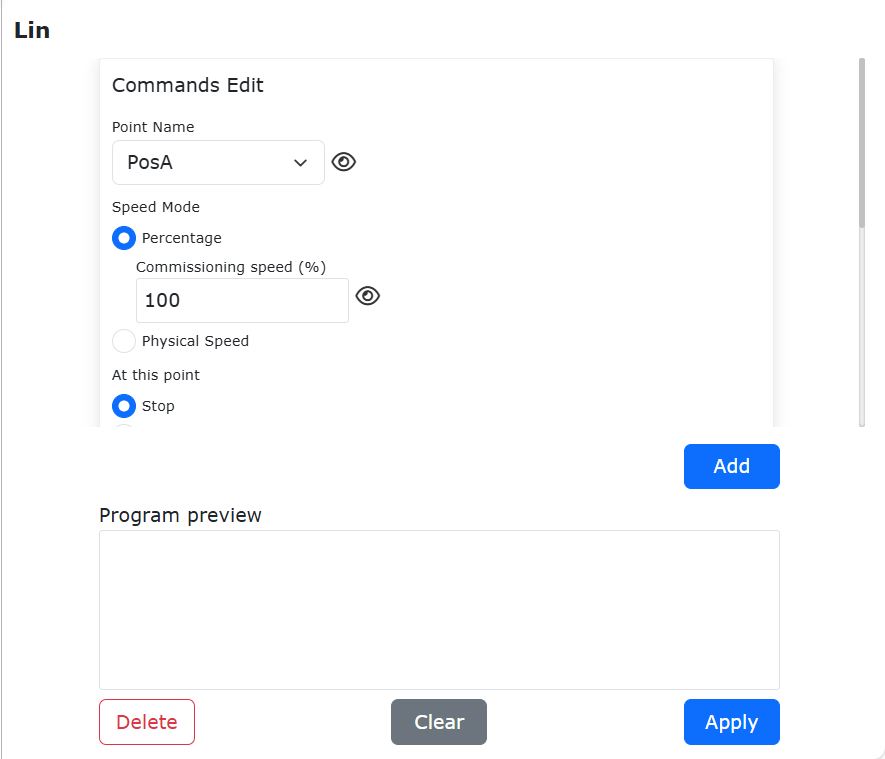

.. centered:: Abbildung 9.5-2 Lin-Befehls-Oberfläche

Linie Relativbewegung
********************************
Der Roboter bewegt sich von seiner aktuellen Position aus geradlinig um eine bestimmte Strecke relativ. Wählen Sie auf der Seite zum Hinzufügen von LIN-Befehlen als Punktnamen "CurrentPos". Wählen Sie je nach Situation das Versatzkoordinatensystem (Basiskoordinatensystem oder Werkzeugkoordinatensystem) und geben Sie den Versatz ein. Der Roboter führt dann basierend auf seiner aktuellen Position eine Versatzbewegung entlang des eingestellten Koordinatensystems durch. ("CurrentPos" ist ein Systempunkt und muss nicht angefahren werden.)

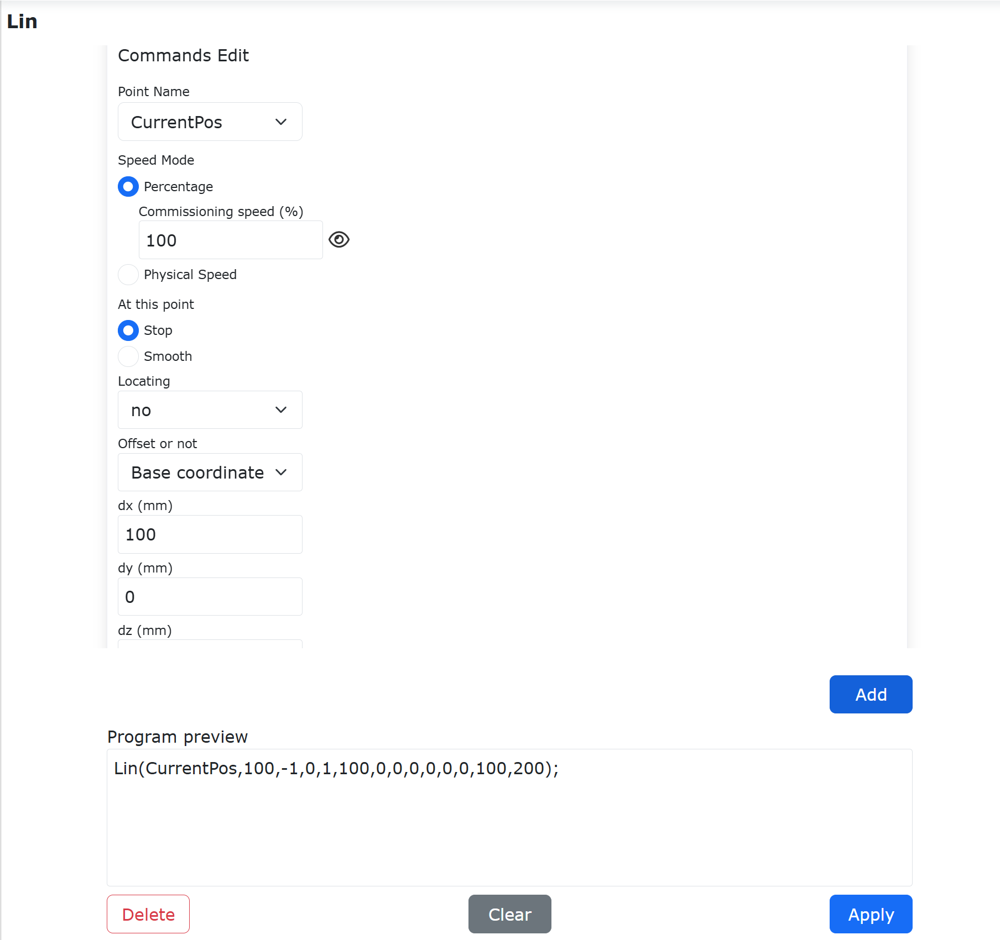

.. centered:: Abbildung 9.5-2-1 LIN-Relativbewegungsbefehl

Klicken Sie auf die Schaltflächen "Hinzufügen" und "Übernehmen", um dem Lua-Programm einen LIN-Relativbewegungsbefehl für den Roboter hinzuzufügen. Schalten Sie den Roboter in den Automatikmodus und klicken Sie auf die Starttaste. Im Beispielprogramm bewegt sich der Roboter von seiner aktuellen Position aus 100 mm in die positive X-Richtung des Basiskoordinatensystems.

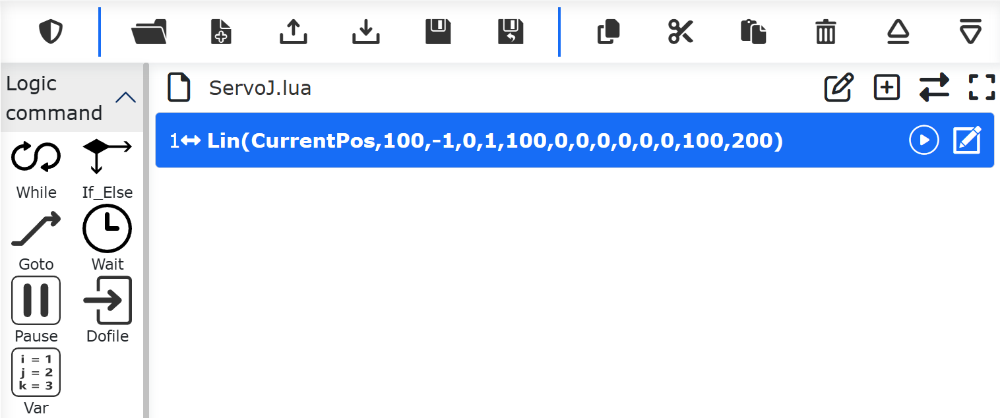

.. centered:: Abbildung 9.5-2-2 Hinzufügen eines LIN-Relativbewegungsbefehls

Die LIN-Relativbewegung des Roboters unterstützt Funktionen wie Glättung, physikalische Geschwindigkeit und Schweißdraht-Positionssuche.

.. important:: Wenn als Punktname "seamPos" gewählt wird, wird der Lin-Befehl in Schweißszenarien mit Lasersensor verwendet. Aufgrund des akkumulierten Fehlers während des Schweißvorgangs wurden die Optionen "Ob Versatz" und "Versatzbetrag" hinzugefügt.

   **Ob Versatz**: Nein, Versatz im Basiskoordinatensystem, Versatz im Werkzeugkoordinatensystem, Versatz basierend auf Laserdaten;

   **Versatzbetrag**: ∆x, ∆y, ∆z, ∆rx, ∆ry, ∆rz, Bereich: -300~300;

   .. image:: coding/033.png
      :width: 6in
      :align: center

   .. centered:: Abbildung 9.5-2-3 Lin-Befehls-Oberfläche (Schweißszenario)

Beim LIN-Befehl kann der Geschwindigkeitsmodus als "Prozentsatz" oder "Physikalische Geschwindigkeit" gewählt werden:

- Prozentsatz: Eingabe des Testgeschwindigkeitsprozentsatzes. Der Roboter bewegt sich mit diesem Prozentsatz der Maximalgeschwindigkeit. Die tatsächliche Bewegungsgeschwindigkeit des Roboters berechnet sich zu: V = Roboter-Maximalgeschwindigkeit × globaler Geschwindigkeitsprozentsatz × Testgeschwindigkeitsprozentsatz. Wenn Sie den Mauszeiger über das kleine Auge rechts neben dem Eingabefeld "Testgeschwindigkeit" bewegen, wird die tatsächliche physikalische Geschwindigkeit (Einheit: mm/s) des Roboters im Hand- und Automatikmodus bei der aktuell eingestellten Testgeschwindigkeit angezeigt.

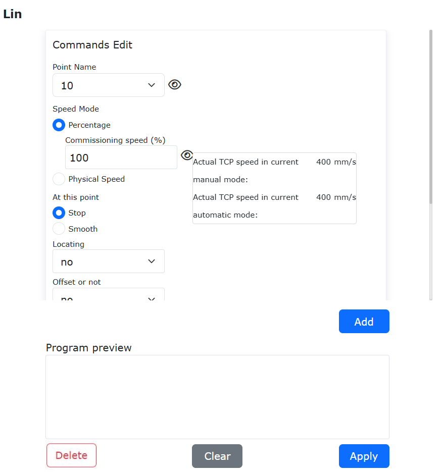

.. centered:: Abbildung 9.5-2-4 Eingabe Prozentsatz zeigt tatsächlichen physikalischen Geschwindigkeitswert an

- Physikalische Geschwindigkeit: Die eingegebene Geschwindigkeit ist die tatsächliche Betriebsgeschwindigkeit des Roboters, Einheit mm/s; die eingegebene Beschleunigung wird üblicherweise auf das Doppelte der Geschwindigkeit gesetzt. (Die maximale physikalische Geschwindigkeit des LIN-Befehls wird durch den globalen Geschwindigkeitsprozentsatz begrenzt. Wenn die maximale Betriebsgeschwindigkeit des Roboters 1000 mm/s beträgt und die globale Geschwindigkeit 50%, dann beträgt die maximale physikalische Geschwindigkeit des LIN-Befehls 1000 × 50% = 500 mm/s).

.. image:: coding/459.png
   :width: 5in
   :align: center

.. centered:: Abbildung 9.5-2-5 Eingabe der tatsächlichen physikalischen Geschwindigkeit

Funktion zur Behandlung von Gelenk-Übergeschwindigkeit bei LIN-Befehlen
************************************************************************

Bei Verwendung des kartesischen Linienbewegungsbefehls LIN ist die Randbedingung für die Planung die Lineargeschwindigkeit. Im tatsächlichen Betrieb kann es jedoch aufgrund des Arbeitsraums vorkommen, dass die Gelenkwinkelgeschwindigkeit den Grenzwert überschreitet, obwohl die Lineargeschwindigkeitsanforderung erfüllt wird. Diese Funktion bietet wählbare Behandlungsstrategien für den Fall einer Gelenk-Übergeschwindigkeit während einer LIN-Bewegung.

**Schritt 1**: Klicken Sie auf die Schaltfläche für den Linienbewegungsbefehl.

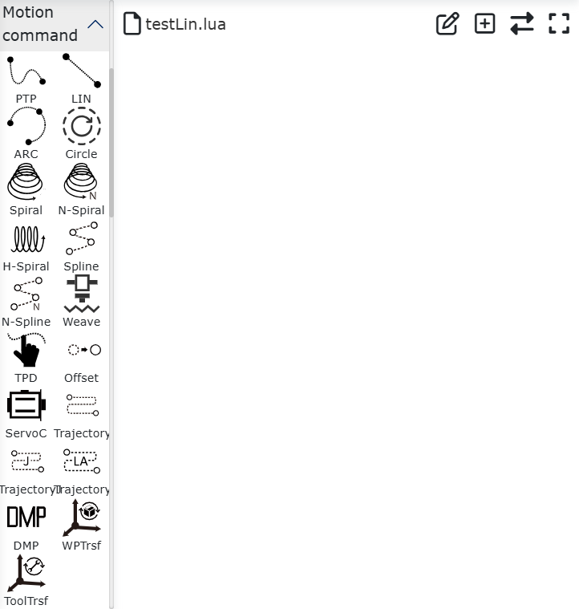

.. centered:: Abbildung 9.5-3-1 Klick auf die Schaltfläche für den Linienbewegungsbefehl

**Schritt 2**: Wählen Sie den Zielwegpunkt für den Linienbewegungsbefehl.

.. image:: coding/035.png
   :width: 6in
   :align: center

.. centered:: Abbildung 9.5-3-2 Auswahl des Zielwegpunkts für die Linienbewegung

**Schritt 3**: Aktivieren Sie den Schalter für den Gelenk-Übergeschwindigkeitsschutz.

.. image:: coding/036.png
   :width: 6in
   :align: center

.. centered:: Abbildung 9.5-3-3 Aktivierung des Schalters für den Gelenk-Übergeschwindigkeitsschutz

**Schritt 4**: Wählen Sie die Behandlungsstrategie für Gelenk-Übergeschwindigkeit (Auswahl zwischen "Fehler bei Übergeschwindigkeit" oder "Adaptive Geschwindigkeitsreduzierung", andere Optionen sind Standardstrategien ohne Schutz).

.. image:: coding/037.png
   :width: 6in
   :align: center

.. centered:: Abbildung 9.5-3-4 Behandlungsstrategien für Gelenk-Übergeschwindigkeit

**Schritt 5**:
   Stellen Sie die Behandlungsstrategie und deren Parameter ein und klicken Sie auf die Schaltfläche "Hinzufügen", um den Lua-Befehl hinzuzufügen.

   Bei der Strategie der adaptiven Geschwindigkeitsreduzierung ist die Geschwindigkeitsreduzierungsschwelle der Prozentsatz der Geschwindigkeitsreduzierung relativ zur eingestellten Linengeschwindigkeit. Wenn der Reduzierungswert die eingestellte Schwelle überschreitet, meldet der Roboter einen Fehler und stoppt.

.. image:: coding/038.png
   :width: 6in
   :align: center

.. centered:: Abbildung 9.5-3-5 Auswahl und Einstellung der Behandlungsstrategie für Gelenk-Übergeschwindigkeit

**Schritt 6**: Die Form des hinzugefügten Lua-Befehls ist in der Abbildung dargestellt.

.. image:: coding/039.png
   :width: 6in
   :align: center

.. centered:: Abbildung 9.5-3-6 Lua-Befehl

**Übergeschwindigkeitsschutz Start**: JointOverSpeedProtectStart(a, b);
   a: Strategienummer (entsprechend der Reihenfolge im Dropdown-Menü)
   b: Schwellwert-Prozentsatz (0~100, wirkt nur bei adaptiver Geschwindigkeitsreduzierung)

**Übergeschwindigkeitsschutz Ende**: JointOverSpeedProtectEnd();

.. note:: Informationen zum Bewegungsschutz "Singularität durchqueren" finden Sie in der Beschreibung der Funktion zur Singularitätsdurchquerung im Automatikmodus.

Funktion zur Einstellbarkeit der Winkelgeschwindigkeit beim Eckübergang
************************************************************************

Wenn während des Schweißprozesses ein Werkstück mit einer Eckschweißung bearbeitet werden muss oder wenn eine schnelle Überleitung in einer bestimmten linearen Planung (große Poseänderung bei kleiner Positionsänderung, aber die Linengeschwindigkeit darf nicht erhöht werden) erforderlich ist, kann diese Funktion verwendet werden.

**Schritt 1**: Stellen Sie das Werkzeugkoordinatensystem ein und kalibrieren Sie die Abmessungen und die Pose des Schweißbrenners.

.. note:: Die Werte in der Oberfläche sind nur Beispiele. Maßgeblich ist der tatsächliche Zustand des Werkzeugs.

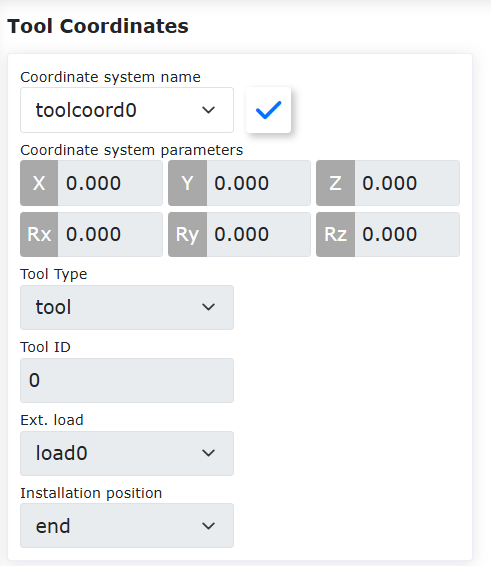

.. centered:: Abbildung 9.5-3-7 Einstellung des Werkzeugkoordinatensystems

**Schritt 2**: Klicken Sie auf "Teach-Programm", wählen Sie "Programmierung" und dann in der Kategorie "Bewegungsbefehle" die Option "Linie".

.. centered:: Abbildung 9.5-3-8 Einstellungsoberfläche für Lin-Befehl

**Schritt 3**: Legen Sie den Startpunkt jedes Liniensegments der Eckschweißung als Übergangspunkt fest. Aktivieren Sie die Schaltfläche "Übergangspunkt-Winkelgeschwindigkeit einstellbar" und stellen Sie den maximalen Beschleunigungsprozentsatz ein (standardmäßig ist die maximale Winkelgeschwindigkeit 100% = 360°/s).

.. image:: coding/248.png
   :width: 6in
   :align: center

.. centered:: Abbildung 9.5-3-9 Konfigurationsoberfläche für die Anpassung der Übergangspunkt-Winkelgeschwindigkeit

**Schritt 4**: Klicken Sie auf die Schaltfläche "Hinzufügen", um einen Linienbefehl zu generieren, der die Anpassung der Übergangswinkelgeschwindigkeit enthält.

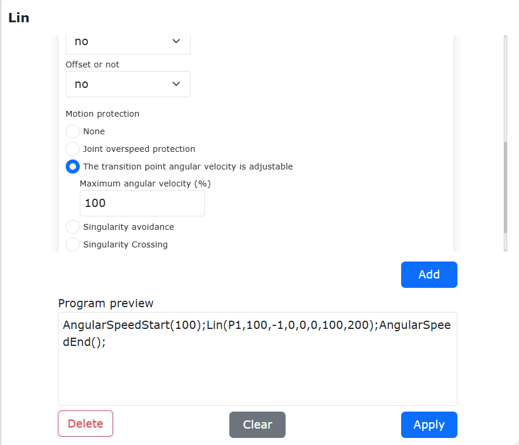

.. centered:: Abbildung 9.5-3-10 Hinzufügen eines Linienbewegungsbefehls mit Übergangspunkt

**Schritt 5**: Der Roboter führt am Startpunkt den Pose-Übergang durch, führt dann normal den Linienbefehl zum Endpunkt dieses Segments aus. Deaktivieren Sie die Schaltfläche "Übergangspunkt-Winkelgeschwindigkeit einstellbar" und fügen Sie den Zielwegpunkt hinzu.

.. image:: coding/250.png
   :width: 6in
   :align: center

.. centered:: Abbildung 9.5-3-11 Einfügen des Linienendpunkts

**Schritt 6**: Klicken Sie auf die Schaltfläche "Übernehmen", um den entsprechenden LUA-Befehl zu generieren.

.. image:: coding/251.png
   :width: 6in
   :align: center

.. centered:: Abbildung 9.5-3-12 Generierung eines LUA-Linienbefehls mit Übergangspunkt

Eine vollständige Eckschweißung umfasst typischerweise mehrere Übergangspunkte. Bei der in Abbildung 7 gezeigten Eckschweißung gibt es während des Schweißvorgangs zwei Pose-Übergangspunkte mit kleiner Positionsänderung und großer Poseänderung.

Punkt 1 ist der Startpunkt des ersten Schweißabschnitts, Punkt 2 der Endpunkt des ersten Schweißabschnitts;
Punkt 3 ist der Startpunkt des zweiten Schweißabschnitts, Punkt 4 der Endpunkt des zweiten Schweißabschnitts;
Punkt 5 ist der Startpunkt des dritten Schweißabschnitts, Punkt 6 der Endpunkt des dritten Schweißabschnitts.

Der Pose-Übergang findet zwischen dem Endpunkt des vorherigen Schweißabschnitts und dem Startpunkt des nächsten Schweißabschnitts statt. Daher muss am Startpunkt des nächsten Schweißabschnitts ein Befehl zur Anpassung der Winkelgeschwindigkeit hinzugefügt werden. Dadurch bleibt die maximale Linengeschwindigkeit während des Eck-Pose-Übergangs unverändert, während die maximale Winkelgeschwindigkeit erhöht wird, was einen reibungslosen Ablauf des Eckschweißprozesses ermöglicht.

.. image:: coding/252.png
   :width: 4in
   :align: center

.. centered:: Abbildung 9.5-3-13 Beispiel für einen Eckschweißablauf

Kreisbogen-Befehl
+++++++++++++++++

Klicken Sie auf das Symbol "Kreisbogen", um die Bearbeitungsoberfläche für den Arc-Befehl zu öffnen.

Der "Arc"-Befehl ist eine Kreisbogenbewegung, die drei Punkte umfasst: Der erste Punkt ist der Startpunkt des Kreisbogens, der zweite Punkt ist der Zwischenpunkt des Kreisbogens und der dritte Punkt ist der Endpunkt.

Für sowohl den Zwischenpunkt als auch den Endpunkt kann eingestellt werden, ob ein Versatz erfolgen soll. Es kann ein Versatz basierend auf dem Basiskoordinatensystem oder dem Werkzeugkoordinatensystem ausgewählt werden. Es öffnen sich dann Eingabefelder für den Versatz in x, y, z, rx, ry, rz. Für den Endpunkt kann ein Glättungsübergangsradius eingestellt werden, um einen kontinuierlichen Bewegungseffekt zu erzielen.

.. important::
   Für eine Kreisbogenbewegung muss zuerst ein PTP- oder Lin-Befehl hinzugefügt werden, um zum Startpunkt zu gelangen.

.. image:: coding/040.png
   :width: 6in
   :align: center

.. centered:: Abbildung 9.5-4 Arc-Befehls-Oberfläche

Beim ARC-Befehl kann der Geschwindigkeitsmodus als "Prozentsatz" oder "Physikalische Geschwindigkeit" gewählt werden:

- Prozentsatz: Eingabe des Testgeschwindigkeitsprozentsatzes. Der Roboter bewegt sich mit diesem Prozentsatz der Maximalgeschwindigkeit. Die tatsächliche Bewegungsgeschwindigkeit des Roboters berechnet sich zu: V = Roboter-Maximalgeschwindigkeit × globaler Geschwindigkeitsprozentsatz × Testgeschwindigkeitsprozentsatz. Wenn Sie den Mauszeiger über das kleine Auge rechts neben dem Eingabefeld "Testgeschwindigkeit" bewegen, wird die tatsächliche physikalische Geschwindigkeit (Einheit: mm/s) des Roboters im Hand- und Automatikmodus bei der aktuell eingestellten Testgeschwindigkeit angezeigt.

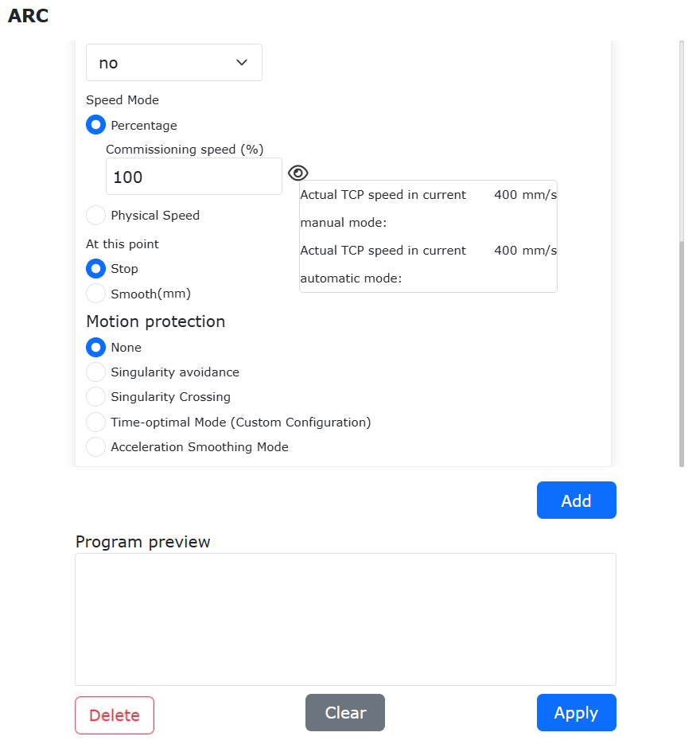

.. centered:: Abbildung 9.5-4-1 Eingabe Prozentsatz zeigt tatsächlichen physikalischen Geschwindigkeitswert an

- Physikalische Geschwindigkeit: Die eingegebene Geschwindigkeit ist die tatsächliche Betriebsgeschwindigkeit des Roboters, Einheit mm/s; die eingegebene Beschleunigung wird üblicherweise auf das Doppelte der Geschwindigkeit gesetzt. (Die maximale physikalische Geschwindigkeit des LIN-Befehls wird durch den globalen Geschwindigkeitsprozentsatz begrenzt. Wenn die maximale Betriebsgeschwindigkeit des Roboters 1000 mm/s beträgt und die globale Geschwindigkeit 50%, dann beträgt die maximale physikalische Geschwindigkeit des LIN-Befehls 1000 × 50% = 500 mm/s).

.. image:: coding/462.png
   :width: 5in
   :align: center

.. centered:: Abbildung 9.5-4-2 Eingabe der tatsächlichen physikalischen Geschwindigkeit

Kreis-Befehl
++++++++++++

Klicken Sie auf das Symbol "Kreis", um die Bearbeitungsoberfläche für den Circle-Befehl zu öffnen.

Durch Hinzufügen eines Kreisbefehls kann der kollaborative Roboter eine kreisförmige Bahnbewegung ausführen. Vor dem Hinzufügen eines Kreisbefehls müssen drei Bahnpunkte auf der Kreisbahn angefahren werden. Angenommen, die drei Bahnpunkte auf der Kreisbahn sind "P1", "P2" und "P3". "P1" ist der Startpunkt der Kreisbahn, "P2" und "P3" sind die Zwischenpunkte 1 und 2 der Kreisbahn. Bewegen Sie den Roboter zu diesen drei Punkten und fügen Sie die Teachpunktnamen als "P1", "P2", "P3" hinzu.

.. important::
   Für eine Kreisbahnbewegung muss zuerst ein PTP- oder Lin-Befehl hinzugefügt werden, um zum Startpunkt zu gelangen.

.. image:: coding/042.png
   :width: 3in
   :align: center

.. centered:: Abbildung 9.5-5 Kreisbahn

.. image:: coding/043.png
   :width: 3in
   :align: center

.. image:: coding/044.png
   :width: 3in
   :align: center

.. image:: coding/045.png
   :width: 3in
   :align: center

.. centered:: Abbildung 9.5-6 Anfahren der Punkte "P1", "P2", "P3"

Hinzufügen eines Kreisbefehls
********************************

**Schritt 1**: Erstellen Sie ein neues Benutzerprogramm "testCircle.lua" und klicken Sie auf die Schaltfläche "Kreis", um die Seite zum Hinzufügen von Kreisbefehlen zu öffnen.

.. image:: coding/046.png
   :width: 6in
   :align: center

.. centered:: Abbildung 9.5-7 Schaltfläche zum Hinzufügen eines Kreisbefehls

**Schritt 2**: Wählen Sie auf der Seite zum Hinzufügen von Kreisbefehlen die Bewegungsart für den Startpunkt und den Startpunkt "P1".

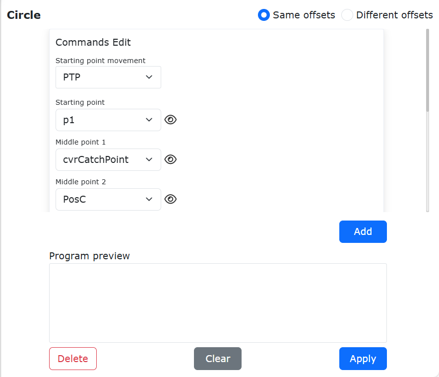

.. centered:: Abbildung 9.5-8 Bewegungsart für Startpunkt und Startpunkt "P1"

**Schritt 3**: Wählen Sie auf der Seite zum Hinzufügen von Kreisbefehlen für "Kreis-Zwischenpunkt 1" den Punkt "P2" und für "Kreis-Zwischenpunkt 2" den Punkt "P3".

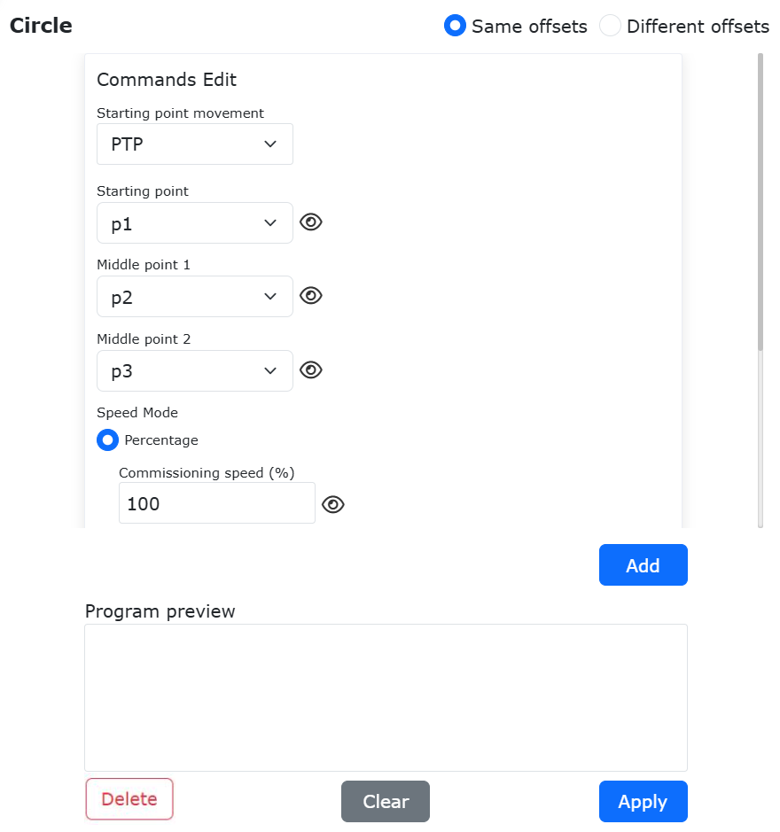

.. centered:: Abbildung 9.33-9 Auswahl der Kreis-Zwischenpunkte und des Endpunkts

**Schritt 4**: Wählen Sie den Geschwindigkeitsmodus und geben Sie den Geschwindigkeitswert ein.

Beim Circle-Befehl kann der Geschwindigkeitsmodus als "Prozentsatz" oder "Physikalische Geschwindigkeit" gewählt werden:

- Prozentsatz: Eingabe des Testgeschwindigkeitsprozentsatzes. Der Roboter bewegt sich mit diesem Prozentsatz der Maximalgeschwindigkeit. Die tatsächliche Bewegungsgeschwindigkeit des Roboters berechnet sich zu: V = Roboter-Maximalgeschwindigkeit × globaler Geschwindigkeitsprozentsatz × Testgeschwindigkeitsprozentsatz. Wenn Sie den Mauszeiger über das kleine Auge rechts neben dem Eingabefeld "Testgeschwindigkeit" bewegen, wird die tatsächliche physikalische Geschwindigkeit (Einheit: mm/s) des Roboters im Hand- und Automatikmodus bei der aktuell eingestellten Testgeschwindigkeit angezeigt.

.. image:: coding/466.png
   :width: 5in
   :align: center

.. centered:: Abbildung 9.33-10 Eingabe Prozentsatz zeigt tatsächlichen physikalischen Geschwindigkeitswert an

- Physikalische Geschwindigkeit: Die eingegebene Geschwindigkeit ist die tatsächliche Betriebsgeschwindigkeit des Roboters, Einheit mm/s; die eingegebene Beschleunigung wird üblicherweise auf das Doppelte der Geschwindigkeit gesetzt. (Die maximale physikalische Geschwindigkeit des LIN-Befehls wird durch den globalen Geschwindigkeitsprozentsatz begrenzt. Wenn die maximale Betriebsgeschwindigkeit des Roboters 1000 mm/s beträgt und die globale Geschwindigkeit 50%, dann beträgt die maximale physikalische Geschwindigkeit des LIN-Befehls 1000 × 50% = 500 mm/s).

.. image:: coding/467.png
   :width: 5in
   :align: center

.. centered:: Abbildung 9.33-11 Eingabe der tatsächlichen physikalischen Geschwindigkeit

**Schritt 5**: Klicken Sie nacheinander auf die Schaltflächen "Hinzufügen" und "Übernehmen". Nun wurde der "testCircle.lua"-Datei ein Kreisbewegungsbefehl hinzugefügt.

.. image:: coding/468.png
   :width: 6in
   :align: center

.. centered:: Abbildung 9.33-12 Hinzufügen eines Kreisbewegungsbefehls

**Schritt 5**: Nun wurde der "testCircle.lua"-Datei ein Kreisbewegungsbefehl hinzugefügt.

Schalten Sie den Roboter in den Automatikmodus und starten Sie das Programm unter Sicherstellung der Sicherheit. Der Roboter führt dann die Bewegung entlang der Kreisbahn aus.

Kreisbahn-Versatz
*****************

Die Kreisbewegung des kollaborativen Roboters unterstützt einen Versatz der Positionen von Kreis-Zwischenpunkt 1 und Kreis-Zwischenpunkt 2. Es gibt zwei Arten des Versatzes:

**Gleicher Versatz für beide Kreis-Zwischenpunkte**: Die Kreis-Zwischenpunkte 1 ("P2") und 2 ("P3") werden mit dem gleichen Versatzbetrag ∆(dx, dy, dz, drx, dry, drz) versetzt.

**Unterschiedlicher Versatz für beide Kreis-Zwischenpunkte**: Die Kreis-Zwischenpunkte 1 ("P2") und 2 ("P3") werden mit zwei unterschiedlichen Versatzbeträgen ∆1(dx1, dy1, dz1, drx1, dry1, drz1) und ∆2(dx2, dy2, dz2, drx2, dry2, drz2) versetzt.

Im Folgenden wird die Verwendung von "gleichem Versatz" und "unterschiedlichem Versatz" gezeigt.

1. Gleicher Versatz

Öffnen Sie die Seite zum Hinzufügen von Kreisbefehlen, wählen Sie als "Versatztyp" die Option "Gleicher Versatz". Wählen Sie ebenfalls die Bewegungsart für den Startpunkt und den Startpunkt "P1" sowie den Kreis-Zwischenpunkt 1 als "P2".

.. image:: coding/051.png
   :width: 6in
   :align: center

.. centered:: Abbildung 9.5-12 Gleicher Versatz beim Kreis

Wählen Sie für Kreis-Zwischenpunkt 2 "P3" und für "Ob Versatz" die Option "Basiskoordinaten-Versatz".

.. note:: Sie können je nach tatsächlicher Arbeitssituation auch "Werkzeugkoordinaten-Versatz" wählen.

Geben Sie den Versatzbetrag dx = 10 mm ein und klicken Sie nacheinander auf die Schaltflächen "Hinzufügen" und "Übernehmen" am unteren Ende der Seite.

.. image:: coding/052.png
   :width: 6in
   :align: center

.. centered:: Abbildung 9.5-13 Einstellung des Versatzbetrags

Nun wurde dem Programm "testCircle.lua" ein Kreisbefehl hinzugefügt, bei dem der Startpunkt "P1" und beide Zwischenpunkte "P2" und "P3" um 10 mm in X-Richtung des Basiskoordinatensystems versetzt sind.

.. image:: coding/053.png
   :width: 6in
   :align: center

.. centered:: Abbildung 9.5-14 Programm für gleichen Versatz beim Kreis

Schalten Sie den Roboter in den Automatikmodus und starten Sie das Programm unter Sicherstellung der Sicherheit. Die tatsächliche Bewegungsbahn des Roboters ist ein Kreis durch "P1", "P2'" und "P3'", wobei "P2'" der um 10 mm in X-Richtung versetzte ursprüngliche Punkt "P2" und "P3'" der um 10 mm in X-Richtung versetzte ursprüngliche Punkt "P3" ist.

.. image:: coding/054.png
   :width: 3in
   :align: center

.. centered:: Abbildung 9.5-15 Bahn bei gleichem Versatz X10mm

2. Unterschiedlicher Versatz

Öffnen Sie die Seite zum Hinzufügen von Kreisbefehlen, wählen Sie als "Versatztyp" die Option "Unterschiedlicher Versatz". Wählen Sie ebenfalls die Bewegungsart für den Startpunkt und den Startpunkt "P1". Wählen Sie für Kreis-Zwischenpunkt 1 "P2" und als "Ob Versatz" die Option "Basiskoordinaten-Versatz".

.. note::
   Sie können je nach tatsächlicher Arbeitssituation auch "Werkzeugkoordinaten-Versatz" wählen.

Geben Sie den Versatzbetrag dy = 10 mm ein.

.. image:: coding/055.png
   :width: 6in
   :align: center

.. centered:: Abbildung 9.5-16 Unterschiedlicher Versatz

Wählen Sie für Kreis-Zwischenpunkt 2 "P3" und als "Ob Versatz" die Option "Basiskoordinaten-Versatz".

.. note:: Sie können je nach tatsächlicher Arbeitssituation auch "Werkzeugkoordinaten-Versatz" wählen.

Geben Sie den Versatzbetrag dx = 10 mm ein und klicken Sie nacheinander auf die Schaltflächen "Hinzufügen" und "Übernehmen" am unteren Ende der Seite.

.. image:: coding/056.png
   :width: 6in
   :align: center

.. centered:: Abbildung 9.5-17 Einstellung des Versatzes für Zwischenpunkt 2 bei unterschiedlichem Versatz

Nun wurde dem Programm "testCircle.lua" ein Kreisbefehl hinzugefügt, bei dem der Startpunkt "P1" ist, der Zwischenpunkt "P2" um 10 mm in Y-Richtung des Basiskoordinatensystems versetzt ist und der Zwischenpunkt "P3" um 10 mm in X-Richtung des Basiskoordinatensystems versetzt ist.

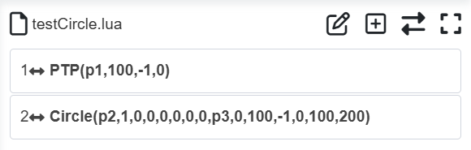

.. centered:: Abbildung 9.5-18 Programm für unterschiedlichen Versatz der beiden Kreispunkte

Schalten Sie den Roboter in den Automatikmodus und starten Sie das Programm unter Sicherstellung der Sicherheit. Die tatsächliche Bewegungsbahn des Roboters ist ein Kreis durch "P1", "P2'" und "P3'", wobei "P2'" der um 10 mm in Y-Richtung versetzte ursprüngliche Punkt "P2" und "P3'" der um 10 mm in X-Richtung versetzte ursprüngliche Punkt "P3" ist.

.. image:: coding/058.png
   :width: 3in
   :align: center

.. centered:: Abbildung 9.5-19 Bahn bei unterschiedlichem Versatz der beiden Kreispunkte

Spiral-Befehl
+++++++++++++

Klicken Sie auf das Symbol "Spirale", um die Bearbeitungsoberfläche für den Spiral-Befehl zu öffnen.

Der "Spiral"-Befehl ist eine Spiralbewegung, die drei Punkte umfasst. Diese drei Punkte bilden einen Kreis. Auf der Einstellungsseite für den dritten Punkt gibt es Parameter für die Anzahl der Windungen, den Pose-Korrekturwinkel, die Radiusinkrement und die Achsrichtungsinkrement. Die Anzahl der Windungen ist die Anzahl der Bewegungen der Spirale. Der Pose-Korrekturwinkel korrigiert die Pose am Ende der Spirale im Verhältnis zur Pose des ersten Punkts der Spirale. Die Radiusinkrement ist die Zunahme des Radius pro Windung. Die Achsrichtungsinkrement ist die Zunahme in Richtung der Spiralachse. Bei der Einstellung "Ob Versatz" wirkt sich dieser Versatz auf die gesamte Spirale aus.

.. image:: coding/059.png
   :width: 6in
   :align: center

.. centered:: Abbildung 9.5-20 Spiral-Befehls-Oberfläche

Neuer Spiral-Befehl
+++++++++++++++++++

Klicken Sie auf das Symbol "Neue Spirale", um die Bearbeitungsoberfläche für den N-Spiral-Befehl zu öffnen.

Der "N-Spiral"-Befehl ist eine optimierte Version der Spiralbewegung. Dieser Befehl benötigt nur einen Punkt plus Konfiguration verschiedener Parameter, um die Spiralbewegung zu realisieren. Der Roboter startet an seiner aktuellen Position. Der Benutzer stellt Parameter ein wie Testgeschwindigkeit, ob Versatz, Anzahl der Windungen, Spiralneigungswinkel, Anfangsradius, Radiusinkrement, Achsrichtungsinkrement und Drehrichtung. Die Anzahl der Windungen ist die Anzahl der Bewegungen der Spirale. Der Spiralneigungswinkel ist der Winkel zwischen der Werkzeug-Z-Achse und der Horizontalen. Der Pose-Korrekturwinkel korrigiert die Pose am Ende der Spirale im Verhältnis zur Pose des ersten Punkts der Spirale. Der Anfangsradius ist die Größe des Radius in der ersten Windung. Die Radiusinkrement ist die Zunahme des Radius pro Windung. Die Achsrichtungsinkrement ist die Zunahme in Richtung der Spiralachse. Die Drehrichtung ist im Uhrzeigersinn oder gegen den Uhrzeigersinn.

.. image:: coding/060.png
   :width: 6in
   :align: center

.. centered:: Abbildung 9.5-21 N-Spiral-Befehls-Oberfläche

Funktion zur Einstellung einer konstanten Geschwindigkeit pro Spiralwindung
*****************************************************************************************

Übersicht
"""""""""
Bei Verwendung des Spiralbewegungsbefehls kann die Bewegungsgeschwindigkeit der Spirale so eingestellt werden, dass die Geschwindigkeit jeder Windung konstant auf dem eingestellten Wert bleibt.

Ablauf
"""""""
**Schritt 1**: Wählen Sie den Teachpunkt für die Spiralbewegung aus. In diesem Handbuch wird "P0" als Name des Teachpunkts verwendet.

**Schritt 2**: Klicken Sie auf "Teach-Programm" -> "Programmierung" und wählen Sie den Befehl "Neue Spirale". Wählen Sie im "Geschwindigkeitsmodus" die Option "Physikalische Geschwindigkeit" und stellen Sie den Geschwindigkeitswert und den Beschleunigungswert ein. Dieser Geschwindigkeitswert ist die tatsächliche Bewegungsgeschwindigkeit der Spirale. Stellen Sie je nach Bedarf die Parameter "Anzahl der Windungen", "Spiralneigungswinkel", "Anfangsradius", "Radiusinkrement", "Achsrichtungsinkrement" und "Drehrichtung" ein, wie in Abbildung 2-1 gezeigt.

.. image:: coding/492.png
   :width: 6in
   :align: center

.. centered:: Abbildung 9.5-21-1 Parametereinstellung für neue Spirale

**Schritt 3**: Fügen Sie den Bewegungsbefehl hinzu, generieren Sie das Lua-Programm und führen Sie es aus. Der Roboter führt dann die Spiralenfunktion mit der eingestellten Geschwindigkeit aus, wie in Abbildung 2-2 gezeigt.

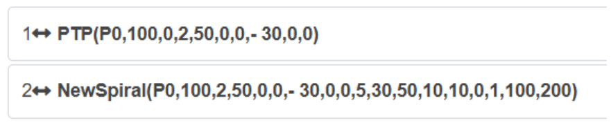

.. centered:: Abbildung 9.5-21-2 Typisches Programm zum Ausführen einer Spirale mit eingestellter Geschwindigkeit

Horizontal-Spiral-Befehl
++++++++++++++++++++++++

Klicken Sie auf das Symbol "Horizontalspirale", um die Bearbeitungsoberfläche für den H-Spiral-Befehl zu öffnen.

Der "H-Spiral"-Befehl ist eine horizontale Spiralbewegung im Raum. Dieser Befehl wird nach einem einzelnen Bewegungsbefehl (Linie) eingefügt.

   - Spiralradius: 0~100 mm
   - Spiralwinkelgeschwindigkeit: 0~2 U/s
   - Drehrichtung: Spirale im/gegen den Uhrzeigersinn
   - Spiralneigung: 0~40°

.. image:: coding/061.png
   :width: 6in
   :align: center

.. centered:: Abbildung 9.5-22 H-Spiral-Befehls-Oberfläche

Spline-Befehl
+++++++++++++

Klicken Sie auf das Symbol "Spline", um die Bearbeitungsoberfläche für den Spline-Befehl zu öffnen.

Dieser Befehl besteht aus drei Teilen: Spline-Gruppenstart, Spline-Segment und Spline-Gruppenende. Der Spline-Gruppenstart ist das Startkennzeichen der Spline-Bewegung. Die Spline-Segmente umfassen SPL-, SLIN- und SCIRC-Segmente. Klicken Sie auf das entsprechende Symbol, um die Befehlshinzufügungsoberfläche aufzurufen. Das Spline-Gruppenende ist das Endkennzeichen der Spline-Bewegung.

.. image:: coding/062.png
   :width: 6in
   :align: center

.. centered:: Abbildung 9.5-23 Spline-Befehls-Oberfläche

Neuer Spline-Befehl
+++++++++++++++++++

Klicken Sie auf das Symbol "Neuer Spline", um die Bearbeitungsoberfläche für den N-Spline-Befehl zu öffnen.

Dieser Befehl ist eine algorithmisch optimierte Version des Spline-Befehls und wird in Zukunft den vorhandenen Spline-Befehl ersetzen.

Dieser Befehl besteht aus drei Teilen: Mehrpunktbahn-Start, Mehrpunktbahn-Segment und Mehrpunktbahn-Ende. Der Mehrpunktbahn-Start ist das Startkennzeichen der Mehrpunktbahn-Bewegung. Das Mehrpunktbahn-Segment dient zum Setzen der einzelnen Bahnpunkte.

Klicken Sie auf das Symbol, um die Punkt-Hinzufügungsoberfläche aufzurufen. Das Mehrpunktbahn-Ende ist das Endkennzeichen der Mehrpunktbahn-Bewegung. Hier können der Steuermodus und die Testgeschwindigkeit eingestellt werden.

- Steuermodus: Kreisbogen-Übergangspunkt / Vorgegebener Bahnpunkt
- Globale durchschnittliche Übergangszeit: Ganzzahl, größer als 10, Standardwert 2000

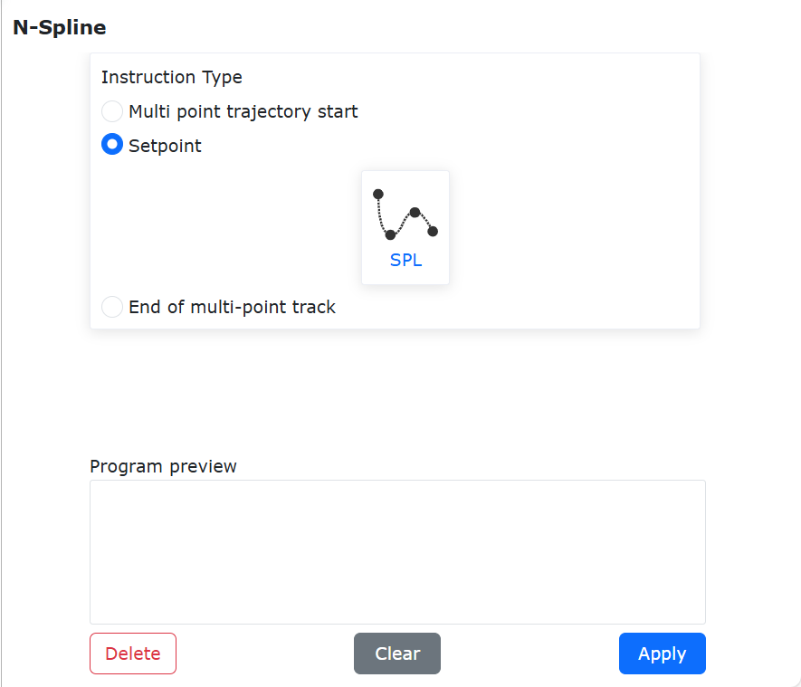

.. centered:: Abbildung 9.5-24 N-Spline-Befehls-Oberfläche

Pendel-Befehl
+++++++++++++

Klicken Sie auf das Symbol "Pendeln", um die Bearbeitungsoberfläche für den Weave-Befehl zu öffnen. Der "Weave"-Befehl besteht aus zwei Teilen:

- Wählen Sie die Nummer der konfigurierten Pendelschweißung aus. Klicken Sie auf "Pendeln starten" und "Pendeln stoppen" und übernehmen Sie, um die entsprechenden Befehle zum Programm hinzuzufügen.

.. image:: coding/064.png
   :width: 6in
   :align: center

.. centered:: Abbildung 9.5-25 Weave-Befehls-Oberfläche

- Klicken Sie auf "Konfigurieren & Testen". Je nach Anwendungsszenario kann der Pendeltyp ausgewählt und die Parameter der Pendelschweißung konfiguriert werden. Nach der Konfiguration kann die Pendelbahn über die Tasten "Pendeln starten Test" und "Pendeln stoppen Test" getestet werden. Derzeit verfügbare Pendeltypen sind:

   - Dreieckwelle pendeln (LIN/ARC)
   - Vertikale L-förmige Dreieckwelle pendeln (LIN/ARC)
   - Kreisförmiges Pendeln - im Uhrzeigersinn (LIN)
   - Kreisförmiges Pendeln - gegen den Uhrzeigersinn (LIN)
   - Sinuswelle pendeln (LIN/ARC)
   - Vertikale L-förmige Sinuswelle pendeln (LIN/ARC)
   - Stehnaht-Dreieckpendeln

.. image:: coding/065.png
   :width: 6in
   :align: center

.. centered:: Abbildung 9.5-26 Weave-Konfigurations- und Testbefehls-Oberfläche

Schrägsägezahn-Pendelfunktion
******************************

Durch die Verwendung der Schrägsägezahn-Pendelfunktion kann das Werkzeugende des Roboters im kartesischen Raum eine schräge, sägezahnförmige Pendelbahn bilden. Das Schrägpendeln wird einer linearen Planung überlagert. Der Schrägungsbetrag wird durch den Azimutwinkelparameter gesteuert. Er gibt die Neigung des Azimutwinkels auf der festgelegten Pendelschweißebene an (Einheit: Grad).

Bei einem positiven Wert neigt sich der linke Endpunkt in Bewegungsrichtung, bei einem negativen Wert der rechte Endpunkt. Bei 90 Grad oder -90 Grad kann entlang der Bewegungsrichtung gependelt werden.

.. image:: coding/066.png
   :width: 4in
   :align: center

.. centered:: Abbildung 9.5-26-1 Einfluss des Pendel-Azimutwinkels

**Schritt 1**: Bearbeiten und setzen Sie die grundlegende Linearbewegung.

.. image:: coding/067.png
   :width: 4in
   :align: center

.. centered:: Abbildung 9.5-26-2 Beispiel für ein Lua-Programm mit grundlegender Linearbewegung

**Schritt 2**: Klicken Sie auf, um einen Pendelbefehl hinzuzufügen.

.. image:: coding/068.png
   :width: 5in
   :align: center

.. centered:: Abbildung 9.5-26-3 Klick zum Hinzufügen eines Pendelbefehls

**Schritt 3**: Klicken Sie auf der Konfigurationsseite für den Pendelbefehl auf die Schaltfläche "Konfigurieren". Wählen Sie im Dropdown-Menü "Pendeltyp" die Option "Dreieckwelle pendeln" oder "Sinuswelle pendeln", geben Sie den entsprechenden "Pendelrichtungs-Azimutwinkel" ein und klicken Sie auf "Übernehmen".

.. image:: coding/069.png
   :width: 6in
   :align: center

.. centered:: Abbildung 9.5-26-4 Pendelparameter-Konfiguration

**Schritt 4**: Klicken Sie auf die Schaltfläche "Pendeln starten", um den Pendelbefehl oberhalb der Linearbewegung hinzuzufügen. Klicken Sie auf die Schaltfläche "Pendeln beenden", um den Pendelbefehl unterhalb der Linearbewegung hinzuzufügen.

.. image:: coding/070.png
   :width: 4in
   :align: center

.. centered:: Abbildung 9.5-26-5 Lua-Programm nach Hinzufügen des Pendelbefehls

**Schritt 5**: Klicken Sie auf "Start", die resultierende Bahn des Roboterendes ist in der Abbildung dargestellt.

.. image:: coding/071.png
   :width: 3in
   :align: center

.. image:: coding/072.png
   :width: 3in
   :align: center

.. centered:: Abbildung 9.5-26-6 Sägezahnpendeln (links) Schrägsägezahnpendeln (rechts)

Bahnreproduktions-Befehl
++++++++++++++++++++++++

Klicken Sie auf die Schaltfläche "Bahn reproduzieren", um die Bearbeitungsoberfläche für den TPD-Befehl zu öffnen.

Bei diesem Befehl muss der Benutzer zunächst eine aufgezeichnete Bahn haben.

Zum Aufzeichnen einer Bahn: Bevor Sie mit der Aufzeichnung beginnen, speichern Sie den Startpunkt der Bahn. Wenn sich der Roboter im Drag-Modus befindet, geben Sie einen Dateinamen ein, wählen Sie den Zyklus (angenommen der Wert x, d. h. alle x Millisekunden wird ein Punkt aufgezeichnet, empfohlen werden 4 ms). Klicken Sie auf "Aufzeichnung starten". Der Benutzer kann den Roboter je nach Bedarf für die gewünschte Bewegung ziehen. Nach Abschluss der Aufzeichnung klicken Sie auf "Aufzeichnung stoppen", um die zuvor aufgezeichnete Bewegungsbahn des Roboters zu speichern. Wenn eine Bewegung nicht vollständig aufgezeichnet werden kann, erscheint ein Hinweis, dass die Anzahl der Aufzeichnungspunkte überschritten wurde. Der Benutzer muss die Bewegung in mehreren Durchgängen aufzeichnen.

Bei der Programmerstellung wird zunächst mit einem PTP-Befehl der entsprechende Startpunkt der Bahn angefahren. Dann wählen Sie im TPD-Bahnreproduktionsbefehl die Bahn aus, legen fest, ob geglättet werden soll, stellen die Testgeschwindigkeit ein und klicken nacheinander auf "Hinzufügen" und "Übernehmen", um den Befehl in das Programm einzufügen. Der Bahnladebefehl dient hauptsächlich dazu, die Bahndatei vorab einzulesen und in Bahnbefehle zu extrahieren, um sie besser in Förderbandverfolgungsszenarien anwenden zu können.

.. note::
   Detaillierte Informationen zur TPD-Operation finden Sie im Modul zur Funktionsbeschreibung der Teach-Programmierung (TPD).

.. image:: coding/073.png
   :width: 6in
   :align: center

.. centered:: Abbildung 9.5-27 TPD-Befehls-Oberfläche

TPD-Funktion für das Einlernen und Abspielen von Roboterbahnen
*******************************************************************************

Überblick
""""""""""""""""""""
Die TPD-Funktion für das Einlernen und Abspielen von Roboterbahnen ermöglicht es dem Roboter, komplexe eingelernte Bahnen präzise zu speichern und zu wiederholen, wodurch eine qualitativ hochwertige und hocheffiziente automatisierte Produktion in der industriellen Fertigung erreicht wird und der Roboter in gefährlichen Umgebungen Menschen bei der Ausführung risikoreicher Aufgaben ersetzt.

Ablauf
""""""""""""""""""""""""""""""""""""""""""""""""""
**Schritt 1**: Einstellung der TPD-Aufnahmeparameter. Klicken Sie auf "TPD" in der Statusleiste am unteren Rand der Benutzeroberfläche, um den TPD-Funktionspunkt aufzurufen und die Parameter für die Bahnaufzeichnung zu konfigurieren. Legen Sie den Namen der Bahndatei, den Pose-Typ und die Abtastperiode fest und konfigurieren Sie DI und DO. Während der Aufzeichnung der TPD-Bahn wird durch Auslösen von DI bei der Wiedergabe der TPD der entsprechende DO ausgegeben.

.. image:: coding/549.png
   :width: 3in
   :align: center

.. centered:: Abbildung 9.5-27-1 TPD-Parametereinstellung

**Schritt 2**: Wechsel in den Drag-Modus. Im manuellen Modus gibt es zwei Möglichkeiten, in den Drag-Teaching-Modus zu wechseln: das lange Drücken der Endtaste und die Umschalttaste für den Drag-Modus auf der Benutzeroberfläche. Bei der TPD-Aufzeichnungsfunktion wird empfohlen, den Roboter über die Benutzeroberfläche in den Drag-Teaching-Modus zu schalten.

.. image:: coding/550.png
   :width: 3in
   :align: center

.. centered:: Abbildung 9.5-27-2 Einstellung des Drag-Modus für den Roboter

**Schritt 3**: Aufzeichnung starten. Klicken Sie auf die Schaltfläche "Aufzeichnung starten", um die Bahnaufzeichnung zu starten, und ziehen Sie den Roboter, um die Bewegung einzulernen. Darüber hinaus gibt es im End-DI-Konfigurationspunkt einen Konfigurationspunkt für "TPD-Aufzeichnung starten/stoppen". Durch die Konfiguration dieser Funktion kann der Benutzer die Funktion "Aufzeichnung starten" über externe Signale auslösen. Es ist zu beachten, dass für das Starten der Bahnaufzeichnung über ein externes Signal zunächst die TPD-Bahninformationen auf der Seite konfiguriert werden müssen.

**Schritt 4**: Aufzeichnung stoppen. Nach Abschluss des Bewegungsteachings klicken Sie auf die Schaltfläche "Aufzeichnung stoppen", um die Bahnaufzeichnung zu beenden, und verlassen Sie dann den Drag-Teaching-Modus über die Umschalttaste für das Drag-Teaching. Ähnlich wie in Schritt 3 kann nach der Konfiguration der Funktion "TPD-Aufzeichnung starten/stoppen" das Stoppen der Aufzeichnung über ein externes Signal ausgelöst werden.

**Schritt 5**: TPD-Bahnbearbeitung. Klicken Sie auf "TPD" in der Statusleiste am unteren Rand der Benutzeroberfläche, um die TPD-Bahnbearbeitungsfunktion aufzurufen. Wählen Sie zunächst die zu bearbeitende Bahn aus, klicken Sie auf die Schaltfläche "Abrufen". Start-index und End-index zeigen die Start- und Endsequenznummern der Bahn an. Passen Sie diese durch Ziehen des Schiebereglers oder durch manuelle Eingabe an; klicken Sie dann auf die Schaltfläche "Wiedergabe". Der Roboter simuliert die Bewegung auf der Benutzeroberfläche (der eigentliche Roboter bewegt sich nicht); klicken Sie abschließend auf die Schaltfläche "Fertigstellen", um die Bearbeitung der TPD-Bahn abzuschließen.

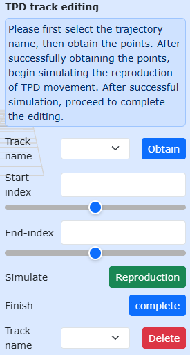

.. centered:: Abbildung 9.5-27-3 TPD-Bahnbearbeitung

**Schritt 6**: Erstellen des TPD-Programms für das Einlernen und Abspielen von Bahnen. Klicken Sie auf "Teach-Programm" - "Bahnwiedergabe" - "Bahn laden", wählen Sie die wiederzugebende Bahn aus und klicken Sie dann auf die Schaltfläche "Hinzufügen". Klicken Sie auf "Bahnwiedergabe", wählen Sie dieselbe Bahn aus, stellen Sie die entsprechenden Parameter gemäß den Anweisungen auf der Benutzeroberfläche ein und klicken Sie dann auf die Schaltfläche "Hinzufügen".

.. image:: coding/552.png
   :width: 6in
   :align: center

.. centered:: Abbildung 9.5-27-4 Einstellung für das Laden der TPD-Bahn

.. image:: coding/553.png
   :width: 6in
   :align: center

.. centered:: Abbildung 9.5-27-5 Einstellung für die TPD-Bahnwiedergabe

**Schritt 7**: Lua-Programm generieren und ausführen. Gemäß dem in Schritt 6 generierten typischen Lua-Programm führen Sie das Programm aus, um das Einlernen und Abspielen der Bahn durchzuführen.

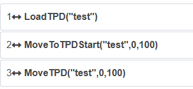

.. centered:: Abbildung 9.5-27-6 Typisches Programm für die TPD-Bahnwiedergabe

Punktversatz-Befehl
+++++++++++++++++++

Klicken Sie auf das Symbol "Punktversatz", um die Bearbeitungsoberfläche für den Offset-Befehl zu öffnen.

Dieser Befehl ist ein allgemeiner Versatzbefehl. Geben Sie die einzelnen Versatzbeträge ein. Die Befehle zum Aktivieren und Deaktivieren werden zum Programm hinzugefügt. Die dazwischenliegenden Bewegungsbefehle werden basierend auf dem Basis- (oder Werkstück-) Koordinatensystem versetzt.

.. image:: coding/074.png
   :width: 6in
   :align: center

.. centered:: Abbildung 9.5-28 Offset-Befehls-Oberfläche

Servo-Befehl
+++++++++++++++++++++++++
Klicken Sie auf das Symbol "Servo", um die Bearbeitungsoberfläche für den servoMotion-Befehl zu öffnen. Die Servobewegung umfasst Servobewegungen im kartesischen Raum und im Gelenkraum.

.. image:: coding/075.png
   :width: 6in
   :align: center

.. centered:: Abbildung 9.5-29-1 Servobewegungs-Befehls-Oberfläche

Kartesische Servobewegung
*****************************
Der ServoCart-Befehl (Bewegung im kartesischen Raum) kann die Roboterbewegung über eine absolute Posensteuerung oder einen Versatz basierend auf der aktuellen Pose steuern.

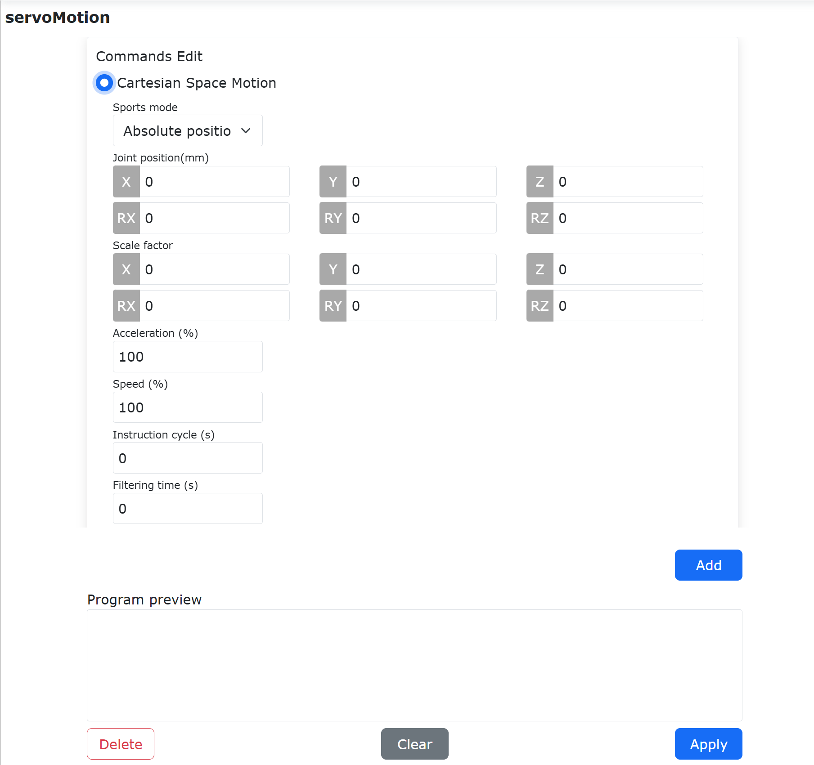

.. centered:: Abbildung 9.5-29-2 ServoCart-Befehls-Oberfläche

Beispiel für ein Programm mit absoluter Posensteuerung:

.. image:: coding/077.png
   :width: 6in
   :align: center

.. centered:: Abbildung 9.5-29-3 ServoCart Absolutbewegung

In diesem Beispiel werden x, y, z, rx, ry, rz (kartesische Position) von der aktuellen Roboterposition abgerufen. Darüber hinaus kann der Benutzer die Roboterbewegung steuern, indem er Bahndaten aus einer Datei liest oder Bahndaten über Socket-Kommunikation sendet.

Beispiel für ein Programm mit Steuerung basierend auf einem Versatz der aktuellen Pose (Basiskoordinaten-Versatz):

.. image:: coding/519.png
   :width: 6in
   :align: center

.. centered:: Abbildung 9.5-29-4 ServoCart Relativbewegung

Gelenkraum-Servobewegung
********************************************************
Der ServoJ-Befehl (Bewegung im Gelenkraum) kann die Roboterbewegung über die absoluten Gelenkpositionen des Roboters steuern.

Klicken Sie nacheinander auf "Teach-Programm", "Programmierung", "Servobewegung". Wählen Sie auf der servoMotion-Befehlsseite die Option "Bewegung im Gelenkraum".

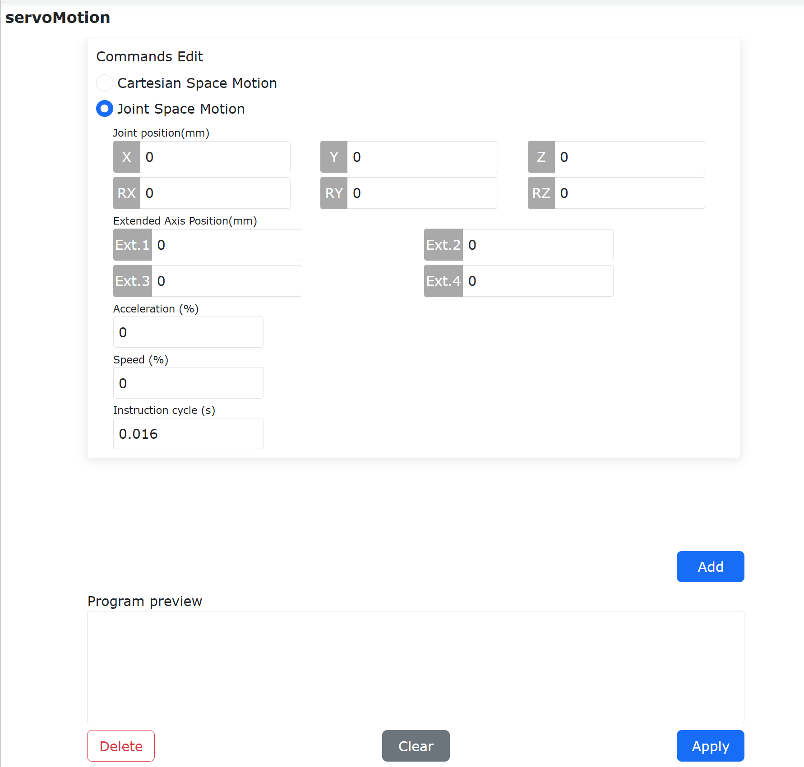

.. centered:: Abbildung 9.5-29-5 ServoJ-Befehlsbearbeitung

Die Parameter im Befehl werden wie folgt erklärt:

- **Gelenkposition**: Die Zielgelenkposition der ServoJ-Bewegung. Die Bewegung von der aktuellen Position zur Zielposition muss innerhalb des eingestellten Befehlszyklus abgeschlossen sein. Wenn die Abweichung zwischen Zielposition und aktueller Position zu groß ist, kann der Roboter Fehler wie Gelenkübergeschwindigkeit melden.
- **Erweiterungsachsenposition**: Die Zielposition der Erweiterungsachse für die ServoJ-Bewegung.
- **Beschleunigung**: Der Beschleunigungsprozentsatz der ServoJ-Bewegung (vorübergehend nicht freigegeben).
- **Geschwindigkeit**: Der Geschwindigkeitsprozentsatz der ServoJ-Bewegung (vorübergehend nicht freigegeben. Die tatsächliche Laufgeschwindigkeit des Roboters hängt derzeit von der Positionsdifferenz zwischen zwei ServoJ-Befehlen und dem Befehlszyklus ab).
- **Befehlszyklus**: Die Ausführungszeit zwischen zwei aufeinanderfolgenden ServoJ-Befehlen.

Geben Sie die entsprechende Zielposition, Geschwindigkeit, Beschleunigung und den Befehlszyklus ein. Klicken Sie auf die Schaltflächen "Hinzufügen" und "Übernehmen", um dem LUA-Programm einen ServoJ-Befehl hinzuzufügen.

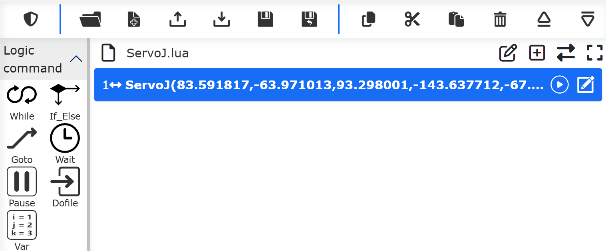

.. centered:: Abbildung 9.5-29-6 Hinzufügen eines ServoJ-Befehls zum Lua-Programm

Bei der Verwendung müssen oft mehrere ServoJ-Befehle kontinuierlich mit dem eingestellten Befehlszyklus gesendet werden. Die Zielgelenkpositionen dieser ServoJ-Befehle bilden eine kontinuierliche Roboterbewegungskurve und ermöglichen eine flexible Bewegungssteuerung des Roboters. Der Sendezyklus der Befehle muss mit dem eingestellten Befehlszyklus übereinstimmen.

Im LUA-Programm kann die ServoJ-Bewegungssteuerung durch eine Schleife oder das kontinuierliche Hinzufügen mehrerer Befehle realisiert werden.

.. image:: coding/522.png
   :width: 6in
   :align: center

.. centered:: Abbildung 9.5-29-7 Beispiel für eine kontinuierliche ServoJ-Bewegung

.. image:: coding/523.png
   :width: 6in
   :align: center

.. centered:: Abbildung 9.5-29-8 Beispiel 1 für eine kontinuierliche ServoJ-Bewegung

Erweiterungsachsen-Debug-Befehl
********************************************************

Übersicht
"""""""""
Die GetInverseKinExaxis-Befehlsschnittstelle für die inverse Kinematik von Erweiterungsachsen-Zielpositionen und die ServoCart-Befehlsschnittstelle mit Erweiterungsachsenposition unterstützen verschiedene Szenarien, in denen die Erweiterungsachse und der Roboter gleichzeitig verwendet werden.

Ablauf
"""""""

**Schritt 1**: Die Parameter und Rückgabewerte der GetInverseKinExaxis-Befehlsschnittstelle für die inverse Kinematik sind in der folgenden Tabelle aufgeführt.

.. centered:: Tabelle 9.5-1 GetInverseKinExaxis Parameter

.. list-table::
   :widths: 10 20 30 40
   :header-rows: 0
   :align: center

   * - **Nr.**
     - **Datentyp**
     - **Variable**
     - **Detaillierte Beschreibung**

   * - 1
     - uint8_t
     - posMode
     - 0: Absolute Pose, 1: Relative Pose - Basiskoordinatensystem, 2: Relative Pose - Werkzeugkoordinatensystem

   * - 2
     - float
     - desePos[6]
     - Kartesische Position des Roboters

   * - 3
     - float
     - exaxis[4]
     - Position der Erweiterungsachse

   * - 4
     - int
     - toolNum
     - Werkzeugnummer [0-14]

   * - 5
     - int
     - workPieceNum
     - Werkstücknummer [0-14]

.. centered:: Tabelle 9.5-2 GetInverseKinExaxis Rückgabewerte

.. list-table::
   :widths: 10 20 30 40
   :header-rows: 0
   :align: center

   * - **Nr.**
     - **Datentyp**
     - **Variable**
     - **Detaillierte Beschreibung**

   * - 1
     - float
     - jointPos[6]
     - Gelenkposition

**Schritt 2**: Das Aufruf format des GetInverseKinExaxis-Befehls im Lua-Programm ist in der Abbildung dargestellt. Durch Eingabe der in der Tabelle aufgeführten Parameter werden die entsprechenden Gelenkwerte berechnet. Für den Aufruf im SDK muss die entsprechende SDK-Dokumentation konsultiert werden.

.. image:: coding/543.png
   :width: 6in
   :align: center

.. centered:: Abbildung 9.5-29-9 Aufruf von GetInverseKinExaxis in Lua

**Schritt 3**: Die Schnittstelle des ServoCart-Befehls mit Erweiterungsachsenposition ist in der folgenden Tabelle aufgeführt. Es gibt keinen Rückgabewert.

.. centered:: Tabelle 9.5-3 ServoCart Parameter

.. list-table::
   :widths: 10 20 30 40
   :header-rows: 0
   :align: center

   * - **Nr.**
     - **Datentyp**
     - **Variable**
     - **Detaillierte Beschreibung**

   * - 1
     - uint8_t
     - posMode
     - 0: Absolute Pose, 1: Relative Pose - Basiskoordinatensystem, 2: Relative Pose - Werkzeugkoordinatensystem

   * - 2
     - float
     - desePos[6]
     - Kartesische Position des Roboters

   * - 3
     - float
     - gain[6]
     - Posen-Verhältnisfaktor, wird bei relativer Pose verwendet

   * - 4
     - float
     - exaxis[4]
     - Position der Erweiterungsachse

   * - 5
     - float
     - acc
     - Beschleunigungsverhältnis, 0~100, Standard 0

   * - 6
     - float
     - vel
     - Geschwindigkeitsverhältnis, 0~100, Standard 0

   * - 7
     - float
     - interval
     - Befehlszyklus [s]

   * - 8
     - float
     - filterTime
     - Filterzeit [s], vorübergehend nicht verfügbar

   * - 9
     - float
     - posGain
     - Proportionalverstärker der Zielposition, vorübergehend nicht verfügbar

**Schritt 4**: Das Aufruf format des ServoCart-Befehls mit Erweiterungsachsenposition im Lua-Programm ist in der folgenden Abbildung dargestellt. Durch Eingabe der in der Tabelle aufgeführten Parameter führt der Roboter eine ServoCart-Bewegung mit Erweiterungsachsenposition aus. Für den Aufruf im SDK muss die entsprechende SDK-Dokumentation konsultiert werden.

.. centered:: Abbildung 9.5-29-10 Aufruf von ServoCart in Lua

Bahn-Befehl
+++++++++++

Klicken Sie auf das Symbol "Bahn", um die Bearbeitungsoberfläche für den Trajctory-Befehl zu öffnen.

.. image:: coding/078.png
   :width: 6in
   :align: center

.. centered:: Abbildung 9.5-30 Trajctory-Befehls-Oberfläche

BahnJ-Befehl
++++++++++++

Klicken Sie auf das Symbol "BahnJ", um die Bearbeitungsoberfläche für den TrajctoryJ-Befehl zu öffnen.

Die Trajctory- und TrajctoryJ-Befehle sind universelle Schnittstellen für Bahnen, die direkt von einer Kamera vorgegeben werden. Wenn eine Datei mit diskreten Bahnpunkten in einem festen Format vorhanden ist, kann sie in das System importiert werden, sodass der Roboter sich gemäß der in der importierten Datei definierten Bahn bewegt.

1. Funktion zum Importieren von Bahndateien: Wählen Sie eine Datei vom lokalen Computer aus und importieren Sie sie in das Robotersteuerungssystem.

2. Vorabladen einer Bahn: Wählen Sie eine importierte Bahndatei aus und laden Sie sie über einen Befehl.

3. Bahnbewegung: Führen Sie die Roboterbewegung aus, indem Sie die vorgeladene Bahndatei und den ausgewählten Testgeschwindigkeitsbefehl kombinieren.

4. Bahnpunktnummer ausgeben: Während der Roboter die Bahn abfährt, wird die Nummer des aktuellen Bahnpunkts ausgegeben, um den Fortschritt der Bewegung anzuzeigen.

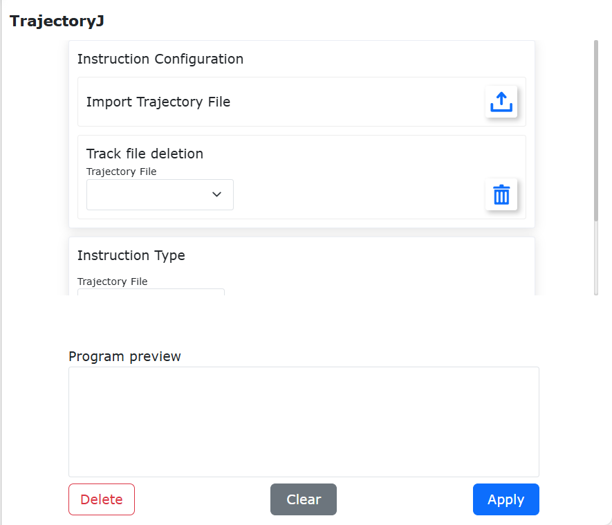

.. centered:: Abbildung 9.5-31 TrajctoryJ-Befehls-Oberfläche

DMP-Befehl
++++++++++

Klicken Sie auf das Symbol "DMP", um die Bearbeitungsoberfläche für den DMP-Befehl zu öffnen.

DMP ist eine Methode des Nachahmungslernens von Trajektorien. Eine Referenztrajektorie muss im Voraus geplant werden. In der Befehlsbearbeitungsoberfläche wählen Sie einen Teachpunkt als neuen Startpunkt aus. Klicken Sie auf "Hinzufügen" und dann auf "Übernehmen", um den Befehl zu speichern. Der spezifische DMP-Pfad ist eine neue Trajektorie, die die Referenztrajektorie mit dem neuen Startpunkt nachahmt.

.. image:: coding/080.png
   :width: 6in
   :align: center

.. centered:: Abbildung 9.5-32 DMP-Befehls-Oberfläche

Werkstücktransformations-Befehl
+++++++++++++++++++++++++++++++

Klicken Sie auf das Symbol "Werkstücktransformation", um die Bearbeitungsoberfläche für den WPTrsf-Befehl zu öffnen.

Wählen Sie das Werkstückkoordinatensystem aus, das automatisch transformiert werden soll. Klicken Sie auf "Hinzufügen" und dann auf "Übernehmen", um den Befehl zu speichern. Dieser Befehl bewirkt, dass beim Ausführen der darin enthaltenen PTP- und LIN-Befehle die Punkte im Werkstückkoordinatensystem automatisch transformiert werden. Der Beispielbereich zeigt und weist auf die korrekte Kombination der Befehle hin. Die spezifischen Befehle können nach dem Hinzufügen je nach tatsächlichem Szenario selbst angepasst werden.

.. image:: coding/081.png
   :width: 6in
   :align: center

.. centered:: Abbildung 9.5-33 WPTrsf-Befehls-Oberfläche

Werkzeugtransformations-Befehl
++++++++++++++++++++++++++++++

Klicken Sie auf das Symbol "Werkzeugtransformation", um die Bearbeitungsoberfläche für den ToolTrsf-Befehl zu öffnen.

Fügen Sie PTP- und Lin-Befehle hinzu, wählen Sie dann das Werkzeugkoordinatensystem aus, das automatisch transformiert werden soll. Klicken Sie auf "Hinzufügen" und dann auf "Übernehmen", um den Befehl zu speichern. Die kartesischen Koordinaten der Punkte innerhalb des Befehls werden basierend auf dem aktuell eingestellten Werkstückkoordinatensystem automatisch transformiert.

.. note:: Der Beispielbereich zeigt und weist auf die korrekte Kombination der Befehle hin. Die spezifischen Befehle können nach dem Hinzufügen je nach tatsächlichem Szenario selbst angepasst werden.

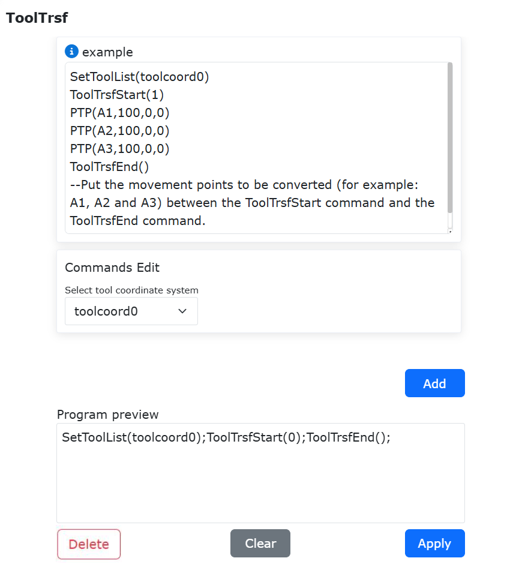

.. centered:: Abbildung 9.5-34 ToolTrsf-Befehls-Oberfläche

Steuerbefehls-Oberfläche
~~~~~~~~~~~~~~~~~~~~~~~~~

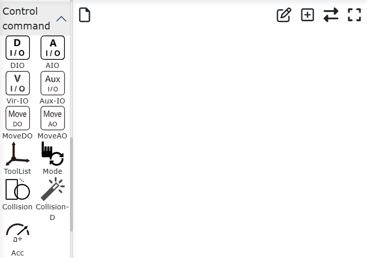

.. centered:: Abbildung 9.6 Steuerbefehls-Oberfläche

Digital-IO-Befehl
+++++++++++++++++

Klicken Sie auf das Symbol "Digital-IO", um die Bearbeitungsoberfläche für den IO-Befehl zu öffnen.

Der "IO"-Befehl ist in zwei Teile gegliedert: Setzen von IO (SetDO/SPLCSetDO) und Abrufen von IO (GetDI/SPLCGetDI).

Mit dem Befehl "SetDO/SPLCSetDO" kann der Status des angegebenen DO-Ausgangs eingestellt werden. Dies umfasst 16 Steuerpult-Digitalausgänge und 2 Werkzeug-Digitalausgänge. Die Statusoption "False" bedeutet Aus, "True" bedeutet Ein. Die Option "Ob blockieren": Bei Auswahl von "Blockieren" wird der DO-Status gesetzt, nachdem die Bewegung gestoppt wurde. Bei Auswahl von "Nicht blockieren" wird der DO-Status während der vorherigen Bewegung gesetzt. Die Option "Glatte Bahn": Bei Auswahl von "Break" wird der DO-Status nach dem Ende des Glättungsübergangsradius gesetzt. Bei Auswahl von "Serious" wird der DO-Status während der Bewegung über den Glättungsübergangsradius gesetzt. Wenn dieser Befehl in einem Hilfsthread hinzugefügt wird, muss "Ob Thread anwenden" auf Ja gesetzt werden. An anderen Stellen verwenden Sie für diesen Befehl Nein. Klicken Sie auf "Hinzufügen" und dann auf "Übernehmen".

.. image:: coding/083.png
   :width: 6in
   :align: center

.. centered:: Abbildung 9.6-1 SetDO-Befehls-Oberfläche

Wählen Sie im "GetDI/SPLCGetDI"-Befehl den Wert der gewünschten Portnummer aus. Bei der Option "Ob blockieren": Bei Auswahl von "Blockieren" wird der DI-Status abgerufen, nachdem die Bewegung gestoppt wurde. Bei Auswahl von "Nicht blockieren" wird der DI-Status während der vorherigen Bewegung abgerufen. Wenn dieser Befehl in einem Hilfsthread hinzugefügt wird, muss "Ob Thread anwenden" auf Ja gesetzt werden. An anderen Stellen verwenden Sie für diesen Befehl Nein. Klicken Sie nach der Auswahl auf die Schaltflächen "Hinzufügen" und "Übernehmen".

.. image:: coding/084.png
   :width: 6in
   :align: center

.. centered:: Abbildung 9.6-2 GetDI-Befehls-Oberfläche

Analog-AI-Befehl
++++++++++++++++

Klicken Sie auf das Symbol "Analog-AI", um die Bearbeitungsoberfläche für den AI-Befehl zu öffnen.

Dieser Befehl umfasst zwei Funktionen: Setzen des analogen Ausgangs (SetAO/SPLCSetAO) und Abrufen des analogen Eingangs (GetAI/SPLCGetAI).

Wählen Sie bei "SetAO/SPLCSetAO" den einzustellenden analogen Ausgang aus und geben Sie den einzustellenden Wert ein (Bereich 0-10). Bei der Option "Ob blockieren": Bei Auswahl von "Blockieren" wird der AO-Status gesetzt, nachdem die Bewegung gestoppt wurde. Bei Auswahl von "Nicht blockieren" wird der AO-Status während der vorherigen Bewegung gesetzt. Wenn dieser Befehl in einem Hilfsthread hinzugefügt wird, muss "Ob Thread anwenden" auf Ja gesetzt werden. An anderen Stellen verwenden Sie für diesen Befehl Nein. Klicken Sie auf "Hinzufügen" und dann auf "Übernehmen".

.. image:: coding/085.png
   :width: 6in
   :align: center

.. centered:: Abbildung 9.6-3 SetAO-Befehls-Oberfläche

Wählen Sie bei "GetAI/SPLCGetAI" den abzurufenden analogen Eingang aus. Bei der Option "Ob blockieren": Bei Auswahl von "Blockieren" wird der AI-Status abgerufen, nachdem die Bewegung gestoppt wurde. Bei Auswahl von "Nicht blockieren" wird der AI-Status während der vorherigen Bewegung abgerufen. Wenn dieser Befehl in einem Hilfsthread hinzugefügt wird, muss "Ob Thread anwenden" auf Ja gesetzt werden. An anderen Stellen verwenden Sie für diesen Befehl Nein. Klicken Sie auf "Hinzufügen" und dann auf "Übernehmen".

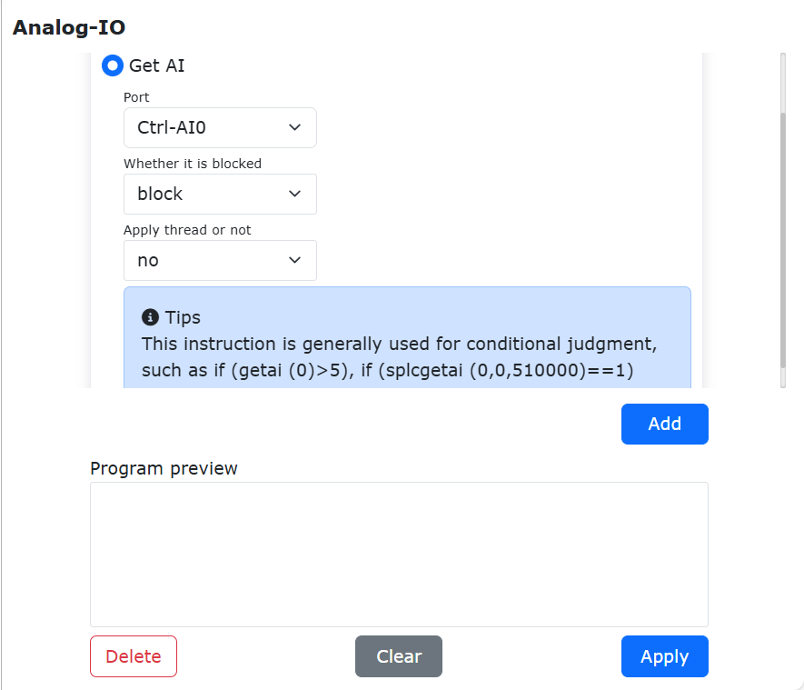

.. centered:: Abbildung 9.6-4 GetAI-Befehls-Oberfläche

Virtueller-IO-Befehl
++++++++++++++++++++

Klicken Sie auf das Symbol "Virtuelles IO", um die Bearbeitungsoberfläche für den Vir-IO-Befehl zu öffnen.

Dieser Befehl dient zur virtuellen IO-Steuerung. Er kann den Status von simulierten externen DI und AI einstellen sowie den Status von simulierten DI und AI abrufen.

.. image:: coding/087.png
   :width: 6in
   :align: center

.. centered:: Abbildung 9.6-5 Vir-IO-Befehls-Oberfläche

Erweiterungs-IO-Befehl
++++++++++++++++++++++

Klicken Sie auf das Symbol "Erweiterungs-IO", um die Bearbeitungsoberfläche für den Aux-IO-Befehl zu öffnen.

Aux-IO ist eine Befehlssfunktion zur Steuerung externer Erweiterungs-IO über die Kommunikation zwischen Roboter und SPS. Es muss eine UDP-Kommunikation zwischen Roboter und SPS eingerichtet werden. Basierend auf den ursprünglichen 16 Ein-/Ausgängen können 128 Ein-/Ausgänge erweitert werden. Die Verwendung dieses Befehls ähnelt der Verwendung des zuvor beschriebenen allgemeinen IO. Die Verwendung dieser Funktion ist technisch anspruchsvoll. Bitte kontaktieren Sie uns für Beratung.

.. image:: coding/088.png
   :width: 6in
   :align: center

.. centered:: Abbildung 9.6-6 Aux-IO-Befehls-Oberfläche

Bewegungs-DO-Befehl
+++++++++++++++++++

Klicken Sie auf das Symbol "Bewegungs-DO", um die Bearbeitungsoberfläche für den MoveDO-Befehl zu öffnen.

Dieser Befehl ist in einen kontinuierlichen Ausgabemodus und einen Einzelausgabemodus unterteilt.

- Kontinuierlicher Ausgabemodus: Realisiert die kontinuierliche Ausgabe von DO-Signalen in festgelegten Abständen während einer Linearbewegung.

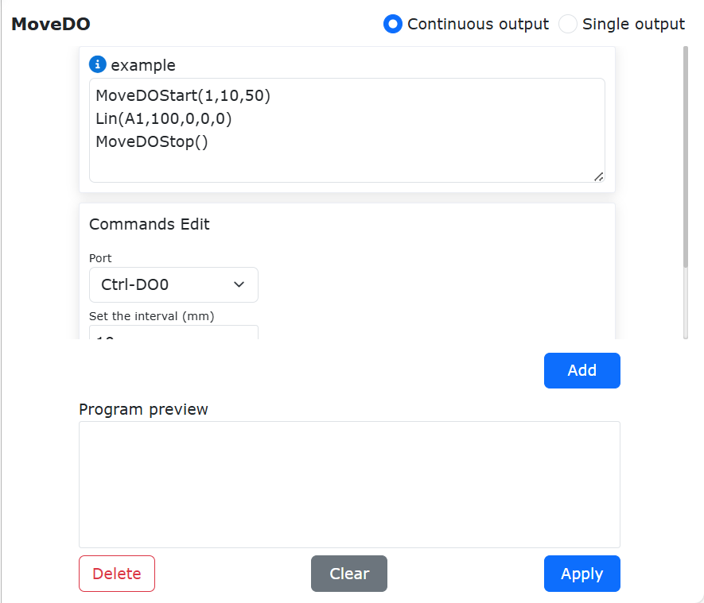

.. centered:: Abbildung 9.6-7 MoveDO-Befehl – Kontinuierlicher Ausgabemodus

- Einzelausgabemodus: Es kann zwischen Ausgabe im gleichförmigen Geschwindigkeitsabschnitt und freier Konfiguration gewählt werden. Die Setzzeit des Ausgangs nach Bewegungsbeginn und die Rücksetzzeit des Ausgangs vor Bewegungsende können eingestellt werden. Bereich [0, 1000].

.. image:: coding/090.png
   :width: 6in
   :align: center

.. centered:: Abbildung 9.6-8 MoveDO-Befehl – Einzelausgabemodus

Bewegungs-AO-Befehl
+++++++++++++++++++

Klicken Sie auf das Symbol "Bewegungs-AO", um die Bearbeitungsoberfläche für den MoveAO-Befehl zu öffnen.

1. Übersicht

In Verbindung mit Bewegungsbefehlen kann dieser Befehl während der Bewegung proportionale AO-Signale basierend auf der Echtzeit-TCP-Geschwindigkeit ausgeben.

2. Erläuterung des Bewegungs-AO-Befehls

Der Bewegungs-AO-Befehl befindet sich im Bereich der Programmbefehlsbearbeitung unter Steuerbefehle - Bewegungs-AO.

.. image:: coding/091.png
   :width: 6in
   :align: center

.. centered:: Abbildung 9.6-9 Bewegungs-AO-Befehl

.. image:: coding/092.png
   :width: 6in
   :align: center

.. centered:: Abbildung 9.6-10 Details des Bewegungs-AO-Befehls

- AO-Nummer: Auswahl über Dropdown-Menü. Ctrl-AO0 entspricht Steuerpult-AO0, Ctrl-AO1 entspricht Steuerpult-AO1, End-AO0 entspricht Endeffektor-AO0.

- Maximale TCP-Geschwindigkeit: Der maximale TCP-Geschwindigkeitswert des Roboters. Funktion: Bildet ein Verhältnis zur Echtzeit-TCP-Geschwindigkeit.

- AO-Prozentsatz bei maximaler TCP-Geschwindigkeit: Der AO-Prozentsatz, der dem maximalen TCP-Geschwindigkeitswert des Roboters entspricht. Funktion: Legt den oberen Grenzwert der AO-Ausgabe fest.

- AO-Prozentsatz für Totzonenkompensation: Wenn das Proportionalventil eine Totzone aufweist, kann dieser Parameter eingestellt werden, um die AO-Ausgabe sicherzustellen. Funktion: Legt den unteren Grenzwert der AO-Ausgabe fest.

.. important::
   Berechnungsformel: Ausgangs-AO-Prozentsatz = Echtzeit-TCP-Geschwindigkeit / Eingestellte maximale TCP-Geschwindigkeit * Eingestellter maximaler TCP-Geschwindigkeits-AO-Prozentsatz.

   Die folgenden Bewegungsbefehle können mit diesem Befehl kombiniert werden: PTP/LIN/ARC/CIRCLE/SPLINE/NSPLINE/SERVOJ.

Koordinatensystem-Befehl
++++++++++++++++++++++++

Klicken Sie auf das Symbol "Koordinatensystem", um die Bearbeitungsoberfläche für den ToolList-Befehl zu öffnen.

Wählen Sie den Namen des Werkzeugkoordinatensystems aus und klicken Sie auf "Übernehmen", um diesen Befehl zum Programm hinzuzufügen. Wenn das Programm diese Anweisung ausführt, wird das Werkzeugkoordinatensystem des Roboters gesetzt.

.. centered:: Abbildung 9.6-11 ToolList-Befehls-Oberfläche

Moduswechsel-Befehl
+++++++++++++++++++

Klicken Sie auf das Symbol "Moduswechsel", um die Bearbeitungsoberfläche für den Mode-Befehl zu öffnen.

Dieser Befehl kann den Roboter in den Handmodus schalten. Er wird normalerweise am Ende eines Programms hinzugefügt, damit der Benutzer den Roboter nach Programmende automatisch in den Handmodus schalten und ziehen kann.

.. image:: coding/094.png
   :width: 6in
   :align: center

.. centered:: Abbildung 9.6-12 Mode-Befehls-Oberfläche

Kollisionsstufen-Befehl
+++++++++++++++++++++++

Klicken Sie auf das Symbol "Kollisionsstufe", um die Bearbeitungsoberfläche für den Collision-Befehl zu öffnen.

Dieser Befehl dient zur Einstellung der Kollisionsstufe. Mit diesem Befehl können die Kollisionsstufen der einzelnen Achsen während der Programmausführung in Echtzeit angepasst werden, um Anwendungsszenarien flexibler zu gestalten.

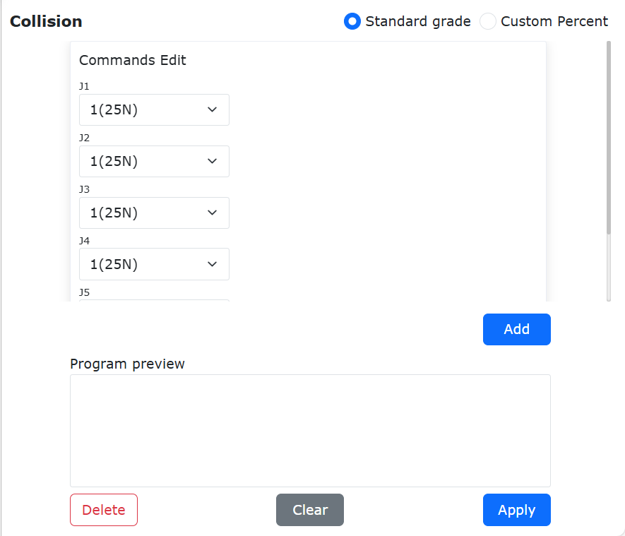

.. centered:: Abbildung 9.6-13 Collision-Befehls-Oberfläche

Beschleunigungs-Befehl
++++++++++++++++++++++

Klicken Sie auf das Symbol "Beschleunigung", um die Bearbeitungsoberfläche für den Acc-Befehl zu öffnen.

Der Acc-Befehl ermöglicht die separate Einstellung der Roboterbeschleunigung. Durch Anpassen des Beschleunigungsskalierungsfaktors von Bewegungsbefehlen kann die Beschleunigungs- und Verzögerungszeit erhöht oder verringert werden, wodurch die Taktzeit der Roboteraktionen einstellbar wird.

.. image:: coding/096.png
   :width: 6in
   :align: center

.. centered:: Abbildung 9.6-14 Acc-Befehls-Oberfläche

Peripheriebefehls-Oberfläche
~~~~~~~~~~~~~~~~~~~~~~~~~~~~

.. image:: coding/097.png
   :width: 6in
   :align: center

.. centered:: Abbildung 9.7 Peripheriebefehls-Oberfläche

Greifer-Befehl
++++++++++++++

Klicken Sie auf das Symbol "Greifer", um die Bearbeitungsoberfläche für den Gripper-Befehl zu öffnen.

Dieser Befehl ist unterteilt in Greifer-Bewegungssteuerungsbefehle und Greifer-Aktivierungs-/Rücksetzbefehle. Bei den Greifer-Steuerungsbefehlen werden die vollständig konfigurierten und aktivierten Greifernummern angezeigt. Der Benutzer kann den Wert über ein Eingabefeld bearbeiten oder einen Schieberegler auf den gewünschten Wert ziehen, um die Greiferöffnung/-schließung, die Öffnungs-/Schließgeschwindigkeit und das Öffnungs-/Schließmoment einzustellen. Die Werte werden in Prozent angegeben. Die Option "Ob blockieren": Bei Auswahl von "Blockieren" wartet die Greiferbewegung, bis der vorherige Bewegungsbefehl abgeschlossen ist. Bei Auswahl von "Nicht blockieren" läuft die Greiferbewegung parallel zum vorherigen Bewegungsbefehl. Klicken Sie auf die Schaltflächen "Hinzufügen" und "Übernehmen", um die eingestellten Werte in der Teach-Datei zu speichern. Bei den Greifer-Rücksetz-/Aktivierungsbefehlen werden die bereits konfigurierten Greifernummern angezeigt. Sie können dem Programm Rücksetz-/Aktivierungsbefehle hinzufügen.

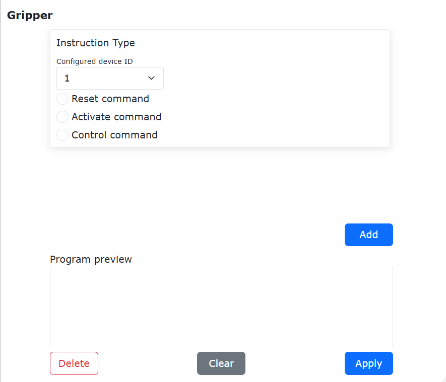

.. centered:: Abbildung 9.7-1 Gripper-Befehls-Oberfläche

Spritzpistolen-Befehl
+++++++++++++++++++++

Klicken Sie auf das Symbol "Spritzpistole", um die Bearbeitungsoberfläche für den Spray-Befehl zu öffnen.

Dieser Befehl bezieht sich auf die Spritzanwendung und steuert die Spritzpistole mit den Aktionen "Spritzen starten", "Spritzen stoppen", "Düsenreinigung starten" und "Düsenreinigung stoppen". Stellen Sie beim Bearbeiten dieses Programmbefehls sicher, dass die Spritzpistole als Peripheriegerät korrekt konfiguriert wurde. Weitere Details finden Sie im Kapitel Roboter-Peripheriegeräte.

.. image:: coding/099.png
   :width: 6in
   :align: center

.. centered:: Abbildung 9.7-2 Spray-Befehls-Oberfläche

Erweiterungsachsen-Befehl
+++++++++++++++++++++++++

Klicken Sie auf das Symbol "Erweiterungsachse", um die Bearbeitungsoberfläche für den EAxis-Befehl zu öffnen. Wählen Sie den Kombinationsmodus:

- Steuerung + Servoantrieb (485)
- Steuerung + SPS (UDP)

Wählen Sie "Steuerung + SPS (UDP)". Dieser Befehl wird in Szenarien mit externen Achsen in Kombination mit dem PTP-Befehl verwendet. Er kann die Bewegung eines Punktes im Raum in X-Richtung auf die Bewegung der externen Achse aufteilen. Wählen Sie die Nummer der externen Achse, die Bewegungsart "Synchron", den zu erreichenden Punkt und klicken Sie auf "Hinzufügen" und dann auf "Übernehmen", um diesen Befehl zu speichern.

.. image:: coding/100.png
   :width: 6in
   :align: center

.. centered:: Abbildung 9.7-3 EAxis-Befehls-Oberfläche

Wählen Sie "Steuerung + Servoantrieb (485)". Mit diesem Befehl können Parameter für die Erweiterungsachse konfiguriert werden. Je nach Steuerungsmodus werden unterschiedliche Parameter eingestellt. Bei einer bereits konfigurierten Erweiterungsachse kann der Nullpunkt gesetzt werden.

.. image:: coding/101.png
   :width: 6in
   :align: center

.. centered:: Abbildung 9.7-4 Erweiterungsachsen-Befehls-Oberfläche

Förderband-Befehl
+++++++++++++++++

Klicken Sie auf das Symbol "Förderband", um die Bearbeitungsoberfläche für den Convey-Befehl zu öffnen.

Dieser Befehl enthält vier Unterbefehle: Position Echtzeiterkennung, IO Echtzeiterkennung, Tracking einschalten und Tracking ausschalten. Weitere Details finden Sie im Kapitel Roboter-Peripheriegeräte.

.. image:: coding/102.png
   :width: 6in
   :align: center

.. centered:: Abbildung 9.7-5 Conveyor-Befehls-Oberfläche

Schleifgeräte-Befehl
++++++++++++++++++++

Klicken Sie auf das Symbol "Schleifgerät", um die Bearbeitungsoberfläche für den Polish-Befehl zu öffnen.

Mit diesem Befehl können Drehzahl, Kontaktkraft, Ausfahrstrecke und Steuerungsmodus des Schleifgeräts eingestellt werden.

.. image:: coding/103.png
   :width: 6in
   :align: center

.. centered:: Abbildung 9.7-6 Polish-Befehls-Oberfläche

Schweißbefehls-Oberfläche
~~~~~~~~~~~~~~~~~~~~~~~~~

.. image:: coding/104.png
   :width: 6in
   :align: center

.. centered:: Abbildung 9.8 Schweißbefehls-Oberfläche

Schweiß-Befehl
++++++++++++++

Klicken Sie auf das Symbol "Schweißen", um die Bearbeitungsoberfläche für den Weld-Befehl zu öffnen.

Dieser Befehl wird hauptsächlich für das Schweißgerät als Peripheriegerät verwendet. Stellen Sie vor dem Hinzufügen dieses Befehls sicher, dass die Konfiguration des Schweißgeräts in den Benutzer-Peripheriegeräten abgeschlossen ist. Weitere Details finden Sie im Kapitel Roboter-Peripheriegeräte.

- Schweißspannungsbereich: 0~700 V
- Schweißstrombereich: 0~1000 A

.. important:: Bei der Konfiguration der AO-Ausgabe, des Schweißstroms und der Schweißspannung muss der I/O-Typ ausgewählt werden. Bei Auswahl von "Controller I/O" muss der entsprechende Ausgangs-AO ausgewählt werden.

.. image:: coding/105.png
   :width: 6in
   :align: center

.. centered:: Abbildung 9.8-1 Weld-Befehls-Oberfläche

Intervallschweiß-Befehl
+++++++++++++++++++++++

Klicken Sie auf das Symbol "Intervallschweißen", um die Bearbeitungsoberfläche für den Segment-Befehl zu öffnen.

Durch Hinzufügen eines Intervallschweißbefehls kann der kollaborative Roboter Intervallschweißoperationen durchführen. Vor dem Hinzufügen eines Intervallschweißbefehls muss der Intervallschweißmodus ausgewählt und der Start- und Endpunkt angefahren werden. Die Intervallschweißmodi sind "Pose nicht ändern" und "Pose ändern". Der Roboter entscheidet basierend auf dem gewählten Intervallschweißmodus, ob die Pose während der Schweißbahn geändert wird.

Fahren Sie den Startpunkt "segment01" und den Endpunkt "segment02" an und bestätigen Sie die Positionen des Start- und Endpunkts der Schweißbahn, wie in der folgenden Abbildung.

.. image:: coding/106.png
   :width: 3in
   :align: center

.. centered:: Abbildung 9.8-2-1 Startpunkt "segment01"

.. image:: coding/107.png
   :width: 3in
   :align: center

.. centered:: Abbildung 9.8-2-2 Endpunkt "segment02"

Hinzufügen eines Intervallschweißbefehls
****************************************

**Schritt 1**: Erstellen Sie ein neues Benutzerprogramm "testSegment1.lua" und klicken Sie auf die Schaltfläche "Intervallschweißen", um die Seite zum Hinzufügen von Intervallschweißbefehlen zu öffnen.

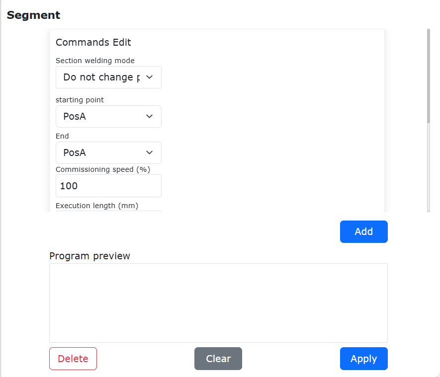

.. centered:: Abbildung 9.8-2-3 Schaltfläche zum Hinzufügen eines Intervallschweißbefehls

**Schritt 2**: Wählen Sie auf der Seite zum Hinzufügen von Intervallschweißbefehlen als "Startpunkt" den Punkt "segment01" und als "Endpunkt" den Punkt "segment02".

.. image:: coding/109.png
   :width: 6in
   :align: center

.. centered:: Abbildung 9.8-2-4 Start- und Endpunkt des Intervallschweißens

**Schritt 3**: Konfigurieren Sie Testgeschwindigkeit, Ausführungslänge, Nicht-Ausführungslänge, Funktionsmodus, Pendelauswahl und Rundungsregel. Klicken Sie nacheinander auf die Schaltflächen "Hinzufügen" und "Übernehmen".

**Schritt 4**: Nun wurde der Datei "testSegment1.lua" ein Intervallschweiß-Bewegungsbefehl hinzugefügt.

.. image:: coding/110.png
   :width: 6in
   :align: center

.. centered:: Abbildung 9.8-2-5 Hinzufügen eines Intervallschweiß-Bewegungsbefehls

Pose-Änderung während der Intervallschweißbewegung
***************************************************

Beim Intervallschweißen des kollaborativen Roboters kann der Intervallschweißmodus gewählt werden. Es gibt zwei Typen:

**Pose nicht ändern**: Der Roboter behält während der gesamten Schweißbahn die Pose des Startpunkts der Schweißbahn bei.

**Pose ändern**: Der Roboter berechnet während der Schweißbahn die kartesische Pose und Gelenkposition jedes Bahnsegments und ändert die Pose während des Intervallschweißvorgangs.

Im Folgenden wird die Verwendung von "Pose nicht ändern" und "Pose ändern" gezeigt.

1. Pose nicht ändern

Öffnen Sie die Seite zum Hinzufügen von Intervallschweißbefehlen, wählen Sie als "Intervallschweißmodus" die Option "Pose nicht ändern". Wählen Sie ebenfalls den Startpunkt "segment01" und den Endpunkt "segment02". Stellen Sie die Ausführungslänge auf 100 und die Nicht-Ausführungslänge auf 50 ein. Wählen Sie andere relevante Konfigurationen aus und speichern Sie das Programm.

.. image:: coding/111.png
   :width: 6in
   :align: center

.. centered:: Abbildung 9.8-2-6 Intervallschweißmodus: Pose nicht ändern

2. Pose ändern

Öffnen Sie die Seite zum Hinzufügen von Intervallschweißbefehlen, wählen Sie als "Intervallschweißmodus" die Option "Pose ändern". Wählen Sie ebenfalls den Startpunkt "segment01" und den Endpunkt "segment02". Stellen Sie die Ausführungslänge auf 100 und die Nicht-Ausführungslänge auf 50 ein. Wählen Sie andere relevante Konfigurationen aus und speichern Sie das Programm.

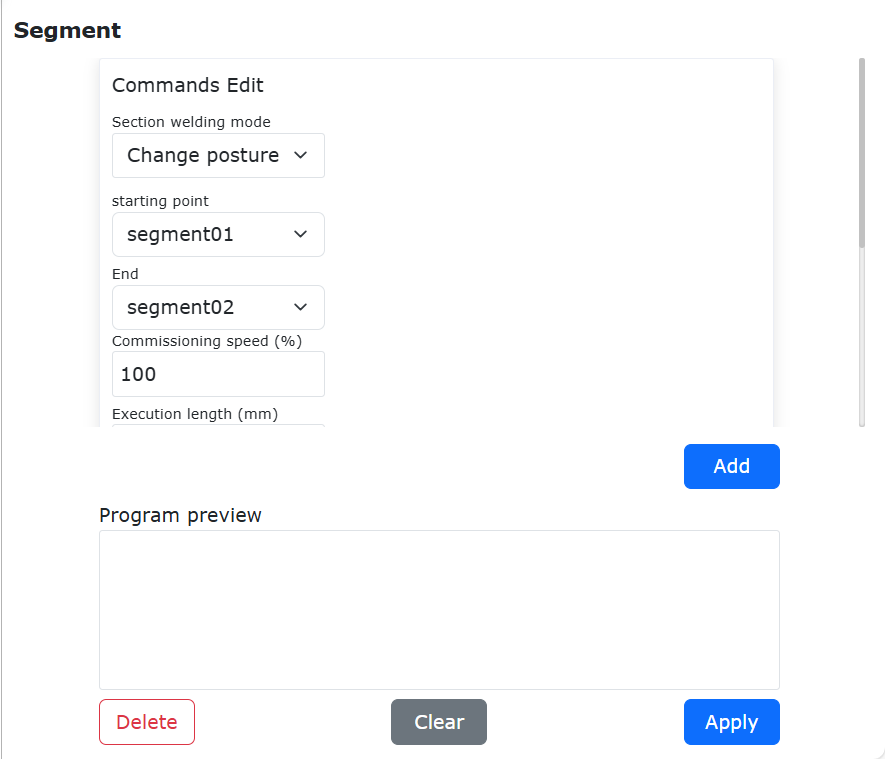

.. centered:: Abbildung 9.8-2-7 Intervallschweißmodus: Pose ändern

3. Arten der Intervallschweißausführung

Führen Sie das Programm aus. Die Ausführung des Intervallschweißens durch den Roboter kann wie folgt aussehen:

1) Wenn der Funktionsmodus auf "Erstes Segment ausführen" gesetzt ist, die Pendelauswahl auf "Segmentpendeln" und die Rundungsregel auf "Nicht runden", führt der Roboter abwechselnd 100 mm Pendelbewegung und 50 mm Linearbewegung aus und stoppt am Endpunkt.

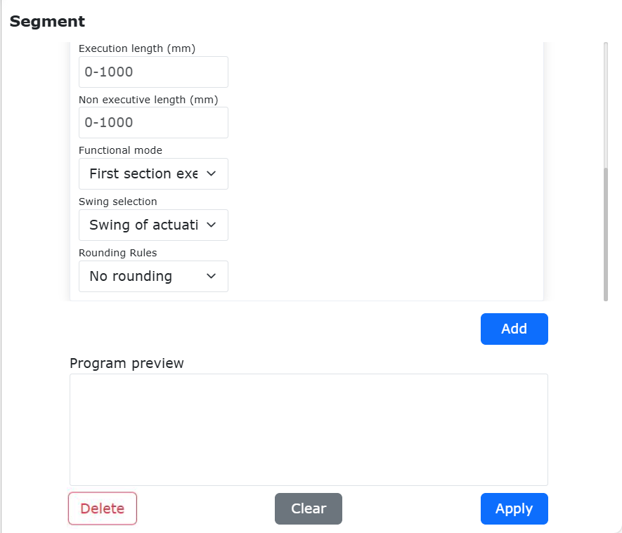

.. centered:: Abbildung 9.8-2-8 Erstes Segment führt Pendelfunktion aus, nicht runden

2) Wenn der Funktionsmodus auf "Erstes Segment nicht ausführen" gesetzt ist, die Pendelauswahl auf "Kein Segmentpendeln" und die Rundungsregel auf "Nicht runden", führt der Roboter abwechselnd 50 mm Pendelbewegung und 100 mm Linearbewegung aus und stoppt am Endpunkt.

.. centered:: Abbildung 9.8-2-9 Erstes Segment führt Pendelfunktion nicht aus, nicht runden

3) Wenn der Funktionsmodus auf "Erstes Segment ausführen" gesetzt ist, die Pendelauswahl auf "Segmentpendeln" und die Rundungsregel auf "Runden", führt der Roboter abwechselnd 100 mm Pendelbewegung und 50 mm Linearbewegung aus. Nach Abschluss des letzten vollständigen Zyklus stoppt das Pendeln, wenn die verbleibende Distanz weniger als 150 mm beträgt.

.. image:: coding/115.png
   :width: 6in
   :align: center

.. centered:: Abbildung 9.8-2-10 Erstes Segment führt Pendelfunktion aus, zyklisch runden

4) Wenn der Funktionsmodus auf "Erstes Segment ausführen" gesetzt ist, die Pendelauswahl auf "Kein Segmentpendeln" und die Rundungsregel auf "Runden", führt der Roboter abwechselnd 50 mm Pendelbewegung und 100 mm Linearbewegung aus. Nach Abschluss des letzten vollständigen Zyklus stoppt das Pendeln, wenn die verbleibende Distanz weniger als 150 mm beträgt.

.. image:: coding/116.png
   :width: 6in
   :align: center

.. centered:: Abbildung 9.8-2-11 Erstes Segment führt Pendelfunktion nicht aus, zyklisch runden

5) Wenn der Funktionsmodus auf "Erstes Segment ausführen" gesetzt ist, die Pendelauswahl auf "Segmentpendeln" und die Rundungsregel auf "Einzelsegment runden", führt der Roboter abwechselnd 100 mm Pendelbewegung und 50 mm Linearbewegung aus. Nach Abschluss des letzten vollständigen Zyklus stoppt das Pendeln, wenn das nächste Segment eine 100 mm Pendelplanung ist und die verbleibende Distanz weniger als 100 mm beträgt; wenn das nächste Segment eine 50 mm Linearbewegungsplanung ist und die verbleibende Distanz weniger als 50 mm beträgt, stoppt die Bewegung.

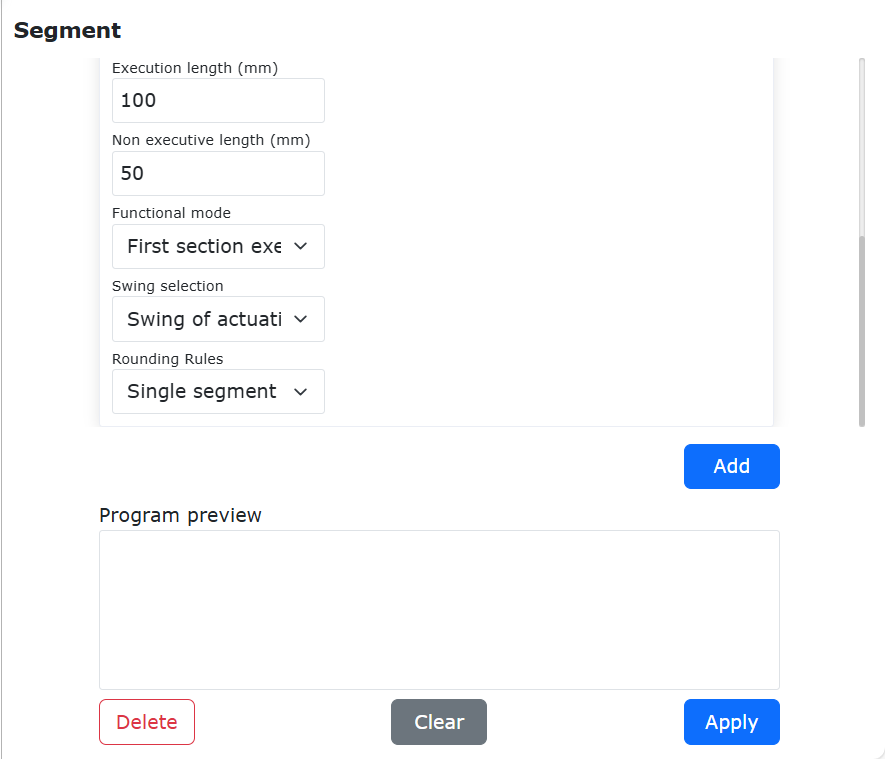

.. centered:: Abbildung 9.8-2-12 Erstes Segment führt Pendelfunktion aus, Einzelsegment runden

6) Wenn der Funktionsmodus auf "Erstes Segment ausführen" gesetzt ist, die Pendelauswahl auf "Kein Segmentpendeln" und die Rundungsregel auf "Einzelsegment runden", führt der Roboter abwechselnd 50 mm Pendelbewegung und 100 mm Linearbewegung aus. Nach Abschluss des letzten vollständigen Zyklus stoppt das Pendeln, wenn das nächste Segment eine 50 mm Pendelplanung ist und die verbleibende Distanz weniger als 50 mm beträgt; wenn das nächste Segment eine 100 mm Linearbewegungsplanung ist und die verbleibende Distanz weniger als 100 mm beträgt, stoppt die Bewegung.

.. image:: coding/118.png
   :width: 6in
   :align: center

.. centered:: Abbildung 9.8-2-13 Erstes Segment führt Pendelfunktion nicht aus, Einzelsegment runden

4. Posenvergleich

Bei Konfiguration verschiedener Intervallschweißmodi ist auch die Pose des Roboters während der Schweißbahn unterschiedlich. Ein Vergleich der Posen während des Betriebs ist unten dargestellt:

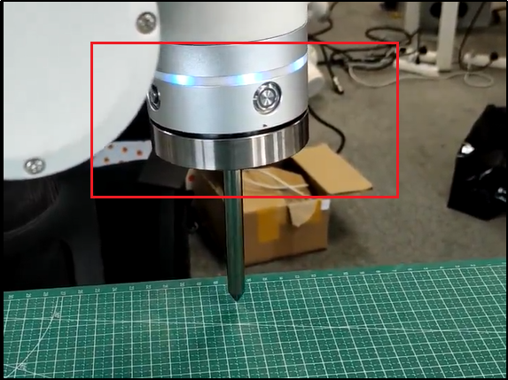

.. centered:: Abbildung 9.8-2-14 Anfangspose der Schweißbahn

.. image:: coding/120.png
   :width: 3in
   :align: center

.. centered:: Abbildung 9.8-2-15 Pose während des Betriebs unverändert

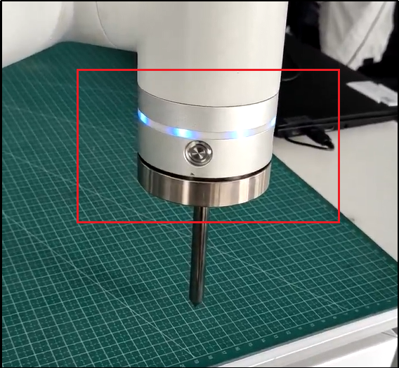

.. centered:: Abbildung 9.8-2-16 Pose während des Betriebs geändert

Praktisches Szenario des Intervallschweißens
**********************************************
In einer praktischen Testumgebung muss der Roboter mit einem Schweißbrenner usw. ausgestattet sein. Gemäß dem erstellten Intervallschweißbefehl wird auf einer Schweißplatte geschweißt. Ein Bild des praktischen Szenarios ist unten dargestellt:

.. image:: coding/122.png
   :width: 3in
   :align: center

.. centered:: Abbildung 9.8-2-17 Praktisches Szenario des Intervallschweißens

Lasertracking-Befehl
++++++++++++++++++++

Klicken Sie auf das Symbol "Lasertracking", um die Bearbeitungsoberfläche für den Laser-Befehl zu öffnen.

Dieser Befehl besteht aus drei Teilen: Laserbefehl, Trackingbefehl und Positionssuchbefehl. Stellen Sie vor dem Hinzufügen dieses Befehls sicher, dass der Lasertracking-Sensor in den Benutzer-Peripheriegeräten erfolgreich konfiguriert wurde. Weitere Details finden Sie im Kapitel Roboter-Peripheriegeräte.

Im Sensormodul wird nach Auswahl der Funktion die entsprechende "Sensorbefehls"-Oberfläche angezeigt, um den Sensorbefehl zu konfigurieren:

**RuiNiu / ChuangXiang**: Geben Sie den Schweißnahttyp ein, Bereich: Ganzzahl 0~49.

.. image:: coding/123.png
   :width: 6in
   :align: center

.. centered:: Abbildung 9.8-3-1 Laser-Befehls-Oberfläche (Schweißnahttyp)

**QuanShi**: Geben Sie die Aufgabennummer ein, Bereich: Ganzzahl 0~255.

.. image:: coding/124.png
   :width: 6in
   :align: center

.. centered:: Abbildung 9.8-3-2 Laser-Befehls-Oberfläche (Aufgabennummer)

Funktion zum Festpunkttracking mit Lasersensor
**********************************************

Übersicht
"""""""""
Derzeit wird das Laser-Festpunkttracking basierend auf der Erweiterungsachsenmethode implementiert. Es wurden benutzerdefinierte Tracking-Zeit- oder IO-Trigger-Tracking-Methoden hinzugefügt, um verschiedene Anwendungsszenarien anzupassen. Bei Wahl der benutzerdefinierten Tracking-Zeit-Methode muss die Tracking-Zeit eingestellt werden. Das Lasertracking beginnt bei Programmstart und wird nach Ablauf der eingestellten Zeit beendet. Bei Wahl der IO-Trigger-Tracking-Methode wird ein Lua- oder SDK-Programm ausgeführt. Das Tracking beginnt bei IO-Trigger und wird bei IO-Deaktivierung beendet.

Ablauf der benutzerdefinierten Tracking-Zeit-Methode
"""""""""""""""""""""""""""""""""""""""""""""""""""""

**Schritt 1**: Klicken Sie bei "Initiale Einstellungen" -> "Peripherie" -> "Linienlasersensor" auf "Angepasstes Gerät", um zur Konfigurationsseite zu gelangen. Die Konfigurationsseite umfasst "Sensor-Konfiguration", "Kommunikationskonfiguration & Laden", "Referenzberechnung" usw. Klicken Sie auf "Sensor-Konfiguration", um die Filterparameter für den Sensoreingang einzustellen. Die maximale Differenz wird je nach tatsächlicher Situation eingestellt. Wählen Sie als Datenverarbeitung "Rohdaten (keine Transformation)". Setzen Sie den Empfindlichkeitsfaktor in X-Richtung auf 0, die Y- und Z-Richtung werden je nach tatsächlicher Situation eingestellt (empfohlen 1). Klicken Sie auf "Kommunikationskonfiguration & Laden", um die entsprechenden Kommunikationsparameter zur Verbindung mit dem Lasersensor einzugeben. Detaillierte Konfiguration siehe entsprechendes Benutzerhandbuch.

.. image:: coding/524.png
   :width: 6in
   :align: center

.. centered:: Abbildung 9.8-3-3 Konfiguration des Linienlasersensors

**Schritt 2**: Kalibrieren Sie das Werkzeugkoordinatensystem und das Lasersensor-Koordinatensystem. Das Werkzeugkoordinatensystem wird mit der "Sechs-Punkt-Methode" kalibriert, das Lasersensor-Koordinatensystem mit der "Fünf-Punkt-Methode". Die Kalibrierung des Werkzeugkoordinatensystems und des Lasersensor-Koordinatensystems ist nicht Schwerpunkt dieser Funktionsbeschreibung. Detaillierte Kalibrierverfahren finden Sie im entsprechenden Benutzerhandbuch.

**Schritt 3**: Die Positionierung des Werkstücks relativ zum Laserstrahl ist in der folgenden Abbildung schematisch dargestellt. Das schwarze Rechteck ist das Werkstück, die rote Linie der Laserstrahl. Der Laserstrahl muss senkrecht zur Kante des zu verfolgenden Werkstücks stehen. Die Bewegungsrichtung des Werkstücks muss parallel zum Laserstrahl sein. Das Werkstück bewegt sich mit konstanter Geschwindigkeit, empfohlen werden 15 mm/s. Eine zu hohe Geschwindigkeit verschlechtert das Tracking-Ergebnis.

.. image:: coding/525.png
   :width: 2in
   :align: center

.. centered:: Abbildung 9.8-3-4 Schematische Darstellung der relativen Position von Werkstück und Laserstrahl

**Schritt 4**: Klicken Sie auf "Teach-Programm" -> "Lasertracking" -> "Datenaufzeichnung". Stellen Sie die Funktionsauswahl auf "Aufzeichnen während der Reproduktion", den Festpunkttracking-Bewegungstyp auf "Roboterbewegung", die Festpunkttracking-Trigger-Methode auf "Zeit". Stellen Sie die Tracking-Dauer je nach tatsächlichem Bedarf ein (im Handbuch wird 21 s als Beispiel verwendet). Die Einstellungen der übrigen Parameter sind die gleichen wie beim Lasertracking mit Erweiterungsachse. Klicken Sie auf die untere Schaltfläche "Hinzufügen".

.. image:: coding/526.png
   :width: 6in
   :align: center

.. centered:: Abbildung 9.8-3-5 Parametereinstellung für Tracking mit benutzerdefinierter Dauer

**Schritt 5**: Klicken Sie auf "Teach-Programm" -> "Lasertracking" -> "Datenaufzeichnung". Stellen Sie die Funktionsauswahl auf "Aufzeichnung stoppen" und klicken Sie auf die Schaltfläche "Hinzufügen", um ein Lua-Programm zu generieren. Wenn dieses Programm ausgeführt wird, verfolgt der Roboter 21 Sekunden lang und beendet dann das Tracking.

.. image:: coding/527.png
   :width: 6in
   :align: center

.. centered:: Abbildung 9.8-3-6 Typisches Lua-Programm für Tracking mit benutzerdefinierter Dauer

Ablauf der IO-Trigger-Tracking-Methode
"""""""""""""""""""""""""""""""""""""""
**Schritt 1**: Klicken Sie bei "Initiale Einstellungen" -> "Peripherie" -> "Linienlasersensor" auf "Angepasstes Gerät", um zur Konfigurationsseite zu gelangen. Die Konfigurationsseite umfasst "Sensor-Konfiguration", "Kommunikationskonfiguration & Laden", "Referenzberechnung" usw.

Klicken Sie auf "Sensor-Konfiguration", um die Filterparameter für den Sensoreingang einzustellen. Die maximale Differenz wird je nach tatsächlicher Situation eingestellt. Wählen Sie als Datenverarbeitung "Rohdaten (keine Transformation)". Setzen Sie den Empfindlichkeitsfaktor in X-Richtung auf 0, die Y- und Z-Richtung werden je nach tatsächlicher Situation eingestellt (empfohlen 1). Klicken Sie auf "Kommunikationskonfiguration & Laden", um die entsprechenden Kommunikationsparameter zur Verbindung mit dem Lasersensor einzugeben. Detaillierte Konfiguration siehe entsprechendes Benutzerhandbuch.

.. image:: coding/528.png
   :width: 6in
   :align: center

.. centered:: Abbildung 9.8-3-7 Konfiguration des Linienlasersensors

**Schritt 2**: Kalibrieren Sie das Werkzeugkoordinatensystem und das Lasersensor-Koordinatensystem. Das Werkzeugkoordinatensystem wird mit der "Sechs-Punkt-Methode" kalibriert, das Lasersensor-Koordinatensystem mit der "Fünf-Punkt-Methode". Die Kalibrierung des Werkzeugkoordinatensystems und des Lasersensor-Koordinatensystems ist nicht Schwerpunkt dieser Funktionsbeschreibung. Detaillierte Kalibrierverfahren finden Sie im entsprechenden Benutzerhandbuch.

**Schritt 3**: Die Positionierung des Werkstücks relativ zum Laserstrahl ist in der folgenden Abbildung schematisch dargestellt. Das schwarze Rechteck ist das Werkstück, die rote Linie der Laserstrahl. Der Laserstrahl muss senkrecht zur Kante des zu verfolgenden Werkstücks stehen. Die Bewegungsrichtung des Werkstücks muss parallel zum Laserstrahl sein. Das Werkstück bewegt sich mit konstanter Geschwindigkeit, empfohlen werden 15 mm/s. Eine zu hohe Geschwindigkeit verschlechtert das Tracking-Ergebnis.

.. image:: coding/525.png
   :width: 2in
   :align: center

.. centered:: Abbildung 9.8-3-8 Schematische Darstellung der relativen Position von Werkstück und Laserstrahl

**Schritt 4**: Klicken Sie auf "Teach-Programm" -> "Lasertracking" -> "Datenaufzeichnung". Stellen Sie die Funktionsauswahl auf "Aufzeichnen während der Reproduktion", den Festpunkttracking-Bewegungstyp auf "Roboterbewegung", die Festpunkttracking-Trigger-Methode auf "IO". Das Tracking beginnt bei IO-Trigger und endet bei IO-Deaktivierung. Die Einstellungen der übrigen Parameter sind die gleichen wie beim Lasertracking mit Erweiterungsachse. Klicken Sie auf die untere Schaltfläche "Hinzufügen".

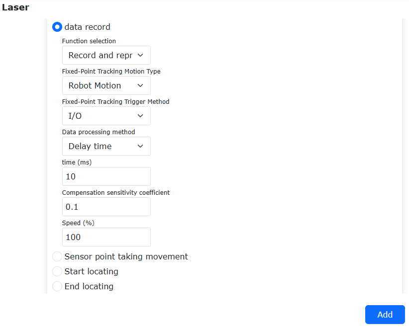

.. centered:: Abbildung 9.8-3-9 Parametereinstellung für IO-Tracking

**Schritt 5**: Klicken Sie auf "Teach-Programm" -> "Lasertracking" -> "Datenaufzeichnung". Stellen Sie die Funktionsauswahl auf "Aufzeichnung stoppen" und klicken Sie auf die Schaltfläche "Hinzufügen", um ein Lua-Programm zu generieren. Wenn dieses Programm ausgeführt wird, beginnt das Tracking bei IO-Trigger und endet bei IO-Deaktivierung.

.. image:: coding/530.png
   :width: 6in
   :align: center

.. centered:: Abbildung 9.8-3-10 Typisches Lua-Programm für IO-Tracking

Laseraufzeichnungs-Befehl
+++++++++++++++++++++++++

Klicken Sie auf das Symbol "Laseraufzeichnung", um die Bearbeitungsoberfläche für den LT-Rec-Befehl zu öffnen.

Dieser Befehl realisiert die Funktion, Start- und Endpunkt der Lasertracking-Aufzeichnung zu extrahieren. Dadurch kann der Roboter automatisch zum Startpunkt fahren. Dies eignet sich für Szenarien, in denen die Bewegung außerhalb des Werkstücks beginnt und eine Lasertracking-Aufzeichnung durchgeführt wird. Gleichzeitig kann die übergeordnete Steuerung die Informationen von Start- und Endpunkt aus den aufgezeichneten Daten abrufen, um sie für nachfolgende Bewegungen zu verwenden.

Die Funktion ermöglicht eine einstellbare Geschwindigkeit bei der Lasertracking-Reproduktion. Der Roboter kann mit einer sehr hohen Geschwindigkeit aufzeichnen und dann mit der normalen Schweißgeschwindigkeit reproduzieren, was die Arbeitseffizienz verbessert.

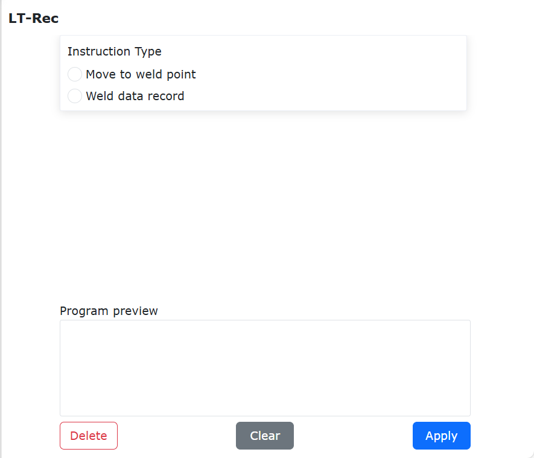

.. centered:: Abbildung 9.8-4 LT-Rec-Befehls-Oberfläche

Schweißdraht-Positionssuchbefehl
++++++++++++++++++++++++++++++++

Klicken Sie auf das Symbol "Schweißdraht-Positionssuche", um die Bearbeitungsoberfläche für den W-Search-Befehl zu öffnen.

Dieser Befehl ist ein Schweißdraht-Positionssuchbefehl. Er enthält drei Befehle: Positionssuche starten, Positionssuche beenden und Versatz berechnen. Dieser Befehl wird im Allgemeinen in Schweißszenarien verwendet und muss in Kombination mit den IO- und Bewegungsbefehlen des Schweißgeräts und des Roboters verwendet werden.

.. image:: coding/126.png
   :width: 6in
   :align: center

.. centered:: Abbildung 9.8-5 W-Search-Befehls-Oberfläche

Bei der Programmerstellung wird normalerweise zuerst der Befehl "Positionssuche starten" gesetzt. Dann werden zwei LIN-Befehle hinzugefügt, um die Richtung der Positionssuche zu bestimmen. Nach erfolgreicher Positionssuche wird der berechnete Versatzbetrag abgerufen. Dieser Versatzbetrag wird dann über einen allgemeinen Versatzbefehl auf die tatsächlichen Schweißbewegungsbefehle angewendet. Ein Beispielprogramm ist unten dargestellt.

.. image:: coding/127.png
   :width: 4in
   :align: center

.. centered:: Abbildung 9.8-5-1 W-Search Beispiel (1D)

Lichtbogen-Tracking-Befehl
++++++++++++++++++++++++++

Klicken Sie auf das Symbol "Lichtbogen-Tracking", um die Bearbeitungsoberfläche für den Weld-Trc-Befehl zu öffnen.

Dieser Befehl realisiert die Roboter-Schweißnahtverfolgung. Er nutzt die Erkennung von Abweichungen in der Schweißnaht zur Bahnkompensation. Ein Lichtbogensensor kann verwendet werden, um Schweißnahtabweichungen zu erkennen.

**Schritt 1**: Art der Einstellung des Referenzstroms für die Höhenkompensation: Rückmeldung. Stellen Sie den Zählbeginn für den Höhenreferenzstrom und die Zählung für den Höhenreferenzstrom ein.

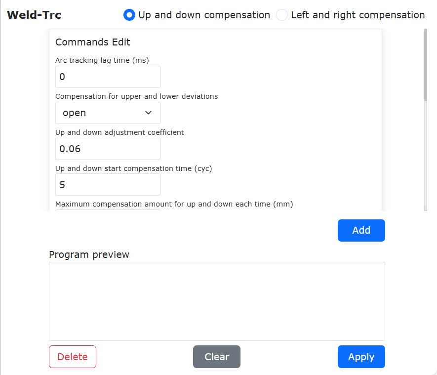

.. centered:: Abbildung 9.8-6-1 Weld-Trc-Befehls-Oberfläche – Rückmeldung

**Schritt 2**: Art der Einstellung des Referenzstroms für die Höhenkompensation: Konstante. Stellen Sie den Höhenreferenzstrom ein.

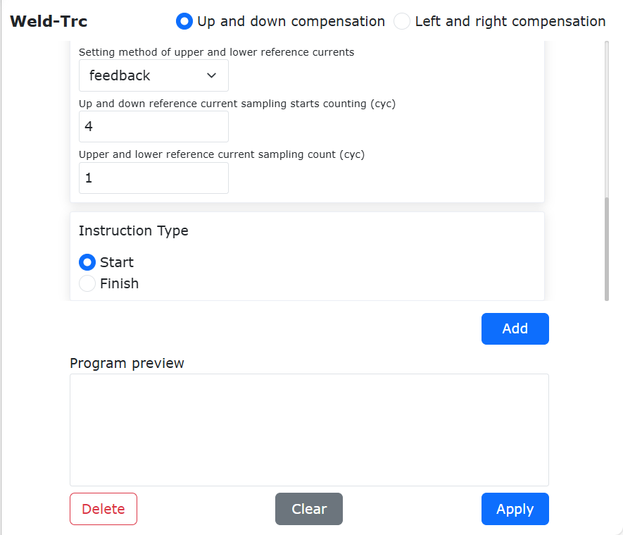

.. centered:: Abbildung 9.8-6-2 Weld-Trc-Befehls-Oberfläche – Konstante

**Schritt 3**: Interaktionsseite für die Seitenkompensationsparameter.

.. image:: coding/130.png
   :width: 6in
   :align: center

.. centered:: Abbildung 9.8-6-3 Weld-Trc-Befehls-Oberfläche – Seitenkompensationsparameter

Aufbau des Roboter-Lichtbogen-Tracking-Systems
+++++++++++++++++++++++++++++++++++++++++++++++

Während des Lichtbogen-Tracking-Schweißprozesses mit dem kollaborativen Roboter gibt das Schweißgerät Echtzeit-Schweißstrom- und -spannungssignale an den Roboter zurück. Der Roboter führt basierend auf den Echtzeit-Schweißstrom- und -spannungswerten eine Positionskompensation der Schweißbahn durch, um den Lichtbogen-Tracking-Effekt zu erzielen. Die Rückmeldung der Strom- und Spannungssignale zwischen Schweißgerät und Roboter kann auf folgende vier Arten erfolgen, wobei die ersten beiden einen zusätzlichen PLC zur Datenübertragung benötigen, während die letzten beiden eine direkte Verbindung zwischen Schweißgerät und Robotersteuerpult darstellen:

① CANopen oder andere Buskommunikation: Wenn Ihr Schweißgerät Buskommunikationsprotokolle wie CANopen, EtherCAT, ModbusTCP unterstützt (z. B. Aotai NBC-500RP, Megmeet A2-Serie), kann die Kommunikation zwischen PLC und Schweißgerät direkt über das entsprechende Kommunikationsprotokoll erfolgen. Die entsprechenden Schweißstromsignale können direkt über die Kommunikation an den PLC übertragen werden, der sie dann über UDP-Kommunikation an den Roboter weiterleitet.

.. image:: coding/277.png
   :width: 6in
   :align: center

.. centered:: Abbildung 9.8-6-4 Topologie des Roboter-Lichtbogen-Tracking-Systems (PLC-Schweißgerät-Buskommunikation)
.. centered:: a-Computer; b-Roboter und Steuerpult; c-PLC und Buskommunikationsmodul; d-Schweißgerät

② PLC + IO-Analogwert: Der PLC kann auch direkt analoge Signale erfassen und diese dann über eine Umrechnungsbeziehung in Stromwerte umwandeln und an den Roboter weiterleiten. Wenn Ihr Schweißgerät über einen analogen Ausgangskanal für den Echtzeit-Schweißstrom verfügt, kann dieser Kanal direkt an das analoge Eingangsmodul des PLC angeschlossen werden. Wenn Ihr Schweißgerät keinen analogen Ausgangskanal für den Echtzeit-Schweißstrom hat, kann ein externer Hall-Stromsensor verwendet werden. Der Sensor erfasst das Echtzeit-Schweißstromsignal und wandelt es in ein analoges Signal um, das an das analoge Eingangsmodul des PLC ausgegeben wird.

.. image:: coding/278.png
   :width: 6in
   :align: center

.. centered:: Abbildung 9.8-6-5 Topologie des Roboter-Lichtbogen-Tracking-Systems (PLC erfasst analoge Signale)
.. centered:: a-Computer; b-Roboter und Steuerpult; c-PLC und analoges Eingangsmodul; d-Schweißgerät und Hall-Stromsensor

③ Steuerpult AI: Die IO-Ports des Robotersteuerpults verfügen über zwei analoge Eingänge (0 ~ 10 V). Wenn Ihr Schweißgerät über einen analogen Ausgangskanal für den Echtzeit-Schweißstrom verfügt, kann dieser Kanal direkt an den analogen Eingangsport des Steuerpults angeschlossen werden. Wenn Ihr Schweißgerät keinen analogen Ausgangskanal für den Echtzeit-Schweißstrom hat, kann ein externer Hall-Stromsensor verwendet werden. Der Sensor erfasst das Echtzeit-Schweißstromsignal und wandelt es in ein analoges Signal um, das an den analogen Eingangskanal des Steuerpults ausgegeben wird. Der Zusammenhang zwischen dem analogen Eingangswert und dem tatsächlichen Schweißstromwert ist oft linear. Detaillierte Parametereinstellungen folgen im Abschnitt "Lichtbogen-Tracking-Kanal-Konfiguration".

.. image:: coding/534.png
   :width: 5in
   :align: center

.. centered:: Abbildung 9.8-6-6 Topologie des Roboter-Lichtbogen-Tracking-Systems (Steuerpult AI erfasst analoge Werte)
.. centered:: a-Computer; b-Roboter und Steuerpult; c-Schweißgerät und Hall-Stromsensor

④ Ethernet-Kommunikation: Wenn Ihr Schweißgerät ModbusTCP-Kommunikation unterstützt, kann der Roboter das Schweißen direkt über ModbusTCP steuern und die Echtzeit-Strom- und Spannungsrückmeldungswerte lesen. Für die ModbusTCP-Kommunikation zwischen Roboter und Schweißgerät wird das offene Protokoll des Steuerpult-Peripheriegeräts verwendet. Siehe "8.6.6. Digitales Kommunikationsprotokoll (Modbus TCP)".

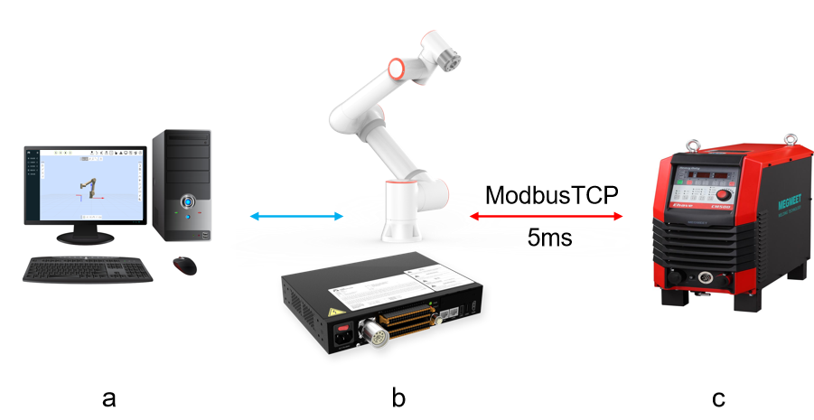

.. centered:: Abbildung 9.8-6-7 Topologie des Roboter-Lichtbogen-Tracking-Systems (ModbusTCP-Kommunikation)
.. centered:: a-Computer; b-Roboter und Steuerpult; c-Schweißgerät

Schweißgerätemodelle und Einstellungen
***************************************

.. centered:: Tabelle 9.8-1 Schweißgerätemodelle und Einstellungen

.. list-table::
   :widths: 70
   :header-rows: 0
   :align: center

   * - **Derzeit getestete und anpassbare Schweißgerätemodelle**

   * - Megmeet ArtsenII CM350 Schweißgerät

.. centered:: Tabelle 9.8-2 Funktionseinstellungen des Schweißgeräts

.. list-table::
   :widths: 100 100
   :header-rows: 0
   :align: center

   * - **Funktionsnummer**
     - **Einstellparameter**

   * - F18
     - 20

   * - F19
     - 56

PLC Modelle und Einstellungen
******************************
.. centered:: Tabelle 9.8-3 PLC Modelle und Einstellungen

.. list-table::
   :widths: 70
   :header-rows: 0
   :align: center

   * - **Derzeit getestete und anpassbare PLC Modelle**

   * - Inovance Easy521

.. centered:: Tabelle 9.8-4 Wichtige PLC Einstellungen

.. list-table::
   :widths: 70 70
   :header-rows: 0
   :align: center

   * - **Einstellungspunkt**
     - **Einstellungsinhalt**

   * - Kommunikationsprotokoll
     - CANOPEN

   * - Quelle des Rückmeldungsstromabtasts
     - CANOPEN Rückmeldedaten des Schweißgeräts

   * - Synchronisationszyklus
     - 2 ms

:download:`Anhang: PLC-Programm <../_static/_doc/MEGMEET PLC PROGRAME.zip>`

Lichtbogen-Tracking-Funktion
*****************************

**1) Kurzeinführung der Funktionsoberflächenparameter**

.. image:: coding/279.png
   :width: 4in
   :align: center

.. centered:: Abbildung 9.8-7-1 Typisches Szenario für Lichtbogen-Tracking

Ein typisches Szenario für die Lichtbogen-Tracking-Funktion umfasst: a. Schweißwerkstück (Schweißnahtvorbereitung im rechten oder spitzen Winkel), b. Schweißbrenner, e. Mittellinie der Schweißnaht.

Die Lichtbogen-Tracking-Funktion kann durch die erfassten Schweißstrominformationen und die eingestellten Pendelparameter des Roboters eine Verfolgung der Schweißnaht in c. Höhenrichtung (Tiefe) und d. Seitenrichtung (Mitte) realisieren.

**2) Kommunikationskonfiguration**

① CANopen oder andere Buskommunikation:

Öffnen Sie die WebApp und klicken Sie nacheinander auf "Initiale Einstellungen" -> "Benutzer-Peripheriekonfiguration" -> "Schweißgerät-Konfiguration".

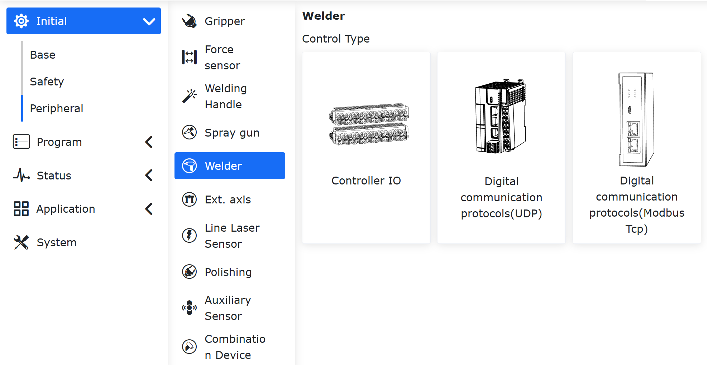

.. centered:: Abbildung 9.8-7-2 Öffnen der Schweißgerät-Konfiguration

Wählen Sie als Steuerungstyp "Digitales Kommunikationsprotokoll". Konfigurieren Sie die UDP-Kommunikationsparameter. Die Bedeutung der einzelnen Parameter ist wie folgt:

**IP-Adresse**: IP-Adresse der PLC-Seite für die UDP-Kommunikation;

**Portnummer**: UDP-Kommunikationsportnummer der PLC-Seite;

**Kommunikationszyklus**: Zyklus der UDP-Kommunikation zwischen Roboter und PLC, Standard 2 ms;

**Verlustpaketerkennungszyklus, Anzahl der Verlustpakete**: Wenn die Anzahl der Verlustpakete innerhalb des Verlustpaketerkennungszyklus den eingestellten Wert überschreitet, meldet der Roboter den Fehler "UDP-Kommunikation Verlustpaket-Anomalie" und die Kommunikation wird automatisch getrennt.

**Bestätigungsdauer für Kommunikationsunterbrechung**: Wenn der Roboter innerhalb dieser Dauer kein vollständiges PLC-Rückmeldungspaket erhält, wird der Fehler "UDP-Kommunikationsunterbrechung" gemeldet und die UDP-Kommunikation getrennt.

**Automatische Wiederverbindung bei Kommunikationsunterbrechung**: Legt fest, ob der Roboter nach Erkennung einer UDP-Kommunikationsunterbrechung automatisch versuchen soll, die Verbindung wiederherzustellen.

**Wiederverbindungszyklus, Anzahl der Wiederverbindungsversuche**: Wenn die automatische Wiederverbindung bei UDP-Kommunikationsunterbrechung aktiviert ist und eine Unterbrechung erkannt wird, versucht der Roboter in festgelegten Zyklen, die Verbindung wiederherzustellen. Wenn die maximale Anzahl der Wiederverbindungsversuche erreicht ist, ohne dass eine Verbindung hergestellt werden konnte, meldet der Roboter den Fehler "UDP-Kommunikationsunterbrechung" und die UDP-Kommunikation wird getrennt.

Nachdem Sie die oben genannten Parameter konfiguriert haben, klicken Sie nacheinander auf die Schaltflächen "Konfigurieren" und "Laden".

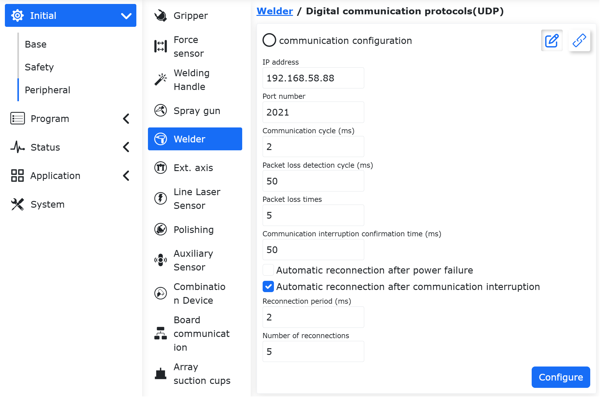

.. centered:: Abbildung 9.8-7-3 Auswahl des Steuerungstyps

② PLC + IO-Analogwert:

Wie unter "① CANopen oder andere Buskommunikation" wandelt das PLC-Programm die analogen Eingangsdaten in Strom- und Spannungsdaten des UDP-Kommunikationsprotokolls um und sendet sie an den Roboter.

③ Steuerpult AI:

Keine Kommunikationskonfiguration erforderlich. Es müssen nur die IO-Kabel zwischen Steuerpult und Schweißgerät korrekt angeschlossen werden. Die analogen Rückmeldungskabel für Echtzeit-Schweißstrom und -spannung des Schweißgeräts werden an die AI0 und AI1 des Robotersteuerpults angeschlossen.

④ Ethernet-Kommunikation:

Verbinden Sie die Netzwerkkabel zwischen Roboter und Schweißgerät korrekt. Klicken Sie in der WebApp nacheinander auf "Initiale Einstellungen", "Peripherie", "Steuerpult", "Offenes Peripherieprotokoll". Laden Sie das Schweißgerät-Kommunikationsprotokoll in den Roboter hoch und klicken Sie nacheinander auf die Schaltflächen "Konfigurieren" und "Laden". Der Roboter stellt dann eine ModbusTCP-Kommunikationsverbindung mit dem Schweißgerät her.

.. image:: coding/542.png
   :width: 4in
   :align: center

.. centered:: Abbildung 9.8-7-4 Aufbau der Lichtbogen-Tracking-Ethernet-Kommunikation

.. note:: Die Effektivität des Lichtbogen-Trackings hängt von einer schnellen Echtzeit-Rückmeldung der Schweißstrom- und -spannungsdaten ab. Bei zu langsamer Rückmeldung kann die Schweißnahtverfolgung fehlschlagen. Daher muss bei Verwendung von ModbusTCP für die Schweißgerät-Kommunikation der Kommunikationszyklus im Protokoll angemessen eingestellt werden. Ein Kommunikationszyklus von weniger als 10 ms wird empfohlen.

**3) Kanalkonfiguration**

① CANopen oder andere Buskommunikation:

Klicken Sie nacheinander auf "Initiale Einstellungen" -> "Peripherie" -> "Schweißgerät" -> "Digitales Kommunikationsprotokoll (UDP)".

.. image:: coding/282.png
   :width: 4in
   :align: center

.. centered:: Abbildung 9.8-7-5 Wahl des Schweißgerät-Steuerungstyps als "Digitales Kommunikationsprotokoll (UDP)"

Suchen Sie unten auf der Seite nach "Lichtbogen-Tracking-Kanal". Wählen Sie je nach tatsächlicher Konfiguration den entsprechenden erweiterten AI-Kanal aus. Standardmäßig ist der Schweißstrom-AI-Kanal "Aux-AI0" und der Schweißspannungs-AI-Kanal "Aux-AI1". Klicken Sie auf die Schaltfläche "Konfigurieren".

.. note::
   Das UDP-Kommunikationsprotokoll zwischen Roboter und PLC finden Sie im "Anhang I: Roboter UDP-Kommunikationsprotokoll". Das Protokoll enthält in den vom PLC an den Roboter zurückgemeldeten Daten die tatsächlichen Schweißstrom- und -spannungsrückmelde-Eingangskanäle in den Bytes 74~77.

   Während des Schweißens erfasst der PLC über CANopen oder andere Busse das Echtzeit-Schweißstromsignal und gibt es über die Bytes 74~77 als tatsächliche Schweißstrom- und -spannungswerte an den Roboter für das Lichtbogen-Tracking zurück.

.. image:: coding/536.png
   :width: 4in
   :align: center

.. centered:: Abbildung 9.8-7-6 Lichtbogen-Tracking-Kanal-Konfiguration für Buskommunikation

② PLC + IO-Analogwert:

Die Konfiguration ist die gleiche wie bei "① CANopen oder andere Buskommunikation". Der Benutzer wandelt im PLC-Programm die gelesenen analogen Eingänge nach numerischer Umrechnung in tatsächliche Schweißstrom- und -spannungsrückmeldungswerte um und weist sie den Bytes 74~77 des vom PLC an den Roboter zurückgemeldeten UDP-Kommunikationsprotokoll-Datenpakets zu (tatsächliche Schweißstrom- und -spannungsrückmelde-Eingangskanäle).

③ Steuerpult AI:

Klicken Sie nacheinander auf "Initiale Einstellungen" -> "Peripherie" -> "Schweißgerät", "Controller I/O".

.. image:: coding/537.png
   :width: 4in
   :align: center

.. centered:: Abbildung 9.8-7-7 Wahl des Schweißgerät-Steuerungstyps als "Controller I/O"

Suchen Sie unten auf der Seite nach "Lichtbogen-Tracking-Kanal". Wählen Sie als Schweißstrom-AI "Ctrl-AI0" und als Schweißspannungs-AI "Ctrl-AI1". Klicken Sie auf die Schaltfläche "Konfigurieren". Der Zusammenhang zwischen dem analogen Eingang 0~10 V des Steuerpults und den tatsächlichen Strom- und Spannungsrückmeldungswerten ist oft linear. Daher müssen die tatsächlichen Schweißstrom- und -spannungswerte für verschiedene analoge Eingänge konfiguriert werden.

Die Parametereinstellungen in den Bereichen "A-V" und "V-V" des "Analog Strom-Spannungs-Diagramms" in der AI-Kanalkonfiguration müssen unter Bezugnahme auf die Analogempfangs- und -ausgabetabellen/-diagramme des verwendeten Schweißgeräts erfolgen.

Konfigurieren Sie beispielsweise die untere und obere Grenze des Schweißstroms für den Steuerpult-Strom-Analogeingang AI auf 0 A und 500 A. Konfigurieren Sie die untere und obere Grenze der Ausgangsspannung für den Steuerpult-Strom-Analogeingang AI auf 0 V und 5 V. Diese Werte dienen als Konfigurationsparameter im Bereich "A-V" des "Analog Strom-Spannungs-Diagramms" in der AI-Kanalkonfiguration. Klicken Sie auf "Konfigurieren", um die Konfiguration des Steuerpult-Strom-Analogeingangs AI abzuschließen.

.. image:: coding/538.png
   :width: 4in
   :align: center

.. centered:: Abbildung 9.8-7-8 Konfiguration des Steuerpult-Strom-Analogeingangs AI

Konfigurieren Sie beispielsweise die untere und obere Grenze der Schweißspannung für den Steuerpult-Spannungs-Analogeingang AI auf 0 V und 50 V. Konfigurieren Sie die untere und obere Grenze der Ausgangsspannung für den Steuerpult-Spannungs-Analogeingang AI auf 1,018 V und 10 V. Diese Werte dienen als Konfigurationsparameter im Bereich "V-V" des "Analog Strom-Spannungs-Diagramms" in der AI-Kanalkonfiguration. Klicken Sie auf "Konfigurieren", um die Konfiguration des Steuerpult-Spannungs-Analogeingangs AI abzuschließen.

.. image:: coding/539.png
   :width: 4in
   :align: center

.. centered:: Abbildung 9.8-7-9 Konfiguration des Steuerpult-Spannungs-Analogeingangs AI

④ Ethernet-Kommunikation:

Klicken Sie nacheinander auf "Initiale Einstellungen", "Peripherie", "Schweißgerät", "Digitales Kommunikationsprotokoll (Modbus TCP)".

.. image:: coding/540.png
   :width: 4in
   :align: center

.. centered:: Abbildung 9.8-7-10 Wahl des Schweißgerät-Steuerungstyps als "Digitales Kommunikationsprotokoll (Modbus TCP)"

Suchen Sie unten auf der Seite nach "Lichtbogen-Tracking-Kanal". Wählen Sie als Schweißstrom-AI "Ethernet" und als Schweißspannungs-AI "Ethernet". Klicken Sie auf die Schaltfläche "Konfigurieren".

.. image:: coding/541.png
   :width: 4in
   :align: center

.. centered:: Abbildung 9.8-7-11 Lichtbogen-Tracking-Kanal-Konfiguration für Ethernet-Kommunikation

**4) Kurzeinführung der Funktionsbefehle**

Die Lichtbogen-Tracking-Funktion kann in Pendelschweißbewegungen integriert werden. Der Befehl "Lichtbogen-Tracking starten" wird nach dem Zünden des Lichtbogens in der Pendelschweißung eingefügt, der Befehl "Lichtbogen-Tracking beenden" vor dem Löschen des Lichtbogens.

.. image:: coding/283.png
   :width: 6in
   :align: center

.. centered:: Abbildung 9.8-7-12 Typisches Beispielprogramm für Lichtbogen-Tracking

**5) Kurzeinführung der Funktionsoberflächenparameter**

.. centered:: Tabelle 9.8-5 Lichtbogen-Tracking Höhenkompensationsmodul

.. list-table::
   :widths: 70 70 70
   :header-rows: 0
   :align: center

   * - **Parametername**
     - **Bedeutung**
     - **Hinweise**

   * - Lichtbogen-Tracking Nachlaufzeit
     - Zeitverzögerung des Rückmeldestroms
     - Standard 0 ms, nicht ändern

   * - Höhenabweichungskompensation
     - Schalter für Höhenkompensation
     - Wählbar "Ein" oder "Aus"

   * - Höhenregelkoeffizient
     - Beziehungskoeffizient zwischen Strom und Kompensationsdistanz (Regelungsempfindlichkeit)
     - Bei Kurzschlussübergang wird das Signal-Rausch-Verhältnis des Stroms geringer. Empfehlung: Empfindlichkeit reduzieren.

   * - Höhenkompensationsbeginnzeit
     - Frühester Zyklus für den Beginn der Höhenkompensation
     - Hängt mit der Pendelfrequenz zusammen. Am besten 3~4 s nach dem Zünden starten, wenn der Strom stabil ist. Bei einer Pendelfrequenz von 1 Hz könnte der Parameter 4 sein, bei 2 Hz 8 usw.

   * - Maximale Kompensation pro Höhenzyklus
     - Maximale Kompensationsmenge pro Höhenkompensationszyklus
     - Je nach Schweißszenario einstellen. Je höher die Pendelfrequenz, desto kleiner die Kompensationsmenge.

   * - Maximale Gesamtkompensation Höhe
     - Maximal kumulierte Kompensationsmenge für einen einzelnen vollständigen Schweißprozess
     - Je nach Schweißszenario einstellen. Je größer die Schweißnahtabweichung, desto größer die Einstellung.

   * - Wahl des Höhenkoordinatensystems
     - Koordinatensystem, in dem der Kompensationswert kompensiert wird
     - Bei Verwendung von Schweißpendeln kann "Pendeln" gewählt werden, sonst "Werkzeug" oder "Basis".

   * - Art der Einstellung des Höhenreferenzstroms
     - Wahl der Methode zur Ermittlung des Referenzstroms
     - Wählbar "Rückmeldung" (durch Lesen des Rückmeldestroms) oder "Konstante" (durch direktes Eintragen eines Stromwerts).

   * - Zählbeginn für Höhenreferenzstromabtastung
     - Verzögerung der Zyklen vor Beginn der Erfassung des Referenzstroms
     - Hängt mit der Pendelfrequenz zusammen. Am besten 3~4 s nach dem Zünden starten, wenn der Strom stabil ist. Bei einer Pendelfrequenz von 1 Hz könnte der Parameter 4 sein, bei 2 Hz 8 usw.

   * - Zählung für Höhenreferenzstromabtastung
     - Statistischer Zyklus für die Erfassung des Referenzstroms im Rückmeldemodus
     - Standard 1 Zyklus

   * - Höhenreferenzstrom
     - Referenzstromwert im Konstantmodus
     - Manuell einstellbar, um die gewünschte Kompensationshöhe zu erreichen.

.. centered:: Tabelle 9.8-6 Lichtbogen-Tracking Seitenkompensationsmodul

.. list-table::
   :widths: 70 70 70
   :header-rows: 0
   :align: center

   * - **Parametername**
     - **Bedeutung**
     - **Parameterbeschreibung**

   * - Lichtbogen-Tracking Nachlaufzeit
     - Zeitverzögerung des Rückmeldestroms
     - Standard 0 ms, nicht ändern

   * - Seitenabweichungskompensation
     - Schalter für Seitenkompensation
     - Wählbar "Ein" oder "Aus"

   * - Seitenregelkoeffizient
     - Beziehungskoeffizient zwischen Strom und Kompensationsdistanz (Regelungsempfindlichkeit)
     - Bei Kurzschlussübergang wird das Signal-Rausch-Verhältnis des Stroms geringer. Empfehlung: Empfindlichkeit reduzieren.

   * - Seitenkompensationsbeginnzeit
     - Frühester Zyklus für den Beginn der Seitenkompensation
     - Hängt mit der Pendelfrequenz zusammen. Am besten 3~4 s nach dem Zünden starten, wenn der Strom stabil ist. Bei einer Pendelfrequenz von 1 Hz könnte der Parameter 4 sein, bei 2 Hz 8 usw.

   * - Maximale Kompensation pro Seitenzyklus
     - Maximale Kompensationsmenge pro Seitenkompensationszyklus
     - Je nach Schweißszenario einstellen. Je höher die Pendelfrequenz, desto kleiner die Kompensationsmenge.

   * - Maximale Gesamtkompensation Seite
     - Maximal kumulierte Kompensationsmenge für einen einzelnen vollständigen Schweißprozess
     - Je nach Schweißszenario einstellen. Je größer die Schweißnahtabweichung, desto größer die Einstellung.

**6) Anwendungsbereich**

.. centered:: Tabelle 9.8-7 Höhenkompensation ein, Seitenkompensation aus

.. list-table::
   :widths: 70 70
   :header-rows: 0
   :align: center

   * - **Schlüsselparameter**
     - **Parameterbereich**

   * - Pendelfrequenz Hz
     - 0 (kein Schweißpendeln), 0,5 bis 2 (mit Schweißpendeln)

   * - Pendelamplitude mm
     - 0 (kein Schweißpendeln), 3 bis 7 (mit Schweißpendeln)

   * - Eingestellte Spannung V
     - >17

   * - Eingestellter Strom A
     - >160

.. centered:: Tabelle 9.8-8 Höhenkompensation aus, Seitenkompensation ein

.. list-table::
   :widths: 70 70
   :header-rows: 0
   :align: center

   * - **Schlüsselparameter**
     - **Parameterbereich**

   * - Pendelfrequenz Hz
     - 0,5 bis 2

   * - Pendelamplitude mm
     - 3 bis 7

   * - Eingestellte Spannung V
     - >17

   * - Eingestellter Strom A
     - >160

.. centered:: Tabelle 9.8-9 Höhen- und Seitenkompensation beide ein

.. list-table::
   :widths: 70 70
   :header-rows: 0
   :align: center

   * - **Schlüsselparameter**
     - **Parameterbereich**

   * - Pendelfrequenz Hz
     - 0,5 bis 2

   * - Pendelamplitude mm
     - 3 bis 7

   * - Eingestellte Spannung V
     - >19

   * - Eingestellter Strom A
     - >210

**7) Hinweise**

1) Die Lichtbogen-Tracking-Funktion mit Seitenkompensation kann nur mit linearen Bahnen in Kombination mit symmetrischem Dreieck- oder Sinuspendeln verwendet werden.
2) Die Startposition für das Schweißen mit Kompensation muss genau über der Schweißnaht liegen (Schweißbrennerachse in der Mitte der Kehlnaht). Der Abstand des Schweißbrenners zur Schweißnaht darf nicht zu gering sein, da sonst Kollisionsgefahr besteht.
3) Das Material auf beiden Seiten der Werkstückfuge muss identisch sein.
4) Die Abmessungen und die Pose des Werkstückkoordinatensystems müssen mit der 6-Punkt-Methode genau kalibriert werden.
5) Je größer die Abweichung zwischen der eingestellten Bahn und der Schweißnaht, desto größer sollten die maximale Kompensation pro Zyklus und die maximale Gesamtkompensation eingestellt werden.
6) Die Endpunktabweichung zwischen der eingestellten Bahn und der Schweißnaht sollte 100 mm/m nicht überschreiten. Eine zu große Abweichung kann dazu führen, dass der Schweißdraht oder sogar der Schweißbrenner mit dem Werkstück kollidiert, die Schweißposition von der vorgegebenen Bahn abweicht (unzureichendes Pendeln) und die Lichtbogen-Tracking-Funktion nicht richtig wirken kann.
7) Wenn mit niedrigeren eingestellten Strömen und Spannungen geschweißt wird, sollten die Regelkoeffizienten für Höhe und Seite entsprechend verringert werden, um eine instabile Kompensation durch Störspitzen im Rückmeldestrom zu vermeiden.
8) Bei Wahl verschiedener Koordinatensysteme für das Lichtbogen-Tracking kann sich das Vorzeichen der Höhen- und Seitenregelkoeffizienten ändern. Dies kann zusätzlich zur Beurteilung anhand der Richtung des entsprechenden Koordinatensystems auch durch Probeschweißen überprüft werden. Wenn nach dem Anfahren einer geneigten Pendelschweißbahn (linkes Bild) und dem Aktivieren des Lichtbogen-Trackings die resultierende Schweißbahn (rechtes Bild) der Neigung der Pendelebene folgt und die Höhe des Schweißbrenners am Ende nahe der am Start ist, dann ist das Vorzeichen des Regelkoeffizienten korrekt.

.. image:: coding/284.png
   :width: 6in
   :align: center

.. centered:: Abbildung 9.8-7-13 Einstellung einer geneigten Pendelbahn (links), Schweißbahn bei korrektem Vorzeichen (rechts)

Posenanpassungs-Befehl
++++++++++++++++++++++

Klicken Sie auf das Symbol "Posenanpassung", um die Bearbeitungsoberfläche für den Adjust-Befehl zu öffnen.

Dieser Befehl dient zur adaptiven Anpassung der Schweißbrennerpose in Schweiß-Tracking-Szenarien. Nachdem drei entsprechende Posenpunkte aufgezeichnet wurden, wird basierend auf der tatsächlichen Bewegungsrichtung des Roboters ein Befehl zur adaptiven Posenanpassung hinzugefügt. Weitere Details finden Sie im Kapitel Roboter-Peripheriegeräte.

.. image:: coding/134.png
   :width: 6in
   :align: center

.. centered:: Abbildung 9.8-8 Adjust-Befehls-Oberfläche

Kraftregelungsbefehls-Oberfläche
~~~~~~~~~~~~~~~~~~~~~~~~~~~~~~~~

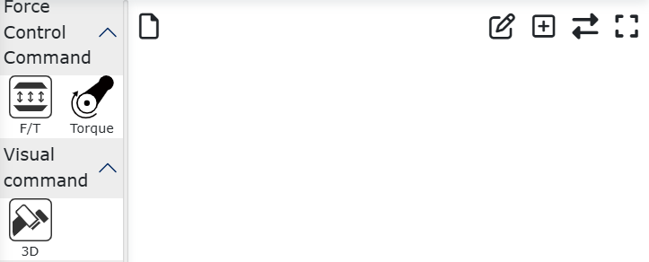

.. centered:: Abbildung 9.9 Kraftregelungsbefehls-Oberfläche

Kraftregelungssatz-Befehl
+++++++++++++++++++++++++

Klicken Sie auf das Symbol "Kraftregelungssatz", um die Bearbeitungsoberfläche für den F/T-Befehl zu öffnen.

Dieser Befehl enthält acht Befehle: FT_Guard (Kollisionserkennung), FT_Control (Kraftregelung), FT_Compliance (Nachgiebigkeitsregelung), FT_Spiral (Schraubeinfügen), FT_Rot (Dreheinfügen), FT_Lin (Lineareinfügen), FT_FindSurface (Oberflächenlokalisierung), FT_CalCenter (Zentrumslokalisierung). Weitere Details finden Sie im Kapitel Roboter-Peripheriegeräte.

.. image:: coding/136.png
   :width: 6in
   :align: center

.. centered:: Abbildung 9.9-1 F/T-Befehls-Oberfläche

Optimierte Funktion für kraftgeregeltes Dreheinfügen
****************************************************

Übersicht
"""""""""
Die kraftgeregelte Dreheinfügefunktion wird im Allgemeinen für Dreheinfügevorgänge verwendet. Vor der Ausführung der Aktion muss das Roboterende auf eine vollständig ausgerichtete angefahrene Lochposition bewegt werden. Je nach Anwendungsszenario werden die entsprechenden Bewegungsparameter und die Behandlungsstrategie für den Fall, dass keine externe Kraft erkannt wird, festgelegt. Wenn die am Ende erfasste externe Kraft den eingestellten Schwellwert nicht erreicht, kann der Benutzer selbst wählen, ob das gesamte Programm gestoppt (Funktion konfiguriert als "Fehler", rote Fehlermeldung in der Oberfläche) oder die Bewegung fortgesetzt werden soll (Funktion konfiguriert als "Warnung", gelbe Warnmeldung in der Oberfläche).

Ablauf
""""""
**Schritt 1**: Klicken Sie nacheinander auf "Teach-Programm" -> "Programmierung" -> "Kraftregelungssatz" -> "Rot"-Befehl. Stellen Sie je nach tatsächlichem Anwendungsszenario die entsprechenden Bewegungsparameter ein. Die Behandlungsstrategie für den Fall, dass keine externe Kraft erkannt wird, kann auf "Fehler" oder "Warnung" gesetzt werden. Bei Konfiguration als "Fehler" meldet die Oberfläche einen Fehler und stoppt die Ausführung des nachfolgenden Programms, wenn die vom Roboter erfasste externe Kraft immer unter dem eingestellten Schwellwert bleibt und der eingestellte Drehwinkel bereits erreicht wurde. Bei Konfiguration als "Warnung" gibt die Oberfläche eine Warnung aus und fährt mit der Ausführung des nachfolgenden Programms fort, wenn die vom Roboter erfasste externe Kraft immer unter dem eingestellten Schwellwert bleibt und der eingestellte Drehwinkel bereits erreicht wurde.

.. image:: coding/531.png
   :width: 3in
   :align: center

.. centered:: Abbildung 9.9-2 Parametereinstellung für kraftgeregeltes Dreheinfügen

**Schritt 2**: Die kraftgeregelte Dreheinfügefunktion muss in Verbindung mit der "FT_Control"-Funktion für die Bewegung verwendet werden. Typische Lua-Programme mit gleichen Bewegungsparametern und der Behandlungsstrategie für den Fall, dass keine externe Kraft erkannt wird, als "Fehler" oder "Warnung" sind in den folgenden Abbildungen dargestellt.

.. image:: coding/532.png
   :width: 6in
   :align: center

.. centered:: Abbildung 9.9-3 Typisches Lua-Programm konfiguriert als "Fehler"

.. image:: coding/533.png
   :width: 6in
   :align: center

.. centered:: Abbildung 9.9-4 Typisches Lua-Programm konfiguriert als "Warnung"

Drehmomentaufzeichnungs-Befehl
++++++++++++++++++++++++++++++

Klicken Sie auf das Symbol "Drehmomentaufzeichnung", um die Bearbeitungsoberfläche für den Torque-Befehl zu öffnen.

Dieser Befehl ist ein Drehmomentaufzeichnungsbefehl. Er realisiert die Funktion der Echtzeit-Drehmomentaufzeichnung für die Kollisionserkennung. Klicken Sie auf die Schaltfläche "Drehmomentaufzeichnung starten", um kontinuierlich Kollisionssituationen während der Ausführung von Bewegungsbefehlen aufzuzeichnen. Das aufgezeichnete Echtzeit-Drehmoment dient als theoretischer Wert für die Kollisionserkennungsbeurteilung, um die Wahrscheinlichkeit von Fehlalarmen zu reduzieren. Wenn der eingestellte Schwellwertbereich überschritten wird, wird die Dauer der Kollisionserkennung aufgezeichnet. Klicken Sie auf die Schaltfläche "Drehmomentaufzeichnung stoppen", um die Aufzeichnung zu beenden. Klicken Sie auf "Drehmomentaufzeichnung zurücksetzen", um den Status auf den Standardzustand zurückzusetzen.

.. image:: coding/137.png
   :width: 6in
   :align: center

.. centered:: Abbildung 9.9-5 Torque-Befehls-Oberfläche

Visuelle Befehls-Oberfläche
~~~~~~~~~~~~~~~~~~~~~~~~~~~

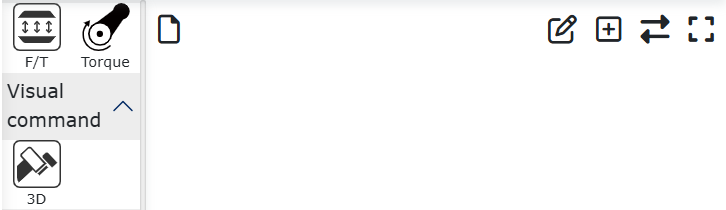

.. centered:: Abbildung 9.10 Visuelle Befehls-Oberfläche

3D-Visions-Befehl
+++++++++++++++++

Klicken Sie auf das Symbol "3D-Vision", um die Bearbeitungsoberfläche für den 3D-Befehl zu öffnen.

Dieser Befehl dient zur Generierung von 3D-Visions-Programmbeispielen. Der Benutzer kann anhand der generierten Programme als Referenz mit anderen Vision-Geräten kommunizieren. Es enthält zwei Programmbeispiele: Kamerakalibrierung und Kamera-Greifen.

.. image:: coding/139.png
   :width: 6in
   :align: center

.. centered:: Abbildung 9.10-1 3D-Befehls-Oberfläche

Palettierbefehls-Oberfläche
~~~~~~~~~~~~~~~~~~~~~~~~~~~~

.. image:: coding/140.png
   :width: 6in
   :align: center

.. centered:: Abbildung 9.11 Palettierbefehls-Oberfläche

Matrix-Bewegungsbefehl
++++++++++++++++++++++

Klicken Sie auf das Symbol "Matrix-Bewegung", um die Bearbeitungsoberfläche für den Pallet-Befehl zu öffnen.

Dieser Befehl dient zur Generierung von Palettierprogrammen.

.. image:: coding/141.png
   :width: 6in
   :align: center

.. centered:: Abbildung 9.11-1 Pallet-Befehls-Oberfläche

Diese Funktion steuert die regelmäßige Bewegung des Robotergreifers durch Festlegen von drei Punktkoordinaten sowie Werten für Reihen, Spalten, Lagen und Lagenhöhe. Sie eignet sich für gängige Palettieranwendungen. Wählen Sie zuerst die Bewegungsart des Roboters, "PTP" oder "Linie". Wählen Sie dann den Bewegungsablauf des Roboters, "Kopf-Ende-Methode" oder "Mäander-Methode". Wählen Sie als nächstes die Stapelart, "Stapeln" oder "Entstapeln".

.. image:: coding/142.png
   :width: 6in
   :align: center

.. centered:: Abbildung 9.11‑2 Matrix-Bewegung

Fahren Sie im vierten Schritt drei Punkte gemäß dem Ablauf an. Der erste Punkt ist der Startpunkt der ersten Reihe. Die gesamte Armbewegung wird durch diesen Punkt bestimmt. Der zweite Punkt ist der Endpunkt der ersten Reihe. Der dritte Punkt ist der Endpunkt der letzten Reihe. Legen Sie im fünften Schritt die Anzahl der Reihen und Spalten fest. Legen Sie im sechsten Schritt die Anzahl der Lagen und die Höhe jeder Lage fest.

.. image:: coding/143.png
   :width: 6in
   :align: center

.. centered:: Abbildung 9.11‑3 Matrix-Bewegung

Kommunikationsbefehls-Oberfläche
~~~~~~~~~~~~~~~~~~~~~~~~~~~~~~~~

.. image:: coding/144.png
   :width: 6in
   :align: center

.. centered:: Abbildung 9.12 Kommunikationsbefehls-Oberfläche

Modbus-Befehl
+++++++++++++

Klicken Sie auf das Symbol "Modbus", um die Bearbeitungsoberfläche für den Modbus-Befehl zu öffnen.

Die Funktion dieses Befehls basiert auf dem ModbusTCP-Protokoll. Der Benutzer kann über die entsprechenden Befehle die Kommunikation des Roboters mit einem ModbusTCP-Client oder -Server (Master-Slave-Kommunikation) steuern und Spulen, diskrete Eingänge und Register lesen und schreiben.

.. image:: coding/145.png
   :width: 6in
   :align: center

.. centered:: Abbildung 9.12-1 Modbus-Befehl Master-Oberfläche

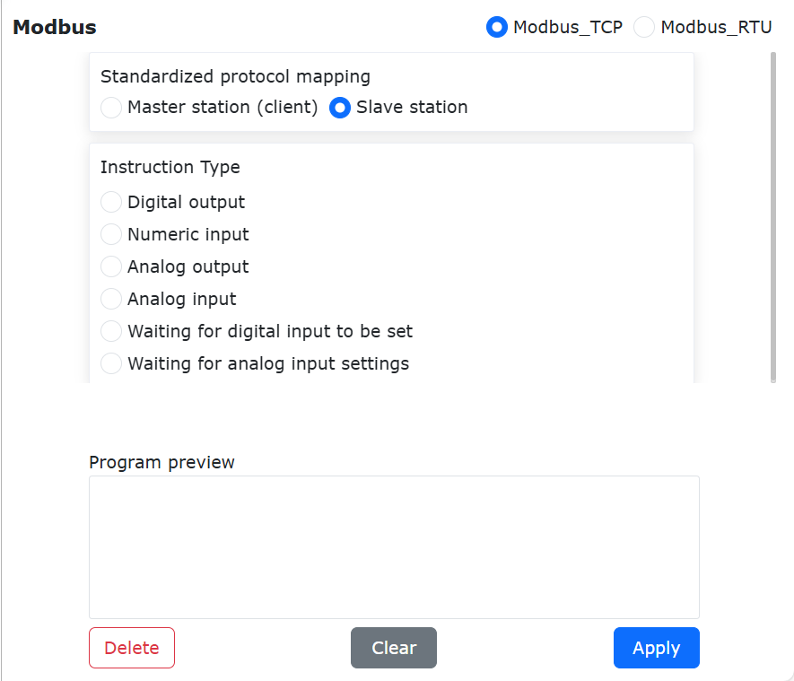

.. centered:: Abbildung 9.12-2 Modbus-Befehl Slave-Oberfläche

Für weitere Operationen mit ModbusTCP kontaktieren Sie uns bitte.

Xmlrpc-Befehl
+++++++++++++

Klicken Sie auf das Symbol "Xmlrpc", um die Bearbeitungsoberfläche für den Xmlrpc-Befehl zu öffnen.

XML-RPC ist eine Methode für entfernte Prozeduraufrufe, die XML verwendet, um Daten über Sockets zwischen Programmen zu übertragen. Mit dieser Methode kann die Robotersteuerung Funktionsfunktionen (mit Parametern) in entfernten Programmen/Diensten aufrufen und strukturierte Daten als Ergebnis abrufen. Die Robotersteuerung übernimmt alle Details der Erstellung von XML-RPC-Client-Nachrichten und der Konvertierung zwischen Datentypen und XML.

.. image:: coding/147.png
   :width: 6in
   :align: center

.. centered:: Abbildung 9.12-3 Xmlrpc-Befehls-Oberfläche

.. important::
  1) Die Steuerung verbindet sich als Client mit einem benutzerdefinierten Port auf der entfernten Seite.

  2) Die Steuerung ruft als Client entfernte Funktionsfunktionen auf.

  3) Unterstützt den Aufruf verschiedener entfernter Funktionsfunktionen.

  4) Unterstützt die Übergabe von String-Array-Parametern und die Rückgabe von String-Array-Ergebnissen. Die Anzahl der Array-Elemente ist benutzerdefiniert.

  Unterstützt die Übergabe von Double-Array-Parametern und die Rückgabe von Double-Array-Ergebnissen. Die Anzahl der Array-Elemente ist benutzerdefiniert.

::

   XmlrpcClientCall(serverUrl, methodName, tableType, param)

   serverUrl Server-URL, z. B.: "http://192.168.58.29:50000/RPC2"

   methodName Name der aufgerufenen Funktion, "example.add"

   tableType 1-Double-Array, 2-String-Array

   param Parameter der aufgerufenen Funktion

::

   XmlrpcClientCall(error, result)

   error 0-kein Fehler, 1-Fehler

   result Wenn der Parameter als Double-Array übergeben wurde, ist result ein Double-Array.
   Wenn der Parameter als String-Array übergeben wurde, ist result ein String-Array.

Hilfsbefehls-Oberfläche
~~~~~~~~~~~~~~~~~~~~~~~

.. image:: coding/148.png
   :width: 6in
   :align: center

.. centered:: Abbildung 9.13 Hilfsbefehls-Oberfläche

Hilfsthread-Befehl
++++++++++++++++++

Klicken Sie auf das Symbol "Hilfsthread", um die Bearbeitungsoberfläche für den Thread-Befehl zu öffnen.

Der Thread-Befehl ist eine Hilfsthread-Funktion. Der Benutzer kann einen Hilfsthread definieren, der gleichzeitig mit dem Hauptthread läuft. Der Hilfsthread dient hauptsächlich dem Datenaustausch mit externen Geräten. Er unterstützt Socket-Kommunikation, Abrufen des Roboter-DI-Status, Setzen des Roboter-DO-Status, Abrufen von Roboterstatusinformationen und Datenaustausch mit dem Hauptthread. Die vom Hilfsthread abgerufenen Daten werden vom Hauptthread zur Steuerung der Logik der Roboterbewegung verwendet. Ein Beispiel für ein Benutzerprogramm ist im Screenshot dargestellt:

.. image:: coding/149.png
   :width: 6in
   :align: center

.. centered:: Abbildung 9.13-1 Thread-Programmbeispiel

Funktionsaufruf-Befehl
++++++++++++++++++++++

Klicken Sie auf das Symbol "Funktion aufrufen", um die Bearbeitungsoberfläche für den Function-Befehl zu öffnen.

Dieser Befehl ist eine Schnittstelle zum Aufruf von Funktionen. Er stellt dem Benutzer Roboter-Schnittstellenfunktionen zur Auswahl und zeigt die für die Funktion erforderlichen Parameter an, um das Schreiben von Skriptbefehlen zu erleichtern. Weitere Funktionen werden nach und nach hinzugefügt.

.. image:: coding/150.png
   :width: 6in
   :align: center

.. centered:: Abbildung 9.13-2 Function-Befehls-Oberfläche

Punktetabellen-Befehl
+++++++++++++++++++++

Klicken Sie auf das Symbol "Punktetabelle", um die Bearbeitungsoberfläche für den PT-Mode-Befehl zu öffnen.

Dieser Befehl wird hauptsächlich zum Umschalten zwischen Systemmodus und Punktetabellenmodus verwendet. Durch Umschalten der Punktetabelle werden die Teachpunkte in verschiedenen Punktetabellen angewendet. Details siehe Kapitel 11 – Teachpunkte.

.. image:: coding/151.png
   :width: 6in
   :align: center

.. centered:: Abbildung 9.13-3 Punktetabellen-Befehls-Oberfläche

Überprüfung auf ungespeicherte Teach-Programme
~~~~~~~~~~~~~~~~~~~~~~~~~~~~~~~~~~~~~~~~~~~~~~

Wenn auf der Teach-Programmseite ein Programm geöffnet oder neu erstellt wurde und Änderungen am Teach-Programm vorgenommen wurden, die nicht gespeichert sind.

Wenn Sie auf Dateioperationen wie "Öffnen", "Neu", "Exportieren", "Umbenennen" usw. klicken, wird ein Popup-Fenster "Möchten Sie dieses Programm speichern?" mit der Meldung "Das aktuelle Programm wurde geändert. Möchten Sie die Änderungen an diesem Programm speichern?" angezeigt, wie in der folgenden Abbildung.

.. image:: coding/152.png
   :width: 6in
   :align: center

.. centered:: Abbildung 9.14-1 Überprüfung auf ungespeichertes Programm auf der aktuellen Seite

**Schritt 1**: Klicken Sie auf die Schaltfläche "Nicht speichern". Das Programm wird auf den Stand vor den Änderungen zurückgesetzt und die vorherige Dateioperation wird fortgesetzt.

**Schritt 2**: Klicken Sie auf die Schaltfläche "Speichern". Das ungespeicherte Lua-Programm wird erfolgreich gespeichert und die vorherige Dateioperation wird fortgesetzt.

Wenn Sie die Teach-Programmseite verlassen und zu einer anderen Seite wechseln, wird ebenfalls die Meldung "Möchten Sie dieses Programm speichern?" ausgelöst, und Sie bleiben auf der aktuellen Teach-Programmseite, wie in der folgenden Abbildung.

.. image:: coding/153.png
   :width: 6in
   :align: center

.. centered:: Abbildung 9.14-2 Überprüfung auf ungespeichertes Programm beim Seitenwechsel

**Schritt 1**: Klicken Sie auf die Schaltfläche "Nicht speichern". Sie werden zu der zuvor ausgewählten Seite weitergeleitet.

**Schritt 2**: Klicken Sie auf die Schaltfläche "Speichern". Das ungespeicherte Lua-Programm wird erfolgreich gespeichert und Sie werden zu der zuvor ausgewählten Seite weitergeleitet.

Verschlüsselung von Teach-Programmen
~~~~~~~~~~~~~~~~~~~~~~~~~~~~~~~~~~~~

Teach-Programme können verschlüsselt oder unverschlüsselt sein. Es gibt zwei Verschlüsselungsstufen: Stufe 1 und Stufe 2, wobei Stufe 1 den höchsten Schutz bietet und Stufe 2 den zweithöchsten.
Alle Teach-Programme werden unter "Systemeinstellungen – Benutzerdefinierte Informationen" in tabellarischer Form mit Verschlüsselungsinformationen angezeigt und können dort eingestellt werden. Rechts neben der Tabelle befindet sich eine Erläuterung der Verschlüsselungsstufen.

.. image:: coding/154.png
   :width: 6in
   :align: center

.. centered:: Abbildung 9.15-1 Verschlüsselung von Teach-Programmen

Wenn ein Programm im Verschlüsselungsstatus Stufe 1 ist, wird nach dem Öffnen des Programms:
Die Symbole für "Exportieren", "Speichern", "Speichern unter", "Kopieren", "Ausschneiden", "Einfügen", "Löschen", "Nach oben", "Nach unten" und "Edit-Modus wechseln" in der Aktionsleiste werden ausgegraut. Ein Klick auf die Symbole ist wirkungslos und es wird darauf hingewiesen, dass das aktuelle Programm verschlüsselt ist.
Das Symbol "Umbenennen" des Programms wird ausgeblendet.
Die Befehlsleiste und der Programmbearbeitungsbereich werden unsichtbar und es wird darauf hingewiesen, dass der Verschlüsselungsstatus Stufe 1 aktiv ist.

.. image:: coding/155.png
   :width: 6in
   :align: center

.. centered:: Abbildung 9.15-2 Programm-Oberfläche bei Verschlüsselungsstufe 1

Wenn ein Programm im Verschlüsselungsstatus Stufe 2 ist, wird nach dem Öffnen des Programms auf der "Teach-Programm"-Seite:
Die Symbole für "Speichern", "Kopieren", "Ausschneiden", "Einfügen", "Löschen", "Nach oben" und "Nach unten" in der Aktionsleiste werden ausgegraut. Ein Klick auf die Symbole ist wirkungslos und es wird darauf hingewiesen, dass das aktuelle Programm verschlüsselt ist.
Das Symbol "Umbenennen" des Programms wird ausgeblendet.
Die Befehlsleiste wird unsichtbar und es wird darauf hingewiesen, dass der Verschlüsselungsstatus Stufe 2 aktiv ist.
Der Programmbearbeitungsbereich kann normal durchsucht und gelesen werden.

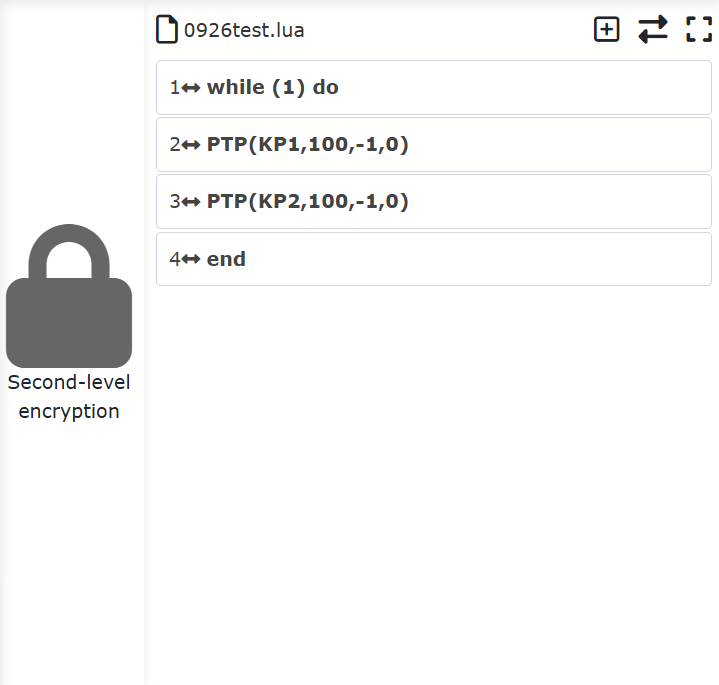

.. centered:: Abbildung 9.15-3 Programm-Oberfläche bei Verschlüsselungsstufe 2

Sowohl bei Verschlüsselungsstufe 1 als auch 2 kann die Funktion "Exportieren" verwendet werden. Beim Importieren wird eine Überprüfung durchgeführt. Wenn ein verschlüsseltes Programm mit demselben Namen existiert, wird der Importvorgang unterbrochen und es wird darauf hingewiesen, dass ein verschlüsseltes Programm nicht durch Import überschrieben werden kann.

.. image:: coding/157.png
   :width: 3in
   :align: center

.. centered:: Abbildung 9.15-4 Programmimport

Lokale Teachpunkte
~~~~~~~~~~~~~~~~~~~

Lokale Teachpunkte sind an das aktuelle Teach-Programm gebunden. Beim Hinzufügen von Programmbefehlen können sie nur im aktuellen Teach-Programm und nicht in anderen Teach-Programmen verwendet werden.

**Neu hinzufügen**: Klicken Sie auf das Symbol "Neuen lokalen Teachpunkt hinzufügen" ganz rechts neben dem Programmdateinamen, um einen lokalen Teachpunkt hinzuzufügen. (Detaillierte Informationen zur Aufzeichnung lokaler Teachpunkte finden Sie unter Teachpunkt-Aufzeichnung in der Roboterbedienung.)

.. image:: coding/158.png
   :width: 6in
   :align: center

.. centered:: Abbildung 9.16-1 Neuen lokalen Teachpunkt hinzufügen

**Löschen**: Wählen Sie in der Tabellenzeile den zu löschenden lokalen Teachpunkt aus und klicken Sie dann oben rechts im Titel des lokalen Teachpunktbereichs auf das Symbol "Löschen", um den lokalen Teachpunkt zu löschen.

.. image:: coding/159.png
   :width: 6in
   :align: center

.. centered:: Abbildung 9.16-2 Löschen eines lokalen Teachpunkts

**Ausführen**: Klicken Sie in der Aktionsspalte der lokalen Teachpunkt-Tabelle auf das Symbol "Ausführen starten", um den lokalen Teachpunkt einzeln auszuführen und den Roboter an die Position dieses Punktes zu bewegen.

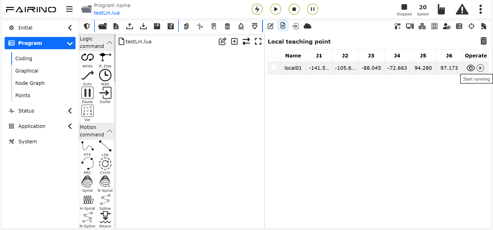

.. centered:: Abbildung 9.16-3 Ausführen eines lokalen Teachpunkts

**Details**: Klicken Sie in der Aktionsspalte der lokalen Teachpunkt-Tabelle auf das Symbol "Details", um die Details des lokalen Teachpunkts anzuzeigen.

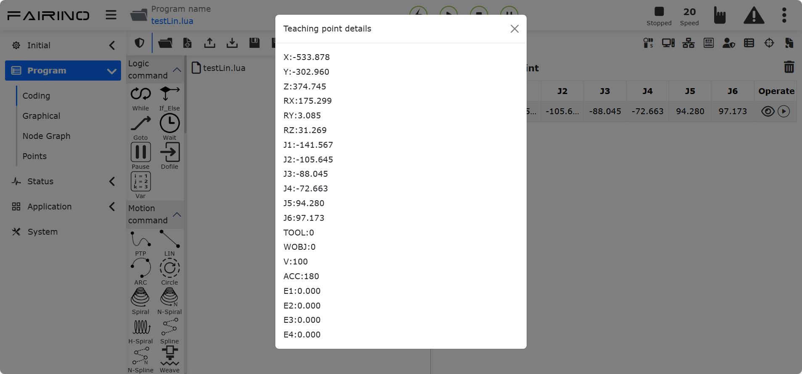

.. centered:: Abbildung 9.16-4 Details eines lokalen Teachpunkts

Aktuelles Programm-Backup
~~~~~~~~~~~~~~~~~~~~~~~~~

Nachdem der Benutzer ein Teach-Programm geändert und auf Speichern geklickt hat, wird die "Backup"-Funktion für das aktuelle Programm ausgelöst (Backup-Dauer 1 Jahr). Der ursprüngliche Inhalt des aktuellen Programms wird gespeichert und auf der rechten Seite angezeigt, um dem Benutzer den Vergleich mit den geänderten Inhalten zu erleichtern.
Der Benutzer kann ein Datum auswählen, um den entsprechenden Programm-Backup-Inhalt anzuzeigen. Durch Klicken auf das Symbol "Löschen" oben rechts kann der aktuelle Programm-Backup-Inhalt gelöscht werden. Der Inhalt des aktuellen Programm-Backups kann nur angezeigt, nicht geändert werden.

.. image:: coding/162.png
   :width: 6in
   :align: center

.. centered:: Abbildung 9.17 Aktuelles Programm-Backup

Modbus TCP Kommunikation
~~~~~~~~~~~~~~~~~~~~~~~~
ModbusTCP ist ein in der industriellen Produktion häufig verwendetes Kommunikationsprotokoll. FAIRINO kollaborative Roboter bieten zwei Arten der Kommunikation mit Ihren Geräten: ModbusTCP-Master und ModbusTCP-Slave.

Der kollaborative Roboter unterstützt bis zu 8 ModbusTCP-Master, die gleichzeitig mit externen Geräten kommunizieren können. Jeder Master unterstützt bis zu 128 Register. Der ModbusTCP-Slave des kollaborativen Roboters verfügt über 128 Spulen, 128 diskrete Eingänge, 64 Halteregister und 64 Eingangsregister (die Datentypen der Halte- und Eingangsregister umfassen vorzeichenlos, vorzeichenbehaftet und Gleitkomma). Ein Teil der Eingangsregisteradressen des ModbusTCP-Slaves des Roboters ist für die Rückmeldung von Informationen wie der aktuellen Gelenkposition und Bewegungsgeschwindigkeit des Roboters reserviert. Ein Teil der Spulenregisteradressen ist für die Steuerung von Roboterfunktionen wie Programmstart, Programmstopp und Setzen von Steuerpult-DOs reserviert.

Der ModbusTCP-Slave des Roboters unterstützt nur die Verbindung mit einem Master. Der Roboter kann gleichzeitig als Master und Slave mit verschiedenen Geräten kommunizieren. Im Folgenden wird die detaillierte Verwendung beschrieben.

ModbusTCP-Master
+++++++++++++++++

Bevor Sie den kollaborativen Roboter als ModbusTCP-Master für die Kommunikation mit Ihrem Gerät verwenden, überprüfen Sie bitte die Netzwerkverbindung zwischen Ihrem Gerät und dem Roboter und stellen Sie sicher, dass sich die Netzwerkschnittstellen im selben Netzwerksegment befinden.

Die Verwendung des ModbusTCP-Masters des Roboters umfasst die folgenden Schritte:

- Master hinzufügen;
- Register hinzufügen;
- Kommunikationstest;
- Benutzerprogramm schreiben;
- Benutzerprogramm ausführen.

ModbusTCP-Master hinzufügen
***************************

Öffnen Sie die WebApp, klicken Sie nacheinander auf "Teach-Simulation", "Programmierung" und erstellen Sie ein neues Benutzerprogramm "testModbusMaster.lua".

.. image:: coding/163.png
   :width: 6in
   :align: center

.. centered:: Abbildung 9.18-1 Erstellen eines ModbusTCP-Master-Benutzerprogramms

Klicken Sie auf die Schaltfläche "ModbusTCP Einstellungen", um die ModbusTCP-Funktionskonfigurationsseite zu öffnen.

.. image:: coding/164.png
   :width: 6in
   :align: center

.. centered:: Abbildung 9.18-2 Öffnen der ModbusTCP Einstellungen

Klicken Sie nacheinander auf "Master-Einstellungen", "Modbus-Master hinzufügen". Damit ist das Hinzufügen eines ModbusTCP-Masters abgeschlossen.

.. image:: coding/165.png
   :width: 6in
   :align: center

.. centered:: Abbildung 9.18-3 Hinzufügen eines "ModbusTCP-Masters"

Geben Sie entsprechend Ihrem Gerät nacheinander "Name", "Slave-IP", "Portnummer", "Slave-Nummer", "Kommunikationszyklus" und "Timeout-Zeit" ein. Die Bedeutung der oben genannten Parameter ist wie folgt:

**Name**: Name des ModbusTCP-Masters des Roboters. Der Roboter unterstützt maximal 8 Master, um Verbindungen mit entsprechenden Slaves herzustellen. Verschiedene Master können durch eindeutige Namen unterschieden werden, z. B. "PLC", "Kamera", "Datenerfassungskarte", "FRRobot1" usw.

**Slave-IP**: IP-Adresse des Slaves, mit dem der ModbusTCP-Master des Roboters verbunden werden soll.

.. note:: Verbinden Sie zuerst den Roboter und das Slave-Gerät über ein Netzwerkkabel und stellen Sie sicher, dass die IP-Adressen von Roboter und Slave-Gerät im selben Netzwerksegment liegen.

**Portnummer**: Portnummer des zu verbindenden ModbusTCP-Slaves.

**Slave-Nummer**: Nummer des zu verbindenden ModbusTCP-Slaves.

**Kommunikationszyklus**: Zyklus (ms), in dem der ModbusTCP-Master des Roboters den Status des Slaves abfragt. Dieser Zyklus beeinflusst nur die Aktualisierungsgeschwindigkeit der Anzeige der Slave-Registerdaten auf der Seite "ModbusTCP Einstellungen", nicht die Geschwindigkeit, mit der die Werte der ModbusTCP-Slave-Register im Benutzer-Lua-Programm gelesen oder geschrieben werden.

**Timeout-Zeit**: Wenn beim Aufruf der ModbusTCP-Lese-/Schreibschnittstelle nach Ablauf der Timeout-Zeit noch keine Verbindung hergestellt wurde, wird der Fehler "Modbus nicht verbunden" gemeldet. Einheit ms, gültiger Bereich 100-60000.

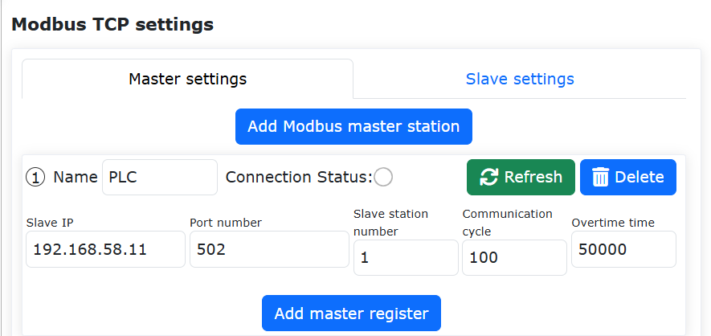

.. centered:: Abbildung 9.18-4 Einstellung der ModbusTCP-Master-Parameter

Nach korrekter Eingabe der oben genannten Parameter stellt der ModbusTCP-Master des Roboters automatisch eine Verbindung mit dem konfigurierten Slave her. Bei erfolgreicher Verbindung leuchtet die "Verbindungsstatus"-Anzeige auf der Seite.

.. note::
   Wenn Sie sicher sind, dass die relevanten Parameter des ModbusTCP-Masters korrekt konfiguriert wurden, der Roboter und Ihr Gerät aber keine Verbindung herstellen können, überprüfen Sie bitte die folgenden Konfigurationen:

   ① Die physische Netzwerkverbindung zwischen Roboter und Slave-Gerät.

   ② Die IP-Adressen der beiden Netzwerkports (Teach-Pendant und Steuerpult) des Roboters sind unterschiedlich. Bitte stellen Sie sicher, dass Sie mit dem richtigen Netzwerkport verbunden sind.

   ③ Stellen Sie sicher, dass sich der Netzwerkport des Roboters und der Netzwerkport des Slave-Geräts im selben Netzwerksegment befinden. Wenn die IP-Adresse des Roboters z. B. 192.168.58.2 ist, muss die IP-Adresse des Slave-Geräts 192.168.58.0 ~ 192.168.58.255 sein und darf nicht mit der IP-Adresse des Roboters identisch sein.

   ④ Überprüfen Sie, ob die Portnummer des Slave-Geräts mit der eingestellten Portnummer übereinstimmt. Wenn die Verbindungsstatusanzeige blinkt, bedeutet dies, dass die Registeradresse in diesem Master fehlerhaft ist. Bitte überprüfen Sie Registertyp und -adresse.

.. image:: coding/167.png
   :width: 6in
   :align: center

.. centered:: Abbildung 9.18-5 Verbindungsstatus des ModbusTCP-Masters

Damit haben wir die Erstellung eines ModbusTCP-Masters des Roboters abgeschlossen. Wenn Sie erneut auf "Modbus-Master hinzufügen" klicken, können Sie einen weiteren neuen ModbusTCP-Master erstellen. Der Roboter unterstützt maximal 8 Master, die gleichzeitig mit externen Geräten kommunizieren. Durch Doppelklicken auf die Schaltfläche "Löschen" oben rechts im Modbus-Master können Sie diesen Modbus-Master löschen.

.. image:: coding/168.png
   :width: 6in
   :align: center

.. centered:: Abbildung 9.18-6 Erneutes Hinzufügen eines ModbusTCP-Masters

Hinzufügen von Registern zum ModbusTCP-Master
***********************************************

Klicken Sie auf die Schaltfläche "Master-Register hinzufügen", um dem Master ein Register hinzuzufügen.

.. image:: coding/169.png
   :width: 6in
   :align: center

.. centered:: Abbildung 9.18-7 Hinzufügen eines ModbusTCP-Master-Registers

Wählen Sie nacheinander den Master-Registertyp, geben Sie die Adressnummer und den Namen ein. Die Bedeutung der einzelnen Parameter ist wie folgt:

**Typ**: Registertyp: DI - diskreter Eingang; DO - Spule; AI vorzeichenlos - vorzeichenloser Eingangsregistertyp (0-65535); AI vorzeichenbehaftet - vorzeichenbehafteter Eingangsregistertyp (-32768-32767); AI Gleitkomma - Gleitkomma-Eingangsregistertyp (Gleitkomma-Registerdatenlänge 32 Bit, belegt zwei vorzeichenbehaftete oder vorzeichenlose Register); AO vorzeichenlos - vorzeichenloser Halteregistertyp (0-65535); AO vorzeichenbehaftet - vorzeichenbehafteter Halteregistertyp (-32768-32767); AO Gleitkomma - Gleitkomma-Halteregistertyp (Gleitkomma-Registerdatenlänge 32 Bit, belegt zwei vorzeichenbehaftete oder vorzeichenlose Register). Gleitkommaregister in AI und AO werden im Big-Endian-Format angezeigt.

**Adressnummer**: Die zu lesende oder zu schreibende Registeradresse des ModbusTCP-Slaves.

**Name**: Alias des Registers. Der ModbusTCP-Master des Roboters kann maximal 128 verschiedene Register einrichten. Jedes Register kann entsprechend seiner tatsächlichen Bedeutung mit einem eindeutigen Namen versehen werden, z. B. "Start", "Servo bereit", "Füllstand" usw.

.. image:: coding/170.png
   :width: 6in
   :align: center

.. centered:: Abbildung 9.18-8 Einstellung der ModbusTCP-Master-Registerparameter

Klicken Sie erneut auf die Schaltfläche "Master-Register hinzufügen", um ein weiteres Master-Register hinzuzufügen. Durch Doppelklicken auf die Schaltfläche "Löschen" rechts neben dem Register können Sie dieses Register löschen. Die folgende Abbildung zeigt, dass für jeden Typ ein Register hinzugefügt wurde.

.. note:: Wenn die Verbindungsstatusanzeige des Masters nach dem Hinzufügen eines Master-Registers blinkt, bedeutet dies, dass die Adresse dieses Master-Registers nicht gelesen werden kann. Bitte überprüfen Sie Registertyp und -adresse.

.. image:: coding/171.png
   :width: 6in
   :align: center

.. centered:: Abbildung 9.18-9 Hinzufügen mehrerer Master-Register

Kommunikationstest des ModbusTCP-Masters
*****************************************

Überprüfen Sie vor dem Kommunikationstest, ob die "Verbindungsstatus"-Anzeige des ModbusTCP-Masters dauerhaft leuchtet. Wenn die Anzeige dauerhaft leuchtet, wurde die Verbindung erfolgreich hergestellt.

Die Modbus-Master-Register des Roboters verfügen über ein "Adresswert"-Eingabefeld, das den aktuellen Wert des Registers anzeigt. Register vom Typ DI (diskreter Eingang) und AI (Eingangsregister) sind schreibgeschützt. Das entsprechende Adresswert-Eingabefeld ist grau und nicht editierbar.

Wenn sich der Wert an der entsprechenden Adresse des Slaves ändert, wird der Adresswert des entsprechenden Master-Registers synchron aktualisiert. Register vom Typ DO (Spule) und AO (Halteregister) sind lesbar und beschreibbar. Daher sind ihre Adresswert-Eingabefelder weiß und editierbar. Sie können nicht nur den Wert des entsprechenden Registers des ModbusTCP-Slaves lesen, sondern auch den Wert dieses Registers auf der Modbus-Master-Einstellungsseite des Roboters ändern.

.. image:: coding/172.png
   :width: 6in
   :align: center

.. centered:: Abbildung 9.18-10 Modbus-Master-Adresswerte

1. Überwachung der Werte von Master-DI- und AI-Registern

Setzen Sie auf dem externen ModbusTCP-Slave-Gerät den Wert des DI (diskreter Eingang) Registers an Adresse 255 auf 1, den Wert des AI (Eingangsregister) Registers an Adresse 257 auf 123, den Wert des Registers an Adresse 258 auf -123 und den Wert des Registers an Adresse 259 auf 123,3. Die Adresswerte der entsprechenden Register auf der Modbus-Master-Einstellungsseite des Roboters werden entsprechend aktualisiert.

.. note::
   Da das Register an Adresse 259 als Gleitkommaregister eingestellt wurde, belegt es tatsächlich zwei 16-Bit-Register (259 und 260), um eine Gleitkommazahl zu speichern. Sie können daher nicht separat ein weiteres Register einrichten, um das AI-Register an Adresse 260 zu manipulieren, da dies zu einem Zahlenfehler führen würde.

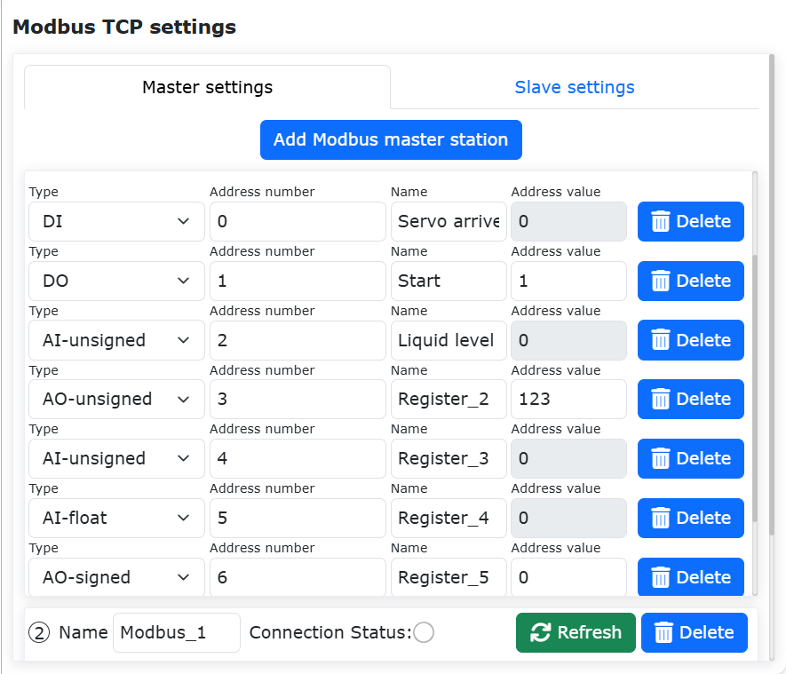

.. centered:: Abbildung 9.18-11 Modbus-Master zeigt Werte der DI- und AI-Register an

2. Schreiben von Werten in Master-DO- und AO-Register

Geben Sie auf der Modbus-Master-Einstellungsseite des Roboters im Adresswert-Eingabefeld für das DO (Spule) Register mit dem Namen "Start" an Adresse 255 den Wert 1 ein. Geben Sie in den Adresswert-Eingabefeldern für die AO (Halteregister) mit den Namen "Zielposition A", "Zielposition B" und "Zielposition C" an den Adressen 260, 261 und 262 jeweils die Werte 65535, -32768 und 128,78 ein. Die entsprechenden Registeradressen des Modbus-Slaves werden mit den entsprechenden Werten beschrieben.

.. image:: coding/174.png
   :width: 6in
   :align: center

.. centered:: Abbildung 9.18-12 Modbus-Master schreibt DO- und AO-Register

3. Überwachung der Werte von Master-DO- und AO-Registern

Wenn sich die Werte der DO (Spule) und AO (Halteregister) auf dem ModbusTCP-Slave ändern, werden die Adresswerte auf der ModbusTCP-Master-Einstellungsseite nicht sofort aktualisiert. Sie müssen auf die Schaltfläche "Aktualisieren" oben rechts in der Master-Konfiguration klicken, um die Adresswerte der DO- und AO-Register auf der Seite zu aktualisieren.

.. image:: coding/175.png
   :width: 6in
   :align: center

.. centered:: Abbildung 9.18-13 Aktualisieren der DO- und AO-Adresswerte des ModbusTCP-Masters

Schreiben eines ModbusTCP-Master-Programms
++++++++++++++++++++++++++++++++++++++++++

Klicken Sie nacheinander auf "Kommunikationsbefehle", um die Seite zum Hinzufügen von Kommunikationsbefehlen zu öffnen.

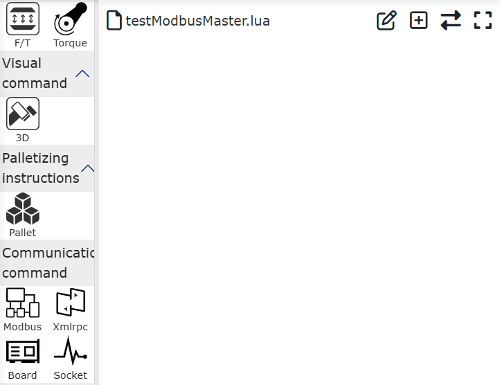

.. centered:: Abbildung 9.18-14 Öffnen der Seite zum Hinzufügen von Kommunikationsbefehlen

Klicken Sie auf "Modbus".

.. image:: coding/177.png
   :width: 6in
   :align: center

.. centered:: Abbildung 9.18-15 Auswahl "Modbus"

Klicken Sie auf "Modbus_TCP".

.. image:: coding/178.png
   :width: 6in
   :align: center

.. centered:: Abbildung 9.18-16 Auswahl "Modbus_TCP"

Wählen Sie "Master (Client)", um die Seite zum Hinzufügen von ModbusTCP-Master-Befehlen zu öffnen.

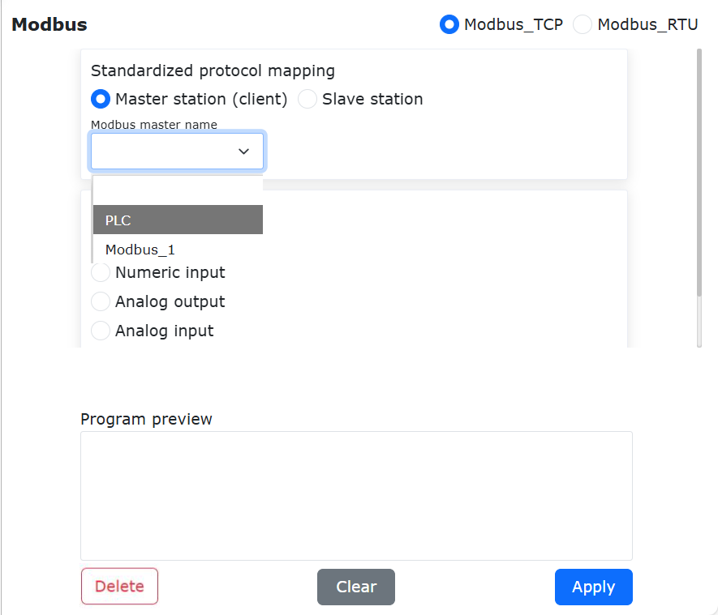

.. centered:: Abbildung 9.18-17 Hinzufügen von ModbusTCP-Master-Befehlen

1. Schreiben eines einzelnen digitalen Ausgangs DO (Spule)

Wählen Sie als "Modbus-Master-Name" den zuvor auf der Modbus-Master-Einstellungsseite hinzugefügten Master "PLC". Wählen Sie als DO-Namen "Start". Stellen Sie die Registeranzahl auf 1 und den Registerwert auf 1. Klicken Sie auf die Schaltfläche "Digitalausgang schreiben". Blättern Sie schließlich zum unteren Ende der Seite und klicken Sie auf die Schaltfläche "Übernehmen".

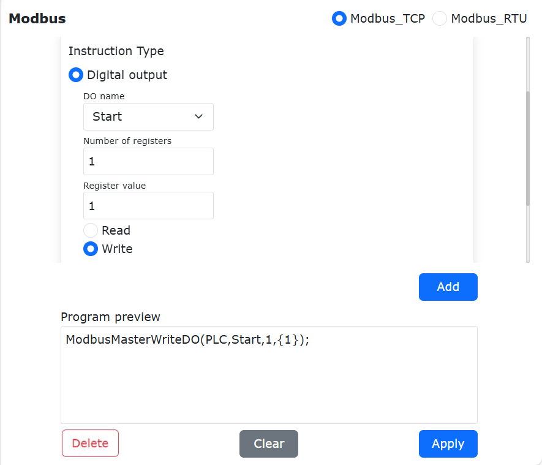

.. centered:: Abbildung 9.18-18 Hinzufügen des Schreibens eines einzelnen digitalen Ausgangs

Nun wurde dem Roboterprogramm "testModbusMaster.lua" ein Befehl zum Schreiben eines einzelnen digitalen Ausgangs für den Modbus-Master hinzugefügt. Schalten Sie den Roboter in den Automatikmodus und klicken Sie auf die Starttaste. Der Roboter setzt den Adresswert des Spulenregisters "Start" des Masters "PLC" auf 1.

.. image:: coding/181.png
   :width: 6in
   :align: center

.. centered:: Abbildung 9.18-19 Lua-Programm zum Schreiben einer einzelnen Spule

2. Schreiben mehrerer digitaler Ausgänge DO (Spulen)

Öffnen Sie die Seite zum Hinzufügen von ModbusTCP-Master-Befehlen. Wählen Sie als "Modbus-Master-Name" den zuvor auf der Modbus-Master-Einstellungsseite hinzugefügten Master "PLC". Wählen Sie als DO-Namen "Start". Stellen Sie die Registeranzahl auf 5 und den Registerwert auf 1,0,1,0,1. Die Anzahl der Registerwerte muss mit der eingestellten Registeranzahl übereinstimmen, und mehrere Registerwerte müssen durch englische Kommas getrennt werden. Klicken Sie auf die Schaltfläche "Digitalausgang schreiben". Blättern Sie schließlich zum unteren Ende der Seite und klicken Sie auf die Schaltfläche "Übernehmen".

.. image:: coding/182.png
   :width: 6in
   :align: center

.. centered:: Abbildung 9.18-20 Konfiguration zum Schreiben mehrerer digitaler Ausgänge

Nun wurde dem Roboterprogramm "testModbusMaster.lua" ein Befehl zum Schreiben mehrerer digitaler Ausgänge für den Modbus-Master hinzugefügt. Schalten Sie den Roboter in den Automatikmodus und klicken Sie auf die Starttaste. Der Roboter setzt die Werte des Spulenregisters "Start" des Masters "PLC" und der folgenden 4 Spulen auf 1, 0, 1, 0, 1.

.. image:: coding/183.png
   :width: 6in
   :align: center

.. centered:: Abbildung 9.18-21 Lua-Programm zum Schreiben mehrerer Spulen

3. Lesen eines einzelnen digitalen Ausgangs DO (Spule)

Öffnen Sie die Seite zum Hinzufügen von ModbusTCP-Master-Befehlen. Wählen Sie als "Modbus-Master-Name" den zuvor auf der Modbus-Master-Einstellungsseite hinzugefügten Master "PLC". Wählen Sie als DO-Namen "Start". Stellen Sie die Registeranzahl auf 1. Der Registerwert muss nicht ausgefüllt werden. Klicken Sie auf "Digitalausgang lesen". Blättern Sie schließlich zum unteren Ende der Seite und klicken Sie auf die Schaltfläche "Übernehmen".

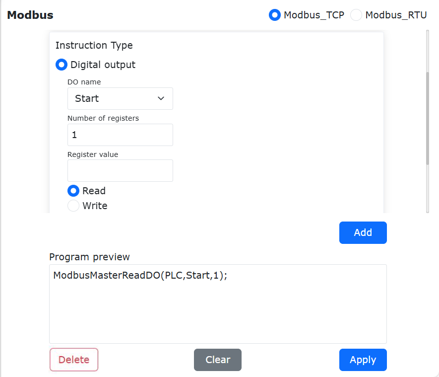

.. centered:: Abbildung 9.18-22 Konfiguration zum Lesen eines einzelnen digitalen Ausgangs

Nun wurde dem Roboterprogramm "testModbusMaster.lua" ein Befehl zum Lesen eines einzelnen digitalen Ausgangs für den Modbus-Master hinzugefügt.

.. image:: coding/185.png
   :width: 6in
   :align: center

.. centered:: Abbildung 9.18-23 Programm zum Lesen einer einzelnen Spule

Normalerweise wird der gelesene Wert des Modbus-Registers in einer Variablen gespeichert. Daher muss eine Variable definiert werden, um den gelesenen Wert zu speichern. Klicken Sie auf die Schaltfläche "Modus wechseln", um das Lua-Programm des Roboters in den editierbaren Zustand zu versetzen. Fügen Sie vor dem Befehl "ModbusMasterReadDO" die Rückgabewertvariable "startValue" hinzu. Nach der Ausführung des Programms wird der gelesene Wert in "startValue" gespeichert.

.. image:: coding/186.png
   :width: 6in
   :align: center

.. centered:: Abbildung 9.18-24 Lesen eines einzelnen digitalen Ausgangs und Speichern in einer Variablen

Der Wert des Spulenregisters kann nur 0 oder 1 sein. Im Roboterprogramm können durch Abfragen des Registerwerts verschiedene Aktionen ausgeführt werden. Klicken Sie auf die Schaltfläche "Modus wechseln", um das Teach-Programm des Roboters in den nicht editierbaren Zustand zu versetzen. Fügen Sie zwei Gelenkbewegungsbefehle hinzu, um zu zwei verschiedenen Punkten "P1" und "P2" zu fahren.

.. image:: coding/187.png
   :width: 6in
   :align: center

.. centered:: Abbildung 9.18-25 Hinzufügen von Bewegungsbefehlen für verschiedene Punkte

Schalten Sie das Programm erneut in den editierbaren Zustand und schreiben Sie die Abfragebedingung für den Spulenwert "startValue". Wenn der "startValue"-Wert 1 ist, fährt der Roboter zu Punkt "P1", andernfalls fährt er zu Punkt "P2".

.. image:: coding/188.png
   :width: 6in
   :align: center

.. centered:: Abbildung 9.18-26 Fahren zu verschiedenen Punkten basierend auf dem Spulenwert

Schalten Sie das Roboterprogramm schließlich wieder in den nicht editierbaren Zustand, schalten Sie den Roboter in den Automatikmodus und starten Sie das Programm unter Sicherstellung der Sicherheit. Da die ersten beiden Zeilen des Programms den Wert des DO-Spulenregisters mit dem Namen "Start" auf 1 setzen, fährt der Roboter nach der Ausführung des Programms zu Punkt "P1".

.. image:: coding/189.png
   :width: 6in
   :align: center

.. centered:: Abbildung 9.18-27 Lesen des Werts eines einzelnen Spulenregisters und Bewegen

4. Lesen mehrerer digitaler Ausgänge DO (Spulen)

Öffnen Sie die Seite zum Hinzufügen von ModbusTCP-Master-Befehlen. Wählen Sie als "Modbus-Master-Name" den zuvor auf der Modbus-Master-Einstellungsseite hinzugefügten Master "PLC". Wählen Sie als DO-Namen "Start". Stellen Sie die Registeranzahl auf 6. Der Registerwert muss nicht ausgefüllt werden. Klicken Sie auf "Digitalausgang lesen". Blättern Sie schließlich zum unteren Ende der Seite und klicken Sie auf die Schaltfläche "Übernehmen".

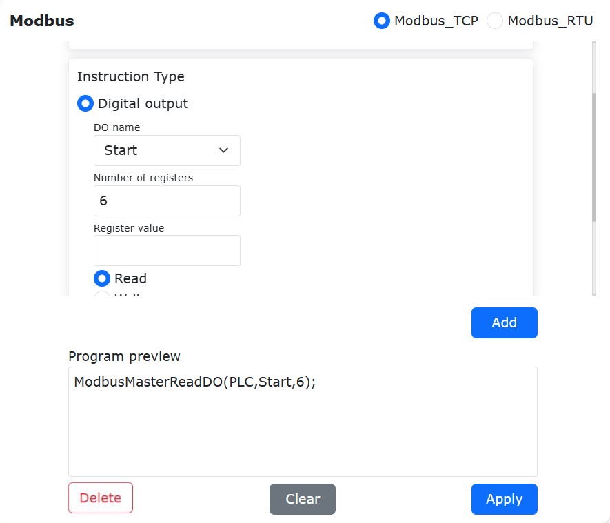

.. centered:: Abbildung 9.18-28 Konfiguration zum Lesen mehrerer digitaler Ausgänge

Nun wurde dem Roboterprogramm "testModbusMaster.lua" ein Befehl zum Lesen mehrerer digitaler Ausgänge für den Modbus-Master hinzugefügt.

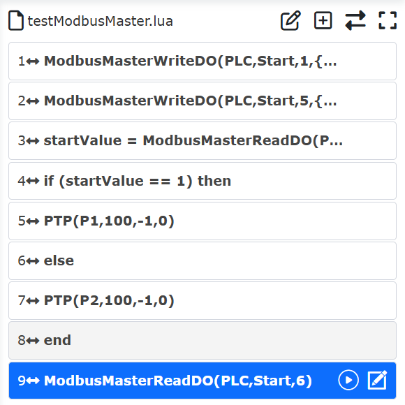

.. centered:: Abbildung 9.18-29 Programm zum Lesen mehrerer digitaler Ausgänge

Klicken Sie auf die Schaltfläche "Modus wechseln", um das Lua-Programm des Roboters in den editierbaren Zustand zu versetzen. Da 6 Werte gelesen werden, müssen vor dem Befehl "ModbusMasterReadDO" die 6 Rückgabewertvariablen "value1,value2,value3,value4,value5,value6" hinzugefügt werden. Nach der Ausführung des Programms werden die gelesenen 6 Registerwerte in diesen 6 Variablen gespeichert. Ebenso können Sie durch Abfragen der Werte von "value1" bis "value6" den Roboter zu verschiedenen Aktionen veranlassen.

.. image:: coding/192.png
   :width: 6in
   :align: center

.. centered:: Abbildung 9.18-30 Lesen mehrerer digitaler Ausgänge und Speichern in Variablen

5. Lesen digitaler Eingänge DI (diskrete Eingänge)

Öffnen Sie die Seite zum Hinzufügen von ModbusTCP-Master-Befehlen. Wählen Sie als "Modbus-Master-Name" den zuvor auf der Modbus-Master-Einstellungsseite hinzugefügten Master "PLC". Wählen Sie als DI-Namen "Servo bereit". Stellen Sie die Registeranzahl auf 2. Klicken Sie auf "Digitaleingang lesen". Blättern Sie schließlich zum unteren Ende der Seite und klicken Sie auf die Schaltfläche "Übernehmen".

.. image:: coding/193.png
   :width: 6in
   :align: center

.. centered:: Abbildung 9.18-31 Konfiguration zum Lesen digitaler Eingänge

Nun wurde dem Roboterprogramm "testModbusMaster.lua" ein Befehl zum Lesen digitaler Eingänge für den Modbus-Master hinzugefügt.

.. centered:: Abbildung 9.18-32 Programmbefehl zum Lesen digitaler Eingänge

Klicken Sie auf die Schaltfläche "Modus wechseln", um das Lua-Programm des Roboters in den editierbaren Zustand zu versetzen. Fügen Sie vor dem Befehl "ModbusMasterReadDO" die Rückgabewertvariablen "state1,state2" hinzu. Nach der Ausführung des Programms werden die gelesenen zwei Werte der digitalen Eingänge in den Variablen "state1" und "state2" gespeichert. Sie können durch Abfragen der Variablenwerte den Roboter zu verschiedenen Aktionen veranlassen.

.. image:: coding/195.png
   :width: 6in
   :align: center

.. centered:: Abbildung 9.18-33 Lesen digitaler Eingänge und Speichern in Variablen

6. Lese-/Schreiboperationen für analoge Eingänge AI (Eingangsregister) und analoge Ausgänge AO (Halteregister)

Die Lese-/Schreiboperationen für analoge Eingänge AI (Eingangsregister) und analoge Ausgänge AO (Halteregister) sind im Wesentlichen identisch mit denen für digitale Eingänge DI (diskrete Eingänge) und digitale Ausgänge DO (Spulen). Der Unterschied besteht darin, dass der Datenbereich der letzteren auf 0 oder 1 beschränkt ist, während der Datenbereich der ersteren größer ist. Daher kann für die konkrete Vorgehensweise auf die Programmierung der digitalen Eingänge und Ausgänge verwiesen werden. Hier werden nur Programmbeispiele für das Lesen von AI und das Lesen/Schreiben von AO gezeigt.

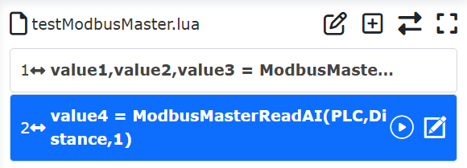

.. centered:: Abbildung 9.18-34 Lesen von analogem Eingang AI

.. image:: coding/197.png
   :width: 6in
   :align: center

.. centered:: Abbildung 9.18-35 Lesen und Schreiben von analogem Ausgang AO

7. Warten auf digitalen Eingang

Öffnen Sie die Seite zum Hinzufügen von ModbusTCP-Master-Befehlen. Suchen Sie nach "Einstellungen für Warten auf digitalen Eingang", d. h. Warten auf DI-diskreten Eingang. Wählen Sie als DI-Namen das konfigurierte Register "Servo bereit". Wählen Sie den Wartezustand "True" und die Timeout-Zeit 5000 ms. Klicken Sie auf die Schaltfläche "Hinzufügen" und dann auf die Schaltfläche "Übernehmen".

.. image:: coding/198.png
   :width: 6in
   :align: center

.. centered:: Abbildung 9.18-36 Hinzufügen eines Warte-auf-DI-Eingangs-Befehls

Nun wurde dem Roboterprogramm "testModbusMaster.lua" ein Befehl zum Warten auf einen digitalen Eingang DI für den Modbus-Master hinzugefügt. Nach dem Start des Programms wartet der Roboter, bis der Wert des Registers "Servo bereit" des Masters "PLC" auf true, also 1, wird. Da die Timeout-Zeit auf 5 s eingestellt ist, meldet das Roboterprogramm einen Timeout-Fehler und stoppt automatisch, wenn das Signal "Servo bereit" nach 5 s Wartezeit immer noch 0 ist.

.. image:: coding/199.png
   :width: 6in
   :align: center

.. centered:: Abbildung 9.18-37 Programm zum Warten auf digitalen Eingang DI

8. Warten auf analogen Eingang

Öffnen Sie die Seite zum Hinzufügen von ModbusTCP-Master-Befehlen. Suchen Sie nach "Einstellungen für Warten auf analogen Eingang", d. h. Warten auf AI-Eingangsregister. Wählen Sie als AI-Namen das konfigurierte Register "Füllstand". Wählen Sie den Wartezustand ">" und den Registerwert 255. Stellen Sie die Timeout-Zeit auf 5000 ms ein. Klicken Sie auf die Schaltfläche "Hinzufügen" und dann auf die Schaltfläche "Übernehmen".

.. image:: coding/200.png
   :width: 6in
   :align: center

.. centered:: Abbildung 9.18-38 Hinzufügen eines Warte-auf-analogen-Eingangs-Befehls

Nun wurde dem Roboterprogramm "testModbusMaster.lua" ein Befehl zum Warten auf den Wert eines AI-Eingangsregisters für den Modbus-Master hinzugefügt. Nach dem Start des Programms wartet der Roboter, bis der Wert des Registers "Füllstand" des Masters "PLC" größer als 255 ist. Da die Timeout-Zeit auf 5 s eingestellt ist, meldet das Roboterprogramm einen Timeout-Fehler und stoppt automatisch, wenn der Wert des Signals "Füllstand" nach 5 s Wartezeit immer noch nicht größer als 255 ist.

.. centered:: Abbildung 9.18-39-1 Programm zum Warten auf AI-Eingangsregister

Öffnen Sie die Seite zum Hinzufügen von ModbusTCP-Master-Befehlen. Suchen Sie nach "Einstellungen für Warten auf analogen Eingang", d. h. Warten auf AI-Eingangsregister. Wählen Sie als AI-Namen das konfigurierte Register "Füllstand". Wählen Sie den Wartezustand "=" und den Registerwert 255. Stellen Sie die Timeout-Zeit auf 5000 ms ein. Klicken Sie auf die Schaltfläche "Hinzufügen" und dann auf die Schaltfläche "Übernehmen".

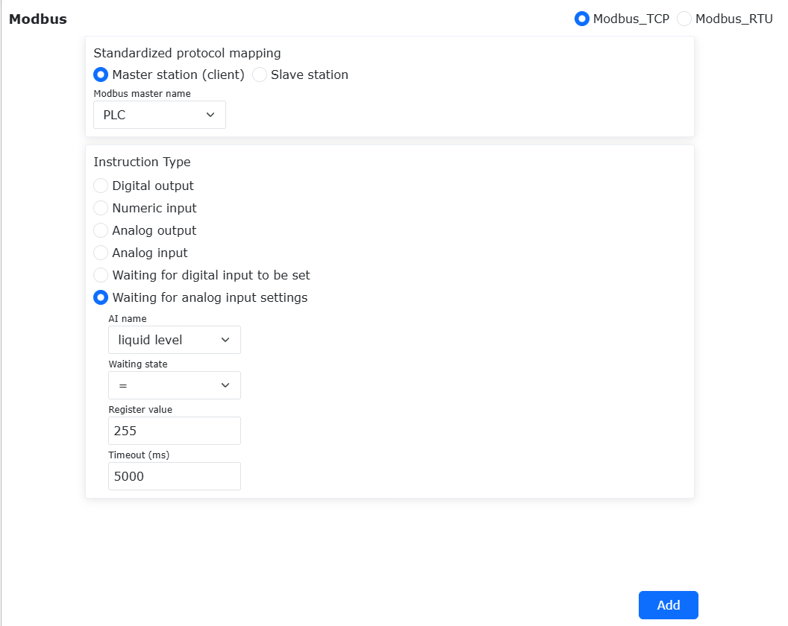

.. centered:: Abbildung 9.18-39-2 Hinzufügen eines Warte-auf-analogen-Eingangs-Befehls

Nun wurde dem Roboterprogramm "test.lua" ein Befehl zum Warten auf den Wert eines AI-Eingangsregisters für den Modbus-Master hinzugefügt. Nach dem Start des Programms wartet der Roboter, bis der Wert des Registers "Füllstand" des Masters "PLC" gleich 255 ist. Da die Timeout-Zeit auf 5 s eingestellt ist, meldet das Roboterprogramm einen Timeout-Fehler und stoppt automatisch, wenn der Wert des Signals "Füllstand" nach 5 s Wartezeit immer noch nicht gleich 255 ist.

ModbusTCP-Slave
+++++++++++++++

Der ModbusTCP-Slave des Roboters bietet vier Registertypen: allgemeine digitale Eingänge (Spulen), allgemeine digitale Ausgänge (diskrete Eingänge), allgemeine analoge Eingänge (Halteregister) und allgemeine analoge Ausgänge (Eingangsregister). Die allgemeinen digitalen Eingänge und analogen Eingänge werden hauptsächlich verwendet, damit der Roboter Daten von einem externen ModbusTCP-Master lesen kann, um Roboteroperationen zu steuern. Die allgemeinen digitalen Ausgänge und analogen Ausgänge werden hauptsächlich verwendet, damit der Roboter Datensignale an ein externes ModbusTCP-Master-Gerät senden kann, das dann die entsprechenden Registerwerte liest, um sein Gerät zu steuern. Zusätzlich zu den oben genannten allgemeinen Ein-/Ausgängen bietet der Roboter auch einige "Funktionsdigitaleingänge (Spulen)" für externe Master-Geräte, um den Roboter zu steuern, z. B. Programmstart, Programmstopp. Darüber hinaus werden einige Eingangsregister bereitgestellt, um den aktuellen Status des Roboters anzuzeigen, einschließlich der aktuellen kartesischen Position des Roboters, des aktuellen Betriebsstatus usw. (Die genaue Definition finden Sie in Anhang I: ModbusTCP-Slave-Adresszuordnungstabelle). Der Verwendungsprozess des ModbusTCP-Slaves des Roboters umfasst hauptsächlich: ① Parametereinstellung; ② Kommunikationstest; ③ Programmerstellung.

Kommunikationsparametereinstellung des ModbusTCP-Slaves
********************************************************

Öffnen Sie die WebApp, klicken Sie nacheinander auf "Teach-Simulation", "Programmierung" und erstellen Sie ein neues Benutzerprogramm "testModbusSlave.lua".

.. image:: coding/202.png
   :width: 6in
   :align: center

.. centered:: Abbildung 9.18-40 Erstellen eines ModbusTCP-Slave-Benutzerprogramms

Klicken Sie auf die Schaltfläche "ModbusTCP Einstellungen", um die ModbusTCP-Funktionskonfigurationsseite zu öffnen.

.. image:: coding/203.png
   :width: 6in
   :align: center

.. centered:: Abbildung 9.18-41 Öffnen der ModbusTCP Einstellungen

Klicken Sie nacheinander auf "Slave-Einstellungen". Geben Sie die IP, den Port und die Slave-Nummer des Roboterslaves ein. "IP" ist die IP-Adresse des Roboterslaves. Der FAIRINO kollaborative Roboter verfügt über zwei Netzwerkports (Teach-Pendant und Steuerpult). Die IP-Adressen der beiden Ports sind unterschiedlich. Geben Sie die korrekte IP-Adresse basierend auf dem Netzwerkport ein, über den das externe Gerät mit dem Roboterslave verbunden ist (es wird empfohlen, den Netzwerkport am Steuerpult zu verwenden). Nachdem Sie die IP-Adresse, Portnummer oder Slave-Nummer des ModbusTCP-Slaves des Roboters geändert haben, muss der Roboter neu gestartet werden, damit die Änderungen wirksam werden.

.. image:: coding/204.png
   :width: 6in
   :align: center

.. centered:: Abbildung 9.18-42 ModbusTCP-Slave-Einstellungen

Nachdem die Parametereinstellung des ModbusTCP-Slaves abgeschlossen und der Roboter neu gestartet wurde, kann das externe Master-Gerät über die eingestellten Parameter eine Verbindung mit dem Roboterslave herstellen. Bei erfolgreicher Verbindung leuchtet die "Verbindungsstatus"-Anzeige auf der Slave-Einstellungsseite des Roboters auf.

.. image:: coding/205.png
   :width: 6in
   :align: center

.. centered:: Abbildung 9.18-43 Slave-Verbindungsstatusanzeige

Kommunikationstest des ModbusTCP-Slaves
****************************************

1. Allgemeine digitale Eingänge (Spulen)

Der ModbusTCP-Slave des Roboters bietet 128 Spulenregister. Ihre Registeradressen sind 100~127.

.. note:: Die genaue Definition finden Sie in Anhang I: ModbusTCP-Slave-Adresszuordnungstabelle.

Die allgemeinen Register des ModbusTCP-Slaves des Roboters können mit Aliasen versehen werden. Ändern Sie den Namen des Slave-Spulenregisters DI0 in "A bereit" und DI1 in "B bereit". Gemäß der Adresszuordnungstabelle sind die Modbus-Spulenadressen von "A bereit" und "B bereit" 100 bzw. 101. Setzen Sie auf dem externen ModbusTCP-Master-Gerät die Slave-Spulenregisteradressen 100 und 101 des Roboters auf 1. Die Anzeigen für die beiden Register auf der Überwachungsseite des ModbusTCP-Slaves des Roboters leuchten auf.

.. image:: coding/206.png
   :width: 6in
   :align: center

.. centered:: Abbildung 9.18-44 Überwachung des Spulenstatus des ModbusTCP-Slaves

2. Allgemeine digitale Ausgänge (diskrete Eingänge)

Der ModbusTCP-Slave des Roboters bietet 128 diskrete Eingangsregister. Ihre Registeradressen sind 100~127.

.. note:: Die genaue Definition finden Sie in Anhang I: ModbusTCP-Slave-Adresszuordnungstabelle.

Auch die diskreten Eingangsregister des ModbusTCP-Slaves des Roboters können mit Aliasen versehen werden. Klicken Sie auf "Allgemeine digitale Ausgänge (diskrete Eingänge)". Ändern Sie den Namen des Slave-diskreten-Eingangsregisters DO0 in "A starten" und DO1 in "B starten". Gemäß der Adresszuordnungstabelle sind die Modbus-Adressen für diskrete Eingänge von "A starten" und "B starten" 100 bzw. 101. Klicken Sie auf die Anzeige des diskreten Eingangs für "A starten". Die Anzeige leuchtet auf, der Wert des entsprechenden Registeradresse 100 wird 1. Auf dem externen ModbusTCP-Master-Gerät kann dieser Registerwert gelesen werden.

.. image:: coding/207.png
   :width: 6in
   :align: center

.. centered:: Abbildung 9.18-45 Steuerung der diskreten Eingänge des ModbusTCP-Slaves

1. Analoge Eingänge (Halteregister)

Der Roboter bietet 64 Halteregister in drei Typen (vorzeichenlos, vorzeichenbehaftet, Gleitkomma). Die Adressen von AI0 bis AI63 sind 100~195.

.. note::
   Die genaue Definition finden Sie in Anhang I: ModbusTCP-Slave-Adresszuordnungstabelle. Der Datenbereich für vorzeichenlose Register ist 0~65535, für vorzeichenbehaftete Register -32768~32767. Gleitkommaregister werden im Big-Endian-Format angezeigt.

   Ändern Sie die Namen von AI0 und AI1 in "Spannung" und "Strom". Aus der ModbusTCP-Slave-Adresszuordnungstabelle sind die Adressen der beiden Register 100 bzw. 101. Wenn das verbundene Master-Gerät die Werte der Halteregister an den Adressen 100 und 101 ändert, werden die Adresswerte der Register "Spannung" und "Strom" auf der Überwachungsseite des ModbusTCP-Slaves des Roboters entsprechend synchron aktualisiert. Analoge Eingänge des Roboters werden hauptsächlich verwendet, damit der Roboter numerische Signale von externen Master-Geräten lesen kann.

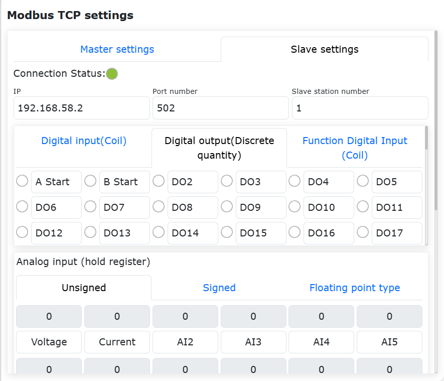

.. centered:: Abbildung 9.18-46 Überwachung der analogen Eingänge des ModbusTCP-Slaves

4. Analoge Ausgänge (Eingangsregister)

Der Roboter bietet 64 Eingangsregister in drei Typen (vorzeichenlos, vorzeichenbehaftet, Gleitkomma). Die Adressen von AO0 bis AO63 sind 100~195.

.. note::
   Die genaue Definition finden Sie in Anhang I: ModbusTCP-Slave-Adresszuordnungstabelle. Der Datenbereich für vorzeichenlose Register ist 0~65535, für vorzeichenbehaftete Register -32768~32767. Gleitkommaregister werden im Big-Endian-Format angezeigt.

   Ändern Sie die Namen von AO0 und AO1 in "Zielposition A" und "Zielposition B". Stellen Sie die Werte der Eingangsregister auf 2000 und 1500. Aus der ModbusTCP-Slave-Adresszuordnungstabelle sind die Adressen der beiden Register 100 bzw. 101. Wenn das verbundene Master-Gerät die Werte der Eingangsregister an den Adressen 100 und 101 liest, erhält es die eingestellten Werte. Analoge Ausgänge des Roboterslaves werden hauptsächlich verwendet, damit der Roboter numerische Signale an externe Master-Geräte senden kann.

.. image:: coding/209.png
   :width: 6in
   :align: center

.. centered:: Abbildung 9.18-47 Ändern analoger Eingänge im Modbus-Slave

Programmerstellung für ModbusTCP-Slave
**************************************

Klicken Sie nacheinander auf "Alle", "Kommunikationsbefehle", um die Seite zum Hinzufügen von Kommunikationsbefehlen zu öffnen.

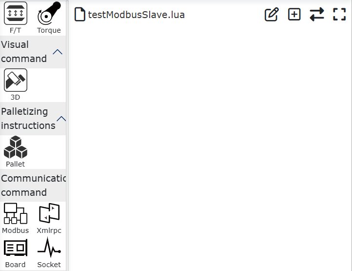

.. centered:: Abbildung 9.18-48 Öffnen der Seite zum Hinzufügen von Kommunikationsbefehlen

Klicken Sie auf "Modbus".

.. image:: coding/211.png
   :width: 6in
   :align: center

.. centered:: Abbildung 9.18-49 Auswahl "Modbus"

Klicken Sie auf "Modbus_TCP".

.. image:: coding/178.png
   :width: 6in
   :align: center

.. centered:: Abbildung 9.18-50 Auswahl "Modbus_TCP"

Wählen Sie "Slave", um die Seite zum Hinzufügen von ModbusTCP-Slave-Befehlen zu öffnen.

.. image:: coding/212.png
   :width: 6in
   :align: center

.. centered:: Abbildung 9.18-51 Hinzufügen von ModbusTCP-Slave-Befehlen

1. Schreiben eines einzelnen digitalen Ausgangs DO (diskreter Eingang)

Wählen Sie als DO-Namen "A starten". Stellen Sie die Registeranzahl auf 1 und den Registerwert auf 0. Klicken Sie auf "Einzelnen Digitalausgang schreiben". Blättern Sie schließlich zum unteren Ende der Seite und klicken Sie auf die Schaltfläche "Übernehmen".

.. image:: coding/213.png
   :width: 6in
   :align: center

.. centered:: Abbildung 9.18-52 Hinzufügen eines Befehls zum Schreiben eines einzelnen digitalen Ausgangs

Nun wurde dem Roboterprogramm "testModbusSlave.lua" ein Befehl zum Schreiben eines einzelnen digitalen Ausgangs für den Modbus-Slave hinzugefügt. Schalten Sie den Roboter in den Automatikmodus und klicken Sie auf die Starttaste. Der Roboter setzt den Adresswert des digitalen Ausgangs mit dem Namen "A starten" auf 0.

.. image:: coding/214.png
   :width: 6in
   :align: center

.. centered:: Abbildung 9.18-53 Lua-Programm zum Schreiben eines einzelnen digitalen Ausgangs

2. Schreiben mehrerer digitaler Ausgänge DO (diskrete Eingänge)

Öffnen Sie die Seite zum Hinzufügen von ModbusTCP-Slave-Befehlen. Suchen Sie nach "Digitale Ausgangseinstellungen". Wählen Sie als DO-Namen "A starten". Stellen Sie die Registeranzahl auf 5 und den Registerwert auf 1,0,1,0,1. Die Anzahl der Registerwerte muss mit der eingestellten Registeranzahl übereinstimmen, und mehrere Registerwerte müssen durch englische Kommas getrennt werden. Klicken Sie auf "Digitalausgang schreiben". Blättern Sie schließlich zum unteren Ende der Seite und klicken Sie auf die Schaltfläche "Übernehmen".

.. image:: coding/215.png
   :width: 6in
   :align: center

.. centered:: Abbildung 9.18-54 Konfiguration zum Schreiben mehrerer digitaler Ausgänge

Nun wurde dem Roboterprogramm "testModbusSlave.lua" ein Befehl zum Schreiben mehrerer digitaler Ausgänge für den Modbus-Slave hinzugefügt. Schalten Sie den Roboter in den Automatikmodus und klicken Sie auf die Starttaste. Der Roboter setzt die Werte der diskreten Eingangsregister des Slaves, beginnend mit "A starten" und den folgenden 4, auf 1, 0, 1, 0, 1.

.. image:: coding/216.png
   :width: 6in
   :align: center

.. centered:: Abbildung 9.18-55 Lua-Programm zum Schreiben mehrerer digitaler Ausgänge

3. Lesen eines einzelnen digitalen Ausgangs DO (diskreter Eingang)

Öffnen Sie die Seite zum Hinzufügen von ModbusTCP-Master-Befehlen. Suchen Sie nach "Digitale Ausgangseinstellungen". Wählen Sie als DO-Namen "A starten". Stellen Sie die Registeranzahl auf 1. Der Registerwert muss nicht ausgefüllt werden. Klicken Sie auf "Digitalausgang lesen". Blättern Sie schließlich zum unteren Ende der Seite und klicken Sie auf die Schaltfläche "Übernehmen".

.. image:: coding/217.png
   :width: 6in
   :align: center

.. centered:: Abbildung 9.18-56 Konfiguration zum Lesen eines einzelnen digitalen Ausgangs

Nun wurde dem Roboterprogramm "testModbusSlave.lua" ein Befehl zum Lesen eines einzelnen digitalen Ausgangs für den Modbus-Slave hinzugefügt.

.. image:: coding/218.png
   :width: 6in
   :align: center

.. centered:: Abbildung 9.18-57 Programm zum Lesen eines einzelnen digitalen Ausgangs

Normalerweise wird der gelesene Wert des Modbus-Registers in einer Variablen gespeichert. Daher muss eine Variable definiert werden, um den gelesenen Wert zu speichern. Klicken Sie auf die Schaltfläche "Modus wechseln", um das Lua-Programm des Roboters in den editierbaren Zustand zu versetzen. Fügen Sie vor dem Befehl "ModbusSlaveReadDO" die Rückgabewertvariable "AStartValue" hinzu. Nach der Ausführung des Programms wird der gelesene Wert in "AStartValue" gespeichert.

.. image:: coding/219.png
   :width: 6in
   :align: center

.. centered:: Abbildung 9.18-58 Lesen eines einzelnen digitalen Ausgangs und Speichern in einer Variablen

Der Wert des Spulenregisters kann nur 0 oder 1 sein. Im Roboterprogramm können durch Abfragen des Registerwerts verschiedene Aktionen ausgeführt werden. Klicken Sie auf die Schaltfläche "Modus wechseln", um das Teach-Programm des Roboters in den nicht editierbaren Zustand zu versetzen. Fügen Sie zwei Gelenkbewegungsbefehle hinzu, um zu zwei verschiedenen Punkten "P1" und "P2" zu fahren.

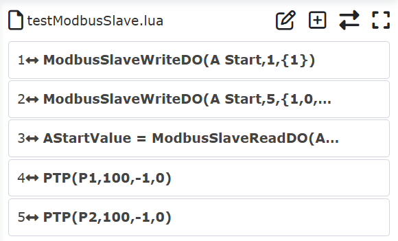

.. centered:: Abbildung 9.18-59 Hinzufügen von Bewegungsbefehlen für verschiedene Punkte

Schalten Sie das Programm erneut in den editierbaren Zustand und schreiben Sie die Abfragebedingung für den Wert des digitalen Ausgangs "AStartValue". Wenn der "AStartValue"-Wert 1 ist, fährt der Roboter zu Punkt "P1", andernfalls fährt er zu Punkt "P2".

.. image:: coding/221.png
   :width: 6in
   :align: center

.. centered:: Abbildung 9.18-60 Fahren zu verschiedenen Punkten basierend auf dem Wert des digitalen Ausgangs

Schalten Sie das Roboterprogramm schließlich wieder in den nicht editierbaren Zustand, schalten Sie den Roboter in den Automatikmodus und starten Sie das Programm unter Sicherstellung der Sicherheit. Da die zweite Zeile des Programms den Wert des digitalen Ausgangs DO mit dem Namen "A starten" auf 1 setzt, fährt der Roboter nach der Ausführung des Programms zu Punkt "P1".

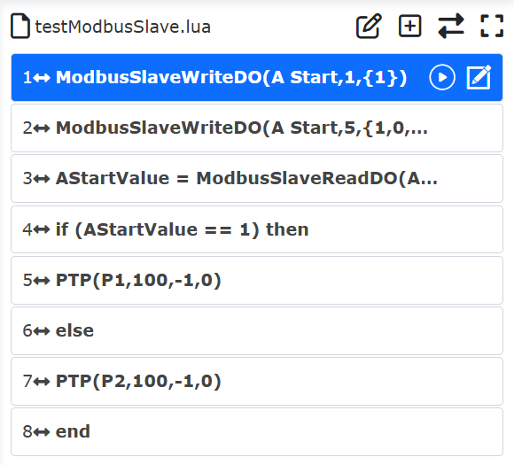

.. centered:: Abbildung 9.18-61 Lesen des Werts eines einzelnen Spulenregisters und Bewegen

4. Lesen mehrerer digitaler Ausgänge DO (diskrete Eingänge)

Öffnen Sie die Seite zum Hinzufügen von ModbusTCP-Master-Befehlen. Suchen Sie nach "Digitale Ausgangseinstellungen". Wählen Sie als DO-Namen "A starten". Stellen Sie die Registeranzahl auf 2. Der Registerwert muss nicht ausgefüllt werden. Klicken Sie auf "Digitalausgang lesen". Blättern Sie schließlich zum unteren Ende der Seite und klicken Sie auf die Schaltfläche "Übernehmen".

.. image:: coding/223.png
   :width: 6in
   :align: center

.. centered:: Abbildung 9.18-62 Konfiguration zum Lesen mehrerer digitaler Ausgänge

Nun wurde dem Roboterprogramm "testModbusSlave.lua" ein Befehl zum Lesen mehrerer digitaler Ausgänge für den Modbus-Slave hinzugefügt.

.. image:: coding/224.png
   :width: 6in
   :align: center

.. centered:: Abbildung 9.18-63 Programm zum Lesen mehrerer digitaler Ausgänge

Klicken Sie auf die Schaltfläche "Modus wechseln", um das Lua-Programm des Roboters in den editierbaren Zustand zu versetzen. Da 2 Werte gelesen werden, müssen vor dem Befehl "ModbusSlaveReadDO" die 2 Rückgabewertvariablen "value1,value2" hinzugefügt werden. Nach der Ausführung des Programms werden die gelesenen 2 Werte der digitalen Ausgangsregister in diesen 2 Variablen gespeichert. Ebenso können Sie durch Abfragen der Werte von "value1" und "value2" den Roboter zu verschiedenen Aktionen veranlassen.

.. image:: coding/225.png
   :width: 6in
   :align: center

.. centered:: Abbildung 9.18-64 Lesen mehrerer digitaler Ausgänge und Speichern in Variablen

5. Lesen digitaler Eingänge DI (Spulen)

Öffnen Sie die Seite zum Hinzufügen von ModbusTCP-Slave-Befehlen. Suchen Sie nach "Digitale Eingangseinstellungen". Wählen Sie als DI-Namen "A bereit". Stellen Sie die Registeranzahl auf 2. Klicken Sie auf "Digitaleingang lesen". Blättern Sie schließlich zum unteren Ende der Seite und klicken Sie auf die Schaltfläche "Übernehmen".

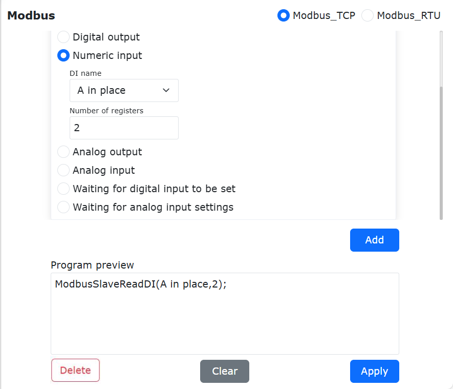

.. centered:: Abbildung 9.18-65 Konfiguration zum Lesen digitaler Eingänge

Nun wurde dem Roboterprogramm "testModbusSlave.lua" ein Befehl zum Lesen digitaler Eingänge für den Modbus-Slave hinzugefügt.

.. image:: coding/227.png
   :width: 6in
   :align: center

.. centered:: Abbildung 9.18-66 Programmbefehl zum Lesen digitaler Eingänge

Klicken Sie auf die Schaltfläche "Modus wechseln", um das Lua-Programm des Roboters in den editierbaren Zustand zu versetzen. Fügen Sie vor dem Befehl "ModbusSlaveReadDI" die Rückgabewertvariablen "AState, BState" hinzu. Nach der Ausführung des Programms werden die gelesenen zwei Werte der digitalen Eingänge in den Variablen "AState" und "BState" gespeichert. Sie können durch Abfragen der Variablenwerte den Roboter zu verschiedenen Aktionen veranlassen.

.. image:: coding/228.png
   :width: 6in
   :align: center

.. centered:: Abbildung 9.18-67 Programm zum Lesen digitaler Eingänge

6. Lese-/Schreiboperationen für analoge Ausgänge AO (Eingangsregister) und analoge Eingänge AI (Halteregister)

Die Lese-/Schreiboperationen für analoge Ausgänge (Eingangsregister) und analoge Eingänge (Halteregister) sind im Wesentlichen identisch mit denen für digitale Ausgänge (diskrete Eingänge) und digitale Eingänge (Spulen). Der Unterschied besteht darin, dass der Datenbereich der letzteren auf 0 oder 1 beschränkt ist, während der Datenbereich der ersteren größer ist. Daher kann für die konkrete Vorgehensweise auf die Programmierung der digitalen Ausgänge und digitalen Eingänge verwiesen werden. Hier werden nur Programmbeispiele für das Lesen von AI und das Lesen/Schreiben von AO gezeigt.

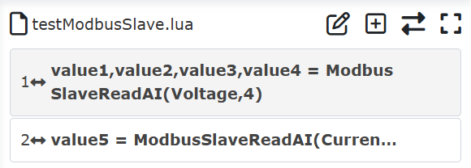

.. centered:: Abbildung 9.18-68 Lesen von analogem Eingang

.. image:: coding/230.png
   :width: 6in
   :align: center

.. centered:: Abbildung 9.18-69 Lesen und Schreiben von analogem Ausgang

7. Warten auf digitalen Eingang

Öffnen Sie die Seite zum Hinzufügen von ModbusTCP-Slave-Befehlen. Suchen Sie nach "Einstellungen für Warten auf digitalen Eingang". Wählen Sie als DI-Namen das konfigurierte Register "A bereit". Wählen Sie den Wartezustand "True" und die Timeout-Zeit 5000 ms. Klicken Sie auf die Schaltfläche "Hinzufügen" und dann auf die Schaltfläche "Übernehmen".

.. image:: coding/231.png
   :width: 6in
   :align: center

.. centered:: Abbildung 9.18-70 Hinzufügen eines Warte-auf-digitalen-Eingangs-Befehls

Nun wurde dem Roboterprogramm "testModbusSlave.lua" ein Befehl zum Warten auf einen digitalen Eingang für den Modbus-Slave hinzugefügt. Nach dem Start des Programms wartet der Roboter, bis der Wert des Spulenregisters "A bereit" des Slaves auf true, also 1, wird. Da die Timeout-Zeit auf 5 s eingestellt ist, meldet das Roboterprogramm einen Timeout-Fehler und stoppt automatisch, wenn das Signal "A bereit" nach 5 s Wartezeit immer noch 0 ist.

.. image:: coding/232.png
   :width: 6in
   :align: center

.. centered:: Abbildung 9.18-71 Programm zum Warten auf digitalen Eingang

8. Warten auf analogen Eingang

Öffnen Sie die Seite zum Hinzufügen von ModbusTCP-Slave-Befehlen. Suchen Sie nach "Einstellungen für Warten auf analogen Eingang". Wählen Sie als AI-Namen das konfigurierte Register "Spannung". Wählen Sie den Wartezustand ">" und den Registerwert 255. Stellen Sie die Timeout-Zeit auf 5000 ms ein. Klicken Sie auf die Schaltfläche "Hinzufügen" und dann auf die Schaltfläche "Übernehmen".

.. image:: coding/233.png
   :width: 6in
   :align: center

.. centered:: Abbildung 9.18-72 Hinzufügen eines Warte-auf-analogen-Eingangs-Befehls

Nun wurde dem Roboterprogramm "testModbusSlave.lua" ein Befehl zum Warten auf den Wert eines analogen Eingangs für den Modbus-Slave hinzugefügt. Nach dem Start des Programms wartet der Roboter, bis der Wert des Registers "Spannung" des Slaves größer als 255 ist. Da die Timeout-Zeit auf 5 s eingestellt ist, meldet das Roboterprogramm einen Timeout-Fehler und stoppt automatisch, wenn der Wert des Signals "Spannung" nach 5 s Wartezeit immer noch nicht größer als 255 ist.

.. image:: coding/234.png
   :width: 6in
   :align: center

.. centered:: Abbildung 9.18-73 Programm zum Warten auf ein analoges Eingangsregister

Öffnen Sie die Seite zum Hinzufügen von ModbusTCP-Slave-Befehlen. Suchen Sie nach "Einstellungen für Warten auf analogen Eingang", d. h. Warten auf AI-Eingangsregister. Wählen Sie als AI-Namen das konfigurierte Register "Füllstand". Wählen Sie den Wartezustand "=" und den Registerwert 255. Stellen Sie die Timeout-Zeit auf 5000 ms ein. Klicken Sie auf die Schaltfläche "Hinzufügen" und dann auf die Schaltfläche "Übernehmen".

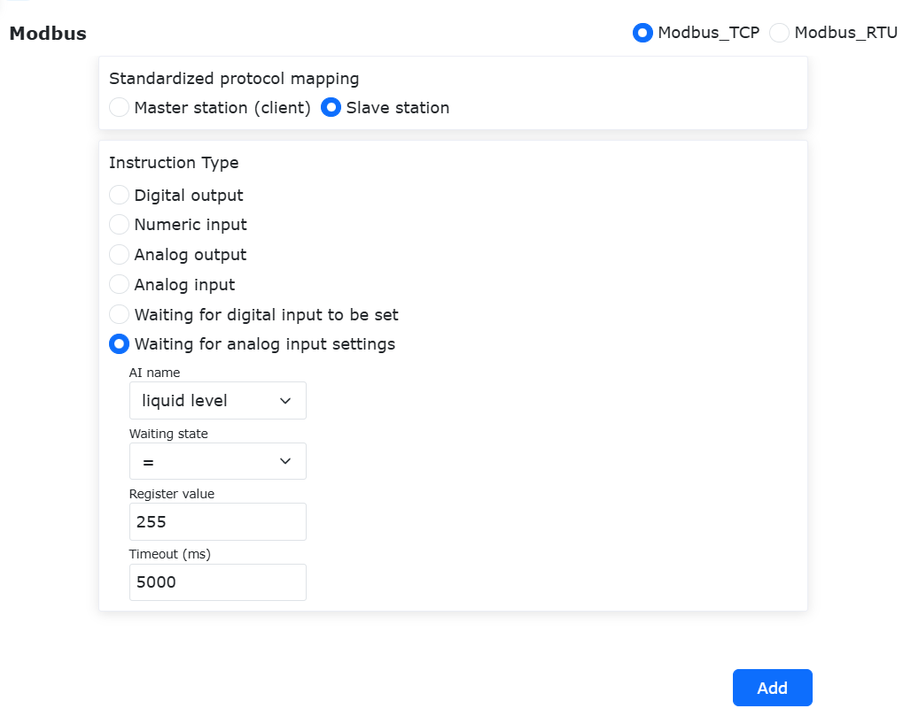

.. centered:: Abbildung 9.18-73-2 Hinzufügen eines Warte-auf-analogen-Eingangs-Befehls

Nun wurde dem Roboterprogramm "test.lua" ein Befehl zum Warten auf den Wert eines AI-Eingangsregisters für den Modbus-Slave hinzugefügt. Nach dem Start des Programms wartet der Roboter, bis der Wert des Registers "Füllstand" gleich 255 ist. Da die Timeout-Zeit auf 5 s eingestellt ist, meldet das Roboterprogramm einen Timeout-Fehler und stoppt automatisch, wenn der Wert des Signals "Füllstand" nach 5 s Wartezeit immer noch nicht gleich 255 ist.

Roboterstatusrückmeldung und -steuerung über ModbusTCP-Slave
*************************************************************

Die Eingangsregisteradressen 310~473 des ModbusTCP-Slaves des kollaborativen Roboters werden zur Rückmeldung des Roboter-Echtzeitstatus verwendet (die genaue Adressdefinition finden Sie in Anhang I: ModbusTCP-Slave-Adresszuordnungstabelle). Sie müssen nur die entsprechenden Registerwerte mit dem Master-Gerät lesen, um die entsprechenden Roboter-Echtzeitstatusdaten zu erhalten.

Die Spulenregisteradressen 300~599 des ModbusTCP-Slaves des kollaborativen Roboters werden vom Master-Gerät zur Steuerung des Roboters verwendet (die genaue Adressdefinition finden Sie in Anhang I: ModbusTCP-Slave-Adresszuordnungstabelle). Am Beispiel der Spulenadresse 502 bedeutet diese Adressfunktion "Programm starten".

Wenn sich der Roboter im Automatikmodus befindet und das Master-Gerät den Wert an Adresse 502 von 0 auf 1 setzt, beginnt der Roboter automatisch mit der Ausführung des aktuell konfigurierten Programms. Ein weiteres Beispiel ist die Spulenadresse 300, die zur Steuerung des Ausgangs von Steuerpult-DO0 verwendet wird. Wenn das externe Master die Spulenadresse 300 von 0 auf 1 setzt, wird der Steuerpult-DO0 automatisch aktiv. Wenn das externe Master die Spulenadresse 300 von 1 auf 0 setzt, wird der Steuerpult-DO0 deaktiviert. Klicken Sie auf der ModbusTCP-Slave-Einstellungsseite auf "Funktionsdigitaleingänge (Spulen)", um alle aktuellen Funktionsdigitaleingänge zu überwachen.

.. image:: coding/235.png
   :width: 6in
   :align: center

.. centered:: Abbildung 9.18-74 Funktionsdigitaleingänge des Roboterslaves

.. image:: coding/434.png
   :width: 6in
   :align: center

.. centered:: Abbildung 9.18-75 Modbus-Slave-Adresszuordnungstabelle

Anhang I: :download:`Modbus-Slave-Adresszuordnungstabelle <../_static/_doc/ModbusTCP Slave station address mapping table.xlsx>`

Roboter-Hintergrundprogramme
~~~~~~~~~~~~~~~~~~~~~~~~~~~~

Funktion der Roboter-Hintergrundprogramme
+++++++++++++++++++++++++++++++++++++++++

Ein Roboter-Hintergrundprogramm ist ein Steuerprogramm, das zur Verarbeitung von Signallogik-Beziehungen dient und gleichzeitig mit dem Frontend-Bewegungsprogramm des Roboters läuft. Beide sind in ihrer Ausführung voneinander unabhängig.

Das Hintergrundprogramm kann den Betriebszustand des Frontend-Programms überwachen und gleichzeitig Steuersignale an das Frontend senden. Das Hintergrundprogramm kann auch über I/O-Kommunikation mit externen Geräten verbunden werden, um die Peripheriegeräte des Roboters zu überwachen und zu steuern. Die im Hintergrund-Logikprogramm ausführbaren Befehle unterscheiden sich von denen des Frontend-Teacher-Programms; es können keine Bewegungsachsen gesteuert werden. Daher dürfen bei der Programmierung keine Roboterachsen-Bewegungsbefehle enthalten sein. Es bleiben nur die logischen Steuerungsfunktionen und die I/O-Kommunikationsfunktionen erhalten.

Bei Verwendung eines Hintergrundprogramms wird dieses zyklisch von Anfang bis Ende durchlaufen. Der Ausführungszyklus des Hintergrundprogramms im System beträgt 1 Millisekunde. Im Hintergrundprogramm können Verzögerungsfunktionen hinzugefügt werden, um den Ausführungszyklus zu steuern. Die Ausführung des Hintergrundprogramms wird durch Not-Halt, Pause oder Alarm nicht beeinflusst.

.. note:: Es können maximal 8 Hintergrundprogramme gleichzeitig ausgeführt werden.

Nach einem Stromausfall wird das Hintergrund-Logikprogramm beim nächsten Einschalten automatisch geladen und entsprechend dem eingestellten Status ausgeführt.

Speichern von Roboter-Hintergrundprogrammen
*******************************************

Hintergrundprogramme können nur auf der Hintergrundprogramm-Oberfläche erstellt, bearbeitet und gespeichert werden.

**Schritt 1**: Öffnen Sie die Roboter-Hintergrundprogramm-Oberfläche. Öffnen Sie die Teach-Seite und klicken Sie nacheinander auf "Teach-Programm", "Programmierung". Wählen Sie oben links den Befehl "Hintergrundprogramm", um zur Hintergrundprogramm-Oberfläche zu gelangen.

.. note:: Hintergrundprogramme enthalten nur Logikbefehle, Zuweisungsbefehle, Frontend-Steuerbefehle, I/O-Schnittstellenbefehle und Modbus-Kommunikationsbefehle.

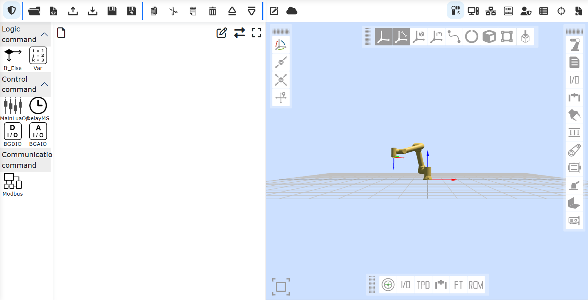

.. centered:: Abbildung 9.19-1 Hintergrundprogramm-Oberfläche

**Schritt 2**: Öffnen Sie im Handmodus die Hintergrund-Teacher-Programmdatei. Klicken Sie auf "Neu", um eine neue Teacher-Programmdatei zu erstellen, bearbeiten Sie das Programm und klicken Sie auf "Speichern", um die Datei zu speichern.

.. note:: Der Ausführungszyklus des Hintergrundprogramms beträgt 1 ms. Im Programm können die bereitgestellten Verzögerungsfunktionen verwendet werden, wie in Zeile 4 des Beispielprogramms unten, wo eine 1-Sekunden-Verzögerung hinzugefügt wird, um den Ausführungszyklus zu steuern.

.. image:: coding/254.png
   :width: 6in
   :align: center

.. centered:: Abbildung 9.19-2 Erstellen und Speichern einer neuen Hintergrundprogrammdatei

Verwaltung von Roboter-Hintergrundprogrammen
********************************************

Erfolgreich gespeicherte Hintergrundprogramme können auf der Hintergrundprogramm-Verwaltungsoberfläche erstellt, pausiert, fortgesetzt und gelöscht werden. Auf der Hintergrundprogramm-Verwaltungsoberfläche können Sie den Ausführungsstatus aller erstellten Hintergrundprogramme sehen. Grün bedeutet "läuft", rot bedeutet "pausiert".

**Schritt 1**: Hintergrundprogramm erstellen. Klicken Sie auf die Schaltfläche "Hintergrundprogramm-Verwaltung". Wählen Sie über das Dropdown-Menü ein bereits gespeichertes Hintergrundprogramm aus und klicken Sie auf "Starten", um das entsprechende Hintergrundprogramm auszuführen.

.. image:: coding/255.png
   :width: 6in
   :align: center

.. centered:: Abbildung 9.19-3 Erstellen eines Hintergrundprogramms

**Schritt 2**: Hintergrundprogramm fortsetzen, pausieren. Klicken Sie in der Hintergrundprogramm-Verwaltungsoberfläche für das zu überwachende Programm auf die Schaltflächen "Fortsetzen" und "Pause", um das entsprechende Hintergrundprogramm fortzusetzen bzw. zu pausieren. Klicken Sie auf die Schaltfläche "Löschen", um das entsprechende Hintergrundprogramm zu löschen.

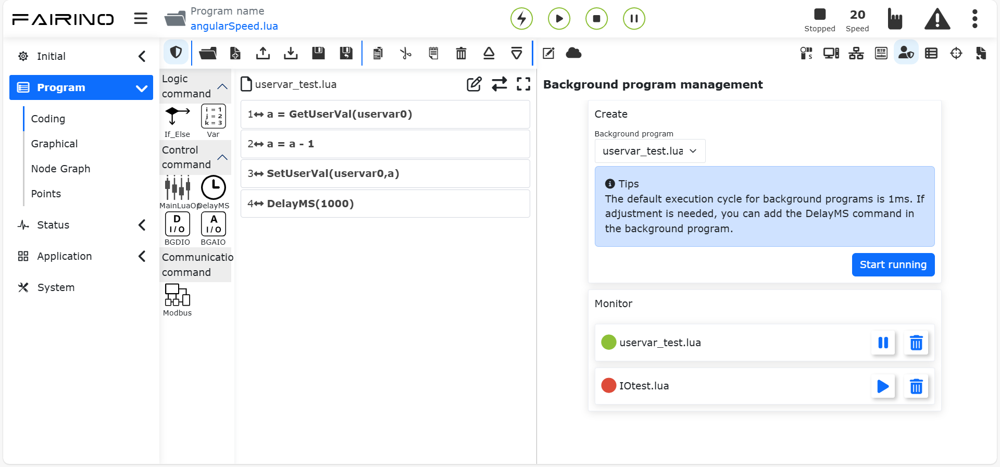

.. centered:: Abbildung 9.19-4 Hintergrundprogramm pausieren, fortsetzen, löschen

Verwendung von Roboter-Benutzervariablen
++++++++++++++++++++++++++++++++++++++++

.. note:: Dem kollaborativen Roboter wurde eine Benutzervariablen-Funktion hinzugefügt, die für den Datenaustausch zwischen Roboter-Hintergrundprogrammen und Frontend-Programmen oder zwischen verschiedenen Hintergrundprogrammen geeignet ist.

Verwaltung von Roboter-Benutzervariablen
*****************************************

Vor der Verwendung von Benutzervariablen können Sie diese nach Ihren Wünschen umbenennen. Öffnen Sie die Teach-Seite und klicken Sie nacheinander auf "Teach-Programm", "Programmierung", "Benutzervariablen-Verwaltung". Diese Seite kann sowohl im Frontend-Programm als auch im Hintergrundprogramm verwendet werden. Klicken Sie direkt auf den Variablennamen, um ihn zu ändern.

.. image:: coding/257.png
   :width: 6in
   :align: center

.. centered:: Abbildung 9.19-5 Benutzervariablen-Verwaltung

Verwendung von Roboter-Benutzervariablen
*****************************************

Bei der Verwendung von Benutzervariablen in Frontend- und Hintergrundprogrammen können nur die Lese-/Schreibschnittstellen für Benutzervariablen verwendet werden.

**Schritt 1**: Öffnen Sie im Handmodus die Teacher-Programmdatei. Öffnen Sie die Teach-Seite, klicken Sie nacheinander auf "Teach-Programm", "Programmierung" und dann auf "Neu", um eine neue Teacher-Programmdatei zu erstellen.

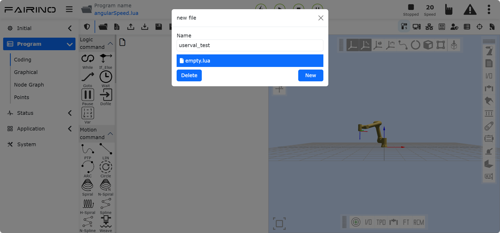

.. centered:: Abbildung 9.19-6 Erstellen einer neuen Teacher-Programmdatei

**Schritt 2**: Verwenden der Benutzervariablen-Leseschnittstelle. Klicken Sie auf den Befehl "Variable", wählen Sie "Benutzervariable". Klicken Sie auf das Dropdown-Menü "Variablenwert abrufen", wählen Sie die zu lesende Benutzervariable aus, klicken Sie auf "Hinzufügen" und dann auf "Übernehmen", um ein Programm mit der Benutzervariablen-Leseschnittstelle zu schreiben.

.. image:: coding/259.png
   :width: 6in
   :align: center

.. centered:: Abbildung 9.19-7 Verwendung der Benutzervariablen-Leseschnittstelle

**Schritt 3**: Verwenden der Benutzervariablen-Schreibschnittstelle. Klicken Sie auf den Befehl "Variable", wählen Sie "Benutzervariable". Klicken Sie auf das Dropdown-Menü "Variablenwert setzen", wählen Sie die zu setzende Benutzervariable aus und geben Sie den entsprechenden Wert ein (dieser Wert kann eine Konstante oder ein Variablenwert sein). Klicken Sie auf "Hinzufügen" und dann auf "Übernehmen", um ein Programm mit der Benutzervariablen-Schreibschnittstelle zu schreiben.

.. image:: coding/260.png
   :width: 6in
   :align: center

.. centered:: Abbildung 9.19-8 Verwendung der Benutzervariablen-Schreibschnittstelle

Schleifen mit konstanter Kraft in XY-Richtung
~~~~~~~~~~~~~~~~~~~~~~~~~~~~~~~~~~~~~~~~~~~~~

Übersicht
+++++++++

Das Prinzip des Schleifens mit konstanter Kraft in XY-Richtung ist wie folgt: Beim Querschleifen mit konstanter Kraft wird das Schleifwerkzeug (z. B. Schleifscheibe, Schleifteller) mit einer konstanten Kraft auf die vorgegebene Werkstückoberfläche gedrückt und die Bewegung des Werkzeugs entlang der XY-Richtung gesteuert, sodass am Kontaktpunkt stets eine konstante Schleifkraft aufrechterhalten wird.

Ablauf der Funktion zum Schleifen mit konstanter Kraft in XY-Richtung
++++++++++++++++++++++++++++++++++++++++++++++++++++++++++++++++++++++

Für das Schleifen mit konstanter Kraft unter Verwendung eines Kraftsensors muss das Schleifwerkzeug unter dem Kraftsensor montiert und das Werkzeugkoordinatensystem konfiguriert werden. Klicken Sie nacheinander auf "Initiale Einstellungen" -> "Grundlagen" -> "Koordinatensysteme" -> "Werkzeug", um zur Oberfläche "Werkzeugkoordinatensystem einstellen" zu gelangen. Wählen Sie in "Koordinatensystemname" das einzustellende Koordinatensystem aus (z. B. toolcoord0) und stellen Sie es entsprechend der Abmessungen des Endeffektor-Werkzeugs ein.

.. centered:: Abbildung 9.20-1 Einstellung des Werkzeugkoordinatensystems

Einstellung des Kraftregelungs-Referenzkoordinatensystems. Klicken Sie in der Weboberfläche nacheinander auf "FT" -> "Referenzkoordinatensystem". Wählen Sie "Benutzerdefiniertes Koordinatensystem" und setzen Sie alle Parameter auf "0". Das gewählte Referenzkoordinatensystem beeinflusst die Größe der vom Sensor erfassten externen Kraft während des Betriebs.

.. image:: coding/261.png
   :width: 6in
   :align: center

.. centered:: Abbildung 9.20-2 Einstellung des Referenzkoordinatensystems

Befestigen Sie die zu schleifende Platte im Arbeitsraum des Roboters. Die Platte darf nicht wackeln. Positionieren Sie die Werkzeugspitze annähernd senkrecht über der Schleifplatte und fahren Sie den Start- und Endpunkt an.

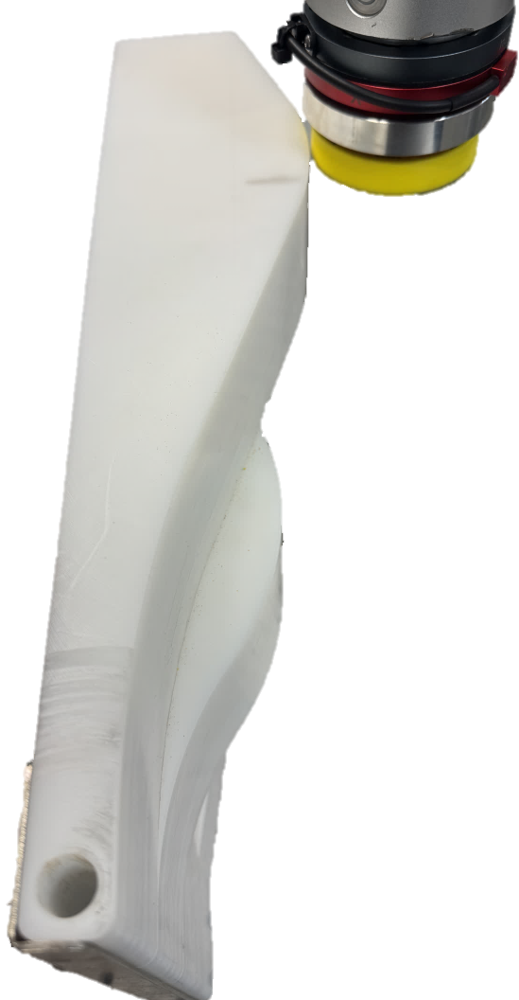

.. centered:: Abbildung 9.20-3 Schematische Darstellung des Schleifaufbaus

Klicken Sie nacheinander auf "Teach-Programm" -> "Programmierung" -> "Kraftregelungssatz". Fügen Sie den Befehl "FT_Control" hinzu. Der "FT_Control"-Befehl ist ein kraftgeregelter Bewegungsbefehl, der es dem Roboter ermöglicht, sich in der Nähe einer eingestellten Kraft zu bewegen.

.. image:: coding/263.png
   :width: 4in
   :align: center

.. centered:: Abbildung 9.20-4 Hinzufügen eines Kraftregelungsbefehls

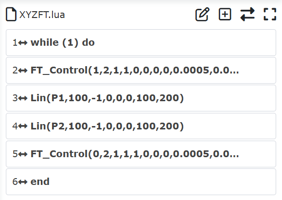

.. centered:: Abbildung 9.20-5 Beispiel für einen kraftgeregelten Schleifbefehl

Die spezifische Rolle der Parameter:

**Koordinatensystemname**: Name, der bei der Einstellung des Sensorkoordinatensystems vergeben wurde.

**Kraftrichtungserkennung aktivieren**: Schwellwert einstellen. Wählen Sie die zu steuernden Kraftrichtungen aus. Beim Querschleifen werden Fx und Fy aktiviert und die entsprechenden Soll-Kräfte eingestellt.

**PID-Parameter**: Stellen Sie die PID-Proportionalkoeffizienten für Kraft und Drehmoment ein. Allgemein wird F_P_gain auf 0,001 gesetzt.

**Maximaler Anpassungsweg**: Maximaler Bewegungsweg in X-, Y-, Z-Richtung.

**Maximaler Anpassungswinkel**: Maximaler Drehwinkel in RX-, RY-, RZ-Richtung.

**Schleifscheibenradius**: Wird durch den tatsächlichen Radius des Endeffektor-Schleifwerkzeugs bestimmt.

Funktion zur automatischen Vermeidung von Singularitäten auf der Bahn
~~~~~~~~~~~~~~~~~~~~~~~~~~~~~~~~~~~~~~~~~~~~~~~~~~~~~~~~~~~~~~~~~~~~~~

Übersicht
+++++++++

Wenn der Roboter bei LIN- oder ARC-Befehlen auf seiner Bahn in einen für den Roboter unpassierbaren singulären Bereich gerät, meldet er einen Fehler und weist auf eine singuläre nächste Pose hin oder gibt eine Singularitätswarnung aus. Wenn der nächste Bahnpunkt, der durch den singulären Bereich führt, dennoch erreicht werden soll, kann diese Funktion verwendet werden, um die Singularität über den Gelenkraum oder den kartesischen Raum zu umgehen und die nächste Zielpose zu erreichen.

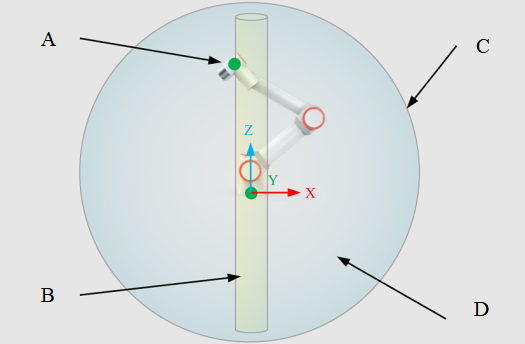

.. centered:: Abbildung 9.21-1 Vereinfachte Darstellung der Roboter-Singularität

Die obige Abbildung zeigt eine schematische Darstellung der Roboter-Singularität. Robotersingularitäten umfassen drei Typen: Schulter-, Ellbogen- und Handgelenksingularität. In der Abbildung ist A das Zentrum des 5. Gelenks WCP (Wrist Center Point), das zur Bestimmung der Schulter-Singularität dient. B ist der Schulter-Singularitätsbereich, der wie ein Zylinder geformt ist und dessen Radius der Länge des DH-Parameters d4 des Roboters entspricht. Wenn das WCP in den Zylinder B eintritt, gerät der Roboter in einen singulären Zustand. C ist die Grenze der Ellbogen-Singularität. Wenn J3 = 0° oder 180°, befindet sich der Roboter im Ellbogen-Singularitätspunkt. D ist der innere Raum des Roboters. An jeder Position im inneren Raum tritt eine Handgelenks-Singularität auf, wenn J5 = 0° oder 180°.

.. note:: Singularitäten sind Bewegungseigenschaften, die durch die physikalische Struktur des Roboters bestimmt werden. Sie sollten während des tatsächlichen Betriebs möglichst vermieden werden. Die Umgehung durch Algorithmen kann zu Änderungen der Endeffektor-Pose, -Geschwindigkeit und sogar der Gelenkkonfiguration führen. Bevor Sie sich für eine Umgehung entscheiden, müssen die Nebenwirkungen prüfen, ob sie die Anforderungen beeinträchtigen.

Ablauf der Funktion zur automatischen Vermeidung von Singularitäten auf der Bahn
+++++++++++++++++++++++++++++++++++++++++++++++++++++++++++++++++++++++++++++++++

Fügen Sie in einem neuen Programm einen Bewegungsbefehl vom Typ LIN/ARC hinzu.

.. image:: coding/266.png
   :width: 6in
   :align: center

.. centered:: Abbildung 9.21-2 Hinzufügen eines LIN/ARC-Bewegungsbefehls

Klicken Sie auf den Befehl "Linie". Wählen Sie den Wegpunkt, der die Robotersingularität passiert. Klicken Sie im Parameterkonfigurationsbereich des Befehls unter "Bewegungsschutz" auf die Schaltfläche "Singularität umgehen".

.. image:: coding/267.png
   :width: 6in
   :align: center

.. centered:: Abbildung 9.21-3 Aktivieren der Funktion zur Singularitätsumgehung

Die Parameter für die "Singularitätsumgehung" umfassen den "Schutzmodus" und Parameter für die "Schulter-Singularitätsanpassung", "Ellbogen-Singularitätsanpassung" und "Handgelenks-Singularitätsanpassung". Der "Schutzmodus" kann "Gelenkmodus" oder "Kartesischer Modus" sein. Dies bedeutet, dass der Roboter die Singularität entweder über den Gelenkraum oder über den kartesischen Raum umgehen kann. Die Parameter für die "Singularitätsanpassung" legen den Bereich zur Bestimmung der Singularität und die maximale Abweichung bei der Umgehung fest. Die Einheit ist mm für Schulter und Ellbogen und ° für das Handgelenk.

.. note:: Im Gelenkraum wird die kürzeste Bahn zwischen den Gelenken gewählt, sodass es nicht zu Endanschlagproblemen kommt. Bei der Umgehung im kartesischen Raum können Gelenk-Endanschläge auftreten, die beim Anfahren beachtet und angepasst werden müssen.

Nachdem Sie die Parameter für die Singularitätsumgehung ausgewählt und eingestellt haben, klicken Sie auf die Schaltfläche "Hinzufügen", um den Befehl hinzuzufügen. Klicken Sie dann auf "Übernehmen", um den Lua-Befehl zum Programm hinzuzufügen.

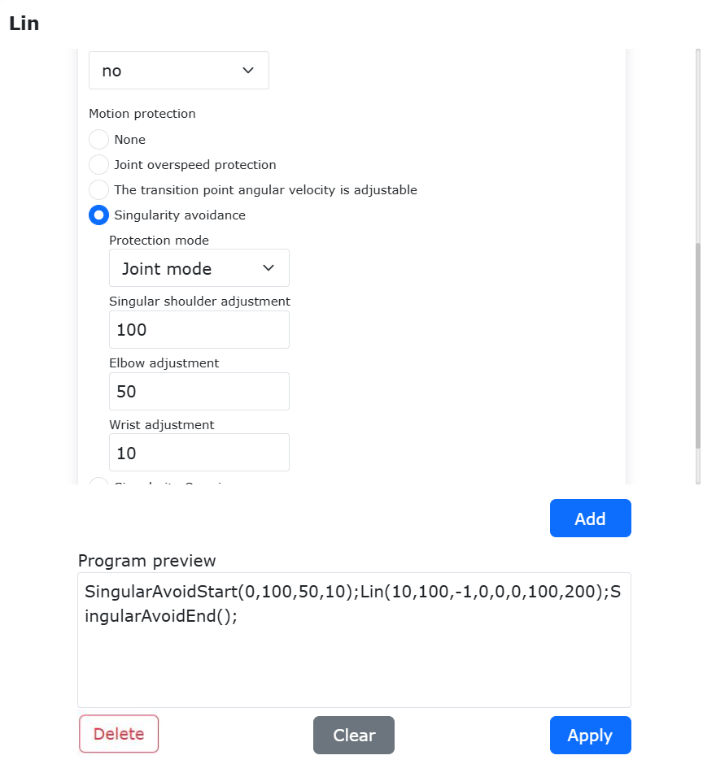

.. centered:: Abbildung 9.21-4 Konfiguration der Parameter für die Singularitätsumgehung und Hinzufügen des Lua-Befehls

Ein typisches Lua-Programm für eine LIN-Bewegung mit Singularitätsumgehung nach dem Anfahren sieht wie folgt aus:

.. image:: coding/269.png
   :width: 6in
   :align: center

.. centered:: Abbildung 9.21-5 Lua-Programm mit Befehl zur Singularitätsumgehung

Die erzielte Umgehungswirkung ist unten dargestellt. Die rote Linie ist die Bahn des Roboterendes:

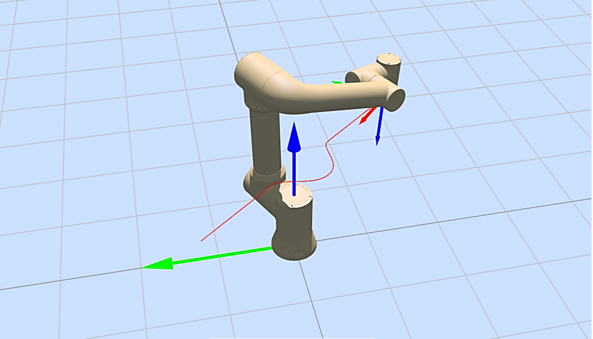

.. image:: coding/271.png
   :width: 4in
   :align: center

.. centered:: Abbildung 9.21-6 Beispiele für die Umgehung einer Schultergelenks-Singularität (oben: kartesischer Raum, unten: Gelenkraum)

.. image:: coding/272.png
   :width: 4in
   :align: center

.. image:: coding/273.png
   :width: 4in
   :align: center

.. centered:: Abbildung 9.21-7 Beispiele für die Umgehung einer Ellbogengelenks-Singularität (oben: kartesischer Raum, unten: Gelenkraum)

.. image:: coding/274.png
   :width: 4in
   :align: center

.. centered:: Abbildung 9.21-8 Beispiel für die Umgehung einer Handgelenks-Singularität (Gelenkraum)

Derzeit unterstützt diese Funktion die Umgehung von Fällen, in denen während einer LIN/ARC-Bewegung eine einzelne Singularitätsart durchlaufen wird. Wenn der Start- oder Endpunkt der Bewegung innerhalb des eingestellten singulären Bereichs liegt, die Bewegung mehr als eine Singularitätsart durchläuft oder sogar zwei oder mehr Singularitäten gleichzeitig auftreten, wird in der Oberfläche ein Popup-Fenster mit der Meldung "[Warnung] Singuläre Pose" angezeigt, das darauf hinweist, dass die aktuelle singuläre Situation nicht umgangen werden kann.

.. centered:: Abbildung 9.21-9 Warnung, dass die aktuelle singuläre Situation nicht umgangen werden kann

Funktion zur Durchquerung von Singularitäten im Automatikmodus
~~~~~~~~~~~~~~~~~~~~~~~~~~~~~~~~~~~~~~~~~~~~~~~~~~~~~~~~~~~~~~~

Übersicht
+++++++++

Wenn der Roboter einen LIN- oder ARC-Befehl ausführt und eine Singularität passiert, kann die Geschwindigkeit des Roboters sprunghaft ansteigen, was zu einer instabilen Bewegungssteuerung und sogar zu Geräteschäden führen kann. Mit der Funktion zur Durchquerung von Singularitäten kann der Roboter Singularitäten gleichmäßig durchfahren. Dieses Handbuch verwendet als Beispiel einen LIN-Befehl, der eine Handgelenks-Singularität durchfährt, um die Verwendung der Funktion zur Durchquerung von Singularitäten im Automatikmodus zu erläutern.

Ablauf
++++++

1. Fahren Sie die beiden Bewegungskontrollpunkte für den LIN-Befehl an (in diesem Handbuch als wristlin1 und wristlin2 bezeichnet).

2. Klicken Sie nacheinander auf "Teach-Programm" -> "Programmierung". Wählen Sie in den "Bewegungsbefehlen" den Befehl "Punkt-zu-Punkt" und fügen Sie den ersten Bewegungspunkt hinzu.

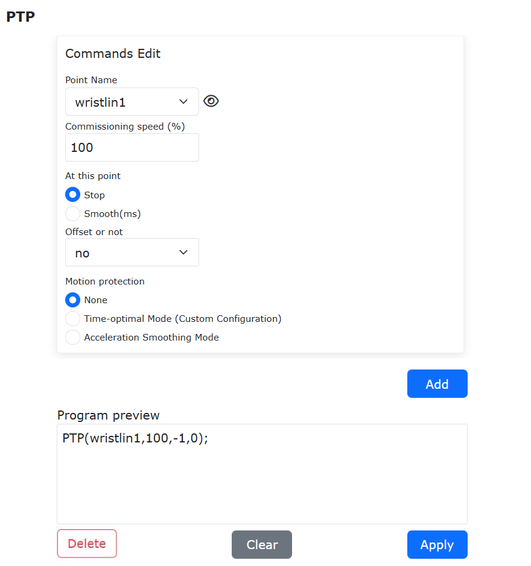

.. centered:: Abbildung 9.22-1 Hinzufügen des ersten Bewegungspunkts

3. Wählen Sie in den "Bewegungsbefehlen" den Befehl "Linie". Fügen Sie den zweiten Bewegungspunkt hinzu. Wählen Sie unter "Bewegungsschutz" die Option "Singularität durchqueren" und stellen Sie die Anpassungsbereiche für Schulter-, Ellbogen- und Handgelenks-Singularität ein.

.. image:: coding/286.png
   :width: 6in
   :align: center

.. centered:: Abbildung 9.22-2 Einstellung der Parameter für die Singularitätsdurchquerung

4. Generieren Sie das Lua-Programm und führen Sie es aus. Ein typisches LIN-Befehlsprogramm für die Singularitätsdurchquerung im Automatikmodus ist unten dargestellt.

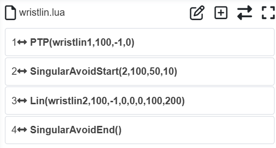

.. centered:: Abbildung 9.22-3 Typischer LIN-Befehl zur Singularitätsdurchquerung

5. Beobachten Sie das Bewegungsergebnis des Roboters. Durch Anpassen der Bewegungsgeschwindigkeit des Roboters und der eingestellten Singularitätsbereiche können unterschiedliche Bewegungsgenauigkeiten und Stoßwirkungen erzielt werden.

Tabelle Genauigkeit/Stoßwirkung
++++++++++++++++++++++++++++++++

1. Die Handgelenks-Singularität ist die am leichtesten auslösbare Singularitätsart des Roboters. Es wurden Tabellen mit Genauigkeit und Stoßwirkung für LIN- und ARC-Befehle bei Handgelenks-Singularität erstellt. Die Vergleichstabellen für LIN-/ARC-Befehle sind unten aufgeführt (〇 zeigt an, dass eine Kollisionswarnung ausgelöst wurde).

.. centered:: Tabelle 9.22-3-1 Fehler bei Handgelenks-Singularität mit LIN-Befehl (Einheit: mm)

.. list-table::
   :widths: 35 20 20 20 20 20 20
   :header-rows: 0
   :class: sheet-center

   * - **Singularitätsbereich / Oberflächengeschwindigkeit**
     - **2**
     - **20**
     - **40**
     - **60**
     - **80**
     - **100**

   * - 2 mm
     - 0.19
     - 0.20
     - 0.20
     - 0.21
     - 〇
     - 〇

   * - 4 mm
     - 0.14
     - 0.14
     - 0.14
     - 0.14
     - 0.14
     - 0.14

   * - 6 mm
     - 0.40
     - 0.40
     - 0.41
     - 0.41
     - 0.42
     - 0.42

   * - 8 mm
     - 0.82
     - 0.83
     - 0.83
     - 0.84
     - 0.83
     - 0.84

   * - 10 mm
     - 1.38
     - 1.38
     - 1.39
     - 1.39
     - 1.39
     - 1.41

.. centered:: Tabelle 9.22-3-2 Lineare Beschleunigungsänderung bei Handgelenks-Singularität mit LIN-Befehl (Einheit: m/s³)

.. list-table::
   :widths: 35 20 20 20 20 20 20
   :header-rows: 0
   :class: sheet-center

   * - **Singularitätsbereich / Oberflächengeschwindigkeit**
     - **2**
     - **20**
     - **40**
     - **60**
     - **80**
     - **100**

   * - 2 mm
     - 0.605
     - 12.040
     - 11.370
     - 2743.000
     - 〇
     - 〇

   * - 4 mm
     - 0.916
     - 34.620
     - 110.900
     - 241.300
     - 303.900
     - 400.700

   * - 6 mm
     - 0.906
     - 59.700
     - 139.600
     - 343.700
     - 445.600
     - 582.900

   * - 8 mm
     - 1.073
     - 67.480
     - 199.600
     - 438.300
     - 553.400
     - 623.900

   * - 10 mm
     - 1.013
     - 69.490
     - 195.800
     - 556.600
     - 649.300
     - 953.300

.. centered:: Tabelle 9.22-3-3 Winkelbeschleunigungsänderung bei Handgelenks-Singularität mit LIN-Befehl (Einheit: °/s³)

.. list-table::
   :widths: 35 20 20 20 20 20 20
   :header-rows: 0
   :class: sheet-center

   * - **Singularitätsbereich / Oberflächengeschwindigkeit**
     - **2**
     - **20**
     - **40**
     - **60**
     - **80**
     - **100**

   * - 2 mm
     - 1122
     - 25140
     - 24780
     - 54890
     - 〇
     - 〇

   * - 4 mm
     - 305
     - 9035
     - 26030
     - 39330
     - 60510
     - 80330

   * - 6 mm
     - 219
     - 8161
     - 19450
     - 84700
     - 109300
     - 143400

   * - 8 mm
     - 478
     - 6651
     - 19780
     - 121600
     - 150500
     - 162100

   * - 10 mm
     - 281
     - 5296
     - 14470
     - 161600
     - 177300
     - 256000

.. centered:: Tabelle 9.22-3-4 Fehler bei Handgelenks-Singularität mit ARC-Befehl (Einheit: mm)

.. list-table::
   :widths: 35 20 20 20 20 20 20
   :header-rows: 0
   :class: sheet-center

   * - **Singularitätsbereich / Oberflächengeschwindigkeit**
     - **2**
     - **20**
     - **40**
     - **60**
     - **80**
     - **100**

   * - 2 mm
     - 1.06
     - 1.06
     - 1.05
     - 1.05
     - 〇
     - 〇

   * - 4 mm
     - 1.58
     - 1.59
     - 1.60
     - 1.62
     - 〇
     - 〇

   * - 6 mm
     - 3.31
     - 3.34
     - 3.35
     - 3.32
     - 3.39
     - 3.33

   * - 8 mm
     - 5.81
     - 5.83
     - 5.87
     - 5.87
     - 5.87
     - 5.96

   * - 10 mm
     - 9.06
     - 9.09
     - 9.12
     - 9.17
     - 9.17
     - 9.22

.. centered:: Tabelle 9.22-3-5 Lineare Beschleunigungsänderung bei Handgelenks-Singularität mit ARC-Befehl (Einheit: m/s³)

.. list-table::
   :widths: 35 20 20 20 20 20 20
   :header-rows: 0
   :class: sheet-center

   * - **Singularitätsbereich / Oberflächengeschwindigkeit**
     - **2**
     - **20**
     - **40**
     - **60**
     - **80**
     - **100**

   * - 2 mm
     - 13.970
     - 643.000
     - 2230.000
     - 3408.000
     - 〇
     - 〇

   * - 4 mm
     - 0.635
     - 24.850
     - 42.480
     - 76.990
     - 〇
     - 〇

   * - 6 mm
     - 3.000
     - 19.960
     - 45.350
     - 57.120
     - 77.050
     - 59.800

   * - 8 mm
     - 1.494
     - 27.830
     - 90.290
     - 124.200
     - 148.400
     - 168.000

   * - 10 mm
     - 0.460
     - 31.870
     - 112.600
     - 211.000
     - 229.300
     - 117.500

.. centered:: Tabelle 9.22-3-6 Winkelbeschleunigungsänderung bei Handgelenks-Singularität mit ARC-Befehl (Einheit: °/s³)

.. list-table::
   :widths: 35 20 20 20 20 20 20
   :header-rows: 0
   :class: sheet-center

   * - **Singularitätsbereich / Oberflächengeschwindigkeit**
     - **2**
     - **20**
     - **40**
     - **60**
     - **80**
     - **100**

   * - 2 mm
     - 3378
     - 85380
     - 228600
     - 351900
     - 〇
     - 〇

   * - 4 mm
     - 1098
     - 31360
     - 71460
     - 104800
     - 〇
     - 〇

   * - 6 mm
     - 390
     - 15770
     - 43650
     - 79330
     - 93930
     - 124200

   * - 8 mm
     - 315
     - 10270
     - 28770
     - 57000
     - 75840
     - 94050

   * - 10 mm
     - 504
     - 6108
     - 21470
     - 34920
     - 47280
     - 97160

2. Da die Schulter- und Ellbogen-Singularität der minimalen bzw. maximalen Arbeitsbereichsgrenze des Roboters entsprechen, kann die Genauigkeit nicht als Bewertungsmaßstab dienen. Daher werden die Stoßwirkungsvergleichstabellen für die Schulter-Singularität und die Ellbogen-Singularität wie folgt dargestellt (〇 zeigt an, dass eine Kollisionswarnung ausgelöst wurde).

.. centered:: Tabelle 9.22-3-7 Lineare Beschleunigungsänderung bei Schulter-Singularität (Einheit: m/s³)

.. list-table::
   :widths: 35 20 20 20 20 20 20
   :header-rows: 0
   :class: sheet-center

   * - **Singularitätsbereich / Oberflächengeschwindigkeit**
     - **2**
     - **20**
     - **40**
     - **60**
     - **80**
     - **100**

   * - 40 mm
     - 1.166
     - 99.730
     - 253.200
     - 273.500
     - 〇
     - 〇

   * - 70 mm
     - 1.047
     - 92.440
     - 328.900
     - 634.500
     - 878.400
     - 1499.000

   * - 100 mm
     - 1.060
     - 90.250
     - 273.900
     - 506.600
     - 926.300
     - 1555.000

.. centered:: Tabelle 9.22-3-8 Winkelbeschleunigungsänderung bei Schulter-Singularität (Einheit: °/s³)

.. list-table::
   :widths: 35 20 20 20 20 20 20
   :header-rows: 0
   :class: sheet-center

   * - **Singularitätsbereich / Oberflächengeschwindigkeit**
     - **2**
     - **20**
     - **40**
     - **60**
     - **80**
     - **100**

   * - 40 mm
     - 396
     - 89.83
     - 824
     - 348
     - 〇
     - 〇

   * - 70 mm
     - 428
     - 121
     - 681
     - 167
     - 1783
     - 35690

   * - 100 mm
     - 440
     - 151
     - 473
     - 246
     - 1495
     - 39280

.. centered:: Tabelle 9.22-3-9 Lineare Beschleunigungsänderung bei Ellbogen-Singularität (Einheit: m/s³)

.. list-table::
   :widths: 35 20 20 20 20 20 20
   :header-rows: 0
   :class: sheet-center

   * - **Singularitätsbereich / Oberflächengeschwindigkeit**
     - **2**
     - **20**
     - **40**
     - **60**
     - **80**
     - **100**

   * - 40 mm
     - 0.905
     - 14.430
     - 52.080
     - 87.380
     - 129.400
     - 657.000

   * - 70 mm
     - 1.144
     - 24.320
     - 79.580
     - 270.300
     - 793.300
     - 1478.000

   * - 100 mm
     - 1.852
     - 27.930
     - 112.700
     - 328.100
     - 583.000
     - 758.600

.. centered:: Tabelle 9.22-3-10 Winkelbeschleunigungsänderung bei Ellbogen-Singularität (Einheit: °/s³)

.. list-table::
   :widths: 35 20 20 20 20 20 20
   :header-rows: 0
   :class: sheet-center

   * - **Singularitätsbereich / Oberflächengeschwindigkeit**
     - **2**
     - **20**
     - **40**
     - **60**
     - **80**
     - **100**

   * - 40 mm
     - 347
     - 128
     - 148
     - 142
     - 63
     - 38050

   * - 70 mm
     - 424
     - 132
     - 141
     - 21780
     - 56190
     - 95610

   * - 100 mm
     - 46
     - 1443
     - 6194
     - 19940
     - 35170
     - 46770

Echtzeit-Vorausschau-Bahnplanungsfunktion
~~~~~~~~~~~~~~~~~~~~~~~~~~~~~~~~~~~~~~~~~

Übersicht
+++++++++

Die Echtzeit-Vorausschau-Bahnplanung basiert auf aktuellen und zukünftigen Bahninformationen und passt Bewegungsparameter wie Geschwindigkeit und Beschleunigung des Roboters dynamisch an, um die Gleichmäßigkeit, Kontinuität und Genauigkeit der Bewegung sicherzustellen. Durch die Vorhersage der zukünftigen Position und Ausrichtung des Roboters kann die Vorausschausteuerung vor kritischen Punkten auf der Bahn reagieren und so Unstetigkeiten oder Bahnfehler aufgrund von plötzlichen Änderungen der Geschwindigkeit oder Beschleunigung vermeiden.

Ablauf
++++++

**Schritt 1**: Bereiten Sie eine Bahnpunktdatei im Format "txt" vor, in der jeder Bahnpunkt durch eine kartesische Pose dargestellt wird.

**Schritt 2**: Klicken Sie nacheinander auf "Teach-Programm" -> "Programmierung". Wählen Sie in den "Bewegungsbefehlen" den Befehl "Bahnvorausschau". Importieren und löschen Sie Bahndateien unter "Befehlskonfiguration".

.. image:: coding/288.png
   :width: 6in
   :align: center

.. centered:: Abbildung 9.23-1 Importieren und Löschen von Bahndateien

**Schritt 3**: Wählen Sie die auszuführende Bahndatei aus und fügen Sie den Befehl "Bahn vorladen" hinzu. Wählen Sie zuerst unter "Kurvenanpassungsmethode" die Methode zur Anpassung der Bahnpunkte, einschließlich "Linienverbindung", "Lineare Anpassung", "B-Spline-Kurve", "Polynom-Optimierungsmethode" usw. Bei Auswahl von "Lineare Anpassung" muss zusätzlich eine Fehlergrenze festgelegt werden. Bei den anderen Methoden ist diese Einstellung nicht erforderlich. Legen Sie zweitens die Glättungsmethode und Glättungsgenauigkeit fest. Legen Sie schließlich die maximale Geschwindigkeit, maximale Beschleunigung und maximale Beschleunigungsänderung während des Betriebs fest. Über "Gleichförmige Bewegung" kann die gleichförmige Vorausschau ein- oder ausgeschaltet werden. Bei Aktivierung führt der Roboter die Vorausschau mit konstanter Geschwindigkeit durch.

.. image:: coding/289.png
   :width: 6in
   :align: center

.. centered:: Abbildung 9.23-2 Einstellung der Parameter für das Vorladen einer Bahn mit "Linearer Anpassung"

.. image:: coding/292.png
   :width: 6in
   :align: center

.. centered:: Abbildung 9.23-3 Einstellung der Parameter für das Vorladen einer Bahn

**Schritt 4**: Fügen Sie den Befehl "Bahnbewegung" hinzu und generieren Sie ein Lua-Programm. Durch Ausführen des Lua-Programms wird eine Echtzeit-Vorausschau-Bahnplanung für die importierte Bahndatei durchgeführt. Ein typisches Programm für die Echtzeit-Vorausschau-Bahnplanung ist unten dargestellt.

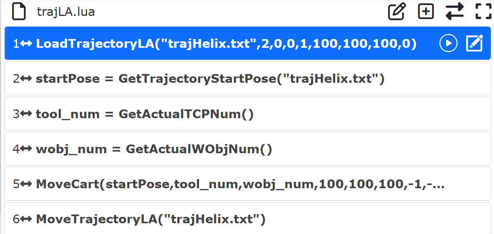

.. centered:: Abbildung 9.23-4 Typisches Programm für die Echtzeit-Vorausschau-Bahnplanung (B-Spline-Kurve)

**Schritt 5**: Klicken Sie auf die Bearbeitungsschaltfläche für die Befehlszeile "LoadTrajectory" im Lua-Programm, um die eingestellten Parameter zu ändern und so unterschiedliche Bahnplanungsergebnisse zu erzielen.

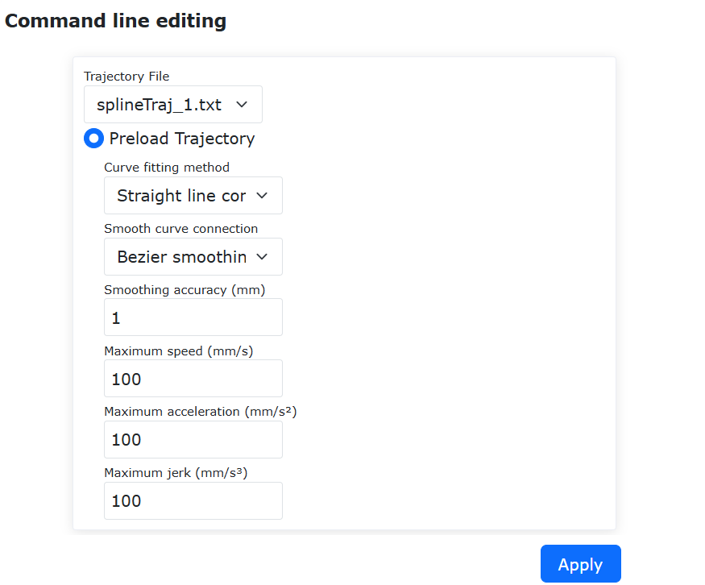

.. centered:: Abbildung 9.23-5 Ändern der Einstellungsparameter

Lichtbogen-Tracking-Funktion mit monotoner Amplitudenänderung
~~~~~~~~~~~~~~~~~~~~~~~~~~~~~~~~~~~~~~~~~~~~~~~~~~~~~~~~~~~~~~

Bei der Pendelbewegung können zwei Arten des Amplitudenwechsels realisiert werden: "Sprunghafter Wechsel" und "Allmählicher Wechsel".

Die "sprunghafte" Methode bedeutet, dass direkt zwischen den Pendelparametern eines vorherigen und eines nachfolgenden Abschnitts gewechselt wird. Dies kann durch das Setzen von zwei aufeinanderfolgenden Pendelbewegungen mit unterschiedlichen Parametern erreicht werden oder durch das Echtzeit-Senden einer neuen Pendelnummer während der Ausführung der Pendelbewegung (siehe entsprechender Abschnitt im Handbuch, hier nicht näher erläutert).

Die "allmähliche" Methode bedeutet, dass sich innerhalb eines Pendelbewegungsabschnitts die am Start eingestellte Pendelamplitude allmählich zur am Ende eingestellten Amplitude ändert.

Die allmähliche Änderung der Pendelparameter wird nur während einer linearen Pendelbewegung unterstützt.

Einführung
++++++++++

Die Bahn einer Pendelbewegung mit monotoner Amplitudenänderung ist in der folgenden Abbildung dargestellt.

.. image:: coding/293.png
   :width: 4in
   :align: center

Dabei ist die blaue Linie die Richtung der Pendelbewegung, a die Pendelamplitude am Startpunkt und b die Pendelamplitude am Endpunkt. Die Pendelamplitude ändert sich während der Bewegung allmählich.

.. note:: Bitte beachten Sie, dass derzeit nur allmähliche Änderungen unterstützt werden, bei denen Start- und Endpunkt vom gleichen Typ sind, sich nur die Amplitude (von a nach b) unterscheidet und alle anderen Parameter übereinstimmen. Es wird empfohlen, die Pendelparameter vor der Ausführung zu überprüfen.

Der Ablauf zum Einstellen einer Pendelbewegung mit allmählicher Amplitudenänderung ist wie folgt:

**Schritt 1**: Klicken Sie auf "Teach-Programm", "Programmierung". Wählen Sie und klicken Sie auf die Schaltfläche "Pendeln" unter "Bewegungsbefehle", um zur Konfigurationsseite für Pendelbefehle zu gelangen.

.. image:: coding/294.png
   :width: 3in
   :align: center

.. centered:: Abbildung 9.24-1 Klick auf die Schaltfläche für die Pendelfunktion

**Schritt 2**: Wählen Sie in der Befehlsbearbeitung die Pendelparameternummer für den Start des Pendelns. Klicken Sie auf "Pendeln starten" und dann auf die Schaltfläche "Hinzufügen".

.. image:: coding/295.png
   :width: 6in
   :align: center

.. centered:: Abbildung 9.24-2 Hinzufügen der Start-Pendelparameter

**Schritt 3**: Wählen Sie die Zielnummer für den allmählichen Wechsel. Wählen Sie "Allmählicher Wechsel starten" und klicken Sie auf die Schaltfläche "Hinzufügen".

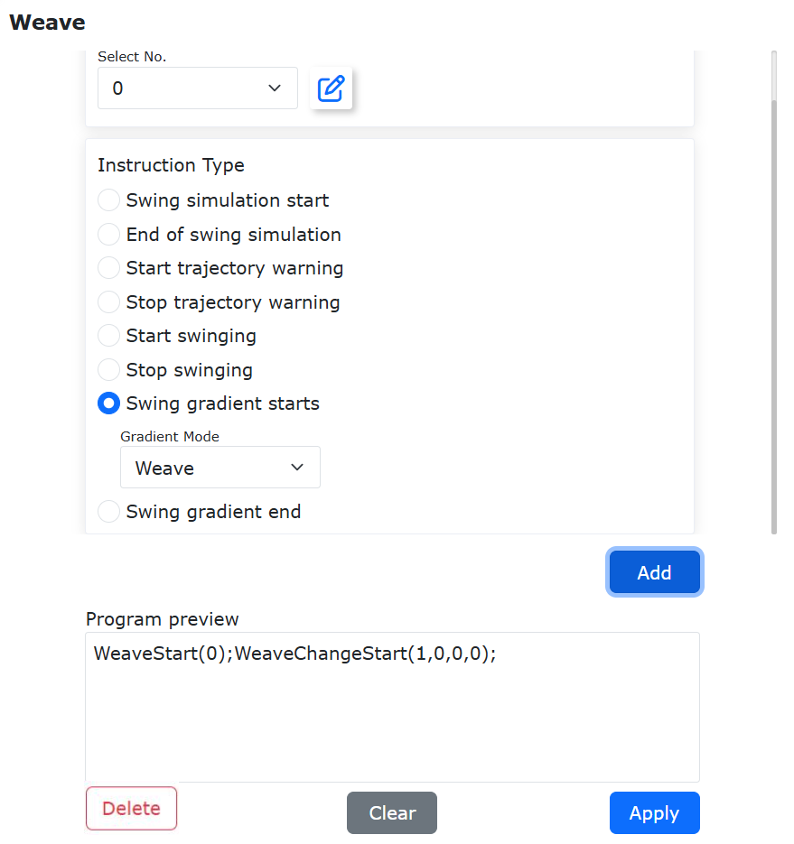

.. centered:: Abbildung 9.24-3 Hinzufügen von Parametern für den allmählichen Wechsel

**Schritt 4**: Fügen Sie die entsprechende Linearbewegung hinzu. Wählen Sie dann "Allmählicher Wechsel beenden" und klicken Sie auf "Hinzufügen". Wählen Sie anschließend "Pendeln stoppen" und klicken Sie auf "Hinzufügen". Damit ist die Einstellung einer Pendelbewegung mit allmählicher Amplitudenänderung abgeschlossen. Klicken Sie auf "Übernehmen", um sie zum LUA-Programm hinzuzufügen.

.. image:: coding/297.png
   :width: 6in
   :align: center

.. centered:: Abbildung 9.24-4 LUA-Befehl zur Realisierung einer vollständigen Bewegung mit allmählicher Amplitudenänderung

Lichtbogen-Tracking-Funktion mit Versatz
~~~~~~~~~~~~~~~~~~~~~~~~~~~~~~~~~~~~~~~~~

Während des Lichtbogen-Tracking-Schweißprozesses passt der Roboter standardmäßig die Pendelmitte des Schweißbrenners basierend auf den Strominformationen an, um sie mit der Werkstückfugenmitte in Übereinstimmung zu bringen. Einige Prozessanforderungen erfordern jedoch einen bestimmten Versatz der Schweißbrenner-Pendelmitte relativ zur Werkstückfugenmitte.

.. image:: coding/298.png
   :width: 3in
   :align: center

.. centered:: Abbildung 9.25-1 Typisches Szenario für Lichtbogen-Tracking mit Versatz

Ein typisches Szenario für die Lichtbogen-Tracking-Funktion mit Versatz umfasst: a. Schweißwerkstück (Schweißnahtvorbereitung im rechten oder spitzen Winkel), b. Schweißbrenner, e. Mittellinie der Schweißnaht. Die Lichtbogen-Tracking-Funktion realisiert eine Verfolgung der Schweißnaht in c. Höhenrichtung (Tiefe) und d. Seitenrichtung (Mitte), f. Versatzabstand in Seitenrichtung.

Um ein Lichtbogen-Tracking mit Versatz zu realisieren, können zwei Methoden zur Einstellung des seitlichen Versatzes gewählt werden: die "Abtast"-Methode und die "Prozent"-Einstellmethode.

Lichtbogen-Tracking mit Versatz durch Abtastung
+++++++++++++++++++++++++++++++++++++++++++++++

Bei der Abtastmethode werden nach dem Zünden des Lichtbogens in der Pendelschweißung die linken und rechten Stromwerte während eines Pendelzyklus als Referenz erfasst. Während des anschließenden Schweißprozesses werden die abgetasteten Ströme mit dem Referenzstrom verglichen, um die Nachführrichtung zu bestimmen.

Die Abtastmethode erfordert, dass die Startposition der Pendelschweißung auf den gewünschten Versatzbetrag eingestellt wird. Der Versatzbetrag darf die Pendelamplitude nicht überschreiten. Die Schweißnaht muss die Stoßfuge abdecken.

Der Ablauf zum Einstellen des Abtastversatzbefehls ist wie folgt:

.. image:: coding/299.png
   :width: 3in
   :align: center

.. centered:: Abbildung 9.25-2 Klick auf die Schaltfläche für den Lichtbogen-Tracking-Befehl

**Schritt 1**: Klicken Sie auf "Teach-Programm", "Programmierung". Wählen Sie und klicken Sie auf die Schaltfläche "Lichtbogen-Tracking" unter "Schweißbefehle", um zur Konfigurationsseite für Lichtbogen-Tracking-Befehle zu gelangen.

.. image:: coding/300.png
   :width: 6in
   :align: center

.. centered:: Abbildung 9.25-3 Konfigurationsseite für Lichtbogen-Tracking mit Abtastversatz

**Schritt 2**: Das Lichtbogen-Tracking mit Versatz wirkt auf die Seitenkompensation. Klicken Sie auf die Unterseite "Seitenkompensation". Wählen Sie im Dropdown-Menü "Versatzmethode" die Option "Abtastung". Stellen Sie den Startzyklus der Abtastung ein (der Startzyklus der Abtastung muss kleiner sein als die Startzeit der Seitenkompensation). Wählen Sie als Befehlstyp "Start". Klicken Sie auf die Schaltfläche "Hinzufügen", um einen LUA-Befehl zu generieren.

.. image:: coding/301.png
   :width: 6in
   :align: center

.. centered:: Abbildung 9.25-4 Hinzufügen eines Startbefehls für Lichtbogen-Tracking mit Abtastversatz

**Schritt 3**: Fügen Sie nach dem Hinzufügen des Pendelbewegungsbefehls den Befehlstyp "Ende" für das Lichtbogen-Tracking aus. Klicken Sie auf "Hinzufügen", um den entsprechenden LUA-Befehl zu generieren.

Lichtbogen-Tracking mit prozentualem Versatz
++++++++++++++++++++++++++++++++++++++++++++

Beim prozentualen Versatz wird der abgetastete Strom während des Lichtbogen-Trackings mit einem prozentualen Faktor beaufschlagt. Dadurch wird eine Abweichung der Ströme in den linken und rechten Pendelzyklen erzeugt. Der Roboter kompensiert automatisch das so abweichende Signal.

.. note:: Bitte beachten Sie: Je kleiner die Pendelamplitude und je größer der Fugenwinkel, desto kleiner ist die Abweichung der linken und rechten Ströme und desto kleiner sollte der Einstellprozentsatz sein. Es wird empfohlen, in Schritten von 1% zu justieren.

Der Ablauf zum Einstellen des prozentualen Versatzbefehls ist wie folgt:

.. image:: coding/299.png
   :width: 3in
   :align: center

.. centered:: Abbildung 9.25-5 Klick auf die Schaltfläche für den Lichtbogen-Tracking-Befehl

**Schritt 1**: Klicken Sie auf "Teach-Programm", "Programmierung". Wählen Sie und klicken Sie auf die Schaltfläche "Lichtbogen-Tracking" unter "Schweißbefehle", um zur Konfigurationsseite für Lichtbogen-Tracking-Befehle zu gelangen.

.. image:: coding/302.png
   :width: 6in
   :align: center

.. centered:: Abbildung 9.25-6 Konfigurationsseite für Lichtbogen-Tracking mit Abtastversatz

**Schritt 2**: Das Lichtbogen-Tracking mit Versatz wirkt auf die Seitenkompensation. Klicken Sie auf die Unterseite "Seitenkompensation". Wählen Sie im Dropdown-Menü "Versatzmethode" die Option "Prozentsatz". Stellen Sie den Prozentwert ein (ein positiver Wert verstärkt den Strom in der ersten Hälfte des Zyklus und bewirkt eine Kompensation in Richtung der zweiten Hälfte des Zyklus; ein negativer Wert bewirkt das Gegenteil). Wählen Sie als Befehlstyp "Start". Klicken Sie auf die Schaltfläche "Hinzufügen", um einen LUA-Befehl zu generieren.

.. image:: coding/303.png
   :width: 6in
   :align: center

.. centered:: Abbildung 9.25-7 Hinzufügen eines Startbefehls für Lichtbogen-Tracking mit prozentualem Versatz

**Schritt 3**: Fügen Sie nach dem Hinzufügen des Pendelbewegungsbefehls den Befehlstyp "Ende" für das Lichtbogen-Tracking aus. Klicken Sie auf "Hinzufügen", um den entsprechenden LUA-Befehl zu generieren.

Die Struktur eines typischen LUA-Programms für einen Versatz-Tracking-Abschnitt ist unten dargestellt:

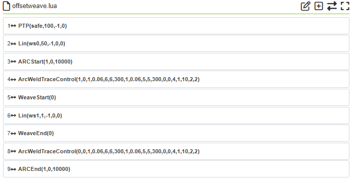

.. centered:: Abbildung 9.25-8 Ein typisches LUA-Programm für Lichtbogen-Tracking mit Versatz

Funktion zur benutzerdefinierten Kollisionserkennungsschwelle
~~~~~~~~~~~~~~~~~~~~~~~~~~~~~~~~~~~~~~~~~~~~~~~~~~~~~~~~~~~~~~

Übersicht
+++++++++

Die Funktion zur benutzerdefinierten Kollisionserkennungsschwelle ist eine Verbesserung der derzeitigen manuellen Kollisionsstufeneinstellung. Wenn die Einstellung der aktuellen Kollisionsstufe das Anwendungsszenario nicht abdeckt, kann der Benutzer je nach tatsächlicher Situation eine benutzerdefinierte Kollisionserkennungsschwelle festlegen. Die Kollisionserkennungsschwelle ist unterteilt in eine Gelenkerkennungsschwelle und eine TCP-Erkennungsschwelle.

Erläuterung der Funktionseinstellung
++++++++++++++++++++++++++++++++++++

**Schritt 1**: Klicken Sie auf "Teach-Programm" und wählen Sie "Programmierung", um die entsprechende Oberfläche zu öffnen.

**Schritt 2**: Klicken Sie oben auf die Schaltfläche "Neu", geben Sie "example" ein, wählen Sie "empty.lua" und erstellen Sie ein neues Lua-Skript, wie in der Abbildung gezeigt.

.. image:: coding/305.png
   :width: 3in
   :align: center

.. centered:: Abbildung 9.26-1 Neues Lua-Skript erstellen

Erläuterung der Einstellung der Gelenkerkennungsschwelle
********************************************************

Erläuterung der Parametereinstellung
"""""""""""""""""""""""""""""""""""""

**Schritt 1**: Wählen Sie auf der Steuerbefehls-Oberfläche die Funktion "Kollisionserkennung", wie in Abbildung 2 gezeigt. Klicken Sie auf "Kollisionserkennung einschalten". Wählen Sie unter "Erkennungsstatus" die Option "Nur Gelenke". Ändern Sie die Eingabewerte für J1-J6 je nach tatsächlichem Bedarf. Der Zahlenbereich ist [Wert], Einheit Nm. In diesem Modus sind Änderungen an den TCP-Schwellwerten in den Richtungen X-RZ unwirksam. Wählen Sie je nach tatsächlichem Bedarf "Nicht blockieren" oder "Blockieren" für die Option "Ob blockieren". Klicken Sie auf die Schaltfläche "Hinzufügen". Der Einschaltbefehl ist damit vollständig hinzugefügt.

**Schritt 2**: Klicken Sie auf "Kollisionserkennung ausschalten". Klicken Sie auf die Schaltfläche "Hinzufügen". Der Ausschaltbefehl ist damit vollständig hinzugefügt. Die Programm-Vorschauoberfläche ist in Abbildung 3 dargestellt. Klicken Sie auf die Schaltfläche "Übernehmen", um die Funktionshinzufügung abzuschließen.

.. note:: Die Funktion zur benutzerdefinierten Kollisionserkennungsschwelle ist eine Gruppe von Befehlen. Nach dem Einschalten muss sie rechtzeitig ausgeschaltet werden.

**Schritt 3**: Fügen Sie innerhalb der Kollisionserkennungsfunktion die entsprechenden Bewegungsbefehle hinzu, wie in Abbildung 4 gezeigt.

.. image:: coding/306.png
   :width: 6in
   :align: center

.. centered:: Abbildung 9.26-2 Einstellungsoberfläche für die Gelenkerkennungsschwelle

.. image:: coding/307.png
   :width: 6in
   :align: center

.. centered:: Abbildung 9.26-3 Programm-Vorschauoberfläche

.. image:: coding/308.png
   :width: 6in
   :align: center

.. centered:: Abbildung 9.26-4 Beispieloberfläche des Lua-Skriptprogramms

Erläuterung der Einstellung der TCP-Erkennungsschwelle
******************************************************

Erläuterung der Parametereinstellung
"""""""""""""""""""""""""""""""""""""

**Schritt 1**: Wählen Sie auf der Steuerbefehls-Oberfläche die Funktion "Kollisionserkennung", wie in Abbildung 5 gezeigt. Klicken Sie auf "Kollisionserkennung einschalten". Wählen Sie unter "Erkennungsstatus" die Option "Nur TCP". Ändern Sie die Eingabewerte für die Richtungen X-RZ je nach tatsächlichem Bedarf. Der Zahlenbereich ist [Wert], Einheit N. In diesem Modus sind Änderungen an den Gelenkschwellwerten J1-J6 unwirksam. Wählen Sie je nach tatsächlichem Bedarf "Nicht blockieren" oder "Blockieren" für die Option "Ob blockieren". Klicken Sie auf die Schaltfläche "Hinzufügen". Der Einschaltbefehl ist damit vollständig hinzugefügt.

**Schritt 2**: Klicken Sie auf "Kollisionserkennung ausschalten". Klicken Sie auf die Schaltfläche "Hinzufügen". Der Ausschaltbefehl ist damit vollständig hinzugefügt. Die Programm-Vorschauoberfläche ist in Abbildung 6 dargestellt. Klicken Sie auf die Schaltfläche "Übernehmen", um die Funktionshinzufügung abzuschließen.

.. note:: Die Funktion zur benutzerdefinierten Kollisionserkennungsschwelle ist eine Gruppe von Befehlen. Nach dem Einschalten muss sie rechtzeitig ausgeschaltet werden.

.. image:: coding/309.png
   :width: 6in
   :align: center

.. centered:: Abbildung 9.26-5 Einstellungsoberfläche für die TCP-Erkennungsschwelle

.. image:: coding/310.png
   :width: 6in
   :align: center

.. centered:: Abbildung 9.26-6 Programm-Vorschauoberfläche

**Schritt 3**: Fügen Sie innerhalb der Kollisionserkennungsfunktion die entsprechenden Bewegungsbefehle hinzu, wie in Abbildung 7 gezeigt.

.. image:: coding/311.png
   :width: 6in
   :align: center

.. centered:: Abbildung 9.26-7 Beispieloberfläche des Lua-Skriptprogramms

Erläuterung der Einstellung der Gelenk- und TCP-Erkennungsschwelle
*******************************************************************

Erläuterung der Parametereinstellung
"""""""""""""""""""""""""""""""""""""

**Schritt 1**: Wählen Sie auf der Steuerbefehls-Oberfläche die Funktion "Kollisionserkennung", wie in Abbildung 8 gezeigt. Klicken Sie auf "Kollisionserkennung einschalten". Wählen Sie unter "Erkennungsstatus" die Option "Gelenke und TCP". Ändern Sie die Eingabewerte für J1-J6 und die Richtungen X-RZ je nach tatsächlichem Bedarf. Der Zahlenbereich für J1-J6 ist [Wert], Einheit Nm; der Zahlenbereich für die Richtungen X-RZ ist [Wert], Einheit N. Wählen Sie je nach tatsächlichem Bedarf "Nicht blockieren" oder "Blockieren" für die Option "Ob blockieren". Klicken Sie auf die Schaltfläche "Hinzufügen". Der Einschaltbefehl ist damit vollständig hinzugefügt.

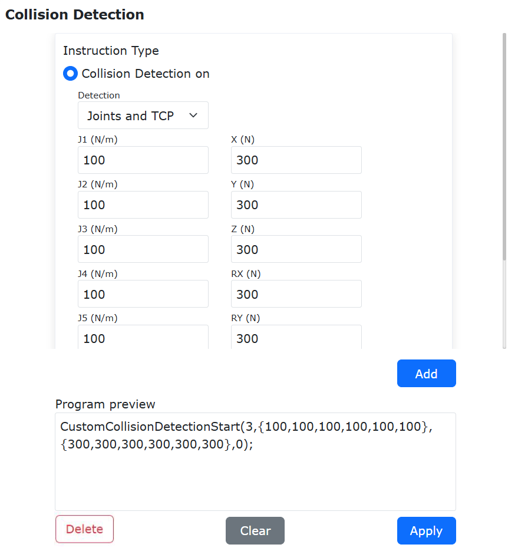

.. centered:: Abbildung 9.26-8 Einstellungsoberfläche für die Gelenk- und TCP-Erkennungsschwelle

**Schritt 2**: Klicken Sie auf "Kollisionserkennung ausschalten". Klicken Sie auf die Schaltfläche "Hinzufügen". Der Ausschaltbefehl ist damit vollständig hinzugefügt. Die Programm-Vorschauoberfläche ist in Abbildung 9 dargestellt. Klicken Sie auf die Schaltfläche "Übernehmen", um die Funktionshinzufügung abzuschließen.

.. note:: Die Funktion zur benutzerdefinierten Kollisionserkennungsschwelle ist eine Gruppe von Befehlen. Nach dem Einschalten muss sie rechtzeitig ausgeschaltet werden.

.. image:: coding/313.png
   :width: 6in
   :align: center

.. centered:: Abbildung 9.26-9 Programm-Vorschauoberfläche

**Schritt 3**: Fügen Sie innerhalb der Kollisionserkennungsfunktion die entsprechenden Bewegungsbefehle hinzu, wie in Abbildung 10 gezeigt.

.. image:: coding/314.png
   :width: 4in
   :align: center

.. centered:: Abbildung 9.26-10 Beispieloberfläche des Lua-Skriptprogramms

Empfohlene Einstellungen für Erkennungsschwellen
*************************************************

Gelenkerkennungsschwelle
"""""""""""""""""""""""""

Die empfohlene Gelenkerkennungsschwelle entspricht der Einstellung der Kollisionsstufe auf 10. Je größer der Wert, desto unempfindlicher die Kollisionserkennung. Der Zahlenbereich ist [Wert], Einheit Nm. Die Daten in der Tabelle sind nur als Referenz gedacht. Die tatsächlichen Werte müssen basierend auf der Robotergeschwindigkeit und der Last angepasst werden.

.. centered:: Tabelle 9.26-1 Empfohlene Gelenkschwellen

.. list-table::
   :widths: 30 20 20 20 20 20 20
   :header-rows: 0
   :class: sheet-center
   :align: center

   * - **Robotertyp**
     - **J1**
     - **J2**
     - **J3**
     - **J4**
     - **J5**
     - **J6**

   * - **FR3**
     - 0.4
     - 0.7
     - 0.6
     - 0.3
     - 0.3
     - 0.3

   * - **FR3-WMS**
     - 0.4
     - 0.7
     - 0.6
     - 0.3
     - 0.3
     - 0.3

   * - **FR3-WML**
     - 0.4
     - 0.7
     - 0.6
     - 0.3
     - 0.3
     - 0.3

   * - **FR3-C**
     - 0.4
     - 0.7
     - 0.6
     - 0.3
     - 0.3
     - 0.3

   * - **FR5**
     - 0.6
     - 1
     - 0.8
     - 0.3
     - 0.3
     - 0.3

   * - **FR10**
     - 2.5
     - 3.6
     - 0.8
     - 0.6
     - 0.6
     - 0.6

   * - **FR16**
     - 2.5
     - 3.6
     - 0.8
     - 0.6
     - 0.6
     - 0.6

   * - **FR20**
     - 5
     - 8
     - 4.5
     - 0.9
     - 0.9
     - 0.9

   * - **FR30**
     - 5
     - 8
     - 4.5
     - 0.9
     - 0.9
     - 0.9

TCP-Erkennungsschwelle
""""""""""""""""""""""

Je größer der Wert der TCP-Erkennungsschwelle, desto unempfindlicher die Kollisionserkennung. Der Zahlenbereich ist [Wert], Einheit N. Die Daten in der Tabelle sind nur als Referenz gedacht. Die tatsächlichen Werte müssen basierend auf der Robotergeschwindigkeit und der Last angepasst werden.

.. centered:: Tabelle 9.26-2 TCP-Erkennungsschwelle

.. list-table::
   :widths: 30 20 20 20 20 20 20
   :header-rows: 0
   :class: sheet-center
   :align: center

   * - **Robotertyp**
     - **X**
     - **Y**
     - **Z**
     - **RX**
     - **RY**
     - **RZ**

   * - **FR3**
     - 300
     - 300
     - 300
     - 20
     - 20
     - 20

   * - **FR3-WMS**
     - 300
     - 300
     - 300
     - 20
     - 20
     - 20

   * - **FR3-WML**
     - 300
     - 300
     - 300
     - 20
     - 20
     - 20

   * - **FR3-C**
     - 300
     - 300
     - 300
     - 20
     - 20
     - 20

   * - **FR5**
     - 300
     - 300
     - 300
     - 20
     - 20
     - 20

   * - **FR10**
     - 500
     - 500
     - 500
     - 35
     - 35
     - 35

   * - **FR16**
     - 500
     - 500
     - 500
     - 35
     - 35
     - 35

   * - **FR20**
     - 800
     - 800
     - 800
     - 60
     - 60
     - 60

   * - **FR30**
     - 800
     - 800
     - 800
     - 60
     - 60
     - 60

Optimierung der T-förmigen Geschwindigkeitscharakteristik + Blending-Funktion
~~~~~~~~~~~~~~~~~~~~~~~~~~~~~~~~~~~~~~~~~~~~~~~~~~~~~~~~~~~~~~~~~~~~~~~~~~~~~~

Übersicht
+++++++++

Durch Blending zwischen zwei Bahnsegmenten können häufige Start-Stopp-Vorgänge vermieden werden, die durch vollständiges Anhalten entstehen, wodurch die Bewegungseffizienz des Roboters verbessert wird. Diese Funktion unterstützt hauptsächlich Blending zwischen PTP-, LIN-, ARC- und CIRCLE-Befehlen. Dies kann auf zwei Arten erreicht werden: Verwendung von Lua-Befehlen oder Verwendung des Bewegungskonfigurationsschalters.

Ablauf
++++++

Blending von PTP-PTP
*********************

Verwendung von Lua-Befehlen
"""""""""""""""""""""""""""

**Schritt 1**: Wählen Sie die Teachpunkte für die PTP-PTP-Funktion aus. In diesem Handbuch werden "A0" ~ "A5" als Namen der Teachpunkte verwendet.

**Schritt 2**: Klicken Sie auf "Teach-Programm" -> "Programmierung". Wählen Sie in den "Bewegungsbefehlen" den Befehl "Punkt-zu-Punkt". Wählen Sie in der "Befehlsbearbeitung" den Teachpunkt aus und stellen Sie die Testgeschwindigkeit ein. Wählen Sie als Bewegungsschutz den "Beschleunigungsglättungsmodus". Stellen Sie für die zu glättenden Punkte den Parameter "Glättungsübergang" ein.

.. image:: coding/315.png
   :width: 6in
   :align: center

.. centered:: Abbildung 9.27-1 Blending-Befehlseinstellung für PTP-Befehl mit Beschleunigungsglättung

**Schritt 3**: Fügen Sie mehrere PTP-Befehle hinzu, generieren Sie ein Lua-Programm und führen Sie es aus. Dadurch wird die Blending-Funktion für PTP-PTP realisiert. Diese Methode verwendet die optimierte T-förmige Geschwindigkeitsbewegung nur für Befehle zwischen AccSmoothStart() und AccSmoothEnd(), für die übrigen Befehle wird die ursprüngliche T-förmige Geschwindigkeitsbewegung verwendet.

.. image:: coding/316.png
   :width: 4in
   :align: center

.. centered:: Abbildung 9.27-2 Typisches Programm für PTP-PTP-Blending mit Lua-Befehlen

Verwendung des Bewegungskonfigurationsschalters
"""""""""""""""""""""""""""""""""""""""""""""""

**Schritt 1**: Klicken Sie auf "Initiale Einstellungen" -> "Sicherheit" -> "Bewegungskonfiguration". Aktivieren Sie den Schalter "Beschleunigungsglättungsmodus".

.. image:: coding/317.png
   :width: 6in
   :align: center

.. centered:: Abbildung 9.27-3 Einstellung des Bewegungskonfigurationsschalters für den Beschleunigungsglättungsmodus

**Schritt 2**: Wählen Sie die Teachpunkte für die PTP-PTP-Funktion aus. In diesem Handbuch werden "A0" ~ "A5" als Namen der Teachpunkte verwendet.

**Schritt 3**: Klicken Sie auf "Teach-Programm" -> "Programmierung". Wählen Sie in den "Bewegungsbefehlen" den Befehl "Punkt-zu-Punkt". Wählen Sie in der "Befehlsbearbeitung" den Teachpunkt aus und stellen Sie die Testgeschwindigkeit ein. Wählen Sie als Bewegungsschutz "Kein". Stellen Sie für die zu glättenden Punkte den Parameter "Glättungsübergang" ein.

.. image:: coding/318.png
   :width: 6in
   :align: center

.. centered:: Abbildung 9.27-4 Blending-Befehlseinstellung für normalen PTP-Befehl

**Schritt 4**: Fügen Sie mehrere PTP-Befehle hinzu, generieren Sie ein Lua-Programm und führen Sie es aus. Dadurch wird die Blending-Funktion für PTP-PTP realisiert. Das typische Programm ist identisch mit dem normalen PTP-PTP-Programm. Diese Methode verwendet die optimierte T-förmige Geschwindigkeitsbewegung für alle Befehle.

.. image:: coding/319.png
   :width: 4in
   :align: center

.. centered:: Abbildung 9.27-5 Typisches Programm für PTP-PTP-Blending unter Verwendung des Konfigurationsschalters

Blending von PTP-LIN
*********************

Verwendung von Lua-Befehlen
"""""""""""""""""""""""""""

**Schritt 1**: Wählen Sie die Teachpunkte für die PTP-LIN-Funktion aus. In diesem Handbuch werden "A0" ~ "A5" als Namen der Teachpunkte verwendet.

**Schritt 2**: Klicken Sie auf "Teach-Programm" -> "Programmierung". Wählen Sie in den "Bewegungsbefehlen" den Befehl "Punkt-zu-Punkt". Wählen Sie in der "Befehlsbearbeitung" den Teachpunkt aus und stellen Sie die Testgeschwindigkeit ein. Wählen Sie als Bewegungsschutz den "Beschleunigungsglättungsmodus". Stellen Sie für die zu glättenden Punkte den Parameter "Glättungsübergang" ein.

.. image:: coding/315.png
   :width: 6in
   :align: center

.. centered:: Abbildung 9.27-6 Blending-Befehlseinstellung für PTP-Befehl mit Beschleunigungsglättung

**Schritt 3**: Fügen Sie mehrere PTP- und LIN-Befehle hinzu, generieren Sie ein Lua-Programm und führen Sie es aus. Dadurch wird die Blending-Funktion für PTP-LIN realisiert. Diese Methode verwendet die optimierte T-förmige Geschwindigkeitsbewegung nur für Befehle zwischen AccSmoothStart() und AccSmoothEnd(), für die übrigen Befehle wird die ursprüngliche T-förmige Geschwindigkeitsbewegung verwendet.

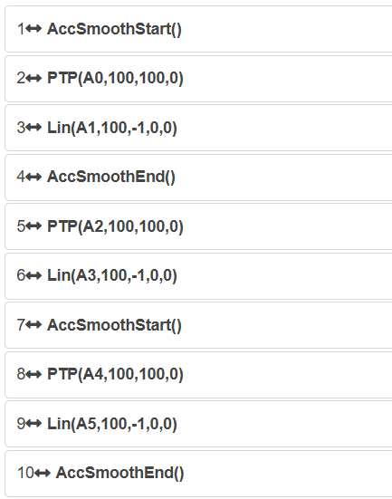

.. centered:: Abbildung 9.27-7 Typisches Programm für PTP-LIN-Blending mit Lua-Befehlen

Verwendung des Bewegungskonfigurationsschalters
"""""""""""""""""""""""""""""""""""""""""""""""

**Schritt 1**: Klicken Sie auf "Initiale Einstellungen" -> "Sicherheit" -> "Bewegungskonfiguration". Aktivieren Sie den Schalter "Beschleunigungsglättungsmodus".

.. image:: coding/317.png
   :width: 6in
   :align: center

.. centered:: Abbildung 9.27-8 Einstellung des Bewegungskonfigurationsschalters für den Beschleunigungsglättungsmodus

**Schritt 2**: Wählen Sie die Teachpunkte für die PTP-LIN-Funktion aus. In diesem Handbuch werden "A0" ~ "A5" als Namen der Teachpunkte verwendet.

**Schritt 3**: Klicken Sie auf "Teach-Programm" -> "Programmierung". Wählen Sie in den "Bewegungsbefehlen" den Befehl "Punkt-zu-Punkt". Wählen Sie in der "Befehlsbearbeitung" den Teachpunkt aus und stellen Sie die Testgeschwindigkeit ein. Wählen Sie als Bewegungsschutz "Kein". Stellen Sie für die zu glättenden Punkte den Parameter "Glättungsübergang" ein.

.. image:: coding/318.png
   :width: 6in
   :align: center

.. centered:: Abbildung 9.27-9 Blending-Befehlseinstellung für normalen PTP-Befehl

**Schritt 4**: Fügen Sie mehrere PTP- und LIN-Befehle hinzu, generieren Sie ein Lua-Programm und führen Sie es aus. Dadurch wird die Blending-Funktion für PTP-LIN realisiert. Das typische Programm ist identisch mit dem normalen PTP-LIN-Programm. Diese Methode verwendet die optimierte T-förmige Geschwindigkeitsbewegung für alle Befehle.

.. image:: coding/397.png
   :width: 4in
   :align: center

.. centered:: Abbildung 9.27-10 Typisches Programm für PTP-LIN-Blending unter Verwendung des Konfigurationsschalters

Blending von PTP-ARC
*********************

Verwendung von Lua-Befehlen
"""""""""""""""""""""""""""

**Schritt 1**: Wählen Sie die Teachpunkte für die PTP-ARC-Funktion aus. In diesem Handbuch werden "A0" ~ "A8" als Namen der Teachpunkte verwendet.

**Schritt 2**: Klicken Sie auf "Teach-Programm" -> "Programmierung". Wählen Sie in den "Bewegungsbefehlen" den Befehl "Punkt-zu-Punkt". Wählen Sie in der "Befehlsbearbeitung" den Teachpunkt aus und stellen Sie die Testgeschwindigkeit ein. Wählen Sie als Bewegungsschutz den "Beschleunigungsglättungsmodus". Stellen Sie für die zu glättenden Punkte den Parameter "Glättungsübergang" ein.

.. image:: coding/315.png
   :width: 6in
   :align: center

.. centered:: Abbildung 9.27-11 Blending-Befehlseinstellung für PTP-Befehl mit Beschleunigungsglättung

**Schritt 3**: Fügen Sie mehrere PTP- und ARC-Befehle hinzu, generieren Sie ein Lua-Programm und führen Sie es aus. Dadurch wird die Blending-Funktion für PTP-ARC realisiert. Diese Methode verwendet die optimierte T-förmige Geschwindigkeitsbewegung nur für Befehle zwischen AccSmoothStart() und AccSmoothEnd(), für die übrigen Befehle wird die ursprüngliche T-förmige Geschwindigkeitsbewegung verwendet.

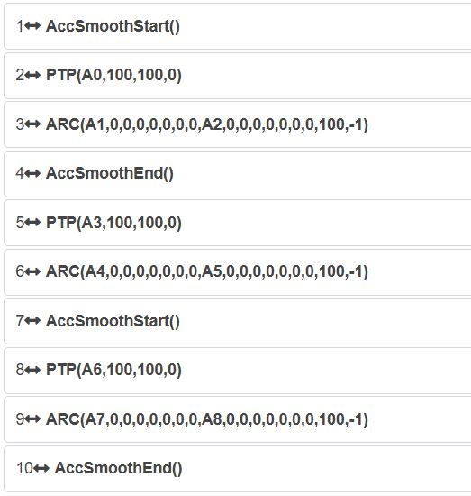

.. centered:: Abbildung 9.27-12 Typisches Programm für PTP-ARC-Blending mit Lua-Befehlen

Verwendung des Bewegungskonfigurationsschalters
"""""""""""""""""""""""""""""""""""""""""""""""

**Schritt 1**: Klicken Sie auf "Initiale Einstellungen" -> "Sicherheit" -> "Bewegungskonfiguration". Aktivieren Sie den Schalter "Beschleunigungsglättungsmodus".

.. image:: coding/317.png
   :width: 6in
   :align: center

.. centered:: Abbildung 9.27-13 Einstellung des Bewegungskonfigurationsschalters für den Beschleunigungsglättungsmodus

**Schritt 2**: Wählen Sie die Teachpunkte für die PTP-ARC-Funktion aus. In diesem Handbuch werden "A0" ~ "A8" als Namen der Teachpunkte verwendet.

**Schritt 3**: Klicken Sie auf "Teach-Programm" -> "Programmierung". Wählen Sie in den "Bewegungsbefehlen" den Befehl "Punkt-zu-Punkt". Wählen Sie in der "Befehlsbearbeitung" den Teachpunkt aus und stellen Sie die Testgeschwindigkeit ein. Wählen Sie als Bewegungsschutz "Kein". Stellen Sie für die zu glättenden Punkte den Parameter "Glättungsübergang" ein.

.. image:: coding/318.png
   :width: 6in
   :align: center

.. centered:: Abbildung 9.27-14 Blending-Befehlseinstellung für normalen PTP-Befehl

**Schritt 4**: Fügen Sie mehrere PTP- und ARC-Befehle hinzu, generieren Sie ein Lua-Programm und führen Sie es aus. Dadurch wird die Blending-Funktion für PTP-ARC realisiert. Das typische Programm ist identisch mit dem normalen PTP-ARC-Programm. Diese Methode verwendet die optimierte T-förmige Geschwindigkeitsbewegung für alle Befehle.

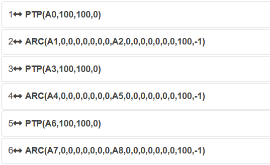

.. centered:: Abbildung 9.27-15 Typisches Programm für PTP-ARC-Blending unter Verwendung des Konfigurationsschalters

Blending von PTP-CIRCLE
************************

Verwendung von Lua-Befehlen
"""""""""""""""""""""""""""

**Schritt 1**: Wählen Sie die Teachpunkte für die PTP-CIRCLE-Funktion aus. In diesem Handbuch werden "A0" ~ "A8" als Namen der Teachpunkte verwendet.

**Schritt 2**: Klicken Sie auf "Teach-Programm" -> "Programmierung". Wählen Sie in den "Bewegungsbefehlen" den Befehl "Punkt-zu-Punkt". Wählen Sie in der "Befehlsbearbeitung" den Teachpunkt aus und stellen Sie die Testgeschwindigkeit ein. Wählen Sie als Bewegungsschutz den "Beschleunigungsglättungsmodus". Stellen Sie für die zu glättenden Punkte den Parameter "Glättungsübergang" ein.

.. image:: coding/315.png
   :width: 6in
   :align: center

.. centered:: Abbildung 9.27-16 Blending-Befehlseinstellung für PTP-Befehl mit Beschleunigungsglättung

**Schritt 3**: Fügen Sie mehrere PTP- und CIRCLE-Befehle hinzu, generieren Sie ein Lua-Programm und führen Sie es aus. Dadurch wird die Blending-Funktion für PTP-CIRCLE realisiert. Diese Methode verwendet die optimierte T-förmige Geschwindigkeitsbewegung nur für Befehle zwischen AccSmoothStart() und AccSmoothEnd(), für die übrigen Befehle wird die ursprüngliche T-förmige Geschwindigkeitsbewegung verwendet.

.. image:: coding/400.png
   :width: 4in
   :align: center

.. centered:: Abbildung 9.27-17 Typisches Programm für PTP-CIRCLE-Blending mit Lua-Befehlen

Verwendung des Bewegungskonfigurationsschalters
"""""""""""""""""""""""""""""""""""""""""""""""

**Schritt 1**: Klicken Sie auf "Initiale Einstellungen" -> "Sicherheit" -> "Bewegungskonfiguration". Aktivieren Sie den Schalter "Beschleunigungsglättungsmodus".

.. image:: coding/317.png
   :width: 6in
   :align: center

.. centered:: Abbildung 9.27-18 Einstellung des Bewegungskonfigurationsschalters für den Beschleunigungsglättungsmodus

**Schritt 2**: Wählen Sie die Teachpunkte für die PTP-CIRCLE-Funktion aus. In diesem Handbuch werden "A0" ~ "A8" als Namen der Teachpunkte verwendet.

**Schritt 3**: Klicken Sie auf "Teach-Programm" -> "Programmierung". Wählen Sie in den "Bewegungsbefehlen" den Befehl "Punkt-zu-Punkt". Wählen Sie in der "Befehlsbearbeitung" den Teachpunkt aus und stellen Sie die Testgeschwindigkeit ein. Wählen Sie als Bewegungsschutz "Kein". Stellen Sie für die zu glättenden Punkte den Parameter "Glättungsübergang" ein.

.. image:: coding/318.png
   :width: 6in
   :align: center

.. centered:: Abbildung 9.27-19 Blending-Befehlseinstellung für normalen PTP-Befehl

**Schritt 4**: Fügen Sie mehrere PTP- und CIRCLE-Befehle hinzu, generieren Sie ein Lua-Programm und führen Sie es aus. Dadurch wird die Blending-Funktion für PTP-CIRCLE realisiert. Das typische Programm ist identisch mit dem normalen PTP-CIRCLE-Programm. Diese Methode verwendet die optimierte T-förmige Geschwindigkeitsbewegung für alle Befehle.

.. image:: coding/401.png
   :width: 4in
   :align: center

.. centered:: Abbildung 9.27-20 Typisches Programm für PTP-CIRCLE-Blending unter Verwendung des Konfigurationsschalters

Blending von LIN-PTP
*********************

Verwendung von Lua-Befehlen
"""""""""""""""""""""""""""

**Schritt 1**: Wählen Sie die Teachpunkte für die LIN-PTP-Funktion aus. In diesem Handbuch werden "A0" ~ "A5" als Namen der Teachpunkte verwendet.

**Schritt 2**: Klicken Sie auf "Teach-Programm" -> "Programmierung". Wählen Sie in den "Bewegungsbefehlen" den Befehl "Linie". Wählen Sie in der "Befehlsbearbeitung" den Teachpunkt aus und stellen Sie die Testgeschwindigkeit ein. Wählen Sie als Bewegungsschutz den "Beschleunigungsglättungsmodus". Stellen Sie für die zu glättenden Punkte die Parameter "Übergangsradius" und "Übergangstyp" ein. Als Übergangstyp können "Eckpunktübergang" und "Innenkreisübergang" gewählt werden.

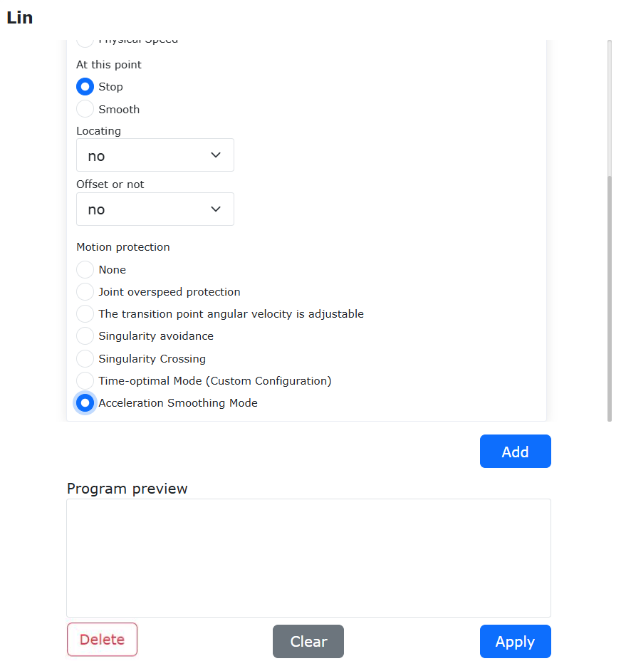

.. centered:: Abbildung 9.27-21 Blending-Befehlseinstellung für PTP-Befehl mit Beschleunigungsglättung

**Schritt 3**: Fügen Sie mehrere LIN- und PTP-Befehle hinzu, generieren Sie ein Lua-Programm und führen Sie es aus. Dadurch wird die Blending-Funktion für LIN-PTP realisiert. Diese Methode verwendet die optimierte T-förmige Geschwindigkeitsbewegung nur für Befehle zwischen AccSmoothStart() und AccSmoothEnd(), für die übrigen Befehle wird die ursprüngliche T-förmige Geschwindigkeitsbewegung verwendet.

.. image:: coding/403.png
   :width: 4in
   :align: center

.. centered:: Abbildung 9.27-22 Typisches Programm für LIN-PTP-Blending mit Lua-Befehlen

Verwendung des Bewegungskonfigurationsschalters
"""""""""""""""""""""""""""""""""""""""""""""""

**Schritt 1**: Klicken Sie auf "Initiale Einstellungen" -> "Sicherheit" -> "Bewegungskonfiguration". Aktivieren Sie den Schalter "Beschleunigungsglättungsmodus".

.. image:: coding/317.png
   :width: 6in
   :align: center

.. centered:: Abbildung 9.27-23 Einstellung des Bewegungskonfigurationsschalters für den Beschleunigungsglättungsmodus

**Schritt 2**: Wählen Sie die Teachpunkte für die LIN-PTP-Funktion aus. In diesem Handbuch werden "A0" ~ "A5" als Namen der Teachpunkte verwendet.

**Schritt 3**: Klicken Sie auf "Teach-Programm" -> "Programmierung". Wählen Sie in den "Bewegungsbefehlen" den Befehl "Linie". Wählen Sie in der "Befehlsbearbeitung" den Teachpunkt aus und stellen Sie die Testgeschwindigkeit ein. Wählen Sie als Bewegungsschutz "Kein". Stellen Sie für die zu glättenden Punkte die Parameter "Übergangsradius" und "Übergangstyp" ein. Als Übergangstyp können "Eckpunktübergang" und "Innenkreisübergang" gewählt werden.

.. image:: coding/404.png
   :width: 6in
   :align: center

.. centered:: Abbildung 9.27-24 Blending-Befehlseinstellung für normalen LIN-Befehl

**Schritt 4**: Generieren Sie ein Lua-Programm und führen Sie es aus. Dadurch wird die Blending-Funktion für LIN-PTP realisiert. Das typische Programm ist identisch mit dem normalen LIN-PTP-Programm. Diese Methode verwendet die optimierte T-förmige Geschwindigkeitsbewegung für alle Befehle.

.. image:: coding/405.png
   :width: 4in
   :align: center

.. centered:: Abbildung 9.27-25 Typisches Programm für LIN-PTP-Blending unter Verwendung des Konfigurationsschalters

Blending von LIN-LIN
*********************

Verwendung von Lua-Befehlen
"""""""""""""""""""""""""""

**Schritt 1**: Wählen Sie die Teachpunkte für die LIN-LIN-Funktion aus. In diesem Handbuch werden "A0" ~ "A5" als Namen der Teachpunkte verwendet.

**Schritt 2**: Klicken Sie auf "Teach-Programm" -> "Programmierung". Wählen Sie in den "Bewegungsbefehlen" den Befehl "Linie". Wählen Sie in der "Befehlsbearbeitung" den Teachpunkt aus und stellen Sie die Testgeschwindigkeit ein. Wählen Sie als Bewegungsschutz den "Beschleunigungsglättungsmodus". Stellen Sie für die zu glättenden Punkte die Parameter "Übergangsradius" und "Übergangstyp" ein. Als Übergangstyp können "Eckpunktübergang" und "Innenkreisübergang" gewählt werden.

.. centered:: Abbildung 9.27-26 Blending-Befehlseinstellung für LIN-Befehl mit Beschleunigungsglättung

**Schritt 3**: Fügen Sie mehrere LIN- und LIN-Befehle hinzu, generieren Sie ein Lua-Programm und führen Sie es aus. Dadurch wird die Blending-Funktion für LIN-LIN realisiert. Diese Methode verwendet die optimierte T-förmige Geschwindigkeitsbewegung nur für Befehle zwischen AccSmoothStart() und AccSmoothEnd(), für die übrigen Befehle wird die ursprüngliche T-förmige Geschwindigkeitsbewegung verwendet.

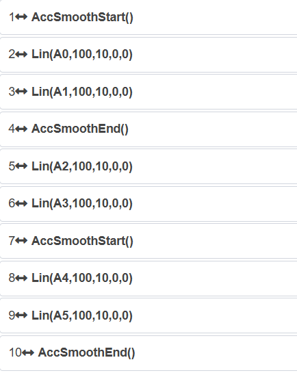

.. centered:: Abbildung 9.27-27 Typisches Programm für LIN-LIN-Blending mit Lua-Befehlen

Verwendung des Bewegungskonfigurationsschalters
"""""""""""""""""""""""""""""""""""""""""""""""

**Schritt 1**: Klicken Sie auf "Initiale Einstellungen" -> "Sicherheit" -> "Bewegungskonfiguration". Aktivieren Sie den Schalter "Beschleunigungsglättungsmodus".

.. image:: coding/317.png
   :width: 6in
   :align: center

.. centered:: Abbildung 9.27-28 Einstellung des Bewegungskonfigurationsschalters für den Beschleunigungsglättungsmodus

**Schritt 2**: Wählen Sie die Teachpunkte für die LIN-LIN-Funktion aus. In diesem Handbuch werden "A0" ~ "A5" als Namen der Teachpunkte verwendet.

**Schritt 3**: Klicken Sie auf "Teach-Programm" -> "Programmierung". Wählen Sie in den "Bewegungsbefehlen" den Befehl "Linie". Wählen Sie in der "Befehlsbearbeitung" den Teachpunkt aus und stellen Sie die Testgeschwindigkeit ein. Wählen Sie als Bewegungsschutz "Kein". Stellen Sie für die zu glättenden Punkte die Parameter "Übergangsradius" und "Übergangstyp" ein. Als Übergangstyp können "Eckpunktübergang" und "Innenkreisübergang" gewählt werden.

.. image:: coding/404.png
   :width: 6in
   :align: center

.. centered:: Abbildung 9.27-29 Blending-Befehlseinstellung für normalen LIN-Befehl

**Schritt 4**: Generieren Sie ein Lua-Programm und führen Sie es aus. Dadurch wird die Blending-Funktion für LIN-LIN realisiert. Das typische Programm ist identisch mit dem normalen LIN-LIN-Programm. Diese Methode verwendet die optimierte T-förmige Geschwindigkeitsbewegung für alle Befehle.

.. image:: coding/417.png
   :width: 4in
   :align: center

.. centered:: Abbildung 9.27-30 Typisches Programm für LIN-LIN-Blending unter Verwendung des Konfigurationsschalters

Blending von LIN-ARC
*********************

Verwendung von Lua-Befehlen
"""""""""""""""""""""""""""

**Schritt 1**: Wählen Sie die Teachpunkte für die LIN-ARC-Funktion aus. In diesem Handbuch werden "A0" ~ "A8" als Namen der Teachpunkte verwendet.

**Schritt 2**: Klicken Sie auf "Teach-Programm" -> "Programmierung". Wählen Sie in den "Bewegungsbefehlen" den Befehl "Linie". Wählen Sie in der "Befehlsbearbeitung" den Teachpunkt aus und stellen Sie die Testgeschwindigkeit ein. Wählen Sie als Bewegungsschutz den "Beschleunigungsglättungsmodus". Stellen Sie für die zu glättenden Punkte die Parameter "Übergangsradius" und "Übergangstyp" ein. Als Übergangstyp können "Eckpunktübergang" und "Innenkreisübergang" gewählt werden.

.. centered:: Abbildung 9.27-31 Blending-Befehlseinstellung für LIN-Befehl mit Beschleunigungsglättung

**Schritt 3**: Fügen Sie mehrere LIN- und ARC-Befehle hinzu, generieren Sie ein Lua-Programm und führen Sie es aus. Dadurch wird die Blending-Funktion für LIN-ARC realisiert. Diese Methode verwendet die optimierte T-förmige Geschwindigkeitsbewegung nur für Befehle zwischen AccSmoothStart() und AccSmoothEnd(), für die übrigen Befehle wird die ursprüngliche T-förmige Geschwindigkeitsbewegung verwendet.

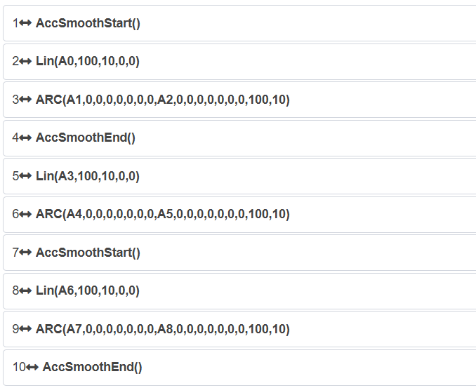

.. centered:: Abbildung 9.27-32 Typisches Programm für LIN-ARC-Blending mit Lua-Befehlen

Verwendung des Bewegungskonfigurationsschalters
"""""""""""""""""""""""""""""""""""""""""""""""

**Schritt 1**: Klicken Sie auf "Initiale Einstellungen" -> "Sicherheit" -> "Bewegungskonfiguration". Aktivieren Sie den Schalter "Beschleunigungsglättungsmodus".

.. image:: coding/317.png
   :width: 6in
   :align: center

.. centered:: Abbildung 9.27-33 Einstellung des Bewegungskonfigurationsschalters für den Beschleunigungsglättungsmodus

**Schritt 2**: Wählen Sie die Teachpunkte für die LIN-ARC-Funktion aus. In diesem Handbuch werden "A0" ~ "A8" als Namen der Teachpunkte verwendet.

**Schritt 3**: Klicken Sie auf "Teach-Programm" -> "Programmierung". Wählen Sie in den "Bewegungsbefehlen" den Befehl "Linie". Wählen Sie in der "Befehlsbearbeitung" den Teachpunkt aus und stellen Sie die Testgeschwindigkeit ein. Wählen Sie als Bewegungsschutz "Kein". Stellen Sie für die zu glättenden Punkte die Parameter "Übergangsradius" und "Übergangstyp" ein. Als Übergangstyp können "Eckpunktübergang" und "Innenkreisübergang" gewählt werden.

.. image:: coding/404.png
   :width: 6in
   :align: center

.. centered:: Abbildung 9.27-34 Blending-Befehlseinstellung für normalen LIN-Befehl

**Schritt 4**: Generieren Sie ein Lua-Programm und führen Sie es aus. Dadurch wird die Blending-Funktion für LIN-LIN realisiert. Das typische Programm ist identisch mit dem normalen LIN-LIN-Programm. Diese Methode verwendet die optimierte T-förmige Geschwindigkeitsbewegung für alle Befehle.

.. image:: coding/407.png
   :width: 4in
   :align: center

.. centered:: Abbildung 9.27-35 Typisches Programm für LIN-ARC-Blending unter Verwendung des Konfigurationsschalters

Blending von LIN-CIRCLE
************************

Verwendung von Lua-Befehlen
"""""""""""""""""""""""""""

**Schritt 1**: Wählen Sie die Teachpunkte für die LIN-CIRCLE-Funktion aus. In diesem Handbuch werden "A0" ~ "A8" als Namen der Teachpunkte verwendet.

**Schritt 2**: Klicken Sie auf "Teach-Programm" -> "Programmierung". Wählen Sie in den "Bewegungsbefehlen" den Befehl "Linie". Wählen Sie in der "Befehlsbearbeitung" den Teachpunkt aus und stellen Sie die Testgeschwindigkeit ein. Wählen Sie als Bewegungsschutz den "Beschleunigungsglättungsmodus". Stellen Sie für die zu glättenden Punkte die Parameter "Übergangsradius" und "Übergangstyp" ein. Als Übergangstyp können "Eckpunktübergang" und "Innenkreisübergang" gewählt werden.

.. centered:: Abbildung 9.27-36 Blending-Befehlseinstellung für LIN-Befehl mit Beschleunigungsglättung

**Schritt 3**: Fügen Sie mehrere LIN- und CIRCLE-Befehle hinzu, generieren Sie ein Lua-Programm und führen Sie es aus. Dadurch wird die Blending-Funktion für LIN-CIRCLE realisiert. Diese Methode verwendet die optimierte T-förmige Geschwindigkeitsbewegung nur für Befehle zwischen AccSmoothStart() und AccSmoothEnd(), für die übrigen Befehle wird die ursprüngliche T-förmige Geschwindigkeitsbewegung verwendet.

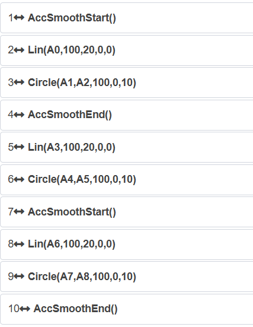

.. centered:: Abbildung 9.27-37 Typisches Programm für LIN-CIRCLE-Blending mit Lua-Befehlen

Verwendung des Bewegungskonfigurationsschalters
"""""""""""""""""""""""""""""""""""""""""""""""

**Schritt 1**: Klicken Sie auf "Initiale Einstellungen" -> "Sicherheit" -> "Bewegungskonfiguration". Aktivieren Sie den Schalter "Beschleunigungsglättungsmodus".

.. image:: coding/317.png
   :width: 6in
   :align: center

.. centered:: Abbildung 9.27-38 Einstellung des Bewegungskonfigurationsschalters für den Beschleunigungsglättungsmodus

**Schritt 2**: Wählen Sie die Teachpunkte für die LIN-CIRCLE-Funktion aus. In diesem Handbuch werden "A0" ~ "A8" als Namen der Teachpunkte verwendet.

**Schritt 3**: Klicken Sie auf "Teach-Programm" -> "Programmierung". Wählen Sie in den "Bewegungsbefehlen" den Befehl "Linie". Wählen Sie in der "Befehlsbearbeitung" den Teachpunkt aus und stellen Sie die Testgeschwindigkeit ein. Wählen Sie als Bewegungsschutz "Kein". Stellen Sie für die zu glättenden Punkte die Parameter "Übergangsradius" und "Übergangstyp" ein. Als Übergangstyp können "Eckpunktübergang" und "Innenkreisübergang" gewählt werden.

.. image:: coding/404.png
   :width: 6in
   :align: center

.. centered:: Abbildung 9.27-39 Blending-Befehlseinstellung für normalen LIN-Befehl

**Schritt 4**: Fügen Sie mehrere LIN- und CIRCLE-Befehle hinzu, generieren Sie ein Lua-Programm und führen Sie es aus. Dadurch wird die Blending-Funktion für LIN-CIRCLE realisiert. Das typische Programm ist identisch mit dem normalen LIN-ARC-Programm. Diese Methode verwendet die optimierte T-förmige Geschwindigkeitsbewegung für alle Befehle.

.. image:: coding/409.png
   :width: 4in
   :align: center

.. centered:: Abbildung 9.27-40 Typisches Programm für LIN-CIRCLE-Blending unter Verwendung des Konfigurationsschalters

Blending von ARC-PTP
*********************

Verwendung von Lua-Befehlen
"""""""""""""""""""""""""""

**Schritt 1**: Wählen Sie die Teachpunkte für die ARC-PTP-Funktion aus. In diesem Handbuch werden "A0" ~ "A9" als Namen der Teachpunkte verwendet.

**Schritt 2**: Klicken Sie auf "Teach-Programm" -> "Programmierung". Wählen Sie in den "Bewegungsbefehlen" den Befehl "Kreisbogen". Wählen Sie in der "Befehlsbearbeitung" den Teachpunkt aus und stellen Sie die Testgeschwindigkeit ein. Wählen Sie als Bewegungsschutz den "Beschleunigungsglättungsmodus". Stellen Sie für die zu glättenden Punkte den Parameter "Glättungsübergang" ein.

.. image:: coding/410.png
   :width: 6in
   :align: center

.. centered:: Abbildung 9.27-41 Blending-Befehlseinstellung für ARC-Befehl mit Beschleunigungsglättung

**Schritt 3**: Fügen Sie mehrere ARC- und PTP-Befehle hinzu, generieren Sie ein Lua-Programm und führen Sie es aus. Dadurch wird die Blending-Funktion für ARC-PTP realisiert. Diese Methode verwendet die optimierte T-förmige Geschwindigkeitsbewegung nur für Befehle zwischen AccSmoothStart() und AccSmoothEnd(), für die übrigen Befehle wird die ursprüngliche T-förmige Geschwindigkeitsbewegung verwendet.

.. image:: coding/411.png
   :width: 4in
   :align: center

.. centered:: Abbildung 9.27-42 Typisches Programm für ARC-PTP-Blending mit Lua-Befehlen

Verwendung des Bewegungskonfigurationsschalters
"""""""""""""""""""""""""""""""""""""""""""""""

**Schritt 1**: Klicken Sie auf "Initiale Einstellungen" -> "Sicherheit" -> "Bewegungskonfiguration". Aktivieren Sie den Schalter "Beschleunigungsglättungsmodus".

.. image:: coding/317.png
   :width: 6in
   :align: center

.. centered:: Abbildung 9.27-43 Einstellung des Bewegungskonfigurationsschalters für den Beschleunigungsglättungsmodus

**Schritt 2**: Wählen Sie die Teachpunkte für die ARC-PTP-Funktion aus. In diesem Handbuch werden "A0" ~ "A9" als Namen der Teachpunkte verwendet.

**Schritt 3**: Klicken Sie auf "Teach-Programm" -> "Programmierung". Wählen Sie in den "Bewegungsbefehlen" den Befehl "Kreisbogen". Wählen Sie in der "Befehlsbearbeitung" den Teachpunkt aus und stellen Sie die Testgeschwindigkeit ein. Wählen Sie als Bewegungsschutz "Kein". Stellen Sie für die zu glättenden Punkte den Parameter "Glättungsübergang" ein.

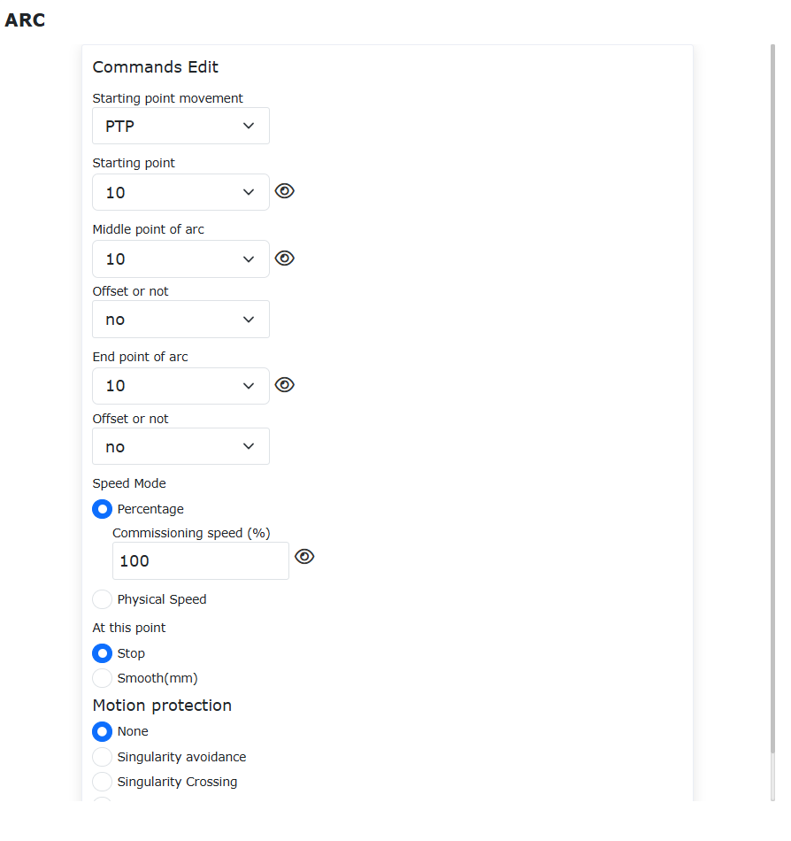

.. centered:: Abbildung 9.27-44 Blending-Befehlseinstellung für normalen ARC-Befehl

**Schritt 4**: Fügen Sie mehrere ARC- und PTP-Befehle hinzu, generieren Sie ein Lua-Programm und führen Sie es aus. Dadurch wird die Blending-Funktion für ARC-PTP realisiert. Das typische Programm ist identisch mit dem normalen ARC-PTP-Programm. Diese Methode verwendet die optimierte T-förmige Geschwindigkeitsbewegung für alle Befehle.

.. image:: coding/412.png
   :width: 4in
   :align: center

.. centered:: Abbildung 9.27-45 Typisches Programm für ARC-PTP-Blending unter Verwendung des Konfigurationsschalters

Blending von ARC-LIN
*********************

Verwendung von Lua-Befehlen
"""""""""""""""""""""""""""

**Schritt 1**: Wählen Sie die Teachpunkte für die ARC-LIN-Funktion aus. In diesem Handbuch werden "A0" ~ "A9" als Namen der Teachpunkte verwendet.

**Schritt 2**: Klicken Sie auf "Teach-Programm" -> "Programmierung". Wählen Sie in den "Bewegungsbefehlen" den Befehl "Kreisbogen". Wählen Sie in der "Befehlsbearbeitung" den Teachpunkt aus und stellen Sie die Testgeschwindigkeit ein. Wählen Sie als Bewegungsschutz den "Beschleunigungsglättungsmodus". Stellen Sie für die zu glättenden Punkte den Parameter "Glättungsübergang" ein.

.. image:: coding/410.png
   :width: 6in
   :align: center

.. centered:: Abbildung 9.27-46 Blending-Befehlseinstellung für ARC-Befehl mit Beschleunigungsglättung

**Schritt 3**: Fügen Sie mehrere ARC- und LIN-Befehle hinzu, generieren Sie ein Lua-Programm und führen Sie es aus. Dadurch wird die Blending-Funktion für ARC-LIN realisiert. Diese Methode verwendet die optimierte T-förmige Geschwindigkeitsbewegung nur für Befehle zwischen AccSmoothStart() und AccSmoothEnd(), für die übrigen Befehle wird die ursprüngliche T-förmige Geschwindigkeitsbewegung verwendet.

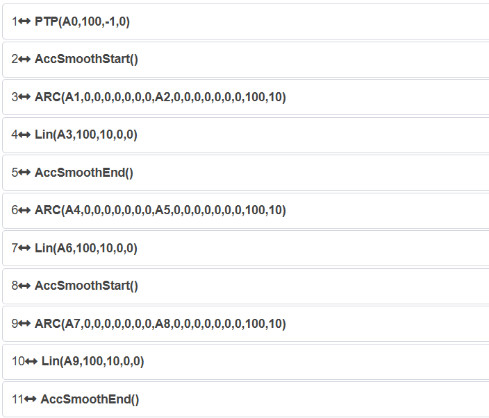

.. centered:: Abbildung 9.27-47 Typisches Programm für ARC-LIN-Blending mit Lua-Befehlen

Verwendung des Bewegungskonfigurationsschalters
"""""""""""""""""""""""""""""""""""""""""""""""

**Schritt 1**: Klicken Sie auf "Initiale Einstellungen" -> "Sicherheit" -> "Bewegungskonfiguration". Aktivieren Sie den Schalter "Beschleunigungsglättungsmodus".

.. image:: coding/317.png
   :width: 6in
   :align: center

.. centered:: Abbildung 9.27-48 Einstellung des Bewegungskonfigurationsschalters für den Beschleunigungsglättungsmodus

**Schritt 2**: Wählen Sie die Teachpunkte für die ARC-LIN-Funktion aus. In diesem Handbuch werden "A0" ~ "A9" als Namen der Teachpunkte verwendet.

**Schritt 3**: Klicken Sie auf "Teach-Programm" -> "Programmierung". Wählen Sie in den "Bewegungsbefehlen" den Befehl "Kreisbogen". Wählen Sie in der "Befehlsbearbeitung" den Teachpunkt aus und stellen Sie die Testgeschwindigkeit ein. Wählen Sie als Bewegungsschutz "Kein". Stellen Sie für die zu glättenden Punkte den Parameter "Glättungsübergang" ein.

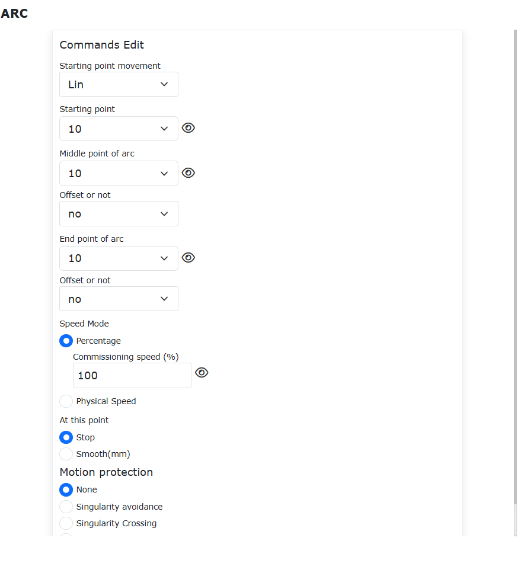

.. centered:: Abbildung 9.27-49 Blending-Befehlseinstellung für normalen ARC-Befehl

**Schritt 4**: Fügen Sie mehrere ARC- und LIN-Befehle hinzu, generieren Sie ein Lua-Programm und führen Sie es aus. Dadurch wird die Blending-Funktion für ARC-LIN realisiert. Das typische Programm ist identisch mit dem normalen ARC-LIN-Programm. Diese Methode verwendet die optimierte T-förmige Geschwindigkeitsbewegung für alle Befehle.

.. image:: coding/414.png
   :width: 4in
   :align: center

.. centered:: Abbildung 9.27-50 Typisches Programm für ARC-LIN-Blending unter Verwendung des Konfigurationsschalters

Blending von ARC-ARC
*********************

Verwendung von Lua-Befehlen
"""""""""""""""""""""""""""

**Schritt 1**: Wählen Sie die Teachpunkte für die ARC-ARC-Funktion aus. In diesem Handbuch werden "A0" ~ "A12" als Namen der Teachpunkte verwendet.

**Schritt 2**: Klicken Sie auf "Teach-Programm" -> "Programmierung". Wählen Sie in den "Bewegungsbefehlen" den Befehl "Kreisbogen". Wählen Sie in der "Befehlsbearbeitung" den Teachpunkt aus und stellen Sie die Testgeschwindigkeit ein. Wählen Sie als Bewegungsschutz den "Beschleunigungsglättungsmodus". Stellen Sie für die zu glättenden Punkte den Parameter "Glättungsübergang" ein.

.. image:: coding/410.png
   :width: 6in
   :align: center

.. centered:: Abbildung 9.27-51 Blending-Befehlseinstellung für ARC-Befehl mit Beschleunigungsglättung

**Schritt 3**: Fügen Sie mehrere ARC-Befehle hinzu, generieren Sie ein Lua-Programm und führen Sie es aus. Dadurch wird die Blending-Funktion für ARC-ARC realisiert. Diese Methode verwendet die optimierte T-förmige Geschwindigkeitsbewegung nur für Befehle zwischen AccSmoothStart() und AccSmoothEnd(), für die übrigen Befehle wird die ursprüngliche T-förmige Geschwindigkeitsbewegung verwendet.

.. image:: coding/420.png
   :width: 4in
   :align: center

.. centered:: Abbildung 9.27-52 Typisches Programm für ARC-ARC-Blending mit Lua-Befehlen

Verwendung des Bewegungskonfigurationsschalters
"""""""""""""""""""""""""""""""""""""""""""""""

**Schritt 1**: Klicken Sie auf "Initiale Einstellungen" -> "Sicherheit" -> "Bewegungskonfiguration". Aktivieren Sie den Schalter "Beschleunigungsglättungsmodus".

.. image:: coding/317.png
   :width: 6in
   :align: center

.. centered:: Abbildung 9.27-53 Einstellung des Bewegungskonfigurationsschalters für den Beschleunigungsglättungsmodus

**Schritt 2**: Wählen Sie die Teachpunkte für die ARC-ARC-Funktion aus. In diesem Handbuch werden "A0" ~ "A12" als Namen der Teachpunkte verwendet.

**Schritt 3**: Klicken Sie auf "Teach-Programm" -> "Programmierung". Wählen Sie in den "Bewegungsbefehlen" den Befehl "Kreisbogen". Wählen Sie in der "Befehlsbearbeitung" den Teachpunkt aus und stellen Sie die Testgeschwindigkeit ein. Wählen Sie als Bewegungsschutz "Kein". Stellen Sie für die zu glättenden Punkte den Parameter "Glättungsübergang" ein.

.. centered:: Abbildung 9.27-54 Blending-Befehlseinstellung für normalen ARC-Befehl

**Schritt 4**: Fügen Sie mehrere ARC-Befehle hinzu, generieren Sie ein Lua-Programm und führen Sie es aus. Dadurch wird die Blending-Funktion für ARC-ARC realisiert. Das typische Programm ist identisch mit dem normalen ARC-ARC-Programm. Diese Methode verwendet die optimierte T-förmige Geschwindigkeitsbewegung für alle Befehle.

.. image:: coding/421.png
   :width: 4in
   :align: center

.. centered:: Abbildung 9.27-55 Typisches Programm für ARC-ARC-Blending unter Verwendung des Konfigurationsschalters

Blending von ARC-CIRCLE
************************

Verwendung von Lua-Befehlen
"""""""""""""""""""""""""""

**Schritt 1**: Wählen Sie die Teachpunkte für die ARC-CIRCLE-Funktion aus. In diesem Handbuch werden "A0" ~ "A12" als Namen der Teachpunkte verwendet.

**Schritt 2**: Klicken Sie auf "Teach-Programm" -> "Programmierung". Wählen Sie in den "Bewegungsbefehlen" den Befehl "Kreisbogen". Wählen Sie in der "Befehlsbearbeitung" den Teachpunkt aus und stellen Sie die Testgeschwindigkeit ein. Wählen Sie als Bewegungsschutz den "Beschleunigungsglättungsmodus". Stellen Sie für die zu glättenden Punkte den Parameter "Glättungsübergang" ein.

.. image:: coding/410.png
   :width: 6in
   :align: center

.. centered:: Abbildung 9.27-56 Blending-Befehlseinstellung für ARC-Befehl mit Beschleunigungsglättung

**Schritt 3**: Fügen Sie mehrere ARC- und CIRCLE-Befehle hinzu, generieren Sie ein Lua-Programm und führen Sie es aus. Dadurch wird die Blending-Funktion für ARC-CIRCLE realisiert. Diese Methode verwendet die optimierte T-förmige Geschwindigkeitsbewegung nur für Befehle zwischen AccSmoothStart() und AccSmoothEnd(), für die übrigen Befehle wird die ursprüngliche T-förmige Geschwindigkeitsbewegung verwendet.

.. image:: coding/422.png
   :width: 4in
   :align: center

.. centered:: Abbildung 9.27-57 Typisches Programm für ARC-CIRCLE-Blending mit Lua-Befehlen

Verwendung des Bewegungskonfigurationsschalters
"""""""""""""""""""""""""""""""""""""""""""""""

**Schritt 1**: Klicken Sie auf "Initiale Einstellungen" -> "Sicherheit" -> "Bewegungskonfiguration". Aktivieren Sie den Schalter "Beschleunigungsglättungsmodus".

.. image:: coding/317.png
   :width: 6in
   :align: center

.. centered:: Abbildung 9.27-58 Einstellung des Bewegungskonfigurationsschalters für den Beschleunigungsglättungsmodus

**Schritt 2**: Wählen Sie die Teachpunkte für die ARC-CIRCLE-Funktion aus. In diesem Handbuch werden "A0" ~ "A12" als Namen der Teachpunkte verwendet.

**Schritt 3**: Klicken Sie auf "Teach-Programm" -> "Programmierung". Wählen Sie in den "Bewegungsbefehlen" den Befehl "Kreisbogen". Wählen Sie in der "Befehlsbearbeitung" den Teachpunkt aus und stellen Sie die Testgeschwindigkeit ein. Wählen Sie als Bewegungsschutz "Kein". Stellen Sie für die zu glättenden Punkte den Parameter "Glättungsübergang" ein.

.. centered:: Abbildung 9.27-59 Blending-Befehlseinstellung für normalen ARC-Befehl

**Schritt 4**: Fügen Sie mehrere ARC- und CIRCLE-Befehle hinzu, generieren Sie ein Lua-Programm und führen Sie es aus. Dadurch wird die Blending-Funktion für ARC-CIRCLE realisiert. Das typische Programm ist identisch mit dem normalen ARC-CIRCLE-Programm. Diese Methode verwendet die optimierte T-förmige Geschwindigkeitsbewegung für alle Befehle.

.. image:: coding/423.png
   :width: 4in
   :align: center

.. centered:: Abbildung 9.27-60 Typisches Programm für ARC-CIRCLE-Blending unter Verwendung des Konfigurationsschalters

Blending von CIRCLE-PTP
************************

Verwendung von Lua-Befehlen
"""""""""""""""""""""""""""

**Schritt 1**: Wählen Sie die Teachpunkte für die CIRCLE-PTP-Funktion aus. In diesem Handbuch werden "A0" ~ "A9" als Namen der Teachpunkte verwendet.

**Schritt 2**: Klicken Sie auf "Teach-Programm" -> "Programmierung". Wählen Sie in den "Bewegungsbefehlen" den Befehl "Kreis". Wählen Sie in der "Befehlsbearbeitung" den Teachpunkt aus und stellen Sie die Testgeschwindigkeit ein. Wählen Sie als Bewegungsschutz den "Beschleunigungsglättungsmodus". Stellen Sie für die zu glättenden Punkte den Parameter "Glättungsübergang" ein.

.. image:: coding/424.png
   :width: 6in
   :align: center

.. centered:: Abbildung 9.27-61 Blending-Befehlseinstellung für CIRCLE-Befehl mit Beschleunigungsglättung

**Schritt 3**: Fügen Sie mehrere CIRCLE- und PTP-Befehle hinzu, generieren Sie ein Lua-Programm und führen Sie es aus. Dadurch wird die Blending-Funktion für CIRCLE-PTP realisiert. Diese Methode verwendet die optimierte T-förmige Geschwindigkeitsbewegung nur für Befehle zwischen AccSmoothStart() und AccSmoothEnd(), für die übrigen Befehle wird die ursprüngliche T-förmige Geschwindigkeitsbewegung verwendet.

.. image:: coding/425.png
   :width: 4in
   :align: center

.. centered:: Abbildung 9.27-62 Typisches Programm für CIRCLE-PTP-Blending mit Lua-Befehlen

Verwendung des Bewegungskonfigurationsschalters
"""""""""""""""""""""""""""""""""""""""""""""""

**Schritt 1**: Klicken Sie auf "Initiale Einstellungen" -> "Sicherheit" -> "Bewegungskonfiguration". Aktivieren Sie den Schalter "Beschleunigungsglättungsmodus".

.. image:: coding/317.png
   :width: 6in
   :align: center

.. centered:: Abbildung 9.27-63 Einstellung des Bewegungskonfigurationsschalters für den Beschleunigungsglättungsmodus

**Schritt 2**: Wählen Sie die Teachpunkte für die CIRCLE-PTP-Funktion aus. In diesem Handbuch werden "A0" ~ "A9" als Namen der Teachpunkte verwendet.

**Schritt 3**: Klicken Sie auf "Teach-Programm" -> "Programmierung". Wählen Sie in den "Bewegungsbefehlen" den Befehl "Kreis". Wählen Sie in der "Befehlsbearbeitung" den Teachpunkt aus und stellen Sie die Testgeschwindigkeit ein. Wählen Sie als Bewegungsschutz "Kein". Stellen Sie für die zu glättenden Punkte den Parameter "Glättungsübergang" ein.

.. image:: coding/426.png
   :width: 6in
   :align: center

.. centered:: Abbildung 9.27-64 Blending-Befehlseinstellung für normalen CIRCLE-Befehl

**Schritt 4**: Fügen Sie mehrere CIRCLE- und PTP-Befehle hinzu, generieren Sie ein Lua-Programm und führen Sie es aus. Dadurch wird die Blending-Funktion für CIRCLE-PTP realisiert. Das typische Programm ist identisch mit dem normalen CIRCLE-PTP-Programm. Diese Methode verwendet die optimierte T-förmige Geschwindigkeitsbewegung für alle Befehle.

.. image:: coding/427.png
   :width: 4in
   :align: center

.. centered:: Abbildung 9.27-65 Typisches Programm für CIRCLE-PTP-Blending unter Verwendung des Konfigurationsschalters

Blending von CIRCLE-LIN
************************

Verwendung von Lua-Befehlen
"""""""""""""""""""""""""""

**Schritt 1**: Wählen Sie die Teachpunkte für die CIRCLE-LIN-Funktion aus. In diesem Handbuch werden "A0" ~ "A12" als Namen der Teachpunkte verwendet.

**Schritt 2**: Klicken Sie auf "Teach-Programm" -> "Programmierung". Wählen Sie in den "Bewegungsbefehlen" den Befehl "Kreis". Wählen Sie in der "Befehlsbearbeitung" den Teachpunkt aus und stellen Sie die Testgeschwindigkeit ein. Wählen Sie als Bewegungsschutz den "Beschleunigungsglättungsmodus". Stellen Sie für die zu glättenden Punkte den Parameter "Glättungsübergang" ein.

.. image:: coding/424.png
   :width: 6in
   :align: center

.. centered:: Abbildung 9.27-66 Blending-Befehlseinstellung für CIRCLE-Befehl mit Beschleunigungsglättung

**Schritt 3**: Fügen Sie mehrere CIRCLE- und LIN-Befehle hinzu, generieren Sie ein Lua-Programm und führen Sie es aus. Dadurch wird die Blending-Funktion für CIRCLE-LIN realisiert. Diese Methode verwendet die optimierte T-förmige Geschwindigkeitsbewegung nur für Befehle zwischen AccSmoothStart() und AccSmoothEnd(), für die übrigen Befehle wird die ursprüngliche T-förmige Geschwindigkeitsbewegung verwendet.

.. image:: coding/428.png
   :width: 4in
   :align: center

.. centered:: Abbildung 9.27-67 Typisches Programm für CIRCLE-LIN-Blending mit Lua-Befehlen

Verwendung des Bewegungskonfigurationsschalters
"""""""""""""""""""""""""""""""""""""""""""""""

**Schritt 1**: Klicken Sie auf "Initiale Einstellungen" -> "Sicherheit" -> "Bewegungskonfiguration". Aktivieren Sie den Schalter "Beschleunigungsglättungsmodus".

.. image:: coding/317.png
   :width: 6in
   :align: center

.. centered:: Abbildung 9.27-68 Einstellung des Bewegungskonfigurationsschalters für den Beschleunigungsglättungsmodus

**Schritt 2**: Wählen Sie die Teachpunkte für die CIRCLE-LIN-Funktion aus. In diesem Handbuch werden "A0" ~ "A12" als Namen der Teachpunkte verwendet.

**Schritt 3**: Klicken Sie auf "Teach-Programm" -> "Programmierung". Wählen Sie in den "Bewegungsbefehlen" den Befehl "Kreis". Wählen Sie in der "Befehlsbearbeitung" den Teachpunkt aus und stellen Sie die Testgeschwindigkeit ein. Wählen Sie als Bewegungsschutz "Kein". Stellen Sie für die zu glättenden Punkte den Parameter "Glättungsübergang" ein.

.. image:: coding/426.png
   :width: 6in
   :align: center

.. centered:: Abbildung 9.27-69 Blending-Befehlseinstellung für normalen CIRCLE-Befehl

**Schritt 4**: Fügen Sie mehrere CIRCLE- und LIN-Befehle hinzu, generieren Sie ein Lua-Programm und führen Sie es aus. Dadurch wird die Blending-Funktion für CIRCLE-LIN realisiert. Das typische Programm ist identisch mit dem normalen CIRCLE-LIN-Programm. Diese Methode verwendet die optimierte T-förmige Geschwindigkeitsbewegung für alle Befehle.

.. image:: coding/429.png
   :width: 4in
   :align: center

.. centered:: Abbildung 9.27-70 Typisches Programm für CIRCLE-LIN-Blending unter Verwendung des Konfigurationsschalters

Blending von CIRCLE-ARC
************************

Verwendung von Lua-Befehlen
"""""""""""""""""""""""""""

**Schritt 1**: Wählen Sie die Teachpunkte für die CIRCLE-ARC-Funktion aus. In diesem Handbuch werden "A0" ~ "A12" als Namen der Teachpunkte verwendet.

**Schritt 2**: Klicken Sie auf "Teach-Programm" -> "Programmierung". Wählen Sie in den "Bewegungsbefehlen" den Befehl "Kreis". Wählen Sie in der "Befehlsbearbeitung" den Teachpunkt aus und stellen Sie die Testgeschwindigkeit ein. Wählen Sie als Bewegungsschutz den "Beschleunigungsglättungsmodus". Stellen Sie für die zu glättenden Punkte den Parameter "Glättungsübergang" ein.

.. image:: coding/424.png
   :width: 6in
   :align: center

.. centered:: Abbildung 9.27-71 Blending-Befehlseinstellung für CIRCLE-Befehl mit Beschleunigungsglättung

**Schritt 3**: Fügen Sie mehrere CIRCLE- und ARC-Befehle hinzu, generieren Sie ein Lua-Programm und führen Sie es aus. Dadurch wird die Blending-Funktion für CIRCLE-ARC realisiert. Diese Methode verwendet die optimierte T-förmige Geschwindigkeitsbewegung nur für Befehle zwischen AccSmoothStart() und AccSmoothEnd(), für die übrigen Befehle wird die ursprüngliche T-förmige Geschwindigkeitsbewegung verwendet.

.. image:: coding/430.png
   :width: 4in
   :align: center

.. centered:: Abbildung 9.27-72 Typisches Programm für CIRCLE-ARC-Blending mit Lua-Befehlen

Verwendung des Bewegungskonfigurationsschalters
"""""""""""""""""""""""""""""""""""""""""""""""

**Schritt 1**: Klicken Sie auf "Initiale Einstellungen" -> "Sicherheit" -> "Bewegungskonfiguration". Aktivieren Sie den Schalter "Beschleunigungsglättungsmodus".

.. image:: coding/317.png
   :width: 6in
   :align: center

.. centered:: Abbildung 9.27-73 Einstellung des Bewegungskonfigurationsschalters für den Beschleunigungsglättungsmodus

**Schritt 2**: Wählen Sie die Teachpunkte für die CIRCLE-ARC-Funktion aus. In diesem Handbuch werden "A0" ~ "A12" als Namen der Teachpunkte verwendet.

**Schritt 3**: Klicken Sie auf "Teach-Programm" -> "Programmierung". Wählen Sie in den "Bewegungsbefehlen" den Befehl "Kreis". Wählen Sie in der "Befehlsbearbeitung" den Teachpunkt aus und stellen Sie die Testgeschwindigkeit ein. Wählen Sie als Bewegungsschutz "Kein". Stellen Sie für die zu glättenden Punkte den Parameter "Glättungsübergang" ein.

.. image:: coding/426.png
   :width: 6in
   :align: center

.. centered:: Abbildung 9.27-74 Blending-Befehlseinstellung für normalen CIRCLE-Befehl

**Schritt 4**: Fügen Sie mehrere CIRCLE- und ARC-Befehle hinzu, generieren Sie ein Lua-Programm und führen Sie es aus. Dadurch wird die Blending-Funktion für CIRCLE-ARC realisiert. Das typische Programm ist identisch mit dem normalen CIRCLE-ARC-Programm. Diese Methode verwendet die optimierte T-förmige Geschwindigkeitsbewegung für alle Befehle.

.. image:: coding/431.png
   :width: 4in
   :align: center

.. centered:: Abbildung 9.27-75 Typisches Programm für CIRCLE-ARC-Blending unter Verwendung des Konfigurationsschalters

Blending von CIRCLE-CIRCLE
***************************

Verwendung von Lua-Befehlen
"""""""""""""""""""""""""""

**Schritt 1**: Wählen Sie die Teachpunkte für die CIRCLE-CIRCLE-Funktion aus. In diesem Handbuch werden "A0" ~ "A12" als Namen der Teachpunkte verwendet.

**Schritt 2**: Klicken Sie auf "Teach-Programm" -> "Programmierung". Wählen Sie in den "Bewegungsbefehlen" den Befehl "Kreis". Wählen Sie in der "Befehlsbearbeitung" den Teachpunkt aus und stellen Sie die Testgeschwindigkeit ein. Wählen Sie als Bewegungsschutz den "Beschleunigungsglättungsmodus". Stellen Sie für die zu glättenden Punkte den Parameter "Glättungsübergang" ein.

.. image:: coding/424.png
   :width: 6in
   :align: center

.. centered:: Abbildung 9.27-76 Blending-Befehlseinstellung für CIRCLE-Befehl mit Beschleunigungsglättung

**Schritt 3**: Fügen Sie mehrere CIRCLE-Befehle hinzu, generieren Sie ein Lua-Programm und führen Sie es aus. Dadurch wird die Blending-Funktion für CIRCLE-CIRCLE realisiert. Diese Methode verwendet die optimierte T-förmige Geschwindigkeitsbewegung nur für Befehle zwischen AccSmoothStart() und AccSmoothEnd(), für die übrigen Befehle wird die ursprüngliche T-förmige Geschwindigkeitsbewegung verwendet.

.. image:: coding/432.png
   :width: 4in
   :align: center

.. centered:: Abbildung 9.27-77 Typisches Programm für CIRCLE-CIRCLE-Blending mit Lua-Befehlen

Verwendung des Bewegungskonfigurationsschalters
"""""""""""""""""""""""""""""""""""""""""""""""

**Schritt 1**: Klicken Sie auf "Initiale Einstellungen" -> "Sicherheit" -> "Bewegungskonfiguration". Aktivieren Sie den Schalter "Beschleunigungsglättungsmodus".

.. image:: coding/317.png
   :width: 6in
   :align: center

.. centered:: Abbildung 9.27-78 Einstellung des Bewegungskonfigurationsschalters für den Beschleunigungsglättungsmodus

**Schritt 2**: Wählen Sie die Teachpunkte für die CIRCLE-CIRCLE-Funktion aus. In diesem Handbuch werden "A0" ~ "A12" als Namen der Teachpunkte verwendet.

**Schritt 3**: Klicken Sie auf "Teach-Programm" -> "Programmierung". Wählen Sie in den "Bewegungsbefehlen" den Befehl "Kreis". Wählen Sie in der "Befehlsbearbeitung" den Teachpunkt aus und stellen Sie die Testgeschwindigkeit ein. Wählen Sie als Bewegungsschutz "Kein". Stellen Sie für die zu glättenden Punkte den Parameter "Glättungsübergang" ein.

.. image:: coding/426.png
   :width: 6in
   :align: center

.. centered:: Abbildung 9.27-79 Blending-Befehlseinstellung für normalen CIRCLE-Befehl

**Schritt 4**: Fügen Sie mehrere CIRCLE-Befehle hinzu, generieren Sie ein Lua-Programm und führen Sie es aus. Dadurch wird die Blending-Funktion für CIRCLE-CIRCLE realisiert. Das typische Programm ist identisch mit dem normalen CIRCLE-CIRCLE-Programm. Diese Methode verwendet die optimierte T-förmige Geschwindigkeitsbewegung für alle Befehle.

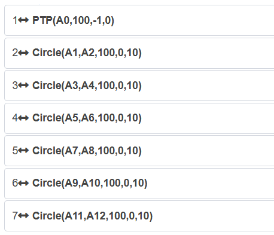

.. centered:: Abbildung 9.27-80 Typisches Programm für CIRCLE-CIRCLE-Blending unter Verwendung des Konfigurationsschalters

Blending bei asynchroner Bewegung der Erweiterungsachse
********************************************************

Verwendung von Lua-Befehlen
"""""""""""""""""""""""""""

**Schritt 1**: Wählen Sie die Teachpunkte für die Blending-Funktion bei asynchroner Bewegung der Erweiterungsachse aus. In diesem Handbuch werden "A0" ~ "A5" als Namen der Teachpunkte verwendet.

**Schritt 2**: Klicken Sie auf "Teach-Programm" -> "Programmierung". Wählen Sie in den "Peripheriebefehlen" den Befehl "Erweiterungsachse". Wählen Sie als "Bewegungsart" die Option "Asynchron". Wählen Sie den Teachpunkt aus und stellen Sie die Testgeschwindigkeit ein. Wählen Sie als Bewegungsschutz den "Beschleunigungsglättungsmodus". Stellen Sie für die zu glättenden Punkte den Parameter "Glättungsübergang" ein.

.. image:: coding/435.png
   :width: 6in
   :align: center

.. centered:: Abbildung 9.27-81 Blending-Befehlseinstellung für asynchrone Bewegung der Erweiterungsachse

**Schritt 3**: Fügen Sie Bewegungsbefehle hinzu, generieren Sie ein Lua-Programm und führen Sie es aus. Dadurch wird die Blending-Funktion für die asynchrone Bewegung der Erweiterungsachse realisiert. Diese Methode verwendet die S-förmige Geschwindigkeitsplanung und Blending nur für Befehle zwischen AccSmoothStart() und AccSmoothEnd(), für die übrigen Befehle wird die T-förmige Geschwindigkeitsplanung verwendet.

.. image:: coding/436.png
   :width: 4in
   :align: center

.. centered:: Abbildung 9.27-82 Typisches Programm für Blending bei asynchroner Bewegung der Erweiterungsachse mit Lua-Befehlen

Verwendung des Bewegungskonfigurationsschalters
"""""""""""""""""""""""""""""""""""""""""""""""

**Schritt 1**: Klicken Sie auf "Initiale Einstellungen" -> "Sicherheit" -> "Bewegungskonfiguration". Aktivieren Sie den Schalter "Beschleunigungsglättungsmodus".

.. image:: coding/317.png
   :width: 6in
   :align: center

.. centered:: Abbildung 9.27-83 Einstellung des Bewegungskonfigurationsschalters für den Beschleunigungsglättungsmodus

**Schritt 2**: Wählen Sie die Teachpunkte für die Blending-Funktion bei asynchroner Bewegung der Erweiterungsachse aus. In diesem Handbuch werden "A0" ~ "A5" als Namen der Teachpunkte verwendet.

**Schritt 3**: Klicken Sie auf "Teach-Programm" -> "Programmierung". Wählen Sie in den "Peripheriebefehlen" den Befehl "Erweiterungsachse". Wählen Sie als "Bewegungsart" die Option "Asynchron". Wählen Sie den Teachpunkt aus und stellen Sie die Testgeschwindigkeit ein. Wählen Sie als Bewegungsschutz "Kein". Stellen Sie für die zu glättenden Punkte den Parameter "Glättungsübergang" ein.

.. image:: coding/437.png
   :width: 6in
   :align: center

.. centered:: Abbildung 9.27-84 Blending-Befehlseinstellung für normale asynchrone Bewegung der Erweiterungsachse

**Schritt 4**: Fügen Sie mehrere Bewegungsbefehle hinzu, generieren Sie ein Lua-Programm und führen Sie es aus. Dadurch wird die Blending-Funktion für die asynchrone Bewegung der Erweiterungsachse realisiert. Das typische Programm ist identisch mit dem normalen Programm für die Erweiterungsachsenbewegung. Diese Methode verwendet für alle Befehle die S-förmige Geschwindigkeitsplanung und Blending-Bewegung.

.. image:: coding/438.png
   :width: 4in
   :align: center

.. centered:: Abbildung 9.27-85 Typisches Programm für Blending bei asynchroner Bewegung der Erweiterungsachse unter Verwendung des Konfigurationsschalters

Blending bei synchroner Bewegung der Erweiterungsachse
*******************************************************

Verwendung von Lua-Befehlen
"""""""""""""""""""""""""""

**Schritt 1**: Wählen Sie die Teachpunkte für die Blending-Funktion bei synchroner Bewegung der Erweiterungsachse aus. In diesem Handbuch werden "A0" ~ "A5" als Namen der Teachpunkte verwendet.

**Schritt 2**: Klicken Sie auf "Teach-Programm" -> "Programmierung". Wählen Sie in den "Peripheriebefehlen" den Befehl "Erweiterungsachse". Wählen Sie als "Bewegungsart" die Option "Synchron". Wählen Sie den Teachpunkt aus und stellen Sie die Testgeschwindigkeit ein. Wählen Sie als Bewegungsschutz den "Beschleunigungsglättungsmodus". Stellen Sie für die zu glättenden Punkte den Parameter "Glättungsübergang" ein.

.. image:: coding/439.png
   :width: 6in
   :align: center

.. centered:: Abbildung 9.27-86 Blending-Befehlseinstellung für synchrone Bewegung der Erweiterungsachse

**Schritt 3**: Fügen Sie Bewegungsbefehle hinzu, generieren Sie ein Lua-Programm und führen Sie es aus. Dadurch wird die Blending-Funktion für die synchrone Bewegung der Erweiterungsachse realisiert. Diese Methode verwendet die S-förmige Geschwindigkeitsplanung und Blending nur für Befehle zwischen AccSmoothStart() und AccSmoothEnd(), für die übrigen Befehle wird die T-förmige Geschwindigkeitsplanung verwendet.

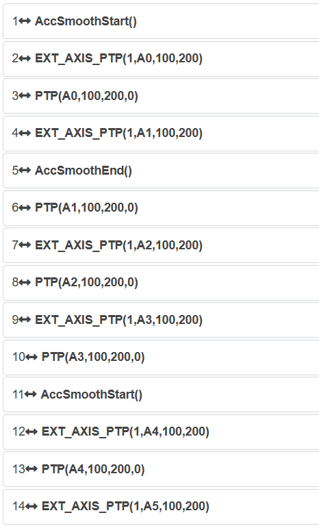

.. centered:: Abbildung 9.27-87 Typisches Programm für Blending bei synchroner Bewegung der Erweiterungsachse mit Lua-Befehlen

Verwendung des Bewegungskonfigurationsschalters
"""""""""""""""""""""""""""""""""""""""""""""""

**Schritt 1**: Klicken Sie auf "Initiale Einstellungen" -> "Sicherheit" -> "Bewegungskonfiguration". Aktivieren Sie den Schalter "Beschleunigungsglättungsmodus".

.. image:: coding/317.png
   :width: 6in
   :align: center

.. centered:: Abbildung 9.27-88 Einstellung des Bewegungskonfigurationsschalters für den Beschleunigungsglättungsmodus

**Schritt 2**: Wählen Sie die Teachpunkte für die Blending-Funktion bei synchroner Bewegung der Erweiterungsachse aus. In diesem Handbuch werden "A0" ~ "A5" als Namen der Teachpunkte verwendet.

**Schritt 3**: Klicken Sie auf "Teach-Programm" -> "Programmierung". Wählen Sie in den "Peripheriebefehlen" den Befehl "Erweiterungsachse". Wählen Sie als "Bewegungsart" die Option "Synchron". Wählen Sie den Teachpunkt aus und stellen Sie die Testgeschwindigkeit ein. Wählen Sie als Bewegungsschutz "Kein". Stellen Sie für die zu glättenden Punkte den Parameter "Glättungsübergang" ein.

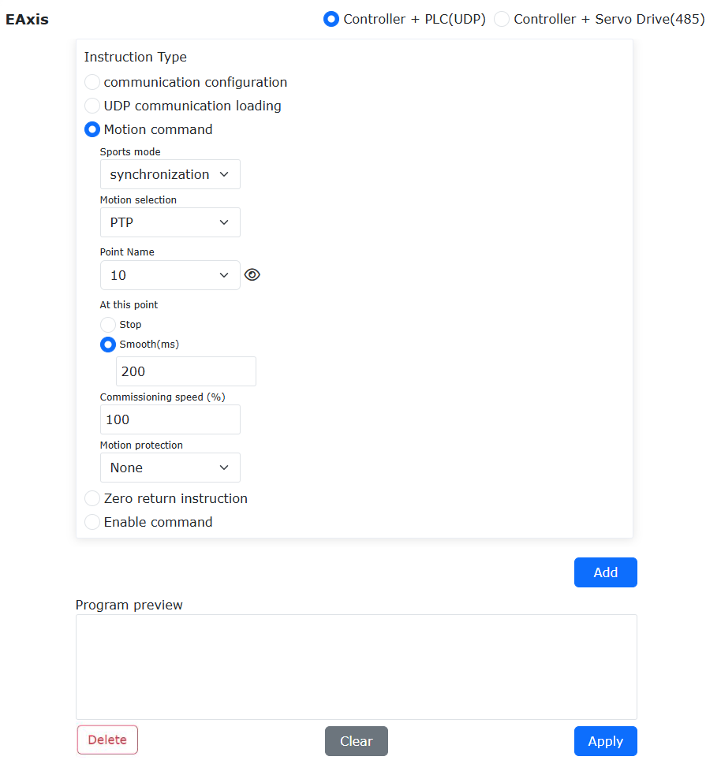

.. centered:: Abbildung 9.27-89 Blending-Befehlseinstellung für normale synchrone Bewegung der Erweiterungsachse

**Schritt 4**: Fügen Sie mehrere Bewegungsbefehle hinzu, generieren Sie ein Lua-Programm und führen Sie es aus. Dadurch wird die Blending-Funktion für die synchrone Bewegung der Erweiterungsachse realisiert. Das typische Programm ist identisch mit dem normalen Programm für die Erweiterungsachsenbewegung. Diese Methode verwendet für alle Befehle die S-förmige Geschwindigkeitsplanung und Blending-Bewegung.

.. image:: coding/442.png
   :width: 4in
   :align: center

.. centered:: Abbildung 9.27-90 Typisches Programm für Blending bei synchroner Bewegung der Erweiterungsachse unter Verwendung des Konfigurationsschalters

Funktion des Pendel-Seitenneigungswinkels
~~~~~~~~~~~~~~~~~~~~~~~~~~~~~~~~~~~~~~~~~

Übersicht
+++++++++

Die Funktion des Pendel-Seitenneigungswinkels des Roboters ermöglicht es, während der Pendelbewegung des Endeffektor-Werkzeugs einen benutzerdefinierten Pendelwinkel um die Rx-Richtung des Pendelkoordinatensystems einzustellen. Dies dient dazu, bei Überlappungsschweißungen und ähnlichen Prozessen die Unterschiede in der Kontaktlänge zwischen der Kehlnaht und den zu verbindenden Materialien auf beiden Seiten zu verringern.

Ablauf
++++++

Klicken Sie auf der Web-Steueroberfläche des Roboters nacheinander auf "Teach-Programm" -> "Programmbearbeitung", um zur "Bewegungsbefehls"-Oberfläche zu gelangen, wie unten gezeigt.

.. image:: coding/320.png
   :width: 4in
   :align: center

.. centered:: Abbildung 9.28-1 Bewegungsbefehls-Oberfläche

Klicken Sie auf der "Bewegungsbefehls"-Oberfläche auf "Pendeln", um die "Weave"-Befehlsbearbeitungsoberfläche zu öffnen.

.. image:: coding/321.png
   :width: 6in
   :align: center

.. centered:: Abbildung 9.28-2 Weave-Befehlsbearbeitungsoberfläche

Klicken Sie auf der "Weave"-Befehlsbearbeitungsoberfläche auf das Dropdown-Menü "Nummer wählen", um verschiedene Pendelparameterkonfigurationen auszuwählen. Klicken Sie auf die Schaltfläche rechts neben dem Dropdown-Menü "Nummer wählen", um die Pendelparameterkonfiguration unter dieser Nummer zu ändern.

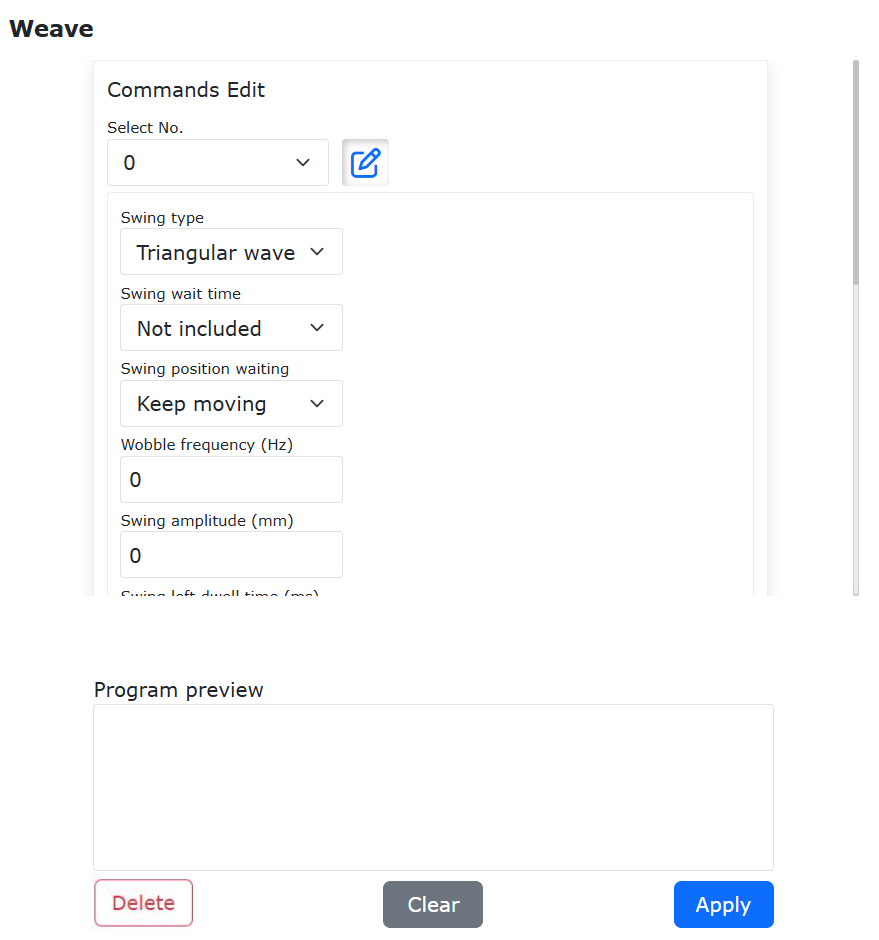

.. centered:: Abbildung 9.28-3 Pendelparameterkonfiguration

Im Bereich "Seitenneigungswinkel der Pendelrichtung" der Pendelparameterkonfiguration können Sie einen benutzerdefinierten Rotationswinkel um die Rx-Richtung des Pendelkoordinatensystems eingeben. Klicken Sie auf "Konfigurieren", um die Pendelparameterkonfiguration abzuschließen.

.. note:: Bitte beachten Sie, dass der Parameter "Seitenneigungswinkel der Pendelrichtung" für die "Pendeltypen" "Dreieckwelle pendeln", "Sinuswelle pendeln", "Kreisförmiges Pendeln - im Uhrzeigersinn" und "Kreisförmiges Pendeln - gegen den Uhrzeigersinn" geeignet ist.

Im Folgenden wird am Beispiel einer Lin-Bewegung die Realisierung der Pendel-Seitenneigungswinkelfunktion gezeigt:

**Schritt 1**: Wählen Sie auf der "Weave"-Befehlsbearbeitungsoberfläche im Dropdown-Menü "Nummer wählen" die Konfigurationsnummer mit den bereits konfigurierten Parametern für den Seitenneigungswinkel aus. Klicken Sie im Bereich "Befehlstyp" auf "Pendeln starten" und dann auf "Hinzufügen", um die Pendelfunktion zu aktivieren.

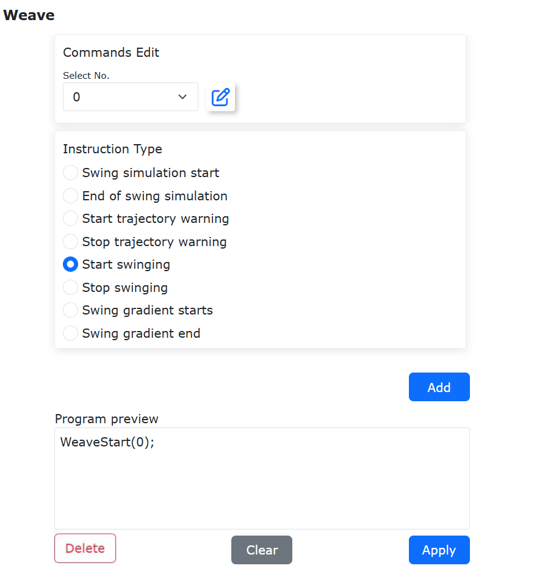

.. centered:: Abbildung 9.28-4 Hinzufügen von "Pendeln starten"

**Schritt 2**: Klicken Sie auf der "Bewegungsbefehls"-Oberfläche auf "Linie", um eine Lin-Bewegung zu erstellen. Dieser Schritt ist ein grundlegender Bewegungsbefehl und wird nicht näher erläutert.

**Schritt 3**: Klicken Sie auf der "Weave"-Befehlsbearbeitungsoberfläche im Bereich "Befehlstyp" auf "Pendeln beenden" und dann auf "Hinzufügen", um die Pendelfunktion zu deaktivieren.

.. image:: coding/324.png
   :width: 6in
   :align: center

.. centered:: Abbildung 9.28-5 Hinzufügen von "Pendeln beenden"

**Schritt 4**: Überprüfen Sie nach Abschluss der Schritte 1~3 im Bereich "Programmvorschau" der "Weave"-Befehlsbearbeitungsoberfläche, ob die Schritte 1~3 korrekt eingestellt wurden.

.. image:: coding/325.png
   :width: 6in
   :align: center

.. centered:: Abbildung 9.28-6 Pendelprogrammvorschau

**Schritt 5**: Nachdem Sie die Programmeinstellungen im Bereich "Programmvorschau" überprüft haben, klicken Sie auf "Übernehmen". Es wird automatisch ein ausführbares LUA-Programm generiert.

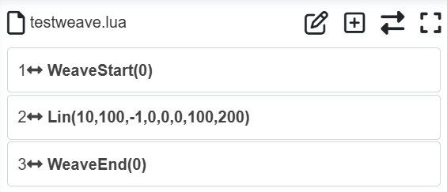

.. centered:: Abbildung 9.28-7 Typisches LUA-Pendelbewegungsprogramm

Funktion für allmähliche Änderung von Schweißparametern (Strom, Spannung, Vorschubgeschwindigkeit entlang der Schweißnaht)
~~~~~~~~~~~~~~~~~~~~~~~~~~~~~~~~~~~~~~~~~~~~~~~~~~~~~~~~~~~~~~~~~~~~~~~~~~~~~~~~~~~~~~~~~~~~~~~~~~~~~~~~~~~~~~~~~~~~~~~~~~~~~~~~~

Übersicht
+++++++++

Die Funktion für die allmähliche Änderung von Schweißparametern (Strom, Spannung und Vorschubgeschwindigkeit entlang der Schweißnaht) ermöglicht die benutzerdefinierte Festlegung des Änderungsbereichs der Schweißparameter während des Schweißprozesses.

Ablauf für die allmähliche Änderung von Strom- und Spannungsparametern
++++++++++++++++++++++++++++++++++++++++++++++++++++++++++++++++++++++

Allmähliche Änderung des Stromparameters
*****************************************

Klicken Sie auf der Web-Steueroberfläche des Roboters nacheinander auf "Teach-Programm" -> "Programmierung", um zur "Schweißbefehls"-Oberfläche zu gelangen, wie unten gezeigt.

.. image:: coding/327.png
   :width: 4in
   :align: center

.. centered:: Abbildung 9.29-1 Schweißbefehls-Oberfläche

Klicken Sie auf der "Schweißbefehls"-Oberfläche auf "Schweißen", um die "Weld"-Befehlskonfigurationsoberfläche zu öffnen.

.. image:: coding/328.png
   :width: 4in
   :align: center

.. centered:: Abbildung 9.29-2 Weld-Befehlskonfigurationsoberfläche

Klicken Sie im Bereich "Befehlstyp" der "Weld"-Befehlskonfigurationsoberflächen auf "Schweißstrom-Änderung starten". Konfigurieren Sie die Parameter "Startstrom", "Endstrom", "Schweißstromregelung AO" und "Glättungsauswahl".

Konfigurieren Sie beispielsweise "Startstrom" auf 260 A, "Endstrom" auf 220 A, "Schweißstromregelung AO" auf "Ctrl-AO0" (Steuerpult-Analogkanal) und "Glättungsauswahl" auf "Break". Klicken Sie auf "Hinzufügen". Die Konfiguration ist damit abgeschlossen. Überprüfen Sie im Bereich "Programmvorschau", ob die Befehlsparameter fehlerhaft konfiguriert sind.

.. image:: coding/329.png
   :width: 4in
   :align: center

.. centered:: Abbildung 9.29-3 Befehlsparameter für Schweißstrom-Änderung starten

Klicken Sie im Bereich "Befehlstyp" der "Weld"-Befehlskonfigurationsoberflächen auf "Schweißstrom-Änderung beenden". Es müssen keine Parameter konfiguriert werden. Klicken Sie auf "Hinzufügen". Die Konfiguration ist damit abgeschlossen. Überprüfen Sie im Bereich "Programmvorschau", ob die Befehlsparameter fehlerhaft konfiguriert sind.

.. image:: coding/330.png
   :width: 4in
   :align: center

.. centered:: Abbildung 9.29-4 Befehlsparameter für Schweißstrom-Änderung beenden

Nachdem Sie die Parameter für die Befehle "Schweißstrom-Änderung starten" und "Schweißstrom-Änderung beenden" konfiguriert haben, klicken Sie auf "Übernehmen". Es wird automatisch ein ausführbares LUA-Programm generiert.

.. note:: Während der Konfiguration der Parameter für die Befehle "Schweißstrom-Änderung starten" und "Schweißstrom-Änderung beenden" müssen Bewegungsbefehle konfiguriert werden. Als Beispiel dient ein typisches LUA-Programm für eine Lichtbogen-Tracking-Bewegung in Kombination mit einer allmählichen Änderung des Stromparameters.

.. image:: coding/331.png
   :width: 4in
   :align: center

.. centered:: Abbildung 9.29-5 Ein typisches LUA-Programm für Lichtbogen-Tracking mit allmählicher Änderung des Stromparameters

Allmähliche Änderung des Spannungsparameters
********************************************

Klicken Sie im Bereich "Befehlstyp" der "Weld"-Befehlskonfigurationsoberflächen auf "Schweißspannungs-Änderung starten". Konfigurieren Sie die Parameter "Startspannung", "Endspannung", "Schweißspannungsregelung AO" und "Glättungsauswahl".

Konfigurieren Sie beispielsweise "Startspannung" auf 25 V, "Endspannung" auf 22 V, "Schweißspannungsregelung AO" auf "Ctrl-AO1" (Steuerpult-Analogkanal) und "Glättungsauswahl" auf "Break". Klicken Sie auf "Hinzufügen". Die Konfiguration ist damit abgeschlossen. Überprüfen Sie im Bereich "Programmvorschau", ob die Befehlsparameter fehlerhaft konfiguriert sind, wie unten gezeigt.

.. image:: coding/332.png
   :width: 4in
   :align: center

.. centered:: Abbildung 9.29-6 Befehlsparameter für Schweißspannungs-Änderung starten

Klicken Sie im Bereich "Befehlstyp" der "Weld"-Befehlskonfigurationsoberflächen auf "Schweißspannungs-Änderung beenden". Es müssen keine Parameter konfiguriert werden. Klicken Sie auf "Hinzufügen". Die Konfiguration ist damit abgeschlossen. Überprüfen Sie im Bereich "Programmvorschau", ob die Befehlsparameter fehlerhaft konfiguriert sind.

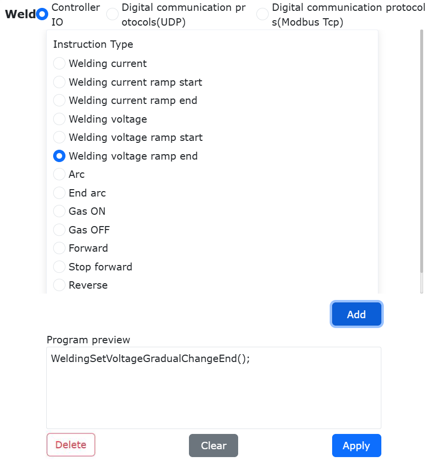

.. centered:: Abbildung 9.29-7 Befehlsparameter für Schweißspannungs-Änderung beenden

Nachdem Sie die Parameter für die Befehle "Schweißspannungs-Änderung starten" und "Schweißspannungs-Änderung beenden" konfiguriert haben, klicken Sie auf "Übernehmen". Es wird automatisch ein ausführbares LUA-Programm generiert.

.. image:: coding/334.png
   :width: 4in
   :align: center

.. centered:: Abbildung 9.29-8 Ein typisches LUA-Programm für Lichtbogen-Tracking mit allmählicher Änderung des Spannungsparameters

Ablauf für die allmähliche Änderung des Vorschubgeschwindigkeitsparameters
++++++++++++++++++++++++++++++++++++++++++++++++++++++++++++++++++++++++++

Klicken Sie auf der Web-Steueroberfläche des Roboters nacheinander auf "Teach-Programm" -> "Programmierung", um zur "Bewegungsbefehls"-Oberfläche zu gelangen.

.. image:: coding/335.png
   :width: 3in
   :align: center

.. centered:: Abbildung 9.29-9 Bewegungsbefehls-Oberfläche

Klicken Sie auf der "Bewegungsbefehls"-Oberfläche auf "Pendeln", um die "Weave"-Befehlskonfigurationsoberfläche zu öffnen.

.. image:: coding/336.png
   :width: 4in
   :align: center

.. centered:: Abbildung 9.29-10 Weave-Befehlskonfigurationsoberfläche

Klicken Sie im Bereich "Befehlstyp" der "Weave"-Befehlskonfigurationsoberflächen auf "Pendel-Änderung starten". Konfigurieren Sie die Parameter "Startgeschwindigkeit", "Endgeschwindigkeit" und "Änderungsmodus".

Konfigurieren Sie beispielsweise "Änderungsmodus" auf "Pendel + Vorschubgeschwindigkeit", "Startgeschwindigkeit" auf 24 cm/min und "Endgeschwindigkeit" auf 30 cm/min. Klicken Sie auf "Hinzufügen". Die Konfiguration ist damit abgeschlossen. Überprüfen Sie im Bereich "Programmvorschau", ob die Befehlsparameter fehlerhaft konfiguriert sind.

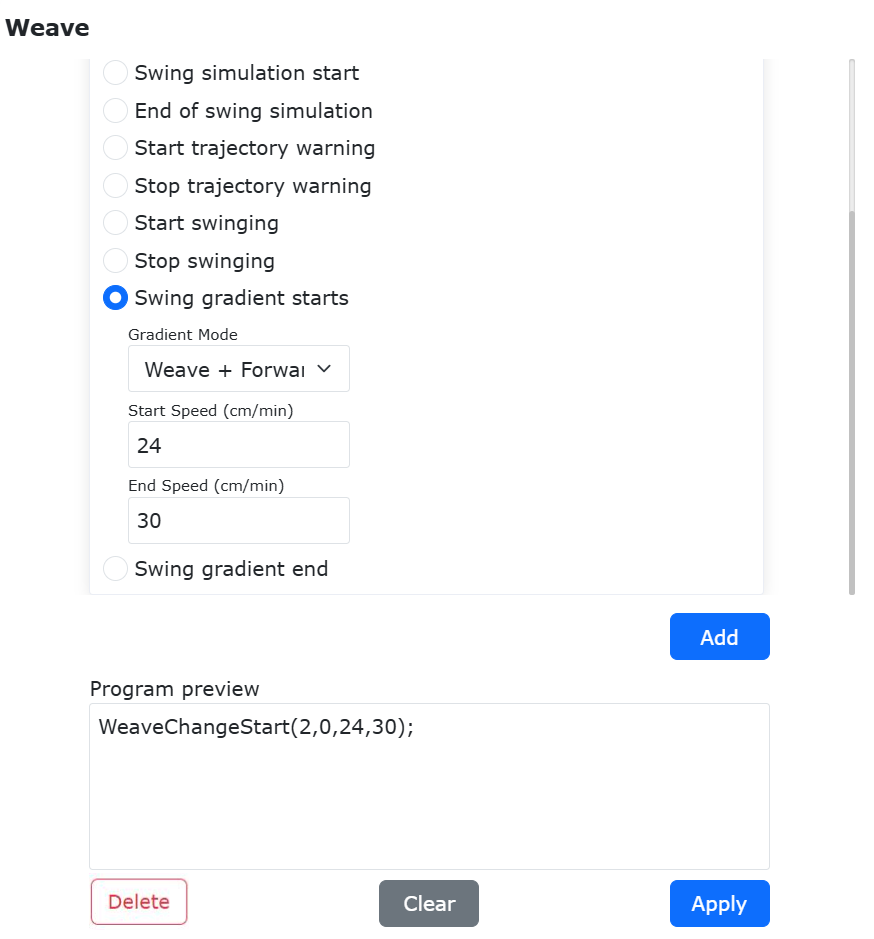

.. centered:: Abbildung 9.29-11 Befehlsparameter für Pendel + Vorschubgeschwindigkeit Änderung starten

Klicken Sie im Bereich "Befehlstyp" der "Weave"-Befehlskonfigurationsoberflächen auf "Pendel-Änderung beenden". Es müssen keine Parameter konfiguriert werden. Klicken Sie auf "Hinzufügen". Die Konfiguration ist damit abgeschlossen. Überprüfen Sie im Bereich "Programmvorschau", ob die Befehlsparameter fehlerhaft konfiguriert sind.

.. image:: coding/338.png
   :width: 4in
   :align: center

.. centered:: Abbildung 9.29-12 Befehlsparameter für Pendel + Vorschubgeschwindigkeit Änderung beenden

Nachdem Sie die Parameter für die Befehle "Pendel-Änderung starten" und "Pendel-Änderung beenden" konfiguriert haben, klicken Sie auf "Übernehmen". Es wird automatisch ein ausführbares LUA-Programm generiert.

.. note:: Während der Konfiguration der Parameter für die Befehle "Pendel-Änderung starten" und "Pendel-Änderung beenden" müssen Bewegungsbefehle konfiguriert werden. Als Beispiel dient ein typisches LUA-Programm für eine Lichtbogen-Tracking-Bewegung in Kombination mit einer allmählichen Änderung des Vorschubgeschwindigkeitsparameters.

.. image:: coding/339.png
   :width: 4in
   :align: center

.. centered:: Abbildung 9.29-13 Ein typisches LUA-Programm für Lichtbogen-Tracking mit allmählicher Änderung des Vorschubgeschwindigkeitsparameters

.. note:: Bei der Konfiguration der Parameter für die allmähliche Änderung von Schweißparametern auf der "Weld"-Befehlskonfigurationsoberfläche und der "Weave"-Befehlskonfigurationsoberfläche muss zunächst die Kommunikationsmethode zwischen Steuerpult und Schweißgerät festgelegt werden. Für analoge und digitale Kommunikation klicken Sie bitte auf "Controller I/O" bzw. "Digitales Kommunikationsprotokoll".

Funktion für graduelle Änderung der Verweilzeit beim Pendeln
+++++++++++++++++++++++++++++++++++++++++++++++++++++++++++++++++++++++++++

Überblick
***********************************

Für das Pendeln mit Dreieckswellen, vertikalen L-förmigen Dreieckswellen, Sinuswellen und vertikalen L-förmigen Sinuswellen, bei denen die Pendelamplitude und die Verweilzeit zu Beginn und am Ende des Pendelvorgangs nicht übereinstimmen, ändert diese Funktion die Pendelamplitude und die Verweilzeit allmählich vom Startwert zum Endwert.

Für das Pendeln mit Dreieckswellen und Sinuswellen, bei denen die Pendelamplitude, die Verweilzeit und die Vorschubgeschwindigkeit zu Beginn und am Ende des Pendelvorgangs nicht übereinstimmen, ändert diese Funktion die Pendelamplitude, die Verweilzeit und die Vorschubgeschwindigkeit allmählich vom Startwert zum Endwert.

Ablauf
***********************************

**Schritt 1**: Einstellung der Pendelparameter. Klicken Sie auf "Teach-Programm" - "Programmierung" - "Pendeln" und wählen Sie die anfängliche Pendelnummer und stellen Sie die Pendelparameter ein. Wählen Sie dann die End-Pendelnummer und stellen Sie die Pendelparameter ein. Beachten Sie: Nur die Pendelamplitude, die linke Verweilzeit und die rechte Verweilzeit können zwischen den anfänglichen und endgültigen Pendelparametern unterschiedlich sein; alle anderen Parameter müssen übereinstimmen.
   
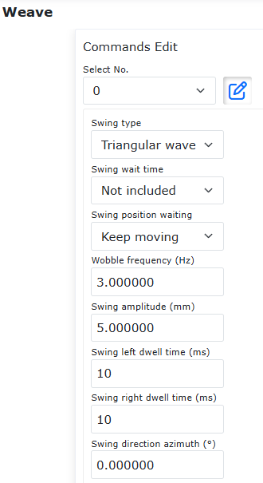

.. centered:: Abbildung 9.29-14 Einstellung der Pendelparameter

**Schritt 2**: Einstellung des Gradientenmodus. Klicken Sie auf "Pendelgradient Start", um den entsprechenden Gradientenmodus einzustellen: Für Dreieckswellen-, vertikale L-förmige Dreieckswellen-, Sinuswellen- und vertikale L-förmige Sinuswellenpendel kann der Gradientenmodus auf "Pendeln" eingestellt werden; Für Dreieckswellen- und Sinuswellenpendel kann der Gradientenmodus auch auf "Pendeln + Vorschubgeschwindigkeit" eingestellt werden, und es müssen zusätzlich die Start- und Endgeschwindigkeiten beim Pendeln eingestellt werden.
   
.. image:: coding/546.png
   :width: 4in
   :align: center

.. centered:: Abbildung 9.29-15 Einstellung des Gradientenmodus "Pendeln"
   
.. image:: coding/547.png
   :width: 4in
   :align: center

.. centered:: Abbildung 9.29-16 Einstellung des Gradientenmodus "Pendeln + Vorschubgeschwindigkeit"

**Schritt 3**: Erstellung des Pendelgradientenprogramms. Klicken Sie auf "Pendeln starten", wählen Sie die Start-Pendelnummer und fügen Sie sie hinzu. Klicken Sie dann auf "Pendelgradient Start", stellen Sie die End-Pendelnummer und den Gradientenmodus ein und fügen Sie sie hinzu. Klicken Sie nacheinander auf "Pendelgradient Ende" und "Pendeln stoppen" und fügen Sie sie hinzu. Fügen Sie schließlich manuell die Position des Pendelstartpunkts und des Endpunkts im Lua-Programm hinzu, um ein typisches Lua-Programm zu generieren.
   
.. image:: coding/548.png
   :width: 4in
   :align: center

.. centered:: Abbildung 9.29-17 Typisches Programm für graduelle Änderung der Verweilzeit beim Pendeln

Funktion für stationäres Pendeln
+++++++++++++++++++++++++++++++++++++++++++++++++++++++

Überblick
***********************************

Für das Pendeln mit Dreieckswellen, vertikalen L-förmigen Dreieckswellen, kreisförmigem Pendeln - im Uhrzeigersinn, kreisförmigem Pendeln - gegen den Uhrzeigersinn, Sinuswellen, vertikalen L-förmigen Sinuswellen und vertikalen Schweiß-Dreieckspendeln wird eine Funktion für stationäres Pendeln hinzugefügt: Der Roboterendeffektor führt nur Pendelbewegungen ohne Vorwärtsbewegung aus. Hinweis: Diese Funktion erfordert, dass zuerst die Werkzeugmittelpunkt-Koordinate (TCP) kalibriert wird.

Ablauf
***********************************

**Schritt 1**: Einstellung der Pendelparameter. Klicken Sie auf die Schaltfläche "Teach-Programm" - "Programmierung" - "Pendeln" und bearbeiten Sie die Pendelnummer, um die Pendelparameter einzustellen. Hinweis: Wenn die tatsächliche stationäre Pendelzeit mit der eingestellten stationären Pendelzeit übereinstimmen soll, darf keine Verweilzeit eingestellt werden.
   
.. image:: coding/558.png
   :width: 4in
   :align: center

.. centered:: Abbildung 9.29-18 Einstellung der Pendelparameter
 
**Schritt 2**: Einstellung der Parameter für stationäres Pendeln. Klicken Sie auf "Teach-Programm" - "Programmierung" - "Pendeln" - "Stationäres Pendeln Start", stellen Sie die Pendelreferenz und die Pendelzeitparameter ein, klicken Sie auf "Hinzufügen", dann klicken Sie auf die Schaltfläche "Stationäres Pendeln Ende" und auf "Hinzufügen". Die Pendelreferenz kann zwischen zwei Typen gewählt werden: "Werkzeugkoordinatensystem" und "Referenzpunkt". Wenn "Werkzeugkoordinatensystem" als Pendelreferenz gewählt wird, wird die X-Richtung des Werkzeugkoordinatensystems des aktuellen Punkts als Vorwärtsrichtung und die Y-Richtung des Werkzeugkoordinatensystems des aktuellen Punkts als Pendelrichtung verwendet. Wenn "Referenzpunkt" als Pendelreferenz gewählt wird, wird die Verbindungslinie zwischen dem aktuellen Punkt und dem Referenzpunkt als Vorwärtsrichtung verwendet, und die Pendelrichtung wird durch den Pendelalgorithmus bestimmt. Hinweis: Der Referenzpunkt und die aktuelle Position müssen dasselbe Werkzeugkoordinatensystem und Werkstückkoordinatensystem haben. Die beiden Pendelreferenzen sind in den Abbildungen dargestellt.
   
.. image:: coding/559.png
   :width: 2in
   :align: center

.. centered:: Abbildung 9.29-19 Pendelreferenz als "Werkzeugkoordinatensystem"
   
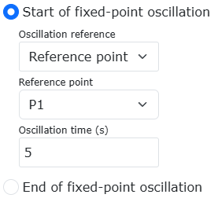

.. centered:: Abbildung 9.29-20 Pendelreferenz als "Referenzpunkt"

**Schritt 3**: Erstellung des Programms für stationäres Pendeln. Die für die beiden Pendelreferenzen generierten Lua-Programme sind in den Abbildungen dargestellt. Durch Ausführen des Lua-Programms wird die Funktion für stationäres Pendeln aktiviert.
   
.. image:: coding/561.png
   :width: 4in
   :align: center

.. centered:: Abbildung 9.29-21 Programm für stationäres Pendeln mit Pendelreferenz als "Werkzeugkoordinatensystem"
   
.. image:: coding/562.png
   :width: 4in
   :align: center

.. centered:: Abbildung 9.29-22 Programm für stationäres Pendeln mit Pendelreferenz als "Referenzpunkt"

Laser-Stationärpendelfunktion
+++++++++++++++++++++++++++++++++++++++++++++++++++++++

Überblick
***********************************

Die Laser-Stationärpendelfunktion ist eine Kombination aus der Stationärpendelfunktion des Roboters und der Lasernachführungsfunktion: Basierend auf dem ursprünglichen Stationärpendeln des Roboters kann die Pendelposition durch die Lasernachführungsfunktion angepasst werden, und sie kann an Bewegungen von Erweiterungsachsen angepasst werden. Diese Funktion ist nur für die Typen "Dreieckwellenpendeln" und "Sinuswellenpendeln" wirksam.

Bedienungsablauf für Laser + Stationärpendeln
****************************************************************************

**Schritt 1**: Konfigurieren Sie die Laserkommunikation. Die spezifischen Bedienschritte finden Sie im entsprechenden Kapitel des Benutzerhandbuchs.

**Schritt 2**: Kalibrieren Sie das Roboter-Werkzeugkoordinatensystem und das Laserkoordinatensystem. Die spezifischen Bedienschritte finden Sie im entsprechenden Kapitel des Benutzerhandbuchs.

**Schritt 3**: Passen Sie die Position des Werkstücks und des Laserstrahls an. Die schematische Darstellung ist in der folgenden Abbildung dargestellt, wobei das schwarze Rechteck das Werkstück und die rote Linie den Laserstrahl darstellt. Der Laserstrahl sollte senkrecht zur zu verfolgenden Werkstückkante stehen, um eine gute Nachführungsleistung zu gewährleisten.
   
.. image:: coding/563.png
   :width: 2in
   :align: center

.. centered:: Abbildung 9.29-23 Schematische Darstellung von Werkstück und Laserstrahl

**Schritt 4**: Einstellung der Pendelparameter. Klicken Sie auf die Schaltfläche "Teach-Programm" - "Programmierung" - "Pendeln", bearbeiten Sie die Pendelnummer, um die Pendelparameter einzustellen. Beachten Sie: (1) Die Laser + Stationärpendeln-Funktion ist nur für die Typen "Dreieckwellenpendeln" und "Sinuswellenpendeln" wirksam; (2) Wenn die tatsächliche Stationärpendelzeit mit der eingestellten Stationärpendelzeit übereinstimmen soll, dürfen die linken und rechten Verweilzeiten nicht eingestellt werden; (3) Um eine gute Lasernachführungsleistung zu gewährleisten, müssen die linken und rechten Verweilzeiten übereinstimmen.
   
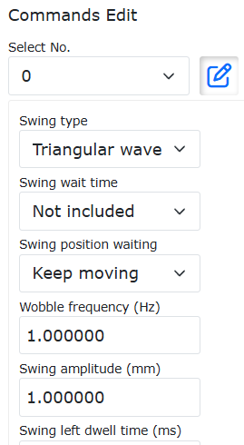

.. centered:: Abbildung 9.29-24 Einstellung der Pendelparameter

**Schritt 5**: Einstellung der Parameter für Stationärpendeln. Klicken Sie auf "Teach-Programm" - "Programmierung" - "Pendeln" - "Stationärpendeln Start", stellen Sie die Pendelreferenz und die Pendelzeitparameter ein, klicken Sie auf "Hinzufügen", dann klicken Sie auf die Schaltfläche "Stationärpendeln Ende" und auf "Hinzufügen". Die Pendelreferenz kann zwischen zwei Typen gewählt werden: "Werkzeugkoordinatensystem" und "Referenzpunkt". Wenn "Werkzeugkoordinatensystem" als Pendelreferenz gewählt wird, wird die X-Richtung des Werkzeugkoordinatensystems des aktuellen Punkts als Vorwärtsrichtung und die Y-Richtung des Werkzeugkoordinatensystems des aktuellen Punkts als Pendelrichtung verwendet. Wenn "Referenzpunkt" als Pendelreferenz gewählt wird, wird die Verbindungslinie zwischen dem aktuellen Punkt und dem Referenzpunkt als Vorwärtsrichtung verwendet, und die Pendelrichtung wird durch den Pendelalgorithmus bestimmt. Beachten Sie: Der Referenzpunkt und die aktuelle Position müssen dasselbe Werkzeugkoordinatensystem und Werkstückkoordinatensystem haben.
   
.. image:: coding/559.png
   :width: 2in
   :align: center

.. centered:: Abbildung 9.29-25 Pendelreferenz als "Werkzeugkoordinatensystem"
   

.. centered:: Abbildung 9.29-26 Pendelreferenz als "Referenzpunkt"

**Schritt 6**: Fügen Sie den Lasernachführungsbefehl hinzu. Klicken Sie nacheinander auf "Teach-Programm" - "Programmierung" - "Lasernachführung", dann auf "Nachführung starten" und wählen Sie das in Schritt 2 kalibrierte Laserkoordinatensystem aus (diese Anleitung verwendet toolcoord5 als Beispiel), und klicken Sie schließlich auf "Nachführung stoppen".
   
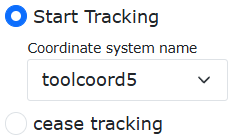

.. centered:: Abbildung 9.29-27 Lasernachführungseinstellung

**Schritt 7**: Erstellen Sie das Lua-Programm für Laser + Stationärpendeln. Passen Sie die in Schritt 5 und Schritt 6 erzeugte Befehlssortierung an. Die für die beiden Pendelreferenzen generierten Lua-Programme sind in den folgenden Abbildungen dargestellt. Die Programmlaufzeit hängt nur von der eingestellten Zeit des Stationärpendelns ab und ist unabhängig von der Schnittstellengeschwindigkeit. Führen Sie das Lua-Programm aus, um die Laser + Stationärpendeln-Funktion zu realisieren.
   
.. image:: coding/566.png
   :width: 4in
   :align: center

.. centered:: Abbildung 9.29-28 Laser + Stationärpendeln Programm 1
   
.. image:: coding/567.png
   :width: 4in
   :align: center

.. centered:: Abbildung 9.29-29 Laser + Stationärpendeln Programm 2

Bedienungsablauf für Laser + Erweiterungsachse + Stationärpendeln
****************************************************************************************

**Schritt 1**: Konfigurieren Sie die Laserkommunikation. Die spezifischen Bedienschritte finden Sie im entsprechenden Kapitel des Benutzerhandbuchs.

**Schritt 2**: Konfigurieren Sie die Kommunikation der Erweiterungsachse. Die spezifischen Bedienschritte finden Sie im entsprechenden Kapitel des Benutzerhandbuchs.

**Schritt 3**: Kalibrieren Sie das Roboter-Werkzeugkoordinatensystem und das Laserkoordinatensystem. Die spezifischen Bedienschritte finden Sie im entsprechenden Kapitel des Benutzerhandbuchs.

**Schritt 4**: Passen Sie die Position des Werkstücks und des Laserstrahls an. Die schematische Darstellung ist in der folgenden Abbildung dargestellt, wobei das schwarze Rechteck das Werkstück und die rote Linie den Laserstrahl darstellt. Der Laserstrahl sollte senkrecht zur zu verfolgenden Werkstückkante stehen, um eine gute Nachführungsleistung zu gewährleisten.
   
.. image:: coding/563.png
   :width: 2in
   :align: center

.. centered:: Abbildung 9.29-30 Schematische Darstellung der relativen Position von Werkstück und Laserstrahl

**Schritt 5**: Einstellung der Pendelparameter. Klicken Sie auf die Schaltfläche "Teach-Programm" - "Programmierung" - "Pendeln", bearbeiten Sie die Pendelnummer, um die Pendelparameter einzustellen. Beachten Sie: (1) Die Laser + Erweiterungsachse + Stationärpendeln-Funktion ist nur für die Typen "Dreieckwellenpendeln" und "Sinuswellenpendeln" wirksam; (2) Wenn die tatsächliche Stationärpendelzeit mit der eingestellten Stationärpendelzeit übereinstimmen soll, dürfen die linken und rechten Verweilzeiten nicht eingestellt werden; (3) Um eine gute Lasernachführungsleistung zu gewährleisten, müssen die linken und rechten Verweilzeiten übereinstimmen.
   

.. centered:: Abbildung 9.29-31 Einstellung der Pendelparameter

**Schritt 6**: Einstellung der Parameter für Stationärpendeln. Klicken Sie auf "Teach-Programm" - "Programmierung" - "Pendeln" - "Stationärpendeln Start", stellen Sie die Pendelreferenz und die Pendelzeitparameter ein, klicken Sie auf "Hinzufügen", dann klicken Sie auf die Schaltfläche "Stationärpendeln Ende" und auf "Hinzufügen". Die Pendelreferenz kann zwischen zwei Typen gewählt werden: "Werkzeugkoordinatensystem" und "Referenzpunkt". Wenn "Werkzeugkoordinatensystem" als Pendelreferenz gewählt wird, wird die X-Richtung des Werkzeugkoordinatensystems des aktuellen Punkts als Vorwärtsrichtung und die Y-Richtung des Werkzeugkoordinatensystems des aktuellen Punkts als Pendelrichtung verwendet. Wenn "Referenzpunkt" als Pendelreferenz gewählt wird, wird die Verbindungslinie zwischen dem aktuellen Punkt und dem Referenzpunkt als Vorwärtsrichtung verwendet, und die Pendelrichtung wird durch den Pendelalgorithmus bestimmt. Beachten Sie: Der Referenzpunkt und die aktuelle Position müssen dasselbe Werkzeugkoordinatensystem und Werkstückkoordinatensystem haben.
   
.. image:: coding/559.png
   :width: 2in
   :align: center

.. centered:: Abbildung 9.29-32 Pendelreferenz als "Werkzeugkoordinatensystem"
   

.. centered:: Abbildung 9.29-33 Pendelreferenz als "Referenzpunkt"

**Schritt 7**: Fügen Sie den Bewegung

Roboter ModbusRTU Kommunikation
~~~~~~~~~~~~~~~~~~~~~~~~~~~~~~~~

Übersicht
+++++++++

ModbusRTU ist ein in der industriellen Produktion häufig verwendetes Kommunikationsprotokoll. FAIRINO kollaborative Roboter bieten zwei Arten der Kommunikation mit Ihren Geräten: ModbusRTU-Master und ModbusRTU-Slave.

Der kollaborative Roboter unterstützt bis zu 8 ModbusRTU-Master, die gleichzeitig mit externen Geräten kommunizieren können. Jeder Master unterstützt bis zu 128 Register. Der ModbusRTU-Slave des kollaborativen Roboters verfügt über 64 Spulen, 64 diskrete Eingänge, 32 Halteregister und 32 Eingangsregister (die Datentypen der Halte- und Eingangsregister umfassen vorzeichenbehaftet und Gleitkomma).

Ein Teil der Eingangsregisteradressen des ModbusRTU-Slaves des Roboters ist für die Rückmeldung von Informationen wie der aktuellen Gelenkposition und Bewegungsgeschwindigkeit des Roboters reserviert. Ein Teil der Spulenregisteradressen ist für die Steuerung von Roboterfunktionen wie Programmstart, Programmstopp und Setzen von Steuerpult-DOs reserviert. Der ModbusRTU-Slave des Roboters unterstützt nur die Verbindung mit einem Master. Im Folgenden wird die detaillierte Verwendung beschrieben.

Erläuterung der Bedienung des Roboter-ModbusRTU-Masters
++++++++++++++++++++++++++++++++++++++++++++++++++++++++

Bevor Sie den kollaborativen Roboter als ModbusRTU-Master für die Kommunikation mit Ihrem Gerät verwenden, überprüfen Sie bitte die 485-Hardwareverbindung zwischen Ihrem Gerät und dem Roboter. Die Verwendung des ModbusRTU-Masters des Roboters umfasst die folgenden Schritte: ① Master hinzufügen; ② Register hinzufügen; ③ Kommunikationstest; ④ Benutzerprogramm schreiben; ⑤ Benutzerprogramm ausführen.

ModbusRTU-Master hinzufügen
***************************

Öffnen Sie die WebApp, klicken Sie nacheinander auf "Teach-Simulation", "Programmierung" und erstellen Sie ein neues Benutzerprogramm "testModbusRTUMaster.lua".

.. image:: coding/340.png
   :width: 6in
   :align: center

.. centered:: Abbildung 9.30-1 Erstellen eines ModbusRTU-Master-Benutzerprogramms

Klicken Sie auf die Schaltfläche "ModbusRTU Einstellungen", um die ModbusRTU-Funktionskonfigurationsseite zu öffnen.

.. image:: coding/341.png
   :width: 4in
   :align: center

.. centered:: Abbildung 9.30-2 Öffnen der ModbusRTU Einstellungen

Klicken Sie nacheinander auf "Master-Einstellungen", "Modbus-Master hinzufügen". Damit ist das Hinzufügen eines ModbusRTU-Masters abgeschlossen.

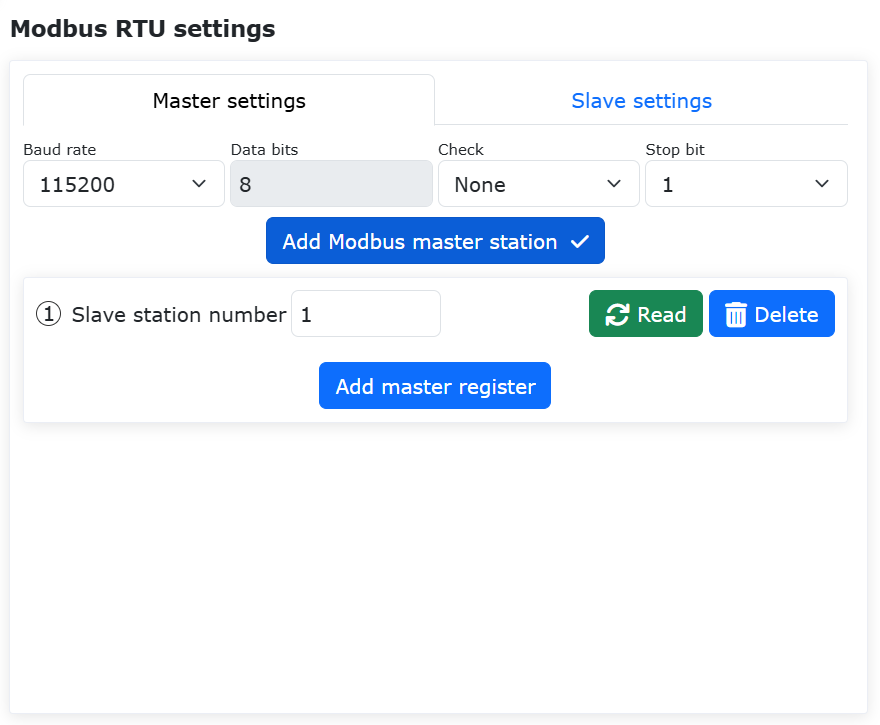

.. centered:: Abbildung 9.30-3 Hinzufügen eines "ModbusRTU-Masters"

Wählen Sie entsprechend Ihrem Slave-Gerät nacheinander "Baudrate", "Datenbits", "Parität" und "Stoppbits" aus. Die Bedeutung der oben genannten Parameter ist wie folgt:

**Baudrate**: Die für die ModbusRTU-Kommunikation verwendete Baudrate. Unterstützt werden: 9600, 14400, 19200, 38400, 56000, 67600, 115200, 128000. Standard ist 115200. Auf gleichen Wert wie Slave einstellen.

**Datenbits**: Derzeit wird nur die Einstellung 8 unterstützt. Auf gleichen Wert wie Slave einstellen.

**Parität**: Paritätsmodus. Unterstützt werden None, Odd, Even. Standard ist None. Auf gleichen Wert wie Slave einstellen.

**Stoppbits**: Unterstützt werden 0.5, 1, 1.5, 2. Standard ist 1. Auf gleichen Wert wie Slave einstellen.

.. image:: coding/343.png
   :width: 4in
   :align: center

.. centered:: Abbildung 9.30-4 Einstellung der ModbusRTU-Master-Parameter

Nach korrekter Eingabe der oben genannten Parameter kann der ModbusRTU-Master des Roboters mit dem Slave kommunizieren. (Wenn Sie sicher sind, dass die relevanten Parameter des ModbusRTU-Masters korrekt konfiguriert wurden, der Roboter und Ihr Gerät aber keine Verbindung herstellen können, überprüfen Sie bitte die folgenden Konfigurationen:

① Die physische 485-Verbindung zwischen Roboter und Slave-Gerät. ② Überprüfen Sie die Kommunikationskonfiguration des Slave-Geräts. Es wird empfohlen, zuerst mit einem seriellen Debug-Assistenten zu testen, ob die Kommunikationsverbindung korrekt ist. Konfigurieren Sie z. B. auf dem PC die gleichen ModbusRTU-Parameter wie beim Roboter, erstellen Sie auf der Web-Oberfläche des Roboters ein neues Register und führen Sie eine 0x03-Leseoperation für ein Halteregister durch. Prüfen Sie, ob der serielle Debug-Assistent auf dem PC Daten empfangen kann. Wie in der folgenden Abbildung gezeigt, kann der PC bei Verwendung des 0x03-Befehls zum Lesen des Registers an Adresse 0x1000 normal Daten empfangen, was bedeutet, dass die Kommunikationskonfiguration korrekt ist.

.. image:: coding/344.png
   :width: 4in
   :align: center

.. centered:: Abbildung 9.30-5 Überprüfung des Modbus-Verbindungsstatus

Damit haben wir die Erstellung eines ModbusRTU-Masters des Roboters abgeschlossen. Wenn Sie erneut auf "Modbus-Master hinzufügen" klicken, können Sie einen weiteren neuen ModbusRTU-Master erstellen (Abbildung 2-6). Der Roboter unterstützt maximal 8 Master, die gleichzeitig mit externen Geräten kommunizieren. Durch Doppelklicken auf die Schaltfläche "Löschen" oben rechts im Modbus-Master können Sie diesen Modbus-Master löschen.

.. image:: coding/345.png
   :width: 4in
   :align: center

.. centered:: Abbildung 9.30-6 Erneutes Hinzufügen eines ModbusRTU-Masters

Hinzufügen von Registern zum ModbusRTU-Master
**********************************************

Klicken Sie auf die Schaltfläche "Master-Register hinzufügen", um dem Master ein Register hinzuzufügen.

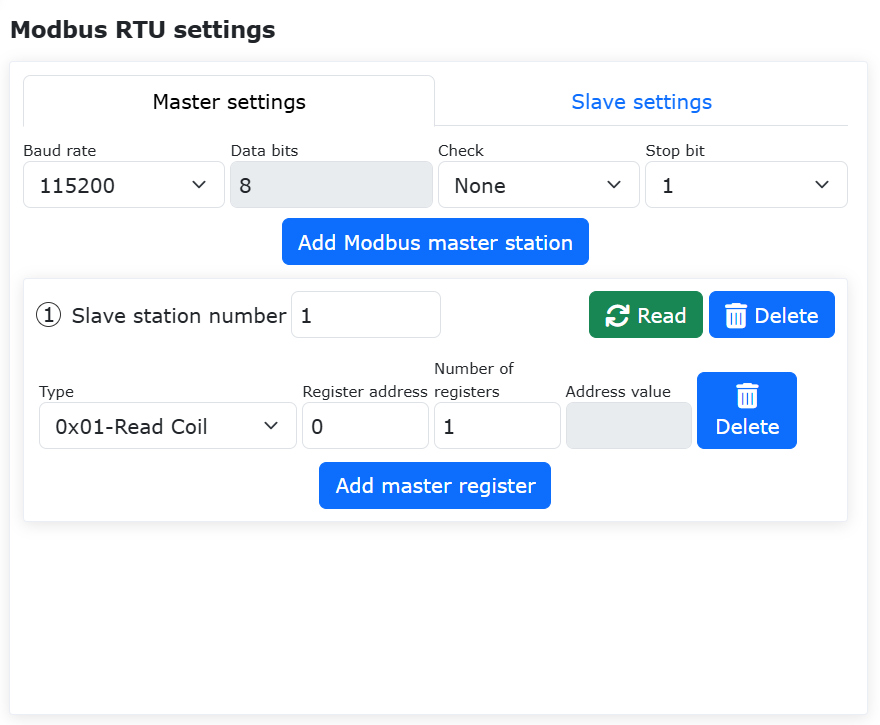

.. centered:: Abbildung 9.30-7 Hinzufügen eines ModbusRTU-Master-Registers

Wählen Sie nacheinander den Master-Registertyp, geben Sie die Adressnummer und den Namen ein. Die Bedeutung der einzelnen Parameter ist wie folgt:

**Typ**: Modbus-Funktionscode: 0x01 - Spule lesen; 0x02 - diskreten Eingang lesen; 0x03 - Halteregister lesen (vorzeichenbehaftet -32768-32767); 0x03 - Halteregister lesen (Gleitkomma-Registerdatenlänge 32 Bit, belegt zwei Register, 4 Bytes); 0x04 - Eingangsregister lesen (vorzeichenbehaftet -32768-32767); 0x04 - Eingangsregister lesen (Gleitkomma-Registerdatenlänge 32 Bit, belegt zwei Register, 4 Bytes); 0x05 - einzelne Spule schreiben; 0x06 - einzelnes Halteregister schreiben; 0x0F - mehrere Spulen schreiben; 0x03 - Halteregister lesen (vorzeichenbehaftet -32768-32767); 0x03 - Halteregister lesen (Gleitkomma-Registerdatenlänge 32 Bit, belegt zwei Register, 4 Bytes). Gelesene und geschriebene Gleitkommaregister werden im Big-Endian-Format angezeigt.

**Registeradresse**: Die zu lesende oder zu schreibende Registeradresse des ModbusRTU-Slaves.

**Registeranzahl**: Anzahl der Register, die beim Mehrfachlesen oder -schreiben bearbeitet werden müssen (bei 0x05, 0x06 kann die Anzahl nur 1 sein). Maximal werden 12 Registeroperationen unterstützt.

**Adresswert**: Anzeigewert beim Lesen oder Wert beim Schreiben (bei mehreren Werten durch englische Kommas "," trennen).

.. image:: coding/347.png
   :width: 4in
   :align: center

.. centered:: Abbildung 9.30-8 Einstellung der ModbusRTU-Master-Registerparameter

Klicken Sie erneut auf die Schaltfläche "Master-Register hinzufügen", um ein weiteres Master-Register hinzuzufügen. Durch Doppelklicken auf die Schaltfläche "Löschen" rechts neben dem Register können Sie dieses Register löschen. Die folgende Abbildung zeigt die unterstützten Funktionscode-Register.

.. image:: coding/348.png
   :width: 4in
   :align: center

.. centered:: Abbildung 9.30-9 Hinzufügen mehrerer Master-Register

Kommunikationstest des ModbusRTU-Masters
*****************************************

Die Modbus-Master-Register des Roboters verfügen über ein "Adresswert"-Eingabefeld, das den aktuellen Wert des Registers anzeigt. Register der Typen 0x01, 0x02, 0x03, 0x04 sind schreibgeschützt. Das entsprechende Adresswert-Eingabefeld ist grau und nicht editierbar. Wenn sich der Wert an der entsprechenden Adresse des Slaves ändert, können Sie durch Klicken auf die Leseschaltfläche den entsprechenden Registeradresswert lesen, der dann synchron den aktuellen Wert anzeigt. Die Funktionscodes 0x05, 0x06, 0x0F, 0x10 sind Schreiboperationen. Ihre Adresswert-Eingabefelder sind weiß und editierbar. Sie können den Wert dieses Registers auf der Modbus-Master-Einstellungsseite des Roboters ändern.

.. image:: coding/349.png
   :width: 4in
   :align: center

.. centered:: Abbildung 9.30-10 Modbus-Master-Adresswerte

Test des Lesens von Master-Registern
"""""""""""""""""""""""""""""""""""""

Lesen Sie auf dem externen ModbusRTU-Slave-Gerät kontinuierlich 10 Spulen ab Adresse 0x4000, kontinuierlich 12 diskrete Eingänge ab Adresse 0x3000, lesen Sie zwei Halteregister ab Adresse 0x2010 als int16 und lesen Sie eine Gleitkommazahl aus einem Eingangsregister ab Adresse 0x1029. Die Adresswerte der entsprechenden Register auf der Modbus-Master-Einstellungsseite des Roboters werden entsprechend aktualisiert. Die gesendeten Datenrahmen sind in der folgenden Abbildung dargestellt (da das Lesen des Registers an Adresse 0x1029 als Gleitkommatyp eingestellt wurde, werden tatsächlich die beiden 16-Bit-Register 0x1029 und 0x102A gelesen, um eine Gleitkommazahl zu speichern; die Anzahl der gelesenen Register kann jedoch auf 1 gesetzt werden).

.. image:: coding/350.png
   :width: 4in
   :align: center

.. centered:: Abbildung 9.30-11 Modbus-Master zeigt gelesene Registerwerte an (Befehlsscreenshot)

Test des Schreibens von Master-Registern
""""""""""""""""""""""""""""""""""""""""

Schreiben Sie auf der ModbusRTU-Master-Einstellungsseite des Roboters eine einzelne Spule an Adresse 0x1000 mit dem Wert 1; schreiben Sie ein einzelnes Register an Adresse 0x1001 mit dem Wert 2001; schreiben Sie 5 Spulen an Adresse 0x2000 mit den Werten 1,1,0,1,1; schreiben Sie 2 Halteregister an Adresse 0x2010 als int16 mit den Werten 3001, 3002; schreiben Sie ein Gleitkomma-Halteregister (tatsächlich zwei 16-Bit-Register) an Adresse 0x1029 mit dem Wert 21,55. Die entsprechenden Registeradressen des Modbus-Slaves werden mit den entsprechenden Werten beschrieben.

.. image:: coding/351.png
   :width: 4in
   :align: center

.. centered:: Abbildung 9.30-12 Schreiboperationen des ModbusRTU-Masters (Befehlsscreenshot)

Schreiben eines ModbusRTU-Master-Programms
*******************************************

Öffnen Sie die Seite zum Hinzufügen von Kommunikationsbefehlen.

.. image:: coding/352.png
   :width: 4in
   :align: center

.. centered:: Abbildung 9.30-13 Öffnen der Seite zum Hinzufügen von Kommunikationsbefehlen

Klicken Sie auf "Modbus".

.. image:: coding/353.png
   :width: 4in
   :align: center

.. centered:: Abbildung 9.30-14 Auswahl "Modbus"

Klicken Sie auf "Modbus_RTU". Wählen Sie "Master (Client)", um die Seite zum Hinzufügen von ModbusRTU-Master-Befehlen zu öffnen.

.. image:: coding/354.png
   :width: 4in
   :align: center

.. centered:: Abbildung 9.30-15 Auswahl "Modbus_RTU"

Schreiben einer einzelnen Spule
"""""""""""""""""""""""""""""""

Wählen Sie "Register schreiben". Wählen Sie den Funktionscode 0x05 - einzelne Spule. Geben Sie die Register-/Spulenadresse 0x1000 ein. Stellen Sie die Register-/Spulenanzahl auf 1 und das Byte-Array auf {1}. Klicken Sie auf die Schaltfläche "Hinzufügen". Blättern Sie schließlich zum unteren Ende der Seite und klicken Sie auf die Schaltfläche "Übernehmen" (Abbildung 2-16).

.. image:: coding/355.png
   :width: 4in
   :align: center

.. centered:: Abbildung 9.30-16 Schreiben einer einzelnen Spule

Nun wurde dem Roboterprogramm "testModbusRTUSlave.lua" ein Befehl zum Schreiben eines einzelnen digitalen Ausgangs für den Modbus-Master hinzugefügt. Schalten Sie den Roboter in den Automatikmodus und klicken Sie auf die Starttaste. Der Roboter setzt den Adresswert des Spulenregisters 0x1000 des Masters auf 1.

.. image:: coding/356.png
   :width: 6in
   :align: center

.. centered:: Abbildung 9.30-17 Lua-Programm zum Schreiben einer einzelnen Spule

Schreiben mehrerer Spulen
"""""""""""""""""""""""""

Wählen Sie "Register schreiben". Wählen Sie den Funktionscode 0x0F - mehrere Spulen. Geben Sie die Register-/Spulenadresse 0x1010 ein. Stellen Sie die Register-/Spulenanzahl auf 3 und das Byte-Array auf {1,0,1}. Klicken Sie auf die Schaltfläche "Hinzufügen". Blättern Sie schließlich zum unteren Ende der Seite und klicken Sie auf die Schaltfläche "Übernehmen" (Abbildung 2-18).

.. image:: coding/357.png
   :width: 4in
   :align: center

.. centered:: Abbildung 9.30-18 Schreiben mehrerer Spulen

Nun wurde dem Roboterprogramm "testModbusRTUSlave.lua" ein Befehl zum Schreiben eines einzelnen digitalen Ausgangs für den Modbus-Master hinzugefügt. Schalten Sie den Roboter in den Automatikmodus und klicken Sie auf die Starttaste. Der Roboter setzt den Adresswert des Spulenregisters 0x1000 des Masters auf 1.

.. image:: coding/358.png
   :width: 4in
   :align: center

.. centered:: Abbildung 9.30-19 Lua-Programm zum Schreiben mehrerer Spulen

Lesen von Spulen, diskreten Eingängen
""""""""""""""""""""""""""""""""""""""

Wählen Sie "Register lesen Befehl". Wählen Sie den Funktionscode 0x01 - Spule (wenn Sie diskrete Eingänge lesen möchten, wählen Sie 0x02 - diskreter Eingang). Geben Sie die Register-/Spulenadresse 0x2000 ein. Stellen Sie die Register-/Spulenanzahl auf 3. Klicken Sie auf die Schaltfläche "Hinzufügen". Wählen Sie gleichzeitig "Registerdaten lesen". Stellen Sie die Anzahl der Register/Spulen/diskret. Eingänge auf 3. Klicken Sie auf die Schaltfläche "Hinzufügen". Blättern Sie schließlich zum unteren Ende der Seite und klicken Sie auf die Schaltfläche "Übernehmen" (Abbildung 2-20).

.. image:: coding/359.png
   :width: 4in
   :align: center

.. image:: coding/394.png
   :width: 4in
   :align: center

.. centered:: Abbildung 9.30-20 Spulen lesen

Nun wurden dem Roboterprogramm "testModbusRTUSlave.lua" zwei Befehle zum Lesen von Spulen für den Modbus-Master hinzugefügt.

.. image:: coding/360.png
   :width: 6in
   :align: center

.. centered:: Abbildung 9.30-21 Programm zum Lesen einer einzelnen Spule

Normalerweise wird der gelesene Wert des Modbus-Registers in einer Variablen gespeichert. Daher müssen Variablen definiert werden, um die gelesenen Werte zu speichern. Klicken Sie auf die Schaltfläche "Modus wechseln", um das Lua-Programm des Roboters in den editierbaren Zustand zu versetzen. Fügen Sie vor dem Befehl "ModbusRegRead" die Rückgabewertvariablen "value1", "value2", "value3" hinzu. Nach der Ausführung des Programms werden die gelesenen Werte in "value1", "value2", "value3" gespeichert.

.. image:: coding/361.png
   :width: 6in
   :align: center

.. centered:: Abbildung 9.30-22 Lesen mehrerer Spulenwerte und Speichern in Variablen

Der Wert von Spulen- und diskreten Eingangsregistern kann nur 0 oder 1 sein. Im Roboterprogramm können durch Abfragen der Registerwerte verschiedene Aktionen ausgeführt werden.

Lesen von Halteregistern, Eingangsregistern
"""""""""""""""""""""""""""""""""""""""""""

Wählen Sie "Register lesen Befehl". Wählen Sie den Funktionscode 0x03 - Halteregister (wenn Sie Eingangsregister lesen möchten, wählen Sie 0x04 - Eingangsregister). Geben Sie die Register-/Spulenadresse 0x4000 ein. Stellen Sie die Register-/Spulenanzahl auf 5. Klicken Sie auf die Schaltfläche "Hinzufügen". Wählen Sie gleichzeitig "Registerdaten lesen". Stellen Sie die Anzahl der Register/Spulen/diskret. Eingänge auf 5. Klicken Sie auf die Schaltfläche "Hinzufügen". Blättern Sie schließlich zum unteren Ende der Seite und klicken Sie auf die Schaltfläche "Übernehmen" (Abbildung 2-23).

.. image:: coding/362.png
   :width: 4in
   :align: center

.. image:: coding/395.png
   :width: 4in
   :align: center

.. centered:: Abbildung 9.30-23 Halteregister lesen

Nun wurden dem Roboterprogramm "testModbusRTUSlave.lua" zwei Befehle zum Lesen von Spulen für den Modbus-Master hinzugefügt.

.. image:: coding/363.png
   :width: 4in
   :align: center

.. centered:: Abbildung 9.30-24 Programm zum Lesen einer einzelnen Spule

Normalerweise wird der gelesene Wert des Modbus-Registers in einer Variablen gespeichert. Daher müssen Variablen definiert werden, um die gelesenen Werte zu speichern. Klicken Sie auf die Schaltfläche "Modus wechseln", um das Lua-Programm des Roboters in den editierbaren Zustand zu versetzen. Fügen Sie vor dem Befehl "ModbusRegRead" die Rückgabewertvariablen "value1", "value2", "value3", "value4", "value5" hinzu. Nach der Ausführung des Programms werden die gelesenen Werte in "value1", "value2", "value3", "value4", "value5" gespeichert.

.. image:: coding/364.png
   :width: 6in
   :align: center

.. centered:: Abbildung 9.30-25 Lesen mehrerer Halteregisterwerte und Speichern in Variablen

Erläuterung der Bedienung des Roboter-ModbusRTU-Slaves
+++++++++++++++++++++++++++++++++++++++++++++++++++++++

Der ModbusRTU-Slave des Roboters bietet vier Registertypen: allgemeine digitale Eingänge (Spulen), allgemeine digitale Ausgänge (diskrete Eingänge), allgemeine analoge Eingänge (Halteregister) und allgemeine analoge Ausgänge (Eingangsregister). Die allgemeinen digitalen Eingänge und analogen Eingänge werden hauptsächlich verwendet, damit der Roboter Daten von einem externen ModbusRTU-Master lesen kann, um Roboteroperationen zu steuern. Die allgemeinen digitalen Ausgänge und analogen Ausgänge werden hauptsächlich verwendet, damit der Roboter Datensignale an ein externes ModbusRTU-Master-Gerät senden kann, das dann die entsprechenden Registerwerte liest, um sein Gerät zu steuern.

Zusätzlich zu den oben genannten allgemeinen Ein-/Ausgängen bietet der Roboter auch einige "Funktionsdigitaleingänge (Spulen)" für externe Master-Geräte, um den Roboter zu steuern, z. B. Programmstart, Programmstopp. Darüber hinaus werden einige Eingangsregister bereitgestellt, um den aktuellen Status des Roboters anzuzeigen, einschließlich der aktuellen kartesischen Position des Roboters, des aktuellen Betriebsstatus usw. (Die genaue Definition finden Sie in Anhang I: ModbusRTU-Slave-Adresszuordnungstabelle). Der Verwendungsprozess des ModbusRTU-Slaves des Roboters umfasst hauptsächlich: ① Parametereinstellung; ② Kommunikationstest; ③ Programmerstellung.

Kommunikationsparametereinstellung des ModbusRTU-Slaves
*******************************************************

Öffnen Sie die WebApp, klicken Sie nacheinander auf "Teach-Simulation", "Programmierung" und erstellen Sie ein neues Benutzerprogramm "testModbusRTUSlave.lua".

.. image:: coding/365.png
   :width: 6in
   :align: center

.. centered:: Abbildung 9.30-26 Erstellen eines ModbusRTU-Slave-Benutzerprogramms

Klicken Sie auf die Schaltfläche "ModbusRTU Einstellungen", um die ModbusRTU-Funktionskonfigurationsseite zu öffnen.

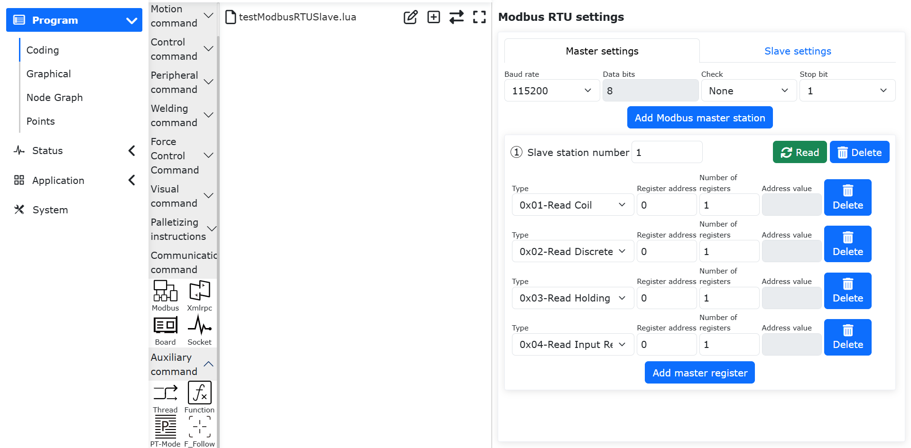

.. centered:: Abbildung 9.30-27 Öffnen der ModbusRTU Einstellungen

Klicken Sie nacheinander auf "Slave-Einstellungen". Geben Sie die Baudrate, Datenbits, Parität, Stoppbits und die Slave-Nummer des Roboterslaves ein. "Baudrate", "Datenbits", "Parität" und "Stoppbits" sind die Parametereinstellungen des Roboters als ModbusRTU-Slave. Die "Slave-Nummer" ist die Gerätenummer des Slaves, an die der externe Master Befehle sendet.

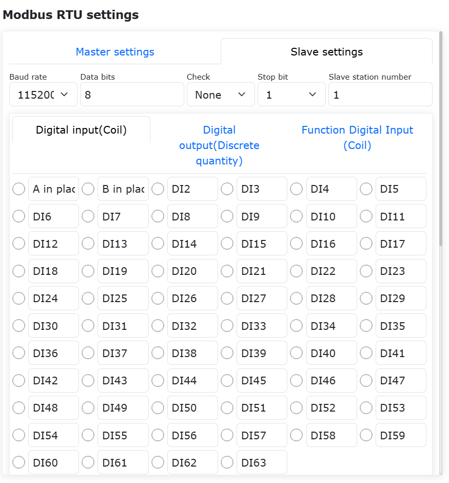

.. centered:: Abbildung 9.30-28 ModbusRTU-Slave-Einstellungen

Kommunikationstest des ModbusRTU-Slaves
***************************************

Allgemeine digitale Eingänge (Spulen)
""""""""""""""""""""""""""""""""""""""

Der ModbusRTU-Slave des Roboters bietet 64 Spulenregister. Ihre Registeradressen sind 0x4000~0x403F (die genaue Definition finden Sie in Anhang I: ModbusRTU-Slave-Adresszuordnungstabelle). Die allgemeinen Register des ModbusRTU-Slaves des Roboters können mit Aliasen versehen werden. Ändern Sie den Namen des Slave-Spulenregisters DI0 in "A bereit" und DI1 in "B bereit". Gemäß der Adresszuordnungstabelle sind die Modbus-Spulenadressen von "A bereit" und "B bereit" 0x4000 bzw. 0x4001. Setzen Sie auf dem externen ModbusRTU-Master-Gerät die Slave-Spulenregisteradressen 0x4000 und 0x4001 des Roboters auf 1. Die Anzeigen für die beiden Register auf der Überwachungsseite des ModbusRTU-Slaves des Roboters leuchten auf.

.. image:: coding/368.png
   :width: 4in
   :align: center

.. centered:: Abbildung 9.30-29 Überwachung des Spulenstatus des ModbusRTU-Slaves (Befehlsscreenshot)

Allgemeine digitale Ausgänge (diskrete Eingänge)
""""""""""""""""""""""""""""""""""""""""""""""""

Der ModbusRTU-Slave des Roboters bietet 64 diskrete Eingangsregister. Ihre Registeradressen sind 0x3000-0x303F (die genaue Definition finden Sie in Anhang I: ModbusRTU-Slave-Adresszuordnungstabelle). Auch die diskreten Eingangsregister des ModbusRTU-Slaves des Roboters können mit Aliasen versehen werden. Klicken Sie auf "Allgemeine digitale Ausgänge (diskrete Eingänge)". Ändern Sie den Namen des Slave-diskreten-Eingangsregisters DO0 in "A starten" und DO1 in "B starten". Gemäß der Adresszuordnungstabelle sind die Modbus-Adressen für diskrete Eingänge von "A starten" und "B starten" 0x3000 bzw. 0x3001. Klicken Sie auf die Anzeige des diskreten Eingangs für "A starten". Die Anzeige leuchtet auf, der Wert des entsprechenden Registeradresse 0x3000 wird 1. Auf dem externen ModbusRTU-Master-Gerät kann dieser Registerwert gelesen werden.

.. image:: coding/369.png
   :width: 4in
   :align: center

.. centered:: Abbildung 9.30-30 Steuerung der diskreten Eingänge des ModbusRTU-Slaves

Analoge Eingänge (Halteregister)
""""""""""""""""""""""""""""""""

Der Roboter bietet 32 Halteregister in drei Typen (vorzeichenlos, vorzeichenbehaftet, Gleitkomma). Die Adressen von AI0 bis AI32 sind 0x2000-0x202F (die genaue Definition finden Sie in Anhang I: ModbusRTU-Slave-Adresszuordnungstabelle). Der Datenbereich für vorzeichenbehaftete Register ist -32768~32767. Gleitkommaregister werden im Big-Endian-Format angezeigt. Ändern Sie die Namen von AI0 und AI1 in "Spannung" und "Strom". Aus der ModbusRTU-Slave-Adresszuordnungstabelle sind die Adressen der beiden Register 0x2000 bzw. 0x2001. Wenn das verbundene Master-Gerät die Werte der Halteregister an den Adressen 0x2000 und 0x2001 ändert, werden die Adresswerte der Register "Spannung" und "Strom" auf der Überwachungsseite des ModbusRTU-Slaves des Roboters entsprechend synchron aktualisiert. Analoge Eingänge des Roboters werden hauptsächlich verwendet, damit der Roboter numerische Signale von externen Master-Geräten abruft.

.. image:: coding/370.png
   :width: 4in
   :align: center

.. centered:: Abbildung 9.30-31 Überwachung der analogen Eingänge des ModbusRTU-Slaves (Befehlsscreenshot)

Analoge Ausgänge (Eingangsregister)
"""""""""""""""""""""""""""""""""""

Der Roboter bietet 64 Eingangsregister in drei Typen (vorzeichenlos, vorzeichenbehaftet, Gleitkomma). Die Adressen von AO0 bis AO63 sind 0x1000-0x100F, 0x104D-0x106C (die genaue Definition finden Sie in Anhang I: ModbusRTU-Slave-Adresszuordnungstabelle). Der Datenbereich für vorzeichenbehaftete Register ist -32768~32767. Gleitkommaregister werden im Big-Endian-Format angezeigt. Ändern Sie die Namen von AO0 und AO1 in "Zielposition A" und "Zielposition B". Stellen Sie die Werte der Eingangsregister auf 2000 und 1500. Aus der ModbusRTU-Slave-Adresszuordnungstabelle sind die Adressen der beiden Register 0x1000 bzw. 0x1001. Wenn das verbundene Master-Gerät die Werte der Eingangsregister an den Adressen 0x1000 und 0x1001 liest, erhält es die eingestellten Werte. Analoge Ausgänge des Roboterslaves werden hauptsächlich verwendet, damit der Roboter numerische Signale an externe Master-Geräte senden kann.

.. image:: coding/371.png
   :width: 4in
   :align: center

.. centered:: Abbildung 9.30-32 Ändern analoger Eingänge im Modbus-Slave

Programmerstellung für ModbusRTU-Slave
**************************************

Öffnen Sie die Seite zum Hinzufügen von Kommunikationsbefehlen.

.. image:: coding/372.png
   :width: 4in
   :align: center

.. centered:: Abbildung 9.30-33 Öffnen der Seite zum Hinzufügen von Kommunikationsbefehlen

Klicken Sie auf "Modbus".

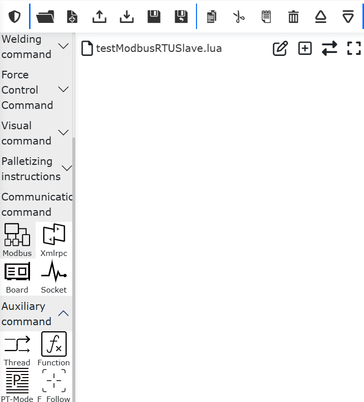

.. centered:: Abbildung 9.30-34 Auswahl "Modbus"

Klicken Sie auf "Modbus_RTU". Wählen Sie "Slave", um die Seite zum Hinzufügen von ModbusRTU-Slave-Befehlen zu öffnen.

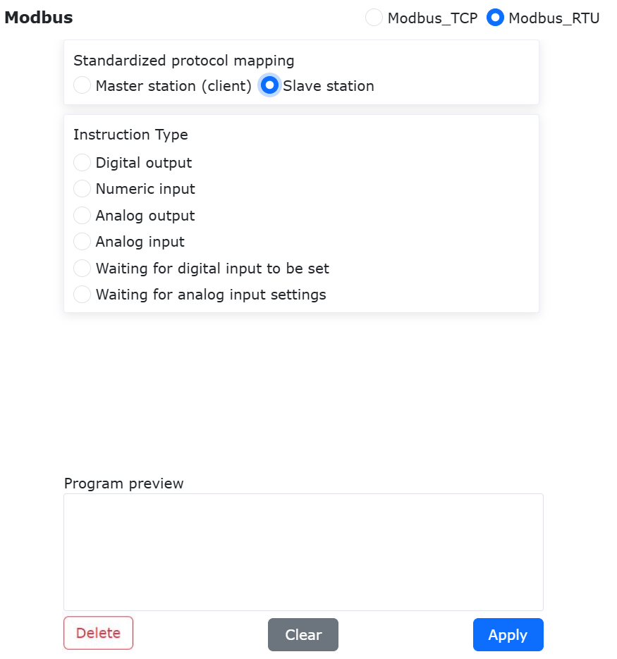

.. centered:: Abbildung 9.30-35 Auswahl "Modbus_RTU", Slave

Schreiben eines einzelnen digitalen Ausgangs DO (diskreter Eingang)
""""""""""""""""""""""""""""""""""""""""""""""""""""""""""""""""""""""""""""""""""""

Wählen Sie als DO-Namen "A starten". Stellen Sie die Registeranzahl auf 1 und den Registerwert auf 0. Klicken Sie auf "Einzelnen Digitalausgang schreiben". Blättern Sie schließlich zum unteren Ende der Seite und klicken Sie auf die Schaltfläche "Übernehmen".

.. image:: coding/375.png
   :width: 4in
   :align: center

.. centered:: Abbildung 9.30-36 Hinzufügen eines Befehls zum Schreiben eines einzelnen digitalen Ausgangs, Übernehmen des Befehls zum Schreiben eines einzelnen digitalen Ausgangs

Nun wurde dem Roboterprogramm "testModbusRTUSlave.lua" ein Befehl zum Schreiben eines einzelnen digitalen Ausgangs für den Modbus-Slave hinzugefügt. Schalten Sie den Roboter in den Automatikmodus und klicken Sie auf die Starttaste. Der Roboter setzt den Adresswert des digitalen Ausgangs mit dem Namen "A starten" auf 0.

.. image:: coding/376.png
   :width: 6in
   :align: center

.. centered:: Abbildung 9.30-37 Lua-Programm zum Schreiben eines einzelnen digitalen Ausgangs

Schreiben mehrerer digitaler Ausgänge DO (diskrete Eingänge)
""""""""""""""""""""""""""""""""""""""""""""""""""""""""""""

Öffnen Sie die Seite zum Hinzufügen von ModbusRTU-Slave-Befehlen. Suchen Sie nach "Digitale Ausgangseinstellungen". Wählen Sie als DO-Namen "A starten". Stellen Sie die Registeranzahl auf 5 und den Registerwert auf 1,0,1,0,1. Die Anzahl der Registerwerte muss mit der eingestellten Registeranzahl übereinstimmen, und mehrere Registerwerte müssen durch englische Kommas getrennt werden. Klicken Sie auf "Digitalausgang schreiben". Blättern Sie schließlich zum unteren Ende der Seite und klicken Sie auf die Schaltfläche "Übernehmen".

.. image:: coding/377.png
   :width: 4in
   :align: center

.. centered:: Abbildung 9.30-38 Konfiguration zum Schreiben mehrerer digitaler Ausgänge, Übernehmen des Schreibens mehrerer digitaler Ausgänge

Nun wurde dem Roboterprogramm "testModbusRTUSlave.lua" ein Befehl zum Schreiben mehrerer digitaler Ausgänge für den Modbus-Slave hinzugefügt. Schalten Sie den Roboter in den Automatikmodus und klicken Sie auf die Starttaste. Der Roboter setzt die Werte der diskreten Eingangsregister des Slaves, beginnend mit "A starten" und den folgenden 4, auf 1, 0, 1, 0, 1.

.. image:: coding/378.png
   :width: 6in
   :align: center

.. centered:: Abbildung 9.30-39 Lua-Programm zum Schreiben mehrerer digitaler Ausgänge

Lesen eines einzelnen digitalen Ausgangs DO (diskreter Eingang)
"""""""""""""""""""""""""""""""""""""""""""""""""""""""""""""""

Öffnen Sie die Seite zum Hinzufügen von ModbusRTU-Master-Befehlen. Suchen Sie nach "Digitale Ausgangseinstellungen". Wählen Sie als DO-Namen "A starten". Stellen Sie die Registeranzahl auf 1. Der Registerwert muss nicht ausgefüllt werden. Klicken Sie auf "Digitalausgang lesen". Blättern Sie schließlich zum unteren Ende der Seite und klicken Sie auf die Schaltfläche "Übernehmen".

.. image:: coding/379.png
   :width: 4in
   :align: center

.. centered:: Abbildung 9.30-40 Konfiguration zum Lesen eines einzelnen digitalen Ausgangs, Übernehmen des Lesens eines einzelnen digitalen Ausgangs

Nun wurde dem Roboterprogramm "testModbusRTUSlave.lua" ein Befehl zum Lesen eines einzelnen digitalen Ausgangs für den Modbus-Slave hinzugefügt.

.. image:: coding/380.png
   :width: 4in
   :align: center

.. centered:: Abbildung 9.30-41 Programm zum Lesen eines einzelnen digitalen Ausgangs

Normalerweise wird der gelesene Wert des Modbus-Registers in einer Variablen gespeichert. Daher muss eine Variable definiert werden, um den gelesenen Wert zu speichern. Klicken Sie auf die Schaltfläche "Modus wechseln", um das Lua-Programm des Roboters in den editierbaren Zustand zu versetzen. Fügen Sie vor dem Befehl "ModbusSlaveReadDO_RTU" die Rückgabewertvariable "AStartValue" hinzu. Nach der Ausführung des Programms wird der gelesene Wert in "AStartValue" gespeichert.

.. image:: coding/381.png
   :width: 4in
   :align: center

.. centered:: Abbildung 9.30-42 Lesen eines einzelnen digitalen Ausgangs und Speichern in einer Variablen

Der Wert des Spulenregisters kann nur 0 oder 1 sein. Im Roboterprogramm können durch Abfragen des Registerwerts verschiedene Aktionen ausgeführt werden.

Lesen mehrerer digitaler Ausgänge DO (diskrete Eingänge)
""""""""""""""""""""""""""""""""""""""""""""""""""""""""

Öffnen Sie die Seite zum Hinzufügen von ModbusRTU-Master-Befehlen. Suchen Sie nach "Digitale Ausgangseinstellungen". Wählen Sie als DO-Namen "A starten". Stellen Sie die Registeranzahl auf 2. Der Registerwert muss nicht ausgefüllt werden. Klicken Sie auf "Digitalausgang lesen". Blättern Sie schließlich zum unteren Ende der Seite und klicken Sie auf die Schaltfläche "Übernehmen".

.. image:: coding/382.png
   :width: 4in
   :align: center

.. centered:: Abbildung 9.30-43 Konfiguration zum Lesen mehrerer digitaler Ausgänge, Übernehmen des Lesens mehrerer digitaler Ausgänge

Nun wurde dem Roboterprogramm "testModbusRTUSlave.lua" ein Befehl zum Lesen mehrerer digitaler Ausgänge für den Modbus-Slave hinzugefügt.

.. image:: coding/383.png
   :width: 4in
   :align: center

.. centered:: Abbildung 9.30-44 Programm zum Lesen mehrerer digitaler Ausgänge

Klicken Sie auf die Schaltfläche "Modus wechseln", um das Lua-Programm des Roboters in den editierbaren Zustand zu versetzen. Da 2 Werte gelesen werden, müssen vor dem Befehl "ModbusSlaveReadDO_RTU" die 2 Rückgabewertvariablen "value1,value2" hinzugefügt werden. Nach der Ausführung des Programms werden die gelesenen 2 Werte der digitalen Ausgangsregister in diesen 2 Variablen gespeichert. Ebenso können Sie durch Abfragen der Werte von "value1" und "value2" den Roboter zu verschiedenen Aktionen veranlassen.

.. image:: coding/384.png
   :width: 4in
   :align: center

.. centered:: Abbildung 9.30-45 Lesen mehrerer digitaler Ausgänge und Speichern in Variablen

Lesen digitaler Eingänge DI (Spulen)
"""""""""""""""""""""""""""""""""""""

Öffnen Sie die Seite zum Hinzufügen von ModbusRTU-Slave-Befehlen. Suchen Sie nach "Digitale Eingangseinstellungen". Wählen Sie als DI-Namen "A bereit". Stellen Sie die Registeranzahl auf 2. Klicken Sie auf "Digitaleingang lesen". Blättern Sie schließlich zum unteren Ende der Seite und klicken Sie auf die Schaltfläche "Übernehmen".

.. image:: coding/385.png
   :width: 4in
   :align: center

.. centered:: Abbildung 9.30-46 Konfiguration zum Lesen digitaler Eingänge, Übernehmen des Lesens digitaler Eingänge

Nun wurde dem Roboterprogramm "testModbusRTUSlave.lua" ein Befehl zum Lesen digitaler Eingänge für den Modbus-Slave hinzugefügt.

.. image:: coding/386.png
   :width: 4in
   :align: center

.. centered:: Abbildung 9.30-47 Programmbefehl zum Lesen digitaler Eingänge

Klicken Sie auf die Schaltfläche "Modus wechseln", um das Lua-Programm des Roboters in den editierbaren Zustand zu versetzen. Fügen Sie vor dem Befehl "ModbusSlaveReadDI_RTU" die Rückgabewertvariablen "AState, BState" hinzu. Nach der Ausführung des Programms werden die gelesenen zwei Werte der digitalen Eingänge in den Variablen "AState" und "BState" gespeichert. Sie können durch Abfragen der Variablenwerte den Roboter zu verschiedenen Aktionen veranlassen.

.. image:: coding/387.png
   :width: 4in
   :align: center

.. centered:: Abbildung 9.30-48 Programm zum Lesen digitaler Eingänge

Lese-/Schreiboperationen für analoge Ausgänge AO (Eingangsregister) und analoge Eingänge AI (Halteregister)
""""""""""""""""""""""""""""""""""""""""""""""""""""""""""""""""""""""""""""""""""""""""""""""""""""""""""""""""

Die Lese-/Schreiboperationen für analoge Ausgänge (Eingangsregister) und analoge Eingänge (Halteregister) sind im Wesentlichen identisch mit denen für digitale Ausgänge (diskrete Eingänge) und digitale Eingänge (Spulen). Der Unterschied besteht darin, dass der Datenbereich der letzteren auf 0 oder 1 beschränkt ist, während der Datenbereich der ersteren größer ist. Daher kann für die konkrete Vorgehensweise auf die Programmierung der digitalen Ausgänge und digitalen Eingänge verwiesen werden. Hier werden nur Programmbeispiele für das Lesen von AI und das Lesen/Schreiben von AO gezeigt.

.. image:: coding/388.png
   :width: 4in
   :align: center

.. centered:: Abbildung 9.30-49 Lesen von analogem Eingang

.. image:: coding/389.png
   :width: 6in
   :align: center

.. centered:: Abbildung 9.30-50 Lesen und Schreiben von analogem Ausgang

Warten auf digitalen Eingang
""""""""""""""""""""""""""""

Öffnen Sie die Seite zum Hinzufügen von ModbusRTU-Slave-Befehlen. Suchen Sie nach "Einstellungen für Warten auf digitalen Eingang". Wählen Sie als DI-Namen das konfigurierte Register "A bereit". Wählen Sie den Wartezustand "True" und die Timeout-Zeit 5000 ms. Klicken Sie auf die Schaltfläche "Hinzufügen" und dann auf die Schaltfläche "Übernehmen".

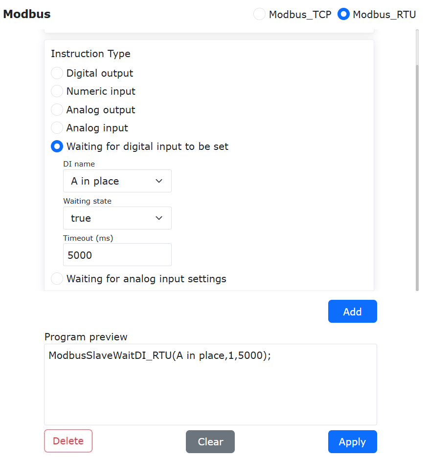

.. centered:: Abbildung 9.30-51 Hinzufügen eines Warte-auf-digitalen-Eingangs-Befehls

Nun wurde dem Roboterprogramm "testModbusRTUSlave.lua" ein Befehl zum Warten auf einen digitalen Eingang für den Modbus-Slave hinzugefügt. Nach dem Start des Programms wartet der Roboter, bis der Wert des Spulenregisters "A bereit" des Slaves auf true, also 1, wird. Da die Timeout-Zeit auf 5 s eingestellt ist, meldet das Roboterprogramm einen Timeout-Fehler und stoppt automatisch, wenn das Signal "A bereit" nach 5 s Wartezeit immer noch 0 ist.

.. image:: coding/391.png
   :width: 4in
   :align: center

.. centered:: Abbildung 9.30-52 Programm zum Warten auf digitalen Eingang

Warten auf analogen Eingang
""""""""""""""""""""""""""""

Öffnen Sie die Seite zum Hinzufügen von ModbusRTU-Slave-Befehlen. Suchen Sie nach "Einstellungen für Warten auf analogen Eingang". Wählen Sie als AI-Namen das konfigurierte Register "Strom". Wählen Sie den Wartezustand ">" und den Registerwert 255. Stellen Sie die Timeout-Zeit auf 5000 ms ein. Klicken Sie auf die Schaltfläche "Hinzufügen" und dann auf die Schaltfläche "Übernehmen".

.. image:: coding/392.png
   :width: 4in
   :align: center

.. centered:: Abbildung 9.30-53 Hinzufügen eines Warte-auf-analogen-Eingangs-Befehls

Nun wurde dem Roboterprogramm "testModbusRTUSlave.lua" ein Befehl zum Warten auf den Wert eines analogen Eingangs für den Modbus-Slave hinzugefügt. Nach dem Start des Programms wartet der Roboter, bis der Wert des Registers "Strom" des Slaves größer als 255 ist. Da die Timeout-Zeit auf 5 s eingestellt ist, meldet das Roboterprogramm einen Timeout-Fehler und stoppt automatisch, wenn der Wert des Signals "Strom" nach 5 s Wartezeit immer noch nicht größer als 255 ist.

.. image:: coding/393.png
   :width: 4in
   :align: center

.. centered:: Abbildung 9.30-54 Programm zum Warten auf ein analoges Eingangsregister

Öffnen Sie die Seite zum Hinzufügen von ModbusRTU-Slave-Befehlen. Suchen Sie nach "Einstellungen für Warten auf analogen Eingang", d. h. Warten auf AI-Eingangsregister. Wählen Sie als AI-Namen das konfigurierte Register "Füllstand". Wählen Sie den Wartezustand "=" und den Registerwert 255. Stellen Sie die Timeout-Zeit auf 5000 ms ein. Klicken Sie auf die Schaltfläche "Hinzufügen" und dann auf die Schaltfläche "Übernehmen".

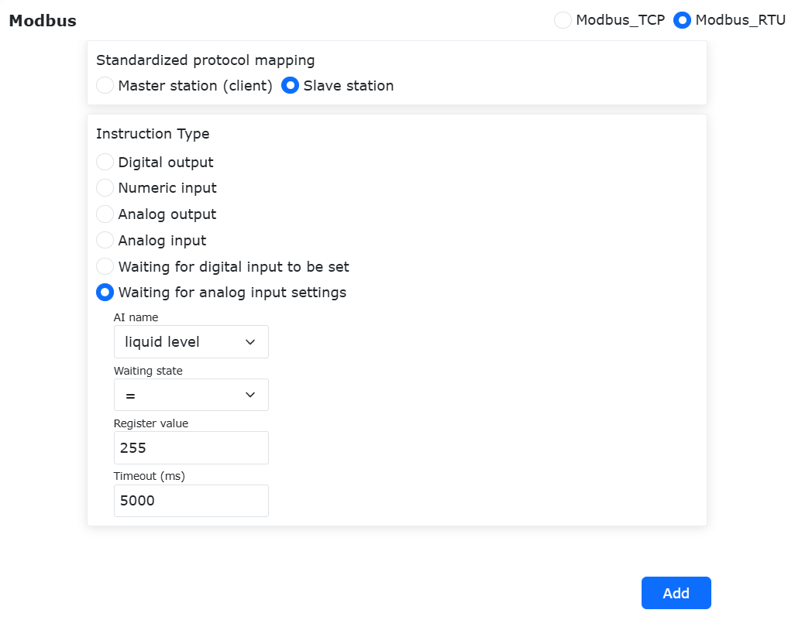

.. centered:: Abbildung 9.30-54-2 Hinzufügen eines Warte-auf-analogen-Eingangs-Befehls

Nun wurde dem Roboterprogramm "test.lua" ein Befehl zum Warten auf den Wert eines AI-Eingangsregisters für den Modbus RTU-Slave hinzugefügt. Nach dem Start des Programms wartet der Roboter, bis der Wert des Registers "Füllstand" gleich 255 ist. Da die Timeout-Zeit auf 5 s eingestellt ist, meldet das Roboterprogramm einen Timeout-Fehler und stoppt automatisch, wenn der Wert des Signals "Füllstand" nach 5 s Wartezeit immer noch nicht gleich 255 ist.

Roboterstatusrückmeldung und -steuerung über ModbusRTU-Slave
*************************************************************

Die Eingangsregisteradressen 0x1010-0x104C des ModbusRTU-Slaves des kollaborativen Roboters werden zur Rückmeldung des Roboter-Echtzeitstatus verwendet (die genaue Adressdefinition finden Sie in Anhang I: ModbusRTU-Slave-Adresszuordnungstabelle). Sie müssen nur die entsprechenden Registerwerte mit dem Master-Gerät lesen, um die entsprechenden Roboter-Echtzeitstatusdaten zu erhalten.

Die Spulenregisteradressen 0x4040-0x405C des ModbusRTU-Slaves des kollaborativen Roboters werden vom Master-Gerät zur Steuerung des Roboters verwendet (die genaue Adressdefinition finden Sie in Anhang I: ModbusRTU-Slave-Adresszuordnungstabelle). Am Beispiel der Spulenadresse 0x4054 bedeutet diese Adressfunktion "Programm starten". Wenn sich der Roboter im Automatikmodus befindet und das Master-Gerät den Wert an Adresse 0x4054 von 0 auf 1 setzt, beginnt der Roboter automatisch mit der Ausführung des aktuell konfigurierten Programms. Ein weiteres Beispiel ist die Spulenadresse 0x4040, die zur Steuerung des Ausgangs von Steuerpult-DO0 verwendet wird. Wenn das externe Master die Spulenadresse 0x4040 von 0 auf 1 setzt, wird der Steuerpult-DO0 automatisch aktiv. Wenn das externe Master die Spulenadresse 0x4040 von 1 auf 0 setzt, wird der Steuerpult-DO0 deaktiviert. Klicken Sie auf der ModbusRTU-Slave-Einstellungsseite auf "Funktionsdigitaleingänge (Spulen)", um alle aktuellen Funktionsdigitaleingänge zu überwachen.

.. image:: coding/396.png
   :width: 4in
   :align: center

.. centered:: Abbildung 9.30-55 Funktionsdigitaleingänge des Roboterslaves

Anhang I: Modbus Rtu Slave-Adresszuordnungstabelle

.. list-table::
   :widths: 15 20 25 15 20 10
   :header-rows: 0
   :align: center

   * - **Drittanbieter-Controller Sende-Adresse**
     - **Typ**
     - **Name**
     - **Datentyp**
     - **Funktionscode**
     - **Lesen/Schreiben**

   * - 0x3000
     - Allg. digitaler Ausgang (diskret)
     - DO0
     - BOOL
     - 0x02
     - Nur Lesen

   * - 0x3001
     - Allg. digitaler Ausgang (diskret)
     - DO1
     - BOOL
     - 0x02
     - Nur Lesen

   * - 0x3002
     - Allg. digitaler Ausgang (diskret)
     - DO2
     - BOOL
     - 0x02
     - Nur Lesen

   * - 0x3003
     - Allg. digitaler Ausgang (diskret)
     - DO3
     - BOOL
     - 0x02
     - Nur Lesen

   * - ...
     - Allg. digitaler Ausgang (diskret)
     - ...
     - BOOL
     - 0x02
     - Nur Lesen

   * - 0x303F
     - Allg. digitaler Ausgang (diskret)
     - DO127
     - BOOL
     - 0x02
     - Nur Lesen

   * - 0x4000
     - Allg. digitaler Eingang (Spule)
     - DI0
     - BOOL
     - 0x01, 0x05, 0x0F
     - Lesen/Schreiben

   * - 0x4001
     - Allg. digitaler Eingang (Spule)
     - DI1
     - BOOL
     - 0x01, 0x05, 0x0F
     - Lesen/Schreiben

   * - 0x4002
     - Allg. digitaler Eingang (Spule)
     - DI2
     - BOOL
     - 0x01, 0x05, 0x0F
     - Lesen/Schreiben

   * - 0x4003
     - Allg. digitaler Eingang (Spule)
     - DI3
     - BOOL
     - 0x01, 0x05, 0x0F
     - Lesen/Schreiben

   * - ...
     - Allg. digitaler Eingang (Spule)
     - ...
     - BOOL
     - 0x01, 0x05, 0x0F
     - Lesen/Schreiben

   * - 0x403F
     - Allg. digitaler Eingang (Spule)
     - DI64
     - BOOL
     - 0x01, 0x05, 0x0F
     - Lesen/Schreiben

   * - 0x4040
     - Robotersteuerung
     - Steuerpult DO0
     - BOOL
     - 0x01, 0x05, 0x0F
     - Lesen/Schreiben

   * - 0x4041
     - Robotersteuerung
     - Steuerpult DO1
     - BOOL
     - 0x01, 0x05, 0x0F
     - Lesen/Schreiben

   * - 0x4042
     - Robotersteuerung
     - Steuerpult DO2
     - BOOL
     - 0x01, 0x05, 0x0F
     - Lesen/Schreiben

   * - 0x4043
     - Robotersteuerung
     - Steuerpult DO3
     - BOOL
     - 0x01, 0x05, 0x0F
     - Lesen/Schreiben

   * - 0x4044
     - Robotersteuerung
     - Steuerpult DO4
     - BOOL
     - 0x01, 0x05, 0x0F
     - Lesen/Schreiben

   * - 0x4045
     - Robotersteuerung
     - Steuerpult DO5
     - BOOL
     - 0x01, 0x05, 0x0F
     - Lesen/Schreiben

   * - 0x4046
     - Robotersteuerung
     - Steuerpult DO6
     - BOOL
     - 0x01, 0x05, 0x0F
     - Lesen/Schreiben

   * - 0x4047
     - Robotersteuerung
     - Steuerpult DO7
     - BOOL
     - 0x01, 0x05, 0x0F
     - Lesen/Schreiben

   * - 0x4048
     - Robotersteuerung
     - Steuerpult CO0
     - BOOL
     - 0x01, 0x05, 0x0F
     - Lesen/Schreiben

   * - 0x4049
     - Robotersteuerung
     - Steuerpult CO1
     - BOOL
     - 0x01, 0x05, 0x0F
     - Lesen/Schreiben

   * - 0x404A
     - Robotersteuerung
     - Steuerpult CO2
     - BOOL
     - 0x01, 0x05, 0x0F
     - Lesen/Schreiben

   * - 0x404B
     - Robotersteuerung
     - Steuerpult CO3
     - BOOL
     - 0x01, 0x05, 0x0F
     - Lesen/Schreiben

   * - 0x404C
     - Robotersteuerung
     - Steuerpult CO4
     - BOOL
     - 0x01, 0x05, 0x0F
     - Lesen/Schreiben

   * - 0x404D
     - Robotersteuerung
     - Steuerpult CO5
     - BOOL
     - 0x01, 0x05, 0x0F
     - Lesen/Schreiben

   * - 0x404E
     - Robotersteuerung
     - Steuerpult CO6
     - BOOL
     - 0x01, 0x05, 0x0F
     - Lesen/Schreiben

   * - 0x404F
     - Robotersteuerung
     - Steuerpult CO7
     - BOOL
     - 0x01, 0x05, 0x0F
     - Lesen/Schreiben

   * - 0x4050
     - Robotersteuerung
     - Werkzeug DO0
     - BOOL
     - 0x01, 0x05, 0x0F
     - Lesen/Schreiben

   * - 0x4051
     - Robotersteuerung
     - Werkzeug DO1
     - BOOL
     - 0x01, 0x05, 0x0F
     - Lesen/Schreiben

   * - 0x4052
     - Robotersteuerung
     - Pause
     - BOOL
     - 0x01, 0x05, 0x0F
     - Lesen/Schreiben

   * - 0x4053
     - Robotersteuerung
     - Fortsetzen
     - BOOL
     - 0x01, 0x05, 0x0F
     - Lesen/Schreiben

   * - 0x4054
     - Robotersteuerung
     - Start
     - BOOL
     - 0x01, 0x05, 0x0F
     - Lesen/Schreiben

   * - 0x4055
     - Robotersteuerung
     - Stopp
     - BOOL
     - 0x01, 0x05, 0x0F
     - Lesen/Schreiben

   * - 0x4056
     - Robotersteuerung
     - Zum Arbeitsursprung fahren
     - BOOL
     - 0x01, 0x05, 0x0F
     - Lesen/Schreiben

   * - 0x4057
     - Robotersteuerung
     - Hand/Auto Umschaltung
     - BOOL
     - 0x01, 0x05, 0x0F
     - Lesen/Schreiben

   * - 0x4058
     - Robotersteuerung
     - Hauptprogramm starten
     - BOOL
     - 0x01, 0x05, 0x0F
     - Lesen/Schreiben

   * - 0x4059
     - Robotersteuerung
     - Reduktionsmodus Stufe 1
     - BOOL
     - 0x01, 0x05, 0x0F
     - Lesen/Schreiben

   * - 0x405A
     - Robotersteuerung
     - Reduktionsmodus Stufe 2
     - BOOL
     - 0x01, 0x05, 0x0F
     - Lesen/Schreiben

   * - 0x405B
     - Robotersteuerung
     - Reduktionsmodus Stufe 3 (Stopp)
     - BOOL
     - 0x01, 0x05, 0x0F
     - Lesen/Schreiben

   * - 0x405C
     - Robotersteuerung
     - Alle Fehler löschen
     - BOOL
     - 0x01, 0x05, 0x0F
     - Lesen/Schreiben

   * - 0x405D
     - Robotersteuerung
     - Reserviert
     - BOOL
     - 0x01, 0x05, 0x0F
     - Lesen/Schreiben

   * - 0x405E
     - Robotersteuerung
     - Reserviert
     - BOOL
     - 0x01, 0x05, 0x0F
     - Lesen/Schreiben

   * - 0x1000
     - Analogeingang
     - AO0
     - INT16
     - 0x04
     - Nur Lesen

   * - 0x1001
     - Analogeingang
     - AO1
     - INT16
     - 0x04
     - Nur Lesen

   * - 0x1002
     - Analogeingang
     - AO2
     - INT16
     - 0x04
     - Nur Lesen

   * - ...
     - Analogeingang
     - ...
     - INT16
     - 0x04
     - Nur Lesen

   * - 0x100F
     - Analogeingang
     - AO15
     - INT16
     - 0x04
     - Nur Lesen

   * - 0x1010
     - Roboterstatus
     - Aktivierungsstatus 0-nicht aktiviert, 1-aktiviert
     - UINT16
     - 0x04
     - Nur Lesen

   * - 0x1011
     - Roboterstatus
     - Robotermodus, 1-Handmodus, 0-Automatikmodus
     - UINT16
     - 0x04
     - Nur Lesen

   * - 0x1012
     - Roboterstatus
     - Roboterbetriebsstatus 1-Gestoppt, 2-Läuft, 3-Pausiert, 4-Drag
     - UINT16
     - 0x04
     - Nur Lesen

   * - 0x1013
     - Roboterstatus
     - Werkzeugnummer
     - UINT16
     - 0x04
     - Nur Lesen

   * - 0x1014
     - Roboterstatus
     - Werkstücknummer
     - UINT16
     - 0x04
     - Nur Lesen

   * - 0x1015
     - Roboterstatus
     - Not-Halt Status 0-kein Not-Halt, 1-Not-Halt
     - UINT16
     - 0x04
     - Nur Lesen

   * - 0x1016
     - Roboterstatus
     - Soft-Limit-Überschreitung Fehler
     - UINT16
     - 0x04
     - Nur Lesen

   * - 0x1017
     - Roboterstatus
     - Hauptfehlercode
     - UINT16
     - 0x04
     - Nur Lesen

   * - 0x1018
     - Roboterstatus
     - Subfehlercode
     - UINT16
     - 0x04
     - Nur Lesen

   * - 0x1019
     - Roboterstatus
     - Kollisionserkennung, 1-Kollision, 0-keine Kollision
     - UINT16
     - 0x04
     - Nur Lesen

   * - 0x101A
     - Roboterstatus
     - Bewegung abgeschlossen Signal
     - UINT16
     - 0x04
     - Nur Lesen

   * - 0x101B
     - Roboterstatus
     - Sicherheitsstopp Signal SI0
     - UINT16
     - 0x04
     - Nur Lesen

   * - 0x101C
     - Roboterstatus
     - Sicherheitsstopp Signal SI1
     - UINT16
     - 0x04
     - Nur Lesen

   * - 0x101D
     - Roboterstatus
     - Steuerpult Analog Eingang AI0
     - UINT16
     - 0x04
     - Nur Lesen

   * - 0x101E
     - Roboterstatus
     - Steuerpult Analog Eingang AI1
     - UINT16
     - 0x04
     - Nur Lesen

   * - 0x101F
     - Roboterstatus
     - Werkzeug Analog Eingang AI0
     - UINT16
     - 0x04
     - Nur Lesen

   * - 0x1020
     - Roboterstatus
     - Steuerpult Analog Ausgang AO0
     - UINT16
     - 0x04
     - Nur Lesen

   * - 0x1021
     - Roboterstatus
     - Steuerpult Analog Ausgang AO1
     - UINT16
     - 0x04
     - Nur Lesen

   * - 0x1022
     - Roboterstatus
     - Werkzeug Analog Ausgang AO0
     - UINT16
     - 0x04
     - Nur Lesen

   * - 0x1023
     - Roboterstatus
     - Steuerpult Digital Eingang Bit0-Bit7 entspricht DI0-DI7, Bit8-Bit15 entspricht CI0-CI7
     - UINT16
     - 0x04
     - Nur Lesen

   * - 0x1024
     - Roboterstatus
     - Werkzeug Digital Eingang Bit0-Bit15 entspricht DI0-DI15
     - UINT16
     - 0x04
     - Nur Lesen

   * - 0x1025
     - Roboterstatus
     - Steuerpult Digital Ausgang Bit0-Bit7 entspricht DO0-DO7, Bit8-Bit15 entspricht CO0-CO7
     - UINT16
     - 0x04
     - Nur Lesen

   * - 0x1026
     - Roboterstatus
     - Werkzeug Digital Ausgang Bit0-Bit15 entspricht DO0-DO15
     - UINT16
     - 0x04
     - Nur Lesen

   * - 0x1027
     - Roboterstatus
     - TCP-Geschwindigkeit
     - FLOAT32 (Big-Endian)
     - 0x04
     - Nur Lesen

   * - 0x1028
     - Roboterstatus
     - TCP-Geschwindigkeit
     - FLOAT32 (Big-Endian)
     - 0x04
     - Nur Lesen

   * - 0x1029
     - Roboterstatus
     - Gelenk 1 Position
     - FLOAT32 (Big-Endian)
     - 0x04
     - Nur Lesen

   * - 0x102A
     - Roboterstatus
     - Gelenk 1 Position
     - FLOAT32 (Big-Endian)
     - 0x04
     - Nur Lesen

   * - 0x102B
     - Roboterstatus
     - Gelenk 2 Position
     - FLOAT32 (Big-Endian)
     - 0x04
     - Nur Lesen

   * - 0x102C
     - Roboterstatus
     - Gelenk 2 Position
     - FLOAT32 (Big-Endian)
     - 0x04
     - Nur Lesen

   * - 0x102D
     - Roboterstatus
     - Gelenk 3 Position
     - FLOAT32 (Big-Endian)
     - 0x04
     - Nur Lesen

   * - 0x102E
     - Roboterstatus
     - Gelenk 3 Position
     - FLOAT32 (Big-Endian)
     - 0x04
     - Nur Lesen

   * - 0x102F
     - Roboterstatus
     - Gelenk 4 Position
     - FLOAT32 (Big-Endian)
     - 0x04
     - Nur Lesen

   * - 0x1030
     - Roboterstatus
     - Gelenk 4 Position
     - FLOAT32 (Big-Endian)
     - 0x04
     - Nur Lesen

   * - 0x1031
     - Roboterstatus
     - Gelenk 5 Position
     - FLOAT32 (Big-Endian)
     - 0x04
     - Nur Lesen

   * - 0x1032
     - Roboterstatus
     - Gelenk 5 Position
     - FLOAT32 (Big-Endian)
     - 0x04
     - Nur Lesen

   * - 0x1033
     - Roboterstatus
     - Gelenk 6 Position
     - FLOAT32 (Big-Endian)
     - 0x04
     - Nur Lesen

   * - 0x1034
     - Roboterstatus
     - Gelenk 6 Position
     - FLOAT32 (Big-Endian)
     - 0x04
     - Nur Lesen

   * - 0x1035
     - Roboterstatus
     - Gelenk 1 Geschwindigkeit
     - FLOAT32 (Big-Endian)
     - 0x04
     - Nur Lesen

   * - 0x1036
     - Roboterstatus
     - Gelenk 1 Geschwindigkeit
     - FLOAT32 (Big-Endian)
     - 0x04
     - Nur Lesen

   * - 0x1037
     - Roboterstatus
     - Gelenk 2 Geschwindigkeit
     - FLOAT32 (Big-Endian)
     - 0x04
     - Nur Lesen

   * - 0x1038
     - Roboterstatus
     - Gelenk 2 Geschwindigkeit
     - FLOAT32 (Big-Endian)
     - 0x04
     - Nur Lesen

   * - 0x1039
     - Roboterstatus
     - Gelenk 3 Geschwindigkeit
     - FLOAT32 (Big-Endian)
     - 0x04
     - Nur Lesen

   * - 0x103A
     - Roboterstatus
     - Gelenk 3 Geschwindigkeit
     - FLOAT32 (Big-Endian)
     - 0x04
     - Nur Lesen

   * - 0x103B
     - Roboterstatus
     - Gelenk 4 Geschwindigkeit
     - FLOAT32 (Big-Endian)
     - 0x04
     - Nur Lesen

   * - 0x103C
     - Roboterstatus
     - Gelenk 4 Geschwindigkeit
     - FLOAT32 (Big-Endian)
     - 0x04
     - Nur Lesen

   * - 0x103D
     - Roboterstatus
     - Gelenk 5 Geschwindigkeit
     - FLOAT32 (Big-Endian)
     - 0x04
     - Nur Lesen

   * - 0x103E
     - Roboterstatus
     - Gelenk 5 Geschwindigkeit
     - FLOAT32 (Big-Endian)
     - 0x04
     - Nur Lesen

   * - 0x103F
     - Roboterstatus
     - Gelenk 6 Geschwindigkeit
     - FLOAT32 (Big-Endian)
     - 0x04
     - Nur Lesen

   * - 0x1040
     - Roboterstatus
     - Gelenk 6 Geschwindigkeit
     - FLOAT32 (Big-Endian)
     - 0x04
     - Nur Lesen

   * - 0x1041
     - Roboterstatus
     - TCP Position X
     - FLOAT32 (Big-Endian)
     - 0x04
     - Nur Lesen

   * - 0x1042
     - Roboterstatus
     - TCP Position X
     - FLOAT32 (Big-Endian)
     - 0x04
     - Nur Lesen

   * - 0x1043
     - Roboterstatus
     - TCP Position Y
     - FLOAT32 (Big-Endian)
     - 0x04
     - Nur Lesen

   * - 0x1044
     - Roboterstatus
     - TCP Position Y
     - FLOAT32 (Big-Endian)
     - 0x04
     - Nur Lesen

   * - 0x1045
     - Roboterstatus
     - TCP Position Z
     - FLOAT32 (Big-Endian)
     - 0x04
     - Nur Lesen

   * - 0x1046
     - Roboterstatus
     - TCP Position Z
     - FLOAT32 (Big-Endian)
     - 0x04
     - Nur Lesen

   * - 0x1047
     - Roboterstatus
     - TCP Position RX
     - FLOAT32 (Big-Endian)
     - 0x04
     - Nur Lesen

   * - 0x1048
     - Roboterstatus
     - TCP Position RX
     - FLOAT32 (Big-Endian)
     - 0x04
     - Nur Lesen

   * - 0x1049
     - Roboterstatus
     - TCP Position RY
     - FLOAT32 (Big-Endian)
     - 0x04
     - Nur Lesen

   * - 0x104A
     - Roboterstatus
     - TCP Position RY
     - FLOAT32 (Big-Endian)
     - 0x04
     - Nur Lesen

   * - 0x104B
     - Roboterstatus
     - TCP Position RZ
     - FLOAT32 (Big-Endian)
     - 0x04
     - Nur Lesen

   * - 0x104C
     - Roboterstatus
     - TCP Position RZ
     - FLOAT32 (Big-Endian)
     - 0x04
     - Nur Lesen

   * - 0x104D
     - Analogeingang
     - AO16
     - FLOAT32 (Big-Endian)
     - 0x04
     - Nur Lesen

   * - 0x104E
     - Analogeingang
     - AO16
     - FLOAT32 (Big-Endian)
     - 0x04
     - Nur Lesen

   * - 0x104F
     - Analogeingang
     - AO17
     - FLOAT32 (Big-Endian)
     - 0x04
     - Nur Lesen

   * - 0x1050
     - Analogeingang
     - AO17
     - FLOAT32 (Big-Endian)
     - 0x04
     - Nur Lesen

   * - ...
     - Analogeingang
     - ...
     - FLOAT32 (Big-Endian)
     - 0x04
     - Nur Lesen

   * - 0x106B
     - Analogeingang
     - AO31
     - FLOAT32 (Big-Endian)
     - 0x04
     - Nur Lesen

   * - 0x106C
     - Analogeingang
     - AO31
     - FLOAT32 (Big-Endian)
     - 0x04
     - Nur Lesen

   * - 0x2000
     - Analogausgang
     - AI0
     - INT16
     - 0x03, 0x06, 0x10
     - Lesen/Schreiben

   * - 0x2001
     - Analogausgang
     - AI1
     - INT16
     - 0x03, 0x06, 0x10
     - Lesen/Schreiben

   * - 0x2002
     - Analogausgang
     - AI2
     - INT16
     - 0x03, 0x06, 0x10
     - Lesen/Schreiben

   * - ...
     - Analogausgang
     - ...
     - INT16
     - 0x03, 0x06, 0x10
     - Lesen/Schreiben

   * - 0x200F
     - Analogausgang
     - AI15
     - INT16
     - 0x03, 0x06, 0x10
     - Lesen/Schreiben

   * - 0x2010
     - Analogausgang
     - AI16
     - FLOAT32(Big-Endian)
     - 0x03, 0x06, 0x10
     - Lesen/Schreiben

   * - 0x2011
     - Analogausgang
     - AI16
     - FLOAT32(Big-Endian)
     - 0x03, 0x06, 0x10
     - Lesen/Schreiben

   * - 0x2012
     - Analogausgang
     - AI17
     - FLOAT32(Big-Endian)
     - 0x03, 0x06, 0x10
     - Lesen/Schreiben

   * - 0x2013
     - Analogausgang
     - AI17
     - FLOAT32(Big-Endian)
     - 0x03, 0x06, 0x10
     - Lesen/Schreiben

   * - ...
     - Analogausgang
     - ...
     - FLOAT32(Big-Endian)
     - 0x03, 0x06, 0x10
     - Lesen/Schreiben

   * - 0x202E
     - Analogausgang
     - AI31
     - FLOAT32(Big-Endian)
     - 0x03, 0x06, 0x10
     - Lesen/Schreiben

   * - 0x202F
     - Analogausgang
     - AI31
     - FLOAT32(Big-Endian)
     - 0x03, 0x06, 0x10
     - Lesen/Schreiben

Schutz der Posenanpassungsfunktion basierend auf dem 6-Achsen-Kraftsensor
~~~~~~~~~~~~~~~~~~~~~~~~~~~~~~~~~~~~~~~~~~~~~~~~~~~~~~~~~~~~~~~~~~~~~~~~~~

Übersicht
+++++++++

Derzeit wird bei der Posenanpassungsfunktion unter FT_Control des FR-Roboters die maximale Anpassung nicht begrenzt. Nachdem der 6-Achsen-Kraftsensor ein externes Drehmoment empfängt, weicht das Roboterende kontinuierlich ab, was gefährlich sein kann.

Der Posenanpassungsfunktion unter FT_Control wurde eine Begrenzung des maximalen Anpassungswinkels hinzugefügt. Ein benutzerdefinierter Schwellwert kann festgelegt werden, um die Posenanpassungsfunktion sanfter zu gestalten.

Ablauf
++++++

**Schritt 1**: Klicken Sie auf "Initiale Einstellungen" -> "Grundlagen" -> "Werkzeugkoordinaten", um zur Oberfläche für die Werkzeugkoordinateneinstellung zu gelangen. Wählen Sie den "Koordinatensystemname" und stellen Sie die Koordinatensystemparameter entsprechend dem Endeffektorwerkzeug ein.

.. image:: coding/443.png
   :width: 4in
   :align: center

.. centered:: Abbildung 9.31-1 Werkzeugkoordinateneinstellung

**Schritt 2**: Klicken Sie auf "Teach-Programm" -> "Programmierung". Schreiben Sie ein Lua-Skript für die Kraftregelung. Wählen Sie "Kraftregelungsset" -> "Control". Fügen Sie einen Kraftregelungs-Bewegungsbefehl hinzu. Setzen Sie die Ausrichtungsanpassung auf "Ein". Der maximale Anpassungswinkel wird als Schwellwert für den Ausrichtungsanpassungswinkel festgelegt.

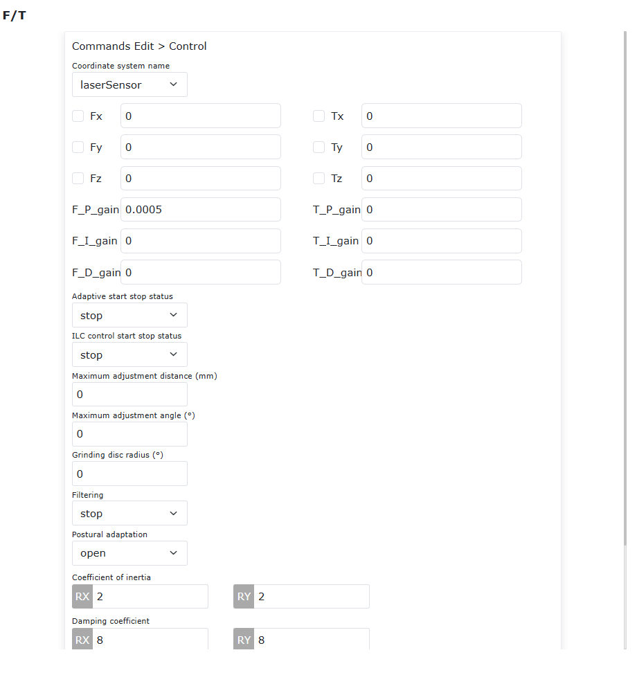

.. centered:: Abbildung 9.31-2 Kraftregelungs-Bewegungsbefehl

**Schritt 3**: Klicken Sie auf der Weboberfläche auf "FT". Stellen Sie das Referenzkoordinatensystem des 6-Achsen-Kraftsensors ein. Wählen Sie als Referenzkoordinatensystem "Benutzerdefiniertes Koordinatensystem" und stellen Sie die entsprechenden Koordinatensystemparameter ein.
Wenn die Anpassung des Posenanpassungswinkels um das Werkzeugkoordinatensystem erfolgt, setzen Sie die Referenzkoordinatensystemparameter auf "0". Wenn die Anpassung des Posenanpassungswinkels um das Endflansch-Koordinatensystem erfolgt, setzen Sie die Referenzkoordinatensystemparameter auf die Koordinatensystemparameter, die dem Endeffektorwerkzeug entsprechen.

.. image:: coding/445.png
   :width: 4in
   :align: center

.. centered:: Abbildung 9.31-3 Einstellung des Referenzkoordinatensystems des 6-Achsen-Kraftsensors

**Schritt 4**: Führen Sie das Skript aus und beobachten Sie die Wirkung der Ausrichtungsanpassung. Der Anpassungswinkel der Posenanpassung unter konstanter Kraft wird auf den benutzerdefinierten maximalen Anpassungswinkel begrenzt.

Socket-Kommunikationsoberflächenfunktion
~~~~~~~~~~~~~~~~~~~~~~~~~~~~~~~~~~~~~~~~

Socket-Konfiguration
++++++++++++++++++++

Bei Verwendung der Socket-Kommunikationsoberflächenfunktion muss nach dem Einschalten des Roboters zunächst die Webseite aufgerufen werden, um das Socket-Protokoll zu konfigurieren. Die Konfiguration wird nach dem Ausschalten gespeichert.

Klicken Sie auf "Teach-Programm" - "Programmierung". Klicken Sie im oberen Menü auf "Socket Netzwerk-Debugging", um zur Socket-Konfigurationsoberfläche zu gelangen. Klicken Sie auf "Socket hinzufügen", um die Socket-Parameter zu konfigurieren. Es können maximal vier Sockets hinzugefügt werden.

.. image:: coding/446.png
   :width: 6in
   :align: center

.. centered:: Abbildung 9.32-1 Socket Netzwerk-Debugging-Oberfläche

.. image:: coding/447.png
   :width: 6in
   :align: center

.. centered:: Abbildung 9.32-2 Socket-Konfigurationsparameter-Oberfläche

Kommunikationsparametereinstellung
**********************************

Die Kommunikationsprotokolle unterstützen UDP, TCP-Server und TCP-Client.

Die Datentypen unterstützen ASCII und HEX. Nachdem der Datentyp konfiguriert wurde, werden alle Datenübertragungen und -empfänge dieser Socket-Verbindung entsprechend dem konfigurierten Typ verarbeitet.

Heartbeat-Erkennungsmechanismus
********************************

Der Heartbeat-Erkennungsmechanismus gilt nur für TCP-Server und TCP-Clients.

Der Heartbeat-Erkennungsmechanismus verwendet den Keepalive-Mechanismus, um den aktiven Status der Verbindung zu erkennen und aufrechtzuerhalten und unbeabsichtigte Unterbrechungen bei längerer Inaktivität zu verhindern. Er enthält hauptsächlich die folgenden Parameter:

- Erkennungsintervall: Zeit der Inaktivität, nach der Keepalive-Erkennungspakete gesendet werden, in Sekunden.
- Erkennungszeit: Intervall zwischen den Erkennungspaketen, in Sekunden.
- Erkennungsanzahl: Maximale Anzahl der zu sendenden Erkennungspakete.

Wiederverbindungsmechanismus bei Verbindungsabbruch
***************************************************

Der Wiederverbindungsmechanismus bei Verbindungsabbruch gilt nur für TCP-Clients.

Wenn der Wiederverbindungsmechanismus bei Verbindungsabbruch aktiviert ist und beim Starten des TCP-Clients eine Trennung vom Server erkannt wird, wird aktiv versucht, die Verbindung wiederherzustellen. Wenn nach Erreichen der maximalen Anzahl von Wiederverbindungsversuchen immer noch keine Verbindung hergestellt werden konnte, wird die Verbindung getrennt. Er enthält hauptsächlich die folgenden Parameter:

- Wiederverbindungsintervall: Intervall zwischen den Wiederverbindungsversuchen, in ms. Es wird empfohlen, einen Wert im Sekundenbereich zu wählen.
- Maximale Anzahl von Wiederverbindungsversuchen: Maximale Anzahl von Wiederverbindungsversuchen.

Benutzerdefinierte Protokollanalyse
***********************************

Nach Aktivierung der benutzerdefinierten Protokollanalyse werden die gesendeten und empfangenen Daten gemäß der Protokollkonfiguration verpackt oder analysiert.

Das benutzerdefinierte Protokoll kann automatisch basierend auf den Konfigurationsparametern generiert werden. Im ASCII-Modus wird die Kombination von Frame-Header, Frame-Zähler, Datenlänge und Frame-Ende unterstützt. Trennzeichen können zur Datentrennung verwendet werden. Im HEX-Modus wird die Kombination von Frame-Header, Frame-Zähler, Datenlänge, Prüfverfahren und Frame-Ende unterstützt.

.. image:: coding/448.png
   :width: 6in
   :align: center

.. centered:: Abbildung 9.32-3 Benutzerdefinierte Protokollkonfiguration im ASCII-Modus

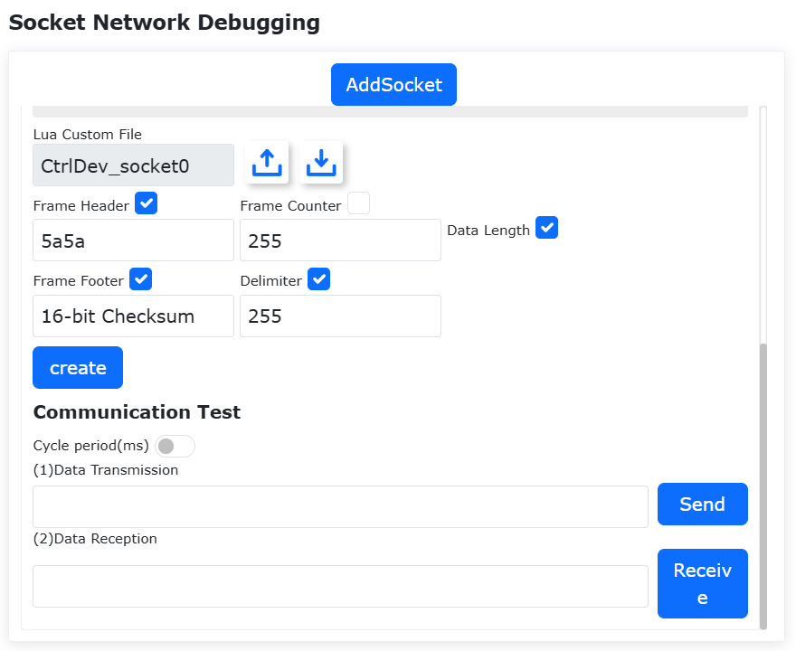

.. centered:: Abbildung 9.32-4 Benutzerdefinierte Protokollkonfiguration im HEX-Modus

Nachdem Sie das benutzerdefinierte Protokoll konfiguriert haben, klicken Sie auf die Schaltfläche "Generieren". Es wird automatisch die entsprechende Lua-Datei generiert. Die Lua-Datei unterstützt Import- und Exportfunktionen. Das Protokoll kann durch benutzerdefinierte Änderungen des Dateicodes flexibel angepasst werden.

Socket-Verbindung
+++++++++++++++++

Verbindungsanzeige auf der Oberfläche
*************************************

Nachdem Sie die Socket-Informationen konfiguriert haben, können Sie diese Socket-Verbindung herstellen. Der Verbindungsstatus umfasst die folgenden drei Zustände:

- Weiß: Verbindung nicht hergestellt.

.. image:: coding/450.png
   :width: 6in
   :align: center

.. centered:: Abbildung 9.32-5 Nicht verbundener Zustand

- Gelb: TCP-Server wartet auf Verbindung oder TCP-Client fordert Verbindung an.

.. image:: coding/451.png
   :width: 6in
   :align: center

.. centered:: Abbildung 9.32-6 Wartezustand für Verbindung

- Grün: Verbindung erfolgreich hergestellt.

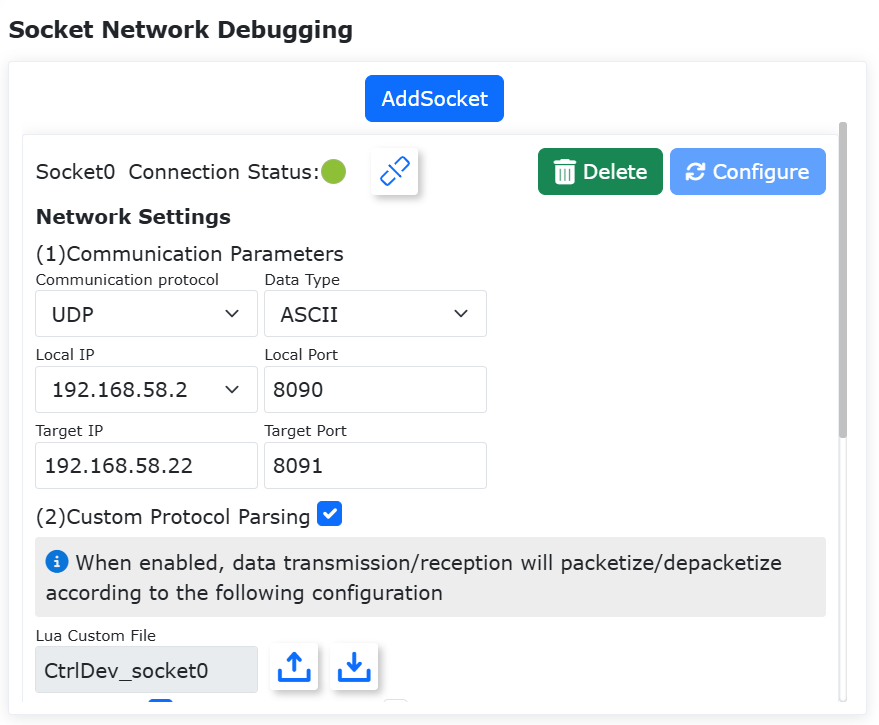

.. centered:: Abbildung 9.32-7 Erfolgreich verbundener Zustand

Verbindungsbefehlmodul
***********************

Klicken Sie auf "Teach-Programm" - "Programmierung" - "Kommunikationsbefehle" und wählen Sie den Befehl "Socket". Es können Befehle zum Öffnen und Schließen einer Socket-Verbindung generiert werden, die für die Lua-Programmierung verwendet werden. Die Socket-ID kann nur eine bereits konfigurierte Socket-Verbindung auswählen.

.. image:: coding/453.png
   :width: 6in
   :align: center

.. centered:: Abbildung 9.32-8 Socket-Verbindungsbefehlmodul

Befehlserklärung:

- Verbindung öffnen Befehl: OpenSockeConnect(id);
- Parameter id: Bereits konfigurierte Socket-ID, Rückgabewert 0 bei Erfolg.
- Verbindung schließen Befehl: CloseSockeConnect(id);
- Parameter id: Bereits konfigurierte Socket-ID, Rückgabewert 0 bei Erfolg.

Socket-Kommunikation
++++++++++++++++++++

Kommunikationstest
******************

Die Oberfläche bietet einen Kommunikationstest. Daten können gesendet und empfangen werden, wie unten gezeigt.

.. image:: coding/454.png
   :width: 6in
   :align: center

.. centered:: Abbildung 9.32-9 Kommunikationstest

Das Senden von Daten über die Oberfläche erfolgt standardmäßig im blockierenden Modus. Es wird gewartet, bis die Bewegung abgeschlossen ist, bevor die Daten gesendet werden. Der Standard-Timeout für den Datenempfang beträgt 5 Sekunden. Bei Timeout wird ein Fehler gemeldet und angehalten. Die oben genannten Parameter können beim Senden des Befehlsmoduls angepasst werden.

Kommunikationsbefehlmodul
**************************

Klicken Sie auf "Teach-Programm" - "Programmierung" - "Kommunikationsbefehle" und wählen Sie den Befehl "Socket". Es können Socket-Kommunikationsbefehle zum Senden und Empfangen von Daten generiert werden, die für die Lua-Programmierung verwendet werden. Die Socket-ID kann nur eine bereits konfigurierte Socket-Verbindung auswählen, um Daten zu senden.

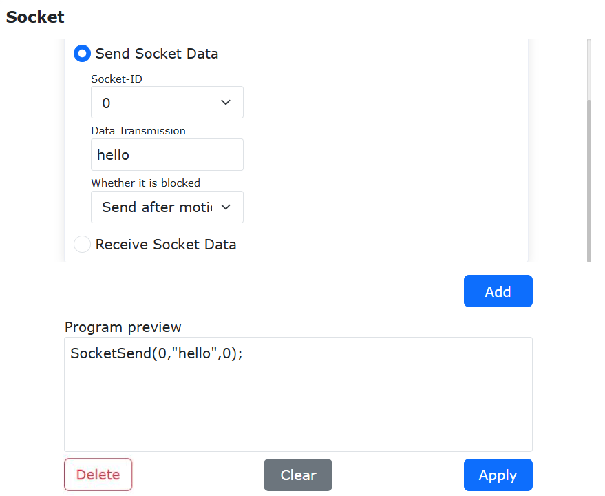

.. centered:: Abbildung 9.32-10 Senden von Socket-Daten

Die Befehlsparameter sind Socket-ID, die zu sendenden Daten und ob auf den Abschluss der Bewegung gewartet werden soll.

Befehlserklärung:

- Sende Befehl: SocketSend(id, data, block);
- Parameter: id, verbundene Socket-ID; data: zu sendende Daten, als Zeichenkette, der Inhalt muss mit dem konfigurierten Datentyp übereinstimmen, z. B. "hallo" oder "FA54DE"; block: ob Bewegung blockiert wird, 0: warten, bis Bewegung abgeschlossen, dann senden, 1: sofort senden. Rückgabewert 0 bei Erfolg.

Das Empfangen von Daten ist unten dargestellt.

.. image:: coding/456.png
   :width: 6in
   :align: center

.. centered:: Abbildung 9.32-11 Empfangen von Socket-Daten

Die Befehlsparameter sind Socket-ID, Empfangs-Timeout in Millisekunden und der Status nach Timeout.

Befehlserklärung:

- Empfangsbefehl: SocketReceive(id, timeout, stopStartegy);
- Parameter: id, verbundene Socket-ID; timeout: Empfangs-Timeout; stopStrategy: Strategie nach Timeout, 0: Fehler melden und anhalten, 1: nach Timeout weiterlaufen.
- Rückgabewerte: time: Empfangszeit, data: empfangene Daten.

Impedanzregelungsfunktion während der Roboterbewegung
~~~~~~~~~~~~~~~~~~~~~~~~~~~~~~~~~~~~~~~~~~~~~~~~~~~~~

Übersicht
+++++++++

Die Impedanzregelungsfunktion erkennt externe Kräfte in Echtzeit. Wenn der eingestellte Schwellwert erreicht wird, weicht der Roboter aktiv der Kraft aus und verlässt die Bewegungsbahn. Sinkt die Kraft unter den Schwellwert, kehrt er zur Bewegungsbahn zurück. Dies verbessert die Mensch-Roboter-Interaktion. Wenn diese Funktion eine externe Kraft erkennt, die den voreingestellten Kraftschwellwert überschreitet, wird der Roboterarm in Kraftrichtung ausweichen, um einen aktiven Ausweicheffekt zu erzielen. Nachdem die externe Kraft nachlässt, kehrt der Roboterarm in die Nähe der ursprünglichen Bewegungsbahn zurück, was die Sicherheit bei der Mensch-Roboter-Kollaboration erhöht.

Impedanzregelungsfunktion
+++++++++++++++++++++++++

Einstellung der Impedanzregelung im kartesischen Raum und Aktivierung/Deaktivierung der Funktion
************************************************************************************************

**Schritt 1**: Melden Sie sich an der Weboberfläche an und klicken Sie nacheinander auf "Initiale Einstellungen" -> "Grundlagen" -> "Gelenke" -> "Kollisionsstufe", um zum Einstellmodul für die Kollisionsstufe des Roboters zu gelangen. Stellen Sie einen angemessenen Kollisionskoeffizienten ein, wie in Abbildung 2-1 gezeigt.

.. image:: coding/473.png
   :width: 6in
   :align: center

.. centered:: Abbildung 9.34-1 Einstellmodul für den Kollisionskoeffizienten des Roboters

**Schritt 2**: Um die Impedanzregelungsfunktion mit einem Kraftsensor zu realisieren, muss der Kraftsensor in der Peripheriekonfiguration unter "Peripherie" -> "Endeffektorwerkzeug" konfiguriert werden. Wenn die Impedanzregelungsfunktion ohne Kraftsensor realisiert werden soll, ist dieser Schritt nicht erforderlich.

**Schritt 3**: Klicken Sie nacheinander auf "Teach-Programm" -> "Programmierung" -> "Kraftregelungssatz". Fügen Sie den Befehl "Impedance" hinzu. Der "Impedance"-Befehl ermöglicht es dem Roboter, eine Impedanzregelung auf seiner Bewegungsbahn durchzuführen (derzeit ist nur die Impedanzregelung im kartesischen Raum freigegeben).

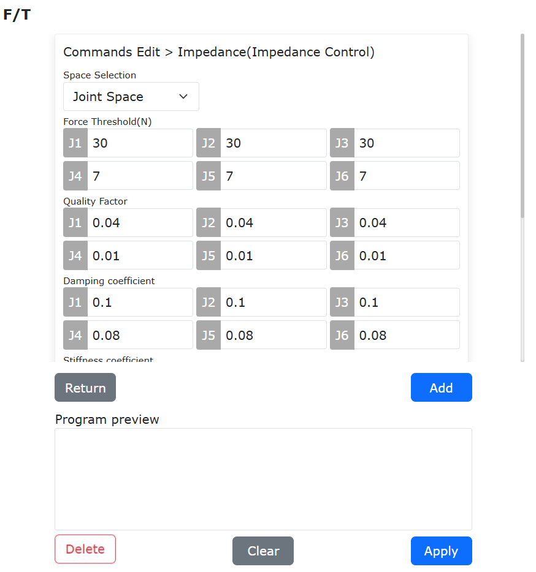

.. centered:: Abbildung 9.34-2 Hinzufügen eines Kraftregelungsbefehls

**Schritt 4**: Wählen Sie im Kraftregelungsbefehlmodul im Dropdown-Menü "Raum" die Option "Kartesischer Raum". Stellen Sie im Textfeld die geeigneten Kraftschwellwerte, Massenkoeffizienten, Dämpfungskoeffizienten, Steifigkeitskoeffizienten, maximale Lineargeschwindigkeit, maximale Linearbeschleunigung, maximale Winkelgeschwindigkeit und maximale Winkelbeschleunigung ein. Klicken Sie im Befehlstyp auf "Ein" und dann auf "Hinzufügen", um den Impedanzregelung-Ein-Befehl hinzuzufügen. Klicken Sie im Befehlstyp auf "Aus" und dann auf "Hinzufügen", um den Impedanzregelung-Aus-Befehl hinzuzufügen.

.. image:: coding/475.png
   :width: 6in
   :align: center

.. centered:: Abbildung 9.34-3 Beispiel für einen Impedanzregelungsbefehl

**Schritt 5**: Wenn der Roboterarm während des Betriebs anhält und in der linken unteren Ecke der Weboberfläche die Meldung "500 Fehler: Aktuelle Kollisionsstufe zu niedrig" angezeigt wird, liegt dies daran, dass der eingestellte Kraftschwellwert größer als der Auslöseschwellwert der Kollisionsstufe ist. Erhöhen Sie in diesem Fall die Kollisionsstufe oder verringern Sie den Kraftschwellwert, um den Fehler zu beheben.

.. image:: coding/476.png
   :width: 6in
   :align: center

.. centered:: Abbildung 9.34-4 Warnung bei zu niedriger Kollisionsstufe

**Schritt 6**: Wenn der Roboterarm während des Betriebs anhält und in der rechten unteren Ecke der Weboberfläche die Meldung "Kollisionsfehler" angezeigt wird, wurde die Kollisionsstufe durch eine externe Kraft überschritten, die den Auslöseschwellwert der Kollisionsstufe übersteigt, was einen Kollisionsfehler ausgelöst hat.

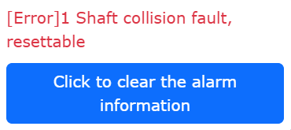

.. centered:: Abbildung 9.34-5 Kollisionsfehlerwarnung

Spezifische Rolle der Parameter und empfohlene Werte:

- Raumauswahl: Legt den Betriebsraum der Impedanzregelung fest. Derzeit ist nur die Impedanzregelung im kartesischen Raum freigegeben.
- Kraftschwellwert: Minimale Auslösekraft der Impedanzregelung. Der Bereich für die translatorische Kraft liegt zwischen 30 und 150 N, der Bereich für das rotatorische Drehmoment zwischen 7 und 30 Nm.
- Massenkoeffizient: Ein größerer Massenkoeffizient führt zu einer langsameren Ausweichbewegung, ein kleinerer Koeffizient zu einer schnelleren Ausweichbewegung. Bereich für Translation: [0,01-1], empfohlen 0,04; Bereich für Rotation: [0,001-1], empfohlen 0,01.
- Dämpfungskoeffizient: Ein größerer Dämpfungskoeffizient führt zu einer langsameren Ausweichbewegung, ein kleinerer Koeffizient zu einer schnelleren Ausweichbewegung, was zu Schwingungen führen kann. Bereich für Translation: [0,1-2], empfohlen 0,1; Bereich für Rotation: [0,008-1,5], empfohlen 0,08.
- Steifigkeitskoeffizient: Ein größerer Steifigkeitskoeffizient führt zu einer langsameren Ausweichbewegung, empfohlen 0.
- Maximale Lineargeschwindigkeit: Begrenzt die Geschwindigkeit der translatorischen Bewegung, die durch externe Kräfte verursacht wird. Empfohlen 250 mm/s.
- Maximale Linearbeschleunigung: Begrenzt die Beschleunigung der translatorischen Bewegung, die durch externe Kräfte verursacht wird. Empfohlen 500 mm/s².
- Maximale Winkelgeschwindigkeit: Begrenzt die Winkelgeschwindigkeit der rotatorischen Bewegung, die durch externe Kräfte verursacht wird. Empfohlen 90°/s.
- Maximale Winkelbeschleunigung: Begrenzt die Winkelbeschleunigung der rotatorischen Bewegung, die durch externe Kräfte verursacht wird. Empfohlen 180°/s².

Einstellung der Impedanzregelung im Gelenkraum und Start/Stopp der Funktion
*****************************************************************************************

**Schritt 1**: Melden Sie sich an der Weboberfläche an und klicken Sie nacheinander auf "Grundeinstellungen" → "Basis" → "Gelenke" → "Kollisionsstufe", um das Modul zur Einstellung der Roboter-Kollisionsstufe aufzurufen, und stellen Sie einen angemessenen Kollisionskoeffizienten ein.

.. image:: coding/555.png
   :width: 6in
   :align: center

.. centered:: Abbildung 9.34-6 Modul zur Einstellung des Roboter-Kollisionskoeffizienten

**Schritt 2**: Klicken Sie nacheinander auf "Teach-Programm" → "Programmierung" → "Kraftregelungssatz" und fügen Sie den Befehl "Impedance" hinzu. Der Befehl "Impedance" ermöglicht es dem Roboter, eine Impedanzregelung entlang der verfahrten Bahn zu realisieren.

.. image:: coding/556.png
   :width: 6in
   :align: center

.. centered:: Abbildung 9.34-7 Hinzufügen eines Kraftregelungsbefehls

**Schritt 3**: Wählen Sie im Modul für die Kraftregelungsbefehle im Dropdown-Menü "Raumauswahl" die Option "Gelenkraum" aus. Stellen Sie in den Textfeldern geeignete Werte für Kraftschwelle, Massenkoeffizient, Dämpfungskoeffizient, Steifigkeitskoeffizient, Maximalgeschwindigkeit und Maximalbeschleunigung ein. Klicken Sie im Befehlstyp auf "Einschalten" und dann auf "Hinzufügen", um den Einschaltbefehl für die Impedanzregelung hinzuzufügen. Klicken Sie im Befehlstyp auf "Ausschalten" und dann auf "Hinzufügen", um den Ausschaltbefehl für die Impedanzregelung hinzuzufügen.

.. image:: coding/557.png
   :width: 6in
   :align: center

.. centered:: Abbildung 9.34-8 Impedanzregelungsbefehl

Funktionen der Parameter und empfohlene Werte:

- Raumauswahl: Legt den Betriebsraum für die Impedanzregelung auf Gelenkraum fest;
- Kraftschwelle: Die minimale Auslösekraft für die Impedanzregelung. Der Schwellenbereich für J1-J3 beträgt 10–50 Nm, für Drehrichtungen beträgt der Schwellenbereich 1–10 Nm;
- Massenkoeffizient: Ein höherer Massenkoeffizient führt zu einer langsameren Verschiebung, ein niedrigerer führt zu einer zu schnellen Verschiebung des Roboters. Der Einstellbereich für J1-J3 ist [0,01-1], empfohlener Wert 0,04; für J4-J6 ist der Einstellbereich [0,001-1], empfohlener Wert 0,01;
- Dämpfungskoeffizient: Ein höherer Dämpfungskoeffizient führt zu einer langsameren Verschiebung, ein niedrigerer führt zu einer zu schnellen Verschiebung und kann Schwingungen verursachen. Der Einstellbereich für J1-J3 ist [0,1-2], empfohlener Wert 0,1; für J4-J6 ist der Einstellbereich [0,008-1,5], empfohlener Wert 0,08;
- Steifigkeitskoeffizient: Ein höherer Steifigkeitskoeffizient führt zu einer langsameren Verschiebung. Empfohlener Wert ist 0;
- Maximalgeschwindigkeit: Begrenzt die durch äußere Kräfte erzeugte Gelenkrotationsgeschwindigkeit. Empfohlener Wert ist 50°/s;
- Maximalbeschleunigung: Begrenzt die durch äußere Kräfte erzeugte Gelenkrotationsbeschleunigung. Empfohlener Wert ist 50°/s².

Benutzerdefinierte Pendelschweißfunktion
~~~~~~~~~~~~~~~~~~~~~~~~~~~~~~~~~~~~~~~~

Übersicht
+++++++++

Die benutzerdefinierte Pendelschweißfunktion ermöglicht es, eine vom Benutzer selbst entworfene Pendelschweißart zur Ausführung einer Pendelschweißung zu verwenden.

Erläuterung der benutzerdefinierten Pendelschweißfunktion:

- (1) Wählen Sie auf der Pendelparameter-Oberfläche im Pendeltyp einen der Punkte "Benutzerdefiniertes Pendeln 0", "Benutzerdefiniertes Pendeln 1", "Benutzerdefiniertes Pendeln 2" aus. Es können maximal 3 benutzerdefinierte Pendelschweißarten eingestellt werden.
- (2) Die maximale Anzahl benutzerdefinierter Pendelpunkte beträgt 10, die minimale Anzahl 2. Die X-, Y- und Z-Daten des letzten Punkts sind 0 und können nicht geändert werden. Die Verweilzeiten können alle eingestellt werden.
- (3) Die X-, Y- und Z-Werte der benutzerdefinierten Pendelpunkte müssen im Bereich -10 mm bis 10 mm liegen. Die Pendelfrequenz darf 10 nicht überschreiten.
- (4) Derzeit können lineare Bahnen, Kreisbögen und ganze Kreise für benutzerdefinierte Pendelschweißungen verwendet werden. Die allmähliche Änderungsfunktion wird jedoch noch nicht unterstützt.
- (5) Es ist zu beachten, dass die gesamte Pendelverweilzeit die Hälfte der Pendelperiode nicht überschreiten darf, wenn die Pendelwartezeit auf "Einschließen" gesetzt ist.

Ablauf der benutzerdefinierten Pendelschweißfunktion
+++++++++++++++++++++++++++++++++++++++++++++++++++++

Der Ablauf der benutzerdefinierten Pendelschweißfunktion ist wie folgt:

**Schritt 1**: Zeichnen Sie zuerst den Start- und Endpunkt der linearen Bahn auf. Klicken Sie dann auf "Teach-Programm", "Programmierung", wählen Sie "Punkt-zu-Punkt", um das Roboterende zum Startpunkt der Linie "custWeaveP1" zu bewegen. Wählen Sie schließlich "Linie", um das Roboterende zum Endpunkt der Linie "custWeaveP2" zu bewegen.

**Schritt 2**: Wählen Sie die Schaltfläche "Pendeln" und klicken Sie auf die Schaltfläche zur Bearbeitung der Pendeltechnik, um zur Pendelparameter-Einstellungsoberfläche zu gelangen. Wählen Sie als "Pendeltyp" die Option "Benutzerdefiniertes Pendeln N" (N = 0, 1, 2).

.. image:: coding/478.png
   :width: 6in
   :align: center

.. centered:: Abbildung 9.35-1 Pendelparameter-Einstellungsoberfläche

**Schritt 3**: Nachdem Sie den "Pendeltyp" ausgewählt haben, scrollen Sie auf der Pendelparameter-Einstellungsoberfläche nach unten. Wählen Sie auf der Oberfläche die Anzahl der benutzerdefinierten Pendelpunkte aus, stellen Sie die Position jedes Punkts im Pendelkoordinatensystem und die Verweilzeit ein. Klicken Sie abschließend auf die Schaltfläche "Konfigurieren".

.. image:: coding/479.png
   :width: 6in
   :align: center

.. centered:: Abbildung 9.35-2 Benutzerdefinierte Pendel-Einstellungsoberfläche

**Schritt 4**: Wählen Sie auf der Pendeloberfläche nacheinander im "Befehlstyp" die Optionen "Pendeln starten", "Pendeln beenden" aus und klicken Sie auf die Schaltfläche "Hinzufügen". Klicken Sie abschließend auf die Schaltfläche "Übernehmen".

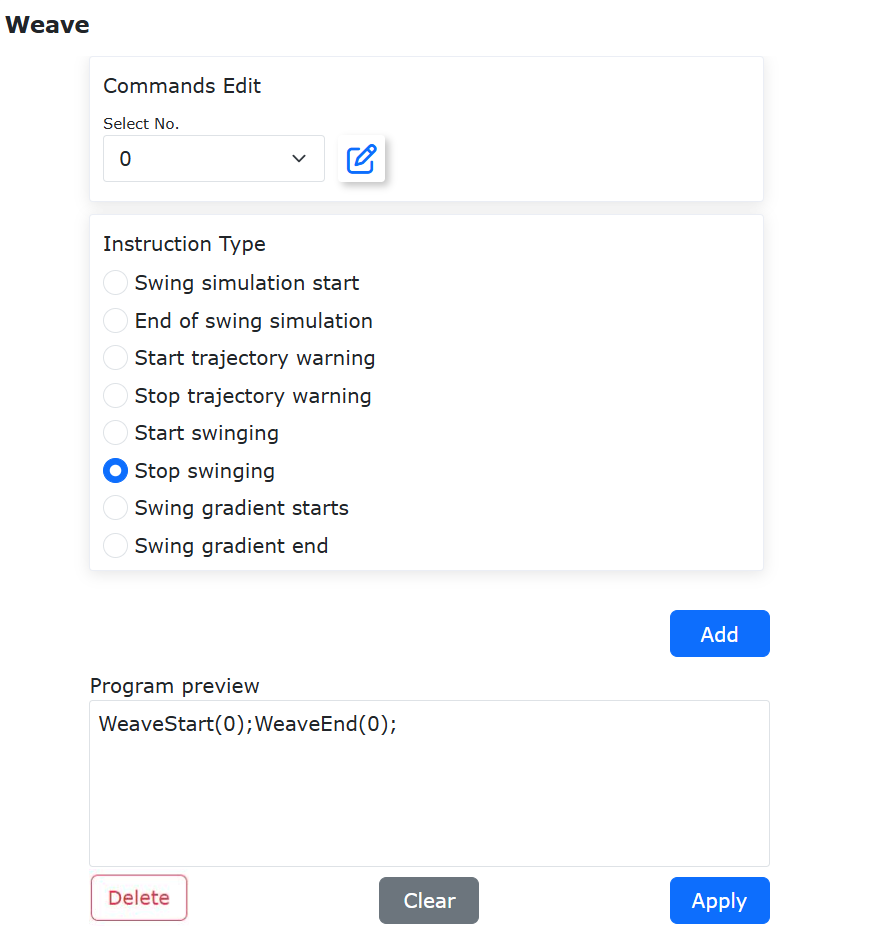

.. centered:: Abbildung 9.35-3 Pendelbefehls-Einstellungsoberfläche

**Schritt 5**: Wählen Sie auf der Programmbearbeitungsoberfläche den Pendel-Startbefehl aus, klicken Sie oben auf die Schaltfläche "Nach oben", um den Befehl zu verschieben, und speichern Sie das Programm schließlich. Schalten Sie den Roboter in den Automatikmodus und klicken Sie auf "Start". Der Roboter beginnt dann mit dem benutzerdefinierten Pendeln auf der linearen Bahn.

.. image:: coding/481.png
   :width: 6in
   :align: center

.. centered:: Abbildung 9.35-4 Ursprüngliche LUA-Befehls-Oberfläche

.. image:: coding/482.png
   :width: 6in
   :align: center

.. centered:: Abbildung 9.35-5 Modifizierte LUA-Befehls-Oberfläche

**Schritt 6**: Die Schritte zur Einstellung des benutzerdefinierten Pendelns für Kreisbögen und ganze Kreise sind die gleichen wie oben in Schritt 1 bis Schritt 5.

Teachpunkt-Konfiguration
~~~~~~~~~~~~~~~~~~~~~~~~

Klicken Sie auf "Teachpunkt-Konfiguration", um die Konfigurationsoberfläche für Teachpunkte aufzurufen.

Bevor der Benutzer die Teachpunkt-Aufzeichnungsfunktion über das Bedienkästchen oder andere IO-Signale verwendet, muss zunächst das Präfix des Teachpunktnamens, die Obergrenze der Nummer und die Teach-Methode konfiguriert werden. Das Namenspräfix unterstützt zwei Modi: benutzerdefiniertes Präfix und Verwendung des aktuellen Programmnamens als Präfix. Wenn beispielsweise das benutzerdefinierte Namenspräfix "P", die Obergrenze der Nummer "3" und die Teach-Methode "Roboter anfahren" gewählt wird, werden die aktuellen Endeffektor-Punkte des Roboters nacheinander als P1, P2, P3 aufgezeichnet. Eine erneute Aufzeichnung überschreibt die zuvor aufgezeichneten Punkte.

.. image:: coding/483.png
   :width: 4in
   :align: center

.. centered:: Abbildung 9.36-1 Teachpunkt-Konfiguration

Automatische Überschreibung und Aktualisierung des LUA-Programms durch Endeffektor-Punktaufnahme
++++++++++++++++++++++++++++++++++++++++++++++++++++++++++++++++++++++++++++++++++++++++++++++++

Konfiguration der Endeffektor-Punktaufnahmefunktion
***************************************************

1. Aktivieren Sie die Endeffektor-Punktaufnahmefunktion und klicken Sie auf "Einstellen". Über den Schalter können Sie das Lua-Programm auswählen, dessen Punkte aktualisiert werden sollen.

.. image:: coding/484.png
   :width: 4in
   :align: center

.. centered:: Abbildung 9.36‑2 Aktivieren der Endeffektor-Punktaufnahmefunktion

2. Die Konfiguration ist abgeschlossen. Nun hat die Endeffektor-Punktaufnahme das Präfix "test", die Obergrenze der Nummer ist 10. Alle Lua-Programme sind für die Aktualisierung aktiviert. Die Funktion bleibt auch nach dem Schließen der WebApp wirksam.

Automatische Aktualisierung des LUA-Programms durch Tastendruck am Endeffektor
*******************************************************************************

1. Drücken Sie die Endeffektor-Punktaufnahmetaste.

.. image:: coding/485.png
   :width: 4in
   :align: center

.. centered:: Abbildung 9.36‑3 Endeffektor-Punktaufnahmetaste

2. Die LED am Endeffektor blinkt wie folgt: Violett blinken (Start) -> Blau leuchtet (Punktaufnahme und Aktualisierung des Lua-Programms laufen) -> Grün leuchtet (Punktaufnahme abgeschlossen). Die Punktinformationen des entsprechenden Namens im ausgewählten Lua-Programm werden synchron aktualisiert.

.. image:: coding/486.png
   :width: 4in
   :align: center

.. centered:: Abbildung 9.36‑4 LED-Änderungen bei Endeffektor-Punktaufnahme und Aktualisierung des Lua-Programms

3. LED-Blinken bei fehlgeschlagener Punktaufnahme: Violett blinken (Start) -> Rot blinken (Punktaufnahme fehlgeschlagen) -> Grün leuchtet (Rückkehr zum Normalzustand).

.. image:: coding/487.png
   :width: 4in
   :align: center

.. centered:: Abbildung 9.36‑5 LED-Änderungen bei fehlgeschlagener Endeffektor-Punktaufnahme

Anwendungsbeispiel
*******************

1. Benutzerdefiniertes Präfix: test, Obergrenze der Nummer 5, Teach-Methode wählen: Roboter anfahren, Endeffektor-Punktaufnahmefunktion aktivieren, auf "Einstellen" klicken.

2. Aktivieren Sie das zu aktualisierende Lua-Programm program1.

.. image:: coding/488.png
   :width: 4in
   :align: center

.. centered:: Abbildung 9.36‑6 Teachpunkt-Konfiguration

3. Die folgende Abbildung zeigt das Programm program1 und seine aktuelle Bewegungsbahn.

.. image:: coding/489.png
   :width: 6in
   :align: center

.. centered:: Abbildung 9.36‑7 Programm program1 und seine aktuelle Bewegungsbahn

4. Schalten Sie die Seite in den Handmodus, ziehen Sie den Roboter zu einem neuen Punkt, drücken Sie die Endeffektor-Punktaufnahmetaste und warten Sie, bis die LED am Endeffektor aufhört zu blinken. Violett blinken (Start) -> Blau leuchtet (Punktaufnahme und Aktualisierung des Lua-Programms laufen) -> Grün leuchtet (Punktaufnahme abgeschlossen). Der aufgezeichnete Punkt ist test1.
5. Wiederholen Sie Schritt 4, um nacheinander test2, test3, test4, test5 aufzuzeichnen. Nachdem die 5 Punkte aufgezeichnet sind, wurden die Punkte im Programm program1 synchron aktualisiert.
6. Führen Sie das Programm program1 erneut aus. Die Bewegungsbahn wurde nun aktualisiert und ist unten dargestellt.

.. image:: coding/490.png
   :width: 4in
   :align: center

.. centered:: Abbildung 9.36‑8 Aktualisierte Bewegungsbahn

Hauptprogramm-Konfiguration
~~~~~~~~~~~~~~~~~~~~~~~~~~~

Klicken Sie auf "Hauptprogramm-Konfiguration", um die Konfigurationsoberfläche für das Hauptprogramm aufzurufen.

Das konfigurierte Hauptprogramm kann in Verbindung mit dem DI-konfigurierten Hauptprogrammstart verwendet werden. Das konfigurierte Hauptprogramm muss zuerst im Probelauf auf Sicherheit getestet werden. Nachdem in der Roboter-Konfiguration das entsprechende DI als Signal für den Hauptprogrammstart konfiguriert wurde, kann der Benutzer dieses DI-Signal steuern, um das Hauptprogramm auszuführen.

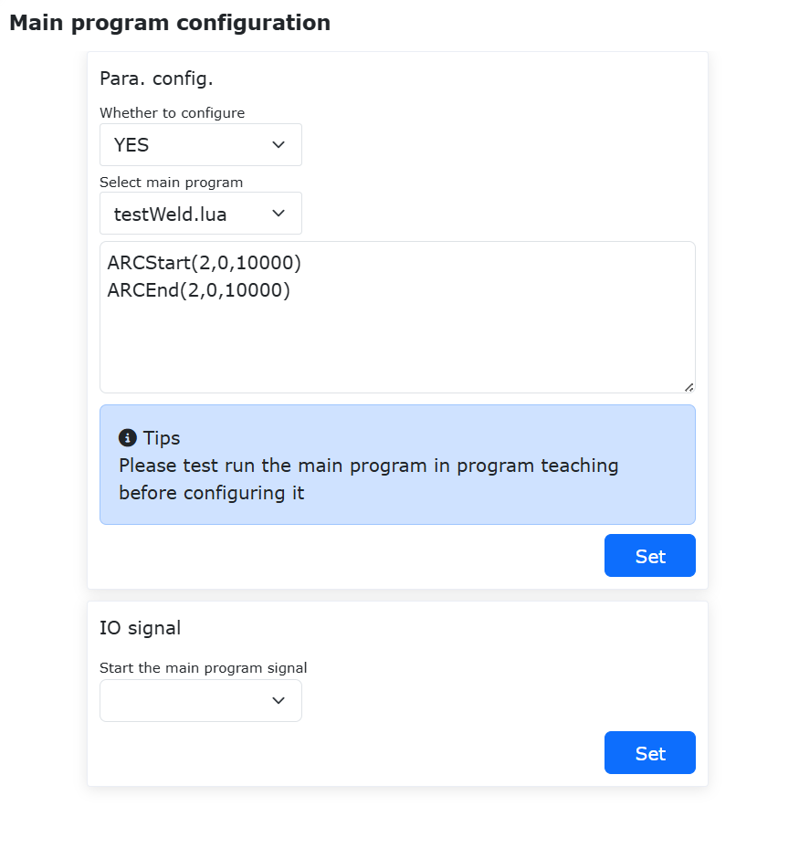

.. centered:: Abbildung 9.37‑1 Hauptprogramm-Konfiguration

Roboterschweißen von Durchdringungskurven mit Erweiterungsachse
~~~~~~~~~~~~~~~~~~~~~~~~~~~~~~~~~~~~~~~~~~~~~~~~~~~~~~~~~~~~~~~

Systemaufbau
++++++++++++

.. image:: coding/497.png
   :width: 6in
   :align: center

.. centered:: Abbildung 9.38‑1 Systemaufbau für Roboterschweißen von Durchdringungskurven mit Erweiterungsachse

Im System ist (a) der Computer, (b) der Roboter und sein Steuerpult, (c) der Positionierer und die Antriebsgeräte, (d) das Schweißgerät und die zugehörige Ausrüstung.

Erweiterungsachsen-Kommunikationskonfiguration
++++++++++++++++++++++++++++++++++++++++++++++

Die Kommunikation zwischen Roboter und Erweiterungsachse kann über UDP oder RS485 erfolgen.

.. image:: coding/498.png
   :width: 6in
   :align: center

.. centered:: Abbildung 9.38‑2 Erweiterungsachsen-Konfigurationsseite

Klicken Sie auf der Roboter-Bedienoberfläche nacheinander auf "Initiale Einstellungen", "Peripherie", "Erweiterungsachse", um zur Erweiterungsachsen-Konfigurationsseite zu gelangen. Klicken Sie als Beispiel für die Verwendung einer PLC mit UDP-Kommunikation zum Roboter auf das Symbol "UDP-Kommunikation", um zur UDP-Kommunikations-Erweiterungsachsen-Konfigurationsseite zu gelangen.

.. image:: coding/499.png
   :width: 6in
   :align: center

.. centered:: Abbildung 9.38‑3 UDP-Kommunikations-Konfigurationsoberfläche

Auf der UDP-Kommunikations-Erweiterungsachsen-Konfigurationsseite können Sie die entsprechende Erweiterungsachsennummer auswählen, die UDP-Kommunikationsparameter (Adresse, Port, Zyklus, Verlustpaketerkennung usw.) verbinden und konfigurieren sowie die Positionierabschlusszeit der Erweiterungsachse einstellen.

Der Inhalt der Erweiterungsachsenkonfiguration ist nicht Schwerpunkt dieser Funktionsbeschreibung. Detaillierte Konfiguration siehe entsprechendes Benutzerhandbuch.

Schweißgerät-Verbindungskonfiguration
+++++++++++++++++++++++++++++++++++++

Konfigurieren Sie das Schweißgerät über die folgende Konfigurationsseite:

.. image:: coding/500.png
   :width: 6in
   :align: center

.. centered:: Abbildung 9.38‑4 Schweißgerät-Konfigurationsseite

Die Schweißgerät-Kommunikation kann über IO-Kommunikation oder RS485-Kommunikation erfolgen. Klicken Sie auf "Initiale Einstellungen", "Peripherie", "Schweißgerät", um zur Konfigurations- und Verbindungsoberfläche zu gelangen. Hier können Module wie "Steuerungstyp", "I/O-Konfiguration", "Schweißprozessparameter", "Schweißgerät-Debugging" konfiguriert werden.

Der Inhalt der Schweißgerätkonfiguration ist nicht Schwerpunkt dieser Funktionsbeschreibung. Detaillierte Konfiguration siehe entsprechendes Benutzerhandbuch.

Kalibrierung des Werkzeugkoordinatensystems
+++++++++++++++++++++++++++++++++++++++++++

Kalibrieren Sie den Schweißbrenner nach der Montage am Roboterende:

.. image:: coding/501.png
   :width: 6in
   :align: center

.. centered:: Abbildung 9.38‑5 Werkzeugkoordinaten-Konfigurationsseite

Klicken Sie auf "Initiale Einstellungen", "Grundlagen", "Werkzeugkoordinaten", um zur Werkzeugkoordinaten-Einstellungsseite zu gelangen.

.. image:: coding/502.png
   :width: 6in
   :align: center

.. centered:: Abbildung 9.38‑6 Auswahl der 6-Punkt-Methode zur Kalibrierung des Schweißbrenners

Wählen Sie ein leeres Koordinatensystem, wählen Sie den Werkzeugtyp "Werkzeug" und die 6-Punkt-Methode zur Kalibrierung des Schweißbrenners. Es wird empfohlen, die Pose des Werkzeugkoordinatensystems wie in Abbildung 4-3 gezeigt zu kalibrieren.

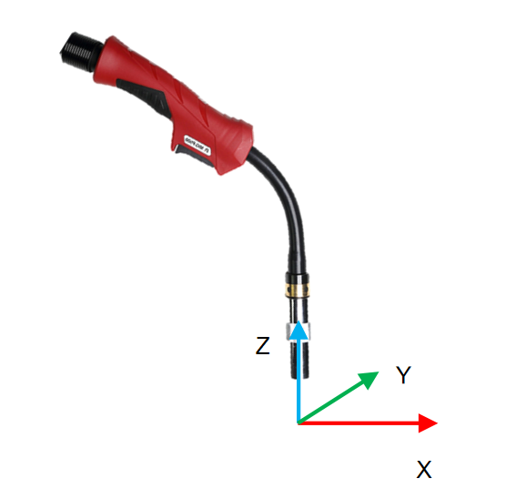

.. centered:: Abbildung 9.38‑7 Posenbild des Schweißbrenner-Koordinatensystems

Der Inhalt der Werkzeugkoordinatenkalibrierung ist nicht Schwerpunkt dieser Funktionsbeschreibung. Detaillierte Kalibrierverfahren finden Sie im entsprechenden Benutzerhandbuch.

Funktion zum Schweißen von Durchdringungskurven
+++++++++++++++++++++++++++++++++++++++++++++++

Die Bahnbewegung beim Schweißen von Durchdringungskurven kann auf zwei Arten erfolgen: entweder mit einem 2-achsigen L-förmigen Positionierer oder direkt ohne Positionierer.

Kalibrierung des Erweiterungsachsen-Koordinatensystems
*******************************************************

Für eine synchrone Bewegung von Positionierer und Roboter mit dem Erweiterungsachsen-Koordinatensystem muss dieses kalibriert werden.

.. image:: coding/504.png
   :width: 6in
   :align: center

.. centered:: Abbildung 9.38‑8 Erweiterungsachsen-Koordinatensystem-Einstellungsseite

Klicken Sie auf "Initiale Einstellungen", "Peripherie", "Erweiterungsachse", um zur Erweiterungsachsen-Koordinatensystem-Einstellungsseite zu gelangen. Wählen Sie die einzustellende Erweiterungsachsennummer aus, klicken Sie auf die Bearbeitungsschaltfläche, wählen Sie "1 - 2-achsiger L-förmiger Positionierer" aus und speichern Sie.

.. image:: coding/505.png
   :width: 6in
   :align: center

.. centered:: Abbildung 9.38‑9 Erweiterungsachsen-Kalibrierungsseite

Achten Sie bei der Kalibrierung der Erweiterungsachse darauf, "Position des Roboters relativ zur Erweiterungsachse" auf "Außerhalb der Erweiterungsachse" zu setzen. Wählen Sie für den Positionierer die 4-Punkt-Methode zur Kalibrierung.

Der Inhalt der Erweiterungsachsenkalibrierung ist nicht Schwerpunkt dieser Funktionsbeschreibung. Detaillierte Kalibrierverfahren finden Sie im entsprechenden Benutzerhandbuch.

Schweißen der Durchdringungskurvenbahn
***************************************

Basierend auf den aufgezeichneten Teachpunkten auf den Querschnitten des Hauptrohrs und des Anschlussrohrs kann ein Werkstückkoordinatensystem wie unten gezeigt erstellt werden. Der Ursprung des Koordinatensystems liegt am Schnittpunkt der Achsen von Hauptrohr und Anschlussrohr. Die X-Achse ist parallel zur Achse des Hauptrohrs und zeigt auf den Querschnitt mit den aufgezeichneten Teachpunkten. Die Z-Achse ist parallel zur Achse des Anschlussrohrs und zeigt auf die Ebene mit den aufgezeichneten Teachpunkten.

.. image:: coding/506.png
   :width: 4in
   :align: center

.. centered:: Abbildung 9.38‑10 Werkstückkoordinatensystem für die Durchdringungskurvenbahn

Methode ohne Verwendung eines Positionierers
""""""""""""""""""""""""""""""""""""""""""""

**Schritt 1**: Zeichnen Sie jeweils 6 Teachpunkte auf den Querschnitten des Hauptrohrs und des Anschlussrohrs auf.

**Schritt 2**: Klicken Sie auf "Teach-Programm", "Programmierung". Suchen Sie unter "Bewegungsbefehle" nach "Durchdringungskurve" und rufen Sie die Einstellungsseite für die Durchdringungskurvenbahn auf.

.. image:: coding/507.png
   :width: 6in
   :align: center

.. centered:: Abbildung 9.38‑11 Einstellungsseite für die Durchdringungskurvenbahn

**Schritt 3**: Wählen Sie auf der Einstellungsseite für die Durchdringungskurvenbahn unter "Erweiterungsachsen-Punkte" die Option "Nicht aktivieren". Schließen Sie die Einstellungen für Startpunktbewegung, Bewegungsrichtung, Geschwindigkeit und Beschleunigung sowie Versatzwerte ab. Die Bewegungsrichtung "Gegen den Uhrzeigersinn" ist die Richtung der vier Finger der rechten Hand, wenn diese die Z-Achse des Werkstückkoordinatensystems umfasst.

**Schritt 4**: Wählen Sie im Bereich "Durchdringungskurven-Punktdaten" der Einstellungsseite für die Durchdringungskurvenbahn die aufgezeichneten Teachpunkte aus. Klicken Sie nach Abschluss der Einstellungen auf "Hinzufügen" und dann auf "Übernehmen".

.. image:: coding/508.png
   :width: 6in
   :align: center

.. centered:: Abbildung 9.38‑12 Befehlseinstellung für die Durchdringungskurvenbahn

**Schritt 5**: Klicken Sie auf die Schaltfläche "Schweißen" unter "Schweißbefehle", um zur Schweißeinstellungsseite zu gelangen. Wählen Sie die Befehle "Lichtbogen zünden" und "Lichtbogen löschen" aus. Klicken Sie auf "Hinzufügen" und dann auf "Übernehmen". Verschieben Sie nach erfolgreichem Hinzufügen den LUA-Befehl für die Lichtbogenzündung eine Zeile nach oben.

.. image:: coding/509.png
   :width: 6in
   :align: center

.. centered:: Abbildung 9.38‑13 Schweißbefehlseinstellung

Im Folgenden ist ein typisches LUA-Programm für das Schweißen von Durchdringungskurven ohne Positionierer dargestellt:

.. image:: coding/510.png
   :width: 6in
   :align: center

.. centered:: Abbildung 9.38‑14 Beispielprogramm für das Schweißen von Durchdringungskurven ohne Positionierer

Methode unter Verwendung eines 2-achsigen L-förmigen Positionierers
"""""""""""""""""""""""""""""""""""""""""""""""""""""""""""""""""""

**Schritt 1**: Zeichnen Sie jeweils 6 Teachpunkte auf den Querschnitten des Hauptrohrs und des Anschlussrohrs auf. Drehen Sie die Achsen 1 und 2 des Positionierers und zeichnen Sie 4 Positionierer-Teachpunkte auf.

**Schritt 2**: Klicken Sie auf "Teach-Programm", "Programmierung". Suchen Sie unter "Bewegungsbefehle" nach "Durchdringungskurve" und rufen Sie die Einstellungsseite für die Durchdringungskurvenbahn auf.

.. image:: coding/511.png
   :width: 6in
   :align: center

.. centered:: Abbildung 9.38‑15 Einstellungsseite für die Durchdringungskurvenbahn

**Schritt 3**: Wählen Sie auf der Einstellungsseite für die Durchdringungskurvenbahn unter "Erweiterungsachsen-Punkte" die Option "Aktivieren". Wählen Sie die aufgezeichneten Positionierer-Teachpunkte aus. Schließen Sie die Einstellungen für Startpunktbewegung, Bewegungsrichtung, Geschwindigkeit und Beschleunigung sowie Versatzwerte ab.

**Schritt 4**: Wählen Sie im Bereich "Durchdringungskurven-Punktdaten" der Einstellungsseite für die Durchdringungskurvenbahn die aufgezeichneten Teachpunkte aus. Klicken Sie nach Abschluss der Einstellungen auf "Hinzufügen" und dann auf "Übernehmen".

.. image:: coding/512.png
   :width: 6in
   :align: center

.. centered:: Abbildung 9.38‑16 Befehlseinstellung für die Durchdringungskurvenbahn

**Schritt 5**: Klicken Sie auf die Schaltfläche "Schweißen" unter "Schweißbefehle", um zur Schweißeinstellungsseite zu gelangen. Wählen Sie die Befehle "Lichtbogen zünden" und "Lichtbogen löschen" aus. Klicken Sie auf "Hinzufügen" und dann auf "Übernehmen". Verschieben Sie nach erfolgreichem Hinzufügen den LUA-Befehl für die Lichtbogenzündung eine Zeile nach oben.

.. image:: coding/513.png
   :width: 6in
   :align: center

.. centered:: Abbildung 9.38‑17 Schweißbefehlseinstellung

Im Folgenden ist ein typisches LUA-Programm für das Schweißen von Durchdringungskurven mit Positionierer dargestellt:

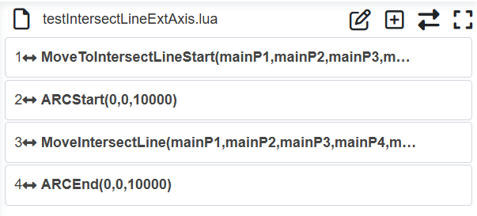

.. centered:: Abbildung 9.38‑18 Beispielprogramm für das Schweißen von Durchdringungskurven mit Positionierer