Roboter-Slave-Modus
===============================================================

.. toctree:: 
   :maxdepth: 6

Übersicht
-------------------

Um die Bewegung des Roboters durch die SPS über verschiedene industrielle Busprotokolle (CC-Link, Profinet, Ethernet/IP, EtherCAT) zu steuern, werden die Karten FRJ-PCIeN-EIP/CC/PN-RJ-V10 und FRJ-PCIeN-EC/PN/EIP/CC-RJ-V20 zum integrierten Mini-Steuerschrank hinzugefügt. Der Roboter-Slave-Modus wird entwickelt, um die folgenden Funktionen zu realisieren:

- 1. Das Master-Gerät sendet Eingangssignale an den Roboter-Slave, um den Roboter zur Ausführung entsprechender Aktionen zu steuern, z. B.: Steuerung des DO-Ausgangs des Roboter-Steuerschranks, Steuerung der Roboterbewegung usw.;

- 2. Das Master-Gerät liest den Wert der entsprechenden Adresse, um die entsprechenden Echtzeitstatusdaten des Roboters zu erhalten, z. B.: Robotergelenkdaten, TCP-Position, ob der Roboter die Bewegung abgeschlossen hat usw.

Umgebungskonfiguration
--------------------------

Kartenmodell und Softwareversion werden wie folgt beschrieben:

.. list-table:: 
   :widths: 20 50 30
   :header-rows: 1
   :align: center

   * - **Protokolltyp**
     - **Kartenmodell**
     - **Roboter-Softwareversion**

   * - CC-Link IEF Basic
     - FRJ-PCIeN-EIP/CC/PN-RJ-V10 Karte
     - V3.8.4 und höher

   * - CC-Link IEF Basic
     - FRJ-PCIeN-EC/PN/EIP/CC-RJ-V20 Karte
     - V3.9.6 und höher

   * - Profinet
     - FRJ-PCIeN-EIP/CC/PN-RJ-V10 Karte
     - V3.8.4 und höher

   * - Profinet
     - FRJ-PCIeN-EC/PN/EIP/CC-RJ-V20 Karte
     - V3.9.6 und höher

   * - Ethernet/IP
     - FRJ-PCIeN-EIP/CC/PN-RJ-V10 Karte
     - V3.8.4 und höher

   * - Ethernet/IP
     - FRJ-PCIeN-EC/PN/EIP/CC-RJ-V20 Karte
     - V3.9.6 und höher

   * - EtherCAT
     - FRJ-PCIeN-EC/PN/EIP/CC-RJ-V20 Karte
     - V3.9.6 und höher

Karteninstallation
~~~~~~~~~~~~~~~~~~~~~~~~~~~~~~~~~~~~~~~~~~~~~~~~~~~~~~

(1) Materialprüfung: Das Aussehen der FRJ-PCIeN-Karte und der dazugehörigen Blechteile ist unten dargestellt.

.. image:: remote_mode/001.png
   :width: 4in
   :align: center

.. centered:: Abbildung 19.2-1 Installationsblech (Vorderseite)

.. image:: remote_mode/002.png
   :width: 4in
   :align: center

.. centered:: Abbildung 19.2-2 Installationsblech (Rückseite)

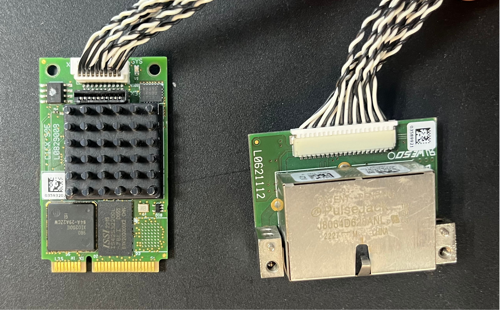

.. centered:: Abbildung 19.2-3 FRH-PCIeN-EC/EIP/CC/PN-RJ-V10 Karte

.. image:: remote_mode/004.png
   :width: 4in
   :align: center

.. centered:: Abbildung 19.2-4 FRJ-PCIeN-EIP/CC/PN-RJ-V10 Karte

(2) Installieren Sie die Karte wie in der Abbildung gezeigt in den integrierten Mini-Steuerschrank.

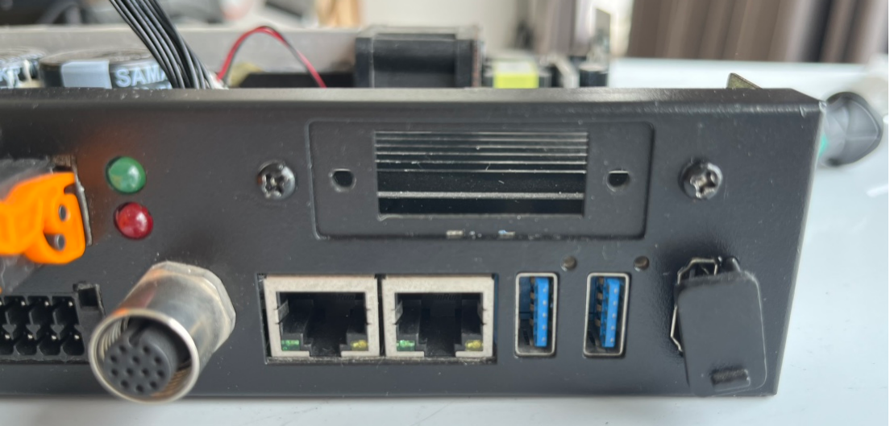

.. centered:: Abbildung 19.2-5 Installationsschema des Blechs

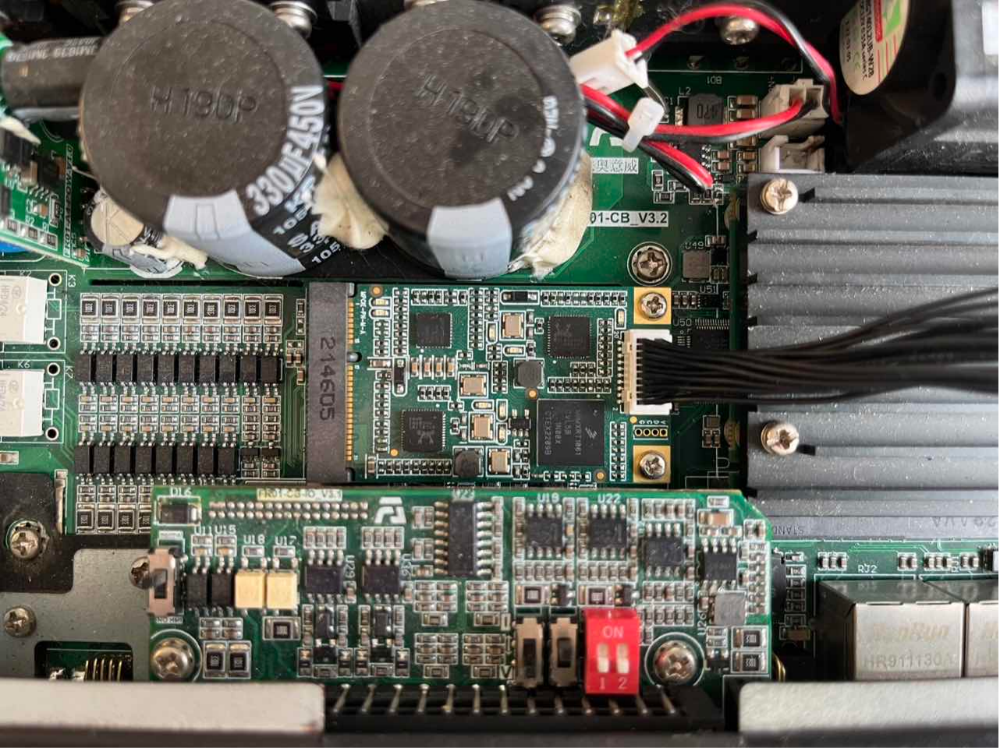

.. centered:: Abbildung 19.2-6 Installationsschema der Kernhauptplatine

.. image:: remote_mode/009.png
   :width: 4in
   :align: center

.. centered:: Abbildung 19.2-7 Installationsschema der RJ45-Netzwerkschnittstellenerweiterungskarte

.. note:: Hinweis: Alle Schrauben müssen festgezogen werden.

(3) Die Verkabelung zwischen dem Roboter-Steuerschrank und der SPS ist in der folgenden Abbildung dargestellt.

.. image:: remote_mode/010.png
   :width: 4in
   :align: center

.. centered:: Abbildung 19.2-8 Steuerschrank & Mitsubishi SPS Verdrahtungsplan    

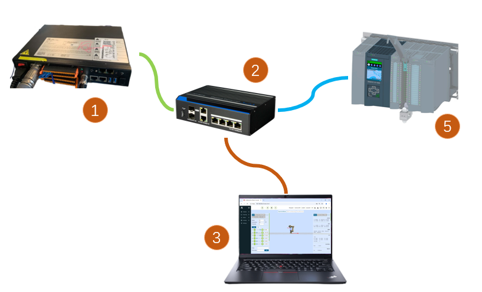

.. centered:: Abbildung 19.2-9 Steuerschrank & Siemens SPS Verdrahtungsplan

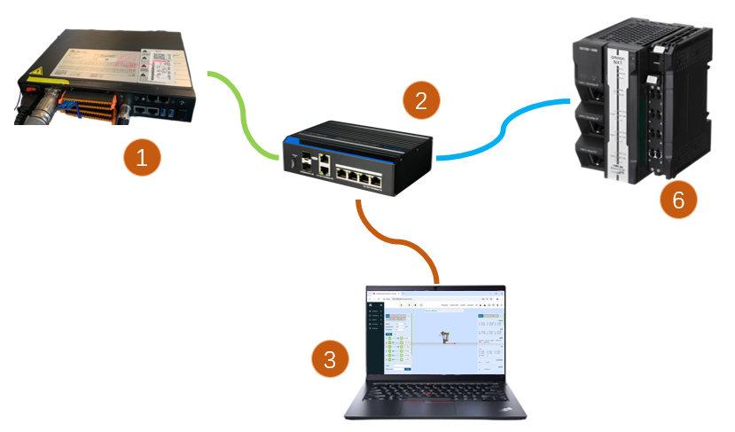

.. centered:: Abbildung 19.2-10 Steuerschrank & Inovance SPS Verdrahtungsplan

.. image:: remote_mode/013.png
   :width: 4in
   :align: center

.. centered:: Abbildung 19.2-11 Steuerschrank & Inovance SPS Verdrahtungsplan

.. note:: 
    1: Roboter-Steuerschrank (Karten-Netzwerkanschluss);
    2: Switch;
    3: Laptop-PC;
    4: Mitsubishi SPS (CC-Link IEF Basic Netzwerkanschluss);
    5: Siemens SPS (Profinet Netzwerkanschluss);
    6: Inovance SPS (Ethernet/IP);
    7: Inovance SPS (EtherCAT Netzwerkanschluss);
        
SPS-Umgebungseinrichtung
~~~~~~~~~~~~~~~~~~~~~~~~~~~~~~~~~~~~~~~~~~~~~~~~~~~~~~~~

Die Testumgebung, die zur Implementierung der Slave-Befehle der einzelnen Protokolle aufgebaut wurde, ist in der folgenden Tabelle dargestellt, einschließlich des SPS-Modells, der Firmware-Version und der Testsoftware, die in den einzelnen Protokollen verwendet werden.

.. centered:: Tabelle 2-1 Testumgebung

.. list-table:: 
   :widths: 20 40 40
   :header-rows: 1
   :align: center

   * - Protokoll
     - Profinet
     - CC-link

   * - Marke
     - Siemens
     - Mitsubishi

   * - Modell
     - CPU 1515-2 PN
     - FX5S-30TR/DS

   * - Firmware
     - 6ES75152AM020AB0
     - 30MR/ES V1.3

   * - Software
     - TIA Portal V17
     - GXWorks3V1.097B

   * - Karten-IP-Adresse
     - Konfigurierbar
     - Konfigurierbar

   * - SPS-IP-Adresse
     - Nicht im selben Subnetz erforderlich
     - Gleiches Subnetz
		
.. list-table:: 
   :widths: 20 40 40
   :header-rows: 1
   :align: center

   * - Protokoll
     - Ethernet/IP
     - EtherCAT

   * - Marke
     - Inovance
     - Inovance

   * - Modell
     - Easy521-0808TN
     - Easy521-0808TN

   * - Firmware
     - /
     - /

   * - Software
     - AutoShop 4.11.0.1
     - AutoShop 4.11.0.1

   * - Karten-IP-Adresse
     - Konfigurierbar
     - Konfigurierbar

   * - SPS-IP-Adresse
     - Gleiches Subnetz
     - Gleiches Subnetz
		
Inovance Ethernet/IP
+++++++++++++++++++++++++++++++++++++++++++++++++++++

(1) EDS-Datei importieren

Öffnen Sie die Inovance-Programmiersoftware AutoShop, erstellen Sie ein neues SPS-Projekt und wählen Sie "EtherNet/IP Devices" in der rechten Toolbox.

Klicken Sie mit der linken Maustaste auf "EtherNet/IP", klicken Sie dann mit der rechten Maustaste, um den Dialog "EDS importieren" zu öffnen. Bestätigen Sie mit der linken Maustaste und suchen Sie den Ordner, der die EDS-Datei der Karte enthält. Nach erfolgreichem Import erscheint der Name der Karte im Verzeichnis "EtherNet/IP Devices". Schließen Sie das Projekt und öffnen Sie es erneut, um den EDS-Dateiimport abzuschließen.

.. image:: custom_protocol_slave/001.png
   :width: 6in
   :align: center

.. image:: custom_protocol_slave/002.png
   :width: 6in
   :align: center

(2) EtherNet/IP-Parametereinstellungen

Doppelklicken Sie auf den Slave unter "EtherNet/IP" in der linken Symbolleiste, um das Parametereinstellungsfenster zu öffnen:

.. image:: custom_protocol_slave/003.png
   :width: 6in
   :align: center

Geben Sie die Karten-IP-Adresse ein:

.. image:: custom_protocol_slave/004.png
   :width: 6in
   :align: center

Klicken Sie auf "Verbindung" auswählen, um die Daten-Eingabe- und Ausgabebytegröße festzulegen:

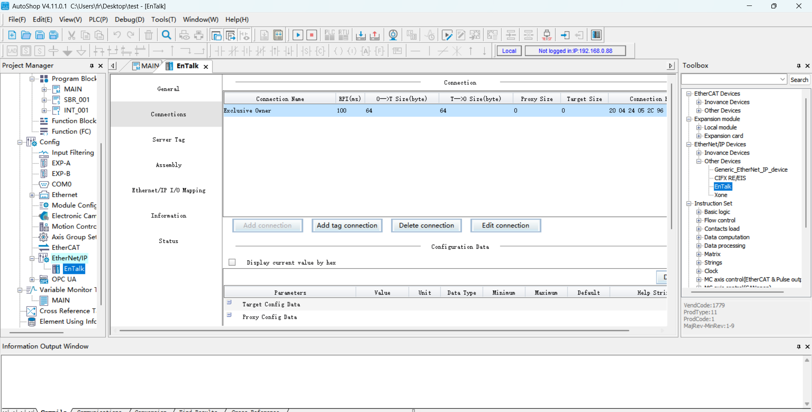

Klicken Sie auf "Verbindung bearbeiten", um in das Popup-Fenster zu gelangen, und ändern Sie sowohl die Eingabe- als auch die Ausgabebytes auf 256:

.. image:: custom_protocol_slave/006.png
   :width: 6in
   :align: center

Klicken Sie auf "Datensatz" auswählen, stellen Sie den Eingabe- und Ausgabedatentyp auf "INT" und die Bitlänge auf "2048" ein:

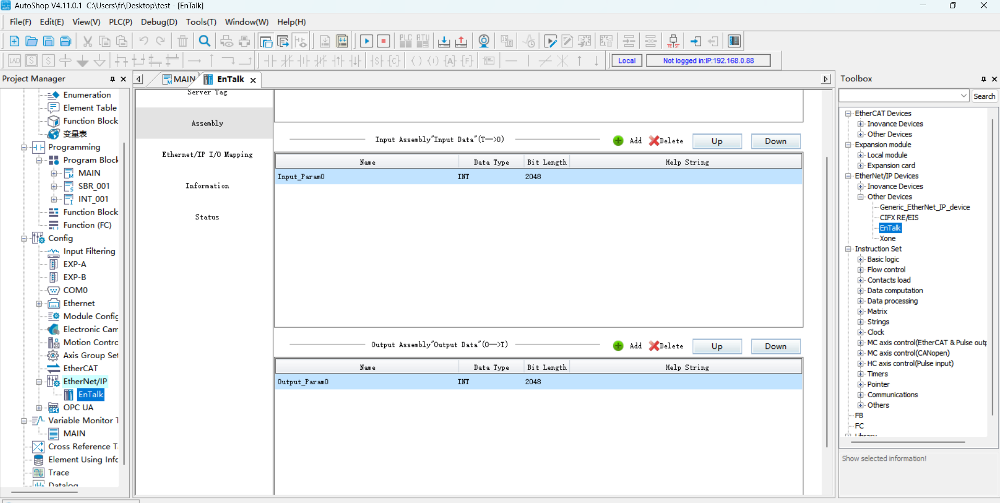

.. image:: custom_protocol_slave/008.png
   :width: 6in
   :align: center

.. image:: custom_protocol_slave/009.png
   :width: 6in
   :align: center

Nachdem die Parameter des "Datensatzes" erfolgreich eingestellt wurden, klicken Sie auf "EtherNet/IP I/O-Abbildung" auswählen und geben Sie D0 bzw. D200 ein. D0 und D200 entsprechen den Startadressen des Empfangs- bzw. Sendearrays auf der SPS-Seite.

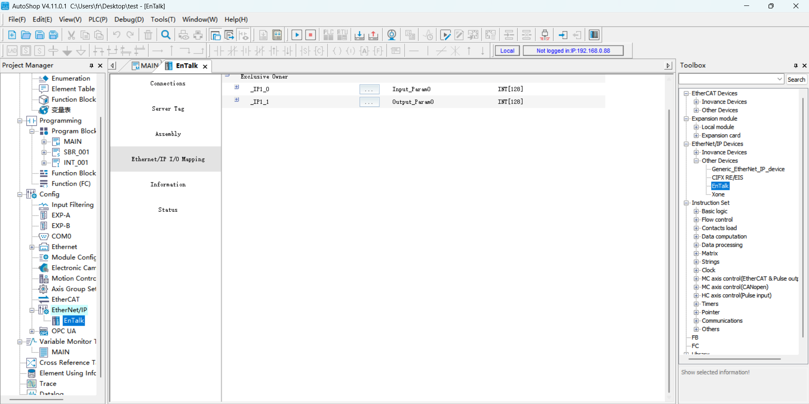

.. image:: custom_protocol_slave/011.png
   :width: 6in
   :align: center

(3) Programm-Download

Öffnen Sie das Testprogramm, ändern Sie die SPS-IP-Adresse so, dass sie sich im selben Subnetz wie die Karte befindet, und führen Sie das Programm nach dem Download aus.

Siemens Profinet
++++++++++++++++++++++++++++++++++++++++++++++++++++++++

(1) GSD-Datei (XML-Datei) importieren

Öffnen Sie die Siemens-Programmiersoftware TIA Portal V17, erstellen Sie ein neues SPS-Projekt, wählen Sie "Geräte & Netze" und doppelklicken Sie auf 6ES7 515-2AM02-0AB0 im "Hardware-Katalog" auf der rechten Seite, um das SPS-Modul hinzuzufügen.

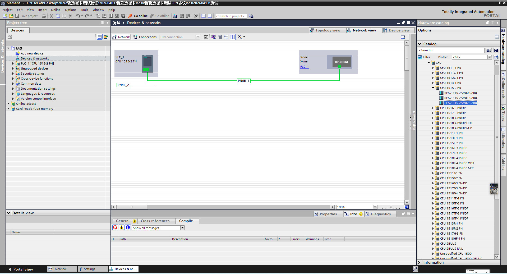

Wählen Sie in der Menüleiste der TIA PORTAL-Software "Optionen" -> "Allgemeine Stationsbeschreibungsdateien (GSD) verwalten", um installierte GSD-Dateien zu installieren oder zu löschen.

.. image:: custom_protocol_slave/013.png
   :width: 6in
   :align: center

Um GSD-Dateien zu installieren, wählen Sie wie oben "Allgemeine Stationsbeschreibungsdateien (GSD) verwalten". Das Fenster "Allgemeine Stationsbeschreibungsdateien verwalten" wird angezeigt.

Wählen Sie den Ordner mit den zu installierenden GSD-Dateien aus dem "Quellpfad", wählen Sie eine oder mehrere zu installierende Dateien aus der angezeigten Liste der GSD-Dateien aus und klicken Sie auf die Schaltfläche "Installieren". Wie in der folgenden Abbildung dargestellt.

.. image:: custom_protocol_slave/014.png
   :width: 6in
   :align: center

Nach erfolgreicher Installation kann das Gerät mit der installierten GSD-Datei unter "Andere Feldgeräte" im Hardware-Katalog gefunden werden, wie in der folgenden Abbildung dargestellt.

.. image:: custom_protocol_slave/015.png
   :width: 6in
   :align: center

IO-Zuweisung: Suchen Sie im Verzeichnis nach Modulen und ziehen Sie Input und Output.

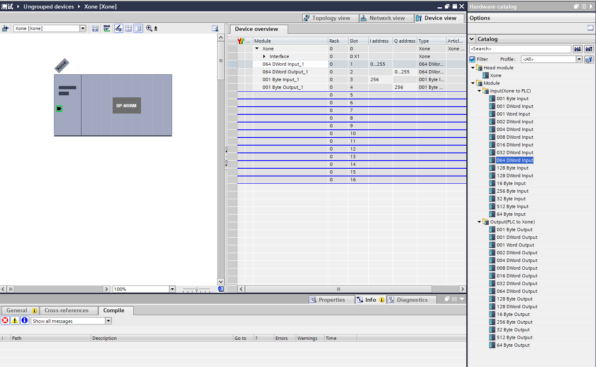

Programm kompilieren: Doppelklicken Sie, um im linken Projektbaum zu "Geräte & Netze" zu gelangen, klicken Sie mit der rechten Maustaste auf das Modul "PLC_1", wählen Sie im Dropdown-Menü "Kompilieren" und klicken Sie auf "Hardware und Software (nur Änderungen)". Nach Abschluss der Kompilierung erscheint "Kompilierung abgeschlossen" unten in der Softwareansicht:

.. image:: custom_protocol_slave/017.png
   :width: 6in
   :align: center

.. image:: custom_protocol_slave/018.png
   :width: 6in
   :align: center

Programm auf das Gerät herunterladen: Doppelklicken Sie, um im linken Projektbaum zu "Geräte & Netze" zu gelangen, klicken Sie mit der rechten Maustaste auf das Modul "PLC_1", wählen Sie im Dropdown-Menü "Auf Gerät herunterladen" und klicken Sie auf "Hardware und Software (nur Änderungen)":

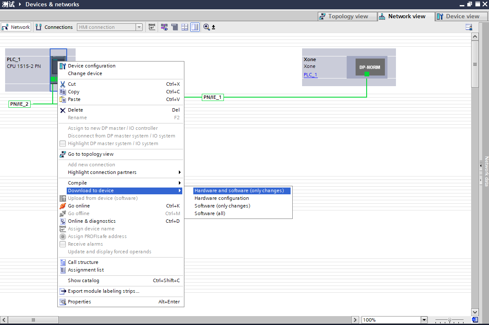

Gerät suchen und herunterladen: Konfigurieren Sie nach dem Popup-Fenster den PG/PC-Schnittstellentyp wie unten gezeigt, klicken Sie auf "Suche starten", wählen Sie das Gerät aus, auf das das Programm heruntergeladen werden soll, und klicken Sie auf "Herunterladen":

.. image:: custom_protocol_slave/020.png
   :width: 6in
   :align: center

.. image:: custom_protocol_slave/021.png
   :width: 6in
   :align: center

Mitsubishi CC-link
+++++++++++++++++++++++++++++++++++++++++++++++++

(1) CC-Link IEF Basic Einstellungen

CC-link aktivieren: Wählen Sie "Ethernet-Port" in der linken Navigationsmenüleiste, stellen Sie die SPS-IP-Adresse so ein, dass sie sich im selben Subnetz wie die Jiyuan-Kartenadresse befindet. Klicken Sie auf "CC-link IEF Basic verwenden oder nicht" und wählen Sie "Verwenden":

.. image:: custom_protocol_slave/022.png
   :width: 6in
   :align: center

CC-Link Netzwerkkonfigurationseinstellungen: Ebenfalls in den CC-Link IEF Basic Einstellungen wählen Sie "Netzwerkkonfigurationseinstellungen" und wählen das allgemeine Modul CC-Link IEF Basic. Ziehen Sie es in die untere linke Ecke der Ansicht, um die Hardwarekonfiguration abzuschließen:

.. image:: custom_protocol_slave/023.png
   :width: 6in
   :align: center
   
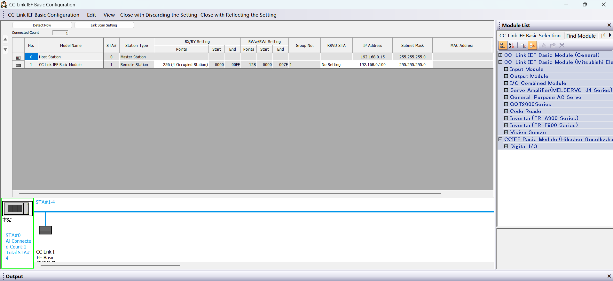

Stellen Sie die Punkte der Slaves und die IP-Adresse ein:

.. image:: custom_protocol_slave/025.png
   :width: 6in
   :align: center
   
.. image:: custom_protocol_slave/026.png
   :width: 6in
   :align: center

CC-Link Aktualisierungseinstellungen: Ebenfalls in den CC-Link IEF Basic Einstellungen klicken Sie auf "Aktualisierungseinstellungen" und passen Sie die Übertragungseinstellungen an: 256 Byte empfangen, 256 Byte senden.
   
.. image:: custom_protocol_slave/027.png
   :width: 6in
   :align: center

(2) Programm-Download

Öffnen Sie das Testprogramm, klicken Sie auf "Online" -> "In speicherprogrammierbare Steuerung schreiben", um zur Download-Oberfläche zu gelangen.
   
.. image:: custom_protocol_slave/028.png
   :width: 6in
   :align: center

Klicken Sie nach dem Öffnen der Download-Oberfläche auf "Parameter + Programm" oben links und dann auf "Ausführen" unten rechts, um den Download zu starten, und warten Sie, bis der Download abgeschlossen ist.
   
.. image:: custom_protocol_slave/029.png
   :width: 6in
   :align: center

Inovance EtherCAT
++++++++++++++++++++++++++++++++++++++++++++++

(1) XML-Datei importieren

Öffnen Sie die Inovance-Programmiersoftware AutoShop, erstellen Sie ein neues SPS-Projekt und wählen Sie "EtherCATDevices" in der rechten Toolbox:
   
.. image:: custom_protocol_slave/030.png
   :width: 6in
   :align: center

Klicken Sie mit der linken Maustaste auf "EtherCATDevices", klicken Sie dann mit der rechten Maustaste, um den Dialog "Gerät-XML importieren" zu öffnen. Bestätigen Sie mit der linken Maustaste und suchen Sie den Ordner, der die XML-Datei der Karte enthält.

Nach erfolgreichem Import erscheint der Name der Karte im Verzeichnis "EtherCAT Devices". Schließen Sie das Projekt und öffnen Sie es erneut, um den XML-Dateiimport abzuschließen.
   
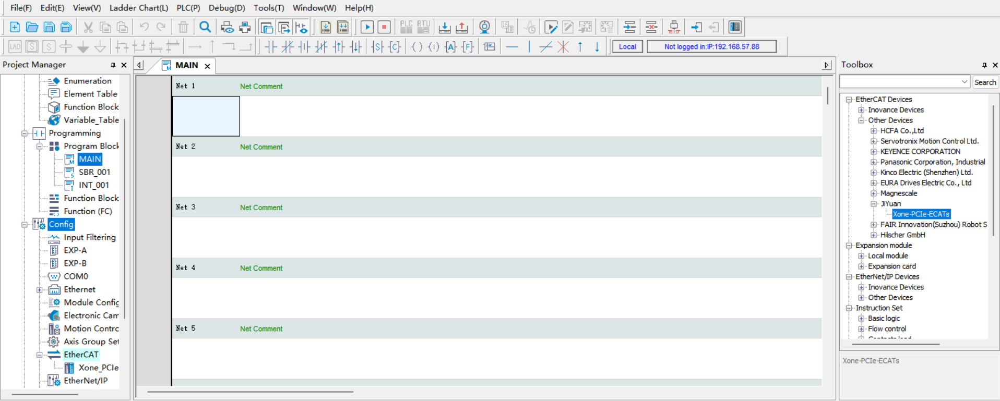

(2) EtherCAT-Slave hinzufügen

Rechte Symbolleiste → "EtherCAT Devices" → "Other Devices" → "JIYuan" → "Xone-PCIe-ECATs". Doppelklicken Sie auf "Xone-PCIe-ECATs", um den EtherCAT-Slave hinzuzufügen. Sie können nun sehen, dass der Slave erfolgreich unter dem EtherCAT-Master im linken Projektbaum hinzugefügt wurde.
   
.. image:: custom_protocol_slave/032.png
   :width: 6in
   :align: center
   
.. image:: custom_protocol_slave/033.png
   :width: 6in
   :align: center

(3) PDO hinzufügen
   
.. image:: custom_protocol_slave/034.png
   :width: 6in
   :align: center
   
.. image:: custom_protocol_slave/035.png
   :width: 6in
   :align: center

(4) EtherCAT-Adressabbildung

Doppelklicken Sie in der linken Symbolleiste auf die Variablentabelle, um ein neues Eingangsarray von 256 Bytes mit der Softkomponentenadresse D0 zu erstellen. Erstellen Sie ein neues Ausgangsarray von 256 Bytes mit der Softkomponentenadresse D200.
   
.. image:: custom_protocol_slave/036.png
   :width: 6in
   :align: center

Doppelklicken Sie unter "EtherCAT" in der linken Symbolleiste auf "Xone-PCIe-ECATs". Klicken Sie im angezeigten Dialogfeld auf "I/O-Funktionsabbildung", klicken Sie auf das Feld, um die Variablenadresse zu binden. Klicken Sie im angezeigten Dialogfeld auf "Variablentabelle", wählen Sie die entsprechende Eingabe/Ausgabe aus und klicken Sie auf "OK". Binden Sie andere Adressen in der Reihenfolge mit demselben Verfahren.
   
.. image:: custom_protocol_slave/037.png
   :width: 6in
   :align: center

(5) Programm-Download

Öffnen Sie das Testprogramm, ändern Sie die SPS-IP-Adresse so, dass sie sich im selben Subnetz wie die Karte befindet, und führen Sie das Programm nach dem Download aus.

Bedienungsanleitung für den Roboterslave-Modus
------------------------------------------------------------

Laden des Slave-Modus
~~~~~~~~~~~~~~~~~~~~~~~~~~~~~~~~~~~~~~~~~~

(1) Öffnen Sie die WebApp und navigieren Sie zu: Grundeinstellungen -> Peripherie -> Kartenkommunikation -> Manuelle Konfiguration.
   
.. image:: custom_protocol_slave/038.png
   :width: 6in
   :align: center

Konfigurieren Sie zunächst die IP-Adresse der Karte. Wenn keine Angabe erfolgt, startet die Karte mit der Standard-IP: 192.168.0.100. Die IP-Konfiguration gilt derzeit nur für die Protokolle EIP und CC-Link. Beim PN-Protokoll wird die IP vom PLC-Master durch Scannen des Slave-Geräts zugewiesen.

.. note:: Nach Änderung der IP-Adresse auf der Seite muss der Slave-Modus geladen werden, damit die Änderung wirksam wird.
   
Wählen Sie anschließend nacheinander die gewünschten Mapping-Funktionen für DI, DO und AO aus (siehe Anhang). Bedeutung der Parameter:

- DI für Robotersteuerung: Der Roboterslave empfängt externe Eingangssignale und führt die zugeordneten Funktionen aus.
- DO für Roboterstatusausgabe: Der Roboterslave gibt Statusrückmeldungen an den Master aus.
- AO für Roboterstatusrückmeldung: Der Roboterslave gibt Statusdaten an den Master aus. AO0–AO15 sind vorzeichenbehaftete Ganzzahlen (int16), AO16–AO31 sind Gleitkommazahlen mit einfacher Genauigkeit (float).

(2) Klicken Sie auf die Schaltfläche „Konfigurieren“, um die Lua-Datei für das offene Protokoll zu generieren.
   
.. image:: custom_protocol_slave/039.png
   :width: 6in
   :align: center

.. note:: Die generierte Lua-Datei für das offene Protokoll kann heruntergeladen und im automatischen Konfigurationsmodus importiert werden.

Beispiel für ein generiertes Programm:

.. code-block:: console
   :linenos:

   local id = 3 
   local ctrlDI = {0, 0, 0, 0, 0, 0}
   local funcDI = {0, 0, 0, 0, 0, 0, 0, 0, 0, 0, 0, 0, 0, 0, 0, 0}
   local DOState = {0, 0, 0, 0, 0, 0, 0, 0}
   local AOState = {0, 0, 0, 0, 0, 0, 0, 0, 0, 0, 0, 0, 0, 0, 0, 0, 0, 0, 0, 0, 0, 0, 0, 0, 0, 0, 0, 0, 0, 0, 0, 0}
   -- Starten des Kartenkommunikationsprozesses
   SetFieldBusIP("192.168.0.99")
   LoadFieldBusSlave()
   sleep_ms(8000)
   while(1) do
      -- Setzen des DO-Status
      CtrlBoxDO, CtrlBoxCO, CtrlBoxDI, CtrlBoxCI, errState, motionState, moveToOriginState, robotStartDoneState, modeChangeState, programStartStopState, emergencyState, reduceState, collision, enablestate, safetyStop0, safetyStop1, pauseState, interfereState = GetRobotFuncDOState()
      DOState[1] = CtrlBoxDO
      DOState[2] = CtrlBoxCO
      DOState[3] = CtrlBoxDI
      DOState[4] = CtrlBoxCI
      local ctrlWord0 = 0
      ctrlWord0 = SetBitWithIndex(ctrlWord0, 0, errState)
      ctrlWord0 = SetBitWithIndex(ctrlWord0, 1, motionState)
      ctrlWord0 = SetBitWithIndex(ctrlWord0, 2, moveToOriginState)
      ctrlWord0 = SetBitWithIndex(ctrlWord0, 3, robotStartDoneState)
      ctrlWord0 = SetBitWithIndex(ctrlWord0, 4, modeChangeState)
      ctrlWord0 = SetBitWithIndex(ctrlWord0, 5, programStartStopState)
      ctrlWord0 = SetBitWithIndex(ctrlWord0, 6, emergencyState)
      ctrlWord0 = SetBitWithIndex(ctrlWord0, 7, reduceState)
      DOState[5] = ctrlWord0
      local ctrlWord1 = 0
      ctrlWord1 = SetBitWithIndex(ctrlWord1, 0, collision)
      ctrlWord1 = SetBitWithIndex(ctrlWord1, 1, enablestate)
      ctrlWord1 = SetBitWithIndex(ctrlWord1, 2, safetyStop0)
      ctrlWord1 = SetBitWithIndex(ctrlWord1, 3, safetyStop1)
      ctrlWord1 = SetBitWithIndex(ctrlWord1, 4, pauseState)
      ctrlWord1 = SetBitWithIndex(ctrlWord1, 5, interfereState)
      DOState[6] = ctrlWord1
      SetFieldBusDOState(DOState)

      -- Setzen des AO-Status
      mainErrCode, subErrCode, TCPSpeed, axisPos1, axisPos2, axisPos3, axisPos4, axisPos5, axisPos6, jointVelFeedback1, jointVelFeedback2, jointVelFeedback3, jointVelFeedback4, jointVelFeedback5, jointVelFeedback6, jointCurFeedback1, jointCurFeedback2, jointCurFeedback3,jointCurFeedback4,jointCurFeedback5,jointCurFeedback6, jointTorqueFeedback1, jointTorqueFeedback2,jointTorqueFeedback3,jointTorqueFeedback4, jointTorqueFeedback5, jointTorqueFeedback6, cartPosx, cartPosy, cartPosz, cartPosrx, cartPosry, cartPosrz = GetRobotFuncAOState()
      AOState[1] = mainErrCode
      AOState[2] = subErrCode
      AOState[17] = axisPos1
      AOState[18] = axisPos2
      AOState[19] = axisPos3
      AOState[20] = axisPos4
      AOState[21] = axisPos5
      AOState[22] = axisPos6
      AOState[23] = cartPosx
      AOState[24] = cartPosy
      AOState[25] = cartPosz
      AOState[26] = cartPosrx
      AOState[27] = cartPosry
      AOState[28] = cartPosrz
      SetFieldBusAOState(AOState)
      sleep_ms(10) 

      -- Setzen des DI-Status
      -- Konfigurieren der DI-Funktion und Echtzeitaktualisierung
      ctrlDI[1],ctrlDI[2],ctrlDI[3],ctrlDI[4],ctrlDI[5],ctrlDI[6] = GetFieldBusDIState()
      funcDI[1] = ctrlDI[1] 
      funcDI[2] = ctrlDI[2] 
      funcDI[3] = GetBitWithIndex(ctrlDI[3], 0)
      funcDI[4] = GetBitWithIndex(ctrlDI[3], 1)
      funcDI[5] = GetBitWithIndex(ctrlDI[3], 2)
      funcDI[6] = GetBitWithIndex(ctrlDI[3], 3)
      funcDI[7] = GetBitWithIndex(ctrlDI[3], 4)
      funcDI[8] = GetBitWithIndex(ctrlDI[3], 5)
      funcDI[9] = GetBitWithIndex(ctrlDI[3], 6)
      funcDI[10] = GetBitWithIndex(ctrlDI[3], 7)
      funcDI[11] = GetBitWithIndex(ctrlDI[4], 0)
      funcDI[12] = GetBitWithIndex(ctrlDI[4], 1)
      funcDI[13] = GetBitWithIndex(ctrlDI[4], 2)
      funcDI[14] = GetBitWithIndex(ctrlDI[4], 3)
      funcDI[15] = GetBitWithIndex(ctrlDI[4], 4)
      funcDI[16] = GetBitWithIndex(ctrlDI[4], 5)
      SetRobotFuncDIState(funcDI)
      local stopFlag = GetOpenLUAStopFlag(id)
      if(stopFlag ~= 0) then 
         UnloadFieldBusSlave()
         break
      end
      sleep_ms(10)
   end

(3) Klicken Sie auf die Schaltfläche „Laden“, um den Roboterslave-Modus zu laden.
   
.. image:: custom_protocol_slave/040.png
   :width: 6in
   :align: center

.. note:: Nach erfolgreichem Laden des Roboterslave-Modus wird die Funktion „Automatischer Start beim Einschalten“ unterstützt. Wenn Sie den Fernsteuerungsmodus verwenden möchten, entladen Sie zuerst den Slave-Modus.

(4) Klicken Sie auf die Statusleistenschaltfläche der Karte rechts, um die DI-, DO-, AI- und AO-Interaktionsinformationen zu überwachen. Parameterbeschreibung:

- CtrlDO: Vom externen Master gesendeter Steuerkasten-DO/CO-Eingangswert
- DI: Vom externen Master gesendeter Steuerungseingangswert
- Aux_DI: Erweiterte DI der Kommunikationskarte
- DO: Vom Roboterslave ausgegebener Rückmeldungswert
- Aux_DO: Erweiterte DO der Kommunikationskarte
- AI: Vom externen Master eingegebener Wert
- AI0~AI15: int16-Typ
- AI16~AI31: float-Typ
- AO: Vom Roboterslave ausgegebener Wert
- AO0~AO15: int16-Typ
- AO16~AO31: float-Typ

.. note:: Detaillierte Informationen zu den Parametern DI, DO, AI, AO finden Sie im „RD36 - Adressvergleichstabelle für Roboterslave-Modus - V1.0 - 20260605“.
   
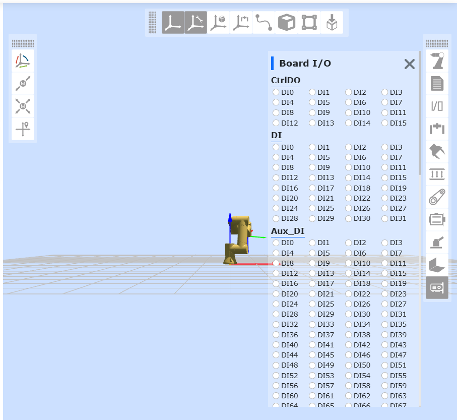

(5) Nach dem Laden können Sie über Teach-Programm -> Kommunikationsbefehle -> Karte die Karten-Lua-Befehle generieren, um Slave-DO, Slave-AO zu setzen, Slave-DI, Slave-AI zu erhalten und auf Slave-DI, Slave-AI zu warten.
   
.. image:: custom_protocol_slave/042.png
   :width: 6in
   :align: center

Karten-Firmware-Upgrade und Kommunikationszyklus-Konfiguration
--------------------------------------------------------------------------

FRJ-PCIeN-EIP/CC/PN-RJ-V10 Karte
~~~~~~~~~~~~~~~~~~~~~~~~~~~~~~~~~~~~~~~~~~~~~~~~~~~~~~~~~~~~~~~~~~~~~~~~~~~~~~~~~~
Bei einem Protokollwechsel der Karte ist ein Firmware-Upgrade erforderlich. Gehen Sie wie folgt vor, um die Firmware der FRJ-PCIeN-EIP/CC/PN-RJ-V10 Karte mit der PC-Software zu aktualisieren:

(1) Führen Sie WinPcap_4_1_3.exe aus, um das Netzwerkkartentreiberpaket zu installieren.

(2) Verbinden Sie die Netzwerkschnittstelle des PCs (Windows 11) direkt mit der Netzwerkschnittstelle der Karte. Starten Sie Device Assistant v1.1.0.exe, doppelklicken Sie auf „Ethernet“ und klicken Sie oben links auf die Schaltfläche „Aktualisieren“. Die aktuell angeschlossene Karte wird erkannt.
   
.. image:: custom_protocol_slave/043.png
   :width: 6in
   :align: center
      
.. image:: custom_protocol_slave/044.png
   :width: 6in
   :align: center

(3) Doppelklicken Sie auf die erkannte Karte, um zur Firmware-Update-Oberfläche zu gelangen. Konfigurieren Sie PC und die ermittelte Karten-IP im selben Subnetz. Klicken Sie im Menü „Firmware-Update“ rechts auf die Schaltfläche „…“, wählen Sie die zu aktualisierende Firmware aus und klicken Sie auf „Aktualisieren“. Im Textfeld unten links wird „Update erfolgreich“ angezeigt.
      
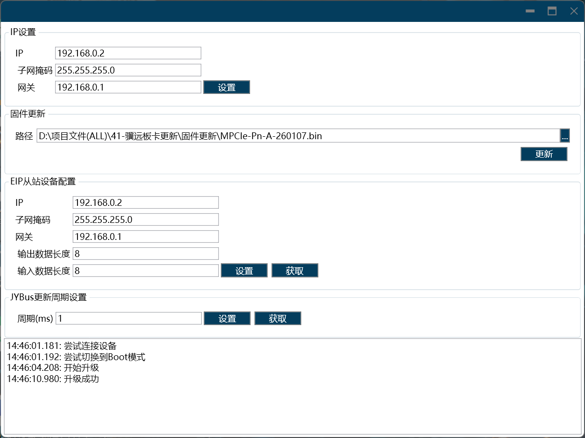

(4) Nach erfolgreichem Upgrade wird die Karte zurückgesetzt. Warten Sie, bis der Reset abgeschlossen ist (5 Sekunden). Geben Sie den gewünschten Kommunikationszyklus ein (unterstützt 1–100 ms) und klicken Sie auf „Einstellen“. Sobald unten links „Zykluseinstellung erfolgreich“ angezeigt wird, starten Sie das Steuerungsgehäuse neu.
      
.. image:: custom_protocol_slave/046.png
   :width: 6in
   :align: center

FRJ-PCIeN-EC/PN/EIP/CC-RJ-V20 Karte
~~~~~~~~~~~~~~~~~~~~~~~~~~~~~~~~~~~~~~~~~~~~~~~~~~~~~~~~~~~~~~~~~~~~~~~~~~~~~~~~~~

Bei einem Protokollwechsel der Karte ist ein Firmware-Upgrade erforderlich. Melden Sie sich an der Roboteroberfläche an, um die Firmware der FRJ-PCIeN-EC/PN/EIP/CC-RJ-V20 Karte zu aktualisieren. Gehen Sie wie folgt vor:

(1) Geben Sie 192.168.58.2 in die Adresszeile ein, um zur Roboteroberfläche zu gelangen. Navigieren Sie zu „Grundeinstellungen“ -> „Peripherie“ -> „Kartenkommunikation“. Hier wird die Firmware-Version der FRJ-PCIeN-EC/PN/EIP/CC-RJ-V20 Karte angezeigt. Wählen Sie die zu aktualisierende bin-Datei aus, klicken Sie auf „Hochladen“ und starten Sie nach erfolgreichem Firmware-Upgrade das Steuerungsgehäuse neu.
      
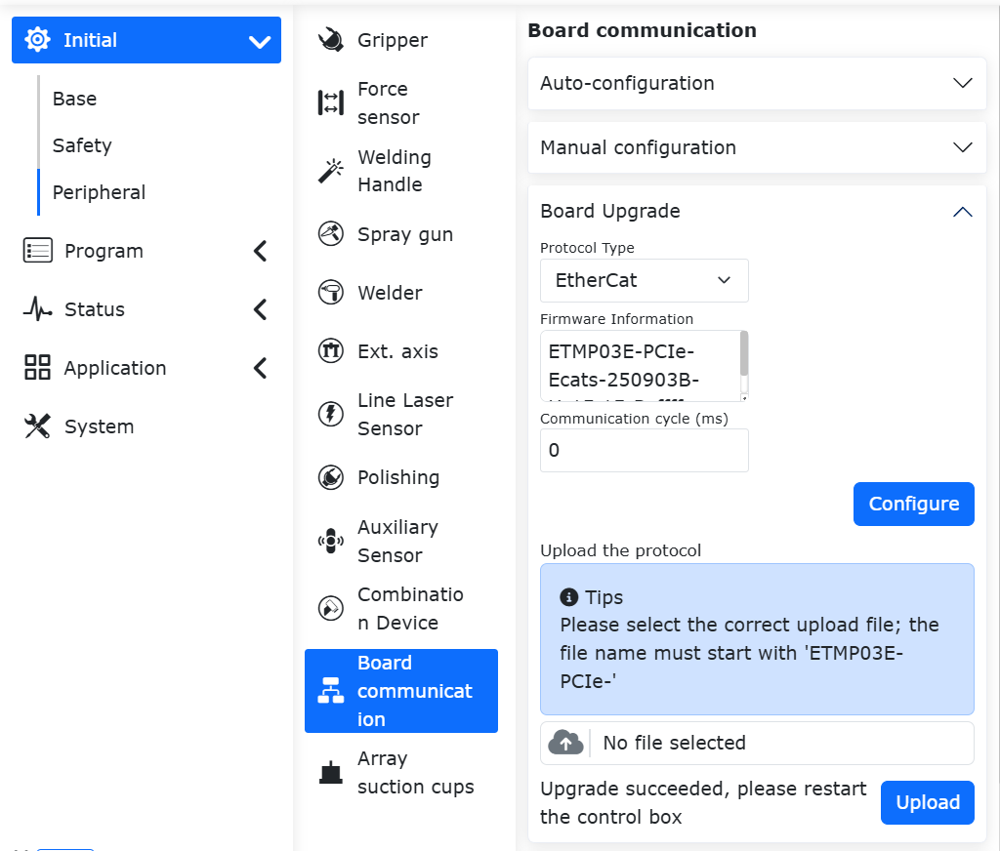

.. note:: Vor dem Firmware-Upgrade der FRJ-PCIeN-EC/PN/EIP/CC-RJ-V20 Karte muss das laufende offene Protokoll entladen werden.

(2) Geben Sie 192.168.58.2 in die Adresszeile ein, um zur Roboteroberfläche zu gelangen. Navigieren Sie zu „Grundeinstellungen“ -> „Peripherie“ -> „Kartenkommunikation“. Hier wird der Karten-Kommunikationszyklus angezeigt. Geben Sie den gewünschten Kommunikationszyklus ein (1–100 ms) und klicken Sie auf „Konfigurieren“. Starten Sie nach erfolgreicher Konfiguration das Steuerungsgehäuse neu.
      
.. image:: custom_protocol_slave/048.png
   :width: 6in
   :align: center

.. note:: Vor der Konfiguration des Kommunikationszyklus der FRJ-PCIeN-EC/PN/EIP/CC-RJ-V20 Karte muss das laufende offene Protokoll entladen werden.

:download:`Firmware der Kommunikationskarte und Konfigurationsdateien <../_static/_doc/Board communication firmware and configuration files.zip>`

:download:`Zusammenfassung der PLC-Testprogramme für jedes Protokoll <../_static/_doc/Summary of PLC Test Programs for Each Protocol.zip>`