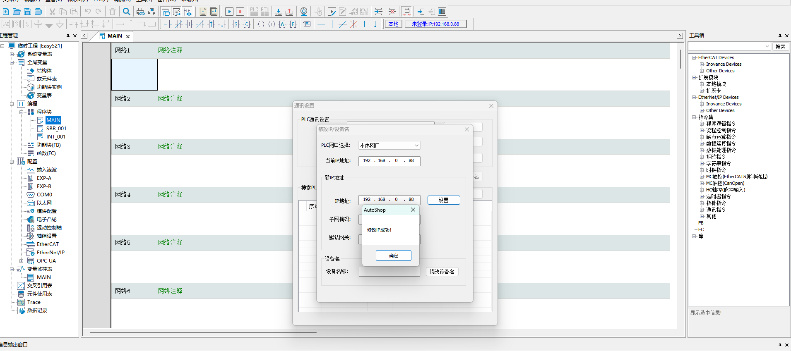
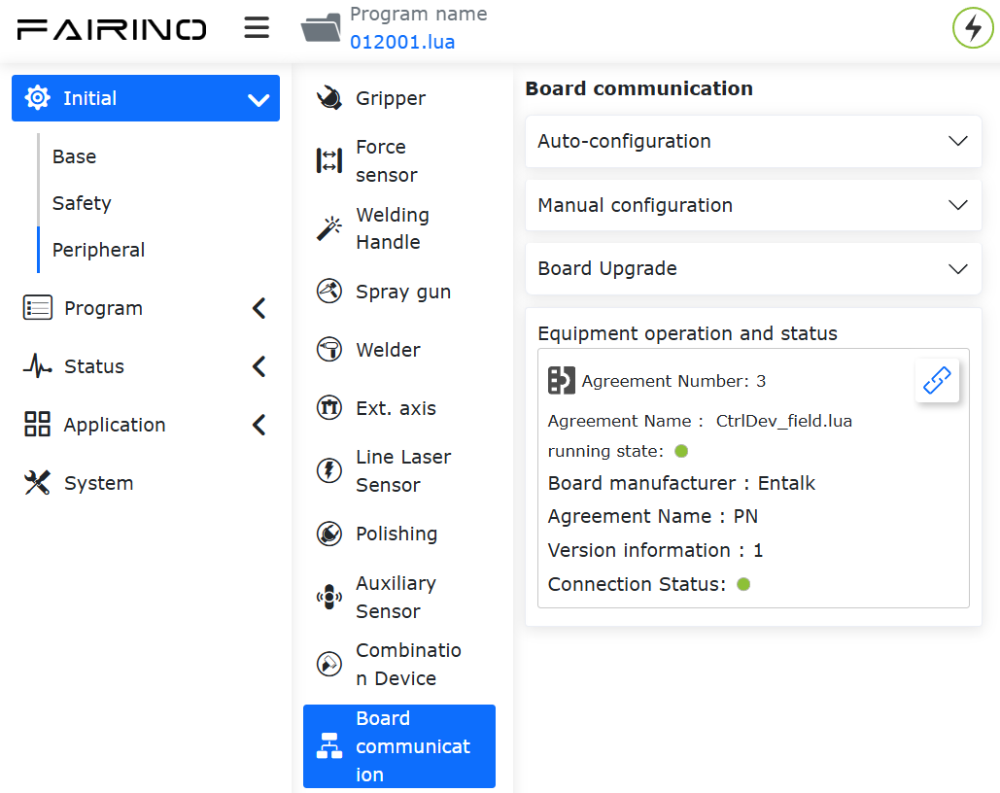
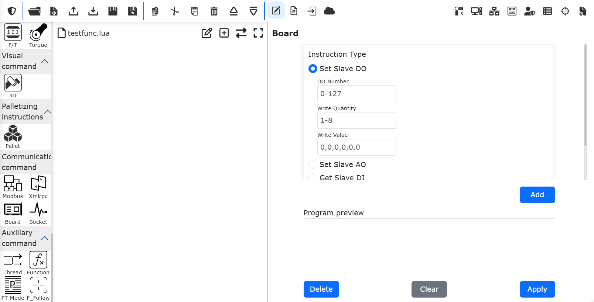

Anweisungen für kundenspezifische Protokoll-Slaves
============================================================

.. toctree::
   :maxdepth: 6

Überblick
-------------------

Um die Bewegungssteuerung des Roboters durch eine SPS über verschiedene industrielle Busprotokolle (CC-Link IEF Basic, Profinet, Ethernet/IP und EtherCAT) zu erleichtern, wurden im integrierten Mini-Steuerschrank die Karten FRH-PCIeN-EC/EIP/CC/PN-RJ-V10, FRJ-PCIeN-EIP/CC/PN-RJ-V10 und FRJ-PCIeN-EC-RJ-V10 ergänzt.

Umgebungskonfiguration
--------------------------

Die Kartenmodelle und Softwareversionen werden wie folgt beschrieben:

.. list-table::
   :widths: 20 50 30
   :header-rows: 1
   :align: center

   * - **Protokolltyp**
     - **Kartenmodell**
     - **Roboter-Softwareversion**

   * - CC-Link IEF Basic
     - FRH-PCIeN-EC/EIP/CC/PN-RJ-V10 Karte, FRJ-PCIeN-EIP/CC/PN-RJ-V10 Karte
     - V3.8.0 und höher

   * - Profinet
     - FRH-PCIeN-EC/EIP/CC/PN-RJ-V10 Karte, FRJ-PCIeN-EIP/CC/PN-RJ-V10 Karte
     - V3.8.0 und höher

   * - Ethernet/IP
     - FRH-PCIeN-EC/EIP/CC/PN-RJ-V10 Karte, FRJ-PCIeN-EIP/CC/PN-RJ-V10 Karte
     - V3.8.0 und höher

   * - EtherCAT
     - FRH-PCIeN-EC/EIP/CC/PN-RJ-V10 Karte, FRJ-PCIeN-EC-RJ-V10 Karte
     - V3.8.4.1 und höher

Einrichtung der Hardware-Umgebung für die FRH-PCIeN-EC/EIP/CC/PN-RJ-V10 Karte
~~~~~~~~~~~~~~~~~~~~~~~~~~~~~~~~~~~~~~~~~~~~~~~~~~~~~~~~~~~~~~~~~~~~~~~~~~~~~~~~~~~~

1. Installieren Sie die FRH-PCIeN-EC/EIP/CC/PN-RJ-V10 Karte im integrierten Mini-Steuerschrank, wie in der Abbildung dargestellt.

.. image:: custom_protocol_slave/001.png
   :width: 4in
   :align: center

.. centered:: Abbildung 17.2-1 Installation der FRH-PCIeN-EC/EIP/CC/PN-RJ-V10 Karte

.. image:: custom_protocol_slave/002.png
   :width: 4in
   :align: center

.. centered:: Abbildung 17.2-2 Netzwerkanschlüsse der FRH-PCIeN-EC/EIP/CC/PN-RJ-V10 Karte

2. Die Verkabelung zwischen Robotersteuerschrank und SPS ist in der folgenden Abbildung dargestellt.

.. image:: custom_protocol_slave/003.png
   :width: 4in
   :align: center

.. centered:: Abbildung 17.2-3 Anschlussplan Steuerschrank & Mitsubishi SPS

.. image:: custom_protocol_slave/004.png
   :width: 4in
   :align: center

.. centered:: Abbildung 17.2-4 Anschlussplan Steuerschrank & Siemens SPS

.. image:: custom_protocol_slave/005.png
   :width: 4in
   :align: center

.. centered:: Abbildung 17.2-5 Anschlussplan Steuerschrank & Omron SPS

.. image:: custom_protocol_slave/006.png
   :width: 4in
   :align: center

.. centered:: Abbildung 17.2-6 Anschlussplan Steuerschrank & Omron SPS

.. note::
    1: Robotersteuerschrank (Karten-Netzwerkanschluss);
    2: Switch;
    3: Notebook-PC;
    4: Mitsubishi SPS (CC-Link IEF Basic Anschluss);
    5: Siemens SPS (Profinet Anschluss);
    6: Omron SPS (Ethernet/IP Anschluss);
    7: Omron SPS (EtherCAT Anschluss);

.. important:: Wenn das Protokoll auf EtherCAT umgestellt wird, müssen die Netzwerkanschlüsse der Karte in EtherCAT_IN und EtherCAT_OUT unterschieden werden. In diesem Fall muss der EtherCAT-Anschluss der Omron SPS direkt mit einem Netzwerkkabel mit dem EtherCAT_IN-Anschluss der Karte verbunden werden.

Einrichtung der Hardware-Umgebung für die FRJ-PCIeN Karte
~~~~~~~~~~~~~~~~~~~~~~~~~~~~~~~~~~~~~~~~~~~~~~~~~~~~~~~~~~~~~~~

1. Installieren Sie die Karte im integrierten Mini-Steuerschrank, wie in der Abbildung dargestellt.

.. image:: custom_protocol_slave/044.png
   :width: 4in
   :align: center

.. centered:: Abbildung 17.2-7 Netzwerkanschlüsse der FRJ-PCIeN Karte

2. Die Verkabelung zwischen Robotersteuerschrank und SPS ist in der folgenden Abbildung dargestellt.

.. image:: custom_protocol_slave/003.png
   :width: 4in
   :align: center

.. centered:: Abbildung 17.2-8 Anschlussplan Steuerschrank & Mitsubishi SPS

.. image:: custom_protocol_slave/004.png
   :width: 4in
   :align: center

.. centered:: Abbildung 17.2-9 Anschlussplan Steuerschrank & Siemens SPS

.. image:: custom_protocol_slave/005.png
   :width: 4in
   :align: center

.. centered:: Abbildung 17.2-10 Anschlussplan Steuerschrank & Inovance SPS

.. note::
    1: Robotersteuerschrank (Karten-Netzwerkanschluss);
    2: Switch;
    3: Notebook-PC;
    4: Mitsubishi SPS (CC-Link IEF Basic Anschluss);
    5: Siemens SPS (Profinet Anschluss);
    6: Inovance SPS (Ethernet/IP);

3. Beim Wechsel des Protokolls für die FRJ-PCIeN Karte ist ein Firmware-Upgrade erforderlich. Während des Firmware-Upgrades muss die IP-Adresse des mit der Karte verbundenen PCs auf "192.168.0.xxx" geändert werden. Öffnen Sie dann die Software "Gateway Toolset" -> wählen Sie das PC-Netzwerkgerät für die Verbindung aus -> klicken Sie unten rechts auf die Schaltfläche "Start" -> klicken Sie oben rechts auf die Schaltfläche "Suchen", um nach dem Kartengerät zu suchen.

.. image:: custom_protocol_slave/045.png
   :width: 6in
   :align: center

.. centered:: Abbildung 17.2-11 Verbindung zum Kartengerät herstellen

4. Klicken Sie unten links auf die Schaltfläche "Upgrade" -> wählen Sie das Kartengerät aus -> klicken Sie oben rechts auf die Schaltfläche "..." und wählen Sie die gewünschte Protokoll-Firmware aus -> klicken Sie auf die Schaltfläche "Upgrade" und warten Sie, bis das Firmware-Upgrade abgeschlossen ist.

.. image:: custom_protocol_slave/046.png
   :width: 6in
   :align: center

.. centered:: Abbildung 17.2-12 Karten-Protokollwechsel

.. note:: Nach einem Protokollwechsel ändert sich die IP-Adresse der Karte wie in der folgenden Tabelle dargestellt.

.. centered:: Tabelle 17.2-1 Karten-IP-Adressen

.. list-table::
   :widths: 20 80
   :header-rows: 1
   :align: center

   * - **Protokoll**
     - **IP-Adresse**

   * - CC-Link IEF Basic
     - 192.168.0.113

   * - Ethernet/IP
     - 192.168.0.112

   * - Profinet
     - 192.168.0.2

Wenn das Protokoll als CC-Link IEF Basic konfiguriert ist, ändert die Steuerung die Karten-IP auf "192.168.0.113".

Wenn das Protokoll als Ethernet/IP konfiguriert ist, ändert die Steuerung die Karten-IP auf "192.168.0.112".

Bei Umstellung auf Profinet und Übereinstimmung des Slave-Gerätenamens mit dem Master vergibt der Master automatisch die IP-Adresse des Slaves.

5. Firmware-Upgrade für die FRJ-PCIeN-EC-RJ-V10 Karte

Geben Sie die URL 192.169.58.2 in einem Webbrowser ein, um auf die Roboteroberfläche zuzugreifen. Klicken Sie auf "Initiale Einstellungen" -> "Peripherie" -> "Kartenkommunikation", um die Firmware-Versionsnummer der FRJ-PCIeN-EC-RJ-V10 Karte zu ermitteln. Wählen Sie die zu aktualisierende Binärdatei aus, klicken Sie auf "Hochladen", warten Sie, bis das Firmware-Upgrade erfolgreich war, und starten Sie dann den Steuerschrank neu.

.. image:: custom_protocol_slave/064.png
   :width: 6in
   :align: center

.. centered:: Abbildung 17.2-13 Firmware-Upgrade der Karte

.. note:: 1. Nur Version V3.9.2 und höher unterstützen das Firmware-Upgrade für das Ethercat-Protokoll. 2. Vor dem Upgrade der Ethercat-Protokoll-Firmware müssen eventuell laufende offene Protokolle entladen werden.

Einrichtung der Software-Umgebung
~~~~~~~~~~~~~~~~~~~~~~~~~~~~~~~~~~

1. Geben Sie die IP-Adresse 192.168.58.2 in einem Browser ein. Der Benutzername ist admin, das Passwort ist 123. Klicken Sie auf "Anmelden", um auf die Weboberfläche des Robotersteuerschranks zuzugreifen.

.. image:: teaching_pendant_software/001.png
   :width: 6in
   :align: center

.. centered:: Abbildung 17.2-14 Web-Anmeldeoberfläche

2. Klicken Sie auf Systemeinstellungen -> Über, klicken Sie auf die Schaltfläche "Software-Upgrade", wählen Sie die Datei software.tar.gz aus und laden Sie das Upgrade-Paket hoch.

.. image:: custom_protocol_slave/008.png
   :width: 6in
   :align: center

.. centered:: Abbildung 17.2-15 Software-Upgrade

.. note:: Die Webversion des QX-Steuerschranks muss 3.8.0 oder höher sein, die Webversion des LA-Steuerschranks muss 3.8.0 oder höher sein.

3. Klicken Sie oben rechts auf die Erweiterungsschaltfläche, um von "Lokaler Modus" in den "Fernmodus" zu wechseln.

.. image:: custom_protocol_slave/010.png
   :width: 4in
   :align: center

.. centered:: Abbildung 17.2-16 Umschalten in den Fernmodus

4. Wählen Sie das Slave-Protokoll der Steuerung aus und entscheiden Sie, ob die automatische Startfunktion benötigt wird. Klicken Sie dann auf die Schaltfläche "Einstellen". Hinweis: Beim Wechsel zwischen verschiedenen Protokollen müssen Sie zuerst auf die Schaltfläche "Entladen" klicken, bevor Sie andere Protokolle konfigurieren.

.. image:: custom_protocol_slave/011.png
   :width: 6in
   :align: center

.. centered:: Abbildung 17.2-17 Kommunikationsprotokoll konfigurieren

.. note:: Beim Wechsel zwischen verschiedenen Protokollen müssen Sie den Steuerschrank neu starten, bevor Sie das Protokoll konfigurieren.

Einrichtung der SPS-Umgebung
~~~~~~~~~~~~~~~~~~~~~~~~~~~~~~~~~~

Die für die Implementierung der Slave-Anweisungen der einzelnen Protokolle aufgebaute Testumgebung ist in der folgenden Tabelle aufgeführt, einschließlich der verwendeten SPS-Modelle, Firmware-Versionen und Testsoftware für jedes Protokoll.

.. list-table::
   :widths: 100 100 100 100 100
   :header-rows: 1
   :align: center

   * - Protokoll
     - Marke
     - Modell
     - Firmware
     - Software

   * - Profinet
     - Siemens
     - CPU 1515-2 PN
     - 6ES75152AM020AB0
     - TIA Portal V17

   * - CC-Link IEF Basic
     - Mitsubishi
     - FX5S-30TR/DS
     - 30MR/ES V1.3
     - GX Works3 V1.097B

   * - Ethernet/IP
     - Omron
     - MX102-1100
     - V1.3
     - Sysmac Studio V1.50

   * - EtherCAT
     - Inovance
     - Easy521-0808TN
     - /
     - AutoShop 4.10.2.4

Siemens Profinet
++++++++++++++++++++++++++++++++++

1. GSD-Datei (XML) importieren

Öffnen Sie die Siemens-Programmiersoftware TIA Portal V17, erstellen Sie ein neues SPS-Projekt, wählen Sie "Geräte & Netze" und doppelklicken Sie im rechten "Hardwarekatalog" auf 6ES7 515-2AM02-0AB0, um das SPS-Modul hinzuzufügen.

.. image:: custom_protocol_slave/012.png
   :width: 6in
   :align: center

Wählen Sie in der Menüleiste der TIA PORTAL Software "Optionen" -> "Allgemeine Stationsbeschreibungsdateien (GSD) verwalten", um bereits installierte GSD-Dateien zu installieren oder zu löschen.

.. image:: custom_protocol_slave/013.png
   :width: 6in
   :align: center

Am Beispiel der Installation der GSD-Datei für die FRH-PCIeN-EC/EIP/CC/PN-RJ-V10 Karte wählen Sie wie oben beschrieben "Allgemeine Stationsbeschreibungsdateien (GSD) verwalten". Das Fenster "Allgemeine Stationsbeschreibungsdateien verwalten" wird geöffnet.

Wählen Sie im "Quellpfad" den Ordner mit der/den zu installierenden GSD-Datei(en) aus. Wählen Sie eine oder mehrere Dateien aus der angezeigten Liste der GSD-Dateien aus und klicken Sie auf die Schaltfläche "Installieren". Wie in der folgenden Abbildung dargestellt.

.. image:: custom_protocol_slave/014.png
   :width: 6in
   :align: center

Nach erfolgreicher Installation finden Sie das Gerät der installierten GSD-Datei unter "Weitere Feldgeräte" im Hardwarekatalog, wie in der folgenden Abbildung dargestellt.

.. image:: custom_protocol_slave/015.png
   :width: 4in
   :align: center

2. Programm ausführen

Öffnen Sie das Projekt "QNXtest".

.. image:: custom_protocol_slave/016.png
   :width: 6in
   :align: center

Programm kompilieren: Doppelklicken Sie im linken Projektbaum auf "Geräte & Netze". Klicken Sie mit der rechten Maustaste auf das Modul "PLC_1", wählen Sie im Dropdown-Menü "Kompilieren" und dann "Hardware und Software (nur Änderungen)". Nach Abschluss der Kompilierung erscheint unten in der Softwareansicht die Meldung "Kompilierung abgeschlossen".

.. image:: custom_protocol_slave/017.png
   :width: 6in
   :align: center

.. image:: custom_protocol_slave/018.png
   :width: 6in
   :align: center

Programm auf das Gerät herunterladen: Doppelklicken Sie im linken Projektbaum auf "Geräte & Netze". Klicken Sie mit der rechten Maustaste auf das Modul "PLC_1", wählen Sie im Dropdown-Menü "Download in Gerät" und klicken Sie auf "Hardware und Software (nur Änderungen)".

.. image:: custom_protocol_slave/019.png
   :width: 6in
   :align: center

Nach dem Gerät suchen und herunterladen: Konfigurieren Sie nach dem Erscheinen des Pop-up-Fensters den PG/PC-Schnittstellentyp wie unten gezeigt. Klicken Sie auf "Start suchen", wählen Sie das Gerät aus, auf das das Programm heruntergeladen werden soll, und klicken Sie auf "Download".

.. image:: custom_protocol_slave/020.png
   :width: 6in
   :align: center

.. image:: custom_protocol_slave/021.png
   :width: 6in
   :align: center

Mitsubishi CC-Link IEF Basic
++++++++++++++++++++++++++++++++++

1. CC-Link IEF Basic Einstellungen

CC-Link IEF Basic aktivieren: Wählen Sie in der linken Navigationsmenüleiste "Ethernet-Port". Stellen Sie die SPS-IP-Adresse so ein, dass sie sich im selben Netzwerksegment wie die Adresse der FRH-PCIeN-EC/EIP/CC/PN-RJ-V10 Karte befindet. Klicken Sie auf "CC-Link IEF Basic verwenden oder nicht" und wählen Sie "Verwenden".

.. image:: custom_protocol_slave/022.png
   :width: 6in
   :align: center

CC-Link IEF Basic Netzwerkkonfigurationseinstellungen: Noch in den CC-Link IEF Basic Einstellungen, wählen Sie "Netzwerkkonfigurationseinstellungen". Wählen Sie das Modul FRH-PCIeN-EC/EIP/CC/PN-RJ-V10 CIFX Digital I/O aus. Ziehen Sie es per Drag & Drop in den unteren linken Bereich der Ansicht, um die Hardwarekonfiguration abzuschließen.

.. image:: custom_protocol_slave/023.png
   :width: 6in
   :align: center

CC-Link IEF Basic Aktualisierungseinstellungen: Noch in den CC-Link IEF Basic Einstellungen, klicken Sie auf "Aktualisierungseinstellungen". Passen Sie die Übertragungseinstellungen an: 256 Byte Empfang, 256 Byte Senden.

.. image:: custom_protocol_slave/024.png
   :width: 6in
   :align: center

2. Programm-Download

Klicken Sie nach dem Öffnen des Testprogramms auf "Online" -> "In speicherprogrammierbare Steuerung schreiben", um die Download-Oberfläche aufzurufen.

.. image:: custom_protocol_slave/025.png
   :width: 6in
   :align: center

Klicken Sie nach dem Öffnen der Download-Oberfläche oben links auf "Parameter + Programm" und dann unten rechts auf "Ausführen", um den Download zu starten. Warten Sie, bis der Download abgeschlossen ist.

.. image:: custom_protocol_slave/026.png
   :width: 6in
   :align: center

Inovance EtherCAT
++++++++++++++++++++++++++++++++++

1. XML-Datei importieren

Öffnen Sie die Inovance-Programmiersoftware AutoShop und erstellen Sie ein neues SPS-Projekt. Wählen Sie in der rechten Toolbox-Leiste "EtherCAT Devices":

.. image:: custom_protocol_slave/052.png
   :width: 6in
   :align: center

Klicken Sie mit der linken Maustaste auf "EtherCAT Devices", dann mit der rechten Maustaste, um das Dialogfeld "Geräte-XML importieren" zu öffnen. Bestätigen Sie mit der linken Maustaste und navigieren Sie zu dem Ordner, der die XML-Datei der Karte enthält.

Nach erfolgreichem Import erscheint der Name der Karte im Verzeichnis "EtherCAT Devices". Schließen Sie das Projekt und öffnen Sie es erneut, um den XML-Datei-Import abzuschließen.

.. image:: custom_protocol_slave/053.png
   :width: 6in
   :align: center

2. Variablenzuordnung

Doppelklicken Sie in der linken Symbolleiste auf "Variablentabelle". Erstellen Sie ein neues Eingangs-Array mit 256 Byte und der Soft-Element-Adresse D0. Erstellen Sie ein neues Ausgangs-Array mit 256 Byte und der Soft-Element-Adresse D200.

.. image:: custom_protocol_slave/054.png
   :width: 6in
   :align: center

Doppelklicken Sie unter "EtherCAT" in der linken Symbolleiste auf "Xone-PCIe-ECATs". Klicken Sie im sich öffnenden Dialogfeld auf "I/O-Funktionszuordnung". Klicken Sie auf das Feld, um die Variable zuzuordnen. Klicken Sie im sich öffnenden Dialogfeld auf "Variablentabelle", wählen Sie den entsprechenden Ein-/Ausgang aus und klicken Sie auf OK. Ordnen Sie die anderen Adressen nacheinander auf die gleiche Weise zu.

.. image:: custom_protocol_slave/055.png
   :width: 6in
   :align: center

3. Programm-Download

Öffnen Sie das Testprogramm. Ändern Sie die SPS-IP-Adresse auf "192.168.0.88" (standardmäßig ist "192.168.1.88" eingestellt).

.. image:: custom_protocol_slave/056.png
   :width: 6in
   :align: center

Klicken Sie auf "IP/Gerätenamen ändern", um die Oberfläche zur IP-Änderung aufzurufen. Ändern Sie die IP-Adresse und das Gateway auf "192.168.0.88":

.. image:: custom_protocol_slave/057.png
   :width: 6in
   :align: center

Klicken Sie auf "IP ändern". Bestätigen Sie nach dem Erscheinen des Dialogfelds mit "Ja". Die IP-Adressänderung war erfolgreich.

Die Kommunikation ist erfolgreich. Laden Sie das SPS-Programm herunter.

.. image:: custom_protocol_slave/059.png
   :width: 6in
   :align: center

HMI-Einstellungen (CC-Link IEF Basic Simulation)
~~~~~~~~~~~~~~~~~~~~~~~~~~~~~~~~~~~~~~~~~~~~~~~~~

1. Aktivieren Sie nach der Anmeldung an der HMI-Oberfläche "Enable Task", um die Kommunikation zwischen SPS und Steuerung herzustellen.

.. image:: custom_protocol_slave/027.png
   :width: 6in
   :align: center

2. Klicken Sie auf die Oberfläche "01_MC_EnableRobot" und dann auf "EnableRobot", um den Roboter zu aktivieren. Wenn während der Verwendung Fehler auftreten, klicken Sie auf "Reset", um zurückzusetzen.

.. image:: custom_protocol_slave/028.png
   :width: 6in
   :align: center

3. Klicken Sie auf "02_MC_ToolData", um die Werkzeuginformationsoberfläche aufzurufen. Geben Sie links Parameter ein und klicken Sie auf "WriteToolData", um Werkzeuginformationen zu schreiben; klicken Sie rechts auf "ReadToolData", um vorhandene Werkzeuginformationen zu lesen.

.. image:: custom_protocol_slave/029.png
   :width: 6in
   :align: center

4. Klicken Sie auf "03_MC_FrameData", um die Werkstückinformationsoberfläche aufzurufen. Geben Sie links Parameter ein und klicken Sie auf "WriteFrameData", um Werkstückinformationen zu schreiben; klicken Sie rechts auf "ReadFrameData", um vorhandene Werkstückinformationen zu lesen.

.. image:: custom_protocol_slave/030.png
   :width: 6in
   :align: center

5. Klicken Sie auf "04_MC_LoadData", um die Lastinformationsoberfläche aufzurufen. Geben Sie links Parameter ein und klicken Sie auf "WriteLoadData", um Lastinformationen zu schreiben; klicken Sie rechts auf "ReadLoadData", um vorhandene Lastinformationen zu lesen.

.. image:: custom_protocol_slave/031.png
   :width: 6in
   :align: center

6. Klicken Sie auf "05_MC_RobotReferenceDynamics", um die Oberfläche für maximale Geschwindigkeit und maximale Beschleunigung des Roboters aufzurufen. Geben Sie links Parameter ein und klicken Sie auf "WriteRobotRefD", um die Informationen für maximale Geschwindigkeit und maximale Beschleunigung zu schreiben; klicken Sie rechts auf "ReadRobotRefD", um die Informationen für maximale Geschwindigkeit und maximale Beschleunigung zu lesen.

.. image:: custom_protocol_slave/032.png
   :width: 6in
   :align: center

7. Klicken Sie auf "06_MC_Robot DefaultDynamics", um die Oberfläche für Standardgeschwindigkeit und Standardbeschleunigung des Roboters aufzurufen. Geben Sie links Parameter ein und klicken Sie auf "WriteRobotDefD", um die Informationen für Standardgeschwindigkeit und Standardbeschleunigung zu schreiben; klicken Sie rechts auf "ReadRobotDefD", um die Informationen für Standardgeschwindigkeit und Standardbeschleunigung zu lesen.

.. image:: custom_protocol_slave/033.png
   :width: 6in
   :align: center

8. Klicken Sie auf "07_MC_RobotSwLimits", um die Oberfläche für Koordinatenbegrenzungen aufzurufen. Geben Sie links die Parameterwerte für die maximale und minimale Begrenzung ein und klicken Sie auf "WriteRobotSwLimits", um die Begrenzungsparameterinformationen zu schreiben; klicken Sie rechts auf "ReadRobotSwLimits", um vorhandene Begrenzungsparameterinformationen zu lesen.

.. image:: custom_protocol_slave/034.png
   :width: 6in
   :align: center

9. Klicken Sie auf "08_MC_ReadActualPosition", um die Oberfläche zum Lesen der Ist-Position aufzurufen. Klicken Sie auf "ReadPosition", um die vorhandenen Positionsinformationen zu lesen.

.. image:: custom_protocol_slave/035.png
   :width: 6in
   :align: center

10. Klicken Sie auf "09_MC_MoveLinearAbsolute", um die Oberfläche für Linearbewegungen aufzurufen. Geben Sie die Koordinatenparameter ein und klicken Sie auf "MoveLinearAbsolute", um den Roboter linear zur Zielposition zu bewegen.

.. image:: custom_protocol_slave/036.png
   :width: 6in
   :align: center

11. Klicken Sie auf "10_MC_MoveAxesAbsolute", um die Oberfläche für Achskoordinatenbewegungen aufzurufen. Geben Sie die Koordinatenparameter ein und klicken Sie auf "MoveAxesAbsolute", um den Roboter basierend auf den eingegebenen Achskoordinaten als Endpunkt zur Zielposition zu bewegen.

.. image:: custom_protocol_slave/037.png
   :width: 6in
   :align: center

12. Klicken Sie auf "11_MC_MoveDirectAbsolute", um die Oberfläche für Direktbewegungen aufzurufen. Geben Sie die Koordinatenparameter ein und klicken Sie auf "MoveDirectAbsolute", um den Roboter basierend auf den eingegebenen Parametern als Endpunkt direkt zur Zielposition zu bewegen.

.. image:: custom_protocol_slave/038.png
   :width: 6in
   :align: center

13. Klicken Sie auf "12_MC_Groups", um die Oberfläche für direkte Bewegungsoperationen aufzurufen. Durch Klicken auf "GroupInterrupt" kann die Bewegung des Roboters während der Fahrt unterbrochen werden. Durch Klicken auf "GroupContinue" wird der Roboter veranlasst, sich weiter zur Zielposition zu bewegen. Klicken Sie auf "GroupStop", um die laufende Positionsbewegung zu stoppen (zu beenden). Wenn während des Vorgangs ein Alarm oder Fehler ausgelöst wird, klicken Sie auf "GroupReset", um den Roboterfehler zurückzusetzen.

.. image:: custom_protocol_slave/039.png
   :width: 6in
   :align: center

14. Klicken Sie auf "13_MC_PositionConversion", um die Oberfläche zur Positionsumrechnung aufzurufen. Mit "XtoJ1" können kartesische Posen in Gelenkwinkel umgerechnet werden. Mit "J1toX" können Gelenkwinkel in kartesische Posen umgerechnet werden.

.. image:: custom_protocol_slave/040.png
   :width: 6in
   :align: center

15. Klicken Sie auf "14_MC_GroupJog", um die Tippbetrieb-Oberfläche des Roboters aufzurufen. Wählen Sie nach der Konfiguration die zu tippende Achse aus dem Dropdown-Menü aus und wählen Sie dann die Drehrichtung der Achse. Klicken Sie auf "JogMove", um den Tippbetrieb auszuführen. Auf der rechten Seite kann mit "MC_ChangeSpeedOverride" die Bewegungsgeschwindigkeit des Roboterarms eingestellt werden.

.. image:: custom_protocol_slave/041.png
   :width: 6in
   :align: center

HMI-Einstellungen (Profinet Simulation)
~~~~~~~~~~~~~~~~~~~~~~~~~~~~~~~~~~~~~~~~~

1. Klicken Sie nach dem Öffnen des Programms im Projektbaum auf "HMI_1[ktp700 Basic PN]". Klicken Sie dann in der Menüleiste auf "Online" -> "Simulation" -> "Starten". Warten Sie, bis die Software kompiliert und die Simulation gestartet hat.

2. Die Funktionen nach der Simulation sind identisch mit denen des Weintek-Bildschirms (CC-Link IEF Basic). Für die Einstellungen siehe die obigen Ausführungen.

.. image:: custom_protocol_slave/042.png
   :width: 6in
   :align: center

.. image:: custom_protocol_slave/043.png
   :width: 6in
   :align: center

Anweisungen zum Betrieb des Roboter-Slave-Modus
---------------------------------------------------------

Slave-Modus laden
~~~~~~~~~~~~~~~~~~~~~~~~~~~~~~~~~

**Schritt 1**: Öffnen Sie die WebApp und gehen Sie zu Initiale Einstellungen -> Peripherie -> Kartenkommunikation -> Manuelle Konfiguration.

.. image:: custom_protocol_slave/047.png
   :width: 6in
   :align: center

.. centered:: Abbildung 17.3-1 Manuelle Konfiguration der Kartenkommunikation

Konfigurieren Sie zunächst die IP-Adresse der FRJ-PCIeN Karte. Wenn Sie das Feld leer lassen, wird die Karte mit der Standard-IP 192.168.0.100 gestartet und konfiguriert. Derzeit ist die IP-Konfiguration nur für die Protokolle EIP und CC-Link IEF Basic anwendbar. Beim PN-Protokoll wird die IP vom SPS-Master durch Scannen des Slaves zugewiesen.

.. note:: Nach einer Änderung der IP-Adresse auf der Seite muss der Slave-Modus geladen werden, damit die Änderung wirksam wird.

Wählen Sie nacheinander die gewünschten Zuordnungsfunktionen für DI, DO und AO aus (siehe Anhang 1). Die Bedeutung der Parameter ist wie folgt:

- DI für Robotersteuerung: Der Roboter-Slave empfängt externe Signaleingänge und führt die zugeordneten Funktionen aus.

- DO für Roboterstatusausgabe: Der Roboter-Slave gibt Statussignale an den Master zurück.

- AO für Roboterstatusrückmeldung: Der Roboter-Slave gibt Statusdaten an den Master zurück. AO0 bis AO15 sind vorzeichenbehaftete Ganzzahlen (int16), AO16 bis AO31 sind Gleitkommazahlen mit einfacher Genauigkeit (float).

**Schritt 2**: Klicken Sie auf die Schaltfläche "Konfigurieren", um die lua-Datei für das offene Protokoll zu generieren.

.. image:: custom_protocol_slave/048.png
   :width: 6in
   :align: center

.. centered:: Abbildung 17.3-2 Gerätebetrieb und -status

.. note:: Die lua-Datei für das offene Protokoll kann heruntergeladen und in der automatischen Konfigurationsoberfläche importiert werden.

Ein Beispiel für das generierte Programm ist wie folgt:

.. code-block:: lua
   :linenos:

   local id = 3
   local ctrlDI = {0, 0, 0, 0, 0, 0}
   local funcDI = {0, 0, 0, 0, 0, 0, 0, 0, 0, 0, 0, 0, 0, 0, 0, 0}
   local DOState = {0, 0, 0, 0, 0, 0, 0, 0}
   local AOState = {0, 0, 0, 0, 0, 0, 0, 0, 0, 0, 0, 0, 0, 0, 0, 0, 0, 0, 0, 0, 0, 0, 0, 0, 0, 0, 0, 0, 0, 0, 0, 0}
   -- Starten Sie den Kartenkommunikationsprozess
   LoadFieldBusSlave()
   sleep_ms(8000)
   while(1) do
      -- Stellen Sie den DO-Status ein
      CtrlBoxDO, CtrlBoxCO, CtrlBoxDI, CtrlBoxCI, errState, motionState, moveToOriginState, robotStartDoneState, modeChangeState, programStartStopState, emergencyState, reduceState, collision, enablestate, safetyStop0, safetyStop1, pauseState, interfereState = GetRobotFuncDOState()
      DOState[1] = CtrlBoxDO
      DOState[2] = CtrlBoxCO
      DOState[3] = CtrlBoxDI
      DOState[4] = CtrlBoxCI
      local ctrlWord0 = 0
      ctrlWord0 = SetBitWithIndex(ctrlWord0, 0, errState)
      ctrlWord0 = SetBitWithIndex(ctrlWord0, 1, motionState)
      ctrlWord0 = SetBitWithIndex(ctrlWord0, 2, moveToOriginState)
      ctrlWord0 = SetBitWithIndex(ctrlWord0, 3, robotStartDoneState)
      ctrlWord0 = SetBitWithIndex(ctrlWord0, 4, modeChangeState)
      ctrlWord0 = SetBitWithIndex(ctrlWord0, 5, programStartStopState)
      ctrlWord0 = SetBitWithIndex(ctrlWord0, 6, emergencyState)
      ctrlWord0 = SetBitWithIndex(ctrlWord0, 7, reduceState)
      DOState[5] = ctrlWord0
      local ctrlWord1 = 0
      ctrlWord1 = SetBitWithIndex(ctrlWord1, 0, collision)
      ctrlWord1 = SetBitWithIndex(ctrlWord1, 1, enablestate)
      ctrlWord1 = SetBitWithIndex(ctrlWord1, 2, safetyStop0)
      ctrlWord1 = SetBitWithIndex(ctrlWord1, 3, safetyStop1)
      ctrlWord1 = SetBitWithIndex(ctrlWord1, 4, pauseState)
      ctrlWord1 = SetBitWithIndex(ctrlWord1, 5, interfereState)
      DOState[6] = ctrlWord1
      SetFieldBusDOState(DOState)

      -- Stellen Sie den AO-Status ein
      mainErrCode, subErrCode, TCPSpeed, axisPos1, axisPos2, axisPos3, axisPos4, axisPos5, axisPos6, jointVelFeedback1, jointVelFeedback2, jointVelFeedback3, jointVelFeedback4, jointVelFeedback5, jointVelFeedback6, jointCurFeedback1, jointCurFeedback2, jointCurFeedback3,jointCurFeedback4,jointCurFeedback5,jointCurFeedback6, jointTorqueFeedback1, jointTorqueFeedback2,jointTorqueFeedback3,jointTorqueFeedback4, jointTorqueFeedback5, jointTorqueFeedback6, cartPosx, cartPosy, cartPosz, cartPosrx, cartPosry, cartPosrz = GetRobotFuncAOState()
      AOState[1] = mainErrCode
      AOState[2] = subErrCode
      AOState[17] = axisPos1
      AOState[18] = axisPos2
      AOState[19] = axisPos3
      AOState[20] = axisPos4
      AOState[21] = axisPos5
      AOState[22] = axisPos6
      AOState[23] = cartPosx
      AOState[24] = cartPosy
      AOState[25] = cartPosz
      AOState[26] = cartPosrx
      AOState[27] = cartPosry
      AOState[28] = cartPosrz
      SetFieldBusAOState(AOState)
      sleep_ms(10)

      -- Stellen Sie den DI-Status ein
      -- Konfigurieren Sie die DI-Funktion und aktualisieren Sie sie in Echtzeit
      ctrlDI[1],ctrlDI[2],ctrlDI[3],ctrlDI[4],ctrlDI[5],ctrlDI[6] = GetFieldBusDIState()
      funcDI[1] = ctrlDI[1]
      funcDI[2] = ctrlDI[2]
      funcDI[3] = GetBitWithIndex(ctrlDI[3], 0)
      funcDI[4] = GetBitWithIndex(ctrlDI[3], 1)
      funcDI[5] = GetBitWithIndex(ctrlDI[3], 2)
      funcDI[6] = GetBitWithIndex(ctrlDI[3], 3)
      funcDI[7] = GetBitWithIndex(ctrlDI[3], 4)
      funcDI[8] = GetBitWithIndex(ctrlDI[3], 5)
      funcDI[9] = GetBitWithIndex(ctrlDI[3], 6)
      funcDI[10] = GetBitWithIndex(ctrlDI[3], 7)
      funcDI[11] = GetBitWithIndex(ctrlDI[4], 0)
      funcDI[12] = GetBitWithIndex(ctrlDI[4], 1)
      funcDI[13] = GetBitWithIndex(ctrlDI[4], 2)
      funcDI[14] = GetBitWithIndex(ctrlDI[4], 3)
      funcDI[15] = GetBitWithIndex(ctrlDI[4], 4)
      funcDI[16] = GetBitWithIndex(ctrlDI[4], 5)
      SetRobotFuncDIState(funcDI)
      local stopFlag = GetOpenLUAStopFlag(id)
      if(stopFlag ~= 0) then
         UnloadFieldBusSlave()
         break
      end
      sleep_ms(10)
   end

**Schritt 3**: Klicken Sie auf die Schaltfläche "Laden", um den Roboter-Slave-Modus zu laden.

.. centered:: Abbildung 17.3-3 Laden des Slave-Modus

.. note:: Nach erfolgreichem Laden des Roboter-Slave-Modus wird die Funktion zum automatischen Start beim Einschalten unterstützt. Wenn Sie den Fernmodus verwenden möchten, entladen Sie zuerst den Slave-Modus.

**Schritt 4**: Klicken Sie rechts auf die Statusleistenschaltfläche, um die Interaktionsinformationen von DI, DO, AI und AO zu überwachen. Die Parameter werden wie folgt vorgestellt:

- CtrlDO: Eingangswert vom Mastergerät, der die DO des Robotersteuerschranks steuert.

- DI: Eingangswert des externen Master-Steuersignals.

- DO: Ausgangswert des Roboter-Slave-Rückmeldesignals.

- AI: Eingangswert vom externen Master. AI0 bis AI15 sind vom Typ int16, AI16 bis AI31 vom Typ float.

- AO: Ausgangswert des Roboter-Slaves. AO0 bis AO15 sind vom Typ int16, AO16 bis AO31 vom Typ float.

.. image:: custom_protocol_slave/050.png
   :width: 6in
   :align: center

.. centered:: Abbildung 17.3-4 Interaktionsinformationen von DI, DO, AI, AO

**Schritt 5**: Nach Abschluss des Ladevorgangs können Sie über Teach Pendant -> Kommunikationsanweisungen -> Karte Karten-Lua-Anweisungen generieren. Mit diesen Anweisungen können Sie die Slave-DO/AO einstellen, die Slave-DI/AI abrufen und auf Slave-DI/AI warten.

.. centered:: Abbildung 17.3-5 Karte generiert Karten-Lua-Anweisungen

:download:`Anhang 1: Adresszuordnungstabelle für den Slave-Modus <../_static/_doc/Control box slave mode address comparison table.xlsx>`

Konfiguration des Karten-Kommunikationszyklus
---------------------------------------------------------

Über den Host-Computer kann der Kommunikationszyklus der Karte konfiguriert werden. Derzeit wird nur die Firmware für das PN-Protokoll bereitgestellt. Die Protokolle EIP, CCLink IE Basic und ECAT werden in Zukunft unterstützt.

(1) Verbinden Sie den PC-Netzwerkanschluss (Win11-System) direkt mit dem Karten-Netzwerkanschluss. Öffnen Sie Device Assistant v1.1.0, doppelklicken Sie auf "Ethernet", klicken Sie oben links auf die Schaltfläche "Aktualisieren", um nach dem aktuell angeschlossenen Kartengerät zu suchen.

.. image:: custom_protocol_slave/060.png
   :width: 6in
   :align: center

.. image:: custom_protocol_slave/061.png
   :width: 6in
   :align: center

(2) Laden Sie in der Firmware-Aktualisierungsoberfläche die neue Version der PN-Firmware hoch und klicken Sie auf die Schaltfläche "Aktualisieren". Eine Meldung "Upgrade erfolgreich" erscheint unten links.

.. image:: custom_protocol_slave/062.png
   :width: 6in
   :align: center

(3) Geben Sie den gewünschten Kommunikationszyklus ein (1-100 ms werden unterstützt) und klicken Sie auf die Schaltfläche "Einstellen". Eine Meldung "Zyklus erfolgreich eingestellt" erscheint unten links.

.. image:: custom_protocol_slave/063.png
   :width: 6in
   :align: center

Anhang
-------------------

Befehlsliste
~~~~~~~~~~~~~~~~~~~~~~~~~~~

.. list-table::
   :widths: 20 80
   :header-rows: 1
   :align: center

   * - Befehls-Code
     - Befehlsbeschreibung

   * - 0x1000
     - Roboter aktivieren (Enable)

   * - 0x1001
     - Alle Fehler zurücksetzen

   * - 0x1002
     - Roboterbewegung stoppen

   * - 0x1003
     - Ist-Position lesen

   * - 0x1004
     - Robotergeschwindigkeit einstellen

   * - 0x1005
     - Roboterbewegung fortsetzen

   * - 0x1006
     - Roboterbewegung pausieren

   * - 0x1007
     - Kartesische Position aus Gelenkposition berechnen

   * - 0x1008
     - Gelenkposition aus kartesischer Position berechnen

   * - 0x2000
     - Werkzeuginformationen schreiben

   * - 0x2001
     - Werkzeuginformationen lesen

   * - 0x2002
     - Werkstückinformationen (Basis/Koordinatensystem) schreiben

   * - 0x2003
     - Werkstückinformationen (Basis/Koordinatensystem) lesen

   * - 0x2004
     - Lastinformationen schreiben

   * - 0x2005
     - Lastinformationen lesen

   * - 0x2006
     - Referenzdynamik-Informationen schreiben (max. Geschw./Beschl.)

   * - 0x2007
     - Referenzdynamik-Informationen lesen (max. Geschw./Beschl.)

   * - 0x2008
     - Standarddynamik-Informationen schreiben (Standard-Geschw./Beschl.)

   * - 0x2009
     - Standarddynamik-Informationen lesen (Standard-Geschw./Beschl.)

   * - 0x2010
     - Informationen zu Software-Endschaltern (Soft Limits) schreiben

   * - 0x2011
     - Informationen zu Software-Endschaltern (Soft Limits) lesen

   * - 0x3000
     - MoveAxes (basierend auf Gelenkwinkeln)

   * - 0x3001
     - MoveLinear (Linearbewegung)

   * - 0x3002
     - MoveDirect (basierend auf kartesischem Koordinatensystem)

   * - 0x3003
     - Tippbetrieb (Jog)

   * - 0x3004
     - Tippbetrieb stoppen (Jog Stop)