Graphische Programmierung
==========================================

.. toctree::
   :maxdepth: 6

Einführung
----------

Da an das Teach Pendant in der Regel keine externen Geräte wie Tastatur und Maus angeschlossen werden, können Benutzer beim Zugriff auf die Roboter-WebAPP über das Teach Pendant die Roboter-Teach-Programme mit der Funktion zur grafischen Programmierung bearbeiten. Die Funktion standardisierter Funktionen wird mit der Blockly-Bibliothek implementiert, die in das WebAPP-System integriert werden kann. Es können bei Bedarf kundenspezifische Codeblöcke erstellt werden. Nach Abschluss der Drag-and-Drop-Programmierung wird der Code in ein LUA-Programm konvertiert und über das vorhandene Befehlsprotokoll zur Ausführung gesendet.

Die Verwendung der grafischen Programmierung macht die Bedienung einfach und verständlich, leicht durchführbar und ist in chinesischer Sprache gehalten.

Die Seite ist in drei Bereiche unterteilt: "Aktionsleiste", "Toolbox-Werkzeugleiste" und "Workspace-Codebearbeitungsbereich". Das Gesamtlayout ist in der folgenden Abbildung dargestellt:

.. image:: graphical/001.png
   :width: 6in
   :align: center

.. centered:: Abbildung 10.1-1 Grafische Programmierschnittstelle

**Aktionsleiste**

1)  **Laden**: Verantwortlich für das erneute Laden des Workspace.
2)  **Importieren**: Verantwortlich für den Import von zugehörigen grafischen Programmen.
3)  **Exportieren**: Verantwortlich für den Export des im gespeicherten Workspace befindlichen grafischen Programms. Die Schaltfläche "Speichern" dient dazu, den fertig bearbeiteten Codeblock als entsprechendes Teach-Programm zu speichern.
4)  **Speichern**: Verantwortlich für das Speichern der fertig bearbeiteten grafischen Codeblöcke.
5)  **Leeren**: Verantwortlich für das schnelle Leeren des Codebearbeitungsbereichs.
6)  **Code**: Verantwortlich für die Übersetzung der Codeblöcke in Lua-Code.

**Toolbox**

1)  Enthält alle Codeblöcke für Anweisungen und Logikcode, die in den Workspace gezogen werden können, um Codeblöcke zu erstellen und zu bearbeiten.
2)  Die Toolbox-Werkzeugleiste ist nach Befehlstypen weiter kategorisiert.
3)  Logikbefehle: if-else, while usw.
4)  Basisbewegungsbefehle: PTP, LIN, ARC usw. Kategorisierung nach Anwendungsszenarien: Kleben, Schweißen, Förderband usw. Während der Verwendung können die benötigten Codeblöcke leicht gefunden werden.

**Workspace**: Im Codebearbeitungsbereich können grafische Codeblöcke bearbeitet und angezeigt werden.

Logische grafische Programmierbefehle
--------------------------------------------
Logische grafische Programmierbefehle enthalten logische Befehle wie Schleifen, Zahlen usw.

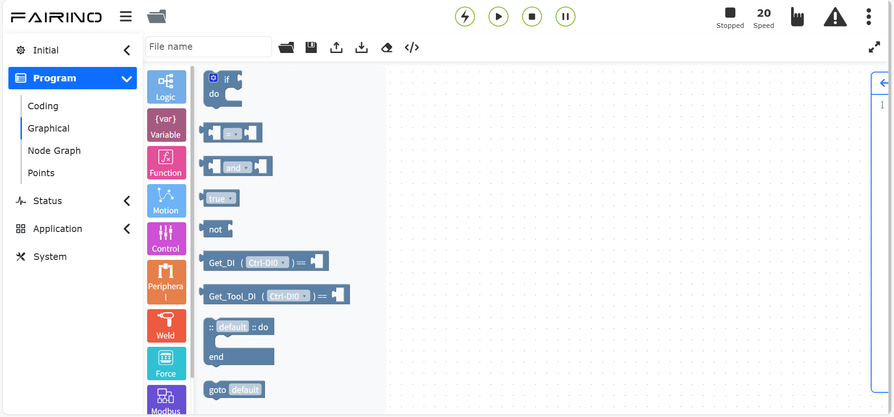

.. centered:: Abbildung 10.2 Logische grafische Programmierung

If/Else-Bedingungsanweisung
~~~~~~~~~~~~~~~~~~~~~~~~~~~~~~~~~~~~~~~
Ziehen Sie den Codeblock "If/Else-Bedingungsanweisung" in den Arbeitsbereich der grafischen Bearbeitungsoberfläche. (Dieser Befehl erfordert grundlegende Programmierkenntnisse. Bei Bedarf kontaktieren Sie uns bitte.)

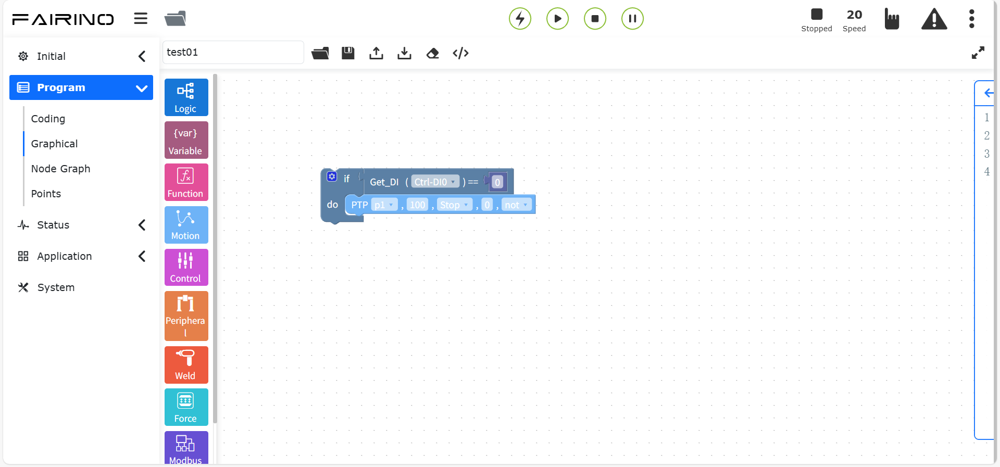

.. centered:: Abbildung 10.2-1 If/Else-Bedingungsanweisung Codeblock

While-Anweisung
~~~~~~~~~~~~~~~~~~~~~
Ziehen Sie den Codeblock "While-Anweisung" in den Arbeitsbereich der grafischen Bearbeitungsoberfläche. (Dieser Befehl erfordert grundlegende Programmierkenntnisse. Bei Bedarf kontaktieren Sie uns bitte.)

Fügen Sie nach dem "While" die Eingabewartebedingung hinzu. Fügen Sie innerhalb der While-Schleife Bewegungsbefehlscodeblöcke hinzu und klicken Sie auf Speichern. (Zur einfacheren Handhabung können Sie beliebige Inhalte in 'do' eingeben und später im Programm durch andere Anweisungen ersetzen.)

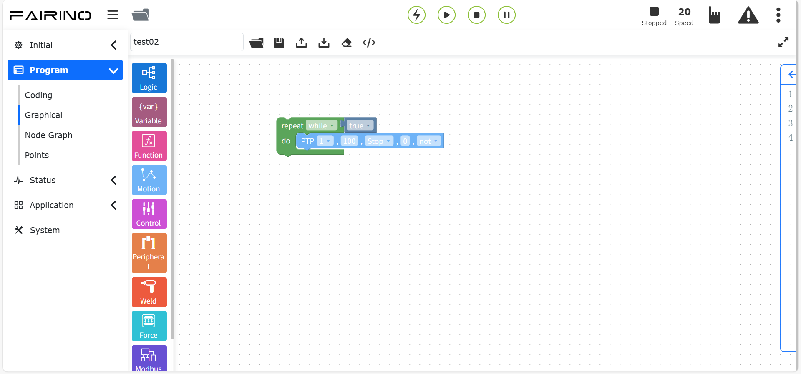

.. centered:: Abbildung 10.2-2 While-Anweisung Codeblock

Sprung-Anweisung
~~~~~~~~~~~~~~~~~~~~~
Ziehen Sie den Codeblock "Sprung-Anweisung" in den Arbeitsbereich der grafischen Bearbeitungsoberfläche. (Dieser Befehl erfordert grundlegende Programmierkenntnisse. Bei Bedarf kontaktieren Sie uns bitte.)

-   Sprungname: Geben Sie einen Sprungnamen ein, um die Sprungposition zu bestimmen.

.. image:: graphical/023.png
   :width: 6in
   :align: center

.. centered:: Abbildung 10.2-3 Sprung-Anweisung Codeblock

.. important:: Der Sprungname darf nicht mit einer Zahl beginnen.

Grafische Programmierbefehle für Variablen
--------------------------------------------------------
Grafische Programmierbefehle für Variablen enthalten Befehle zum Erstellen von Variablen.

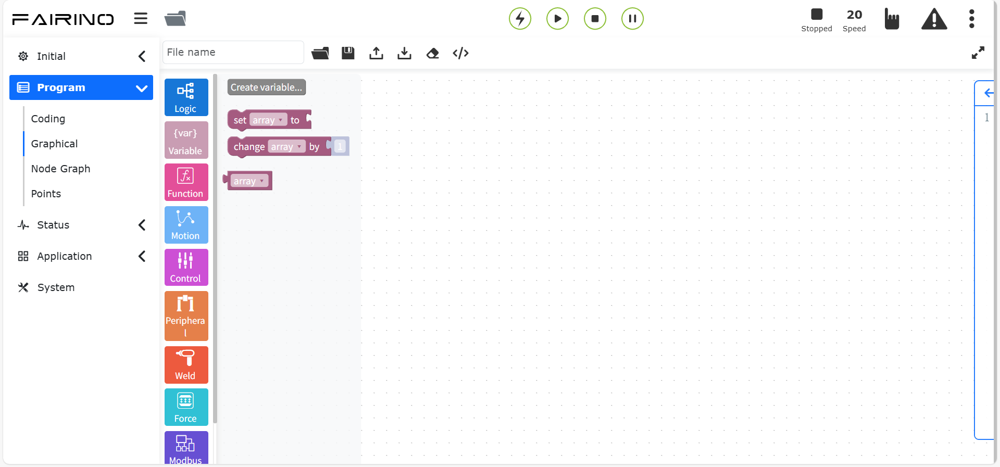

.. centered:: Abbildung 10.3 Grafische Programmierung für Variablen

Variablen-Anweisung
~~~~~~~~~~~~~~~~~~~~~
Klicken Sie auf die Schaltfläche "Erstellen", um den Namen der zu definierenden Variable einzugeben.

Ziehen Sie den Codeblock "Variablen-Anweisung" in den Arbeitsbereich der grafischen Bearbeitungsoberfläche.

Knoten "Variablen"-Anweisung, Parameter:

.. image:: graphical/024.png
   :width: 6in
   :align: center

.. centered:: Abbildung 10.3-1 Variablen-Anweisung Codeblock

Grafische Programmierbefehle für Funktionen
--------------------------------------------------------
Grafische Programmierbefehle für Funktionen enthalten Befehle zum Erstellen von Funktionen.

.. image:: graphical/005.png
   :width: 6in
   :align: center

.. centered:: Abbildung 10.4 Grafische Programmierung für Funktionen

Funktionsmethoden-Anweisung
~~~~~~~~~~~~~~~~~~~~~~~~~~~~~~~~~~~~~
Ziehen Sie den Codeblock "Funktionsmethoden-Anweisung" in den Arbeitsbereich der grafischen Bearbeitungsoberfläche.

Knoten "Funktionsmethode"-Anweisung, Parameter:

-   Funktionsname: Name der auszuführenden Funktion.

.. image:: graphical/025.png
   :width: 6in
   :align: center

.. centered:: Abbildung 10.4-1 Funktionsmethoden-Anweisung Codeblock

Grafische Programmierbefehle für Bewegungen
--------------------------------------------------------------
Grafische Programmierbefehle für Bewegungen enthalten Bewegungsbefehle wie PTP, Lin, ARC usw.

.. image:: graphical/006.png
   :width: 6in
   :align: center

.. centered:: Abbildung 10.5 Grafische Programmierung für Bewegungen

Punkt-zu-Punkt-Anweisung
~~~~~~~~~~~~~~~~~~~~~~~~~~~~~
Ziehen Sie den Codeblock "Punkt-zu-Punkt-Anweisung" in den Arbeitsbereich der grafischen Bearbeitungsoberfläche.

Sie können den zu erreichenden Punkt auswählen. Durch die Einstellung der Glättungszeit kann eine kontinuierliche Bewegung von diesem Punkt zum nächsten erreicht werden. Bei der Versatzeinstellung kann zwischen Versatz basierend auf dem Basiskoordinatensystem und Versatz basierend auf dem Werkzeugkoordinatensystem gewählt werden. Die Versatzwerte für x, y, z, rx, ry, rz werden eingeblendet. Der spezifische Pfad von PTP ist der optimale Pfad, der automatisch von der Bewegungssteuerung geplant wird.

Knoten "Punkt-zu-Punkt"-Anweisung, Parameter:

-   Punktname: Teach-Punkt.
-   Geschwindigkeit (%): 0 \~ 100.
-   Stopp: false/true.
-   Glättung (ms): Glättungszeit 0 \~ 500.
-   Versatz: Nein / Basiskoordinaten-Versatz / Werkzeugkoordinaten-Versatz. Bei Auswahl von "Nein" sind die Parameter dx \~ drz nicht wirksam.
-   dx \~ drz: Versatzwerte.

.. image:: graphical/026.png
   :width: 6in
   :align: center

.. centered:: Abbildung 10.5-1 Punkt-zu-Punkt-Anweisung Codeblock

Linear-Anweisung
~~~~~~~~~~~~~~~~~~~~~
Ziehen Sie den Codeblock "Linear-Anweisung" in den Arbeitsbereich der grafischen Bearbeitungsoberfläche.

Die Funktion dieses Befehls ähnelt der "Punkt-zu-Punkt"-Anweisung, jedoch ist der Pfad zu diesem Punkt eine gerade Linie.

Knoten "Linear"-Anweisung, Parameter:

-   Punktname: Teach-Punkt.
-   Geschwindigkeit (%): 0 \~ 100.
-   Stopp: false/true. Bei Auswahl von "true" ist der Parameter für die Glättung nicht wirksam.
-   Glättung (mm): Glättungsradius 0 \~ 1000.
-   Positionssuche: false/true.
-   Suchpunktvariable: REF0\~99/RES0\~99. Bei Auswahl von "false" für Positionssuche ist der Parameter nicht wirksam.
-   Versatz: Nein.
-   Überdrehzahlschutz Gelenk: Nein/Ja.
-   Behandlungsstrategie: Standard / Stopp mit Fehler bei Überdrehzahl / Adaptive Geschwindigkeitsreduzierung.
-   Zulässiger Reduktionsschwellwert: 0\~100.

.. image:: graphical/027.png
   :width: 6in
   :align: center

.. centered:: Abbildung 10.5-2 Linear-Anweisung Codeblock

Linear (Winkelgeschwindigkeit am Übergangspunkt einstellbar) Anweisung
~~~~~~~~~~~~~~~~~~~~~~~~~~~~~~~~~~~~~~~~~~~~~~~~~~~~~~~~~~~~~~~~~~~~~~~
Ziehen Sie den Codeblock "Linear (Winkelgeschwindigkeit am Übergangspunkt einstellbar) Anweisung" in den Arbeitsbereich der grafischen Bearbeitungsoberfläche.

Die Funktion dieses Befehls ähnelt der "Punkt-zu-Punkt"-Anweisung, jedoch beinhaltet dieser Befehl eine einstellbare Winkelgeschwindigkeit am Übergangspunkt.

Knoten "Linear (Winkelgeschwindigkeit am Übergangspunkt einstellbar)"-Anweisung, Parameter:

-   Maximale Winkelgeschwindigkeit: 0\~300.

.. image:: graphical/028.png
   :width: 6in
   :align: center

.. centered:: Abbildung 10.5-3 Linear (Winkelgeschwindigkeit am Übergangspunkt einstellbar) Anweisung Codeblock

Linear (seamPos) Anweisung
~~~~~~~~~~~~~~~~~~~~~~~~~~~~~~~~~~~~~
Ziehen Sie den Codeblock "Linear (seamPos) Anweisung" in den Arbeitsbereich der grafischen Bearbeitungsoberfläche.

Dieser Befehl wird in Schweißszenarien mit einem Lasersensor angewendet.

Knoten "Linear (seamPos)"-Anweisung, Parameter:

-   Punktname: Teach-Punkt.
-   Geschwindigkeit (%): 0 \~ 100.
-   Stopp: false/true. Bei Auswahl von "true" ist der Parameter für die Glättung nicht wirksam.
-   Glättung (mm): Glättungsradius 0 \~ 1000.
-   Auswahl Schweißnaht-Cachedaten: Ausführungsplandaten / Ausführungsaufzeichnungsdaten.
-   Blechtyp: Wellblech / Trapezblech / Zaunblech / Ölfass / Wellpappenstahl.
-   Versatz: Nein / Basiskoordinaten-Versatz / Werkzeugkoordinaten-Versatz / Versatz basierend auf Laserrohdaten. Bei Auswahl von "Nein" sind die Parameter dx \~ drz nicht wirksam.
-   dx \~ drz: Versatzwerte.

.. image:: graphical/029.png
   :width: 6in
   :align: center

.. centered:: Abbildung 10.5-4 Linear (seamPos) Anweisung Codeblock

Kreisbogen-Anweisung
~~~~~~~~~~~~~~~~~~~~~
Ziehen Sie den Codeblock "Kreisbogen-Anweisung" in den Arbeitsbereich der grafischen Bearbeitungsoberfläche.

Eine Kreisbogenbewegung umfasst zwei Punkte: Der erste Punkt ist der Zwischenpunkt des Kreisbogens, der zweite Punkt ist der Endpunkt. Für sowohl den Zwischen- als auch den Endpunkt kann eingestellt werden, ob ein Versatz erfolgen soll. Es kann zwischen Versatz basierend auf dem Basiskoordinatensystem und Versatz basierend auf dem Werkzeugkoordinatensystem gewählt werden. Die Versatzwerte für x, y, z, rx, ry, rz werden gesetzt. Für den Endpunkt kann ein Glättungsradius eingestellt werden, um einen kontinuierlichen Bewegungseffekt zu erzielen.

Knoten "Kreisbogen"-Anweisung, Parameter:

-   Kreisbogen-Zwischenpunkt: Teach-Punkt.
-   Versatz: Nein / Basiskoordinaten-Versatz / Werkzeugkoordinaten-Versatz. Bei Auswahl von "Nein" sind die Parameter dx \~ drz nicht wirksam.
-   dx \~ drz: Versatzwerte.
-   Kreisbogen-Endpunkt: Teach-Punkt.
-   Versatz: Nein / Basiskoordinaten-Versatz / Werkzeugkoordinaten-Versatz. Bei Auswahl von "Nein" sind die Parameter dx \~ drz nicht wirksam.
-   dx \~ drz: Versatzwerte.
-   Geschwindigkeit (%): 0 \~ 100.
-   Stopp: false/true. Bei Auswahl von "true" ist der Parameter für die Glättung nicht wirksam.
-   Glättung (mm): Glättungsradius 0 \~ 1000.

.. image:: graphical/030.png
   :width: 6in
   :align: center

.. centered:: Abbildung 10.5-5 Kreisbogen-Anweisung Codeblock

Vollkreis-Anweisung
~~~~~~~~~~~~~~~~~~~~~
Ziehen Sie den Codeblock "Vollkreis-Anweisung" in den Arbeitsbereich der grafischen Bearbeitungsoberfläche.

Klicken Sie auf den Knoten "Vollkreis"-Anweisung, um in die Knotengraph-Bearbeitungsoberfläche zu gelangen.

Eine Vollkreisbewegung umfasst zwei Punkte: Der erste Punkt ist der Zwischenpunkt 1 des Vollkreises, der zweite Punkt ist der Zwischenpunkt 2 des Vollkreises. Für Zwischenpunkt 2 kann eingestellt werden, ob ein Versatz erfolgen soll. Dieser Versatz gilt gleichzeitig für Zwischenpunkt 1 und Zwischenpunkt 2.

Knoten "Vollkreis"-Anweisung, Parameter:

-   Vollkreis-Zwischenpunkt 1: Teach-Punkt.
-   Vollkreis-Zwischenpunkt 2: Teach-Punkt.
-   Geschwindigkeit (%): 0 \~ 100.
-   Versatz: Nein / Basiskoordinaten-Versatz / Werkzeugkoordinaten-Versatz. Bei Auswahl von "Nein" sind die Parameter dx \~ drz nicht wirksam.
-   dx \~ drz: Versatzwerte.

.. image:: graphical/031.png
   :width: 6in
   :align: center

.. centered:: Abbildung 10.5-6 Vollkreis-Anweisung Codeblock

Spiral-Anweisung
~~~~~~~~~~~~~~~~~~~~~
Ziehen Sie den Codeblock "Spiral-Anweisung" in den Arbeitsbereich der grafischen Bearbeitungsoberfläche.

Eine Spiralbewegung umfasst drei Punkte, die einen Kreis bilden. Auf der Einstellungsseite für den dritten Punkt gibt es Parameter für die Anzahl der Windungen, die Korrektur der Ausrichtung, die Radiusinkrement und die Inkrement in Richtung der Drehachse. Die Anzahl der Windungen ist die Anzahl der Bewegungen der Spirale. Der Ausrichtungskorrekturwinkel korrigiert die Ausrichtung am Ende der Spirale relativ zur Ausrichtung am ersten Punkt der Spirale. Die Radiusinkrement ist die Zunahme des Radius pro Windung. Die Inkrement in Richtung der Drehachse ist die Zunahme in Richtung der Spiralachse. Durch Einstellen von "Versatz" wird dieser Versatz auf die gesamte Spiralbahn angewendet.

Knoten "Spiral"-Anweisung, Parameter:

-   Spiral-Zwischenpunkt 1: Teach-Punkt.
-   Spiral-Zwischenpunkt 2: Teach-Punkt.
-   Spiral-Zwischenpunkt 3: Teach-Punkt.
-   Geschwindigkeit (%): 0 \~ 100.
-   Versatz: Nein / Basiskoordinaten-Versatz / Werkzeugkoordinaten-Versatz. Bei Auswahl von "Nein" sind die Parameter dx \~ drz nicht wirksam.
-   dx \~ drz: Versatzwerte.
-   Anzahl Windungen: 0 \~ 100.
-   Ausrichtungskorrektur rx (°): -1000 \~ 1000.
-   Ausrichtungskorrektur ry (°): -1000 \~ 1000.
-   Ausrichtungskorrektur rz (°): -1000 \~ 1000.
-   Radiusinkrement (mm): -100 \~ 100.
-   Inkrement in Richtung der Drehachse (mm): -100 \~ 100.

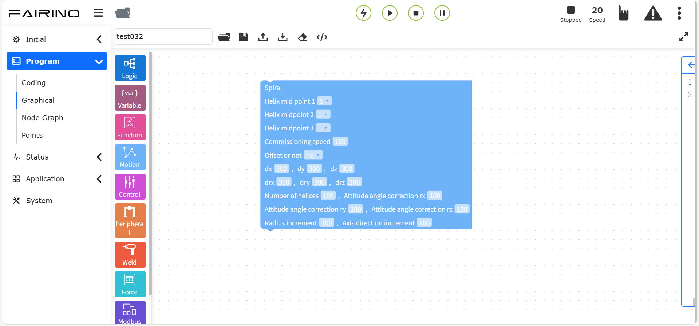

.. centered:: Abbildung 10.5-7 Spiral-Anweisung Codeblock

Neue Spiral-Anweisung
~~~~~~~~~~~~~~~~~~~~~
Ziehen Sie den Codeblock "Neue Spiral-Anweisung" in den Arbeitsbereich der grafischen Bearbeitungsoberfläche.

Klicken Sie auf den Knoten "Neue Spirale"-Anweisung, um in die Knotengraph-Bearbeitungsoberfläche zu gelangen.

Die neue Spiralbewegung ist eine optimierte Version der Spiralbewegung. Dieser Befehl benötigt nur einen Punkt plus die Konfiguration verschiedener Parameter, um eine Spiralbewegung zu realisieren. Der Roboter beginnt an der aktuellen Position. Der Benutzer stellt Parameter ein: Geschwindigkeit, Versatz, Anzahl der Windungen, Neigungswinkel der Spirale, Anfangsradius, Radiusinkrement, Inkrement in Richtung der Drehachse und Drehrichtung. Die Anzahl der Windungen ist die Anzahl der Bewegungen der Spirale. Der Neigungswinkel der Spirale ist der Winkel zwischen der Werkzeug-Z-Achse und der Horizontalen. Der Ausrichtungskorrekturwinkel korrigiert die Ausrichtung am Ende der Spirale relativ zur Ausrichtung am ersten Punkt der Spirale. Der Anfangsradius ist die Größe des Radius der ersten Windung. Die Radiusinkrement ist die Zunahme des Radius pro Windung. Die Inkrement in Richtung der Drehachse ist die Zunahme in Richtung der Spiralachse. Die Drehrichtung ist im Uhrzeigersinn oder gegen den Uhrzeigersinn.

Knoten "Neue Spirale"-Anweisung, Parameter:

-   Spiral-Startpunkt: Teach-Punkt.
-   Geschwindigkeit (%): 0 \~ 100.
-   Versatz: Nein / Basiskoordinaten-Versatz / Werkzeugkoordinaten-Versatz. Bei Auswahl von "Nein" sind die Parameter dx \~ drz nicht wirksam.
-   dx \~ drz: Versatzwerte.
-   Anzahl Windungen: 0 \~ 100.
-   Neigungswinkel Spirale (°): -100 \~ 100.
-   Anfangsradius: 0 \~ 100.
-   Radiusinkrement (mm): -100 \~ 100.
-   Inkrement in Richtung der Drehachse (mm): -100 \~ 100.
-   Drehrichtung: Im Uhrzeigersinn / Gegen den Uhrzeigersinn.

.. image:: graphical/033.png
   :width: 6in
   :align: center

.. centered:: Abbildung 10.5-8 Neue Spiral-Anweisung Codeblock

Horizontale Spiral-Anweisung
~~~~~~~~~~~~~~~~~~~~~~~~~~~~~~~~~~~~~
Ziehen Sie den Codeblock "Horizontale Spiral-Anweisung" in den Arbeitsbereich der grafischen Bearbeitungsoberfläche.

Der Befehl "H-Spiral" ist eine horizontale räumliche Spiralbewegung. Dieser Befehl wird nach einem einzelnen Bewegungsbefehl (z.B. Linear) eingefügt.

Knoten "Horizontale Spirale"-Anweisung, Parameter:

-   Spiralradius: 0\~100 mm.
-   Spiralwinkelgeschwindigkeit: 0\~2 U/s.
-   Drehrichtung: Spirale im/gegen Uhrzeigersinn.
-   Neigungswinkel Spirale: 0\~40°.

.. image:: graphical/034.png
   :width: 6in
   :align: center

.. centered:: Abbildung 10.5-9 Horizontale Spiral-Anweisung Codeblock

Spline-Anweisung
~~~~~~~~~~~~~~~~~~~~~
Ziehen Sie den Codeblock "Spline-Anweisung" in den Arbeitsbereich der grafischen Bearbeitungsoberfläche.

Dieser Befehl ist in drei Teile unterteilt: Spline-Gruppenstart, Spline-Segment und Spline-Gruppenende. Der Spline-Gruppenstart ist das Startkennzeichen der Spline-Bewegung. Das Spline-Segment enthält derzeit im Knotengraph nur das SPL-Segment. Das Spline-Gruppenende ist das Endekennzeichen der Spline-Bewegung.

Knoten "Spline-SPTP"-Anweisung, Parameter:

-   Punktname: Teach-Punkt.
-   Geschwindigkeit (%): 0 \~ 100.

.. image:: graphical/035.png
   :width: 6in
   :align: center

.. centered:: Abbildung 10.5-10 Spline-Anweisung Codeblock

Neue Spline-Anweisung
~~~~~~~~~~~~~~~~~~~~~
Ziehen Sie den Codeblock "Neue Spline-Anweisung" in den Arbeitsbereich der grafischen Bearbeitungsoberfläche.

Dieser Befehl ist eine optimierte Version des Spline-Befehls und wird zukünftig die vorhandene Spline-Anweisung ersetzen. Der Befehl ist in drei Teile unterteilt: Mehrpunktbahn-Start, Mehrpunktbahn-Segment und Mehrpunktbahn-Ende. Der Mehrpunktbahn-Start ist das Startkennzeichen der Mehrpunktbahnbewegung. Das Mehrpunktbahn-Segment dient zum Setzen der einzelnen Bahnpunkte. Klicken Sie auf das Symbol, um in die Punkthinzuügungsoberfläche zu gelangen. Das Mehrpunktbahn-Ende ist das Endekennzeichen der Mehrpunktbahnbewegung. Hier können der Steuerungsmodus und die Geschwindigkeit eingestellt werden. Der Steuerungsmodus unterteilt sich in "Kontrollpunkte vorgeben" und "Bahnpunkte vorgeben".

Knoten "Neuer Spline"-Anweisung, Parameter:

-   Steuerungsmodus: Teach-Punkt.
-   Globale durchschnittliche Übergangszeit: Ganzzahl, größer als 10, Standardwert 2000 ms.

Knoten "Neuer Spline-SPL"-Anweisung, Parameter:

-   Punktname: Teach-Punkt.
-   Geschwindigkeit (%): 0 \~ 100.
-   Glättungsradius: 0 \~ 1000.
-   Ist letzter Punkt: Nein/Ja.

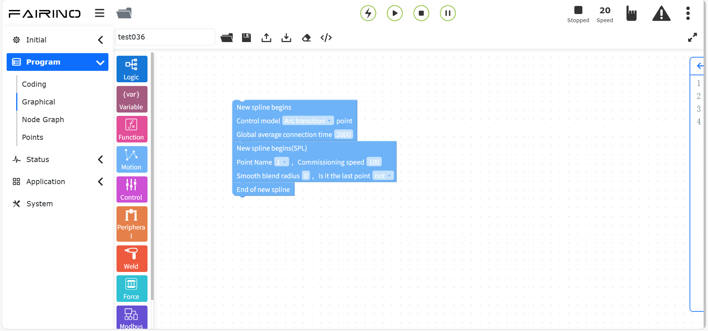

.. centered:: Abbildung 10.5-11 Neue Spline-Anweisung Codeblock

Pendelanweisung
~~~~~~~~~~~~~~~~~~~~~
Ziehen Sie den Codeblock "Pendelanweisung" in den Arbeitsbereich der grafischen Bearbeitungsoberfläche.

Knoten "Pendel"-Anweisung, Parameter:

-   Nummer: 0\~7.

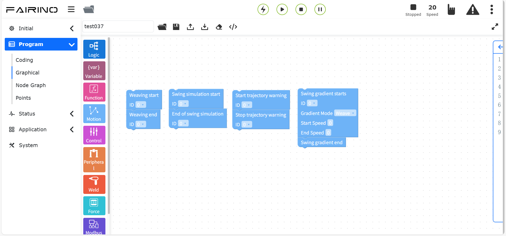

.. centered:: Abbildung 10.5-12 Pendelanweisung Codeblock

Punktversatz-Anweisung
~~~~~~~~~~~~~~~~~~~~~~~~~~~~~
Ziehen Sie den Codeblock "Punktversatz-Anweisung" in den Arbeitsbereich der grafischen Bearbeitungsoberfläche.

Dieser Befehl ist ein globaler Versatzbefehl. Durch Eingabe der verschiedenen Versatzwerte werden die Bewegungsbefehle basierend auf dem Basiskoordinatensystem (oder Werkstückkoordinatensystem) versetzt.

Knoten "Punktversatz"-Anweisung, Parameter:

-   ∆x: Versatzwert, -300\~300.
-   ∆y: Versatzwert, -300\~300.
-   ∆z: Versatzwert, -300\~300.
-   ∆rx: Versatzwert, -300\~300.
-   ∆ry: Versatzwert, -300\~300.
-   ∆rz: Versatzwert, -300\~300.

.. image:: graphical/038.png
   :width: 6in
   :align: center

.. centered:: Abbildung 10.5-13 Punktversatz-Anweisung Codeblock

Servoanweisung
~~~~~~~~~~~~~~~~~~~~~
Ziehen Sie den Codeblock "Servoanweisung" in den Arbeitsbereich der grafischen Bearbeitungsoberfläche.

Servosteuerungsbefehl (Bewegung im kartesischen Raum). Dieser Befehl kann die Roboterbewegung durch absolute Positionierung oder Versatz basierend auf der aktuellen Position steuern.

Knoten "Servo"-Anweisung, Parameter:

-   Bewegungsart: Absolute Position / Basiskoordinaten-Versatz / Werkzeugkoordinaten-Versatz.
-   x: Versatzwert, -300\~300.
-   y: Versatzwert, -300\~300.
-   z: Versatzwert, -300\~300.
-   rx: Versatzwert, -300\~300.
-   ry: Versatzwert, -300\~300.
-   rz: Versatzwert, -300\~300.
-   Skalierungsfaktor x: 0\~1.
-   Skalierungsfaktor y: 0\~1.
-   Skalierungsfaktor z: 0\~1.
-   Skalierungsfaktor rx: 0\~1.
-   Skalierungsfaktor ry: 0\~1.
-   Skalierungsfaktor rz: 0\~1.
-   Beschleunigung (%): 0\~100.
-   Geschwindigkeit (%): 0\~100.
-   Befehlszyklus (s): 0,001\~0,016.
-   Filterzeit (s): 0\~1.
-   Skalierungsverstärkung: 0\~100.

.. image:: graphical/039.png
   :width: 6in
   :align: center

.. centered:: Abbildung 10.5-14 Servoanweisung Codeblock

Bahn-Anweisung
~~~~~~~~~~~~~~~~~~~~~
Ziehen Sie den Codeblock "Bahn-Anweisung" in den Arbeitsbereich der grafischen Bearbeitungsoberfläche.

Für diesen Befehl muss der Benutzer zunächst eine aufgezeichnete Bahn haben.

Knoten "Bahn"-Anweisung, Parameter:

-   Auswahl Bahndatei: Aufgezeichnete Bahn.
-   Geschwindigkeit (%): 0 \~ 100, Standardwert 25.

.. image:: graphical/040.png
   :width: 6in
   :align: center

.. centered:: Abbildung 10.5-15 Bahn-Anweisung Codeblock

Bahn-J-Anweisung
~~~~~~~~~~~~~~~~~~~~~
Ziehen Sie den Codeblock "Bahn-J-Anweisung" in den Arbeitsbereich der grafischen Bearbeitungsoberfläche.

Für diesen Befehl muss der Benutzer zunächst eine aufgezeichnete Bahn haben. Die Bahndatei kann vorab auf der Teach-Programmoberfläche importiert werden. Die Bahn-Anweisung und die Bahn-J-Anweisung dienen als universelle Schnittstelle für Bahnen, die direkt von einer Kamera vorgegeben werden. Sie ermöglichen es, bei Vorliegen einer diskreten Bahnpunktdatei in einem festgelegten Format, diese in das System zu importieren und den Roboter sich gemäß der importierten Bahn bewegen zu lassen.

Knoten "Bahn-J"-Anweisung, Parameter:

-   Auswahl Bahndatei: Aufgezeichnete Bahn.
-   Geschwindigkeit (%): 0 \~ 100, Standardwert 25.
-   Bahnmodus: Bahnpunkte / Kontrollpunkte.

.. image:: graphical/041.png
   :width: 6in
   :align: center

.. centered:: Abbildung 10.5-16 Bahn-J-Anweisung Codeblock

Bahnreproduktions-Anweisung
~~~~~~~~~~~~~~~~~~~~~~~~~~~~~~~~~~~~~
Ziehen Sie den Codeblock "Bahnreproduktions-Anweisung" in den Arbeitsbereich der grafischen Bearbeitungsoberfläche.

Für diesen Befehl muss der Benutzer zunächst eine aufgezeichnete Bahn haben.

Bei der Programmerstellung wird zunächst mit einem Punkt-zu-Punkt-Befehl der entsprechende Bahnstartpunkt angefahren. Dann wird in der Bahnreproduktions-Anweisung die Bahn ausgewählt, die geglättete Bahn ausgewählt und die Geschwindigkeit eingestellt. Der Bahnladebefehl dient hauptsächlich zum vorherigen Einlesen der Bahndatei, zum Extrahieren als Bahnbefehl und zur besseren Anwendung in Förderbandverfolgungsszenarien.

Knoten "Bahnreproduktion"-Anweisung, Parameter:

-   Bahnname: Aufgezeichnete Bahn.
-   Bahn glätten: Nein/Ja.
-   Geschwindigkeit (%): 0 \~ 100, Standardwert 25.

.. image:: graphical/042.png
   :width: 6in
   :align: center

.. centered:: Abbildung 10.5-17 Bahnreproduktions-Anweisung Codeblock

DMP-Anweisung
~~~~~~~~~~~~~~~~~~~~~
Ziehen Sie den Codeblock "DMP-Anweisung" in den Arbeitsbereich der grafischen Bearbeitungsoberfläche.

DMP ist eine Methode des Bewegungslernens durch Nachahmung, bei der eine Referenzbahn im Voraus geplant werden muss. Wählen Sie in der Befehlsbearbeitungsoberfläche einen Teach-Punkt als neuen Startpunkt aus. Nach dem Klicken auf "Hinzufügen" und "Anwenden" kann der Befehl gespeichert werden. Der spezifische DMP-Pfad ist eine neue Bahn, die die Referenzbahn mit dem neuen Startpunkt nachahmt.

Knoten "DMP"-Anweisung, Parameter:

-   Punktname: Teach-Punkt.
-   Geschwindigkeit (%): 0 \~ 100, Standardwert 100.

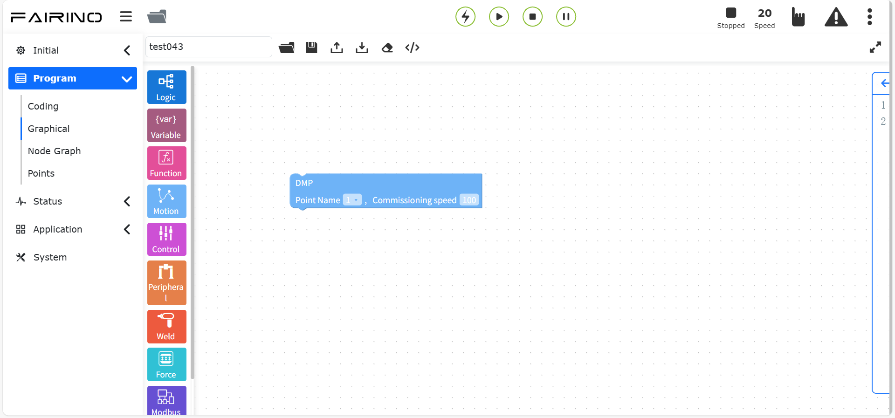

.. centered:: Abbildung 10.5-18 DMP-Anweisung Codeblock

Werkzeugwechsel-Anweisung
~~~~~~~~~~~~~~~~~~~~~~~~~~~~~~~~~~~~~
Ziehen Sie den Codeblock "Werkzeugwechsel-Anweisung" in den Arbeitsbereich der grafischen Bearbeitungsoberfläche.

Wählen Sie das Werkzeugkoordinatensystem aus, das automatisch konvertiert werden soll. Nach dem Klicken auf "Hinzufügen" und "Anwenden" kann der Befehl gespeichert werden. Die Punkte im Werkzeugkoordinatensystem werden automatisch konvertiert.

Knoten "Werkzeugwechsel"-Anweisung, Parameter:

-   Werkzeugkoordinatensystem: Liste der Werkzeugkoordinatensysteme.

.. image:: graphical/044.png
   :width: 6in
   :align: center

.. centered:: Abbildung 10.5-19 Werkzeugwechsel-Anweisung Codeblock

Werkstückwechsel-Anweisung
~~~~~~~~~~~~~~~~~~~~~~~~~~~~~~~~~~~~~
Ziehen Sie den Codeblock "Werkstückwechsel-Anweisung" in den Arbeitsbereich der grafischen Bearbeitungsoberfläche.

Wählen Sie das Werkstückkoordinatensystem aus, das automatisch konvertiert werden soll. Nach dem Klicken auf "Hinzufügen" und "Anwenden" kann der Befehl gespeichert werden. Die Punkte im Werkstückkoordinatensystem werden automatisch konvertiert.

Knoten "Werkstückwechsel"-Anweisung, Parameter:

-   Werkstückkoordinatensystem: Liste der Werkstückkoordinatensysteme.

.. image:: graphical/045.png
   :width: 6in
   :align: center

.. centered:: Abbildung 10.5-20 Werkstückwechsel-Anweisung Codeblock

Steuerungsbezogene grafische Programmierbefehle
-----------------------------------------------------
Steuerungsbezogene grafische Programmierbefehle enthalten Steuerbefehle wie Wait, IO usw.

.. image:: graphical/007.png
   :width: 6in
   :align: center

.. centered:: Abbildung 10.6 Steuerungsbezogene grafische Programmierbefehle

Warten-Anweisung
~~~~~~~~~~~~~~~~~~~~~
Ziehen Sie den Codeblock "Warten-Anweisung" in den Arbeitsbereich der grafischen Bearbeitungsoberfläche.

Dieser Befehl ist ein Verzögerungsbefehl und ist in vier Teile unterteilt: "WaitMs", "WaitDI", "WaitMultiDI" und "WaitAI".

1.  Knoten "Warten"-Anweisung, Parameter:

    -   Wartezeit (ms): Die Verzögerungszeit in Millisekunden. Geben Sie die Anzahl der zu wartenden Millisekunden ein.

.. image:: graphical/046.png
   :width: 6in
   :align: center

.. centered:: Abbildung 10.6-1 Warten-Anweisung Codeblock

2.  Knoten "WaitDI"-Anweisung, Parameter:

    -   DI-Portnummer: Ctrl-DI0 \~ Ctrl-CI7 (WaitDI, [0\~15]), End-DI0 \~ End-DI1 (WaitToolDI, [0\~1]).
    -   Status: false/true.
    -   Maximale Zeit (ms): 0 \~ 10000.
    -   Wartezeit-Überschreitung Behandlung: Stopp mit Fehler / Fortsetzen / Unbegrenzt warten.

.. image:: graphical/047.png
   :width: 6in
   :align: center

.. centered:: Abbildung 10.6-2 WaitDI-Anweisung Codeblock

3.  Knoten "WaitMultiDI"-Anweisung, Parameter:

    -   Bedingung: UND / ODER.
    -   Bedingungsauswahl: Wählen Sie die Portnummern aus, deren Bit-Status aktiviert sein soll, getrennt durch Kommas, z.B. DI0,DI1.
    -   Ports für Wahrheitswert: Wählen Sie die Portnummern für den Wahrheitswert aus, getrennt durch Kommas, z.B. DI0,DI1.
    -   Maximale Zeit (ms): 0 \~ 10000, maximale Wartezeit.
    -   Wartezeit-Überschreitung Behandlung: Stopp mit Fehler / Fortsetzen / Unbegrenzt warten.

.. image:: graphical/048.png
   :width: 6in
   :align: center

.. centered:: Abbildung 10.6-3 WaitMultiDI-Anweisung Codeblock

4.  Knoten "WaitAI"-Anweisung, Parameter:

    -   Bedingung: UND / ODER.
    -   AI-Portnummer: Ctrl-AI0 \~ Ctrl-AI1 (WaitAI, [0\~1]), End-AI0 (WaitToolAI, [0]).
    -   Bedingung: Größer als / Kleiner als.
    -   Wert (%): 1 \~ 100.
    -   Maximale Zeit (ms): 0 \~ 10000.
    -   Wartezeit-Überschreitung Behandlung: Stopp mit Fehler / Fortsetzen / Unbegrenzt warten. Bei Auswahl von "Unbegrenzt warten" ist die maximale Zeit standardmäßig 0.

.. image:: graphical/049.png
   :width: 6in
   :align: center

.. centered:: Abbildung 10.6-4 WaitAI-Anweisung Codeblock

Moduswechsel-Anweisung
~~~~~~~~~~~~~~~~~~~~~~~~~~~~~~
Ziehen Sie den Codeblock "Moduswechsel-Anweisung" in den Arbeitsbereich der grafischen Bearbeitungsoberfläche.

Dieser Befehl schaltet den Roboter in den manuellen Modus. Er wird normalerweise am Ende eines Programms hinzugefügt, damit der Benutzer den Roboter nach Programmende automatisch in den manuellen Modus schalten und den Roboter ziehen kann.

Knoten "Moduswechsel"-Anweisung, Parameter:

-   Moduswechsel: Manueller Modus.

.. image:: graphical/050.png
   :width: 6in
   :align: center

.. centered:: Abbildung 10.6-5 Moduswechsel-Anweisung Codeblock

Pause-Anweisung
~~~~~~~~~~~~~~~~~~~~~
Ziehen Sie den Codeblock "Pause-Anweisung" in den Arbeitsbereich der grafischen Bearbeitungsoberfläche.

Dieser Befehl ist ein Pause-Befehl. Wenn dieser Befehl im Programm eingefügt wird und das Programm diesen Befehl erreicht, wechselt der Roboter in den Pause-Zustand. Um fortzufahren, klicken Sie auf die Schaltfläche "Pause/Fortsetzen" im Steuerungsbereich.

Knoten "Pause"-Anweisung, Parameter:

-   Pause-Typ: Keine Funktion, Zylinder nicht in Position usw.

.. image:: graphical/051.png
   :width: 6in
   :align: center

.. centered:: Abbildung 10.6-6 Pause-Anweisung Codeblock

Koordinatensystem-Anweisungen
~~~~~~~~~~~~~~~~~~~~~~~~~~~~~~~~~~~~~~~
Ziehen Sie den Codeblock "Werkzeugkoordinatensystem setzen" / "Werkstückkoordinatensystem setzen" in den Arbeitsbereich der grafischen Bearbeitungsoberfläche.

1.  Knoten "Werkzeugkoordinatensystem setzen"-Anweisung, Parameter:

    -   Name Werkzeugkoordinatensystem: toolcoord1 \~ toolcoord19 (SetToolList, [0\~19]), etoolcoord0 \~ etoolcoord14 (SetExToolList, [0\~14]).

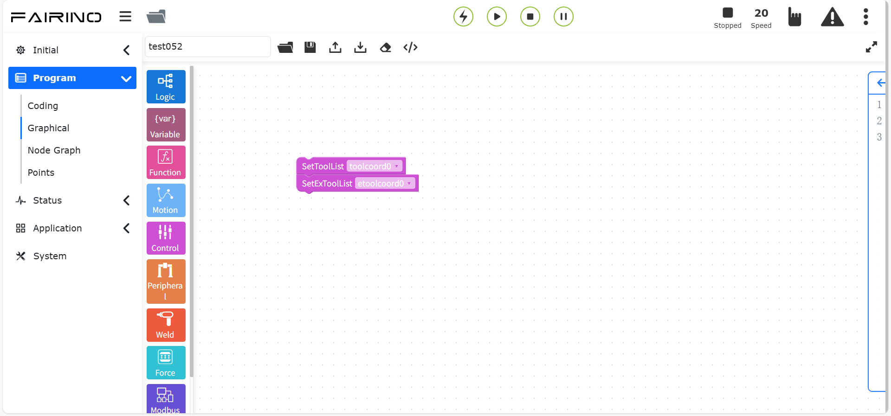

.. centered:: Abbildung 10.6-7 Werkzeugkoordinatensystem setzen Codeblock

2.  Knoten "Werkstückkoordinatensystem setzen"-Anweisung, Parameter:

    -   Name Werkstückkoordinatensystem: wobjcoord1 \~ wobjcoord14.

.. image:: graphical/053.png
   :width: 6in
   :align: center

.. centered:: Abbildung 10.6-8 Werkstückkoordinatensystem setzen Codeblock

Simulierte AI-Anweisungen
~~~~~~~~~~~~~~~~~~~~~~~~~~~~~~~~~~~~~~~
Ziehen Sie den Codeblock "AO setzen" / "AI abrufen" in den Arbeitsbereich der grafischen Bearbeitungsoberfläche.

Dieser Befehl ist in zwei Funktionen unterteilt: Analogen Ausgang setzen (SetAO/SPLCSetAO) und Analogen Eingang abrufen (GetAI/SPLCGetAI).

1.  Knoten "AO setzen"-Anweisung, Parameter:

    -   Port: Ctrl-AO0 \~ Ctrl-AO1 (blockierend: SetAO, nicht blockierend: SPLCSetAO, [0\~1]), End-AO0 (blockierend: SetToolAO, nicht blockierend: SPLCSetToolAO, [0]).
    -   Wert (%): 0 \~ 100.
    -   Blockierung: Blockierend / Nicht blockierend.
    -   Thread anwenden: Nein/Ja.

.. image:: graphical/054.png
   :width: 6in
   :align: center

.. centered:: Abbildung 10.6-9 AO setzen Codeblock

2.  Knoten "AI abrufen"-Anweisung, Parameter:

    -   Port: Ctrl-AI0 \~ Ctrl-DI1 (blockierend: GetAI, nicht blockierend: SPLCGetAI, [0\~1]), End-AI0 (blockierend: GetToolAI, nicht blockierend: SPLCGetToolAI, [0]).
    -   Bedingung: Größer als / Kleiner als.
    -   Wert (%): 0 \~ 100.
    -   Maximale Zeit (ms): 0 \~ 10000.
    -   Blockierung: Blockierend / Nicht blockierend.
    -   Thread anwenden: Nein/Ja.

.. image:: graphical/055.png
   :width: 6in
   :align: center

.. centered:: Abbildung 10.6-10 AI abrufen Codeblock

Digitale IO-Anweisungen
~~~~~~~~~~~~~~~~~~~~~~~~~~~~~~
Ziehen Sie den Codeblock "DO setzen" / "DI abrufen" in den Arbeitsbereich der grafischen Bearbeitungsoberfläche.

Der Befehl ist ein IO-Befehl, unterteilt in IO setzen (SetDO/SPLCSetDO) und IO abrufen (GetDI/SPLCGetDI).

1.  Knoten "DO setzen"-Anweisung, Parameter:

    -   Port: Ctrl-DO0 \~ Ctrl-CO7 (blockierend: SetDO, nicht blockierend: SPLCSetDO, [0\~15]), End-DO0 \~ End-DO1 (blockierend: SetToolDO, nicht blockierend: SPLCSetToolDO, [0\~1]).
    -   Status: false/true.
    -   Blockierung: Blockierend / Nicht blockierend.
    -   Bahn glätten: Break/Serious.
    -   Thread anwenden: Nein/Ja.

.. image:: graphical/056.png
   :width: 6in
   :align: center

.. centered:: Abbildung 10.6-11 DO setzen Codeblock

2.  Knoten "DI abrufen"-Anweisung, Parameter:

    -   Port: Ctrl-DI0 \~ Ctrl-CI7 (blockierend: GetDI, nicht blockierend: SPLCGetDI, [0\~15]), End-DI0 \~ End-DI1 (blockierend: GetToolDI, nicht blockierend: SPLCGetToolDI, [0\~1]).
    -   Blockierung: Blockierend / Nicht blockierend.
    -   Status: false/true.
    -   Maximale Wartezeit (ms): 0 \~ 10000.
    -   Thread anwenden: Nein/Ja.

.. image:: graphical/057.png
   :width: 6in
   :align: center

.. centered:: Abbildung 10.6-12 DI abrufen Codeblock

Bewegungs-DO-Anweisung
~~~~~~~~~~~~~~~~~~~~~~~~~~~~~~
Ziehen Sie den Codeblock "Bewegungs-DO-Anweisung" in den Arbeitsbereich der grafischen Bearbeitungsoberfläche.

Dieser Befehl realisiert die Funktion, während einer linearen Bewegung in festgelegten Abständen kontinuierlich DO-Signale auszugeben.

1.  Knoten "Bewegungs-DO Dauerausgabe"-Anweisung, Parameter:

    -   Port: Ctrl-DO0 \~ Ctrl-DO0 (MoveDOStart, [0\~15]), End-DO1 (MoveDOStart, [0\~1]).
    -   Eingestelltes Intervall (mm): 0 \~ 500.
    -   Ausgangsimpuls Tastverhältnis (%): 0 \~ 99.

2.  Knoten "Bewegungs-DO Einzelausgabe"-Anweisung, Parameter:

    -   Port: Ctrl-DO0 \~ Ctrl-DO0 (MoveDOOnceStart, [0\~15]), End-DO1 (MoveDOOnceStart, [0\~1]).
    -   Ausgabemodus: Ausgabe im Abschnitt mit konstanter Geschwindigkeit / Freie Konfiguration.
    -   Setzzeit (ms): 0 \~ 1000 (Standard im Modus "Ausgabe im Abschnitt mit konstanter Geschwindigkeit" ist -1).
    -   Rücksetzzeit (ms): 0 \~ 1000 (Standard im Modus "Ausgabe im Abschnitt mit konstanter Geschwindigkeit" ist -1).

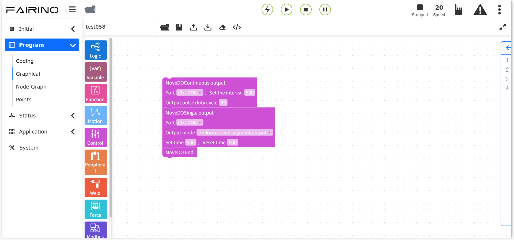

.. centered:: Abbildung 10.6-13 "Bewegungs-DO Einzel-/Dauerausgabe" Codeblock

Bewegungs-AO-Anweisung
~~~~~~~~~~~~~~~~~~~~~~~~~~~~~~
Ziehen Sie den Codeblock "Bewegungs-AO-Anweisung" in den Arbeitsbereich der grafischen Bearbeitungsoberfläche.

Bei Verwendung dieses Befehls zusammen mit einem Bewegungsbefehl kann während der Bewegung ein AO-Signal proportional zur aktuellen TCP-Geschwindigkeit ausgegeben werden.

Knoten "Bewegungs-AO"-Anweisung, Parameter:

-   Steuerschrank AO-Nummer: Ctrl-AO0 \~ Ctrl-AO1 (MoveAOStart, [0\~1]), End-AO0 (MoveToolAOStart, 0).
-   Maximale TCP-Geschwindigkeit: 0 \~ 100.
-   AO-Prozentsatz bei maximaler TCP-Geschwindigkeit: 0 \~ 100.
-   AO-Prozentsatz Totzonenkompensation: 0 \~ 100.

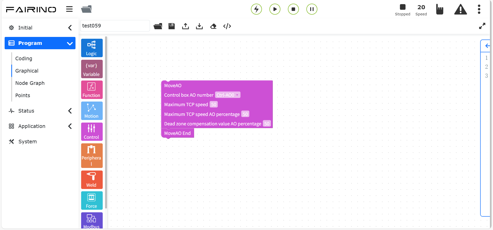

.. centered:: Abbildung 10.6-14 "Bewegungs-AO" Codeblock

Kollisionsstufen-Anweisung
~~~~~~~~~~~~~~~~~~~~~~~~~~~~~~~~~~~~~~~
Ziehen Sie den Codeblock "Kollisionsstufen-Anweisung" in den Arbeitsbereich der grafischen Bearbeitungsoberfläche.

Dieser Befehl dient zur Einstellung der Kollisionsstufe. Mit diesem Befehl kann die Kollisionsstufe jeder Achse während des Programmlaufs in Echtzeit angepasst werden, was eine flexiblere Bereitstellung von Anwendungsszenarien ermöglicht.

Knoten "Kollisionsstufe"-Anweisung, Parameter:

-   Standardstufe: Standardstufe / Benutzerdefinierter Prozentsatz.
-   joint1-joint6 (N): 0 \~ 100, Kollisionsschwellwert, Array-Typ.

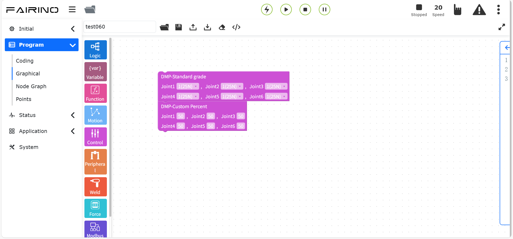

.. centered:: Abbildung 10.6-15 Kollisionsstufen-Anweisung Codeblock

Beschleunigungs-Anweisung
~~~~~~~~~~~~~~~~~~~~~~~~~~~~~~
Ziehen Sie den Codeblock "Beschleunigungs-Anweisung" in den Arbeitsbereich der grafischen Bearbeitungsoberfläche.

Der Befehl "Beschleunigung" ermöglicht die separate Einstellung der Roboterbeschleunigung. Durch Anpassen des Beschleunigungsskalierungsfaktors des Bewegungsbefehls kann die Beschleunigungs- und Verzögerungszeit erhöht oder verringert werden, wodurch die Taktzeit der Roboterbewegung einstellbar wird.

Knoten "Beschleunigung"-Anweisung, Parameter:

-   Beschleunigungsprozentsatz (%): 0 \~ 100.

.. image:: graphical/061.png
   :width: 6in
   :align: center

.. centered:: Abbildung 10.6-16 Beschleunigungs-Anweisung Codeblock

Grafische Programmierbefehle für Peripheriegeräte
--------------------------------------------------------------
Grafische Programmierbefehle für Peripheriegeräte enthalten Befehle für Greifer, Spritzpistolen, Erweiterungsachsen usw.

.. image:: graphical/008.png
   :width: 6in
   :align: center

.. centered:: Abbildung 10.7 Grafische Programmierbefehle für Peripheriegeräte

Greifer-Anweisungen
~~~~~~~~~~~~~~~~~~~~~
Ziehen Sie die Codeblöcke "Greiferbewegung", "Greifer aktivieren" und "Greifer zurücksetzen" in den Arbeitsbereich der grafischen Bearbeitungsoberfläche.

Im Befehl werden die vollständig konfigurierten und aktivierten Greifernummern angezeigt. Einstellungen für Greifer öffnen/schließen, Öffnungs-/Schließgeschwindigkeit und Öffnungs-/Schließmoment, Werte in Prozent. Option zur Blockierung: Bei Auswahl von "blockierend" muss die Greiferbewegung warten, bis der vorherige Bewegungsbefehl ausgeführt ist, bevor sie ausgeführt wird. Bei Auswahl von "nicht blockierend" läuft die Greiferbewegung parallel zum vorherigen Bewegungsbefehl.

1.  Knoten "Greiferbewegung", Parameter:

    -   Greifernummer: Aktivierte Greifernummer.
    -   Greiferposition: 0\~100.
    -   Öffnungs-/Schließgeschwindigkeit: 0\~100.
    -   Öffnungs-/Schließmoment: 0\~100.
    -   Maximale Zeit (ms): 0\~30000.
    -   Blockierung: false/true.

.. image:: graphical/062.png
   :width: 6in
   :align: center

.. centered:: Abbildung 10.7-1 Greiferbewegung Codeblock

Der Greifer-Rücksetzbefehl zeigt die bereits konfigurierten Greifernummern an. Der Greifer-Rücksetzbefehl kann zum Programm hinzugefügt werden.

2.  Knoten "Greifer zurücksetzen", Parameter:

    -   Greifernummer: Aktivierte Greifernummer.

.. centered:: Abbildung 10.7-2 Greifer zurücksetzen Codeblock

Der Greifer-Aktivierungsbefehl zeigt die bereits konfigurierten Greifernummern an. Der Greifer-Aktivierungsbefehl kann zum Programm hinzugefügt werden.

3.  Knoten "Greifer aktivieren", Parameter:

    -   Greifernummer: Aktivierte Greifernummer.

.. centered:: Abbildung 10.7-3 Greifer aktivieren Codeblock

Spritzpistolen-Anweisungen
~~~~~~~~~~~~~~~~~~~~~~~~~~~~~~~~~~~~~
Ziehen Sie den Codeblock "Spritzpistolen-Anweisung" in den Arbeitsbereich der grafischen Bearbeitungsoberfläche.

Diese Befehle sind sprühbezogene Befehle zur Steuerung der Spritzpistole: "Spritzen starten", "Spritzen stoppen", "Reinigen starten" und "Reinigen stoppen". Beim Bearbeiten der entsprechenden Knoten in diesem Programm muss sichergestellt sein, dass die Spritzpistole als Peripheriegerät korrekt konfiguriert ist, andernfalls kann nicht gespeichert werden. Siehe Kapitel Roboterperipherie.

.. image:: graphical/065.png
   :width: 6in
   :align: center

.. centered:: Abbildung 10.7-4 Spritzen starten Codeblock

.. image:: graphical/066.png
   :width: 6in
   :align: center

.. centered:: Abbildung 10.7-5 Spritzen stoppen Codeblock

.. image:: graphical/067.png
   :width: 6in
   :align: center

.. centered:: Abbildung 10.7-6 Reinigen starten Codeblock

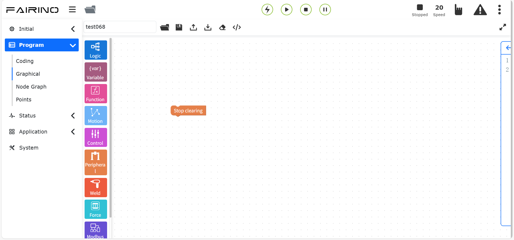

.. centered:: Abbildung 10.7-7 Reinigen stoppen Codeblock

Erweiterungsachsen-Anweisungen (Steuerung + SPS)
~~~~~~~~~~~~~~~~~~~~~~~~~~~~~~~~~~~~~~~~~~~~~~~~~~~
Ziehen Sie den Codeblock "Erweiterungsachsen-Anweisung" in den Arbeitsbereich der grafischen Bearbeitungsoberfläche.

Dieser Befehl ist für Szenarien mit externen Achsen gedacht. In Kombination mit einem PTP-Befehl kann die Bewegung eines Punktes im Raum in X-Richtung auf die Bewegung der externen Achse aufgeteilt werden. Wählen Sie die externe Achsnummer, wählen Sie "Synchron" als Bewegungsart und wählen Sie den zu erreichenden Punkt.

Unterteilt in UDP-Kommunikation laden/konfigurieren, asynchrone Bewegung, synchrone PTP/LIN-Bewegung, synchrone ARC-Bewegung, Referenzpunktfahrt-Befehl und Aktivierungsbefehl.

Knoten "UDP-Kommunikation konfigurieren", geben Sie IP-Adresse, Portnummer und Kommunikationszyklus ein.

.. image:: graphical/069.png
   :width: 6in
   :align: center

.. centered:: Abbildung 10.7-8 UDP-Kommunikation konfigurieren Codeblock

Knoten "Asynchrone Bewegung", Parameter:

-   Punktname: Teach-Punkt.
-   Geschwindigkeit (%): 0\~100.

.. image:: graphical/070.png
   :width: 6in
   :align: center

.. centered:: Abbildung 10.7-9 Asynchrone Bewegung Codeblock

Knoten "Synchrone PTP/LIN-Bewegung", Parameter:

-   Bewegungsauswahl: PTP/LIN.
-   Punktname: Teach-Punkt.
-   Geschwindigkeit (%): 0\~100.

.. image:: graphical/071.png
   :width: 6in
   :align: center

.. centered:: Abbildung 10.7-10 "Synchrone PTP/LIN-Bewegung" Codeblock

Knoten "Synchrone ARC-Bewegung", Standardbewegungsart ist ARC, Parameter:

Punktname: Teach-Punkt.

Geschwindigkeit (%): 0\~100.

.. image:: graphical/072.png
   :width: 6in
   :align: center

.. centered:: Abbildung 10.7-11 "Synchrone ARC-Bewegung" Codeblock

Knoten "Erweiterungsachse Referenzpunktfahrt", Parameter:

-   Erweiterungsachsnummer: 1\~4.
-   Referenzpunktfahrt-Modus: Aktuelle Position als Nullpunkt / Negative Endlage als Nullpunkt / Positive Endlage als Nullpunkt.
-   Suchgeschwindigkeit: 0\~2000, Standard 5.
-   Nullpunkt-Einrastgeschwindigkeit: 0\~2000, Standard 1.

.. image:: graphical/073.png
   :width: 6in
   :align: center

.. centered:: Abbildung 10.7-12 Erweiterungsachse Referenzpunktfahrt Codeblock

Knoten "Erweiterungsachse aktivieren", Parameter:

-   Erweiterungsachsnummer: 1\~4.

.. centered:: Abbildung 10.7-13 Erweiterungsachse aktivieren Codeblock

Erweiterungsachsen-Anweisungen (Steuerung + Servoantrieb)
~~~~~~~~~~~~~~~~~~~~~~~~~~~~~~~~~~~~~~~~~~~~~~~~~~~~~~~~~~~~
Ziehen Sie den Codeblock "Erweiterungsachsen-Anweisung" in den Arbeitsbereich der grafischen Bearbeitungsoberfläche.

Dieser Befehl dient zur Konfiguration der Parameter der Erweiterungsachse. Je nach Steuerungsmodus werden unterschiedliche Parameter gesetzt. Bei einer bereits konfigurierten Erweiterungsachse kann deren Nullpunkt eingestellt werden.

Unterteilt in Servo-ID, Steuerungsmodus, Servo aktivieren und Servo-Referenzpunktfahrt. Der Steuerungsmodus ist weiter unterteilt in Positionsmodus und Geschwindigkeitsmodus. Diese beiden Knoten müssen in Verbindung mit dem Steuerungsmodus verwendet werden, da sie alleine hinzugefügt keine Wirkung haben.

Knoten "Servo-ID", Parameter:

-   Servo-ID: 1\~15.

.. image:: graphical/075.png
   :width: 6in
   :align: center

.. centered:: Abbildung 10.7-14 Servo-ID Codeblock

Knoten "Steuerungsmodus", Parameter:

-   Servo-ID: 1\~15.
-   Steuerungsmodus: Positionsmodus / Geschwindigkeitsmodus.

.. image:: graphical/076.png
   :width: 6in
   :align: center

.. centered:: Abbildung 10.7-15 Steuerungsmodus Codeblock

Knoten "Servo aktivieren", Parameter:

-   Servo-ID: 1\~15.
-   Servo aktivieren: Aktivieren / Deaktivieren.

.. image:: graphical/077.png
   :width: 6in
   :align: center

.. centered:: Abbildung 10.7-16 Servo aktivieren Codeblock

Knoten "Servo-Referenzpunktfahrt", Parameter:

-   Servo-ID: 1\~15.
-   Referenzpunktfahrt-Modus: Aktuelle Position als Nullpunkt / Negative Endlage als Nullpunkt / Positive Endlage als Nullpunkt.
-   Suchgeschwindigkeit: 0\~2000, Standard 5.
-   Nullpunkt-Einrastgeschwindigkeit: 0\~2000, Standard 1.
-   Beschleunigungsprozentsatz: 1\~100, Standard 100.

.. image:: graphical/078.png
   :width: 6in
   :align: center

.. centered:: Abbildung 10.7-17 Servo-Referenzpunktfahrt Codeblock

Knoten "Positionsmodus", Parameter:

-   Servo-ID: 1\~15.
-   Zielposition: Unbegrenzt.
-   Suchgeschwindigkeit: Unbegrenzt.
-   Beschleunigungsprozentsatz: 1\~100, Standard 100.

.. image:: graphical/079.png
   :width: 6in
   :align: center

.. centered:: Abbildung 10.7-18 Positionsmodus Codeblock

Knoten "Geschwindigkeitsmodus", Parameter:

-   Servo-ID: 1\~15.
-   Zielgeschwindigkeit: Unbegrenzt.
-   Beschleunigungsprozentsatz: 1\~100, Standard 100.

.. image:: graphical/080.png
   :width: 6in
   :align: center

.. centered:: Abbildung 10.7-19 Geschwindigkeitsmodus Codeblock

Förderband-Anweisungen
~~~~~~~~~~~~~~~~~~~~~~~~~~~~~~
Diese Anweisungen umfassen vier Befehle: IO-Echtzeiterkennung, Positions-Echtzeiterkennung, Verfolgung starten und Verfolgung stoppen. Siehe Kapitel Roboterperipherie.

Knoten "IO-Echtzeiterkennung", Parameter:

-   Maximale Wartezeit: 0\~10000.

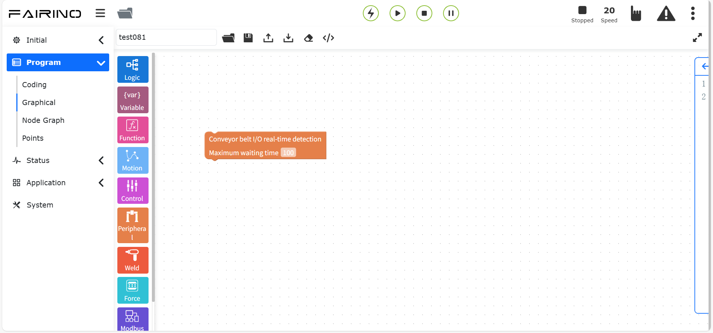

.. centered:: Abbildung 10.7-20 IO-Echtzeiterkennung Codeblock

Knoten "Positions-Echtzeiterkennung", Parameter:

-   Arbeitsmodus: Verfolgung greifen / Verfolgung bewegen / TPD-Verfolgung.

.. image:: graphical/082.png
   :width: 6in
   :align: center

.. centered:: Abbildung 10.7-21 Positions-Echtzeiterkennung Codeblock

Knoten "Verfolgung starten", "Verfolgung stoppen", Parameter:

Arbeitsmodus: Verfolgung greifen / Verfolgung bewegen / TPD-Verfolgung.

.. centered:: Abbildung 10.7-22 Verfolgung starten/stoppen Codeblock

Schleif-Anweisungen
~~~~~~~~~~~~~~~~~~~~~
Ziehen Sie den Codeblock "Schleif-Anweisung" in den Arbeitsbereich der grafischen Bearbeitungsoberfläche.

Dieser Befehl wird für Schleifszenarien verwendet. Vor der Verwendung muss zuerst der Treiber entladen und dann geladen werden, danach wird das Schleifgerät aktiviert.

Anschließend werden Drehzahl, Kontaktkraft, Ausfahrstrecke und Steuerungsmodus des Schleifgeräts eingestellt. Gleichzeitig können Fehler des Schleifgeräts gelöscht und der Kraftsensor des Geräts auf Null gesetzt werden.

.. image:: graphical/084.png
   :width: 6in
   :align: center

.. centered:: Abbildung 10.7-23 Kommunikationstreiber laden/entladen Codeblock

Knoten "Gerät aktivieren", Parameter:

-   Gerät aktivieren: Aktivieren / Deaktivieren.

.. image:: graphical/085.png
   :width: 6in
   :align: center

.. centered:: Abbildung 10.7-24 Gerät aktivieren Codeblock

.. image:: graphical/086.png
   :width: 6in
   :align: center

.. centered:: Abbildung 10.7-25 Gerätefehler löschen Codeblock

.. image:: graphical/087.png
   :width: 6in
   :align: center

.. centered:: Abbildung 10.7-26 Gerätekraftsensor nullen Codeblock

Knoten "Drehzahl", Parameter:

-   Drehzahl: 0\~5500.

.. image:: graphical/088.png
   :width: 6in
   :align: center

.. centered:: Abbildung 10.7-27 Gerätedrehzahl Codeblock

Knoten "Kraft einstellen", Parameter:

-   Kraft einstellen: 0\~200.

.. image:: graphical/089.png
   :width: 6in
   :align: center

.. centered:: Abbildung 10.7-28 Kraft einstellen Codeblock

Knoten "Ausfahrstrecke", Parameter:

-   Ausfahrstrecke: 0\~12.

.. image:: graphical/090.png
   :width: 6in
   :align: center

.. centered:: Abbildung 10.7-29 Ausfahrstrecke Codeblock

Knoten "Schleifkontaktkraft", Parameter:

-   Kontaktkraft: 0\~10000.

.. image:: graphical/091.png
   :width: 6in
   :align: center

.. centered:: Abbildung 10.7-30 Schleifkontaktkraft Codeblock

Knoten "Übergangszeit Krafteinstellung", Parameter:

-   Übergangszeit Krafteinstellung: 0\~10000.

.. image:: graphical/092.png
   :width: 6in
   :align: center

.. centered:: Abbildung 10.7-31 Übergangszeit Krafteinstellung Codeblock

Knoten "Werkstückgewicht", Parameter:

-   Werkstückgewicht: 0\~10000.

.. image:: graphical/093.png
   :width: 6in
   :align: center

.. centered:: Abbildung 10.7-32 Werkstückgewicht Codeblock

Knoten "Steuerungsmodus", Parameter:

-   Steuerungsmodus: Referenzpunktfahrt-Modus / Positionsmodus / Drehmomentmodus.

.. image:: graphical/094.png
   :width: 6in
   :align: center

.. centered:: Abbildung 10.7-33 Steuerungsmodus Codeblock

Grafische Programmierbefehle für Schweißen
------------------------------------------------------
Grafische Programmierbefehle für Schweißen enthalten Schweißbefehle wie Positionssuche, Intervallschweißen, Schweißen, Laser-Tracking usw.

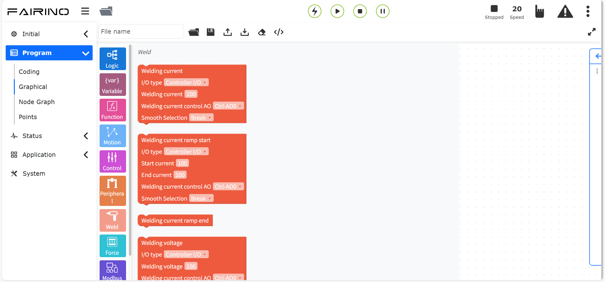

.. centered:: Abbildung 10.8 Grafische Programmierbefehle für Schweißen

Intervallschweiß-Anweisung
~~~~~~~~~~~~~~~~~~~~~~~~~~~~~~~~~~~~~~~
Ziehen Sie den Codeblock "Intervallschweiß-Anweisung" in den Arbeitsbereich der grafischen Bearbeitungsoberfläche.

Dieser Befehl ist ein spezieller Schweißbefehl, der hauptsächlich für zyklisches Intervallschweißen mit abwechselndem Schweißen und Nicht-Schweißen verwendet wird. Verwenden Sie diesen Befehl zwischen Start- und Endpunkt, wählen Sie den Intervallschweißmodus, wählen Sie Start- und Endpunkt, stellen Sie die Geschwindigkeit ein, wählen Sie den DO-Port für die Lichtbogenzündung, die Ausführungslänge, die Nicht-Ausführungslänge, stellen Sie den Funktionsmodus je nach tatsächlichem Anwendungsszenario ein, wählen Sie die Pendeloption und die Rundungsregel, um die Intervallschweißfunktion zu realisieren. Detaillierte Bedienung siehe Intervallschweißbefehl auf der Programm-Teach-Seite.

1.  Knoten "Lichtbogen beenden/zünden", Parameter:

    -   I/O-Typ: Steuerungs-IO / Erweiterungs-IO.
    -   Schweißprozessnummer: 0 \~ 7.
    -   Maximale Wartezeit (ms): 0 \~ 10000.

.. image:: graphical/095.png
   :width: 6in
   :align: center

.. centered:: Abbildung 10.8-1 "Lichtbogen beenden/zünden" Codeblock

2.  Knoten "Intervallschweißen", Parameter:

    -   Intervallschweißmodus: Ausrichtung beibehalten / Ausrichtung ändern.
    -   Startpunkt: Teach-Punkt.
    -   Endpunkt: Teach-Punkt.
    -   Geschwindigkeit (%): 0\~100, Standard 100.
    -   Ausführungslänge: 0\~1000.
    -   Nicht-Ausführungslänge: 0\~1000.
    -   Funktionsmodus: 0\~100, Standard 100.
    -   Pendelauswahl: Im Ausführungsabschnitt nicht pendeln / Im Ausführungsabschnitt pendeln.
    -   Rundungsregel: Nicht runden / Zyklisch runden / Einzelsegment runden.

.. image:: graphical/096.png
   :width: 6in
   :align: center

.. centered:: Abbildung 10.8-2 Intervallschweißen Codeblock

Schweiß-Anweisungen
~~~~~~~~~~~~~~~~~~~~~
Ziehen Sie den Codeblock "Schweiß-Anweisung" in den Arbeitsbereich der grafischen Bearbeitungsoberfläche.

Dieser Befehl wird hauptsächlich für die Schweißgeräteperipherie verwendet. Bevor Sie diesen Befehl hinzufügen, stellen Sie bitte sicher, dass die Konfiguration des Schweißgeräts in der Benutzerperipherie abgeschlossen ist. Siehe Kapitel Roboterperipherie.

1.  Knoten "Schweißspannung", Parameter:

    -   I/O-Typ: Steuerungs-IO / Erweiterungs-IO.
    -   Schweißgerätspannung: Mindestwert 0.
    -   Schweißstromsteuerung AO: Ctrl-AO0/Ctrl-AO1.
    -   Glättungsauswahl: Break/Serious.

.. image:: graphical/097.png
   :width: 6in
   :align: center

.. centered:: Abbildung 10.8-3 Schweißgerätspannung Codeblock

2.  Knoten "Schweißgerätestrom", Parameter:

    -   I/O-Typ: Steuerungs-IO / Erweiterungs-IO.
    -   Schweißgerätestrom: Mindestwert 0.
    -   Schweißstromsteuerung AO: Ctrl-AO0/Ctrl-AO1.
    -   Glättungsauswahl: Break/Serious.

.. image:: graphical/098.png
   :width: 6in
   :align: center

.. centered:: Abbildung 10.8-4 Schweißgerätestrom Codeblock

3.  Knoten "Gas zuführen/abschalten", Parameter:

    -   I/O-Typ: Steuerungs-IO / Erweiterungs-IO.

.. image:: graphical/099.png
   :width: 6in
   :align: center

.. centered:: Abbildung 10.8-5 "Gas zuführen/abschalten" Codeblock

4.  Knoten "Drahtvorschub vorwärts / Drahtvorschub vorwärts stoppen", Parameter:

    -   I/O-Typ: Steuerungs-IO / Erweiterungs-IO.

.. image:: graphical/100.png
   :width: 6in
   :align: center

.. centered:: Abbildung 10.8-6 "Drahtvorschub vorwärts / Drahtvorschub vorwärts stoppen" Codeblock

5.  Knoten "Drahtvorschub rückwärts / Drahtvorschub rückwärts stoppen", Parameter:

    -   I/O-Typ: Steuerungs-IO / Erweiterungs-IO.

.. image:: graphical/101.png
   :width: 6in
   :align: center

.. centered:: Abbildung 10.8-7 "Drahtvorschub rückwärts / Drahtvorschub rückwärts stoppen" Codeblock

Laser-Tracking-Anweisungen
~~~~~~~~~~~~~~~~~~~~~~~~~~~~~~~~~~~~~~~
Ziehen Sie den Codeblock "Laser-Tracking-Anweisung" in den Arbeitsbereich der grafischen Bearbeitungsoberfläche.

Dieser Befehl besteht aus drei Teilen: Laserbefehl, Tracking-Befehl und Positionssuchbefehl. Bevor Sie diesen Befehl hinzufügen, stellen Sie bitte sicher, dass der Laser-Tracking-Sensor in der Benutzerperipherie erfolgreich konfiguriert wurde. Siehe Kapitel Roboterperipherie.

1.  Knoten "Sensor öffnen/schließen", Parameter:

    -   Schweißnahttyp auswählen: 0 \~ 49.

.. image:: graphical/102.png
   :width: 6in
   :align: center

.. centered:: Abbildung 10.8-8 "Sensor öffnen/schließen - Schweißnahttyp" Codeblock

-   Aufgabenummer auswählen: 0 \~ 255.

.. image:: graphical/103.png
   :width: 6in
   :align: center

.. centered:: Abbildung 10.8-9 "Sensor öffnen/schließen - Aufgabenummer" Codeblock

-   Lösung: 0 \~ 5.

.. image:: graphical/104.png
   :width: 6in
   :align: center

.. centered:: Abbildung 10.8-10 "Sensor öffnen/schließen - Lösung" Codeblock

2.  Knoten "Sensor laden/entladen", Parameter:

    -   Funktionsauswahl: Ruiniu RRT-SV2-BP / Chuangxiang CXZK-RBTA4L.

.. image:: graphical/105.png
   :width: 6in
   :align: center

.. centered:: Abbildung 10.8-11 "Sensor laden/entladen" Codeblock

3.  Knoten "Laser-Tracking starten/stoppen", Parameter

    -   Koordinatensystemname: Benutzerdefiniert konfiguriertes Koordinatensystem.

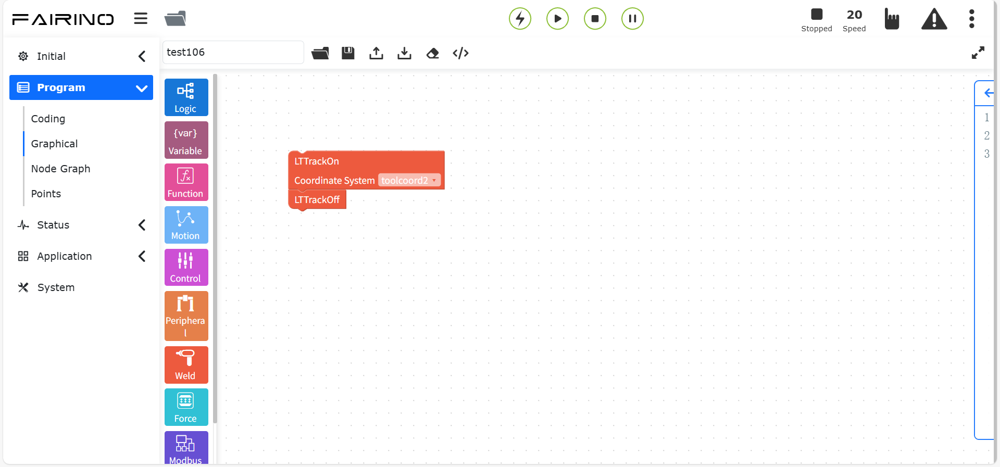

.. centered:: Abbildung 10.8-12 "Laser-Tracking starten/stoppen" Codeblock

4.  Knoten "Lasersensor aufzeichnen", Parameter:

    -   Funktionsauswahl: Aufzeichnung stoppen / Echtzeit-Tracking / Aufzeichnung starten / Bahn reproduzieren.
    -   Funktionsauswahl: Verzögerungszeit / Verzögerungsstrecke.
    -   Zeit: 0 \~ 10000.
    -   Erweiterungsachsnummer: 1 \~ 4.
    -   Strecke: 0 \~ 10000.
    -   Kompensationsempfindlichkeitskoeffizient: 0 \~ 1.
    -   Geschwindigkeit: 0 \~ 100.

.. image:: graphical/107.png
   :width: 6in
   :align: center

.. centered:: Abbildung 10.8-13 "Lasersensor aufzeichnen" Codeblock

5.  Knoten "Sensorpunktanfahrt", Parameter:

    -   Koordinatensystemname: Benutzerdefiniert konfiguriertes Koordinatensystem.
    -   Bewegungsart: PTP/Lin.
    -   Geschwindigkeit (%): 0 \~ 100.
    -   Ausrichtungsreferenzpunkt: Teach-Punkt.

.. image:: graphical/108.png
   :width: 6in
   :align: center

.. centered:: Abbildung 10.8-14 "Sensorpunktanfahrt" Codeblock

6.  Knoten "Laser-Tracking reproduzieren", Parameter:

.. image:: graphical/109.png
   :width: 6in
   :align: center

.. centered:: Abbildung 10.8-15 "Laser-Tracking reproduzieren" Codeblock

7.  Knoten "Positionssuche starten/beenden", Parameter:

    -   Koordinatensystemname: Benutzerdefiniert konfiguriertes Koordinatensystem.
    -   Richtung: -x / -y / -z / Bestimmte Richtung.
    -   Richtungspunkt: Wenn nicht "Bestimmte Richtung" ausgewählt, ist der Parameter ungültig.
    -   Geschwindigkeit (%): 0 \~ 100.
    -   Länge (mm): 0 \~ 1000.
    -   Maximale Suchzeit (ms): 0 \~ 10000.

.. image:: graphical/110.png
   :width: 6in
   :align: center

.. centered:: Abbildung 10.8-16 "Positionssuche starten/beenden" Codeblock

Laseraufzeichnungs-Anweisungen
~~~~~~~~~~~~~~~~~~~~~~~~~~~~~~~~~~~~~~~
Ziehen Sie den Codeblock "Laseraufzeichnungs-Anweisung" in den Arbeitsbereich der grafischen Bearbeitungsoberfläche.

Dieser Befehl realisiert die Funktion zum Abrufen des aufgezeichneten Start- und Endpunkts des Laser-Trackings, sodass der Roboter automatisch zur Startposition fahren kann. Dies eignet sich für Szenarien, in denen die Bewegung außerhalb des Werkstücks beginnt und eine Laser-Tracking-Aufzeichnung durchgeführt wird. Gleichzeitig kann der Host-Computer die Informationen über Start- und Endpunkt der aufgezeichneten Daten abrufen, die für nachfolgende Bewegungen verwendet werden.

Realisiert die Funktion einer einstellbaren Geschwindigkeit bei der Laser-Tracking-Reproduktion, sodass der Roboter mit einer sehr hohen Geschwindigkeit aufzeichnen und dann mit normaler Schweißgeschwindigkeit reproduzieren kann, was die Arbeitseffizienz verbessert.

1.  Knoten "Lasersensor aufzeichnen", Parameter:

    -   Funktionsauswahl: Aufzeichnung stoppen / Echtzeit-Tracking / Aufzeichnung starten / Bahn reproduzieren.
    -   Funktionsauswahl: Verzögerungszeit / Verzögerungsstrecke.
    -   Zeit: 0 \~ 10000.
    -   Erweiterungsachsnummer: 1 \~ 4.
    -   Strecke: 0 \~ 10000.
    -   Kompensationsempfindlichkeitskoeffizient: 0 \~ 1.
    -   Geschwindigkeit: 0 \~ 100.

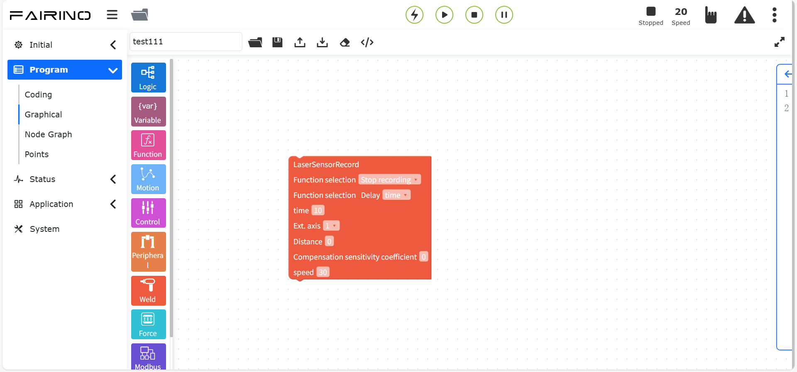

.. centered:: Abbildung 10.8-17 Schweißnahtdaten aufzeichnen Codeblock

2.  Knoten "Schweißnaht-Start-/Endpunkt abrufen", Parameter:

    -   Bewegungsart: PTP/LIN.
    -   Geschwindigkeit (%): 0\~100, Standard 30.

.. image:: graphical/112.png
   :width: 6in
   :align: center

.. centered:: Abbildung 10.8-18 "Schweißnaht-Start-/Endpunkt abrufen" Codeblock

Schweißdraht-Positionssuch-Anweisungen
~~~~~~~~~~~~~~~~~~~~~~~~~~~~~~~~~~~~~~~~~~~~~~~~
Ziehen Sie den Codeblock "Schweißdraht-Positionssuch-Anweisung" in den Arbeitsbereich der grafischen Bearbeitungsoberfläche.

Dieser Befehl wird im Allgemeinen in Schweißszenarien verwendet und erfordert die Kombination von Schweißgerät mit Roboter-IO und Bewegungsbefehlen. Unterteilt in Positionssuche starten, Positionssuche beenden, Suchpunkt einstellen, Versatz berechnen und Kontaktpunktdaten schreiben.

Knoten "Schweißdraht-Positionssuche starten/beenden", Parameter:

-   Referenzposition: Nicht aktualisieren / Aktualisieren.
-   Suchgeschwindigkeit: 0\~100.
-   Suchstrecke: 0\~1000.
-   Automatischer Rückkehrmodus: Nicht automatisch zurückkehren / Automatisch zurückkehren.
-   Automatische Rückkehrgeschwindigkeit: 0\~100.
-   Automatische Rückkehrstrecke: 0\~1000.
-   Suchmodus: Teach-Punkt-Suche / Suche mit Versatz.

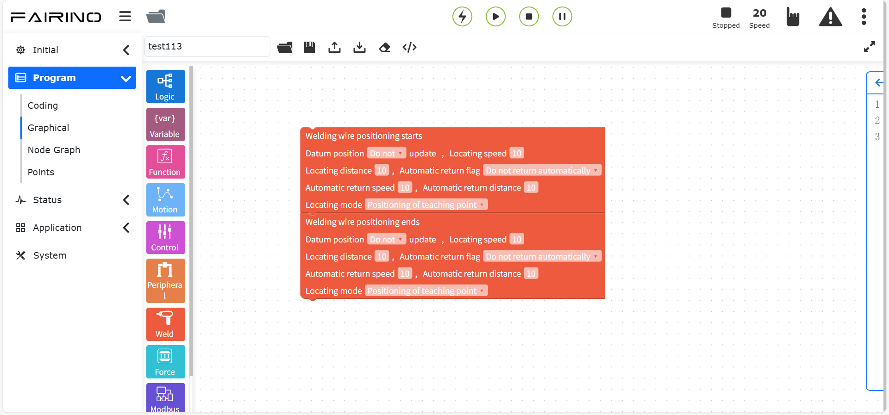

.. centered:: Abbildung 10.8-19 "Schweißdraht-Positionssuche starten/beenden" Codeblock

Die Einstellung der Suchpunkte erfolgt je nach Schweißnahttyp und Berechnungsmethode durch Hinzufügen von Punkten.

-   Bei Typ Kehlnaht und Berechnungsmethode 1D (eines von xyz) werden Punkte aus Punkt a, Punkt b ausgewählt.
-   Bei Typ Kehlnaht und Berechnungsmethode 2D (zwei von xyz) werden Punkte aus Punkt a, Punkt b, Punkt e, Punkt f ausgewählt.
-   Bei Typ Kehlnaht und Berechnungsmethode 3D (xyz) werden Punkte aus Punkt a, Punkt b, Punkt c, Punkt d, Punkt e, Punkt f ausgewählt.
-   Bei Typ Kehlnaht und Berechnungsmethode 2D- (zwei von xyz, eines von rxryrz) werden Punkte aus Punkt a, Punkt b, Punkt c, Punkt d, Punkt e, Punkt f ausgewählt.
-   Bei Typ Innen-/Außendurchmesser und Berechnungsmethode 2D2D (zwei von xyz) werden Punkte aus Punkt a, Punkt b ausgewählt.
-   Bei Typ Punkt und Berechnungsmethode 3D (xyz) werden Punkte aus Punkt a, Punkt b, Punkt c, Punkt d, Punkt e, Punkt f ausgewählt.
-   Bei Typ Kamera und Berechnungsmethode 3D- (xyzrxryrz) werden Punkte aus Punkt a, Punkt b ausgewählt.
-   Bei Typ Fläche und Berechnungsmethode 3D- (xyzrxryrz) werden Punkte aus Punkt a, Punkt b ausgewählt.

.. image:: graphical/114.png
   :width: 6in
   :align: center

.. centered:: Abbildung 10.8-20 "Suchpunkteinstellungsleitfaden" Codeblock

Versatz berechnen: Legen Sie Referenzpunkte und Kontaktpunkte je nach Schweißnahttyp und Berechnungsmethode fest.

-   Bei Typ Kehlnaht und Berechnungsmethode 1D (eines von xyz) werden Referenzpunkt 1, Kontaktpunkt 1 gesetzt.
-   Bei Typ Kehlnaht und Berechnungsmethode 2D (zwei von xyz) werden Referenzpunkt 1, Referenzpunkt 2, Kontaktpunkt 1, Kontaktpunkt 2 gesetzt.
-   Bei Typ Kehlnaht und Berechnungsmethode 3D (xyz) werden Referenzpunkt 1, Referenzpunkt 2, Referenzpunkt 3, Kontaktpunkt 1, Kontaktpunkt 2, Kontaktpunkt 3 gesetzt.
-   Bei Typ Kehlnaht und Berechnungsmethode 2D- (zwei von xyz, eines von rxryrz) werden Referenzpunkt 1, Referenzpunkt 2, Referenzpunkt 3, Kontaktpunkt 1, Kontaktpunkt 2, Kontaktpunkt 3 gesetzt.
-   Bei Typ Innen-/Außendurchmesser und Berechnungsmethode 2D2D (zwei von xyz) werden Referenzpunkt 1, Referenzpunkt 2, Referenzpunkt 3, Kontaktpunkt 1, Kontaktpunkt 2, Kontaktpunkt 3 gesetzt.
-   Bei Typ Punkt und Berechnungsmethode 3D (xyz) werden Kontaktpunkt 1, Kontaktpunkt 2 gesetzt.
-   Bei Typ Kamera und Berechnungsmethode 3D- (xyzrxryrz) werden Kontaktpunkt 1, Kontaktpunkt 2 gesetzt.
-   Bei Typ Fläche und Berechnungsmethode 3D- (xyzrxryrz) werden Kontaktpunkt 1, Kontaktpunkt 2, Kontaktpunkt 3, Kontaktpunkt 4, Kontaktpunkt 5, Kontaktpunkt 6 gesetzt.

.. image:: graphical/115.png
   :width: 6in
   :align: center

.. centered:: Abbildung 10.8-21 "Versatz berechnen" Codeblock

Knoten "Kontaktpunktdaten schreiben", Parameter:

-   Kontaktpunktname: RES0\~99.
-   Kontaktpunktname: Datenformat ist {0,0,0,0,0,0}.

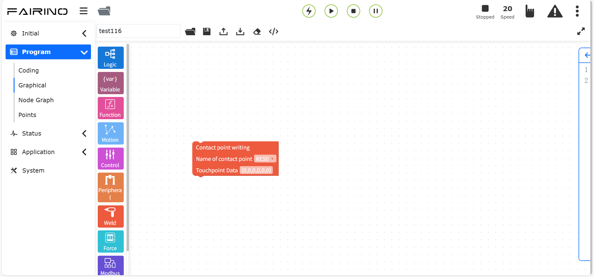

.. centered:: Abbildung 10.8-22 "Kontaktpunktdaten schreiben" Codeblock

Lichtbogen-Tracking-Anweisungen
~~~~~~~~~~~~~~~~~~~~~~~~~~~~~~~~~~~~~~~~~~~~~~~~
Ziehen Sie den Codeblock "Lichtbogen-Tracking-Anweisung" in den Arbeitsbereich der grafischen Bearbeitungsoberfläche.

Dieser Befehl ermöglicht die Schweißnahtverfolgung des Roboters unter Verwendung der Nahtabweichungserkennung zur Bahnkorrektur. Es kann ein Lichtbogensensor zur Erkennung der Schweißnahtabweichung verwendet werden.

Knoten "Lichtbogen-Tracking öffnen/schließen", Parameter:

-   Lichtbogen-Tracking Verzögerungszeit (ms): Referenzwert 50.
-   Abweichungskompensation: Aus / Ein.
-   Einstellkoeffizient: 0 \~ 300.
-   Kompensationszeit (cyc): 0 \~ 300.
-   Maximale Kompensation pro Mal (mm): 0 \~ 300.
-   Maximale Gesamtkompensation (mm): 0 \~ 300.
-   Auswahl Koordinatensystem oben/unten: Pendeln.
-   Einstellmodus Referenzstrom oben/unten: Rückmeldung / Konstante.
-   Referenzstrom oben/unten (A): 0 \~ 300.

.. image:: graphical/117.png
   :width: 6in
   :align: center

.. centered:: Abbildung 10.8-23 Lichtbogen-Tracking Codeblock

Ausrichtungsanpassungs-Anweisungen
~~~~~~~~~~~~~~~~~~~~~~~~~~~~~~~~~~~~~~~
Ziehen Sie den Codeblock "Ausrichtungsanpassungs-Anweisung" in den Arbeitsbereich der grafischen Bearbeitungsoberfläche.

Dieser Befehl ist für Szenarien der adaptiven Anpassung der Schweißbrennerausrichtung beim Schweiß-Tracking gedacht. Zuerst müssen die drei Punkte PosA, PosB und PosC angeteacht werden, andernfalls kann der Knoten nicht hinzugefügt werden.

Nachdem die drei entsprechenden Ausrichtungspunkte aufgezeichnet wurden, fügen Sie den Befehl zur adaptiven Ausrichtungsanpassung basierend auf der tatsächlichen Bewegungsrichtung des Roboters hinzu. Siehe Kapitel Roboterperipherie.

Knoten "Ausrichtungsanpassung öffnen", Parameter:

-   Blechtyp: Wellblech / Trapezblech / Zaunblech / Wellpappenstahl.
-   Bewegungsrichtung: Von links nach rechts / Von rechts nach links.
-   Ausrichtungsanpassungszeit (ms): 0 \~ 1000.
-   Erste Segmentlänge (mm):
-   Knickpunkttyp: Von oben nach unten / Von unten nach oben.
-   Zweite Segmentlänge (mm):
-   Dritte Segmentlänge (mm):
-   Vierte Segmentlänge (mm):
-   Fünfte Segmentlänge (mm):

.. image:: graphical/118.png
   :width: 6in
   :align: center

.. centered:: Abbildung 10.8-24 Ausrichtungsanpassung Codeblock

Grafische Programmierbefehle für Kraftsteuerung
-----------------------------------------------------------------
Grafische Programmierbefehle für Kraftsteuerung enthalten Kraftsteuerungsbefehle wie Kraftsteuerungsset, Drehmomentaufzeichnung usw.

.. image:: graphical/010.png
   :width: 6in
   :align: center

.. centered:: Abbildung 10.9 Grafische Programmierbefehle für Kraftsteuerung

Kraftsteuerungs-Anweisungen
~~~~~~~~~~~~~~~~~~~~~~~~~~~~~~~~~~~~~~~~~
Ziehen Sie den Codeblock "Kraftsteuerungs-Anweisung" in den Arbeitsbereich der grafischen Bearbeitungsoberfläche.

Dieser Befehl enthält acht Befehle: FT_Guard (Kollisionserkennung), FT_Control (Konstantkraftregelung), FT_Compliance (Nachgiebigkeitsregelung), FT_Spiral (Spiraleinfügung), FT_Rot (Rotationseinfügung), FT_Lin (Lineareinfügung), FT_FindSurface (Oberflächenlokalisierung), FT_CalCenter (Zentrumslokalisierung). Siehe Kapitel Roboterperipherie.

1.  Knoten "Kollisionserkennung öffnen/schließen", Parameter:

    -   Koordinatensystemname: Benutzerdefiniert konfiguriertes Koordinatensystem.
    -   Fx-Tx Wahrheitswert: true/false.
    -   Fx-Tx Aktueller Wert: Eingabe je nach tatsächlicher Situation.
    -   Fx-Tx Maximalschwelle: Eingabe je nach tatsächlicher Situation.
    -   Fx-Tx Minimalschwelle: Eingabe je nach tatsächlicher Situation.

.. image:: graphical/119.png
   :width: 6in
   :align: center

.. centered:: Abbildung 10.9-1 Kollisionserkennung öffnen/schließen Codeblock

2.  Knoten "Regelung öffnen/schließen", Parameter:

    -   Koordinatensystemname: Benutzerdefiniert konfiguriertes Koordinatensystem.
    -   Fx-Tx Wahrheitswert: true/false.
    -   Fx-Tx Aktueller Wert: Je nach tatsächlicher Situation anpassen.
    -   F_P_gain - F_D_gain: Je nach tatsächlicher Situation anpassen, darf nicht 0 sein.
    -   Adaptiver Start/Stopp-Status: Stopp / Start.
    -   ILC-Regelung Start/Stopp-Status: Stopp / Training / Praxis.
    -   Maximale Anpassungsstrecke (mm): 0 \~ 1000.
    -   Maximaler Anpassungswinkel (°): 0 \~ 1000.

.. image:: graphical/120.png
   :width: 6in
   :align: center

.. centered:: Abbildung 10.9-2 Regelung öffnen/schließen Codeblock

3.  Knoten "Nachgiebigkeitsregelung öffnen/schließen", Parameter:

    -   Übermittlungspositions-Einstellkoeffizient: 0 \~ 1.
    -   Nachgiebigkeit öffnen Kraftschwelle (N): 0 \~ 100.

.. image:: graphical/121.png
   :width: 6in
   :align: center

.. centered:: Abbildung 10.9-3 Nachgiebigkeitsregelung öffnen/schließen Codeblock

4.  Knoten "Spiraleinfügung", Parameter:

    -   Koordinatensystemname: Werkzeugkoordinatensystem / Basiskoordinatensystem.
    -   Radiusvorschub pro Windung (mm): 0 \~ 100, Referenzwert: 0,7.
    -   Kraft- oder Drehmomentschwelle (N/Nm): 0 \~ 100, Referenzwert: 50.
    -   Maximale Suchzeit (ms): 0 \~ 60000, Referenzwert: 60000.
    -   Maximale Lineargeschwindigkeit (mm/s): 0 \~ 100, Referenzwert: 5.

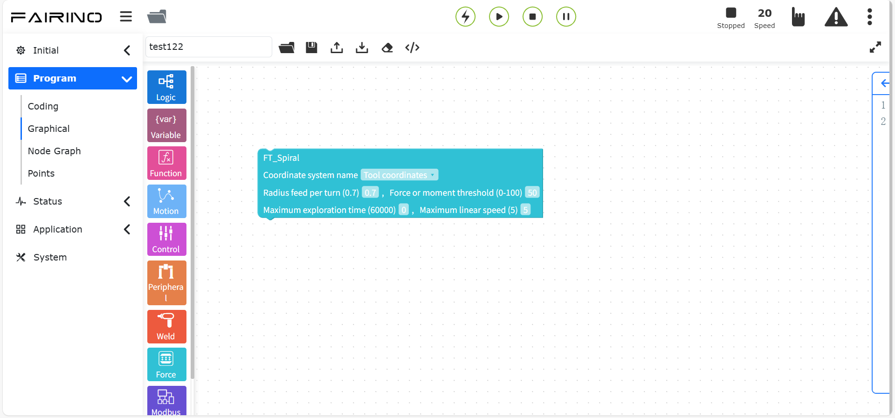

.. centered:: Abbildung 10.9-4 Spiraleinfügung Codeblock

5.  Knoten "Rotationseinfügung", Parameter:

    -   Koordinatensystemname: Werkzeugkoordinatensystem / Basiskoordinatensystem.
    -   Rotationswinkelgeschwindigkeit (°/s): 0 \~ 100, Referenzwert: 0,7.
    -   Auslösekraft oder Enddrehmoment (N/Nm): 0 \~ 100, Referenzwert: 50.
    -   Maximaler Rotationswinkel (°): 0 \~ 100, Referenzwert: 5.
    -   Kraftrichtung: Richtung z / Richtung mz.
    -   Maximale Rotationswinkelbeschleunigung (°/s²): 0 \~ 100.
    -   Einfügerichtung: Positiv / Negativ.

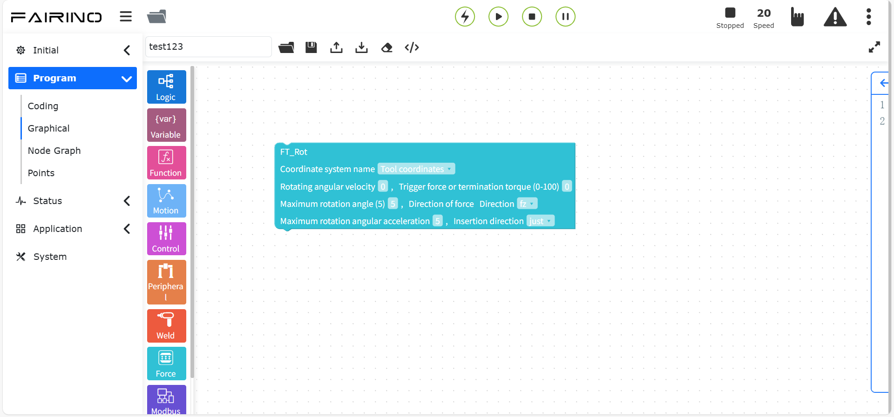

.. centered:: Abbildung 10.9-5 Rotationseinfügung Codeblock

6.  Knoten "Lineareinfügung", Parameter:

    -   Koordinatensystemname: Werkzeugkoordinatensystem / Basiskoordinatensystem.
    -   Aktionsendekraftschwelle (N): 0 \~ 100.
    -   Lineargeschwindigkeit (mm/s): 0 \~ 100, Referenzwert: 1.
    -   Linear Beschleunigung (°/s²): 0 \~ 100.
    -   Maximale Einfügestrecke (mm): 0 \~ 100.
    -   Einfügerichtung: Positiv / Negativ.

.. image:: graphical/124.png
   :width: 6in
   :align: center

.. centered:: Abbildung 10.9-6 Lineareinfügung Codeblock

7.  Knoten "Oberflächenlokalisierung", Parameter:

    -   Koordinatensystemname: Werkzeugkoordinatensystem / Basiskoordinatensystem.
    -   Bewegungsrichtung: Positiv / Negativ.
    -   Bewegungsachse: X/Y/Z.
    -   Suchlineargeschwindigkeit (mm/s): 0 \~ 100.
    -   Suchbeschleunigung (mm/s²): 0 \~ 100.
    -   Maximale Suchstrecke (mm): 0 \~ 100.
    -   Aktionsendekraftschwelle (N): 0 \~ 100.

.. image:: graphical/125.png
   :width: 6in
   :align: center

.. centered:: Abbildung 10.9-7 Oberflächenlokalisierung Codeblock

8.  Knoten "Mittelebene Berechnung starten/beenden".

.. image:: graphical/126.png
   :width: 6in
   :align: center

.. centered:: Abbildung 10.9-8 Mittelebene Berechnung starten/beenden Codeblock

Drehmomentaufzeichnungs-Anweisungen
~~~~~~~~~~~~~~~~~~~~~~~~~~~~~~~~~~~~~~~~~~~~~~~~~~~~~~
Ziehen Sie den Codeblock "Drehmomentaufzeichnungs-Anweisung" in den Arbeitsbereich der grafischen Bearbeitungsoberfläche.

Dieser Befehl ist ein Drehmomentaufzeichnungsbefehl und enthält drei Befehle: "Drehmomentaufzeichnung starten / "Drehmomentaufzeichnung stoppen" und "Drehmomentaufzeichnung zurücksetzen".

Ermöglicht die Echtzeit-Drehmomenterfassung zur Kollisionserkennung.

Klicken Sie auf die Schaltfläche "Drehmomentaufzeichnung starten", um kontinuierlich Kollisionen während der Ausführung von Bewegungsbefehlen aufzuzeichnen. Das aufgezeichnete Echtzeit-Drehmoment dient als theoretischer Wert für die Kollisionserkennung, um die Wahrscheinlichkeit von Fehlalarmen zu verringern.

Wenn der eingestellte Schwellwertbereich überschritten wird, wird die Dauer der Kollisionserkennung aufgezeichnet.

Klicken Sie auf die Schaltfläche "Drehmomentaufzeichnung stoppen", um die Aufzeichnung zu beenden. Klicken Sie auf "Drehmomentaufzeichnung zurücksetzen", um den Status auf den Standardzustand zurückzusetzen.

1.  Knoten "Drehmomentaufzeichnung starten", Parameter:

    -   Glättungsauswahl: Nicht glätten (Rohdaten) / Glätten (geglättete Daten).
    -   Gelenk negativer Schwellwert (Nm): -100 \~ 0.
    -   Gelenk positiver Schwellwert (Nm): 0 \~ 100.
    -   Gelenk Kollisionserkennungsdauer (ms): 0 \~ 1000.

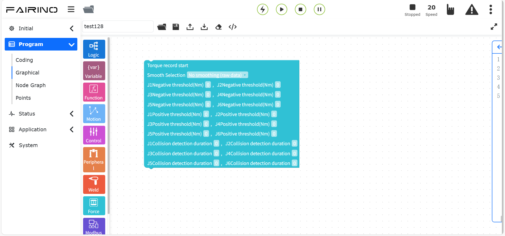

.. centered:: Abbildung 10.9-9 Drehmomentaufzeichnung starten Codeblock

2.  Knoten "Drehmomentaufzeichnung beenden"

.. image:: graphical/129.png
   :width: 6in
   :align: center

.. centered:: Abbildung 10.9-10 Drehmomentaufzeichnung beenden Codeblock

3.  Knoten "Drehmomentaufzeichnung zurücksetzen"

.. image:: graphical/130.png
   :width: 6in
   :align: center

.. centered:: Abbildung 10.9-11 Drehmomentaufzeichnung zurücksetzen Codeblock

Grafische Programmierbefehle für Kommunikation
-----------------------------------------------------------
Grafische Programmierbefehle für Kommunikation enthalten Kommunikationsbefehle wie Modbus-Master-Einstellung (Client), Modbus-Slave-Einstellung, Register lesen usw.

.. image:: graphical/011.png
   :width: 6in
   :align: center

.. centered:: Abbildung 10.10 Grafische Programmierbefehle für Kommunikation

Modbus-Anweisungen
~~~~~~~~~~~~~~~~~~~~~
Ziehen Sie den Codeblock "Modbus-Anweisung" in den Arbeitsbereich der grafischen Bearbeitungsoberfläche.

Dieser Befehl realisiert eine Busfunktionalität basierend auf dem ModbusTCP-Protokoll. Benutzer können über entsprechende Befehle die Kommunikation des Roboters mit einem ModbusTCP-Client oder -Server (Master-Slave-Kommunikation) steuern und Lese-/Schreiboperationen auf Spulen, Diskret-Eingängen und Registern durchführen. Für weitere Funktionen von ModbusTCP kontaktieren Sie uns bitte.

Bevor Sie die Modbus-Knotenfunktion verwenden, müssen Sie zuerst im Teach-Programm unter ModbusTCP-Konfiguration den Master, den Slave sowie die Namen für DI, DO, AI, AO konfigurieren.

1.  Master Digitalausgang einstellen, Parameter:

    -   Modbus-Master-Name: Je nach tatsächlicher Situation konfigurieren.
    -   DO-Name: Je nach tatsächlicher Situation konfigurieren.
    -   Registeranzahl: Ganzzahl 0 \~ 128.
    -   Registerwert: Abhängig von der Registeranzahl, es können mehrere Werte eingegeben werden. Z.B. Anzahl 3, Wert 1,0,1.

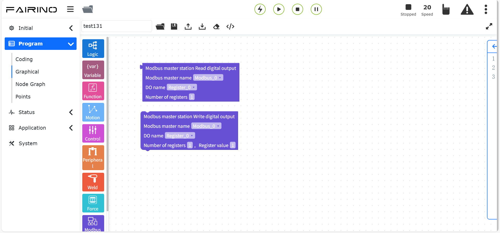

.. centered:: Abbildung 10.10-1 Master "Digitalausgang lesen/schreiben" Codeblock

2.  Master Digitaleingang einstellen, Parameter:

    -   Modbus-Master-Name: Je nach tatsächlicher Situation konfigurieren.
    -   DI-Name: Je nach tatsächlicher Situation konfigurieren.
    -   Registeranzahl: Ganzzahl 0 \~ 128.

.. image:: graphical/132.png
   :width: 6in
   :align: center

.. centered:: Abbildung 10.10-2 Master "Digital eingang lesen" Codeblock

3.  Master Analogausgang einstellen, Parameter:

    -   Modbus-Master-Name: Je nach tatsächlicher Situation konfigurieren.
    -   AO-Name: Je nach tatsächlicher Situation konfigurieren.
    -   Registeranzahl: Ganzzahl 0 \~ 128.
    -   Registerwert: Abhängig von der Registeranzahl, es können mehrere Werte eingegeben werden. Z.B. Anzahl 3, Wert 1,0,1.

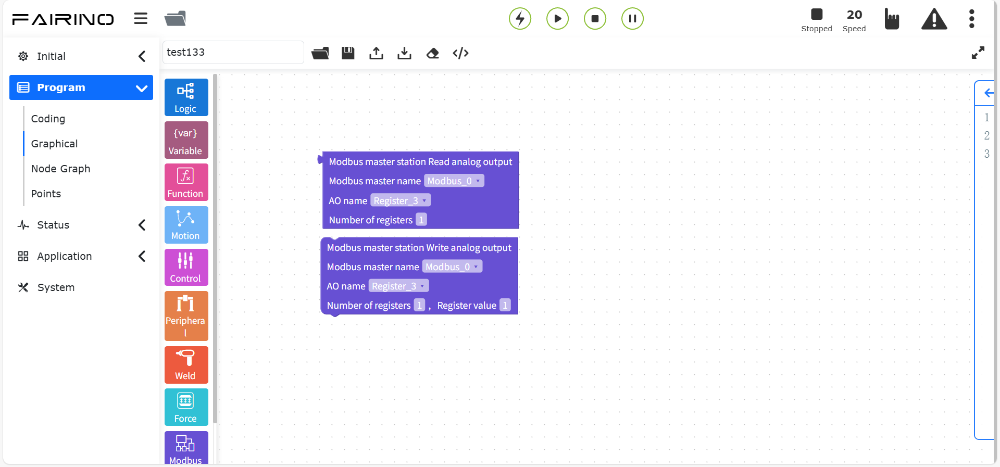

.. centered:: Abbildung 10.10-3 Master "Analogausgang lesen/schreiben" Codeblock

4.  Master Analogeingang einstellen, Parameter:

    -   Modbus-Master-Name: Je nach tatsächlicher Situation konfigurieren.
    -   AI-Name: Je nach tatsächlicher Situation konfigurieren.
    -   Registeranzahl: Ganzzahl 0 \~ 128.

.. image:: graphical/134.png
   :width: 6in
   :align: center

.. centered:: Abbildung 10.10-4 Master "Analogeingang lesen" Codeblock

5.  Master Warten auf Digital eingang einstellen, Parameter:

    -   Modbus-Master-Name: Je nach tatsächlicher Situation konfigurieren.
    -   DI-Name: Je nach tatsächlicher Situation konfigurieren.
    -   Wartestatus: true/false.
    -   Zeitüberschreitung (ms): Ganzzahl 0 \~ 128.

.. image:: graphical/135.png
   :width: 6in
   :align: center

.. centered:: Abbildung 10.10-5 Master "Warten auf Digital eingang" Codeblock

6.  Master Warten auf Analogeingang einstellen, Parameter:

    -   Modbus-Master-Name: Je nach tatsächlicher Situation konfigurieren.
    -   AI-Name: Je nach tatsächlicher Situation konfigurieren.
    -   Wartestatus: Größer als / Kleiner als.
    -   Registeranzahl: Ganzzahl 0 \~ 128.
    -   Registerwert: Abhängig von der Registeranzahl, es können mehrere Werte eingegeben werden.

.. image:: graphical/136.png
   :width: 6in
   :align: center

.. centered:: Abbildung 10.10-6 Master "Warten auf Analogeingang" Codeblock

7.  Slave Digitalausgang einstellen, Parameter:

    -   DO-Name: Je nach tatsächlicher Situation konfigurieren.
    -   Registeranzahl: Ganzzahl 0 \~ 128.
    -   Registerwert: Abhängig von der Registeranzahl, es können mehrere Werte eingegeben werden. Z.B. Anzahl 3, Wert 1,0,1.

.. image:: graphical/137.png
   :width: 6in
   :align: center

.. centered:: Abbildung 10.10-7 Slave "Digitalausgang lesen/schreiben" Codeblock

8.  Slave Digital eingang einstellen, Parameter:

    -   DI-Name: Je nach tatsächlicher Situation konfigurieren.
    -   Registeranzahl: Ganzzahl 0 \~ 128.

.. image:: graphical/138.png
   :width: 6in
   :align: center

.. centered:: Abbildung 10.10-8 Slave "Digital eingang lesen" Codeblock

9.  Slave Analogausgang einstellen, Parameter:

    -   AO-Name: Je nach tatsächlicher Situation konfigurieren.
    -   Registeranzahl: Ganzzahl 0 \~ 128.
    -   Registerwert: Abhängig von der Registeranzahl, es können mehrere Werte eingegeben werden. Z.B. Anzahl 3, Wert 1,0,1.

.. image:: graphical/139.png
   :width: 6in
   :align: center

.. centered:: Abbildung 10.10-9 Slave "Analogausgang lesen/schreiben" Codeblock

10. Slave Analogeingang einstellen, Parameter:

    -   AI-Name: Je nach tatsächlicher Situation konfigurieren.
    -   Registeranzahl: Ganzzahl 0 \~ 128.

.. image:: graphical/140.png
   :width: 6in
   :align: center

.. centered:: Abbildung 10.10-10 Slave "Analogeingang lesen" Codeblock

11. Slave Warten auf Digital eingang einstellen, Parameter:

    -   DI-Name: Je nach tatsächlicher Situation konfigurieren.
    -   Wartestatus: true/false.
    -   Zeitüberschreitung (ms): Ganzzahl.

.. image:: graphical/141.png
   :width: 6in
   :align: center

.. centered:: Abbildung 10.10-11 Slave "Warten auf Digital eingang" Codeblock

12. Slave Warten auf Analogeingang einstellen, Parameter:

    -   AI-Name: Je nach tatsächlicher Situation konfigurieren.
    -   Wartestatus: Größer als / Kleiner als.
    -   Registeranzahl: Ganzzahl 0 \~ 128.
    -   Registerwert: Abhängig von der Registeranzahl, es können mehrere Werte eingegeben werden.

.. image:: graphical/142.png
   :width: 6in
   :align: center

.. centered:: Abbildung 10.10-12 Slave "Warten auf Analogeingang" Codeblock

13. Register lesen, Parameter:

    -   Funktionscode: 0x01-Spule / 0x02-Diskret / 0x03-Halte-Register / 0x04-Eingangs-Register.
    -   Adresse Register, Spule, Diskret: Je nach tatsächlicher Situation eingeben.
    -   Anzahl Register, Spule, Diskret: 0 \~ 255.
    -   Adresse: Je nach tatsächlicher Situation eingeben.
    -   Thread anwenden: Nein/Ja.

.. image:: graphical/143.png
   :width: 6in
   :align: center

.. centered:: Abbildung 10.10-13 "Register lesen" Codeblock

14. Registerdaten lesen, Parameter:

    -   Anzahl Register, Spule, Diskret: 0 \~ 255.
    -   Thread anwenden: Nein/Ja.

.. image:: graphical/144.png
   :width: 6in
   :align: center

.. centered:: Abbildung 10.10-14 "Registerdaten lesen" Codeblock

15. Register schreiben, Parameter:

    -   Funktionscode: 0x01-Spule / 0x02-Diskret / 0x03-Halte-Register / 0x04-Eingangs-Register.
    -   Adresse Register, Spule: Je nach tatsächlicher Situation eingeben.
    -   Anzahl Register, Spule: 0 \~ 255.
    -   Byte-Array: Je nach tatsächlicher Situation eingeben.
    -   Adresse: Je nach tatsächlicher Situation eingeben.
    -   Thread anwenden: Nein/Ja.

.. image:: graphical/145.png
   :width: 6in
   :align: center

.. centered:: Abbildung 10.10-15 "Register schreiben" Codeblock

Grafische Programmierbefehle für Fortgeschrittene
-----------------------------------------------------------
Grafische Programmierbefehle für Fortgeschrittene enthalten erweiterte Befehle wie dofile-Unterprogrammaufruf, Hilfsthreads, Faltanweisungen usw.

.. image:: graphical/012.png
   :width: 6in
   :align: center

.. centered:: Abbildung 10.11 Grafische Programmierbefehle für Fortgeschrittene

Falt-Anweisung
~~~~~~~~~~~~~~~~~~~~~
Ziehen Sie den Codeblock "Falt-Anweisung" in den Arbeitsbereich der grafischen Bearbeitungsoberfläche.

Dieser Befehl bietet die Möglichkeit, mehrzeilige Codeblöcke zusammenzufalten, um dem Benutzer das Lesen des Codeblocks zu erleichtern.

Knoten "Falten"-Anweisung, Parameter:

-   Codeblockname: Name für den gefalteten Codeblock.

.. image:: graphical/146.png
   :width: 6in
   :align: center

.. centered:: Abbildung 10.11-1 Falt-Anweisung Codeblock

Unterprogrammaufruf-Anweisung
~~~~~~~~~~~~~~~~~~~~~~~~~~~~~~~~~~~~~
Ziehen Sie den Codeblock "Unterprogrammaufruf-Anweisung" in den Arbeitsbereich der grafischen Bearbeitungsoberfläche.

Dieser Befehl ist ein Unterprogrammaufruf. Wenn dieser Befehl im Programm eingefügt wird und das Programm diesen Befehl erreicht, wechselt der Roboter in den Pause-Zustand. Um fortzufahren, klicken Sie auf die Schaltfläche "Pause/Fortsetzen" im Steuerungsbereich.

Knoten "Unterprogrammaufruf"-Anweisung, Parameter:

-   dofile-Datei: Name der erstellten/generierten Datei.
-   Aufrufebene: Erste Ebene / Zweite Ebene.
-   ID-Nummer: ID der entsprechenden Position in der zugehörigen Ebene.

.. centered:: Abbildung 10.11-2 Unterprogrammaufruf-Anweisung Codeblock

Hilfsthread-Anweisung
~~~~~~~~~~~~~~~~~~~~~
Ziehen Sie den Codeblock "Hilfsthread" in den Arbeitsbereich der grafischen Bearbeitungsoberfläche.

Der Thread-Befehl ist eine Hilfsthread-Funktion. Benutzer können einen Hilfsthread definieren, der gleichzeitig mit dem Hauptthread läuft. Der Hilfsthread dient hauptsächlich dem Datenaustausch mit externen Geräten, unterstützt Socket-Kommunikation, Abrufen des Roboter-DI-Status, Setzen des Roboter-DO-Status, Abrufen von Roboterstatusinformationen und Datenaustausch mit dem Hauptthread. Die vom Hilfsthread abgerufenen Daten werden vom Hauptthread zur Steuerung der Bewegungslogik des Roboters verwendet.

Knoten "Hilfsthread"-Anweisung, Parameter:

-   Methodenname: Name des Hilfsthreads.
-   Aufgerufene Funktion: Vom Hilfsthread aufgerufener Funktionswert.

.. image:: graphical/148.png
   :width: 6in
   :align: center

.. centered:: Abbildung 10.11-3 Hilfsthread Codeblock

Punktetabellen-Anweisung
~~~~~~~~~~~~~~~~~~~~~~~~~~~~~~~~~~~~~
Ziehen Sie den Codeblock "Punktetabelle" in den Arbeitsbereich der grafischen Bearbeitungsoberfläche.

Dieser Befehl wird hauptsächlich für den Moduswechsel zwischen Systemmodus und Punktetabellenmodus verwendet. Durch Umschalten der Punktetabelle werden die Teach-Punkte in verschiedenen Punktetabellen angewendet. Siehe Kapitel 12 - Teach-Punkte.

Knoten "Punktetabelle"-Anweisung, Parameter:

-   Punktetabellenmodus: Auswahl verschiedener Punktetabellennamen.

.. image:: graphical/149.png
   :width: 6in
   :align: center

.. centered:: Abbildung 10.11-4 Punktetabelle Codeblock

Fokusfolge-Anweisung
~~~~~~~~~~~~~~~~~~~~~
Ziehen Sie den Codeblock "Fokusfolge" in den Arbeitsbereich der grafischen Bearbeitungsoberfläche.

Dieser Befehl wird hauptsächlich verwendet, damit der Roboter sich während der Bewegung immer auf einen Punkt konzentriert und diesem folgt.

Knoten "Fokusfolge"-Anweisung, Parameter:

-   Parameterverhältnis: 0\~100, Standardwert 50.
-   Vorsteuerungsparameter: 0\~1000, Standardwert 19.
-   Maximale Winkelgeschwindigkeitsbeschleunigungsbegrenzung: 0\~10000, Standardwert 1440.
-   Maximale Winkelgeschwindigkeitsbegrenzung: 0\~1000, Standardwert 180.
-   X-Achsen-Ausrichtung sperren: Referenzeingabevektor / Horizontal / Vertikal.

.. image:: graphical/150.png
   :width: 6in
   :align: center

.. centered:: Abbildung 10.11-5 Fokusfolge Codeblock

Beispiel für die Verwendung grafischer Programmierbefehle
-------------------------------------------------------------
Wählen Sie den Typ der grafischen Programmierung aus und klicken Sie auf den zu verwendenden grafischen Codeblock. Sie können dann im Arbeitsbereich per Drag & Drop verknüpft werden.

Zum Beispiel können Sie PTP- und Lin-Bewegungsbefehle sowie den Steuerbefehl Waitms auswählen und verknüpfen. Äußerlich kann ein erweiterter Faltbefehl eingefügt und ein Kommentarname eingegeben werden, um das Falten des Codeblocks zu ermöglichen.

Durch Klicken auf das Dropdown-Feld können Sie den Befehlsparametertyp auswählen. In das Eingabefeld können Sie die Befehlsparameterdaten eingeben. Ein Beispiel für einen grafischen Programmierbefehl ist wie folgt:

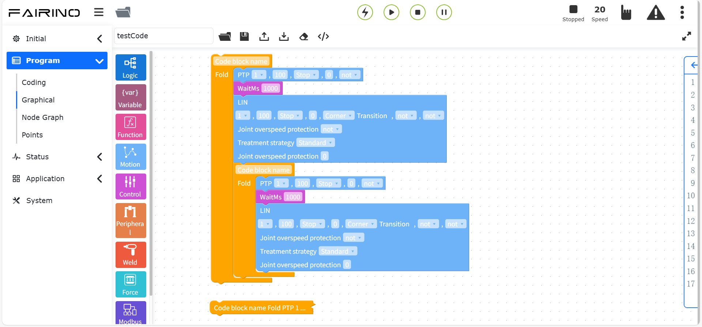

.. centered:: Abbildung 10.12-1 Beispiel für einen grafischen Programmierbefehl

Nachdem die grafischen Programmierbefehle verknüpft und die Parameter eingegeben wurden, geben Sie einen Namen für den Workspace ein und klicken Sie auf das Symbol "Speichern", um dieses Programm zu speichern. Wählen Sie den fertig geschriebenen "Workspace" aus und klicken Sie auf "Starten", um dieses Programmsegment auszuführen.

Modularisierung grafischer Programmiercodeblöcke
~~~~~~~~~~~~~~~~~~~~~~~~~~~~~~~~~~~~~~~~~~~~~~~~~~
Um die Lesbarkeit des grafischen Programmiercodes zu verbessern, wurde eine Modularisierungsfunktion für grafische Programmiercodeblöcke hinzugefügt, nämlich der erweiterte Befehl: Faltanweisung Codeblock.

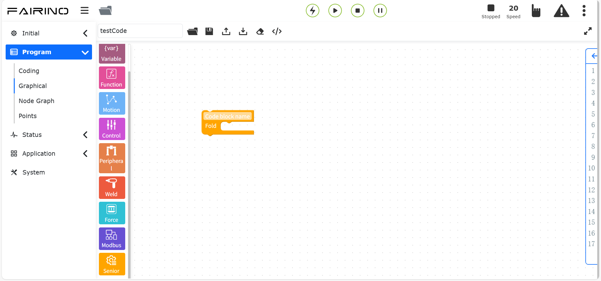

.. centered:: Abbildung 10.12-2 Faltanweisung Codeblock

1.  Schreiben Sie einen Codeblock-Befehl, fügen Sie außen einen Faltanweisung-Codeblock hinzu und schreiben Sie einen Kommentar für diesen Befehlsabschnitt in das Eingabefeld.

.. image:: graphical/015.png
   :width: 6in
   :align: center

.. centered:: Abbildung 10.12-3 Faltanweisung Effektbild

2.  Klicken Sie mit der rechten Maustaste in der Aktionsleiste auf "Block falten". Dieser Befehlsabschnitt wird gefaltet und als eine Zeile angezeigt. Das Programm unter dem gefalteten Block kann weiterhin korrekt ausgeführt werden.

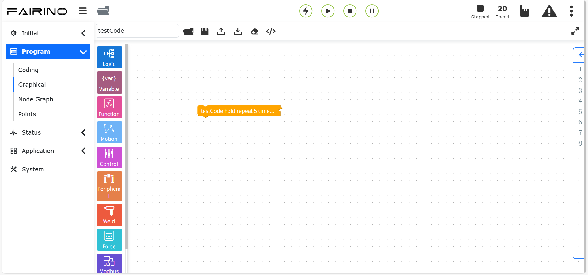

.. centered:: Abbildung 10.12-4 Effektbild nach dem Falten

3.  Mit dem Mausrad kann die Seite vergrößert/verkleinert werden. Der Effekt ist wie folgt:

.. image:: graphical/017.png
   :width: 6in
   :align: center

.. centered:: Abbildung 10.12-5 Seitenzoom-Funktion Effektbild

Gleichnamiges Überschreiben in der grafischen Programmierung
~~~~~~~~~~~~~~~~~~~~~~~~~~~~~~~~~~~~~~~~~~~~~~~~~~~~~~~~~~~~~~
Erstellen/laden Sie auf der grafischen Programmieroberfläche eine Datei, ändern Sie den Workspace-Namen und klicken Sie auf Speichern. Wenn der geänderte Workspace-Dateiname bereits existiert, wird ein Popup-Fenster "Teach-Punkt existiert bereits" angezeigt, wie unten abgebildet.

.. image:: graphical/018.png
   :width: 6in
   :align: center

.. centered:: Abbildung 10.12-6 Überschreiben eines grafischen Programms

**Schritt 1**: Klicken Sie auf die Schaltfläche "Abbrechen", um mit dem vorherigen Vorgang fortzufahren.

**Schritt 2**: Aktivieren Sie das Kontrollkästchen "Teach-Programm synchron aktualisieren" und klicken Sie dann auf die Schaltfläche "Überschreiben". Das Lua-Programm auf der aktuellen grafischen Programmieroberfläche überschreibt das Lua-Programm der Datei mit dem geänderten Workspace-Namen.

Überprüfung auf nicht gespeicherte Programme in der grafischen Programmierung
~~~~~~~~~~~~~~~~~~~~~~~~~~~~~~~~~~~~~~~~~~~~~~~~~~~~~~~~~~~~~~~~~~~~~~~~~~~~~~~~

Öffnen/erstellen Sie auf der grafischen Programmieroberfläche ein Programm. Wenn das grafische Programm geändert, aber nicht gespeichert wurde,

und Sie dann auf die Dateioperation "Öffnen" klicken, wird ein Popup-Fenster "Dieses Programm speichern?" mit der Meldung "Das aktuelle Programm wurde geändert. Möchten Sie die Änderungen an diesem Programm speichern?" angezeigt, wie unten abgebildet.

.. image:: graphical/019.png
   :width: 6in
   :align: center

.. centered:: Abbildung 10.12-7 Überprüfung auf nicht gespeichertes Programm auf der aktuellen Seite

**Schritt 1**: Klicken Sie auf die Schaltfläche "Nicht speichern", um mit der vorherigen Dateioperation "Öffnen" fortzufahren.

**Schritt 2**: Klicken Sie auf die Schaltfläche "Speichern". Das nicht gespeicherte Lua-Programm wird erfolgreich gespeichert, und die vorherige Dateioperation "Öffnen" wird fortgesetzt.

Wenn Sie die grafische Programmieroberfläche verlassen und zu einer anderen Seite wechseln, wird ebenfalls der Hinweis "Dieses Programm speichern?" ausgelöst, und Sie bleiben auf der aktuellen grafischen Programmieroberfläche, wie unten abgebildet.

.. image:: graphical/020.png
   :width: 6in
   :align: center

.. centered:: Abbildung 10.12-8 Überprüfung auf nicht gespeichertes Programm beim Seitenwechsel

**Schritt 1**: Klicken Sie auf die Schaltfläche "Nicht speichern", um zur zuvor ausgewählten Seite zu springen.

**Schritt 2**: Klicken Sie auf die Schaltfläche "Speichern". Das nicht gespeicherte Lua-Programm wird erfolgreich gespeichert, und es wird zur zuvor ausgewählten Seite gesprungen. Wenn der Name des gespeicherten Programms bereits existiert, wird darauf hingewiesen, dass der Teach-Punkt bereits existiert, und gefragt, ob überschrieben werden soll. Nach dem Abbrechen/Überschreiben wird zur zuvor ausgewählten Seite gesprungen.