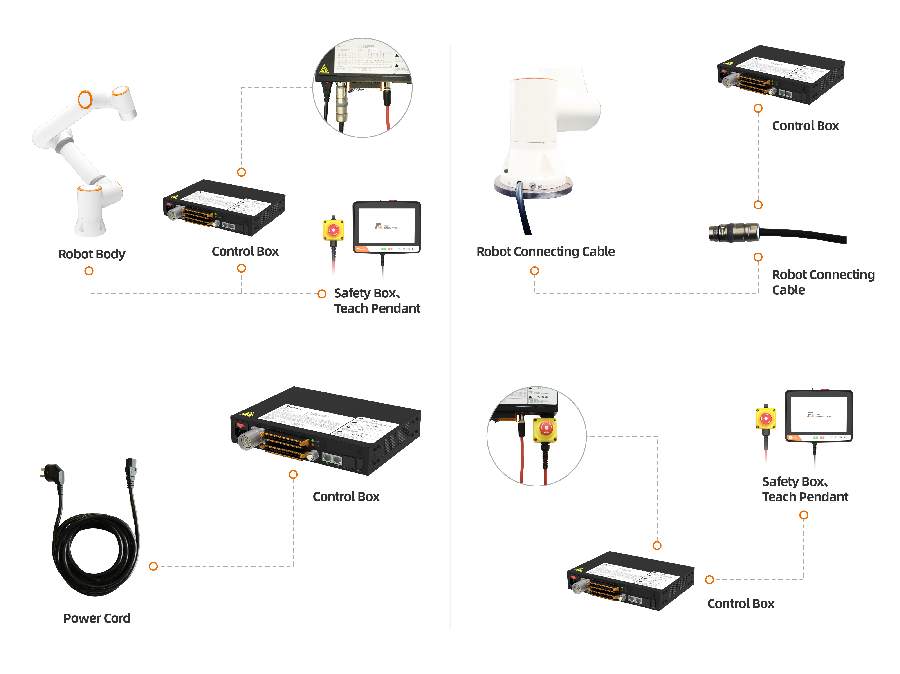

Robotermontage und Inbetriebnahme
==============================================

.. toctree::
   :maxdepth: 6

Montage des Roboterarms
----------------------------------

Bei der Montage des kollaborativen Roboters auf einer Montagehalterung verwenden Sie bitte die vorgeschriebene Anzahl an Schrauben (Festigkeitsklasse nicht unter 8.8), um den Roboter fest auf der Halterung zu verschrauben. Es wird empfohlen, auf der Montagehalterung zwei vorgesehene Passbohrungen in Verbindung mit Passstiften zur Positionierung des Roboters zu verwenden. Dies verbessert die Montagegenauigkeit des Roboters und verhindert, dass sich der Roboter durch Stöße oder ähnliches bewegt. Wenn hohe Anforderungen an die Laufgenauigkeit des Roboters gestellt werden, müssen auf jeden Fall Passstifte zur Positionierung des Roboters verwendet werden.

.. centered:: Tabelle 1.1-1 Normen für Robotermontageteile

.. list-table::
   :widths: 80 50 50 50
   :header-rows: 0
   :align: center

   * - **Kollaborativer Robotermodell**
     - **Schrauben**
     - **Schraubenanzugsmoment**
     - **Passbohrungsspezifikation**

   * - FR3
     - 4 Stück M6
     - ≥10 Nm
     - φ5 mm

   * - FR3-WMS
     - 4 Stück M6
     - ≥10 Nm
     - φ5 mm

   * - FR3-WML
     - 4 Stück M6
     - ≥10 Nm
     - φ5 mm

   * - FR3-C
     - 4 Stück M6
     - ≥10 Nm
     - φ5 mm

   * - FR5-C
     - 4 Stück M6
     - ≥10Nm
     - φ5mm
   
   * - FR5
     - 4 Stück M8
     - ≥20 Nm
     - φ8 mm

   * - FR10
     - 4 Stück M8
     - ≥25 Nm
     - φ8 mm

   * - FR16
     - 4 Stück M8
     - ≥25 Nm
     - φ8 mm

   * - FR20
     - 6 Stück M10
     - ≥45 Nm
     - φ8 mm

   * - FR30
     - 6 Stück M10
     - ≥45 Nm
     - φ8 mm

   * - FR30L
     - 6 Stück M10
     - ≥45 Nm
     - φ8 mm

.. important::
   Die Montagehalterung des Roboters sollte die folgenden Anforderungen erfüllen, um eine sichere und stabile Befestigung des Roboters zu gewährleisten:

   (1) Die Montagehalterung muss ausreichend stabil sein und eine ausreichende Tragfähigkeit aufweisen. Sie sollte mindestens das 5-fache des Robotergewichts tragen können und mindestens das 10-fache des Drehmoments der Achse 1 aushalten können.

   (2) Die Oberfläche der Montagehalterung muss eben sein, um einen festen Kontakt mit der Roboterauflagefläche zu gewährleisten.

   (3) Die Montagehalterung muss eine ausreichende Steifigkeit aufweisen und fest verankert sein, um Resonanzen mit dem Roboter zu vermeiden.

   (4) Wenn der Roboter und andere Komponenten gleichzeitig bewegt werden, sollte die Halterung von anderen beweglichen Teilen getrennt sein und nicht mit ihnen verbunden werden, um Vibrationseinflüsse während der Bewegung zu vermeiden.

   (5) Wenn der Roboter auf einer mobilen Plattform oder einer externen Achse montiert ist, sollte die Beschleunigung der mobilen Plattform oder der externen Achse so gering wie möglich sein.

Anschließen des Steuerschranks
------------------------------------

Die Roboter dieser Serie können mit Steuerschränken betrieben werden, die für drei verschiedene Spannungsversorgungen ausgelegt sind. Detaillierte Informationen zur Spannungsversorgung des Steuerschranks finden Sie auf dem Typenschild des Steuerschranks. Der Roboter muss elektrisch geerdet werden. Alle externen Verbindungen des Steuerungssystems des Manipulators werden mit steckbaren und schnell montierbaren Steckverbindern hergestellt.

A. 30-60 V DC
B. 176-264 V AC ~ 50-60 Hz
C. 100-240 V AC ~ 50-60 Hz

.. note:: Bei Steuerschränken mit Wechselstromeingang wird zwischen zwei Versionen unterschieden: Schmalbereich und Weitbereich. Die Anschlussklemmen und die äußere Form der Steuerschränke sind identisch und können nicht allein anhand der Form unterschieden werden. Bitte überprüfen Sie dies anhand des Typenschilds des Steuerschranks, und nehmen Sie die Inbetriebnahme erst nach bestätigter Richtigkeit vor.

Das Anschlussfeld des kollaborativen Roboters ist in der folgenden Abbildung dargestellt:

.. centered:: Abbildung 1.2-1 Anschlussfeld des Steuerschranks

Die Taster-Box-Schnittstelle ist standardmäßig der Anschluss für das Teach Pendant. Die IP-Adresse lautet 192.168.58.2. Verbinden Sie den Anschluss der Taster-Box mit einem Netzwerkkabel mit einem Computer. Stellen Sie die IP-Adresse des Computers auf 192.168.58.10 oder ein anderes im selben Netzwerk ein. Öffnen Sie den Google Chrome Browser und geben Sie 192.168.58.2 ein, um auf die Teach-Pendant-Seite zuzugreifen.

Lernen der Taster-Box und der LED an der Flanschseite kennen
-----------------------------------------------------------------------

Taster-Box
~~~~~~~~~~~~~~

60 Taster-Box (POE) (BX01)
++++++++++++++++++++++++++++++

.. figure:: installation/058.png
   :align: center
   :width: 6in

.. centered:: Abbildung 1.3-1 60 Taster-Box (POE)

60 Taster-Box (POE) (BX02)-V1.0
+++++++++++++++++++++++++++++++++++++

.. image:: installation/059.png
   :width: 6in
   :align: center

.. centered:: Abbildung 1.3-2 Anschlussfeld des Steuerschranks

.. centered:: Tabelle 1.3-1 Erklärung der Tasten am Anschlussfeld des Steuerschranks

.. list-table::
   :widths: 50 200
   :header-rows: 0
   :align: center

   * - **Tastenname**
     - **Funktion**

   * - Not-Halt-Schalter
     - Wenn der Not-Halt-Schalter gedrückt wird, versetzt der Roboter in den Not-Halt-Zustand.

   * - Start / Stop
     - Startet / Stoppt das laufende Programm.

   * - Netzwerkanschluss
     - Verbindung zum Web-Teach-Pendant.

   * - Ausschalten
     - Derzeit nicht aktiviert.

   * - Punkt aufzeichnen
     - Aufzeichnen eines Teach-Punkts.

   * - Teach-Modus
     - Ein-/Ausschalten des Zustands "Verbunden mit Teach Pendant".

   * - Betriebsmodus
     - Umschalten zwischen Automatik- / Handmodus.

   * - Ziehemodus (Drag & Drop)
     - Ein-/Ausschalten des Ziehemodus.

60 Taster-Box (POE) (BX02)-V2.0
+++++++++++++++++++++++++++++++++++

.. image:: installation/079.png
   :width: 6in
   :align: center

.. centered:: Abbildung 1.3-3 Anschlussfeld des Steuerschranks

.. centered:: Tabelle 1.3-2 Erklärung der Tasten am Anschlussfeld des Steuerschranks

.. list-table::
   :widths: 50 200
   :header-rows: 0
   :align: center

   * - **Tastenname**
     - **Funktion**

   * - Not-Halt-Schalter
     - Wenn der Not-Halt-Schalter gedrückt wird, versetzt der Roboter in den Not-Halt-Zustand.

   * - Start / Stop
     - Startet / Stoppt das laufende Programm.

   * - Netzwerkanschluss
     - Verbindung zum Web-Teach-Pendant.

   * - IP-Reset
     - Setzt die IP-Adresse des Netzwerkanschlusses zurück.

   * - Punkt aufzeichnen
     - Aufzeichnen eines Teach-Punkts.

   * - Ein-Klick-Löschung
     - Löscht alle behebbaren Fehler.

   * - Betriebsmodus
     - Umschalten zwischen Automatik- / Handmodus.

   * - Ziehemodus (Drag & Drop)
     - Ein-/Ausschalten des Ziehemodus.

LED an der Flanschseite
~~~~~~~~~~~~~~~~~~~~~~~~~~~

.. centered:: Tabelle 1.3-3 Definition der LED an der Flanschseite

.. list-table::
   :widths: 120 100
   :header-rows: 0
   :align: center

   * - **Funktion**
     - **LED-Farbe**

   * - Keine Kommunikation hergestellt
     - Wechselt zwischen "Aus", "Rot", "Grün", "Blau"

   * - Automatikmodus
     - Blau Dauerlicht

   * - Handmodus
     - Grün Dauerlicht

   * - Ziehemodus (Drag & Drop)
     - Weiß-Cyan Dauerlicht

   * - Punktaufzeichnung über Taster-Box (nur bei Verwendung der Taster-Box)
     - Violett zweimal blinken

   * - Eintritt in den Zustand "Nicht mit Taster-Box verbunden" (nur bei Verwendung der Taster-Box)
     - Cyan zweimal blinken

   * - Start Ausführung (nur bei Verwendung der Taster-Box)
     - Blau zweimal blinken

   * - Stopp Ausführung (nur bei Verwendung der Taster-Box)
     - Rot zweimal blinken

   * - Fehler (nur bei Verwendung der Taster-Box)
     - Rot Dauerlicht

   * - Nullpunktkalibrierung abgeschlossen
     - Weiß-Cyan dreimal blinken

   * - Deaktiviert (Löschen der Bereitschaft)
     - Gelb zweimal blinken

Einschalten und Aktivieren (Energiekreis freigeben)
----------------------------------------------------------------

Vor dem Einschalten stellen Sie bitte sicher, dass der Not-Halt-Taster an der Taster-Box entriegelt ist. Drücken Sie den roten Netzschalter am Steuerschrank, um einzuschalten. Nach erfolgreicher Freigabe (Enable) leuchtet die LED an der Flanschseite dauerhaft grün.

Ausschalten der Spannungsversorgung
----------------------------------------------

.. important::
   Stellen Sie bei der Verwendung dieses Geräts unbedingt sicher, dass Sie vor dem Ausschalten der Spannungsversorgung alle laufenden Programme stoppen, die Statusabfragefunktion deaktivieren und den Betriebsstatus als "Stopped" (Gestoppt) bestätigen. Diese Maßnahme dient dem Schutz des Geräts und der gespeicherten Daten und soll Datenverlust oder Systemschäden durch plötzliches Abschalten der Spannungsversorgung verhindern.

.. image:: installation/078.png
   :width: 6in
   :align: center

.. centered:: Abbildung 1.5-1 Ausschalten der Spannungsversorgung