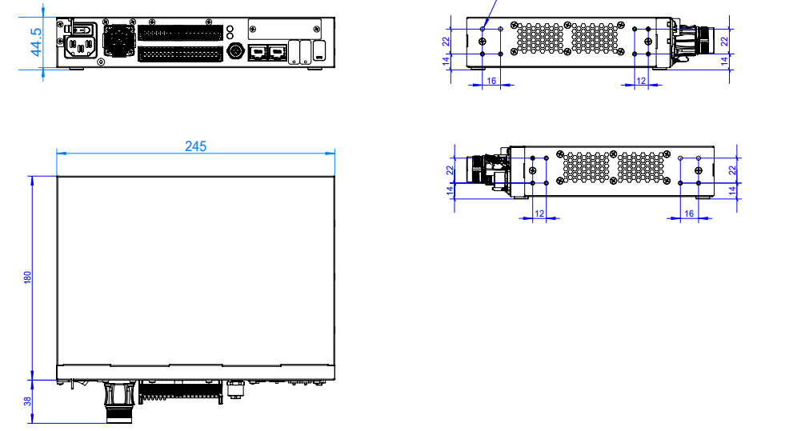
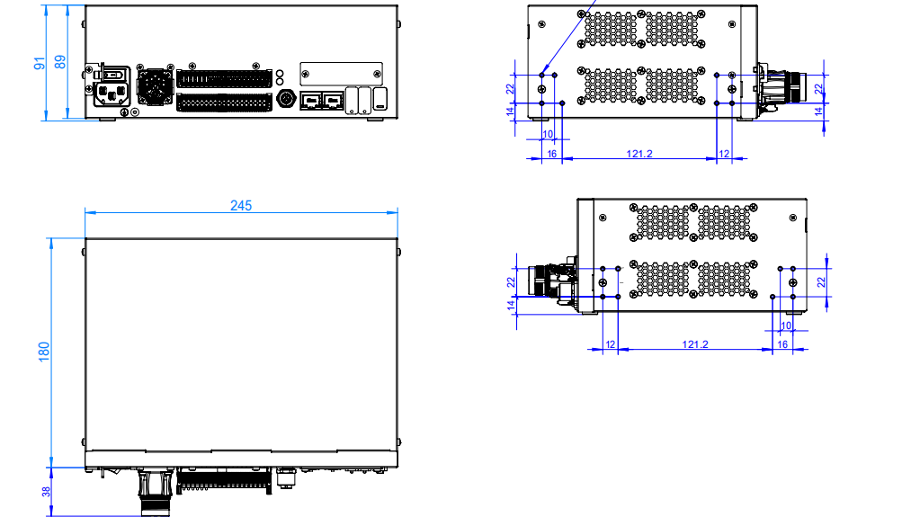

Robotermontage und Inbetriebnahme
==============================================

.. toctree::
   :maxdepth: 6

Montage des Roboterarms
----------------------------------

Bei der Montage des kollaborativen Roboters auf einer Montagehalterung verwenden Sie bitte die vorgeschriebene Anzahl an Schrauben (Festigkeitsklasse nicht unter 8.8), um den Roboter fest auf der Halterung zu verschrauben. Es wird empfohlen, auf der Montagehalterung zwei vorgesehene Passbohrungen in Verbindung mit Passstiften zur Positionierung des Roboters zu verwenden. Dies verbessert die Montagegenauigkeit des Roboters und verhindert, dass sich der Roboter durch Stöße oder ähnliches bewegt. Wenn hohe Anforderungen an die Laufgenauigkeit des Roboters gestellt werden, müssen auf jeden Fall Passstifte zur Positionierung des Roboters verwendet werden.

.. centered:: Tabelle 1.1-1 Normen für Robotermontageteile

.. list-table::
   :widths: 80 50 50 50
   :header-rows: 0
   :align: center

   * - **Kollaborativer Robotermodell**
     - **Schrauben**
     - **Schraubenanzugsmoment**
     - **Passbohrungsspezifikation**

   * - FR3
     - 4 Stück M6
     - ≥10 Nm
     - φ5 mm

   * - FR3-WMS
     - 4 Stück M6
     - ≥10 Nm
     - φ5 mm

   * - FR3-WML
     - 4 Stück M6
     - ≥10 Nm
     - φ5 mm

   * - FR3-C
     - 4 Stück M6
     - ≥10 Nm
     - φ5 mm

   * - FR5-C
     - 4 Stück M6
     - ≥10Nm
     - φ5mm
   
   * - FR5
     - 4 Stück M8
     - ≥20 Nm
     - φ8 mm

   * - FR10
     - 4 Stück M8
     - ≥25 Nm
     - φ8 mm

   * - FR16
     - 4 Stück M8
     - ≥25 Nm
     - φ8 mm

   * - FR20
     - 6 Stück M10
     - ≥45 Nm
     - φ8 mm

   * - FR30
     - 6 Stück M10
     - ≥45 Nm
     - φ8 mm

.. important::
   Die Montagehalterung des Roboters sollte die folgenden Anforderungen erfüllen, um eine sichere und stabile Befestigung des Roboters zu gewährleisten:

   (1) Die Montagehalterung muss ausreichend stabil sein und eine ausreichende Tragfähigkeit aufweisen. Sie sollte mindestens das 5-fache des Robotergewichts tragen können und mindestens das 10-fache des Drehmoments der Achse 1 aushalten können.

   (2) Die Oberfläche der Montagehalterung muss eben sein, um einen festen Kontakt mit der Roboterauflagefläche zu gewährleisten.

   (3) Die Montagehalterung muss eine ausreichende Steifigkeit aufweisen und fest verankert sein, um Resonanzen mit dem Roboter zu vermeiden.

   (4) Wenn der Roboter und andere Komponenten gleichzeitig bewegt werden, sollte die Halterung von anderen beweglichen Teilen getrennt sein und nicht mit ihnen verbunden werden, um Vibrationseinflüsse während der Bewegung zu vermeiden.

   (5) Wenn der Roboter auf einer mobilen Plattform oder einer externen Achse montiert ist, sollte die Beschleunigung der mobilen Plattform oder der externen Achse so gering wie möglich sein.

Anschließen des Steuerschranks
------------------------------------

Die Roboter dieser Serie können mit Steuerschränken betrieben werden, die für drei verschiedene Spannungsversorgungen ausgelegt sind. Detaillierte Informationen zur Spannungsversorgung des Steuerschranks finden Sie auf dem Typenschild des Steuerschranks. Der Roboter muss elektrisch geerdet werden. Alle externen Verbindungen des Steuerungssystems des Manipulators werden mit steckbaren und schnell montierbaren Steckverbindern hergestellt.

A. 30-60 V DC
B. 176-264 V AC ~ 50-60 Hz
C. 100-240 V AC ~ 50-60 Hz

.. note:: Bei Steuerschränken mit Wechselstromeingang wird zwischen zwei Versionen unterschieden: Schmalbereich und Weitbereich. Die Anschlussklemmen und die äußere Form der Steuerschränke sind identisch und können nicht allein anhand der Form unterschieden werden. Bitte überprüfen Sie dies anhand des Typenschilds des Steuerschranks, und nehmen Sie die Inbetriebnahme erst nach bestätigter Richtigkeit vor.

Das Anschlussfeld des kollaborativen Roboters ist in der folgenden Abbildung dargestellt:

.. image:: installation/037.png
   :width: 6in
   :align: center

.. centered:: Abbildung 1.2-1 Anschlussfeld des Steuerschranks

Die Taster-Box-Schnittstelle ist standardmäßig der Anschluss für das Teach Pendant. Die IP-Adresse lautet 192.168.58.2. Verbinden Sie den Anschluss der Taster-Box mit einem Netzwerkkabel mit einem Computer. Stellen Sie die IP-Adresse des Computers auf 192.168.58.10 oder ein anderes im selben Netzwerk ein. Öffnen Sie den Google Chrome Browser und geben Sie 192.168.58.2 ein, um auf die Teach-Pendant-Seite zuzugreifen.

Informationen zu den Montagebohrungen des Steuerschranks
~~~~~~~~~~~~~~~~~~~~~~~~~~~~~~~~~~~~~~~~~~~~~~~~~~~~~~~~~~~~~~~~~~~~~~~~~~~~~~~~~~~~~~~~~~~~~~~~~~~~~~~~~~~~~~~~~~

.. centered:: Abbildung 1.2-2 Außenabmessungen des Steuerschranks - Montagebohrungsabmessungen 1

.. centered:: Abbildung 1.2-3 Außenabmessungen des Steuerschranks - Montagebohrungsabmessungen 2

.. note:: 
  1. Die bemaßten Bohrungen sind verfügbare Montagebohrungen;
  2. Es gibt insgesamt 16 Montagebohrungen, die auf der linken und rechten Seite des Steuerschranks verteilt sind, 8 auf jeder Seite;
  3. Die Schraubenspezifikation für die Montagebohrungen ist M3, mit einer Steigung von 0,5mm;
  4. Die Eindrehtiefe der Schrauben in das Blechgehäuse des Steuerschranks beträgt ≤5mm;
  5. Empfohlenes Anzugsdrehmoment ist 0,6Nm, maximales Anzugsdrehmoment ist 0,84Nm.

:download:`Außenabmessungen des Steuerschranks - Montagebohrungsabmessungen <../_static/_doc/Control box outer dimensions - mounting hole dimensions.zip>`

Lernen der Taster-Box und der LED an der Flanschseite kennen
-----------------------------------------------------------------------

Taster-Box
~~~~~~~~~~~~~~

60 Taster-Box (POE) (BX01)
++++++++++++++++++++++++++++++

.. figure:: installation/058.png
   :align: center
   :width: 6in

.. centered:: Abbildung 1.3-1 60 Taster-Box (POE)

60 Taster-Box (POE) (BX02)-V1.0
+++++++++++++++++++++++++++++++++++++

.. image:: installation/059.png
   :width: 6in
   :align: center

.. centered:: Abbildung 1.3-2 Anschlussfeld des Steuerschranks

.. centered:: Tabelle 1.3-1 Erklärung der Tasten am Anschlussfeld des Steuerschranks

.. list-table::
   :widths: 50 200
   :header-rows: 0
   :align: center

   * - **Tastenname**
     - **Funktion**

   * - Not-Halt-Schalter
     - Wenn der Not-Halt-Schalter gedrückt wird, versetzt der Roboter in den Not-Halt-Zustand.

   * - Start / Stop
     - Startet / Stoppt das laufende Programm.

   * - Netzwerkanschluss
     - Verbindung zum Web-Teach-Pendant.

   * - Ausschalten
     - Derzeit nicht aktiviert.

   * - Punkt aufzeichnen
     - Aufzeichnen eines Teach-Punkts.

   * - Teach-Modus
     - Ein-/Ausschalten des Zustands "Verbunden mit Teach Pendant".

   * - Betriebsmodus
     - Umschalten zwischen Automatik- / Handmodus.

   * - Ziehemodus (Drag & Drop)
     - Ein-/Ausschalten des Ziehemodus.

60 Taster-Box (POE) (BX02)-V2.0
+++++++++++++++++++++++++++++++++++

.. image:: installation/079.png
   :width: 6in
   :align: center

.. centered:: Abbildung 1.3-3 Anschlussfeld des Steuerschranks

.. centered:: Tabelle 1.3-2 Erklärung der Tasten am Anschlussfeld des Steuerschranks

.. list-table::
   :widths: 50 200
   :header-rows: 0
   :align: center

   * - **Tastenname**
     - **Funktion**

   * - Not-Halt-Schalter
     - Wenn der Not-Halt-Schalter gedrückt wird, versetzt der Roboter in den Not-Halt-Zustand.

   * - Start / Stop
     - Startet / Stoppt das laufende Programm.

   * - Netzwerkanschluss
     - Verbindung zum Web-Teach-Pendant.

   * - IP-Reset
     - Setzt die IP-Adresse des Netzwerkanschlusses zurück.

   * - Punkt aufzeichnen
     - Aufzeichnen eines Teach-Punkts.

   * - Ein-Klick-Löschung
     - Löscht alle behebbaren Fehler.

   * - Betriebsmodus
     - Umschalten zwischen Automatik- / Handmodus.

   * - Ziehemodus (Drag & Drop)
     - Ein-/Ausschalten des Ziehemodus.

LED an der Flanschseite
~~~~~~~~~~~~~~~~~~~~~~~~~~~

.. centered:: Tabelle 1.3-3 Definition der LED an der Flanschseite

.. list-table::
   :widths: 120 100
   :header-rows: 0
   :align: center

   * - **Funktion**
     - **LED-Farbe**

   * - Keine Kommunikation hergestellt
     - Wechselt zwischen "Aus", "Rot", "Grün", "Blau"

   * - Automatikmodus
     - Blau Dauerlicht

   * - Handmodus
     - Grün Dauerlicht

   * - Ziehemodus (Drag & Drop)
     - Weiß-Cyan Dauerlicht

   * - Punktaufzeichnung über Taster-Box (nur bei Verwendung der Taster-Box)
     - Violett zweimal blinken

   * - Eintritt in den Zustand "Nicht mit Taster-Box verbunden" (nur bei Verwendung der Taster-Box)
     - Cyan zweimal blinken

   * - Start Ausführung (nur bei Verwendung der Taster-Box)
     - Blau zweimal blinken

   * - Stopp Ausführung (nur bei Verwendung der Taster-Box)
     - Rot zweimal blinken

   * - Fehler (nur bei Verwendung der Taster-Box)
     - Rot Dauerlicht

   * - Nullpunktkalibrierung abgeschlossen
     - Weiß-Cyan dreimal blinken

   * - Deaktiviert (Löschen der Bereitschaft)
     - Gelb zweimal blinken

Einschalten und Aktivieren (Energiekreis freigeben)
----------------------------------------------------------------

Vor dem Einschalten stellen Sie bitte sicher, dass der Not-Halt-Taster an der Taster-Box entriegelt ist. Drücken Sie den roten Netzschalter am Steuerschrank, um einzuschalten. Nach erfolgreicher Freigabe (Enable) leuchtet die LED an der Flanschseite dauerhaft grün.

Ausschalten der Spannungsversorgung
----------------------------------------------

.. important::
   Stellen Sie bei der Verwendung dieses Geräts unbedingt sicher, dass Sie vor dem Ausschalten der Spannungsversorgung alle laufenden Programme stoppen, die Statusabfragefunktion deaktivieren und den Betriebsstatus als "Stopped" (Gestoppt) bestätigen. Diese Maßnahme dient dem Schutz des Geräts und der gespeicherten Daten und soll Datenverlust oder Systemschäden durch plötzliches Abschalten der Spannungsversorgung verhindern.

.. image:: installation/078.png
   :width: 6in
   :align: center

.. centered:: Abbildung 1.5-1 Ausschalten der Spannungsversorgung

Steuerkasten-Knopfzelle
----------------------------------------------------------------

Häufige Ursachen für Zeitverlust
~~~~~~~~~~~~~~~~~~~~~~~~~~~~~~~~~~~~~~~~~~~~~~~~~~~~~~~~~~~~~~~~~~~~~~~~

Dieses Gerät verwendet eine externe Knopfzelle als Backup-Stromquelle für die Echtzeituhr (RTC), um die Zeitzählung bei Unterbrechung der Hauptstromversorgung aufrechtzuerhalten.

Wenn ein Zeitverlust auftritt (d.h. nach dem erneuten Einschalten ein falsches Datum angezeigt wird), wird dies in der Regel durch eine oder mehrere der folgenden Ursachen verursacht:

.. list-table::
   :widths: 40 40 60
   :header-rows: 0
   :align: center

   * - **Ursachenkategorie**
     - **Spezifische Beschreibung**
     - **Fehlerbehebungsvorschläge**

   * - Knopfzelle entladen
     - Das Gerät wurde länger als 3 Monate nicht eingeschaltet, wodurch die Batterieenergie auf natürliche Weise verbraucht wurde.
     - Messen Sie die Batteriespannung mit einem Multimeter (ausbauen zum Messen). Wenn die Spannung unter 2,5 V liegt, muss die Batterie aufgeladen werden.

   * - Batterie beschädigt
     - Die Batterie hat das Ende ihrer Lebensdauer erreicht.
     - Überprüfen Sie, ob die Batterie ausläuft oder sich wölbt. Die Batterie muss ersetzt werden. Batteriemodell: MS621FE-FL11E, 3V/5,5mAH, wiederaufladbar.

   * - Schlechter Batterieanschlusskontakt
     - Batterieanschlüsse sind oxidiert, verformt, oder das Gerät wurde erschüttert, wodurch die Batterie kurzzeitig von den Kontakten abgehoben wurde.
     - Überprüfen Sie, ob die Batterie fest in den Anschlüssen sitzt, reinigen Sie die Kontakte, setzen Sie die Batterie neu ein und stellen Sie sicher, dass sie fest sitzt.

   * - Batterie nicht eingelegt oder falsch herum eingelegt
     - Der Benutzer hat die Backup-Batterie nicht eingelegt oder beim Einlegen die Polarität verwechselt.
     - | Bestätigen Sie, dass die Batterie mit der richtigen Polarität eingelegt ist (Pluspol nach oben).
       
       .. image:: installation/131.png
          :width: 2in
          :align: center

   * - Fehler der Batterieladeschaltung
     - Die wiederaufladbare Knopfzelle kann keine Ladung mehr speichern.
     - Die Ladeschaltung muss von qualifiziertem Wartungspersonal überprüft werden.

.. warning:: Die in diesem Gerät verwendete Knopfzelle ist das Modell [MS621FE-FL11E, 3V/5,5mAH, wiederaufladbar]. Bitte stellen Sie sicher, dass Sie die richtige Handhabungsmethode entsprechend dem Modell wählen. Es ist strengstens verboten, nicht wiederaufladbare Batterien einzusetzen.

Zeitanomalieerkennung und manuelle Kalibrierung
~~~~~~~~~~~~~~~~~~~~~~~~~~~~~~~~~~~~~~~~~~~~~~~~~~~~~~~~~~~~~~~~~~~~~~~~~~~

1) Methode zur Erkennung von Anomalien
   
Überprüfen Sie nach dem erneuten Einschalten des Roboters zunächst die aktuell auf der Geräteseite angezeigte Zeit. Vergleichen Sie diese mit der Systemzeit des Computers:

- Wenn sie übereinstimmen, ist die Zeit normal, und es sind keine weiteren Maßnahmen erforderlich.

.. image:: installation/132.png
   :width: 4in
   :align: center

.. centered:: Abbildung 1.6-1 Systemzeitanomalie

- Wenn sie nicht übereinstimmen (z.B. falsches Datum, erhebliche Abweichungen bei Stunden/Minuten/Sekunden), wird eine Zeitanomalie festgestellt. Fahren Sie bitte mit den folgenden Kalibrierungsschritten fort.
  
2) Kalibrierungsschritte

Wenn eine Zeitanomalie bestätigt wurde, befolgen Sie die folgenden Schritte, um die Systemzeit zu synchronisieren:

- Öffnen Sie einen Browser, um die WebApp aufzurufen, und navigieren Sie zu: "Systemeinstellungen -> Allgemeine Einstellungen -> Zeit" Oberfläche.

.. image:: installation/133.png
   :width: 6in
   :align: center

.. centered:: Abbildung 1.6-2 Systemzeitaktualisierungsoberfläche

- Klicken Sie auf die Schaltfläche "Aktualisieren" auf der Oberfläche. Das System führt die Zeitsynchronisation automatisch durch. Kehren Sie nach der Synchronisation zur Roboterseite zurück, und die Zeit sollte wieder normal sein.

Hinweise zum Laden und zur Wartung der Knopfzelle
~~~~~~~~~~~~~~~~~~~~~~~~~~~~~~~~~~~~~~~~~~~~~~~~~~~~~~~~~~~~~~~~~~~~~~~~~~~~~~~~~~~~~

1) Ladebedingungen

- Nachdem die Hauptstromversorgung des Geräts angeschlossen ist (220V AC), wird die Ladeschaltung automatisch aktiviert.
- Die Umgebungstemperatur sollte im Bereich von 0℃ bis 45℃ liegen. Hohe Temperaturen verringern die Ladeeffizienz und verkürzen die Batterielebensdauer.

2) Ladezeit

- Eine vollständig entladene Batterie benötigt etwa [5 Stunden], um vollständig aufgeladen zu werden. Die Zeitmessfunktion funktioniert während dieser Zeit normal.

3) Verbotene Handlungen

- Verwenden Sie kein externes Ladegerät, um die Knopfzelle im Gerät direkt aufzuladen.
- Setzen Sie keine nicht wiederaufladbare Batterie in das Gerät ein, da dies gefährlich sein kann.

Batteriewechsel und Entsorgung
~~~~~~~~~~~~~~~~~~~~~~~~~~~~~~~~~~~~~~~~~~~~~~~~~~~~~~~~~~~~~~~~~~~
1) Wechselintervall

- In der Regel mehr als [5 Jahre] verwendbar. Wechseln Sie die Batterie aus, wenn häufig Zeitverlust auftritt.

2) Wechselschritte

- Trennen Sie die Hauptstromversorgung des Geräts.
- Öffnen Sie die obere Abdeckung.
- Entnehmen Sie die alte Batterie und beachten Sie dabei die Polarität.
- Löten Sie eine neue, qualifizierte Batterie desselben Modells ein (Pluspol nach oben).
- Schließen Sie die Abdeckung, schalten Sie das Gerät wieder ein und kalibrieren Sie die aktuelle Zeit.

3) Entsorgung

- Werfen Sie die Batterie nicht ins Feuer und setzen Sie sie keinem Wasser aus.
- Entsorgen Sie verbrauchte Batterien gemäß den örtlichen Vorschriften (Knopfzellen enthalten typischerweise Lithium oder Schwermetalle).

Technischer Support
~~~~~~~~~~~~~~~~~~~~~~~~~~~~~~~~~~~~~~~~~~~~~~~~~~~~~~~~~~~

Wenn das Problem nach Befolgung der oben genannten Schritte weiterhin besteht, wenden Sie sich bitte an unser technisches Support-Team und geben Sie die folgenden Informationen an:

- Gerätemodell und Seriennummer.
- Das verwendete Batteriemodell (bitte überprüfen Sie die Gravur auf der Batterieoberfläche).
- Fehlerphänomen (z.B., Zeitverlust sofort nach Stromausfall / Verlust nach einer Nacht im Standby).