Hardwareinstallation
===========================

.. toctree::
	:maxdepth: 5

Sicherheitshinweise
-------------------------------

Einführung
~~~~~~~~~~~~~~~~~~~

In diesem Handbuch werden die folgenden Warnhinweise verwendet. Diese Warnhinweise dienen der Sicherheit von Personen und Geräten. Beim Lesen dieses Handbuchs ist es sehr wichtig, alle Montageanweisungen und Richtlinien in den anderen Kapiteln dieses Handbuchs zu beachten und zu befolgen. Besondere Aufmerksamkeit sollte den Texten gelten, die mit Warnsymbolen versehen sind.

.. important::
    - Wenn der Roboter (Roboterarm, Steuerschrank, Teach Pendant oder Taster-Box) durch menschliches Verschulden beschädigt, verändert oder modifiziert wird, lehnt FAIRINO jede Haftung ab.
    - FAIRINO übernimmt keine Haftung für Schäden am Roboter oder anderen Geräten, die durch fehlerhafte, vom Kunden erstellte Programme verursacht werden.

Personensicherheit
~~~~~~~~~~~~~~~~~~~~~~~~~~~~~

Beim Betrieb eines Robotersystems muss stets die Sicherheit des Bedienpersonals an erster Stelle stehen. Nachfolgend sind allgemeine Hinweise aufgeführt. Bitte ergreifen Sie geeignete Maßnahmen, um die Sicherheit des Bedienpersonals zu gewährleisten.

1.  Das Personal, das das Robotersystem bedient, sollte an Schulungen teilnehmen, die von FAIRINO (Suzhou) Roboter System Co., Ltd. durchgeführt werden. Der Anwender muss sicherstellen, dass das Personal sichere und standardisierte Betriebsabläufe beherrscht und für die Roboterbedienung qualifiziert ist. Einzelheiten zu den Schulungen erfragen Sie bitte bei unserem Unternehmen per E-Mail an jiling@frtech.fr.

2.  Das Personal, das das Robotersystem bedient, sollte keine weite Kleidung tragen und keinen Schmuck tragen. Stellen Sie bei der Bedienung des Roboters sicher, dass langes Haar zusammengebunden ist.

3.  Auch wenn der Roboter während des Betriebs stillzustehen scheint, kann es sein, dass er auf ein Startsignal wartet und sich in Kürze bewegen wird. Auch in einem solchen Zustand sollte der Roboter als in Bewegung befindlich betrachtet werden.

4.  Der Arbeitsbereich des Roboters sollte durch Linien auf dem Boden gekennzeichnet sein, damit der Bediener den Arbeitsbereich des Roboters einschließlich des gehaltenen Werkzeugs (Greifer, Werkzeug usw.) erkennen kann.

5.  Stellen Sie sicher, dass in der Nähe des Roboterarbeitsbereichs Sicherheitsmaßnahmen (z. B. Schutzgeländer, Absperrseile oder Schutzschirme) vorhanden sind, um den Bediener und umstehende Personen zu schützen. Erforderlichenfalls sollten Verriegelungen angebracht werden, die verhindern, dass andere Personen als das bedienende Personal den Roboter einschalten können.

6.  Bei der Verwendung von Bedienfeldern und Teach Pendants kann das Tragen von Handschuhen zu Bedienfehlern führen. Die Arbeit muss daher unbedingt ohne Handschuhe durchgeführt werden.

7.  In Not- und Ausnahmesituationen, in denen eine Person vom Roboter eingeklemmt oder eingeschlossen wird, kann der Roboterarm durch kräftiges Drücken oder Ziehen (mindestens 700 N) bewegt werden, um die Gelenke zu zwingen, sich zu bewegen. Das manuelle Bewegen des Roboterarms ohne elektrischen Antrieb ist nur in Notfällen zulässig und kann die Gelenke beschädigen.

Gefahrenerkennung
~~~~~~~~~~~~~~~~~~~~~~~~~~~~~~~~~

Die Risikobewertung sollte alle potenziellen Kontakte zwischen dem Bediener und dem Roboter während des normalen Gebrauchs sowie vorhersehbare Fehlbedienungen berücksichtigen. Hals, Gesicht und Kopf des Bedieners sollten nicht exponiert sein, um Berührungen zu vermeiden. Die Verwendung des Roboters ohne periphere Schutzeinrichtungen erfordert zunächst eine Risikobewertung, um festzustellen, ob die entsprechenden Gefahren ein inakzeptables Risiko darstellen, z. B.

-   Die Verwendung scharfer Endeffektoren oder Werkzeugverbindungen kann gefährlich sein.

-   Der Umgang mit giftigen oder anderen gefährlichen Stoffen kann gefährlich sein.

-   Es besteht die Gefahr, dass Finger des Bedieners an der Roboterbasis oder den Gelenken eingeklemmt werden.

-   Gefahr durch Kollision mit dem Roboter.

-   Gefahr durch unsachgemäße Befestigung des Roboters oder des am Flansch montierten Werkzeugs.

-   Gefahr durch Stoß zwischen der Nutzlast des Roboters und einer festen Oberfläche.

Der Integrator muss solche Gefahren und die damit verbundenen Risiken im Rahmen einer Risikobewertung bewerten und geeignete Maßnahmen festlegen und umsetzen, um das Risiko auf ein akzeptables Niveau zu reduzieren. Bitte beachten Sie, dass bei bestimmten Roboteranwendungen weitere erhebliche Gefahren bestehen können.

Durch die Kombination der in den FR-Robotern implementierten inhärenten Sicherheitskonstruktionsmaßnahmen mit den vom Integrator und Endanwender umgesetzten Sicherheitsvorschriften oder Risikobewertungen wird das mit der kollaborativen Bedienung von FR verbundene Risiko so weit wie möglich auf ein vernünftigerweise praktikables Niveau reduziert. Dieses Dokument dient dazu, alle vor der Installation des Roboters bestehenden Restrisiken an den Integrator und den Endanwender zu kommunizieren. Ergibt die Risikobewertung des Integrators, dass in seiner spezifischen Anwendung Gefahren bestehen, die für den Benutzer ein inakzeptables Risiko darstellen könnten, muss der Integrator geeignete Risikominderungsmaßnahmen ergreifen, um diese Gefahren zu beseitigen oder so weit wie möglich zu minimieren, bis das Risiko auf ein akzeptables Niveau reduziert ist. Die Verwendung ist unsicher, bevor geeignete Risikominderungsmaßnahmen (falls erforderlich) ergriffen wurden.

Bei nicht-kollaborativen Installationen des Roboters (z. B. bei Verwendung gefährlicher Werkzeuge) kann die Risikobewertung ergeben, dass der Integrator bei der Programmierung zusätzliche Sicherheitseinrichtungen (z. B. Sicherheitsstartvorrichtungen) anschließen muss, um die Sicherheit von Personen und Geräten zu gewährleisten.

Typenschildinformationen
~~~~~~~~~~~~~~~~~~~~~~~~~~~~~~

.. figure:: installation/002.png
	:align: center
	:width: 6in

.. centered:: Abbildung 3.1-1 FR3 kollaborativer Roboter

.. figure:: installation/106.png
	:align: center
	:width: 6in

.. centered:: Abbildung 3.1-2 FR3-WMS kollaborativer Roboter

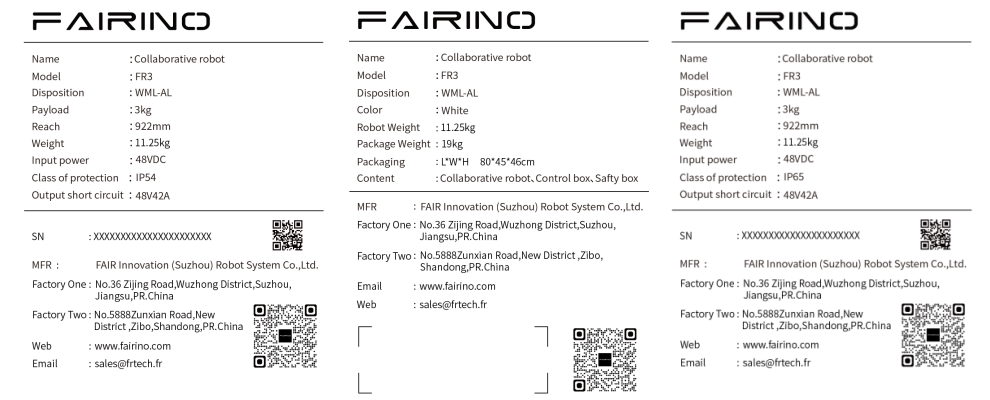

.. centered:: Abbildung 3.1-3 FR3-WML kollaborativer Roboter

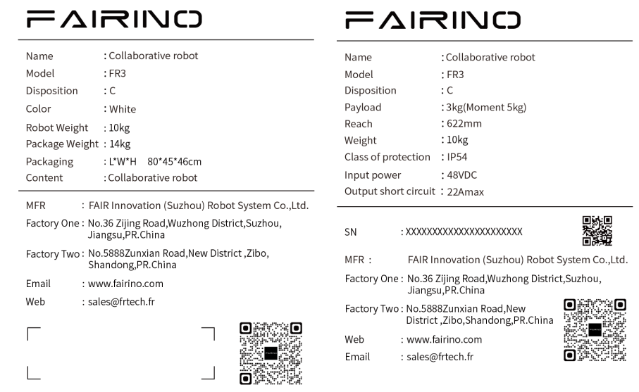

.. centered:: Abbildung 3.1-4 FR3-C kollaborativer Roboter

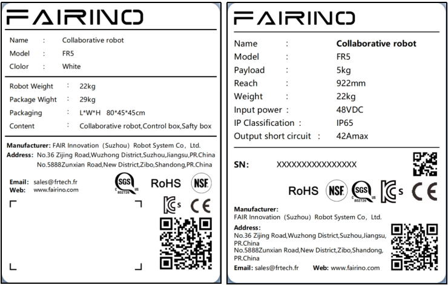

.. centered:: Abbildung 3.1-5 FR5 kollaborativer Roboter

.. figure:: installation/128.png
	:align: center
	:width: 6in

.. centered:: Abbildung 3.1-6 FR5-C Modell Kollaborativer Roboter

.. figure:: installation/126.png
	:align: center
	:width: 6in

.. centered:: Abbildung 3.1-7 FR5-WML kollaborativer Roboter

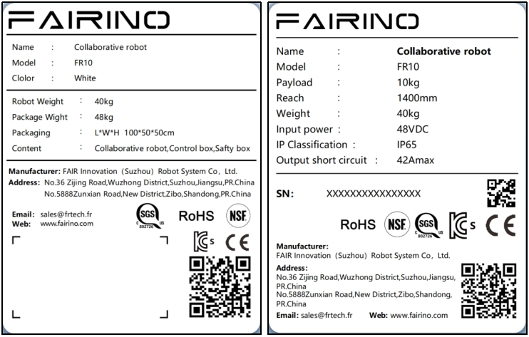

.. centered:: Abbildung 3.1-8 FR10 kollaborativer Roboter

.. figure:: installation/005.png
	:align: center
	:width: 6in

.. centered:: Abbildung 3.1-9 FR16 kollaborativer Roboter

.. figure:: installation/006.png
	:align: center
	:width: 6in

.. centered:: Abbildung 3.1-10 FR20 kollaborativer Roboter

.. figure:: installation/007.png
	:align: center
	:width: 6in

.. centered:: Abbildung 3.1-11 FR30 kollaborativer Roboter

Gültigkeit und Verantwortung
~~~~~~~~~~~~~~~~~~~~~~~~~~~~~~~~~~~~~

Die Informationen in diesem Handbuch umfassen nicht die Planung, Installation und den Betrieb einer vollständigen Roboteranwendung und auch nicht alle Peripheriegeräte, die die Sicherheit dieses Gesamtsystems beeinträchtigen könnten. Die Planung und Installation dieses Gesamtsystems muss den Sicherheitsanforderungen entsprechen, die in den Normen und Vorschriften des Landes festgelegt sind, in dem der Roboter installiert wird.

Der Integrator von FAIRINO ist dafür verantwortlich, die Einhaltung der einschlägigen nationalen Gesetze und Vorschriften sicherzustellen und sicherzustellen, dass in der vollständigen Roboteranwendung keine wesentlichen Gefahren bestehen. Dies umfasst unter anderem folgende Punkte:

-   Durchführung einer Risikobewertung für das gesamte Robotersystem.

-   Verbinden der durch die Risikobewertung definierten weiteren Maschinen und zusätzlichen Sicherheitseinrichtungen.

-   Einrichten geeigneter Sicherheitseinstellungen in der Software.

-   Sicherstellen, dass der Benutzer keine Sicherheitsmaßnahmen verändert.

-   Bestätigen, dass das gesamte Robotersystem korrekt geplant und installiert wurde.

-   Klare Formulierung der Bedienungsanleitung.

-   Anbringen der entsprechenden Kennzeichnungen und Kontaktdaten des Integrators am Roboter.

-   Sammeln aller Dokumente in den technischen Unterlagen, einschließlich dieses Handbuchs.

Haftungsbeschränkung
~~~~~~~~~~~~~~~~~~~~~~~~~~~~~~

Alle in diesem Handbuch enthaltenen Sicherheitsinformationen sind nicht als allgemeingültige Sicherheitsgarantie für den Roboter zu betrachten. Selbst bei Beachtung aller Sicherheitshinweise können Personenschäden oder Sachschäden nicht ausgeschlossen werden.

Warnsymbole in diesem Handbuch
~~~~~~~~~~~~~~~~~~~~~~~~~~~~~~~~~~~~~

Die folgenden Symbole definieren die in diesem Handbuch enthaltenen Gefahrenstufen. Dieselben Warnsymbole werden auch am Produkt verwendet.

.. important::
	.. figure:: installation/008.png
		:width: 60
		:height: 50
		:align: left

	GEFAHR: Dies weist auf eine unmittelbar gefährliche elektrische Situation hin, die, wenn sie nicht vermieden wird, zu Tod oder schweren Verletzungen führt.

.. important::
	.. figure:: installation/009.png
		:width: 60
		:height: 50
		:align: left

	GEFAHR ELEKTRISCHER SCHLAG: Dies weist auf eine unmittelbar gefährliche Situation durch elektrischen Schlag hin, die, wenn sie nicht vermieden wird, zu Tod oder schweren Verletzungen durch Stromschlag führen kann.

.. important::
	.. figure:: installation/010.png
		:width: 60
		:height: 50
		:align: left

	GEFAHR HEISSE OBERFLÄCHE: Dies weist auf eine möglicherweise gefährliche heiße Oberfläche hin, die bei Kontakt zu Verletzungen führen kann.

Bewertung vor der Verwendung
~~~~~~~~~~~~~~~~~~~~~~~~~~~~~~~~~~~

Vor der erstmaligen Verwendung des Roboters oder nach jeder Änderung (Standardmäßig ist die Robotergeschwindigkeit auf unter 250 mm/s eingestellt. Melden Sie sich nicht als Administrator an, um die Geschwindigkeit zu ändern und in den Hochgeschwindigkeitsmodus zu wechseln.) müssen die folgenden Tests durchgeführt werden. Stellen Sie sicher, dass alle Sicherheitseingänge und -ausgänge korrekt sind und richtig angeschlossen sind. Testen Sie alle angeschlossenen Sicherheitseingänge und -ausgänge (einschließlich Geräte, die von mehreren Maschinen oder Robotern gemeinsam genutzt werden) auf ihre Funktionstüchtigkeit. Daher müssen Sie:

-   Testen Sie, ob die Not-Halt-Taster und -Eingänge den Roboter stoppen und die Bremsen auslösen.

-   Testen Sie, ob die Schutzeingänge die Roboterbewegung stoppen können. Wenn ein Schutz-Reset konfiguriert ist, prüfen Sie, ob dieser vor der Wiederaufnahme der Bewegung aktiviert werden muss.

-   Testen Sie, ob die Betriebsartenschalter die Betriebsart umschalten können (siehe Symbol oben rechts in der Benutzeroberfläche).

-   Testen Sie, ob die 3-stufige Zustimmtaste gedrückt werden muss, um im Handmodus Bewegungen zu starten, und ob der Roboter dabei geschwindigkeitsreduziert ist (Diese Funktion wird vor der Roboter-Softwareversion V3.0 nicht unterstützt).

-   Testen Sie, ob der System-Not-Halt-Ausgang das Gesamtsystem in einen sicheren Zustand versetzen kann.

Not-Halt
~~~~~~~~~~~~~~~~

Der Not-Halt-Taster bewirkt einen Stopp der Kategorie 0. Durch Drücken des Not-Halt-Tasters wird jegliche Bewegung des Roboters sofort gestoppt.

Die folgende Tabelle zeigt die Stoppdistanzen und Stoppzeiten für einen Stopp der Kategorie 0. Diese Messungen entsprechen der folgenden Konfiguration des Roboters:

-   Reichweite: 100% (Roboterarm vollständig horizontal ausgefahren)

-   Geschwindigkeit: 100% (allgemeine Robotergeschwindigkeit auf 100% eingestellt, Bewegung mit 180°/s Gelenkgeschwindigkeit)

-   Nutzlast: Maximale Nutzlast

Die Tests für Gelenk 1 und Gelenk 6 prüfen die horizontale Bewegung des Roboters (Drehachse senkrecht zum Boden). Die Tests für Gelenk 2, 3, 4 und 5 prüfen den Roboter bei einer vertikalen Bahn (Drehachse parallel zum Boden), wobei der Stopp während der Abwärtsbewegung des Roboters ausgelöst wird.

.. centered:: Tabelle 3.1-1 Stoppdistanz Kategorie 0 (rad)
.. list-table::
   :widths: 10 15 15 15 15 15 15
   :header-rows: 0
   :class: sheet-center

   * -
     - **Gelenk 1**
     - **Gelenk 2**
     - **Gelenk 3**
     - **Gelenk 4**
     - **Gelenk 5**
     - **Gelenk 6**

   * - **FR3**
     - 0.47
     - 0.60
     - 0.56
     - 0.29
     - 0.10
     - 0.06

   * - **FR3-WMS**
     - 0.47
     - 0.60
     - 0.56
     - 0.29
     - 0.10
     - 0.06

   * - **FR3-WML**
     - 0.51
     - 0.63
     - 0.60
     - 0.33
     - 0.16
     - 0.10

   * - **FR3-C**
     - 0.47
     - 0.60
     - 0.56
     - 0.29
     - 0.10
     - 0.06

   * - **FR5**
     - 0.51
     - 0.63
     - 0.60
     - 0.33
     - 0.16
     - 0.10

   * - **FR5-C**
     - 0.51
     - 0.63
     - 0.60
     - 0.33
     - 0.16
     - 0.10

   * - **FR10**
     - 0.64
     - 0.70
     - 0.69
     - 0.42
     - 0.25
     - 0.13

   * - **FR16**
     - 0.60
     - 0.67
     - 0.65
     - 0.39
     - 0.22
     - 0.12

   * - **FR20**
     - 0.69
     - 0.75
     - 0.80
     - 0.48
     - 0.31
     - 0.22

.. centered:: Tabelle 3.1-2 Stoppzeit Kategorie 0 (ms)
.. list-table::
   :widths: 10 15 15 15 15 15 15
   :header-rows: 0
   :class: sheet-center

   * -
     - **Gelenk 1**
     - **Gelenk 2**
     - **Gelenk 3**
     - **Gelenk 4**
     - **Gelenk 5**
     - **Gelenk 6**

   * - **FR3**
     - 400
     - 470
     - 450
     - 280
     - 120
     - 90

   * - **FR3-WMS**
     - 400
     - 470
     - 450
     - 280
     - 120
     - 90

   * - **FR3-WML**
     - 400
     - 470
     - 450
     - 280
     - 120
     - 90

   * - **FR3-C**
     - 400
     - 470
     - 450
     - 280
     - 120
     - 90

   * - **FR5**
     - 420
     - 500
     - 480
     - 310
     - 150
     - 120

   * - **FR5-C**
     - 420
     - 500
     - 480
     - 310
     - 150
     - 120

   * - **FR10**
     - 460
     - 540
     - 510
     - 330
     - 170
     - 140

   * - **FR16**
     - 440
     - 530
     - 490
     - 320
     - 160
     - 130

   * - **FR20**
     - 540
     - 600
     - 700
     - 400
     - 260
     - 170

Nach einem Not-Halt schalten Sie die Spannungsversorgung aus, entriegeln Sie den Not-Halt-Taster (drehen Sie ihn), schalten Sie die Spannungsversorgung wieder ein, um den Roboter neu zu starten.

Die Stoppzeiten und Stoppdistanzen für den Sicherheitsstopp und den Software-Endschalter-Stopp des Roboters sind in der folgenden Tabelle aufgeführt. Diese Messungen entsprechen der folgenden Konfiguration des Roboters:

-   Reichweite: 100% (Roboterarm vollständig horizontal ausgefahren)

-   Geschwindigkeit: 100% (allgemeine Robotergeschwindigkeit auf 100% eingestellt, Bewegung mit 180°/s Gelenkgeschwindigkeit)

-   Nutzlast: Maximale Nutzlast

Die Tests für Gelenk 1 und Gelenk 6 prüfen die horizontale Bewegung des Roboters (Drehachse senkrecht zum Boden). Die Tests für Gelenk 2, 3, 4 und 5 prüfen den Roboter bei einer vertikalen Bahn (Drehachse parallel zum Boden), wobei der Stopp während der Abwärtsbewegung des Roboters ausgelöst wird.

.. centered:: Tabelle 3.1-3 Sicherheitsstopp-Distanz (rad)
.. list-table::
   :widths: 10 15 15 15 15 15 15
   :header-rows: 0
   :class: sheet-center

   * -
     - **Gelenk 1**
     - **Gelenk 2**
     - **Gelenk 3**
     - **Gelenk 4**
     - **Gelenk 5**
     - **Gelenk 6**

   * - **FR3**
     - 0.49
     - 0.63
     - 0.58
     - 0.32
     - 0.12
     - 0.09

   * - **FR3-WMS**
     - 0.49
     - 0.63
     - 0.58
     - 0.32
     - 0.12
     - 0.09

   * - **FR3-WML**
     - 0.54
     - 0.65
     - 0.63
     - 0.35
     - 0.19
     - 0.12

   * - **FR3-C**
     - 0.49
     - 0.63
     - 0.58
     - 0.32
     - 0.12
     - 0.09

   * - **FR5**
     - 0.54
     - 0.65
     - 0.63
     - 0.35
     - 0.19
     - 0.12

   * - **FR5-C**
     - 0.54
     - 0.65
     - 0.63
     - 0.35
     - 0.19
     - 0.12

   * - **FR10**
     - 0.66
     - 0.73
     - 0.71
     - 0.45
     - 0.27
     - 0.14

   * - **FR16**
     - 0.63
     - 0.69
     - 0.68
     - 0.41
     - 0.25
     - 0.14

   * - **FR20**
     - 0.71
     - 0.78
     - 0.82
     - 0.51
     - 0.33
     - 0.25

.. centered:: Tabelle 3.1-4 Sicherheitsstopp-Zeit (ms)
.. list-table::
   :widths: 10 15 15 15 15 15 15
   :header-rows: 0
   :class: sheet-center

   * -
     - **Gelenk 1**
     - **Gelenk 2**
     - **Gelenk 3**
     - **Gelenk 4**
     - **Gelenk 5**
     - **Gelenk 6**

   * - **FR3**
     - 410
     - 490
     - 410
     - 300
     - 130
     - 110

   * - **FR3-WMS**
     - 410
     - 490
     - 410
     - 300
     - 130
     - 110

   * - **FR3-WML**
     - 410
     - 490
     - 410
     - 300
     - 130
     - 110

   * - **FR3-C**
     - 410
     - 490
     - 410
     - 300
     - 130
     - 110

   * - **FR5**
     - 450
     - 520
     - 510
     - 330
     - 180
     - 140

   * - **FR5-C**
     - 450
     - 520
     - 510
     - 330
     - 180
     - 140

   * - **FR10**
     - 480
     - 570
     - 530
     - 360
     - 190
     - 170

   * - **FR16**
     - 470
     - 550
     - 520
     - 340
     - 190
     - 150

   * - **FR20**
     - 560
     - 630
     - 720
     - 430
     - 280
     - 200

.. centered:: Tabelle 3.1-5 Distanz Software-Endschalter-Stopp (rad)
.. list-table::
   :widths: 10 15 15 15 15 15 15
   :header-rows: 0
   :class: sheet-center

   * -
     - **Gelenk 1**
     - **Gelenk 2**
     - **Gelenk 3**
     - **Gelenk 4**
     - **Gelenk 5**
     - **Gelenk 6**

   * - **FR3**
     - 0.52
     - 0.65
     - 0.61
     - 0.34
     - 0.15
     - 0.11

   * - **FR3-WMS**
     - 0.52
     - 0.65
     - 0.61
     - 0.34
     - 0.15
     - 0.11

   * - **FR3-WML**
     - 0.56
     - 0.68
     - 0.65
     - 0.38
     - 0.21
     - 0.15

   * - **FR3-C**
     - 0.52
     - 0.65
     - 0.61
     - 0.34
     - 0.15
     - 0.11

   * - **FR5**
     - 0.56
     - 0.68
     - 0.65
     - 0.38
     - 0.21
     - 0.15

   * - **FR5-C**
     - 0.56
     - 0.68
     - 0.65
     - 0.38
     - 0.21
     - 0.15

   * - **FR10**
     - 0.69
     - 0.75
     - 0.74
     - 0.47
     - 0.30
     - 0.18

   * - **FR16**
     - 0.65
     - 0.72
     - 0.70
     - 0.44
     - 0.27
     - 0.17

   * - **FR20**
     - 0.74
     - 0.80
     - 0.85
     - 0.53
     - 0.36
     - 0.27

.. centered:: Tabelle 3.1-6 Zeit Software-Endschalter-Stopp (ms)
.. list-table::
   :widths: 10 15 15 15 15 15 15
   :header-rows: 0
   :class: sheet-center

   * -
     - **Gelenk 1**
     - **Gelenk 2**
     - **Gelenk 3**
     - **Gelenk 4**
     - **Gelenk 5**
     - **Gelenk 6**

   * - **FR3**
     - 430
     - 500
     - 430
     - 310
     - 150
     - 120

   * - **FR3-WMS**
     - 430
     - 500
     - 430
     - 310
     - 150
     - 120

   * - **FR3-WML**
     - 430
     - 500
     - 430
     - 310
     - 150
     - 120

   * - **FR3-C**
     - 430
     - 500
     - 430
     - 310
     - 150
     - 120

   * - **FR5**
     - 460
     - 540
     - 520
     - 350
     - 190
     - 160

   * - **FR5-C**
     - 460
     - 540
     - 520
     - 350
     - 190
     - 160

   * - **FR10**
     - 500
     - 580
     - 550
     - 370
     - 210
     - 180

   * - **FR16**
     - 480
     - 570
     - 530
     - 360
     - 200
     - 170

   * - **FR20**
     - 580
     - 640
     - 740
     - 440
     - 300
     - 210

.. important::
	Not-Halt-Einrichtungen sind gemäß IEC 60204-1 und ISO 13850 keine Schutzeinrichtungen. Sie sind ergänzende Schutzmaßnahmen und dienen nicht der Verhütung von Verletzungen.

Bewegen ohne elektrischen Antrieb
~~~~~~~~~~~~~~~~~~~~~~~~~~~~~~~~~~~~~

Sollte der Fall eintreten, dass ein Roboter-Gelenk bewegt werden muss, aber der Roboter nicht mit Strom versorgt werden kann, oder in anderen Notfällen, wenden Sie sich bitte an Ihren Roboterhändler. Gegebenenfalls kann es notwendig sein, den Roboter mit Gewalt zu bewegen, um eine eingeklemmte Person zu befreien.

Gerätetransport
-----------------------

Transport
~~~~~~~~~~

Roboter und Steuerschrank sind als Einheit kalibriert. Trennen Sie sie nicht, da dies eine Neukalibrierung erforderlich machen würde.

Der Roboter sollte nur in der Originalverpackung transportiert werden. Bewahren Sie das Verpackungsmaterial an einem trockenen Ort auf, falls der Roboter später noch einmal bewegt werden muss.

Beim Bewegen des Roboters von der Verpackung zum Installationsort stützen Sie beide Armglieder gleichzeitig ab. Halten Sie den Roboter fest, bis alle Montageschrauben des Roboterfußes fest angezogen sind.

Handhabung
~~~~~~~~~~

Das Gesamtgewicht (inkl. Verpackung) der kollaborativen Roboter variiert je nach Modell zwischen 15 kg und 80 kg. Beim manuellen Heben oder Umsetzen des Roboters ist die Hilfe mehrerer Personen erforderlich. Ein Transport durch eine einzelne Person wird nicht empfohlen. Achten Sie beim Transport auf Stabilität, um ein Umkippen oder Herunterfallen des Geräts zu vermeiden.

.. warning::
	- Wird für den Transport professionelles Hebezeug verwendet, muss dieses von qualifiziertem Fachpersonal mit entsprechenden Kenntnissen (z. B. Kran oder Gabelstapler) bedient werden, andernfalls kann es zu Verletzungen oder anderen Unfällen kommen.
	- Bei manuellem Transport achten Sie auf die Sicherheit der beteiligten Personen.
	- Der kollaborative Roboter enthält Präzisionsteile. Starke Vibrationen oder Erschütterungen während des Transports oder Umsetzens sollten vermieden werden, da dies die Leistung des Geräts beeinträchtigen könnte.

Lagerung
~~~~~~~~~~

Der kollaborative Roboter sollte in einer Umgebung mit -25 bis 60 °C und ohne Reifbildung gelagert werden.

Wartung, Inspektion, Entsorgung
---------------------------------------

Wartungshandhabung
~~~~~~~~~~~~~~~~~~~~~~~~~~~~~~

Der Benutzer sollte den Not-Halt und den Schutzhalt monatlich überprüfen. Prüfen Sie, ob die Sicherheitsfunktionen wirksam sind.
Hinweise zum Anschluss von Not-Halt und Schutzhalt finden Sie im Kapitel Verdrahtung.

Inspektionshandbuch
~~~~~~~~~~~~~~~~~~~~~~~~~~~~~~

Vorwort
+++++++++++

Sicherheitshinweise
****************************

In diesem Handbuch werden die folgenden Warnhinweise verwendet. Diese Warnhinweise dienen der Sicherheit von Personen und Geräten. Beim Lesen dieses Handbuchs ist es sehr wichtig, alle Montageanweisungen und Richtlinien in den anderen Kapiteln dieses Handbuchs zu beachten und zu befolgen.

Besondere Aufmerksamkeit sollte den Texten gelten, die mit Warnsymbolen versehen sind. Bitte lesen Sie das Benutzerhandbuch vor der Verwendung sorgfältig durch. Dieses Handbuch dient nur als Wartungsleitfaden für den Kunden. Das Wartungspersonal muss über die erforderliche Fachkompetenz verfügen. Für Schäden, die durch nicht qualifiziertes Personal verursacht werden, lehnt FAIRINO jede Haftung ab.

.. note:: Wenn der Roboter (Roboterarm, Steuerschrank, Teach Pendant) durch menschliches Verschulden beschädigt, verändert oder modifiziert wird, lehnt FAIRINO jede Haftung ab. FAIRINO übernimmt keine Haftung für Schäden am Roboter oder anderen Geräten, die durch fehlerhafte, vom Kunden erstellte Programme verursacht werden.

Gültigkeit und Verantwortung
************************************

Die Informationen in diesem Handbuch umfassen nicht die Planung, Installation und den Betrieb einer vollständigen Roboteranwendung und auch nicht alle Peripheriegeräte, die die Sicherheit dieses Gesamtsystems beeinträchtigen könnten. Die Planung und Installation dieses Gesamtsystems muss den Sicherheitsanforderungen entsprechen, die in den Normen und Vorschriften des Landes festgelegt sind, in dem der Roboter installiert wird.

Der Integrator von FAIRINO ist dafür verantwortlich, die Einhaltung der einschlägigen nationalen Gesetze und Vorschriften sicherzustellen und sicherzustellen, dass in der vollständigen Roboteranwendung keine wesentlichen Gefahren bestehen. Dies umfasst unter anderem folgende Punkte:

-   Durchführung einer Risikobewertung für das gesamte Robotersystem.
-   Verbinden der durch die Risikobewertung definierten weiteren Maschinen und zusätzlichen Sicherheitseinrichtungen.
-   Einrichten geeigneter Sicherheitseinstellungen in der Software.
-   Sicherstellen, dass der Benutzer keine Sicherheitsmaßnahmen verändert.
-   Bestätigen, dass das gesamte Robotersystem korrekt geplant und installiert wurde.
-   Klare Formulierung der Bedienungsanleitung.
-   Anbringen der entsprechenden Kennzeichnungen und Kontaktdaten des Integrators am Roboter.
-   Sammeln aller Dokumente in den technischen Unterlagen, einschließlich dieses Handbuchs.

Haftungsbeschränkung
************************************

Alle in diesem Handbuch enthaltenen Sicherheitsinformationen sind nicht als allgemeingültige Sicherheitsgarantie für den Roboter zu betrachten. Selbst bei Beachtung aller Sicherheitshinweise können Personenschäden oder Sachschäden nicht ausgeschlossen werden.

Warnsymbole
***********************

Die folgenden Symbole definieren die in diesem Handbuch enthaltenen Gefahrenstufen. Dieselben Warnsymbole werden auch am Produkt verwendet.

.. note::
   .. image:: installation/070.png
      :height: 0.75in
      :align: left

   Bezeichnung: **GEFAHR**

   Bedeutung: Dies weist auf eine unmittelbar gefährliche elektrische Situation hin, die, wenn sie nicht vermieden wird, zu Tod oder schweren Verletzungen führt.

.. note::
   .. image:: installation/071.png
      :height: 0.75in
      :align: left

   Bezeichnung: **GEFAHR ELEKTRISCHER SCHLAG**

   Bedeutung: Dies weist auf eine unmittelbar gefährliche Situation durch elektrischen Schlag hin, die, wenn sie nicht vermieden wird, zu Tod oder schweren Verletzungen durch Stromschlag führen kann.

.. note::
   .. image:: installation/072.png
      :height: 0.75in
      :align: left

   Bezeichnung: **GEFAHR HEISSE OBERFLÄCHE**

   Bedeutung: Dies weist auf eine möglicherweise gefährliche heiße Oberfläche hin, die bei Kontakt zu Verletzungen führen kann.

Erläuterung der digitalen Ein- und Ausgänge des Steuerschranks
~~~~~~~~~~~~~~~~~~~~~~~~~~~~~~~~~~~~~~~~~~~~~~~~~~~~~~~~~~~~~~~~~~~~~~~~

Hinweise zum Umschalten der digitalen Ein-/Ausgangsfunktionen
++++++++++++++++++++++++++++++++++++++++++++++++++++++++++++++++++++++++++++++

.. important::

  (1) Beim Umschalten der digitalen Ein-/Ausgangsfunktionen sind die Sicherheitsvorschriften für den Roboterbetrieb einzuhalten, um die Sicherheit von Bedienern und Geräten zu gewährleisten.
  (2) Vermeiden Sie ein Umschalten der digitalen Ein-/Ausgangsfunktionen während des Roboterbetriebs, um den normalen Betrieb nicht zu beeinträchtigen.
  (3) Vor dem Umschalten der digitalen Ein-/Ausgangsfunktionen muss die Spannungsversorgung des Roboters unterbrochen werden, um Stromschläge und unerwartete Roboterbewegungen zu verhindern, die zu Verletzungen oder Geräteschäden führen könnten.
  (4) Vor dem Funktionswechsel müssen die Anforderungen der Robotersteuerung an die digitalen Ein-/Ausgänge geklärt sein, einschließlich Signaltyp, Spannungspegel, Lastfähigkeit usw.
  (5) Stellen Sie sicher, dass die digitalen Ein-/Ausgangsports korrekt mit den externen Geräten verbunden sind, einschließlich fester Verdrahtung und passender Ports.
  (6) Vermeiden Sie doppelte Signalzuweisungen. Stellen Sie sicher, dass jedes Signal eindeutig zugewiesen ist.
  (7) Nach der Zuweisung muss die Robotersteuerung neu gestartet werden, damit die Einstellungen wirksam werden.
  (8) Überprüfen Sie nach Abschluss der Konfiguration im I/O-Statusbildschirm, ob der Status der digitalen Ein-/Ausgangssignale korrekt ist.
  (9) Überprüfen Sie durch praktische Tests oder die Erstellung von Testprogrammen, ob die digitalen Ein-/Ausgangsfunktionen ordnungsgemäß arbeiten.
  (10) Wenn die digitalen Ein-/Ausgangssignale mit der Programmlogik verknüpft sind, überprüfen Sie, ob die Behandlung dieser Signale im Programm korrekt ist.

Erläuterung der digitalen Eingänge des Steuerschranks
+++++++++++++++++++++++++++++++++++++++++++++++++++++++++++++++++++

Zusammenfassung der digitalen Eingänge des Steuerschranks
***************************************************************

Nachfolgend sind die Eingangstypen aufgeführt, die von den digitalen Eingängen des integrierten Mini-Steuerschranks von FAIRINO unterstützt werden, sowie die entsprechenden Anschlussbilder und die Konfigurationstabelle.

.. figure:: installation/080.png
	:align: center
	:width: 4in

.. centered:: Abbildung 3.3-1 Gültiger Zustand der Eingänge DI0-DI7

.. centered:: Tabelle 3.3-1 Konfigurationstabelle für digitale Eingänge des Steuerschranks

.. list-table::
   :widths: 15 15 35 10 10 10 10
   :header-rows: 0
   :align: center

   * - **Steuerschranktyp**
     - **Eingangstyp**
     - **Anschlussbild**
     - **High-Aktiv (Schalter geschlossen)**
     - **High-Aktiv (Schalter offen)**
     - **Low-Aktiv (Schalter geschlossen)**
     - **Low-Aktiv (Schalter offen)**

   * - Gleichstrom-Steuerschrank
     - NPN-Ausgang
     - .. figure:: installation/081.png
          :align: center
          :width: 3in
     - Ungültig
     - Gültig
     - Gültig
     - Ungültig

   * - Wechselstrom-Schmalbereich-Steuerschrank
     - NPN-Ausgang
     - .. figure:: installation/082.png
          :align: center
          :width: 3in
     - Ungültig
     - Gültig
     - Gültig
     - Ungültig

   * - Wechselstrom-Weitbereich-Steuerschrank
     - NPN-Ausgang
     - .. figure:: installation/083.png
          :align: center
          :width: 3in
     - Ungültig
     - Gültig
     - Gültig
     - Ungültig

   * - Wechselstrom-Weitbereich-Steuerschrank
     - PNP-Ausgang
     - .. figure:: installation/084.png
          :align: center
          :width: 3in
     - Ungültig
     - Gültig
     - Gültig
     - Ungültig

Unterstützte Typen für digitale Eingänge des Steuerschranks
**************************************************************

Die digitalen Eingänge des Gleichstrom-Steuerschranks und des Wechselstrom-Schmalbereich-Steuerschranks unterstützen nur NPN-Eingänge. Die digitalen Eingänge des Wechselstrom-Weitbereich-Steuerschranks unterstützen wahlweise NPN- und PNP-Eingänge, werksseitig standardmäßig auf NPN eingestellt.

.. list-table::
   :widths: 50 50
   :header-rows: 0
   :align: center

   * - **Steuerschranktyp**
     - **Eingangstyp**

   * - Gleichstrom-Steuerschrank
     - NPN-Eingang

   * - Wechselstrom-Schmalbereich-Steuerschrank
     - NPN-Eingang

   * - Wechselstrom-Weitbereich-Steuerschrank
     - NPN-Eingang/PNP-Eingang

Anschlussbilder für digitale Eingänge des Steuerschranks
************************************************************

Die digitalen Eingänge des Gleichstrom-Steuerschranks und des Wechselstrom-Schmalbereich-Steuerschranks unterstützen nur NPN-Eingänge. Das Anschlussbild ist wie folgt.

	.. figure:: installation/085.png
		:align: center
		:width: 6in

	.. centered:: Abbildung 3.3-2 Anschlussbild für digitale Eingänge des Gleichstrom- und Wechselstrom-Schmalbereich-Steuerschranks

Die digitalen Eingänge des Wechselstrom-Weitbereich-Steuerschranks unterstützen wahlweise NPN und PNP, werksseitig standardmäßig auf NPN eingestellt. Die Anschlussbilder sind wie folgt:

.. list-table::
   :widths: 50 50
   :header-rows: 0
   :align: center

   * - **Eingangstyp**
     - **Anschlussbild**

   * - NPN-Eingang
     - .. figure:: installation/086.png
          :align: center
          :width: 3in

   * - PNP-Eingang
     - .. figure:: installation/087.png
          :align: center
          :width: 3in

Der Eingangstyp der digitalen Eingänge des Weitbereich-Steuerschranks wird durch den internen DIP-Schalter des Steuerschranks bestimmt. Wenn der Benutzer den Eingangstyp ändern möchte, muss der DIP-Schalter in die entsprechende Position gebracht werden.

.. list-table::
   :widths: 30 30 40
   :header-rows: 0
   :align: center

   * -
     - **DIP-Schalter Position**
     - **Physische Position des DIP-Schalters**

   * - NPN-Eingang
     - EX-24V
     - .. figure:: installation/088.png
          :align: center
          :width: 3in

   * - PNP-Eingang
     - EX-0V
     - .. figure:: installation/089.png
          :align: center
          :width: 3in

Softwareeinstellungen für digitale Eingänge des Steuerschranks
******************************************************************

Der einzige softwarebezogene Einstellungspunkt für die digitalen Eingänge ist der "Gültige Zustand der Eingänge DI0-DI7". Dieser legt den digitalen Spannungspegel fest, der einem erkannten gültigen Eingang entspricht. Diese Einstellung ermöglicht dem Benutzer eine flexiblere Nutzung der digitalen Eingänge.

	.. figure:: installation/090.png
		:align: center
		:width: 6in

  .. centered:: Abbildung 3.3-3 Gültiger Zustand der Eingänge DI0-DI7

Die folgende Tabelle zeigt die von der Software erkannten gültigen Zustände bei unterschiedlichen Einstellungen von "Gültiger Zustand der Eingänge DI0-DI7" und verschiedenen Zuständen des externen Schalters am digitalen Eingang:

.. centered:: Tabelle 3.3-2 Vergleichstabelle der gültigen Zustände

.. list-table::
   :widths: 15 15 15 15 15 15
   :header-rows: 0
   :align: center

   * - **Steuerschranktyp**
     - **Eingangstyp**
     - **High-Aktiv (Schalter geschlossen)**
     - **High-Aktiv (Schalter offen)**
     - **Low-Aktiv (Schalter geschlossen)**
     - **Low-Aktiv (Schalter offen)**

   * - Gleichstrom-Steuerschrank
     - NPN-Eingang
     - Ungültig
     - Gültig
     - Gültig
     - Ungültig

   * - Wechselstrom-Schmalbereich-Steuerschrank
     - NPN-Eingang
     - Ungültig
     - Gültig
     - Gültig
     - Ungültig

   * - Wechselstrom-Weitbereich-Steuerschrank
     - NPN-Eingang
     - Ungültig
     - Gültig
     - Gültig
     - Ungültig

   * - Wechselstrom-Weitbereich-Steuerschrank
     - PNP-Eingang
     - Ungültig
     - Gültig
     - Gültig
     - Ungültig

Erläuterung der digitalen Ausgänge des Steuerschranks
++++++++++++++++++++++++++++++++++++++++++++++++++++++++++++++++++++++

Zusammenfassung der digitalen Ausgänge des Steuerschranks
***************************************************************

Nachfolgend sind die Ausgangstypen aufgeführt, die von den digitalen Ausgängen des integrierten Mini-Steuerschranks von FAIRINO unterstützt werden, sowie die entsprechenden Anschlussbilder und die Konfigurationstabelle.

.. figure:: installation/091.png
	:align: center
	:width: 4in

.. centered:: Abbildung 3.3-4 DO-Ausgang des Steuerschranks während des Einschaltvorgangs

.. centered:: Tabelle 3.3-3 Konfigurationstabelle für digitale Ausgänge des Steuerschranks

.. list-table::
   :widths: 10 10 30 10 10 10 10
   :header-rows: 0
   :align: center

   * - **Steuerschranktyp**
     - **Ausgangstyp**
     - **Anschlussbild**
     - **High-Pegel (Schalter EIN)**
     - **High-Pegel (Schalter AUS)**
     - **Low-Pegel (Schalter EIN)**
     - **Low-Pegel (Schalter AUS)**

   * - Gleichstrom-Steuerschrank
     - NPN-Ausgang
     - .. figure:: installation/093.png
          :align: center
          :width: 3in
     - Gültig
     - Gültig
     - Ungültig
     - Ungültig

   * - Wechselstrom-Schmalbereich-Steuerschrank
     - NPN-Ausgang
     - .. figure:: installation/094.png
          :align: center
          :width: 3in
     - Gültig
     - Gültig
     - Ungültig
     - Ungültig

   * - Wechselstrom-Weitbereich-Steuerschrank
     - NPN-Ausgang
     - .. figure:: installation/095.png
          :align: center
          :width: 3in
     - Gültig
     - Gültig
     - Ungültig
     - Ungültig

   * - Wechselstrom-Weitbereich-Steuerschrank
     - PNP-Ausgang
     - .. figure:: installation/096.png
          :align: center
          :width: 3in
     - Gültig
     - Gültig
     - Ungültig
     - Ungültig

.. figure:: installation/092.png
  :align: center
  :width: 4in

.. centered:: Abbildung 3.3-5 Gültiger Zustand der Ausgänge DO0-D07

.. centered:: Tabelle 3.3-4 Konfigurationstabelle für digitale Ausgänge des Steuerschranks

.. list-table::
   :widths: 10 10 30 10 10 10 10
   :header-rows: 0
   :align: center

   * - **Steuerschranktyp**
     - **Ausgangstyp**
     - **Anschlussbild**
     - **High-Aktiv (Schalter EIN)**
     - **High-Aktiv (Schalter AUS)**
     - **Low-Aktiv (Schalter EIN)**
     - **Low-Aktiv (Schalter AUS)**

   * - Gleichstrom-Steuerschrank
     - NPN-Ausgang
     - .. figure:: installation/093.png
          :align: center
          :width: 3in
     - Gültig
     - Ungültig
     - Ungültig
     - Gültig

   * - Wechselstrom-Schmalbereich-Steuerschrank
     - NPN-Ausgang
     - .. figure:: installation/094.png
          :align: center
          :width: 3in
     - Gültig
     - Ungültig
     - Ungültig
     - Gültig

   * - Wechselstrom-Weitbereich-Steuerschrank
     - NPN-Ausgang
     - .. figure:: installation/095.png
          :align: center
          :width: 3in
     - Gültig
     - Ungültig
     - Ungültig
     - Gültig

   * - Wechselstrom-Weitbereich-Steuerschrank
     - PNP-Ausgang
     - .. figure:: installation/096.png
          :align: center
          :width: 3in
     - Gültig
     - Ungültig
     - Ungültig
     - Gültig

Unterstützte Typen für digitale Ausgänge des Steuerschranks
****************************************************************

Die digitalen Ausgänge des Gleichstrom-Steuerschranks und des Wechselstrom-Schmalbereich-Steuerschranks unterstützen nur NPN-Ausgänge. Die digitalen Ausgänge des Wechselstrom-Weitbereich-Steuerschranks unterstützen wahlweise NPN- und PNP-Ausgänge. Die Ausgänge sind als Gegentaktstufe (Push-Pull) ausgeführt. Es ist nur der entsprechende Anschlussplan zu befolgen, eine spezielle Einstellung ist nicht erforderlich.

.. list-table::
   :widths: 50 50
   :header-rows: 0
   :align: center

   * - **Steuerschranktyp**
     - **Ausgangstyp**

   * - Gleichstrom-Steuerschrank
     - NPN-Ausgang

   * - Wechselstrom-Schmalbereich-Steuerschrank
     - NPN-Ausgang

   * - Weitspannungs-Wechselstrom-Steuerkasten
     - NPN-Ausgang / PNP-Ausgang

Anschlussbilder für digitale Ausgänge des Steuerschranks
************************************************************

Die digitalen Ausgänge des Gleichstrom-Steuerschranks und des Wechselstrom-Schmalbereich-Steuerschranks unterstützen nur NPN-Ausgänge. Das Anschlussbild ist wie folgt.

	.. figure:: installation/097.png
		:align: center
		:width: 6in

	.. centered:: Abbildung 3.3-6 Anschlussbild für digitale Ausgänge des Gleichstrom- und Wechselstrom-Schmalbereich-Steuerschranks

Die digitalen Ausgänge des Wechselstrom-Weitbereich-Steuerschranks unterstützen NPN und PNP. Die Anschlussbilder sind wie folgt:

.. list-table::
   :widths: 50 50
   :header-rows: 0
   :align: center

   * - **Ausgangstyp**
     - **Anschlussbild**

   * - NPN-Ausgang
     - .. figure:: installation/098.png
          :align: center
          :width: 3in

   * - PNP-Ausgang
     - .. figure:: installation/099.png
          :align: center
          :width: 3in

Softwareeinstellungen für digitale Ausgänge des Steuerschranks
******************************************************************

Die softwarebezogenen Einstellungspunkte für die digitalen Ausgänge sind "DO-Ausgang des Steuerschranks während des Einschaltvorgangs" und "Gültiger Zustand der Ausgänge DO0-D07". "DO-Ausgang des Steuerschranks während des Einschaltvorgangs" legt den Ausgangspegel während der Einschaltphase fest, bevor die Steuerung vollständig initialisiert ist. Dies kann in Verbindung mit den verschiedenen gültigen Ausgangszuständen genutzt werden, um Situationen zu bewältigen, die während des Einschaltvorgangs besondere Anforderungen an den Ausgangszustand stellen. "Gültiger Zustand der Ausgänge DO0-D07" legt den digitalen Ausgangsspannungspegel fest, der einem gültigen Ausgangszustand entspricht. Diese Einstellung ermöglicht dem Benutzer eine flexiblere Nutzung der digitalen Ausgänge.

(1) Die folgende Tabelle zeigt die gültigen Zustände der digitalen Ausgänge bei verschiedenen Einstellungen von "DO-Ausgang des Steuerschranks während des Einschaltvorgangs":

	.. figure:: installation/100.png
		:align: center
		:width: 6in

	.. centered:: Abbildung 3.3-7 DO-Ausgang des Steuerschranks während des Einschaltvorgangs

.. centered:: Tabelle 3.3-5 Vergleichstabelle der gültigen Zustände

.. list-table::
   :widths: 20 15 15 15 15 15
   :header-rows: 0
   :align: center

   * - **Steuerschranktyp**
     - **Ausgangstyp**
     - **High-Aktiv (Schalter EIN)**
     - **High-Aktiv (Schalter AUS)**
     - **Low-Aktiv (Schalter EIN)**
     - **Low-Aktiv (Schalter AUS)**

   * - Gleichstrom-Steuerschrank
     - NPN-Ausgang
     - Gültig
     - Gültig
     - Ungültig
     - Ungültig

   * - Wechselstrom-Schmalbereich-Steuerschrank
     - NPN-Ausgang
     - Gültig
     - Gültig
     - Ungültig
     - Ungültig

   * - Wechselstrom-Weitbereich-Steuerschrank
     - NPN-Ausgang
     - Gültig
     - Gültig
     - Ungültig
     - Ungültig

   * - Wechselstrom-Weitbereich-Steuerschrank
     - PNP-Ausgang
     - Gültig
     - Gültig
     - Ungültig
     - Ungültig

(2) Die folgende Tabelle zeigt die gültigen Zustände der digitalen Ausgänge bei verschiedenen Einstellungen von "Gültiger Zustand der Ausgänge DO0-D07":

	.. figure:: installation/101.png
		:align: center
		:width: 6in

	.. centered:: Abbildung 3.3-8 Gültiger Zustand der Ausgänge DO0-D07

.. centered:: Tabelle 3.3-6 Vergleichstabelle der gültigen Zustände

.. list-table::
   :widths: 20 15 15 15 15 15
   :header-rows: 0
   :align: center

   * - **Steuerschranktyp**
     - **Ausgangstyp**
     - **High-Aktiv (Schalter EIN)**
     - **High-Aktiv (Schalter AUS)**
     - **Low-Aktiv (Schalter EIN)**
     - **Low-Aktiv (Schalter AUS)**

   * - Gleichstrom-Steuerschrank
     - NPN-Ausgang
     - Gültig
     - Ungültig
     - Ungültig
     - Gültig

   * - Wechselstrom-Schmalbereich-Steuerschrank
     - NPN-Ausgang
     - Gültig
     - Ungültig
     - Ungültig
     - Gültig

   * - Wechselstrom-Weitbereich-Steuerschrank
     - NPN-Ausgang
     - Gültig
     - Ungültig
     - Ungültig
     - Gültig

   * - Wechselstrom-Weitbereich-Steuerschrank
     - PNP-Ausgang
     - Gültig
     - Ungültig
     - Ungültig
     - Gültig

Sicherheitshandbuch für den Gleichstrom-Steuerschrank-Stromanschluss
++++++++++++++++++++++++++++++++++++++++++++++++++++++++++++++++++++++++++++++++++++++++++++++++++++++++++++++++

Klemmen-Definition und -Kennzeichnung
************************************************************************************
Die Vorderseite des Gleichstrom-Steuerschranks ist mit einem 3-poligen Stromanschluss ausgestattet, der jeweils dem Strom-Plus (+V), Strom-Minus (-V) und Schutzleiter (PE) entspricht. Um Geräteschäden durch falschen Anschluss zu vermeiden, beachten Sie bitte strikt die folgende Tabelle:

.. list-table::
   :widths: 15 10 35 35
   :header-rows: 0
   :align: center

   * - **Klemmenkennzeichnung** 
     - **Farbstandard**
     - **Funktionsdefinition**
     - **Streng verboten**

   * - 	.. figure:: installation/144.png
          :align: center
          :width: 1in
     - Rot
     - Gleichstrom-Plus-Eingang, nur für 30-60VDC-Plus-Kabel
     - Kurzschluss mit PE oder -V streng verboten

   * - 	.. figure:: installation/145.png
          :align: center
          :width: 1in
     - Schwarz
     - Gleichstrom-Minus-Eingang, nur für 30-60VDC-Minus-Kabel, bildet den Stromversorgungskreis
     - Verbindung mit Gehäuse oder PE streng verboten

   * - 	.. figure:: installation/146.png
          :align: center
          :width: 1in
     - Gelb (Gelb-Grün)
     - Schutzleiterklemme (Gehäusesicherheitserde)
     - Verwendung als Strom-Minus oder -Plus streng verboten

.. warning::
  Warnung vor schwerwiegenden Risiken: Dieses Gerät verfügt nicht über eingebaute Verpolungs-, Verwechslungs- oder Überspannungsschutzschaltungen. Jede der folgenden unzulässigen Handlungen wird die interne Hauptplatine und die Leistungskomponenten sofort durchschlagen und zu einem permanenten, irreversiblen Durchbrennen des Geräts führen:
  
  1. Verpolung (+V- und -V-Kabel vertauscht);
  2. +V oder -V versehentlich in die PE-Bohrung eingesteckt;
  3. Minusklemme versehentlich geerdet (-V mit PE kurzgeschlossen);
  4. Anschluss an Wechselstrom (110V/220V/380V) oder Gleichspannung außerhalb des Bereichs 30~60Vdc.

Sicherheitsvorbereitungen vor dem Anschluss
*************************************************************************

Vor dem Anschluss müssen die Bediener die folgenden Vorbereitungen abschließen:

Bestätigung der Spannungsfreiheit
""""""""""""""""""""""""""""""""""""""""""""""""""""""""""""""""""""""""""""""

Die vorgelagerte Stromversorgung vollständig abschalten und ein Sicherheitswarnschild anbringen. Mit einem Multimeter die Stromanschlussklemmen prüfen, um sicherzustellen, dass keine Spannung oder Restladung vorhanden ist. Niemals bei eingeschalteter Spannung anschließen.

Geräteprüfung
""""""""""""""""""""""""""""""""""""""""""""""""""""""""""""""""""""""""""""""

Prüfen, ob die Geräteklemmen nicht beschädigt, oxidiert oder locker sind, und ob das Gerät nicht feucht, wasserdurchtränkt oder stoßbeschädigt ist, um sicherzustellen, dass das Gerät in einwandfreiem Zustand ist.

Bestätigung der Stromversorgung
""""""""""""""""""""""""""""""""""""""""""""""""""""""""""""""""""""""""""""""

Bestätigen, dass die vorgelagerte Stromversorgung eine 30-60VDC geregelte Gleichstromversorgung ist. Der Anschluss an Wechselstrom 110V/220V/380V, Gleichstrom unter 30VDC oder über 60VDC ist streng verboten.

Kabelauswahl
""""""""""""""""""""""""""""""""""""""""""""""""""""""""""""""""""""""""""""""

Es wird empfohlen, flexible Kupferleitungen mit 4mm² (AWG11) oder größer zu verwenden. Die Länge eines einzelnen Stromkabels sollte 2 Meter nicht überschreiten. Verwenden Sie keine Kabel mit zu geringem Querschnitt, beschädigter Isolierung oder gealterten Kabeln.

Auswahl der Kabelanschlüsse
""""""""""""""""""""""""""""""""""""""""""""""""""""""""""""""""""""""""""""""

Die Enden der Kabel müssen mit vorkonfektionierten Aderendhülsen gecrimpt werden (empfohlenes Modell: DBV5.5-10 Flachstecker). Das Einführen von blanken Kupferdrähten in die Anschlusslöcher ist streng verboten.

Kalibrierung der Werkzeuge
""""""""""""""""""""""""""""""""""""""""""""""""""""""""""""""""""""""""""""""

Ein qualifiziertes Multimeter, einen isolierten Schraubendreher und eine Crimpzange bereitstellen. Das Multimeter im Voraus kalibrieren, um sicherzustellen, dass die Spannungserkennung ordnungsgemäß funktioniert und eine genaue Spannungsmessung und Polaritätsunterscheidung ermöglicht.

Standard-Anschlussverfahren
************************************************************************************

Aderendhülsen crimpen
""""""""""""""""""""""""""""""""""""""""""""""""""""""""""""""""""""""""""""""

Mit der Crimpzange Aderendhülsen (empfohlen DBV5.5-10) an einem Ende jedes der drei farbcodierten Kabel anbringen: rot (+V), schwarz (-V) und gelb-grün (PE). Sicherstellen, dass die Crimpverbindung fest ist und der Kupferkern nicht freiliegt. Die Verwendung von gleichfarbigen Kabeln oder Kabeln mit unklarer Farbkennzeichnung ist streng verboten.

Steckverbinder einstecken und festziehen
""""""""""""""""""""""""""""""""""""""""""""""""""""""""""""""""""""""""""""""

Die gecrimpten Aderendhülsen in die entsprechenden Löcher des mitgelieferten steckbaren Anschlusssteckers einstecken (auf die Einsteckrichtung achten, die flache Seite der Hülse zeigt zur Kontaktfeder):
Rotes Kabel → in die +V-Bohrung einführen;
Schwarzes Kabel → in die -V-Bohrung einführen;
Gelb-grünes Kabel → in die PE-Bohrung einführen.
Mit einem isolierten Schlitzschraubendreher die Klemmenschraube über jeder Bohrung im Uhrzeigersinn festziehen.

.. figure:: installation/147.png
  :align: center
  :width: 4in

.. centered:: Kabelbaum mit Aderendhülsen in den grünen Stecker eingeführt

Zugprüfung
""""""""""""""""""""""""""""""""""""""""""""""""""""""""""""""""""""""""""""""

Nachdem jedes Kabel festgezogen wurde, das Kabel kräftig ziehen, um sicherzustellen, dass die Aderendhülse nicht locker ist und der Ader nicht herausrutscht. Bei Lockerheit die Aderendhülse erneut crimpen und wieder festziehen.

Einführung in den Steuerschrank
""""""""""""""""""""""""""""""""""""""""""""""""""""""""""""""""""""""""""""""

Den verdrahteten Stecker gemäß der Führungsnut in den Gleichstrom-Eingang des Steuerschranks einstecken. Sicherstellen, dass der Stecker vollständig eingesteckt ist.

.. figure:: installation/148.png
  :align: center
  :width: 3in

.. centered:: Kabelbaumstecker in den Gleichstrom-Eingang des Steuerschranks eingesteckt

Endgültige Isolationsprüfung vor dem Einschalten
""""""""""""""""""""""""""""""""""""""""""""""""""""""""""""""""""""""""""""""

Bevor die Stromversorgung eingeschaltet wird, mit einem Multimeter die Impedanz zwischen +V und -V am Steckerende messen, um sicherzustellen, dass kein Kurzschluss vorliegt; die Impedanz zwischen +V/-V und PE messen, um sicherzustellen, dass sie sich im offenen und isolierten Zustand befinden.

Einschalten und Fehlerbehandlung
************************************************************************************

- Normaler Start: Den vorgelagerten Netzschalter schließen und die Kontrollleuchte an der Vorderseite des Steuerschranks beobachten. Der Normalzustand ist, dass die Kontrollleuchte dauerhaft leuchtet und keine ungewöhnlichen Geräusche oder Gerüche auftreten.
- Abnormale Bedingung (Sofort ausschalten!): Bei starkem Fiepen, Rauchentwicklung, Funken, Gerüchen oder wenn das vorgelagerte Strom-Amperemeter sofort auf Überlast ansteigt, sofort die Hauptstromversorgung unterbrechen und nicht wieder einschalten. Bitte wenden Sie sich an den technischen Support, nachdem das Gerät vollständig abgekühlt ist. Versuchen Sie nicht, das Gerät selbst zu zerlegen.

.. warning:: Letzte Warnung: Das Einschalten bedeutet, dass Sie die oben genannten Anschlussspezifikationen vollständig verstanden und befolgt haben. Wenn eine Kennzeichnung unklar ist, wenden Sie sich bitte sofort an den technischen Support. Verlassen Sie sich nicht auf Erfahrungswerte beim Anschließen!

Wartungsplan überprüfen
++++++++++++++++++++++++

Roboterarm
**********

1.  Prüfplan

Nachfolgend ist eine Checkliste aufgeführt, die von FAIRINO für die Durchführung in den angegebenen Zeitabständen empfohlen wird. Wenn bei der Inspektion festgestellt wird, dass der Zustand der betreffenden Teile nicht den Anforderungen entspricht, beheben Sie dies umgehend.

.. note:: F = Funktionsprüfung, V = Sichtprüfung, \* = Muss nach einer schweren Kollision überprüft werden.

.. list-table::
   :widths: 10 40 20 20 20 20
   :header-rows: 0
   :align: center

   * -
     - **Prüfpunkt**
     - **Anforderung**
     - **Monatlich**
     - **Halbjährlich**
     - **Jährlich**

   * - 1
     - Gelenkabdeckung prüfen\*
     - V
     -
     - ✔
     -

   * - 2
     - Schrauben der Gelenkabdeckung prüfen
     - F
     -
     - ✔
     -

   * - 3
     - Gelenk-Dichtring prüfen
     - V
     -
     - ✔
     -

   * - 4
     - Roboter-Kabel prüfen
     - V
     -
     - ✔
     -

   * - 5
     - Roboter-Kabelverbindungen prüfen
     - V
     -
     - ✔
     -

   * - 6
     - Befestigungsschrauben des Roboterfußes prüfen\*
     - F
     - ✔
     -
     -

   * - 7
     - Befestigungsschrauben des Endeffektors prüfen\*
     - F
     - ✔
     -
     -

.. figure:: installation/073.png
  :align: center
  :width: 3in

2.  Sichtprüfung

.. note:: Verwenden Sie niemals Druckluft, um den Roboterarm zu reinigen, da dies Komponenten beschädigen könnte. Lagern Sie den Roboter nicht länger als 6 Monate ohne vorherige Sichtprüfung.

-  Bringen Sie den Roboterarm wenn möglich in die Nullposition.
-  Schalten Sie den Steuerschrank aus und trennen Sie das Netzkabel.
-  Prüfen Sie das Kabel zwischen Steuerschrank und Roboterarm auf Beschädigungen.
-  Prüfen Sie, ob die Befestigungsschrauben des Fußes korrekt angezogen sind.
-  Prüfen Sie, ob die Befestigungsschrauben des Werkzeugflansches korrekt angezogen sind.
-  Prüfen Sie die Ringschraube auf Verschleiß und Beschädigung.
-  Prüfen Sie alle Gelenkabdeckungen auf Risse oder Beschädigungen.
-  Prüfen Sie, ob die Schrauben der Gelenkabdeckungen vorhanden und korrekt angezogen sind.

.. note:: Sollte der Roboter innerhalb der Garantiezeit Schäden aufweisen, wenden Sie sich bitte an den Händler, bei dem Sie den Roboter erworben haben.

3.  Funktionsprüfung

Ziel der Funktionsprüfung ist es sicherzustellen, dass Schrauben, Bolzen, Werkzeuge und der Roboterarm nicht lose sind. Die im Prüfplan genannten Schrauben/Bolzen sollten mit einem Drehmomentschlüssel geprüft werden. Das Drehmoment sollte den Normvorgaben entsprechen. Angaben zu den Spezifikationen der Befestigungsschrauben des Roboterarms finden Sie im Benutzerhandbuch unter Installationsvorschriften.

4.  Reinigung

Sie können mit einem Tuch und einem der folgenden Reinigungsmittel Staub/Schmutz/Fett vom Roboterarm entfernen: Wasser, Isopropylalkohol, 10% Ethanol oder 10% Naphtha. Wenn der Roboter in einer rauen Umgebung betrieben wird, z. B. in Kontakt mit Kühlschmiermitteln, Kühlmitteln usw., empfiehlt FAIRINO, die Dichtringe regelmäßig zu reinigen oder auszutauschen.

Verwenden Sie keine Bleichmittel. Verwenden Sie in keiner verdünnten Reinigungslösung Bleichmittel. In seltenen Fällen können geringe Mengen Fett aus den Gelenken austreten. Dies beeinträchtigt die Funktion, Verwendung oder Lebensdauer des Gelenks nicht.

Steuerschrank, Teach Pendant, Taster-Box
*********************************************

1.  Prüfplan

Nachfolgend ist eine Checkliste aufgeführt, die von FAIRINO für die Durchführung in den angegebenen Zeitabständen empfohlen wird. Wenn bei der Inspektion festgestellt wird, dass der Zustand der betreffenden Teile nicht den Anforderungen entspricht, beheben Sie dies umgehend.

.. note:: F = Funktionsprüfung, V = Sichtprüfung.

.. list-table::
   :widths: 10 40 20 20 20 20
   :header-rows: 0
   :align: center

   * -
     - **Prüfpunkt**
     - **Anforderung**
     - **Monatlich**
     - **Halbjährlich**
     - **Jährlich**

   * - 1
     - Not-Halt-Taster an Taster-Box (Teach Pendant) prüfen
     - F
     - ✔
     -
     -

   * - 2
     - Sicherheits-Ein-/Ausgänge an der Klemmleiste prüfen
     - F
     - ✔
     -
     -

   * - 3
     - Start/Stopp- und Betriebsartenwahl-Funktion der Taster-Box prüfen
     - F
     - ✔
     -
     -

   * - 4
     - Kabel der Taster-Box (Teach Pendant) prüfen
     - V
     -
     - ✔
     -

   * - 5
     - Luftfilter am Steuerschrank prüfen und reinigen
     - V
     - ✔
     -
     -

   * - 6
     - Klemmen am Steuerschrank auf festen Sitz prüfen
     - F
     -
     - ✔
     -

   * - 7
     - Erdungswiderstand des Steuerschranks ≤ 1 Ω prüfen
     - F
     -
     -
     - ✔

   * - 8
     - Hauptspannungsversorgung des Steuerschranks prüfen
     - F
     -
     -
     - ✔

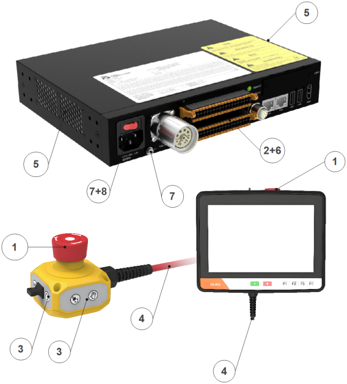

2.  Sichtprüfung

-  Ziehen Sie das Netzkabel vom Steuerschrank ab.
-  Prüfen Sie, ob die Klemmen der Steuerplatine korrekt eingesteckt sind und keine losen Drähte vorhanden sind.
-  Prüfen Sie das Innere des Steuerschranks auf Schmutz/Staub. Reinigen Sie es bei Bedarf mit einem ESD-Staubsauger.

.. note:: Verwenden Sie niemals Druckluft, um das Innere des Steuerschranks zu reinigen, da dies Komponenten beschädigen könnte.

3.  Funktionsprüfung

.. note:: Die Sicherheitsfunktionen des Roboters sind von größter Bedeutung. Es wird empfohlen, sie monatlich zu testen, um ihre ordnungsgemäße Funktion sicherzustellen.

-  Not-Halt-Taster am Teach Pendant / an der Taster-Box:

  A. Drücken Sie den Not-Halt-Taster am Teach Pendant / an der Taster-Box.
  B. Beobachten Sie, ob der Roboter anhält und die Spannungsversorgung der Gelenke abgeschaltet wird.
  C. Schalten Sie die Roboter-Spannungsversorgung wieder ein.

	.. figure:: installation/075.png
		:align: center
		:width: 4in

	.. figure:: installation/076.png
		:align: center
		:width: 4in

-  Andere Sicherheitseingänge und -ausgänge noch in Betrieb

  Überprüfen Sie, welche Sicherheitseingänge und -ausgänge aktiv sind und ob sie über PolyScope oder externe Geräte ausgelöst werden können.

-  Datum und Uhrzeit

  Überprüfen Sie im Reiter "Protokoll", ob Datum und Uhrzeit korrekt sind. Ein falsches Datum oder eine falsche Uhrzeit deutet auf eine schwache CMOS-Batterie hin. Die Lebensdauer der CMOS-Batterie beträgt bis zu 5 Jahre.

-  Prüfen Sie, ob die Klemmenhebel richtig eingerastet sind

  .. figure:: installation/077.png
    :align: center
    :width: 4in

4.  Reinigung

-  Teach Pendant

  Es kann erforderlich sein, den Bildschirm des Teach Pendants zu reinigen. Es wird empfohlen, einen handelsüblichen milden Industriereiniger ohne Verdünner oder aggressive Zusätze zu verwenden. Verwenden Sie keine scheuernden Materialien zum Abwischen des Bildschirms. FAIRINO bewirbt keine bestimmten Reinigungsmittel.

-  Taster-Box

  Normalerweise ist keine regelmäßige Reinigung erforderlich. Falls die Beschriftung der Tasten unleserlich wird und die Bedienung erschwert, kann sie jederzeit mit einem Reinigungsmittel gereinigt werden.

-  Steuerschrank

  Der Steuerschrank enthält zwei Filter, einen auf jeder Seite.

  A. Der Zustand der Filter kann von außen durch die Lüftungsöffnungen auf der linken und rechten Seite des Steuerschranks beurteilt werden. Normalerweise ist die Wabenstruktur des Filters sichtbar.
  B. Entfernen Sie die Filter zur Reinigung. Reinigen Sie sie mit Druckluft bei niedrigem Druck oder tauschen Sie sie bei Bedarf aus. Denken Sie daran, beide Seiten zu reinigen. Bei starker Verschmutzung oder Beschädigung ersetzen (bei Austausch muss die obere Abdeckung des Steuerschranks entfernt werden, um den Filter von innen zu wechseln).
  C. Hören Sie während des Betriebs auf die Lüfter. Bei ungewöhnlichen Geräuschen wenden Sie sich an Ihren Serviceanbieter oder tauschen Sie den Lüfter aus.

Wartungsprotokoll
*********************

1.  Roboterarm

.. list-table::
   :widths: 40 20 20 20 40
   :header-rows: 0
   :align: center

   * - **Prüfpunkt**
     - **Geprüft**
     - **Prüfer**
     - **Datum**
     - **Bemerkung**

   * - **Gelenkabdeckung prüfen**
     -
     -
     -
     -

   * - **Schrauben der Gelenkabdeckung prüfen**
     -
     -
     -
     -

   * - **Gelenk-Dichtring prüfen**
     -
     -
     -
     -

   * - **Roboter-Kabel prüfen**
     -
     -
     -
     -

   * - **Roboter-Kabelverbindungen prüfen**
     -
     -
     -
     -

   * - **Befestigungsschrauben des Roboterfußes prüfen**
     -
     -
     -
     -

   * - **Befestigungsschrauben des Werkzeugs prüfen**
     -
     -
     -
     -

2.  Steuerschrank, Teach Pendant, Taster-Box

.. list-table::
   :widths: 40 20 20 20 40
   :header-rows: 0
   :align: center

   * - **Prüfpunkt**
     - **Geprüft**
     - **Prüfer**
     - **Datum**
     - **Bemerkung**

   * - **Not-Halt-Taster an Taster-Box (Teach Pendant) prüfen**
     -
     -
     -
     -

   * - **Sicherheits-Ein-/Ausgänge an der Klemmleiste prüfen**
     -
     -
     -
     -

   * - **Start/Stopp- und Betriebsartenwahl-Funktion der Taster-Box prüfen**
     -
     -
     -
     -

   * - **Kabel der Taster-Box (Teach Pendant) prüfen**
     -
     -
     -
     -

   * - **Luftfilter am Steuerschrank prüfen und reinigen**
     -
     -
     -
     -

   * - **Klemmen am Steuerschrank auf festen Sitz prüfen**
     -
     -
     -
     -

   * - **Erdungswiderstand des Steuerschranks ≤ 1 Ω prüfen**
     -
     -
     -
     -

   * - **Hauptspannungsversorgung des Steuerschranks prüfen**
     -
     -
     -
     -

Entsorgung
~~~~~~~~~~~~~~~~~~~~~~~~~~~~~~

FR-Roboter müssen gemäß den geltenden nationalen Gesetzen, Vorschriften und Normen entsorgt werden. Einzelheiten erfragen Sie bitte beim Hersteller.

Installationsvorschriften
----------------------------------------

Montage des Roboterarms
~~~~~~~~~~~~~~~~~~~~~~~~~~~~~~~~~

.. important::
	Es wird empfohlen, dass die Montagehalterung des Roboters die folgenden Anforderungen erfüllt, um eine sichere und stabile Befestigung des Roboters zu gewährleisten:

	(1) Die Montagehalterung muss ausreichend stabil sein und eine ausreichende Tragfähigkeit aufweisen. Sie sollte mindestens das 5-fache des Robotergewichts tragen können und mindestens das 10-fache des Drehmoments der Achse 1 aushalten können.

	(2) Die Oberfläche der Montagehalterung muss eben sein, um einen festen Kontakt mit der Roboterauflagefläche zu gewährleisten.

	(3) Die Montagehalterung muss eine ausreichende Steifigkeit aufweisen und fest verankert sein, um Resonanzen mit dem Roboter zu vermeiden.

	(4) Wenn der Roboter und andere Komponenten gleichzeitig bewegt werden, sollte die Halterung von anderen beweglichen Teilen getrennt sein und nicht mit ihnen verbunden werden, um Vibrationseinflüsse während der Bewegung zu vermeiden.

	(5) Wenn der Roboter auf einer mobilen Plattform oder einer externen Achse montiert ist, sollte die Beschleunigung der mobilen Plattform oder der externen Achse so gering wie möglich sein.

.. warning::
	Die folgenden Installationsarten sollten vermieden werden:

	(I) Vermeiden Sie es, den Roboter auf anderen beweglichen Geräten zu befestigen.

	.. figure:: installation/064.png
		:align: center
		:width: 3in

	.. centered:: Abbildung 3.4-1 Nicht auf anderen beweglichen Geräten montieren

	Stellen Sie sicher, dass der Roboterarm korrekt und sicher montiert ist. Eine instabile Montage kann zu Unfällen führen.

.. note::
	Es können präzise Basishalterungen als Zubehör erworben werden. Die Abbildungen 3.4-2, 3.4-5, 3.4-8, 3.4-11 zeigen die Positionen der Passbohrungen und Schraubenlöcher.

Montageanforderungen für Roboterarm FR3/FR3-WMS/FR3-WML/FR3-C/FR5-C
++++++++++++++++++++++++++++++++++++++++++++++++++++++++++++++++++++++++++++++++++++++++++++++++++++++++++++++++++++++++++++++

Bei der Montage des Roboters auf einer Montagehalterung verwenden Sie 4 M6-Schrauben der Festigkeitsklasse nicht unter 8.8, um den Roboter auf der Halterung zu befestigen. Die Schrauben müssen mit einem Drehmoment von mindestens 10 Nm angezogen werden. Es wird empfohlen, auf der Montagehalterung zwei φ5 mm Passbohrungen in Verbindung mit Passstiften zur Positionierung des Roboters zu verwenden. Dies verbessert die Montagegenauigkeit des Roboters und verhindert, dass sich der Roboter durch Stöße oder ähnliches bewegt. Wenn hohe Anforderungen an die Laufgenauigkeit des Roboters gestellt werden, müssen auf jeden Fall Passstifte zur Positionierung des Roboters verwendet werden.

.. figure:: installation/025.png
	:align: center
	:width: 6in

.. centered:: Abbildung 3.4-2 Einbaumaße für kollaborative Roboter FR3/FR3-WMS/FR3-WML/FR3-C/FR5-C

.. important::
	Je nach Anwendungsszenario werden folgende Roboter-Montagehalterungen empfohlen:

	(I) Für Anwendungen mit nicht allzu hoher Bewegungsgeschwindigkeit, nicht allzu hoher Laufgeschwindigkeit, normalen Genauigkeitsanforderungen und wenn eine Befestigung am Boden nicht möglich ist, wird folgende Roboter-Montagehalterung empfohlen:

	.. figure:: installation/062.png
		:align: center
		:width: 3in

	.. centered:: Abbildung 3.4-3 Montagehalterung für niedrige Anforderungen (FR3/FR3-WMS/FR3-WML/FR3-C/FR5-C)

	(II) Für Anwendungen mit höherer Bewegungsgeschwindigkeit, höherer Laufgeschwindigkeit und höheren Genauigkeitsanforderungen wird folgende Roboter-Montagehalterung empfohlen. Der Roboter sollte auf einem festen Boden montiert werden:

	.. figure:: installation/067.png
		:align: center
		:width: 3in

	.. centered:: Abbildung 3.4-4 Montagehalterung für hohe Anforderungen (FR3/FR3-WMS/FR3-WML/FR3-C/FR5-C)

Montageanforderungen für Roboterarm FR5
++++++++++++++++++++++++++++++++++++++++++++++++

Bei der Montage des Roboters auf einer Montagehalterung verwenden Sie 4 M8-Schrauben der Festigkeitsklasse nicht unter 8.8, um den Roboter auf der Halterung zu befestigen. Die Schrauben müssen mit einem Drehmoment von mindestens 20 Nm angezogen werden. Es wird empfohlen, auf der Montagehalterung zwei φ8 mm Passbohrungen in Verbindung mit Passstiften zur Positionierung des Roboters zu verwenden. Dies verbessert die Montagegenauigkeit des Roboters und verhindert, dass sich der Roboter durch Stöße oder ähnliches bewegt. Wenn hohe Anforderungen an die Laufgenauigkeit des Roboters gestellt werden, müssen auf jeden Fall Passstifte zur Positionierung des Roboters verwendet werden.

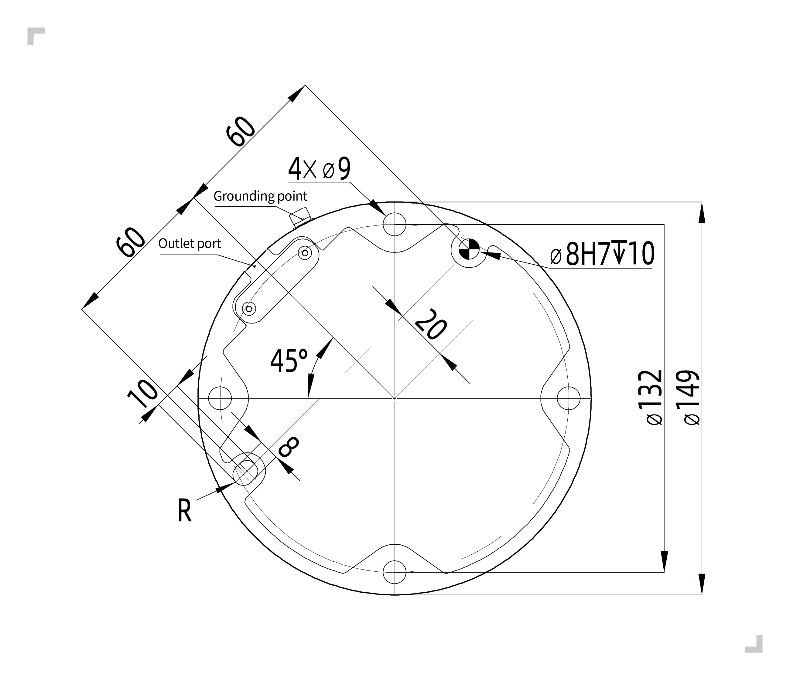

.. centered:: Abbildung 3.4-5 Einbaumaße für kollaborativen Roboter FR5

.. important::
	Je nach Anwendungsszenario werden folgende Roboter-Montagehalterungen empfohlen:

	(I) Für Anwendungen mit nicht allzu hoher Bewegungsgeschwindigkeit, nicht allzu hoher Laufgeschwindigkeit, normalen Genauigkeitsanforderungen und wenn eine Befestigung am Boden nicht möglich ist, wird folgende Roboter-Montagehalterung empfohlen:

	.. figure:: installation/062.png
		:align: center
		:width: 3in

	.. centered:: Abbildung 3.4-6 Montagehalterung für niedrige Anforderungen (FR5)

	(II) Für Anwendungen mit höherer Bewegungsgeschwindigkeit, höherer Laufgeschwindigkeit und höheren Genauigkeitsanforderungen wird folgende Roboter-Montagehalterung empfohlen. Der Roboter sollte auf einem festen Boden montiert werden:

	.. figure:: installation/067.png
		:align: center
		:width: 3in

	.. centered:: Abbildung 3.4-7 Montagehalterung für hohe Anforderungen (FR5)

Montageanforderungen für Roboterarme FR10, FR16
+++++++++++++++++++++++++++++++++++++++++++++++++++++++++

Bei der Montage des Roboters auf einer Montagehalterung verwenden Sie 4 M8-Schrauben der Festigkeitsklasse nicht unter 8.8, um den Roboter auf der Halterung zu befestigen. Die Schrauben müssen mit einem Drehmoment von mindestens 25 Nm angezogen werden. Es wird empfohlen, auf der Montagehalterung zwei φ8 mm Passbohrungen in Verbindung mit Passstiften zur Positionierung des Roboters zu verwenden. Dies verbessert die Montagegenauigkeit des Roboters und verhindert, dass sich der Roboter durch Stöße oder ähnliches bewegt. Wenn hohe Anforderungen an die Laufgenauigkeit des Roboters gestellt werden, müssen auf jeden Fall Passstifte zur Positionierung des Roboters verwendet werden.

.. figure:: installation/027.png
	:align: center
	:width: 6in

.. centered:: Abbildung 3.4-8 Einbaumaße für kollaborative Roboter FR10, FR16

.. important::
	Je nach Anwendungsszenario werden folgende Roboter-Montagehalterungen empfohlen:

	(I) Für Anwendungen mit nicht allzu hoher Bewegungsgeschwindigkeit, nicht allzu hoher Laufgeschwindigkeit, normalen Genauigkeitsanforderungen und wenn eine Befestigung am Boden nicht möglich ist, wird folgende Roboter-Montagehalterung empfohlen:

	.. figure:: installation/065.png
		:align: center
		:width: 3in

	.. centered:: Abbildung 3.4-9 Montagehalterung für niedrige Anforderungen (FR10, FR16)

	(II) Für Anwendungen mit höherer Bewegungsgeschwindigkeit, höherer Laufgeschwindigkeit und höheren Genauigkeitsanforderungen wird folgende Roboter-Montagehalterung empfohlen. Der Roboter sollte auf einem festen Boden montiert werden:

	.. figure:: installation/067.png
		:align: center
		:width: 3in

	.. centered:: Abbildung 3.4-10 Montagehalterung für hohe Anforderungen (FR10, FR16)

Montageanforderungen für Roboterarme FR20, FR30
++++++++++++++++++++++++++++++++++++++++++++++++++++++++++++++++++++++++++++++

Bei der Montage des Roboters auf einer Montagehalterung verwenden Sie 6 M10-Schrauben der Festigkeitsklasse nicht unter 8.8, um den Roboter auf der Halterung zu befestigen. Die Schrauben müssen mit einem Drehmoment von mindestens 45 Nm angezogen werden. Es wird empfohlen, auf der Montagehalterung zwei φ8 mm Passbohrungen in Verbindung mit Passstiften zur Positionierung des Roboters zu verwenden. Dies verbessert die Montagegenauigkeit des Roboters und verhindert, dass sich der Roboter durch Stöße oder ähnliches bewegt. Wenn hohe Anforderungen an die Laufgenauigkeit des Roboters gestellt werden, müssen auf jeden Fall Passstifte zur Positionierung des Roboters verwendet werden.

.. figure:: installation/029.png
	:align: center
	:width: 6in

.. centered:: Abbildung 3.4-11 Einbaumaße für kollaborative Roboter FR20, FR30

.. important::

	Aufgrund des hohen Eigengewichts und der hohen Bewegungsträgheit der Roboter FR20 und FR30 wird empfohlen, sie direkt auf dem Boden zu montieren. Empfohlene Halterung:

	.. figure:: installation/066.png
		:align: center
		:width: 3in

	.. centered:: Abbildung 3.4-12 Montagehalterung für kollaborative Roboter FR20, FR30

Montage des Werkzeugflansches
~~~~~~~~~~~~~~~~~~~~~~~~~~~~~~~~

Der Werkzeugflansch des Roboters verfügt über vier M6-Gewindebohrungen, die zum Anschließen eines Werkzeugs an den Roboter verwendet werden können. M6-Schrauben müssen mit einem Drehmoment von 8 Nm angezogen werden und mindestens der Festigkeitsklasse 8.8 entsprechen. Zur genauen Wiederpositionierung des Werkzeugs verwenden Sie Passstifte in den dafür vorgesehenen Ø6-Passbohrungen.

.. figure:: installation/030.png
	:align: center
	:width: 6in

.. centered:: Abbildung 3.4-13 Zeichnung des Roboter-Werkzeugflansches (FR3/FR3-WMS/FR3-WML/FR3-C/FR5/FR5-C/FR10/FR16)

.. figure:: installation/031.png
	:align: center
	:width: 6in

.. centered:: Abbildung 3.4-14 Zeichnung des Roboter-Werkzeugflansches (FR20/FR30)

.. important::
	- Stellen Sie sicher, dass das Werkzeug korrekt und sicher montiert ist.
	- Stellen Sie sicher, dass die Werkzeugkonstruktion so beschaffen ist, dass keine Teile unbeabsichtigt herunterfallen und eine Gefahr darstellen können.
	- Die Verwendung von M6-Schrauben mit einer Länge von mehr als 8 mm am oberen Flansch des Roboters kann den Werkzeugflansch beschädigen und zu irreparablen Schäden führen, die einen Austausch des Werkzeugflansches erforderlich machen.

Installationsumgebung
~~~~~~~~~~~~~~~~~~~~~~~~~~~~~~

Stellen Sie bei der Installation und Verwendung des kollaborativen Roboters sicher, dass die folgenden Anforderungen erfüllt sind:

-   Umgebungstemperatur 0-45 °C

-   Luftfeuchtigkeit 0 % - 90 % rF (nicht kondensierend)

-   Keine mechanischen Stöße und Vibrationen

-   Höhenlage unter 2000 m

-   Keine korrosiven Gase, keine Flüssigkeiten, keine explosiven Gase, kein Öl, kein Salznebel, kein Staub oder Metallpulver, keine radioaktiven Materialien, keine elektromagnetischen Störungen, keine brennbaren Materialien

-   Vermeiden Sie den Betrieb des Geräts unter instabilen Stromversorgungsbedingungen.

-   Der Benutzer muss vor der Spannungsversorgung des Roboters einen Leitungsschutzschalter installieren. Es wird außerdem empfohlen, einen EMV-Filter zu installieren.

.. note::
	Wenn der kollaborative Roboter hängend oder an einer vertikalen Fläche montiert werden soll, kontaktieren Sie uns bitte.

Bodenbelastbarkeit
~~~~~~~~~~~~~~~~~~~~

Montieren Sie den Roboter auf einer festen Oberfläche, die ausreicht, um mindestens das 5-fache des Gewichts des Roboterarms zu tragen. Die Oberfläche darf nicht vibrieren.

Lastkurven der gesamten Serie
~~~~~~~~~~~~~~~~~~~~~~~~~~~~~~~~~~~~~~~~

Überblick
+++++++++++++

Die in diesem Abschnitt gezeigten Lastkurven basieren auf Tests der jeweiligen Modelle unter bestimmten Bewegungsbahnen. Die Lastkurven der einzelnen Modelle unterteilen sich in "Volle Leistungsfähigkeit" und "Erweiterte Lastfähigkeit", wie folgt:

(1) Die Betriebsbedingungen für die "Volle Leistungsfähigkeit" sind: Reibungskompensationsfaktor für alle Gelenke = 1; Kollisionsstufe für alle Gelenke = 10; 100% Geschwindigkeit und 360 deg/s² Beschleunigung in der Weboberfläche eingestellt; Dynamik 2.0. Unter diesen Bedingungen ist der Teil der Lastkurve "Volle Leistungsfähigkeit" für die überwiegende Mehrheit der Bewegungsbahnen geeignet.
(2) Befindet sich die Nutzlast im Bereich der "Erweiterten Lastfähigkeit", muss der "Zeitoptimale Modus" aktiviert werden und die Beschleunigungsgrenzen eingehalten werden, oder der Arbeitsbereich des Roboters muss verkleinert werden.

Parameterbeschreibung
+++++++++++++++++++++++++++++++++++++++

Die maximale Nutzlast des Roboters hängt vom Schwerpunktabstand der Nutzlast ab. Der Schwerpunktabstand ist definiert als der Abstand zwischen der Mitte des Werkzeugflansches und dem Schwerpunkt der zusätzlichen Nutzlast.

Lastkurve für kollaborativen Roboter FR3
***********************************************

Der kollaborative Roboter FR3 kann eine maximale Nutzlast von 5 kg tragen, die Nennutzlast beträgt 3 kg. Die Lastkurve ist in der Abbildung dargestellt. Die genaue Bedeutung der Lastkurve ist wie folgt:

(1) Der FR3 kann bei voller Leistungsfähigkeit Nutzlasten von 3 kg und weniger tragen (siehe "Blaue Hüllkurve").
(2) Bei Nutzlasten zwischen 3 kg und 5 kg handelt es sich um die erweiterte Lastfähigkeit (siehe "Rote Hüllkurve"). In diesem Fall kann der Roboter in den folgenden Zuständen betrieben werden:

  ① Aktivieren Sie den "Zeitoptimalen Modus". Es wird empfohlen, die Beschleunigung auf unter 360 deg/s² einzustellen.

  ② Verkleinern Sie den Arbeitsbereich des Roboters oder reduzieren Sie die Bewegungsgeschwindigkeit.

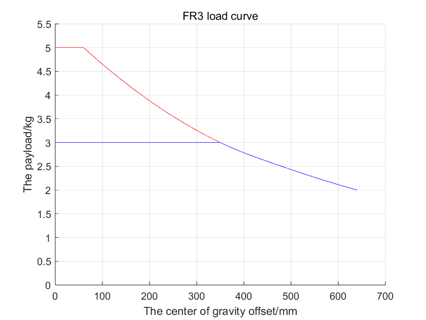

.. centered:: Abbildung 3.4-15 Lastkurve für kollaborativen Roboter FR3

Lastkurve für kollaborativen Roboter FR3-WMS
***********************************************

Der kollaborative Roboter FR3-WMS kann eine maximale Nutzlast von 5 kg tragen, die Nennutzlast beträgt 3 kg. Die Lastkurve ist in der Abbildung dargestellt. Die genaue Bedeutung der Lastkurve ist wie folgt:

(1) Der FR3-WMS kann bei voller Leistungsfähigkeit Nutzlasten von 3 kg und weniger tragen (siehe "Blaue Hüllkurve").
(2) Bei Nutzlasten zwischen 3 kg und 5 kg handelt es sich um die erweiterte Lastfähigkeit (siehe "Rote Hüllkurve"). In diesem Fall kann der Roboter in den folgenden Zuständen betrieben werden:

  ① Aktivieren Sie den "Zeitoptimalen Modus". Es wird empfohlen, die Beschleunigung auf unter 360 deg/s² einzustellen.

  ② Verkleinern Sie den Arbeitsbereich des Roboters oder reduzieren Sie die Bewegungsgeschwindigkeit.

.. figure:: installation/109.png
	:align: center
	:width: 5in

.. centered:: Abbildung 3.4-16 Lastkurve für kollaborativen Roboter FR3-WMS

Lastkurve für kollaborativen Roboter FR3-WML
***********************************************

Der kollaborative Roboter FR3-WML kann eine maximale Nutzlast von 4 kg tragen, die Nennutzlast beträgt 3 kg. Die Lastkurve ist in der Abbildung dargestellt. Die genaue Bedeutung der Lastkurve ist wie folgt:

(1) Der FR3-WML kann bei voller Leistungsfähigkeit Nutzlasten von 3 kg und weniger tragen (siehe "Blaue Hüllkurve").
(2) Bei Nutzlasten zwischen 3 kg und 4 kg handelt es sich um die erweiterte Lastfähigkeit (siehe "Rote Hüllkurve"). In diesem Fall kann der Roboter in den folgenden Zuständen betrieben werden:

  ① Aktivieren Sie den "Zeitoptimalen Modus". Es wird empfohlen, die Beschleunigung auf unter 360 deg/s² einzustellen.

  ② Verkleinern Sie den Arbeitsbereich des Roboters oder reduzieren Sie die Bewegungsgeschwindigkeit.

.. figure:: installation/110.png
	:align: center
	:width: 5in

.. centered:: Abbildung 3.4-17 Lastkurve für kollaborativen Roboter FR3-WML

Lastkurve für kollaborativen Roboter FR3-C
***********************************************

Der kollaborative Roboter FR3-C kann eine maximale Nutzlast von 5 kg tragen, die Nennutzlast beträgt 3 kg. Die Lastkurve ist in der Abbildung dargestellt. Die genaue Bedeutung der Lastkurve ist wie folgt:

(1) Der FR3-C kann bei voller Leistungsfähigkeit Nutzlasten von 3 kg und weniger tragen (siehe "Blaue Hüllkurve").
(2) Bei Nutzlasten zwischen 3 kg und 5 kg handelt es sich um die erweiterte Lastfähigkeit (siehe "Rote Hüllkurve"). In diesem Fall kann der Roboter in den folgenden Zuständen betrieben werden:

  ① Aktivieren Sie den "Zeitoptimalen Modus". Es wird empfohlen, die Beschleunigung auf unter 360 deg/s² einzustellen.

  ② Verkleinern Sie den Arbeitsbereich des Roboters oder reduzieren Sie die Bewegungsgeschwindigkeit.

.. figure:: installation/111.png
	:align: center
	:width: 5in

.. centered:: Abbildung 3.4-18 Lastkurve für kollaborativen Roboter FR3-C

Lastkurve für kollaborativen Roboter FR5
***********************************************

Der kollaborative Roboter FR5 kann eine maximale Nutzlast von 7 kg tragen, die Nennutzlast beträgt 5 kg. Die Lastkurve ist in der Abbildung dargestellt. Die genaue Bedeutung der Lastkurve ist wie folgt:

(1) Der FR5 kann bei voller Leistungsfähigkeit Nutzlasten von 5 kg und weniger tragen (siehe "Blaue Hüllkurve").
(2) Bei Nutzlasten zwischen 5 kg und 7 kg handelt es sich um die erweiterte Lastfähigkeit (siehe "Rote Hüllkurve"). In diesem Fall kann der Roboter in den folgenden Zuständen betrieben werden:

  ① Aktivieren Sie den "Zeitoptimalen Modus". Es wird empfohlen, die Beschleunigung auf unter 360 deg/s² einzustellen.

  ② Verkleinern Sie den Arbeitsbereich des Roboters oder reduzieren Sie die Bewegungsgeschwindigkeit.

.. figure:: installation/033.png
	:align: center
	:width: 5in

.. centered:: Abbildung 3.4-19 Lastkurve für kollaborativen Roboter FR5

Lastkurve für kollaborativen Roboter FR5-WML
***********************************************

Der kollaborative Roboter FR5-WML kann eine maximale Nutzlast von 7 kg tragen, die Nennutzlast beträgt 5 kg. Die Lastkurve ist in der Abbildung dargestellt.

(1) Innerhalb der "Blauen Hüllkurve" liegt die volle Leistungsfähigkeit vor: Betrieb der allermeisten Bewegungsbahnen möglich bei Reibungskompensationsfaktor = 1, Dynamik 2.0, 100% Geschwindigkeit, 360 deg/s² Beschleunigung (Wartungsmodus).
(2) Innerhalb der "Roten Hüllkurve" liegt die erweiterte Lastfähigkeit vor. Betrieb in folgenden Zuständen möglich:

  ① Aktivieren Sie den "Zeitoptimalen Modus".

  ② Verkleinern Sie den Arbeitsbereich des Roboters oder reduzieren Sie die Bewegungsgeschwindigkeit.

.. figure:: installation/127.png
	:align: center
	:width: 5in

.. centered:: Abbildung 3.4-20 Lastkurve für kollaborativen Roboter FR5-WML

FR5-C Modell Kollaborativer Roboter Lastkurve
*******************************************************

Der FR5-C Modell kollaborative Roboter hat eine maximale Nutzlast von 5 kg und eine Nennnutzlast von 4 kg. Die Lastkurve ist in der Abbildung als "Volle Leistung" dargestellt.

.. figure:: installation/130.png
	:align: center
	:width: 5in

.. centered:: Abbildung 3.4-21 FR5-C Modell Kollaborativer Roboter Lastkurve

Lastkurve für kollaborativen Roboter FR10
***********************************************

Der kollaborative Roboter FR10 kann eine maximale Nutzlast von 14 kg tragen, die Nennutzlast beträgt 10 kg. Die Lastkurve ist in Abbildung 3 dargestellt. Die genaue Bedeutung der Lastkurve ist wie folgt:

(1) Der FR10 kann bei voller Leistungsfähigkeit Nutzlasten von 10 kg und weniger tragen (siehe "Blaue Hüllkurve").
(2) Bei Nutzlasten zwischen 10 kg und 14 kg handelt es sich um die erweiterte Lastfähigkeit (siehe "Rote Hüllkurve"). In diesem Fall kann der Roboter in den folgenden Zuständen betrieben werden:

  ① Aktivieren Sie den "Zeitoptimalen Modus". Es wird empfohlen, die Beschleunigung auf unter 180 deg/s² einzustellen.

  ② Verkleinern Sie den Arbeitsbereich des Roboters oder reduzieren Sie die Bewegungsgeschwindigkeit.

.. figure:: installation/034.png
	:align: center
	:width: 5in

.. centered:: Abbildung 3.4-22 Lastkurve für kollaborativen Roboter FR10

Lastkurve für kollaborativen Roboter FR16
***********************************************

Der kollaborative Roboter FR16 kann eine maximale Nutzlast von 20 kg tragen, die Nennutzlast beträgt 16 kg. Die Lastkurve ist in der Abbildung dargestellt. Die genaue Bedeutung der Lastkurve ist wie folgt:

(1) Der FR16 kann bei voller Leistungsfähigkeit Nutzlasten von 16 kg und weniger tragen (siehe "Blaue Hüllkurve").
(2) Bei Nutzlasten zwischen 16 kg und 20 kg handelt es sich um die erweiterte Lastfähigkeit (siehe "Rote Hüllkurve"). In diesem Fall kann der Roboter in den folgenden Zuständen betrieben werden:

  ① Aktivieren Sie den "Zeitoptimalen Modus". Es wird empfohlen, die Beschleunigung auf unter 180 deg/s² einzustellen.

  ② Verkleinern Sie den Arbeitsbereich des Roboters oder reduzieren Sie die Bewegungsgeschwindigkeit.

.. figure:: installation/035.png
	:align: center
	:width: 5in

.. centered:: Abbildung 3.4-23 Lastkurve für kollaborativen Roboter FR16

Lastkurve für kollaborativen Roboter FR20
***********************************************

Der kollaborative Roboter FR20 kann eine maximale Nutzlast von 25 kg tragen, die Nennutzlast beträgt 20 kg. Die Lastkurve ist in der Abbildung dargestellt. Die genaue Bedeutung der Lastkurve ist wie folgt:

(1) Der FR20 kann bei voller Leistungsfähigkeit Nutzlasten von 20 kg und weniger tragen (siehe "Blaue Hüllkurve").
(2) Bei Nutzlasten zwischen 20 kg und 25 kg handelt es sich um die erweiterte Lastfähigkeit (siehe "Rote Hüllkurve"). In diesem Fall kann der Roboter in den folgenden Zuständen betrieben werden:

  ① Aktivieren Sie den "Zeitoptimalen Modus". Es wird empfohlen, die Beschleunigung auf unter 150 deg/s² einzustellen.

  ② Verkleinern Sie den Arbeitsbereich des Roboters oder reduzieren Sie die Bewegungsgeschwindigkeit.

.. figure:: installation/036.png
	:align: center
	:width: 5in

.. centered:: Abbildung 3.4-24 Lastkurve für kollaborativen Roboter FR20

Lastkurve für kollaborativen Roboter FR30
***********************************************

Der kollaborative Roboter FR30 kann eine maximale Nutzlast von 35 kg tragen, die Nennutzlast beträgt 30 kg. Die Lastkurve ist in der Abbildung dargestellt.

(1) Der FR30 kann bei voller Leistungsfähigkeit Nutzlasten von 30 kg und weniger tragen (siehe "Blaue Hüllkurve").
(2) Bei Nutzlasten zwischen 30 kg und 35 kg handelt es sich um die erweiterte Lastfähigkeit (siehe "Rote Hüllkurve"). In diesem Fall kann der Roboter in den folgenden Zuständen betrieben werden:

  ① Aktivieren Sie den "Zeitoptimalen Modus". Es wird empfohlen, die Beschleunigung auf unter 150 deg/s² einzustellen.

  ② Verkleinern Sie den Arbeitsbereich des Roboters oder reduzieren Sie die Bewegungsgeschwindigkeit.

.. figure:: installation/069.png
	:align: center
	:width: 5in

.. centered:: Abbildung 3.4-25 Lastkurve für kollaborativen Roboter FR30

Steuerungsanschluss
------------------------------

Controller-Schnittstellen
~~~~~~~~~~~~~~~~~~~~~~~~~~~~~~~

Die Roboter dieser Serie können mit Steuerschränken betrieben werden, die für drei verschiedene Spannungsversorgungen ausgelegt sind. Detaillierte Informationen zur Spannungsversorgung des Steuerschranks finden Sie auf dem Typenschild des Steuerschranks. Der Roboter muss elektrisch geerdet werden.

.. list-table::
   :widths: 20 40 40
   :header-rows: 0
   :align: center

   * -
     - **Max. Eingang (für die Auslegung der vorgeschalteten Spannungsversorgung durch den Kunden)**
     - **Max. Ausgang (Spitzenwert)**

   * - **Gleichstrom 2 kW**
     - 30-60 V DC / 30 A
     - 2000 W / 48 V DC / 41 A

   * - **Gleichstrom 5 kW**
     - 30-60 V DC / 40 A
     - 5000 W / 48 V DC / 104 A

   * - **Wechselstrom-Schmalbereich 2 kW**
     - 176-264 V DC / 10 A / Einphasig / 50 Hz
     - 2000 W / 48 V DC / 41 A

   * - **Wechselstrom-Weitbereich 2 kW**
     - 100-240 V DC / 10 A / Einphasig / 50-60 Hz
     - 2000 W / 48 V DC / 41 A

   * - **Wechselstrom-Weitbereich 5 kW**
     - 100-240 V DC / 16 A / Einphasig / 50-60 Hz
     - 5000 W / 48 V DC / 104 A

.. warning::
	Vor der Verdrahtung muss unbedingt sichergestellt werden, dass die Spannungsversorgung ausgeschaltet ist. Bringen Sie in der Nähe ein Sicherheitswarnschild an.

Alle externen Verbindungen des Steuerungssystems des Manipulators dieser Serie werden mit steckbaren und schnell montierbaren Steckverbindern hergestellt. Das Anschlussfeld des kollaborativen Roboters ist in der folgenden Abbildung dargestellt.

-   Stellen Sie sicher, dass der Netzschalter des Steuerschranks ausgeschaltet ist (Schalter auf 0), bevor Sie das Netzkabel an die Netzsteckdose anschließen.
-   Verbinden Sie das Schwerlastkabel des Roboters mit der Schwerlastschnittstelle des Steuerschranks.
-   Stecken Sie den Rundsteckverbinder der Taster-Box in die Teach-Pendant-Schnittstelle des Steuerschranks.
-   Halten Sie zu den Lüftungsöffnungen auf beiden Seiten des Steuerschranks einen Abstand von mindestens 15 cm ein.
-   Halten Sie zur Vorderseite des Steuerschranks (Blechseite des Benutzers, Netzschalter, Schwerlast- und Teach-Pendant-Kabel) einen Abstand von mindestens 25 cm ein.
-   Der Steuerschrank sollte in einer Höhe von 0,6 - 1,5 m über dem Boden montiert werden.
-   Es ist dem Benutzer nicht gestattet, das Netzkabel selbst auszutauschen.

.. figure:: installation/037.png
	:align: center
	:width: 6in

.. centered:: Abbildung 3.5-1 Anschlussplan des Roboters

I/O-Panel des Steuerschranks
~~~~~~~~~~~~~~~~~~~~~~~~~~~~~~~~~~~~~~~~

Sie können die I/O im Steuerkasten verwenden, um verschiedene Geräte zu steuern, darunter pneumatische Relais, SPS sowie Endlagenschalter und Stopptasten. Abbildung 3.5-2 zeigt die elektrische Schnittstellengruppe des Steuerkastens, und Abbildung 3.5-3 zeigt die elektrische Schnittstellengruppe des integrierten Mini-Steuerkastens (mini BOX).

.. figure:: installation/038.png
	:align: center
	:width: 6in

.. centered:: Abbildung 3.5-2 Schematische Darstellung der elektrischen Schnittstelle des Steuerkastens

.. figure:: installation/039.png
	:align: center
	:width: 6in

.. centered:: Abbildung 3.5-3 Schematische Darstellung der elektrischen Schnittstelle des integrierten Mini-Steuerkastens (mini BOX)

RJ45-Netzwerkschnittstellengruppe
~~~~~~~~~~~~~~~~~~~~~~~~~~~~~~~~~~~~~~~~~~~~~

Die Adressen der Netzwerkschnittstellengruppe im Steuerschrank sind in der folgenden Abbildung dargestellt. Bitte beachten Sie, dass diese Abbildung der Reihenfolge der internen Netzwerkanschlüsse des Steuerschranks entspricht. Die werkseitig belegten Anschlüsse dürfen nicht entfernt werden. Der Benutzer-Netzwerkanschluss kann für die Kommunikation mit Geräten wie Kameras verwendet werden. Die IP-Adresse lautet 192.168.57.2. Der Taster-Box-Anschluss ist standardmäßig der Anschluss für das Teach Pendant. Die IP-Adresse lautet 192.168.58.2. Verbinden Sie den Anschluss der Taster-Box mit einem Netzwerkkabel mit einem Computer. Stellen Sie die IP-Adresse des Computers auf 192.168.58.10 oder ein anderes im selben Netzwerk ein. Öffnen Sie den Google Chrome Browser und geben Sie 192.168.58.2 ein, um auf die Teach-Pendant-Seite zuzugreifen. Beim "Easy-Made" Steuerschrank erfolgt der Zugriff auf die Teach-Pendant-Seite über den Netzwerkanschluss, der mit der Taster-Box verbunden ist.

.. figure:: installation/040.png
	:align: center
	:width: 3in

.. centered:: Abbildung 3.5-4 Netzwerkschnittstellengruppe (Schema)

Flanschplatine
~~~~~~~~~~~~~~~~~~~~~~~~~~~~~

Sie können die I/Os und die 485-Kommunikationsschnittstelle der Flanschplatine verwenden, um verschiedene Geräte zu steuern, darunter pneumatische Relais, SPSen und Not-Halt-Taster. Die Pin-Belegung und deren Beschreibung sind in der folgenden Abbildung dargestellt. Der I/O-Steckverbinder ist ein M12-Steckverbinder, 8-polig, Buchse.

.. note:: Die I/Os und die 485-Schnittstelle der Flanschplatine dürfen nicht im laufenden Betrieb gesteckt oder gezogen werden (Hot-Plug).

.. figure:: installation/041.png
	:align: center
	:width: 3in

.. centered:: Abbildung 3.5-5 Elektrische Schnittstellen der Flanschplatine (Schema)

Erdungshinweise
~~~~~~~~~~~~~~~~~~~~~~~~~~~~~~

1.  Der Erdungsanschluss des Steuerschranks befindet sich oben links neben dem Netzschalter an der M4-Kombischraube, wie in der folgenden Abbildung dargestellt.

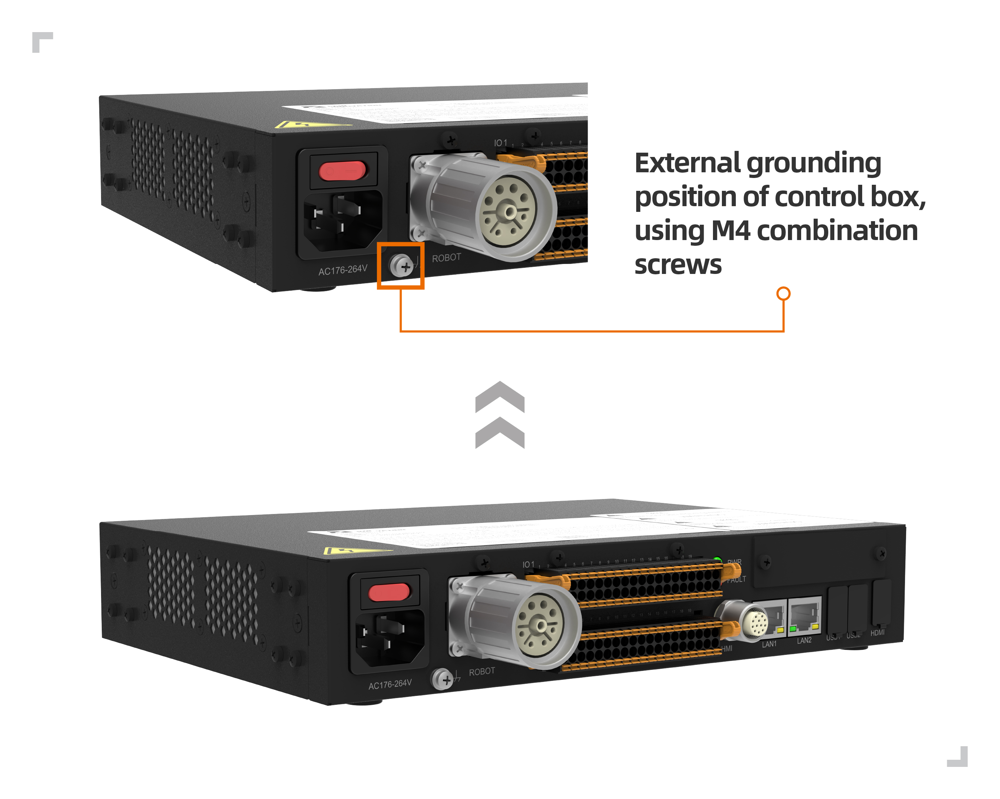

.. centered:: Abbildung 3.5-6 Erdung des Steuerschranks (Schema)

1.  Der Erdungsanschluss des Roboters befindet sich auf der rechten Seite an der Kabelaustrittsstelle des Fußes, wie in der folgenden Abbildung dargestellt.

.. figure:: installation/043.png
	:align: center
	:width: 4in

.. centered:: Abbildung 3.5-7 Erdung des Roboters (Schema)

Einzeln verwendete Schutzleiter müssen einen Querschnitt von mindestens haben:

- 2,5 mm² Kupfer oder 16 mm² Aluminium, wenn ein mechanischer Schutz (Leitungsrohr, Kanal usw.) vorhanden ist.
- 4 mm² Kupfer oder 16 mm² Aluminium, wenn kein mechanischer Schutz vorhanden ist.

Allgemeine Spezifikationen für alle digitalen I/Os
~~~~~~~~~~~~~~~~~~~~~~~~~~~~~~~~~~~~~~~~~~~~~~~~~~~~~~~~~~~~~~~~~~~~~

Dieser Abschnitt legt die elektrischen Spezifikationen für die folgenden 24-V-Digital-Ein-/Ausgänge des Steuerschranks fest:

-   Sicherheits-I/O

-   Allgemeine digitale I/O

Der Roboter muss gemäß den elektrischen Spezifikationen installiert werden.

Durch die Konfiguration der "Stromversorgungskommunikations"-Schnittstelle können Sie eine interne oder externe 24V-Stromversorgung zur Versorgung der digitalen E/A verwenden. In dieser Schnittstelle sind die oberen beiden Anschlüsse (ex24V und exon) die 24V und Masse der externen Stromversorgung, die unteren beiden Anschlüsse (24V und GND) sind die 24V und Masse der internen Stromversorgung. Die Standardkonfiguration verwendet die interne Stromversorgung, wie in den folgenden Abbildungen des Steuerkastens und des integrierten Mini-Steuerkastens (mini BOX) dargestellt.

.. figure:: installation/044.png
	:align: center
	:width: 3in

.. centered:: Steuerkasten

.. figure:: installation/134.png
	:align: center
	:width: 3in

.. centered:: Integrierter Mini-Steuerkasten (mini BOX)
.. centered:: Abbildung 3.5-8 Stromversorgungskommunikationsschema 01

Wenn die Lastleistung hoch ist, schließen Sie eine externe Stromversorgung wie in der folgenden Abbildung dargestellt an. Beim AC-Weitspannungs-Integrierten-Mini-Steuerkasten (mini BOX) werden die externe Stromversorgung und die interne Stromversorgung mit einer gemeinsamen 0V-Verbindung betrieben.

.. figure:: installation/045.png
	:align: center
	:width: 3in

.. centered:: Steuerkasten

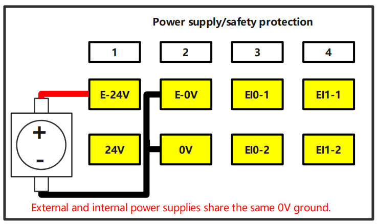

.. centered:: Integrierter Mini-Steuerkasten (mini BOX)
.. centered:: Abbildung 3.5-9 Stromversorgungskommunikationsschema 02

Die elektrischen Spezifikationen der internen und externen Spannungsversorgung sind in der folgenden Tabelle aufgeführt:

.. centered:: Tabelle 3.5-1 Elektrische Spezifikationen interne/externe Spannungsversorgung
.. list-table::
   :widths: 30 20 10 10 10 10
   :header-rows: 0
   :align: center

   * - **Klemme**
     - **Parameter**
     - **Min.**
     - **Typ.**
     - **Max.**
     - **Einheit**

   * - | Interne 24-V-Spg. ext.
       | [ex24V - exGND]
     - |
       | Spannung
       | Strom
     - |
       | 23
       | 0
     - |
       | 24
       | -
     - |
       | 25
       | 2
     - |
       | V
       | A

   * - | Interne 24-V-Spg. int.
       | [24V - GND]
     - |
       | Spannung
       | Strom
     - |
       | 23
       | 0
     - |
       | 24
       | -
     - |
       | 25
       | 1.5
     - |
       | V
       | A

Die elektrischen Spezifikationen der digitalen I/Os sind in der folgenden Tabelle aufgeführt:

.. centered:: Tabelle 3.5‑2 Elektrische Spezifikationen digitale I/Os
.. list-table::
   :widths: 30 20 10 10 10 10
   :header-rows: 0
   :align: center

   * - **Klemme**
     - **Parameter**
     - **Min.**
     - **Typ.**
     - **Max.**
     - **Einheit**

   * - | Digitalausgang
       | [COx/DOx]
     - |
       | Strom
       | Spannungsabfall
       | Reststrom
     - |
       | 0
       | 0
       | 0
     - |
       | -
       | -
       | -
     - |
       | 1
       | 0,5
       | 0,1
     - |
       | A
       | V
       | mA

   * - [COx/DOx]
     - Funktion
     - | -
     - NPN
     - | -
     - Typ

   * - | Digitaleingang
       | [EIx/SIx/CIx/DIx]
     - |
       | AUS-Spannung
       | EIN-Spannung
       | Strom (11~30 V)
     - |
       | -3
       | 11
       | 2
     - |
       | -
       | -
       | -
     - |
       | 5
       | 30
       | 15
     - |
       | V
       | V
       | mA

   * - [EIx/SIx/CIx/DIx]
     - Funktion
     - | -
     - NPN
     - | -
     - Typ

.. centered:: Tabelle 3.5-3 Elektrische Spezifikationen für digitale DO-Einzellasten

.. list-table::
   :widths: 30 20 20 30
   :header-rows: 0
   :align: center

   * - **Steuerkasten-Typ**
     - **DO-Ausgangstyp**
     - **Spannungsversorgungstyp**
     - **Max. Einzellast pro DO-Kanal**

   * - Gleichspannungs-/AC-Schmalspannungs-Steuerkasten
     - NPN-Ausgang
     - Externe 24V-Stromversorgung
     - | Kanal 1-4: 400mA
       | Kanal 5-8: 250mA
       | Kanal 9-16: 125mA

   * - Gleichspannungs-/AC-Schmalspannungs-Steuerkasten
     - NPN-Ausgang
     - Interne 24V-Stromversorgung
     - | Kanal 1-4: 300mA
       | Kanal 5-8: 190mA
       | Kanal 9-16: 90mA

   * - AC-Weitspannungs-Steuerkasten
     - NPN/PNP-Ausgang
     - Externe 24V-Stromversorgung
     - | Kanal 1-2: 200mA
       | Kanal 3-8: 100mA
       | Kanal 9-16: 60mA

   * - AC-Weitspannungs-Steuerkasten
     - NPN/PNP-Ausgang
     - Interne 24V-Stromversorgung
     - | Kanal 1-2: 200mA
       | Kanal 3-8: 100mA
       | Kanal 9-16: 60mA

Sicherheits-I/O
~~~~~~~~~~~~~~~~~~~~~~~~~~~~~~~

Dieser Abschnitt beschreibt die elektrischen Spezifikationen der Sicherheits-I/Os. Die allgemeinen elektrischen Spezifikationen in Abschnitt 3.5.6 sind zu beachten.

Sicherheitseinrichtungen und -geräte müssen gemäß den Sicherheitshinweisen und der Risikobewertung installiert werden (siehe Abschnitt 3.1). Alle Sicherheits-I/Os sind paarweise (redundant) ausgeführt und müssen als zwei unabhängige Zweige behandelt werden. Ein einzelner Fehler darf nicht zum Verlust der Sicherheitsfunktion führen.

Sicherheits-I/Os umfassen Not-Halt und Sicherheitsstopp. Not-Halt-Eingänge sind nur für Not-Halt-Einrichtungen vorgesehen, Sicherheitsstopp-Eingänge für verschiedene sicherheitsrelevante Schutzeinrichtungen. Der funktionale Unterschied ist in der folgenden Tabelle dargestellt:

.. centered:: Tabelle 3.5-3 Funktionsunterschiede
.. list-table::
   :widths: 50 80 80
   :header-rows: 0
   :align: center

   * -
     - **Not-Halt**
     - **Sicherheitsstopp**

   * - **Roboter stoppt Bewegung**
     - Ja
     - Ja

   * - **Stopp-Kategorie**
     - Kategorie 0
     - Kategorie 1

   * - **Programmausführung**
     - Stopp
     - Pause

   * - **Roboter-Spannungsversorgung**
     - Aus
     - Ein

   * - **Neustart**
     - Manuell
     - Automatisch oder manuell

   * - **Nutzungshäufigkeit**
     - Selten
     - Häufig

   * - **Erneute Initialisierung erforderlich**
     - Erforderlich
     - Nicht erforderlich

.. warning::
	- Schließen Sie Sicherheitssignale niemals an eine SPS an, die nicht die korrekte Sicherheitsstufe aufweist. Die Nichtbeachtung dieser Warnung kann zu schweren Verletzungen oder Tod führen, da eine der Sicherheitsstopp-Funktionen außer Kraft gesetzt werden könnte. Die Signale der Sicherheitsschnittstelle müssen von den normalen I/O-Signalen getrennt sein.
	- Alle sicherheitsrelevanten I/Os sind redundant (zwei unabhängige Kanäle) aufgebaut. Die beiden Kanäle müssen getrennt gehalten werden, damit ein einzelner Fehler nicht zum Verlust der Sicherheitsfunktion führen kann.
	- Vor der Inbetriebnahme des Roboters muss die Sicherheitsfunktion des Not-Halts überprüft werden (Roboter einschalten und freigeben, Not-Halt-Taster drücken, Roboter hält an und wird stromlos, Spannungsversorgung ausschalten, Not-Halt-Taster entriegeln, Spannungsversorgung einschalten, Roboter wieder einschalten und freigeben). Die Sicherheitsfunktionen müssen regelmäßig getestet werden.
	- Die Roboterinstallation muss diesen Spezifikationen entsprechen. Andernfalls kann es zu schweren Verletzungen oder Tod kommen, da eine Sicherheitsstopp-Funktion umgangen werden könnte.

Die folgenden Unterabschnitte geben einige Beispiele für die Verwendung der Sicherheits-I/Os.

**Standard-Sicherheitskonfiguration**
Der Roboter wird mit einer Standardkonfiguration ausgeliefert, die einen Betrieb ohne zusätzliche Sicherheitseinrichtungen ermöglicht. Siehe folgendes Diagramm:

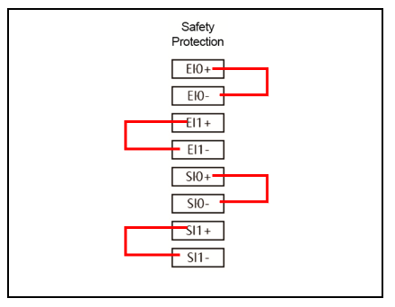

.. centered:: Steuerkasten

.. figure:: installation/136.png
	:align: center
	:width: 3in

.. centered:: Integrierter Mini-Steuerkasten (mini BOX)
.. centered:: Abbildung 3.5-10 Sicherheitsschaltung Schema 01

**Anschluss eines zusätzlichen Not-Halt-Tasters**
In den meisten Anwendungen ist die Verwendung eines oder mehrerer zusätzlicher Not-Halt-Taster erforderlich. Siehe folgendes Diagramm:

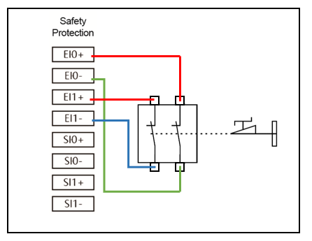

.. centered:: Steuerkasten

.. figure:: installation/137.png
	:align: center
	:width: 3in

.. centered:: Integrierter Mini-Steuerkasten (mini BOX)
.. centered:: Abbildung 3.5-11 Sicherheitsschaltung Schema 02

**Anschluss von Sicherheitsstopp-Einrichtungen**
Ein Beispiel für eine Sicherheitsstopp-Einrichtung ist ein Türschalter, der den Roboter anhält, wenn die Tür geöffnet wird. Siehe folgendes Diagramm:

.. figure:: installation/051.png
	:align: center
	:width: 3in

.. centered:: Steuerkasten

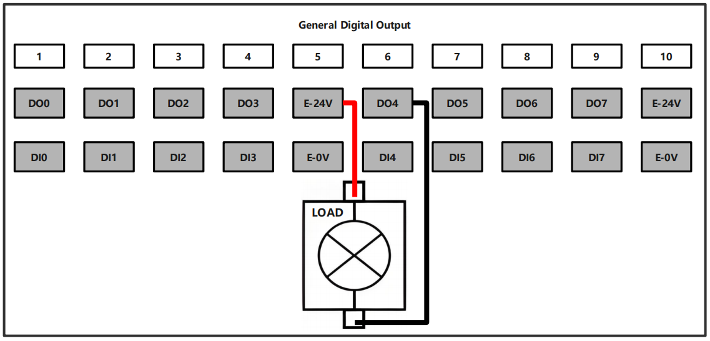

.. centered:: Integrierter Mini-Steuerkasten (mini BOX)
.. centered:: Abbildung 3.5-12 Sicherheitsschaltung Schema 03

Allgemeine digitale I/O
~~~~~~~~~~~~~~~~~~~~~~~~~~~~~~~~~~~~~~~~~~~~

Dieser Abschnitt beschreibt die elektrischen Spezifikationen der allgemeinen digitalen I/Os. Die allgemeinen elektrischen Spezifikationen in Abschnitt 3.5.6 sind zu beachten.

Allgemeine digitale I/Os können zur Ansteuerung von Geräten wie Relais, Magnetventilen oder zur Interaktion mit anderen SPSen verwendet werden.

**Laststeuerung mit Digitalausgang**

Dieses Beispiel zeigt, wie ein Digitalausgang zur Ansteuerung einer Last angeschlossen wird. Siehe folgendes Diagramm:

.. figure:: installation/052.png
	:align: center
	:width: 3in

.. centered:: Steuerkasten

.. centered:: Integrierter Mini-Steuerkasten (mini BOX)
.. centered:: Abbildung 3.5-13 Allgemeiner Digitalausgang Schema 01

Digitaler Eingang über Taster
~~~~~~~~~~~~~~~~~~~~~~~~~~~~~~~~~~~~~~~~~~~~~~

Das folgende Beispiel zeigt, wie ein einfacher Taster an einen Digitaleingang angeschlossen wird.

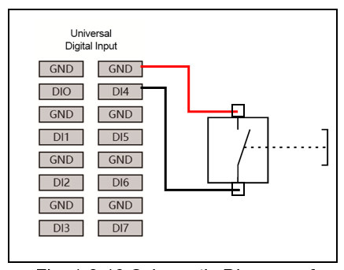

.. centered:: Steuerkasten

.. figure:: installation/140.png
	:align: center
	:width: 6in

.. centered:: Integrierter Mini-Steuerkasten (mini BOX)
.. centered:: Abbildung 3.5-14 Allgemeiner Digitalausgang Schema 02

Interaktion mit anderen Geräten oder SPSen
~~~~~~~~~~~~~~~~~~~~~~~~~~~~~~~~~~~~~~~~~~~~~~~~~~~

Das folgende Beispiel zeigt die Interaktion der digitalen Ein- und Ausgänge mit anderen Geräten oder SPSen.

.. figure:: installation/054.png
	:align: center
	:width: 6in

.. centered:: Steuerkasten

.. figure:: installation/141.png
	:align: center
	:width: 6in

.. centered:: Integrierter Mini-Steuerkasten (mini BOX)
.. centered:: Abbildung 3.5-15 Interaktion mit anderen Geräten oder SPSen (Schema)

Analoge I/O
~~~~~~~~~~~~~~~~

.. centered:: Tabelle 3.5-4 Analogeingang/Ausgang Strom/Spannung
.. list-table::
   :widths: 30 20 10 10 10 10
   :header-rows: 0
   :align: center

   * - **Klemme**
     - **Parameter**
     - **Min.**
     - **Typ.**
     - **Max.**
     - **Einheit**

   * - | Analogeingang Strom
       | [AIx-END]
     - |
       | Strom
       | Impedanz
       | Auflösung
     - |
       | 0
       | -
       | -
     - |
       | -
       | 500
       | 12
     - |
       | 20
       | -
       | -
     - |
       | mA
       | Ohm
       | Bit

   * - | Analogeingang Spannung
       | [AIx-END]
     - |
       | Spannung
       | Impedanz
       | Auflösung
     - |
       | 0
       | -
       | -
     - |
       | -
       | 510
       | 12
     - |
       | 10
       | -
       | -
     - |
       | V
       | kOhm
       | Bit

   * - | Analogausgang Strom
       | [AOx-END]
     - |
       | Strom
       | Spannung
       | Auflösung
     - |
       | 0
       | 0
       | -
     - |
       | -
       | -
       | 12
     - |
       | 20
       | 10
       | -
     - |
       | mA
       | V
       | Bit

   * - | Analogausgang Spannung
       | [AOx-END]
     - |
       | Spannung
       | Strom
       | Impedanz
       | Auflösung
     - |
       | 0
       | 0
       | -
       | -
     - |
       | -
       | -
       | 100
       | 12
     - |
       | 10
       | 20
       | -
       | -
     - |
       | V
       | mA
       | Ohm
       | Bit

Analoge I/Os werden verwendet, um Spannungen (0-10 V) oder Ströme (0-20 mA) anderer Geräte einzustellen oder zu messen.

Um eine hohe Genauigkeit zu erreichen, werden die folgenden Methoden empfohlen.

-   Verwenden Sie für das Gerät und den Steuerschrank dieselbe Masse (GND).

-   Verwenden Sie abgeschirmte Kabel oder verdrillte Leitungspaare.

Das folgende Beispiel zeigt die Verwendung von analogen I/Os.

**Verwendung eines Analogausgangs**

Das folgende Beispiel zeigt die Verwendung eines Analogausgangs zur Steuerung eines Förderbands.

.. figure:: installation/056.png
	:align: center
	:width: 3in

.. centered:: Steuerkasten

.. figure:: installation/142.png
	:align: center
	:width: 6in

.. centered:: Integrierter Mini-Steuerkasten (mini BOX)
.. centered:: Abbildung 3.5-16 Analogausgang (Schema)

**Verwendung eines Analogeingangs**

Das folgende Beispiel zeigt die Verwendung eines Analogeingangs zum Anschluss eines analogen Sensors.

.. figure:: installation/057.png
	:align: center
	:width: 3in

.. centered:: Steuerkasten

.. figure:: installation/143.png
	:align: center
	:width: 6in

.. centered:: Integrierter Mini-Steuerkasten (mini BOX)
.. centered:: Abbildung 3.5-17 Analogeingang (Schema)

Optionale Module für FR3MT & 3C
~~~~~~~~~~~~~~~~~~~~~~~~~~~~~~~~~~~~~~~~~~~~~~~~~~~~~~~~~

Vorwort
+++++++++++++++++++++++++

Die Definition eines kollaborativen Roboters folgt den internationalen ISO-Normen und den einschlägigen nationalen Bestimmungen zum Schutz des Bedieners. Wir empfehlen nicht, den Roboter direkt in Anwendungen einzusetzen, bei denen der Mensch das Arbeitsobjekt ist. Falls ein Anwender oder Anwendungsentwickler dennoch eine Anwendung realisieren möchte, bei der der Mensch das Arbeitsobjekt ist, muss der Anwender oder Anwendungsentwickler unter der Voraussetzung einer umfassenden Bewertung und der Gewährleistung der Personensicherheit den Roboter mit einem sicheren, zuverlässigen, ausreichend getesteten und zertifizierten Sicherheitssystem ausstatten, um die Sicherheit von Personen zu schützen.

Sicherheitshinweise
***************************

Dieses Handbuch dient nur als Leitfaden für die Sicherheitszertifizierung durch den Kunden. Das Wartungspersonal muss über die erforderliche Fachkompetenz verfügen. Für Schäden, die durch nicht qualifiziertes Personal verursacht werden, lehnt FAIRINO jede Haftung ab.

.. important:: Wenn der Roboter (Roboterarm, Spannungsversorgungsmodul, Erweiterungsmodul) durch menschliches Verschulden beschädigt, verändert oder modifiziert wird, lehnt FAIRINO jede Haftung ab. FAIRINO übernimmt keine Haftung für Schäden am Roboter oder anderen Geräten, die durch fehlerhafte, vom Kunden erstellte Programme verursacht werden.

Gültigkeit und Verantwortung
****************************************

Die Informationen in diesem Handbuch umfassen nicht die Planung, Installation und den Betrieb einer vollständigen Roboteranwendung und auch nicht alle Peripheriegeräte, die die Sicherheit dieses Gesamtsystems beeinträchtigen könnten. Die Planung und Installation dieses Gesamtsystems muss den Sicherheitsanforderungen entsprechen, die in den Normen und Vorschriften des Landes festgelegt sind, in dem der Roboter installiert wird.

Der Integrator von FAIRINO ist dafür verantwortlich, die Einhaltung der einschlägigen nationalen Gesetze und Vorschriften sicherzustellen und sicherzustellen, dass in der vollständigen Roboteranwendung keine wesentlichen Gefahren bestehen. Dies umfasst unter anderem folgende Punkte:

-   Durchführung einer Risikobewertung für das gesamte Robotersystem.
-   Verbinden der durch die Risikobewertung definierten weiteren Maschinen und zusätzlichen Sicherheitseinrichtungen.
-   Einrichten geeigneter Sicherheitseinstellungen in der Software.
-   Sicherstellen, dass der Benutzer keine Sicherheitsmaßnahmen verändert.
-   Bestätigen, dass das gesamte Robotersystem korrekt geplant und installiert wurde.
-   Klare Formulierung der Bedienungsanleitung.
-   Anbringen der entsprechenden Kennzeichnungen und Kontaktdaten des Integrators am Roboter.
-   Sammeln aller Dokumente in den technischen Unterlagen, einschließlich dieses Handbuchs.

Haftungsbeschränkung
***************************

Alle in diesem Handbuch enthaltenen Sicherheitsinformationen sind nicht als allgemeingültige Sicherheitsgarantie für den Roboter zu betrachten. Selbst bei Beachtung aller Sicherheitshinweise können Personenschäden oder Sachschäden nicht ausgeschlossen werden.

Sicherheitswarnsymbole
***************************

Am Produkt werden die folgenden Sicherheitswarnsymbole verwendet.

.. important::
	.. figure:: installation/008.png
		:width: 60
		:height: 50
		:align: left

	Bezeichnung: **GEFAHR**

	Bedeutung: Dies weist auf eine unmittelbar gefährliche elektrische Situation hin, die, wenn sie nicht vermieden wird, zu Tod oder schweren Verletzungen führt.

.. important::
	.. figure:: installation/009.png
		:width: 60
		:height: 50
		:align: left

	Bezeichnung: **GEFAHR ELEKTRISCHER SCHLAG**

	Bedeutung: Dies weist auf eine unmittelbar gefährliche Situation durch elektrischen Schlag hin, die, wenn sie nicht vermieden wird, zu Tod oder schweren Verletzungen durch Stromschlag führen kann.

.. important::
	.. figure:: installation/010.png
		:width: 60
		:height: 50
		:align: left

	Bezeichnung: **GEFAHR HEISSE OBERFLÄCHE**

	Bedeutung: Dies weist auf eine möglicherweise gefährliche heiße Oberfläche hin, die bei Kontakt zu Verletzungen führen kann.

.. important::
	.. figure:: installation/112.png
		:width: 60
		:height: 50
		:align: left

	Bezeichnung: **ERDUNG**

	Bedeutung: Weist darauf hin, dass das Gerät zuverlässig geerdet werden muss.

Schnittstellendefinition des FR3MT&3C Fußes und der Module
++++++++++++++++++++++++++++++++++++++++++++++++++++++++++++++++++++++++++++++++++++++++++++++++++++

Schnittstellendefinition des Fußes
************************************************

Der Fuß des Roboters verfügt über insgesamt 7 Tasten und Anschlüsse nach außen, deren Definition wie folgt ist:

.. figure:: installation/113.png
	:align: center
	:width: 4in

.. centered:: Abbildung 3.5-18 Tasten und Anschlüsse am Fuß des Roboters

.. note:: Alle Ansichten der Pin-Belegung der Fußschnittstellen sind aus der Perspektive der Montagebezugsfläche dargestellt.

**1. Ein-/Ausschalter des Steuerschranks**: Standardmäßig erfolgt beim Einschalten der Spannungsversorgung ein automatischer Start.

**2. M8-A-4-polig Buchse Pin-Belegung**:
Benutzer-Netzwerkanschluss. Adresse 192.168.57.2. Steckverbinder: M8-A-4-polig Buchse [Anschlussseitig M8-A-4-polig Stecker], Steckverbinder gemäß IEC 61076-2-101.

.. figure:: installation/114.png
	:align: center
	:width: 2in

.. list-table::
   :widths: 20 30 50
   :header-rows: 0
   :align: center

   * - **Pin**
     - **Definition**
     - **Beschreibung**

   * - 1
     - TX+
     - Daten senden +

   * - 2
     - RX+
     - Daten empfangen +

   * - 3
     - RX-
     - Daten empfangen -

   * - 4
     - TX-
     - Daten senden -

**3. M12-L-5-polig Stecker Pin-Belegung**:
Steckverbinder: M12-L-5-polig Stecker [Anschlussseitig M12-L-5-polig Buchse], Steckverbinder gemäß IEC 61076-2-101.

.. figure:: installation/115.png
	:align: center
	:width: 2in

.. list-table::
   :widths: 10 15 15 20 40
   :header-rows: 0
   :align: center

   * - **Pin**
     - **Farbe**
     - **Definition**
     - **Beschreibung**
     - **Bemerkung**

   * - 1
     - Schwarz 1
     - 0V
     - Steuerspannung Masse
     - Roboter-Steuerspannung Masse [Alternative Steuerschrank-Spg., nicht anschließen]

   * - 2
     - Braun 2
     - 24V
     - Steuerspannung Plus
     - Roboter-Steuerspannung Plus [Alternative Steuerschrank-Spg., nicht anschließen]

   * - 3
     - Weiß 3
     - 48V
     - Antriebsspannung Plus
     - Roboter-Antriebsspannung Plus

   * - 4
     - Blau 4
     - 0V
     - Antriebsspannung Masse
     - Roboter-Antriebsspannung Masse

   * - 5
     - Grau 5
     - PE
     - Erde
     - Schutzleiter

.. note::
  ① Im Fuß ist eine 48V-zu-24V-Spannungswandlung für die Steuerspannung integriert.

  ② Diese 48V-zu-24V-Wandlung im Fuß dient als Ersatzstromversorgung für die 24V-Steuerspannung, die über den Spannungsversorgungseingang bereitgestellt wird.

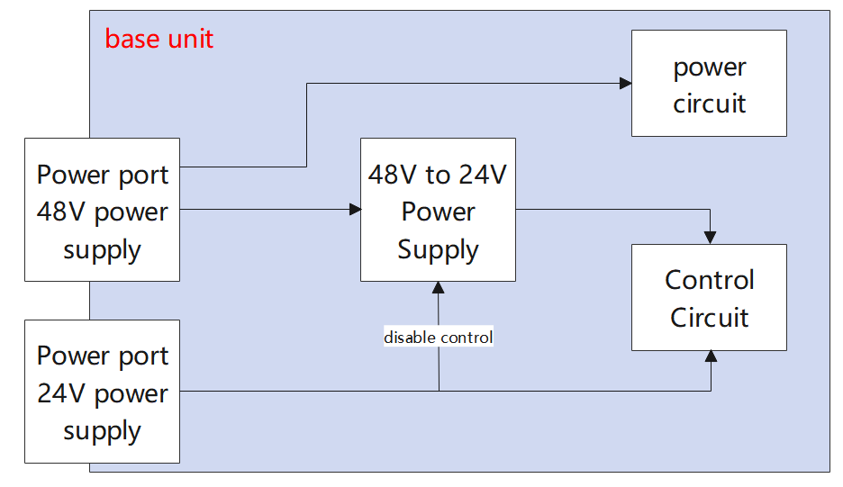

.. centered:: Abbildung 3.5-19 Schema der 48V-zu-24V-Stromversorgung im Fuß

**4. M12-A-12-polig Buchse Pin-Belegung**:
Steckverbinder: M12-A-12-polig Buchse [Anschlussseitig M12-A-12-polig Stecker], Steckverbinder gemäß IEC 61076-2-101.

.. figure:: installation/117.png
	:align: center
	:width: 2in

.. list-table::
   :widths: 10 15 20 40
   :header-rows: 0
   :align: center

   * - **Pin**
     - **Definition**
     - **Beschreibung**
     - **Bemerkung**

   * - 1
     - AGND
     - Analogmasse
     - Bezugspotential für Analogsignale

   * - 2
     - 0V
     - 24V Spg. Masse
     - Steuerspannung Masse

   * - 3
     - 485-A
     - 485 Kommunikation A
     - 485-Kommunikation für Erweiterung/Reserve

   * - 4
     - 485-B
     - 485 Kommunikation B
     - 485-Kommunikation für Erweiterung/Reserve

   * - 5
     - DI0/DO0
     - Digitaleingang/-ausgang 0
     - 5,6,7 teilen sich eine Schnittstelle. Konfigurierbar als Ein- oder Ausgang per Software. Nur eine Funktion gleichzeitig.

   * - 6
     - DI1/DO1
     - Digitaleingang/-ausgang 1
     - 5,6,7 teilen sich eine Schnittstelle. Konfigurierbar als Ein- oder Ausgang per Software. Nur eine Funktion gleichzeitig.

   * - 7
     - DI2/DO2
     - Digitaleingang/-ausgang 2
     - 5,6,7 teilen sich eine Schnittstelle. Konfigurierbar als Ein- oder Ausgang per Software. Nur eine Funktion gleichzeitig.

   * - 8
     - AI0/AO0
     - Analogeingang/-ausgang 0
     - 8,9 teilen sich eine Schnittstelle. Konfigurierbar als Ein- oder Ausgang per Software. Nur eine Funktion gleichzeitig.

   * - 9
     - AI1/AO1
     - Analogeingang/-ausgang 1
     - 8,9 teilen sich eine Schnittstelle. Konfigurierbar als Ein- oder Ausgang per Software. Nur eine Funktion gleichzeitig.

   * - 10
     - 24V
     - 24V Spg. Plus
     - Steuerspannung Plus

   * - 11
     - DI3/DO3
     - Digitaleingang/-ausgang 3
     - 11,12 teilen sich eine Schnittstelle. Konfigurierbar als Ein- oder Ausgang per Software. Nur eine Funktion gleichzeitig.

   * - 12
     - DI4/DO4
     - Digitaleingang/-ausgang 4
     - 11,12 teilen sich eine Schnittstelle. Konfigurierbar als Ein- oder Ausgang per Software. Nur eine Funktion gleichzeitig.

**5. M8-A-4-polig Buchse Pin-Belegung**:
Debug-Netzwerkanschluss. Adresse 192.168.58.2. Steckverbinder: M8-A-4-polig Buchse [Anschlussseitig M8-A-4-polig Stecker], Steckverbinder gemäß IEC 61076-2-101.

.. figure:: installation/114.png
	:align: center
	:width: 2in

.. list-table::
   :widths: 20 30 50
   :header-rows: 0
   :align: center

   * - **Pin**
     - **Definition**
     - **Beschreibung**

   * - 1
     - TX+
     - Daten senden +

   * - 2
     - RX+
     - Daten empfangen +

   * - 3
     - RX-
     - Daten empfangen -

   * - 4
     - TX-
     - Daten senden -

6. USB-A Anschluss, USB 2.0 - für interne Debug-Zwecke.

7. HDMI-A Anschluss, HDMI-Anzeige - für interne Debug-Zwecke.

Schnittstellendefinition des Spannungsversorgungsmoduls
**************************************************************

Die Spannungsversorgung verwendet ein Meanwell NDR-480-48. Die Schnittstellendefinition ist wie folgt.

.. figure:: installation/118.png
	:align: center
	:width: 3in

.. list-table::
   :widths: 20 20 20 40
   :header-rows: 0
   :align: center

   * - **Pin**
     - **Definition**
     - **Beschreibung**
     - **Bemerkung**

   * - 1
     - L
     - Außenleiter (Phase)
     - Eingang 100-240 V AC

   * - 2
     - N
     - Neutralleiter
     - Eingang 100-240 V AC

   * - 3
     - PE
     - Schutzleiter
     - Erdungspunkt

   * - 4
     - +V
     - 48V
     - Ausgang 48 V / 10 A

   * - 5
     - +V
     - 48V
     - Ausgang 48 V / 10 A

   * - 6
     - -V
     - 0V
     - Ausgang 48 V / 10 A (Masse)

   * - 7
     - -V
     - 0V
     - Ausgang 48 V / 10 A (Masse)

Schnittstellendefinition des Erweiterungsmoduls
**************************************************************

Das Erweiterungsmodul verfügt über eine Not-Halt-Funktion und eine Energieableitfunktion. Die externen Anschlüsse des Erweiterungsmoduls und die interne Topologie sind wie folgt:

.. figure:: installation/119.png
	:align: center
	:width: 6in

.. list-table::
   :widths: 20 30 50
   :header-rows: 0
   :align: center

   * - **Pin**
     - **Definition**
     - **Beschreibung**

   * - 1
     - 48-IN
     - 48V Eingang Plus

   * - 2
     - 0V
     - 48V Eingang Masse

   * - 3
     - PE
     - Schutzleiter

   * - 4
     - PE
     - Schutzleiter

   * - 5
     - 24V
     - Steuerspannung Plus

   * - 6
     - 0V
     - Steuerspannung Masse

   * - 7
     - 0V
     - Antriebsspannung Masse

   * - 8
     - 48-OUT
     - Antriebsspannung Plus

   * - 9
     - ESW1
     - Not-Halt-Taster 1 Plus

   * - 10
     - 0V
     - Not-Halt-Taster 1 Masse

   * - 11
     - ESW2
     - Not-Halt-Taster 2 Plus

   * - 12
     - 0V
     - Not-Halt-Taster 2 Masse

   * - 13
     - E-O-2
     - Potentialfreier Schließer 2

   * - 14
     - E-O-1
     - Potentialfreier Schließer 1

   * - 15
     - E-C-2
     - Potentialfreier Öffner 2

   * - 16
     - E-C-1
     - Potentialfreier Öffner 1

Anwendungsszenarien für FR3MT&3C
++++++++++++++++++++++++++++++++++++++++++++++++++++++++++++

In den meisten Anwendungsszenarien reicht es aus, wenn der Benutzer nur das Benutzerkabelbündel auswählt. Die spezifischen Anwendungsszenarien sind wie folgt:

.. list-table::
   :widths: 10 15 15 20 40
   :header-rows: 0
   :align: center

   * - **Nr.**
     - **Szenariokategorie**
     - **Benutzer-Spannungsversorgung**
     - **Benutzer-Funktionsanforderungen**
     - **Empfohlenes Konfigurationsschema**

   * - 1
     - Basisanwendung
     - 48 V / 10 A DC vorhanden
     - Keine Not-Halt-/Energieableitfunktion
     - Benutzerkabelbündel

   * - 2
     - Sicherheitserweiterung
     - 48 V / 10 A DC vorhanden
     - Not-Halt + Energieableitfunktion erforderlich
     - Benutzerkabelbündel + Erweiterungsmodul

   * - 3
     - Separate Spannungsversorgung
     - 48 V / 10 A DC nicht vorhanden
     - Keine Not-Halt-/Energieableitfunktion
     - Benutzerkabelbündel + Spannungsversorgungsmodul + Netzkabel

   * - 4
     - Vollintegrierte Funktion
     - 48 V / 10 A DC nicht vorhanden
     - Not-Halt + Energieableitfunktion erforderlich
     - Benutzerkabelbündel + Spannungsversorgungsmodul + Netzkabel + Erweiterungsmodul

Basisanwendung
**************************************************************

Es wird nur das Benutzerkabelbündel ausgewählt. Die Verbindungsmethode ist wie folgt:

1.  Verbinden Sie das M12-L-5-polig Buchse des Spannungsversorgungskabels mit dem Fuß. Am anderen Ende befinden sich 5 Adern mit den Kennzeichnungen 48V/0V/24V/0V/PE. Verbinden Sie die drei Adern 48V/0V/PE mit den entsprechenden Klemmen der Benutzerspannungsversorgung. Die Adern für 24V/0V werden nicht angeschlossen und isoliert.

2.  Verbinden Sie den M12-A-12-polig Stecker und den M8-A-4-polig Stecker mit den entsprechenden Anschlüssen am Fuß.

.. figure:: installation/120.png
	:align: center
	:width: 6in

.. centered:: Abbildung 3.5-20 Verbindungsmethode mit ausgewähltem Benutzerkabelbündel

Sicherheitserweiterung
**************************************************************

Es werden Benutzerkabelbündel + Erweiterungsmodul ausgewählt. Die Verbindungsmethode ist wie folgt:

1.  Das 0,5 m lange Verbindungskabel für das Erweiterungsmodul hat an beiden Enden je 3 Adern mit den Kennzeichnungen 48V/0V/PE. Verbinden Sie das Eingangsende dieses Kabels mit den entsprechenden Klemmen der Benutzerspannungsversorgung. Stecken Sie das Ausgangsende in die Positionen 48Vin/0V/PE am Erweiterungsmodul.

2.  Verbinden Sie das M12-L-5-polig Buchse des Spannungsversorgungskabels mit dem Fuß. Am anderen Ende befinden sich 5 Adern mit den Kennzeichnungen 48V/0V/24V/0V/PE. Verbinden Sie diese 5 Adern mit den Positionen 48Vout/0V/0V/24V/PE am Erweiterungsmodul.

3.  Verbinden Sie den M12-A-12-polig Stecker und den M8-A-4-polig Stecker mit den entsprechenden Anschlüssen am Fuß.

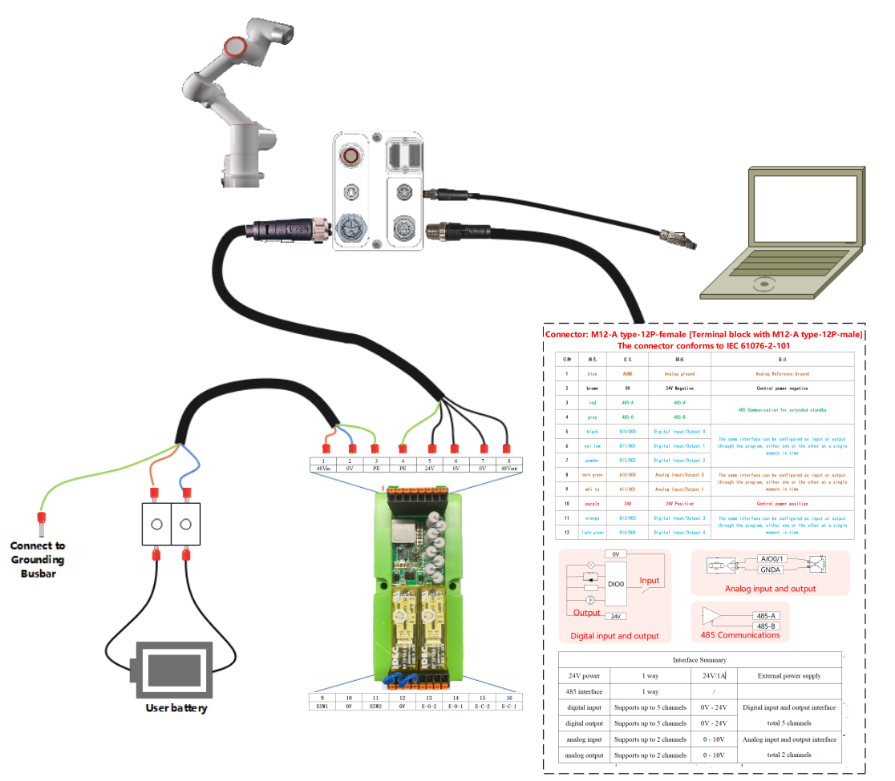

.. centered:: Abbildung 3.5-21 Verbindungsmethode mit Benutzerkabelbündel + Erweiterungsmodul

Separate Spannungsversorgung
**************************************************************

Es werden Benutzerkabelbündel + Spannungsversorgungsmodul + Netzkabel ausgewählt. Die Verbindungsmethode ist wie folgt:

1.  Das 1,5 m lange Netzkabel hat am Ende 3 Adern mit den Kennzeichnungen L/N/PE. Verbinden Sie diese mit den entsprechenden Eingangsklemmen des NDR-480-48 (Spannungsversorgung).

2.  Verbinden Sie das M12-L-5-polig Buchse des Spannungsversorgungskabels mit dem Fuß. Am anderen Ende befinden sich 5 Adern mit den Kennzeichnungen 48V/0V/24V/0V/PE. Verbinden Sie die drei Adern 48V/0V/PE mit den entsprechenden Ausgangsklemmen des Spannungsversorgungsmoduls. Die Adern für 24V/0V werden nicht angeschlossen und isoliert.

3.  Verbinden Sie den M12-A-12-polig Stecker und den M8-A-4-polig Stecker mit den entsprechenden Anschlüssen am Fuß.

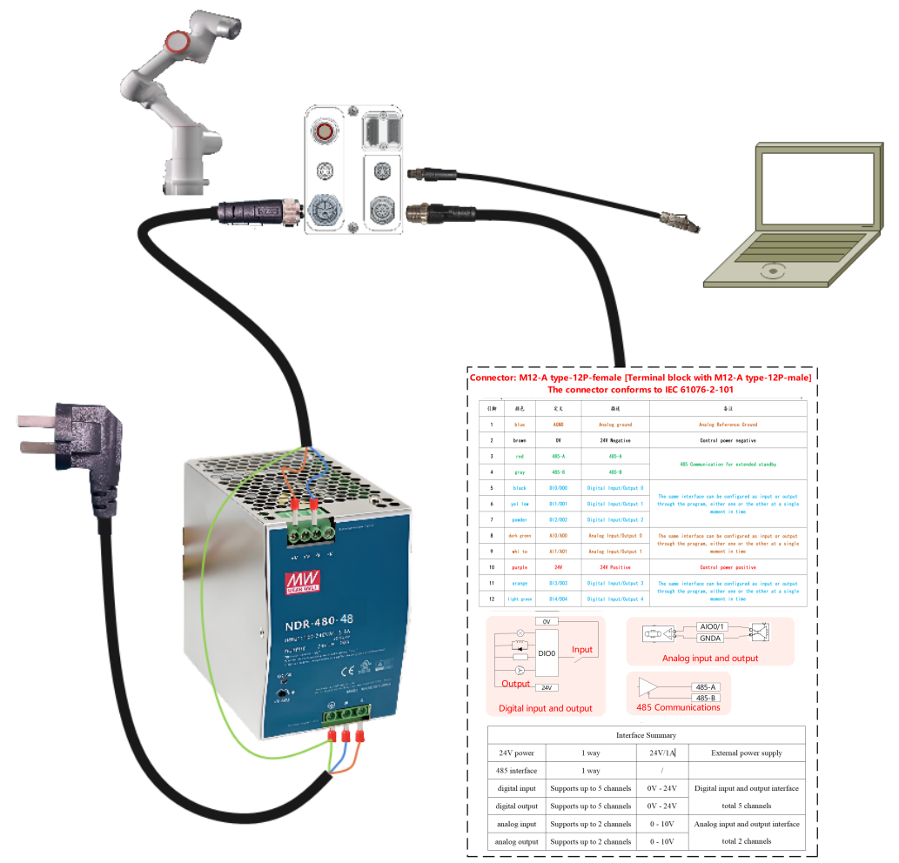

.. centered:: Abbildung 3.5-22 Verbindungsmethode mit Benutzerkabelbündel + Spannungsversorgungsmodul + Netzkabel

Vollintegrierte Funktion
**************************************************************

Es werden Benutzerkabelbündel + Spannungsversorgungsmodul + Netzkabel + Erweiterungsmodul ausgewählt. Die Verbindungsmethode ist wie folgt:

1.  Das 1,5 m lange Netzkabel hat am Ende 3 Adern mit den Kennzeichnungen L/N/PE. Verbinden Sie diese mit den entsprechenden Eingangsklemmen des NDR-480-48 (Spannungsversorgung).

2.  Das 0,5 m lange Verbindungskabel für das Erweiterungsmodul hat an beiden Enden je 3 Adern mit den Kennzeichnungen 48V/0V/PE. Verbinden Sie das Eingangsende dieses Kabels mit den entsprechenden Ausgangsklemmen des NDR-480-48 (Spannungsversorgung). Die PE-Ader wird gemeinsam mit dem Eingangs-PE verwendet. Stecken Sie das Ausgangsende in die Positionen 48Vin/0V/PE am Erweiterungsmodul.

3.  Verbinden Sie das M12-L-5-polig Buchse des Spannungsversorgungskabels mit dem Fuß. Am anderen Ende befinden sich 5 Adern mit den Kennzeichnungen 48V/0V/24V/0V/PE. Verbinden Sie diese 5 Adern mit den Positionen 48Vout/0V/0V/24V/PE am Erweiterungsmodul.

4.  Verbinden Sie den M12-A-12-polig Stecker und den M8-A-4-polig Stecker mit den entsprechenden Anschlüssen am Fuß.

.. figure:: installation/123.png
	:align: center
	:width: 6in

.. centered:: Abbildung 3.5-23 Verbindungsmethode mit Benutzerkabelbündel + Spannungsversorgungsmodul + Netzkabel + Erweiterungsmodul

Stückliste der optionalen Teile
+++++++++++++++++++++++++++++++++++++++++++++++++++++++++++++++

Die Materialien für das Benutzerkabelbündel 5 m sind wie folgt:

.. list-table::
   :widths: 20 60 20
   :header-rows: 0
   :align: center

   * - **Nr.**
     - **Bezeichnung**
     - **Menge**

   * - 1
     - FR3MT&3C-Gleichstromkabel-5M
     - 1

   * - 2
     - FR3MT&3C-I/O-Signalkabel-5M
     - 1

   * - 3
     - FR3MT&3C-Ethernet-Kabelbündel-5M
     - 1

   * - 4
     - M8 gerader Stecker, M8-P4A-PLA05, 4-polig
     - 1

Die Materialien für das Benutzerkabelbündel 1 m sind wie folgt:

.. list-table::
   :widths: 20 60 20
   :header-rows: 0
   :align: center

   * - **Nr.**
     - **Bezeichnung**
     - **Menge**

   * - 1
     - FR3MT&3C-Gleichstromkabel-1M
     - 1

   * - 2
     - FR3MT&3C-I/O-Signalkabel-1M
     - 1

   * - 3
     - FR3MT&3C-Ethernet-Kabelbündel-1M
     - 1

   * - 4
     - M8 gerader Stecker, M8-P4A-PLA05, 4-polig
     - 1

Die Materialien für das Spannungsversorgungsmodul sind wie folgt:

.. list-table::
   :widths: 20 60 20
   :header-rows: 0
   :align: center

   * - **Nr.**
     - **Bezeichnung**
     - **Menge**

   * - 1
     - Meanwell Schaltnetzteil, NDR-480-48
     - 1

Die Materialien für das Netzkabel sind wie folgt:

.. list-table::
   :widths: 20 60 20
   :header-rows: 0
   :align: center

   * - **Nr.**
     - **Bezeichnung**
     - **Menge**

   * - 1
     - FR3MT&3C-Netzkabel-1.5M
     - 1

Die Materialien für das Erweiterungsmodul sind wie folgt:

.. list-table::
   :widths: 20 60 20
   :header-rows: 0
   :align: center

   * - **Nr.**
     - **Bezeichnung**
     - **Menge**

   * - 1
     - FR3MT&3C Fuß-Erweiterungsmodul
     - 1

   * - 2
     - FR3MT&3C Verbindungskabel Spg.-Versorgung/Erweiterungsmodul-0.5M
     - 1

Teach Pendant und LED an der Flanschseite
------------------------------------------------------

Für das Teach Pendant des Roboters kann ein Computer oder Tablet verwendet werden, um auf den Roboter zuzugreifen und ihn zu steuern. Die Verbindungsmethode kann Abschnitt 3.5.3 entnommen werden. Alternativ kann auch unser FR-HMI Teach Pendant verwendet werden. Dieses Teach Pendant ist optionales Zubehör.

Einführung in die Taster-Box
~~~~~~~~~~~~~~~~~~~~~~~~~~~~~~~

60 Taster-Box (POE) (BX01)
++++++++++++++++++++++++++++++

.. figure:: installation/058.png
	:align: center
	:width: 6in

.. centered:: Abbildung 3.6-1 60 Taster-Box (POE) (BX01)

**Not-Halt-Taster:**\ Wenn der Not-Halt-Taster gedrückt wird, versetzt der Roboter in den Not-Halt-Zustand.

**Type-C-Schnittstelle:**\ Anschluss für das Web-Teach-Pendant.

**Taste 1:**\ Kurzes Drücken: Umschalten zwischen Automatik-/Handmodus. Langes Drücken: Ein-/Ausschalten des Ziehemodus (Drag & Drop).

**Taste 2:**\ Kurzes Drücken: Aufzeichnen eines Teach-Punkts. Langes Drücken: Ein-/Ausschalten des Zustands "Nicht mit Teach Pendant verbunden".

**Taste 3:**\ Kurzes Drücken: Starten/Stoppen des laufenden Programms.

60 Taster-Box (POE) (BX02)-V1.0
++++++++++++++++++++++++++++++++++++

.. figure:: installation/059.png
	:align: center
	:width: 6in

.. centered:: Abbildung 3.6-2 60 Taster-Box (POE) (BX02)-V1.0

**Not-Halt-Taster:**\ Wenn der Not-Halt-Taster gedrückt wird, versetzt der Roboter in den Not-Halt-Zustand.

**Start/Stop:**\ Startet / Stoppt das laufende Programm.

**Netzwerkanschluss:**\ Verbindung zum Web-Teach-Pendant.

**Ausschalten:**\ Derzeit nicht aktiviert.

**Punkt aufzeichnen:**\ Aufzeichnen eines Teach-Punkts.

**Teach-Modus:**\ Ein-/Ausschalten des Zustands "Verbunden mit Teach Pendant".

**Betriebsmodus:**\ Umschalten zwischen Automatik- / Handmodus.

**Ziehemodus (Drag & Drop):**\ Ein-/Ausschalten des Ziehemodus.

60 Taster-Box (POE) (BX02)-V2.0
++++++++++++++++++++++++++++++++++++++++++

.. image:: installation/079.png
   :width: 6in
   :align: center

.. centered:: Abbildung 3.6-3 60 Taster-Box (POE) (BX02)-V2.0

**Not-Halt-Taster:**\ Wenn der Not-Halt-Taster gedrückt wird, versetzt der Roboter in den Not-Halt-Zustand.

**Start/Stop:**\ Startet / Stoppt das laufende Programm.

**Netzwerkanschluss:**\ Verbindung zum Web-Teach-Pendant.

**IP-Reset:**\ Setzt die IP-Adresse des Netzwerkanschlusses zurück.

**Punkt aufzeichnen:**\ Aufzeichnen eines Teach-Punkts.

**Ein-Klick-Löschung:**\ Löscht alle behebbaren Fehler.

**Betriebsmodus:**\ Umschalten zwischen Automatik- / Handmodus.

**Ziehemodus (Drag & Drop):**\ Ein-/Ausschalten des Ziehemodus.

Einführung in das FR-HMI Teach Pendant
~~~~~~~~~~~~~~~~~~~~~~~~~~~~~~~~~~~~~~~~~~~~~~~~~~~

.. figure:: installation/060.png
	:align: center
	:width: 6in

.. centered:: Abbildung 3.6-4 FR-HMI Teach Pendant Vorderseite

.. figure:: installation/061.png
	:align: center
	:width: 6in

.. centered:: Abbildung 3.6-5 FR-HMI Teach Pendant Rückseite

**Bildschirm:**\ Touch-Bedienung und Anzeigeoberfläche des Teach Pendants.

**Starttaste:**\ Startet das Programm.

**Stopptaste:**\ Stoppt das aktuell laufende Programm.

**Joint-Tasten:**\ Gelenk-Tippbetrieb des Roboters.

**Dreistufiger Zustimmtaster:**\ Aktiviert den Roboter im Handmodus (Enable).

**Not-Halt-Taster:**\ Wenn der Not-Halt-Taster gedrückt wird, versetzt der Roboter in den Not-Halt-Zustand.

**Modus-Taste:**\ Drehschalter zum Umschalten zwischen Hand- und Automatikmodus.

Definition der LED an der Flanschseite
~~~~~~~~~~~~~~~~~~~~~~~~~~~~~~~~~~~~~~~~~

.. centered:: Tabelle 3.6‑1 Definition der LED an der Flanschseite
.. list-table::
   :widths: 50 50
   :header-rows: 0
   :align: center

   * - **Funktion**
     - **LED-Farbe**

   * - Keine Kommunikation hergestellt
     - Wechselt zwischen "Aus", "Rot", "Grün", "Blau"

   * - Automatikmodus
     - Blau Dauerlicht

   * - Handmodus
     - Grün Dauerlicht

   * - Ziehemodus (Drag & Drop)
     - Weiß-Cyan Dauerlicht

   * - Punktaufzeichnung über Taster-Box (nur bei Verwendung der Taster-Box)
     - Violett zweimal blinken

   * - Eintritt in den Zustand "Nicht mit Taster-Box verbunden" (nur bei Verwendung der Taster-Box)
     - Violett zweimal blinken

   * - Start Ausführung (nur bei Verwendung der Taster-Box)
     - Cyan zweimal blinken

   * - Stopp Ausführung (nur bei Verwendung der Taster-Box)
     - Rot zweimal blinken

   * - Fehler (nur bei Verwendung der Taster-Box)
     - Rot Dauerlicht

   * - Nullpunktkalibrierung abgeschlossen
     - Weiß-Cyan dreimal blinken

   * - Deaktiviert (Löschen der Bereitschaft)
     - Gelb zweimal blinken