Node-Editor-Programmierung
==========================

.. toctree::
   :maxdepth: 6

Basisinformationen
------------------

Systemübersicht
~~~~~~~~~~~~~~~

Die Node-Editor-Programmierung ist eine speziell für Roboter entwickelte Programmierumgebung. Ihre Hauptfunktionen und technischen Merkmale sind wie folgt:

-  Die Verbindungslinien zwischen den Knoten stellen die logischen Zusammenhänge des Programms gut dar.
-  Durch das Erstellen von Knoten, das Verbinden von Knoten und das Bearbeiten von Knotenparametern kann die Roboterprogrammierung hauptsächlich durch Ziehen und eine minimale Parametereingabe abgeschlossen werden.
-  Dies trägt dazu bei, Code besser zu visualisieren und Skripte für komplexe und sich wiederholende Aufgaben schneller zu schreiben.

.. image:: node_editor_software/001.png
   :width: 6in
   :align: center

.. centered:: Abbildung 11.1-1 Node-Editor-Programmieroberfläche

Werkzeugleiste
~~~~~~~~~~~~~~

Verwenden Sie die Werkzeugleiste oben links auf der Node-Editor-Programmierseite.

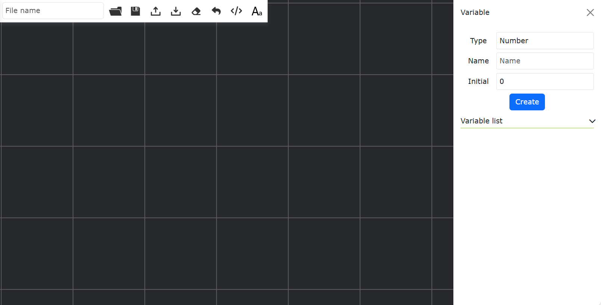

.. centered:: Abbildung 11.1-2 Aktionswerkzeugleiste

.. note::
   .. image:: coding/006.png
      :height: 0.75in
      :align: left

   Bezeichnung: **Öffnen**

   Funktion: Öffnet eine Benutzerprogrammdatei. Wählen Sie im Popup-Fenster aus, ob Sie eine Datei laden oder löschen möchten.

.. note::
   .. image:: coding/010.png
      :height: 0.75in
      :align: left

   Bezeichnung: **Speichern**

   Funktion: Speichert den bearbeiteten Inhalt des Node-Editors.

.. note::
   .. image:: node_editor_software/131.png
      :height: 0.75in
      :align: left

   Bezeichnung: **Neu laden**

   Funktion: Lädt den Inhalt des Node-Editors der letzten Operation erneut lokal.

.. note::
   .. image:: coding/007.png
      :height: 0.75in
      :align: left

   Bezeichnung: **Neu**

   Funktion: Erstellt eine neue Node-Editor-Programmdatei.

.. note::
   .. image:: coding/008.png
      :height: 0.75in
      :align: left

   Bezeichnung: **Exportieren**

   Funktion: Nach dem Erstellen/Öffnen einer Node-Editor-Programmdatei klicken Sie auf die Schaltfläche "Exportieren". Es öffnet sich das Popup-Fenster "Node-Editor-Programmierung exportieren". Wählen Sie den Arbeitsbereichs-Dateinamen aus, um die Datei zu exportieren (JSON-Format).

.. note::
   .. image:: coding/009.png
      :height: 0.75in
      :align: left

   Bezeichnung: **Importieren**

   Funktion: Klicken Sie auf die Schaltfläche "Importieren". Es öffnet sich ein Import-Popup-Fenster. Wählen Sie die zu importierende Datei aus. Nach dem Import wird der Dateiinhalt im Node-Editor-Arbeitsbereich angezeigt.

.. note::
   .. image:: node_editor_software/129.png
      :height: 0.75in
      :align: left

   Bezeichnung: **Code**

   Funktion: Generiert Lua-Code, nachdem die Knoten verbunden wurden.

Node-Editor-Bedienung
---------------------

Knotenprogramm
~~~~~~~~~~~~~~

Für das Knotenprogramm muss mit der rechten Maustaste in einen leeren Bereich geklickt werden, um die Knotenprogramm-Auswahlleiste zu öffnen. Die Programmbefehle sind hauptsächlich in Logikbefehle, Bewegungsbefehle, Kraftregelungsbefehle, Steuerbefehle, Modbus-Befehle, Befehle für Erweiterungsachsen usw. unterteilt.

Im Eingabefeld oben in der Knotenprogramm-Auswahlleiste kann eine unscharfe Suche durchgeführt werden, um den gewünschten Knotenbefehl schnell zu finden.

Der spezifische Ablauf der Knotenprogrammierung ist wie folgt:

-  Klicken Sie auf den "Begin"-Startknoten, um die Programmierposition des Startknotens zu erstellen.
-  Klicken Sie auf den ausgewählten Programmbefehls-Knoten. Der entsprechende Knoten wird im Arbeitsbereich angezeigt. Seine Befehlsparameter können über Dropdown-Menüs ausgewählt oder durch Eingabe festgelegt werden.
-  Funktion der Pfeile auf der rechten Seite eines Befehlsknotens: 1. Der einzelne Pfeil verbindet den nächsten Knoten. 2. Bei mehreren Pfeilen verbindet der erste "Body"-Pfeil den Inhaltsknoten, der zweite "Completed"-Pfeil den nächsten Knoten.
-  Verbinden Sie den "Begin"-Startknoten mit dem fertig programmierten Knotenprogramm, um die Knotenprogrammierungsoperation abzuschließen.

If/Else-Entscheidungsbefehl
----------------------------

Klicken Sie auf den "If/Else"-Befehlsknoten, um die Node-Editor-Bearbeitungsoberfläche zu öffnen. (Dieser Befehl erfordert grundlegende Programmierkenntnisse. Bei Bedarf wenden Sie sich bitte an uns.)

"If/Else"-Befehl:

- First: Verbindet die Knotenbefehle innerhalb der if-Bedingung.
- Second: Wenn auf der linken Seite nur zwei Bedingungen eingegeben werden, verbindet dies die Knotenbefehle innerhalb der else-Bedingung. Wenn auf der linken Seite drei Bedingungen vorhanden sind, verbindet dies die Knotenbefehle innerhalb der elseif-Bedingung.
- Third: Wenn auf der linken Seite drei Bedingungen vorhanden sind, verbindet dies die else-Bedingung.
- Completed: Verbindet die nachfolgenden Knotenbefehle.

.. image:: node_editor_software/124.png
   :width: 6in
   :align: center

.. centered:: Abbildung 11.3-1 "If/Else"-Befehlsknoten-Oberfläche

While-Befehl
------------

Klicken Sie auf den "While"-Befehlsknoten, um die Node-Editor-Bearbeitungsoberfläche zu öffnen.

Geben Sie im Eingabefeld nach "While" die Wartebedingung ein. Geben Sie im Eingabefeld nach "do" die Aktionsbefehle während der Schleife ein. Klicken Sie auf "Speichern". (Zur Vereinfachung kann der Inhalt von "do" beliebig eingegeben werden. Im Programm können dann andere Befehle zur Einfügung bearbeitet werden.)

"While"-Befehl:

- Condition: While-Schleifenbedingung.

.. image:: node_editor_software/125.png
   :width: 6in
   :align: center

.. centered:: Abbildung 11.4-1 "While"-Befehlsknoten-Oberfläche

Sprungbefehl
------------

Klicken Sie auf den "Sprung"-Befehlsknoten, um die Node-Editor-Bearbeitungsoberfläche zu öffnen.

Beim "Sprung"-Befehl verbindet das erste "Body"-Pfeilsymbol den Hauptinhaltsknoten, das zweite "Completed"-Pfeilsymbol den nachfolgenden goto-Befehlsknoten (Sprungziel). (Dieser Befehl erfordert grundlegende Programmierkenntnisse. Bei Bedarf wenden Sie sich bitte an uns.)

- Sprungname: Geben Sie den Sprungnamen ein, um die Sprungposition festzulegen.

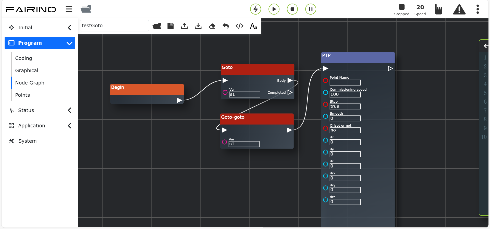

.. centered:: Abbildung 11.5-1 "Sprung"-Befehlsknoten-Oberfläche

.. important:: Der Sprungname darf nicht mit einer Zahl beginnen.

Wartebefehl
-----------

Klicken Sie auf den "Warten"-Befehlsknoten, um die Node-Editor-Bearbeitungsoberfläche zu öffnen.

Dieser Befehl ist ein Verzögerungsbefehl und besteht aus vier Teilen: "WaitMs", "WaitDI", "WaitMultiDI" und "WaitAI".

1. "Warten"-Befehlsknoten, Parameter:

- Wartezeit (ms): Verzögerungswartezeit in Millisekunden. Geben Sie die Anzahl der zu wartenden Millisekunden ein.

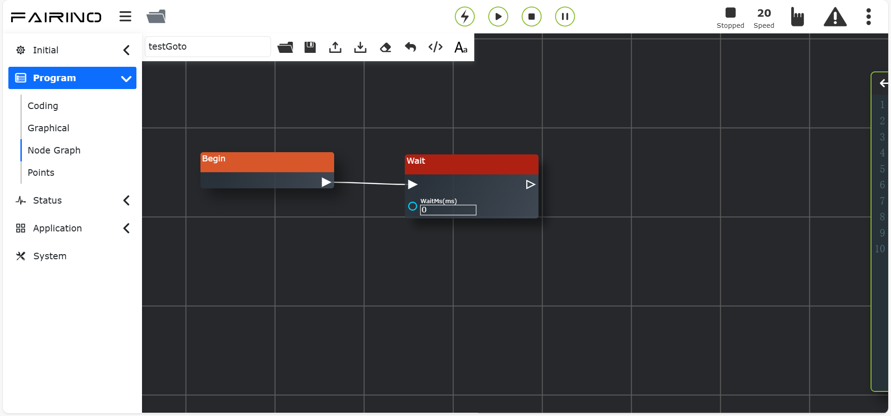

.. centered:: Abbildung 11.6-1 "Warten"-Befehlsknoten-Oberfläche

2. "WaitDI"-Befehlsknoten, Parameter:

- DI-Portnummer: Ctrl-DI0 ~ Ctrl-CI7 (WaitDI, [0~15]), End-DI0 ~ End-DI1 (WaitToolDI, [0~1])
- Status: false/true
- Maximale Zeit (ms): 0 ~ 10000
- Behandlung bei Zeitüberschreitung: Stopp mit Fehler / Fortfahren / Immer warten

.. image:: node_editor_software/005.png
   :width: 6in
   :align: center

.. centered:: Abbildung 11.6-2 "WaitDI"-Befehlsknoten-Oberfläche

3. "WaitMultiDI"-Befehlsknoten, Parameter:

- Bedingung: UND / ODER
- Bedingungsauswahl: Wählen Sie die Portnummern der Bits aus, deren Status aktiviert sein soll, getrennt durch Kommas, z. B. DI0, DI1
- Wahrheitswert entsprechende Ports: Wählen Sie die Portnummern für die Wahrheitswerte aus, getrennt durch Kommas, z. B. DI0, DI1
- Maximale Zeit (ms): 0 ~ 10000, maximale Wartezeit
- Behandlung bei Zeitüberschreitung: Stopp mit Fehler / Fortfahren / Immer warten

.. image:: node_editor_software/006.png
   :width: 6in
   :align: center

.. centered:: Abbildung 11.6-3 "WaitMultiDI"-Befehlsknoten-Oberfläche

4. "WaitAI"-Befehlsknoten, Parameter:

- Bedingung: Größer als / Kleiner als
- AI-Portnummer: Ctrl-AI0 ~ Ctrl-AI1 (WaitAI, [0~1]), End-AI0 (WaitToolAI, [0])
- Wert (%): 1 ~ 100
- Maximale Zeit (ms): 0 ~ 10000
- Behandlung bei Zeitüberschreitung: Stopp mit Fehler / Fortfahren / Immer warten. Bei "Immer warten" ist die maximale Zeit standardmäßig 0.

.. image:: node_editor_software/007.png
   :width: 6in
   :align: center

.. centered:: Abbildung 11.6-4 "WaitAI"-Befehlsknoten-Oberfläche

Pausenbefehl
------------

Klicken Sie auf den "Pause"-Befehlsknoten, um die Node-Editor-Bearbeitungsoberfläche zu öffnen.

Dieser Befehl ist ein Pausenbefehl. Wenn Sie ihn in das Programm einfügen und das Programm an dieser Stelle ankommt, wechselt der Roboter in den Pausenzustand. Um fortzufahren, klicken Sie im Steuerbereich auf die Schaltfläche "Pause/Fortsetzen".

"Pause"-Befehlsknoten, Parameter:

- Pausentyp: Keine Funktion, Zylinder nicht in Position usw.

.. image:: node_editor_software/008.png
   :width: 6in
   :align: center

.. centered:: Abbildung 11.7-1 "Pause"-Befehlsknoten-Oberfläche

Unterprogramm-Aufrufbefehl
--------------------------

Klicken Sie auf den "Unterprogramm aufrufen"-Befehlsknoten, um die Node-Editor-Bearbeitungsoberfläche zu öffnen.

Dieser Befehl ist ein Unterprogramm-Aufrufbefehl.

"Unterprogramm aufrufen"-Befehlsknoten, Parameter:

- dofile-Datei: Name der erstellten/generierten Datei.
- Aufrufebene: Erste Ebene / Zweite Ebene
- ID-Nummer: ID an der entsprechenden Position der Ebene.

.. image:: node_editor_software/009.png
   :width: 6in
   :align: center

.. centered:: Abbildung 11.8-1 "Unterprogramm aufrufen"-Befehlsknoten-Oberfläche

Systemvariable setzen Befehl
----------------------------

Klicken Sie auf den "Systemvariable setzen"-Befehlsknoten, um die Node-Editor-Bearbeitungsoberfläche zu öffnen.

Dieser Befehl dient zum Setzen von Systemvariablen. Er ist unterteilt in "Systemvariable setzen" und "Systemvariable abrufen" und wird in Verbindung mit Befehlen wie while, if-else verwendet.

"Systemvariable setzen"-Befehlsknoten, Parameter:

- Var: Benutzerdefinierter Variablenname
- Wert: Eingabe je nach tatsächlicher Situation

.. image:: node_editor_software/132.png
   :width: 6in
   :align: center

.. centered:: Abbildung 11.9-1 "Systemvariable setzen"-Befehlsknoten-Oberfläche

"Systemvariable abrufen"-Befehlsknoten, Parameter:

- Var: Benutzerdefinierter Variablenname

.. image:: node_editor_software/133.png
   :width: 6in
   :align: center

.. centered:: Abbildung 11.9-2 "Systemvariable abrufen"-Befehlsknoten-Oberfläche

.. important:: Der Variablenname muss ein bereits definierter Name sein.

Punkt-zu-Punkt-Befehl
---------------------

Klicken Sie auf den "Punkt-zu-Punkt"-Befehlsknoten, um die Node-Editor-Bearbeitungsoberfläche zu öffnen.

Sie können den zu erreichenden Punkt auswählen. Durch die Einstellung der Glättungsübergangszeit kann die Bewegung von diesem Punkt zum nächsten kontinuierlich erfolgen. Bei der Einstellung "Ob Versatz" können Sie einen Versatz basierend auf dem Basiskoordinatensystem oder dem Werkzeugkoordinatensystem auswählen. Es öffnen sich dann Eingabefelder für den Versatz in x, y, z, rx, ry, rz. Der spezifische PTP-Pfad ist der optimale Pfad, der automatisch vom Bewegungscontroller geplant wird.

"Punkt-zu-Punkt"-Befehlsknoten, Parameter:

- Punktname: Teachpunkt
- Testgeschwindigkeit (%): 0 ~ 100
- Stopp: false/true
- Glättungsübergang (ms): Glättungsübergangszeit 0 ~ 500
- Ob Versatz: Nein / Basiskoordinaten-Versatz / Werkzeugkoordinaten-Versatz. Bei Auswahl von "Nein" sind die Parameter dx~drz unwirksam.
- dx~drz: Versatzbeträge

.. image:: node_editor_software/010.png
   :width: 6in
   :align: center

.. centered:: Abbildung 11.10-1 "Punkt-zu-Punkt"-Befehlsknoten-Oberfläche

Lin-Befehl
----------

Klicken Sie auf den "Linie"-Befehlsknoten, um die Node-Editor-Bearbeitungsoberfläche zu öffnen.

Die Funktion dieses Befehls ähnelt der des "Punkt-zu-Punkt"-Befehls, jedoch ist der Pfad zum Zielpunkt eine gerade Linie.

"Linie"-Befehlsknoten, Parameter:

- Punktname: Teachpunkt
- Testgeschwindigkeit (%): 0 ~ 100
- Stopp: false/true. Bei Auswahl von "true" sind die Parameter für den Glättungsübergang unwirksam.
- Glättungsübergang (mm): Glättungsübergangsradius 0 ~ 1000
- Ob Positionssuche: false/true
- Punktvariable für Positionssuche: REF0~99 / RES0~99. Bei Auswahl von "false" bei "Ob Positionssuche" ist dieser Parameter unwirksam.
- Ob Versatz: Nein / Basiskoordinaten-Versatz / Werkzeugkoordinaten-Versatz. Bei Auswahl von "Nein" sind die Parameter dx~drz unwirksam.
- dx~drz: Versatzbeträge

.. image:: node_editor_software/011.png
   :width: 6in
   :align: center

.. centered:: Abbildung 11.11-1 "Linie"-Befehlsknoten-Oberfläche

Lin(seamPos)-Befehl
--------------------

Klicken Sie auf den "Linie(seamPos)"-Befehlsknoten, um die Node-Editor-Bearbeitungsoberfläche zu öffnen.

Die Funktion dieses Befehls wird in Schweißszenarien mit einem Lasersensor verwendet.

"Linie(seamPos)"-Befehlsknoten, Parameter:

- Punktname: Teachpunkt
- Testgeschwindigkeit (%): 0 ~ 100
- Stopp: false/true. Bei Auswahl von "true" sind die Parameter für den Glättungsübergang unwirksam.
- Glättungsübergang (mm): Glättungsübergangsradius 0 ~ 1000
- Schweißnaht-Cache-Datenauswahl: Ausführungsplanungsdaten / Ausführungsaufzeichnungsdaten
- Plattenmaterialtyp: Wellblech / Riffelblech / Zaunblech / Ölfass / Welliger Panzerstahl
- Ob Versatz: Nein / Basiskoordinaten-Versatz / Werkzeugkoordinaten-Versatz / Laserdaten-Versatz. Bei Auswahl von "Nein" sind die Parameter dx~drz unwirksam.
- dx~drz: Versatzbeträge

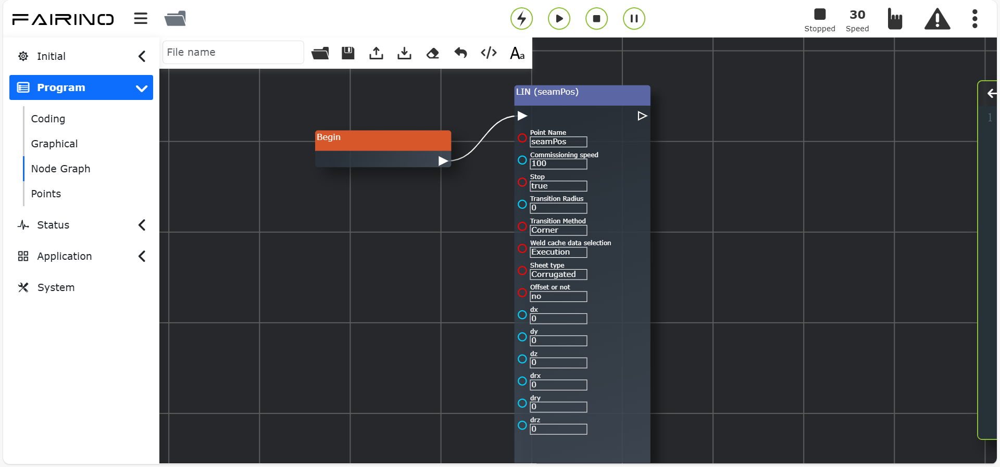

.. centered:: Abbildung 11.12-1 "Linie(seamPos)"-Befehlsknoten-Oberfläche

Kreisbogen-Befehl
-----------------

Klicken Sie auf den "Kreisbogen"-Befehlsknoten, um die Node-Editor-Bearbeitungsoberfläche zu öffnen.

Eine Kreisbogenbewegung umfasst zwei Punkte: Der erste Punkt ist der Zwischenpunkt des Kreisbogens, der zweite Punkt der Endpunkt. Sowohl für den Zwischen- als auch den Endpunkt kann eingestellt werden, ob ein Versatz erfolgen soll. Es kann ein Versatz basierend auf dem Basiskoordinatensystem oder dem Werkzeugkoordinatensystem ausgewählt werden. Es öffnen sich Eingabefelder für den Versatz in x, y, z, rx, ry, rz. Für den Endpunkt kann ein Glättungsübergangsradius eingestellt werden, um einen kontinuierlichen Bewegungseffekt zu erzielen.

"Kreisbogen"-Befehlsknoten, Parameter:

- Kreisbogen-Zwischenpunkt: Teachpunkt
- Ob Versatz: Nein / Basiskoordinaten-Versatz / Werkzeugkoordinaten-Versatz. Bei Auswahl von "Nein" sind die Parameter dx~drz unwirksam.
- dx~drz: Versatzbeträge
- Kreisbogen-Endpunkt: Teachpunkt
- Ob Versatz: Nein / Basiskoordinaten-Versatz / Werkzeugkoordinaten-Versatz. Bei Auswahl von "Nein" sind die Parameter dx~drz unwirksam.
- dx~drz: Versatzbeträge
- Testgeschwindigkeit (%): 0 ~ 100
- Stopp: false/true. Bei Auswahl von "true" sind die Parameter für den Glättungsübergang unwirksam.
- Glättungsübergang (mm): Glättungsübergangsradius 0 ~ 1000

.. image:: node_editor_software/012.png
   :width: 6in
   :align: center

.. centered:: Abbildung 11.13-1 "Kreisbogen"-Befehlsknoten-Oberfläche

Kreis-Befehl
------------

Klicken Sie auf den "Kreis"-Befehlsknoten, um die Node-Editor-Bearbeitungsoberfläche zu öffnen.

Eine Kreisbewegung umfasst zwei Punkte: Der erste Punkt ist der Zwischenpunkt 1 des Kreises, der zweite Punkt der Zwischenpunkt 2 des Kreises. Für Zwischenpunkt 2 kann eingestellt werden, ob ein Versatz erfolgen soll. Dieser Versatz wirkt gleichzeitig auf Zwischenpunkt 1 und 2.

"Kreis"-Befehlsknoten, Parameter:

- Kreis-Zwischenpunkt 1: Teachpunkt
- Kreis-Zwischenpunkt 2: Teachpunkt
- Testgeschwindigkeit (%): 0 ~ 100
- Ob Versatz: Nein / Basiskoordinaten-Versatz / Werkzeugkoordinaten-Versatz. Bei Auswahl von "Nein" sind die Parameter dx~drz unwirksam.
- dx~drz: Versatzbeträge

.. image:: node_editor_software/013.png
   :width: 6in
   :align: center

.. centered:: Abbildung 11.14-1 "Kreis"-Befehlsknoten-Oberfläche

Spiral-Befehl
-------------

Klicken Sie auf den "Spirale"-Befehlsknoten, um die Node-Editor-Bearbeitungsoberfläche zu öffnen.

Eine Spiralbewegung umfasst drei Punkte, die einen Kreis bilden. Auf der Einstellungsseite für den dritten Punkt gibt es Parameter für die Anzahl der Windungen, den Pose-Korrekturwinkel, die Radiusinkrement und die Achsrichtungsinkrement. Die Anzahl der Windungen ist die Anzahl der Bewegungen der Spirale. Der Pose-Korrekturwinkel korrigiert die Pose am Ende der Spirale im Verhältnis zur Pose des ersten Punkts der Spirale. Die Radiusinkrement ist die Zunahme des Radius pro Windung. Die Achsrichtungsinkrement ist die Zunahme in Richtung der Spiralachse. Bei der Einstellung "Ob Versatz" wirkt sich dieser Versatz auf die gesamte Spirale aus.

"Spirale"-Befehlsknoten, Parameter:

- Spiral-Zwischenpunkt 1: Teachpunkt
- Spiral-Zwischenpunkt 2: Teachpunkt
- Spiral-Zwischenpunkt 3: Teachpunkt
- Testgeschwindigkeit (%): 0 ~ 100
- Ob Versatz: Nein / Basiskoordinaten-Versatz / Werkzeugkoordinaten-Versatz. Bei Auswahl von "Nein" sind die Parameter dx~drz unwirksam.
- dx~drz: Versatzbeträge
- Anzahl der Windungen: 0 ~ 100
- Posen-Korrekturwinkel rx (°): -1000 ~ 1000
- Posen-Korrekturwinkel ry (°): -1000 ~ 1000
- Posen-Korrekturwinkel rz (°): -1000 ~ 1000
- Radiusinkrement (mm): -100 ~ 100
- Achsrichtungsinkrement (mm): -100 ~ 100

.. image:: node_editor_software/015.png
   :width: 6in
   :align: center

.. centered:: Abbildung 11.15-1 "Spirale"-Befehlsknoten-Oberfläche

Neuer Spiral-Befehl
-------------------

Klicken Sie auf den "Neue Spirale"-Befehlsknoten, um die Node-Editor-Bearbeitungsoberfläche zu öffnen.

Die neue Spiralbewegung ist eine optimierte Version der Spiralbewegung. Dieser Befehl benötigt nur einen Punkt plus Konfiguration verschiedener Parameter, um die Spiralbewegung zu realisieren. Der Roboter startet an seiner aktuellen Position. Der Benutzer stellt Parameter ein wie Testgeschwindigkeit, ob Versatz, Anzahl der Windungen, Spiralneigungswinkel, Anfangsradius, Radiusinkrement, Achsrichtungsinkrement und Drehrichtung. Die Anzahl der Windungen ist die Anzahl der Bewegungen der Spirale. Der Spiralneigungswinkel ist der Winkel zwischen der Werkzeug-Z-Achse und der Horizontalen. Der Posen-Korrekturwinkel korrigiert die Pose am Ende der Spirale im Verhältnis zur Pose des ersten Punkts der Spirale. Der Anfangsradius ist die Größe des Radius in der ersten Windung. Die Radiusinkrement ist die Zunahme des Radius pro Windung. Die Achsrichtungsinkrement ist die Zunahme in Richtung der Spiralachse. Die Drehrichtung ist im Uhrzeigersinn oder gegen den Uhrzeigersinn.

"Neue Spirale"-Befehlsknoten, Parameter:

- Spiral-Startpunkt: Teachpunkt
- Testgeschwindigkeit (%): 0 ~ 100
- Ob Versatz: Nein / Basiskoordinaten-Versatz / Werkzeugkoordinaten-Versatz. Bei Auswahl von "Nein" sind die Parameter dx~drz unwirksam.
- dx~drz: Versatzbeträge
- Anzahl der Windungen: 0 ~ 100
- Spiralneigungswinkel (°): -100 ~ 100
- Anfangsradius: 0 ~ 100
- Radiusinkrement (mm): -100 ~ 100
- Achsrichtungsinkrement (mm): -100 ~ 100
- Drehrichtung: Im Uhrzeigersinn / Gegen den Uhrzeigersinn

.. image:: node_editor_software/016.png
   :width: 6in
   :align: center

.. centered:: Abbildung 11.16-1 "Neue Spirale"-Befehlsknoten-Oberfläche

Horizontal-Spiral-Befehl
------------------------

Klicken Sie auf den "Horizontalspirale"-Befehlsknoten, um die Node-Editor-Bearbeitungsoberfläche zu öffnen.

Der "H-Spiral"-Befehl ist eine horizontale Spiralbewegung im Raum. Dieser Befehl wird nach einem einzelnen Bewegungsbefehl (Linie) eingefügt.

"Horizontalspirale"-Befehlsknoten, Parameter:

- Spiralradius: 0~100 mm
- Spiralwinkelgeschwindigkeit: 0~2 U/s
- Drehrichtung: Spirale im/gegen den Uhrzeigersinn
- Spiralneigung: 0~40°

.. image:: node_editor_software/014.png
   :width: 6in
   :align: center

.. centered:: Abbildung 11.17-1 "Horizontalspirale"-Befehlsknoten-Oberfläche

Spline-Befehl
-------------

Klicken Sie auf den "Spline"-Befehlsknoten, um die Node-Editor-Bearbeitungsoberfläche zu öffnen.

Dieser Befehl besteht aus drei Teilen: Spline-Gruppenstart, Spline-Segment und Spline-Gruppenende. Der Spline-Gruppenstart ist das Startkennzeichen der Spline-Bewegung. Die Spline-Segmente umfassen im Node-Editor derzeit nur das SPL-Segment. Das Spline-Gruppenende ist das Endkennzeichen der Spline-Bewegung.

"Spline-SPTP"-Befehlsknoten, Parameter:

- Punktname: Teachpunkt
- Testgeschwindigkeit (%): 0 ~ 100

.. image:: node_editor_software/017.png
   :width: 6in
   :align: center

.. centered:: Abbildung 11.18-1 "Spline"-Befehlsknoten-Oberfläche

Neuer Spline-Befehl
-------------------

Klicken Sie auf den "Neuer Spline"-Befehlsknoten, um die Node-Editor-Bearbeitungsoberfläche zu öffnen.

Dieser Befehl ist eine algorithmisch optimierte Version des Spline-Befehls und wird in Zukunft den vorhandenen Spline-Befehl ersetzen. Dieser Befehl besteht aus drei Teilen: Mehrpunktbahn-Start, Mehrpunktbahn-Segment und Mehrpunktbahn-Ende. Der Mehrpunktbahn-Start ist das Startkennzeichen der Mehrpunktbahn-Bewegung. Das Mehrpunktbahn-Segment dient zum Setzen der einzelnen Bahnpunkte. Klicken Sie auf das Symbol, um die Punkt-Hinzufügungsoberfläche aufzurufen. Das Mehrpunktbahn-Ende ist das Endkennzeichen der Mehrpunktbahn-Bewegung. Hier können der Steuermodus und die Testgeschwindigkeit eingestellt werden. Der Steuermodus kann "Vorgegebene Kontrollpunkte" oder "Vorgegebene Bahnpunkte" sein.

"Neuer Spline"-Befehlsknoten, Parameter:

- Steuermodus: Teachpunkt
- Globale durchschnittliche Übergangszeit: Ganzzahl, größer als 10, Standardwert 2000 ms

"Neuer Spline-SPL"-Befehlsknoten, Parameter:

- Punktname: Teachpunkt
- Testgeschwindigkeit (%): 0 ~ 100
- Glättungsübergangsradius: 0 ~ 1000
- Ist letzter Punkt: Nein / Ja

.. image:: node_editor_software/018.png
   :width: 6in
   :align: center

.. centered:: Abbildung 11.19-1 "Neuer Spline"-Befehlsknoten-Oberfläche

Pendel-Befehl
-------------

Klicken Sie auf den "Pendeln"-Befehlsknoten, um die Node-Editor-Bearbeitungsoberfläche zu öffnen.

Dieser Befehl besteht aus zwei Teilen. Der erste Teil wählt die Nummer der konfigurierten Pendelparameter aus. Die Verbindung mit Body bedeutet, dass das Programm des verbundenen Knotens zwischen "Pendeln starten" und "Pendeln stoppen" ausgeführt wird.

"Pendeln"-Befehlsknoten, Parameter:

- Nummer: 0~7

.. image:: node_editor_software/019.png
   :width: 6in
   :align: center

.. centered:: Abbildung 11.20-1 "Pendeln"-Befehlsknoten-Oberfläche

Bahnreproduktions-Befehl
------------------------

Klicken Sie auf den "Bahn reproduzieren"-Befehlsknoten, um die Node-Editor-Bearbeitungsoberfläche zu öffnen.

Bei diesem Befehl muss der Benutzer zunächst eine aufgezeichnete Bahn haben.

Bei der Programmerstellung wird zunächst mit einem Punkt-zu-Punkt-Befehl der entsprechende Startpunkt der Bahn angefahren. Dann wählen Sie im Bahnreproduktionsbefehl die Bahn aus, legen fest, ob die Bahn geglättet werden soll, und stellen die Testgeschwindigkeit ein. Der Bahnladebefehl dient hauptsächlich dazu, die Bahndatei vorab einzulesen und in Bahnbefehle zu extrahieren, um sie besser in Förderbandverfolgungsszenarien anwenden zu können.

"Bahn reproduzieren"-Befehlsknoten, Parameter:

- Bahnname: Aufgezeichnete Bahn
- Bahn glätten: Nein / Ja
- Testgeschwindigkeit (%): 0 ~ 100, Standardwert 25

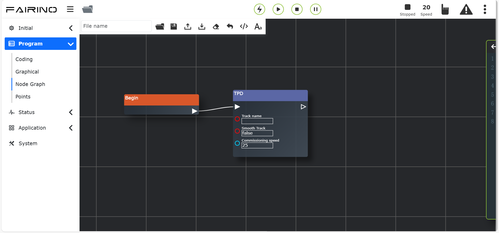

.. centered:: Abbildung 11.21-1 "Bahn reproduzieren"-Befehlsknoten-Oberfläche

Punktversatz-Befehl
-------------------

Klicken Sie auf den "Punktversatz"-Befehlsknoten, um die Node-Editor-Bearbeitungsoberfläche zu öffnen.

Dieser Befehl ist ein allgemeiner Versatzbefehl. Geben Sie die einzelnen Versatzbeträge ein. Die Verbindung mit Body bedeutet, dass das Programm des verbundenen Knotens zwischen Start und Ende ausgeführt wird. Die dazwischenliegenden Bewegungsbefehle werden basierend auf dem Basis- (oder Werkstück-) Koordinatensystem versetzt.

"Punktversatz"-Befehlsknoten, Parameter:

- ∆x: Versatzbetrag, -300~300
- ∆y: Versatzbetrag, -300~300
- ∆z: Versatzbetrag, -300~300
- ∆rx: Versatzbetrag, -300~300
- ∆ry: Versatzbetrag, -300~300
- ∆rz: Versatzbetrag, -300~300

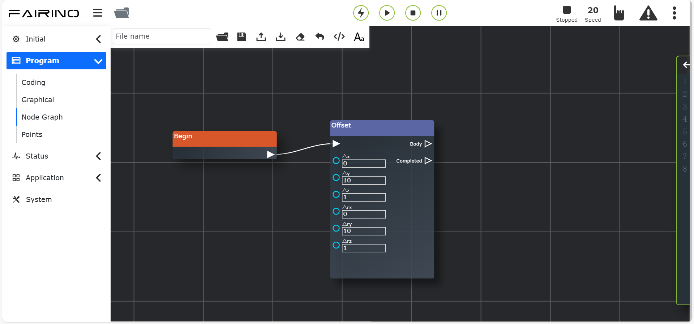

.. centered:: Abbildung 11.22-1 "Punktversatz"-Befehlsknoten-Oberfläche

Servo-Befehl
------------

Klicken Sie auf den "Servo"-Befehlsknoten, um die Node-Editor-Bearbeitungsoberfläche zu öffnen.

Der ServoControl-Befehl (Bewegung im kartesischen Raum) kann die Roboterbewegung über eine absolute Posensteuerung oder einen Versatz basierend auf der aktuellen Pose steuern.

"Servo"-Befehlsknoten, Parameter:

- Bewegungsart: Absolute Position / Basiskoordinaten-Versatz / Werkzeugkoordinaten-Versatz
- x: Versatzbetrag, -300~300
- y: Versatzbetrag, -300~300
- z: Versatzbetrag, -300~300
- rx: Versatzbetrag, -300~300
- ry: Versatzbetrag, -300~300
- rz: Versatzbetrag, -300~300
- Proportionalitätsfaktor x: 0~1
- Proportionalitätsfaktor y: 0~1
- Proportionalitätsfaktor z: 0~1
- Proportionalitätsfaktor rx: 0~1
- Proportionalitätsfaktor ry: 0~1
- Proportionalitätsfaktor rz: 0~1
- Beschleunigung (%): 0~100
- Geschwindigkeit (%): 0~100
- Befehlszyklus (s): 0.001~0.016
- Filterzeit (s): 0~1
- Proportionalverstärkung: 0~100

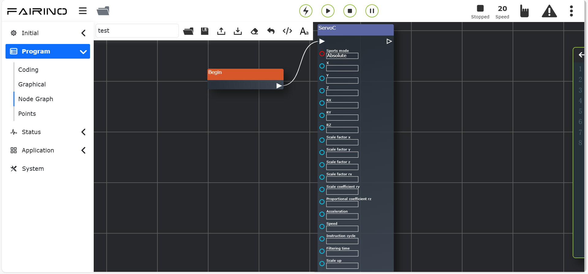

.. centered:: Abbildung 11.23-1 "Servo"-Befehlsknoten-Oberfläche

Bahn-Befehl
-----------

Klicken Sie auf den "Bahn"-Befehlsknoten, um die Node-Editor-Bearbeitungsoberfläche zu öffnen.

Bei diesem Befehl muss der Benutzer zunächst eine aufgezeichnete Bahn haben.

"Bahn"-Befehlsknoten, Parameter:

- Bahndatei auswählen: Aufgezeichnete Bahn
- Testgeschwindigkeit (%): 0 ~ 100, Standardwert 25

.. image:: node_editor_software/023.png
   :width: 6in
   :align: center

.. centered:: Abbildung 11.24-1 "Bahn"-Befehlsknoten-Oberfläche

BahnJ-Befehl
------------

Klicken Sie auf den "BahnJ"-Befehlsknoten, um die Node-Editor-Bearbeitungsoberfläche zu öffnen.

Bei diesem Befehl muss der Benutzer zunächst eine aufgezeichnete Bahn haben. Bahndateien können vorab auf der Teach-Programm-Oberfläche importiert werden. Die Bahn- und BahnJ-Befehle sind universelle Schnittstellen für Bahnen, die direkt von einer Kamera vorgegeben werden. Wenn eine Datei mit diskreten Bahnpunkten in einem festen Format vorhanden ist, kann sie in das System importiert werden, sodass der Roboter sich gemäß der in der importierten Datei definierten Bahn bewegt.

"BahnJ"-Befehlsknoten, Parameter:

- Bahndatei auswählen: Aufgezeichnete Bahn
- Testgeschwindigkeit (%): 0 ~ 100, Standardwert 25
- Bahnmodus: Bahnpunkte / Kontrollpunkte

.. image:: node_editor_software/024.png
   :width: 6in
   :align: center

.. centered:: Abbildung 11.25-1 "BahnJ"-Befehlsknoten-Oberfläche

DMP-Befehl
----------

Klicken Sie auf den "DMP"-Befehlsknoten, um die Node-Editor-Bearbeitungsoberfläche zu öffnen.

DMP ist eine Methode des Nachahmungslernens von Trajektorien. Eine Referenztrajektorie muss im Voraus geplant werden. In der Befehlsbearbeitungsoberfläche wählen Sie einen Teachpunkt als neuen Startpunkt aus. Der spezifische DMP-Pfad ist eine neue Trajektorie, die die Referenztrajektorie mit dem neuen Startpunkt nachahmt.

"DMP"-Befehlsknoten, Parameter:

- Punktname: Teachpunkt
- Testgeschwindigkeit (%): 0 ~ 100, Standardwert 100

.. image:: node_editor_software/025.png
   :width: 6in
   :align: center

.. centered:: Abbildung 11.26-1 "DMP"-Befehlsknoten-Oberfläche

Werkstücktransformations-Befehl
-------------------------------

Klicken Sie auf den "Werkstücktransformation"-Befehlsknoten, um die Node-Editor-Bearbeitungsoberfläche zu öffnen.

Wählen Sie das Werkstückkoordinatensystem aus, das automatisch transformiert werden soll. Wenn Sie PTP- oder LIN-Befehle hinzufügen und diese mit Body verbinden, werden sie innerhalb dieses Befehls ausgeführt, und die Punkte im Werkstückkoordinatensystem werden automatisch transformiert.

"Werkstücktransformation"-Befehlsknoten, Parameter:

- Werkstückkoordinatensystem: Liste der Werkstückkoordinatensysteme

.. image:: node_editor_software/026.png
   :width: 6in
   :align: center

.. centered:: Abbildung 11.27-1 "Werkstücktransformation"-Befehlsknoten-Oberfläche

Werkzeugtransformations-Befehl
------------------------------

Klicken Sie auf den "Werkzeugtransformation"-Befehlsknoten, um die Node-Editor-Bearbeitungsoberfläche zu öffnen.

Wählen Sie das Werkzeugkoordinatensystem aus, das automatisch transformiert werden soll. Wenn Sie PTP- oder LIN-Befehle hinzufügen und diese mit Body verbinden, werden sie innerhalb dieses Befehls ausgeführt, und die Punkte im Werkzeugkoordinatensystem werden automatisch transformiert.

"Werkzeugtransformation"-Befehlsknoten, Parameter:

- Werkzeugkoordinatensystem: Liste der Werkzeugkoordinatensysteme

.. image:: node_editor_software/027.png
   :width: 6in
   :align: center

.. centered:: Abbildung 11.28-1 "Werkzeugtransformation"-Befehlsknoten-Oberfläche

Digital-IO-Befehlsknoten
------------------------

Klicken Sie auf den "Setze DO" / "Hole DI"-Befehlsknoten, um die Node-Editor-Bearbeitungsoberfläche zu öffnen.

Dieser Befehl ist ein IO-Befehl und ist in zwei Teile gegliedert: Setzen von IO (SetDO/SPLCSetDO) und Abrufen von IO (GetDI/SPLCGetDI).

1. "Setze DO"-Befehlsknoten, Parameter:

- Port: Ctrl-DO0 ~ Ctrl-CO7 (blockierend: SetDO, nicht blockierend: SPLCSetDO, [0~15]), End-DO0 ~ End-DO1 (blockierend: SetToolDO, nicht blockierend: SPLCSetToolDO, [0~1])
- Status: false/true
- Ob blockieren: blockierend / nicht blockierend
- Glatte Bahn: Break / Serious
- Ob Thread anwenden: Nein / Ja

.. image:: node_editor_software/028.png
   :width: 6in
   :align: center

.. centered:: Abbildung 11.29-1 "Setze DO"-Befehlsknoten-Oberfläche

2. "Hole DI"-Befehlsknoten, Parameter:

- Port: Ctrl-DI0 ~ Ctrl-CI7 (blockierend: GetDI, nicht blockierend: SPLCGetDI, [0~15]), End-DI0 ~ End-DI1 (blockierend: GetToolDI, nicht blockierend: SPLCGetToolDI, [0~1])
- Ob blockieren: blockierend / nicht blockierend
- Status: false/true
- Maximale Wartezeit (ms): 0 ~ 10000
- Ob Thread anwenden: Nein / Ja

.. image:: node_editor_software/029.png
   :width: 6in
   :align: center

.. centered:: Abbildung 11.29-2 "Hole DI"-Befehlsknoten-Oberfläche

Analog-AI-Befehl
----------------

Klicken Sie auf den "Setze AO" / "Hole AI"-Befehlsknoten, um die Node-Editor-Bearbeitungsoberfläche zu öffnen.

Dieser Befehl umfasst zwei Funktionen: Setzen des analogen Ausgangs (SetAO/SPLCSetAO) und Abrufen des analogen Eingangs (GetAI/SPLCGetAI).

1. "Setze AO"-Befehlsknoten, Parameter:

- Port: Ctrl-AO0 ~ Ctrl-AO1 (blockierend: SetAO, nicht blockierend: SPLCSetAO, [0~1]), End-AO0 (blockierend: SetToolAO, nicht blockierend: SPLCSetToolAO, [0])
- Wert (%): 0 ~ 100
- Ob blockieren: blockierend / nicht blockierend
- Ob Thread anwenden: Nein / Ja

.. image:: node_editor_software/030.png
   :width: 6in
   :align: center

.. centered:: Abbildung 11.30-1 "Setze AO"-Befehlsknoten-Oberfläche

2. "Hole AI"-Befehlsknoten, Parameter:

- Port: Ctrl-AI0 ~ Ctrl-DI1 (blockierend: GetAI, nicht blockierend: SPLCGetAI, [0~1]), End-AI0 (blockierend: GetToolAI, nicht blockierend: SPLCGetToolAI, [0])
- Bedingung: Größer als / Kleiner als
- Wert (%): 0 ~ 100
- Maximale Zeit (ms): 0 ~ 10000
- Ob blockieren: blockierend / nicht blockierend
- Ob Thread anwenden: Nein / Ja

.. image:: node_editor_software/031.png
   :width: 6in
   :align: center

.. centered:: Abbildung 11.30-2 "Hole AI"-Befehlsknoten-Oberfläche

Virtueller-IO-Befehlsknoten
----------------------------

Klicken Sie auf den "Setze simuliertes externes DI" / "Setze simuliertes externes AI"-Befehlsknoten, um die Node-Editor-Bearbeitungsoberfläche zu öffnen.

Dieser Befehl dient zur virtuellen IO-Steuerung. Er kann den Status von simulierten externen DI und AI einstellen sowie den Status von simulierten DI und AI abrufen.

1. "Setze simuliertes externes DI"-Befehlsknoten, Parameter:

- Port: Vir-Ctrl-DI0 ~ Vir-Ctrl-DI15 (SetVirtualDI, [0~15]), Vir-End-DI0 ~ Vir-End-DI1 (SetVirtualToolDI, [1~2])
- Status: false/true

.. image:: node_editor_software/032.png
   :width: 6in
   :align: center

.. centered:: Abbildung 11.31-1 "Setze simuliertes externes DI"-Befehlsknoten-Oberfläche

2. "Setze simuliertes externes AI"-Befehlsknoten, Parameter:

- Port: Vir-Ctrl-AI0 ~ Vir-Ctrl-AI0 (SetVirtualAI, [0~1]), Vir-End-AI0 (SetVirtualToolAI, [0])
- Wert (V/mA): 0 ~ 20

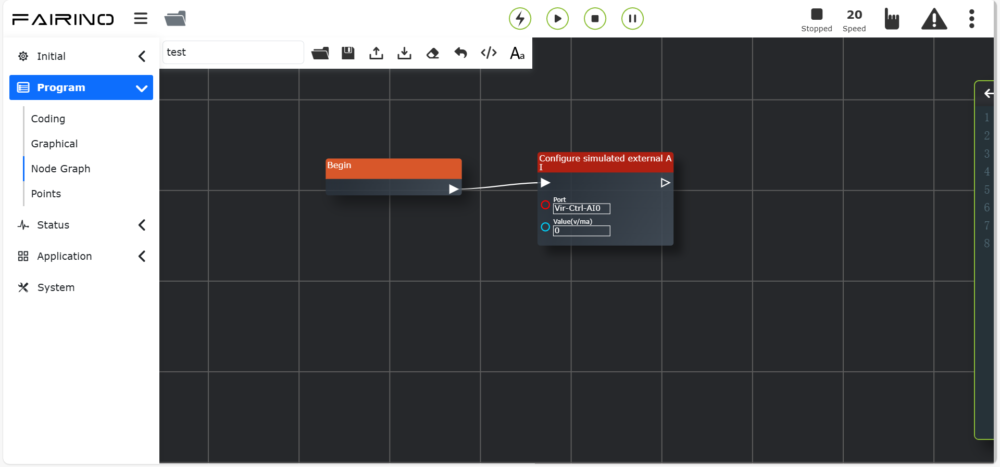

.. centered:: Abbildung 11.31-2 "Setze simuliertes externes AI"-Befehlsknoten-Oberfläche

Erweiterungs-IO-Befehlsknoten
-----------------------------

Klicken Sie auf den "Hole simuliertes externes DI" / "Hole simuliertes externes AI"-Befehlsknoten, um die Node-Editor-Bearbeitungsoberfläche zu öffnen.

Aux-IO ist eine Befehlssfunktion zur Steuerung externer Erweiterungs-IO über die Kommunikation zwischen Roboter und SPS. Es muss eine UDP-Kommunikation zwischen Roboter und SPS eingerichtet werden.

1. "Hole simuliertes externes DI"-Befehlsknoten, Parameter:

- Port: Vir-Ctrl-DI0 ~ Vir-Ctrl-DI15 (GetVirtualDI, [0~15]), Vir-End-DI0 ~ Vir-End-DI1 (GetVirtualToolDI, [1~2])

.. image:: node_editor_software/034.png
   :width: 6in
   :align: center

.. centered:: Abbildung 11.32-1 "Hole simuliertes externes DI"-Befehlsknoten-Oberfläche

2. "Hole simuliertes externes AI"-Befehlsknoten, Parameter:

- Port: Vir-Ctrl-AI0 ~ Vir-Ctrl-AI0 (GetVirtualAI, [0~1]), Vir-End-AI0 (GetVirtualToolAI, [0])

.. image:: node_editor_software/035.png
   :width: 6in
   :align: center

.. centered:: Abbildung 11.32-2 "Hole simuliertes externes AI"-Befehlsknoten-Oberfläche

3. "UDP-Kommunikation konfigurieren"-Befehlsknoten, Parameter:

- ip: IP-Adresse
- Port: Portnummer
- Kommunikationszyklus (ms): 0 ~ 10000

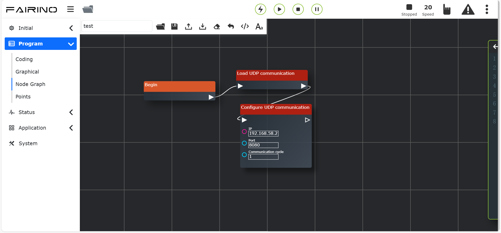

.. centered:: Abbildung 11.32-3 "UDP-Kommunikation konfigurieren"-Befehlsknoten-Oberfläche

Bewegungs-DO-Befehl
-------------------

Klicken Sie auf den "Bewegungs-DO"-Befehlsknoten, um die Node-Editor-Bearbeitungsoberfläche zu öffnen.

Dieser Befehl realisiert die kontinuierliche Ausgabe von DO-Signalen in festgelegten Abständen während einer Linearbewegung.

"Bewegungs-DO kontinuierliche Ausgabe"-Befehlsknoten, Parameter:

- Port: Ctrl-DO0 ~ Ctrl-DO0 (MoveDOStart, [0~15]), End-DO1 (MoveDOStart, [0~1])
- Einstellintervall (mm): 0 ~ 500
- Ausgangsimpuls-Tastverhältnis (%): 0 ~ 99

"Bewegungs-DO einmalige Ausgabe"-Befehlsknoten, Parameter:

- Port: Ctrl-DO0 ~ Ctrl-DO0 (MoveDOOnceStart, [0~15]), End-DO1 (MoveDOOnceStart, [0~1])
- Ausgabemodus: Ausgabe im gleichförmigen Geschwindigkeitsabschnitt / Freie Konfiguration
- Setzzeit (ms): 0 ~ 1000 (Standard -1 im Modus "gleichförmiger Geschwindigkeitsabschnitt")
- Rücksetzzeit (ms): 0 ~ 1000 (Standard -1 im Modus "gleichförmiger Geschwindigkeitsabschnitt")

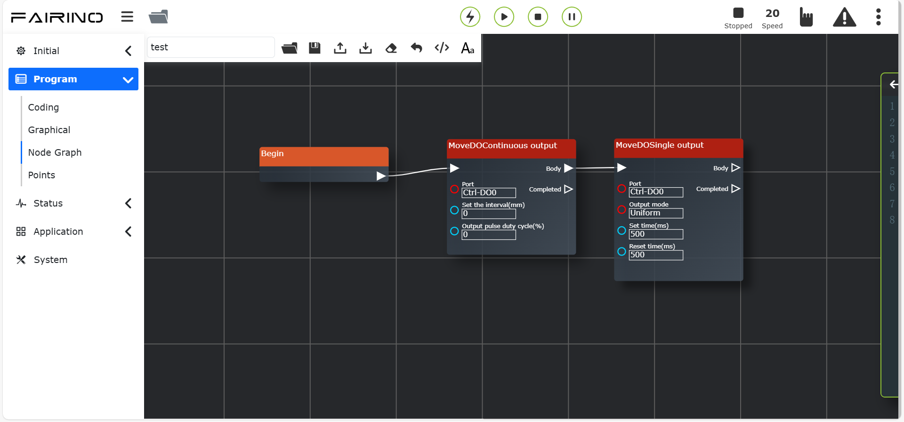

.. centered:: Abbildung 11.33-1 "Bewegungs-DO einmalige/kontinuierliche Ausgabe"-Befehlsknoten-Oberfläche

Koordinatensystem-Befehl
------------------------

Klicken Sie auf den "Setze Werkzeugkoordinatensystem" / "Setze Werkstückkoordinatensystem"-Befehlsknoten, um die Node-Editor-Bearbeitungsoberfläche zu öffnen.

Dieser Befehl ist in zwei Funktionen unterteilt: "Setze Werkzeugkoordinatensystem" und "Setze Werkstückkoordinatensystem".

Wählen Sie den Namen des Werkzeugkoordinatensystems aus und klicken Sie auf "Übernehmen", um diesen Befehl zum Programm hinzuzufügen. Wenn das Programm diese Anweisung ausführt, wird das Werkzeugkoordinatensystem des Roboters gesetzt.

1. "Setze Werkzeugkoordinatensystem"-Befehlsknoten, Parameter:

- Werkzeugkoordinatensystemname: toolcoord1 ~ toolcoord19 (SetToolList, [0~19]), etoolcoord0 ~ etoolcoord14 (SetExToolList, [0~14])

.. image:: node_editor_software/038.png
   :width: 6in
   :align: center

.. centered:: Abbildung 11.34-1 "Setze Werkzeugkoordinatensystem"-Befehlsknoten-Oberfläche

2. "Setze Werkstückkoordinatensystem"-Befehlsknoten, Parameter:

- Werkstückkoordinatensystemname: wobjcoord1 ~ wobjcoord14

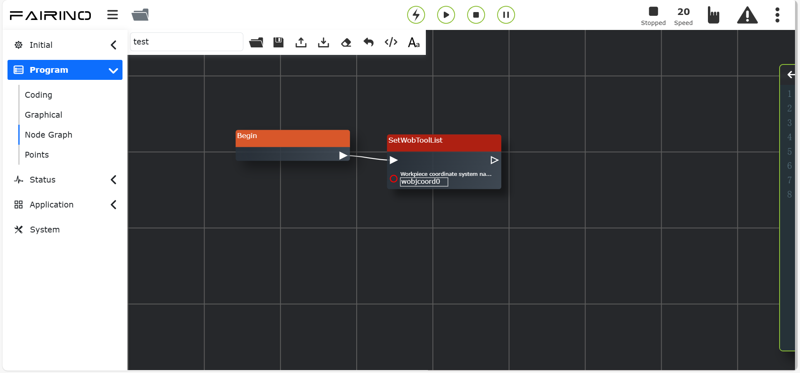

.. centered:: Abbildung 11.34-2 "Setze Werkstückkoordinatensystem"-Befehlsknoten-Oberfläche

Moduswechsel-Befehl
-------------------

Klicken Sie auf den "Moduswechsel"-Befehlsknoten, um die Node-Editor-Bearbeitungsoberfläche zu öffnen.

Dieser Befehl kann den Roboter in den Handmodus schalten. Er wird normalerweise am Ende eines Programms hinzugefügt, damit der Benutzer den Roboter nach Programmende automatisch in den Handmodus schalten und ziehen kann.

"Moduswechsel"-Befehlsknoten, Parameter:

- Moduswechsel: Handmodus

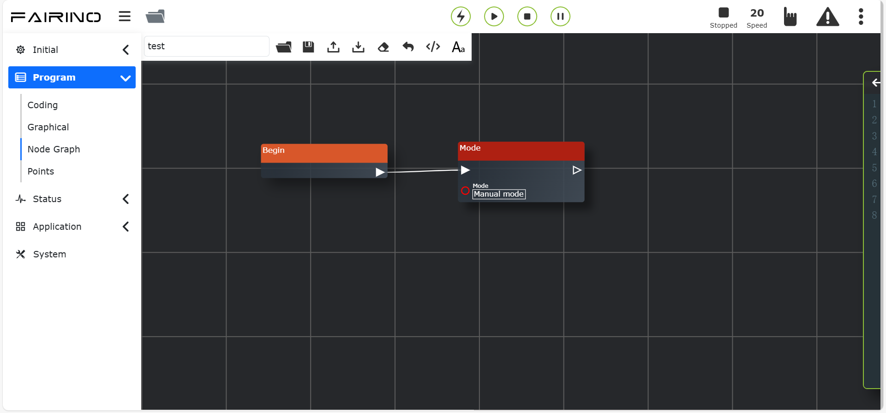

.. centered:: Abbildung 11.35-1 "Moduswechsel"-Befehlsknoten-Oberfläche

Kollisionsstufen-Befehl
-----------------------

Klicken Sie auf den "Kollisionsstufe"-Befehlsknoten, um die Node-Editor-Bearbeitungsoberfläche zu öffnen.

Dieser Befehl dient zur Einstellung der Kollisionsstufe. Mit diesem Befehl können die Kollisionsstufen der einzelnen Achsen während der Programmausführung in Echtzeit angepasst werden, um Anwendungsszenarien flexibler zu gestalten.

"Kollisionsstufe"-Befehlsknoten, Parameter:

- Standardstufe: Standardstufe / Benutzerdefinierter Prozentsatz
- Joint1-Joint6 (N): 0 ~ 100, Kollisionsschwelle, Array-Typ

.. image:: node_editor_software/041.png
   :width: 6in
   :align: center

.. centered:: Abbildung 11.36-1 "Kollisionsstufe"-Befehlsknoten-Oberfläche

Beschleunigungs-Befehl
----------------------

Klicken Sie auf den "Beschleunigung"-Befehlsknoten, um die Node-Editor-Bearbeitungsoberfläche zu öffnen.

Der "Beschleunigungs"-Befehl ermöglicht die separate Einstellung der Roboterbeschleunigung. Durch Anpassen des Beschleunigungsskalierungsfaktors von Bewegungsbefehlen kann die Beschleunigungs- und Verzögerungszeit erhöht oder verringert werden, wodurch die Taktzeit der Roboteraktionen einstellbar wird.

"Beschleunigung"-Befehlsknoten, Parameter:

- Beschleunigungsprozentsatz (%): 0 ~ 100

.. image:: node_editor_software/042.png
   :width: 6in
   :align: center

.. centered:: Abbildung 11.37-1 "Beschleunigung"-Befehlsknoten-Oberfläche

Greifer-Befehl
--------------

Dieser Befehl ist unterteilt in "Greiferbewegung", "Greifer aktivieren" und "Greifer zurücksetzen".

Im Befehl werden die vollständig konfigurierten und aktivierten Greifernummern angezeigt. Die Einstellungen für Greiferöffnung/-schließung, Öffnungs-/Schließgeschwindigkeit und Öffnungs-/Schließmoment erfolgen in Prozent. Die Option "Ob blockieren": Bei Auswahl von "blockierend" wartet die Greiferbewegung, bis der vorherige Bewegungsbefehl abgeschlossen ist. Bei Auswahl von "nicht blockierend" läuft die Greiferbewegung parallel zum vorherigen Bewegungsbefehl.

"Greiferbewegung"-Knoten, Parameter:

- Greifernummer: Bereits aktivierte Greifernummer
- Greiferposition: 0~100
- Öffnungs-/Schließgeschwindigkeit: 0~100
- Öffnungs-/Schließmoment: 0~100
- Maximale Zeit (ms): 0~30000
- Ob blockieren: false/true

.. image:: node_editor_software/043.png
   :width: 6in
   :align: center

.. centered:: Abbildung 11.38-1 "Greiferbewegung"-Knoten-Oberfläche

Der Greifer-Rücksetzbefehl zeigt die bereits konfigurierten Greifernummern an. Dem Programm kann ein Greifer-Rücksetzbefehl hinzugefügt werden.

"Greifer zurücksetzen"-Knoten, Parameter:

- Greifernummer: Bereits aktivierte Greifernummer

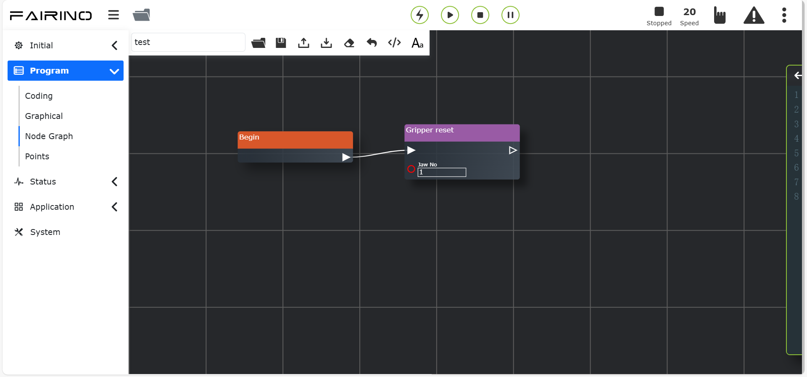

.. centered:: Abbildung 11.38-2 "Greifer zurücksetzen"-Knoten-Oberfläche

Der Greifer-Aktivierungsbefehl zeigt die bereits konfigurierten Greifernummern an. Dem Programm kann ein Greifer-Aktivierungsbefehl hinzugefügt werden.

"Greifer aktivieren"-Knoten, Parameter:

- Greifernummer: Bereits aktivierte Greifernummer

.. image:: node_editor_software/045.png
   :width: 6in
   :align: center

.. centered:: Abbildung 11.38-3 "Greifer aktivieren"-Knoten-Oberfläche

Spritzpistolen-Befehl
---------------------

Dieser Befehl bezieht sich auf die Spritzanwendung und steuert die Spritzpistole mit den Aktionen "Spritzen starten", "Spritzen stoppen", "Düsenreinigung starten" und "Düsenreinigung stoppen". Stellen Sie beim Bearbeiten der entsprechenden Knoten in diesem Programm sicher, dass die Spritzpistole als Peripheriegerät korrekt konfiguriert wurde, da sonst ein Speichern nicht möglich ist. Weitere Details finden Sie im Kapitel Roboter-Peripheriegeräte.

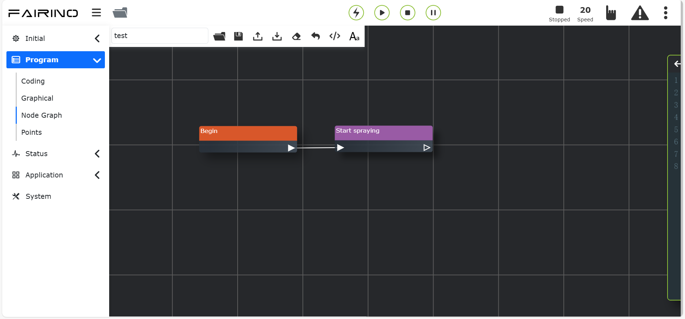

.. centered:: Abbildung 11.39-1 "Spritzen starten"-Befehlsknoten-Oberfläche

.. image:: node_editor_software/047.png
   :width: 6in
   :align: center

.. centered:: Abbildung 11.39-2 "Spritzen stoppen"-Befehlsknoten-Oberfläche

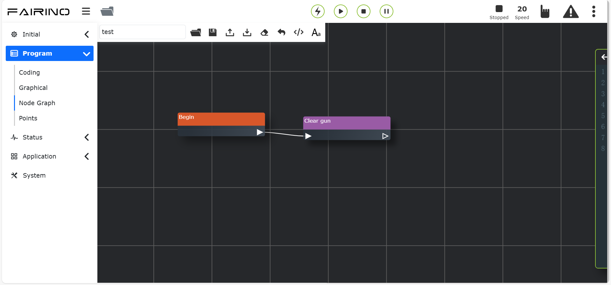

.. centered:: Abbildung 11.39-3 "Düsenreinigung starten"-Befehlsknoten-Oberfläche

.. image:: node_editor_software/049.png
   :width: 6in
   :align: center

.. centered:: Abbildung 11.39-4 "Düsenreinigung stoppen"-Befehlsknoten-Oberfläche

Erweiterungsachsen-Befehl (Steuerung + SPS)
-------------------------------------------

Dieser Befehl wird in Szenarien mit externen Achsen in Kombination mit dem PTP-Befehl verwendet. Er kann die Bewegung eines Punktes im Raum in X-Richtung auf die Bewegung der externen Achse aufteilen. Wählen Sie die Nummer der externen Achse, die Bewegungsart "Synchron" und den zu erreichenden Punkt.

Er ist unterteilt in UDP-Kommunikation laden/konfigurieren, Asynchrone Bewegung, Synchrone PTP/LIN-Bewegung, Synchrone ARC-Bewegung, Referenzfahrt-Befehl und Aktivierungsbefehl.

"UDP-Kommunikation konfigurieren"-Befehlsknoten: Geben Sie IP-Adresse, Portnummer und Kommunikationszyklus ein.

.. image:: node_editor_software/050.png
   :width: 6in
   :align: center

.. centered:: Abbildung 11.40-1 "UDP-Kommunikation konfigurieren"-Befehlsknoten-Oberfläche

"Asynchrone Bewegung"-Befehlsknoten, Parameter:

- Punktname: Teachpunkt
- Testgeschwindigkeit (%): 0~100

.. image:: node_editor_software/051.png
   :width: 6in
   :align: center

.. centered:: Abbildung 11.40-2 "Asynchrone Bewegung"-Befehlsknoten-Oberfläche

"Synchrone PTP/LIN-Bewegung"-Befehlsknoten, Parameter:

- Bewegungsauswahl: PTP/LIN
- Punktname: Teachpunkt
- Testgeschwindigkeit (%): 0~100

.. image:: node_editor_software/052.png
   :width: 6in
   :align: center

.. centered:: Abbildung 11.40-3 "Synchrone PTP/LIN-Bewegung"-Befehlsknoten-Oberfläche

"Synchrone ARC-Bewegung"-Befehlsknoten, Standardbewegungsart ist ARC, Parameter:

- Punktname: Teachpunkt
- Testgeschwindigkeit (%): 0~100

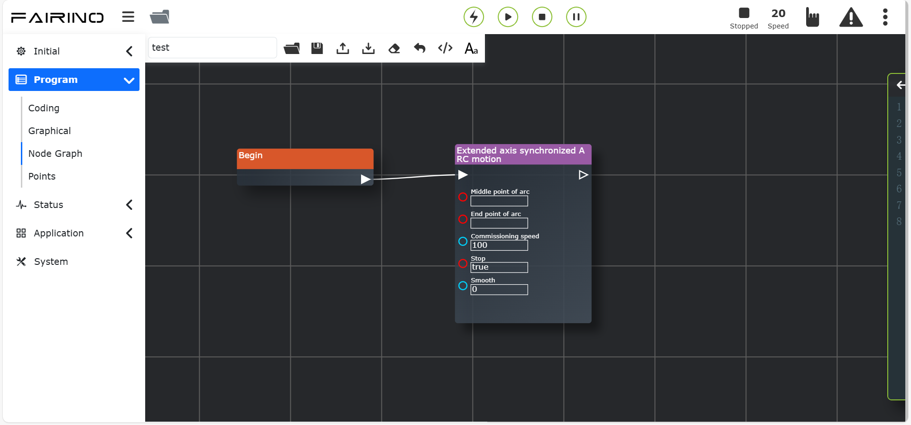

.. centered:: Abbildung 11.40-4 "Synchrone ARC-Bewegung"-Befehlsknoten-Oberfläche

"Referenzfahrt"-Befehlsknoten, Parameter:

- Erweiterungsachsennummer: 1~4
- Referenzfahrtart: Aktuelle Position als Nullpunkt / Referenzfahrt zum negativen Endschalter / Referenzfahrt zum positiven Endschalter
- Suchgeschwindigkeit: 0~2000, Standard 5
- Nullpunkt-Einrastgeschwindigkeit: 0~2000, Standard 1

.. image:: node_editor_software/054.png
   :width: 6in
   :align: center

.. centered:: Abbildung 11.40-5 "Referenzfahrt"-Befehlsknoten-Oberfläche

"Aktivieren"-Befehlsknoten, Parameter:

- Erweiterungsachsennummer: 1~4

.. image:: node_editor_software/055.png
   :width: 6in
   :align: center

.. centered:: Abbildung 11.40-6 "Aktivieren"-Befehlsknoten-Oberfläche

Erweiterungsachsen-Befehl (Steuerung + Servoantrieb)
----------------------------------------------------

Mit diesem Befehl können Parameter für die Erweiterungsachse konfiguriert werden. Je nach Steuerungsmodus werden unterschiedliche Parameter eingestellt. Bei einer bereits konfigurierten Erweiterungsachse kann der Nullpunkt gesetzt werden.

Er ist unterteilt in Servo-ID, Steuerungsmodus, Servo aktivieren und Servo-Referenzfahrt. Der Steuerungsmodus ist wiederum in Positionsmodus und Geschwindigkeitsmodus unterteilt. Diese beiden Knoten müssen in Verbindung mit dem Steuerungsmodus verwendet werden, da sie sonst allein nicht wirksam sind.

"Servo-ID"-Befehlsknoten, Parameter:

- Servo-ID: 1~15

.. image:: node_editor_software/056.png
   :width: 6in
   :align: center

.. centered:: Abbildung 11.41-1 "Servo-ID"-Befehlsknoten-Oberfläche

"Steuerungsmodus"-Befehlsknoten, Parameter:

- Servo-ID: 1~15
- Steuerungsmodus: Positionsmodus / Geschwindigkeitsmodus

.. image:: node_editor_software/057.png
   :width: 6in
   :align: center

.. centered:: Abbildung 11.41-2 "Steuerungsmodus"-Befehlsknoten-Oberfläche

"Servo aktivieren"-Befehlsknoten, Parameter:

- Servo-ID: 1~15
- Servo aktivieren: Servo aktivieren / Servo deaktivieren

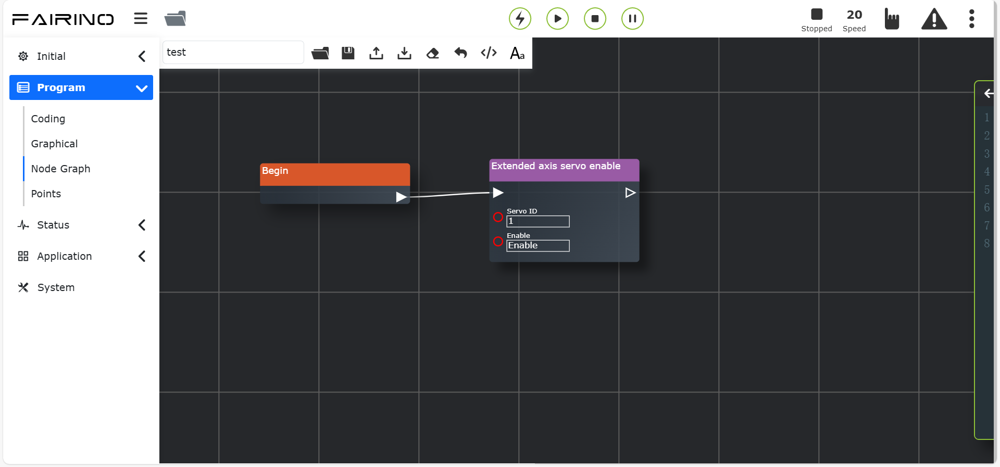

.. centered:: Abbildung 11.41-3 "Servo aktivieren"-Befehlsknoten-Oberfläche

"Servo-Referenzfahrt"-Befehlsknoten, Parameter:

- Servo-ID: 1~15
- Referenzfahrtart: Aktuelle Position als Nullpunkt / Referenzfahrt zum negativen Endschalter / Referenzfahrt zum positiven Endschalter
- Suchgeschwindigkeit: 0~2000, Standard 5
- Nullpunkt-Einrastgeschwindigkeit: 0~2000, Standard 1
- Beschleunigungsprozentsatz: 1~100

.. image:: node_editor_software/059.png
   :width: 6in
   :align: center

.. centered:: Abbildung 11.41-4 "Servo-Referenzfahrt"-Befehlsknoten-Oberfläche

"Positionsmodus"-Befehlsknoten, Parameter:

- Servo-ID: 1~15
- Zielposition: unbegrenzt
- Suchgeschwindigkeit: unbegrenzt
- Beschleunigungsprozentsatz: 1~100

.. image:: node_editor_software/060.png
   :width: 6in
   :align: center

.. centered:: Abbildung 11.41-5 "Positionsmodus"-Befehlsknoten-Oberfläche

"Geschwindigkeitsmodus"-Befehlsknoten, Parameter:

- Servo-ID: 1~15
- Zielgeschwindigkeit: unbegrenzt
- Beschleunigungsprozentsatz: 1~100

.. image:: node_editor_software/061.png
   :width: 6in
   :align: center

.. centered:: Abbildung 11.41-6 "Geschwindigkeitsmodus"-Befehlsknoten-Oberfläche

Förderband-Befehl
-----------------

Dieser Befehl enthält vier Unterbefehle: IO Echtzeiterkennung, Position Echtzeiterkennung, Tracking einschalten und Tracking ausschalten. Weitere Details finden Sie im Kapitel Roboter-Peripheriegeräte.

"IO Echtzeiterkennung"-Befehlsknoten, Parameter:

- Maximale Wartezeit: 0~10000

.. image:: node_editor_software/062.png
   :width: 6in
   :align: center

.. centered:: Abbildung 11.42-1 "IO Echtzeiterkennung"-Befehlsknoten-Oberfläche

"Position Echtzeiterkennung"-Befehlsknoten, Parameter:

- Arbeitsmodus: Tracking Greifen / Tracking Bewegung / TPD-Tracking

.. image:: node_editor_software/063.png
   :width: 6in
   :align: center

.. centered:: Abbildung 11.42-2 "Position Echtzeiterkennung"-Befehlsknoten-Oberfläche

"Tracking einschalten"-Befehlsknoten, Parameter:

- Arbeitsmodus: Tracking Greifen / Tracking Bewegung / TPD-Tracking

.. image:: node_editor_software/064.png
   :width: 6in
   :align: center

.. centered:: Abbildung 11.42-3 "Tracking einschalten"-Befehlsknoten-Oberfläche

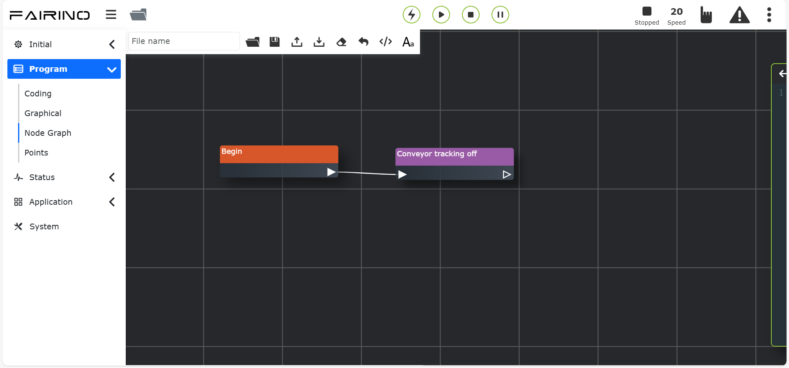

.. centered:: Abbildung 11.42-4 "Tracking ausschalten"-Befehlsknoten-Oberfläche

Schleifbefehl
-------------

Dieser Befehl wird für Schleifszenarien verwendet. Vor der Verwendung muss der Treiber entladen und dann geladen werden. Anschließend wird das Schleifgerät aktiviert. Danach können Drehzahl, Kontaktkraft, Ausfahrstrecke und Steuerungsmodus des Schleifgeräts eingestellt werden. Gleichzeitig können Fehler des Schleifgeräts gelöscht und der Kraftsensor des Geräts auf Null gesetzt werden.

.. image:: node_editor_software/066.png
   :width: 6in
   :align: center

.. centered:: Abbildung 11.43-1 "Kommunikationstreiber entladen"-Befehlsknoten-Oberfläche

.. image:: node_editor_software/067.png
   :width: 6in
   :align: center

.. centered:: Abbildung 11.43-2 "Kommunikationstreiber laden"-Befehlsknoten-Oberfläche

"Gerät aktivieren"-Befehlsknoten, Parameter:

- Gerät aktivieren: Aktivieren / Deaktivieren

.. image:: node_editor_software/068.png
   :width: 6in
   :align: center

.. centered:: Abbildung 11.43-3 "Gerät aktivieren"-Befehlsknoten-Oberfläche

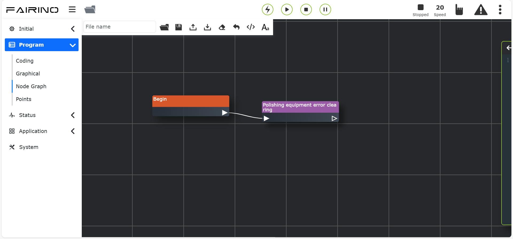

.. centered:: Abbildung 11.43-4 "Gerätefehler löschen"-Befehlsknoten-Oberfläche

.. image:: node_editor_software/070.png
   :width: 6in
   :align: center

.. centered:: Abbildung 11.43-5 "Kraftsensor des Geräts auf Null setzen"-Befehlsknoten-Oberfläche

"Drehzahl"-Befehlsknoten, Parameter:

- Drehzahl: 0~5500

.. image:: node_editor_software/071.png
   :width: 6in
   :align: center

.. centered:: Abbildung 11.43-6 "Drehzahl"-Befehlsknoten-Oberfläche

"Kontaktkraft"-Befehlsknoten, Parameter:

- Kontaktkraft: 0~200

.. image:: node_editor_software/072.png
   :width: 6in
   :align: center

.. centered:: Abbildung 11.43-7 "Kontaktkraft"-Befehlsknoten-Oberfläche

"Ausfahrstrecke"-Befehlsknoten, Parameter:

- Ausfahrstrecke: 0~12

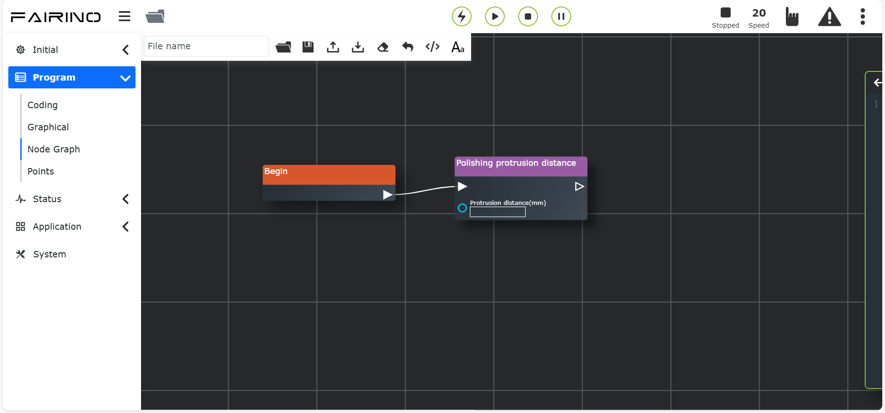

.. centered:: Abbildung 11.43-8 "Ausfahrstrecke"-Befehlsknoten-Oberfläche

"Steuerungsmodus"-Befehlsknoten, Parameter:

- Steuerungsmodus: Referenzfahrtmodus / Positionsmodus / Drehmomentmodus

.. image:: node_editor_software/074.png
   :width: 6in
   :align: center

.. centered:: Abbildung 11.43-9 "Steuerungsmodus"-Befehlsknoten-Oberfläche

Schweißbefehl
-------------

Klicken Sie auf den entsprechenden Schweißbefehlsknoten, um die Node-Editor-Bearbeitungsoberfläche zu öffnen.

Dieser Befehl wird hauptsächlich für das Schweißgerät als Peripheriegerät verwendet. Stellen Sie vor dem Hinzufügen dieses Befehls sicher, dass die Konfiguration des Schweißgeräts in den Benutzer-Peripheriegeräten abgeschlossen ist. Weitere Details finden Sie im Kapitel Roboter-Peripheriegeräte.

1. "Schweißgerätspannung"-Befehlsknoten, Parameter:

- Schweißgerätspannung: Minimalwert 0

.. image:: node_editor_software/075.png
   :width: 6in
   :align: center

.. centered:: Abbildung 11.44-1 "Schweißgerätspannung"-Befehlsknoten-Oberfläche

2. "Schweißgerätestrom"-Befehlsknoten, Parameter:

- Schweißgerätestrom: Minimalwert 0

.. image:: node_editor_software/076.png
   :width: 6in
   :align: center

.. centered:: Abbildung 11.44-2 "Schweißgerätestrom"-Befehlsknoten-Oberfläche

3. "Lichtbogen löschen / zünden"-Befehlsknoten, Parameter:

- I/O-Typ: Controller IO / Erweiterungs-IO
- Schweißprozessnummer: 0 ~ 7
- Maximale Wartezeit (ms): 0 ~ 10000

.. image:: node_editor_software/077.png
   :width: 6in
   :align: center

.. centered:: Abbildung 11.44-3 "Lichtbogen löschen / zünden"-Befehlsknoten-Oberfläche

4. "Gas zu / Gas aus"-Befehlsknoten, Parameter:

- I/O-Typ: Controller IO / Erweiterungs-IO

.. image:: node_editor_software/078.png
   :width: 6in
   :align: center

.. centered:: Abbildung 11.44-4 "Gas zu / Gas aus"-Befehlsknoten-Oberfläche

5. "Vorwärts Drahtvorschub / Vorwärts Drahtvorschub stoppen"-Befehlsknoten, Parameter:

- I/O-Typ: Controller IO / Erweiterungs-IO

.. image:: node_editor_software/079.png
   :width: 6in
   :align: center

.. centered:: Abbildung 11.44-5 "Vorwärts Drahtvorschub / Vorwärts Drahtvorschub stoppen"-Befehlsknoten-Oberfläche

6. "Rückwärts Drahtvorschub / Rückwärts Drahtvorschub stoppen"-Befehlsknoten, Parameter:

- I/O-Typ: Controller IO / Erweiterungs-IO

.. image:: node_editor_software/080.png
   :width: 6in
   :align: center

.. centered:: Abbildung 11.44-6 "Rückwärts Drahtvorschub / Rückwärts Drahtvorschub stoppen"-Befehlsknoten-Oberfläche

Intervallschweiß-Befehl
-----------------------

Dieser Befehl ist ein spezieller Schweißbefehl, der hauptsächlich für zyklisches intermittierendes Schweißen (ein Abschnitt schweißen, ein Abschnitt nicht schweißen) verwendet wird. Zwischen Start- und Endpunkt wird dieser Befehl verwendet. Wählen Sie den Intervallschweißmodus, den Start- und Endpunkt, stellen Sie die Testgeschwindigkeit, den DO-Port für die Lichtbogenzündung, die Ausführungslänge, die Nicht-Ausführungslänge ein. Je nach tatsächlichem Anwendungsszenario werden der Funktionsmodus, die Pendelauswahl und die Rundungsregel eingestellt, um die Intervallschweißfunktion zu realisieren. Detaillierte Bedienung siehe Intervallschweißbefehl auf der Teach-Programm-Seite.

"Intervallschweißen"-Befehlsknoten, Parameter:

- Intervallschweißmodus: Pose nicht ändern / Pose ändern
- Startpunkt: Teachpunkt
- Endpunkt: Teachpunkt
- Testgeschwindigkeit (%): 0~100, Standard 100
- Ausführungslänge: 0~1000
- Nicht-Ausführungslänge: 0~1000
- Funktionsmodus: 0~100, Standard 100
- Pendelauswahl: Ausführungssegment nicht pendeln / Ausführungssegment pendeln
- Rundungsregel: Nicht runden / Zyklisch runden / Einzelsegment runden

.. image:: node_editor_software/081.png
   :width: 6in
   :align: center

.. centered:: Abbildung 11.45-1 "Intervallschweißen"-Befehlsknoten-Oberfläche

Lasertracking-Befehl
--------------------

Klicken Sie auf den "Lasertracking"-Befehlsknoten, um die Node-Editor-Bearbeitungsoberfläche zu öffnen.

Dieser Befehl besteht aus drei Teilen: Laserbefehl, Trackingbefehl und Positionssuchbefehl. Stellen Sie vor dem Hinzufügen dieses Befehls sicher, dass der Lasertracking-Sensor in den Benutzer-Peripheriegeräten erfolgreich konfiguriert wurde. Weitere Details finden Sie im Kapitel Roboter-Peripheriegeräte.

1. "Sensor öffnen/schließen"-Befehlsknoten, Parameter:

- Schweißnahttyp auswählen: 0 ~ 49

.. image:: node_editor_software/082.png
   :width: 6in
   :align: center

.. centered:: Abbildung 11.46-1 "Sensor öffnen/schließen"-Befehlsknoten-Oberfläche – Schweißnahttyp

- Aufgabenummer auswählen: 0 ~ 255

.. image:: node_editor_software/135.png
   :width: 6in
   :align: center

.. centered:: Abbildung 11.46-2 "Sensor öffnen/schließen"-Befehlsknoten-Oberfläche – Aufgabenummer

2. "Sensor laden/entladen"-Befehlsknoten, Parameter:

- Funktionsauswahl: Ruiniu RRT-SV2-BP / Chuangxiang CXZK-RBTA4L

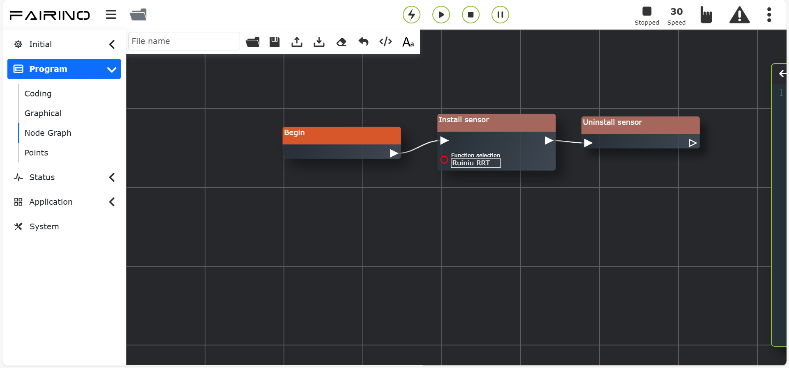

.. centered:: Abbildung 11.46-3 "Sensor laden/entladen"-Befehlsknoten-Oberfläche

3. "Tracking starten/stoppen"-Befehlsknoten, Parameter:

- Koordinatensystemname: Benutzerdefiniertes Koordinatensystem

.. centered:: Abbildung 11.46-4 "Tracking starten/stoppen"-Befehlsknoten-Oberfläche

4. "Datenaufzeichnung"-Befehlsknoten, Parameter:

- Funktionsauswahl: Aufzeichnung stoppen / Echtzeit-Tracking / Aufzeichnung starten / Bahn reproduzieren
- Wartezeit (ms): 0 ~ 10000

.. image:: node_editor_software/085.png
   :width: 6in
   :align: center

.. centered:: Abbildung 11.46-5 "Datenaufzeichnung"-Befehlsknoten-Oberfläche

5. "Lasertracking reproduzieren"-Befehlsknoten, Parameter:

.. image:: node_editor_software/086.png
   :width: 6in
   :align: center

.. centered:: Abbildung 11.46-6 "Lasertracking reproduzieren"-Befehlsknoten-Oberfläche

6. "Sensor-Punktbewegung"-Befehlsknoten, Parameter:

- Koordinatensystemname: Benutzerdefiniertes Koordinatensystem
- Bewegungsart: PTP / Lin
- Testgeschwindigkeit (%): 0 ~ 100

.. image:: node_editor_software/087.png
   :width: 6in
   :align: center

.. centered:: Abbildung 11.46-7 "Sensor-Punktbewegung"-Befehlsknoten-Oberfläche

7. "Positionssuche starten/beenden"-Befehlsknoten, Parameter:

- Koordinatensystemname: Benutzerdefiniertes Koordinatensystem
- Richtung: -x / -x / -y / -y / -z / -z / Bestimmte Richtung
- Richtungspunkt: Bei nicht Auswahl von "Bestimmte Richtung" ist dieser Parameter unwirksam.
- Geschwindigkeit (%): 0 ~ 100
- Länge (mm): 0 ~ 1000
- Maximale Suchzeit (ms): 0 ~ 10000

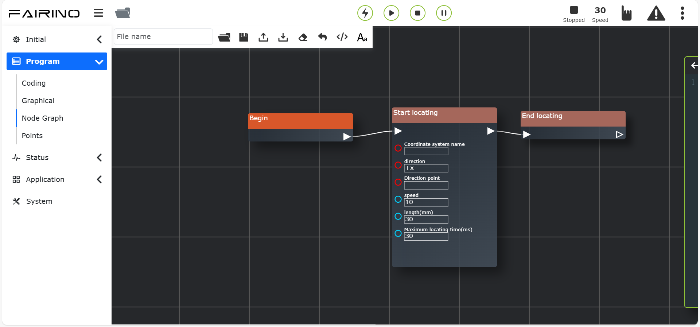

.. centered:: Abbildung 11.46-8 "Positionssuche starten/beenden"-Befehlsknoten-Oberfläche

Laseraufzeichnungs-Befehl
-------------------------

Dieser Befehl realisiert die Funktion, Start- und Endpunkt der Lasertracking-Aufzeichnung zu extrahieren. Dadurch kann der Roboter automatisch zum Startpunkt fahren. Dies eignet sich für Szenarien, in denen die Bewegung außerhalb des Werkstücks beginnt und eine Lasertracking-Aufzeichnung durchgeführt wird. Gleichzeitig kann die übergeordnete Steuerung die Informationen von Start- und Endpunkt aus den aufgezeichneten Daten abrufen, um sie für nachfolgende Bewegungen zu verwenden.

Die Funktion ermöglicht eine einstellbare Geschwindigkeit bei der Lasertracking-Reproduktion. Der Roboter kann mit einer sehr hohen Geschwindigkeit aufzeichnen und dann mit der normalen Schweißgeschwindigkeit reproduzieren, was die Arbeitseffizienz verbessert.

"Schweißnahtdaten aufzeichnen"-Befehlsknoten, Parameter:

- Funktionsauswahl: Aufzeichnung stoppen / Echtzeit-Tracking / Aufzeichnung starten / Bahn reproduzieren
- Wartezeit (ms): 0~10000, Standard 10
- Geschwindigkeit (%): 0~100, Standard 30. Dieser Parameter ist nur wirksam, wenn "Bahn reproduzieren" ausgewählt ist.

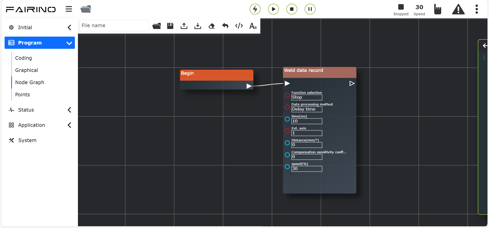

.. centered:: Abbildung 11.47-1 "Schweißnahtdaten aufzeichnen"-Befehlsknoten-Oberfläche

"Schweißnaht-Start-/Endpunkt abrufen"-Befehlsknoten, Parameter:

- Bewegungsart: PTP/LIN
- Geschwindigkeit (%): 0~100, Standard 30

.. image:: node_editor_software/090.png
   :width: 6in
   :align: center

.. centered:: Abbildung 11.47-2 "Schweißnaht-Start-/Endpunkt abrufen"-Befehlsknoten-Oberfläche

Schweißdraht-Positionssuchbefehl
--------------------------------

Dieser Befehl wird im Allgemeinen in Schweißszenarien verwendet und muss in Kombination mit den IO- und Bewegungsbefehlen des Schweißgeräts und des Roboters verwendet werden. Er ist unterteilt in Positionssuche starten, Positionssuche beenden, Suchpunkt einstellen, Versatz berechnen und Kontaktpunktdaten schreiben.

"Schweißdraht-Positionssuche starten/beenden"-Befehlsknoten, Parameter:

- Referenzposition: Nicht aktualisieren / Aktualisieren
- Suchgeschwindigkeit: 0~100
- Suchdistanz: 0~1000
- Automatischer Rückkehr-Flag: Nicht automatisch zurückkehren / Automatisch zurückkehren
- Automatische Rückkehrgeschwindigkeit: 0~100
- Automatische Rückkehrdistanz: 0~1000
- Suchmethode: Teachpunkt-Suche / Suche mit Versatz

.. image:: node_editor_software/091.png
   :width: 6in
   :align: center

.. centered:: Abbildung 11.48-1 "Schweißdraht-Positionssuche starten/beenden"-Befehlsknoten-Oberfläche

Suchpunkte werden basierend auf dem Schweißnahttyp und der Berechnungsmethode hinzugefügt.

- Bei Typ Kehlnaht und Berechnungsmethode 1D (eines von xyz) werden Punkte aus Punkt a, Punkt b ausgewählt.
- Bei Typ Kehlnaht und Berechnungsmethode 2D (zwei von xyz) werden Punkte aus Punkt a, Punkt b, Punkt e, Punkt f ausgewählt.
- Bei Typ Kehlnaht und Berechnungsmethode 3D (xyz) werden Punkte aus Punkt a, Punkt b, Punkt c, Punkt d, Punkt e, Punkt f ausgewählt.
- Bei Typ Kehlnaht und Berechnungsmethode 2D- (zwei von xyz, eines von rxryrz) werden Punkte aus Punkt a, Punkt b, Punkt c, Punkt d, Punkt e, Punkt f ausgewählt.
- Bei Typ Innendurchmesser/Außendurchmesser und Berechnungsmethode 2D2D (zwei von xyz) werden Punkte aus Punkt a, Punkt b ausgewählt.
- Bei Typ Punkt und Berechnungsmethode 3D (xyz) werden Punkte aus Punkt a, Punkt b, Punkt c, Punkt d, Punkt e, Punkt f ausgewählt.
- Bei Typ Kamera und Berechnungsmethode 3D- (xyzrxryrz) werden Punkte aus Punkt a, Punkt b ausgewählt.
- Bei Typ Fläche und Berechnungsmethode 3D- (xyzrxryrz) werden Punkte aus Punkt a, Punkt b ausgewählt.

.. image:: node_editor_software/092.png
   :width: 6in
   :align: center

.. centered:: Abbildung 11.48-2 "Suchpunkt einstellen"-Befehlsknoten-Oberfläche

Versatz berechnen basierend auf Schweißnahttyp und Berechnungsmethode mit Referenzpunkten und Kontaktpunkten.

- Bei Typ Kehlnaht und Berechnungsmethode 1D (eines von xyz) werden Referenzpunkt 1, Kontaktpunkt 1 eingestellt.
- Bei Typ Kehlnaht und Berechnungsmethode 2D (zwei von xyz) werden Referenzpunkt 1, Referenzpunkt 2, Kontaktpunkt 1, Kontaktpunkt 2 eingestellt.
- Bei Typ Kehlnaht und Berechnungsmethode 3D (xyz) werden Referenzpunkt 1, Referenzpunkt 2, Referenzpunkt 3, Kontaktpunkt 1, Kontaktpunkt 2, Kontaktpunkt 3 eingestellt.
- Bei Typ Kehlnaht und Berechnungsmethode 2D- (zwei von xyz, eines von rxryrz) werden Referenzpunkt 1, Referenzpunkt 2, Referenzpunkt 3, Kontaktpunkt 1, Kontaktpunkt 2, Kontaktpunkt 3 eingestellt.
- Bei Typ Innendurchmesser/Außendurchmesser und Berechnungsmethode 2D2D (zwei von xyz) werden Referenzpunkt 1, Referenzpunkt 2, Referenzpunkt 3, Kontaktpunkt 1, Kontaktpunkt 2, Kontaktpunkt 3 eingestellt.
- Bei Typ Punkt und Berechnungsmethode 3D (xyz) werden Kontaktpunkt 1, Kontaktpunkt 2 eingestellt.
- Bei Typ Kamera und Berechnungsmethode 3D- (xyzrxryrz) werden Kontaktpunkt 1, Kontaktpunkt 2 eingestellt.
- Bei Typ Fläche und Berechnungsmethode 3D- (xyzrxryrz) werden Kontaktpunkt 1, Kontaktpunkt 2, Kontaktpunkt 3, Kontaktpunkt 4, Kontaktpunkt 5, Kontaktpunkt 6 eingestellt.

.. image:: node_editor_software/093.png
   :width: 6in
   :align: center

.. centered:: Abbildung 11.48-3 "Versatz berechnen"-Befehlsknoten-Oberfläche

"Kontaktpunktdaten schreiben"-Befehlsknoten, Parameter:

- Kontaktpunktname: RES0~99
- Kontaktpunktdaten: Datenformat ist {0,0,0,0,0,0}

.. image:: node_editor_software/094.png
   :width: 6in
   :align: center

.. centered:: Abbildung 11.48-4 "Kontaktpunktdaten schreiben"-Befehlsknoten-Oberfläche

Lichtbogen-Tracking-Befehl
--------------------------

Klicken Sie auf den "Lichtbogen-Tracking"-Befehlsknoten, um die Node-Editor-Bearbeitungsoberfläche zu öffnen.

Dieser Befehl realisiert die Roboter-Schweißnahtverfolgung. Er nutzt die Erkennung von Abweichungen in der Schweißnaht zur Bahnkompensation. Ein Lichtbogensensor kann verwendet werden, um Schweißnahtabweichungen zu erkennen.

"Lichtbogen-Tracking ein/aus"-Befehlsknoten, Parameter:

- Lichtbogen-Tracking Nachlaufzeit (ms): Referenzwert 50
- Abweichungskompensation: Aus / Ein
- Regelkoeffizient: 0 ~ 300
- Kompensationszeit (cyc): 0 ~ 300
- Maximale Kompensation pro Zyklus (mm): 0 ~ 300
- Maximale Gesamtkompensation (mm): 0 ~ 300
- Wahl des Höhenkoordinatensystems: Pendeln
- Art der Einstellung des Höhenreferenzstroms: Rückmeldung / Konstante
- Höhenreferenzstrom (A): 0 ~ 300

.. image:: node_editor_software/095.png
   :width: 6in
   :align: center

.. centered:: Abbildung 11.49-1 "Lichtbogen-Tracking ein/aus"-Befehlsknoten-Oberfläche

Posenanpassungs-Befehl
----------------------

Klicken Sie auf den entsprechenden "Posenanpassung"-Befehlsknoten, um die Node-Editor-Bearbeitungsoberfläche zu öffnen.

Dieser Befehl dient zur adaptiven Anpassung der Schweißbrennerpose in Schweiß-Tracking-Szenarien. Zuerst müssen die drei Punkte PosA, PosB, PosC angefahren werden, sonst kann der Knoten nicht hinzugefügt werden.

Nachdem die drei entsprechenden Posenpunkte aufgezeichnet wurden, wird basierend auf der tatsächlichen Bewegungsrichtung des Roboters ein Befehl zur adaptiven Posenanpassung hinzugefügt. Weitere Details finden Sie im Kapitel Roboter-Peripheriegeräte.

"Posenanpassung einschalten"-Befehlsknoten, Parameter:

- Plattenmaterialtyp: Wellblech / Riffelblech / Zaunblech / Welliger Panzerstahl
- Bewegungsrichtung: Von links nach rechts / Von rechts nach links
- Posenanpassungszeit (ms): 0 ~ 1000
- Länge des ersten Abschnitts (mm):
- Wendepunkttyp: Von oben nach unten / Von unten nach oben
- Länge des zweiten Abschnitts (mm):
- Länge des dritten Abschnitts (mm):
- Länge des vierten Abschnitts (mm):
- Länge des fünften Abschnitts (mm):

.. image:: node_editor_software/096.png
   :width: 6in
   :align: center

.. centered:: Abbildung 11.50-1 "Posenanpassung einschalten"-Befehlsknoten-Oberfläche

"Posenanpassung ausschalten"-Befehlsknoten, Parameter:

- Plattenmaterialtyp: Wellblech / Riffelblech / Zaunblech / Welliger Panzerstahl

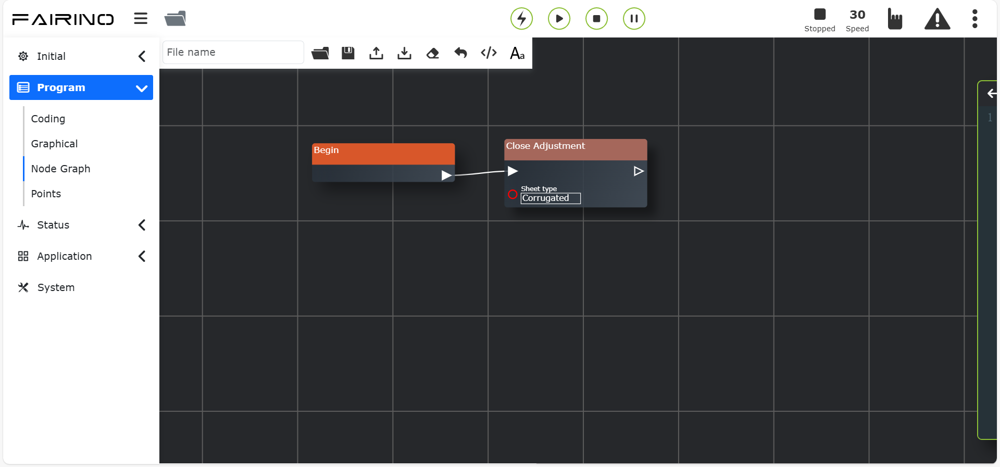

.. centered:: Abbildung 11.50-2 "Posenanpassung ausschalten"-Befehlsknoten-Oberfläche

Kraftregelungsbefehl
--------------------

Klicken Sie auf den entsprechenden "Kraftregelungs"-Befehlsknoten, um die Node-Editor-Bearbeitungsoberfläche zu öffnen.

Dieser Befehl enthält acht Befehle: FT_Guard (Kollisionserkennung), FT_Control (Kraftregelung), FT_Compliance (Nachgiebigkeitsregelung), FT_Spiral (Schraubeinfügen), FT_Rot (Dreheinfügen), FT_Lin (Lineareinfügen), FT_FindSurface (Oberflächenlokalisierung), FT_CalCenter (Zentrumslokalisierung). Weitere Details finden Sie im Kapitel Roboter-Peripheriegeräte.

1. "Kollisionserkennung ein/aus"-Befehlsknoten, Parameter:

- Koordinatensystemname: Benutzerdefiniertes Koordinatensystem
- Fx-Tx Wahrheitswert: true/false
- Fx-Tx aktueller Wert: Eingabe je nach tatsächlicher Situation
- Fx-Tx maximaler Schwellwert: Eingabe je nach tatsächlicher Situation
- Fx-Tx minimaler Schwellwert: Eingabe je nach tatsächlicher Situation

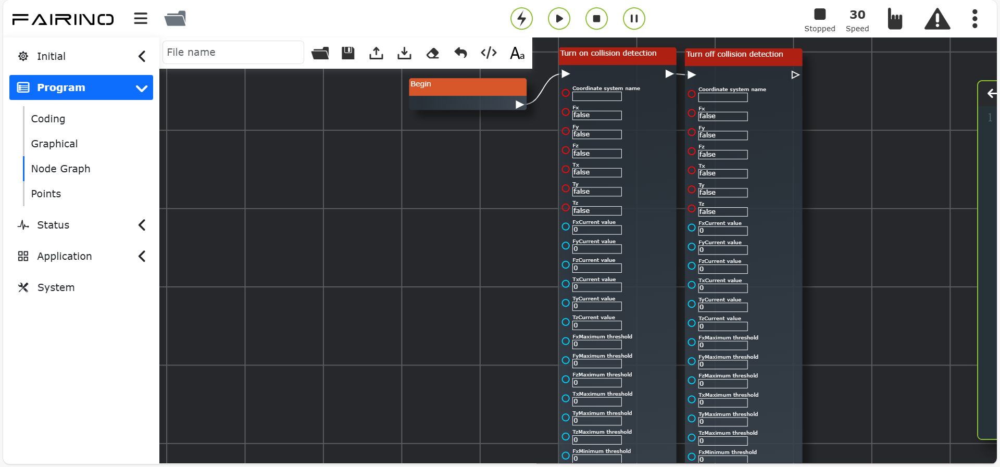

.. centered:: Abbildung 11.51-1 "Kollisionserkennung ein/aus"-Befehlsknoten-Oberfläche

2. "Regelung ein/aus"-Befehlsknoten, Parameter:

- Koordinatensystemname: Benutzerdefiniertes Koordinatensystem
- Fx-Tx Wahrheitswert: true/false
- Fx-Tx aktueller Wert: Je nach tatsächlicher Situation anpassen
- F_P_gain - F_D_gain: Je nach tatsächlicher Situation anpassen, darf nicht 0 sein.
- Adaptiver Start/Stopp-Status: Stopp / Start
- ILC-Regelung Start/Stopp-Status: Stopp / Training / Praxis
- Maximaler Anpassungsweg (mm): 0 ~ 1000
- Maximaler Anpassungswinkel (°): 0 ~ 1000

.. image:: node_editor_software/099.png
   :width: 6in
   :align: center

.. centered:: Abbildung 11.51-2 "Regelung ein/aus"-Befehlsknoten-Oberfläche

3. "Nachgiebigkeitsregelung ein/aus"-Befehlsknoten, Parameter:

- Positionsanpassungskoeffizient senden: 0 ~ 1
- Nachgiebigkeit Einschaltkraftschwelle (N): 0 ~ 100

.. image:: node_editor_software/100.png
   :width: 6in
   :align: center

.. centered:: Abbildung 11.51-3 "Nachgiebigkeitsregelung ein/aus"-Befehlsknoten-Oberfläche

4. "Schraubeinfügen"-Befehlsknoten, Parameter:

- Koordinatensystemname: Werkzeugkoordinatensystem / Basiskoordinatensystem
- Radiusvorschub pro Umdrehung (mm): 0 ~ 100, Referenzwert: 0,7
- Kraft- oder Drehmomentschwelle (N/Nm): 0 ~ 100, Referenzwert: 50
- Maximale Suchzeit (ms): 0 ~ 60000, Referenzwert: 60000
- Maximale Lineargeschwindigkeit (mm/s): 0 ~ 100, Referenzwert: 5

.. image:: node_editor_software/101.png
   :width: 6in
   :align: center

.. centered:: Abbildung 11.51-4 "Schraubeinfügen"-Befehlsknoten-Oberfläche

5. "Dreheinfügen"-Befehlsknoten, Parameter:

- Koordinatensystemname: Werkzeugkoordinatensystem / Basiskoordinatensystem
- Drehwinkelgeschwindigkeit (°/s): 0 ~ 100, Referenzwert: 0,7
- Auslösekraft oder Enddrehmoment (N/Nm): 0 ~ 100, Referenzwert: 50
- Maximaler Drehwinkel (°): 0 ~ 100, Referenzwert: 5
- Kraftrichtung: Richtung z / Richtung mz
- Maximale Drehwinkelbeschleunigung (°/s²): 0 ~ 100
- Einfügerichtung: Positiv / Negativ

.. image:: node_editor_software/102.png
   :width: 6in
   :align: center

.. centered:: Abbildung 11.51-5 "Dreheinfügen"-Befehlsknoten-Oberfläche

6. "Lineareinfügen"-Befehlsknoten, Parameter:

- Koordinatensystemname: Werkzeugkoordinatensystem / Basiskoordinatensystem
- Aktions-Endkraftschwelle (N): 0 ~ 100
- Lineargeschwindigkeit (mm/s): 0 ~ 100, Referenzwert: 1
- Linearbeschleunigung (mm/s²): 0 ~ 100
- Maximale Einführstrecke (mm): 0 ~ 100
- Einfügerichtung: Positiv / Negativ

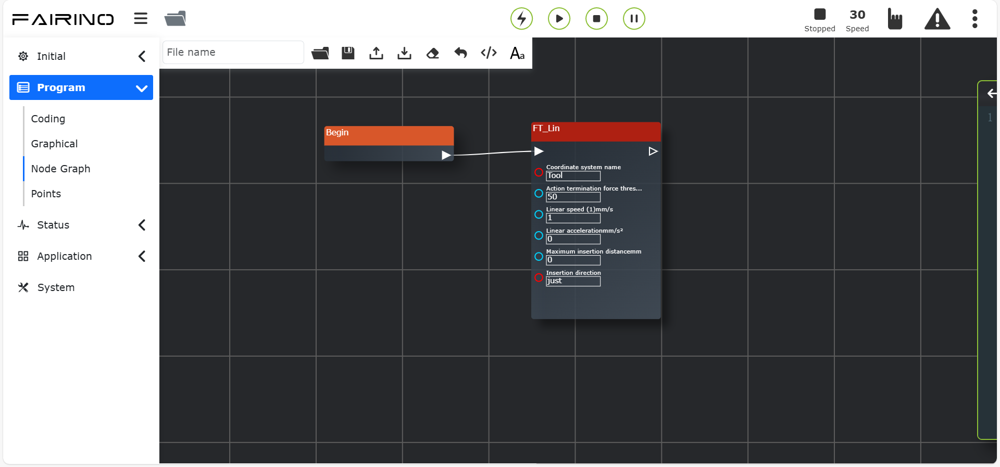

.. centered:: Abbildung 11.51-6 "Lineareinfügen"-Befehlsknoten-Oberfläche

7. "Oberflächenlokalisierung"-Befehlsknoten, Parameter:

- Koordinatensystemname: Werkzeugkoordinatensystem / Basiskoordinatensystem
- Bewegungsrichtung: Positiv / Negativ
- Bewegungsachse: X / Y / Z
- Such-Lineargeschwindigkeit (mm/s): 0 ~ 100
- Suchbeschleunigung (mm/s²): 0 ~ 100
- Maximale Suchstrecke (mm): 0 ~ 100
- Aktions-Endkraftschwelle (N): 0 ~ 100

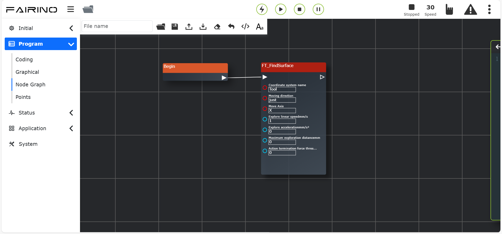

.. centered:: Abbildung 11.51-7 "Oberflächenlokalisierung"-Befehlsknoten-Oberfläche

8. "Mittelebene Berechnung starten/beenden"-Befehlsknoten

.. image:: node_editor_software/105.png
   :width: 6in
   :align: center

.. centered:: Abbildung 11.51-8 "Mittelebene Berechnung starten/beenden"-Befehlsknoten-Oberfläche

Drehmomentaufzeichnungs-Befehl
------------------------------

Klicken Sie auf den entsprechenden "Drehmomentaufzeichnung"-Befehlsknoten, um die Node-Editor-Bearbeitungsoberfläche zu öffnen.

Dieser Befehl ist ein Drehmomentaufzeichnungsbefehl. Er enthält drei Befehle: "Drehmomentaufzeichnung starten", "Drehmomentaufzeichnung stoppen" und "Drehmomentaufzeichnung zurücksetzen".

Er realisiert die Funktion der Echtzeit-Drehmomentaufzeichnung für die Kollisionserkennung.

Klicken Sie auf die Schaltfläche "Drehmomentaufzeichnung starten", um kontinuierlich Kollisionssituationen während der Ausführung von Bewegungsbefehlen aufzuzeichnen. Das aufgezeichnete Echtzeit-Drehmoment dient als theoretischer Wert für die Kollisionserkennungsbeurteilung, um die Wahrscheinlichkeit von Fehlalarmen zu reduzieren.

Wenn der eingestellte Schwellwertbereich überschritten wird, wird die Dauer der Kollisionserkennung aufgezeichnet.

Klicken Sie auf die Schaltfläche "Drehmomentaufzeichnung stoppen", um die Aufzeichnung zu beenden. Klicken Sie auf "Drehmomentaufzeichnung zurücksetzen", um den Status auf den Standardzustand zurückzusetzen.

1. "Drehmomentaufzeichnung starten"-Befehlsknoten, Parameter:

- Glättungsauswahl: Nicht glätten (Rohdaten) / Glätten (geglättete Daten)
- Gelenk negativer Schwellwert (Nm): -100 ~ 0
- Gelenk positiver Schwellwert (Nm): 0 ~ 100
- Gelenk-Dauererkennung Kollisionszeit (ms): 0 ~ 1000

.. image:: node_editor_software/107.png
   :width: 6in
   :align: center

.. centered:: Abbildung 11.52-1 "Drehmomentaufzeichnung starten"-Befehlsknoten-Oberfläche

2. "Drehmomentaufzeichnung stoppen"-Befehlsknoten

.. image:: node_editor_software/108.png
   :width: 6in
   :align: center

.. centered:: Abbildung 11.52-2 "Drehmomentaufzeichnung stoppen"-Befehlsknoten-Oberfläche

3. "Drehmomentaufzeichnung zurücksetzen"-Befehlsknoten

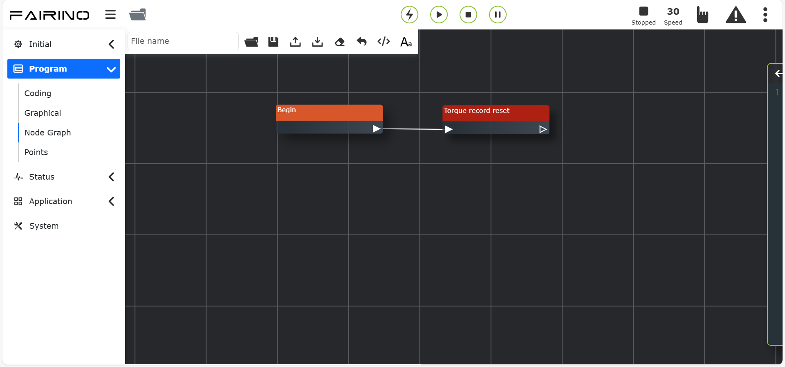

.. centered:: Abbildung 11.52-3 "Drehmomentaufzeichnung zurücksetzen"-Befehlsknoten-Oberfläche

Modbus-Befehl
-------------

Klicken Sie auf den entsprechenden "Modbus"-Befehlsknoten, um die Node-Editor-Bearbeitungsoberfläche zu öffnen.

Die Funktion dieses Befehls basiert auf dem ModbusTCP-Protokoll. Der Benutzer kann über die entsprechenden Befehle die Kommunikation des Roboters mit einem ModbusTCP-Client oder -Server (Master-Slave-Kommunikation) steuern und digitale Ausgänge, digitale Eingänge und Register lesen und schreiben. Für weitere Operationen mit ModbusTCP kontaktieren Sie uns bitte.

Bevor Sie die Modbus-Knotenfunktion verwenden, müssen Sie in der Teach-Programm-ModbusTCP-Konfiguration den Master, den Slave sowie die Namen für DI, DO, AI, AO konfigurieren.

1. Master Digitalausgangseinstellung, Parameter:

- Modbus-Master-Name: Je nach tatsächlicher Situation konfigurieren
- DO-Name: Je nach tatsächlicher Situation konfigurieren
- Registeranzahl: Ganzzahl 0 ~ 128
- Registerwert: Abhängig von der Registeranzahl. Mehrere Werte können eingegeben werden. Beispiel: Anzahl 3, Wert 1,0,1

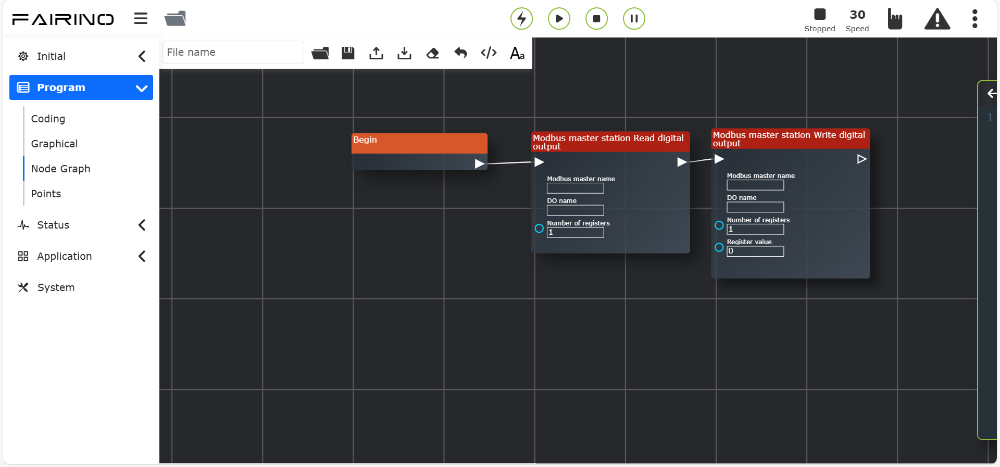

.. centered:: Abbildung 11.53-1 Master "Digitalausgang lesen/schreiben"-Befehlsknoten-Oberfläche

2. Master Digitaleingangseinstellung, Parameter:

- Modbus-Master-Name: Je nach tatsächlicher Situation konfigurieren
- DI-Name: Je nach tatsächlicher Situation konfigurieren
- Registeranzahl: Ganzzahl 0 ~ 128

.. image:: node_editor_software/111.png
   :width: 6in
   :align: center

.. centered:: Abbildung 11.53-2 Master "Digitaleingang lesen"-Befehlsknoten-Oberfläche

3. Master Analogausgangseinstellung, Parameter:

- Modbus-Master-Name: Je nach tatsächlicher Situation konfigurieren
- AO-Name: Je nach tatsächlicher Situation konfigurieren
- Registeranzahl: Ganzzahl 0 ~ 128
- Registerwert: Abhängig von der Registeranzahl. Mehrere Werte können eingegeben werden. Beispiel: Anzahl 3, Wert 1,0,1

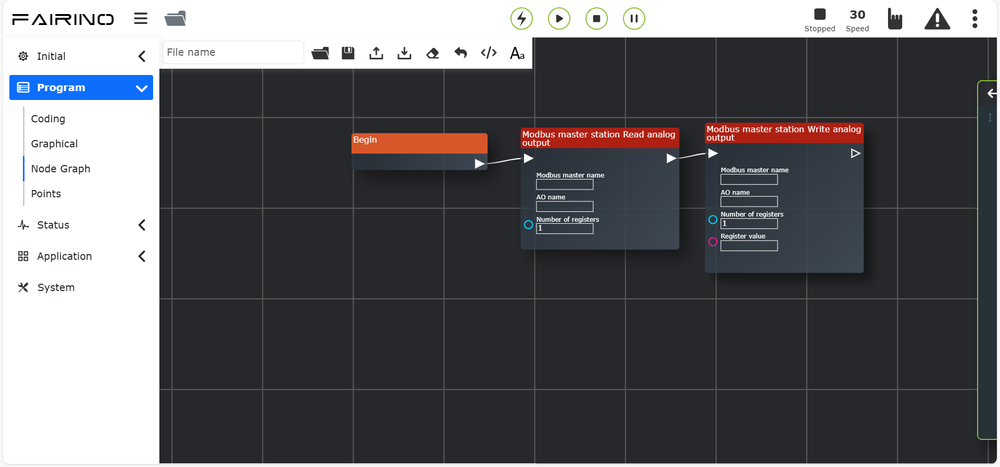

.. centered:: Abbildung 11.53-3 Master "Analogausgang lesen/schreiben"-Befehlsknoten-Oberfläche

4. Master Analogeingangseinstellung, Parameter:

- Modbus-Master-Name: Je nach tatsächlicher Situation konfigurieren
- AI-Name: Je nach tatsächlicher Situation konfigurieren
- Registeranzahl: Ganzzahl 0 ~ 128

.. image:: node_editor_software/113.png
   :width: 6in
   :align: center

.. centered:: Abbildung 11.53-4 Master "Analogeingang lesen"-Befehlsknoten-Oberfläche

5. Master Warten auf digitaleingang-Einstellung, Parameter:

- Modbus-Master-Name: Je nach tatsächlicher Situation konfigurieren
- DI-Name: Je nach tatsächlicher Situation konfigurieren
- Wartezustand: true/false
- Timeout-Zeit (ms): Ganzzahl 0 ~ 128

.. image:: node_editor_software/114.png
   :width: 6in
   :align: center

.. centered:: Abbildung 11.53-5 Master "Warten auf digitaleingang"-Befehlsknoten-Oberfläche

6. Master Warten auf analogeingang-Einstellung, Parameter:

- Modbus-Master-Name: Je nach tatsächlicher Situation konfigurieren
- AI-Name: Je nach tatsächlicher Situation konfigurieren
- Wartezustand: Größer als / Kleiner als
- Registeranzahl: Ganzzahl 0 ~ 128
- Registerwert: Abhängig von der Registeranzahl. Mehrere Werte können eingegeben werden.

.. image:: node_editor_software/115.png
   :width: 6in
   :align: center

.. centered:: Abbildung 11.53-6 Master "Warten auf analogeingang"-Befehlsknoten-Oberfläche

7. Slave Digitalausgangseinstellung, Parameter:

- DO-Name: Je nach tatsächlicher Situation konfigurieren
- Registeranzahl: Ganzzahl 0 ~ 128
- Registerwert: Abhängig von der Registeranzahl. Mehrere Werte können eingegeben werden. Beispiel: Anzahl 3, Wert 1,0,1

.. image:: node_editor_software/116.png
   :width: 6in
   :align: center

.. centered:: Abbildung 11.53-7 Slave "Digitalausgang lesen/schreiben"-Befehlsknoten-Oberfläche

8. Slave Digitaleingangseinstellung, Parameter:

- DI-Name: Je nach tatsächlicher Situation konfigurieren
- Registeranzahl: Ganzzahl 0 ~ 128

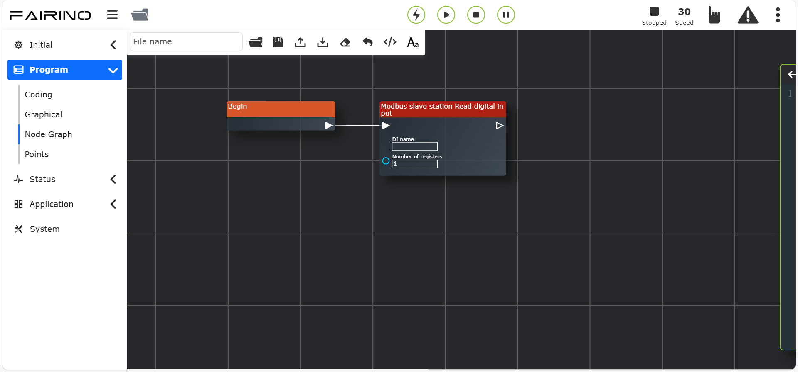

.. centered:: Abbildung 11.53-8 Slave "Digitaleingang lesen"-Befehlsknoten-Oberfläche

9. Slave Analogausgangseinstellung, Parameter:

- AO-Name: Je nach tatsächlicher Situation konfigurieren
- Registeranzahl: Ganzzahl 0 ~ 128
- Registerwert: Abhängig von der Registeranzahl. Mehrere Werte können eingegeben werden. Beispiel: Anzahl 3, Wert 1,0,1

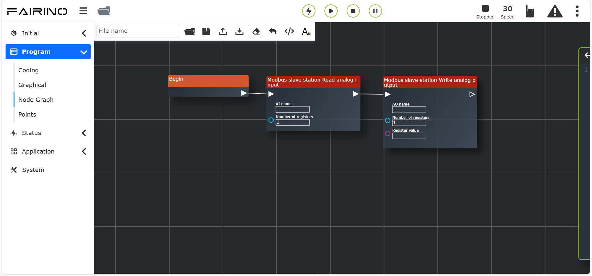

.. centered:: Abbildung 11.53-9 Slave "Analogausgang lesen/schreiben"-Befehlsknoten-Oberfläche

10. Slave Warten auf digitaleingang-Einstellung, Parameter:

- DI-Name: Je nach tatsächlicher Situation konfigurieren
- Wartezustand: true/false
- Timeout-Zeit (ms): Ganzzahl

.. image:: node_editor_software/127.png
   :width: 6in
   :align: center

.. centered:: Abbildung 11.53-10 Slave "Warten auf digitaleingang"-Befehlsknoten-Oberfläche

11. Slave Warten auf analogeingang-Einstellung, Parameter:

- AI-Name: Je nach tatsächlicher Situation konfigurieren
- Wartezustand: Größer als / Kleiner als
- Registeranzahl: Ganzzahl 0 ~ 128
- Registerwert: Abhängig von der Registeranzahl. Mehrere Werte können eingegeben werden.

.. image:: node_editor_software/128.png
   :width: 6in
   :align: center

.. centered:: Abbildung 11.53-11 Slave "Warten auf analogeingang"-Befehlsknoten-Oberfläche

12. Slave Analogeingangseinstellung, Parameter:

- AI-Name: Je nach tatsächlicher Situation konfigurieren
- Registeranzahl: Ganzzahl 0 ~ 128

.. image:: node_editor_software/126.png
   :width: 6in
   :align: center

.. centered:: Abbildung 11.53-12 Slave "Analogeingang lesen"-Befehlsknoten-Oberfläche

Anwendungsbeispiel
------------------

Zum Beispiel: Montieren Sie eine Spitze am Roboterende, ziehen Sie sie in die Nähe einer Lochposition auf einer Palette und möchten Sie eine kraftgeregelte Spiral-, Dreh- und Lineareinfügeoperation durchführen.

- Klicken Sie zuerst mit der rechten Maustaste und wählen Sie die Befehlsknoten "Begin", "Regelung ein/aus", "Schraubeinfügen", "Dreheinfügen", "Lineareinfügen" aus.
- Verbinden Sie sie nacheinander wie unten gezeigt und konfigurieren Sie die relevanten Parameter.

.. image:: node_editor_software/122.png
   :width: 6in
   :align: center

.. centered:: Abbildung 11.54-1 "Kraftregelungs"-Befehlsknoten-Anwendungskonfigurationsoberfläche

- Geben Sie einen Dateinamen ein. Wenn die Parameter nicht korrekt eingegeben werden, schlägt das Speichern fehl, und es wird eine Meldung angezeigt, dass die Konfiguration der Befehlsknotenparameter fehlerhaft ist.

  .. image:: node_editor_software/123.png
   :width: 6in
   :align: center

.. centered:: Abbildung 11.54-2 Fehlerhafte Befehlsknotenparameter-Konfigurationsoberfläche

- Nach dem Start führt der Roboter eine spiralförmige und lineare Bewegung zur Erkundung durch. Wenn die korrekte Lochposition gefunden ist, folgt eine lineare und rotierende Einführbewegung, bis die Lochposition korrekt erreicht ist.