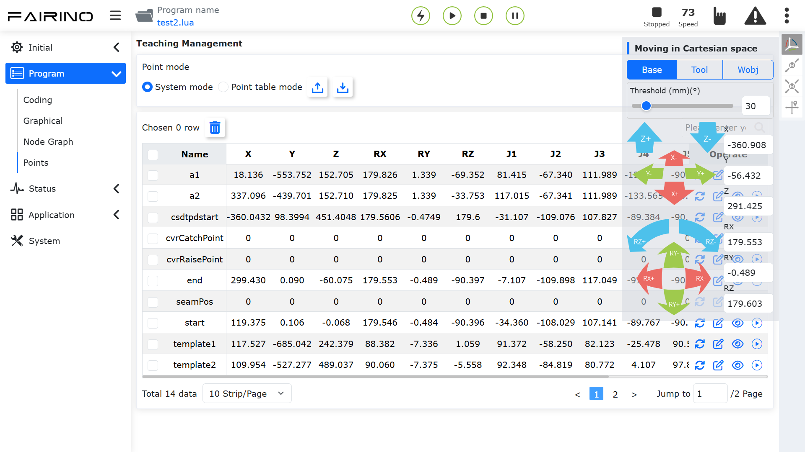
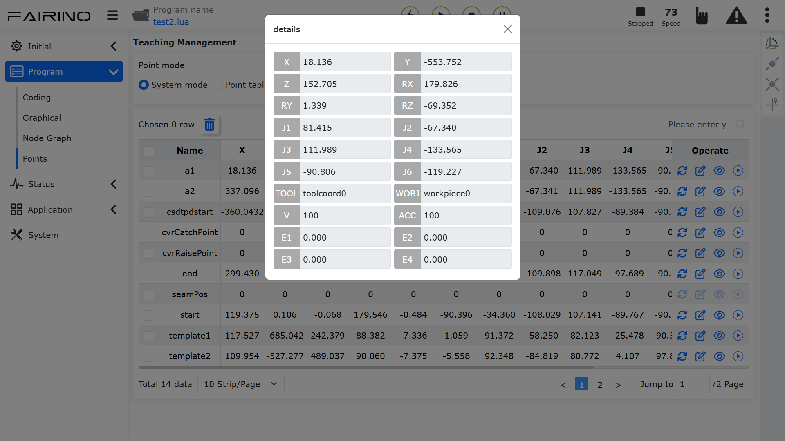
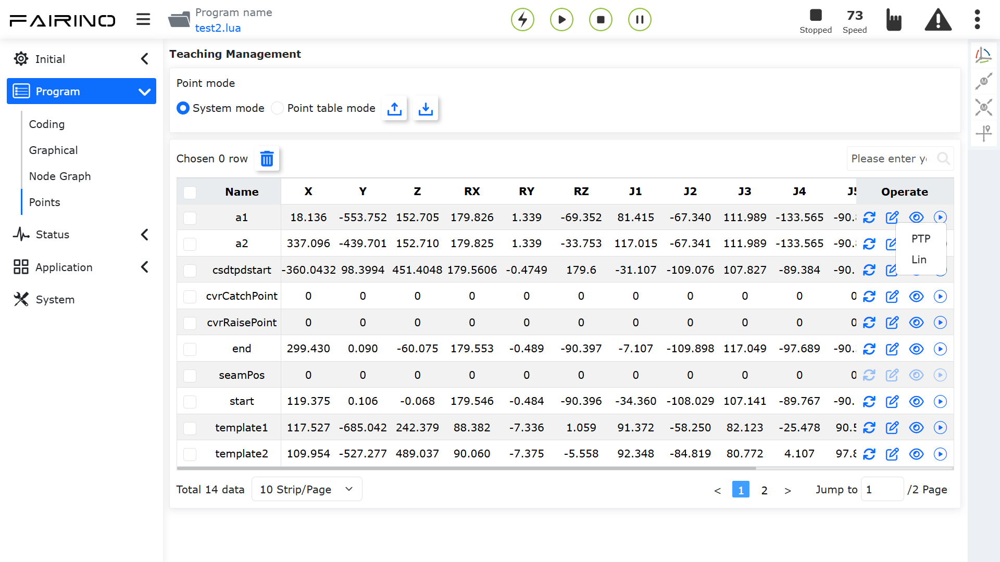

Teachpunkte
===========

.. toctree::
   :maxdepth: 6

Die Teachpunkt-Verwaltung ist in zwei Modi unterteilt: "Systemmodus" und "Punktetabellenmodus". Beim Aufruf von Roboterprogrammen können durch die Verwendung verschiedener Punktetabellen unterschiedliche Prüfpläne realisiert werden, um den Anforderungen von Rezepturen gerecht zu werden. Für jedes weitere hinzugefügte Gerät oder Produkt können Punktetabellen-Datenpakete über einen übergeordneten Rechner auf den Roboter heruntergeladen werden. Neu erstellte Punktetabellen-Datenpakete des Roboters können auch an den übergeordneten Rechner hochgeladen werden.

**Systemmodus**: Unterstützt "Importieren, Exportieren, Löschen, Umbenennen, Ändern, Überschreiben, Bearbeiten und Anzeigen" von Teachpunkt-Inhalten sowie die Einzelschrittbewegung zu einem Teachpunkt.

.. image:: points/001.png
   :width: 6in
   :align: center

.. centered:: Abbildung 12.1-1 Teachpunkt-Verwaltungsoberfläche - Systemmodus

**Punktetabellenmodus**: Unterstützt "Hinzufügen, Anwenden, Umbenennen, Löschen, Importieren, Exportieren" von Punktetabellen, "Löschen, Ändern, Anzeigen und Überschreiben" von Punktinhalten innerhalb einer Punktetabelle sowie die Einzelschrittbewegung zu einem Teachpunkt.

.. image:: points/002.png
   :width: 6in
   :align: center

.. centered:: Abbildung 12.1-2 Teachpunkt-Verwaltungsoberfläche - Punktetabellenmodus

In der oberen rechten Ecke der Teachpunkt-Verwaltungsoberfläche wird die Bedienleiste für den Roboterarm angezeigt. Auf dieser Oberfläche kann der Benutzer den Roboterarm bewegen und anschließend die Daten der Teachpunkte überschreiben.

.. centered:: Abbildung 12.1-3 Teachpunkt-Verwaltungsoberfläche - Bedienleiste für den Roboterarm

In der oberen rechten Ecke der Teachpunkt-Tabellendaten kann der Name eines Teachpunkts zur Suche eingegeben werden. Ein Klick auf einen Teachpunktnamen in der Teachpunkt-Tabelle versetzt diesen in den Bearbeitungsmodus. Nach Eingabe des geänderten Namens und einem Klick außerhalb des Namensfelds wird die Änderung abgeschlossen.

.. note::
   .. image:: points/004.png
      :height: 0.75in
      :align: left

   Bezeichnung: **Importieren-Schaltfläche**

   Funktion: Importieren von Teachpunkt-Dateien.

.. note::
   .. image:: points/005.png
      :height: 0.75in
      :align: left

   Bezeichnung: **Exportieren-Schaltfläche**

   Funktion: Exportieren von Teachpunkt-Dateien.

.. note::
   .. image:: points/006.png
      :height: 0.75in
      :align: left

   Bezeichnung: **Löschen-Schaltfläche**

   Funktion: Nach Auswahl eines oder mehrerer Teachpunkte und Klick auf die "Löschen"-Schaltfläche über der Tabelle erscheint die Meldung "Bitte klicken Sie erneut auf die Löschen-Schaltfläche, um das Löschen zu bestätigen." Nach einem erneuten Klick werden die Informationen dieser Punkte gelöscht.

.. note::
   .. image:: points/007.png
      :height: 0.75in
      :align: left

   Bezeichnung: **Punkt überschreiben-Schaltfläche**

   Funktion: Klicken, um die aktuellen Roboter-Positionsdaten über einen Teachpunkt zu überschreiben. Im Popup-Fenster kann ausgewählt werden, ob "das Teach-Programm synchronisiert werden soll".

.. image:: points/008.png
   :width: 6in
   :align: center

.. centered:: Abbildung 12.1-4 Teachpunkt überschreiben

.. note::
   .. image:: points/009.png
      :height: 0.75in
      :align: left

   Bezeichnung: **Bearbeiten-Schaltfläche**

   Funktion: Klicken, um die Änderung der Werte x, y, z, rx, ry, rz und v eines Teachpunkts zu bestätigen.

.. important::
    Die geänderten Werte für x, y, z, rx, ry, rz des Teachpunkts dürfen den Arbeitsbereich des Roboters nicht überschreiten.

.. note::
   .. image:: points/010.png
      :height: 0.75in
      :align: left

   Bezeichnung: **Details-Schaltfläche**

   Funktion: Klicken, um die Details eines Teachpunkts anzuzeigen.

.. centered:: Abbildung 12.1-5 Teachpunkt-Details

.. note::
   .. image:: points/012.png
      :height: 0.75in
      :align: left

   Bezeichnung: **Ausführen starten-Schaltfläche**

   Funktion: Klicken, um die Methode für die Einzelpunktbewegung auszuwählen und den Roboter an die Position dieses Punkts zu bewegen. Die Wahl von PTP bedeutet eine Punkt-zu-Punkt-Bewegung, die Wahl von Lin eine Linearbewegung.

.. centered:: Abbildung 12.1-6 Teachpunkt ausführen