Prozesspakete
=============

.. toctree::
  :maxdepth: 5

Schweißexpertenbibliothek
-------------------------

Klicken Sie im Menü "Hilfsanwendungen" -> "Prozesspakete" auf "Schweißexpertenbibliothek", um die Funktionsoberfläche der Schweißexpertenbibliothek aufzurufen. Diese umfasst Geradschweißen, Lichtbogenschweißen, Mehrlagenschweißen und Posenanpassung.

.. image:: process/001.png
   :width: 4in
   :align: center

.. centered:: Abbildung 15.1‑1 Erweiterungsachsenkonfiguration

Geradschweißen
~~~~~~~~~~~~~~

Klicken Sie auf "Geradschweißen", um die Anleitungsoberfläche für das Geradschweißen aufzurufen. Basierend auf der abgeschlossenen Konfiguration der grundlegenden Robotereinstellungen können wir in wenigen einfachen Schritten schnell ein Schweiß-Teach-Programm generieren. Es umfasst hauptsächlich die folgenden fünf Schritte. Da sich einige Funktionen gegenseitig ausschließen, sind für die tatsächliche Generierung eines Schweiß-Teach-Programms weniger als fünf Schritte erforderlich.

Schritt eins: Auswahl, ob eine Erweiterungsachse verwendet werden soll. Wenn eine Erweiterungsachse verwendet wird, müssen die entsprechenden Koordinatensysteme der Erweiterungsachse konfiguriert und die Erweiterungsachse aktiviert werden. Bei Verwendung einer Erweiterungsachse kann die Pendelfunktion nicht genutzt werden.

.. image:: process/002.png
   :width: 4in
   :align: center

.. centered:: Abbildung 15.1‑2 Erweiterungsachsenkonfiguration

Schritt zwei: Auswahl, ob eine Sensorverfolgung benötigt wird. Wenn ja, müssen die Parameter des Laser-Positionssuchbefehls bearbeitet werden. Bei Verwendung einer Sensorverfolgung kann die Pendelfunktion nicht genutzt werden.

.. image:: process/003.png
   :width: 4in
   :align: center

.. centered:: Abbildung 15.1‑3 Laser-Positionssuche-Konfiguration

Schritt drei: Auswahl, ob eine Pendelschweißung benötigt wird. Wenn ja, müssen die relevanten Pendelschweißparameter bearbeitet werden.

.. image:: process/004.png
   :width: 4in
   :align: center

.. centered:: Abbildung 15.1‑4 Pendelschweißkonfiguration

Schritt vier: Kalibrierung des Startpunkts, des Start-Sicherheitspunkts, des Endpunkts und des End-Sicherheitspunkts. Wenn im ersten Schritt eine Erweiterungsachse ausgewählt wurde, wird die Bewegungsfunktion der Erweiterungsachse geladen und mit der Kalibrierung der entsprechenden Punkte kombiniert.

.. image:: process/005.png
   :width: 4in
   :align: center

.. centered:: Abbildung 15.1‑5 Kalibrierung relevanter Punkte

Schritt fünf: Benennung des Programms. Das Programm wird automatisch in der Teach-Programm-Oberfläche geöffnet.

.. image:: process/006.png
   :width: 4in
   :align: center

.. centered:: Abbildung 15.1‑6 Programm speichern

Nach erfolgreichem Speichern des Programms kann die Schweißgeschwindigkeit in den Prozessparametern geändert werden.

.. image:: process/007.png
   :width: 4in
   :align: center

.. centered:: Abbildung 15.1‑7 Prozessparameter

Lichtbogenschweißen
~~~~~~~~~~~~~~~~~~~

Klicken Sie unter "Schweißteilform" auf "Lichtbogenschweißen", um die Anleitungsoberfläche für das Lichtbogenschweißen aufzurufen. Basierend auf der abgeschlossenen Konfiguration der grundlegenden Robotereinstellungen können wir in zwei einfachen Schritten schnell ein Schweiß-Teach-Programm generieren. Es umfasst hauptsächlich die folgenden zwei Schritte.

Schritt eins: Kalibrierung des Startpunkts, des Start-Sicherheitspunkts, des Kreisbogen-Zwischenpunkts, des Endpunkts und des End-Sicherheitspunkts.

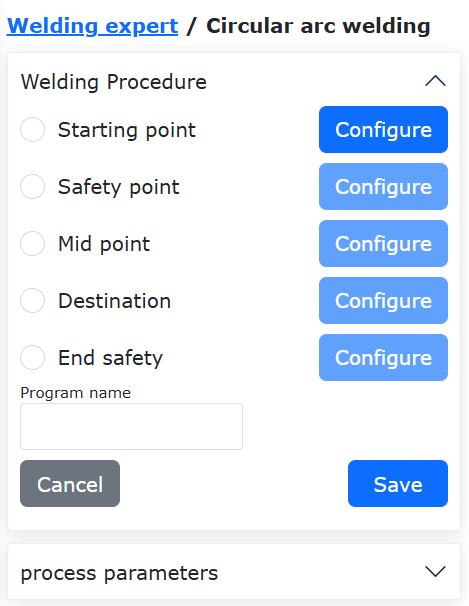

.. centered:: Abbildung 15.1‑8 Punktkalibrierung

Schritt zwei: Benennung des Programms. Das Programm wird automatisch in der Teach-Programm-Oberfläche geöffnet.

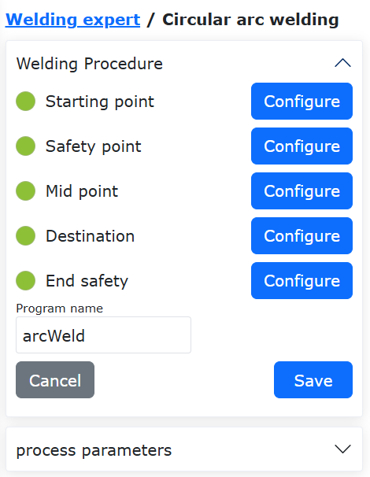

.. centered:: Abbildung 15.1‑9 Programm speichern

Nach erfolgreichem Speichern des Programms kann die Schweißgeschwindigkeit in den Prozessparametern geändert werden.

.. image:: process/010.png
   :width: 4in
   :align: center

.. centered:: Abbildung 15.1‑10 Prozessparameter

Mehrlagenschweißen
~~~~~~~~~~~~~~~~~~

Wenn die Schweißnahtdicke mehr als 10 mm beträgt, wird üblicherweise die Mehrlagenschweißfunktion verwendet. Diese Funktion ermöglicht die Vorlagenkonfiguration von Schweißprogrammen. In der ersten Lage des Mehrlagenschweißens wird die Lichtbogenverfolgungsfunktion integriert, und in den folgenden geraden Schweißlagen wird die Schweißnahtabweichung korrigiert, um die Schweißnahtqualität zu verbessern.

Der Ablauf der Lichtbogenverfolgungs-Mehrlagenschweißfunktion ist wie folgt:

1) Stellen Sie das Werkzeugkoordinatensystem ein und geben Sie die Werkzeugabmessungen und -ausrichtung des Schweißbrenners ein.

.. note::
    Die Werte in der Oberfläche sind nur Beispiele. Maßgeblich ist der tatsächliche Zustand des Werkzeugs.

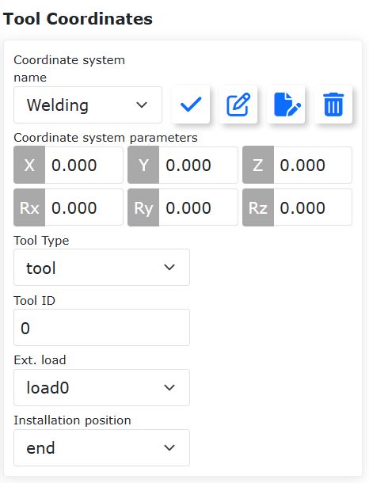

.. centered:: Abbildung 15.1-11 Einstellung des Werkzeugkoordinatensystems

2) Klicken Sie auf "Mehrlagenschweißen", um die Oberfläche aufzurufen.

.. image:: process/012.png
   :width: 4in
   :align: center

.. centered:: Abbildung 15.1-12 Öffnen der Mehrlagenschweiß-Oberfläche

3) Wenn die Lichtbogenverfolgungsfunktion verwendet werden soll, muss der Schalter "Pendelfunktion für die erste Lage" aktiviert und die entsprechenden Pendelparameter konfiguriert werden.

.. image:: process/013.png
   :width: 4in
   :align: center

.. centered:: Abbildung 15.1-13 Aktivieren der Pendelfunktion für die erste Lage

4) Klicken Sie auf die Schaltfläche "Konfigurieren", bearbeiten Sie die Pendelparameter und klicken Sie dann auf "Konfigurieren".

.. note::
    Wenn eine Links-Rechts-Kompensation für die Lichtbogenverfolgung erforderlich ist, können nur die Typen "Dreieckwelle pendeln" und "Sinuswelle pendeln" ausgewählt werden. Die Pendelfrequenz darf nicht unter 0,5 Hz liegen, die Pendelamplitude nicht unter 3 mm. Die linken und rechten Wartezeiten des Pendelns müssen identisch sein, der Pendel-Azimutwinkel muss 0 sein.

.. image:: process/014.png
   :width: 4in
   :align: center

.. centered:: Abbildung 15.1-14 Konfiguration der Pendelparameter

5) Aktivieren Sie den Schalter "Lichtbogenverfolgungsfunktion" und bearbeiten Sie die entsprechenden Höhen- und Seitenkompensationsparameter.

.. note::
    Die Lichtbogenverfolgungsparameter sollten je nach tatsächlicher Schweißsituation unter Bezugnahme auf das "Lichtbogenverfolgungsfunktions-Handbuch" oder in Absprache mit technischem Personal konfiguriert werden.

.. image:: process/015.png
   :width: 4in
   :align: center

.. centered:: Abbildung 15.1-15 Konfiguration der Lichtbogenverfolgungsparameter

6) Klicken Sie je nach Steuerungstyp auf den entsprechenden Typ, um die Oberfläche aufzurufen. Legen Sie zunächst in der ersten Punktgruppe "Schweißpunkt" als Startposition des Schweißens fest. "X+ Punkt" ist ein Punkt in X+-Richtung des benutzerdefinierten Versatzkoordinatensystems relativ zum Schweißpunkt. "Z+ Punkt" ist ein Punkt in Z+-Richtung des benutzerdefinierten Versatzkoordinatensystems relativ zum Schweißpunkt. "Sicherheitspunkt" ist die Übergangsposition von der letzten abgeschlossenen Schweißung bis zum Beginn der nächsten Schweißung. Nach dem Anfahren und Einstellen wird automatisch mit der Einstellung der zweiten Punktgruppe fortgefahren.

.. image:: process/016.png
   :width: 4in
   :align: center

.. centered:: Abbildung 15.1-16 Positionseinstellung für den Startpunkt der geraden Linie beim Mehrlagenschweißen

7) Wählen Sie "Gerader Punkt". Hier ist "Schweißpunkt" die Endposition des Schweißens. "X+ Punkt" ist ein Punkt in X+-Richtung des benutzerdefinierten Versatzkoordinatensystems relativ zum "Schweißpunkt". "Z+ Punkt" ist ein Punkt in Z+-Richtung des benutzerdefinierten Versatzkoordinatensystems relativ zum "Schweißpunkt". Nach dem Anfahren und Einstellen klicken Sie auf die Schaltfläche "Fertigstellen", um die Parameter für das Mehrlagenschweißen einzustellen.

.. image:: process/017.png
   :width: 4in
   :align: center

.. centered:: Abbildung 15.1-17 Positionseinstellung für den Endpunkt der geraden Linie beim Mehrlagenschweißen

8) Auf dieser Seite können die Anzahl der Lagen beim Mehrlagenschweißen sowie deren Verteilungspositionen eingestellt werden. Aktivieren Sie im Parameter-Table die "On/Off"-Kästchen für die entsprechenden Werte der aktiven Mehrlagenschweißpositionen. Tragen Sie in den Spalten "X", "Z" und "B" die gewünschten Versatzpositionen und -winkel im benutzerdefinierten Koordinatensystem ein.

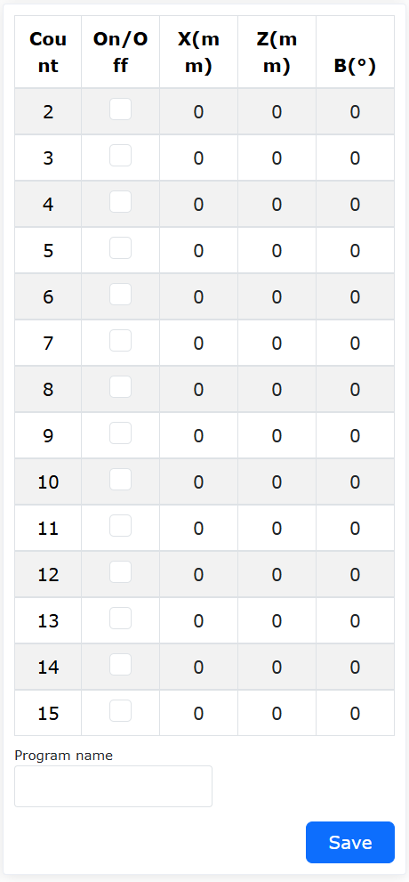

.. centered:: Abbildung 15.1-18 Parametereinstellung für das Mehrlagenschweißen

9) Damit ist die gesamte Parametereinstellung abgeschlossen. Geben Sie den gewünschten Programmnamen zum Speichern ein und klicken Sie auf die Schaltfläche "Speichern". Das entsprechende Mehrlagenschweißprogramm wird automatisch generiert.

.. image:: process/019.png
   :width: 6in
   :align: center

.. centered:: Abbildung 15.1-19 Generierung eines Mehrlagenschweißprogramms

10) Klicken Sie auf die Schaltfläche "Programm öffnen", um das im vorherigen Schritt gespeicherte Lua-Programm zu laden. Der Programminhalt ist in der folgenden Abbildung dargestellt.

.. image:: process/020.png
   :width: 4in
   :align: center

.. centered:: Abbildung 15.1-20 Beispiel eines Lichtbogenverfolgungs-Mehrlagenschweißprogramms

Posenanpassung
~~~~~~~~~~~~~~

Schritte zur adaptiven Posenkonfiguration
++++++++++++++++++++++++++++++++++++++++++

**Schritt 1**: Rufen Sie die Posenanpassungs-Konfigurationsoberfläche auf. Wählen Sie den Plattenmaterialtyp und die tatsächliche Bewegungsrichtung des Roboters aus. Passen Sie die Roboterpose an und legen Sie nacheinander die Posenpunkte A, B und C fest. Normalerweise ist A ein ebener Posenpunkt, B ein ansteigender Posenpunkt und C ein abfallender Posenpunkt.

.. figure:: process/021.png
   :align: center
   :width: 4in

.. centered:: Abbildung 15.1‑21 Posenanpassungskonfiguration

.. important::
    Die Posenänderung zwischen A und B sowie zwischen A und C sollte unter Erfüllung der Anwendungsanforderungen so gering wie möglich sein. Die adaptive Posenfunktion ist eine Hilfsanwendungsfunktion und wird normalerweise in Verbindung mit der Schweißnahtverfolgung verwendet.

**Schritt 2**: Wählen Sie auf der Teach-Programm-Befehlsoberfläche den Befehl "Adjust". Fügen Sie den Befehl je nach spezifischem Teach-Programm-Bedarf an der entsprechenden Stelle ein.

.. figure:: process/022.png
   :align: center
   :width: 6in

.. centered:: Abbildung 15.1‑22 Bearbeitung des Posenanpassungsbefehls

Adaptive Posenanpassung in Kombination mit Erweiterungsachse und Laser-Tracking-Schweiß-Teach-Programm
++++++++++++++++++++++++++++++++++++++++++++++++++++++++++++++++++++++++++++++++++++++++++++++++++++++

.. list-table::
   :widths: 50 80 80
   :header-rows: 0
   :align: center

   * - **Nr.**
     - **Befehlsformat**
     - **Anmerkung**

   * - 1
     - EXT_AXIS_PTP(1,1laserstart)
     - #Erweiterungsachse bewegt sich zum Startpunkt des Lasersensors

   * - 2
     - PTP(laserstart,10,-1,0)
     - #Roboter bewegt sich zum Startpunkt des Lasersensors

   * - 3
     - LTSearchStart(3,20,10,10000)
     - #Positionssuche starten

   * - 4
     - LTSearchStop()
     - #Positionssuche stoppen

   * - 5
     - EXT_AXIS_PTP(1,1,seamPos)
     - #Erweiterungsachse bewegt sich zum Schweißnaht-Startpunkt

   * - 6
     - Lin(seamPos,20,-1,00,0)
     - #Roboter bewegt sich zum Schweißnaht-Startpunkt

   * - 7
     - LTTrackOn()
     - #Lasertracking einschalten

   * - 8
     - ARCStart(0,10000)
     - #Schweißgerät Lichtbogen zünden

   * - 9
     - PostureAdjustOn(0,PosA,PosC,PosB,1000)
     - #Adaptive Posenanpassung einschalten

   * - 10
     - EXT_AXIS_PTP(1,1,laserend)
     - #Erweiterungsachse bewegt sich zum Schweißnaht-Endpunkt

   * - 11
     - Lin( laserend,10,-1,0,0)
     - #Roboter bewegt sich zum Schweißnaht-Endpunkt

   * - 12
     - ARCEnd(0,10000)
     - #Schweißgerät Lichtbogen löschen

   * - 13
     - PostureAdjustOff(0)
     - #Adaptive Posenanpassung ausschalten

   * - 14
     - LTTrackOff
     - #Lasertracking ausschalten

Neue Spline-Linienbogen-Übergangs-Pendelfunktion
~~~~~~~~~~~~~~~~~~~~~~~~~~~~~~~~~~~~~~~~~~~~~~~~~~~~~~

Übersicht
+++++++++++++++++++++++++++++++++++++++++++++++++++++++++++++++++++

Die Funktion der neuen Spline-Linienbogen-Übergangs mit überlagerter Pendelbewegung ist eine Kombination aus der neuen Spline-Linienbogen-Übergangsfunktion des Roboters und der Pendelfunktion, die es dem Roboter ermöglicht, Pendelbewegungen der Typen "Dreieckswellenpendelung", "vertikale L-förmige Dreieckswellenpendelung", "Stehschweiß-Dreieckspendelung", "Sinuswellenpendelung" und "vertikale L-förmige Sinuswellenpendelung" während des neuen Spline-Linienbogen-Übergangsprozesses durchzuführen.

Ablauf
++++++++++++++++++++++++++++++++++++++++++++++++++++++++++++++++++++++++++++++++++++++++++++++++++++++++++++++++++++++++++++++++++++++

**Schritt 1**: Kalibrieren Sie das Roboter-Werkzeugkoordinatensystem über WebApp. Die detaillierten Bedienschritte dieser Funktion finden Sie im entsprechenden Kapitel des Benutzerhandbuchs.

**Schritt 2**: Unterrichten Sie nicht weniger als 4 Punkte über WebApp. Beachten Sie, dass der Abstand zwischen den Punkten gleichmäßig verteilt sein sollte, um die besten Ergebnisse zu erzielen.

**Schritt 3**: Legen Sie die Pendelparameter fest. Klicken Sie auf der WebApp-Hauptoberfläche auf "Teach-Programm" -> "Programmierung", um in den Bereich "Bewegungsbefehle" zu gelangen.

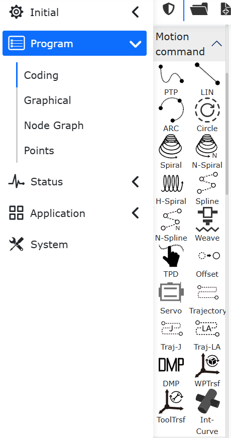
   
.. centered:: Abbildung 15.1‑23 Bereich "Bewegungsbefehle"
  
Klicken Sie im Bereich "Bewegungsbefehle" auf die Schaltfläche "Pendeln", um die Konfigurationsoberfläche "Weave" aufzurufen. Wählen Sie im Bereich "Befehlsbearbeitung" die Prozessnummer aus dem Dropdown-Menü "Nummer auswählen", klicken Sie auf "Bearbeiten", um zur Konfiguration der Pendelprozessparameter zu gelangen. Klicken Sie nach der Konfiguration auf "Konfigurieren", um die Prozessnummer zu speichern.

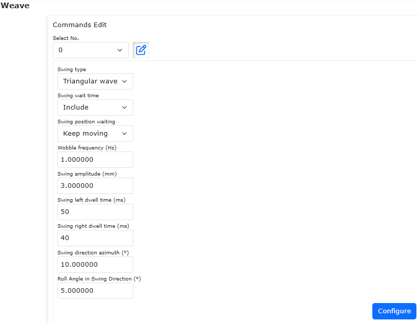
   
.. centered:: Abbildung 15.1‑24 Einstellung der Pendelprozessparameter
 
.. note:: Die Funktion des neuen Spline-Linienbogen-Übergangs mit überlagerter Pendelbewegung gilt derzeit für die Typen "Dreieckswellenpendelung", "vertikale L-förmige Dreieckswellenpendelung", "Stehschweiß-Dreieckspendelung", "Sinuswellenpendelung" und "vertikale L-förmige Sinuswellenpendelung". Wählen Sie "Einschließen" im Dropdown-Menü "Pendel-Wartezeit" und "Bewegung während der Wartezeit fortsetzen" im Dropdown-Menü "Pendelpositionswartezeit".

**Schritt 4**: Fügen Sie Pendelbewegungsbefehle hinzu. Klicken Sie im Bereich "Befehlstyp" der Konfigurationsoberfläche "Weave" auf "Pendeln starten" -> "Hinzufügen" -> "Pendeln stoppen" -> "Hinzufügen" -> "Übernehmen", um die Pendelbewegungseinstellungen abzuschließen.

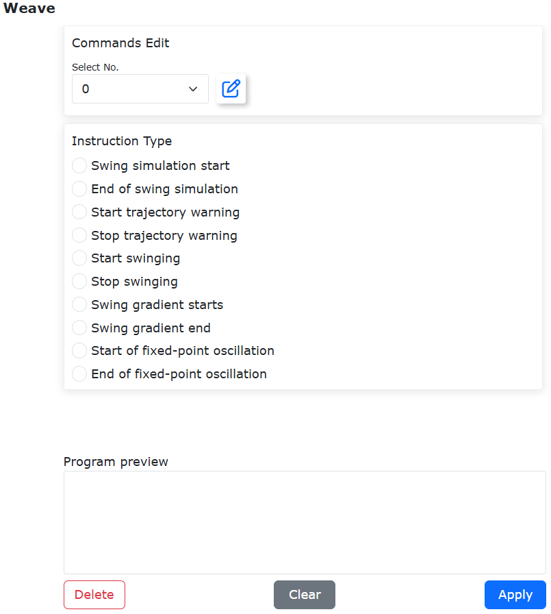
   
.. centered:: Abbildung 15.1‑25 Pendelbewegungseinstellungen
  
**Schritt 5**: Fügen Sie einen neuen Spline-Linienbogen-Übergangsbefehl hinzu. Klicken Sie im Bereich "Bewegungsbefehle" auf die Schaltfläche "N-Spline", um die Konfigurationsoberfläche "N-Spline" aufzurufen. Klicken Sie im Bereich "Befehlstyp" auf die Schaltfläche "Mehrpunkt-Trajektorie starten", wählen Sie "Bogenübergangspunkt" aus dem Dropdown-Menü "Steuerungsmodus", geben Sie die Parameter in das Feld "Globale durchschnittliche Übergangszeit" ein und klicken Sie auf "Hinzufügen", um die Konfiguration des neuen Spline-Bewegungsmodus abzuschließen.

.. figure:: process/076.png
   :align: center
   :width: 6in
   
.. centered:: Abbildung 15.1‑26 Konfiguration des Neuen Spline-Bewegungsmodus

.. note:: Die "Globale durchschnittliche Übergangszeit" gilt für den Steuerungsmodus "Bogenübergangspunkt". Für andere Modi können die Standardeinstellungen beibehalten werden. Es wird empfohlen, den Wert so weit wie möglich nach oben anzupassen.

Anpassungsmethoden:

1. Teilen Sie die gesamte Bewegungszeit durch (Anzahl der Punkte - 1), um den Parameter der globalen durchschnittlichen Übergangszeit zu erhalten, wobei die Zeiteinheit Millisekunden ist.
2. Legen Sie die Zeit basierend auf der Laufzeit der beiden Punkte mit dem größten Abstand während der gesamten Bewegung fest. Wenn die Beobachtung nicht möglich ist oder keine sanfte Positionsübergangsanforderung besteht, können Sie den Standardwert auf 10000 Millisekunden setzen oder nach oben anpassen.

**Schritt 6**: Fügen Sie Bewegungspunkte hinzu. Klicken Sie im Bereich "Befehlstyp" der Konfigurationsoberfläche "N-Spline" auf "Punkt setzen" -> "SPL". Wählen Sie den Bewegungspunkt aus dem Dropdown-Menü "Punktname", geben Sie das Bewegungsgeschwindigkeitsverhältnis im Feld "Debug-Geschwindigkeit" ein, geben Sie den Glättungsparameter im Feld "Glatter Übergangsradius" ein, wählen Sie den Bewegungsstatus des Punktes aus dem Dropdown-Menü "Ist letzter Punkt" und klicken Sie auf "Hinzufügen", um die Konfiguration eines einzelnen Bewegungspunktes abzuschließen.

.. figure:: process/077.png
   :align: center
   :width: 6in
   
.. centered:: Abbildung 15.1‑27 Konfiguration der Bewegungspunkte
 
.. note:: Wiederholen Sie Schritt 6, um die Konfiguration aller Bewegungspunkte abzuschließen, und wählen Sie "Ja" aus dem Dropdown-Menü "Ist letzter Punkt" in der Konfiguration des letzten Punktes.

**Schritt 7**: Schließen Sie den neuen Spline-Linienbogen-Übergangsbefehl ab. Klicken Sie im Bereich "Befehlstyp" der Konfigurationsoberfläche "N-Spline" auf die Schaltfläche "Mehrpunkt-Trajektorie beenden", klicken Sie dann auf "Hinzufügen" -> "Übernehmen", um die gesamte Konfiguration des neuen Spline-Linienbogen-Übergangsbefehls abzuschließen.

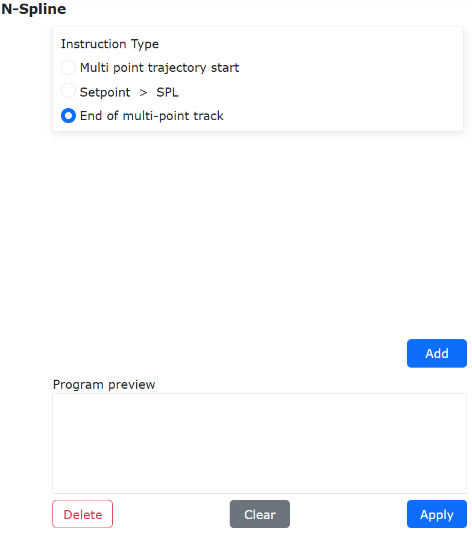
   
.. centered:: Abbildung 15.1‑28 Konfiguration des Neuen Spline-Bewegungsendes
  
**Schritt 8**: Schreiben Sie das LUA-Programm für die Funktion Neuer Spline-Linienbogen-Übergang + Pendelbewegung. Passen Sie die Reihenfolge der in den Schritten 4 bis 7 generierten Befehle an. Führen Sie das LUA-Programm aus, um die Funktion Neuer Spline-Linienbogen-Übergang + Pendelbewegung zu implementieren.

.. figure:: process/079.png
   :align: center
   :width: 4in
   
.. centered:: Abbildung 15.1‑29 LUA-Programm für Neuen Spline-Linienbogen-Übergang + Pendelbewegung
 
.. note:: Vor dem Startbewegungspunkt des neuen Spline-Linienbogen-Übergangs kann eine PTP-Bewegung hinzugefügt werden, um sicherzustellen, dass der Roboter den Startbewegungspunkt erreicht.

Einstellung der Rückführstrategie für Neuen Spline-Linienbogen-Übergang + Pendelbewegung
++++++++++++++++++++++++++++++++++++++++++++++++++++++++++++++++++++++++++++++++++++++++++++++++++++++++++++++++++++++++++++++++++++++

Klicken Sie auf der WebApp-Hauptoberfläche auf "Hilfsanwendungen" -> "Prozesspaket" -> "Schweißexperten-Datenbank", um in den Bereich "Schweißexperten-Datenbank" zu gelangen.

.. figure:: process/080.png
   :align: center
   :width: 6in
   
.. centered:: Abbildung 15.1‑30 Neuer Spline-Pendelschweißbefehl

Klicken Sie im Bereich "Schweißexperten-Datenbank" auf die Schaltfläche "Neuer Spline-Pendelschweiß" (Neue Spline-Pendelschweißung), um die Konfigurationsoberfläche "Neue Spline-Pendelschweißung" aufzurufen. Im Bereich "Pendelschweißparameter" können Sie aus dem Dropdown-Menü "Pendel-Rückführtyp" entweder "Keine Rückführung" oder "Rückführung mit erweiterter Trajektorie" auswählen, wie in Abbildung 3-2 gezeigt. Klicken Sie nach der Auswahl auf die Schaltfläche "Konfigurieren", um die Einstellung der Pendel-Rückführstrategie abzuschließen.

.. figure:: process/081.png
   :align: center
   :width: 4in
   
.. centered:: Abbildung 15.1‑31 Pendel-Rückführtyp für Neuen Spline-Linienbogen-Übergang

.. note:: Im Dropdown-Menü "Pendel-Rückführtyp" stoppt die neue Spline-Bogenübergangs-Pendelbewegung, wenn "Keine Rückführung" ausgewählt ist, nachdem der letzte Punkt erreicht wurde; wenn "Rückführung mit erweiterter Trajektorie" ausgewählt ist, setzt die neue Spline-Bogenübergangs-Pendelbewegung ihre Bewegung nach dem Erreichen des letzten Punktes fort, um sicherzustellen, dass die Bewegung am Ende eines vollständigen Pendelzyklus stoppt.

Palettiersystem-Konfiguration
------------------------------

Schritte zur Palettiersystem-Konfiguration
~~~~~~~~~~~~~~~~~~~~~~~~~~~~~~~~~~~~~~~~~~

**Schritt 1**: Klicken Sie in "Hilfsanwendungen" -> "Prozesspakete" auf den Menüpunkt "Palettieren", um die Palettiersystem-Konfigurationsoberfläche aufzurufen.

Bei der ersten Verwendung muss zunächst ein Rezept erstellt werden. Klicken Sie auf "Rezept erstellen", geben Sie einen Rezeptnamen ein und klicken Sie auf "Erstellen". Klicken Sie nach erfolgreicher Erstellung auf "Konfiguration starten", um zur Palettierkonfigurationsseite zu gelangen.

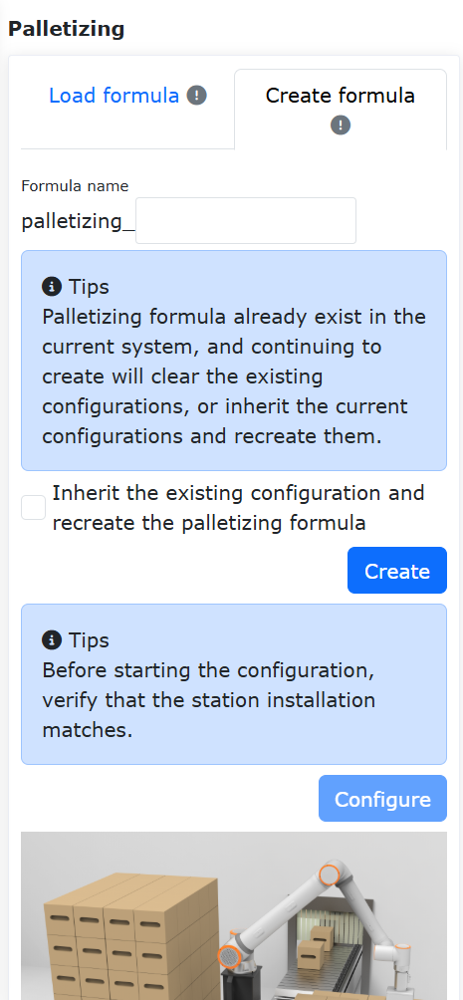

.. centered:: Abbildung 15.2‑1 Palettierrezept-Konfiguration

**Schritt 2**: Klicken Sie im Werkstückkonfigurationsbereich auf "Konfigurieren", um das Werkstückkonfigurations-Popup zu öffnen. Stellen Sie die "Länge", "Breite" und "Höhe" des Werkstücks sowie den Greifpunkt des Werkstücks ein. Klicken Sie auf "Konfiguration bestätigen", um die Werkstückinformationen abzuschließen.

.. figure:: process/024.png
   :align: center
   :width: 4in

.. centered:: Abbildung 15.2‑2 Palettier-Werkstückkonfiguration

**Schritt 3**: Klicken Sie im Palettenkonfigurationsbereich auf "Konfigurieren", um das Palettenkonfigurations-Popup zu öffnen. Stellen Sie die "Vorderseite", "Seite" und "Höhe" der Palette ein. Legen Sie anschließend den Arbeitsplatz und den Arbeitsplatz-Übergangspunkt fest. Klicken Sie auf "Konfiguration bestätigen", um die Paletteninformationen abzuschließen.

.. figure:: process/025.png
   :align: center
   :width: 4in

.. centered:: Abbildung 15.2‑3 Palettier-Palettenkonfiguration

**Schritt 4**: Klicken Sie im Bereich "Palettiergeräteabmessungen" auf "Konfigurieren", um das Konfigurations-Popup für die Palettiergeräteabmessungen zu öffnen. Stellen Sie die Werte für "X", "Y", "Z" und "Winkel" des Geräts ein. Klicken Sie auf "Konfiguration bestätigen", um die Konfiguration der Palettiergeräteabmessungen abzuschließen.

.. important::
   X, Y, Z sind die absoluten Koordinatenwerte der oberen rechten Ecke der linken Palette oder der oberen linken Ecke der rechten Palette relativ zum Roboter-Basiskoordinatensystem. Der Winkel ist der Drehwinkel bei der Roboterinstallation, empfohlen wird 0.

.. figure:: process/026.png
   :align: center
   :width: 4in

.. centered:: Abbildung 15.2‑4 Konfiguration der Palettiergeräteabmessungen

**Schritt 5**: Klicken Sie im Bereich "Moduskonfiguration" auf "Konfigurieren", um das Moduskonfigurations-Popup zu öffnen.

   **Modus B ein/aus**: Ein: Umschaltung zwischen Modus A/B möglich, Konfiguration des B-Modus für jede Palettierlage; Aus: Umschaltung zu Modus B nicht möglich, B-Modus für Palettierlagen nicht konfigurierbar.

   **Modus A/B Umschaltung**: Auswahl Modus A: Werkstücke als Modus A hinzufügen, Werkstücknummern A1, A2..., Transparenz der Werkstücke nicht einstellbar; Auswahl Modus B: Werkstücke als Modus B hinzufügen, Werkstücknummern B1, B2..., hier kann "Modus A Konfiguration anzeigen" ein-/ausgeschaltet werden, um Werkstücke von Modus A anzuzeigen.

   **Modus A anzeigen ein/aus**: Ein: Transparenz der Modus-B-Werkstücke anpassen, um die Effektivität der A/B-Modus-Konfiguration zu überprüfen. Hier können nur Modus-B-Werkstücke ausgewählt, hinzugefügt (einzeln oder stapelweise), gelöscht (einzeln oder alle) werden. Aus: Transparenz der Modus-B-Werkstücke nicht einstellbar.

.. important::
    Bei der Konfiguration der Werkstücke wird der Hintergrund der Werkstücke rot, wenn sie kollidieren. Die oben genannten Operationen sind dann nicht möglich. Um sie durchzuführen, konfigurieren Sie die Werkstücke bitte kollisionsfrei.

Legen Sie bei der Konfiguration der Werkstücke zuerst den Werkstückabstand fest. Der rechte Kasten simuliert die Platzierung der Werkstücke auf der rechten Palette. Werkstücke können einzeln oder stapelweise hinzugefügt werden. Legen Sie anschließend die Anzahl der Palettierlagen und die Modi für jede Lage fest. Klicken Sie auf "Konfiguration bestätigen", um die Modusinformationen abzuschließen.

.. important::
    Palettierrichtung: Am Beispiel der rechten Palette: Die untere rechte Ecke ist der am weitesten entfernte Punkt. Platzieren Sie eine Reihe von Werkstücken vertikal oder horizontal von der unteren rechten Ecke aus, dann die nächste Reihe horizontal oder vertikal darüber, usw. (Die Palettierrichtung ist auf der Webseite gekennzeichnet, bitte beachten).

    Die linke Palette spiegelt die Platzierung der Werkstücke basierend auf dem Modus der rechten Palette.

.. figure:: process/027.png
   :align: center
   :width: 4in

.. centered:: Abbildung 15.2‑5 Palettiermodus A Konfiguration

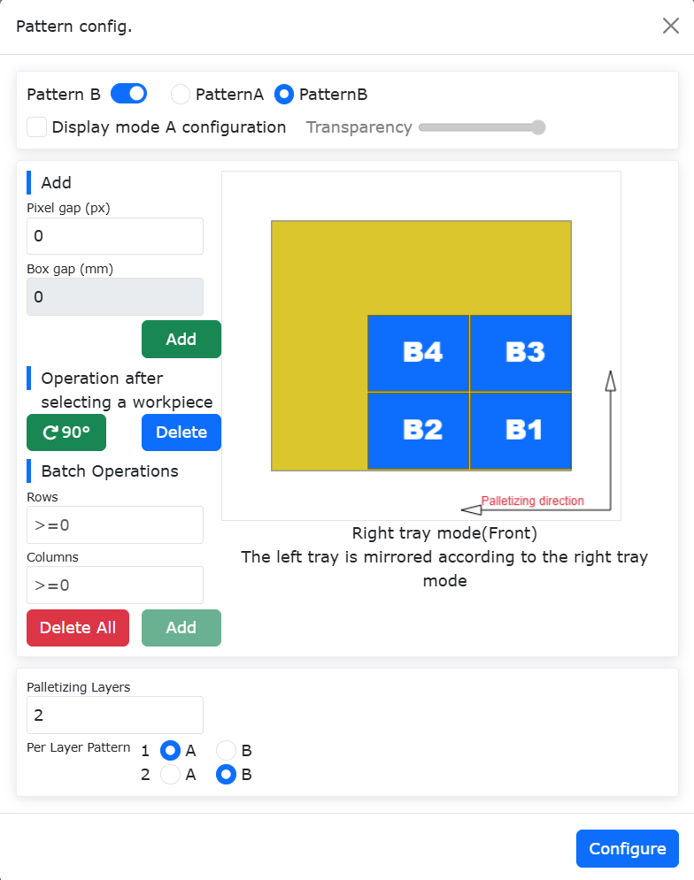

.. centered:: Abbildung 15.2‑6 Palettiermodus B Konfiguration

**Schritt 6**: Klicken Sie im Bereich "Teach-Programm-Generierung" auf "Erweiterte Konfiguration", um das Popup für erweiterte Konfiguration zu öffnen. Konfigurieren Sie hier die "Abhebehöhe nach Entnahme", "Erster Versatzabstand", "Zweiter Versatzabstand" und "Saugwartezeit".

   **Abhebehöhe nach Entnahme**: Benutzerdefinierte Höhe, um die das Werkstück nach erfolgreicher Entnahme vom Greifpunkt angehoben wird.

   **Erster/Zweiter Versatzabstand**: Benutzerdefinierter Versatzabstand für das schräge Ablegen des Roboters am Zielpunkt.

   **Saugwartezeit**: Benutzerdefinierte Wartezeit für das Ansaugen. Überwachung des Unterdruckbereit-Signals nach dem Ansaugen; bei nicht erfolgtem Signal wird der Saugvorgang wiederholt.

   **Glättungsübergang**: Aktivieren des Schalters für Glättungsübergang ermöglicht die Konfiguration der PTP-Glättungszeit und des LIN-Glättungsradius.

   - PTP-Glättungszeit: Keine Glättungsübergangszeit / Stufe 1 (200 ms) / Stufe 2 (400 ms) / Stufe 3 (600 ms) / Stufe 4 (800 ms) / Stufe 5 (1000 ms)
   - LIN-Glättungsradius: Kein Glättungsübergangsradius / Stufe 1 (200 mm) / Stufe 2 (400 mm) / Stufe 3 (600 mm) / Stufe 4 (800 mm) / Stufe 5 (1000 mm)

.. figure:: process/029.png
   :align: center
   :width: 4in

.. centered:: Abbildung 15.2‑7 Erweiterte Palettierkonfiguration

**Schritt 7**: Wählen Sie im Bereich "Teach-Programm-Generierung" die "Methodenauswahl" und klicken Sie auf "Programm generieren". Öffnen Sie die "Palettierüberwachungsseite". Auf dieser Seite können "Generierungsinformationen", "Alarmmeldungen" und das "Palettierprogramm" angezeigt und eingesehen werden.

.. figure:: process/030.png
   :align: center
   :width: 6in

.. centered:: Abbildung 15.2‑8 Palettiersystem-Überwachung

**Schritt 8**: Tritt während der Ausführung des Palettierprogramms ein Fehler auf, stoppt das Programm. Der Benutzer muss zuerst den Fehler beheben und dann das Palettierprogramm erneut starten. Es erscheint ein Popup "Letztes Programm unterbrochen". Klicken Sie auf die Schaltfläche "Fortsetzen", um die Ausführung fortzusetzen, oder auf "Neu starten", um das Programm neu zu starten.

.. figure:: process/031.png
   :align: center
   :width: 3in

.. centered:: Abbildung 15.2‑9 Fortsetzung des Palettierprogramms

Förderbandverfolgung
--------------------

Schritte zur Förderbandverfolgungskonfiguration
~~~~~~~~~~~~~~~~~~~~~~~~~~~~~~~~~~~~~~~~~~~~~~~~

**Schritt 1**: Wählen Sie in "Hilfsanwendungen" -> "Prozesspakete" den Menüpunkt "Förderband", um die Förderbandverfolgungskonfigurationsoberfläche aufzurufen. Klicken Sie auf die Schaltfläche "Förderband I/O konfigurieren", um die für die Förderbandfunktion benötigten I/Os schnell zu konfigurieren. Konfigurieren Sie anschließend je nach tatsächlichem Funktionsbedarf die entsprechenden Parameter. Hier wird als Beispiel die funktionslose visuelle Greifverfolgung verwendet. Dazu müssen der Förderband-Encoderkanal, die Auflösung, die Spindelsteigung konfiguriert und bei der Visuellen Kombination "Nein" ausgewählt werden. Klicken Sie auf "Konfigurieren".

.. figure:: process/032.png
   :align: center
   :width: 4in

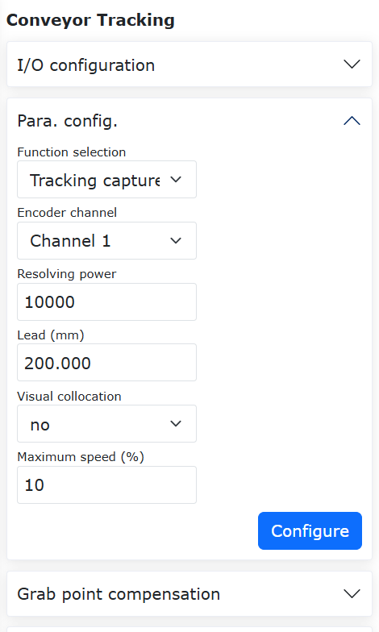

.. centered:: Abbildung 15.3‑1 Förderbandkonfiguration

**Schritt 2**: Stellen Sie als nächstes die Kompensationswerte für den Greifpunkt ein. Dies sind die Kompensationsabstände in den drei Richtungen X, Y, Z. Sie können während der Einrichtung je nach tatsächlicher Situation angepasst werden.

.. figure:: process/034.png
   :align: center
   :width: 4in

.. centered:: Abbildung 15.3‑2 Kompensationskonfiguration für den Förderband-Greifpunkt

**Schritt 3**: Starten Sie das Förderband und bewegen Sie das kalibrierte Objekt zur definierten Position A. Stoppen Sie das Förderband. Bewegen Sie den Roboter, sodass die Spitze des Kalibrierstabs am Roboterende mit der Spitze des kalibrierten Objekts ausgerichtet ist. Klicken Sie auf die Schaltfläche "Startpunkt A". Es erscheint ein Dialogfeld mit dem aktuellen Encoderwert und der Roboterpose. Klicken Sie auf "Kalibrieren", um die Kalibrierung von Startpunkt A abzuschließen.

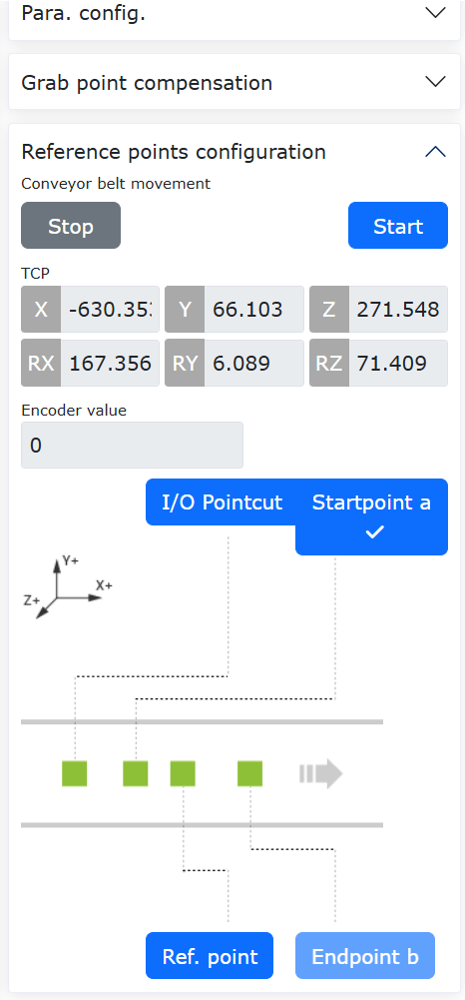

.. centered:: Abbildung 15.3‑3 Konfiguration von Startpunkt A

**Schritt 4**: Klicken Sie auf die Schaltfläche "Referenzpunkt", um zur Referenzpunktkalibrierung zu gelangen. Beim Aufzeichnen des Referenzpunkts werden die Höhe und Pose des Roboters beim Greifen aufgezeichnet. Bei jeder Verfolgung wird mit der aufgezeichneten Höhe und Pose des Referenzpunkts verfolgt und gegriffen. Dieser kann sich auf einer anderen Höhe als die Punkte A und B befinden. Klicken Sie auf "Kalibrieren", um die Kalibrierung des Referenzpunkts abzuschließen.

.. figure:: process/036.png
   :align: center
   :width: 4in

.. centered:: Abbildung 15.3‑4 Konfiguration des Referenzpunkts

**Schritt 5**: Starten Sie das Förderband und bewegen Sie das kalibrierte Objekt zur definierten Position B. Stoppen Sie das Förderband. Bewegen Sie den Roboter, sodass die Spitze des Kalibrierstabs am Roboterende mit der Spitze des kalibrierten Objekts ausgerichtet ist. Klicken Sie auf die Schaltfläche "Endpunkt B". Es erscheint ein Dialogfeld mit dem aktuellen Encoderwert und der Roboterpose. Klicken Sie auf "Kalibrieren", um die Kalibrierung von Endpunkt B abzuschließen.

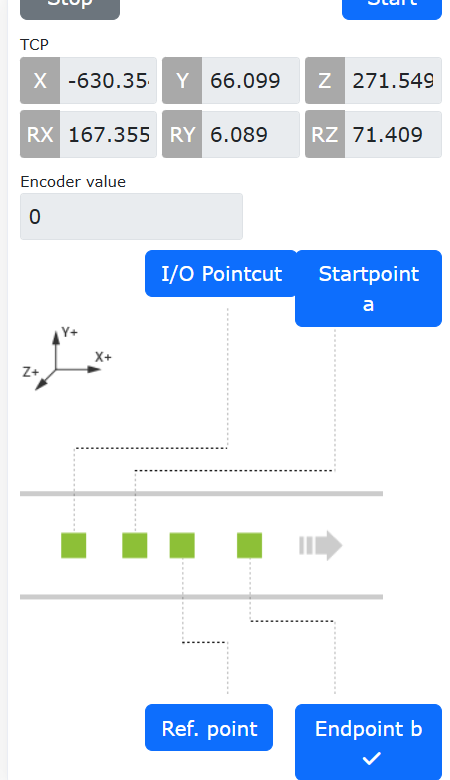

.. centered:: Abbildung 15.3‑5 Konfiguration von Endpunkt B

Förderbandverfolgungs-Teach-Programm
~~~~~~~~~~~~~~~~~~~~~~~~~~~~~~~~~~~~~

.. list-table::
   :widths: 50 80 80
   :header-rows: 0
   :align: center

   * - **Nr.**
     - **Befehlsformat**
     - **Anmerkung**

   * - 1
     - PTP(conveyorstart,30,-1,0)
     - #Roboter Greifstartpunkt

   * - 2
     - While(1) do
     - #Schleife für das Greifen

   * - 3
     - ConveyorIODetect(10000)
     - #IO-Echtzeiterkennung des Objekts

   * - 4
     - ConveyorGetTrackData(1)
     - #Objektposition abrufen

   * - 5
     - ConveyorTrackStart(1)
     - #Förderbandverfolgung starten

   * - 6
     - Lin(cvrCatchPoint,10,-1,0,0)
     - #Roboter erreicht Greifpunkt

   * - 7
     - MoveGripper(1,255,255,0,10000)
     - #Greifer greift Objekt

   * - 8
     - Lin(cvrRaisePoint,10,-1,0,0)
     - #Roboter hebt an

   * - 9
     - ConveyorTrackEnd()
     - #Förderbandverfolgung beenden

   * - 10
     - PTP(conveyorraise,30,-1,0)
     - #Roboter erreicht Wartepunkt

   * - 11
     - PTP(conveyorend,30,-1,0)
     - #Roboter erreicht Ablegepunkt

   * - 12
     - MoveGripper(1,0,255,0,10000)
     - #Greifer öffnet

   * - 13
     - PTP(conveyorstart,50,-1,0)
     - #Roboter kehrt zum Greifstartpunkt zurück, wartet auf nächsten Greifvorgang

   * - 14
     - end
     - #Ende

Aufbau des Roboter-Förderbandverfolgungssystems
~~~~~~~~~~~~~~~~~~~~~~~~~~~~~~~~~~~~~~~~~~~~~~~~

Verbindungsart der Förderband-Encoder-Datenkommunikation
+++++++++++++++++++++++++++++++++++++++++++++++++++++++++

Um in der Werkzeugmaschinenbearbeitung einen automatisierten Be- und Entladeablauf zu realisieren, wurde ein CNC-Funktionspaket basierend auf der FOCAS-Kommunikation entwickelt. Es ermöglicht die Kommunikationsinteraktion und koordinierte Bewegung zwischen dem kollaborativen Roboter und der CNC-Werkzeugmaschine.

Wie in der Abbildung dargestellt, basiert die FOCAS-Kommunikation auf Ethernet. Durch Verbinden des Netzwerkports des Robotersteuerpults mit dem integrierten Netzwerkport der Werkzeugmaschine über ein Netzwerkkabel wird die FOCAS-Kommunikation zwischen Roboter und Werkzeugmaschine hergestellt, wodurch die CNC-Steuerung und die Überwachung des Maschinenstatus auf der Roboterseite realisiert werden.

.. figure:: process/038.png
   :align: center
   :width: 6in

.. centered:: Abbildung 15.3‑6 Topologie des Roboter-Förderbandverfolgungssystems

Im System ist (a) der Computer, (b) der Roboter und sein Steuerpult, (c) das Fördersystem bestehend aus Förderband, Lichtschranke und Encoder. Das Robotersteuerpult ist über digitale IO-Kommunikation mit der Lichtschranke und dem Förderband verbunden und über RS485 mit dem Förderband-Encoder.

Förderbandkonfiguration
++++++++++++++++++++++++

Rufen Sie die Funktionskonfigurationsoberfläche für die Förderbandverfolgung auf der Roboter-Webseite unter "Grundeinstellungen", "Peripherie", "Verfolgung" -> "Förderband" auf, um die Eigenschaften der Förderbandverfolgungsfunktion zu konfigurieren.

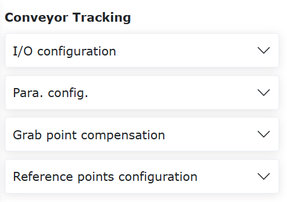

.. centered:: Abbildung 15.3‑7 Förderbandverfolgungskonfigurationsseite

Klicken Sie auf der Förderbandverfolgungskonfigurationsseite auf die Schaltfläche "Förderband I/O mit einem Klick konfigurieren", um die physische Förderbandverbindung mit einem Klick zu konfigurieren.
Wählen Sie anschließend im Dropdown-Menü "Funktionsauswahl" unter "Parameterkonfiguration" die Option "Verfolgungsbewegung" aus. Konfigurieren Sie dann die Encoder-Eigenschaften, die Werkstückachse des Verfolgungskoordinatensystems und die visuelle Kombination. Wählen Sie im Dropdown-Menü "Verfolgungstyp" die Option "Nachholbewegung" aus. Hier können nun der Verfolgungsstartabstand und der Verfolgungsendabstand eingegeben werden.
Verfolgungsstartabstand: Nachdem das Verfolgungssignal ausgelöst wurde, fährt das Förderband diese Strecke, bevor der Roboter mit der Aktion beginnt. Bei -1 erfolgt eine automatische Auslösung.
Verfolgungsendabstand: Die maximale Strecke, die der Roboter nach Beginn der Aktion synchron mit dem Förderband mitläuft.

Konfiguration des Verfolgungskoordinatensystems
+++++++++++++++++++++++++++++++++++++++++++++++

Die Verfolgungsbewegung verwendet das Werkstückkoordinatensystem als Förderbandkoordinatensystem. Daher muss das Werkstückkoordinatensystem eingestellt werden.

Klicken Sie auf "Initiale Einstellungen", "Grundlagen". Wählen Sie unter "Koordinatensysteme" die Option "Werkstückkoordinatensystem". Wählen Sie ein anderes Werkstückkoordinatensystem als "wobjcoord0" zur Kalibrierung aus. Die Kalibrierungsmethode wird hier nicht näher erläutert.

.. figure:: process/040.png
   :align: center
   :width: 4in

.. centered:: Abbildung 15.3‑8 Einstellung des Verfolgungskoordinatensystems

Funktion der Förderbandverfolgungs-Nachholbewegung
+++++++++++++++++++++++++++++++++++++++++++++++++++

Die Nachholbewegung ist eine Art der Förderbandverfolgungsbewegung. Im Vergleich zur Verfolgungsbewegung muss der Bewegungspunkt der Nachholbewegung nicht über dem Werkstückkoordinatensystem angefahren werden. Er kann an einer beliebigen Position im Werkstückkoordinatensystem angefahren werden. Über den Parameter "Verfolgungsstartabstand" wird die Synchronisation des Endeffektors mit dem Förderband erreicht. Dies ist eine flexiblere Verfolgungsmethode.

Kurzeinführung zur Funktion der Förderbandverfolgungs-Nachholbewegung
++++++++++++++++++++++++++++++++++++++++++++++++++++++++++++++++++++++

Im Folgenden wird ein Beispiel für eine Nachholbewegung gegeben, um die Bewegungseigenschaften zu veranschaulichen.

.. figure:: process/041.png
   :align: center
   :width: 6in

.. centered:: Abbildung 15.3‑9 Anfahrbeispiel für eine Förderbandverfolgungs-Nachholbewegung

Dabei ist x die Richtung der Förderbandbewegung im Werkstückkoordinatensystem, a die Förderbandebene, b das zu greifende Zielwerkstück, c der Lichtsensor, d der Verfolgungsstartabstand, e der Verfolgungsendabstand. P1 bis P4 sind die angefahrenen Wegpunkte und ihre Reihenfolge. P2 und P3 sind identische Wegpunkte und enthalten die Greiferbewegung.

.. figure:: process/042.png
   :align: center
   :width: 6in

.. centered:: Abbildung 15.3‑10 Ausführungsbeispiel einer angefahrenen Förderbandverfolgungs-Nachholbewegung

Wenn das oben angefahrene Programm ausgeführt wird und das Werkstück das Lichtschranksignal auslöst, wartet der Roboter, bis sich das Ziel unter P1 bewegt hat, und beginnt dann mit der Verfolgungsbewegung. Der Roboter-Greifer bewegt sich entlang der in der Abbildung gezeigten Bahn.

Anfahren eines Nachholbewegungsprogramms
+++++++++++++++++++++++++++++++++++++++++

Die Programmlogik der Nachholbewegung ist im Wesentlichen identisch mit der der Verfolgungsbewegung. Sie umfasst das Erhalten des Auslösesignals, das Abrufen der Förderbanddaten und den Start der Verfolgungsbewegung.

**Schritt 1**: Klicken Sie auf "Teach-Programm", "Programmierung". Wählen Sie und klicken Sie auf die Schaltfläche "Förderband" unter "Peripheriebefehle", um zur Förderbandbefehls-Konfigurationsseite zu gelangen.

.. figure:: process/043.png
   :align: center
   :width: 6in

.. centered:: Abbildung 15.3‑11 I/O-Echtzeitüberwachungsbefehl

**Schritt 2**: Klicken Sie auf "I/O-Echtzeitüberwachung" und stellen Sie die "Maximale Wartezeit (ms)" ein, um das Verfolgungsauslösesignal in Echtzeit zu erkennen. Klicken Sie auf die Schaltflächen "Hinzufügen" und "Übernehmen", um den Befehl zum Programm hinzuzufügen.

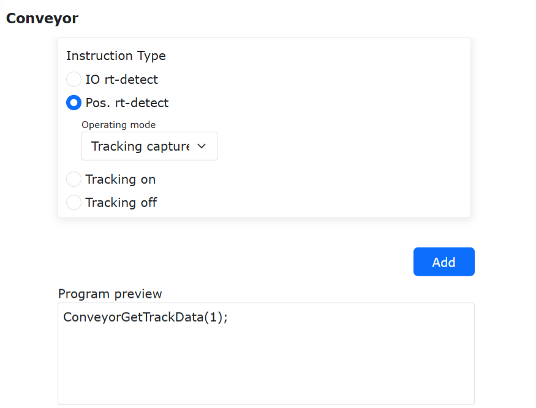

.. centered:: Abbildung 15.3‑12 Positions-Echtzeiterkennungsbefehl

**Schritt 3**: Klicken Sie auf "Positions-Echtzeiterkennung" und wählen Sie als Arbeitsmodus "Verfolgungsbewegung". Klicken Sie auf die Schaltflächen "Hinzufügen" und "Übernehmen", um den Befehl zum Programm hinzuzufügen.

.. figure:: process/045.png
   :align: center
   :width: 6in

.. centered:: Abbildung 15.3‑13 Verfolgung einschalten Befehl

**Schritt 4**: Klicken Sie auf "Verfolgung einschalten" und wählen Sie als Arbeitsmodus "Verfolgungsbewegung". Klicken Sie auf die Schaltflächen "Hinzufügen" und "Übernehmen", um den Befehl zum Programm hinzuzufügen.

**Schritt 5**: Fahren Sie die kartesische Raum-Bewegung nach dem Einschalten der Verfolgung sowie die Greifer-Peripheriebewegung an. Während der Bewegung bleibt die Synchronität mit der Förderbandverfolgung erhalten.

.. figure:: process/046.png
   :align: center
   :width: 6in

.. centered:: Abbildung 15.3‑14 Verfolgung ausschalten Befehl

**Schritt 6**: Klicken Sie auf "Verfolgung ausschalten" und dann auf die Schaltflächen "Hinzufügen" und "Übernehmen", um den Befehl zum Programm hinzuzufügen.

.. figure:: process/047.png
   :align: center
   :width: 6in

.. centered:: Abbildung 15.3‑15 Ein typisches Förderbandprogramm für Verfolgungsbewegungen

Wenn zwei identische Verfolgungsbewegungsziele (mit möglichem Versatz) nacheinander angefahren werden, blockiert die Roboterbewegung an diesem Zielpunkt, um eine kontinuierliche synchrone Verfolgung zu erreichen, bis der Verfolgungsabstand den Endverfolgungsabstand erreicht.

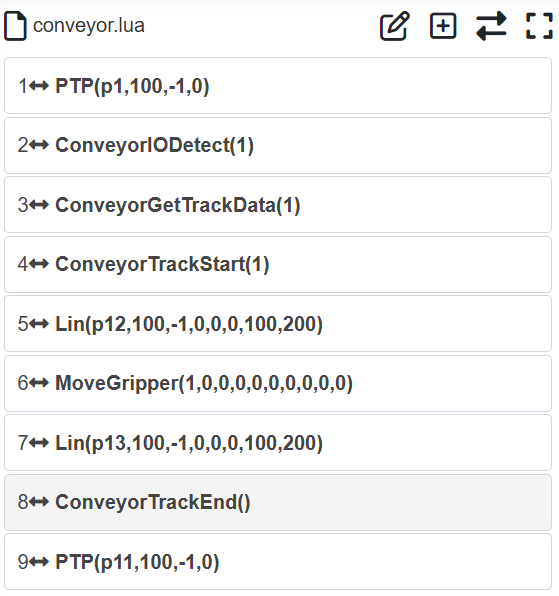

.. centered:: Abbildung 15.3‑16 Ein typisches Förderbandprogramm für blockierende Verfolgungsgreifbewegungen

Wenn zwei identische Verfolgungsbewegungsziele (mit möglichem Versatz) nacheinander angefahren werden und dazwischen eine Greiferbewegung eingefügt wird, verfolgt der Roboter an diesem Zielpunkt das Förderband kontinuierlich, bis die Greiferbewegung abgeschlossen ist. Dies realisiert ein blockierendes Verfolgungsgreifen.

Optimierungsfunktion der Matrixbewegungsanweisung
------------------------------------------------------------------
Überblick
~~~~~~~~~~~~~~~~~~~~~~~~~~~~~~~~~~~~~~~~~~~~~~

Bei der automatisierten Bearbeitung von CNC-Geräten und Palettiervorgängen werden Matrixbewegungsanweisungen in mehreren kritischen Prozessschritten häufig eingesetzt, einschließlich der Beschickung von Rohlingen, der Entnahme von Fertigteilen, dem Wenden von Werkstücken und der sekundären Aufspannung. Durch das Einlernen von drei Matrixpunkten im Matrixbewegungsrezept zur Bestimmung der Matrixposition und die Konfiguration von Matrixzeilen, -spalten, -schichten und dem Bewegungspfad kann das Matrixrezept auf der Anweisungsoberfläche schnell umgeschaltet werden, um es bereitzustellen und auszuführen.

Konfiguration des Matrixbewegungsrezepts
~~~~~~~~~~~~~~~~~~~~~~~~~~~~~~~~~~~~~~~~~~~~~~

**Schritt 1**: Gehen Sie zur Oberfläche "Hilfsanwendungen -> Prozesspakete -> Matrixbewegung", um Rezepte hinzuzufügen, zu bearbeiten, umzubenennen und zu löschen;

.. figure:: process/049.png
   :align: center
   :width: 6in

.. centered:: Abbildung 15.4‑1 Matrixrezept-Oberfläche

.. note:: 
   .. image:: process/050.png
      :height: 0.75in
      :align: left

   Name: **Schaltfläche Hinzufügen**
   
   Funktion: Neues Matrixrezept hinzufügen

.. note:: 
   .. image:: process/051.png
      :height: 0.75in
      :align: left

   Name: **Schaltfläche Bearbeiten**
   
   Funktion: Matrixrezeptparameter bearbeiten

.. note:: 
   .. image:: process/052.png
      :height: 0.75in
      :align: left

   Name: **Schaltfläche Umbenennen**
   
   Funktion: Matrixrezept umbenennen

.. note:: 
   .. image:: process/053.png
      :height: 0.75in
      :align: left

   Name: **Schaltfläche Löschen**
   
   Funktion: Matrixrezept löschen

**Schritt 2**: Neues Matrixrezept hinzufügen. Klicken Sie auf die Schaltfläche "Hinzufügen", um das modale Fenster "Matrix hinzufügen" zu öffnen. Geben Sie den Matrixnamen ein (Sonderzeichen sind verboten, nur Zahlen, gebräuchliche chinesische Zeichen und Unterstriche "_" sind erlaubt). Gehen Sie dann zur Rezeptdetailoberfläche, um die Anzahl der Zeilen, Schichten, Spalten, Schichthöhe, Bewegungskonfiguration und die Versatzwerte X, Y, Z für den Übergangspunkt einzugeben und drei Matrixpfadpunkte einzulernen. Klicken Sie auf die Schaltfläche "Konfigurieren", um die Konfiguration zu bestätigen.

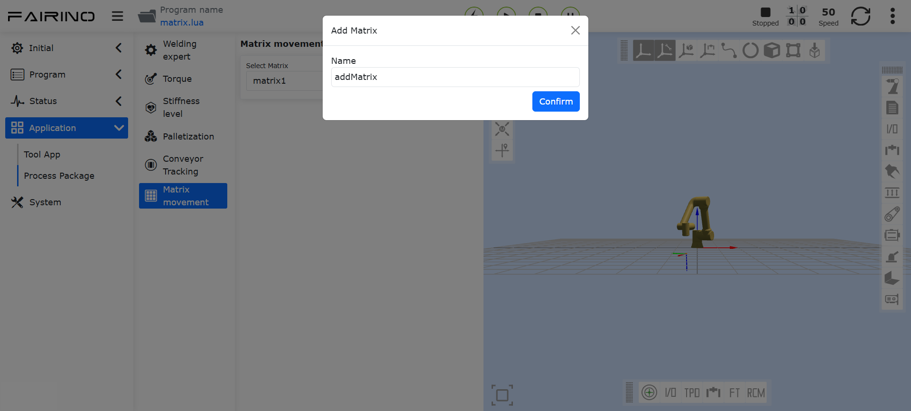

.. centered:: Abbildung 15.4‑2 Popup-Modalfenster "Matrix hinzufügen"

.. figure:: process/055.png
   :align: center
   :width: 4in

.. figure:: process/056.png
   :align: center
   :width: 6in

.. centered:: Abbildung 15.4‑3 Einlernen des ersten Pfadpunkts

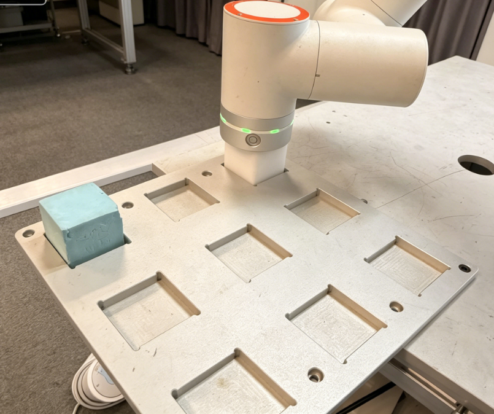

.. figure:: process/058.png
   :align: center
   :width: 6in

.. centered:: Abbildung 15.4‑4 Einlernen des zweiten Pfadpunkts

.. figure:: process/059.png
   :align: center
   :width: 4in

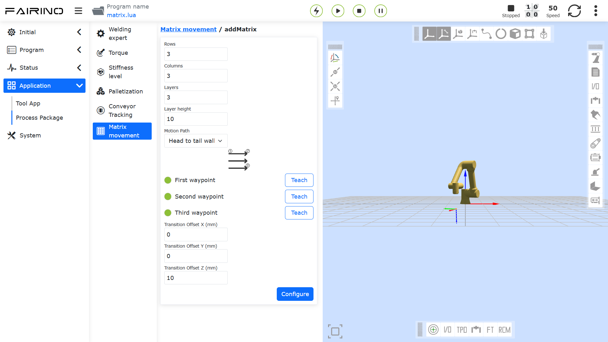

.. centered:: Abbildung 15.4‑5 Einlernen des dritten Pfadpunkts

Die Bewegungspfade werden in die "Kopf-zu-Schwanz"-Methode und die "Zickzack"-Methode unterteilt. Die Beschreibungen sind wie folgt:

**Kopf-zu-Schwanz-Methode**: Die erste Reihe von links nach rechts abschließen, zum linken Startpunkt zurückkehren, dann die zweite Reihe von links nach rechts abschließen, wieder zum linken Startpunkt zurückkehren, die dritte Reihe von links nach rechts abschließen, bis die vollständige Abdeckung erreicht ist.

.. figure:: process/061.png
   :align: center
   :width: 1in

.. centered:: Abbildung 15.4‑6 Kopf-zu-Schwanz-Methode

**Zickzack-Methode**: Die erste Reihe von links nach rechts abschließen, sich vertikal nach unten bewegen, dann die zweite Reihe von rechts nach links abschließen. Sich erneut vertikal nach unten bewegen, dann die dritte Reihe von links nach rechts abschließen, bis der Bereich vollständig abgedeckt ist.

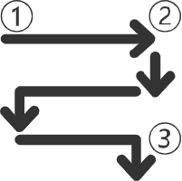

.. centered:: Abbildung 15.4‑7 Zickzack-Methode

**Schritt 3**: Rezept bearbeiten, umbenennen und löschen. Klicken Sie auf die Schaltfläche "Bearbeiten", um die Daten des aktuell ausgewählten Matrixrezepts abzurufen. Ändern Sie bei Bedarf Parameter oder lernen Sie Pfadpunkte neu ein. Wenn eine Umbenennung erforderlich ist, klicken Sie auf die Schaltfläche "Umbenennen", geben Sie den neuen Namen ein und klicken Sie erneut auf die Schaltfläche "Umbenennen", um den Vorgang abzuschließen. Klicken Sie auf die Schaltfläche "Löschen", eine sekundäre Bestätigung fragt, ob das Matrixrezept gelöscht werden soll; klicken Sie erneut auf die Schaltfläche "Löschen", um das Löschen zu bestätigen. Wie unten dargestellt:

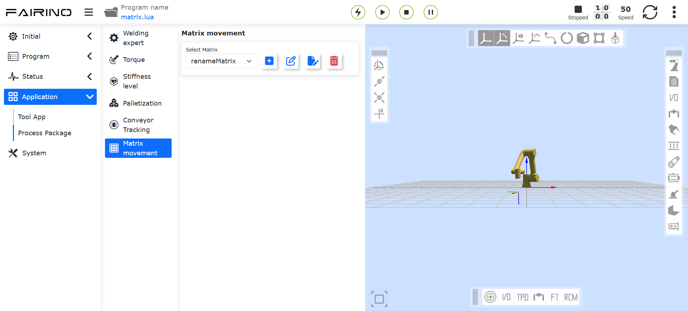

.. centered:: Abbildung 15.4‑8 Matrixrezept umbenennen

.. figure:: process/064.png
   :align: center
   :width: 6in

.. centered:: Abbildung 15.4‑9 Löschbestätigung für Matrixrezept

Hinzufügen von Matrixbewegungsanweisungen
~~~~~~~~~~~~~~~~~~~~~~~~~~~~~~~~~~~~~~~~~~~~~~

**Schritt 1**: Nachdem Sie die Oberfläche "Teach-Programm -> Programmierung -> Palettieranweisungen -> Matrixbewegung" aufgerufen haben, überprüfen Sie, ob Rezepte vorhanden sind. Wenn kein Rezept erstellt wurde, wird eine Hinweismeldung angezeigt. Unterhalb des Hinweistextes können Sie auf die Schaltfläche "Konfigurieren" klicken, um schnell zur Oberfläche "Hilfsanwendungen -> Prozesspakete -> Matrixbewegung" zu gelangen. Wie unten dargestellt:

.. figure:: process/065.png
   :align: center
   :width: 6in

.. centered:: Abbildung 15.4‑10 Matrixbewegungsanweisung ohne Rezeptoberfläche

Wenn ein Rezept vorhanden ist, wird die Matrixbewegungsanweisungsoberfläche angezeigt. Die aktuellen Anweisungstypen sind:

- **Matrixbewegung**: Den Roboter so einstellen, dass er sich zum Übergangspunkt für Be- und Entladevorgänge bewegt;
- **Matrixbetriebszähler**: Zählen der Zeile, Spalte und Schicht, nachdem der Roboter das Be- und Entladen abgeschlossen hat;
- **Startzähler konfigurieren**: Einstellen der Zeile, Spalte und Schicht, von der der Roboter mit dem Be- und Entladen beginnt;
- **Matrixzähler abrufen**: Abrufen der Zeile, Spalte und Schicht, bei der der Roboter das Be- und Entladen abgeschlossen hat.

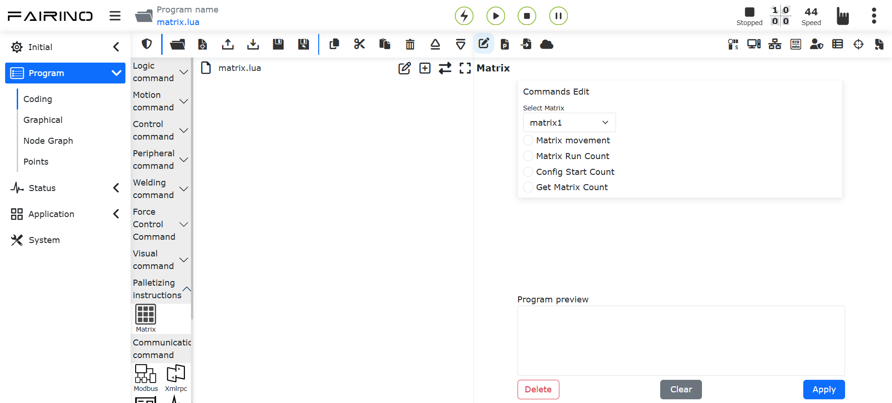

.. centered:: Abbildung 15.4‑11 Matrixbewegungsanweisung mit Rezeptoberfläche

**Schritt 2**: Fügen Sie die Anweisung "Matrixbewegung" hinzu. Erstellen Sie ein neues Programm mit dem Namen "matrix", wählen Sie das Rezept "matrix1", die Bewegungsrichtung "Abwärts" und geben Sie die Geschwindigkeit 100 ein. Der Roboter bewegt sich vom Sicherheitspunkt zum Übergangspunkt und dann zum Greifpunkt. Klicken Sie auf die Schaltfläche "Hinzufügen", um sie auf das Programm anzuwenden. Wie unten dargestellt:

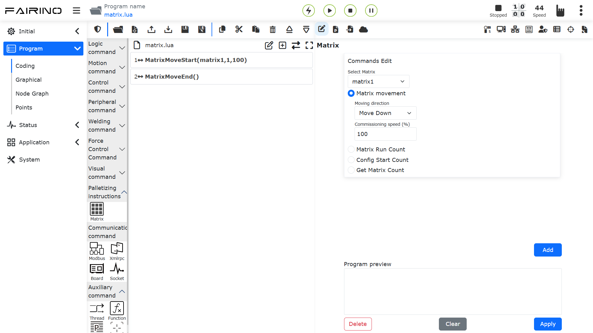

.. centered:: Abbildung 15.4‑12 Matrixbewegungsanweisung Abwärts

**Schritt 3**: Fügen Sie die Anweisung "Matrixbetriebszähler" hinzu. Wählen Sie das Rezept "matrix1", klicken Sie auf die Schaltfläche "Hinzufügen", um sie auf das Programm anzuwenden. Wie unten dargestellt:

.. figure:: process/068.png
   :align: center
   :width: 6in

.. centered:: Abbildung 15.4‑13 Matrixbetriebszähler-Anweisung

**Schritt 4**: Fügen Sie die Anweisung "Matrixbewegung" hinzu. Wählen Sie das Rezept "matrix1", die Bewegungsrichtung "Aufwärts" und geben Sie die Geschwindigkeit 100 ein. Der Roboter bewegt sich vom Greifpunkt zum Übergangspunkt und dann zurück zum Sicherheitspunkt. Klicken Sie auf die Schaltfläche "Hinzufügen", um sie auf das Programm anzuwenden. Wie unten dargestellt:

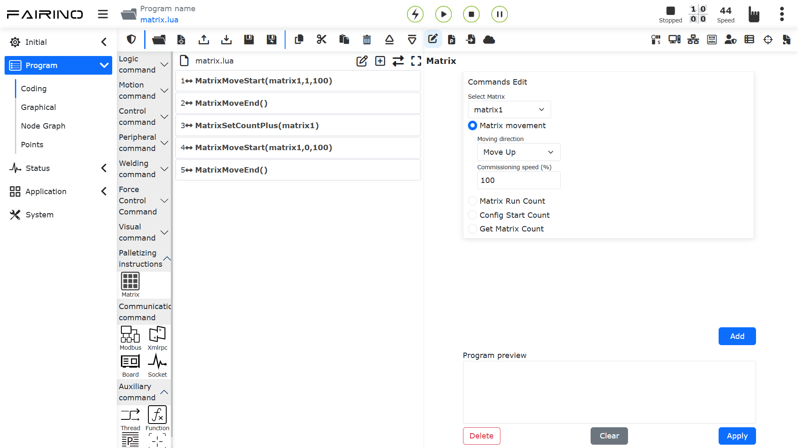

.. centered:: Abbildung 15.4‑14 Matrixbewegungsanweisung Aufwärts

**Schritt 5**: Fügen Sie eine while-Anweisung für kontinuierliche Schleifen hinzu. Klicken Sie auf die Schaltfläche "Speichern", um das Programm zu speichern, wechseln Sie in den Automatikmodus und führen Sie das Programm aus. Der Roboter führt kontinuierlich Be- und Entladevorgänge mit Matrixbewegung durch. Wie unten dargestellt:

.. figure:: process/070.png
   :align: center
   :width: 6in

.. centered:: Abbildung 15.4‑15 Ausführung der Matrixbewegungsanweisung

**Schritt 6**: Fügen Sie die Anweisung "Startzähler konfigurieren" hinzu. Wählen Sie das Rezept "matrix1", geben Sie Zeile 1, Spalte 1, Schicht 1 ein. Klicken Sie auf die Schaltfläche "Hinzufügen", um sie auf das Programm anzuwenden. Wie unten dargestellt:

.. note:: Die eingegebenen Zeilen-, Spalten- und Schichtnummern werden um 1 erhöht, um die tatsächliche Zeile, Spalte und Schicht darzustellen. Das heißt, die Eingabe von Zeile 1, Spalte 1, Schicht 1 bedeutet, dass der Roboter tatsächlich von Zeile 2, Spalte 2, Schicht 2 an der angegebenen Position startet.

.. figure:: process/071.png
   :align: center
   :width: 6in

.. centered:: Abbildung 15.4‑16 Anweisung "Startzähler konfigurieren"

**Schritt 7**: Wenn sich die Matrix ändert, gehen Sie zur Oberfläche "Hilfsanwendungen -> Prozesspakete -> Matrixbewegung", wählen Sie das Matrixrezept "matrix1", klicken Sie auf die Schaltfläche "Bearbeiten", um die Parameter zu ändern, und klicken Sie dann auf die Schaltfläche "Konfigurieren", um die Matrixänderung abzuschließen. Kehren Sie nun zur Programmieroberfläche zurück, öffnen Sie das Programm "matrix" und führen Sie es direkt aus, um das neue Matrixszenario durchzuführen.

.. figure:: process/072.png
   :align: center
   :width: 6in

.. centered:: Abbildung 15.4‑17 Matrixrezept ändern