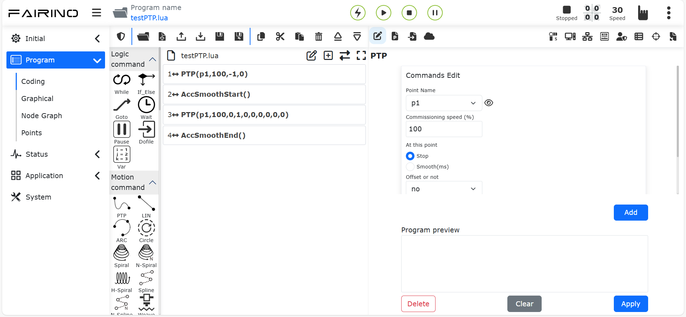
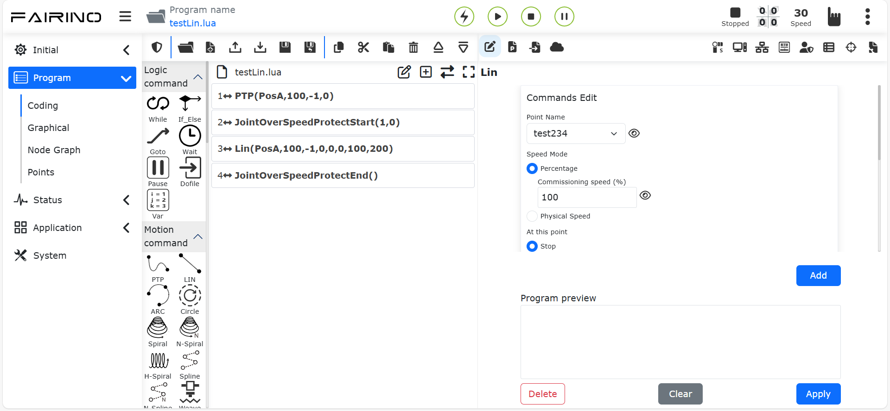

Schnellprogrammierung des Roboters
===================================

Einführung in einfache Bewegungsbefehle
----------------------------------------

**PTP-Befehl**: Klicken Sie auf das Symbol "Punkt-zu-Punkt", um die Bearbeitungsoberfläche für den PTP-Befehl zu öffnen.

Sie können den zu erreichenden Punkt auswählen. Durch die Einstellung der Glättungsübergangszeit kann die Bewegung von diesem Punkt zum nächsten kontinuierlich erfolgen. Bei der Einstellung "Ob Versatz" können Sie einen Versatz basierend auf dem Basiskoordinatensystem oder dem Werkzeugkoordinatensystem auswählen. Es öffnen sich dann Eingabefelder für den Versatz in x, y, z, rx, ry, rz. Der spezifische PTP-Pfad ist der optimale Pfad, der automatisch vom Bewegungscontroller geplant wird. Klicken Sie auf "Hinzufügen" und dann auf "Übernehmen", um diesen Befehl zu speichern.

.. centered:: Abbildung 5.1‑1 PTP-Befehls-Oberfläche

**Lin-Befehl**: Klicken Sie auf das Symbol "Linie", um die Bearbeitungsoberfläche für den Lin-Befehl zu öffnen.

Die Funktion dieses Befehls ähnelt der des "PTP"-Befehls, jedoch ist der Pfad zum Zielpunkt eine gerade Linie.

.. centered:: Abbildung 5.1‑2 Lin-Befehls-Oberfläche

Arbeiten mit Programmdateien
----------------------------

Verwenden Sie die Werkzeugleiste am oberen Rand des Programmbaums, um diesen zu bearbeiten.

.. note::
   .. image:: coding/006.png
      :height: 0.75in
      :align: left

   Bezeichnung: **Öffnen**

   Funktion: Öffnet eine Benutzerprogrammdatei.

.. note::
   .. image:: coding/007.png
      :height: 0.75in
      :align: left

   Bezeichnung: **Neu**

   Funktion: Wählt eine Vorlage aus, um eine neue Programmdatei zu erstellen.

.. note::
   .. image:: coding/008.png
      :height: 0.75in
      :align: left

   Bezeichnung: **Importieren**

   Funktion: Importiert eine Datei in den Benutzerprogramm-Ordner.

.. note::
   .. image:: coding/009.png
      :height: 0.75in
      :align: left

   Bezeichnung: **Exportieren**

   Funktion: Exportiert eine Benutzerprogrammdatei auf den lokalen Computer.

.. note::
   .. image:: coding/010.png
      :height: 0.75in
      :align: left

   Bezeichnung: **Speichern**

   Funktion: Speichert den bearbeiteten Inhalt der Datei.

.. note::
   .. image:: coding/011.png
      :height: 0.75in
      :align: left

   Bezeichnung: **Speichern unter**

   Funktion: Benennt die Datei um und speichert sie im Ordner für Benutzerprogramme oder Vorlagen.

.. note::
   .. image:: coding/012.png
      :height: 0.75in
      :align: left

   Bezeichnung: **Kopieren**

   Funktion: Kopiert einen Knoten und ermöglicht seine Verwendung für andere Operationen (z. B. Einfügen an einer anderen Stelle im Programmbaum).

.. note::
   .. image:: coding/013.png
      :height: 0.75in
      :align: left

   Bezeichnung: **Einfügen**

   Funktion: Ermöglicht das Einfügen eines zuvor ausgeschnittenen oder kopierten Knotens.

.. note::
   .. image:: coding/014.png
      :height: 0.75in
      :align: left

   Bezeichnung: **Ausschneiden**

   Funktion: Schneidet einen Knoten aus und ermöglicht seine Verwendung für andere Operationen (z. B. Einfügen an einer anderen Stelle im Programmbaum).

.. note::
   .. image:: coding/015.png
      :height: 0.75in
      :align: left

   Bezeichnung: **Löschen**

   Funktion: Entfernt einen Knoten aus dem Programmbaum.

.. note::
   .. image:: coding/016.png
      :height: 0.75in
      :align: left

   Bezeichnung: **Nach oben**

   Funktion: Verschiebt den Knoten nach oben.

.. note::
   .. image:: coding/017.png
      :height: 0.75in
      :align: left

   Bezeichnung: **Nach unten**

   Funktion: Verschiebt den Knoten nach unten.

.. note::
   .. image:: coding/018.png
      :height: 0.75in
      :align: left

   Bezeichnung: **Edit-Modus wechseln**

   Funktion: Wechselt zwischen Programmbaum-Modus und Lua-Editier-Modus.

Schreiben und Ausführen eines Programms
---------------------------------------

Auf der linken Seite können hauptsächlich Programmbefehle hinzugefügt werden. Klicken Sie auf das Symbol über den jeweiligen Schlüsselwörtern, um auf der rechten Seite die detaillierte Oberfläche zum Hinzufügen von Programmbefehlen zu öffnen. Es gibt hauptsächlich zwei Methoden, um Programmbefehle zu einer Datei hinzuzufügen:

- 1. Öffnen Sie den entsprechenden Befehl und klicken Sie auf "Übernehmen", um den Befehl zum Programm hinzuzufügen.
- 2. Klicken Sie zuerst auf die Schaltfläche "Hinzufügen". Der Befehl wird zu diesem Zeitpunkt noch nicht in der Programmdatei gespeichert. Klicken Sie dann auf "Übernehmen", um den Befehl in der Datei zu speichern.

Die zweite Methode wird häufig verwendet, wenn mehrere Befehle desselben Typs gesendet werden. Für diese Art von Befehlen wurde die Schaltfläche "Hinzufügen" und eine Funktion zur Anzeige der hinzugefügten Befehle implementiert. Durch Klicken auf "Hinzufügen" kann ein Befehl hinzugefügt werden. "Hinzugefügte Befehle" zeigt alle hinzugefügten Befehle an. Durch Klicken auf "Übernehmen" werden die hinzugefügten Befehle in der rechts geöffneten Datei gespeichert.

Klicken Sie auf die Starttaste, um das Programm auszuführen; klicken Sie auf die Stopptaste, um die Programmausführung zu stoppen; klicken Sie auf die Pause/Fortsetzen-Taste, um das Programm zu pausieren/fortzusetzen. Während der Programmausführung wird der aktuell ausgeführte Programmknoten grün hervorgehoben.

Im Handmodus können Sie durch Klicken auf das erste Symbol rechts neben einem Knoten den Roboter diesen Befehl einzeln ausführen lassen. Das zweite Symbol dient zum Bearbeiten des Knoteninhalts.

.. image:: coding/001.png
   :width: 6in
   :align: center

.. centered:: Abbildung 5.3‑1 Programmbaum-Oberfläche