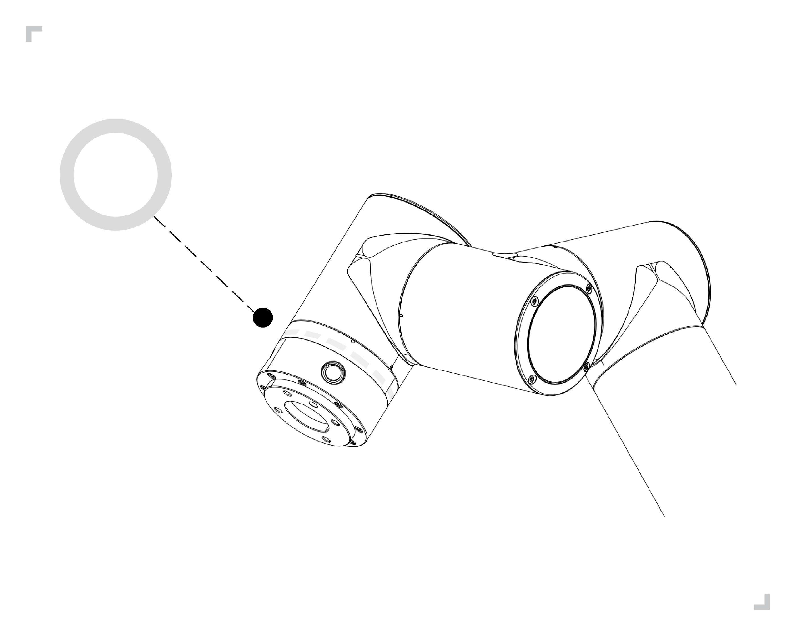
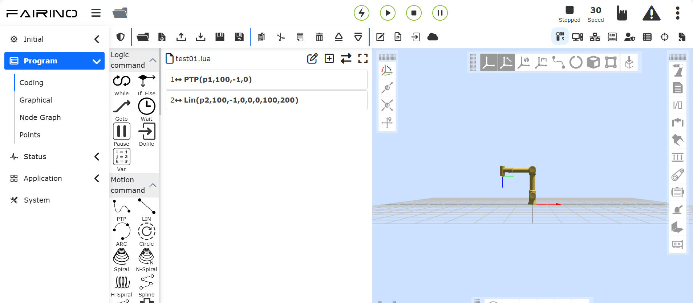

Schnellstart des Roboters
=========================

.. toctree::
   :maxdepth: 5

Installation des Roboterarms und des Steuerpults
------------------------------------------------

Installieren und verbinden Sie den Roboterarm und das Steuerpult gemäß den Abschnitten 3.5 und 3.6 in 3. Hardware-Installation.

-   Entnehmen Sie den Roboterarm aus der Verpackung und montieren Sie ihn mit 4 M8-Schrauben mit einer Festigkeit von mindestens Klasse 8.8. Montieren Sie den Roboterarm auf einer festen und vibrationsgedämpften Oberfläche. Bei Befestigung auf einer Aluminiumplatte muss diese mindestens 16 mm dick sein, bei Befestigung auf einer Stahlplatte mindestens 8 mm.

-   Stellen Sie das Steuerpult auf seine Füße.

-   Verbinden Sie das schwere Lastkabel des Roboterarms mit der Schwerlastschnittstelle des Steuerpults.

-   Stecken Sie den Rundsteckverbinder des Bedienkästchens in die Teach-Pendant-Schnittstelle des Steuerpults.

-   Stellen Sie sicher, dass der Netzschalter des Steuerpults ausgeschaltet ist (Schalterstellung 0), und verbinden Sie das Netzkabel mit der Netzanschlussbuchse.

-   Stecken Sie den Netzstecker des Steuerpults ein.

.. warning::
   (1) Wenn der Roboter nicht sicher auf einer festen Oberfläche befestigt ist, könnte er umkippen und Verletzungen verursachen.

   (2) Schalten Sie das Steuerpult nicht schnell hintereinander ein und aus. Es wird empfohlen, zwischen dem Ausschalten (OFF) und dem erneuten Einschalten (ON) des Steuerpults eine Pause von mehr als einer Minute einzuhalten.

Starten und Steuern des Roboters über das Teach-Pendant
--------------------------------------------------------

Das Steuerpult verbindet den Roboterarm, das Teach-Pendant und alle Peripheriegeräte physisch über elektrische Ein-/Ausgänge. Das Steuerpult muss eingeschaltet sein, um den Roboterarm mit Strom zu versorgen.

-   Drücken Sie den Netzschalter am Steuerpult, um es einzuschalten.

-   Nach dem Start des Roboters befindet er sich im Handmodus und ist nicht aktiviert. Um den Roboter im Handmodus zu bedienen, muss der dreistufige Zustimmtaster am Teach-Pendant in der Reihenfolge AUS (loslassen) => EIN => AUS (drücken) betätigt werden. Wenn der Taster in der Stellung EIN ist, kann der Roboter gezogen oder gesteuert werden.

-   Wenn der Roboter nicht im Handmodus bedient werden soll, kann der Schlüsselschalter am Teach-Pendant verwendet werden, um den Betriebsmodus des Roboters zu ändern: Automatik, Hand, Benutzerdefiniert.

-   Beim Umschalten in den Handmodus des Roboters sollte der Sicherheitsraum innen und außen auf Anomalien überprüft und der Roboter vorsichtig bedient werden.

-   Beim Umschalten in den Automatikmodus des Roboters sollten die Sicherheitsmaßnahmen überprüft, der Normalzustand wiederhergestellt und der Roboter vorsichtig bedient werden.

-   Wenn das Teach-Pendant nicht normal gestartet werden kann, überprüfen Sie bitte, ob die Geräteverbindungen in Ordnung sind.

Steuerung der Roboterbewegung über das Bedienkästchen
-----------------------------------------------------

Siehe Abschnitt 3.6.3. Endeffektor-LED-Definition in 3. Hardware-Installation zur Steuerung des Roboters. Die vorhandenen Bedienkästchen sind in 60 Bedienkästchen (POE) (BX01), 60 Bedienkästchen (POE) (BX02)-V1.0 und 60 Bedienkästchen (POE) (BX02)-V2.0 unterteilt. Am Beispiel des 60 Bedienkästchens (POE) (BX01) sind die Bedienschritte wie folgt.

Ohne Verwendung des Teach-Pendants
~~~~~~~~~~~~~~~~~~~~~~~~~~~~~~~~~~~

-   **Schritt 1**: Schalten Sie das Steuerpult des Roboters ein, um den Roboter zu starten. Warten Sie, bis die LED am Endeffektor dauerhaft grün leuchtet, bevor Sie den Roboter bedienen können, siehe folgende Abbildung:

.. figure:: quick_start_robot/001.png
   :align: center
   :width: 4in

.. centered:: Abbildung 4.3-1 Schematische Darstellung der grünen Endeffektor-LED

-   **Schritt 2**: Halten Sie die "Taste 2" am Bedienkästchen gedrückt, um in den Modus ohne Teach-Pendant zu gelangen. Die LED am Endeffektor blinkt dreimal türkis, siehe folgende Abbildung:

.. figure:: quick_start_robot/002.png
   :align: center
   :width: 4in

.. centered:: Abbildung 4.3-2 Schematische Darstellung der türkisen Endeffektor-LED

-   **Schritt 3**: Halten Sie die "Taste 1" am Bedienkästchen gedrückt, um den Roboter in den Drag-Modus zu schalten. Die LED am Endeffektor leuchtet nun weiß-türkis, siehe Abbildung 4.3-3. Bewegen Sie den Roboter an eine beliebige Position. Halten Sie "Taste 1" gedrückt, um den Drag-Modus zu verlassen. Drücken Sie kurz die "Taste 2" am Bedienkästchen, um den Punkt P1 aufzuzeichnen. Die LED am Endeffektor blinkt dreimal violett, siehe Abbildung 4.3-4.

-   **Schritt 4**: Bewegen Sie den Roboter. Drücken Sie kurz die "Taste 2" am Bedienkästchen, um den Punkt P2 aufzuzeichnen. Die LED am Endeffektor blinkt dreimal violett, siehe Abbildung 4.3-4.

.. centered:: Abbildung 4.3-3 Schematische Darstellung der weiß-türkisen Endeffektor-LED

.. figure:: quick_start_robot/004.png
   :align: center
   :width: 4in

.. centered:: Abbildung 4.3-4 Schematische Darstellung der violetten Endeffektor-LED

-   **Schritt 5**: Halten Sie die "Taste 1" am Bedienkästchen gedrückt, um den Drag-Modus zu verlassen. Der Roboter befindet sich nun im Handmodus, die LED am Endeffektor leuchtet grün, siehe Abbildung 4.3-5. Drücken Sie kurz "Taste 1", um den Roboter in den Automatikmodus zu schalten. Die LED am Endeffektor leuchtet nun blau, siehe Abbildung 4.3-6.

-   **Schritt 6**: Drücken Sie kurz die "Taste 3" am Bedienkästchen, um das Programm auszuführen. Die LED am Endeffektor blinkt zweimal blau, siehe Abbildung 4.3-6.

.. figure:: quick_start_robot/005.png
   :align: center
   :width: 4in

.. centered:: Abbildung 4.3-5 Schematische Darstellung der grünen Endeffektor-LED

.. figure:: quick_start_robot/006.png
   :align: center
   :width: 4in

.. centered:: Abbildung 4.3-6 Schematische Darstellung der blauen Endeffektor-LED

-   **Schritt 7**: Drücken Sie kurz die "Taste 3" am Bedienkästchen, um die Programmausführung zu stoppen. Die LED am Endeffektor blinkt dreimal rot, siehe folgende Abbildung:

.. figure:: quick_start_robot/007.png
   :align: center
   :width: 4in

.. centered:: Abbildung 4.3-7 Schematische Darstellung der roten Endeffektor-LED

Mit Verwendung des Teach-Pendants
~~~~~~~~~~~~~~~~~~~~~~~~~~~~~~~~~

-   **Schritt 1**: Starten Sie den Roboter. Warten Sie, bis die grüne LED am Endeffektor aufhört zu blinken, bevor Sie den Roboter bedienen.

-   **Schritt 2**: Öffnen Sie das Teach-Pendant und gehen Sie zur Programmbearbeitungsoberfläche.

-   **Schritt 3**: Wählen Sie eine leere Vorlage, um eine neue Programmdatei zu erstellen.

-   **Schritt 4**: Drücken Sie kurz Taste 1 am Bedienkästchen, um den Roboter in den Handmodus zu schalten. Die LED am Endeffektor leuchtet grün.

-   **Schritt 5**: Halten Sie Taste 1 am Bedienkästchen gedrückt, um den Roboter in den Drag-Modus zu schalten. Die LED am Endeffektor leuchtet weiß-türkis. Bewegen Sie den Roboter an eine beliebige Position. Drücken Sie kurz Taste 2 am Bedienkästchen, um den Punkt P1 aufzuzeichnen. Die LED am Endeffektor blinkt dreimal violett. Fügen Sie den Befehl "PTP(p1,100,-1,0)" manuell zur Programmdatei hinzu.

.. figure:: quick_start_robot/008.png
   :align: center
   :width: 4in

.. centered:: Abbildung 4.3-8 Aufzeichnen und Hinzufügen von Punkt P1

-   **Schritt 6**: Bewegen Sie den Roboter. Drücken Sie kurz Taste 2 am Bedienkästchen, um den Punkt P2 aufzuzeichnen. Die LED am Endeffektor blinkt dreimal violett. Fügen Sie den Befehl "PTP(p2,100,-1,0)" manuell zum Programm hinzu.

.. figure:: quick_start_robot/009.png
   :align: center
   :width: 4in

.. centered:: Abbildung 4.3-9 Aufzeichnen und Hinzufügen von Punkt P2

-   **Schritt 7**: Speichern Sie den Inhalt der Programmdatei.

-   **Schritt 8**: Halten Sie Taste 1 am Bedienkästchen gedrückt, um den Drag-Modus zu verlassen. Der Roboter befindet sich nun im Handmodus, die LED leuchtet grün. Drücken Sie kurz Taste 1 am Bedienkästchen, um den Roboter in den Automatikmodus zu schalten. Die LED am Endeffektor leuchtet blau.

-   **Schritt 9**: Drücken Sie kurz Taste 3 am Bedienkästchen, um das Programm auszuführen. Die LED am Endeffektor blinkt zweimal blau.

Steuerung der Roboterbewegung über das Teach-Pendant
-----------------------------------------------------

Klicken Sie auf der linken Seite des Teach-Pendants im Hauptmenü auf die Schaltfläche "Teach-Programm" und dann im Untermenü auf "Programmierung", um zur Teach-Programmoberfläche zu gelangen. Auf dieser Oberfläche werden hauptsächlich Teach-Programme des Roboters erstellt und geändert.

Nach dem Klicken auf das Symbol "Neu" benennt der Benutzer die Datei und wählt eine Vorlage als Inhalt für die neue Datei aus. Durch Klicken auf "Neu erstellen" wird die Datei erfolgreich erstellt und geöffnet.

.. centered:: Abbildung 4.4-1 Schematische Darstellung der Teach-Programmausführung

.. warning::
    Ihr Kopf und Rumpf dürfen sich nicht in dem vom Roboter erreichbaren Bereich (Arbeitsraum) befinden. Legen Sie Ihre Finger nicht an Stellen, an denen der Roboter sie greifen könnte.

.. important::
   - Lassen Sie den Roboter nicht gegen sich selbst oder andere Objekte fahren, da dies zu Schäden am Roboter führen kann.
   - Dies ist nur eine Schnellstartanleitung, die Ihnen zeigt, wie Sie den FR-Kollaborativroboter einfach verwenden können. Die Anleitung setzt voraus, dass die Umgebung sicher und ungefährlich ist und der Benutzer vorsichtig ist. Erhöhen Sie Geschwindigkeit oder Beschleunigung nicht über die Standardwerte. Führen Sie vor der Inbetriebnahme des Roboters stets eine Risikobewertung durch.