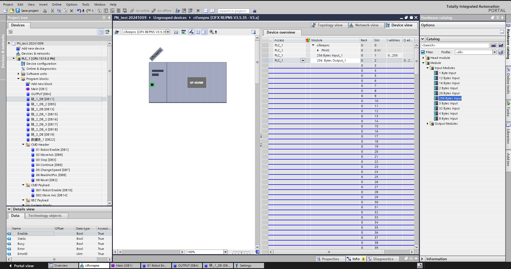
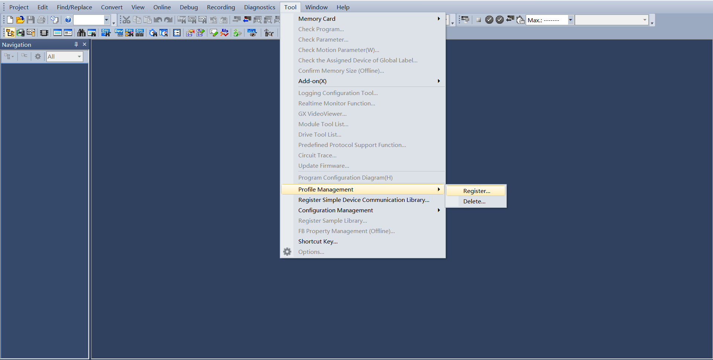
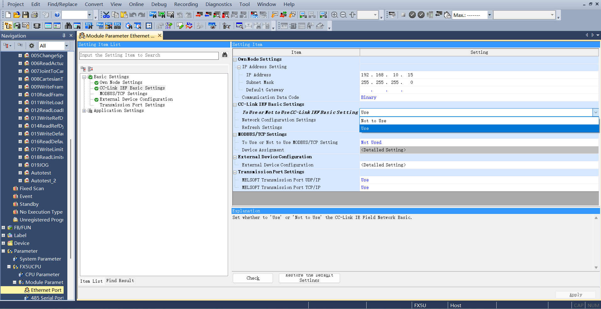
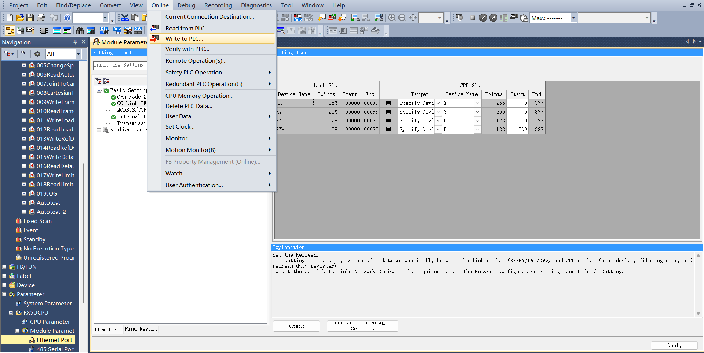
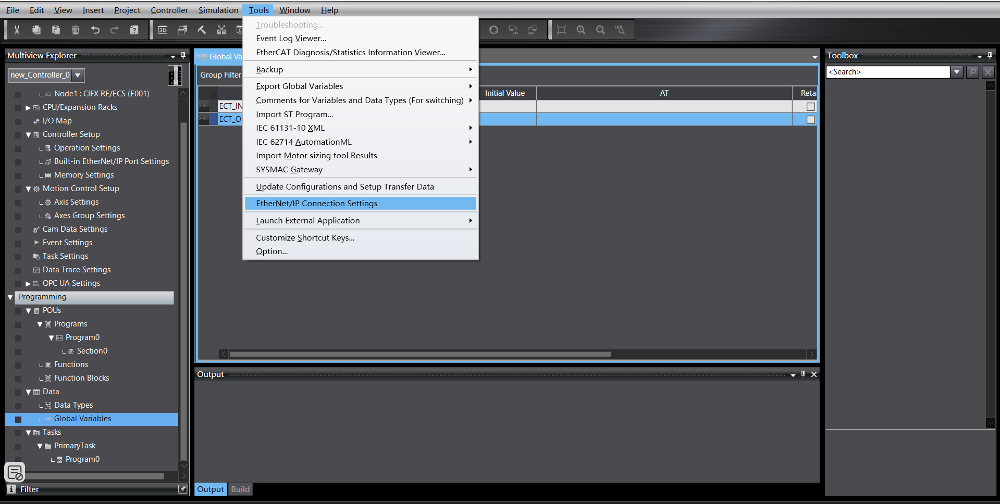
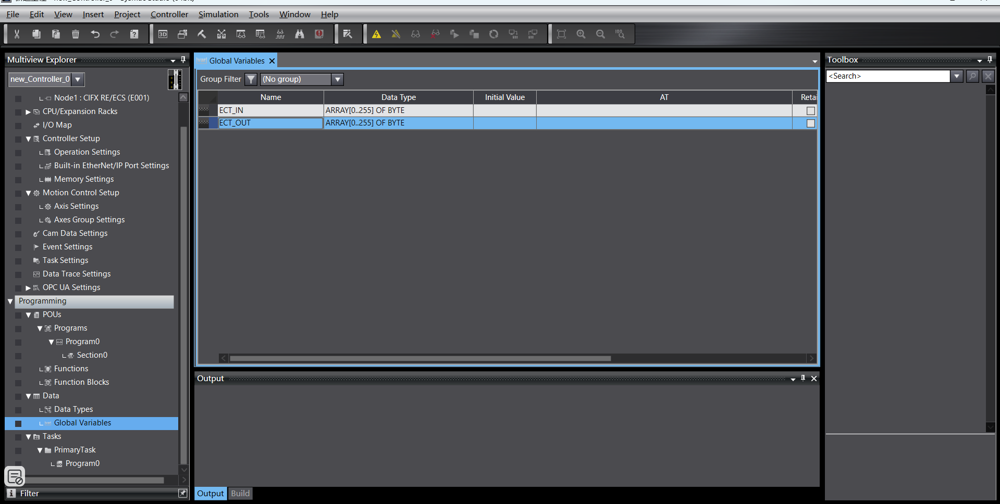
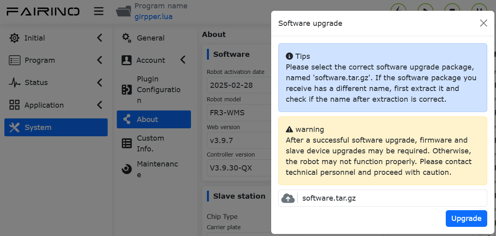

Fernbedienungsmodus des Roboters
=============================================================

.. toctree::
   :maxdepth: 6

Überblick
-------------------------

Um die Bewegung des Roboters durch eine SPS über verschiedene industrielle Busprotokolle (CC-Link, Profinet, Ethernet/IP und EtherCAT) zu ermöglichen, werden dem integrierten Mini-Steuerschrank die Karten FRH-PCIeN-EC/EIP/CC/PN-RJ-V10 und FRJ-PCIeN-EIP/CC/PN-RJ-V10 hinzugefügt, um die folgenden Funktionen zu realisieren:

1) CC-Link-Slave-Protokollunterstützung;
2) Profinet-Slave-Protokollunterstützung;
3) Ethernet/IP-Slave-Protokollunterstützung;
4) EtherCAT-Slave-Protokollunterstützung (wird von der Karte FRJ-PCIeN-EIP/CC/PN-RJ-V10 nicht unterstützt).

Umgebungskonfiguration
--------------------------------------------

Karteninstallation
~~~~~~~~~~~~~~~~~~~~~~~~~~~~~~~~~~~~~~~~~~~~~

(1) Materialprüfung: Die Karten FRH-PCIeN, FRJ-PCIeN und die dazugehörigen Blechteile sind unten dargestellt.

.. image:: remote_mode/001.png
   :width: 4in
   :align: center

.. centered:: Abbildung 18.2-1 Montageblech (Vorderseite)

.. image:: remote_mode/002.png
   :width: 4in
   :align: center

.. centered:: Abbildung 18.2-2 Montageblech (Rückseite)

.. image:: remote_mode/003.png
   :width: 4in
   :align: center

.. centered:: Abbildung 18.2-3 FRH-PCIeN-EC/EIP/CC/PN-RJ-V10 Karte

.. image:: remote_mode/004.png
   :width: 4in
   :align: center

.. centered:: Abbildung 18.2-4 FRJ-PCIeN-EIP/CC/PN-RJ-V10 Karte

(2) Installieren Sie die Karte wie gezeigt im integrierten Mini-Steuerschrank.

.. image:: remote_mode/005.png
   :width: 4in
   :align: center

.. centered:: Abbildung 18.2-5 Montagediagramm Blech

.. image:: remote_mode/006.png
   :width: 4in
   :align: center

.. centered:: Abbildung 18.2-6 Montagediagramm FRH-PCIeN Hauptplatine

.. image:: remote_mode/007.png
   :width: 4in
   :align: center

.. centered:: Abbildung 18.2-7 Montagediagramm FRH-PCIeN Netzwerkport (RJ45) Erweiterungskarte

.. image:: remote_mode/008.png
   :width: 4in
   :align: center

.. centered:: Abbildung 18.2-8 Montagediagramm FRJ-PCIeN Hauptplatine

.. image:: remote_mode/009.png
   :width: 4in
   :align: center

.. centered:: Abbildung 18.2-9 Montagediagramm FRJ-PCIeN Netzwerkport (RJ45) Erweiterungskarte

.. note:: Hinweis: Alle Schrauben müssen festgezogen werden.

(3) Die Verkabelung zwischen Robotersteuerschrank und SPS ist unten dargestellt.

.. image:: remote_mode/010.png
   :width: 4in
   :align: center

.. centered:: Abbildung 18.2-10 Steuerschrank & Mitsubishi SPS Verdrahtungsplan

.. image:: remote_mode/011.png
   :width: 4in
   :align: center

.. centered:: Abbildung 18.2-11 Steuerschrank & Siemens SPS Verdrahtungsplan

.. image:: remote_mode/012.png
   :width: 4in
   :align: center

.. centered:: Abbildung 18.2-12 Steuerschrank & Omron SPS Verdrahtungsplan

.. image:: remote_mode/013.png
   :width: 4in
   :align: center

.. centered:: Abbildung 18.2-13 Steuerschrank & Omron SPS Verdrahtungsplan

.. note::
    1: Robotersteuerschrank (Karten-Netzwerkanschluss);
    2: Switch;
    3: Laptop-PC;
    4: Mitsubishi SPS (CC-Link IEF Basic Anschluss);
    5: Siemens SPS (Profinet Anschluss);
    6: Omron SPS (Ethernet/IP Anschluss);
    7: Omron SPS (EtherCAT Anschluss);

Wenn das Protokoll auf EtherCAT-Bus umgeschaltet wird, müssen die Netzwerkanschlüsse der Karte als EtherCAT_IN und EtherCAT_OUT unterschieden werden. In diesem Fall muss der EtherCAT-Anschluss der Omron SPS direkt mit dem EtherCAT_IN-Anschluss der Karte über ein Ethernet-Kabel verbunden werden.

SPS-Umgebungseinrichtung
~~~~~~~~~~~~~~~~~~~~~~~~~~~~~~~~~~~~~~~~~~~~~~~~~~

Die Testumgebung, die zur Implementierung der Slave-Befehle für jedes Protokoll eingerichtet wurde, ist in der folgenden Tabelle dargestellt, einschließlich der SPS-Modelle, Firmware-Versionen und der für jedes Protokoll verwendeten Testsoftware.

.. centered:: Tabelle 2-1 Testumgebung

.. list-table::
   :widths: 20 40 40
   :header-rows: 1
   :align: center

   * - Protokoll
     - Profinet
     - CC-link

   * - Marke
     - Siemens
     - Mitsubishi

   * - Modell
     - CPU 1515-2 PN
     - FX5S-30TR/DS

   * - Firmware
     - 6ES75152AM020AB0
     - 30MR/ES V1.3

   * - Software
     - TIA Portal V17
     - GXWorks3V1.097B

   * - Karten-IP-Adresse
     - "192.168.0.2"
     - "192.168.0.113"

   * - SPS-IP-Adresse
     - IP muss nicht im gleichen Subnetz sein
     - "192.168.0.15" (IP gleiches Subnetz)

.. list-table::
   :widths: 20 40 40
   :header-rows: 1
   :align: center

   * - Protokoll
     - Ethernet/IP
     - EtherCAT

   * - Marke
     - Omron
     - Omron

   * - Modell
     - NX102-1100
     - NX102-1100

   * - Firmware
     - V1.3
     - V1.3

   * - Software
     - SysmacStudioV1.50
     - SysmacStudioV1.50

   * - Karten-IP-Adresse
     - "192.168.0.112"
     - "192.168.0.2"

   * - SPS-IP-Adresse
     - "192.168.0.88" (IP gleiches Subnetz)
     - "192.168.0.88" (IP gleiches Subnetz)

Siemens Profinet
+++++++++++++++++++++++++++++++++++++++++++++++++++++++++++++

(1) Importieren der GSD-Datei (XML-Datei)

Öffnen Sie die Siemens-Programmiersoftware TIA Portal V17, erstellen Sie ein neues SPS-Projekt, wählen Sie "Geräte & Netze" und doppelklicken Sie im rechten "Hardware-Katalog" auf 6ES7 515-2AM02-0AB0, um das SPS-Modul hinzuzufügen.

.. image:: remote_mode/014.png
   :width: 6in
   :align: center

Wählen Sie in der Menüleiste der TIA PORTAL-Software "Optionen" -> "Allgemeine Stationsbeschreibungsdateien (GSD) verwalten", um bereits installierte GSD-Dateien zu installieren oder zu löschen.

.. image:: remote_mode/015.png
   :width: 6in
   :align: center

Um die GSD-Datei zu installieren, wählen Sie wie oben "Allgemeine Stationsbeschreibungsdateien (GSD) verwalten". Das Fenster "Allgemeine Stationsbeschreibungsdateien verwalten" wird angezeigt.

Wählen Sie den Ordner mit den zu installierenden GSD-Dateien aus dem "Quellpfad", wählen Sie eine oder mehrere Dateien aus der angezeigten Liste der GSD-Dateien aus und klicken Sie auf die Schaltfläche "Installieren". Wie unten dargestellt.

.. image:: remote_mode/016.png
   :width: 6in
   :align: center

Nach erfolgreicher Installation kann das Gerät der installierten GSD-Datei unter "Andere Feldgeräte" im Hardware-Katalog gefunden werden, wie unten dargestellt.

.. image:: remote_mode/017.png
   :width: 6in
   :align: center

I/O-Zuweisung: Ziehen Sie die Eingangs- und Ausgangsmodule aus dem Katalog.

Programm auf Gerät herunterladen: Doppelklicken Sie im linken Projektbaum auf "Geräte & Netze", klicken Sie mit der rechten Maustaste auf das Modul "PLC_1", wählen Sie "Auf Gerät herunterladen" aus dem Dropdown-Menü, klicken Sie auf "Hardware und Software (nur Änderungen)":

.. image:: remote_mode/019.png
   :width: 6in
   :align: center

Gerät suchen und herunterladen: Konfigurieren Sie nach dem Popup den PG/PC-Schnittstellentyp wie gezeigt, klicken Sie auf "Suche starten", wählen Sie das Gerät aus, auf das das Programm heruntergeladen werden soll, klicken Sie auf "Herunterladen":

.. image:: remote_mode/020.png
   :width: 6in
   :align: center

.. image:: remote_mode/021.png
   :width: 6in
   :align: center

Mitsubishi CC-link
++++++++++++++++++++++++++++++++++++++++++++++++++++

(1) Konfigurationsdatei importieren
Öffnen Sie GxWorks3, wählen Sie "Werkzeuge" -> "Konfigurationsdateiverwaltung" -> "Anmelden". Wählen Sie nach dem Popup die entsprechende Kommunikationsdatei aus, klicken Sie auf "Anmelden", um den Import der Konfigurationsdatei abzuschließen.

.. image:: remote_mode/023.png
   :width: 6in
   :align: center

.. image:: remote_mode/024.png
   :width: 6in
   :align: center

(2) CC-Link IEF Basic Einstellungen

Erstellen Sie ein SPS-Projekt, aktivieren Sie CC-link: Wählen Sie im linken Navigationsmenü "Ethernet-Port", stellen Sie die SPS-IP-Adresse so ein, dass sie sich im gleichen Subnetz wie die Hilscher-Kartenadresse befindet. Klicken Sie auf "CC-Link IEF Basic Verwenden" und wählen Sie "Verwenden".

CC-Link Netzwerkkonfigurationseinstellungen: Ebenfalls in den CC-Link IEF Basic Einstellungen, wählen Sie "Netzwerkkonfigurationseinstellungen". Wählen Sie für das Modul das Hilscher CIFX Digital I/O Modul. Ziehen Sie es nach unten links in die Ansicht, um die Hardwarekonfiguration abzuschließen.

.. image:: remote_mode/026.png
   :width: 6in
   :align: center

CC-Link Aktualisierungseinstellungen: Ebenfalls in den CC-Link IEF Basic Einstellungen, klicken Sie auf "Aktualisierungseinstellungen". Passen Sie die Übertragungseinstellungen an: 256 Byte empfangen, 256 Byte senden.

.. image:: remote_mode/027.png
   :width: 6in
   :align: center

(3) Programm herunterladen

Klicken Sie nach dem Öffnen des Testprogramms auf "Online" -> "In speicherprogrammierbare Steuerung schreiben", um die Download-Oberfläche aufzurufen.

Klicken Sie nach dem Öffnen der Download-Oberfläche oben links auf "Parameter + Programm" und dann unten rechts auf "Ausführen", um den Download zu starten. Warten Sie, bis der Download abgeschlossen ist.

.. image:: remote_mode/029.png
   :width: 6in
   :align: center

Omron Ethernet/IP
++++++++++++++++++++++++++++++++++++++++++++++++++++++++

(1) Erstellen Sie ein neues SPS-Projekt (Dieses Beispiel verwendet das Modell: NX102-1100, 1.47 Omron SPS):

.. image:: remote_mode/030.png
   :width: 6in
   :align: center

Erstellen Sie neue globale Variablen:

.. image:: remote_mode/031.png
   :width: 6in
   :align: center

(2) EDS-Datei importieren

Klicken Sie auf "Werkzeuge" -> "EtherNet/IP Verbindungseinstellungen":

Rufen Sie die Einstellungen für die anzuschließende SPS auf:

.. image:: remote_mode/033.png
   :width: 6in
   :align: center

Klicken Sie mit der rechten Maustaste in den leeren Bereich der Tag-Gruppe, um eine neue Tag-Gruppe zu erstellen:

.. image:: remote_mode/034.png
   :width: 6in
   :align: center

Klicken Sie mit der rechten Maustaste auf die neu erstellte Tag-Gruppe, erstellen Sie Tags. Gleich für Eingang und Ausgang, beide mit einer Länge von 256 Byte:

.. image:: remote_mode/035.png
   :width: 6in
   :align: center

.. image:: remote_mode/036.png
   :width: 6in
   :align: center

Rufen Sie die Verbindungseinstellungen auf, klicken Sie mit der rechten Maustaste in den leeren Bereich der Werkzeugbox, klicken Sie mit der rechten Maustaste, um die EDS-Bibliothek anzuzeigen:

.. image:: remote_mode/037.png
   :width: 6in
   :align: center

Installieren Sie die EDS-Datei:

.. image:: remote_mode/038.png
   :width: 6in
   :align: center

Klicken Sie auf das "+" in der Werkzeugbox, fügen Sie das Zielgerät hinzu, geben Sie die IP-Adresse des Zielgeräts ein:

.. image:: remote_mode/039.png
   :width: 6in
   :align: center

Klicken Sie unten rechts auf "Hinzufügen". Nach erfolgreichem Hinzufügen wird das Zielgerät angezeigt:

.. image:: remote_mode/040.png
   :width: 6in
   :align: center

(3) EtherNet/IP Parametereinstellungen

Klicken Sie mit der rechten Maustaste auf das hinzugefügte Zielgerät, klicken Sie auf "Bearbeiten":

.. image:: remote_mode/041.png
   :width: 6in
   :align: center

Die aktuelle Gerätedatenzuordnungslänge beträgt 256 Byte. Ändern Sie 0001 und 0002 auf 256, bestätigen Sie:

.. image:: remote_mode/042.png
   :width: 6in
   :align: center

Doppelklicken Sie auf das Zielgerät, füllen Sie Eingang und Ausgang aus, wählen Sie die Startvariable:

.. image:: remote_mode/043.png
   :width: 6in
   :align: center

(4) Programm herunterladen

Öffnen Sie das Testprogramm, ändern Sie die SPS-IP-Adresse auf das gleiche Subnetz wie die Karte, laden Sie das Programm herunter und führen Sie es aus.

Omron EtherCAT
+++++++++++++++++++++++++++++++++++++++++++++++++

(1) Erstellen Sie ein neues SPS-Projekt (Dieses Beispiel verwendet das Modell: NX102-1100, 1.47 Omron SPS):

.. image:: remote_mode/044.png
   :width: 6in
   :align: center

Erstellen Sie neue globale Variablen:

(2) XML-Datei importieren

Doppelklicken Sie auf "EtherCAT", um die Master-Einstellungsoberfläche aufzurufen, klicken Sie mit der rechten Maustaste und wählen Sie "ESI-Bibliothek anzeigen".

.. image:: remote_mode/046.png
   :width: 6in
   :align: center

.. image:: remote_mode/047.png
   :width: 6in
   :align: center

Wählen Sie in der rechten Werkzeugbox das hinzugefügte Zielgerät aus, doppelklicken Sie, um den Slave hinzuzufügen:

.. image:: remote_mode/048.png
   :width: 6in
   :align: center

(3) EtherCAT Slave-Einstellungen

Setzen Sie die "Verteilter Takt gültig" des Slaves auf "DC starten":

.. image:: remote_mode/049.png
   :width: 6in
   :align: center

(4) I/O-Zuordnung

Doppelklicken Sie auf "I/O-Karte", um Variablen an Adressen zu binden:

.. image:: remote_mode/050.png
   :width: 6in
   :align: center

(5) Programm herunterladen

Öffnen Sie das Testprogramm, ändern Sie die SPS-IP-Adresse auf das gleiche Subnetz wie die Karte, laden Sie das Programm herunter und führen Sie es aus.

Bedienungsanleitung für den Fernbedienungsmodus des Roboters
----------------------------------------------------------------------------

(1) Geben Sie die IP-Adresse 192.168.58.2 in den Browser ein. Der Benutzername ist admin, das Passwort ist 123. Klicken Sie auf "Anmelden", um auf die Weboberfläche des Robotersteuerschranks zuzugreifen.

.. image:: remote_mode/051.png
   :width: 6in
   :align: center

.. centered:: Abbildung 18.2-14 Steuerschrank Weboberfläche

(2) Klicken Sie auf "Systemeinstellungen" -> "Info" -> Software-Upgrade-Oberfläche. Klicken Sie auf die Schaltfläche "Upgrade", laden Sie das zu aktualisierende Softwarepaket hoch, klicken Sie auf "Upgrade", um das Upgrade zu starten. Starten Sie den Steuerschrank nach Abschluss des Upgrades neu.

.. centered:: Abbildung 18.2-15 Software-Upgrade

(3) Klicken Sie auf die Erweiterungsschaltfläche in der oberen rechten Ecke, um die Menüleiste zu öffnen. Klicken Sie auf "Lokaler Modus", um in den "Fernbedienungsmodus" zu wechseln.

.. image:: remote_mode/053.png
   :width: 4in
   :align: center

.. centered:: Abbildung 18.2-16 Umschalten in den Fernbedienungsmodus

(4) Wählen Sie das Controller-Slave-Protokoll und ob die Auto-Start-Funktion benötigt wird. Klicken Sie auf die Schaltfläche "Einstellen".

.. image:: remote_mode/054.png
   :width: 6in
   :align: center

.. centered:: Abbildung 18.2-17 Kommunikationsprotokoll konfigurieren

.. note:: Um zwischen verschiedenen Protokollen zu wechseln, müssen Sie zuerst auf die Schaltfläche "Deinstallieren" klicken, bevor Sie ein anderes Protokoll konfigurieren.

Anhang
-------------------

Befehlsliste
~~~~~~~~~~~~~~~~~~~~~~~~~~~

.. list-table::
   :widths: 20 80
   :header-rows: 1
   :align: center

   * - Befehlscode
     - Befehlsbeschreibung

   * - 0x1000
     - Roboter aktivieren

   * - 0x1001
     - Alle Fehler zurücksetzen

   * - 0x1002
     - Roboterbewegung stoppen

   * - 0x1003
     - Tatsächliche Position lesen

   * - 0x1004
     - Robotergeschwindigkeit einstellen

   * - 0x1005
     - Roboterbewegung fortsetzen

   * - 0x1006
     - Roboterbewegung pausieren

   * - 0x1007
     - Kartesische Position aus Gelenkposition berechnen

   * - 0x1008
     - Gelenkposition aus kartesischer Position berechnen

   * - 0x2000
     - Werkzeuginformationen schreiben

   * - 0x2001
     - Werkzeuginformationen lesen

   * - 0x2002
     - Werkstückinformationen schreiben

   * - 0x2003
     - Werkstückinformationen lesen

   * - 0x2004
     - Lastinformationen schreiben

   * - 0x2005
     - Lastinformationen lesen

   * - 0x2006
     - Referenz-Dynamikinformationen schreiben

   * - 0x2007
     - Referenz-Dynamikinformationen lesen

   * - 0x2008
     - Standard-Dynamikinformationen schreiben

   * - 0x2009
     - Standard-Dynamikinformationen lesen

   * - 0x2010
     - Software-Endschalterinformationen schreiben

   * - 0x2011
     - Software-Endschalterinformationen lesen

   * - 0x3000
     - MoveAxes (basiert auf Gelenkwinkeln)

   * - 0x3001
     - MoveLinear

   * - 0x3002
     - MoveDirect (basiert auf kartesischem Koordinatensystem)

   * - 0x3003
     - Jog-Bewegung

   * - 0x3004
     - Jog-Stopp