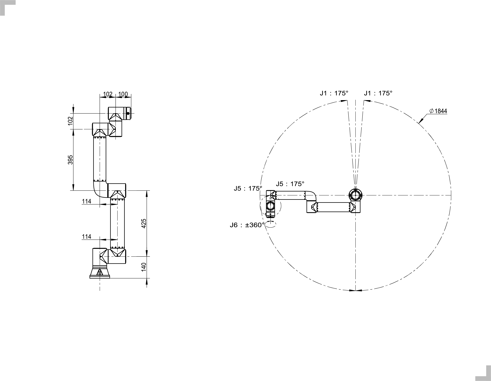
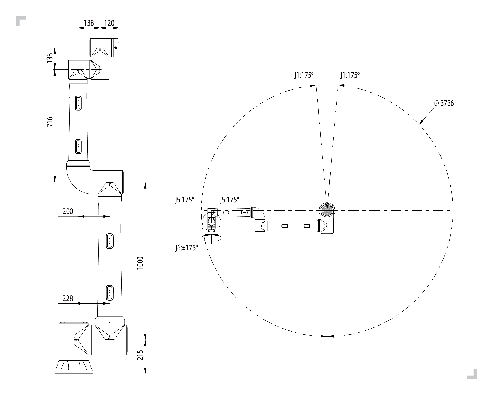
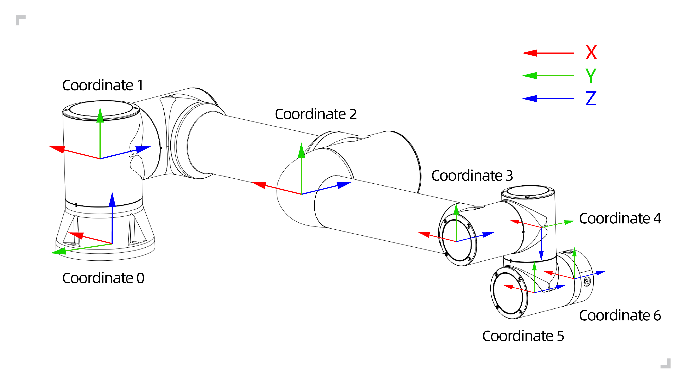
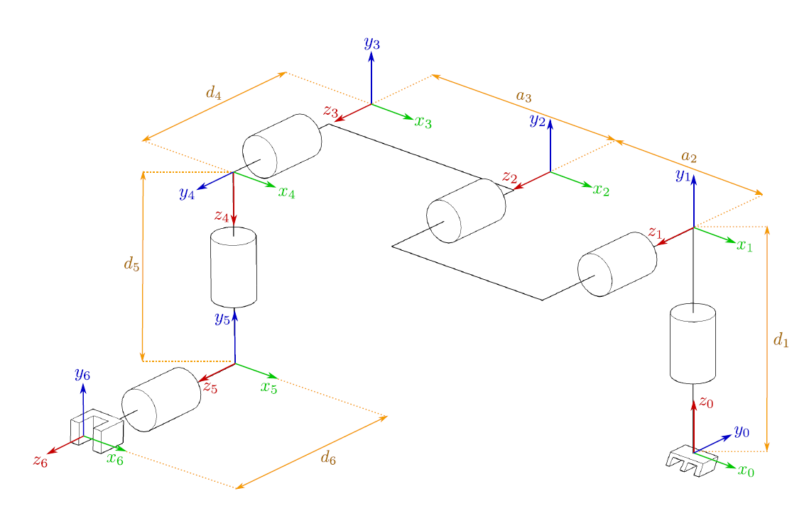

Einführung in den Roboter
=========================

.. toctree::
    :maxdepth: 5

Grundlegende Parameter
----------------------

.. centered:: Tabelle 2.1-1 Grundlegende Roboterparameter

.. figure:: installation/017.png
    :align: center
    :width: 8in

.. figure:: installation/102.png
    :align: center
    :width: 8in

.. important::
  Bei der Berechnung homogener Transformationsmatrizen für Pose- oder Koordinatensystemtransformationen der FR-Roboterserie ist die Drehreihenfolge der Winkel die des beweglichen Koordinatensystems "ZYX".

Bewegungsbereich
----------------

Installationsraum des Roboterarms:

Für die Montage des Roboterkörpers wird ein Raum von 3 m × 3 m × 2 m (Länge × Breite × Höhe) benötigt, um die Bewegung bei maximaler Reichweite des Roboters zu gewährleisten. Wenn der Benutzer selbst eine Endeffektorlast hinzufügt, stellen Sie bitte sicher, dass im Installationsraum ein Abstand von mindestens 500 mm verbleibt.

.. note::
    Der Höhenraum wird durch die Höhe des Montagesockels beeinflusst. Hier bezieht sich 2 m auf den Abstand über der Montagebezugsebene.

Installationsraum des Steuerpults:

1. Das Steuerpult sollte leicht zugänglich und vor Überschwemmungen und Stromschlägen geschützt in einer Höhe von 0,6 m bis 1,5 m über dem Boden platziert werden.

2. Das Gehäuse muss von Wärmequellen ferngehalten werden.

3. Auf der Seite des Schwerlastkabels des Steuerpults sollte ein Abstand von mindestens 150 mm zu Hindernissen eingehalten werden, auf den anderen Seiten mindestens 100 mm, um die Wärmeableitung und das Ein- und Ausstecken zu erleichtern.

.. figure:: installation/018.png
    :align: center
    :width: 6in

.. centered:: Abbildung 2.2-1 Bewegungsbereich des kollaborativen Roboters FR3

.. figure:: installation/103.png
    :align: center
    :width: 6in

.. centered:: Abbildung 2.2-2 Bewegungsbereich des kollaborativen Roboters FR3-WML

.. centered:: Abbildung 2.2-3 Bewegungsbereich des kollaborativen Roboters FR3-WMS

.. figure:: installation/105.png
    :align: center
    :width: 6in

.. centered:: Abbildung 2.2-4 Bewegungsbereich des kollaborativen Roboters FR3-C

.. figure:: installation/019.png
    :align: center
    :width: 6in

.. centered:: Abbildung 2.2-5 Bewegungsbereich des kollaborativen Roboters FR5

.. figure:: installation/129.png
	:align: center
	:width: 6in

.. centered:: Abbildung 2.2-6 FR5-C Modell Kollaborativer Roboter Bewegungsbereich

.. figure:: installation/020.png
    :align: center
    :width: 6in

.. centered:: Abbildung 2.2-7 Bewegungsbereich des kollaborativen Roboters FR10

.. figure:: installation/021.png
    :align: center
    :width: 6in

.. centered:: Abbildung 2.2-8 Bewegungsbereich des kollaborativen Roboters FR16

.. centered:: Abbildung 2.2-9 Bewegungsbereich des kollaborativen Roboters FR20

.. figure:: installation/068.png
    :align: center
    :width: 6in

.. centered:: Abbildung 2.2-10 Bewegungsbereich des kollaborativen Roboters FR30

.. figure:: installation/124.png
    :align: center
    :width: 6in

.. centered:: Abbildung 2.2-11 Bewegungsbereich des kollaborativen Roboters FR30L

Roboter-Koordinatensysteme
---------------------------

.. centered:: Abbildung 2.3-1 DH-Parameter-Koordinatensystem des Roboters

.. figure:: installation/024.png
    :align: center
    :width: 6in

.. centered:: Abbildung 2.3-2 Koordinatensystem des Roboter-Endflansches

DH-Parameter des Roboters
-------------------------

Die DH-Parameter werden zur Berechnung der Kinematik und Dynamik der kollaborativen Roboter der FR-Serie verwendet.

.. centered:: Abbildung 2.4-1 DH-Parameter der kollaborativen Roboter der FR-Serie

Die DH-Parameter der kollaborativen Roboter der FR-Serie sind wie folgt dargestellt:

.. centered:: Tabelle 2.4-1 DH-Parameter des kollaborativen Roboters FR3

.. list-table::
   :widths: 70 50 50 50 50 70 50 120
   :header-rows: 0
   :align: center
   :class: no-padding sheet-center

   * - **Kinematik**
     - **theta[rad]**
     - **a[mm]**
     - **d[mm]**
     - **alpha[rad]**
     - **Dynamik**
     - **Masse[kg]**
     - **Massenschwerpunkt[mm]**

   * - Joint1
     - 0
     - 0
     - 140
     - π/2
     - Link1
     - 1.98
     - [-0.05, -15.92, 2.26]

   * - Joint2
     - 0
     - -280
     - 0
     - 0
     - Link2
     - 3.4445
     - [139.49, 0, 99.54]

   * - Joint3
     - 0
     - -240
     - 0
     - 0
     - Link3
     - 1.437
     - [58.99, 0.08, 12.99]

   * - Joint4
     - 0
     - 0
     - 102
     - π/2
     - Link4
     - 0.871
     - [0.05, -2.33, 14.67]

   * - Joint5
     - 0
     - 0
     - 102
     - -π/2
     - Link5
     - 0.805
     - [-0.05, 2.33, 14.67]

   * - Joint6
     - 0
     - 0
     - 100
     - 0
     - Link6
     - 0.261
     - [-0.05, -1.11, -20.05]

.. centered:: Tabelle 2.4-2 DH-Parameter des kollaborativen Roboters FR3-WMS

.. list-table::
   :widths: 70 50 50 50 50 70 50 120
   :header-rows: 0
   :align: center
   :class: no-padding sheet-center

   * - **Kinematik**
     - **theta[rad]**
     - **a[mm]**
     - **d[mm]**
     - **alpha[rad]**
     - **Dynamik**
     - **Masse[kg]**
     - **Massenschwerpunkt[mm]**

   * - Joint1
     - 0
     - 140
     - 0
     - π/2
     - Link1
     - 1.66
     - [-0.06, -13.58, 1.68]

   * - Joint2
     - 0
     - 0
     - -280
     - 0
     - Link2
     - 3.68
     - [140.11, 0, 101.71]

   * - Joint3
     - 0
     - 0
     - -240
     - 0
     - Link3
     - 1.81
     - [63.49, 0.1, 10.94]

   * - Joint4
     - 0
     - 102
     - 0
     - π/2
     - Link4
     - 1.18
     - [0.07, -2.18, 12.48]

   * - Joint5
     - 0
     - 102
     - 0
     - -π/2
     - Link5
     - 1.18
     - [-0.07, 2.18, 12.48]

   * - Joint6
     - 0
     - 100
     - 0
     - 0
     - Link6
     - 0.28
     - [1.81, 1.33, -20.41]

.. centered:: Tabelle 2.4-3 DH-Parameter des kollaborativen Roboters FR3-WML

.. list-table::
   :widths: 70 50 50 50 50 70 50 120
   :header-rows: 0
   :align: center
   :class: no-padding sheet-center

   * - **Kinematik**
     - **theta[rad]**
     - **a[mm]**
     - **d[mm]**
     - **alpha[rad]**
     - **Dynamik**
     - **Masse[kg]**
     - **Massenschwerpunkt[mm]**

   * - Joint1
     - 0
     - 140
     - 0
     - π/2
     - Link1
     - 1.54
     - [-0.01, -14.27, 1.37]

   * - Joint2
     - 0
     - 0
     - -425
     - 0
     - Link2
     - 3.49
     - [212.5, 0, 101.43]

   * - Joint3
     - 0
     - 0
     - -395
     - 0
     - Link3
     - 2
     - [114.17, 0.08, 9.92]

   * - Joint4
     - 0
     - 102
     - 0
     - π/2
     - Link4
     - 1.17
     - [0.07, -2.18, 12.48]

   * - Joint5
     - 0
     - 102
     - 0
     - -π/2
     - Link5
     - 1.17
     - [-0.07, 2.18, 12.48]

   * - Joint6
     - 0
     - 100
     - 0
     - 0
     - Link6
     - 0.28
     - [1.9, 1.6, -20.08]

.. centered:: Tabelle 2.4-4 DH-Parameter des kollaborativen Roboters FR3-C

.. list-table::
   :widths: 70 50 50 50 50 70 50 120
   :header-rows: 0
   :align: center
   :class: no-padding sheet-center

   * - **Kinematik**
     - **theta[rad]**
     - **a[mm]**
     - **d[mm]**
     - **alpha[rad]**
     - **Dynamik**
     - **Masse[kg]**
     - **Massenschwerpunkt[mm]**

   * - Joint1
     - 0
     - 140
     - 0
     - π/2
     - Link1
     - 1.69
     - [-0.16, -13.99, 1.53]

   * - Joint2
     - 0
     - 0
     - -280
     - 0
     - Link2
     - 3.73
     - [140, 0, 101.34]

   * - Joint3
     - 0
     - 0
     - -240
     - 0
     - Link3
     - 1.84
     - [63.24, 0.08, 11.04]

   * - Joint4
     - 0
     - 102
     - 0
     - π/2
     - Link4
     - 1.2
     - [0.1, -2.03, 12.55]

   * - Joint5
     - 0
     - 102
     - 0
     - -π/2
     - Link5
     - 1.2
     - [-0.1, 2.03, 12.55]

   * - Joint6
     - 0
     - 100
     - 0
     - 0
     - Link6
     - 0.53
     - [1.48, 1.54, -17.9]

.. centered:: Tabelle 2.4-5 DH-Parameter des kollaborativen Roboters FR5

.. list-table::
   :widths: 70 50 50 50 50 70 50 120
   :header-rows: 0
   :align: center
   :class: no-padding sheet-center

   * - **Kinematik**
     - **theta[rad]**
     - **a[mm]**
     - **d[mm]**
     - **alpha[rad]**
     - **Dynamik**
     - **Masse[kg]**
     - **Massenschwerpunkt[mm]**

   * - Joint1
     - 0
     - 0
     - 152
     - π/2
     - Link1
     - 4.64
     - [-0.19, -18.28, 2.26]

   * - Joint2
     - 0
     - -425
     - 0
     - 0
     - Link2
     - 10.08
     - [212.47, 0, 121.2]

   * - Joint3
     - 0
     - -395
     - 0
     - 0
     - Link3
     - 2.71
     - [122.62, 0.17, 12.59]

   * - Joint4
     - 0
     - 0
     - 102
     - π/2
     - Link4
     - 1.56
     - [0.05, -2.33, 14.68]

   * - Joint5
     - 0
     - 0
     - 102
     - -π/2
     - Link5
     - 1.56
     - [-0.05, 2.33, 14.68]

   * - Joint6
     - 0
     - 0
     - 100
     - 0
     - Link6
     - 0.36
     - [0.93, 0.81, -20.05]

.. centered:: Tabelle 2.4-6 DH-Parameter des kollaborativen Roboters FR5-C

.. list-table::
   :widths: 70 50 50 50 50 70 50 120
   :header-rows: 0
   :align: center
   :class: no-padding sheet-center

   * - **Kinematik**
     - **theta[rad]**
     - **a[mm]**
     - **d[mm]**
     - **alpha[rad]**
     - **Dynamik**
     - **Masse[kg]**
     - **Massenmittelpunkt[mm]**

   * - Gelenk1
     - 0
     - 0
     - 140
     - π/2
     - Verbindung1
     - 1.76
     - [-0.09, -15.66, 1.53]

   * - Gelenk2
     - 0
     - -280
     - 0
     - 0
     - Verbindung2
     - 3.98
     - [211.32, 0, 101.13]

   * - Gelenk3
     - 0
     - -240
     - 0
     - 0
     - Verbindung3
     - 2.08
     - [102.62, 0.12, 11.26]

   * - Gelenk4
     - 0
     - 0
     - 102
     - π/2
     - Verbindung4
     - 1.33
     - [0.09, -1.86, 13.76]

   * - Gelenk5
     - 0
     - 0
     - 102
     - -π/2
     - Verbindung5
     - 1.33
     - [-0.09, 1.86, 13.76]

   * - Gelenk6
     - 0
     - 0
     - 100
     - 0
     - Verbindung6
     - 0.28
     - [-0.26, 1.75, -20.50]

.. centered:: Tabelle 2.4-7 DH-Parameter des kollaborativen Roboters FR5-WML

.. list-table::
   :widths: 70 50 50 50 50 70 50 120
   :header-rows: 0
   :align: center
   :class: no-padding sheet-center

   * - **Kinematik**
     - **theta[rad]**
     - **a[mm]**
     - **d[mm]**
     - **alpha[rad]**
     - **Dynamik**
     - **Masse[kg]**
     - **Massenschwerpunkt[mm]**

   * - Joint1
     - 0
     - 180
     - 0
     - π/2
     - Link1
     - 11.49
     - [-0.16, -28.51, 4.16]

   * - Joint2
     - 0
     - 0
     - -970
     - 0
     - Link2
     - 21.3
     - [642.59, 0.04, 165.62]

   * - Joint3
     - 0
     - 0
     - -816
     - 0
     - Link3
     - 4.61
     - [321.39, 0.16, 52.76]

   * - Joint4
     - 0
     - 159
     - 0
     - π/2
     - Link4
     - 1.66
     - [0.21, -3.06, 13.07]

   * - Joint5
     - 0
     - 114
     - 0
     - -π/2
     - Link5
     - 1.66
     - [-0.21, 3.06, 13.07]

   * - Joint6
     - 0
     - 160
     - 0
     - 0
     - Link6
     - 0.36
     - [1.45, 1.09, -19.98]

.. centered:: Tabelle 2.4-8 DH-Parameter des kollaborativen Roboters FR10

.. list-table::
   :widths: 70 50 50 50 50 70 50 120
   :header-rows: 0
   :align: center
   :class: no-padding sheet-center

   * - **Kinematik**
     - **theta[rad]**
     - **a[mm]**
     - **d[mm]**
     - **alpha[rad]**
     - **Dynamik**
     - **Masse[kg]**
     - **Massenschwerpunkt[mm]**

   * - Joint1
     - 0
     - 0
     - 180
     - π/2
     - Link1
     - 11.97
     - [-0.10, -26.12, 4.04]

   * - Joint2
     - 0
     - -700
     - 0
     - 0
     - Link2
     - 19.59
     - [480.27, 0.01, 164.68]

   * - Joint3
     - 0
     - -586
     - 0
     - 0
     - Link3
     - 3.7
     - [211.22, 0.11, 54.21]

   * - Joint4
     - 0
     - 0
     - 159
     - π/2
     - Link4
     - 1.69
     - [0.12, -3, 12.18]

   * - Joint5
     - 0
     - 0
     - 114
     - -π/2
     - Link5
     - 1.69
     - [-0.12, 3, 12.18]

   * - Joint6
     - 0
     - 0
     - 106
     - 0
     - Link6
     - 0.35
     - [1.24, 0.85, -20.34]

.. centered:: Tabelle 2.4-9 DH-Parameter des kollaborativen Roboters FR16

.. list-table::
   :widths: 70 50 50 50 50 70 50 120
   :header-rows: 0
   :align: center
   :class: no-padding sheet-center

   * - **Kinematik**
     - **theta[rad]**
     - **a[mm]**
     - **d[mm]**
     - **alpha[rad]**
     - **Dynamik**
     - **Masse[kg]**
     - **Massenschwerpunkt[mm]**

   * - Joint1
     - 0
     - 0
     - 180
     - π/2
     - Link1
     - 11.97
     - [-0.10, -26.12, 4.04]

   * - Joint2
     - 0
     - -520
     - 0
     - 0
     - Link2
     - 18.18
     - [364.4, 0.01, 163.09]

   * - Joint3
     - 0
     - -400
     - 0
     - 0
     - Link3
     - 3.22
     - [135.03, 0.12, 55.58]

   * - Joint4
     - 0
     - 0
     - 159
     - π/2
     - Link4
     - 1.69
     - [0.12, -3, 12.18]

   * - Joint5
     - 0
     - 0
     - 114
     - -π/2
     - Link5
     - 1.69
     - [-0.12, 3, 12.18]

   * - Joint6
     - 0
     - 0
     - 106
     - 0
     - Link6
     - 0.35
     - [1.24, 0.85, -20.34]

.. centered:: Tabelle 2.4-10 DH-Parameter des kollaborativen Roboters FR20

.. list-table::
   :widths: 70 50 50 50 50 70 50 120
   :header-rows: 0
   :align: center
   :class: no-padding sheet-center

   * - **Kinematik**
     - **theta[rad]**
     - **a[mm]**
     - **d[mm]**
     - **alpha[rad]**
     - **Dynamik**
     - **Masse[kg]**
     - **Massenschwerpunkt[mm]**

   * - Joint1
     - 0
     - 0
     - 215
     - π/2
     - Link1
     - 20.79
     - [-0.19, -36.57, 5.68]

   * - Joint2
     - 0
     - -1000
     - 0
     - 0
     - Link2
     - 42.84
     - [605.25, 0.06, 202.94]

   * - Joint3
     - 0
     - -716
     - 0
     - 0
     - Link3
     - 9.88
     - [262.84, 0.22, 43.08]

   * - Joint4
     - 0
     - 0
     - 166
     - π/2
     - Link4
     - 4.64
     - [0.23, -2.28, 18.42]

   * - Joint5
     - 0
     - 0
     - 138
     - -π/2
     - Link5
     - 4.64
     - [-0.23, 2.28, 18.42]

   * - Joint6
     - 0
     - 0
     - 120
     - 0
     - Link6
     - 0.6
     - [-2.11, -1.96, -20.38]

.. centered:: Tabelle 2.4-11 DH-Parameter des kollaborativen Roboters FR30

.. list-table::
   :widths: 70 50 50 50 50 70 50 120
   :header-rows: 0
   :align: center
   :class: no-padding sheet-center

   * - **Kinematik**
     - **theta[rad]**
     - **a[mm]**
     - **d[mm]**
     - **alpha[rad]**
     - **Dynamik**
     - **Masse[kg]**
     - **Massenschwerpunkt[mm]**

   * - Joint1
     - 0
     - 0
     - 215
     - π/2
     - Link1
     - 20.64
     - [-0.22, -37.39, 5.59]

   * - Joint2
     - 0
     - -700
     - 0
     - 0
     - Link2
     - 36.37
     - [440.73, 0.05, 198.7]

   * - Joint3
     - 0
     - -536
     - 0
     - 0
     - Link3
     - 8.41
     - [185.64, 0.25, 45.82]

   * - Joint4
     - 0
     - 0
     - 166
     - π/2
     - Link4
     - 4.64
     - [0.23, -2.29, 18.60]

   * - Joint5
     - 0
     - 0
     - 138
     - -π/2
     - Link5
     - 4.64
     - [-0.23, 2.29, 18.60]

   * - Joint6
     - 0
     - 0
     - 120
     - 0
     - Link6
     - 0.6
     - [-2.11, -1.96, -20.38]

.. centered:: Tabelle 2.4-12 DH-Parameter des kollaborativen Roboters FR30L

.. list-table::
   :widths: 70 50 50 50 50 70 50 120
   :header-rows: 0
   :align: center
   :class: no-padding sheet-center

   * - **Kinematik**
     - **theta[rad]**
     - **a[mm]**
     - **d[mm]**
     - **alpha[rad]**
     - **Dynamik**
     - **Masse[kg]**
     - **Massenschwerpunkt[mm]**

   * - Joint1
     - 0
     - 0
     - 215
     - π/2
     - Link1
     - 27.85
     - [-0.18, -26.29, 14.57]

   * - Joint2
     - 0
     - -1000
     - 0
     - 0
     - Link2
     - 50.43
     - [580.62, 0.04, 223.34]

   * - Joint3
     - 0
     - -716
     - 0
     - 0
     - Link3
     - 9.88
     - [262.84, 0.22, 43.08]

   * - Joint4
     - 0
     - 0
     - 166
     - π/2
     - Link4
     - 4.64
     - [0.23, -2.28, 18.42]

   * - Joint5
     - 0
     - 0
     - 138
     - -π/2
     - Link5
     - 4.64
     - [-0.23, 2.28, 18.42]

   * - Joint6
     - 0
     - 0
     - 120
     - 0
     - Link6
     - 0.6
     - [-2.11, -1.96, -20.38]

DH-Parametertabelle
---------------------------------
        :download:`FAIRINO Kollaborative Roboter - DH-Parametertabelle <../_static/_doc/FR Robots DH Transformation.xlsx>`