Peripheriegeräte
=====================

.. toctree::
  :maxdepth: 5

Benutzerdefiniertes offenes Protokoll für die Flanschseite (Lua)
------------------------------------------------------------------------------

Überblick
~~~~~~~~~~~~~~~~~~

An der Flanschseite des Roboters sind Hardwareschnittstellen für den Anschluss von Peripheriegeräten mit 485-Kommunikation vorhanden. Derzeit unterstützte Peripheriegeräte umfassen Greifer, Drehgreifer, Kraftsensoren, Schweißgriffe usw. Alle diese Flanschgeräte können durch das Schreiben eines offenen Lua-Protokolls angepasst werden, um die Peripherie zu steuern und ihren Status abzurufen. Insbesondere für den SmartTool-Schweißgriff können Benutzer auch wählen, die Tastenfunktionen über eine Webseite zu konfigurieren, um automatisch eine offene Protokolldatei zu generieren. Das generierte Protokoll wird automatisch auf die Flanschseite angewendet.

Vorgehen
~~~~~~~~~~~

**Schritt 1**: Gehen Sie zu Systemeinstellungen -> Über -> Firmware-Upgrade-Oberfläche, wählen Sie die Flansch-Firmware-Datei (.bin) aus und führen Sie ein Upgrade der Flansch-Firmware durch.

.. important::
   Zuerst muss überprüft werden, ob die Flansch-Firmware-Version FV2.010.06 oder höher ist. Wenn die Version nicht ausreicht, muss die entsprechende Software-Firmware aktualisiert werden; andernfalls ist kein Firmware-Upgrade erforderlich.

   Bevor Sie das Flansch-Firmware-Upgrade-Paket hochladen, müssen Sie den Roboter zuerst deaktivieren (Enable entfernen) und dann in den Boot-Modus versetzen.

.. figure:: robot_peripherals/001.png
   :align: center
   :width: 6in

.. centered:: Abbildung 8.1‑1 Flansch-Firmware aktualisieren

**Schritt 2**: Öffnen Sie die WebApp, klicken Sie nacheinander auf "Initiale Einstellungen", "Peripherie" und wählen Sie die zu konfigurierende Flanschperipherie (z. B. Greifer). Es gibt zwei Steuerungstypen für Peripheriegeräte: "Bereits angepasste Geräte" und "Offenes Peripherieprotokoll":

- **Bereits angepasste Geräte**: Die Kommunikation erfolgt über die Robotersteuerung, kein Hochladen und Anwenden erforderlich.
- **Offenes Peripherieprotokoll**: Der Benutzer schreibt ein offenes Flanschprotokoll basierend auf Lua, das angepasst werden muss, um die Kommunikationssteuerung zu realisieren. Die Flanschprotokolle werden in zwei Kategorien unterteilt: eine sind vom Benutzer selbst hochgeladene Protokolle, die andere sind vom Roboter voreingestellte integrierte Protokolle. Ab Version 3.9.2 müssen Benutzer das auf die Flanschseite hochzuladende Lua-Protokoll nicht mehr mit zusätzlicher Software überprüfen und verschlüsseln; sie können es direkt hochladen. Zuvor überprüfte und verschlüsselte Protokolle können weiterhin normal hochgeladen und verwendet werden. Der Roboter erkennt automatisch, ob die Datei überprüft und verschlüsselt wurde. Wenn nicht, wird sie überprüft, verschlüsselt und dann auf die Flanschseite hochgeladen und angewendet; wenn sie bereits verschlüsselt ist, wird sie direkt hochgeladen und auf die Flanschseite angewendet.

.. figure:: robot_peripherals/002.png
   :align: center
   :width: 6in

.. centered:: Abbildung 8.1‑2 Steuerungstyp für Greifer

**Schritt 3**: Gehen Sie zur Inhaltsoberfläche von Peripherie -> Greifer/Kraftsensor/Schweißgriff, klicken Sie auf die Karte "Benutzerdefiniertes Protokoll", um zur Oberfläche zu gelangen. Laden Sie das offene Lua-Flanschprotokoll hoch, wählen Sie das gewünschte Lua-Flanschprotokoll aus und führen Sie den Upload-Vorgang durch.

.. important::
   Der Dateiname für den Upload muss mit `AXLE_LUA_` beginnen.

**Schritt 4**: Konfigurieren Sie die Flansch-Kommunikationsparameter. Diese umfassen Baudrate, Datenbits, Stoppbits usw. Nach der Konfiguration klicken Sie auf die Schaltfläche "Konfigurieren".

.. figure:: robot_peripherals/003.png
   :align: center
   :width: 4in

.. centered:: Abbildung 8.1‑3 Flansch-Kommunikationsparameter konfigurieren

Die detaillierten Flansch-Kommunikationsparameter sind wie folgt:

- **Baudrate**: Unterstützt 1-9600, 2-14400, 3-19200, 4-38400, 5-56000, 6-67600, 7-115200, 8-128000. Der RS485-Treiberchip an der Flanschseite ist ein Low-Speed-485, die Baudrate darf 200 k nicht überschreiten.
- **Datenbits**: Unterstützt (8,9), üblich ist 8.
- **Stoppbits**: 1-1, 2-0,5, 3-2, 4-1,5, üblich ist 1.
- **Parität**: 0-Keine, 1-Ungerade, 2-Gerade, üblich ist 0.
- **Timeout**: 1~1000 ms, dieser Wert muss in Verbindung mit der Peripherie sinnvoll eingestellt werden.
- **Timeout-Anzahl**: 1~10, dient hauptsächlich zur Wiederholung bei Zeitüberschreitung, um sporadische Anomalien zu reduzieren und die Benutzererfahrung zu verbessern.
- **Zyklischer Befehlsintervall**: 1~1000 ms, hauptsächlich für das Zeitintervall zwischen der Übermittlung zyklischer Befehle.

**Schritt 5**: Aktivieren Sie das Flansch-Lua. Klicken Sie auf die Schaltfläche "Aktivieren".

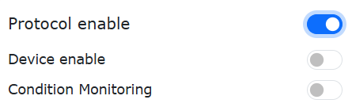

.. centered:: Abbildung 8.1‑4 Flansch-Lua aktivieren

Wenn die Lua-Datei eine Anomalie aufweist, wird die Warnung "Flansch-Lua-Datei anomal" angezeigt. Es kann mit "Nicht wiederherstellen/Wiederherstellen" umgegangen werden. Schalten Sie die Lua-Aktivierungsschaltfläche aus, die Warnung erlischt.

.. figure:: robot_peripherals/005.png
   :align: center
   :width: 4in

.. centered:: Abbildung 8.1‑5 Lua-Datei anomal

Wenn der Gerätetyp Greifer ist, kann eine Statusüberwachung durchgeführt werden.

**"Statusüberwachung" einschalten**: Die Greifer-Statusleiste auf der rechten Seite zeigt in Echtzeit Betriebsinformationen wie Geschwindigkeit, Drehmoment und Position des Greifers an.

**"Statusüberwachung" ausschalten**: Die Greifer-Datenstatusleiste auf der rechten Seite wird geschlossen.

.. figure:: robot_peripherals/006.png
   :align: center
   :width: 6in

.. centered:: Abbildung 8.1‑6 Statusüberwachung

Greifer
-------------------

In der Oberfläche "Initiale Einstellungen" -> "Peripherie" -> "Greifer" können Greifer derzeit über "Bereits angepasste Geräte" und das "Benutzerdefinierte offene Flansch-Lua-Protokoll" verwendet werden.

Bereits angepasste Geräte
~~~~~~~~~~~~~~~~~~~~~~~~~~~~~~~~~~~

**Schritt 1**: Klicken Sie auf "Bereits angepasste Geräte", um zur Konfigurationsoberfläche für die Flanschperipherie zu gelangen. Die Konfigurationsinformationen für den Greifer umfassen Greiferhersteller, Greifertyp, Softwareversion und Montageposition. Der Benutzer kann die entsprechenden Greiferinformationen je nach spezifischem Produktionsbedarf konfigurieren. Wenn der Benutzer die Konfiguration ändern muss, kann er zuerst die entsprechende Greifernummer auswählen, auf die Schaltfläche "Löschen" klicken, um die entsprechende Schaltfläche zu löschen, und dann je nach Bedarf neu konfigurieren.

.. figure:: robot_peripherals/007.png
   :align: center
   :width: 4in

.. centered:: Abbildung 8.2‑1 Greifer konfigurieren

.. important::
   Bevor Sie auf "Konfiguration löschen" klicken, sollte sich der entsprechende Greifer im deaktivierten Zustand befinden.

**Schritt 2**: Nach Abschluss der Greiferkonfiguration kann der Benutzer die entsprechenden Greiferinformationen in der Greiferinformationstabelle unten auf der Seite einsehen. Wenn ein Konfigurationsfehler festgestellt wird, kann er auf die Schaltfläche "Löschen" klicken und den Greifer neu konfigurieren.

.. figure:: robot_peripherals/008.png
   :align: center
   :width: 4in

.. centered:: Abbildung 8.2‑2 Greiferkonfigurationsinformationen

**Schritt 3**: Wählen Sie den konfigurierten Greifer aus, klicken Sie auf die Schaltfläche "Reset". Nachdem auf der Seite der erfolgreiche Befehlssendevorgang angezeigt wurde, klicken Sie auf die Schaltfläche "Aktivieren". Überprüfen Sie den Aktivierungsstatus in der Greiferinformationstabelle, um festzustellen, ob die Aktivierung erfolgreich war.

.. important::
   Beim Aktivieren des Greifers darf dieser kein Objekt halten.

**Schritt 4**: Wählen Sie in der Programmierbefehlsoberfläche den Befehl "Gripper". In der Greiferbefehlsoberfläche kann der Benutzer die zu steuernde Greifernummer auswählen (die konfigurierten und aktivierten Greifer), den entsprechenden Öffnungs-/Schließzustand, die Öffnungs-/Schließgeschwindigkeit, das Öffnungs-/Schließmoment und die maximale Wartezeit für die Greiferaktion einstellen. Nach der Einstellung kann auf "Hinzufügen" und "Anwenden" geklickt werden. Darüber hinaus können Greiferaktivierungs- und Rücksetzbefehle hinzugefügt werden, um den Greifer während der Programmausführung zu aktivieren/zurückzusetzen.

.. figure:: robot_peripherals/009.png
   :align: center
   :width: 6in

.. centered:: Abbildung 8.2‑3 Greiferbefehl bearbeiten

Greifer-Programmierung (Teach)
+++++++++++++++++++++++++++++++++

.. list-table::
   :widths: 15 40 100
   :header-rows: 1

   * - Nr.
     - Befehlsformat
     - Kommentar
   * - 1
     - PTP(template2,100,-1,0)
     - #Auf Greifpunkt warten
   * - 2
     - PTP(template1,100,-1,0)
     - #Greifpunkt
   * - 3
     - MoveGripper(1,255,255,0,1000,0)
     - #Greifer schließen
   * - 4
     - PTP(template2,100,-1,0)
     - /
   * - 5
     - PTP(template3,100,-1,0)
     - #Auf Ablegepunkt warten
   * - 6
     - PTP(template3,100,-1,0)
     - #Ablegepunkt
   * - 7
     - MoveGripper(1,0,255,0,1000,0)
     - #Greifer öffnen

Konfiguration des Greifer-Lua-Flanschprotokolls
~~~~~~~~~~~~~~~~~~~~~~~~~~~~~~~~~~~~~~~~~~~~~~~~~~~~~~~~~~~~~~~~~~~~~~~~~~~~~~~~~~

Öffnen Sie die WebApp, klicken Sie nacheinander auf "Initiale Einstellungen", "Peripherie", "Greifer", "Benutzerdefiniertes Protokoll". Klicken Sie auf "Protokollverwaltung", um die Konfiguration des Flanschprotokolls durchzuführen.

Der vom Benutzer hochgeladene Dateiname muss mit "AXLE_LUA_End" beginnen. Nach dem Hochladen wird der Protokollname in der Liste mit "Custom_End" beginnen. Diese Art von Protokollen kann heruntergeladen und gelöscht werden. Dateien mit demselben Namen, die vom Benutzer hochgeladen werden, überschreiben automatisch das neueste Lua.

.. figure:: robot_peripherals/277.png
   :align: center
   :width: 4in

.. centered:: Abbildung 8.2‑4-1 Hochladen eines benutzerdefinierten Greiferprotokolls

Die vom Roboter voreingestellten und eingebetteten Protokolle haben das Präfix `End_` und können nur heruntergeladen, nicht gelöscht werden. Die eingebetteten Protokolle für Greifer (Drehgreifer, Sauggreifer) sind in der folgenden Abbildung dargestellt.

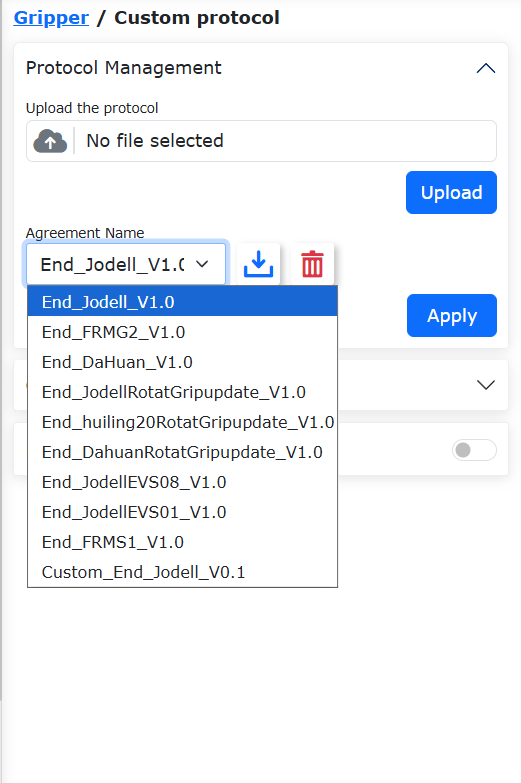

.. centered:: Abbildung 8.2‑4-2 Voreingestellte eingebettete Protokolle für Greifer (Drehgreifer, Sauggreifer)

Nachdem sichergestellt wurde, dass das ausgewählte Protokoll korrekt ist, kann der Roboter deaktiviert (Enable entfernen) und das offene Protokoll angewendet werden. Nach dem Anwenden wechselt der Roboter automatisch in den Boot-Modus und wendet das ausgewählte Protokoll auf die Flanschseite an. Wenn die Seite "Upgrade erfolgreich, bitte Steuerschrank neu starten" anzeigt, kann der Steuerschrank neu gestartet werden.

.. figure:: robot_peripherals/279.png
   :align: center
   :width: 6in

.. centered:: Abbildung 8.2‑4-3 Anwenden des offenen Flanschprotokolls auf die Flanschplatine

Nach dem Neustart und dem Zugriff auf die WebApp-Seite wird der Name des aktuell angewendeten Protokolls angezeigt. Nachdem das Flanschprotokoll aktiviert und das Gerät aktiviert wurde, beginnt das Flanschprotokoll zu laufen. Die Geräte-ID ist die Modbus-Slave-Adresse der Flanschperipherie und muss mit dem Inhalt des Protokolls abgestimmt werden.

.. figure:: robot_peripherals/280.png
   :align: center
   :width: 4in

.. centered:: Abbildung 8.2‑4-4 Anzeige und Aktivierung der Greifer-Flanschprotokollkonfiguration

Die Flanschplatine überprüft das hochgeladene Lua-Protokoll. Wenn die Lua-Datei eine Anomalie aufweist, wird die Warnung "Flansch-Lua-Datei anomal" angezeigt. Es kann mit "Nicht wiederherstellen/Wiederherstellen" umgegangen werden. Schalten Sie die Lua-Aktivierungsschaltfläche aus, die Warnung erlischt.

.. figure:: robot_peripherals/005.png
   :align: center
   :width: 4in

.. centered:: Abbildung 8.2‑4-5 Anzeige und Aktivierung der Greifer-Flanschprotokollkonfiguration

Beispiel für ein Greifer-Lua-Flanschprotokoll
++++++++++++++++++++++++++++++++++++++++++++++++++++++++++++++++++++++++++++++++

.. code-block:: lua

  function Getbit(X,Bit)-- Getbit(), Funktion zum Extrahieren eines Bits aus einem Byte. Parameter: X: das Byte, aus dem das Bit extrahiert werden soll; Bit: das zu extrahierende Bit (0-7)
  return ((X&(1<<Bit))>>Bit)
  end

  function GetOneByte(U32)-- GetOneByte(), extrahiert aus Daten wie 0x1234 das niederwertige Byte, Rückgabewert ist 0x34
  return ((U32>>0)&0xFF)
  end

  function GetTwoByte(U32)-- GetTwoByte(), extrahiert aus Daten wie 0x1234 das höherwertige Byte, Rückgabewert ist 0x12
  return ((U32>>8)&0xFF)
  end
  function GetThreeByte(U32)-- GetThreeByte(), extrahiert aus Daten wie 0x56781234 das Byte, Rückgabewert ist 0x78
  return ((U32>>16)&0xFF)
  end
  function GetFourByte(U32)-- GetFourByte(), extrahiert aus Daten wie 0x56781234 das Byte, Rückgabewert ist 0x56
  return ((U32>>24)&0xFF)
  end
  X,Speed,Torque=0,0,0
  while(1)
  do
  IwdgTaskHandle()
  MainLoop()
  UpDownLoadHandle()
  SdoRwPara()
  EndErrClear()
  local BFlag=LuaBreak()
  if(BFlag==1)then
  break
  end-- Hier bis zum Dateiende LuaGc(), end ist feste Verwendung

  T1={0x01,0x06,0x03,0xE8,0x00,0x09,0xC9,0xBC}-- Greiferbefehle eintragen (Modbus RTU Befehle). T1-T5 sind nacheinander: Greifer-Ausführungsbefehl, Greifer-Initialisierungsbefehl, Greifer-Positionsbefehl, Greifer-Geschwindigkeitsbefehl, Greifer-Drehmomentbefehl.
  --/Befehlsanalyse: T1[1]=0X01, Greiferadresse; T1[2]=0x06, Funktionscode "Einzelnes Halteregister schreiben"; T1[3],T1[4]: 0x03,0xE8, Adresse des Registers, das der Ausführungsbefehl manipulieren soll; T1[5],T1[6]: 0x00,0x09, in das Register zu schreibende Daten; T1[7],T1[8]: 0xC9,0xBC, CRC-Prüfsumme, muss gemäß Greiferhandbuch geändert werden.
  T2={}
  T3={}
  T4={}
  T5={}

  T7={0x01,0x03,0x07,0xD0,0x00,0x01,0x84,0x87}-- T7-T12, Greiferstatus-Lesebefehle. Nacheinander: Greiferstatus lesen, Greiferinitialisierung lesen, Greiferfehlercode lesen, Greiferposition lesen, Greifergeschwindigkeit lesen, Greiferdrehmoment lesen.
  T8={}
  T9={}
  T10={}
  T11={}
  T12={}
  Rcmd1,Rcmd2,Rcmd3,Rcmd4=GetGripCmd()-- Feste Verwendung, muss nicht geändert werden. Rcmd2 ist die von der Steuerung übergebene Greiferadresse, Rcmd4 sind die von der Steuerung übergebenen Daten.
  if(Rcmd1==1) then
  T1[1]=Rcmd2
  T2[1]=Rcmd2
  T3[1]=Rcmd2
  T4[1]=Rcmd2
  T5[1]=Rcmd2

  T7[1]=Rcmd2
  T8[1]=Rcmd2
  T9[1]=Rcmd2
  T10[1]=Rcmd2
  T11[1]=Rcmd2
  T12[1]=Rcmd2                    --**Greiferadresse aktualisieren
  if (Rcmd3==1) then              --Greifer-Ausführungsbefehl
  T1[7],T1[8]=CrcValue(T1[1],T1[2],T1[3],T1[4],T1[5],T1[6])--CRC-Wert für Modbus RTU Befehl berechnen, zwei Bytes.
  EndTxGripData(T1[1],T1[2],T1[3],T1[4],T1[5],T1[6],T1[7],T1[8])--Flanschseite sendet Befehl an Greifer.
  DelayMs(10)                                                   --10 ms verzögern.
  A,Rxd1,Rxd2,Rxd3,Rxd4,Rxd5,Rxd6,Rxd7=EndRxGripData()--Flanschseite gibt die vom Greifer empfangenen Rückmeldedaten an Lua zurück. Der genaue Inhalt der Rückmeldung ist dem Greiferhandbuch zu entnehmen.
  GripStateBack(Rxd3)
  end
  if (Rcmd3==2) then
  T2[7],T2[8]=CrcValue(T2[1],T2[2],T2[3],T2[4],T2[5],T2[6])
  EndTxGripData(T2[1],T2[2],T2[3],T2[4],T2[5],T2[6],T2[7],T2[8])
  DelayMs(10)
  A,Rxd1,Rxd2,Rxd3,Rxd4,Rxd5,Rxd6,Rxd7=EndRxGripData()
  GripStateBack(Rxd3)
  end
  if(Rcmd3==3) then
  X=Rcmd4
  T3[5]=0x00
  T3[6]=X
  T3[7],T3[8]=CrcValue(T3[1],T3[2],T3[3],T3[4],T3[5],T3[6])
  EndTxGripData(T3[1],T3[2],T3[3],T3[4],T3[5],T3[6],T3[7],T3[8])
  DelayMs(10)
  A,Rxd1,Rxd2,Rxd3,Rxd4,Rxd5,Rxd6,Rxd7=EndRxGripData()
  GripStateBack(Rxd3)
  end
  if (Rcmd3==4) then
  Speed=Rcmd4
  T4[5]=Torque
  T4[6]=Speed
  T4[7],T4[8]=CrcValue(T4[1],T4[2],T4[3],T4[4],T4[5],T4[6])
  EndTxGripData(T4[1],T4[2],T4[3],T4[4],T4[5],T4[6],T4[7],T4[8])
  DelayMs(10)
  A,Rxd1,Rxd2,Rxd3,Rxd4,Rxd5,Rxd6,Rxd7=EndRxGripData()
  GripStateBack(Rxd3)
  end
  if(Rcmd3==5) then
  Torque=Rcmd4
  T5[5]=Torque
  T5[6]=Speed
  T5[7],T5[8]=CrcValue(T5[1],T5[2],T5[3],T5[4],T5[5],T5[6])
  EndTxGripData(T5[1],T5[2],T5[3],T5[4],T5[5],T5[6],T5[7],T5[8])
  DelayMs(10)
  A,Rxd1,Rxd2,Rxd3,Rxd4,Rxd5,Rxd6,Rxd7=EndRxGripData()
  GripStateBack(Rxd3)
  end
  if(Rcmd3 == 7) then
  T7[7],T7[8]=CrcValue(T7[1],T7[2],T7[3],T7[4],T7[5],T7[6])
  EndTxGripData(T7[1],T7[2],T7[3],T7[4],T7[5],T7[6],T7[7],T7[8])
  DelayMs(10)
  A,Rxd1,Rxd2,Rxd3,Rxd4,Rxd5,Rxd6,Rxd7=EndRxGripData()
  RxdCrcH,RxdCrcL = CrcValue(Rxd1,Rxd2,Rxd3,Rxd4,Rxd5)
  if((A==8)and(Rxd1==Rcmd2)and(Rxd2==0x03)and(Rxd3==0x02)and(Rxd6==RxdCrcH)and(Rxd7==RxdCrcL))then
  GripStateBack(Rxd4)
  end
  end
  if(Rcmd3==8) then
  T8[7],T8[8]=CrcValue(T8[1],T8[2],T8[3],T8[4],T8[5],T8[6])
  EndTxGripData(T8[1],T8[2],T8[3],T8[4],T8[5],T8[6],T8[7],T8[8])
  DelayMs(10)
  A,Rxd1,Rxd2,Rxd3,Rxd4,Rxd5,Rxd6,Rxd7=EndRxGripData()
  RxdCrcH,RxdCrcL = CrcValue(Rxd1,Rxd2,Rxd3,Rxd4,Rxd5)
  if((A==8)and(Rxd1==Rcmd2)and(Rxd2==0x03)and(Rxd3==0x02)and(Rxd6==RxdCrcH)and(Rxd7 ==RxdCrcL)) then
  GripStateBack(Rxd5)
  end
  end
  if(Rcmd3 == 9) then
  T9[7],T9[8]=CrcValue(T9[1],T9[2],T9[3],T9[4],T9[5],T9[6])
  EndTxGripData(T9[1],T9[2],T9[3],T9[4],T9[5],T9[6],T9[7],T9[8])
  DelayMs(10)
  A,Rxd1,Rxd2,Rxd3,Rxd4,Rxd5,Rxd6,Rxd7=EndRxGripData()
  RxdCrcH,RxdCrcL = CrcValue(Rxd1,Rxd2,Rxd3,Rxd4,Rxd5)
  if((A==8)and(Rxd1==Rcmd2)and(Rxd2==0x03)and(Rxd3==0x02)and(Rxd6==RxdCrcH)and(Rxd7==RxdCrcL)) then
  GripStateBack(Rxd5)
  end
  end
  if(Rcmd3 == 10) then
  T10[7],T10[8]=CrcValue(T10[1],T10[2],T10[3],T10[4],T10[5],T10[6])
  EndTxGripData(T10[1],T10[2],T10[3],T10[4],T10[5],T10[6],T10[7],T10[8])
  DelayMs(10)
  A,Rxd1,Rxd2,Rxd3,Rxd4,Rxd5,Rxd6,Rxd7=EndRxGripData()
  RxdCrcH,RxdCrcL = CrcValue(Rxd1,Rxd2,Rxd3,Rxd4,Rxd5)
  if((A==8)and(Rxd1==Rcmd2)and(Rxd2==0x03)and(Rxd3==0x02)and(Rxd6==RxdCrcH)and(Rxd7==RxdCrcL)) then
  GripStateBack(Rxd4)
  end
  end
  if(Rcmd3 == 11) then
  T11[7],T11[8]=CrcValue(T11[1],T11[2],T11[3],T11[4],T11[5],T11[6])
  EndTxGripData(T11[1],T11[2],T11[3],T11[4],T11[5],T11[6],T11[7],T11[8])
  DelayMs(10)
  A,Rxd1,Rxd2,Rxd3,Rxd4,Rxd5,Rxd6,Rxd7=EndRxGripData()
  RxdCrcH,RxdCrcL = CrcValue(Rxd1,Rxd2,Rxd3,Rxd4,Rxd5)
  if((A==8)and(Rxd1==Rcmd2)and(Rxd2==0x03)and(Rxd3==0x02)and(Rxd6==RxdCrcH)and(Rxd7==RxdCrcL)) then
  GripStateBack(Rxd5)
  end
  end
  if(Rcmd3 == 12) then
  T12[7],T12[8]=CrcValue(T12[1],T12[2],T12[3],T12[4],T12[5],T12[6])
  EndTxGripData(T12[1],T12[2],T12[3],T12[4],T12[5],T12[6],T12[7],T12[8])
  DelayMs(10)
  A,Rxd1,Rxd2,Rxd3,Rxd4,Rxd5,Rxd6,Rxd7=EndRxGripData()
  RxdCrcH,RxdCrcL = CrcValue(Rxd1,Rxd2,Rxd3,Rxd4,Rxd5)
  if((A==8)and(Rxd1==Rcmd2)and(Rxd2==0x03)and(Rxd3==0x02)and(Rxd6==RxdCrcH)and(Rxd7==RxdCrcL)) then
  GripStateBack(Rxd4)
  end
  end
  end
  LuaGc()
  end

Geräteaktivierung
+++++++++++++++++++++++++++++

**Schritt 1**: Greifer aktivieren -> Greifer-ID auswählen -> die zum Greifer passenden Funktionscodes auswählen -> auf Konfigurieren klicken. In den konfigurierten Geräten werden die ID und die Funktionscodes des Greifers angezeigt.

.. figure:: robot_peripherals/010.png
   :align: center
   :width: 4in

.. centered:: Abbildung 8.2‑4 Greifer konfigurieren

.. note::
  Da die offene Flanschfunktion derzeit Greiferadressen im Bereich 1~8 unterstützt, sollte die Greiferadresse vor der Verwendung mit der PC-Software des Greiferherstellers eingestellt werden.

  Die Auswahl der Funktionscodes sollte anhand des Produkthandbuchs des Greiferherstellers erfolgen, um die vom Greifer unterstützten Funktionen zu ermitteln. Sie müssen mit den Lua-Funktionscodes der Flanschseite übereinstimmen. Einzelheiten entnehmen Sie bitte dem "Handbuch zur Anpassung von Flansch-Lua an Greifer".

**Schritt 2**: Greifer-ID auswählen -> Zurücksetzen -> Aktivieren. Der Greifer wird einmal initialisiert. Einzelheiten zur Initialisierung entnehmen Sie bitte dem Produkthandbuch des Greiferherstellers.

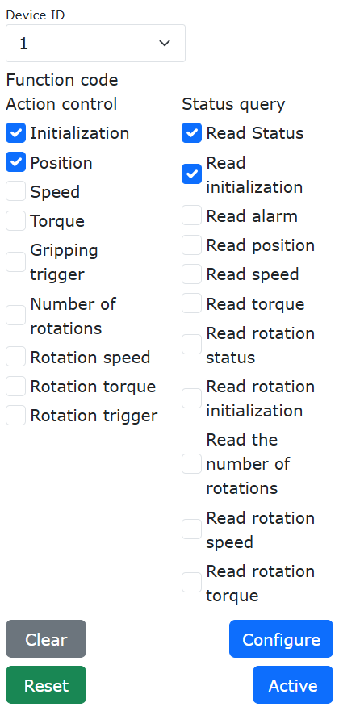

.. centered:: Abbildung 8.2‑5 Greifer aktivieren

**Schritt 3**: Gehen Sie zu Teach-Programm -> Programmierung -> Greifer-Bewegungsbefehl hinzufügen.

.. figure:: robot_peripherals/012.png
   :align: center
   :width: 6in

.. centered:: Abbildung 8.2‑6 Greifer-Bewegungsbefehl hinzufügen

.. figure:: robot_peripherals/013.png
   :align: center
   :width: 6in

.. centered:: Abbildung 8.2‑7 Beispiel für einen Greifer-Bewegungsbefehl

Mehrere Greifer
+++++++++++++++++++

Aktivierung und Bewegungssteuerung siehe Schritte für einen einzelnen Greifer.

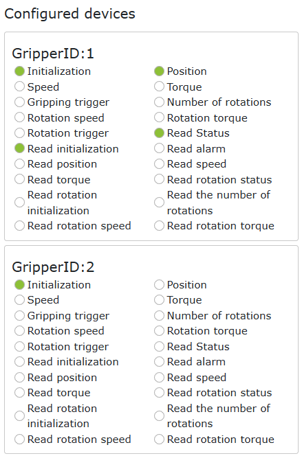

.. centered:: Abbildung 8.2‑8 Mehrere Greifer konfigurieren

.. note:: Da die offene Flanschfunktion derzeit Greiferadressen im Bereich 1~8 unterstützt, sollte die Greiferadresse vor der Verwendung mit der PC-Software des Greiferherstellers eingestellt werden.

Drehgreifer
+++++++++++++++++++

**Schritt 1**: Greifer aktivieren -> Greifer-ID auswählen -> die zum Greifer passenden Funktionscodes auswählen -> auf Konfigurieren klicken. In den konfigurierten Geräten werden die ID und die Funktionscodes des Greifers angezeigt.

.. figure:: robot_peripherals/010.png
   :align: center
   :width: 4in

.. centered:: Abbildung 8.2‑9 Greifer und Funktionscodes konfigurieren

.. note:: Die Auswahl der Funktionscodes sollte anhand des Produkthandbuchs des Greiferherstellers erfolgen, um die vom Greifer unterstützten Funktionen zu ermitteln. Sie müssen mit den Lua-Funktionscodes der Flanschseite übereinstimmen. Einzelheiten entnehmen Sie bitte der "FR05-Complete Flanschperipherie-Protokoll-V2.5-20241101.xlsx".

**Schritt 2**: Greifer-ID auswählen -> Zurücksetzen -> Aktivieren. Der Greifer wird einmal initialisiert. Einzelheiten zur Initialisierung entnehmen Sie bitte dem Produkthandbuch des Greiferherstellers.

.. centered:: Abbildung 8.2‑10 Greifer aktivieren

**Schritt 3**: Gehen Sie zu Teach-Programm -> Programmierung -> Greifer-Bewegungsbefehl hinzufügen.

.. figure:: robot_peripherals/012.png
   :align: center
   :width: 6in

.. centered:: Abbildung 8.2‑11 Drehgreifer-Bewegungsbefehl hinzufügen

.. figure:: robot_peripherals/015.png
   :align: center
   :width: 6in

.. centered:: Abbildung 8.2‑12 Beispiel für einen Drehgreifer-Bewegungsbefehl

.. note:: Die Anzahl der Umdrehungen bezieht sich auf die absolute Anzahl der Umdrehungen. Die maximale Anzahl für Vorwärts- und Rückwärtsdrehungen beträgt 90 Umdrehungen. Nach einer Drehung muss ein Reset durchgeführt werden.

Kraftsensor
-------------------------

In der Oberfläche "Initiale Einstellungen" -> "Peripherie" -> "Kraftsensor" können Kraftsensoren derzeit über "Bereits angepasste Geräte" und das "Benutzerdefinierte offene Flansch-Lua-Protokoll" verwendet werden.

Bereits angepasste Geräte
~~~~~~~~~~~~~~~~~~~~~~~~~~~~~~~~~~~~~~~~~~~

**Schritt 1**: Klicken Sie auf "Bereits angepasste Geräte", um zur Konfigurationsoberfläche für die Flanschperipherie zu gelangen.

Die Konfigurationsinformationen für den Kraftsensor umfassen Hersteller, Typ, Softwareversion und Montageposition. Der Benutzer kann die entsprechenden Kraftsensorinformationen je nach spezifischem Produktionsbedarf konfigurieren. Wenn der Benutzer die Konfiguration ändern muss, kann er zuerst die entsprechende Nummer auswählen, auf die Schaltfläche "Löschen" klicken, um die entsprechenden Informationen zu löschen, und dann je nach Bedarf neu konfigurieren.

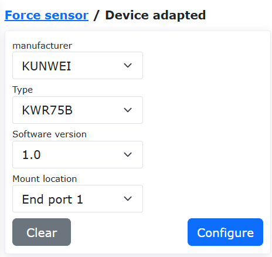

.. centered:: Abbildung 8.3‑1 Kraftsensor konfigurieren

.. important::
   Bevor Sie auf "Konfiguration löschen" klicken, sollte sich der entsprechende Sensor im deaktivierten Zustand befinden.

**Schritt 2**: Nach Abschluss der Kraftsensorkonfiguration kann der Benutzer die entsprechenden Kraftsensorinformationen in der Informationstabelle unten auf der Seite einsehen. Wenn ein Konfigurationsfehler festgestellt wird, kann er auf die Schaltfläche "Löschen" klicken und neu konfigurieren.

.. figure:: robot_peripherals/017.png
   :align: center
   :width: 4in

.. centered:: Abbildung 8.3‑2 Kraftsensor-Konfigurationsinformationen

**Schritt 3**: Wählen Sie die konfigurierte Kraftsensornummer aus, klicken Sie auf die Schaltfläche "Reset". Nachdem auf der Seite der erfolgreiche Befehlssendevorgang angezeigt wurde, klicken Sie auf die Schaltfläche "Aktivieren". Überprüfen Sie den Aktivierungsstatus in der Kraftsensorinformationstabelle, um festzustellen, ob die Aktivierung erfolgreich war. Darüber hinaus hat der Kraftsensor einen Anfangswert. Der Benutzer kann je nach Bedarf "Nullpunktkorrektur" und "Nullpunkt entfernen" wählen. Für die Nullpunktkorrektur des Kraftsensors muss sichergestellt sein, dass der Sensor horizontal und vertikal nach unten ausgerichtet ist und der Roboter keine Nutzlast konfiguriert hat.

**Schritt 4**: Nach der Konfiguration des Kraftsensors muss das Werkzeugkoordinatensystem für den Sensortyp konfiguriert werden. Der Wert des Sensor-Werkzeugkoordinatensystems kann direkt basierend auf dem Abstand zwischen Sensor und Werkzeugmittelpunkt eingegeben und angewendet werden.

Lua-Flanschprotokoll für Kraftsensoren
~~~~~~~~~~~~~~~~~~~~~~~~~~~~~~~~~~~~~~~~~~~~~~~~~~~~~~~~~~~~~~~~~~~

Öffnen Sie die WebApp, klicken Sie nacheinander auf "Initiale Einstellungen", "Peripherie", "Kraftsensor", "Benutzerdefiniertes Protokoll". Klicken Sie auf "Protokollverwaltung", um die Konfiguration des Flanschprotokolls durchzuführen. Die derzeit voreingestellten eingebetteten Protokolle für Kraftsensoren sind in der folgenden Abbildung dargestellt. Version 3.9.2 fügt zwei eingebettete Kombinationsprotokolle für Greifer + Kraftsensor hinzu: End_JD_XJC_V1.0.lua und End_JD_GZCX_V1.0.lua.

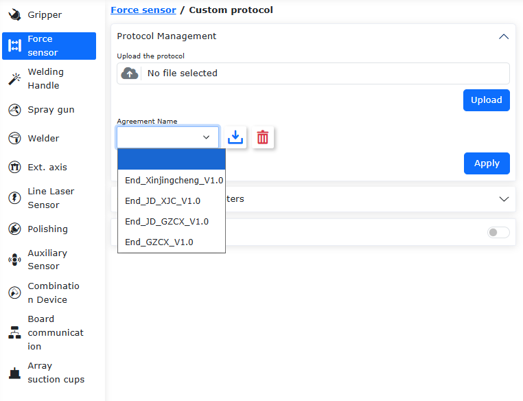

.. centered:: Abbildung 8.3‑2-2 Voreingestellte eingebettete Protokolle für Kraftsensoren

Lua-Flanschprotokoll für Schweißgriffe
~~~~~~~~~~~~~~~~~~~~~~~~~~~~~~~~~~~~~~~~~~~~~~~~~~~~~~~~~~~~~~~~~~~

Öffnen Sie die WebApp, klicken Sie nacheinander auf "Initiale Einstellungen", "Peripherie", "Schweißgriff", "Benutzerdefiniertes Protokoll". Klicken Sie auf "Protokollverwaltung", um die Konfiguration des Flanschprotokolls durchzuführen. Die derzeit voreingestellten eingebetteten Protokolle für Schweißgriffe sind in der folgenden Abbildung dargestellt. Version 3.9.2 fügt drei eingebettete Kombinationsprotokolle für SmartTool + Greifer oder Kraftsensor hinzu: End_SM_JD_V1.3.lua, End_SM_GZCX_V1.3.lua, End_SM_XJC_V1.3.lua.

.. figure:: robot_peripherals/283.png
   :align: center
   :width: 6in

.. centered:: Abbildung 8.3‑2-3 Voreingestellte eingebettete Protokolle für Schweißgriffe

Automatische Generierung des Flansch-Lua-Protokolls
++++++++++++++++++++++++++++++++++++++++++++++++++++++++++++++++++++++++

Diese neue Funktion ermöglicht die automatische Generierung von Protokollen, die mit dem eingebetteten SmartTool-Schweißgriff in Zusammenhang stehen (derzeit nur für vier Protokolle konfigurierbar: End_SmartTool_V1.3.lua, End_SM_JD_V1.3.lua, End_SM_GZCX_V1.3.lua, End_SM_XJC_V1.3.lua). Nach der Konfiguration über die Webseite wird das Flansch-Lua-Protokoll automatisch generiert, hochgeladen und auf die Flanschseite angewendet. Der Benutzer muss kein Protokoll mehr schreiben. Der Benutzer konfiguriert die Tasten A, B, C, D, E, IO des SmartTool-Schweißgriffs nach Bedarf. Nach der Konfiguration muss der Roboter deaktiviert (Enable entfernen) werden und auf "Anwenden" geklickt werden. Die Seite fragt dann: "Boot-Modus betreten und offenes Protokoll anwenden?". Nach der Bestätigung wechselt der Roboter in den Boot-Modus, lädt das automatisch generierte Flansch-Lua-Protokoll hoch und nach dem Neustart des Roboters kann der SmartTool gemäß den konfigurierten Tasten verwendet werden.

.. figure:: robot_peripherals/284.png
   :align: center
   :width: 6in

.. centered:: Abbildung 8.3‑2-4 Automatische Generierung des Konfigurationsprotokolls für den SmartTool-Schweißgriff

.. figure:: robot_peripherals/285.png
   :align: center
   :width: 4in

.. centered:: Abbildung 8.3‑2-5 Seitenabfrage "Boot-Modus betreten und offenes Protokoll anwenden?"

Import einer Vorlage für die SmartTool-Programmgenerierung
++++++++++++++++++++++++++++++++++++++++++++++++++++++++++++++++++++++++++++++

Wenn die Funktion "Programmgenerierung" für eine SmartTool-Taste konfiguriert ist, können basierend auf dem offenen Protokoll zwei Arten von generierten Programmen bereitgestellt werden. Standardmäßig wird ein leeres Lua-Programm generiert, oder der Benutzer kann eine Vorlage mit dem Namen `template_` als Vorlage für neue Programme hochladen. Wenn ein neues Programm mit einer Vorlage erstellt wird, enthält die durch die SmartTool-Funktion "Neues Programm" generierte Lua-Datei den Inhalt der hochgeladenen Vorlagendatei. Später hinzugefügte Befehle werden nach dem Vorlageninhalt eingefügt.

.. figure:: robot_peripherals/286.png
   :align: center
   :width: 4in

.. centered:: Abbildung 8.3‑2-6 Import einer Vorlage für die SmartTool-Programmgenerierung

Konfiguration der SmartTool-Bewegungsbefehlspunkte
++++++++++++++++++++++++++++++++++++++++++++++++++++++++++++++++++++++++++++++

Bei der Konfiguration der drei Befehle "PTP", "LIN", "ARC" für den SmartTool kann ausgewählt werden, ob die generierten Befehlspunkte in der Datenbank "Globale Teach-Punkte" oder "Lokale Teach-Punkte" gespeichert werden. Bei Auswahl von "Globale Teach-Punkte" können die generierten Befehlspunkte unter "Teach-Programm" und "Teach-Punkte" eingesehen werden. Bei Auswahl von "Lokale Teach-Punkte" können die generierten Befehlspunkte unter "Teach-Programm", "Programmierung" und "Lokale Teach-Punkte" eingesehen werden.

.. figure:: robot_peripherals/287.png
   :align: center
   :width: 4in

.. centered:: Abbildung 8.3‑2-7 Konfiguration "Globale Teach-Punkte" und "Lokale Teach-Punkte" für SmartTool-Bewegungsbefehle

SmartTool Anti-Fehlbedienungsmodus
++++++++++++++++++++++++++++++++++++++++++++++++++++++++++++++++++++++++++++++

Dem SmartTool basierend auf dem offenen Protokoll wurde ein Anti-Fehlbedienungsmodus hinzugefügt. Klicken Sie nacheinander auf "Initiale Einstellungen", "Peripherie", "Schweißgriff", "Benutzerdefiniertes Protokoll". Nach der Aktivierung des Flanschprotokolls ist ein Schalter für den "Anti-Fehlbedienungsmodus" sichtbar. Wenn diese Funktion aktiviert ist, müssen die beiden Tasten "Programm widerrufen" und "Programm leeren" des SmartTool zweimal gedrückt werden, um ausgelöst zu werden.

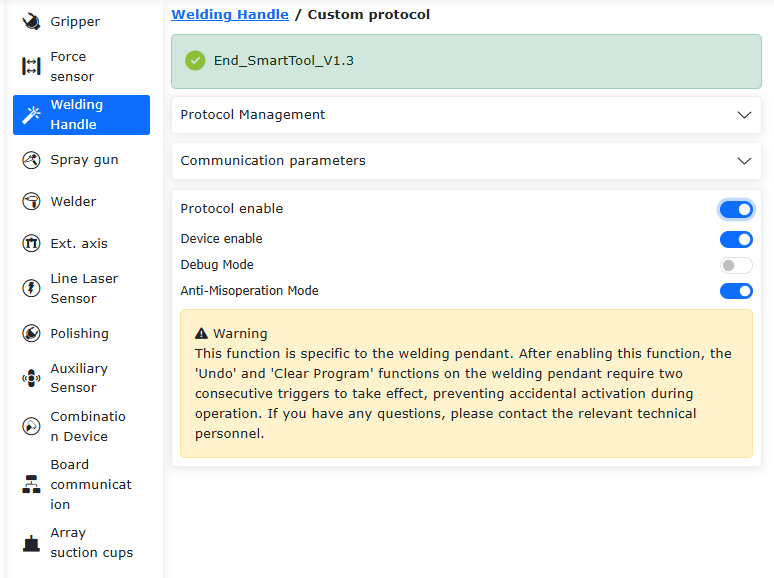

.. centered:: Abbildung 8.3‑2-8 SmartTool "Anti-Fehlbedienungsmodus" Funktion

Beispiel für ein Lua-Flanschprotokoll eines Schweißgriffs
+++++++++++++++++++++++++++++++++++++++++++++++++++++++++++++++++++++++++++++++++++++

Die Funktionen der sechs Tasten A, B, C, D, E, IO können durch den key-Wert in Zeile 31 des Codes geändert und definiert werden. Dabei sind K38=Getbit(R[7],1) und K0=Getbit(R[7],2) für "Programm leeren" und "Taste widerrufen" festgelegt und dürfen nicht geändert werden. Die folgenden 5 K-Werte können gemäß den Definitionen im Dokument "Vollständiges Flanschperipherie-Protokoll" geändert werden. In diesem Beispiel (eingebettetes SmartTool-Protokoll) entsprechen die Tastenfunktionen: A:LIN, B:PTP, C:Programm erstellen, D:Schweißunterbrechung fortsetzen, E:Schweißunterbrechung beenden, IO: LIN + Schweißen + Pendeln.

.. centered:: Beispiel für ein Lua-Flanschprotokoll eines Schweißgriffs (SmartTool)

.. code-block:: lua
   :linenos:

   function Getbit(X,Bit)
   return ((X&(1<<Bit))>>Bit)
   end

   if(Getbit(GetRobotState(),0)==1)then
   local SetParams={B6=3}-- B6 - Operations-DO-Portnummer ist DO3
   SetWeldParams(SetParams)
   while(1)
   do
   IwdgTaskHandle()
   MainLoop()
   UpDownLoadHandle()
   SdoRwPara()
   EndErrClear()
   local BFlag=LuaBreak()
   if(BFlag==1)then
   break
   end
   local R={0}
   local T={0x7D,0x01,0x30,0xC0,0x00,0x04,0x00,0x00,0x00,0x00}
   DelayMs(100)
   T[7],T[8],T[9],T[10]=GetIoCmd()
   Dword=GetRobotState()
   T[7]=Getbit(Dword,4)
   T[12],T[11]=WeldToolCrcValue(T)
   T[13]=0x0E
   WeldToolSlaveSetCmd(T)
   DelayMs(3)
   Len=EndRxWeldData(R)
   if((Len==13)and(R[1]==0x7D)and(R[2]==0x01)and(R[3]==0x30))then
   local key={K38=Getbit(R[7],1),K0=Getbit(R[7],2),K3=Getbit(R[7],3),K25=Getbit(R[7],4),K39=Getbit(R[7],5),K27=Getbit(R[7],6),K28=Getbit(R[7],7), K44=Getbit(R[8],0),
   K6=Getbit(R[8],1),K7=Getbit(R[8],2)}-- Einstellung der SmartTool-Schweißgrifftasten: Widerrufen-K38: Programm widerrufen; Leeren-K0: Programm leeren; A-Taste-K3: LIN; B-Taste-K25: PTP; C-Taste-K39: Programm erstellen; D-Taste-K27: Schweißunterbrechung fortsetzen; E-Taste-K28: Schweißunterbrechung beenden; IO-Taste-K44: LIN + Schweißen + Pendeln; Hand/Auto-Taste-K6: Hand/Auto; Start/Pause-Taste-K7: Start/Pause
   SetWeldToolKeys(key)
   end
   LuaGc()
   end
   end

Nutzlastidentifikation mit Sensor
~~~~~~~~~~~~~~~~~~~~~~~~~~~~~~~~~~~~~~~~~~~~

Klicken Sie im Menü "Initiale Einstellungen" -> "Basis" -> "Nutzlast" auf "Sensoridentifikation", um zur Oberfläche für die Sensor-Nutzlastidentifikation zu gelangen.

**Positionsspezifische Identifikation**: Löschen Sie die Endnutzlastdaten, konfigurieren Sie den Kraftsensor, richten Sie das Sensorkoordinatensystem ein, stellen Sie die Endausrichtung des Roboters senkrecht nach unten ein, führen Sie eine "Nullpunktkorrektur" durch und montieren Sie dann die Endnutzlast. Wählen Sie zuerst das entsprechende Sensor-Werkzeugkoordinatensystem aus, stellen Sie den Roboter so ein, dass Sensor und Werkzeug senkrecht nach unten zeigen, zeichnen Sie die Daten auf und berechnen Sie die Masse. Stellen Sie als nächstes den Roboter in 3 verschiedene Positionen ein, zeichnen Sie jeweils drei Datensätze auf, berechnen Sie den Schwerpunkt und klicken Sie nach Überprüfung auf "Anwenden".

**Dynamische Identifikation**: Löschen Sie die Endnutzlastdaten, konfigurieren Sie den Kraftsensor, richten Sie das Sensorkoordinatensystem ein, stellen Sie die Endausrichtung des Roboters senkrecht nach unten ein, führen Sie eine "Nullpunktkorrektur" durch und montieren Sie dann die Endnutzlast. Klicken Sie auf "Identifikation starten", bewegen Sie den Roboter per Hand (Drag), klicken Sie dann auf "Identifikation beenden". Die Nutzlastdaten werden automatisch auf den Roboter angewendet.

**Automatische Nullpunktkorrektur**: Nachdem der Sensor die Anfangsposition aufgezeichnet hat, kann eine automatische Nullpunktkorrektur durchgeführt werden.

.. figure:: robot_peripherals/018.png
   :align: center
   :width: 4in

.. centered:: Abbildung 8.3‑3 Sensor-Nutzlastidentifikation

Unterstütztes Ziehen (Drag) mit Kraftsensor
~~~~~~~~~~~~~~~~~~~~~~~~~~~~~~~~~~~~~~~~~~~~~~~~~~~~~~~

Nach der Konfiguration des Sensors kann dieser das Ziehen des Roboters (Drag-Modus) besser unterstützen. Bei der ersten Verwendung können die Daten gemäß dem Bild rechts konfiguriert werden. Nachdem die Einstellungen übernommen wurden, kann der Roboter direkt durch Ziehen am Endkraftsensor bewegt werden, ohne den Drag-Modus zu aktivieren. Der Roboter bewegt sich dann mit beibehaltener Ausrichtung. (Die Daten im folgenden Bild dienen als Referenzstandard)

.. figure:: robot_peripherals/019.png
   :align: center
   :width: 4in

.. centered:: Abbildung 8.3‑4 Ziehen mit Kraft-/Drehmomentsensor (Sperre)

.. note::
   Die Singularitätsstrategie ist eine Funktion zur Durchquerung und Vermeidung von Singularitäten, die für das unterstützte Ziehen mit Kraftsensor entwickelt wurde.

   Die Strategie zur Singularitätsvermeidung ist die Standardfunktion. Nach Aktivierung des unterstützten Ziehens ist die Vermeidungsfunktion standardmäßig aktiv. Die Singularitätsvermeidung wendet eine virtuelle Kraft an, um den Roboter von einer singulären Konfiguration wegzubewegen.

   Singuläre Konfigurationen:

   **Ellenbogen-Singularität**: Die Drehachsen 2, 3 und 4 liegen in derselben Ebene. Der Ellenbogen ist vollständig gestreckt oder vollständig gebeugt. Aufgrund der mechanischen Endanschläge von FR-Robotern ist die vollständig gebeugte Position nicht erreichbar.

   **Handgelenks-Singularität**: Die Drehachsen 4 und 6 sind parallel. Aufgrund der mechanischen Endanschläge von FR-Robotern ist diese Position nicht erreichbar.

   **Schulter-Singularität**: Der Handgelenksmittelpunkt liegt in der Ebene, die von den Drehachsen 1 und 2 gebildet wird.

   Funktion zum Durchqueren von Singularitäten: Wählen Sie "Singularitätsstrategie" auf "Durchqueren" und wenden Sie es an. Wenn der Roboter erkennt, dass sich die aktuelle Pose in einer singulären Konfiguration befindet, wechselt er automatisch in den Stromregelungs-Drag-Modus. Wenn er die singuläre Konfiguration verlässt, wechselt der Drag-Modus zurück zum unterstützten Ziehen mit Kraftsensor.

**Adaptive Auswahl**: Bei Bedarf während der Montage einschalten. Nach dem Einschalten wird das Ziehen schwerer.

**Trägheitsparameter**: Passen das haptische Feedback während des Ziehvorgangs an. Nur unter Anleitung von Fachpersonal vorsichtig einstellen.

**Dämpfungsparameter**:

-   Translationsrichtung: Empfohlene Einstellung zwischen [100-200].

-   Rotationsrichtung: Empfohlene Einstellung zwischen [3-10], wobei der Einstellbereich für die RZ-Richtung [0,1-5] ist.

-   Effekt: Beim Ziehen mit Sensor erschwert eine Erhöhung der Dämpfung das Ziehen, eine Verringerung der Dämpfung macht das Ziehen zu leicht (nicht zu klein einstellen).

-   Gesamtbereich Dämpfungsparameter: Translation XYZ: [100-1000]; Rotation RX, RY: [3-50], RZ: [2-10].

-   Maximale Zugkraft ist 50, maximale Ziehgeschwindigkeit ist 180.

**Steifigkeitsparameter**: Alle auf 0 setzen.

**Zugkraftschwelle**: Translation XYZ: [5-10]; Rotation RX, RY, RZ: [0,5-5].

.. important::
   Die Sperrung wird durch Erhöhen der Kraftschwellen für die Translationsrichtung XYZ oder die Rotationsrichtungen RX, RY, RZ erreicht.

Kollisionserkennung mit Kraft-/Drehmomentsensor
~~~~~~~~~~~~~~~~~~~~~~~~~~~~~~~~~~~~~~~~~~~~~~~~~~~~~~~~~

Befehlsbeschreibung: Der Befehl "FT_Guard" ist ein Kollisionserkennungsbefehl. Wählen Sie das entsprechende Sensorkoordinatensystem, aktivieren Sie die zu überwachenden Kraft-/Momentenrichtungen, stellen Sie den aktuellen Wert, die maximale Kollisionsschwelle und die minimale Kollisionsschwelle ein. Der normale Bereich für die Kollisionserkennung ist (aktueller Wert - minimale Schwelle, aktueller Wert + maximale Schwelle). Fügen Sie die Befehle "Aktivieren" und "Deaktivieren" in das Programm ein.

.. figure:: robot_peripherals/020.png
   :align: center
   :width: 6in

.. centered:: Abbildung 8.3‑5 FT_Guard Befehl bearbeiten

Programmbeispiel:

.. list-table::
   :widths: 50 80 80
   :header-rows: 0
   :align: center

   * - **Nr.**
     - **Befehlsformat**
     - **Kommentar**

   * - 1
     - FT_Guard(1,1,1,1,1,0,0,0,5,0,0,0,0,0,10,0,0,0,0,0,5,0,0,0,0,0)
     - #Kraft-/Moment-Kollisionserkennung aktivieren

   * - 2
     - PTP(template1,100,-1,0)
     - #Bewegungsbefehl

   * - 3
     - FT_Guard(0,1,1,1,1,0,0,0,5,0,0,0,0,0,10,0,0,0,0,0,5,0,0,0,0,0)
     - #Kraft-/Moment-Kollisionserkennung deaktivieren

Kraftgeregelte Bewegung mit Kraft-/Drehmomentsensor
~~~~~~~~~~~~~~~~~~~~~~~~~~~~~~~~~~~~~~~~~~~~~~~~~~~~~~~~~~~~~~~~

Befehlsbeschreibung: Der Befehl "FT_Control" ist ein kraftgeregelter Bewegungsbefehl. Er ermöglicht es dem Roboter, sich in der Nähe einer eingestellten Kraft zu bewegen, was häufig in Schleifanwendungen verwendet wird. Wählen Sie das entsprechende Sensorkoordinatensystem, aktivieren Sie die zu überwachenden Kraft-/Momentenrichtungen, stellen Sie die Erkennungsschwellen und die PID-Proportionalbeiwerte (p) in jeder Richtung ein (üblich ist p=0,001), stellen Sie die maximale Anpassungsstrecke (für X, Y, Z) und den maximalen Anpassungswinkel (für RX, RY, RZ) ein. Fügen Sie die Befehle "Aktivieren" und "Deaktivieren" in das Programm ein.

.. figure:: robot_peripherals/021.png
   :align: center
   :width: 6in

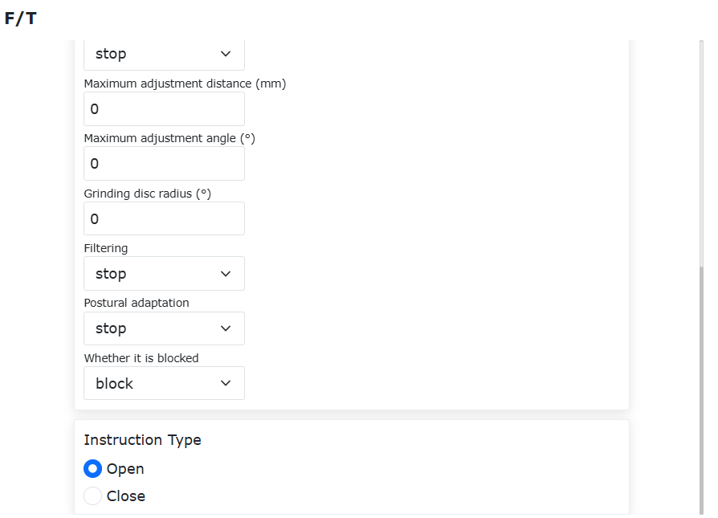

.. centered:: Abbildung 8.3‑6 FT_Control Befehl bearbeiten

Programmbeispiel:

.. list-table::
   :widths: 50 80 80
   :header-rows: 0
   :align: center

   * - **Nr.**
     - **Befehlsformat**
     - **Kommentar**

   * - 1
     - FT_Control(1,11,1,0,1,0,0,0,10,0,5,0,0,0,0.001,0,0,0,0,0,0,0,0,10,5)
     - #Kraft-/Moment-Bewegungsregelung aktivieren

   * - 2
     - Lin(template3,100,-1,0,0)
     - #Bewegungsbefehl

   * - 3
     - FT_Control(0,11,1,0,1,0,0,0,10,0,5,0,0,0,0.001,0,0,0,0,0,0,0,10,5)
     - #Kraft-/Moment-Bewegungsregelung deaktivieren

Spiralförmiges Einführen mit Kraft-/Drehmomentsensor
~~~~~~~~~~~~~~~~~~~~~~~~~~~~~~~~~~~~~~~~~~~~~~~~~~~~~~~~~~~~~~~~

Befehlsbeschreibung: Der Befehl "FT_Spiral" dient der spiralförmigen Erkundung und Einführung, üblicherweise für die Wellen-Loch-Montage von zylindrischen Wellen. Vor der Ausführung muss das Roboterende grob in die Nähe der Bohrungsposition gebracht werden. Stellen Sie die Befehlsparameter entsprechend der aktuellen Szene ein, fügen Sie sie zum Programm hinzu. Nach der Ausführung erkundet der Roboter die Umgebung mit einer spiralförmigen Bewegung.

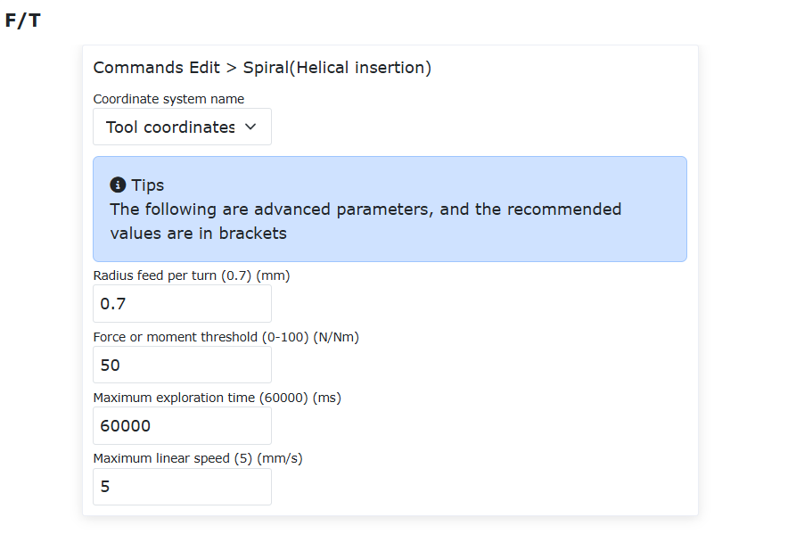

.. centered:: Abbildung 8.3‑7 FT_Spiral Befehl bearbeiten

Programmbeispiel:

.. list-table::
   :widths: 50 80 80
   :header-rows: 0
   :align: center

   * - **Nr.**
     - **Befehlsformat**
     - **Kommentar**

   * - 1
     - FT_Control(1,10,0,0,1,0,0,0,0,0,5,0,0,0,0.0005,0,0,0,0,0,0,10,0)
     - #Kraft-/Moment-Bewegungsregelung aktivieren

   * - 2
     - FT_SpiralSearch(0,0.7,0,60000,5)
     - #Spiraleinführung

   * - 3
     - FT_Control(0,10,0,0,1,0,0,0,0,0,5,0,0,0,0.0005,0,0,0,0,0,0,10,0)
     - #Kraft-/Moment-Bewegungsregelung deaktivieren

Drehendes Einführen mit Kraft-/Drehmomentsensor
~~~~~~~~~~~~~~~~~~~~~~~~~~~~~~~~~~~~~~~~~~~~~~~~~~~~~~~~~~~~~~~~

Befehlsbeschreibung: Der Befehl "FT_Rot" dient der rotierenden Erkundung und Einführung. Er wird üblicherweise im Anschluss an die Spiraleinführung für die Wellen-Loch-Montage verwendet. Vor der Ausführung muss das Roboterende an die durch die Spirale gefundene Position oder an eine exakt angeteachtete Bohrungsposition bewegt werden. Stellen Sie die Befehlsparameter entsprechend der aktuellen Szene ein, fügen Sie sie zum Programm hinzu. Nach der Ausführung erkundet der Roboter die Umgebung mit einer langsamen Drehbewegung.

.. figure:: robot_peripherals/024.png
   :align: center
   :width: 6in

.. centered:: Abbildung 8.3‑8 FT_Rot Befehl bearbeiten

Programmbeispiel:

.. list-table::
   :widths: 50 80 80
   :header-rows: 0
   :align: center

   * - **Nr.**
     - **Befehlsformat**
     - **Kommentar**

   * - 1
     - FT_Control(1,10,0,0,1,0,0,0,0,0,5,0,0,0,0.0005,0,0,0,0,0,0,10,0)
     - #Kraft-/Moment-Bewegungsregelung aktivieren

   * - 2
     - FT_RotInsertion(0,3,0,5,1,0,1)
     - #Dreheinführung

   * - 3
     - FT_Control(0,10,0,0,1,0,0,0,0,0,5,0,0,0,0.0005,0,0,0,0,0,0,10,0)
     - #Kraft-/Moment-Bewegungsregelung deaktivieren

Lineares Einführen mit Kraft-/Drehmomentsensor
~~~~~~~~~~~~~~~~~~~~~~~~~~~~~~~~~~~~~~~~~~~~~~~~~~~~~~~~~~~~~~~~

Befehlsbeschreibung: Der Befehl "FT_Lin" dient der linearen Erkundung und Einführung. Er wird üblicherweise im Anschluss an die Spiraleinführung oder die Dreheinführung für die Wellen-Loch-Montage verwendet. Vor der Ausführung muss das Roboterende an die durch die Spirale gefundene Position, an die Position nach der Dreheinführung oder an eine exakt angeteachtete Bohrungsposition bewegt werden. Stellen Sie die Befehlsparameter entsprechend der aktuellen Szene ein, fügen Sie sie zum Programm hinzu. Nach der Ausführung bewegt sich der Roboter linear in der eingestellten Richtung.

.. figure:: robot_peripherals/025.png
   :align: center
   :width: 6in

.. centered:: Abbildung 8.3‑9 FT_Lin Befehl bearbeiten

Programmbeispiel:

.. list-table::
   :widths: 50 80 80
   :header-rows: 0
   :align: center

   * - **Nr.**
     - **Befehlsformat**
     - **Kommentar**

   * - 1
     - FT_Control(1,10,0,0,1,0,0,0,0,0,5,0,0,0,0.0005,0,0,0,0,0,0,10,0)
     - #Kraft-/Moment-Bewegungsregelung aktivieren

   * - 2
     - FT_LinInsertion(0,50,1,0,100,1)
     - #Lineareinführung

   * - 3
     - FT_Control(0,10,0,0,1,0,0,0,0,0,5,0,0,0,0.0005,0,0,0,0,0,0,10,0)
     - #Kraft-/Moment-Bewegungsregelung deaktivieren

Oberflächenlokalisierung mit Kraft-/Drehmomentsensor
~~~~~~~~~~~~~~~~~~~~~~~~~~~~~~~~~~~~~~~~~~~~~~~~~~~~~~~~~~~~~~~~~~~~~~~~~

Befehlsbeschreibung: Der Befehl "FT_FindSurface" dient der Oberflächenlokalisierung, üblicherweise zum Auffinden einer Werkstückoberfläche. Stellen Sie je nach aktueller Szene das entsprechende Koordinatensystem, die Bewegungsrichtung, die Bewegungsachse, die lineare Erkundungsgeschwindigkeit, die lineare Erkundungsbeschleunigung, die maximale Erkundungsstrecke und die Kraftschwelle für die Aktionsbeendigung ein. Fügen Sie sie zum Programm hinzu. Nach der Programmausführung beginnt die Bewegung und das Roboterende bewegt sich langsam in Richtung der vermuteten Oberfläche.

.. figure:: robot_peripherals/026.png
   :align: center
   :width: 6in

.. centered:: Abbildung 8.3‑10 FT_FindSurface Befehl bearbeiten

Programmbeispiel:

.. list-table::
   :widths: 50 80 80
   :header-rows: 0
   :align: center

   * - **Nr.**
     - **Befehlsformat**
     - **Kommentar**

   * - 1
     - PTP(1,30,-1,0)
     - #Startposition

   * - 2
     - FT_FindSurface(0,1,3,1,0,100,5)
     - #Ebenenlokalisierung

Zentrumslokalisierung mit Kraft-/Drehmomentsensor
~~~~~~~~~~~~~~~~~~~~~~~~~~~~~~~~~~~~~~~~~~~~~~~~~~~~~~~~~~~~~~~~~~~~~~~

Befehlsbeschreibung: Der Befehl "FT_CalCenter" dient der Zentrumslokalisierung, üblicherweise zum Auffinden der Mittelebene zwischen zwei Oberflächen. Stellen Sie je nach aktueller Szene das entsprechende Koordinatensystem, die Bewegungsrichtung, die Bewegungsachse, die lineare Erkundungsgeschwindigkeit, die lineare Erkundungsbeschleunigung, die maximale Erkundungsstrecke und die Kraftschwelle für die Aktionsbeendigung ein. Lokalisieren Sie nacheinander die Ebene A und die Ebene B. Fügen Sie sie zum Programm hinzu. Nach der Programmausführung beginnt die Bewegung: Der Roboter bewegt sich langsam in Richtung der Oberfläche A. Nach der Lokalisierung von A bewegt er sich langsam in Richtung der Oberfläche B. Nach der Lokalisierung von B wird die Position der Mittelebene berechnet.

.. figure:: robot_peripherals/027.png
   :align: center
   :width: 6in

.. centered:: Abbildung 8.3‑11 FT_CalCenter Befehl bearbeiten

Programmbeispiel:

.. list-table::
   :widths: 20 40 50
   :header-rows: 0
   :align: center

   * - **Nr.**
     - **Befehlsformat**
     - **Kommentar**

   * - 1
     - PTP(1,30,-1,0)
     - #Startposition

   * - 2
     - FT_CalCenterStart()
     - #Oberflächenlokalisierung starten

   * - 3
     - FT_Control(1,10,0,0,1,0,0,0,0,0,-10,0,0,0,0.00001,0,0,0,0,0,0,100,0)
     - #Kraft-/Moment-Bewegungsregelung aktivieren

   * - 4
     - FT_FindSurface(1,2,2,10,0,200,5)
     - #Ebene A lokalisieren

   * - 5
     - FT_Control(0,10,0,0,1,0,0,0,0,0,-10,0,0,0,0.00001,0,0,0,0,0,0,100,0)
     - #Kraft-/Moment-Bewegungsregelung deaktivieren

   * - 6
     - PTP(1,30,-1,0)
     - #Startposition

   * - 7
     - FT_Control(1,10,0,0,1,0,0,0,0,0,-10,0,0,0,0.00001,0,0,0,0,0,0,100,0)
     - #Kraft-/Moment-Bewegungsregelung aktivieren

   * - 8
     - FT_FindSurface(1,1,2,20,0,200,5)
     - #Ebene B lokalisieren

   * - 9
     - FT_Control(0,10,0,0,1,0,0,0,0,0,10,0,0,0,0.00001,0,0,0,0,0,0,100,0)
     - #Kraft-/Moment-Bewegungsregelung deaktivieren

   * - 10
     - pos={}
     - #Array pos definieren

   * - 11
     - pos = FT_CalCenterEnd()
     - #Kartesische Pose des lokalisierten Zentrums abrufen

   * - 12
     - MoveCart(pos,GetActualTCPNum(),GetActualWObjNum(),30,10,100,-1,0)
     - #Zur lokalisierten Mittelposition bewegen

Benutzerdefiniertes offenes Protokoll
~~~~~~~~~~~~~~~~~~~~~~~~~~~~~~~~~~~~~~~~~~~~~~~~

Klicken Sie auf die Karte "Benutzerdefiniertes Protokoll", um zur Oberfläche zu gelangen. Aktivieren Sie den Kraftsensor. In den konfigurierten Geräten wird der Kraftsensor angezeigt. Klicken Sie, um zur FT-Oberfläche zu gelangen und die Kraftsensordaten abzufragen.

.. figure:: robot_peripherals/028.png
   :align: center
   :width: 6in

.. centered:: Abbildung 8.3‑12 Kraftsensor aktivieren

Schweißgriff
-------------------------------------------------------------

In der Oberfläche "Initiale Einstellungen" -> "Peripherie" -> "Schweißgriff" können Schweißgriffe derzeit über "Bereits angepasste Geräte" und das "Benutzerdefinierte offene Flansch-Lua-Protokoll" verwendet werden.

Bereits angepasste Geräte
~~~~~~~~~~~~~~~~~~~~~~~~~~~~~~~~~~~~~~

Konfigurationsschritte
++++++++++++++++++++++++++++

**Schritt 1**: Klicken Sie auf die Karte "Bereits angepasste Geräte", um zur Oberfläche für bereits angepasste Geräte zu gelangen. Die Konfigurationsinformationen umfassen Hersteller, Typ, Softwareversion und Montageposition. Der Benutzer kann die entsprechenden Informationen je nach spezifischem Produktionsbedarf konfigurieren. Wenn der Benutzer die Konfiguration ändern muss, kann er zuerst den entsprechenden Hersteller auswählen, auf die Schaltfläche "Löschen" klicken, um die entsprechenden Informationen zu löschen, und dann je nach Bedarf neu konfigurieren.

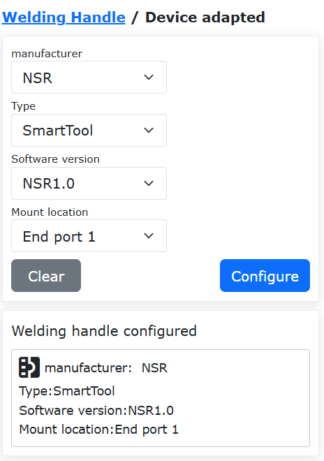

.. centered:: Abbildung 8.4‑1 Konfiguration bereits angepasster Geräte für Schweißgriff

.. important::
   Bevor Sie auf "Konfiguration löschen" klicken, sollte sich das entsprechende Gerät im deaktivierten Zustand befinden.

**Schritt 2**: Konfigurieren Sie nacheinander die A-E Tasten und die IO-Taste. Nach Abschluss der SmartTool-Konfiguration verwaltet der Task-Manager intern die jeder Taste zugeordnete Funktion. Wenn ein Tastendruck erkannt wird, wird die entsprechende Funktion automatisch ausgeführt.

Funktionen der A-E Tasten:

- **Bewegungsbefehl**: Bei Auswahl von PTP, LIN, ARC Bewegungsbefehlen muss die entsprechende Punktgeschwindigkeit eingegeben werden. Für LIN- und ARC-Befehle kann zwischen "Prozentsatz" oder "Physikalische Geschwindigkeit" gewählt werden:
    - **Prozentsatz**: Eingabe des Geschwindigkeitsprozentsatzes. Der Roboter bewegt sich mit diesem Prozentsatz der Maximalgeschwindigkeit. Die tatsächliche Robotergeschwindigkeit wird berechnet als: V = Maximale Robotergeschwindigkeit × Globaler Geschwindigkeitsprozentsatz × Punktgeschwindigkeitsprozentsatz. Wenn Sie den Mauszeiger über das kleine Auge rechts neben dem Eingabefeld "Punktgeschwindigkeit" bewegen, wird die tatsächliche physikalische Geschwindigkeit (in mm/s) des Roboters im Hand- und Automatikmodus bei der eingestellten Geschwindigkeit angezeigt.

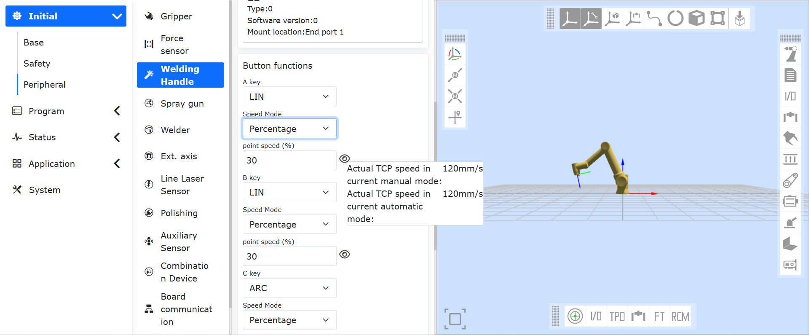

.. centered:: Abbildung 8.4‑2-1 Eingabe eines Prozentsatzes zeigt die tatsächliche physikalische Geschwindigkeit an

- **Physikalische Geschwindigkeit**: Die eingegebene Geschwindigkeit ist die tatsächliche Bewegungsgeschwindigkeit des Roboters in mm/s. Die eingegebene Beschleunigung ist üblicherweise das Doppelte der Geschwindigkeit. (Die maximale physikalische Geschwindigkeit des LIN-Befehls ist durch den globalen Geschwindigkeitsprozentsatz begrenzt. Wenn die maximale Robotergeschwindigkeit 1000 mm/s beträgt und die globale Geschwindigkeit 50 %, dann beträgt die maximale physikalische Geschwindigkeit des LIN-Befehls 1000 × 50 % = 500 mm/s).

.. image:: coding/470.png
   :width: 6in
   :align: center

.. centered:: Abbildung 8.4‑2-2 Eingabe der tatsächlichen physikalischen Geschwindigkeit

Nach erfolgreicher Konfiguration wird dem Teach-Programm ein entsprechender Bewegungsbefehl hinzugefügt. Bei der Konfiguration eines ARC-Bewegungsbefehls müssen zuerst PTP/LIN-Befehle konfiguriert werden.

- **DO-Ausgang**: Bei Auswahl von "DO-Ausgang" erscheint ein Dropdown-Menü zur Auswahl der Ausgänge DO0 bis DO7.

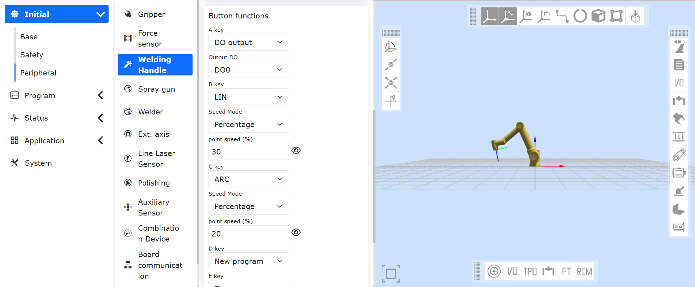

.. centered:: Abbildung 8.4‑2-3 SmartTool Konfiguration (A-E Tasten)

Funktionen der IO-Taste:

- **IO-Signalkonfiguration**: Dropdown-Menü zur Auswahl von DO0~DO7, CO0~CO7, End-DO0, End-DO1 und Erweiterungs-IO (Aux-DO0~Aux-DO127).

- **Kombinationsbefehl**: Nach Auswahl von "IO-Signal" werden unter bestimmten Bedingungen die Konfigurationselemente "Schweißgeräteauswahl" und "Punktgeschwindigkeit" angezeigt, um verschiedene Programmbefehle zu generieren.

.. important::
   - Wenn das IO-Signal als DO0~DO7 oder CO0~CO7 konfiguriert ist (ohne "Lichtbogenzündung"), fügt das Programm SetDO hinzu. "Schweißgeräteauswahl" und "Punktgeschwindigkeit" werden ausgeblendet.
   - Wenn das IO-Signal als End-DO0, End-DO1 konfiguriert ist, fügt das Programm SetToolDO hinzu. "Schweißgeräteauswahl" und "Punktgeschwindigkeit" werden ausgeblendet.
   - Wenn das IO-Signal als Erweiterungs-IO konfiguriert ist (ohne "Lichtbogenzündung Schweißgerät"), fügt das Programm SetAuxDO hinzu. "Schweißgeräteauswahl" und "Punktgeschwindigkeit" werden ausgeblendet.
   - Wenn das IO-Signal als CO0~CO7 konfiguriert ist (mit "Lichtbogenzündung") und die "Schweißgeräteauswahl" auf "Kein" steht, fügt das Programm SetDO hinzu. "Schweißgeräteauswahl" und "Punktgeschwindigkeit" werden ausgeblendet.
   - Wenn das IO-Signal als Erweiterungs-IO konfiguriert ist (mit "Lichtbogenzündung Schweißgerät") und die "Schweißgeräteauswahl" auf "Kein" steht, fügt das Programm SetAuxDO hinzu. "Schweißgeräteauswahl" und "Punktgeschwindigkeit" werden ausgeblendet.
   - Wenn das IO-Signal als CO0~CO7 (mit "Lichtbogenzündung") oder Erweiterungs-IO (mit "Lichtbogenzündung Schweißgerät") konfiguriert ist und die "Schweißgeräteauswahl" auf "Schweißen" steht, fügt das Programm beim ersten Tastendruck ARCStart hinzu, beim zweiten Tastendruck ARCEnd, beim dritten Tastendruck ARCStart, beim vierten Tastendruck ARCEnd, usw. (abwechselnd). "Schweißgeräteauswahl" und "Punktgeschwindigkeit" werden ausgeblendet.
   - Wenn das IO-Signal als CO0~CO7 (mit "Lichtbogenzündung") oder Erweiterungs-IO (mit "Lichtbogenzündung Schweißgerät") konfiguriert ist und die "Schweißgeräteauswahl" auf "LIN+Schweißen" steht, fügt das Programm beim ersten Tastendruck LIN und ARCStart hinzu, beim zweiten Tastendruck LIN und ARCEnd, beim dritten Tastendruck LIN und ARCStart, beim vierten Tastendruck LIN und ARCEnd, usw. (abwechselnd). "Schweißgeräteauswahl" und "Punktgeschwindigkeit" werden angezeigt.
   - Wenn das IO-Signal als CO0~CO7 (mit "Lichtbogenzündung") oder Erweiterungs-IO (mit "Lichtbogenzündung Schweißgerät") konfiguriert ist und die "Schweißgeräteauswahl" auf "LIN+Schweißen+Pendeln" steht, fügt das Programm beim ersten Tastendruck LIN, ARCStart und WeaveStart hinzu, beim zweiten Tastendruck LIN, ARCEnd und WeaveEnd, beim dritten Tastendruck LIN, ARCStart und WeaveStart, beim vierten Tastendruck LIN, ARCEnd und WeaveEnd, usw. (abwechselnd). "Schweißgeräteauswahl" und "Punktgeschwindigkeit" werden ausgeblendet.

.. image:: robot_peripherals/031.png
   :width: 4in
   :align: center

.. centered:: Abbildung 8.4‑3 IO-Taste

Lua-Flanschprotokoll für Schweißgriffe
~~~~~~~~~~~~~~~~~~~~~~~~~~~~~~~~~~~~~~~~~~~~~~~~~~~~~~~~~~~

Klicken Sie auf "Benutzerdefiniertes Protokoll", um zur Funktionsoberfläche für die Anpassung von Schweißgriffen über das offene Lua-Flanschprotokoll zu gelangen.

Protokollverwaltung
++++++++++++++++++++++++++++++++++++++++++++++++++

Öffnen Sie die WebApp, klicken Sie nacheinander auf "Initiale Einstellungen", "Peripherie", "Schweißgriff", "Benutzerdefiniertes Protokoll". Klicken Sie auf "Protokollverwaltung", um die Konfiguration des Flanschprotokolls durchzuführen. Die derzeit voreingestellten eingebetteten Protokolle für Schweißgriffe sind in der folgenden Abbildung dargestellt.

.. figure:: robot_peripherals/032.png
   :align: center
   :width: 4in

.. centered:: Abbildung 8.4‑4 Voreingestellte eingebettete Protokolle für Schweißgriffe

Aktivieren Sie den Schieberegler "Flanschprotokoll aktivieren", um den Schweißgriff anzupassen. Nach der Aktivierung bleiben die Parameter nach einem Neustart erhalten.

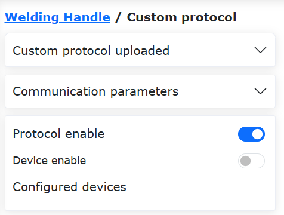

.. centered:: Abbildung 8.4‑5 Offenes Flanschprotokoll aktivieren

Beispiel für ein kombiniertes Lua-Flanschprotokoll
++++++++++++++++++++++++++++++++++++++++++++++++++++++

Die Funktionen der fünf Tasten A, B, C, D, E können durch den key-Wert in Zeile 30 des Codes geändert und definiert werden. Dabei sind K38=Getbit(R[7],1) und K0=Getbit(R[7],2) für "Programm leeren" und "Taste widerrufen" festgelegt und dürfen nicht geändert werden. Die folgenden 5 K-Werte können gemäß den Definitionen im Dokument "Vollständiges Flanschperipherie-Protokoll" geändert werden.

In diesem Beispiel (eingebettetes SmartTool-Protokoll) entsprechen die Tastenfunktionen: A:MoveL, B:ArcStart, C:ArcEnd, D:rewelding start, E:rewelding quit.

.. code-block:: lua

  function Getbit(X,Bit)
  return ((X&(1<<Bit))>>Bit)
  end

  if(Getbit(GetRobotState(),0)==1)then
  local SetParams={A3=2000,B6=3}-- Schweißparameter einstellen, A3 - Lichtbogen starten/beenden Timeout 2000 ms, B6 - Operations-DO-Portnummer ist 3. Für die Konfiguration von Schweißparametern siehe "RD36-Tabelle der benutzerdefinierten Schweißgriffparameter-V0.2-20250903".
  SetWeldParams(SetParams)
  while(1)
  do
  IwdgTaskHandle()
  MainLoop()
  UpDownLoadHandle()
  SdoRwPara()
  EndErrClear()
  local BFlag=LuaBreak()
  if(BFlag==1)then
  break
  end
  local R={0}
  local T={0x7D,0x01,0x30,0xC0,0x00,0x04,0x00,0x00,0x00,0x00}
  DelayMs(100)
  T[7],T[8],T[9],T[10]=GetIoCmd()
  T[7]=Getbit(T[7],3)
  T[12],T[11]=WeldToolCrcValue(T)
  T[13]=0x0E
  WeldToolSlaveSetCmd(T)
  DelayMs(3)
  Len=EndRxWeldData(R)
  if((Len==13)and(R[1]==0x7D)and(R[2]==0x01)and(R[3]==0x30))then
  local key={K38=Getbit(R[7],1),K0=Getbit(R[7],2),K3=Getbit(R[7],3),K32=Getbit(R[7],4),K33=Getbit(R[7],5),K27=Getbit(R[7],6),K28=Getbit(R[7],7),
  K6=Getbit(R[8],1),K7=Getbit(R[8],2)}-- Einstellung der SmartTool-Schweißgrifftasten: Widerrufen-K38: Programm widerrufen; Leeren-K0: Programm leeren; A-Taste-K3: LIN; B-Taste-K32: ArcStart; C-Taste-K33: ArcEnd; D-Taste-K27: Schweißunterbrechung fortsetzen; E-Taste-K28: Schweißunterbrechung beenden; Hand/Auto-Taste-K6: Hand/Auto; Start/Pause-Taste-K7: Start/Pause
  SetWeldToolKeys(key)
  end
  LuaGc()
  end
  end

Vorlage für offenes Protokoll
++++++++++++++++++++++++++++++++++++++++++++++++++++++

Am Beispiel des angepassten offenen Protokolls für Jiashida:

.. code-block:: lua

   function Getbit(X,Bit)                   --Extrahiert das entsprechende Bit von X
   return ((X&(1<<Bit))>>Bit)
   end
   while(1)
   do
   IwdgTaskHandle()
   MainLoop()
   UpDownLoadHandle()
   SdoRwPara()
   EndErrClear()
   local BFlag=LuaBreak()
   if(BFlag==1)then
   break
   end
   RxData={}
   T0={0x7D,0x08,0x22,0xB3,0x01,0x00}
   T1={0x7D,0x08,0x22,0xB4,0x03,0x00}
   T2={0x7D,0X08,0X22,0XB5,0x1E,0x00}
   DelayMs(5)
   RxLen=WeldToolMasterGetCmd(RxData)                                    --Die Funktion WeldToolMasterGetCmd() wird verwendet, um die vom Schweißgriff gesendeten Befehle abzurufen (für den Fall, dass der Schweißgriff als Master fungiert). Bei der Verwendung muss eine leere Tabelle als Parameter übergeben werden (X={}).
   if (RxData[1]==0x7D)and(RxData[2]==0x08)and(RxData[3]==0x22) then
   if(RxData[4] == 0xB3)then
      --Am Beispiel des Funktionscodes des Jiashida-Schweißgriffs, hier 0xB3 (Schweißparameter einstellen).
   local SetParams={A2=RxData[7],A1=RxData[8],A6=(ByteToDwFloat(RxData[9],RxData[10],RxData[11],RxData[12]))*1000,
   A8=(ByteToDwFloat(RxData[13],RxData[14],RxData[15],RxData[16])),A7=(ByteToDwFloat(RxData[17],RxData[18],RxData[19],RxData[20])),
   A4=(ByteToDwFloat(RxData[21],RxData[22],RxData[23],RxData[24]))*1000,A5=(ByteToDwFloat(RxData[25],RxData[26],RxData[27],RxData[28]))*1000}
   SetWeldParams(SetParams)                                                --Die Funktion SetWeldParams() wird verwendet, um die Schweißparameter der Steuerung einzustellen. Es muss die Tabelle der benutzerdefinierten Schweißgriffparameter konsultiert werden, um zu bestimmen, welche Schweißparameter geändert werden müssen (es gibt insgesamt 3 Bereiche A, B, C).
   Dword=GetRobotState()                                                   --Die Funktion GetRobotState() wird verwendet, um den Roboterstatus abzurufen. Derzeit ist Bit0 der Aktivierungszustand des Roboters, Bit1 der Fehlerstatus, Bit2 der Bewegungsstatus, Bit3 das Signal für Lichtbogen starten/beenden. Siehe Vollständiges Flanschperipherie-Protokoll V2.7.
   T0[7]=((Dword)&(1<<1))
   T0[8],T0[9]=WeldToolCrcValue(T0)                                        --WeldToolCrcValue() FAIRINO benutzerdefinierte Protokoll-CRC-Prüfung
   T0[10]=0x0E
   EndTxWeldData(T0)                                                       --Die Funktion EndTxWeldData() wird verwendet, um gepackte Daten zu senden (hier als Antwort auf den Befehl zur Einstellung der Schweißparameter des Schweißgriffs).
   DelayMs(5)
   end
   if(RxData[4] == 0xB4)then                                               --0xB4 Echtzeit-Steuerbefehl
   local key={K0=Getbit(RxData[7],0),K1=Getbit(RxData[7],1),K2=Getbit(RxData[7],2),K3=Getbit(RxData[7],3),
   K4=Getbit(RxData[7],4),K5=Getbit(RxData[7],5),K6=Getbit(RxData[7],6),K7=Getbit(RxData[7],7),
   K8=Getbit(RxData[8],0),K9=Getbit(RxData[8],1),K10=Getbit(RxData[8],2),K11=Getbit(RxData[8],3),
   K12=Getbit(RxData[8],4),K13=Getbit(RxData[8],5),K14=Getbit(RxData[8],6),K15=Getbit(RxData[9],0),
   K16=Getbit(RxData[9],1),K17=Getbit(RxData[9],2),K18=Getbit(RxData[9],3),K19=Getbit(RxData[9],4),
   K20=Getbit(RxData[9],5),K21=Getbit(RxData[9],6),K22=Getbit(RxData[9],7),K23=Getbit(RxData[10],0),
   K24=Getbit(RxData[10],1)}                                               --Die Tastenwerte müssen in Tabelle 26 des Vollständigen Flanschperipherie-Protokolls V2.7 nachgeschlagen werden. K0-K31 entsprechen den Bits 0-31 von DWordInput10, K32-K63 entsprechen den Bits 0-31 von DWordInput9.
   SetWeldToolKeys(key)                                                    --Die Funktion SetWeldToolKeys() wird verwendet, um den Status der Schweißgrifftasten zu übergeben. Die in der Tabelle eingetragenen Tastenwerte können je nach tatsächlichem Schweißgriff angepasst werden.
   Dword=GetRobotState()
   T1[7]=(Dword)&(0x1)
   T1[8]=(Dword>>1)&(0x1)
   T1[9]=(Dword>>2)&(0x1)
   T1[10],T1[11]=WeldToolCrcValue(T1)
   T1[12]=0X0E
   EndTxWeldData(T1)
   DelayMs(5)
   end
   if(RxData[4] == 0xB5)then
   --Schweißparameter lesen (von der Steuerung abrufen, an den Schweißgriff senden)
   local wldpams={"A2","A1","A6","A8","A7","A4","A5"}
   --Gemäß den tatsächlich benötigten Schweißparametern des Schweißgriffs ausfüllen. Hier benötigt Jiashida diese. Siehe Tabelle 26 des Vollständigen Flanschperipherie-Protokolls V2.7.
   GetWeldParams(wldpams)                                                  --GetWeldParams() ruft die entsprechenden Schweißparameter ab und ersetzt deren Werte in der Tabelle (Angenommen A2=100, dann nach dem Aufruf der Funktion wldpams[1]=100).
   T2[7]=wldpams[1]
   T2[8]=wldpams[2]
   wldpams[3]=wldpams[3]/1000
   wldpams[6]=wldpams[6]/1000
   wldpams[7]=wldpams[7]/1000
   for i=0,4 do
   T2[9+(i*4)+3],T2[9+(i*4)+2],T2[9+(i*4)+1],T2[9+(i*4)+0]=DwFloatToByte(wldpams[3+i])
   end
   for i=0,7 do
   T2[29+i]=0
   end
   T2[37],T2[38]=WeldToolCrcValue(T2)
   T2[39]=0x0E
   EndTxWeldData(T2)
   DelayMs(5)
   end
   end
   LuaGc()
   end

Unterstützte Befehle im offenen Protokoll
++++++++++++++++++++++++++++++++++++++++++++++++++++++

Die folgenden Befehle können im offenen Protokoll konfiguriert werden. Die Bits 39-63 sind reserviert und können später erweitert werden.

.. centered:: Tabelle 8.4-1 Unterstützte Befehle im offenen Protokoll

.. list-table::
   :widths: 20 80
   :header-rows: 0
   :align: center
   :class: sheet-center

   * - **Bit**
     - **Beschreibung**
   * - 0
     - Programm leeren
   * - 1
     - Programm speichern
   * - 2
     - Sicherheitspunkt generieren (LIN-Befehl)
   * - 3
     - Linearbewegungspunkt generieren (LIN-Befehl)
   * - 4
     - Kreisbogen-Zwischenpunkt hinzufügen
   * - 5
     - Kreisbogen-Endpunkt hinzufügen und ARC-Befehl generieren
   * - 6
     - Modus umschalten, standardmäßig Handmodus
   * - 7
     - Roboter-Betriebszustand umschalten
   * - 8
     - Roboter-Ziehemodus (Drag) umschalten
   * - 9
     - Punktschweißen starten
   * - 10
     - Befehl zum Starten des Pendelns hinzufügen
   * - 11
     - Befehl zum Beenden des Pendelns hinzufügen
   * - 12
     - X positive Richtung Tippen (Jog)
   * - 13
     - X negative Richtung Tippen (Jog)
   * - 14
     - Y positive Richtung Tippen (Jog)
   * - 15
     - Y negative Richtung Tippen (Jog)
   * - 16
     - Z positive Richtung Tippen (Jog)
   * - 17
     - Z negative Richtung Tippen (Jog)
   * - 18
     - RX positive Richtung Tippen (Jog)
   * - 19
     - RX negative Richtung Tippen (Jog)
   * - 20
     - RY positive Richtung Tippen (Jog)
   * - 21
     - RY negative Richtung Tippen (Jog)
   * - 22
     - RZ positive Richtung Tippen (Jog)
   * - 23
     - RZ negative Richtung Tippen (Jog)
   * - 24
     - Startpunkt generieren
   * - 25
     - PTP
   * - 26
     - Ziehen mit fester Ausrichtung (Drag)
   * - 27
     - Schweißunterbrechung fortsetzen
   * - 28
     - Schweißunterbrechung beenden
   * - 29
     - SetDO
   * - 30
     - offline
   * - 31
     - Konfigurationsparameter aktualisieren
   * - 32
     - Lichtbogen starten ArcStart
   * - 33
     - Lichtbogen beenden ArcEnd
   * - 34
     - Lin + ArcStart + weaveStart
   * - 35
     - Lin + ArcEnd + weaveEnd
   * - 36
     - Lin + ArcStart
   * - 37
     - Lin + ArcEnd
   * - 38
     - Programm widerrufen
   * - 39
     - Reserviert
   * - ...
     - Reserviert
   * - 63
     - Reserviert

Konfigurierbare Parameter im offenen Protokoll
++++++++++++++++++++++++++++++++++++++++++++++++++++++

Die folgenden Parameter können im offenen Protokoll konfiguriert werden.

.. centered:: Tabelle 8.4-2 Konfigurierbare Parameter im offenen Protokoll

.. list-table::
   :widths: 10 40 20 30
   :header-rows: 0
   :align: center
   :class: sheet-center

   * - **Index**
     - **Dateninhalt**
     - **Datentyp**
     - **Bereich**

   * - 0
     - Schweißgeschwindigkeit
     - float
     - 0-100%

   * - 1
     - Leerfahrtgeschwindigkeit
     - float
     - 0-100%

   * - 2
     - Timeout Lichtbogen starten/beenden
     - float
     - 0-65535 (ms)

   * - 3
     - Pendel-Verweilzeit links
     - float
     - 0-99999 (ms)

   * - 4
     - Pendel-Verweilzeit rechts
     - float
     - 0-99999 (ms)

   * - 5
     - Punktschweißzeit
     - float
     - 0-99999 (ms)

   * - 6
     - Pendelbreite
     - float
     - 0-1000 (0,1 mm)

   * - 7
     - Pendelfrequenz
     - float
     - 0-100 (0,1 Hz)

   * - 8
     - Steuerungstyp Schweißgerät; 0-Steuerschrank IO; 1-Digitales Kommunikationsprotokoll (UDP)
     - float
     - 0-255

   * - 9
     - Schweißprozessnummer (0-99)
     - float
     - 0-99

   * - 10
     - Pendeltyp
     - float
     - 0-255

   * - 11
     - Analogausgangsport für Stromsteuerung
     - float
     - 0-1

   * - 12
     - Analogausgangsport für Spannungssteuerung
     - float
     - 0-1

   * - 13
     - Operations-DO-Portnummer
     - float
     - 0-15

   * - 14
     - Pendelparameternummer
     - float
     - 0-255

   * - 15
     - Globale Geschwindigkeit Handmodus
     - float
     - 0-100%

   * - 16
     - Globale Geschwindigkeit Automatikmodus
     - float
     - 0-100%

   * - 17
     - Schweißstrom
     - float
     - 0-999990 (0,1 A)

   * - 18
     - Schweißspannung
     - float
     - 0-999990 (0,1 V)

   * - 19
     - Maximale Distanz pro Tippbewegung (Jog)
     - float
     - 0-1000 (0,1 mm)

   * - 20
     - Erweiterungs-DI-Port für Schweißgerät bereit
     - float
     - 0-127

   * - 21
     - Erweiterungs-DI-Port für erfolgreiche Lichtbogenzündung
     - float
     - 0-127

   * - 22
     - Erweiterungs-DI-Port für Wiederaufnahme nach Schweißunterbrechung
     - float
     - 0-127

   * - 23
     - Erweiterungs-DI-Port für Beenden nach Schweißunterbrechung
     - float
     - 0-127

   * - 24
     - Erweiterungs-DO-Port für Schweißgerät Lichtbogenzündung
     - float
     - 0-127

   * - 25
     - Erweiterungs-DO-Port für Gasprüfung
     - float
     - 0-127

   * - 26
     - Erweiterungs-DO-Port für Vorwärtsdrahtvorschub
     - float
     - 0-127

   * - 27
     - Erweiterungs-DO-Port für Rückwärtsdrahtvorschub
     - float
     - 0-127

   * - 28
     - Aktivierung Wiederaufnahme nach Schweißunterbrechung
     - float
     - 0-1

   * - 29
     - Punktgeschwindigkeit für Rückkehr und Wiederaufnahme
     - float
     - 0-100%

   * - 30
     - Bewegungsart
     - float
     - 0-1

   * - 31
     - Aktivierung Erkennung Lichtbogenunterbrechung
     - float
     - 0-1

   * - 32
     - Wartezeit inkludieren (ms)
     - float
     - 0-1

   * - 33
     - Pendelrückrufverhältnis
     - float
     - 0-100%

   * - 34
     - Warteart an Pendelposition
     - float
     - 0-255

   * - 35
     - Lichtbogenzündzeit
     - float
     - 0-65535 (ms)

   * - 36
     - Lichtbogenbeendzeit
     - float
     - 0-65535 (ms)

   * - 37
     - Bestätigungsdauer Lichtbogenunterbrechung
     - float
     - 0-65535 (ms)

   * - 38
     - Überlappungsabstand
     - float
     - 0-1000 (0,1 mm)

   * - 39
     - Lichtbogenzündstrom
     - float
     - 0-999990 (0,1 A)

   * - 40
     - Lichtbogenzündspannung
     - float
     - 0-999990 (0,1 V)

   * - 41
     - Lichtbogenbeendstrom
     - float
     - 0-999990 (0,1 A)

   * - 42
     - Lichtbogenbeendspannung
     - float
     - 0-999990 (0,1 V)

   * - 43
     - Minimaler Schweißstrom
     - float
     - 0-999990 (0,1 A)

   * - 44
     - Maximaler Schweißstrom
     - float
     - 0-999990 (0,1 A)

   * - 45
     - Ausgangsspannung für minimalen Schweißstrom
     - float
     - 0-100 (0,1 A)

   * - 46
     - Ausgangsspannung für maximalen Schweißstrom
     - float
     - 0-100 (0,1 A)

   * - 47
     - Minimale Schweißspannung
     - float
     - 0-2000 (0,1 V)

   * - 48
     - Maximale Schweißspannung
     - float
     - 0-2000 (0,1 V)

   * - 49
     - Ausgangsspannung für minimale Schweißspannung
     - float
     - 0-100 (0,1 V)

   * - 50
     - Ausgangsspannung für maximale Schweißspannung
     - float
     - 0-100 (0,1 V)

   * - 51
     - Länge der linken Sehne beim aufrechten Dreieckspendeln
     - float
     - 0-1000 (0,1 mm)

   * - 52
     - Länge der rechten Sehne beim aufrechten Dreieckspendeln
     - float
     - 0-1000 (0,1 mm)

   * - 53
     - Azimutwinkel der Pendelrichtung
     - float
     - -1800-1800 (0,1°)

   * - 54
     - Rollwinkel der Pendelrichtung
     - float
     - -1800-1800 (0,1°)

   * - 55
     - Wartezeit am Dreieckspunkt beim aufrechten Dreieckspendeln
     - float
     - 0-99999 (ms)

Spritzpistole
-------------

Konfigurationsschritte für Spritzpistolen-Peripherie
~~~~~~~~~~~~~~~~~~~~~~~~~~~~~~~~~~~~~~~~~~~~~~~~~~~~~~~~~~~~~~~~~~

**Schritt 1**: Klicken Sie im Menü "Initiale Einstellungen" -> "Peripherie" auf "Spritzpistole", um zur Konfigurationsoberfläche für die Spritzpistole zu gelangen.

Der Benutzer kann die Tasten über die Spritzfunktion mit einem Klick konfigurieren, um die für das Spritzen benötigten DOs schnell zu konfigurieren (Standardkonfiguration: DO10 für Spritzen Start/Stopp, DO11 für Spritzpistolenreinigung).

Der Benutzer kann die DOs auch nach seinen eigenen Bedürfnissen in "Initiale Einstellungen" -> "Basis" -> "I/O-Einstellungen" individuell konfigurieren.

.. important::
   Vor der Verwendung der Spritzfunktion muss ein entsprechendes Werkzeugkoordinatensystem erstellt und bei der Programmerstellung (Teach) angewendet werden.

**Schritt 2**: Nach Abschluss der Konfiguration klicken Sie auf die vier Schaltflächen "Spritzen starten", "Spritzen stoppen", "Reinigung starten" und "Reinigung stoppen", um die Spritzpistole zu testen.

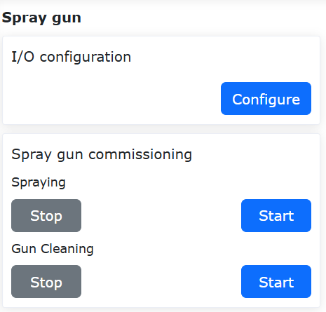

.. centered:: Abbildung 8.5‑1 Spritzpistolenkonfiguration

**Schritt 3**: Wählen Sie in der Programmierbefehlsoberfläche den Befehl "Spritzpistole". Fügen Sie je nach spezifischem Programmierbedarf (Teach) die vier Befehle "Spritzen starten", "Spritzen stoppen", "Reinigung starten" und "Reinigung stoppen" an den entsprechenden Stellen ein und wenden Sie sie an.

.. figure:: robot_peripherals/035.png
   :align: center
   :width: 6in

.. centered:: Abbildung 8.5‑2 Spritzpistolenbefehle

Programmierung (Teach) für Spritzanwendungen
~~~~~~~~~~~~~~~~~~~~~~~~~~~~~~~~~~~~~~~~~~~~~~~~

.. list-table::
   :widths: 15 40 100
   :header-rows: 1

   * - Nr.
     - Befehlsformat
     - Kommentar
   * - 1
     - Lin(template1,100,-1,0,0)
     - #Spritzbeginnpunkt
   * - 2
     - SprayStart()
     - #Spritzen starten
   * - 3
     - Lin(template2,100,-1,0,0)
     - #Spritzbahn
   * - 4
     - Lin(template3,100,-1,0,0)
     - #Spritzendpunkt
   * - 5
     - SprayStop()
     - #Spritzen stoppen
   * - 6
     - Lin(template4,100,-1,0,0)
     - #Reinigungspunkt
   * - 7
     - PowerCleanStart()
     - #Reinigung starten
   * - 8
     - WaitTime(5000)
     - #Reinigungszeit ms
   * - 9
     - PowerCleanStop()
     - #Reinigung stoppen

Schweißgerät
-------------

Der Einsatz eines kollaborativen Roboters mit einem Schweißbrenner für Schweißarbeiten kann die Schweißeffizienz und -qualität erheblich verbessern. FAIRINO-kollaborative Roboter können die Schweißsteuerung über drei Methoden realisieren: "Steuerungs-IO", "Digitales Kommunikationsprotokoll (UDP)" oder "Digitales Kommunikationsprotokoll (Modbus TCP)":

**Steuerungs-IO**: Der Roboter steuert die Schweißstrom- und Schweißspannungshöhe über die analogen Ausgänge (0-10 V) des Steuerschranks, steuert die Lichtbogenzündung, den Drahtvorschub und die Gaszufuhr über die digitalen Ausgänge des Steuerschranks und erfasst Signale wie Schweißgerät bereit und Lichtbogenzündung erfolgreich über die digitalen Eingänge des Steuerschranks.

**Digitales Kommunikationsprotokoll (UDP)**: Der Roboter kommuniziert über UDP mit einer SPS, die dann über den CANOpen-Bus oder ein anderes Protokoll mit dem Schweißgerät kommuniziert, um so Schweißspannung, -strom, Lichtbogenzündung, Drahtvorschub, Gaszufuhr usw. zu steuern (Der Inhalt des UDP-Kommunikationsprotokolls des Roboters siehe Anhang 1).

**Digitales Kommunikationsprotokoll (Modbus TCP)**: Dies ist das offene Peripherieprotokoll der Steuerung. Es handelt sich in der Regel um ein ausführbares LUA-Programm. Das Programm enthält Befehle zum Erstellen einer Kommunikation, zum zyklischen Schreiben von Steuerdaten an das Slave-Gerät und zum Lesen von Echtzeit-Statusdaten. Bei der Ausführung dieses LUA-Programms baut der Roboter eine Kommunikation mit dem Gerät auf und tauscht Daten aus. Im offenen Peripherieprotokoll (LUA-Programm) der Steuerung können Kommunikationsparameter wie IP-Adresse, Portnummer und Zykluszeit benutzerdefiniert eingestellt werden. Der Benutzer muss den Inhalt dieses Protokolls je nach tatsächlichem Gerät anpassen. Zu den Geräten, die das offene Peripherieprotokoll der Steuerung unterstützen, gehören Schleifköpfe, Lasersensoren, CNCs, Schweißgeräte usw. Der Dateiname für das offene Peripherieprotokoll der Steuerung muss mit `CtrlDev_` beginnen, z. B. "CtrlDev_Welding.lua". Es können maximal 4 offene Protokolle gleichzeitig ausgeführt werden.

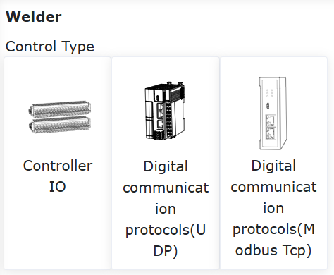

.. centered:: Abbildung 8.6‑1 Schweißgerät

Die Schweißsteuerung über "Steuerungs-IO" oder "Digitales Kommunikationsprotokoll (UDP)" umfasst hauptsächlich die folgenden Schritte: ① Montage des Schweißbrenners und Signalverdrahtung; ② Konfiguration der Schweißgeräteparameter; ③ Erstellung des Schweißsteuerungsprogramms.

Montage des Schweißbrenners
~~~~~~~~~~~~~~~~~~~~~~~~~~~~~~~~~~~~~

Der Schweißbrenner wird über eine Adapterplatte am Roboterflansch montiert. Das Kabel des Schweißbrenners muss am Roboterarm befestigt werden.

.. figure:: robot_peripherals/037.png
   :align: center
   :width: 3in

.. centered:: Abbildung 8.6‑2 Schweißbrenner am Roboterflansch montiert

Nach der festen Montage des Schweißbrenners wird das Werkzeugkoordinatensystem des Schweißbrenners mit der Sechs-Punkt-Methode kalibriert und als aktuelles Werkzeugkoordinatensystem angewendet. Die Kalibriergenauigkeit des Schweißbrenner-Werkzeugkoordinatensystems beeinflusst die tatsächliche Schweißgenauigkeit.

.. figure:: robot_peripherals/038.png
   :align: center
   :width: 4in

.. centered:: Abbildung 8.6-3 Kalibrierung und Anwendung des Roboter-Werkzeugkoordinatensystems

Konfiguration der Schweißgeräteparameter
~~~~~~~~~~~~~~~~~~~~~~~~~~~~~~~~~~~~~~~~~~~~~~~~~~~~~~~~~~~~~~~~~

Der kollaborative Roboter kann den Schweißprozess über "Steuerungs-IO"-Signale oder ein "Digitales Kommunikationsprotokoll" steuern. Die Konfigurationsschritte für die beiden Methoden unterscheiden sich hauptsächlich in zwei Punkten:

① Bei Verwendung von "Steuerungs-IO" muss die Entsprechung zwischen dem tatsächlichen Schweißstrom/Schweißspannung und dem Ausgangswert des analogen Ausgangs des Steuerschranks eingestellt werden.

② Bei Verwendung eines "Digitalen Kommunikationsprotokolls" müssen die Kommunikationsparameter konfiguriert werden.

Konfiguration der Schweißsteuerung über "Steuerungs-IO"
+++++++++++++++++++++++++++++++++++++++++++++++++++++++++++++++++++

Klicken Sie im Menü "Initiale Einstellungen" -> "Peripherie" -> "Schweißgerät" auf die Karte "Steuerungs-I/O", um zur Oberfläche zu gelangen.

.. figure:: robot_peripherals/039.png
   :align: center
   :width: 4in

.. centered:: Abbildung 8.6-4 Steuerungs-I/O

Konfiguration der Schweiß-IO-Signale
********************************************

Wie in der Abbildung gezeigt, wählen Sie die DI-Eingangsports für die Schweißgerätestatussignale und die DO-Ausgangsports für die Schweißgerätesteuerungssignale aus. Klicken Sie auf die Schaltfläche "Konfigurieren". Die Bedeutung der einzelnen Signale ist wie folgt:

.. figure:: robot_peripherals/040.png
   :align: center
   :width: 4in

.. centered:: Abbildung 8.6-5 Einstellen der Schweißgeräte-Signalports

**Schweißgerät bereit**: Wenn das Schweißgerät für den Schweißbetrieb bereit ist, sendet es dieses Signal an den Roboter.

Wenn das Schweißgerät aufgrund einer Störung oder aus anderen Gründen nicht bereit ist, wird dieses Signal nicht an den Roboter gesendet. Daraufhin erscheint oben rechts in der WebApp die Meldung "Schweißgerät nicht bereit". Wenn Ihr Schweißgerät kein "Bereit"-Signal hat, können Sie diesen Port auf "Kein" setzen.

.. figure:: robot_peripherals/041.png
   :align: center
   :width: 3in

.. centered:: Abbildung 8.6-6 Fehler: Schweißgerät nicht bereit

.. figure:: robot_peripherals/042.png
   :align: center
   :width: 4in

.. centered:: Abbildung 8.6-7 Schweißgerät bereit auf "Kein" gesetzt

**Lichtbogenzündung erfolgreich**: Die Lichtbogenzündung war erfolgreich. Nachdem der Roboter das Lichtbogenzünde-Signal an das Schweißgerät gesendet hat, wartet er auf das Rückmeldesignal "Lichtbogenzündung erfolgreich". Wenn der Roboter dieses Signal innerhalb der eingestellten Zeitüberschreitung nicht empfängt, meldet er den Fehler "Lichtbogenzündung Zeitüberschreitung".

Wenn Sie die Schweißfunktion des Roboters verwenden, können Sie auch ohne Konfiguration des "Lichtbogenzündung erfolgreich"-Signals schweißen, aber der Roboter gibt eine Warnung aus: "DI für Lichtbogenzündung erfolgreich nicht konfiguriert". Wenn Ihr Schweißgerät ein "Lichtbogenzündung erfolgreich"-Signal ausgibt, empfehlen wir, dieses Signal für sichereres Schweißen zu konfigurieren.

.. figure:: robot_peripherals/043.png
   :align: center
   :width: 3in

.. centered:: Abbildung 8.6-8 Fehler: Lichtbogenzündung Zeitüberschreitung

.. figure:: robot_peripherals/044.png
   :align: center
   :width: 3in

.. centered:: Abbildung 8.6-9 Warnung: DI für Lichtbogenzündung erfolgreich nicht konfiguriert

**Wiederaufnahme nach Schweißunterbrechung**: Eine Schweißunterbrechung kann während des Schweißprozesses durch unbeabsichtigtes Erlöschen des Lichtbogens oder durch aktives Pausieren durch den Bediener ausgelöst werden. Wenn nach einer Unterbrechung dieses externe Signal an den Roboter von inaktiv auf aktiv wechselt, setzt der Roboter automatisch das Schweißen an der ursprünglichen Unterbrechungsstelle fort.

**Beenden nach Schweißunterbrechung**: Eine Schweißunterbrechung kann während des Schweißprozesses durch unbeabsichtigtes Erlöschen des Lichtbogens oder durch aktives Pausieren durch den Bediener ausgelöst werden. Wenn nach einer Unterbrechung dieses externe Signal an den Roboter von inaktiv auf aktiv wechselt, beendet der Roboter das Schweißen. Nach dem Beenden kann das Schweißen nicht wieder aufgenommen werden.

**Schweißgerät Lichtbogenzündung**: DO-Ausgangsport des Roboters zur Steuerung der Lichtbogenzündung des Schweißgeräts. Wenn das Roboterprogramm den Lichtbogenzünde-Befehl ausführt, wird der diesem Befehl entsprechende DO-Ausgangsport automatisch aktiv.

**Gasprüfung**: DO-Ausgangsport des Roboters zur Steuerung der Gaszufuhr des Schweißgeräts. Wenn das Roboterprogramm den Gaszufuhr-Befehl ausführt, wird der diesem Befehl entsprechende DO-Ausgangsport automatisch aktiv.

**Vorwärtsdrahtvorschub**: DO-Ausgangsport des Roboters zur Steuerung des Vorwärtsdrahtvorschubs des Schweißgeräts. Wenn das Roboterprogramm den Vorwärtsdrahtvorschub-Befehl ausführt, wird der diesem Befehl entsprechende DO-Ausgangsport automatisch aktiv.

**Rückwärtsdrahtvorschub**: DO-Ausgangsport des Roboters zur Steuerung des Rückwärtsdrahtvorschubs des Schweißgeräts. Wenn das Roboterprogramm den Rückwärtsdrahtvorschub-Befehl ausführt, wird der diesem Befehl entsprechende DO-Ausgangsport automatisch aktiv.

Konfiguration der Schweißprozessparameter
********************************************

Wie in der Abbildung gezeigt, suchen Sie im Schweißkonfigurationsbereich den Abschnitt "Schweißprozessparameter". Der kollaborative Roboter bietet insgesamt 100 Gruppen von Schweißprozessparametern (0 bis 99). Die Prozessnummer 0 bedeutet, dass keine Schweißprozesskurve verwendet wird. Die Prozessnummern 1-99 verwenden eine Schweißprozesskurve.

.. figure:: robot_peripherals/045.png
   :align: center
   :width: 4in

.. centered:: Abbildung 8.6-10 Konfiguration der Schweißprozessparameter

Bei Verwendung einer Schweißprozesskurve (z. B. Auswahl der Prozessnummer 1) geben Sie nacheinander die Parameter von "Lichtbogenzündstrom" bis "Lichtbogenbeendzeit" wie in Abbildung 8 ein und klicken auf "Konfigurieren". Der tatsächliche Schweißprozess, der durch diese Prozessparameter dargestellt wird, ist wie folgt:

① Einstellen des Schweißstroms auf 200 A, der Schweißspannung auf 23 V.

② Lichtbogen zünden, auf Erfolgsmeldung warten.

③ Nach erfolgreicher Zündung brennt der Lichtbogen für 500 ms (Lichtbogenzündzeit, Roboter bewegt sich nicht).

④ Einstellen des Schweißstroms auf 150 A, der Schweißspannung auf 21 V. Dann beginnt der Roboter sich zu bewegen und zu schweißen.

⑤ Nach dem Schweißen bis zum Endpunkt wird der Schweißstrom auf 100 A, die Schweißspannung auf 19 V eingestellt (Lichtbogenbeendstrom, Lichtbogenbeendspannung).

⑥ Nach dem Einstellen von Strom und Spannung für die Lichtbogenbeendung brennt der Lichtbogen für 500 ms weiter (Roboter bewegt sich nicht). Schließlich erlischt der Lichtbogen.

Wenn keine Schweißprozesskurve verwendet wird (Auswahl der Prozessnummer 0), ist der Schweißprozess wie folgt:

① Einstellen des Schweißstroms und der Schweißspannung.

② Der Roboter steuert die Lichtbogenzündung des Schweißgeräts und wartet auf die Erfolgsmeldung.

③ Nach erfolgreicher Zündung beginnt der Roboter sich zu bewegen und zu schweißen.

④ Nach dem Schweißen bis zum Endpunkt erlischt der Lichtbogen sofort.

.. figure:: robot_peripherals/046.png
   :align: center
   :width: 4in

.. centered:: Abbildung 8.6-11 Keine Verwendung einer Schweißprozesskurve

Einstellung des Verhältnisses zwischen Schweißstrom/Spannung und Analogausgang
****************************************************************************************

Wenn der Steuerungstyp für die Schweißsteuerung auf "Steuerungs-IO" gesetzt ist, werden die Schweißstrom- und Schweißspannungswerte über die analogen Ausgänge des Steuerschranks gesteuert (Der analoge Ausgangsspannungsbereich des Steuerschranks beträgt 0 ~ 10 V). In diesem Fall muss die lineare Entsprechung zwischen dem Analogausgangswert des Steuerschranks und den tatsächlichen Schweißstrom-/Spannungswerten konfiguriert werden.

Wie in Abbildung 12 gezeigt, suchen Sie im Schweißkonfigurationsbereich das "Diagramm des Verhältnisses zwischen analogem Strom/Spannung". "A-V" steht für die Entsprechung zwischen Schweißstrom und der vom Steuerschrank ausgegebenen analogen Spannung. "V-V" steht für die Entsprechung zwischen Schweißspannung und der vom Steuerschrank ausgegebenen analogen Spannung.

Wählen Sie "A-V", geben Sie den Schweißstrombereich 0-1000 A, die analoge Ausgangsspannung 0-10 V und den Ausgangs-AO als "Ctrl-AO0" (Analogausgangsport für Schweißstromsteuerung ist AO0) ein. Klicken Sie auf die Schaltfläche "Konfigurieren". Mit diesen Parametern entspricht eine analoge Ausgangsspannung des Steuerschranks von 1,5 V einem Schweißstrom von 150 A.

.. figure:: robot_peripherals/047.png
   :align: center
   :width: 4in

.. centered:: Abbildung 8.6-12 Konfiguration der Entsprechung zwischen Schweißstrom und Analogausgang

Wie in Abbildung 13 gezeigt, klicken Sie auf "V-V", um die Entsprechung zwischen Schweißspannung und der analogen Ausgangsspannung des Steuerschranks einzustellen. Geben Sie den Schweißspannungsbereich 0-60 V, die analoge Ausgangsspannung 0-10 V und den Ausgangs-AO als "Ctrl-AO1" (Analogausgangsport für Schweißstromsteuerung ist AO1) ein. Klicken Sie auf "Konfigurieren". Wenn der analoge Ausgang AO1 des Steuerschranks 3,5 V ausgibt, beträgt die tatsächlich gesteuerte Schweißspannung 21 V.

.. figure:: robot_peripherals/048.png
   :align: center
   :width: 4in

.. centered:: Abbildung 8.6-13 Konfiguration der Entsprechung zwischen Schweißspannung und Analogausgang

Schweißgerätetest (Debugging)
*******************************

Suchen Sie im Schweißkonfigurationsbereich den Punkt "Schweißgerätetest". Wählen Sie die Prozessnummer 1, geben Sie eine Zeitüberschreitung von 1000 ms ein und klicken Sie auf "Gas zu". Der Roboter steuert dann das Schweißgerät an, um Schutzgas zuzuführen. Klicken Sie auf die Schaltfläche "Gas aus", um die Schutzgaszufuhr zu stoppen. Die anderen Schaltflächen "Lichtbogen zünden", "Vorwärtsdrahtvorschub", "Rückwärtsdrahtvorschub" usw. werden auf die gleiche Weise bedient und werden hier nicht wiederholt.

.. figure:: robot_peripherals/049.png
   :align: center
   :width: 4in

.. centered:: Abbildung 8.6-14 Schweißgerätetest

Konfiguration der Schweißsteuerung über "Digitales Kommunikationsprotokoll (UDP)"
+++++++++++++++++++++++++++++++++++++++++++++++++++++++++++++++++++++++++++++++++++++++

Wenn der Roboter die Schweißsteuerung über ein "Digitales Kommunikationsprotokoll" durchführt, kommuniziert er im Wesentlichen über UDP mit einer SPS. Der Roboter sendet Steuerdaten für Lichtbogenzündung, Drahtvorschub, Gaszufuhr, Strom, Spannung usw. per UDP an die SPS. Die SPS wiederum steuert das Schweißgerät über den CANOpen-Bus (oder auf andere Weise) und erfasst gleichzeitig die tatsächlichen Schweißstrom-/Spannungswerte sowie das "Lichtbogenzündung erfolgreich"-Signal und sendet sie zurück an den Roboter (Der Inhalt des UDP-Kommunikationsprotokolls des Roboters siehe Anhang 1).

Klicken Sie im Menü "Initiale Einstellungen" -> "Peripherie" auf "Schweißgerät", um zur Schweißgerätekonfigurationsoberfläche zu gelangen. Wie unten gezeigt:

.. figure:: robot_peripherals/050.png
   :align: center
   :width: 4in

.. centered:: Abbildung 8.6-15 Digitales Kommunikationsprotokoll (UDP)

Da der Roboter über UDP mit der SPS kommuniziert, müssen die UDP-Kommunikationsparameter konfiguriert werden. Die Bedeutung der einzelnen Parameter ist wie folgt:

**IP-Adresse**: IP-Adresse der SPS für die UDP-Kommunikation.

**Portnummer**: UDP-Kommunikationsportnummer der SPS.

**Kommunikationszyklus**: Zykluszeit der UDP-Kommunikation zwischen Roboter und SPS, Standard 2 ms.

**Paketverlust-Erkennungszyklus, Anzahl der Paketverluste**: Wenn die Anzahl der Paketverluste innerhalb des Paketverlust-Erkennungszyklus einen eingestellten Wert überschreitet, meldet der Roboter den Fehler "Anormale UDP-Paketverluste" und die Kommunikation wird automatisch getrennt.

**Bestätigungsdauer Kommunikationsunterbrechung**: Wenn der Roboter innerhalb dieser Zeit kein vollständiges Datenpaket von der SPS empfängt, meldet er den Alarm "UDP-Kommunikationsunterbrechung" und trennt die UDP-Kommunikation.

**Automatische Wiederverbindung nach Neustart (Strom aus/ein)**: Legt fest, ob der Roboter nach einem Neustart automatisch versuchen soll, die Verbindung wiederherzustellen.

**Automatische Wiederverbindung bei Kommunikationsunterbrechung**: Legt fest, ob der Roboter bei einer Unterbrechung der UDP-Kommunikation automatisch versuchen soll, die Verbindung wiederherzustellen.

**Wiederverbindungszyklus, Anzahl der Wiederverbindungsversuche**: Wenn die automatische Wiederverbindung bei Kommunikationsunterbrechung aktiviert ist und eine Unterbrechung erkannt wird, versucht der Roboter im eingestellten Zyklus, die Verbindung wiederherzustellen. Wenn die maximale Anzahl der Wiederverbindungsversuche erreicht ist und keine Verbindung hergestellt werden konnte, meldet der Roboter den Fehler "UDP-Kommunikationsunterbrechung" und trennt die UDP-Kommunikation.

Nachdem die oben genannten Parameter konfiguriert wurden, klicken Sie auf die Schaltfläche "Konfigurieren". Klicken Sie nach erfolgreicher Konfiguration auf die Schaltfläche "Laden".

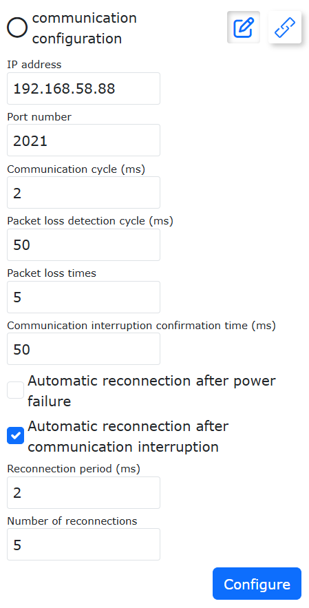

.. centered:: Abbildung 8.6-16 UDP-Kommunikationskonfiguration

.. note::
   .. image:: robot_peripherals/052.png
      :height: 0.75in
      :align: left

   Bezeichnung: **Schaltfläche "Bearbeiten"**

   Funktion: Öffnet/schließt die Konfiguration der UDP-Kommunikationsparameter.

.. note::
   .. image:: robot_peripherals/053.png
      :height: 0.75in
      :align: left

   Bezeichnung: **Schaltfläche "Laden"**

   Funktion: Lädt die UDP-Kommunikation.

Konfiguration der Schweiß-IO-Signale
********************************************

Wählen Sie die DI-Eingangsports für die Schweißgerätestatussignale und die DO-Ausgangsports für die Schweißgerätesteuerungssignale aus. Klicken Sie auf die Schaltfläche "Konfigurieren". Die Bedeutung der einzelnen Signale ist wie folgt:

.. figure:: robot_peripherals/054.png
   :align: center
   :width: 4in

.. centered:: Abbildung 8.6-17 Einstellen der Schweißgeräte-Signalports

**Schweißgerät bereit**: Wenn das Schweißgerät für den Schweißbetrieb bereit ist, sendet es dieses Signal an den Roboter.

Wenn das Schweißgerät aufgrund einer Störung oder aus anderen Gründen nicht bereit ist, wird dieses Signal nicht an den Roboter gesendet. Daraufhin erscheint oben rechts in der WebApp die Meldung "Schweißgerät nicht bereit". Wenn Ihr Schweißgerät kein "Bereit"-Signal hat, können Sie diesen Port auf "-1" setzen.

.. figure:: robot_peripherals/041.png
   :align: center
   :width: 3in

.. centered:: Abbildung 8.6-18 Fehler: Schweißgerät nicht bereit

.. figure:: robot_peripherals/055.png
   :align: center
   :width: 4in

.. centered:: Abbildung 8.6-19 Schweißgerät bereit auf "-1" gesetzt

**Lichtbogenzündung erfolgreich**: Die Lichtbogenzündung war erfolgreich. Nachdem der Roboter das Lichtbogenzünde-Signal an das Schweißgerät gesendet hat, wartet er auf das Rückmeldesignal "Lichtbogenzündung erfolgreich". Wenn der Roboter dieses Signal innerhalb der eingestellten Zeitüberschreitung nicht empfängt, meldet er den Fehler "Lichtbogenzündung Zeitüberschreitung".

Wenn Sie die Schweißfunktion des Roboters verwenden, können Sie auch ohne Konfiguration des "Lichtbogenzündung erfolgreich"-Signals schweißen, aber der Roboter gibt eine Warnung aus: "DI für Lichtbogenzündung erfolgreich nicht konfiguriert". Wenn Ihr Schweißgerät ein "Lichtbogenzündung erfolgreich"-Signal ausgibt, empfehlen wir, dieses Signal für sichereres Schweißen zu konfigurieren.

.. figure:: robot_peripherals/043.png
   :align: center
   :width: 3in

.. centered:: Abbildung 8.6-20 Fehler: Lichtbogenzündung Zeitüberschreitung

.. figure:: robot_peripherals/044.png
   :align: center
   :width: 3in

.. centered:: Abbildung 8.6-21 Fehler: DI für Lichtbogenzündung erfolgreich nicht konfiguriert

**Wiederaufnahme nach Schweißunterbrechung**: Eine Schweißunterbrechung kann während des Schweißprozesses durch unbeabsichtigtes Erlöschen des Lichtbogens oder durch aktives Pausieren durch den Bediener ausgelöst werden. Wenn nach einer Unterbrechung dieses externe Signal an den Roboter von inaktiv auf aktiv wechselt, setzt der Roboter automatisch das Schweißen an der ursprünglichen Unterbrechungsstelle fort.

**Beenden nach Schweißunterbrechung**: Eine Schweißunterbrechung kann während des Schweißprozesses durch unbeabsichtigtes Erlöschen des Lichtbogens oder durch aktives Pausieren durch den Bediener ausgelöst werden. Wenn nach einer Unterbrechung dieses externe Signal an den Roboter von inaktiv auf aktiv wechselt, beendet der Roboter das Schweißen. Nach dem Beenden kann das Schweißen nicht wieder aufgenommen werden.

**Schweißgerät Lichtbogenzündung**: DO-Ausgangsport des Roboters zur Steuerung der Lichtbogenzündung des Schweißgeräts. Wenn das Roboterprogramm den Lichtbogenzünde-Befehl ausführt, wird der diesem Befehl entsprechende DO-Ausgangsport automatisch aktiv.

**Gasprüfung**: DO-Ausgangsport des Roboters zur Steuerung der Gaszufuhr des Schweißgeräts. Wenn das Roboterprogramm den Gaszufuhr-Befehl ausführt, wird der diesem Befehl entsprechende DO-Ausgangsport automatisch aktiv.

**Vorwärtsdrahtvorschub**: DO-Ausgangsport des Roboters zur Steuerung des Vorwärtsdrahtvorschubs des Schweißgeräts. Wenn das Roboterprogramm den Vorwärtsdrahtvorschub-Befehl ausführt, wird der diesem Befehl entsprechende DO-Ausgangsport automatisch aktiv.

**Rückwärtsdrahtvorschub**: DO-Ausgangsport des Roboters zur Steuerung des Rückwärtsdrahtvorschubs des Schweißgeräts. Wenn das Roboterprogramm den Rückwärtsdrahtvorschub-Befehl ausführt, wird der diesem Befehl entsprechende DO-Ausgangsport automatisch aktiv.

Konfiguration der Schweißprozessparameter
********************************************

Suchen Sie im Schweißkonfigurationsbereich den Abschnitt "Schweißprozessparameter", wie in Abbildung 22 gezeigt. Der kollaborative Roboter bietet insgesamt 100 Gruppen von Schweißprozessparametern (0 bis 99). Die Prozessnummer 0 bedeutet, dass keine Schweißprozesskurve verwendet wird. Die Prozessnummern 1-99 verwenden eine Schweißprozesskurve.

.. figure:: robot_peripherals/045.png
   :align: center
   :width: 4in

.. centered:: Abbildung 8.6-22 Konfiguration der Schweißprozessparameter

Bei Verwendung einer Schweißprozesskurve (z. B. Auswahl der Prozessnummer 1) geben Sie nacheinander die Parameter von "Lichtbogenzündstrom" bis "Lichtbogenbeendzeit" wie in Abbildung 8 ein und klicken auf "Konfigurieren". Der tatsächliche Schweißprozess, der durch diese Prozessparameter dargestellt wird, ist wie folgt:

① Einstellen des Schweißstroms auf 200 A, der Schweißspannung auf 23 V.

② Lichtbogen zünden, auf Erfolgsmeldung warten.

③ Nach erfolgreicher Zündung brennt der Lichtbogen für 500 ms (Lichtbogenzündzeit, Roboter bewegt sich nicht).

④ Einstellen des Schweißstroms auf 150 A, der Schweißspannung auf 21 V. Dann beginnt der Roboter sich zu bewegen und zu schweißen.

⑤ Nach dem Schweißen bis zum Endpunkt wird der Schweißstrom auf 100 A, die Schweißspannung auf 19 V eingestellt (Lichtbogenbeendstrom, Lichtbogenbeendspannung).

⑥ Nach dem Einstellen von Strom und Spannung für die Lichtbogenbeendung brennt der Lichtbogen für 500 ms weiter (Roboter bewegt sich nicht). Schließlich erlischt der Lichtbogen.

Wenn keine Schweißprozessparameter verwendet werden (Auswahl der Prozessnummer 0), ist der Schweißprozess wie folgt:

① Einstellen des Schweißstroms und der Schweißspannung über die entsprechenden Schnittstellen.

② Der Roboter steuert die Lichtbogenzündung des Schweißgeräts und wartet auf die Erfolgsmeldung.

③ Nach erfolgreicher Zündung beginnt der Roboter sich zu bewegen und zu schweißen.

④ Nach dem Schweißen bis zum Endpunkt erlischt der Lichtbogen sofort.

.. figure:: robot_peripherals/046.png
   :align: center
   :width: 4in

.. centered:: Abbildung 8.6-23 Keine Verwendung einer Schweißprozesskurve

Schweißgerätetest (Debugging)
*******************************

Suchen Sie im Schweißkonfigurationsbereich den Punkt "Schweißgerätetest". Wählen Sie die Prozessnummer 1, geben Sie eine Zeitüberschreitung von 1000 ms ein und klicken Sie auf "Gas zu". Der Roboter steuert dann das Schweißgerät an, um Schutzgas zuzuführen. Klicken Sie auf die Schaltfläche "Gas aus", um die Schutzgaszufuhr zu stoppen. Die anderen Schaltflächen "Lichtbogen zünden", "Vorwärtsdrahtvorschub", "Rückwärtsdrahtvorschub" usw. werden auf die gleiche Weise bedient und werden hier nicht wiederholt.

.. figure:: robot_peripherals/049.png
   :align: center
   :width: 4in

.. centered:: Abbildung 8.5-24 Schweißgerätetest

Erstellung des Schweißprogramms
~~~~~~~~~~~~~~~~~~~~~~~~~~~~~~~~~~~~~~~~~~~~~~~~~~~

Programmierung mit Schweißprozesskurve
++++++++++++++++++++++++++++++++++++++++++++++++++++

Bei Verwendung einer Schweißprozesskurve (Auswahl der Schweißprozessparameternummer 1 ~ 99) folgt die Steuerung von Spannung und Strom während des Schweißprozesses den Kurvenparametern der gewählten Prozessnummer. Es müssen keine separaten Befehle zum Einstellen von Schweißspannung und -strom hinzugefügt werden. Wie in Abbildung 25 gezeigt, klicken Sie auf "Teach-Programm" -> "Programmierung" und erstellen Sie ein neues Benutzerprogramm "testWeld.lua".

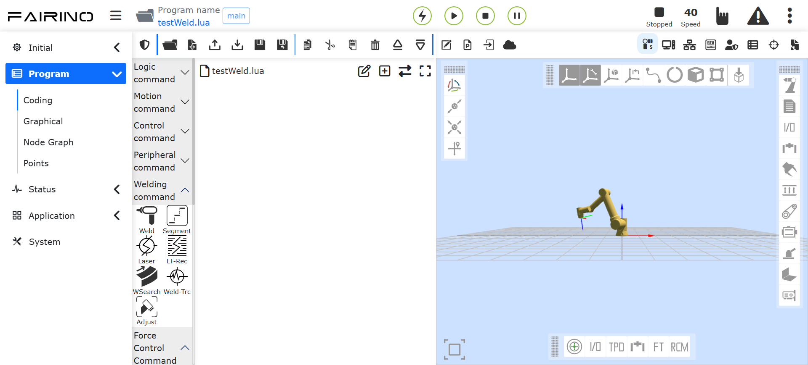

.. centered:: Abbildung 8.6-25 Erstellen des Programms "testWeld.lua"

Wählen Sie in der geöffneten Oberfläche zum Hinzufügen von Schweißbefehlen den Steuerungstyp "Steuerungs-I/O" (entsprechend der tatsächlich konfigurierten Schweißsteuerungsmethode). Wählen Sie die Schweißprozessnummer 1 (Nummer 0 verwendet keine Schweißprozesskurve, Nummern 1-99 verwenden eine Kurve). Geben Sie die maximale Wartezeit 10000 ms ein. Klicken Sie nacheinander auf die Schaltflächen "Lichtbogen zünden" und "Lichtbogen beenden". Klicken Sie abschließend auf "Anwenden".

.. figure:: robot_peripherals/057.png
   :align: center
   :width: 6in

.. centered:: Abbildung 8.6-26 Schweißbefehl hinzufügen

Dem Programm "testWeld.lua" wurden nun die Befehle zum Zünden und Beenden des Lichtbogens hinzugefügt. Da für das Zünden und Beenden die Schweißprozesskurve Nummer 1 verwendet wird, folgt die Steuerung von Spannung und Strom während des Schweißens den Kurvenparametern der Prozessnummer 1. Es müssen keine separaten Befehle zum Einstellen von Schweißspannung und -strom hinzugefügt werden.

.. figure:: robot_peripherals/058.png
   :align: center
   :width: 6in

.. centered:: Abbildung 8.6-27 Programm mit Lichtbogenzündung und -beendung

Fügen Sie zwei Linearbewegungsbefehle hinzu und passen Sie die Befehlsreihenfolge so an, dass der Roboter zuerst zum Punkt "P1" fährt, den Lichtbogen zündet, dann zum Punkt "P2" fährt und den Lichtbogen beendet. Dadurch schweißt der Roboter von Punkt "P1" nach Punkt "P2".

.. figure:: robot_peripherals/059.png
   :align: center
   :width: 6in

.. centered:: Abbildung 8.6-28 Roboter schweißt von Punkt P1 nach Punkt P2

Programmierung ohne Schweißprozesskurve
++++++++++++++++++++++++++++++++++++++++++++++++++++

Bei Verwendung **keiner** Schweißprozesskurve (Auswahl der Schweißprozessparameternummer 0) müssen im Schweißprogramm Befehle zum Einstellen der Schweißspannung und des Schweißstroms hinzugefügt werden, um die tatsächlichen Schweißparameter zu steuern. Klicken Sie auf "Teach-Simulation", "Programmierung (Teach)" und erstellen Sie ein neues Benutzerprogramm "testWeld.lua".

.. centered:: Abbildung 8.6-29 Erstellen des Programms "testWeld.lua"

Wählen Sie in der geöffneten Oberfläche zum Hinzufügen von Schweißbefehlen den Steuerungstyp "Steuerungs-I/O" (entsprechend der tatsächlich konfigurierten Schweißsteuerungsmethode). Wählen Sie die Schweißprozessnummer 0 (Nummer 0 verwendet keine Schweißprozesskurve, Nummern 1-99 verwenden eine Kurve). Wählen Sie für die Schweißstromsteuerung den AO "Ctrl-AO0", stellen Sie den Schweißstrom auf 150 A ein und klicken Sie auf "Hinzufügen". Wählen Sie für die Schweißspannungssteuerung den AO "Ctrl-AO1", stellen Sie die Schweißspannung auf 21 V ein und klicken Sie auf "Hinzufügen". Geben Sie die maximale Wartezeit 10000 ms ein. Klicken Sie nacheinander auf die Schaltflächen "Lichtbogen zünden" und "Lichtbogen beenden". Klicken Sie abschließend auf "Anwenden".

.. figure:: robot_peripherals/057.png
   :align: center
   :width: 6in

.. centered:: Abbildung 8.6-30 Schweißbefehl hinzufügen

Dem Programm "testWeld.lua" wurden nun die Befehle zum Einstellen von Spannung/Strom sowie zum Zünden und Beenden des Lichtbogens hinzugefügt. Da für das Zünden und Beenden die Schweißprozessnummer 0 gewählt wurde, wird bei der Ausführung der Befehle zum Einstellen von Spannung/Strom der entsprechende Analogausgang des Steuerschranks automatisch entsprechend den eingestellten Spannungs-/Stromwerten und der auf der Schweißgeräte-Konfigurationsseite eingestellten "Entsprechung zwischen Schweißspannung/-strom und Analogausgang" ausgegeben.

.. figure:: robot_peripherals/060.png
   :align: center
   :width: 6in

.. centered:: Abbildung 8.6-31 Programm zum Einstellen von Schweißspannung, -strom, Lichtbogenzündung und -beendung

Fügen Sie zwei Linearbewegungsbefehle hinzu und passen Sie die Befehlsreihenfolge so an, dass der Roboter zuerst zum Punkt "P1" fährt, den Lichtbogen zündet, dann zum Punkt "P2" fährt und den Lichtbogen beendet. Dadurch schweißt der Roboter von Punkt "P1" nach Punkt "P2".

.. figure:: robot_peripherals/061.png
   :align: center
   :width: 6in

.. centered:: Abbildung 8.6-32 Roboter schweißt von Punkt P1 nach Punkt P2

Durch Ausführen des obigen Programms wird eine gerade Schweißnaht von P1 nach P2 realisiert. Überprüfen Sie vor der Programmausführung Folgendes:

① Ist der Schweißbrenner korrekt montiert? Ist das Werkzeugkoordinatensystem des Brenners kalibriert und als aktuelles Werkzeugkoordinatensystem angewendet?

② Funktionieren die Schweißstromquelle, die Gasversorgung und der Drahtvorschub einwandfrei?

③ Sind alle Signalleitungen zwischen Roboter und Schweißgerät korrekt angeschlossen?

Schweißunterbrechung und Wiederaufnahme
~~~~~~~~~~~~~~~~~~~~~~~~~~~~~~~~~~~~~~~~~~~~~~~~~~~

Während des Schweißprozesses kann der Roboter in folgenden Fällen unterbrochen werden:

① Der Bediener pausiert das Schweißen aktiv, um die Schweißnaht zu überprüfen oder die Düse zu reinigen.

② Der Lichtbogen erlischt unbeabsichtigt.

③ Eine Kollision des Roboters führt zu einer Schweißunterbrechung.

Nach einer Unterbrechung während des Schweißens kann der Bediener den Roboter in den Handmodus schalten, ihn in eine sichere Position ziehen und die Ursache der Unterbrechung beheben.

Nach der Behebung des Problems kann der kollaborative Roboter automatisch von seiner aktuellen Position zur Position der Schweißunterbrechung fahren, den Lichtbogen erneut zünden und das Schweißen fortsetzen. Der genaue Ablauf ist:

① Konfiguration der Parameter für die Wiederaufnahme nach Schweißunterbrechung.

② Ausführen des Schweißprogramms und während des Schweißens pausieren, um eine Unterbrechung zu verursachen.

③ Den Roboter in den Handmodus schalten, das Problem beheben und dann wieder in den Automatikmodus schalten.

④ Auf die Schaltfläche "Schweißen fortsetzen" klicken. Der Roboter setzt das Schweißen automatisch fort.

Konfiguration der Parameter für die Wiederaufnahme nach Schweißunterbrechung
+++++++++++++++++++++++++++++++++++++++++++++++++++++++++++++++++++++++++++++

Klicken Sie im Menü "Initiale Einstellungen" -> "Peripherie" auf "Schweißgerät", um zur Schweißgerätekonfigurationsoberfläche zu gelangen. Suchen Sie den Abschnitt "Konfiguration der Parameter zur Erkennung von Lichtbogenunterbrechungen". Aktivieren Sie "Funktion aktivieren", geben Sie eine "Bestätigungsdauer" von 20 ms ein und klicken Sie auf "Konfigurieren". Dies bedeutet, dass der Roboter den Fehler "Schweißlichtbogen unterbrochen" meldet, wenn das Signal "Lichtbogenzündung erfolgreich" länger als 20 ms inaktiv ist.

.. figure:: robot_peripherals/062.png
   :align: center
   :width: 4in

.. centered:: Abbildung 8.6-33 Konfiguration der Parameter zur Erkennung von Lichtbogenunterbrechungen

Suchen Sie den Abschnitt "Konfiguration der Parameter für Wiederaufnahme nach Schweißunterbrechung". Aktivieren Sie "Funktion aktivieren", geben Sie einen "Überlappungsabstand" von 5 mm, eine "Geschwindigkeit" von 10 % und eine "Bewegungsart" von "PTP" ein. Klicken Sie auf "Konfigurieren". Die Bedeutung der drei Parameter ist wie folgt:

**Überlappungsabstand**: Um die Kontinuität der Schweißnaht nach der Wiederaufnahme mit der Schweißnaht vor der Unterbrechung zu gewährleisten, muss der Wiederaufnahme-Lichtbogenstartpunkt einen gewissen Überlappungsabstand zur ursprünglichen Schweißnaht haben.

**Geschwindigkeit**: Nach einer Schweißunterbrechung muss der Roboter oft in eine sichere Position bewegt und die Schweißnaht bearbeitet werden. Wenn die Wiederaufnahme ausgeführt wird, fährt der Roboter von seiner aktuellen Position zum Wiederaufnahme-Lichtbogenstartpunkt. Diese "Geschwindigkeit" ist die Geschwindigkeit, mit der der Roboter zum Wiederaufnahmepunkt fährt.

**Bewegungsart**: Nach einer Schweißunterbrechung muss der Roboter oft in eine sichere Position bewegt und die Schweißnaht bearbeitet werden. Wenn die Wiederaufnahme ausgeführt wird, fährt der Roboter von seiner aktuellen Position zum Wiederaufnahme-Lichtbogenstartpunkt. Diese "Bewegungsart" ist die Art der Bewegung zum Wiederaufnahmepunkt, wahlweise "LIN" oder "PTP".

.. figure:: robot_peripherals/063.png
   :align: center
   :width: 4in

.. centered:: Abbildung 8.6-34 Konfiguration der Parameter für Wiederaufnahme nach Schweißunterbrechung

Anwendung der Wiederaufnahme nach Schweißunterbrechung
+++++++++++++++++++++++++++++++++++++++++++++++++++++++++++++

Am Beispiel des Programms "testWeld". Schalten Sie den Roboter in den Automatikmodus und klicken Sie auf die Starttaste. Der Roboter beginnt mit dem Schweißen. Klicken Sie während des Schweißens auf die Pausentaste. Daraufhin wird der Schweißvorgang unterbrochen und oben rechts in der WebApp erscheint ein Hinweisfeld zur Wiederaufnahme. Klicken Sie auf die Schaltfläche "Schweißen fortsetzen". Der Roboter fährt automatisch zum Wiederaufnahme-Lichtbogenstartpunkt und setzt den Schweißvorgang fort.

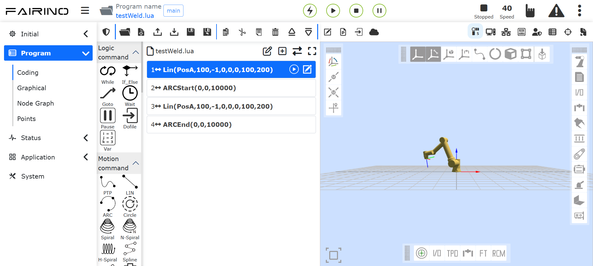

.. centered:: Abbildung 8.6-35 Ausführen des Schweißprogramms

.. figure:: robot_peripherals/065.png
   :align: center
   :width: 6in

.. centered:: Abbildung 8.6-36 Schweißen fortsetzen

.. warning::
   Die Funktion zur Wiederaufnahme nach Schweißunterbrechung des kollaborativen Roboters kann nur für gerade Schweißnähte oder Kreisbogenschweißnähte verwendet werden. Bei Verwendung einer while(1)-Schleife für das Schweißen werden keine verschachtelten mehrschichtigen while-Schleifen unterstützt. Sie darf keine bedingten Anweisungen mit lokalen Variablen enthalten. Bei Verwendung der Intervallschweißfunktion achten Sie darauf, die Schnittstelle zur Rückmeldung von Intervallschweißinformationen hinzuzufügen.

Kommunikationsanpassung für Roboter-Laserschweißgerät
~~~~~~~~~~~~~~~~~~~~~~~~~~~~~~~~~~~~~~~~~~~~~~~~~~~~~~~~~~~~~~~~~~~~~~~~~~~~~~~~~

Hintergrund
++++++++++++++++++++++++++++++++++++++++++++

Dieses Benutzerhandbuch erklärt die Kommunikation am Beispiel des bereits angepassten Laserschweißgeräts REDSABERE 1500. Der Roboter steuert den Schweißprozess über das "Digitale Kommunikationsprotokoll". Im Wesentlichen kommuniziert der Roboter über UDP mit der SPS. Der Roboter sendet Steuerungsdaten über UDP an die SPS, die dann das Laserschweißgerät weiter über Modbus RTU steuert. Gleichzeitig erfasst die SPS die tatsächlichen Laser-Schweißprozessparameter und Steuersignale und leitet sie an den Roboter zurück. Der Inhalt des UDP-Kommunikationsprotokolls des Roboters ist in Anhang I aufgeführt.

SPS-Konfiguration
++++++++++++++++++++++++++++++++++++++++++++

.. list-table:: 
   :widths: 25 25 25 25
   :header-rows: 1

   * - Marke
     - Modell
     - Software
     - IP-Adresse
   * - Inovance
     - EASY521-0808TN
     - AutoShopV4.11.0.1
     - 192.168.58.88
			
Programm-Download: Öffnen Sie das Testprogramm. Die Standard-SPS-IP-Adresse ist "192.168.1.88". Ändern Sie die SPS-IP-Adresse auf "192.168.58.88".

Klicken Sie auf die Test-Taste, um die aktuelle SPS-Kommunikation zu verbinden, wie in der folgenden Abbildung dargestellt;

.. figure:: robot_peripherals/293.png
   :align: center
   :width: 6in 

.. centered:: Abbildung 8.6-37 SPS-Kommunikationsverbindung

Nach erfolgreicher Verbindung mit der aktuellen SPS ändern Sie die IP-Adresse wie unten dargestellt;

.. figure:: robot_peripherals/294.png
   :align: center
   :width: 6in 

.. centered:: Abbildung 8.6-38 SPS-IP-Adressänderung

Ändern Sie auf 192.168.58.88 und ändern Sie das Standard-Gateway auf 192.168.58.1, wie unten dargestellt;

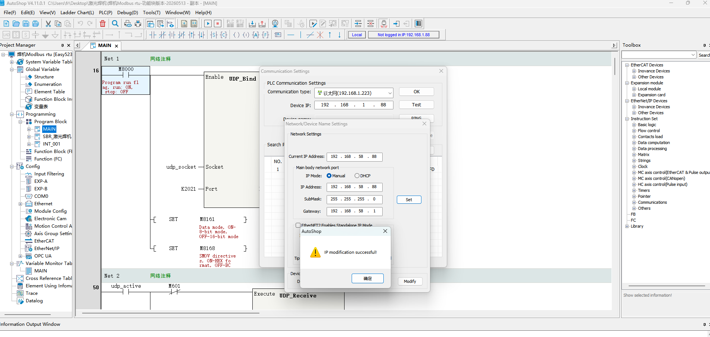

.. centered:: Abbildung 8.6-39 SPS-Gateway-Adressänderung

Ändern Sie die lokale IP-Adresse des Computers auf das 58er Netzwerksegment und klicken Sie erneut auf die Test-Taste, um zu überprüfen, ob die Kommunikation erfolgreich ist, wie unten dargestellt;

.. figure:: robot_peripherals/296.png
   :align: center
   :width: 6in 

.. centered:: Abbildung 8.6-40 SPS-Verbindungstest

Klicken Sie auf die Download-Taste, um das Programm herunterzuladen, wie unten dargestellt.

.. figure:: robot_peripherals/297.png
   :align: center
   :width: 6in 

.. centered:: Abbildung 8.6-41 SPS-Programm-Download

Konfiguration der Laserschweißgerät-Parameter
++++++++++++++++++++++++++++++++++++++++++++++++++++++++++++++++++++++++++++++++++++++++

Der kollaborative Roboter steuert den Schweißprozess über das "Digitale Kommunikationsprotokoll". Bei Verwendung des "Digitalen Kommunikationsprotokolls" müssen zuerst die Kommunikationsparameter konfiguriert werden.

"Digitales Kommunikationsprotokoll" Konfiguration
*************************************************************************************

Öffnen Sie wie in der folgenden Abbildung dargestellt die WebApp und klicken Sie nacheinander auf "Grundeinstellungen", "Peripheriegeräte", "Schweißgerät", "Laserschweißen", "Digitales Kommunikationsprotokoll (UDP)", "UDP-Kommunikationskonfiguration".

.. figure:: robot_peripherals/298.png
   :align: center
   :width: 6in 

.. centered:: Abbildung 8.6-42 Kommunikationsprotokollkonfiguration

Die Bedeutung der einzelnen Parameter ist wie folgt:

- **IP-Adresse**: IP-Adresse der SPS für die UDP-Kommunikation;
- **Port-Nummer**: UDP-Kommunikationsportnummer der SPS;
- **Kommunikationszyklus**: Der Zyklus der UDP-Kommunikation zwischen Roboter und SPS, Standard ist 2 ms;
- **Paketverlust-Erkennungszyklus, Paketverlustanzahl**: Wenn die Anzahl der Paketverluste innerhalb des Paketverlust-Erkennungszyklus den eingestellten Wert überschreitet, meldet der Roboter einen "UDP-Kommunikationspaketverlust" Fehler und unterbricht die Kommunikation automatisch;
- **Bestätigungsdauer für Kommunikationsunterbrechung**: Wenn der Roboter innerhalb dieser Zeit kein vollständiges SPS-Rückmeldepaket erhält, meldet er einen "UDP-Kommunikationsunterbrechung" Fehler und unterbricht die UDP-Kommunikation;
- **Automatische Wiederverbindung bei Kommunikationsunterbrechung**: Ob der Roboter nach Erkennung einer UDP-Kommunikationsunterbrechung automatisch versucht, die Verbindung wiederherzustellen;
- **Wiederverbindungszyklus, Wiederverbindungsanzahl**: Wenn die automatische Wiederverbindung bei Kommunikationsunterbrechung aktiviert ist und eine UDP-Kommunikationsunterbrechung erkannt wird, versucht der Roboter in den eingestellten Zyklen erneut zu verbinden. Wenn die Verbindung nach der maximal eingestellten Anzahl von Wiederverbindungsversuchen immer noch nicht erfolgreich ist, meldet der Roboter einen "UDP-Kommunikationsunterbrechung" Fehler und unterbricht die UDP-Kommunikation.

Nach der Konfiguration der oben genannten Parameter klicken Sie nacheinander auf die Schaltflächen "Konfigurieren" und "Laden".

IO-Konfiguration der Schweißfunktion
*************************************************************************************

Wählen Sie wie unten dargestellt den DI-Eingangsport für das Schweißgerät-Statussignal und den DO-Ausgangsport für das Schweißgerät-Steuersignal. Das aktuelle REDSABERE 1500 Laserschweißgerät unterstützt nur das Schweißstart (Laseremissions)-Signal; andere Signale sind noch nicht angepasst. Klicken Sie nach der Auswahl der Ports auf die Schaltfläche "Konfigurieren".

.. figure:: robot_peripherals/299.png
   :align: center
   :width: 4in 

.. centered:: Abbildung 8.6-43 Konfiguration der Schweißfunktion IO

Die Bedeutung der AUX-DI-Signale ist wie folgt:

- **Schweißgerät bereit**: Wenn das Schweißgerät für Schweißarbeiten bereit ist, sendet es dieses Signal an den Roboter; wenn das Schweißgerät defekt ist oder aus anderen Gründen nicht bereit ist, wird dieses Signal nicht an den Roboter gesendet, und die obere rechte Ecke der Roboter-WebApp zeigt "Schweißgerät nicht bereit" an. Das REDSABERE 1500 Laserschweißgerät unterstützt dieses Signal nicht und es wurde noch nicht angepasst.
- **Schweißgerät-Betriebszustand**: Wenn das Schweißgerät in den Betriebszustand eintritt, sendet es dieses Signal an den Roboter. Das REDSABERE 1500 Laserschweißgerät unterstützt dieses Signal nicht und es wurde noch nicht angepasst.
- **Schweißgerät-Fehlerzustand**: Wenn das Schweißgerät einen Fehler aufweist, gibt es dieses Signal an den Roboter weiter. Das REDSABERE 1500 Laserschweißgerät unterstützt dieses Signal nicht und es wurde noch nicht angepasst.

Die Bedeutung der AUX-DO-Signale ist wie folgt:

- **Schweißgerät-Freigabe**: Der DO-Ausgangsport, über den der Roboter die Schweißgerät-Freigabe steuert. Wenn das Roboterprogramm den Schweißgerät-Freigabebefehl ausführt, wird der entsprechende DO-Ausgangsport für die Schweißgerät-Freigabe automatisch aktiv. Das REDSABERE 1500 Laserschweißgerät unterstützt dieses Signal nicht und es wurde noch nicht angepasst.
- **Schweißstart (Laseremission)**: Der DO-Ausgangsport, über den der Roboter den Schweißstart (Laseremission) steuert. Wenn das Roboterprogramm den Schweißstart (Laseremissions)-Befehl ausführt, wird der entsprechende DO-Ausgangsport für den Schweißstart (Laseremission) automatisch aktiv. Wenn der DO-Ausgangsport geändert wird, muss auch der entsprechende Steuerungsport im SPS-Programm geändert werden; die aktuelle SPS verwendet standardmäßig DO1.
- **Gasprüfung**: Der DO-Ausgangsport, über den der Roboter die Gaszufuhr des Schweißgeräts steuert. Wenn der Roboter den Schweißgaszufuhrbefehl ausführt, wird der entsprechende DO-Ausgangsport für die Gaszufuhr automatisch aktiv. Das REDSABERE 1500 Laserschweißgerät unterstützt dieses Signal nicht und es wurde noch nicht angepasst.
- **Schweißgerät-Fehlerrücksetzung**: Der DO-Ausgangsport, über den der Roboter die Fehlerrücksetzung des Schweißgeräts steuert. Wenn das Roboterprogramm den Schweißgerät-Fehlerrücksetzbefehl ausführt, wird der entsprechende DO-Ausgangsport für die Schweißgerät-Fehlerrücksetzung automatisch aktiv. Das REDSABERE 1500 Laserschweißgerät unterstützt dieses Signal nicht und es wurde noch nicht angepasst.
- **Vorwärtsdrahtvorschub**: Der DO-Ausgangsport, über den der Roboter den Vorwärtsdrahtvorschub des Schweißgeräts steuert. Wenn der Roboter den Vorwärtsdrahtvorschubbefehl ausführt, wird der entsprechende DO-Ausgangsport für den Vorwärtsdrahtvorschub automatisch aktiv. Das REDSABERE 1500 Laserschweißgerät unterstützt dieses Signal nicht und es wurde noch nicht angepasst.
- **Rückwärtsdrahtvorschub**: Der DO-Ausgangsport, über den der Roboter den Rückwärtsdrahtvorschub des Schweißgeräts steuert. Wenn der Roboter den Rückwärtsdrahtvorschubbefehl ausführt, wird der entsprechende DO-Ausgangsport für den Rückwärtsdrahtvorschub automatisch aktiv. Das REDSABERE 1500 Laserschweißgerät unterstützt dieses Signal nicht und es wurde noch nicht angepasst.

Konfiguration der Schweißprozessparameter
*************************************************************************************

Suchen Sie wie unten dargestellt den Abschnitt "Schweißprozessparameter" auf der Schweißkonfigurationsseite. Der kollaborative Roboter bietet 10 Gruppen von Schweißprozessparametern von 0 bis 10. Die Prozessnummer 0 bedeutet, dass keine Schweißprozesskurve verwendet wird, während die Prozessnummern 1-10 die Schweißprozesskurve verwenden.

.. figure:: robot_peripherals/300.png
   :align: center
   :width: 4in 

.. centered:: Abbildung 8.6-44 Konfiguration der Schweißprozessparameter

Bei Verwendung der Schweißprozesskurve, nehmen Sie als Beispiel die Auswahl der Schweißprozessnummer 1. Geben Sie nacheinander "Scan-Geschwindigkeit (mm/s)", "Scan-Breite (mm)", "Spitzenleistung (W)", "Tastverhältnis (%)" und "Frequenz (Hz)" ein.

Die Scan-Geschwindigkeit des REDSABERE 1500 Laserschweißgeräts wird durch die Scan-Breite begrenzt. Die Einschränkungsbeziehung lautet: 10 ≤ Scan-Geschwindigkeit / (Scan-Breite × 2) ≤ 500. Werte außerhalb dieses Bereichs werden automatisch auf die Grenzwerte geändert. Wenn die Scan-Breite auf 0 gesetzt wird, findet kein Scannen statt (d.h. punktförmige Lichtquelle). Andernfalls wird ein Fehler gemeldet, und die Web-Oberfläche zeigt "Schweißgerät-Kommunikationsstörung" an. Sobald die Konfiguration korrekt ist, verschwindet der Fehler automatisch. Wie unten dargestellt.

.. figure:: robot_peripherals/301.png
   :align: center
   :width: 3in 

.. centered:: Abbildung 8.6-45 Schweißgerät-Kommunikationsstörung

Schweißgerät-Debugging
*************************************************************************************

Suchen Sie wie unten dargestellt den Abschnitt "Schweißgerät-Debugging" auf der Schweißgerät-Konfigurationsseite. Das aktuelle REDSABERE 1500 Laserschweißgerät unterstützt nur das Debugging der Funktionen Laseremission stoppen und Laseremission starten. Andere Schaltflächen wie "Timeout-Zeit" und "Freigabe" sind noch nicht angepasst.

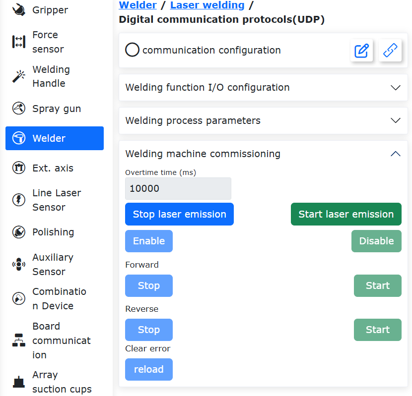

.. centered:: Abbildung 8.6-46 Schweißgerät-Debugging

Schweißprogrammierung
++++++++++++++++++++++++++++++++++++++++++++

Die Schweißfunktionsbefehle sind im Teach-Programm integriert. Klicken Sie wie unten dargestellt auf "Teach-Programm", "Programmierung", um ein neues Benutzerprogramm "testWeld.lua" zu erstellen.

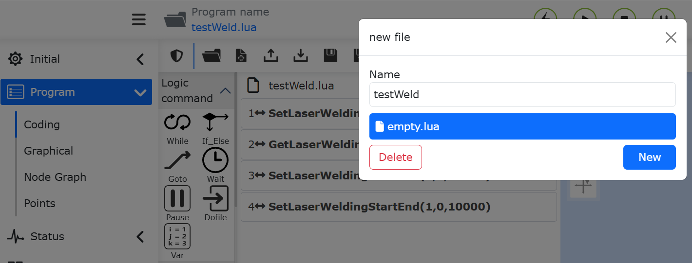

.. centered:: Abbildung 8.6-47 Erstellen des Programms "testWeld.lua"

Wählen Sie wie unten dargestellt "Schweißbefehle" und klicken Sie auf "Laserschweißen".

.. figure:: robot_peripherals/304.png
   :align: center
   :width: 6in 

.. centered:: Abbildung 8.6-48 Laserschweißbezogene Befehle

Wie unten dargestellt, ist der Standardsteuerungstyp für Laserschweißbefehle "Digitales Kommunikationsprotokoll (UDP)". Sie können nacheinander Befehle zum Einstellen der Schweißprozessparameter (Lua-Programm), Abrufen der Schweißprozessparameter (Lua-Programm), Laseremission starten und Laseremission stoppen hinzufügen. Nach dem Hinzufügen der Lua-Befehle klicken Sie auf die Schaltfläche "Übernehmen", um das Laserschweiß-Lua-Programm zu generieren. Klicken Sie auf die Schaltfläche "Speichern", wechseln Sie in den Automatikmodus und führen Sie das Programm aus.

.. figure:: robot_peripherals/305.png
   :align: center
   :width: 6in 

.. centered:: Abbildung 8.6-49 Generieren des Schweißprogramms

Anhang 1: UDP-Kommunikationsprotokoll des Roboters
~~~~~~~~~~~~~~~~~~~~~~~~~~~~~~~~~~~~~~~~~~~~~~~~~~~~~~~~~~

.. warning::
  1) CRC-Prüfverfahren: Es wird die Modbus 16-Bit-Prüfung verwendet, aber nur die unteren 8 Bits werden zur Prüfung des Datenbereichs D100-D176, D200-D273 herangezogen.

  2) Lichtbogenverfolgung: Die tatsächliche Stromrückmeldung wandelt den von der SPS erfassten tatsächlichen Schweißgerätestrom in einen Analogwert von 0-4095 um und überträgt ihn an den Analogkanal 0 des UDP-Datenprotokolls, d.h. D168.

  3) Geschwindigkeitsumrechnungslogik: 
   
  Vom Roboter übermittelte Geschwindigkeit (in mm/s) V ÷ Spindelsteigung × 60 = V';

  Die SPS wandelt die vom Roboter übermittelte Geschwindigkeit um: V' × Encoderauflösung ÷ 60 = V" (Einheit Impulse/s).

Robotersteuerung -> SPS
++++++++++++++++++++++++++++++++++

.. list-table::
   :widths: 10 10 10 10 20
   :header-rows: 1
   :align: center

   * - Nr.
     - Registeradresse
     - Datentyp
     - Datenwert
     - Variablenname

   * - 1
     - D199
     - INT
     - 0x5A5A
     - Frame-Header

   * - 2
     - D200
     - INT
     -
     - 1# Motorsteuerwort

   * - 3
     - D201
     - DINT
     -
     - 1# Zielpositionseingabe

   * - 4
     - D202
     - DINT
     -
     - 1# Zielpositionseingabe

   * - 5
     - D203
     - INT
     -
     - 1# Referenzpunktfahrt-Steuerwort

   * - 6
     - D204
     - DINT
     -
     - 1# Referenzpunktfahrt hohe Geschwindigkeitseingabe

   * - 7
     - D205
     - DINT
     -
     - 1# Referenzpunktfahrt hohe Geschwindigkeitseingabe

   * - 8
     - D206
     - DINT
     -
     - 1# Referenzpunktfahrt niedrige Geschwindigkeitseingabe

   * - 9
     - D207
     - DINT
     -
     - 1# Referenzpunktfahrt niedrige Geschwindigkeitseingabe

   * - 10
     - D208
     - DINT
     -
     - 1# Positionsversatz (reserviert)

   * - 11
     - D209
     - DINT
     -
     - 1# Positionsversatz (reserviert)

   * - 12
     - D210
     - DINT
     -
     - 1# Geschwindigkeitsversatz (reserviert)

   * - 13
     - D211
     - DINT
     -
     - 1# Geschwindigkeitsversatz (reserviert)

   * - 14
     - D212
     - DINT
     -
     - 1# Drehmomentversatz (reserviert)

   * - 15
     - D213
     - DINT
     -
     - 1# Drehmomentversatz (reserviert)

   * - 16
     - D214
     - INT
     -
     - 2# Motorsteuerwort

   * - 17
     - D215
     - DINT
     -
     - 2# Zielpositionseingabe

   * - 18
     - D216
     - DINT
     -
     - 2# Zielpositionseingabe

   * - 19
     - D217
     - INT
     -
     - 2# Referenzpunktfahrt-Steuerwort

   * - 20
     - D218
     - DINT
     -
     - 2# Referenzpunktfahrt hohe Geschwindigkeitseingabe

   * - 21
     - D219
     - DINT
     -
     - 2# Referenzpunktfahrt hohe Geschwindigkeitseingabe

   * - 22
     - D220
     - DINT
     -
     - 2# Referenzpunktfahrt niedrige Geschwindigkeitseingabe

   * - 23
     - D221
     - DINT
     -
     - 2# Referenzpunktfahrt niedrige Geschwindigkeitseingabe

   * - 24
     - D222
     - DINT
     -
     - 2# Positionsversatz (reserviert)

   * - 25
     - D223
     - DINT
     -
     - 2# Positionsversatz (reserviert)

   * - 26
     - D224
     - DINT
     -
     - 2# Geschwindigkeitsversatz (reserviert)

   * - 27
     - D225
     - DINT
     -
     - 2# Geschwindigkeitsversatz (reserviert)

   * - 28
     - D226
     - DINT
     -
     - 2# Drehmomentversatz (reserviert)

   * - 29
     - D227
     - DINT
     -
     - 2# Drehmomentversatz (reserviert)

   * - 30
     - D228
     - INT
     -
     - 3# Motorsteuerwort

   * - 31
     - D229
     - DINT
     -
     - 3# Zielpositionseingabe

   * - 32
     - D230
     - DINT
     -
     - 3# Zielpositionseingabe

   * - 33
     - D231
     - INT
     -
     - 3# Referenzpunktfahrt-Steuerwort

   * - 34
     - D232
     - DINT
     -
     - 3# Referenzpunktfahrt hohe Geschwindigkeitseingabe

   * - 35
     - D233
     - DINT
     -
     - 3# Referenzpunktfahrt hohe Geschwindigkeitseingabe

   * - 36
     - D234
     - DINT
     -
     - 3# Referenzpunktfahrt niedrige Geschwindigkeitseingabe

   * - 37
     - D235
     - DINT
     -
     - 3# Referenzpunktfahrt niedrige Geschwindigkeitseingabe

   * - 38
     - D236
     - DINT
     -
     - 3# Positionsversatz (reserviert)

   * - 39
     - D237
     - DINT
     -
     - 3# Positionsversatz (reserviert)

   * - 40
     - D238
     - DINT
     -
     - 3# Geschwindigkeitsversatz (reserviert)

   * - 41
     - D239
     - DINT
     -
     - 3# Geschwindigkeitsversatz (reserviert)

   * - 42
     - D240
     - DINT
     -
     - 3# Drehmomentversatz (reserviert)

   * - 43
     - D241
     - DINT
     -
     - 3# Drehmomentversatz (reserviert)

   * - 44
     - D242
     - INT
     - 
     - Scangeschwindigkeit (Laserschweißgerät)
  
   * - 45
     - D243
     - DINT
     - 
     - Scanbreite (Laserschweißgerät)

   * - 46
     - D244
     - DINT
     - 
     - Spitzenleistung (Laserschweißgerät)

   * - 47
     - D245
     - INT
     - 
     - Tastverhältnis (Laserschweißgerät)

   * - 48
     - D246
     - DINT
     - 
     - Scangeschwindigkeit (Laserschweißgerät)

   * - 49
     - D247
     - DINT
     - 
     - Scangeschwindigkeit (Laserschweißgerät)

   * - 50
     - D248
     - DINT
     - 
     - Laserschweißgerät reserviert

   * - 51
     - D249
     - DINT
     - 
     - Laserschweißgerät reserviert

   * - 52
     - D250
     - DINT
     - 
     - Laserschweißgerät reserviert

   * - 53
     - D251
     - DINT
     - 
     - Laserschweißgerät reserviert

   * - 54
     - D252
     - DINT
     - 
     - Laserschweißgerät reserviert

   * - 55
     - D253
     - DINT
     - 
     - Laserschweißgerät reserviert

   * - 56
     - D254
     - INT
     - 
     - Laserschweißgerät reserviert

   * - 57
     - D255
     - INT
     -
     - Schweißmodus-Einstellung (0-Gleichstrom-Einheit, 1-Impuls-Einheit, 2-JOB-Modus, 3-Nahbedienungsmodus, 4-Einzelmodus, 5-CC/CV, 6-TIG, 7-CMT-Modus)

   * - 58
     - D256
     - INT
     -
     - Standardausgang DO (0-15)

   * - 59
     - D257
     - INT
     -
     - Standardausgang DO (16-31)

   * - 60
     - D258
     - INT
     -
     - Standardausgang DO (32-47)

   * - 61
     - D259
     - INT
     -
     - Standardausgang DO (48-63)

   * - 62
     - D260
     - INT
     -
     - Standardausgang DO (64-79)

   * - 63
     - D261
     - INT
     -
     - Standardausgang DO (80-95)

   * - 64
     - D262
     - INT
     -
     - Hochgeschwindigkeitsausgang DO (96-111)

   * - 65
     - D263
     - INT
     -
     - Hochgeschwindigkeitsausgang DO (112-127)

   * - 66
     - D264
     - INT
     -
     - Analogausgang AO0

   * - 67
     - D265
     - INT
     -
     - Analogausgang AO1

   * - 68
     - D266
     - INT
     -
     - Analogausgang AO2

   * - 69
     - D267
     - INT
     -
     - Analogausgang AO3

   * - 70
     - D268
     - REAL
     -
     - Übermittelte Schweißspannung

   * - 71
     - D269
     - REAL
     -
     - Übermittelte Schweißspannung

   * - 72
     - D270
     - REAL
     -
     - Übermittelter Schweißstrom

   * - 73
     - D271
     - REAL
     -
     - Übermittelter Schweißstrom

   * - 74
     - D272
     - REAL
     -
     - Paketverlust-Erkennungszyklus

   * - 75
     - D273
     - INT
     -
     - Anzahl Paketverluste

   * - 76
     - D274
     - INT
     -
     - Frame-Zähler (0-255)

   * - 77
     - D275
     - INT
     -
     - CRC-Prüfcode

SPS -> Robotersteuerung
++++++++++++++++++++++++++++++++++

.. list-table::
   :widths: 10 10 10 10 20
   :header-rows: 1
   :align: center

   * - Nr.
     - Registeradresse
     - Datentyp
     - Datenwert
     - Variablenname

   * - 1
     - D99
     - INT
     - 0x5A5A
     - Frame-Header

   * - 2
     - D100
     - INT
     -
     - 1# Motorstatuswort

   * - 3
     - D101
     - DINT
     -
     - 1# Aktuelle Position

   * - 4
     - D102
     - DINT
     -
     - 1# Aktuelle Position

   * - 5
     - D103
     - INT
     -
     - 1# Referenzpunktfahrt-Statuswort

   * - 6
     - D104
     - DINT
     -
     - 1# Rückmeldung hohe Geschwindigkeit Referenzpunktfahrt

   * - 7
     - D105
     - DINT
     -
     - 1# Rückmeldung hohe Geschwindigkeit Referenzpunktfahrt

   * - 8
     - D106
     - DINT
     -
     - 1# Rückmeldung niedrige Geschwindigkeit Referenzpunktfahrt

   * - 9
     - D107
     - DINT
     -
     - 1# Rückmeldung niedrige Geschwindigkeit Referenzpunktfahrt

   * - 10
     - D108
     - INT
     -
     - 1# Fehlercode

   * - 11
     - D109
     - DINT
     -
     - 1# Folgeabweichung (reserviert)

   * - 12
     - D110
     - DINT
     -
     - 1# Folgeabweichung (reserviert)

   * - 13
     - D111
     - DINT
     -
     - 1# Geschwindigkeitsrückmeldung (reserviert)

   * - 14
     - D112
     - DINT
     -
     - 1# Geschwindigkeitsrückmeldung (reserviert)

   * - 15
     - D113
     - DINT
     - 
     - 1# Echtzeit-Drehmoment (reserviert) Das Motordrehmoment wird nach dem Getriebeuntersetzungsverhältnis mit 100 multipliziert und an die übergeordnete Steuerung übertragen

   * - 16
     - D114
     - DINT
     - 
     - 1# Echtzeit-Drehmoment (reserviert) Das Motordrehmoment wird nach dem Getriebeuntersetzungsverhältnis mit 100 multipliziert und an die übergeordnete Steuerung übertragen

   * - 17
     - D115
     - INT
     -
     - 2# Motorstatuswort

   * - 18
     - D116
     - DINT
     -
     - 2# Aktuelle Position

   * - 19
     - D117
     - DINT
     -
     - 2# Aktuelle Position

   * - 20
     - D118
     - INT
     -
     - 2# Referenzpunktfahrt-Statuswort

   * - 21
     - D119
     - DINT
     -
     - 2# Rückmeldung hohe Geschwindigkeit Referenzpunktfahrt

   * - 22
     - D120
     - DINT
     -
     - 2# Rückmeldung hohe Geschwindigkeit Referenzpunktfahrt

   * - 23
     - D121
     - DINT
     -
     - 2# Rückmeldung niedrige Geschwindigkeit Referenzpunktfahrt

   * - 24
     - D122
     - DINT
     -
     - 2# Rückmeldung niedrige Geschwindigkeit Referenzpunktfahrt

   * - 25
     - D123
     - INT
     -
     - 2# Fehlercode

   * - 26
     - D124
     - DINT
     -
     - 2# Folgeabweichung (reserviert)

   * - 27
     - D125
     - DINT
     -
     - 2# Folgeabweichung (reserviert)

   * - 28
     - D126
     - DINT
     -
     - 2# Geschwindigkeitsrückmeldung (reserviert)

   * - 29
     - D127
     - DINT
     -
     - 2# Geschwindigkeitsrückmeldung (reserviert)

   * - 30
     - D128
     - DINT
     -
     - 2# Echtzeit-Drehmoment (reserviert)

   * - 31
     - D129
     - DINT
     -
     - 2# Echtzeit-Drehmoment (reserviert)

   * - 32
     - D130
     - INT
     -
     - 3# Motorstatuswort

   * - 33
     - D131
     - DINT
     -
     - 3# Aktuelle Position

   * - 34
     - D132
     - DINT
     -
     - 3# Aktuelle Position

   * - 35
     - D133
     - INT
     -
     - 3# Referenzpunktfahrt-Statuswort

   * - 36
     - D134
     - DINT
     -
     - 3# Rückmeldung hohe Geschwindigkeit Referenzpunktfahrt

   * - 37
     - D135
     - DINT
     -
     - 3# Rückmeldung hohe Geschwindigkeit Referenzpunktfahrt

   * - 38
     - D136
     - DINT
     -
     - 3# Rückmeldung niedrige Geschwindigkeit Referenzpunktfahrt

   * - 39
     - D137
     - DINT
     -
     - 3# Rückmeldung niedrige Geschwindigkeit Referenzpunktfahrt

   * - 40
     - D138
     - INT
     -
     - 3# Fehlercode

   * - 41
     - D139
     - DINT
     -
     - 3# Folgeabweichung (reserviert)

   * - 42
     - D140
     - DINT
     -
     - 3# Folgeabweichung (reserviert)

   * - 43
     - D141
     - DINT
     -
     - 3# Geschwindigkeitsrückmeldung (reserviert)

   * - 44
     - D142
     - DINT
     -
     - 3# Geschwindigkeitsrückmeldung (reserviert)

   * - 45
     - D143
     - DINT
     -
     - 3# Echtzeit-Drehmoment (reserviert)

   * - 46
     - D144
     - DINT
     -
     - 3# Echtzeit-Drehmoment (reserviert)

   * - 47
     - D145
     - INT
     - 
     - Scangeschwindigkeit (Laserschweißgerät)

   * - 48
     - D146
     - DINT
     - 
     - Scanbreite (Laserschweißgerät)

   * - 49
     - D147
     - DINT
     - 
     - Spitzenleistung (Laserschweißgerät)

   * - 50
     - D148
     - INT
     - 
     - Tastverhältnis (Laserschweißgerät)

   * - 51
     - D149
     - DINT
     - 
     - Scangeschwindigkeit (Laserschweißgerät)

   * - 52
     - D150
     - DINT
     - 
     - Scangeschwindigkeit (Laserschweißgerät)

   * - 53
     - D151
     - DINT
     - 
     - Laserschweißgerät reserviert

   * - 54
     - D152
     - DINT
     - 
     - Laserschweißgerät reserviert

   * - 55
     - D153
     - DINT
     - 
     - Laserschweißgerät reserviert

   * - 56
     - D154
     - DINT
     - 
     - Laserschweißgerät reserviert

   * - 57
     - D155
     - DINT
     - 
     - Laserschweißgerät reserviert

   * - 58
     - D156
     - DINT
     - 
     - Laserschweißgerät reserviert

   * - 59
     - D157
     - DINT
     - 
     - Laserschweißgerät reserviert

   * - 60
     - D158
     - DINT
     - 
     - Laserschweißgerät reserviert

   * - 61
     - D159
     - DINT
     - 
     - Laserschweißgerät reserviert

   * - 62
     - D160
     - INT
     -
     - Standardeingang DI (0-15)

   * - 63
     - D161
     - INT
     -
     - Standardeingang DI (16-31)

   * - 64
     - D162
     - INT
     -
     - Standardeingang DI (32-47)

   * - 65
     - D163
     - INT
     -
     - Standardeingang DI (48-63)

   * - 66
     - D164
     - INT
     -
     - Standardeingang DI (64-79)

   * - 67
     - D165
     - INT
     -
     - Standardeingang DI (80-95)

   * - 68
     - D166
     - INT
     -
     - Hochgeschwindigkeitseingang DI (96-111)

   * - 69
     - D167
     - INT
     -
     - Hochgeschwindigkeitseingang DI (112-127)

   * - 70
     - D168
     - INT
     -
     - Analogeingang AI0

   * - 71
     - D169
     - INT
     -
     - Analogeingang AI1

   * - 72
     - D170
     - INT
     -
     - Analogeingang AI2

   * - 73
     - D171
     - INT
     -
     - Analogeingang AI3

   * - 74
     - D172
     - REAL
     -
     - Tatsächliche Stromrückmeldung

   * - 75
     - D173
     - REAL
     -
     - Tatsächliche Stromrückmeldung

   * - 76
     - D174
     - REAL
     -
     - Tatsächliche Spannungsrückmeldung

   * - 77
     - D175
     - REAL
     -
     - Tatsächliche Spannungsrückmeldung

   * - 78
     - D176
     - INT
     -
     - Fehlercode: 0-kein Fehler, 1-Datenverlust

   * - 79
     - D177
     - INT
     -
     - Frame-Zähler

   * - 80
     - D178
     - INT
     -
     - CRC-Prüfcode

Digitales Kommunikationsprotokoll (Modbus TCP)
~~~~~~~~~~~~~~~~~~~~~~~~~~~~~~~~~~~~~~~~~~~~~~~~~~~~~~~~~~~~~~~~~~~~

Klicken Sie auf "Initiale Einstellungen" -> "Peripherie" -> "Schweißgerät", um zur Schweißgeräteoberfläche zu gelangen. Klicken Sie auf die Karte "Digitales Kommunikationsprotokoll (Modbus TCP)", um zur Oberfläche des offenen Schweißgeräteprotokolls zu gelangen.

Protokollkonfiguration
++++++++++++++++++++++++++++++

Klicken Sie in der Konfiguration des offenen Protokolls auf die Schaltfläche "Hochladen", um die fertig erstellte LUA-Programmdatei des offenen Protokolls in die Steuerung hochzuladen. Wählen Sie eine ID für das offene Protokoll und einen Namen für das offene Protokoll aus und klicken Sie auf die Schaltfläche "Konfigurieren" (Die gewählte Protokoll-ID muss mit der im offenen Protokoll angegebenen ID übereinstimmen). Weisen Sie jedem offenen Protokoll eine ID zu.

.. figure:: robot_peripherals/066.png
   :align: center
   :width: 4in

.. centered:: Abbildung 8.6‑50 Hochladen und Konfigurieren des offenen Steuerungs-Peripherieprotokolls

Klicken Sie in den konfigurierten Protokollen auf die Schaltfläche "Laden". Die Betriebsstatus-LED leuchtet auf und zeigt an, dass das offene Protokoll erfolgreich geladen wurde.

.. figure:: robot_peripherals/067.png
   :align: center
   :width: 4in

.. centered:: Abbildung 8.6-51 Laden und Betriebsanzeige des offenen Steuerungs-Peripherieprotokolls

Offenes Schweißgeräteprotokoll
++++++++++++++++++++++++++++++++++++++

Der Roboter kommuniziert mit dem Schweißgerät über das offene Peripherieprotokoll der Steuerung mittels ModbusTCP. Basierend auf der Registerdefinition des Schweißgeräte-Slaves wird eine entsprechende Kommunikations-LUA-Datei erstellt. In dieser Datei werden Kommunikationsparameter wie IP-Adresse und Portnummer des Schweißgeräts sowie Registeradressen für die Lichtbogenzündung, Drahtvorschubsteuerung usw. konfiguriert. Nach dem Hochladen dieses Protokolls in die Robotersteuerung und dem Laden des Protokolls wird die Kommunikation zwischen Roboter und Schweißgerät hergestellt.

Beispiel für ein offenes Schweißgeräteprotokoll
********************************************************

.. code-block:: lua
   :linenos:

   local id = 1 --Protokollnummer, muss mit der in der WebApp konfigurierten Protokollnummer übereinstimmen.
   local ctrlValues = {0, 0, 0, 0, 0, 0}
   local realTimeState = {0, 0, 0, 0, 0, 0, 0, 0, 0, 0, 0, 0, 0, 0, 0, 0, 0, 0, 0, 0}
   ModbusTCPMasterClose(id)
   ModbusTCPMasterCreate('192.168.58.45', 502, 1, id)
   while(1) do
   setArcStart, setWireForward, setWireReverse, setShieldingGas, setTouchEnable, setRobotError,setRobotEnableState,default1,default2, default3, default4, setCurrent, setVoltage, SetMode = WeldingGetCtrlState()
   local ctrlWord = 0
   ctrlWord = SetBitWithIndex(ctrlWord, 0, setArcStart)
   ctrlWord = SetBitWithIndex(ctrlWord, 1, setWireForward)
   ctrlWord = SetBitWithIndex(ctrlWord, 2, setWireReverse)
   ctrlWord = SetBitWithIndex(ctrlWord, 3, setShieldingGas)
   ctrlWord = SetBitWithIndex(ctrlWord, 4, setTouchEnable)
   ctrlWord = SetBitWithIndex(ctrlWord, 7, setRobotError)
   ctrlValues[1] = setRobotEnableState
   ctrlValues[2] = ctrlWord
   ctrlValues[3] = 0
   ctrlValues[4] = setCurrent
   ctrlValues[5] = setVoltage
   ctrlValues[6] = 0
   ModbusTCPMasterSetHoldRegs(id, 201, 6, ctrlValues, "U16")
   localtmpCtrlMode={0,0,0,0}
   tmpCtrlMode[1]=SetMode
   ModbusTCPMasterSetHoldRegs(id,0x1000,1,tmpCtrlMode,"U16")
   sleep_ms(10)

   getWeldState, getCurrent, getVoltage,default1, default2, getWelderErrorCode = ModbusTCPMasterGetHoldRegs(id, 211, 6, "U16")
   realTimeState[1] = GetBitWithIndex(getWeldState, 0) + GetBitWithIndex(getWeldState, 1) * 2  --welderType
   realTimeState[2] = GetBitWithIndex(getWeldState, 5) --arc state(WCR)
   realTimeState[3] = GetBitWithIndex(getWeldState, 4) --touch state
   realTimeState[4] = GetBitWithIndex(getWeldState, 7) --welder error state
   realTimeState[12] = getCurrent                      --current
   realTimeState[13] = getVoltage                      --voltage
   realTimeState[14] = getWelderErrorCode              --welder error code
   realTimeState[15] = getWeldState / 255             --heart jump
   WeldingSetRealtimeState(realTimeState)

   local stopFlag = GetOpenLUAStopFlag(id)
   if(stopFlag ~= 0) then
   ModbusTCPMasterClose(id)
   break
   end

   sleep_ms(10)
   end

Analyse des offenen Schweißgeräteprotokolls
************************************************

Das offene Schweißgeräteprotokoll besteht hauptsächlich aus drei Teilen:

**① Kommunikationsverbindung herstellen**: Parameter wie die spezifische Protokoll-ID (die beim Laden des offenen Protokolls eingestellte Protokollnummer muss mit der Nummer in der Protokolldatei übereinstimmen), die IP-Adresse des Schweißgeräts und die Portnummer werden angegeben. Mit dem Befehl "ModbusTCPMasterCreate()" wird eine ModbusTCP-Verbindung zwischen Roboter und Schweißgerät hergestellt.

**② Zyklisches Schreiben von Steuerdaten an das Schweißgerät**: Bei der Ausführung des offenen Schweißgeräteprotokolls werden zunächst die aktuellen Schweißgeräte-Steuerdaten aus der Robotersteuerung gelesen und dann in das Schweißgerät geschrieben, um die Schweißgeräteaktionen zu steuern. Die Rückgabewerte des Befehls "WeldingGetCtrlState()" zum Lesen der Roboter-Schweißsteuerdaten sind in Tabelle 2-1 definiert. Die Steuerdaten können je nach Definition der Steuerregister des tatsächlichen Schweißgeräts aufgeschlüsselt und dann per ModbusTCP in das Schweißgerät geschrieben werden.

.. centered:: Tabelle 8.19-1 Rückgabewerte von WeldingGetCtrlState()

.. list-table::
   :widths: 10 20 30 40
   :align: center
   :class: sheet-center

   * - **Nr.**
     - **Typ**
     - **Name**
     - **Beschreibung**

   * - 1
     - uint16_t
     - setArcStart
     - Lichtbogenzünde-Signal; 0-Lichtbogen aus; 1-Lichtbogen zünden

   * - 2
     - uint16_t
     - setWireForward
     - Vorwärtsdrahtvorschub: 0-Drahtvorschub stoppen; 1-Vorwärtsdrahtvorschub

   * - 3
     - uint16_t
     - setWireReverse
     - Rückwärtsdrahtvorschub: 0-Drahtvorschub stoppen; 1-Rückwärtsdrahtvorschub

   * - 4
     - uint16_t
     - setShieldingGas
     - Schutzgassteuerung: 0-Gas aus; 1-Gas zu

   * - 5
     - uint16_t
     - setTouchEnable
     - Aktivierung Schweißdraht-Positionssuche: 0-deaktivieren; 1-aktivieren

   * - 6
     - uint16_t
     - setRobotError
     - Roboterfehler: 0-kein Fehler; 1-Fehler

   * - 7
     - uint16_t
     - setRobotEnableState
     - Roboter-Aktivierungsstatus: 0-nicht aktiviert; 1-aktiviert

   * - 8
     - uint16_t
     - default1
     - Reserviert

   * - 9
     - uint16_t
     - default2
     - Reserviert

   * - 10
     - uint16_t
     - default3
     - Reserviert

   * - 11
     - uint16_t
     - default4
     - Reserviert

   * - 12
     - uint16_t
     - setCurrent
     - Schweißstrom einstellen (0,1 A)

   * - 13
     - uint16_t
     - setVoltage
     - Schweißspannung einstellen (0,01 V)

   * - 14
     - uint16_t
     - SetMode
     - Schweißmodus einstellen: 0-Gleichstrom-Einheit, 1-Impuls-Einheit, 2-JOB-Modus, 3-Nahbedienungsmodus, 4-Einzelmodus, 5-CC/CV, 6-TIG, 7-CMT-Modus

   * - 15
     - uint16_t
     - default6
     - Reserviert

   * - 16
     - uint16_t
     - default7
     - Reserviert

   * - 17
     - uint16_t
     - default8
     - Reserviert

   * - 18
     - uint16_t
     - default9
     - Reserviert

   * - 19
     - uint16_t
     - default10
     - Reserviert

   * - 20
     - uint16_t
     - default11
     - Reserviert

**③ Zyklisches Lesen von Statusdaten vom Schweißgerät**: Das offene Schweißgeräteprotokoll liest zunächst über ModbusTCP die Echtzeit-Statusdaten vom Schweißgerät und schreibt die relevanten Daten dann in die Robotersteuerung, damit der Roboter den Echtzeit-Aktionsstatus des Schweißgeräts überwachen kann. Der Parameter für die Schnittstelle "WeldingSetRealtimeState()" zum Einstellen des Schweißgerätestatus im Roboter ist ein Array, das alle Schweißgerätestatus enthält (Hinweis: In Lua-Protokollen für offene Protokolle beginnt der Array-Index bei 1), wie in Tabelle 2-2 dargestellt. Je nach Definition der tatsächlichen Schweißgerätestatusregister können die Schweißgerätestatusdaten per ModbusTCP gelesen, zu einem Schweißgerätestatus-Array zusammengesetzt und in die Robotersteuerung geschrieben werden.

.. centered:: Tabelle 8.19-2 Detaillierte Parameter von WeldingSetRealtimeState()

.. list-table::
   :widths: 10 20 30 40
   :align: center
   :class: sheet-center

   * - **Typ**
     - **Name**
     - **Array-Index**
     - **Beschreibung**

   * - uint16_t[20]
     - realTimeState
     - 1
     - Schweißgerätemodell

   * - uint16_t[20]
     - realTimeState
     - 2
     - Lichtbogenstatus: 0-Lichtbogen aus; 1-Lichtbogen an

   * - uint16_t[20]
     - realTimeState
     - 3
     - Schweißdraht-Kontaktstatus: 0-kein Kontakt; 1-Kontakt

   * - uint16_t[20]
     - realTimeState
     - 4
     - Schweißgeräte-Fehlerstatus: 0-kein Fehler; 1-Schweißgerätefehler

   * - uint16_t[20]
     - realTimeState
     - 5
     - Reserviert

   * - uint16_t[20]
     - realTimeState
     - 6
     - Reserviert

   * - uint16_t[20]
     - realTimeState
     - 7
     - Reserviert

   * - uint16_t[20]
     - realTimeState
     - 8
     - Reserviert

   * - uint16_t[20]
     - realTimeState
     - 9
     - Reserviert

   * - uint16_t[20]
     - realTimeState
     - 10
     - Reserviert

   * - uint16_t[20]
     - realTimeState
     - 11
     - Reserviert

   * - uint16_t[20]
     - realTimeState
     - 12
     - Echtzeit-Schweißstrom (0,1 A)

   * - uint16_t[20]
     - realTimeState
     - 13
     - Echtzeit-Schweißspannung (0,01 V)

   * - uint16_t[20]
     - realTimeState
     - 14
     - Schweißgeräte-Fehlercode

   * - uint16_t[20]
     - realTimeState
     - 15
     - Schweißgeräte-Kommunikations-Herzschlagdaten

   * - uint16_t[20]
     - realTimeState
     - 16
     - Reserviert

   * - uint16_t[20]
     - realTimeState
     - 17
     - Reserviert

   * - uint16_t[20]
     - realTimeState
     - 18
     - Reserviert

   * - uint16_t[20]
     - realTimeState
     - 19
     - Reserviert

   * - uint16_t[20]
     - realTimeState
     - 20
     - Reserviert

Hochladen und Laden des offenen Schweißgeräteprotokolls
************************************************************

Klicken Sie nacheinander auf "Initiale Einstellungen", "Peripherie", "Steuerschrank", "Offenes Peripherieprotokoll". Klicken Sie auf die Schaltfläche "Hochladen", um das offene Schweißgeräteprotokoll "CtrlDev_WELDING.lua" hochzuladen (Der Dateiname des Protokolls muss mit `CtrlDev_` beginnen und die Erweiterung ".lua" haben).

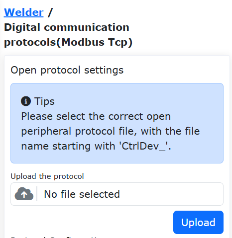

.. centered:: Abbildung 8.6‑39 Hochladen des offenen Schweißgeräteprotokolls

Wählen Sie in der "Protokollkonfiguration" eine "Protokollnummer" (muss mit der Protokollnummer in der offenen Protokolldatei übereinstimmen). Hier wird als Beispiel Nummer 1 gewählt. Wählen Sie den "Protokollnamen" als offenes Schweißgeräteprotokoll "CtrlDev_WELDING.lua" aus und klicken Sie auf die Schaltfläche "Konfigurieren". Das konfigurierte offene Schweißgeräteprotokoll wird nun unter "Gerätebetrieb und -status" angezeigt.

.. figure:: robot_peripherals/069.png
   :align: center
   :width: 4in

.. centered:: Abbildung 8.6‑40 Konfiguration des offenen Schweißgeräteprotokolls

Klicken Sie auf die Schaltfläche "Verbinden", um das offene Schweißgeräteprotokoll zu laden. Die Betriebsstatus-LED leuchtet auf und zeigt an, dass Roboter und Schweißgerät kommunizieren.

.. figure:: robot_peripherals/070.png
   :align: center
   :width: 4in

.. centered:: Abbildung 8.6‑41 Laden des offenen Schweißgeräteprotokolls

Schweißgerätetest (Debugging)
************************************************

Stellen Sie vor dem Test des Schweißgeräts sicher, dass das offene Schweißgeräteprotokoll erfolgreich geladen wurde und die relevanten Registeradressen korrekt konfiguriert sind.

Klicken Sie nacheinander auf "Initiale Einstellungen", "Peripherie", "Schweißgerät". Wählen Sie "Digitales Kommunikationsprotokoll (ModbusTcp)".

.. centered:: Abbildung 8.6‑42 Auswahl "Digitales Kommunikationsprotokoll (ModbusTcp)"

Klicken Sie auf die Schaltflächen "Lichtbogen zünden", "Lichtbogen beenden", "Gas zu", "Gas aus" usw. und beobachten Sie, ob die Aktionen des tatsächlichen Schweißgeräts mit den Einstellungen übereinstimmen. Wenn das Schweißgerät die eingestellten Aktionen nicht ausführt, überprüfen Sie die Registerkonfiguration im offenen Schweißgeräteprotokoll auf Fehler und führen Sie weitere Tests durch.

.. figure:: robot_peripherals/049.png
   :align: center
   :width: 4in

.. centered:: Abbildung 8.6‑43 Schweißgerätetest

Erstellung des Schweißprogramms
************************************************

Klicken Sie auf "Initiale Einstellungen", "Teach-Programm", "Programmierung" und erstellen Sie ein neues Programm "testWeld.lua".

.. centered:: Abbildung 8.6‑44 Erstellen eines Schweiß-LUA-Programms

Klicken Sie auf die Schaltfläche "Schweißen". Wählen Sie in der eingeblendeten Oberfläche zum Hinzufügen von Schweißbefehlen "Digitales Kommunikationsprotokoll (Modbus Tcp)". Wählen Sie nacheinander "Lichtbogen zünden", klicken Sie auf "Hinzufügen", wählen Sie "Lichtbogen beenden", klicken Sie auf "Hinzufügen" und klicken Sie abschließend auf die Schaltfläche "Anwenden".

.. figure:: robot_peripherals/071.png
   :align: center
   :width: 6in

.. centered:: Abbildung 8.6‑45 Befehle für Lichtbogenzündung und -beendung hinzufügen

Nun wurden die Befehle zum Zünden und Beenden des Lichtbogens zu "testWeld.lua" hinzugefügt.

.. figure:: robot_peripherals/058.png
   :align: center
   :width: 4in

.. centered:: Abbildung 8.6‑46 Befehle für Lichtbogenzündung und -beendung hinzufügen

Fügen Sie nacheinander den Schweißstartpunkt und den Schweißendpunkt hinzu. Schalten Sie den Roboter in den Automatikmodus und starten Sie das Programm unter sicheren Bedingungen. Der Roboter steuert das Schweißgerät an, um eine Schweißnaht zu schweißen.

.. figure:: robot_peripherals/059.png
   :align: center
   :width: 4in

.. centered:: Abbildung 8.6‑47 Schweißprogramm

Entladen des offenen Schweißgeräteprotokolls
************************************************

Klicken Sie nacheinander auf "Initiale Einstellungen", "Peripherie", "Steuerschrank", "Offenes Peripherieprotokoll". Klicken Sie unter "Gerätebetrieb und -status" auf die Schaltfläche "Entladen".

.. figure:: robot_peripherals/067.png
   :align: center
   :width: 4in

.. centered:: Abbildung 8.6‑48 Offenes Protokoll entladen

Die Betriebsstatus-LED des Protokolls erlischt.

.. figure:: robot_peripherals/072.png
   :align: center
   :width: 4in

.. centered:: Abbildung 8.6‑49 Offenes Protokoll entladen

Wenn Sie nun Schweißtests durchführen oder ein Schweißprogramm ausführen, meldet der Roboter unten links in der WebApp einen Fehler: "Protokoll nicht geladen".

.. figure:: robot_peripherals/073.png
   :align: center
   :width: 3in

.. centered:: Abbildung 8.6‑50 Fehler: Protokoll nicht geladen

Konfiguration der Erweiterungsachse
---------------------------------------------------

Klicken Sie in "Initiale Einstellungen" -> "Peripherie" auf "Erweiterungsachse", um zur Konfigurationsoberfläche für die Erweiterungsachse zu gelangen. Diese umfasst die Konfiguration des Erweiterungsachsen-Koordinatensystems und die Konfiguration der Erweiterungsachsen-Peripherie. Die erste Ansicht der Erweiterungsachsen-Konfiguration ist wie folgt:

.. figure:: robot_peripherals/074.png
   :align: center
   :width: 4in

.. centered:: Abbildung 8.7‑1 Erste Ansicht der Erweiterungsachsen-Konfiguration

Derzeit wird die Konfiguration der Erweiterungsachsen-Peripherie nach der Kommunikationsart in zwei Typen unterteilt:

- Steuerung + SPS (UDP-Kommunikation).

- Steuerung + Servoantrieb (485-Kommunikation).

Koordinatensystem der Erweiterungsachse
~~~~~~~~~~~~~~~~~~~~~~~~~~~~~~~~~~~~~~~~~~~~~~~~~

In der Einstellungsoberfläche für das Erweiterungsachsen-Koordinatensystem können Erweiterungsachsen-Koordinaten angewendet, gelöscht und konfiguriert werden.

.. note::
   .. image:: robot_peripherals/075.png
      :height: 0.75in
      :align: left

   Bezeichnung: **Anwenden**

   Funktion: Wendet das Erweiterungsachsen-Koordinatensystem an.

.. note::
   .. image:: robot_peripherals/076.png
      :height: 0.75in
      :align: left

   Bezeichnung: **Löschen**

   Funktion: Löscht die Daten des Erweiterungsachsen-Koordinatensystems.

Die Dropdown-Liste der Erweiterungsachsen-Koordinatensysteme enthält insgesamt 5 Nummern, von exaxis0 bis exaxis4. Wählen Sie das entsprechende Koordinatensystem aus, die entsprechenden Koordinatenwerte werden darunter angezeigt. Nach Auswahl eines Koordinatensystems klicken Sie auf die Schaltfläche "Anwenden". Das aktuell verwendete Erweiterungsachsen-Koordinatensystem wechselt zu dem ausgewählten Koordinatensystem, wie in der folgenden Abbildung gezeigt.

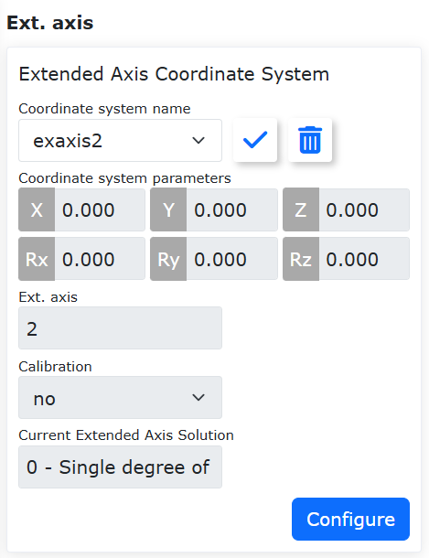

.. centered:: Abbildung 8.7‑2 Erweiterungsachsen-Koordinatensystem

Wählen Sie ein Erweiterungsachsen-Koordinatensystem ungleich "exaxis0" aus und klicken Sie auf "Konfigurieren", um zur Konfigurationsoberfläche für das Erweiterungsachsen-Koordinatensystem zu gelangen. Hier können Sie das Koordinatensystem für diese Nummer neu einstellen. Wie unten gezeigt:

.. important::
  - Löschen Sie vor der Kalibrierung das zu kalibrierende Erweiterungsachsen-Koordinatensystem und wenden Sie dieses Erweiterungsachsen-Koordinatensystem an.

  - Wählen Sie die Nummer der Erweiterungsachse aus. Mit "Informationen abrufen" können die Antriebsinformationen der entsprechenden Erweiterungsachse abgerufen werden. Basierend auf diesen Informationen können wir die Parameter konfigurieren.

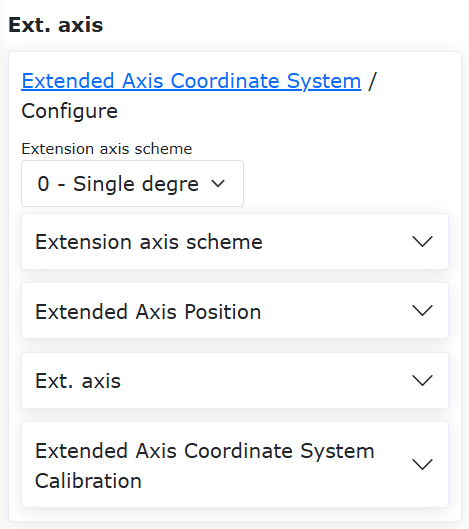

.. centered:: Abbildung 8.7‑3 Kalibrierung des Erweiterungsachsen-Koordinatensystems

Die aktuellen Erweiterungsachsen-Lösungen sind:

- 0 - Linearführung mit einem Freiheitsgrad

- 1 - L-förmiger Positionierer mit zwei Freiheitsgraden

- 2 - Drei Freiheitsgrade (derzeit nicht verfügbar)

- 3 - Vier Freiheitsgrade (derzeit nicht verfügbar)

- 4 - Positionierer mit einem Freiheitsgrad

- 5 - Wagen mit zwei Freiheitsgraden

**Linearführung mit einem Freiheitsgrad**: Stellen Sie zuerst die DH-Parameter ein. Stellen Sie dann die Position des Roboters relativ zur Erweiterungsachse ein. Die Linearführung befindet sich **auf** der Erweiterungsachse. Wenn keine Kalibrierung durchgeführt wird, klicken Sie einfach auf Speichern. In diesem Fall kann die Erweiterungsachse nur asynchron bewegt werden.

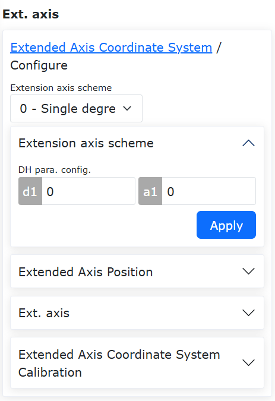

.. centered:: Abbildung 8.7-4 Konfiguration der DH-Parameter für Linearführung

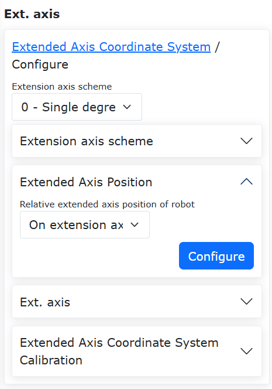

.. centered:: Abbildung 8.7-5 Linearführung -- Konfiguration der Roboterposition relativ zur Erweiterungsachse

Wenn eine synchrone Bewegung mit dem Roboter erforderlich ist, aktivieren Sie die Erweiterungsachse (Eaxis) im Bedienbereich am Nullpunkt der Erweiterungsachse. Richten Sie die Roboterflanschmitte (verwenden Sie die Werkzeugspitze im angewendeten Werkzeugkoordinatensystem) in zwei verschiedenen Posen auf einen festen Punkt auf der Erweiterungsachse aus und legen Sie Punkt 1 und Punkt 2 fest.

.. image:: robot_peripherals/081.png
   :width: 3in
   :align: center

.. image:: robot_peripherals/082.png
   :width: 3in
   :align: center

.. centered:: Abbildung 8.7‑6 Linearführung Kalibrierpunkte 1 und 2

Deaktivieren Sie die Erweiterungsachse (Enable entfernen), bewegen Sie sie ein Stück, aktivieren Sie sie wieder und richten Sie die Roboterflanschmitte erneut auf denselben festen Punkt aus, um Punkt 3 festzulegen. Deaktivieren Sie die Erweiterungsachse, bewegen Sie sie zurück zum Nullpunkt und aktivieren Sie sie wieder. Bewegen Sie die Roboterflanschmitte senkrecht nach oben über den festen Punkt, um Punkt 4 festzulegen. Berechnen Sie das Koordinatensystem und speichern Sie es.

.. image:: robot_peripherals/083.png
   :width: 3in
   :align: center

.. image:: robot_peripherals/084.png
   :width: 3in
   :align: center

.. centered:: Abbildung 8.7‑7 Linearführung Kalibrierpunkte 3 und 4

**L-förmiger Positionierer mit zwei Freiheitsgraden**: Der Positionierer besteht aus zwei Erweiterungsachsen. Stellen Sie zuerst die DH-Parameter ein. Messen Sie die DH-Parameter des Positionierers gemäß der Abbildung und tragen Sie sie in die Eingabefelder ein. Stellen Sie die Position des Roboters relativ zur Erweiterungsachse ein. Der Positionierer befindet sich **außerhalb** der Erweiterungsachse. Wenn keine Kalibrierung durchgeführt wird, klicken Sie einfach auf Speichern. In diesem Fall kann die Erweiterungsachse nur asynchron bewegt werden.

.. image:: robot_peripherals/085.png
   :width: 4in
   :align: center

.. centered:: Abbildung 8.7‑8 Konfiguration der DH-Parameter für L-förmigen Positionierer mit zwei Freiheitsgraden

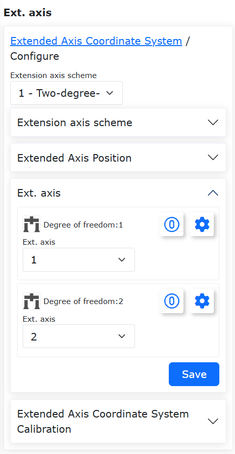

.. centered:: Abbildung 8.7‑9 L-förmiger Positionierer mit zwei Freiheitsgraden -- Roboterposition relativ zur Erweiterungsachse

Wenn eine synchrone Bewegung mit dem Roboter erforderlich ist, aktivieren Sie die Erweiterungsachse (Eaxis) im Bedienbereich am Nullpunkt der Erweiterungsachse. Richten Sie auf dem Positionierer ein Koordinatensystem ein. Wählen Sie einen Punkt aus und geben Sie die kartesische Pose dieses Punktes in diesem Koordinatensystem ein. Wenn Sie z.B. einen Punkt in positiver Y-Richtung wählen und Y = 100 mm messen, geben Sie die Werte wie in der Abbildung gezeigt ein und klicken Sie auf "Referenzpunkt". Damit ist der Referenzpunkt festgelegt. Für die folgenden vier Kalibrierpunkte muss die Roboterflanschmitte (verwenden Sie die Werkzeugspitze im angewendeten Werkzeugkoordinatensystem) auf diesen Referenzpunkt ausgerichtet werden.

.. image:: robot_peripherals/087.png
   :width: 4in
   :align: center

.. centered:: Abbildung 8.7‑10 L-förmiger Positionierer mit zwei Freiheitsgraden -- Referenzpunktkonfiguration

Richten Sie die Roboterflanschmitte auf den Referenzpunkt aus und legen Sie Punkt 1 fest. Bewegen Sie im Bedienbereich (Eaxis) die beiden Achsen ein kurzes Stück im Tippbetrieb (Jog). Richten Sie die Roboterflanschmitte erneut auf den Referenzpunkt aus und legen Sie Punkt 2 fest. Bewegen Sie die beiden Achsen weiter im Tippbetrieb, richten Sie die Roboterflanschmitte auf den Referenzpunkt aus und legen Sie Punkt 3 fest. Bewegen Sie schließlich die beiden Achsen weiter im Tippbetrieb, richten Sie die Roboterflanschmitte auf den Referenzpunkt aus und legen Sie Punkt 4 fest. Klicken Sie auf "Berechnen", um das Koordinatensystem zu erhalten. Klicken Sie auf "Speichern" und dann auf "Anwenden".

.. image:: robot_peripherals/088.png
   :width: 3in
   :align: center

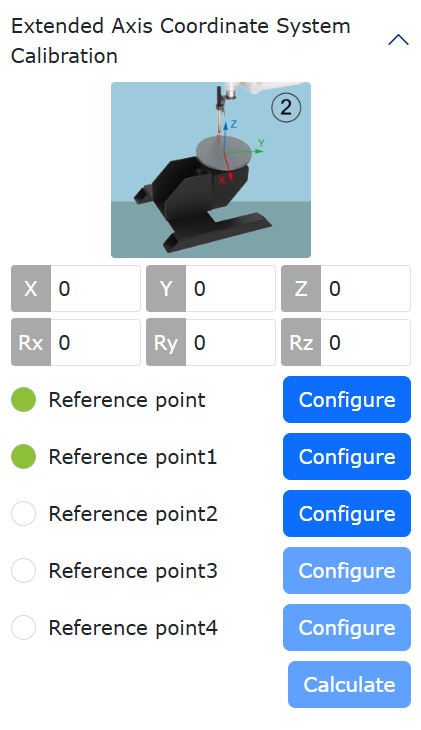

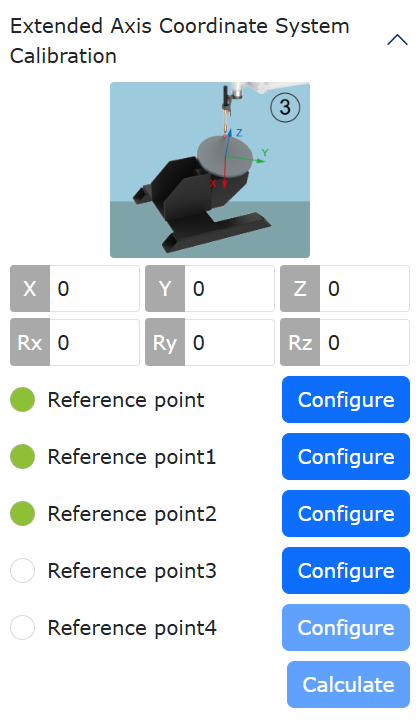

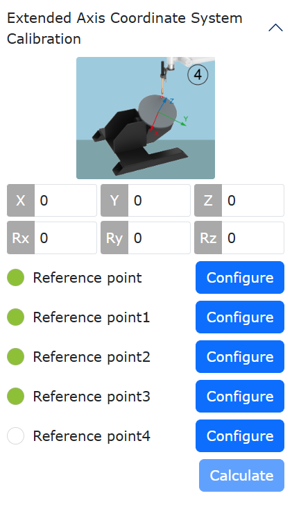

.. centered:: Abbildung 8.7‑11 Kalibrierung des L-förmigen Positionierers mit zwei Freiheitsgraden

**Positionierer mit einem Freiheitsgrad**: Besteht aus einer rotierenden Erweiterungsachse. Die DH-Parameter werden auf 0 gesetzt. Stellen Sie die Roboterposition relativ zur Erweiterungsachse auf "außerhalb der Erweiterungsachse". Wenn keine Kalibrierung durchgeführt wird, klicken Sie einfach auf Speichern. In diesem Fall kann die Erweiterungsachse nur asynchron bewegt werden.

.. image:: robot_peripherals/092.png
   :width: 4in
   :align: center

.. centered:: Abbildung 8.7‑12 Konfiguration der DH-Parameter für Positionierer mit einem Freiheitsgrad

.. image:: robot_peripherals/093.png
   :width: 4in
   :align: center

.. centered:: Abbildung 8.7‑13 Positionierer mit einem Freiheitsgrad -- Roboterposition relativ zur Erweiterungsachse

Wenn eine synchrone Bewegung mit dem Roboter erforderlich ist, aktivieren Sie die Erweiterungsachse (Eaxis) im Bedienbereich am Nullpunkt der Erweiterungsachse. Richten Sie auf dem Positionierer ein Koordinatensystem ein. Wählen Sie einen Punkt aus und geben Sie die kartesische Pose dieses Punktes in diesem Koordinatensystem ein. Klicken Sie auf "Referenzpunkt", um den Referenzpunkt festzulegen.

.. image:: robot_peripherals/094.png
   :width: 4in
   :align: center

.. centered:: Abbildung 8.7‑14 Konfiguration des Referenzpunkts für Positionierer mit einem Freiheitsgrad

Für die folgenden vier Kalibrierpunkte muss die Roboterflanschmitte (verwenden Sie die Werkzeugspitze im angewendeten Werkzeugkoordinatensystem) auf diesen Referenzpunkt ausgerichtet werden. Richten Sie die Roboterflanschmitte auf den Referenzpunkt aus und legen Sie Punkt 1 fest. Bewegen Sie die Rotationsachse im Bedienbereich (Eaxis) ein kurzes Stück im Tippbetrieb. Richten Sie die Roboterflanschmitte erneut auf den Referenzpunkt aus und legen Sie Punkt 2 fest. Bewegen Sie die Rotationsachse weiter im Tippbetrieb, richten Sie die Roboterflanschmitte auf den Referenzpunkt aus und legen Sie Punkt 3 fest. Bewegen Sie schließlich die Rotationsachse weiter im Tippbetrieb, richten Sie die Roboterflanschmitte auf den Referenzpunkt aus und legen Sie Punkt 4 fest. Klicken Sie auf "Berechnen", um das Koordinatensystem zu erhalten. Klicken Sie auf "Speichern" und dann auf "Anwenden".

.. image:: robot_peripherals/095.png
   :width: 3in
   :align: center

.. image:: robot_peripherals/096.png
   :width: 3in
   :align: center

.. image:: robot_peripherals/097.png
   :width: 3in
   :align: center

.. image:: robot_peripherals/098.png
   :width: 3in
   :align: center

.. centered:: Abbildung 8.7‑15 Kalibrierung des Positionierers mit einem Freiheitsgrad

.. important::
   1. Das Erweiterungsachsen-Koordinatensystem wird basierend auf dem Werkzeug kalibriert. Es muss auf der Grundlage eines bereits erstellten Werkzeugkoordinatensystems erstellt werden.
   2. Für Erweiterungsachsen-Koordinatensysteme werden in der Regel exaxis1 bis exaxis4 verwendet. Die Anwendung von exaxis0 bedeutet, dass kein Erweiterungsachsen-Koordinatensystem verwendet wird. Bei der Kalibrierung eines Erweiterungsachsen-Koordinatensystems muss zunächst das Erweiterungsachsen-Koordinatensystem auf exaxis0 angewendet werden. Anschließend können andere Erweiterungsachsen-Koordinatensysteme ausgewählt, kalibriert und angewendet werden.

Steuerung + SPS (UDP-Kommunikation)
~~~~~~~~~~~~~~~~~~~~~~~~~~~~~~~~~~~~~~~~~~~~~~~~

Bevor Sie die UDP-Kommunikation für die Erweiterungsachse verwenden, müssen Sie zuerst das entsprechende Erweiterungsachsen-Koordinatensystem erstellen, die entsprechende Erweiterungsachsen-Lösung in diesem Koordinatensystem konfigurieren und bei der Programmerstellung (Teach) das erstellte Werkzeugkoordinatensystem anwenden. Die Erweiterungsachsen-Funktion wird hauptsächlich in Verbindung mit der Schweißgerätefunktion und der Laser-Tracking-Sensorfunktion verwendet.

.. figure:: robot_peripherals/099.png
   :align: center
   :width: 4in

.. centered:: Abbildung 8.7‑16 Anwendung des Erweiterungsachsen-Koordinatensystems und Anzeige der aktuellen Erweiterungsachsen-Lösung

Wenn nur das aktuelle Erweiterungsachsen-Koordinatensystem geändert werden muss, wählen Sie es einfach in der Peripheriekonfigurationsoberfläche für die Erweiterungsachse aus, um es anzuwenden. Wenn die Erweiterungsachsen-Lösung geändert werden muss, gehen Sie zur Konfigurationsoberfläche des Erweiterungsachsen-Koordinatensystems, um sie zu ändern.

Wenn die Erweiterungsachsen-Lösung "0-Linearführung mit einem Freiheitsgrad", "1-L-förmiger Positionierer mit zwei Freiheitsgraden", "2-drei Freiheitsgrade", "3-vier Freiheitsgrade" oder "4-Positionierer mit einem Freiheitsgrad" ist, werden nach erfolgreicher UDP-Kommunikationskonfiguration die Inhalte "UDP-Erweiterungsachse" und "Positionierabschlusszeit einstellen" angezeigt. Wenn die Erweiterungsachsen-Lösung "5-Wagen mit zwei Freiheitsgraden" ist, wird auf der Oberfläche der Inhalt "Test des Wagens mit zwei Freiheitsgraden" angezeigt.

UDP-Kommunikationskonfiguration
+++++++++++++++++++++++++++++++++++++++++

.. note::
   .. image:: robot_peripherals/100.png
      :height: 0.75in
      :align: left

   Bezeichnung: **Schaltfläche "Bearbeiten"**

   Funktion: Konfiguration der UDP-Kommunikationsparameter.

.. note::
   .. image:: robot_peripherals/101.png
      :height: 0.75in
      :align: left

   Bezeichnung: **Schaltfläche "Laden"**

   Funktion: Lädt die UDP-Kommunikation.

**Schritt 1**: Konfigurieren Sie die UDP-Kommunikationsparameter der Erweiterungsachse: Geben Sie IP-Adresse, Portnummer, Kommunikationszyklus, Paketverlust-Erkennungszyklus, Anzahl der Paketverluste usw. ein. Die Wiederverbindungsperiode und die Anzahl der Wiederverbindungsversuche können erst konfiguriert werden, wenn der Schalter "Automatische Wiederverbindung bei Kommunikationsunterbrechung" aktiviert ist.

- **IP-Adresse**: Benutzerdefinierte IP-Adresse.
- **Portnummer**: Je nach tatsächlicher Situation definieren.
- **Kommunikationszyklus**: Je nach tatsächlicher Situation definieren, Einheit ms.
- **Paketverlust-Erkennungszyklus**: 10 ~ 1000 ms.
- **Anzahl Paketverluste**: 1 ~ 100.
- **Bestätigungsdauer Kommunikationsunterbrechung**: 0 ~ 500 ms.
- **Automatische Wiederverbindung nach Neustart (Strom aus/ein)**: Ein/Aus.
- **Automatische Wiederverbindung bei Kommunikationsunterbrechung**: Ein/Aus.
- **Wiederverbindungsperiode**: 1 ~ 1000 ms.
- **Anzahl der Wiederverbindungsversuche**: 1 ~ 100.

.. figure:: robot_peripherals/102.png
   :align: center
   :width: 4in

.. centered:: Abbildung 8.7‑17 Konfiguration der UDP-Kommunikationsparameter für die Erweiterungsachse

.. important::
  1. Nach der Einstellung der Bestätigungsdauer für die Kommunikationsunterbrechung wird eine Kommunikationsunterbrechung erst dann bestätigt und ein Fehler gemeldet, wenn die Kommunikationsstörung diese Dauer überschreitet.
  2. Nach einer UDP-Kommunikationsunterbrechung wird der Fehler "UDP unterbrochen" ausgelöst (kann zurückgesetzt werden). Durch Klicken auf die Schaltfläche "Warnmeldung löschen" kann die UDP-Kommunikation wiederhergestellt werden.

**Schritt 2**: Nach erfolgreicher Konfiguration der Kommunikationsparameter klicken Sie auf die Schaltfläche "Laden", um die UDP-Kommunikation herzustellen. Bei erfolgreicher Kommunikation wird die Schaltfläche vor "UDP-Kommunikationskonfiguration" grün. Im Erweiterungsachsenstatus unter "Roboterverschiedene Status" kann überprüft werden, ob die Erweiterungsachse servogesteuert an ihrem Ziel ist.

.. figure:: robot_peripherals/103.png
   :align: center
   :width: 4in

.. centered:: Abbildung 8.7‑18 Herstellen der UDP-Kommunikation für die Erweiterungsachse

.. figure:: robot_peripherals/104.png
   :align: center
   :width: 4in

.. centered:: Abbildung 8.7‑19 Erweiterungsachse servogesteuert an Position

.. important::
  1. Wenn die UDP-Kommunikation nicht hergestellt ist, können die UDP-Erweiterungsachsen-Informationen nicht konfiguriert und angezeigt werden.
  2. Vor dem Laden der UDP-Kommunikation für die Erweiterungsachse muss unbedingt ein Erweiterungsachsen-Koordinatensystem ungleich Nummer 0 konfiguriert und angewendet werden.

UDP-Erweiterungsachse
++++++++++++++++++++++++++++++

.. note::
   .. image:: robot_peripherals/100.png
      :height: 0.75in
      :align: left

   Bezeichnung: **Schaltfläche "Bearbeiten"**

   Funktion: Konfiguration der Erweiterungsachsen-Parameter.

.. note::
   .. image:: robot_peripherals/105.png
      :height: 0.75in
      :align: left

   Bezeichnung: **Schaltfläche "Aktivieren"**

   Funktion: Aktivierungsstatus der Erweiterungsachse. Ein Klick auf die Schaltfläche deaktiviert die Erweiterungsachse (Enable entfernen).

.. note::
   .. image:: robot_peripherals/106.png
      :height: 0.75in
      :align: left

   Bezeichnung: **Schaltfläche "Deaktivieren"**

   Funktion: Deaktivierungsstatus der Erweiterungsachse. Ein Klick auf die Schaltfläche aktiviert die Erweiterungsachse (Enable geben).

.. note::
   .. image:: robot_peripherals/107.png
      :height: 0.75in
      :align: left

   Bezeichnung: **Schaltfläche "Referenzpunktfahrt"**

   Funktion: Einstellung der Referenzpunktfahrt-Methode für die Erweiterungsachse.

.. note::
   .. image:: robot_peripherals/108.png
      :height: 0.75in
      :align: left

   Bezeichnung: **Schaltfläche "Test"**

   Funktion: Test der Erweiterungsachsen-Funktion.

**Schritt 1**: Wählen Sie eine beliebige Erweiterungsachsennummer aus (derzeit nur die Nummern 1, 2, 3, 4). Klicken Sie auf die Schaltfläche "Bearbeiten" hinter der gewählten Erweiterungsachsennummer, um zur detaillierten Konfigurationsoberfläche zu gelangen. Stellen Sie Achstyp, Achsrichtung, Betriebsgeschwindigkeit, Beschleunigung, positive Endlagengrenze, negative Endlagengrenze, Spindelsteigung, Encoderauflösung, Startversatz, Hersteller, Modell und Modus ein. Klicken Sie auf "Konfigurieren", um die Konfiguration abzuschließen.

- **Achstyp**: Linearführung, Rotationsachse und unendliche Rotationsachse.
- **Achsrichtung**: Positiv / Negativ.
- **Betriebsgeschwindigkeit**: 0 ~ 2000 mm/s.
- **Beschleunigung**: 0 ~ 2000 mm/s².
- **Positive Endlagengrenze**: 0 ~ 50000.
- **Negative Endlagengrenze**: -50000 ~ 0.
- **Spindelsteigung**: 0 ~ 1000.
- **Encoderauflösung**: 0 ~ 10000000.
- **Startversatz**: 0 ~ 10000 mm.
- **Hersteller**: Hechuan, Inovance, Panasonic.
- **Modell**: Wird automatisch basierend auf dem Hersteller mit einer Modellliste abgeglichen.
- **Modus**: Inkrementalsystem und Absolutpositionssystem.

.. figure:: robot_peripherals/109.png
   :align: center
   :width: 4in

.. centered:: Abbildung 8.7‑20 Konfiguration der Erweiterungsachsen-Parameter

**Schritt 2**: Nach Abschluss der Erweiterungsachsen-Parametereinstellung klicken Sie auf die Schaltfläche "Deaktivieren", um die entsprechende Erweiterungsachsennummer zu aktivieren. Nach erfolgreicher Aktivierung können die Referenzpunktfahrt-Methode eingestellt und Tests der Erweiterungsachse durchgeführt werden. Wenn die Erweiterungsachse nicht aktiviert ist, können die Referenzpunktfahrt-Methode nicht eingestellt und keine Tests durchgeführt werden.

.. figure:: robot_peripherals/110.png
   :align: center
   :width: 4in

.. centered:: Abbildung 8.7‑21 Erweiterungsachse aktivieren/deaktivieren

**Schritt 3**: Wenn die Erweiterungsachse nicht erfolgreich aktiviert wurde, kann die Einstellungsoberfläche nicht aufgerufen werden; die Schaltfläche ist ausgegraut. Nach erfolgreicher Aktivierung der Erweiterungsachse klicken Sie auf die Schaltfläche "Referenzpunktfahrt", um zur Einstellungsoberfläche für die Referenzpunktfahrt-Methode zu gelangen. Stellen Sie die Referenzpunktfahrt-Methode, die Suchgeschwindigkeit und die Nullpunkt-Einrastgeschwindigkeit ein. Klicken Sie auf die Schaltfläche "Einstellen". Die Erweiterungsachse beginnt mit der Referenzpunktfahrt. Der Status der Referenzpunktfahrt wird im leeren Bereich unter der Achsrichtung angezeigt. Wenn die Meldung "Referenzpunktfahrt abgeschlossen" erscheint, war die Nullpunkteinstellung der Erweiterungsachse erfolgreich.

- **Referenzpunktfahrt-Methode**: Aktuelle Position als Nullpunkt, Negative Endlage als Nullpunkt, Positive Endlage als Nullpunkt.
- **Suchgeschwindigkeit**: 0 ~ 2000 mm/s.
- **Nullpunkt-Einrastgeschwindigkeit**: 0 ~ 2000 mm/s.

.. figure:: robot_peripherals/111.png
   :align: center
   :width: 4in

.. centered:: Abbildung 8.7‑22 Einstellung der Referenzpunktfahrt-Methode

**Schritt 4**: Wenn die Erweiterungsachse nicht erfolgreich aktiviert wurde, kann die Einstellungsoberfläche nicht aufgerufen werden; die Schaltfläche ist ausgegraut. Nach erfolgreicher Aktivierung der Erweiterungsachse und abgeschlossener Einstellung der Referenzpunktfahrt-Methode klicken Sie auf die Schaltfläche "Test", um zur Testoberfläche der Erweiterungsachse zu gelangen. Stellen Sie Betriebsgeschwindigkeit, Beschleunigung und maximale Distanz ein. Führen Sie Drehungen in positiver und negativer Richtung durch, um die Erweiterungsachse zu testen. Während der Drehung können Sie auf die Schaltfläche "Stopp" klicken, um zu testen, ob die Erweiterungsachse normal anhalten kann.

.. figure:: robot_peripherals/112.png
   :align: center
   :width: 4in

.. centered:: Abbildung 8.7‑23 Test der Erweiterungsachse

**Schritt 5**: Die Erweiterungsachse wird normalerweise in Verbindung mit einem Lasersensor verwendet. In diesem Fall wird der Lasersensor normalerweise extern montiert. Die Konfiguration des Sensor-Referenzpunkts muss mit der Drei-Punkt-Methode kalibriert werden, nicht mit der zuvor verwendeten Sechs-Punkt-Methode. Richten Sie die Werkzeugspitze auf den unteren Mittelpunkt des rechten Querschnitts (nahe der Kameraseite) aus, um Punkt 1 festzulegen. Richten Sie die Werkzeugspitze auf den unteren Mittelpunkt des anderen Querschnitts (linker Querschnitt) aus, um Punkt 2 festzulegen. Bewegen Sie die Werkzeugspitze zum oberen Mittelpunkt der Oberkante des rechten Sensorquerschnitts, um Punkt 3 festzulegen. Berechnen und speichern Sie, klicken Sie auf "Anwenden", um die Drei-Punkt-Methode-Kalibrierung abzuschließen.

.. figure:: robot_peripherals/113.png
   :align: center
   :width: 6in

.. centered:: Abbildung 8.7‑24 Drei-Punkt-Methode Kalibrierung des Sensors

**Schritt 6**: Wählen Sie auf der Oberfläche "Teach-Programm" -> "Programmierung" den Befehl "Erweiterungsachse" unter den Peripheriebefehlen aus. Fügen Sie den Befehl je nach spezifischem Programmierbedarf (Teach) an der entsprechenden Stelle ein.

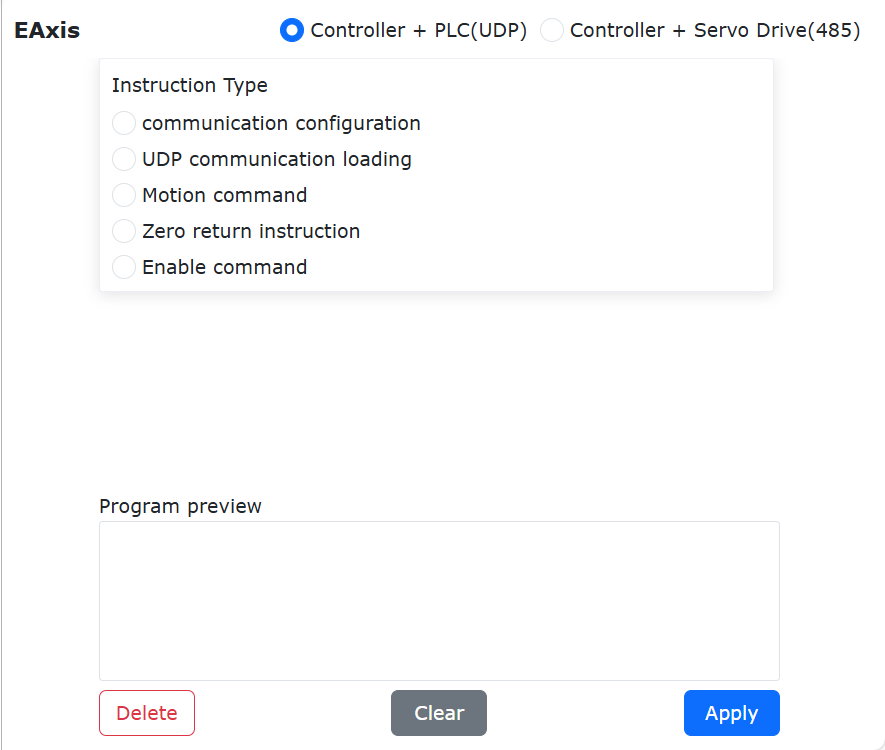

.. centered:: Abbildung 8.7‑25 Bearbeiten des Erweiterungsachsen-Befehls

Teach-Programm für Erweiterungsachse in Kombination mit Laser-Tracking-Schweißen
++++++++++++++++++++++++++++++++++++++++++++++++++++++++++++++++++++++++++++++++++++++++++++

.. list-table::
   :widths: 50 80 80
   :header-rows: 0
   :align: center

   * - **Nr.**
     - **Befehlsformat**
     - **Kommentar**

   * - 1
     - EXT_AXIS_PTP(1,1,laserstart)
     - #Externe Achse bewegt sich zum Startpunkt des Lasersensors

   * - 2
     - PTP(laserstart,10,-1,0)
     - #Roboter bewegt sich zum Startpunkt des Lasersensors

   * - 3
     - LTSearchStart(3,20,10,10000)
     - #Positionssuche starten

   * - 4
     - LTSearchStop()
     - #Positionssuche stoppen

   * - 5
     - EXT_AXIS_PTP(1,1,seamPos)
     - #Externe Achse bewegt sich zum Schweißnaht-Startpunkt

   * - 6
     - Lin(seamPos,20,-1,0,0)
     - #Roboter bewegt sich zum Schweißnaht-Startpunkt

   * - 7
     - LTTrackOn()
     - #Laser-Tracking einschalten

   * - 8
     - ARCStart(0,10000)
     - #Schweißgerät Lichtbogen zünden

   * - 9
     - EXT_AXIS_PTP(1,1,laserend)
     - #Externe Achse bewegt sich zum Schweißnaht-Endpunkt

   * - 10
     - Lin(laserend,10,-1,0,0)
     - #Roboter bewegt sich zum Schweißnaht-Endpunkt

   * - 11
     - ARCEnd(0,10000)
     - #Schweißgerät Lichtbogen beenden

   * - 12
     - LTTrackOff
     - #Laser-Tracking ausschalten

Positionierabschlusszeit
++++++++++++++++++++++++++++++++

Nachdem die UDP-Kommunikation für die Erweiterungsachse hergestellt wurde, geben Sie die Zeit ein und klicken Sie auf die Schaltfläche "Konfigurieren", um die Einstellung abzuschließen. Dieser Konfigurationseintrag dient zum Überwachen der Zeit, die die Erweiterungsachse benötigt, um ihre Bewegung zu beenden.

.. figure:: robot_peripherals/115.png
   :align: center
   :width: 4in

.. centered:: Abbildung 8.7‑26 Konfiguration der Positionierabschlusszeit

Test des Wagens mit zwei Freiheitsgraden
~~~~~~~~~~~~~~~~~~~~~~~~~~~~~~~~~~~~~~~~~~~~~~~~~~~~~~

Wenn die Erweiterungsachsen-Lösung in der Erweiterungsachsen-Koordinatensystemkonfiguration auf "5-Wagen mit zwei Freiheitsgraden" gesetzt ist, wird dieser Inhalt nach dem Betreten der UDP-Kommunikationsoberfläche angezeigt, andernfalls ist er nicht sichtbar.

.. figure:: robot_peripherals/116.png
   :align: center
   :width: 4in

.. centered:: Abbildung 8.7‑27 Oberfläche bei Erweiterungsachsen-Lösung "5-Wagen mit zwei Freiheitsgraden"

.. important:: Der Wagen mit zwei Freiheitsgraden verwendet standardmäßig die Erweiterungsachsennummern 1 und 2. Nach erfolgreicher UDP-Kommunikation kann über den Erweiterungsachsenstatus unter "Roboterverschiedene Status" überprüft werden, ob die Erweiterungsachsen 1 und 2 servogesteuert an ihrem Ziel sind.

.. figure:: robot_peripherals/117.png
   :align: center
   :width: 6in

.. centered:: Abbildung 8.7‑28 Erweiterungsachsen des Wagens mit zwei Freiheitsgraden servogesteuert an Position

.. note::
   .. image:: robot_peripherals/105.png
      :height: 0.75in
      :align: left

   Bezeichnung: **Schaltfläche "Aktivieren"**

   Funktion: Aktivierungsstatus der Erweiterungsachse. Ein Klick auf die Schaltfläche deaktiviert die Erweiterungsachse (Enable entfernen).

.. note::
   .. image:: robot_peripherals/106.png
      :height: 0.75in
      :align: left

   Bezeichnung: **Schaltfläche "Deaktivieren"**

   Funktion: Deaktivierungsstatus der Erweiterungsachse. Ein Klick auf die Schaltfläche aktiviert die Erweiterungsachse (Enable geben).

.. note::
   .. image:: robot_peripherals/107.png
      :height: 0.75in
      :align: left

   Bezeichnung: **Schaltfläche "Referenzpunktfahrt"**

   Funktion: Referenzpunktfahrt der Erweiterungsachse von der aktuellen Position.

.. note::
   .. image:: robot_peripherals/108.png
      :height: 0.75in
      :align: left

   Bezeichnung: **Schaltfläche "Test"**

   Funktion: Funktionstest des Wagens mit zwei Freiheitsgraden.

**Schritt 1**: Nach erfolgreicher UDP-Kommunikation klicken Sie auf die Schaltfläche "Deaktivieren", um die entsprechenden Erweiterungsachsen des Wagens mit zwei Freiheitsgraden zu aktivieren. Überprüfen Sie den Servoaktivierungsstatus der Erweiterungsachsen 1 und 2 über den Erweiterungsachsenstatus unter "Roboterverschiedene Status".

.. figure:: robot_peripherals/118.png
   :align: center
   :width: 6in

.. centered:: Abbildung 8.7‑29 Aktivierung der Erweiterungsachsen des Wagens mit zwei Freiheitsgraden

**Schritt 2**: Nach erfolgreicher Aktivierung der Erweiterungsachse klicken Sie auf die Schaltfläche "Referenzpunktfahrt", um die aktuelle Position der Erweiterungsachse als Nullpunkt zu setzen. Nach erfolgreicher Referenzpunktfahrt wird die Testschaltfläche hervorgehoben, andernfalls ist sie ausgegraut.

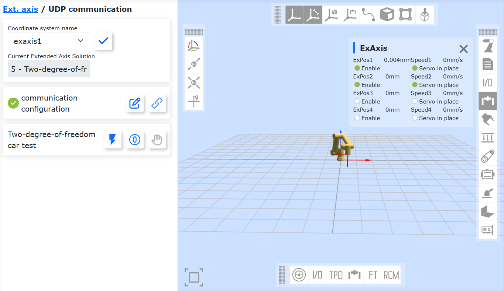

.. centered:: Abbildung 8.7‑30 Erfolgreiche Referenzpunktfahrt (aktuelle Position als Nullpunkt) für den Wagen mit zwei Freiheitsgraden

**Schritt 3**: Nach erfolgreicher Referenzpunktfahrt (aktuelle Position als Nullpunkt) des Wagens mit zwei Freiheitsgraden klicken Sie auf die Schaltfläche "Test", um zur Oberfläche zu gelangen. Wählen Sie die Bewegungsart, geben Sie Parameter für den Bewegungstest ein und klicken Sie während der Bewegung auf die Schaltfläche "Stopp", um die Stoppfunktion zu testen.

- **Bewegungsart**: Gerade / Kreisbogen.

- **Strecke**: -5000 ~ 5000 mm (bei gerader Bewegungsart).

- **Radius**: 1 ~ 5000 mm (bei gerader Bewegungsart? Anmerkung: Dies scheint ein Fehler im Original zu sein, Radius gehört eher zur Kreisbogenbewegung. Wahrscheinlich ist gemeint: Radius: 1~5000mm (bei Kreisbogenbewegung)).

- **Winkel**: -360 ~ 360° (bei Kreisbogenbewegung).

- **Geschwindigkeit**: 1 ~ 100 %.

.. figure:: robot_peripherals/120.png
   :align: center
   :width: 4in

.. figure:: robot_peripherals/121.png
   :align: center
   :width: 4in

.. centered:: Abbildung 8.7‑31 Test des Wagens mit zwei Freiheitsgraden

Steuerung + Servoantrieb (485-Kommunikation)
~~~~~~~~~~~~~~~~~~~~~~~~~~~~~~~~~~~~~~~~~~~~~~~~~~~~~~~~~~~~

Hardware-Verdrahtung
+++++++++++++++++++++++++++++++++++++

Bevor Sie die RS485-Kommunikation zur Steuerung der Servo-Erweiterungsachse verwenden, stellen Sie bitte zuerst eine Verbindung zwischen der RS485-Kommunikationsschnittstelle des Servoantriebs und der RS485-Kommunikationsschnittstelle am Robotersteuerschrank her. Das folgende Diagramm zeigt die elektrischen Schnittstellen des FAIRINO-Roboter-Ministeuerschranks (Easy-Made-Version):

.. figure:: robot_peripherals/122.png
   :align: center
   :width: 6in

.. centered:: Abbildung 8.7‑32 Elektrische Schnittstellen des FAIRINO-Roboter-Ministeuerschranks (Easy-Made)

Am Beispiel des Servoantriebs DYNATEC FD100-750C: Siehe die Klemmenbilder des Antriebspanels und die Definition der X3A-IN-Klemmen des FD100-750C. Wenn der Roboter für die Kommunikation mit dem FD100-750C-Servo-Erweiterungsantrieb konfiguriert wird, müssen die Klemmen 485-A0 und 485-B0 am Steuerschrank mit den Pins 4 bzw. 5 der X3A-IN-Klemmenleiste des Antriebs verbunden werden. (Bitte beachten Sie: Auf dem Servoantriebspanel befindet sich möglicherweise eine mit "485" gekennzeichnete Klemmleiste. Diese ist derzeit nicht für die Benutzerverwendung freigegeben. Schließen Sie Ihr RS485-Kommunikationskabel **nicht** an diese Klemmen an.) Wenn mehrere Servoantriebe angeschlossen werden und dieser Antrieb der letzte in der Kette ist, muss der DIP-Schalter für den RS485-Kommunikationsabschlusswiderstand (DIP-Schalter Nr. 2) auf dem Panel geöffnet (eingeschaltet) werden.

.. figure:: robot_peripherals/123.png
   :align: center
   :width: 6in

.. centered:: Abbildung 8.7‑33 Bedienfeld des FD100-750C Antriebs

.. figure:: robot_peripherals/124.png
   :align: center
   :width: 6in

.. centered:: Abbildung 8.7‑34 Definition der X3A-IN-Klemmen des FD100-750C

Kommunikationskonfiguration
+++++++++++++++++++++++++++++++++++++++++++++++

Stellen Sie sicher, dass Ihr RS485-Kommunikationskabel korrekt angeschlossen ist und sowohl der Roboter als auch die Servo-Erweiterungsachse ordnungsgemäß mit Strom versorgt sind. Öffnen Sie dann die Roboter-WebApp.

Klicken Sie auf das Bild mit der Kombinationsmethode "Steuerung + Servoantrieb", um zur detaillierten Konfigurationsoberfläche zu gelangen. Wählen Sie in der Servoantriebskonfiguration die Nummer "1" (Hinweis: Wenn mehrere Servos angeschlossen sind, dient diese Nummer zur Unterscheidung der verschiedenen Servos; wir werden später mehrfach darauf verweisen). Wählen Sie den Hersteller "DYNATEC" und das entsprechende Servoantriebsmodell, hier "FD00-750C". Die Softwareversion ist V1.0. Geben Sie die dem Servoantrieb entsprechende Auflösung ein, hier 131072. Geben Sie basierend auf Ihrem Mechanikmodell das mechanische Übersetzungsverhältnis ein, hier 15,45. Klicken Sie auf die Schaltfläche "Konfigurieren".

.. figure:: robot_peripherals/125.png
   :align: center
   :width: 4in

.. centered:: Abbildung 8.7‑35 Servoantriebskonfiguration

Damit haben wir die 485-Kommunikationskonfiguration zwischen Roboter und Servoantrieb abgeschlossen. Sie können die Echtzeit-Statusinformationen des Servos in der "Servo-Statusleiste" auf der rechten Seite der WebApp einsehen. Wie in der folgenden Abbildung dargestellt:

.. figure:: robot_peripherals/126.png
   :align: center
   :width: 4in

.. centered:: Abbildung 8.7‑36 Servo-Statusleiste

Jetzt müssen Sie der Reihe nach die Erweiterungsachse aktivieren und die Referenzpunktfahrt-Methode einstellen. Anschließend können Sie erste Bewegungstests durchführen. Führen Sie die folgenden Testschritte aus diesem Handbuch unter Sicherheitsvorkehrungen durch.

Bereits konfigurierte Servoantriebe
++++++++++++++++++++++++++++++++++++++++++++++

.. note::
   .. image:: robot_peripherals/127.png
      :height: 0.75in
      :align: left

   Bezeichnung: **Schaltfläche "Anzeigen"**

   Funktion: Klicken, um die Konfigurationsinformationen des Servoantriebs anzuzeigen.

.. note::
   .. image:: robot_peripherals/105.png
      :height: 0.75in
      :align: left

   Bezeichnung: **Schaltfläche "Aktivieren"**

   Funktion: Aktivierungsstatus des Servoantriebs. Ein Klick auf die Schaltfläche deaktiviert den Servoantrieb (Enable entfernen).

.. note::
   .. image:: robot_peripherals/106.png
      :height: 0.75in
      :align: left

   Bezeichnung: **Schaltfläche "Deaktivieren"**

   Funktion: Deaktivierungsstatus des Servoantriebs. Ein Klick auf die Schaltfläche aktiviert den Servoantrieb (Enable geben).

.. note::
   .. image:: robot_peripherals/107.png
      :height: 0.75in
      :align: left

   Bezeichnung: **Schaltfläche "Referenzpunktfahrt"**

   Funktion: Einstellung der Referenzpunktfahrt-Methode für den Servoantrieb.

.. note::
   .. image:: robot_peripherals/108.png
      :height: 0.75in
      :align: left

   Bezeichnung: **Schaltfläche "Test"**

   Funktion: Test des Servoantriebs.

.. note::
   .. image:: robot_peripherals/128.png
      :height: 0.75in
      :align: left

   Bezeichnung: **Schaltfläche "Servo-Fehler löschen"**

   Funktion: Bei einer Fehlermeldung des Servoantriebs hier klicken, um den Fehler zu löschen.

Servo-Steuerungsmodus und Aktivierung
****************************************************

Wählen Sie unter "Bereits konfigurierte Servoantriebe" den Steuerungsmodus "Positionsmodus". Wählen Sie die entsprechende Servonummer aus und klicken Sie auf die Schaltfläche "Deaktivieren". Zuerst wird die Servonummer gesetzt. Nach erfolgreicher Einstellung wird der Steuerungsmodus gesetzt. Nach erfolgreicher Einstellung des Steuerungsmodus wird der Servoantrieb aktiviert (Bitte beachten Sie: Nach dem Umschalten des Steuerungsmodus muss der Servoantrieb zuerst deaktiviert (Enable entfernen) und dann wieder aktiviert werden, damit die Umschaltung des Steuerungsmodus wirksam wird. Nach erfolgreicher Aktivierung des Servos ist das Umschalten des Steuerungsmodus gesperrt).

.. figure:: robot_peripherals/129.png
   :align: center
   :width: 4in

.. centered:: Abbildung 8.7‑37 Servo-Steuerungsmodus und Aktivierung

Nach erfolgreicher Servoaktivierung können Sie in der "Servo"-Statusleiste unter "Roboterverschiedene Status" beobachten, dass die Statusleuchte für "Servo aktiviert" aufleuchtet. Dies zeigt an, dass der Servoantrieb aktiviert ist. Klicken Sie auf die Statustaste "Aktivieren", um den Servoantrieb zu deaktivieren. Die Statusleuchte "Servo aktiviert" erlischt.

.. figure:: robot_peripherals/130.png
   :align: center
   :width: 6in

.. centered:: Abbildung 8.7‑38 Servoantriebs-Statusleiste

Servo-Referenzpunktfahrt
************************************************

Nach erfolgreicher Aktivierung des Servoantriebs wird die Schaltfläche "Referenzpunktfahrt" hervorgehoben. Klicken Sie auf die Schaltfläche, um zur Einstellungsoberfläche zu gelangen. Wählen Sie die Referenzpunktfahrt-Methode "Aktuelle Position als Nullpunkt". Stellen Sie die Suchgeschwindigkeit auf 5 mm/s und die Nullpunkt-Einrastgeschwindigkeit auf 1 mm/s ein. Klicken Sie auf die Schaltfläche "Einstellen". Damit ist die Referenzpunktfahrt von der aktuellen Servoposition abgeschlossen. In der "Servo"-Statusleiste unter "Roboterverschiedene Status" können Sie beobachten, dass die aktuelle "Servoposition" 0 ist. (Bitte lesen Sie dieses Handbuch vollständig, bevor Sie die Referenzpunktfahrt-Methode auf "Negative Endlage als Nullpunkt" oder "Positive Endlage als Nullpunkt" für Tests umstellen).

.. figure:: robot_peripherals/131.png
   :align: center
   :width: 6in

.. centered:: Abbildung 8.7‑39 Servo-Referenzpunktfahrt

Servobewegung
***********************************************

Bevor Sie die Servomotorsteuerung tatsächlich steuern, machen Sie sich bitte mit dem "Positionsmodus" und "Geschwindigkeitsmodus" des Servomotors vertraut. Wir erinnern Sie noch einmal:

**Positionsmodus**: Sie können eine bestimmte Bewegungsgeschwindigkeit und Zielpositionsparameter eingeben. Der Servo bewegt sich mit der eingestellten Geschwindigkeit zur Zielposition und stoppt dort.

**Geschwindigkeitsmodus**: Sie können eine bestimmte Zielgeschwindigkeit eingeben. Der Servo bewegt sich kontinuierlich mit dieser Geschwindigkeit, bis Sie die Zielgeschwindigkeit auf 0 setzen oder den Servomotor deaktivieren.

Wenn der Steuerungsmodus umgeschaltet wird, wechselt die Anzeige "Aktueller Steuerungsmodus" automatisch (Bitte beachten Sie: Nach dem Umschalten des Steuerungsmodus muss der Servo zuerst deaktiviert (Enable entfernen) und dann wieder aktiviert werden, damit die Umschaltung wirksam wird). Falls sich Ihr Servo derzeit nicht im "Positionsmodus" befindet, schalten Sie ihn bitte in den Positionsmodus um. Geben Sie eine "Zielposition" von 50 mm und eine Bewegungsgeschwindigkeit von 5 mm/s ein. Klicken Sie unter Sicherheitsvorkehrungen auf die Schaltfläche "Einstellen". Der Servomotor bewegt sich nun gemäß Ihren Parametern. Sie können Position, Geschwindigkeit usw. des Servos in Echtzeit in der "Servo"-Statusleiste unter "Roboterverschiedene Status" beobachten.

.. figure:: robot_peripherals/132.png
   :align: center
   :width: 4in

.. centered:: Abbildung 8.7‑40 Servobewegungstest (Positionsmodus)

Ändern Sie den Steuerungsmodus des Servos in "Geschwindigkeitsmodus". Klicken Sie auf die Statustaste "Aktivieren", um den Servoantrieb zu deaktivieren, und dann auf die Statustaste "Deaktivieren", um ihn wieder zu aktivieren. Der Servo wechselt nun in den Geschwindigkeitsmodus (Bitte beachten Sie: Wenn sich der Servomotor bewegt, kann er nur durch Setzen der Zielgeschwindigkeit auf 0 gestoppt werden). Geben Sie eine Zielgeschwindigkeit von 5 mm/s ein und klicken Sie auf "Einstellen". Der Servomotor bewegt sich nun kontinuierlich mit 5 mm/s. Auch hier können Sie Position, Geschwindigkeit usw. des Servos in Echtzeit in der "Servo"-Statusleiste beobachten.

.. figure:: robot_peripherals/133.png
   :align: center
   :width: 4in

.. centered:: Abbildung 8.7‑41 Servobewegungstest (Geschwindigkeitsmodus)

Erweiterte Einstellungen
++++++++++++++++++++++++++++++++++++++

In Notfallsituationen wie einer Roboterkollision oder einem Not-Halt soll die Erweiterungsachse ebenfalls einen Not-Halt auslösen und mit der eingestellten Not-Halt-Verzögerung zum Stillstand kommen. Nach der Behebung des Kollisionsalarms soll die Erweiterungsachse durch weitere Befehle den Betrieb wieder aufnehmen können. Dazu müssen in den erweiterten Einstellungen die Servo-Beschleunigungs- und -Verzögerungswerte sowie die Servo-Not-Halt-Beschleunigungs- und -Verzögerungswerte eingestellt werden, wie in der folgenden Abbildung gezeigt:

.. figure:: robot_peripherals/134.png
   :align: center
   :width: 4in

.. centered:: Abbildung 8.7‑42 Erweiterte Einstellungen

Erweiterungsachsen-Programmierung
++++++++++++++++++++++++++++++++++++++++++++++

Erstellen Sie in "Teach-Programm" -> "Programmierung" ein neues Benutzerprogramm "testServo.lua". Wählen Sie "Peripheriebefehle".

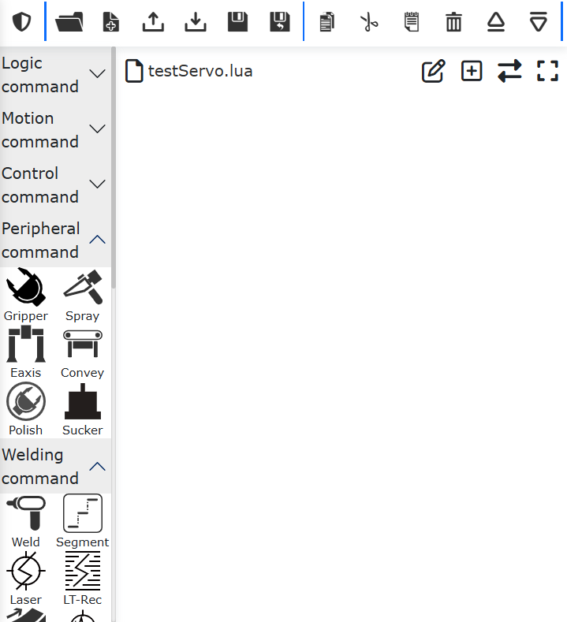

.. centered:: Abbildung 8.7‑43 Peripheriebefehle öffnen

Klicken Sie auf "Erweiterungsachse", um die Oberfläche zum Hinzufügen von Erweiterungsachsen-Befehlen zu öffnen. Wählen Sie die Kombinationsmethode "Steuerung + Servoantrieb (485)". Stellen Sie den Steuerungsmodus auf "Positionsmodus" und klicken Sie auf die Schaltfläche "Hinzufügen" auf der rechten Seite. Blättern Sie in der Oberfläche zum Hinzufügen von Erweiterungsachsen-Befehlen ganz nach unten und klicken Sie auf die Schaltfläche "Anwenden".

.. figure:: robot_peripherals/136.png
   :align: center
   :width: 6in

.. centered:: Abbildung 8.7‑44 Steuerungsmodus der Erweiterungsachse einstellen

Daraufhin erscheint im Programm "testServo.lua" eine Reihe von Befehlen zum Umschalten des Servo-Steuerungsmodus. Sie können den Roboter in den Automatikmodus schalten und dieses Programm ausführen.

.. figure:: robot_peripherals/137.png
   :align: center
   :width: 6in

.. centered:: Abbildung 8.7‑45 Programm zum Einstellen des Servo-Steuerungsmodus

Wie steuert man die Servobewegung über ein Benutzerprogramm? Öffnen Sie erneut die Oberfläche zum Hinzufügen von Erweiterungsachsen-Befehlen. Suchen Sie, wie unten gezeigt, den Bereich Parametereinstellung. Wählen Sie als Beispiel den Positionsmodus, geben Sie Zielposition und Bewegungsgeschwindigkeit ein und klicken Sie auf die Schaltfläche "Hinzufügen". Blättern Sie ganz nach unten und klicken Sie auf "Anwenden", und schließen Sie dann die Oberfläche zum Hinzufügen von Erweiterungsachsen-Befehlen.

.. figure:: robot_peripherals/138.png
   :align: center
   :width: 6in

.. centered:: Abbildung 8.7‑46 Bewegungsbefehl für Positionsmodus hinzufügen

Dem Programm "testServo.lua" wird der Servo-Bewegungsbefehl hinzugefügt: "AuxServoSetTargetPos(1,50,5)". Die Bedeutung der drei Parameter im Befehlsfunktion ist:

- **1**: Die Servonummer ist 1.
- **50**: Die Zielposition.
- **5**: Die Zielgeschwindigkeit.

.. figure:: robot_peripherals/139.png
   :align: center
   :width: 6in

.. centered:: Abbildung 8.7‑47 Servo-Bewegungsprogramm im Positionsmodus

Schalten Sie den Roboter in den Automatikmodus und führen Sie dieses Programm aus. Ihr Servo bewegt sich nun mit 5 mm/s zur Position 50 mm.

Damit haben wir die grundlegende Konfiguration und Tests der RS485-gesteuerten Servo-Erweiterungsachse abgeschlossen. Sie können je nach tatsächlicher Situation Programme schreiben, die Roboterbewegungen und Servobewegungen kombinieren, wie im folgenden Beispielprogramm.

Beispiel für ein Programm mit koordinierter Bewegung von Erweiterungsachse und Roboter
***************************************************************************************

.. list-table::
   :widths: 50 80 80
   :header-rows: 0
   :align: center

   * - **Nr.**
     - **Befehlsformat**
     - **Kommentar**

   * - 1
     - AuxServoSetTargetPos(1,50,5)
     - #Erweiterungsachse bewegt sich zum Referenzpunkt (Reset-Position)

   * - 2
     - if(GetDI(8,0) == 1) then
     - #Wenn CI0-Eingang aktiv ist

   * - 3
     - AuxServoSetTargetPos(1,50,5)
     - #Erweiterungsachse bewegt sich auf 50 mm

   * - 4
     - PTP(testptp1,100,-1,0)
     - #Roboter bewegt sich zu Punkt testptp1

   * - 5
     - elseif(GetDI(9,0) == 1) then
     - #Wenn CI1-Eingang aktiv ist

   * - 6
     - AuxServoSetTargetPos(1,150,5)
     - #Erweiterungsachse bewegt sich auf 150 mm

   * - 7
     - PTP(testptp2,100,-1,0)
     - #Roboter bewegt sich zu Punkt testptp2

   * - 8
     - else
     - #Wenn weder CI0 noch CI1 aktiv sind

   * - 9
     - AuxServoSetTargetPos(1,300,5)
     - #Erweiterungsachse bewegt sich auf 300 mm

   * - 10
     - PTP(testptp3,100,-1,0)
     - #Roboter bewegt sich zu Punkt testptp3

   * - 11
     - end
     - #Ende

Zusammenfassung
+++++++++++++++++++++++++++++++++++++++++++++

Zusammenfassend gibt es bei der Konfiguration der RS485-Kommunikation zwischen kollaborativem Roboter und Servo-Erweiterungsachse folgende wichtige Punkte zu beachten:

1.  **Korrekte Verbindung** des RS485-Kommunikationskabels zwischen kollaborativem Roboter und Servoantrieb.

2.  **Korrekte Auswahl** des Steuerungsmodus für die Servo-Erweiterungsachse.

3.  Nach dem Umschalten des Steuerungsmodus muss der Servo **zuerst deaktiviert (Enable entfernen) und dann wieder aktiviert werden**, damit die Umschaltung wirksam wird.

Linienlasersensor
-----------------------------------------------

Der FAIRINO-kollaborative Roboter kann in Verbindung mit einem Lasersensor verwendet werden. Der Sensor erkennt charakteristische Positionen wie Schweißnähte, um die Programmierung zu vereinfachen und die Produktionseffizienz zu steigern. Der kollaborative Roboter kann mit Lasersensoren der Hersteller Ruiniu, Chuangxiang und Quanshi verwendet werden. Bei Verwendung verschiedener Sensoren muss nur das entsprechende Kommunikationsprotokoll geladen werden.

Hardware-Verdrahtung
~~~~~~~~~~~~~~~~~~~~~~~~~~~~~~~~~~~~~~~~~

Vor der Verwendung des Lasersensors muss dieser an einer geeigneten Position montiert werden. Verbinden Sie das Netzwerkkabel des Lasersensors direkt oder über einen Switch mit einer beliebigen RJ45-Schnittstelle des Robotersteuerschranks.

Sensorkonfiguration
~~~~~~~~~~~~~~~~~~~~~~~~~~~~~~~~~~~~~~~~~

Stellen Sie sicher, dass Ihr Lasersensor und Schweißbrenner fest am Roboterflansch montiert sind, der Lasersensor über ein Netzwerkkabel mit dem Robotersteuerschrank verbunden ist und die IP-Adressen von Lasersensor und Robotersteuerschrank im selben Netzwerksegment liegen. Schalten Sie den Roboter und den Sensor ein. Das folgende Bild zeigt die Montage eines Ruiniu-Lasersensors.

.. figure:: robot_peripherals/140.png
   :align: center
   :width: 4in

.. centered:: Abbildung 8.8‑1 Montage des Lasersensors

Geben Sie im Bereich Kommunikationskonfiguration die IP-Adresse und den Port des Sensors ein. Klicken Sie auf die Schaltfläche "Konfigurieren". Die Abtastperiode ist standardmäßig 25. Wählen Sie als Koordinatensystem "Laserebenenkoordinatensystem". Wählen Sie basierend auf Ihrem Sensormodell das entsprechende Kommunikationsprotokoll aus und klicken Sie auf die Schaltfläche "Laden".

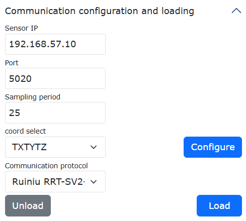

.. centered:: Abbildung 8.8‑2 Lasersensorkonfiguration

Klicken Sie im Bereich "Trackingsensor-Test" nacheinander auf "Öffnen" und "Schließen" für den Sensor. Beobachten Sie, ob der Laser des Sensors ein- oder ausgeschaltet wird. Wenn der Laser normal ein- und ausgeschaltet wird, wurde die Kommunikation zwischen Roboter und Sensor erfolgreich hergestellt. Andernfalls überprüfen Sie bitte, ob Parameter wie IP-Adresse und Portnummer korrekt sind und ob die Netzwerkverbindung zwischen Sensor und Roboter korrekt ist.

.. figure:: robot_peripherals/142.png
   :align: center
   :width: 4in

.. centered:: Abbildung 8.8‑3 Lasersensor-Kommunikationstest

Sensorkalibrierung
~~~~~~~~~~~~~~~~~~~~~~~~~~~~~~~~~~~~~~~~~~~~~~~~~

Vor der Verwendung des Lasersensors muss dieser kalibriert werden. Die Kalibriergenauigkeit beeinflusst direkt die Tracking-Genauigkeit des Lasersensors. Die Kalibrierungsmethoden für Lasersensoren umfassen die Fünf-Punkt-Methode, die Sechs-Punkt-Methode und die Acht-Punkt-Methode. Am Beispiel der in Schweißanwendungen am häufigsten verwendeten Fünf-Punkt-Methode: Das Prinzip besteht darin, zuerst mit einem Werkzeug (Schweißbrenner) auf einen festen Kalibrierpunkt zu zeigen (siehe Abbildung 4) und dann mit dem Lasersensor diesen Punkt aus vier verschiedenen Ausrichtungen anzustrahlen und zu erkennen.

.. note::
  Der Kalibrierpunkt muss vom Lasersensor genau erkannt werden können, andernfalls ist keine präzise Kalibrierung möglich.

Daraus wird die Koordinatenposition des Sensors berechnet. Der Kalibrierungsprozess wird im Folgenden detailliert beschrieben:

.. figure:: robot_peripherals/143.png
   :align: center
   :width: 4in

.. centered:: Abbildung 8.8‑4 Lasersensor-Kalibrierpunkt

**Schritt 1**: Öffnen Sie die Roboter-WebApp und klicken Sie nacheinander auf "Initiale Einstellungen" -> "Basis" -> "Werkzeugkoordinaten", um zur Werkzeugkoordinaten-Oberfläche zu gelangen. Wählen Sie ein unbenutztes Werkzeugkoordinatensystem aus, klicken Sie auf "Ändern", benennen Sie es in "Schweißbrenner" um, wählen Sie den Werkzeugtyp "Werkzeug" und die Einbauposition "Flansch".

.. figure:: robot_peripherals/144.png
   :align: center
   :width: 4in

.. centered:: Abbildung 8.8‑5 Einstellen des Koordinatensystems "Schweißbrenner"

Wählen Sie erneut ein unbenutztes Koordinatensystem aus, benennen Sie es in "Lasersensor" um, wählen Sie den Werkzeugtyp "Sensor" und die Einbauposition "Flansch".

.. figure:: robot_peripherals/145.png
   :align: center
   :width: 4in

.. centered:: Abbildung 8.8‑6 Einstellen des Koordinatensystems "Lasersensor"

**Schritt 2**: Kalibrieren Sie das Werkzeugkoordinatensystem des Schweißbrenners mit der Sechs-Punkt-Methode: Wählen Sie das Koordinatensystem "Schweißbrenner" aus, klicken Sie auf die Schaltfläche "Ändern" und kalibrieren Sie das Werkzeugkoordinatensystem des Schweißbrenners mit der Sechs-Punkt-Methode (Die spezifische Kalibrierungsmethode ist im FAIRINO-Dokument beschrieben und wird hier nicht wiederholt).

.. figure:: robot_peripherals/146.png
   :align: center
   :width: 4in

.. centered:: Abbildung 8.8‑7 Kalibrierung des Koordinatensystems "Schweißbrenner"

**Schritt 3**: Wählen Sie in der "Werkzeugkoordinatensystem-Einstellung" das Koordinatensystem Nummer 0 (Basiskoordinatensystem), Standardname "toolcoord0". Klicken Sie auf "Anwenden", um das aktuelle Koordinatensystem auf das Basiskoordinatensystem umzustellen.

.. figure:: robot_peripherals/147.png
   :align: center
   :width: 4in

.. centered:: Abbildung 8.8‑8 Sensorkalibrierung Schritt 1

**Schritt 4**: Wählen Sie erneut das zuvor eingestellte Koordinatensystem "Lasersensor" aus (**nicht** auf "Anwenden" klicken). Klicken Sie auf die Schaltfläche "Bearbeiten". Wählen Sie den Werkzeugtyp "Sensor". Der Sensor ist "am Roboterflansch" befestigt. Wählen Sie die Kalibrierungsmethode "Fünf-Punkt-Methode".

.. figure:: robot_peripherals/148.png
   :align: center
   :width: 4in

.. centered:: Abbildung 8.8‑9 Sensorkalibrierung Schritt 2

**Schritt 5**: Bewegen Sie den Roboter per Hand (Drag), sodass die Spitze des Schweißbrenners auf den Kalibrierpunkt zeigt. Wählen Sie das Koordinatensystem "Schweißbrenner" aus und klicken Sie auf "Anwenden". Klicken Sie auf "Punkt 1 setzen", wie in Abbildung 13.

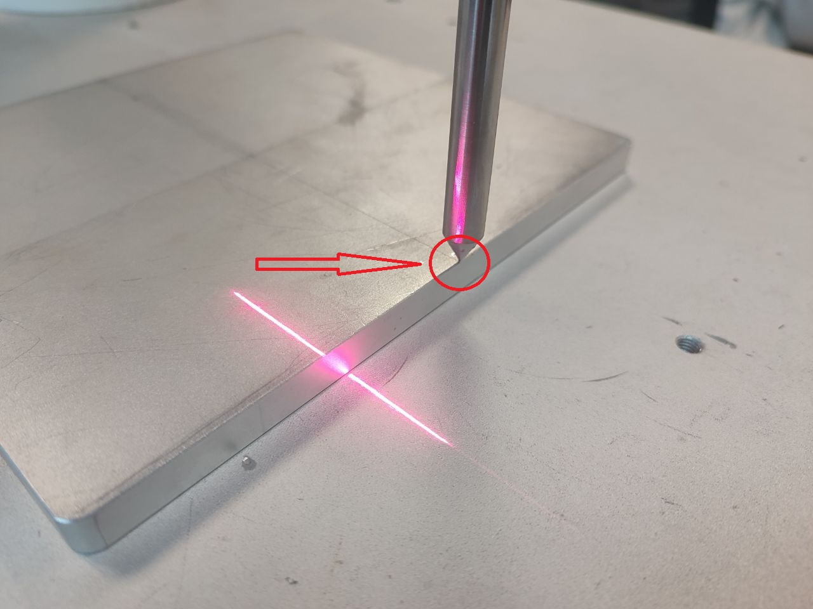

.. centered:: Abbildung 8.8‑10 Sensorkalibrierung Schritt 3

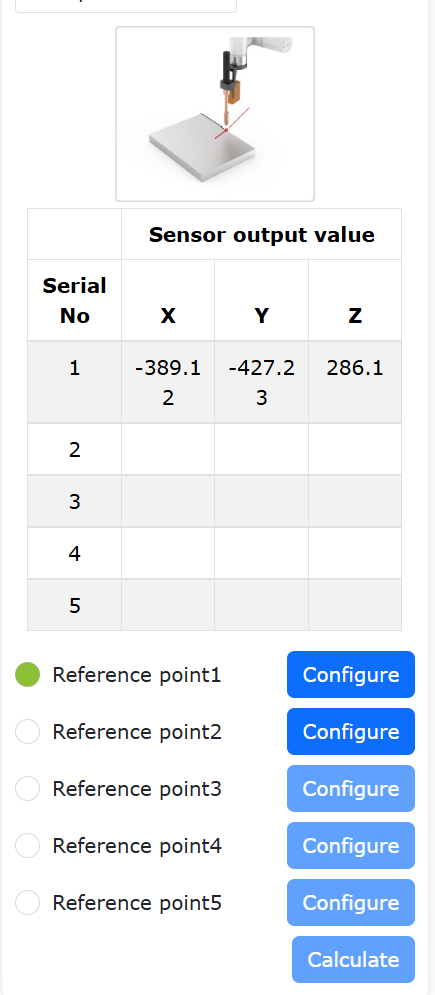

.. centered:: Abbildung 8.8‑11 Sensorkalibrierung Schritt 4

**Schritt 6**: Wählen Sie erneut das Koordinatensystem Nummer 0 ("toolcoord0"). Wählen Sie dann das Koordinatensystem "Sensor" aus (**nicht** auf "Anwenden" klicken). Sie können mit der Kalibrierung fortfahren.

.. figure:: robot_peripherals/147.png
   :align: center
   :width: 4in

.. centered:: Abbildung 8.8‑12 Sensorkalibrierung Schritt 5

.. figure:: robot_peripherals/145.png
   :align: center
   :width: 4in

.. centered:: Abbildung 8.8‑13 Sensorkalibrierung Schritt 6

**Schritt 7**: Bewegen Sie die Position des Lasersensors so, dass der Laserstrahl genau auf den Kalibrierpunkt trifft. Klicken Sie auf "Punkt 2 setzen". Daraufhin werden an der entsprechenden Position links neben den Sensorausgangswerten die aktuellen Sensordaten angezeigt. Wenn die Daten normal erscheinen, war die Einstellung dieses Kalibrierpunkts erfolgreich; andernfalls muss erneut kalibriert werden.

.. figure:: robot_peripherals/151.png
   :align: center
   :width: 4in

.. centered:: Abbildung 8.8‑14 Sensorkalibrierung Schritt 7

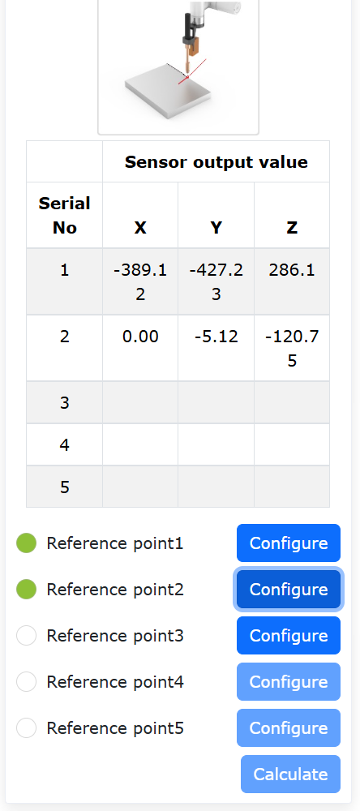

.. centered:: Abbildung 8.8‑15 Sensorkalibrierung Schritt 8

**Schritt 8**: Lassen Sie den Laser nacheinander aus drei weiteren verschiedenen Ausrichtungen auf den Kalibrierpunkt strahlen und klicken Sie jeweils auf "Punkt 3 setzen", "Punkt 4 setzen" und "Punkt 5 setzen". Klicken Sie abschließend auf die Schaltfläche "Berechnen", nachdem Sie sichergestellt haben, dass die Daten für jeden Punkt normal sind.

.. figure:: robot_peripherals/153.png
   :align: center
   :width: 4in

.. centered:: Abbildung 8.8‑16 Sensorkalibrierung Schritt 9

**Schritt 9**: Die WebApp zeigt nun das Kalibrierungsergebnis und die Kalibriergenauigkeit des Sensors an. Klicken Sie auf die Schaltfläche "Anwenden", um die Kalibrierung des Lasersensors abzuschließen. Wenn die Kalibriergenauigkeit zu schlecht ist, können Sie auf die Schaltfläche "Abbrechen" klicken und die Kalibrierung wiederholen.

.. figure:: robot_peripherals/154.png
   :align: center
   :width: 4in

.. centered:: Abbildung 8.8‑17 Sensorkalibriergenauigkeit

Lasersensor-Anwendung
~~~~~~~~~~~~~~~~~~~~~~~~~~~~~~~~~~~~~~~~~~~~~~~~~

Wenden Sie vor der Verwendung des Lasersensors das Werkzeugkoordinatensystem "Schweißbrenner" auf das aktuelle Werkzeugkoordinatensystem an.

.. figure:: robot_peripherals/144.png
   :align: center
   :width: 4in

.. centered:: Abbildung 8.8‑18 Anwenden des Schweißbrenner-Koordinatensystems

Teach-Punkte mit Lasersensor
++++++++++++++++++++++++++++++++++++++++++

Bewegen Sie den Roboter per Hand (Drag), sodass der Laserstrahl des Sensors auf den gewünschten Schweißnahtpunkt zeigt. Wählen Sie in der WebApp den Sensor als "Lasersensor" aus, geben Sie den Sensorpunktnamen "laserPt" ein und klicken Sie auf die Schaltfläche "Hinzufügen". Erstellen Sie ein neues Benutzerprogramm "testLaser.lua". Erstellen Sie einen Bewegungsbefehl PTP und wählen Sie als Zielpunkt "laserPt". Führen Sie diesen Befehl einzeln aus. Der Schweißbrenner wird sich nun zu dem Punkt bewegen, auf den der Lasersensor zuvor gezeigt hat.

.. figure:: robot_peripherals/155.png
   :align: center
   :width: 4in

.. centered:: Abbildung 8.8‑19 Lasersensor-Schweißnahtpunkt

.. figure:: robot_peripherals/156.png
   :align: center
   :width: 6in

.. centered:: Abbildung 8.8‑20 Teach eines Sensorpunktes

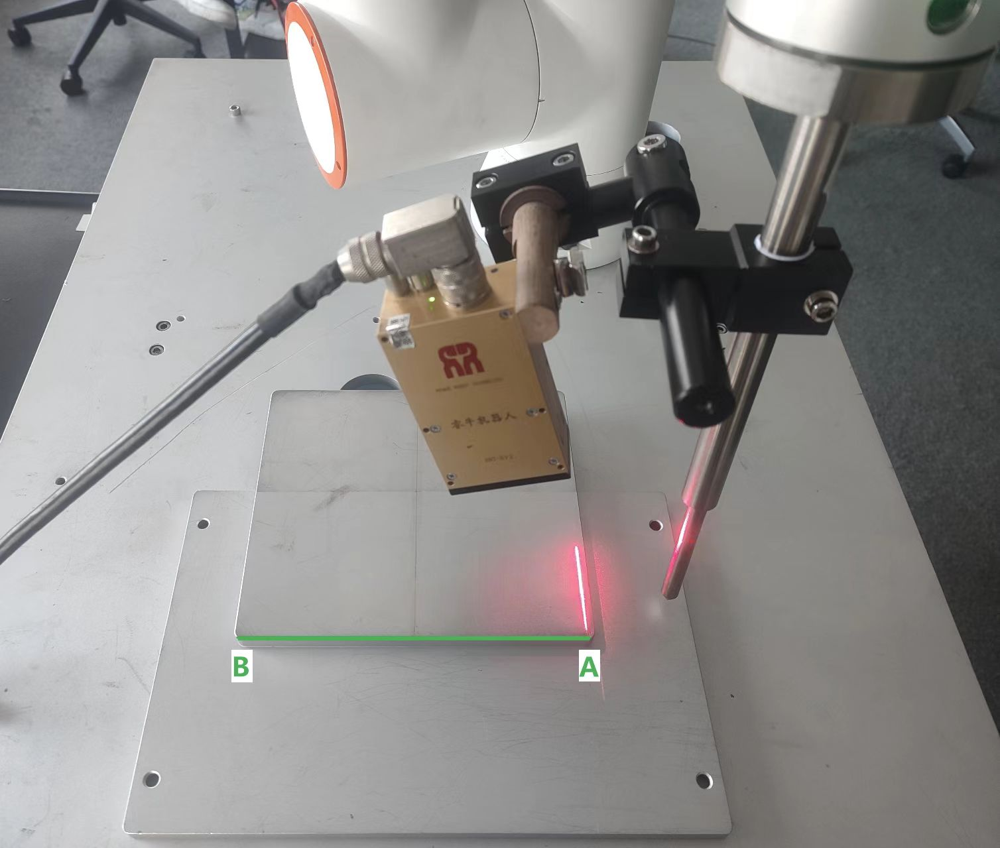

.. centered:: Abbildung 8.8‑21 Schweißbrenner zeigt auf Schweißnahtpunkt

Laser-Positionssuche + Tracking
++++++++++++++++++++++++++++++++++++++++

Die Kombination von kollaborativem Roboter und Lasersensor für Laser-Positionssuche und Laser-Tracking umfasst die folgenden Schritte:

(1) Der Roboter bewegt sich zu einem Punkt außerhalb der Schweißnaht.

(2) Die Laser-Positionssuche beginnt, und der Roboter bewegt sich mit dem Lasersensor in Richtung der Schweißnahtposition.

(3) Der Lasersensor erkennt die Schweißnaht. Der Roboter bewegt den Schweißbrenner zum erkannten Schweißnahtpunkt.

(4) Das Laser-Tracking beginnt, während sich der Roboter gleichzeitig zum Endpunkt der Schweißnaht bewegt. Der Lasersensor zeichnet während der Bewegung kontinuierlich die Position auf.

(5) Der Schweißbrenner bewegt sich entlang der vom Lasersensor aufgezeichneten Bahn, wodurch der Tracking-Effekt erzielt wird.

Stellen Sie vor dem Testen der Positionssuche und des Trackings sicher, dass der Sensor korrekt montiert, das Werkzeugkoordinatensystem "Schweißbrenner" korrekt kalibriert und der Lasersensor korrekt kalibriert wurde. Angenommen, die grüne Gerade in der Abbildung ist die zu schweißende Naht. Damit der Roboter automatisch den Schweißstartpunkt A findet und automatisch bis Punkt B schweißt, müssen die folgenden Befehle programmiert werden:

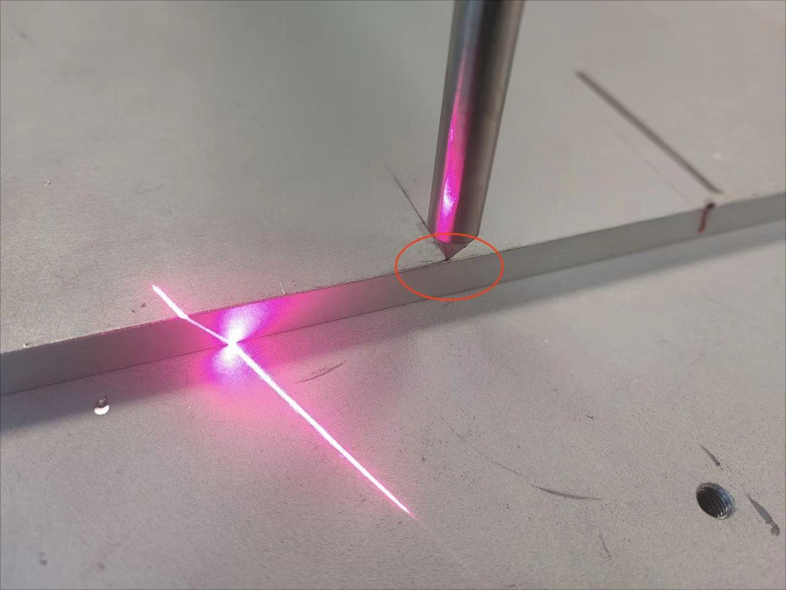

.. centered:: Abbildung 8.8‑22 Sensormontage

Positionssuch-Befehle schreiben
*********************************************

Erstellen Sie ein neues Benutzerprogramm "laserTrack.lua". Wählen Sie "Schweißbefehle". Klicken Sie auf "Lasertracking". Es öffnet sich die Seite zum Hinzufügen von Lasertracking-Befehlen.

.. figure:: robot_peripherals/159.png
   :align: center
   :width: 6in

.. centered:: Abbildung 8.8‑23 Lasertracking-Befehl

Suchen Sie den Bereich "Positionssuchbefehl". Wählen Sie als Koordinatensystemname "Lasersensor". Wählen Sie die Richtung "+x". Dies bedeutet, dass der Roboter mit dem Lasersensor von seiner aktuellen Position aus entlang der "+x"-Richtung des "Schweißbrenner"-Koordinatensystems fährt und dabei die Schweißnaht sucht. Die "Geschwindigkeit" ist die Bewegungsgeschwindigkeit des Lasersensors während der Positionssuche. Die "Länge" ist die maximale Suchstrecke des Lasersensors. Wenn der Roboter diese Strecke überschreitet, ohne die Schweißnaht gefunden zu haben, gibt er einen Fehler aus. Die maximale Suchzeit funktioniert ähnlich: Wird die Schweißnaht nicht innerhalb dieser Zeit gefunden, gibt der Roboter einen Fehler aus. Bitte geben Sie die oben genannten Parameter je nach tatsächlicher Szene korrekt ein. Klicken Sie nacheinander auf die Befehle "Positionssuche starten" und "Positionssuche beenden". Klicken Sie anschließend auf die Schaltfläche "Anwenden".

.. figure:: robot_peripherals/160.png
   :align: center
   :width: 6in

.. centered:: Abbildung 8.8‑24 Positionssuch-Befehl hinzufügen

Daraufhin werden in "laserTrack.lua" die entsprechenden Befehle zum Starten und Beenden der Laser-Positionssuche hinzugefügt.

.. figure:: robot_peripherals/161.png
   :align: center
   :width: 6in

.. centered:: Abbildung 8.8‑25 Positionssuch-Programm

Befehl zum Bewegen zum Suchpunkt schreiben
*****************************************************

Fügen Sie einen Punkt-zu-Punkt-Bewegungsbefehl LIN hinzu. Der Zielpunkt ist "seamPos", der Punkt der Laser-Positionssuche.

.. note:: Der Punkt "seamPos" ist ein systeminterner Punktname im Roboter, der speziell für die Laser-Positionssuche reserviert ist. Dieser Punkt muss nicht angeteacht werden. Nach einer erfolgreichen Laser-Positionssuche werden die Suchpunktinformationen automatisch im Punkt "seamPos" gespeichert.

Für den Suchpunkt kann ein Versatz eingestellt werden. Die Versatzarten können "Versatz im Basiskordinatensystem", "Versatz im Werkzeugkoordinatensystem" und "Versatz basierend auf Laserrohdaten" sein.

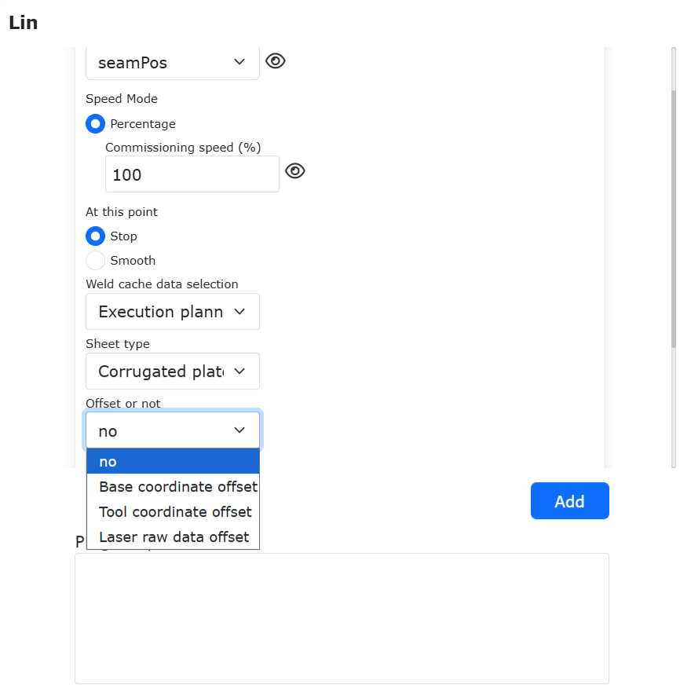

.. centered:: Abbildung 8.8‑26 Optionen für Suchpunkt-Versatz

Wenn die Suchpunkt-Versatzfunktion aktiviert ist, können Versatzparameter eingestellt werden. "dx" steht für den Versatzabstand in x-Richtung des gewählten Koordinatensystems, "drx" für den Drehwinkel um die x-Achse. Klicken Sie auf die Schaltfläche "Hinzufügen" und dann auf "Anwenden".

.. figure:: robot_peripherals/163.png
   :align: center
   :width: 6in

.. centered:: Abbildung 8.8‑27 Einstellung der Suchpunkt-Versatzparameter

Daraufhin wird in "testTrack.lua" ein Befehl zum Bewegen zum Suchpunkt hinzugefügt, wie in Abbildung 32.

.. figure:: robot_peripherals/164.png
   :align: center
   :width: 6in

.. centered:: Abbildung 8.8‑28 Programm mit Suchpunkt-Versatz

Laser-Tracking-Befehl schreiben
***********************************************

Öffnen Sie erneut die Seite zum Hinzufügen von "Lasertracking"-Befehlen. Klicken Sie nacheinander auf die Schaltflächen "Tracking starten" und "Tracking stoppen". Klicken Sie abschließend ganz unten auf der Seite auf die Schaltfläche "Anwenden".

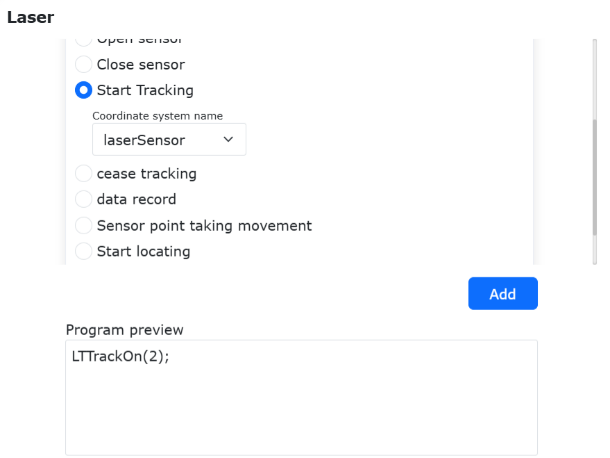

.. centered:: Abbildung 8.8‑29 Laser-Tracking starten und stoppen

Das Benutzerprogramm "testTrack.lua" sieht nun so aus:

.. figure:: robot_peripherals/166.png
   :align: center
   :width: 6in

.. centered:: Abbildung 8.8‑30 Laser-Tracking-Programm

Befehle für Such-Startpunkt und Tracking-Endpunkt schreiben
*************************************************************

Vor Beginn der Laser-Positionssuche muss ein Startpunkt für die Suche festgelegt werden. Der Roboter bewegt sich zuerst zu diesem Startpunkt und sucht dann entlang einer bestimmten Richtung und Geschwindigkeit. Teachen Sie den Such-Startpunkt "seamStartPt" in der Nähe des Schweißnaht-Startpunkts A, wo der Laserstrahl hinfällt. Achten Sie darauf, dass der Such-Startpunkt und die Suchrichtung so gewählt werden, dass der Roboter die Schweißnaht innerhalb der eingestellten Strecke und maximalen Suchzeit finden kann.

.. figure:: robot_peripherals/167.png
   :align: center
   :width: 4in

.. centered:: Abbildung 8.8‑31 Such-Startpunkt

Teachen Sie am Ende der Schweißnaht den Tracking-Endpunkt "trackEndPt".

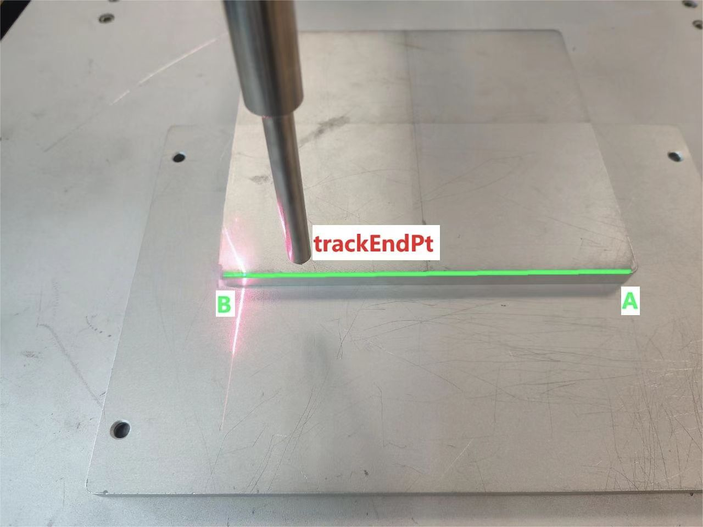

.. centered:: Abbildung 8.8‑32 Such-Endpunkt (Tracking-Endpunkt)

Fügen Sie diese beiden Punkte zum Benutzerprogramm "testTrack.lua" hinzu. Das endgültige Benutzerprogramm sieht wie folgt aus:

.. figure:: robot_peripherals/169.png
   :align: center
   :width: 6in

.. centered:: Abbildung 8.8‑33 Such- und Tracking-Programm

Schweißbezogene Befehle schreiben
*************************************************

Fügen Sie schließlich zwischen dem Schweiß-Suchpunkt "seampos" und dem Tracking-Endpunkt "trackEndPt" die Schweißbefehle ein. Das endgültige Programm sieht wie folgt aus:

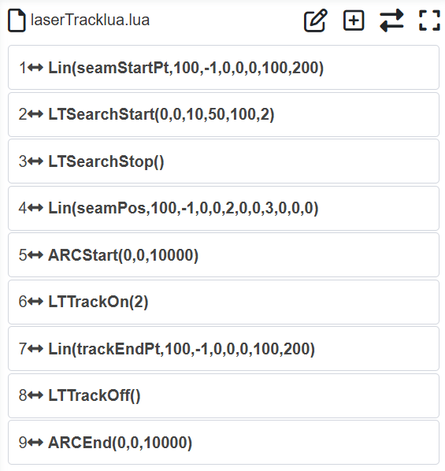

.. centered:: Abbildung 8.8‑34 Such-, Tracking- und Schweißprogramm

Wenn Sie das obige Programm ausführen, bewegt sich der Roboter mit dem Lasersensor vom Such-Startpunkt aus, sucht die Naht. Sobald die Naht gefunden wurde, bewegt sich der Roboter sofort zum Naht-Startpunkt und zündet den Lichtbogen. Nach erfolgreicher Zündung bewegt sich der Roboter zum Naht-Endpunkt und verfolgt dabei die Nahtbahn. Am Naht-Endpunkt angekommen, beendet der Roboter das Schweißen.

Laser-Bahnaufzeichnung + Bahnreproduktion
++++++++++++++++++++++++++++++++++++++++++++++++

Der Arbeitsablauf für Laser-Bahnaufzeichnung + Bahnreproduktion ist:

(1) Der Roboter bewegt sich mit dem Lasersensor entlang einer Schweißnaht. Der Lasersensor zeichnet während der Bewegung die Bahndaten der Schweißnahtposition in Echtzeit auf.

(2) Nach Abschluss der Bahnaufzeichnung bewegt sich der Roboter zum Startpunkt der aufgezeichneten Bahn.

(3) Der Roboter reproduziert die Bewegung entlang der vom Lasersensor aufgezeichneten Bahn.

Befehle für die Roboter-Bahnaufzeichnung schreiben
********************************************************

Erstellen Sie ein neues Benutzerprogramm "testRecord.lua". Klicken Sie auf "Laseraufzeichnung", um die Seite zum Hinzufügen von Laseraufzeichnungs-Befehlen zu öffnen. Suchen Sie den Bereich "Schweißnaht-Datenaufzeichnung". Wählen Sie "Aufzeichnung starten" und klicken Sie auf die Schaltfläche "Hinzufügen". Wählen Sie "Aufzeichnung stoppen" und klicken Sie erneut auf "Hinzufügen". Klicken Sie abschließend auf die Schaltfläche "Anwenden".

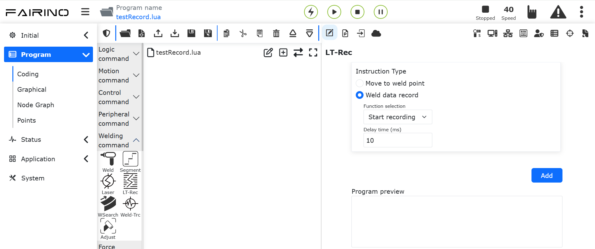

.. centered:: Abbildung 8.8‑35 Laseraufzeichnung

.. figure:: robot_peripherals/172.png
   :align: center
   :width: 6in

.. centered:: Abbildung 8.8‑36 Aufzeichnung starten und stoppen

Auf der Seite erscheinen nun die Befehle zum Starten und Stoppen der Bahnaufzeichnung.

.. figure:: robot_peripherals/173.png
   :align: center
   :width: 6in

.. centered:: Abbildung 8.8‑37 Bahnaufzeichnungsprogramm

Angenommen, die grüne Linie AB in der Abbildung ist die Schweißnaht. Lassen Sie den Laserstrahl auf den Schweißnaht-Startpunkt A und den Schweißnaht-Endpunkt B zeigen. Teachen Sie den Startpunkt der Bahnaufzeichnung "recordStartPt" und den Endpunkt "recordEndPt".

.. figure:: robot_peripherals/174.png
   :align: center
   :width: 4in

.. figure:: robot_peripherals/175.png
   :align: center
   :width: 4in

.. centered:: Abbildung 8.8‑38 Start- und Endpunkt der Bahnaufzeichnung

Fügen Sie in "testRecord.lua" zwei lineare (LIN) Bewegungsbefehle hinzu: einen zum Startpunkt der Bahnaufzeichnung "recordStartPt" und einen zum Endpunkt "recordEndPt". Ordnen Sie die Befehle so an, dass der Roboter folgende Aktionen ausführt: zuerst Bewegung zu "recordStartPt", dann Start der Bahnaufzeichnung, Bewegung zu "recordEndPt", dann Stopp der Bahnaufzeichnung.

.. figure:: robot_peripherals/176.png
   :align: center
   :width: 6in

.. centered:: Abbildung 8.8‑39 Bahnaufzeichnungsprogramm

Befehl zum Bewegen des Roboters zum Startpunkt der Bahnaufzeichnung schreiben
*********************************************************************************

Klicken Sie auf "Laseraufzeichnung", um die Seite zum Hinzufügen von Laseraufzeichnungs-Befehlen zu öffnen. Suchen Sie den Bereich "Bewegung zum Schweißnahtpunkt". Wählen Sie die Bewegungsart PTP, geben Sie eine bestimmte Bewegungsgeschwindigkeit ein, klicken Sie auf "Bewegung zum Startpunkt" und dann auf die Schaltfläche "Anwenden".

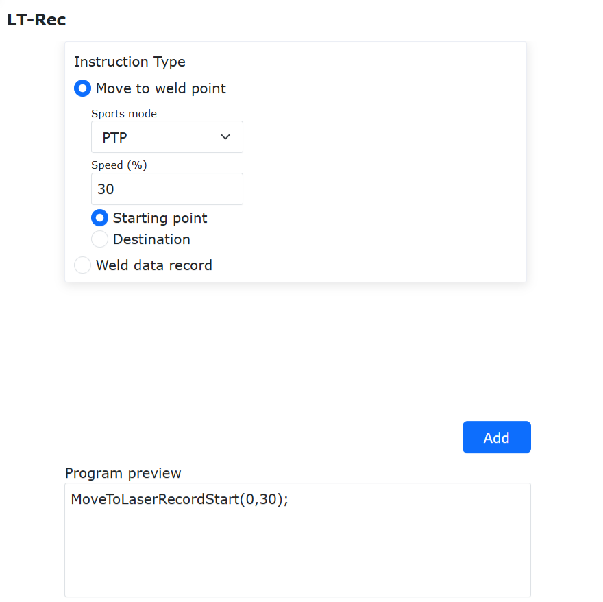

.. centered:: Abbildung 8.8‑40 Bewegung zum Bahnstartpunkt

Das Benutzerprogramm "testRecord.lua" sieht nun so aus:

.. figure:: robot_peripherals/178.png
   :align: center
   :width: 6in

.. centered:: Abbildung 8.8‑41 Programm zur Bewegung zum Bahnstartpunkt

Befehl für die Lasersensor-Bahnreproduktion schreiben
************************************************************

Klicken Sie auf "Laseraufzeichnung", um die Seite zum Hinzufügen von Laseraufzeichnungs-Befehlen zu öffnen. Suchen Sie den Bereich "Schweißnaht-Datenaufzeichnung". Wählen Sie "Bahnreproduktion" und klicken Sie auf die Schaltfläche "Hinzufügen". Klicken Sie auf die Schaltfläche "Lasertracking reproduzieren". Klicken Sie abschließend auf die Schaltfläche "Anwenden".

.. figure:: robot_peripherals/179.png
   :align: center
   :width: 6in

.. centered:: Abbildung 8.8‑42 Bahnreproduktion

Das Programm nach dem Hinzufügen sieht wie folgt aus:

.. figure:: robot_peripherals/180.png
   :align: center
   :width: 6in

.. centered:: Abbildung 8.8‑43 Bahnreproduktionsprogramm

Schweißbezogene Befehle schreiben
****************************************************

Fügen Sie schließlich vor dem Start der Bahnreproduktion und nach deren Ende die Schweißstart- und Schweißendbefehle ein:

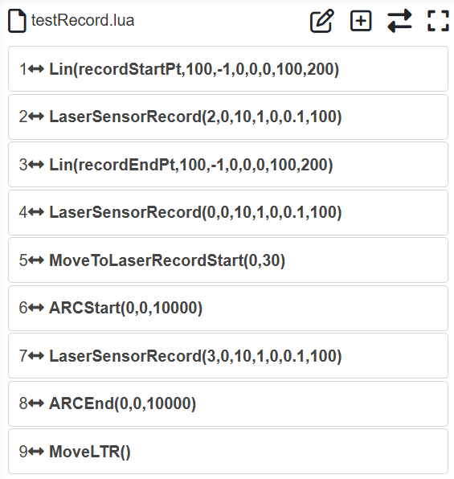

.. centered:: Abbildung 8.8‑44 Bahnaufzeichnungs-, reproduktions- und Schweißprogramm

Wenn Sie das obige Programm ausführen, bewegt sich der Roboter zuerst mit dem Lasersensor entlang der Schweißnaht und zeichnet die gesamte Bahn auf. Dann bewegt sich der Roboter zum Startpunkt der aufgezeichneten Bahn, zündet den Lichtbogen und beginnt mit dem Schweißen entlang der vom Lasersensor aufgezeichneten Bahn. Nach Abschluss der Bahnreproduktion erlischt der Lichtbogen und der Schweißvorgang ist abgeschlossen.

Anpassung des Lasersensors an das offene Peripherieprotokoll der Steuerung
~~~~~~~~~~~~~~~~~~~~~~~~~~~~~~~~~~~~~~~~~~~~~~~~~~~~~~~~~~~~~~~~~~~~~~~~~~~~~~~~~~~~

**Schritt 1**: Wenn eine "Verbindung über offenes Protokoll" und "Steuerung des Lasersensors" erforderlich ist, wählen Sie in der Sensortracking-Konfiguration unter "Protokolltyp" die Option "Offenes Peripherieprotokoll". Wenn das ursprüngliche Schema verwendet werden soll, wählen Sie "Bereits angepasste Geräte". Konfigurieren und laden Sie die Laserperipherie in der Tracking-Sensor-Oberfläche.

.. figure:: robot_peripherals/182.png
   :align: center
   :width: 4in

.. centered:: Abbildung 8.8‑45 Konfigurationsoberfläche für "Verbindung über offenes Protokoll" und "Steuerung des Lasersensors"

**Schritt 2**: Klicken Sie auf "Offenes Peripherieprotokoll", um zur Oberfläche zu gelangen. Laden Sie in den "Einstellungen für offenes Protokoll" das offene Peripherieprotokoll für den entsprechenden Lasersensor hoch. Wählen Sie nach erfolgreichem Upload die Protokollnummer und den hochgeladenen Dateinamen aus, klicken Sie auf "Konfigurieren". Starten Sie dann unter "Gerätebetrieb und -status" den hochgeladenen Lasersensor. Dadurch wird eine Verbindung mit dem entsprechenden Lasersensor hergestellt.

.. figure:: robot_peripherals/183.png
   :align: center
   :width: 4in

.. centered:: Abbildung 8.8‑46 Verbindung zum Lasersensor herstellen

Schleifen
-----------------------------------------------

In der Oberfläche "Initiale Einstellungen" -> "Peripherie" -> "Schleifen" können Schleifgeräte derzeit über "Bereits angepasste Geräte" und "Offenes Peripherieprotokoll" verwendet werden.

.. figure:: robot_peripherals/184.png
   :align: center
   :width: 4in

.. centered:: Abbildung 8.9-1 Konfigurationsseite für Schleifstatus

Bereits angepasste Geräte
~~~~~~~~~~~~~~~~~~~~~~~~~~~~~~~~~~~~~~~~~~~~~~~~~

**Kommunikationskonfiguration und -ladung**: Konfigurieren Sie die Kommunikationsinformationen. Dazu müssen IP-Adresse, Port, Abtastperiode und Kommunikationsprotokoll eingestellt werden. Stellen Sie die Kommunikation mit dem Schleifgerät über die Schaltflächen "Laden/Entladen" her.

.. figure:: robot_peripherals/185.png
   :align: center
   :width: 4in

.. centered:: Abbildung 8.9-2 Kommunikationskonfiguration und -ladung

**Gerätefunktionen**: Hier können Aktionen wie Geräteaktivierung, Fehler löschen und Kraftsensor nullen durchgeführt werden.

.. figure:: robot_peripherals/186.png
   :align: center
   :width: 4in

.. centered:: Abbildung 8.9-3 Gerätefunktionen

**Parametereinstellung**: Hier können Drehzahl, Kontaktkraft, Ausfahrstrecke und Steuerungsmodus des Schleifgeräts eingestellt werden. Nach erfolgreicher Einstellung werden die entsprechenden Daten und der Status in der rechten Statusleiste "Polish" angezeigt.

.. figure:: robot_peripherals/187.png
   :align: center
   :width: 4in

.. centered:: Abbildung 8.9-4 Parametereinstellung

.. figure:: robot_peripherals/188.png
   :align: center
   :width: 4in

.. centered:: Abbildung 8.9-5 Parametereinstellung

Offenes Peripherieprotokoll
~~~~~~~~~~~~~~~~~~~~~~~~~~~~~~~~~~~~~~~~~~~~~~~~~

Klicken Sie auf "Offenes Peripherieprotokoll", um zur Oberfläche zu gelangen. Laden Sie in den "Einstellungen für offenes Protokoll" das offene Peripherieprotokoll für das entsprechende Schleifgerät hoch. Wählen Sie nach erfolgreichem Upload die Protokollnummer und den hochgeladenen Dateinamen aus, klicken Sie auf "Konfigurieren". Starten Sie dann unter "Gerätebetrieb und -status" das hochgeladene offene Peripherieprotokoll für das Schleifgerät. Dadurch wird eine Verbindung mit dem entsprechenden Schleifgerät hergestellt.

.. figure:: robot_peripherals/189.png
   :align: center
   :width: 4in

.. centered:: Abbildung 8.9‑6 Verbindung zum Lasersensor herstellen (Anmerkung: Bildtext scheint falsch, sollte "Schleifgerät" heißen, aber Bild zeigt wahrscheinlich korrekte Stelle)

Hilfssensor
-------------------

In der Oberfläche "Initiale Einstellungen" -> "Peripherie" -> "Hilfssensor" können Hilfssensoren derzeit über "Bereits angepasste Geräte" verwendet werden. Die Funktion "Benutzerdefiniertes Protokoll" ist derzeit nicht verfügbar.

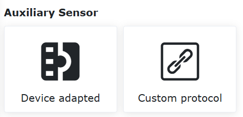

.. centered:: Abbildung 8.10‑1 Hilfssensor -- Bereits angepasste Geräte

Bereits angepasste Geräte
~~~~~~~~~~~~~~~~~~~~~~~~~~~~~~~~~~~~~~~~~~~~~~~~~~~~~~~~~

Klicken Sie auf "Bereits angepasste Geräte", um zur Konfigurationsoberfläche für Hilfssensoren zu gelangen.

Die Konfigurationsinformationen für den Hilfssensor umfassen Hersteller, Typ, Softwareversion und Montageposition. Der Benutzer kann die entsprechenden Hilfssensorinformationen je nach spezifischem Produktionsbedarf konfigurieren.

Wenn der Benutzer die Konfiguration ändern muss, kann er zuerst die entsprechende Hilfssensornummer auswählen, auf die Schaltfläche "Löschen" klicken, um die entsprechenden Informationen zu löschen, und dann je nach Bedarf neu konfigurieren.

.. figure:: robot_peripherals/191.png
   :align: center
   :width: 4in

.. centered:: Abbildung 8.10‑2 Hilfssensor -- Bereits angepasste Geräte

Kombinationsgerät (SmartTool + Kraftsensor-Kombination)
------------------------------------------------------------

In der Oberfläche "Initiale Einstellungen" -> "Peripherie" -> "Kombinationsgerät" können Kombinationsgeräte derzeit über "Bereits angepasste Geräte" verwendet werden. "Benutzerdefiniertes Protokoll" ist derzeit nicht verfügbar.

.. figure:: robot_peripherals/192.png
   :align: center
   :width: 4in

.. centered:: Abbildung 8.11-1 Kombinationsgerät

Bereits angepasste Geräte
~~~~~~~~~~~~~~~~~~~~~~~~~~~~~~~~~~~~~~~~~~~~~~~~~~~~~~~~~

Klicken Sie auf "Bereits angepasste Geräte", um zur Konfigurationsoberfläche zu gelangen.

Die Konfigurationsinformationen umfassen Hersteller, Typ, Softwareversion und Montageposition. Verschiedene Hersteller entsprechen verschiedenen Typen. Der aktuelle Hersteller ist FR.

Der Benutzer kann die entsprechenden Geräteinformationen je nach spezifischem Produktionsbedarf konfigurieren. Nach erfolgreicher Konfiguration wird eine Tabelle mit den Geräteinformationen angezeigt. Wenn der Benutzer die Konfiguration ändern muss, kann er zuerst die entsprechende Nummer auswählen, auf die Schaltfläche "Löschen" klicken, um die entsprechenden Informationen zu löschen, und dann je nach Bedarf neu konfigurieren.

.. important::
  Bevor Sie auf "Konfiguration löschen" klicken, sollte sich das entsprechende Gerät im deaktivierten Zustand befinden.

.. image:: robot_peripherals/193.png
   :width: 4in
   :align: center

.. centered:: Abbildung 8.11‑2 Bereits angepasste Geräte

FR
++++++++++++++++++++++++++++++++++

Der FR entsprechende Typ ist "SmartTool" in Kombination mit einem Kraftsensor. Der kollaborative Roboter kann mit drei Kraftsensoren von Xinjingcheng, NSR und Gangzhichuangxin verwendet werden. Bei Verwendung verschiedener Sensoren muss nur das entsprechende Kommunikationsprotokoll geladen werden, wie folgt:

- SmartTool + XJC-6F-D82 (Xinjingcheng).
- SmartTool + NSR-FT Sensor A (NSR).
- SmartTool + GZCX-6F-75A (Gangzhichuangxin).

1.  Hardware-Montage

1)  Zerlegen Sie den SmartTool-Griff, entnehmen Sie die mittlere Aufnahmevorrichtung und montieren Sie diese am Roboterflansch. Nach der Montage der Aufnahmevorrichtung setzen Sie den SmartTool-Griff wieder zusammen. Nach erfolgreichem Zusammenbau verbinden Sie das Verbindungskabel mit dem Roboterflansch.

.. image:: robot_peripherals/194.png
   :width: 3in
   :align: center

.. centered:: Abbildung 8.11‑3 Montage der mittleren Aufnahmevorrichtung des SmartTool-Griffs

.. image:: robot_peripherals/195.png
   :width: 3in
   :align: center

.. centered:: Abbildung 8.11‑4 SmartTool-Griff erfolgreich montiert

2)  Nach der Montage des SmartTool-Griffs montieren Sie den Kraftsensor (am Beispiel Gangzhichuangxin) am Ende des SmartTool-Griffs und verbinden das Verbindungskabel mit dem SmartTool-Griff.

.. image:: robot_peripherals/196.png
   :width: 3in
   :align: center

.. centered:: Abbildung 8.11‑5 Gangzhichuangxin-Kraftsensor am Ende des SmartTool-Griffs montiert

2.  Gerätekonfiguration

.. important:: Stellen Sie sicher, dass Ihr SmartTool-Griff fest am Roboterflansch montiert und korrekt mit dem Roboterflansch verbunden ist und dass der Kraftsensor fest am Ende des SmartTool-Griffs montiert und korrekt mit dem SmartTool-Griff verbunden ist.

1)  Konfigurieren Sie den SmartTool-Griff (siehe Konfiguration der Schweißgrifftastenfunktionen).

2)  Nach Abschluss der Tastenfunktionskonfiguration des SmartTool-Griffs wählen Sie den Hersteller "FR". Wählen Sie die Informationen für "Typ", "Softwareversion" und "Montageposition" aus und klicken Sie auf die Schaltfläche "Konfigurieren".

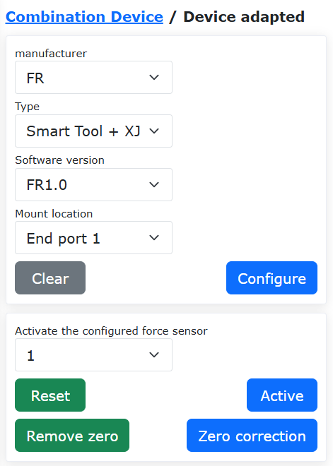

.. centered:: Abbildung 8.11‑6 Konfigurationsoberfläche für FR-Geräteinformationen

3)  Nach erfolgreicher Konfiguration der Geräteinformationen wählen Sie den konfigurierten Kraftsensor aus und klicken Sie auf die Schaltfläche "Aktivieren", um den Kraftsensor zu aktivieren. Nach erfolgreicher Aktivierung klicken Sie auf die Schaltfläche "Nullpunktkorrektur", um den Kraftsensor auf Null zu setzen, und überprüfen Sie die Daten in der Tabelle.

.. image:: robot_peripherals/198.png
   :width: 4in
   :align: center

.. centered:: Abbildung 8.11‑7 Kraftsensor-Nullpunktkorrektur

4)  Konfigurieren Sie basierend auf der aktuellen Flanschmontage die Nutzlastdaten auf der "Nutzlast"-Oberfläche und konfigurieren Sie die Werkzeugkoordinatendaten, den Werkzeugtyp und die Montageposition auf der "Werkzeugkoordinaten"-Oberfläche.

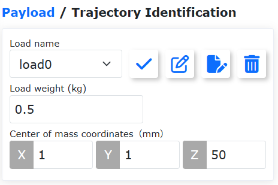

.. centered:: Abbildung 8.11‑8 "Endnutzlast"-Konfiguration

.. image:: robot_peripherals/200.png
   :width: 4in
   :align: center

.. centered:: Abbildung 8.11‑9 "Werkzeugkoordinaten"-Konfiguration

3.  Anwendung

Nach erfolgreicher Konfiguration der Geräteinformationen können die SmartTool-Tastenfunktionen und die Kraftsensorfunktionen unabhängig voneinander genutzt werden, z. B. zur Messung der Kraftgröße und -richtung sowie zum unterstützten Ziehen mit Sperre basierend auf dem Kraftsensor.

.. image:: robot_peripherals/201.png
   :width: 6in
   :align: center

.. centered:: Abbildung 8.11‑10 Messung der Kraftgröße und -richtung

Lua-Flanschprotokoll für Kombinationsgeräte
~~~~~~~~~~~~~~~~~~~~~~~~~~~~~~~~~~~~~~~~~~~~~~~~~~~~~~~~~~~~~~~~~~~~~~~~~~~~~~~~~~~~~

Derzeit können auf der Flanschseite kombinierte Protokolle für zwei Geräte angewendet werden. Das zweite Gerät kann über ein Y-förmiges Kommunikationskabel oder die FAIRINO-SmartTool485-Schnittstelle angeschlossen werden. Derzeit voreingestellte eingebettete Kombinationsgeräteprotokolle umfassen: JUNEDO-Greifer + XJC-Kraftsensor, JUNEDO-Greifer + GZC-Kraftsensor, SmartTool + JUNEDO-Greifer, SmartTool + XJC-Kraftsensor, SmartTool + GZC-Kraftsensor. Das eingebettete Protokoll für Greifer + Kraftsensor ist unter "Initiale Einstellungen", "Peripherie", "Kraftsensor" wählbar. Das eingebettete Protokoll für SmartTool + Greifer oder Kraftsensor ist unter "Initiale Einstellungen", "Peripherie", "Schweißgriff" wählbar.

Die Vorgehensweise ist wie folgt:

Öffnen Sie die WebApp, klicken Sie nacheinander auf "Initiale Einstellungen", "Peripherie". Wählen Sie einen Gerätetyp aus, der kombiniert werden soll (z. B. Schweißgriff). Wählen Sie "Benutzerdefiniertes Protokoll". Klicken Sie auf "Protokollverwaltung", um die Konfiguration des Flanschprotokolls durchzuführen.

Derzeit voreingestellte eingebettete Kombinationsgeräteprotokolle umfassen: JUNEDO-Greifer + XJC-Kraftsensor, SmartTool + JUNEDO-Greifer, SmartTool + XJC-Kraftsensor. Diese voreingestellten Kombinationsprotokolle gehören zu den benutzerdefinierten Protokollen, beginnen mit "Custom_End" und können heruntergeladen und gelöscht werden, wie in der folgenden Abbildung gezeigt.

.. image:: robot_peripherals/282.png
   :width: 6in
   :align: center

.. centered:: Abbildung 8.11‑11 Voreingestellte eingebettete Protokolle für Schweißgriffe

Array-Saugnapf
-----------------

Überblick
~~~~~~~~~~~~~~~~~~~~~~~~~~~~~~~~~~~~~~
Die Montage eines Array-Saugnapfs am Roboterflansch ermöglicht eine schnelle Einrichtung von Werkstückaufnahmestationen für verschiedene Szenarien. Die Anzahl und Anordnung der Saugnäpfe kann je nach Größe und Form des Werkstücks angepasst werden, was die Effizienz und Stabilität verbessert.

Der kollaborative Roboter unterstützt Saugnapf-Arrays mit bis zu 20 Saugnäpfen. Es kann das Greifen und Loslassen eines einzelnen Saugnapfes separat gesteuert oder die synchrone Aktion aller Saugnäpfe des gesamten aktuell angeschlossenen Arrays gesteuert werden. Die Slave-Adresse jedes Saugnapfes kann von 1 bis 20 konfiguriert werden. Die Konfiguration erfolgt über die DynamicLAB-Software.

Hardware-Beschreibung
+++++++++++++++++++++++++++++++++++++++++++++++++++

Der kollaborative Roboter kommuniziert und steuert das Saugnapf-Array über ein Ethernet-zu-485-Modul. Auf der WebApp wird das Kommunikationsprotokoll für das Array-Saugnapf generiert. Das Protokoll sendet die Steuerdaten per TCP/IP an das Ethernet-zu-485-Modul. Das Modul sendet die empfangenen Steuerdaten dann über 485 an die einzelnen Saugnäpfe und realisiert so die Steuerung des Array-Saugnapfs (Das obige Steuerdatenformat ist das ModbusRTU-Protokollformat).

Das Ethernet-zu-485-Modul fungiert dabei als Server für die Ethernet-Kommunikation und als Master für die 485-Kommunikation. Jeder Saugnapf im Array ist ein 485-Kommunikations-Slave, und jeder Saugnapf sollte eine unterschiedliche Slave-Adresse haben.

.. figure:: robot_peripherals/202.png
   :align: center
   :width: 6in

.. centered:: Abbildung 8.12-1 Anwendung eines Roboter-Saugnapf-Arrays mit Greifer

Das Ethernet-zu-485-Modul hat normalerweise zwei TCPServer-Ports, die mehreren 485-Slave-Ports entsprechen. Am Beispiel des CH9121: TCPServer-Port 1 entspricht den 485-Slave-Ports 1-10, TCPServer-Port 2 entspricht den 485-Slave-Ports 11-20. Der Roboter baut zwei TCP-Verbindungen mit dem Ethernet-zu-485-Modul auf und steuert so letztendlich die 20 Saugnäpfe.

Das oben genannte Ethernet-zu-485-Modul muss wie folgt konfiguriert werden:

- ① Die Ethernet-Seite wird als TCPServer konfiguriert, IP-Adresse: 192.168.58.10, Portnummer für Port 1 ist 50001, Portnummer für Port 2 ist 50002.
- ② Die 485-Seite wird mit einer Baudrate von 115200, 8 Datenbits, 1 Stoppbit, ohne Parität konfiguriert. Für das Ethernet-zu-485-Modul gibt es normalerweise eine Konfigurationssoftware, mit der die oben genannten Einstellungen vorgenommen werden können. Das folgende Bild zeigt die Konfigurationsoberfläche für das Ethernet-zu-485-Modul CH9121:

.. figure:: robot_peripherals/203.png
   :align: center
   :width: 6in

.. centered:: Abbildung 8.12-2 Konfigurationstool für Ethernet-zu-485-Modul

Funktionskonfiguration
~~~~~~~~~~~~~~~~~~~~~~~~~~~~~~~~~~~~~~~~~~~~~~~~

Öffnen Sie die WebApp und klicken Sie nacheinander auf "Initiale Einstellungen" -> "Peripherie" -> "Array-Saugnapf". Es gibt zwei Steuerungsmodi für Array-Saugnäpfe: Unicast-Modus und Broadcast-Modus:

**Unicast-Modus**: Das Kommunikationsprotokoll enthält Kommunikationssteuerungsinhalte für jeden einzelnen Saugnapf und ermöglicht so die unabhängige Steuerung jedes Saugnapfs im Array.

**Broadcast-Modus**: Ein Kommunikationsprotokoll wird für alle Saugnäpfe im Array generiert. Es kann das Greifen und Loslassen aller Saugnäpfe im Array synchron steuern, aber nicht einen einzelnen Saugnapf separat steuern.

Je nach tatsächlichem Szenario kann nur der Unicast-Modus konfiguriert werden, oder es können beide Modi gleichzeitig konfiguriert werden (wodurch sowohl die Einzelsteuerung als auch die Synchronsteuerung möglich ist).

.. figure:: robot_peripherals/204.png
   :align: center
   :width: 4in

.. centered:: Abbildung 8.12-3 Steuerungsmodi für Array-Saugnapf

Unicast-Modus Konfiguration
++++++++++++++++++++++++++++++++++++++++++

Öffnen Sie die WebApp und klicken Sie nacheinander auf "Initiale Einstellungen" -> "Peripherie" -> "Array-Saugnapf" -> "Unicast-Modus". Es gibt zwei Möglichkeiten, das Protokoll im Unicast-Modus zu konfigurieren: "Automatische Konfiguration" und "Manuelle Konfiguration":

.. figure:: robot_peripherals/205.png
   :align: center
   :width: 4in

.. centered:: Abbildung 8.12-4 Unicast-Konfigurationsmodus

**Automatische Konfiguration**: Eine vorhandene Protokolldatei wird direkt in die Robotersteuerung hochgeladen. Eine vorhandene Protokolldatei kann aus folgenden Quellen stammen: ① von einem anderen Roboter mit bereits konfiguriertem und getestetem Array-Saugnapf heruntergeladen; ② von Technikern basierend auf dem tatsächlichen Szenario erstellt (durch Schreiben einer eigenen Protokolldatei kann eine flexiblere und effizientere Saugnapfsteuerung erreicht werden). Wenn mehrere Geräte das gleiche Array-Saugnapf verwenden, kann die Bereitstellungsgeschwindigkeit durch direktes Hochladen des Protokolls über die automatische Konfiguration erhöht werden.

**Manuelle Konfiguration**: Das Kommunikationsprotokoll für jeden Saugnapf wird basierend auf der Slave-ID und den Vakuumwerten der Saugnäpfe im Array konfiguriert. Die Schritte für die manuelle Konfiguration sind wie folgt:

Wählen Sie die Slave-Adresse 1. Geben Sie den maximalen Vakuumwert, den minimalen Vakuumwert und die Greif-Timeout-Zeit ein (Timeout-Zeit derzeit nicht verfügbar). Klicken Sie auf die Schaltfläche "Konfigurieren". Daraufhin erscheint im Bereich "Gerätebetrieb und -status" das Saugnapfprotokoll mit der Protokollnummer 1. Gleichzeitig werden auf den Registerkarten "Manuelle Konfiguration" und "Slave-Adresse" alle derzeit konfigurierten Slave-Adressen angezeigt.

.. figure:: robot_peripherals/206.png
   :align: center
   :width: 4in

.. centered:: Abbildung 8.12-5 Konfiguration eines Unicast-Saugnapfs

Wiederholen Sie die obigen Schritte, um bei Bedarf Saugnäpfe mit mehreren Slave-Adressen zu konfigurieren. Jedes Mal, wenn ein Saugnapf konfiguriert wird, aktualisiert das Robotersystem automatisch den Inhalt des Saugnapf-Kommunikationsprotokolls für "Protokollnummer: 1". Es können maximal 20 Saugnäpfe konfiguriert werden. Nachdem alle Saugnäpfe konfiguriert wurden, klicken Sie im Feld "Protokollnummer 1" auf die Schaltfläche "Verbinden". Die Kommunikation zwischen Roboter und Saugnapf beginnt, und die Betriebsstatus-LED leuchtet auf (Hinweis: Konfigurieren Sie zuerst alle Slave-Adressen und klicken Sie dann auf die Schaltfläche "Verbinden". Eine Konfiguration von Saugnapf-Slaves nach dem Aufbau der Kommunikation ist ungültig).

Nach erfolgreichem Aufbau der Kommunikation zwischen Roboter und Saugnapf erscheint im Bereich "Gerätebetrieb und -status" eine Liste mit den Bedienfeldern für alle konfigurierten Saugnapf-Slaves. Im Bedienfeld für die jedem Slave entsprechende Saugnapf können Sie den Saugnapf steuern und seinen Status überwachen (einschließlich "Saugstatus", "Aktuelles Vakuum", "Saugnapfdruck" usw.). In der folgenden Abbildung sind die konfigurierten Saugnapf-Slave-IDs 2 und 11.

.. figure:: robot_peripherals/207.png
   :align: center
   :width: 4in

.. centered:: Abbildung 8.12-6 Unicast-Saugnapf-Verbindung

Klicken Sie in der oberen rechten Ecke des Bedienfelds für den Saugnapf mit Slave 1 auf die Schaltfläche "Saugen". Der Saugnapf führt die Aktion "Saugen mit eingestelltem Vakuum" aus. Daraufhin ändert sich die Schaltfläche "Saugen" in "Loslassen". Ein erneuter Klick auf diese Schaltfläche löst die Loslass-Aktion aus. Während der Ausführung dieser Aktionen werden die entsprechenden Statuspunkte wie "Saugstatus", "Aktuelles Vakuum" usw. in Echtzeit den Status des Saugnapfes anzeigen.

.. note:: Hinweis: Nach der Konfiguration des Saugnapfprotokolls und dem Verbindungsaufbau muss einmal auf die Schaltfläche "Saugen" geklickt werden, um den Saugnapf zu aktivieren. Gleichzeitig kann so die Kommunikation zwischen Roboter und Saugnapf getestet werden.

Wenn die Verbindung zwischen Roboter und Saugnapf fehlschlägt, wird kein Saugnapf-Bedienfeld angezeigt und die Betriebsstatus-LED in "Protokollnummer: 1" erlischt.

.. note:: Hinweis: Wenn während des Betriebs die physische Verbindung zwischen Saugnapf und Ethernet-zu-485-Modul getrennt und wieder verbunden wird, kann es vorkommen, dass keine Protokollverbindung hergestellt werden kann. In diesem Fall kann das Netzwerkkabel des Ethernet-zu-485-Moduls gezogen und wieder eingesteckt werden, um einen erneuten Verbindungsversuch zu starten.

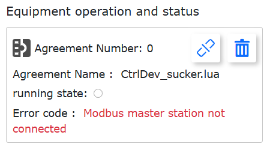

.. centered:: Abbildung 8.12-7 Verbindung zwischen Roboter und Saugnapf fehlgeschlagen

Protokoll-Download im Unicast-Modus
++++++++++++++++++++++++++++++++++++++++++++++++++++++++++++++++++++

Klicken Sie in der "Manuellen Konfiguration" auf die Schaltfläche "Herunterladen", um das Saugnapfprotokoll auf den lokalen Computer herunterzuladen. Das Saugnapfprotokoll ist ein zyklisch ausgeführtes LUA-Programm, das in jedem Zyklus die folgenden Schritte ausführt:

- ① Lesen der Saugnapf-Steuerdaten aus dem Roboter.
- ② Schreiben der Steuerdaten über einen Socket an den Saugnapf.
- ③ Lesen der Statusdaten über einen Socket vom Saugnapf.
- ④ Rückmeldung der Saugnapf-Statusdaten an den Roboter.

Durch die zyklische Ausführung des Saugnapf-Kommunikationsprotokolls wird die Kommunikationssteuerung zwischen Roboter und Saugnapf realisiert. Im Kommunikationsprotokoll können der Zyklus, die Adressen der Steuerdatenregister und die Adressen der Statusdatenregister benutzerdefiniert angepasst werden. Der Inhalt des Protokolls kann je nach tatsächlicher Situation geändert werden. Im Folgenden finden Sie ein Beispiel für einen Saugnapf-Kommunikationsprotokollcode:

Beispiel für ein Saugnapf-Protokollprogramm:

.. code-block:: lua
    :linenos:

    local id = 1
    local ctrlValues = {0, 0, 0, 0, 0, 0, 0, 0, 0, 0, 0, 0, 0, 0, 0, 0, 0, 0, 0, 0}
    local realTimeState = {0, 0, 0, 0, 0, 0, 0, 0, 0, 0}
    local suckerConfig = {0, 0, 0, 0, 0, 0, 0, 0, 0, 0}
    clearSuckerState()
    socket1 = TCPClientConnect('192.168.58.10', 50001, 500, 10, 2, 3)
    socket2 = TCPClientConnect('192.168.58.10', 50002, 500, 10, 2, 3)
    suckerConfig[1] = 30
    suckerConfig[2] = 20
    suckerConfig[3] = 100
    ModbusRTUOverTCPWriteMultiReg(socket1, 0, 0x0501, 3, suckerConfig)
    ModbusRTUOverTCPWriteMultiReg(socket2, 0, 0x0501, 3, suckerConfig)
    sleep_ms(10)
    while(1) do
      setAllCtrl,ctrlValues[1],ctrlValues[2],ctrlValues[3],ctrlValues[4],ctrlValues[5],ctrlValues[6],ctrlValues[7],ctrlValues[8],ctrlValues[9], ctrlValues[10], ctrlValues[11], ctrlValues[12],ctrlValues[13],ctrlValues[14],ctrlValues[15],ctrlValues[16],ctrlValues[17],ctrlValues[18],ctrlValues[19], ctrlValues[20] = getSuckerCtrlState()
      if(setAllCtrl ~= 0) then
        ModbusRTUOverTCPWriteSingleReg(socket1, 0, 0x0500, setAllCtrl)
        ModbusRTUOverTCPWriteSingleReg(socket2, 0, 0x0500, setAllCtrl)
        ctrlValues = {0, 0, 0, 0, 0, 0, 0, 0, 0, 0, 0, 0, 0, 0, 0, 0, 0, 0, 0, 0}
        sleep_ms(1)
      else
        ModbusRTUOverTCPWriteSingleReg(socket1, 2, 0x0500, ctrlValues[2])
        ModbusRTUOverTCPWriteSingleReg(socket2, 11, 0x0500, ctrlValues[11])
      end
      suckerState, pressValue, error, default1, default2 = ModbusRTUOverTCPReadReg(socket1, 2, 0x0600, 3)
      realTimeState[1] = suckerState
      realTimeState[2] = pressValue
      realTimeState[3] = error
      ctrlState, maxPress, minPress, time, default2 = ModbusRTUOverTCPReadReg(socket1, 2, 0x0500, 4)
      realTimeState[4] = ctrlState
      realTimeState[5] = maxPress
      realTimeState[6] = minPress
      realTimeState[7] = time
      setSuckerRealtimeState(2, realTimeState)
      suckerState, pressValue, error, default1, default2 = ModbusRTUOverTCPReadReg(socket2, 11, 0x0600, 3)
      realTimeState[1] = suckerState
      realTimeState[2] = pressValue
      realTimeState[3] = error
      ctrlState, maxPress, minPress, time, default2 = ModbusRTUOverTCPReadReg(socket2, 11, 0x0500, 4)
      realTimeState[4] = ctrlState
      realTimeState[5] = maxPress
      realTimeState[6] = minPress
      realTimeState[7] = time
      setSuckerRealtimeState(11, realTimeState)
      local stopFlag = GetOpenLUAStopFlag(id)
      if(stopFlag ~= 0) then
        TCPClientDisconnect(socket1)
        TCPClientDisconnect(socket2)
        clearSuckerState()
        break
      end
      sleep_ms(100)
    end

Das obige Protokoll ruft die Saugnapf-Steuerdaten über den Befehl `getSuckerCtrlState()` ab, schreibt die Steuerdaten über den Befehl `ModbusRTUOverTCPWriteSingleReg()` über die Kommunikation in den Saugnapf, liest die Statusdaten des Saugnapfs über den Befehl `ModbusRTUOverTCPReadReg()` und meldet die Saugnapf-Statusdaten über `setSuckerRealtimeState()` an den Roboter zurück. Die detaillierte Definition der oben genannten Befehle ist wie folgt:

.. centered:: Tabelle 8.12-1 Rückgabewerte von `getSuckerCtrlState()`

.. list-table::
   :widths: 10 10 20 40
   :header-rows: 0
   :align: center
   :class: sheet-center

   * - **Nr.**
     - **Typ**
     - **Variablenname**
     - **Beschreibung**

   * - 1
     - int
     - setAllCtrl
     - Steuerdaten für Broadcast-Modus: 1 - Saugen mit maximalem Vakuum; 2 - Saugen mit eingestelltem Vakuum (d.h. das Saugnapfvakuum wird zwischen max. und min. Vakuum gehalten); 3 - Saugen stoppen

   * - 2 ~ 21
     - int
     - ctrlValues[i]
     - Saugnapf-Steuerdaten für Slave-Adressen 1 ~ 20: 1 - Saugen mit maximalem Vakuum; 2 - Saugen mit eingestelltem Vakuum; 3 - Saugen stoppen

.. centered:: Tabelle 8.12-2 Detaillierte Parameter von `ModbusRTUOverTCPWriteSingleReg()`

.. list-table::
   :widths: 10 10 20 40
   :header-rows: 0
   :align: center
   :class: sheet-center

   * - **Nr.**
     - **Typ**
     - **Variablenname**
     - **Beschreibung**

   * - 1
     - int
     - socket
     - Socket-Handle

   * - 2
     - int
     - slaveID
     - Slave-Adresse 0-20; 0-Broadcast; 1~20-Slave-Adresse

   * - 3
     - uint16_t
     - regAddr
     - Adresse des zu schreibenden Registers

   * - 4
     - uint16_t
     - data
     - Zu schreibende Daten

.. centered:: Tabelle 8.12-3 Detaillierte Parameter von `ModbusRTUOverTCPWriteMultiReg()`

.. list-table::
   :widths: 10 10 20 40
   :header-rows: 0
   :align: center
   :class: sheet-center

   * - **Nr.**
     - **Typ**
     - **Variablenname**
     - **Beschreibung**

   * - 1
     - int
     - socket
     - Socket-Handle

   * - 2
     - int
     - slaveID
     - Slave-Adresse 0-20; 0-Broadcast; 1~20-Slave-Adresse

   * - 3
     - uint16_t
     - regStartAddr
     - Startadresse für das Schreiben mehrerer Register

   * - 4
     - int
     - num
     - Anzahl der zu schreibenden Register

   * - 5
     - uint16_t[]
     - data
     - Array der zu schreibenden Dateninhalte

.. centered:: Tabelle 8.12-4 Detaillierte Parameter von `ModbusRTUOverTCPReadReg()`

.. list-table::
   :widths: 10 10 20 40
   :header-rows: 0
   :align: center
   :class: sheet-center

   * - **Nr.**
     - **Typ**
     - **Variablenname**
     - **Beschreibung**

   * - 1
     - int
     - socket
     - Socket-Handle

   * - 2
     - int
     - slaveID
     - Slave-Adresse 0-20; 0-Broadcast; 1~20-Slave-Adresse

   * - 3
     - uint16_t
     - regStartAddr
     - Startadresse für das Lesen mehrerer Register

   * - 4
     - int
     - num
     - Anzahl der zu lesenden Register

.. centered:: Tabelle 8.12-5 Rückgabewerte von `ModbusRTUOverTCPReadReg()`

.. list-table::
   :widths: 10 10 20 40
   :header-rows: 0
   :align: center
   :class: sheet-center

   * - **Nr.**
     - **Typ**
     - **Variablenname**
     - **Beschreibung**

   * - 1
     - int
     - suckState
     - Aktueller Saugnapfstatus: 0 - Objekt losgelassen oder Saugnapfstart erfolgreich; 1 - Werkstück erkannt, Objekt angesaugt; 2 - Kein Objekt angesaugt; 3 - Objekt abgelöst

   * - 2
     - float
     - pressValue
     - Aktuelles Vakuum / Druck

   * - 3
     - int
     - err
     - Fehlercode: 0-normal; sonst: Fehler

.. centered:: Tabelle 8.12-6 Detaillierte Parameter von `setSuckerRealtimeState()`

.. list-table::
   :widths: 10 10 20 40
   :header-rows: 0
   :align: center
   :class: sheet-center

   * - **Nr.**
     - **Typ**
     - **Variablenname**
     - **Beschreibung**

   * - 1
     - int
     - slaveID
     - Slave-ID

   * - 2
     - int[]
     - states
     - states[1]: Aktueller Status 0 - Objekt losgelassen oder Saugnapfstart erfolgreich; 1 - Werkstück erkannt, Objekt angesaugt; 2 - Kein Objekt angesaugt; 3 - Objekt abgelöst.
        states[2]: Aktuelles Vakuum / Druck;
        states[3]: Warteregisterwert;
        states[4]: Steuerungsstatus;
        states[5]: Maximales Vakuum;
        states[6]: Minimales Vakuum;
        states[7]: Timeout-Zeit;
        states[8~10]: Reserviert.

Broadcast-Modus
++++++++++++++++++++++++++++++++++++++++++

Im Broadcast-Modus kann der kollaborative Roboter alle angeschlossenen Saugnäpfe gleichzeitig steuern.

.. note:: Hinweis: Der Broadcast-Modus kann erst konfiguriert werden, nachdem der Unicast-Modus konfiguriert wurde.

Öffnen Sie die WebApp und klicken Sie nacheinander auf "Initiale Einstellungen" -> "Peripherie" -> "Array-Saugnapf". Konfigurieren Sie zuerst im Unicast-Modus alle gewünschten Saugnapf-Slaves (nur konfigurieren, **keine** Kommunikationsprotokollverbindung herstellen).

Klicken Sie auf "Broadcast-Modus". Geben Sie in der "Parametereinstellung" das "Maximale Vakuum", das "Minimale Vakuum" und die "Greif-Timeout-Zeit" für die Saugnäpfe ein (Timeout-Zeit derzeit nicht verfügbar). Klicken Sie auf die Schaltfläche "Konfigurieren". Daraufhin erscheint im Bereich "Gerätebetrieb und -status" das Kommunikationsprotokoll für den Broadcast-Modus. Im Broadcast-Modus gelten die eingestellten Vakuumparameter für jeden angeschlossenen Saugnapf.

.. figure:: robot_peripherals/209.png
   :align: center
   :width: 4in

.. centered:: Abbildung 8.12-8 Parametereinstellung für Broadcast-Modus

Klicken Sie im Bedienfeld "Protokollnummer 1" auf die Schaltfläche "Verbinden". Die Betriebsstatus-LED leuchtet auf und zeigt an, dass die Kommunikationsverbindung zwischen Roboter und Array-Saugnapf hergestellt wurde. Nach erfolgreicher Verbindung wird die Liste der Bedienfelder für alle verbundenen Saugnäpfe im Bereich "Gerätebetrieb und -status" angezeigt.

Klicken Sie in der "Parametereinstellung" unter "Ein-Klick-Saugen" auf "Starten". Jeder Saugnapf im Array-Saugnapf führt die Aktion "Saugen mit eingestelltem Vakuum" aus. Klicken Sie auf "Stopp", um die Saugaktion aller Saugnäpfe zu beenden.

.. figure:: robot_peripherals/210.png
   :align: center
   :width: 4in

.. centered:: Abbildung 8.12-9 Kommunikationsaufbau im Broadcast-Modus

Das Herunterladen der Protokolldatei im Broadcast-Modus erfolgt genauso wie im Unicast-Modus. Die von beiden Stellen heruntergeladenen Protokolldateien können über die "Automatische Konfiguration" auf der Unicast-Modus-Seite in den Roboter hochgeladen werden.

Anwendung von LUA-Programmen für Array-Saugnapf
~~~~~~~~~~~~~~~~~~~~~~~~~~~~~~~~~~~~~~~~~~~~~~~~~~~~~~~~~~~~~~~~~~~~~~~~~~~~~~~~

Durch Hinzufügen von Befehlen zur Steuerung des Array-Saugnapfs, zum Abrufen des Status usw. in Roboter-LUA-Programmen können in Verbindung mit Roboter-Bewegungsbefehlen flexible und bequeme Anwendungen zum Greifen und Handhaben von Werkstücken realisiert werden.

Öffnen Sie die WebApp und klicken Sie nacheinander auf "Teach-Programm" -> "Programmierung". Erstellen Sie ein neues LUA-Programm "testSucker.lua".

.. figure:: robot_peripherals/211.png
   :align: center
   :width: 4in

.. centered:: Abbildung 8.12-10 Neues Programm "testSucker.lua" erstellen

Wählen Sie den Befehlstyp "Peripheriebefehle". Klicken Sie in den Peripheriebefehlen auf die Schaltfläche "Saugnapf". Daraufhin erscheint auf der rechten Seite der WebApp die Seite zum Hinzufügen von "Sucker"-Array-Saugnapf-Befehlen.

.. figure:: robot_peripherals/212.png
   :align: center
   :width: 4in

.. centered:: Abbildung 8.12-11 Seite zum Hinzufügen von Array-Saugnapf-Befehlen

Hinzufügen von Saugnapf-Steuerbefehlen
++++++++++++++++++++++++++++++++++++++++++++++++++++++++++++++++++++

Durch das Schreiben von Saugnapf-Steuerbefehlen im LUA-Programm können Saug- und Loslass-Steuerungen für die Saugnäpfe realisiert werden. Die Steuerung im Unicast-Modus und Broadcast-Modus hat unterschiedliche logische Effekte.

Hinzufügen von Steuerbefehlen im Unicast-Modus
*****************************************************************

Die Unicard-Modus-Steuerung kann einzelne oder mehrere Saugnäpfe basierend auf der Start-Slave-Adresse und der Anzahl steuern. Für jeden Saugnapf kann ein anderer Steuerungsstatus eingestellt werden.

Klicken Sie auf der Seite zum Hinzufügen von Saugnapf-Befehlen auf "Saugnapf-Steuerbefehl". Wählen Sie den Steuerungsmodus "Unicast-Modus". Geben Sie die Start-Slave-Adresse 1 ein, die Anzahl der zu schreibenden Steuerungen 2 und den Saugstatus als "1,2". Klicken Sie auf die Schaltfläche "Hinzufügen". Daraufhin wird in der "Programmvorschau" ein Saugnapf-Steuerbefehl im Unicast-Modus hinzugefügt.

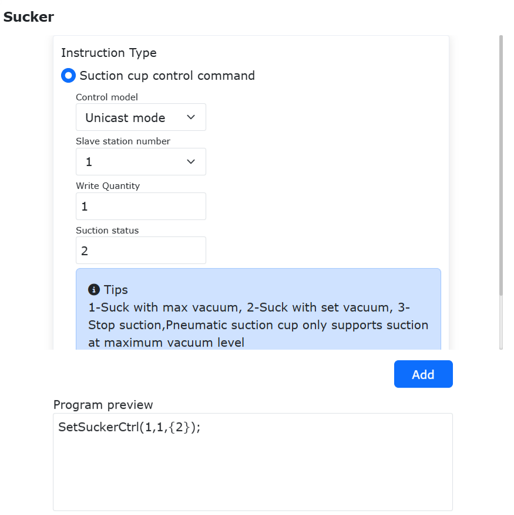

.. centered:: Abbildung 8.12-12 Saugnapf-Steuerbefehl hinzufügen

Die Bedeutung der einzelnen Parameter im Saugnapf-Steuerbefehl ist wie folgt:

- **Slave-Adresse**: Start-Slave-Adresse für die Steuerung im Unicast-Modus.
- **Anzahl der Schreibvorgänge**: Anzahl der zu steuernden Saugnäpfe, beginnend mit der Start-Slave-Adresse im Unicast-Modus.
- **Saugstatus**: Steuerungsstatus-Flag für jeden Saugnapf, beginnend mit der Start-Slave-Adresse (1 - Saugen mit maximalem Vakuum; 2 - Saugen mit eingestelltem Vakuum, d.h. Saugnapfvakuum zwischen max. und min. Vakuum halten; 3 - Saugen stoppen). Die Steuerungsstatus-Flags für jeden Saugnapf werden durch "," getrennt. Die Anzahl der Flags muss mit der Anzahl der zu steuernden Saugnäpfe übereinstimmen. Wenn zwei Saugnäpfe gesteuert werden sollen, einer mit "Saugen mit maximalem Vakuum" und einer mit "Saugen mit eingestelltem Vakuum", lautet der Eingabeinhalt für dieses Feld "1,2".

Klicken Sie auf die Schaltfläche "Anwenden". Daraufhin wird im Programm "testSucker.lua" ein Saugnapf-Steuerbefehl hinzugefügt. Schalten Sie den Roboter in den Automatikmodus und führen Sie dieses LUA-Programm aus. Der Roboter steuert die beiden Saugnäpfe mit den Slave-Adressen 1 und 2 an, um mit maximalem Vakuum bzw. mit eingestelltem Vakuum zu saugen.

.. figure:: robot_peripherals/214.png
   :align: center
   :width: 4in

.. centered:: Abbildung 8.12-13 Saugnapf-Befehl im LUA-Programm hinzugefügt

Hinzufügen von Steuerbefehlen im Broadcast-Modus
*****************************************************************

Der im Broadcast-Modus-Steuerbefehl eingestellte Saugstatus gilt für alle aktuell angeschlossenen Saugnäpfe.

Klicken Sie auf "Saugnapf-Steuerbefehl". Wählen Sie den Steuerungsmodus "Broadcast-Modus". Geben Sie den Saugstatus 1 ein (Saugen mit maximalem Vakuum). Klicken Sie auf die Schaltfläche "Hinzufügen".

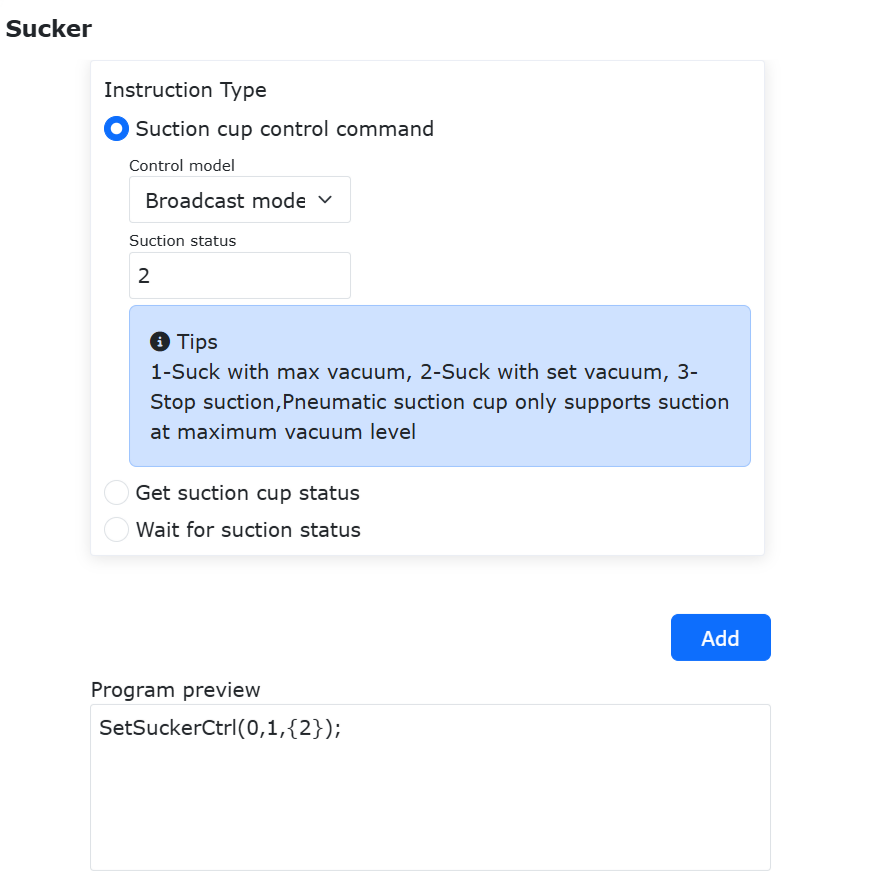

.. centered:: Abbildung 8.12-14 Einen Broadcast-Steuerbefehl hinzufügen

Klicken Sie auf die Schaltfläche "Anwenden". Daraufhin wird in "testSucker.lua" ein Saugnapf-Steuerbefehl im Broadcast-Modus hinzugefügt. Schalten Sie den Roboter in den Automatikmodus und führen Sie dieses Programm aus. Alle verbundenen Saugnäpfe beginnen mit der Aktion "Saugen mit maximalem Vakuum".

.. figure:: robot_peripherals/216.png
   :align: center
   :width: 4in

.. centered:: Abbildung 8.12-15 Einen Broadcast-Steuerbefehl im LUA-Programm hinzufügen

Hinzufügen von Befehlen zum Abrufen des Saugnapfstatus
+++++++++++++++++++++++++++++++++++++++++++++++++++++++++++++++++++++++++++++++++

Klicken Sie auf "Saugnapfstatus abrufen". Wählen Sie die Slave-Adresse des Saugnapfs aus, dessen Status Sie abrufen möchten. Klicken Sie nacheinander auf die Schaltflächen "Hinzufügen" und "Anwenden". Dadurch wird in "testSucker.lua" ein Befehl zum Abrufen des Saugnapfstatus hinzugefügt: "GetSuckerState(1)".

.. figure:: robot_peripherals/217.png
   :align: center
   :width: 4in

.. centered:: Abbildung 8.12-16 Befehl zum Abrufen des Saugnapfstatus hinzufügen

Der Befehl `GetSuckerState()` gibt drei Werte zurück, wie folgt:

- **state**: Aktueller Saugnapfstatus: 0 - Objekt losgelassen oder Saugnapfstart erfolgreich; 1 - Werkstück erkannt, Objekt angesaugt; 2 - Kein Objekt angesaugt; 3 - Objekt abgelöst.
- **pressValue**: Aktuelles Vakuum / Druck.
- **err**: Fehlercode: 0 - normal; sonst: Fehler.

Verwenden Sie in "testSucker.lua" drei Variablen, um die Rückgabewerte der `GetSuckerState()`-Funktion zu empfangen. Zeigen Sie diese Informationen über die LUA-Variablenabfrage im Anzeigebereich der WebApp-Variablenabfrage an.

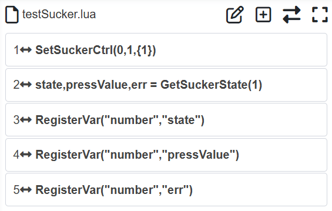

.. centered:: Abbildung 8.12-17 Programm zum Abrufen des Saugnapfstatus

Hinzufügen von Befehlen zum Warten auf den Saugnapf-Saugstatus
+++++++++++++++++++++++++++++++++++++++++++++++++++++++++++++++++++++++++++++++++++++++++++++

In praktischen Anwendungen von Array-Saugnäpfen muss oft gewartet werden, bis der Saugvorgang (oder das Loslassen) abgeschlossen ist, bevor die nächste Aktion ausgeführt wird. Der kollaborative Roboter bietet einen Befehl zum Warten auf den Abschluss der Saugnapfaktion. Die Befehlsausführung endet, wenn der Saugnapf den eingestellten Zustand erreicht; andernfalls wird innerhalb der eingestellten Timeout-Zeit blockierend auf den Abschluss der Saugnapfaktion gewartet.

Klicken Sie auf der Seite zum Hinzufügen von Array-Saugnapf-Befehlen auf "Auf Saugnapf-Saugstatus warten". Wählen Sie die entsprechende Slave-Adresse des Saugnapfs (1). Wählen Sie den Steuerungsmodus "Werkstück erkannt, Objekt angesaugt". Geben Sie eine Timeout-Zeit von 10000 ms ein. Klicken Sie auf die Schaltfläche "Hinzufügen".

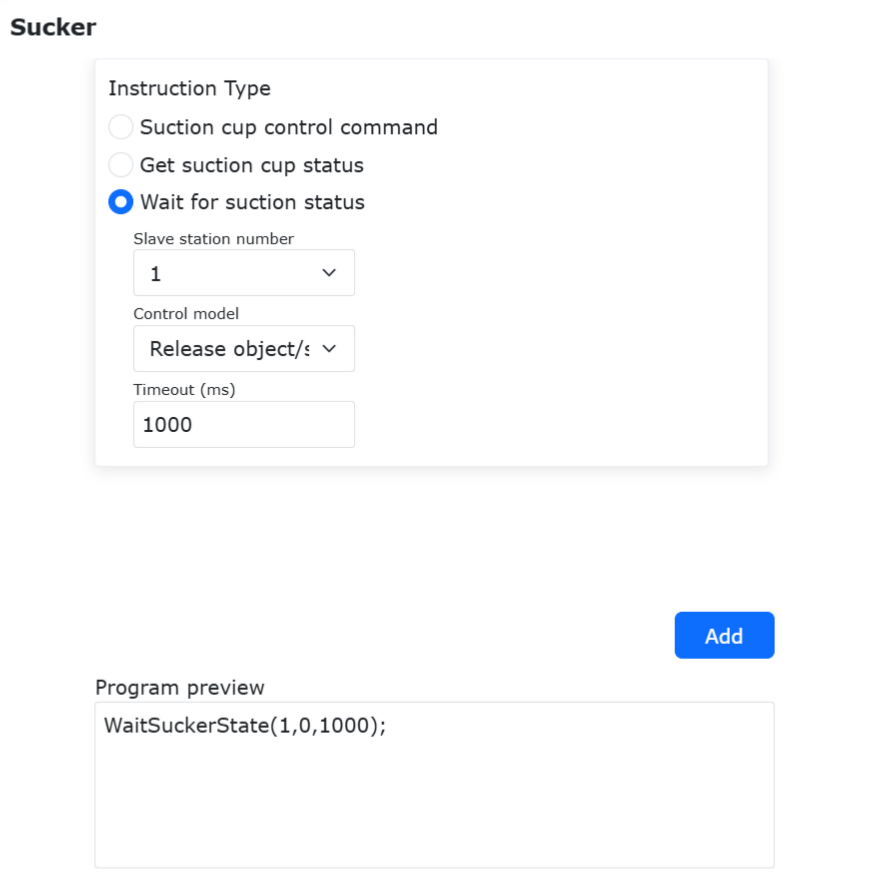

.. centered:: Abbildung 8.12-18 Befehl zum Warten auf Saugnapfstatus hinzufügen

Klicken Sie auf die Schaltfläche "Anwenden". In "testSucker.lua" wird ein Befehl zum Warten darauf hinzugefügt, dass der Saugnapf ein Objekt ansaugt.

.. figure:: robot_peripherals/220.png
   :align: center
   :width: 4in

.. centered:: Abbildung 8.12-19 Befehl zum Warten auf das Ansaugen eines Objekts im LUA-Programm hinzufügen

Anwendungsbeispiel
++++++++++++++++++++++++++++++++++++++++++

Beispiel für ein LUA-Programm zur Saugnapf-Handhabungssteuerung:

.. code-block:: lua
  :linenos:

  while (1) do
  ::satety_suck::
  PTP(sucker_safey,100,-1,0)
  PTP(sucker_suck,100,-1,0)
  SetSuckerCtrl(2, 1, {2})
  SetSuckerCtrl(11, 1, {2})
  loop1 = 0
  while (loop1 < 10) do
      state, press, errorcode = GetSuckerState(2)
      RegisterVar("number","state")
      RegisterVar("number","press")
      RegisterVar("number","errorcode")
      state11, press11, errorcode11 = GetSuckerState(11)
      RegisterVar("number","state11")
      RegisterVar("number","press11")
      RegisterVar("number","errorcode11")
      loop1 = loop1 + 1
      WaitMs(50)
  end

  if(state11 == 1) then
      PTP(sucker_safey,100,-1,0)
      PTP(sucker_release,100,-1,0)
      WaitMs(1000)
      SetSuckerCtrl(2, 1, {3})
      SetSuckerCtrl(11, 1, {3})
      WaitMs(500)
  else
      PTP(sucker_safey,100,-1,0)
      SetSuckerCtrl(2, 1, {3})
      SetSuckerCtrl(11, 1, {3})
      WaitMs(2000)
      goto satety_suck
  end
  ::satety_release::
  PTP(sucker_safey,100,-1,0)
  PTP(sucker_release,100,-1,0)
  SetSuckerCtrl(2, 1, {2})
  SetSuckerCtrl(11, 1, {2})
  loop1 = 0
  while (loop1 < 10) do
      state, press, errorcode = GetSuckerState(2)
      RegisterVar("number","state")
      RegisterVar("number","press")
      RegisterVar("number","errorcode")
      state11, press11, errorcode11 = GetSuckerState(11)
      RegisterVar("number","state11")
      RegisterVar("number","press11")
      RegisterVar("number","errorcode11")
      loop1 = loop1 + 1
      WaitMs(50)
  end

  if(state11 == 1) then
      PTP(sucker_safey,100,-1,0)
      PTP(sucker_suck,100,-1,0)
      WaitMs(1000)
      SetSuckerCtrl(2, 1, {3})
      SetSuckerCtrl(11, 1, {3})
      WaitMs(500)
  else
      PTP(sucker_safey,100,-1,0)
      SetSuckerCtrl(2, 1, {3})
      SetSuckerCtrl(11, 1, {3})
      WaitMs(2000)
      goto satety_release
  end
  end

CNC-Funktionspaket basierend auf FOCAS (nur unter Linux-Systemen)
---------------------------------------------------------------------------------------------------------

Überblick
~~~~~~~~~~~~~~~~~~~~~~~~~~~~~~~~~~~~~~~~~~~~~~~~~

Um automatisierte Be- und Entladeprozesse in der Werkzeugmaschinenbearbeitung zu realisieren, wurde ein CNC-Funktionspaket entwickelt, das auf der FOCAS-Kommunikation basiert. Es ermöglicht die Kommunikationsinteraktion und koordinierte Bewegung zwischen dem kollaborativen Roboter und der CNC-Werkzeugmaschine.

Wie in der Abbildung gezeigt, basiert die FOCAS-Kommunikation auf Ethernet. Durch Verbinden des Netzwerkanschlusses des Robotersteuerschranks mit dem eingebetteten Netzwerkanschluss der Werkzeugmaschine über ein Netzwerkkabel wird die FOCAS-Kommunikation zwischen Roboter und Maschine hergestellt, wodurch die CNC-Steuerung und die Maschinenzustandsüberwachung auf der Roboterseite realisiert werden.

.. figure:: robot_peripherals/221.png
   :align: center
   :width: 6in

.. centered:: Abbildung 8.13‑1 Topologie der FOCAS-Kommunikation zwischen Roboter und CNC

Die derzeit vom CNC-Funktionspaket des Steuerschranks basierend auf FOCAS-Kommunikation unterstützten Funktionen zur Maschinensteuerung und Zustandsrückmeldung sind in der Tabelle aufgeführt.

.. centered:: Tabelle 8.13-1 Vom CNC-Funktionspaket basierend auf FOCAS-Kommunikation unterstützte Funktionen

.. list-table::
   :widths: 15 40 100
   :header-rows: 0
   :align: center
   :class: sheet-center

   * - **Nr.**
     - **Funktionsname**
     - **Beschreibung**
   * - 1
     - Maschinentyp
     - Zustandsrückmeldung
   * - 2
     - FOCAS-Kommunikationsstatus
     - Zustandsrückmeldung
   * - 3
     - Automatikmodus Betrieb
     - Steuerung, Zustandsrückmeldung
   * - 4
     - Alarmstatus
     - Zustandsrückmeldung
   * - 5
     - Sicherheitstür
     - Zustandsrückmeldung
   * - 6
     - Spannfutter
     - Steuerung, Zustandsrückmeldung
   * - 7
     - Not-Halt
     - Steuerung, Zustandsrückmeldung

Detaillierte Bedienungsanleitung
~~~~~~~~~~~~~~~~~~~~~~~~~~~~~~~~~~~~~~~~~~~~~~~~~~~~~~~~~~~~~~~~~~~~~~

FOCAS-Kommunikationsaufbau
+++++++++++++++++++++++++++++++++++++++++++

Die FOCAS-Kommunikation basiert auf Ethernet. Es ist erforderlich, den Roboter, die CNC-Maschine und den PC in einem lokalen Netzwerk (LAN) zu verbinden, um die physische Verbindung herzustellen. Über das offene Roboterprotokoll wird schließlich die FOCAS-Kommunikation aufgebaut.

Netzwerkkonfiguration
*************************

**Schritt 1**: Ändern Sie zuerst die IP-Adresse des PCs so, dass sie sich im selben Netzwerksegment wie der Robotersteuerschrank befindet. Die IP-Adresse des Robotersteuerschranks ist "192.168.58.2".

Wenn kein Switch für die Vernetzung vorhanden ist, können die beiden integrierten Netzwerkanschlüsse des Robotersteuerschranks für die Vernetzung verwendet werden. Gehen Sie wie folgt vor: Melden Sie sich in der WebAPP des Roboters an. Gehen Sie zu Systemeinstellungen -> Allgemeine Einstellungen -> Netzwerkeinstellungen. Stellen Sie die IP des Netzwerkanschlusses 0 auf: 192.168.58.2; die IP des Netzwerkanschlusses 1 auf: 192.168.57.2. Stellen Sie gleichzeitig WebAPP auf Netzwerkanschluss 0 und WebRecovery auf Netzwerkanschluss 1, wie in der Abbildung gezeigt. Klicken Sie nach Abschluss aller Einstellungen auf "Netzwerk einstellen".

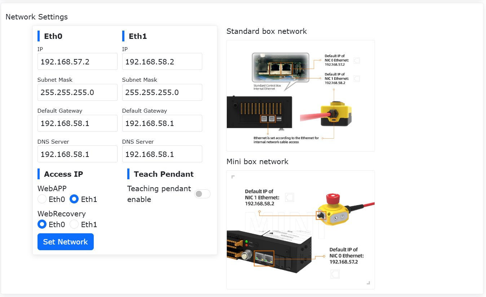

.. centered:: Abbildung 8.13‑2 Roboter-Netzwerkkonfiguration

**Schritt 2**: Starten Sie anschließend den Steuerschrank neu und verbinden Sie ihn über den Netzwerkanschluss der Netzwerkkarte 0 mit dem PC. Melden Sie sich in der Roboter-WebApp an. Konfigurieren Sie gleichzeitig die IP-Adresse der zu kommunizierenden CNC-Maschine und den PC sowie den Robotersteuerschrank so, dass sie sich im selben Netzwerksegment befinden, d.h. 192.168.58.xx. Ändern Sie außerdem den Port der Maschine auf 8193. Damit ist die gesamte Netzwerkkonfiguration abgeschlossen.

Konfiguration der offenen Protokolldatei
*********************************************************

**Schritt 1**: Führen Sie anschließend die Konfiguration des offenen Peripherieprotokolls durch. Erstellen Sie zuerst eine neue LUA-Datei, deren Name mit "CtrlDev_CNC" beginnt, als offene Protokolldatei für den Aufbau der FOCAS-Kommunikation, z.B. CtrlDev_CNC_demo.lua.

In dieser Datei muss die offene Protokoll-ID festgelegt werden. Über die Funktion `CNCComSet` wird die Verbindung mit der CNC hergestellt oder getrennt. Die Parameter der `CNCComSet`-Funktion werden in der folgenden Tabelle erläutert. Ein Beispielcode folgt.

.. centered:: Tabelle 8.13-2 Parameter der `CNCComSet`-Funktion

.. list-table::
   :widths: 15 40 100
   :header-rows: 0
   :align: center
   :class: sheet-center

   * - **Nr.**
     - **Funktionsname**
     - **Beschreibung**
   * - 1
     - Maschinenhersteller
     - 0-ungültig 1-Maschine (FOCAS)
   * - 2
     - Kommunikationsbefehl
     - 1-Verbindung herstellen 1001-Verbindung trennen
   * - 3
     - Maschinen-IP-Adresse
     - --
   * - 4
     - Maschinen-Portnummer
     - --

Beispielcode für offenes Protokoll zum Aufbau einer FOCAS-Kommunikationsverbindung:

.. code-block:: lua
    :linenos:

    local id = 1      --Offene LUA-Protokoll-ID
    --FOCAS-Verbindung trennen
    CNCComSet(1, 1001, '192.168.57.100', 8193)
    sleep_ms(1000)
    --FOCAS-Verbindung herstellen
    CNCComSet(1, 1, '192.168.57.100', 8193)
    sleep_ms(1000)
    while(1) do
    sleep_ms(5000)
    end

**Schritt 2**: Nachdem Sie die LUA-Datei für das offene Protokoll erstellt haben, wählen Sie die gerade erstellte Datei CtrlDev_CNC_fanuc.lua aus und laden Sie sie hoch. Wählen Sie die in der Datei festgelegte ID aus. Wählen Sie in der Dropdown-Liste die hochgeladene offene Protokolldatei aus und klicken Sie auf "Konfigurieren".

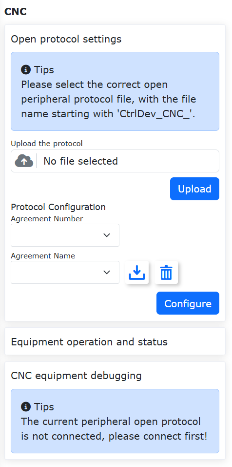

.. centered:: Abbildung 8.13‑3 Hochladen und Konfigurieren der offenen Protokolldatei

**Schritt 3**: Überprüfen Sie anschließend, ob alle Kommunikationsverbindungen normal sind, und stellen Sie sicher, dass sich die CNC-Maschine im eingeschalteten Zustand befindet. Klicken Sie im offenen Protokoll auf die Schaltfläche "Verbinden". Über den CNC->FOCAS-Kommunikationsstatus in der Statusrückmeldungsleiste auf der rechten Seite können Sie bestätigen, ob eine Verbindung mit der Maschine hergestellt wurde (rot: Verbindung hergestellt; grau: Verbindung getrennt), wie in der Abbildung gezeigt.

.. figure:: robot_peripherals/224.png
   :align: center
   :width: 4in

.. centered:: Abbildung 8.13‑4 FOCAS-Kommunikationsverbindung hergestellt

Erläuterung der CNC-Zustandsrückmeldung
++++++++++++++++++++++++++++++++++++++++++++++++++

Die Zustandsrückmeldung der CNC-Maschine wird im äußeren CNC-Symbol in der Peripherie-Statusrückmeldungsleiste ganz rechts in der WebAPP angezeigt, wie in der Abbildung gezeigt. Ein Klick darauf zeigt den gesamten aktuellen Zustand der Maschine an, einschließlich Gerätehersteller, Maschinentyp, FOCAS-Kommunikationsstatus, Alarmsignale, Maschinenbetriebs-/Bearbeitungsstatus, Maschinentür-Öffnungs-/Schließzustand, Maschinenspannfutter-Zustand, Maschinen-Not-Halt-Zustand.

.. figure:: robot_peripherals/225.png
   :align: center
   :width: 4in

.. centered:: Abbildung 8.13‑5 CNC-Zustandsrückmeldungsleiste

Die Bedeutung der einzelnen Statusanzeigeleuchten der CNC ist in der folgenden Tabelle aufgeführt.

.. centered:: Tabelle 8.13-3 Bedeutung der Statusanzeigeleuchten im CNC-Rückmeldesymbol

.. list-table::
   :widths: 15 40 100
   :header-rows: 0
   :align: center
   :class: sheet-center

   * - **Nr.**
     - **Funktionsname**
     - **Beschreibung**
   * - 1
     - FOCAS-Kommunikationsstatus
     - grau - Kommunikation getrennt rot - Kommunikation normal
   * - 2
     - Alarmsignale
     - grau - keine Warnung rot - Warnung vorhanden
   * - 3
     - Maschinenbetriebs-/Bearbeitungsstatus
     - grau - gestoppt grün - in Betrieb
   * - 4
     - Maschinentür-Öffnungs-/Schließzustand
     - grau - geschlossen grün - geöffnet
   * - 5
     - Maschinenspannfutter-Zustand
     - grau - gelöst grün - gespannt
   * - 6
     - Maschinen-Not-Halt-Zustand
     - grau - Not-Halt unwirksam grün - Not-Halt wirksam

Erläuterung der CNC-Zustandsrückmeldung
++++++++++++++++++++++++++++++++++++++++++++++++++

Die Steuerung der CNC-Maschine befindet sich im offenen Peripherieprotokoll. Nachdem die FOCAS-Kommunikationsverbindung hergestellt wurde, klicken Sie oben rechts auf das konfigurierte offene Peripherieprotokoll, um die CNC-Steuerungsseite zu öffnen, wie in der Abbildung gezeigt.

.. note:: Zu den Steuerungstasten gehören Türsteuerung (Öffnen, Schließen), Spannfuttersteuerung (Spannen, Lösen), Start-/Stoppsteuerung (Betrieb, Stopp) und Not-Halt-Steuerung (Not-Halt, unwirksam). Alle Steuersignale sind flankengesteuert.

.. figure:: robot_peripherals/226.png
   :align: center
   :width: 4in

.. centered:: Abbildung 8.13‑6 CNC-Steuerungsseite

Erläuterung des CNC-Teach-Programms
++++++++++++++++++++++++++++++++++++++++++++++++++

Das CNC-Funktionspaket unterstützt das Aufrufen von Steuerbefehlen in Teach-Programmen und das Abrufen des Maschinenstatus in Echtzeit. Öffnen Sie nacheinander "Teach-Programm" -> "Programmierung" -> "Peripheriebefehle" -> "CNC". Alle unterstützten CNC-Teach-Befehle werden angezeigt, wie in der Abbildung gezeigt.

.. figure:: robot_peripherals/227.png
   :align: center
   :width: 4in

.. centered:: Abbildung 8.13‑7 CNC-Teach-Befehle

.. note:: Die Steuerbefehle entsprechen eins zu eins der CNC-Steuerung und sind alle flankengesteuert. Das bedeutet, dass nach der Ausführung eines Startbefehls unbedingt ein Stopp erfolgen muss, bevor der nächste Startbefehl wirksam wird.

"Maschinenaktuellen Zustand abrufen" ist eine LUA-Funktion. Diese Funktion gibt 9 Parameter zurück, deren Bedeutung in der folgenden Tabelle aufgeführt ist.

.. centered:: Tabelle 8.13-4 Rückgabewerte von "Maschinenaktuellen Zustand abrufen"

.. list-table::
   :widths: 15 40 100
   :header-rows: 0
   :align: center
   :class: sheet-center

   * - **Nr.**
     - **Name**
     - **Bedeutung**
   * - 1
     - Gerätehersteller
     - 0-ungültig 1-andere - reserviert
   * - 2
     - FOCAS-Kommunikationsstatus
     - 0-Kommunikation normal andere - Kommunikation getrennt
   * - 3
     - Maschinentyp (string)
     - '15' : Series 150/150i '16' : Series 160/160i '18' : Series 180/180i '21' : Series 210/210i '30' : Series 300i '31' : Series 310i '32' : Series 320i '0' : Series 0i
   * - 4
     - Maschinentyp (string)
     - '15' : Series 150/150i '16' : Series 160/160i '18' : Series 180/180i '21' : Series 210/210i '30' : Series 300i '31' : Series 310i '32' : Series 320i '0' : Series 0i
   * - 5
     - Maschinenbetriebsstatus
     - 0 - gestoppt 1 - in Betrieb
   * - 6
     - Maschinen-Not-Halt-Status
     - 0 - Not-Halt wirksam andere - Not-Halt unwirksam
   * - 7
     - Maschinen-Alarmstatus
     - 0 - keine Warnung andere - Warnung vorhanden
   * - 8
     - Maschinentür-Status
     - 0 - geöffnet 1 - geschlossen
   * - 9
     - Maschinenspannfutter-Status
     - 0 - gelöst 1 - gespannt

Am Beispiel eines Roboter-Be- und Entladeprozesses wurde ein LUA-Teach-Programmbeispiel erstellt. Dieses Beispielprogramm umfasst die Steuerung des CNC-Türschließens, -öffnens, -betriebs, -stopps, Spannfutter-Lösens und -Spannens. Es verwendet den aktuellen CNC-Status als Bedingung und lässt den Roboter Bewegungen zu drei Punkten ausführen (Sicherheitspunkt, Aufnahmepunkt, Ablagepunkt), wie im Code gezeigt.

Beispiel für ein LUA-Teach-Programm zur koordinierten Bewegung von Roboter und CNC:

.. code-block:: lua
    :linenos:

     while (1) do
        CNCDoorClose()
        CNCWorkStart()
        WaitMs(1000)
        t1,t2,t3,t4,t5,t6,t7,t8,t9=CNCGetStatus()
        if t5 == 1 then
            PTP(CNCsafe,100,-1,0)
        else
            CNCWorkStop()
            CNCDoorOpen()
            WaitMs(1000)
            PTP(CNCg1,100,-1,0)
            WaitMs(1000)
            CNCChuckOpen()
            PTP(CNCg2,100,-1,0)
            PTP(CNCsafe,100,-1,0)
        end
        t1,t2,t3,t4,t5,t6,t7,t8,t9=CNCGetStatus()
        if t8 == 0 then
            if t5 == 0 then
                PTP(CNCg2,100,-1,0)
                 PTP(CNCg1,100,-1,0)
                 CNCChuckFastening()
                 WaitMs(1000)
                 PTP(CNCsafe,100,-1,0)
             end
         end
    end

Konfiguration einer virtuellen Wand basierend auf einem Kraftsensor
-------------------------------------------------------------------------------------------------

Die Funktion der virtuellen Wand basierend auf einem Kraftsensor ermöglicht es, durch manuelles Setzen einer virtuellen Wand den Arbeitsraum des Roboters einzuschränken und so direkte Kollisionen zu vermeiden.

Montage und Konfiguration des Kraftsensors
~~~~~~~~~~~~~~~~~~~~~~~~~~~~~~~~~~~~~~~~~~~~~~~~~~~~~~~~~~~~~~~~~~~~~~

**Schritt 1**: Am Beispiel des "KunWei"-Sensors muss bei der Montage sichergestellt werden, dass die Richtung des Kraftsensor-Koordinatensystems mit der des Flansch-Koordinatensystems übereinstimmt, wie in Abbildung 1 gezeigt (In Abbildung 1: rot = X+ Richtung des Flanschkoordinatensystems, grün = Y+ Richtung, blau = Z+ Richtung).

.. figure:: robot_peripherals/228.png
   :align: center
   :width: 4in

.. figure:: robot_peripherals/229.png
   :align: center
   :width: 4in

.. centered:: Abbildung 8.14‑1 Montage des Kraftsensors

**Schritt 2**: Klicken Sie im Menü "Initiale Einstellungen" -> "Peripherie" -> "Kraftsensor" auf "Bereits angepasste Geräte", um zur Konfigurationsoberfläche für das Kraftsensor-Gerät zu gelangen.

Die Konfigurationsinformationen für den Kraftsensor umfassen Hersteller, Typ, Softwareversion und Montageposition. Der Benutzer kann die entsprechenden Kraftsensorinformationen je nach spezifischem Produktionsbedarf konfigurieren. Wenn der Benutzer die Konfiguration ändern muss, kann er zuerst die entsprechende Nummer auswählen, auf die Schaltfläche "Löschen" klicken, um die entsprechenden Informationen zu löschen, und dann je nach Bedarf neu konfigurieren. Die genaue Vorgehen ist in der Abbildung dargestellt.

**Schritt 3**: Wählen Sie die konfigurierte Kraftsensornummer aus, klicken Sie auf die Schaltfläche "Reset". Nachdem auf der Seite der erfolgreiche Befehlssendevorgang angezeigt wurde, klicken Sie auf die Schaltfläche "Aktivieren". Überprüfen Sie den Aktivierungsstatus in der Kraftsensorinformationstabelle, um festzustellen, ob die Aktivierung erfolgreich war. Darüber hinaus hat der Kraftsensor einen Anfangswert. Der Benutzer kann je nach Bedarf "Nullpunktkorrektur" und "Nullpunkt entfernen" wählen. Für die Nullpunktkorrektur des Kraftsensors muss sichergestellt sein, dass der Sensor horizontal und vertikal nach unten ausgerichtet ist und der Roboter keine Nutzlast konfiguriert hat.

.. centered:: Abbildung 8.14‑2 Kraftsensor-Konfiguration und -Aktivierung

.. figure:: robot_peripherals/017.png
   :align: center
   :width: 4in

.. centered:: Abbildung 8.14‑3 Kraftsensor-Aktivierung

Konfiguration der virtuellen Wand
~~~~~~~~~~~~~~~~~~~~~~~~~~~~~~~~~~~~~~~~~~~~~~~~~~~~~~~~~~~~~~~~~~~~~~

Für das unterstützte Ziehen mit Kraftsensor muss unter dem Sensor ein Ziehgriff montiert und ein Werkzeugkoordinatensystem konfiguriert werden. Die genaue Vorgehen ist in Abbildung 4 dargestellt. Die Erkennung von Interferenzbereichen erfolgt dann anhand der Position des eingestellten Werkzeugkoordinatensystems. Ist keines eingestellt, dient der Flansch als Referenz.

**Schritt 1**: Klicken Sie im Menü "Initiale Einstellungen" -> "Sicherheit" -> "Interferenzbereich" auf "Einzeln", um zur Konfigurationsoberfläche für den Interferenzbereich zu gelangen.

**Schritt 2**: Es müssen die Interferenzart und das Verhalten beim Betreten des Interferenzbereichs konfiguriert werden. Klicken Sie auf "Quaderinterferenz", um zur Konfigurationsoberfläche zu gelangen. Stellen Sie das Verhalten beim Betreten des Interferenzbereichs im Ziehemodus auf "Ziehen uneingeschränkt". Die Konfiguration für die Bewegung beim Betreten des Interferenzbereichs kann beliebig gewählt werden.

**Schritt 3**: Je nach Bedarf können die Parametereinstellungen geändert werden. Die Erkennungsmethode kann entweder "Befehlsposition" oder "Rückmeldeposition" sein. Der Interferenzbereichsmodus kann entweder "Interferenz innerhalb des Bereichs" oder "Interferenz außerhalb des Bereichs" sein. Als Referenzkoordinatensystem wird "Basiskoordinate" gewählt. Die Einstellungen erfolgen je nach tatsächlicher Verwendung. Detaillierte Vorgehen siehe Abbildung.

.. figure:: robot_peripherals/230.png
   :align: center
   :width: 4in

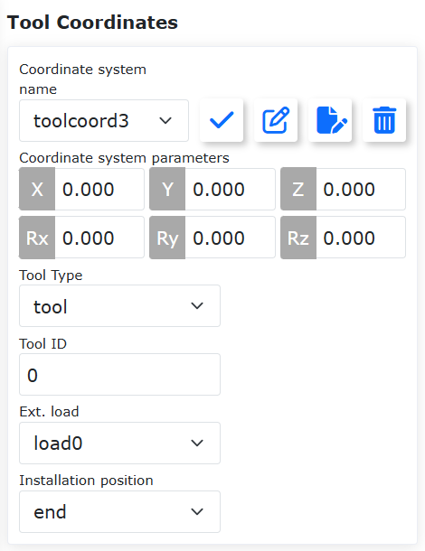

.. centered:: Abbildung 8.14‑4 Montage des Ziehgriffs und Einstellung des Werkzeugkoordinatensystems

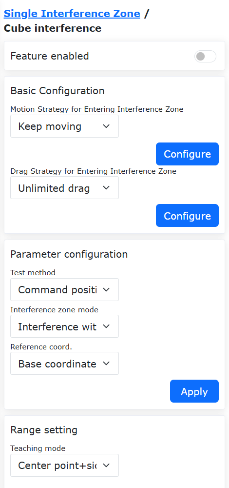

.. centered:: Abbildung 8.14‑5 Parametereinstellung für virtuelle Wand

**Schritt 4**: In der Parametereinstellung kann der Interferenzbereichsmodus entweder "Interferenz innerhalb des Bereichs" oder "Interferenz außerhalb des Bereichs" sein.

.. figure:: robot_peripherals/233.png
   :align: center
   :width: 4in

.. centered:: Abbildung 8.14‑6 Interferenz innerhalb des Bereichs

.. figure:: robot_peripherals/234.png
   :align: center
   :width: 4in

.. centered:: Abbildung 8.14‑7 Interferenz außerhalb des Bereichs

**Schritt 5**: Einrichten des Interferenzbereichs. Die genaue Vorgehen ist in den Abbildungen 7 und 8 dargestellt. Es wird empfohlen, bei Auswahl von "Interferenz außerhalb des Bereichs" den Interferenzbereich so groß wie möglich zu wählen.

.. figure:: robot_peripherals/235.png
   :align: center
   :width: 4in

.. centered:: Abbildung 8.14‑8 Einrichten eines Interferenzbereichs mit der Zwei-Punkt-Methode

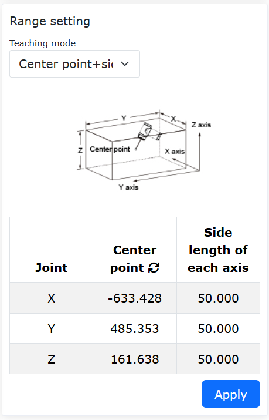

.. centered:: Abbildung 8.14‑9 Einrichten eines Interferenzbereichs mit der Mittelpunkt+Seitenlängen-Methode

Unterstütztes Ziehen mit Kraftsensor
~~~~~~~~~~~~~~~~~~~~~~~~~~~~~~~~~~~~~~~~~~~~~~~~~~~~~~~~~~~~~~~~~~~~~~

**Schritt 1**: Klicken Sie im Menü "Hilfsanwendungen" -> "Werkzeuganwendungen" auf "Ziehen sperren", um zur Funktionsoberfläche für die unterstützte Sperre mit Kraftsensor zu gelangen.

**Schritt 2**: Stellen Sie die Parameter wie in der Abbildung gezeigt ein, um die Funktion der virtuellen Wand basierend auf dem Kraftsensor zu realisieren. Der Effekt ist: Bei Annäherung an die virtuelle Wand wird der Widerstand größer; bei Entfernung von der virtuellen Wand funktioniert das unterstützte Ziehen mit Kraftsensor normal.

.. figure:: robot_peripherals/237.png
   :align: center
   :width: 4in

.. figure:: robot_peripherals/238.png
   :align: center
   :width: 4in

.. centered:: Abbildung 8.14‑10 Parametereinstellung für unterstütztes Ziehen mit Kraftsensor

Die spezifische Wirkung der Parameter:

**Adaptive Auswahl**: Bei Bedarf während der Montage einschalten. Nach dem Einschalten wird das Ziehen schwerer.

**Trägheitsparameter**: Passen das haptische Feedback während des Ziehvorgangs an. Nur unter Anleitung von Fachpersonal vorsichtig einstellen.

**Dämpfungsparameter**:

-   Translationsrichtung: Empfohlene Einstellung zwischen [100-200].
-   Rotationsrichtung: Empfohlene Einstellung zwischen [3-10], wobei der Einstellbereich für die RZ-Richtung [0,1-5] ist.
-   Effekt: Beim Ziehen mit Sensor erschwert eine Erhöhung der Dämpfung das Ziehen, eine Verringerung der Dämpfung macht das Ziehen zu leicht (nicht zu klein einstellen).
-   Gesamtbereich Dämpfungsparameter: Translation XYZ: [100-1000]; Rotation RX, RY: [3-50], RZ: [2-10].
-   Maximale Zugkraft ist 50, maximale Ziehgeschwindigkeit ist 180.

**Steifigkeitsparameter**: Alle auf 0 setzen.

**Zugkraftschwelle**: Translation XYZ: [5-10]; Rotation RX, RY, RZ: [0,5-5].

**Maximale Zugkraft**: 50.

**Maximale Ziehgeschwindigkeit**: 180.

Funktion zum gemischten Ziehen mit 6-Achsen-Kraft und Gelenkimpedanz
~~~~~~~~~~~~~~~~~~~~~~~~~~~~~~~~~~~~~~~~~~~~~~~~~~~~~~~~~~~~~~~~~~~~~~~~~~~~~~~~~~~~~~~~~~~~~~~~

Überblick
++++++++++++++++++++++++++++++++++++++

Die Funktion zum gemischten Ziehen mit 6-Achsen-Kraft und Gelenkimpedanz nutzt den Kraftsensor, um äußere Kräfte zu erfassen. Der Roboter wird im Ziehemodus unterstützt. Durch Anpassen des Verstärkungsfaktors können unterschiedliche Zieherfahrungen erzielt werden. Die Gelenkimpedanz hingegen verwendet eine Impedanzregelung, um die Zugkraft zu begrenzen.

Montagekonfiguration und Nullpunktkorrektur des Kraftsensors
++++++++++++++++++++++++++++++++++++++++++++++++++++++++++++++++++++++++++++++++++++++

1.  Montagekonfiguration des Kraftsensors

Die detaillierte Vorgehen zur Montagekonfiguration des Kraftsensors siehe oben: Konfiguration einer virtuellen Wand basierend auf einem Kraftsensor.

2.  Nullpunktkorrektur des Kraftsensors

Um das Ziehen des Roboters zu erleichtern, muss unter dem Sensor ein Ziehgriff montiert werden, wie in Abbildung 1 gezeigt.

.. figure:: robot_peripherals/239.png
   :align: center
   :width: 4in

.. centered:: Abbildung 8.14‑11 Ziehgriff

**Schritt 1**: Stellen Sie basierend auf der tatsächlichen Länge des Griffs das Werkzeugkoordinatensystem ein, wie in Abbildung 2 gezeigt.

**Schritt 2**: Klicken Sie im Menü "Initiale Einstellungen" -> "Basis" -> "Nutzlast" auf "Sensor", um zur Oberfläche für die Kraft-/Drehmomentsensor-Nutzlast zu gelangen.

Hilfe der Ziehtaste stellen Sie das Roboterende horizontal nach unten. Klicken Sie nacheinander auf "Nutzlast" -> "Sensoridentifikation", um zur Oberfläche zu gelangen. Suchen Sie im Bereich "Automatische Nullpunktkorrektur des Sensors" die Schaltfläche "Anfangsposition aufzeichnen". Schalten Sie dann den Robotermodus in den Automatikmodus und klicken Sie auf die Schaltfläche "Automatische Nullpunktkorrektur". Nachdem das Programm abgeschlossen ist, ist die Nullpunktkorrektur des Sensors abgeschlossen. Detaillierte Vorgehen siehe Abbildung.

.. centered:: Abbildung 8.14‑12 Einstellung des Werkzeugkoordinatensystems

.. figure:: robot_peripherals/240.png
   :align: center
   :width: 4in

.. centered:: Abbildung 8.14‑13 Automatische Nullpunktkorrektur des Kraft-/Drehmomentsensors

Gemischtes Ziehen mit 6-Achsen-Kraft und Gelenkimpedanz
++++++++++++++++++++++++++++++++++++++++++++++++++++++++++++++++++++++++++++++++++++++

1.  Unterstütztes Ziehen

**Schritt 1**: Klicken Sie im Menü "Hilfsanwendungen" -> "Werkzeuganwendungen" auf "Ziehen sperren", um zur Funktionsoberfläche für das gesperrte Ziehen zu gelangen.

**Schritt 2**: Stellen Sie im Bereich "Gemischtes Ziehen mit 6-Achsen-Kraft und Gelenkimpedanz" den Steuerungsstatus auf "Aktivieren" und den Impedanz-Aktivierungsstatus auf "Deaktivieren". Stellen Sie den Zugverstärkungsfaktor ein. Stellen Sie die Endlineargeschwindigkeit auf 1000 mm/s und die Winkelgeschwindigkeitsbegrenzung auf 100 °/s ein. Klicken Sie dann auf die Schaltfläche "Anwenden", um die Funktion zu aktivieren. Die genaue Konfiguration ist in Abbildung 4 dargestellt.

**Schritt 3**: Schalten Sie den Robotermodus in den Ziehemodus. Sie können den Roboter nun ziehen. Der Effekt ist: Ziehen am Roboterende ist leicht und fühlt sich gut an; Ziehen an den Gelenken ist schwer.

.. figure:: robot_peripherals/241.png
   :align: center
   :width: 4in

.. centered:: Abbildung 8.14‑14 Konfigurationsparameter für unterstütztes Ziehen mit 6-Achsen-Kraft

2.  Gelenkimpedanzregelung

Die Impedanzregelung dient dazu, die Zugkraft und die Zugposition zu begrenzen. Ihr Standardzustand ist "Deaktiviert".

Die genaue Vorgehen ist in Abbildung 5 dargestellt. Stellen Sie den Impedanz-Aktivierungsstatus auf "Aktivieren". Stellen Sie dann die Dämpfungskoeffizienten und Steifigkeitskoeffizienten wie in Abbildung 5 gezeigt ein. Die Funktion der Steifigkeitskoeffizienten ist derzeit nicht verfügbar.

.. figure:: robot_peripherals/242.png
   :align: center
   :width: 4in

.. centered:: Abbildung 8.14‑15 Konfigurationsparameter für Gelenkimpedanz

Die spezifische Wirkung der Parameter:

- **Steuerungsstatus**: Nach dem Aktivieren kann diese Funktion im Ziehemodus verwendet werden.

- **Impedanz aktivieren**: Nach dem Aktivieren müssen die Steifigkeits- und Dämpfungsparameter konfiguriert werden. Sie dienen dazu, die Zugkraft und die Zugposition zu begrenzen.

- **Zugverstärkung (Drag Gain)**: Der Parameter sollte vorzugsweise zwischen [0-5] eingestellt werden. Bei 0 kann der Roboter nicht gezogen werden. Bei 1 verbessert sich der Zieheffekt nicht. Bei Werten über 1 ist das Ziehen leicht und fühlt sich gut an. Je größer der Wert, desto leichter das Ziehen.

- **Steifigkeitsverstärkung (Stiffness Gain)**: Wird auf 0 gesetzt. Die Wirkung besteht darin, nach dem Ziehen in die Ausgangsposition vor dem Ziehen zurückzukehren.

- **Dämpfungsverstärkung (Damping Gain)**: Dient zur Begrenzung der Zugkraft. Parameterbereich für Achsen 1-3: [0-0,5]; für Achsen 4-5: [0-0,1]; für Achse 6: [0-0,05].

- **Endlineargeschwindigkeit**: 1000 mm/s. Wird diese Grenze überschritten, schaltet der Roboter in den Handmodus und meldet "TCP Übergeschwindigkeit".

- **Winkelgeschwindigkeitsbegrenzung**: 100 °/s. Wird diese Grenze überschritten, schaltet der Roboter in den Handmodus und meldet "TCP Übergeschwindigkeit".

Funktion zur Laser-Punktverfolgung mit Erweiterungsachse
------------------------------------------------------------------

Systemaufbau für Laser-Punktverfolgung mit Roboter-Erweiterungsachse
~~~~~~~~~~~~~~~~~~~~~~~~~~~~~~~~~~~~~~~~~~~~~~~~~~~~~~~~~~~~~~~~~~~~~~~~~~~~~~~~~~~~~~~~~~~~~~~~~~~~~~~~~~~~~~~~~

.. figure:: robot_peripherals/243.png
   :align: center
   :width: 4in

.. centered:: Abbildung 8.15‑1 Systemaufbau für Laser-Punktverfolgung mit Roboter-Erweiterungsachse

Im System ist (a) der Computer, (b) der Roboter und sein Steuerschrank, (c) der Positionierer und die Antriebsgeräte, (d) der Schweißnaht-Tracking-Lasersensor und (e) das Schweißgerät mit Zubehör.

.. figure:: robot_peripherals/244.png
   :align: center
   :width: 3in

.. centered:: Abbildung 8.15‑2 Schematische Darstellung der Peripheriemontage

Der Schweißnaht-Tracking-Lasersensor und der Schweißbrenner (b) sind am Roboterflansch (a) montiert. Der Positionierer (c) ist fest außerhalb des Roboters montiert.

Kommunikationskonfiguration der Erweiterungsachse
~~~~~~~~~~~~~~~~~~~~~~~~~~~~~~~~~~~~~~~~~~~~~~~~~~~~~~~~~~~~~~~~~~~~~~~~~~~~~~~~~~~~~~~

Die Kommunikationsmethoden zwischen Roboter und Erweiterungsachse umfassen die Verwendung von UDP oder RS485.

.. figure:: robot_peripherals/074.png
   :align: center
   :width: 4in

.. centered:: Abbildung 8.15‑3 Konfigurationsseite für die Erweiterungsachse

Klicken Sie in der Roboter-Bedienoberfläche auf "Initiale Einstellungen" -> "Peripherie" -> "Erweiterungsachse", um zur Konfigurationsseite für die Erweiterungsachse zu gelangen. Am Beispiel der Verbindung des Roboters mit einer SPS über UDP-Kommunikation: Klicken Sie auf das Symbol "UDP-Kommunikation", um zur Konfigurationsseite für die UDP-Kommunikation der Erweiterungsachse zu gelangen.

.. figure:: robot_peripherals/110.png
   :align: center
   :width: 4in

.. centered:: Abbildung 8.15‑4 Konfigurationsoberfläche für UDP-Kommunikation

Auf der Konfigurationsseite für die UDP-Kommunikation der Erweiterungsachse können Sie die entsprechende Erweiterungsachsennummer auswählen, die UDP-Kommunikationsparameter (Adresse, Port, Zyklus, Paketverlusterkennung usw.) verbinden und konfigurieren sowie die Positionierabschlusszeit der Erweiterungsachse einstellen.

Die Konfiguration der Erweiterungsachse ist nicht der Schwerpunkt dieser Funktionsbeschreibung. Detaillierte Konfigurationen finden Sie im entsprechenden Abschnitt des Benutzerhandbuchs.

Verbindungskonfiguration des Schweißnaht-Tracking-Lasersensors
~~~~~~~~~~~~~~~~~~~~~~~~~~~~~~~~~~~~~~~~~~~~~~~~~~~~~~~~~~~~~~~~~~~~~~~~~~~~~~~~~~~~~~~~~~~~~~~~~~~~~~~~~~~~~~~~~

Verbinden Sie den Schweißnaht-Tracking-Lasersensor über die folgende Konfigurationsseite:

.. figure:: robot_peripherals/245.png
   :align: center
   :width: 4in

.. centered:: Abbildung 8.15‑5 Seite zum Verbinden und Konfigurieren des Lasersensors

Klicken Sie auf "Initiale Einstellungen" -> "Peripherie" -> "Linienlasersensor" -> "Bereits angepasste Geräte", um zur Konfigurationsseite zu gelangen. Die Konfigurationsseite umfasst "Sensorkonfiguration", "Kommunikationskonfiguration und -ladung" und "Basisberechnung". Klicken Sie auf "Sensorkonfiguration", um die Filterparameter für die Sensoreingänge einzustellen. Klicken Sie auf "Kommunikationskonfiguration und -ladung", um die entsprechenden Kommunikationsparameter zur Verbindung mit dem Lasersensor einzugeben.

Die Konfiguration des Lasersensors ist nicht der Schwerpunkt dieser Funktionsbeschreibung. Detaillierte Konfigurationen finden Sie im entsprechenden Abschnitt des Benutzerhandbuchs.

Verbindungskonfiguration des Schweißgeräts
~~~~~~~~~~~~~~~~~~~~~~~~~~~~~~~~~~~~~~~~~~~~~~~~~~~~~~~~~~~~~~~~~~~~~~~~~~~~~~~~~~~~~~~

Konfigurieren Sie das Schweißgerät über die folgende Konfigurationsseite:

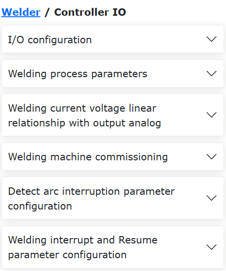

.. centered:: Abbildung 8.15‑6 Konfigurationsseite für das Schweißgerät

Die Schweißgerätekommunikation kann über IO-Kommunikation oder RS485-Kommunikation erfolgen. Klicken Sie auf "Initiale Einstellungen", "Peripherie", "Schweißgerät", um zur Konfigurations- und Verbindungsoberfläche zu gelangen. Hier können Module wie "Steuerungstyp", "Signal-IO-Zuordnung", "Schweißprozessparameter" und "Schweißgerätetest" konfiguriert werden.

Die Konfiguration des Schweißgeräts ist nicht der Schwerpunkt dieser Funktionsbeschreibung. Detaillierte Konfigurationen finden Sie im entsprechenden Abschnitt des Benutzerhandbuchs.

Kalibrierung des Werkzeugkoordinatensystems und des Lasersensor-Koordinatensystems
~~~~~~~~~~~~~~~~~~~~~~~~~~~~~~~~~~~~~~~~~~~~~~~~~~~~~~~~~~~~~~~~~~~~~~~~~~~~~~~~~~~~~~~~~~~~~~~~~~~~~~~~~~~~~~~~~~~~~~~~~~~~~~~~~~~~~

Nach der Montage des Schweißbrenners am Roboterflansch kalibrieren Sie die externen Parameter des Schweißbrenners und des Lasersensors:

.. figure:: robot_peripherals/247.png
   :align: center
   :width: 4in

.. centered:: Abbildung 8.15‑7 Konfigurationsseite für Werkzeugkoordinatensysteme

Klicken Sie auf "Initiale Einstellungen", "Basis", "Koordinatensysteme", "Werkzeug", um zur Seite für die Werkstückkoordinatensystem-Einstellung zu gelangen.

.. figure:: robot_peripherals/248.png
   :align: center
   :width: 4in

.. centered:: Abbildung 8.15‑8 Auswahl der 6-Punkt-Methode zur Kalibrierung des Schweißbrenners

Wählen Sie ein leeres Koordinatensystem aus. Wählen Sie den Werkzeugtyp "Werkzeug". Wählen Sie die 6-Punkt-Methode zur Kalibrierung des Schweißbrenner-Werkzeugs.

.. figure:: robot_peripherals/148.png
   :align: center
   :width: 4in

.. centered:: Abbildung 8.15‑9 Auswahl der 5-Punkt-Methode zur Kalibrierung des Lasersensors

Wählen Sie ein leeres Koordinatensystem aus. Wählen Sie den Werkzeugtyp "Sensor". Wählen Sie die 5-Punkt-Methode zur Kalibrierung des Lasersensors.

Die Kalibrierung des Werkzeugkoordinatensystems und des Lasersensor-Koordinatensystems ist nicht der Schwerpunkt dieser Funktionsbeschreibung. Detaillierte Kalibrierungsmethoden finden Sie im entsprechenden Abschnitt des Benutzerhandbuchs.

Funktion zur Laser-Punktverfolgung mit Erweiterungsachse
~~~~~~~~~~~~~~~~~~~~~~~~~~~~~~~~~~~~~~~~~~~~~~~~~~~~~~~~~~~~~~~~~~~~~~~~~~~~~~~~~~~~~~~

Es gibt zwei Methoden für die Laser-Punktverfolgung mit Erweiterungsachse: Bei der Methode mit transformierten Laserdaten wird die Tracking-Strategie "erst aufzeichnen, dann reproduzieren" ausgeführt. Bei der Methode mit nicht transformierten Laserdaten wird die Tracking-Strategie "gleichzeitig aufzeichnen und reproduzieren" ausgeführt.

Kalibrierung des Erweiterungsachsen-Koordinatensystems
+++++++++++++++++++++++++++++++++++++++++++++++++++++++++++++++++++++

Bei Verwendung des Erweiterungsachsen-Koordinatensystems zur Realisierung der synchronen Laser-Tracking-Bewegung von Erweiterungsachse und Roboter muss das Erweiterungsachsen-Koordinatensystem kalibriert werden.

.. centered:: Abbildung 8.15‑10 Seite zur Einstellung des Erweiterungsachsen-Koordinatensystems

Klicken Sie auf "Initiale Einstellungen" -> "Peripherie" -> "Erweiterungsachse", um zur Einstellungsoberfläche für das Erweiterungsachsen-Koordinatensystem zu gelangen. Wählen Sie die einzustellende Erweiterungsachsennummer aus, klicken Sie auf die Schaltfläche "Bearbeiten", wählen Sie "4-Positionierer mit einem Freiheitsgrad" und speichern Sie.

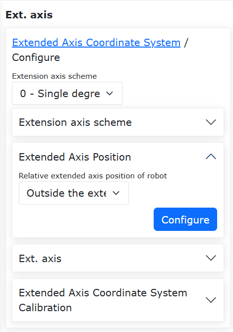

.. centered:: Abbildung 8.15‑11 Kalibrierungsseite für die Erweiterungsachse

Achten Sie bei der Kalibrierung der Erweiterungsachse darauf, die "Position des Roboters relativ zur Erweiterungsachse" als "außerhalb der Erweiterungsachse" zu wählen. Für den Fall eines Positionierers wählen Sie die 4-Punkt-Methode zur Kalibrierung.

Die Kalibrierung der Erweiterungsachse ist nicht der Schwerpunkt dieser Funktionsbeschreibung. Detaillierte Kalibrierungsmethoden finden Sie im entsprechenden Abschnitt des Benutzerhandbuchs.

Synchrone Laser-Tracking-Bewegung von Erweiterungsachse und Roboter
+++++++++++++++++++++++++++++++++++++++++++++++++++++++++++++++++++++++++++++++++++++++++++++++++++++++++++++++++++

Methode mit transformierten Laserdaten
********************************************************

Für das synchrone Laser-Tracking von Erweiterungsachse und Roboter im Basiskoordinatensystem ist keine Kalibrierung der externen Achse erforderlich. Die übrigen Funktionseinstellungen und der Aufbau sind identisch mit dem synchronen Tracking im Erweiterungsachsen-Koordinatensystem.

Konfigurieren Sie zuerst die Laser-Tracking-Daten. Stellen Sie die Daten des Laser-Trackers auf den Typ mit Transformation ein.

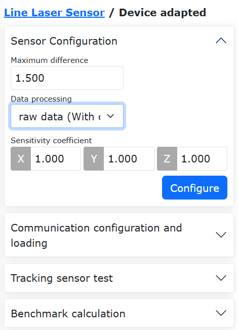

.. centered:: Abbildung 8.15‑12 Einstellen der Laserdaten auf Typ mit Transformation

Klicken Sie auf "Initiale Einstellungen", "Peripherie", "Tracking", "Sensor". Klicken Sie im Dropdown-Menü der Seite auf "Sensorkonfiguration". Stellen Sie "Datenverarbeitung" auf den Typ mit Transformation ein.

.. figure:: robot_peripherals/251.png
   :align: center
   :width: 6in

.. centered:: Abbildung 8.15‑13 Funktionsseite für Laser-Tracking

Diese Funktion wird durch eine Kombination mehrerer Module realisiert. Die Hauptfunktionsmodule sind in der Funktion "Laser-Tracking" enthalten. Klicken Sie auf "Teach-Programm" -> "Programmierung" -> "Laser-Tracking", um zur Laser-Tracking-Seite zu gelangen. Sie können auch auf "Laseraufzeichnung" klicken, um direkt zur Aufzeichnungsseite zu gelangen.

.. figure:: robot_peripherals/252.png
   :align: center
   :width: 6in

.. centered:: Abbildung 8.15‑14 Befehl zum Starten der Laser-Datenaufzeichnung hinzufügen

Fügen Sie den Befehl zum Starten der Laser-Datenaufzeichnung hinzu, nachdem sich die Erweiterungsachse zum Schweißstartpunkt bewegt hat.

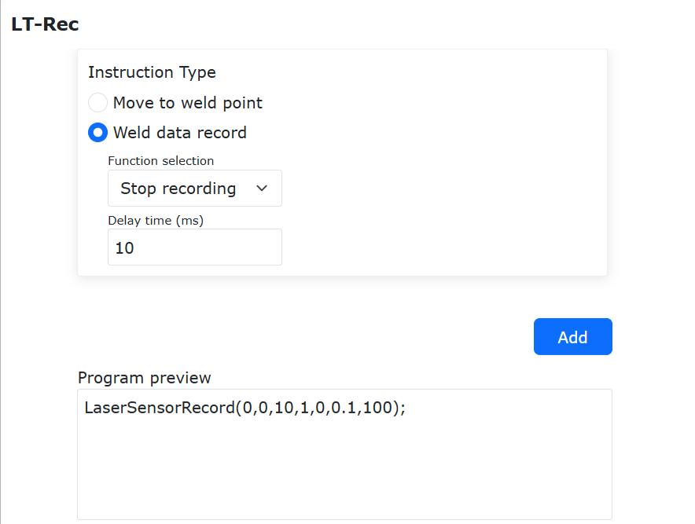

.. centered:: Abbildung 8.15‑15 Befehl zum Beenden der Laser-Datenaufzeichnung hinzufügen

Fügen Sie den Befehl zum Stoppen der Laser-Datenaufzeichnung hinzu, nachdem sich die Erweiterungsachse zum Schweißendpunkt bewegt hat.

Nachdem der Roboter an Ort und Stelle die Bewegungsbahn der Schweißnaht während der Bewegung der Erweiterungsachse aufgezeichnet hat, kann die Erweiterungsachse zum Schweißstartpunkt zurückkehren, um mit dem synchronen Tracking-Schweißen zu beginnen.

Zu Beginn des Schweißens muss der Schweißbrenner zum Startpunkt der vom Lasersensor aufgezeichneten Daten bewegt werden. Fügen Sie den Befehl zum Bewegen zum Schweißpunkt hinzu:

.. figure:: robot_peripherals/254.png
   :align: center
   :width: 6in

.. centered:: Abbildung 8.15‑16 Befehl zum Bewegen zum Schweißpunkt hinzufügen

Klicken Sie auf "Teach-Programm -> "Programmierung" -> "Laseraufzeichnung". Wählen Sie "Bewegung zum Schweißpunkt". Stellen Sie Bewegungsart und Bewegungsgeschwindigkeit ein. Klicken Sie auf die Schaltfläche "Startpunkt" und wenden Sie an.

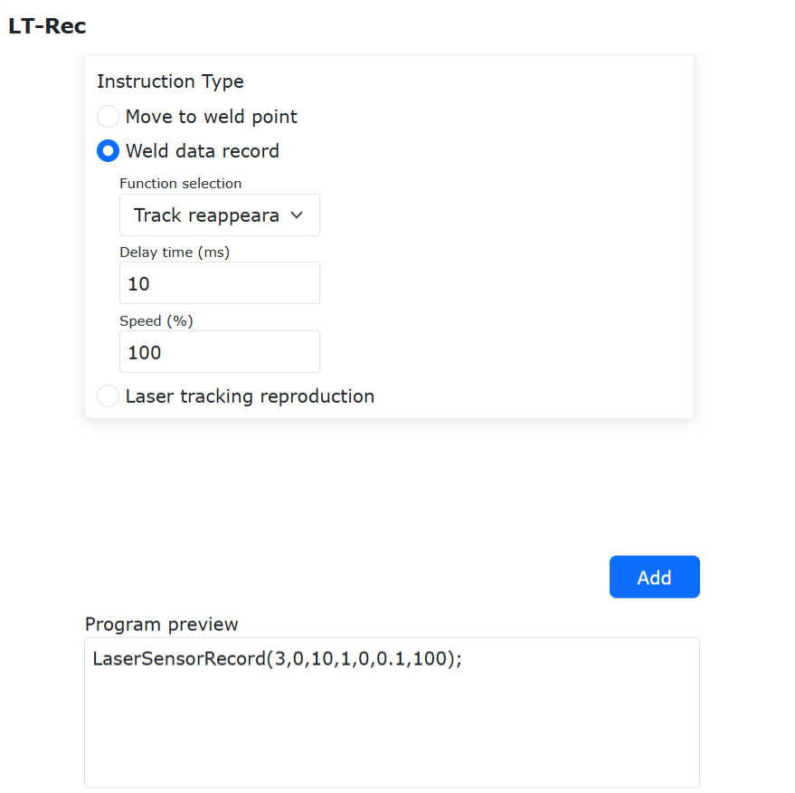

.. centered:: Abbildung 8.15‑17 Befehl zum Reproduzieren der aufgezeichneten Laser-Datenbahn hinzufügen

Wählen Sie auf der Seite "Laser-Tracking" den Befehl "Datenaufzeichnung" -> "Bahnreproduktion". Klicken Sie auf "Hinzufügen" und wenden Sie an. Im Befehl ist die Wartezeit standardmäßig 0 ms. Die Geschwindigkeit ist das Verhältnis der Reproduktionsgeschwindigkeit zur Aufzeichnungsgeschwindigkeit. Es wird empfohlen, > 50 % zu wählen.

Fügen Sie nach dem Befehl "Bahnreproduktion" einen Bewegungsbefehl für die Erweiterungsachse hinzu, um die synchrone Laser-Tracking-Bewegung von Erweiterungsachse und Roboter zu realisieren.

Das Folgende ist ein typisches LUA-Programm für die Laser-Punktverfolgung mit Erweiterungsachse:

.. figure:: robot_peripherals/256.png
   :align: center
   :width: 4in

.. centered:: Abbildung 8.15‑18 Beispielprogramm für Punktverfolgung mit Erweiterungsachse und transformierten Laserdaten

Der Roboter führt den Ablauf "erst aufzeichnen, dann reproduzieren" aus. Zuerst wird die Veränderung der Werkstückschweißnaht während der Bewegung der Erweiterungsachse aufgezeichnet. Beim Schweißen führen dann Erweiterungsachse und Bahnreproduktion synchron aus.

Methode mit nicht transformierten Laserdaten
********************************************************

Bei der Verwendung der Methode mit nicht transformierten Laserdaten für die Punktverfolgung ist keine Kalibrierung des Erweiterungsachsen-Koordinatensystems erforderlich.

Stellen Sie die Daten des Laser-Tracking-Sensors auf den Typ ohne Transformation ein.

.. figure:: robot_peripherals/257.png
   :align: center
   :width: 4in

.. centered:: Abbildung 8.15‑19 Einstellen der Laserdaten auf Typ ohne Transformation

Klicken Sie auf "Initiale Einstellungen" -> "Peripherie" -> "Linienlasersensor". Klicken Sie im Dropdown-Menü der Seite auf "Sensorkonfiguration". Stellen Sie "Datenverarbeitung" auf den Typ ohne Transformation ein.

.. figure:: robot_peripherals/251.png
   :align: center
   :width: 6in

.. centered:: Abbildung 8.15‑20 Funktionsseite für Laser-Tracking

Klicken Sie auf "Teach-Programm" -> "Programmierung" -> "Laser-Tracking", um zur Laser-Tracking-Seite zu gelangen. Sie können auch auf "Laseraufzeichnung" klicken, um direkt zur Aufzeichnungsseite zu gelangen.

.. figure:: robot_peripherals/258.png
   :align: center
   :width: 6in

.. centered:: Abbildung 8.15‑21 Befehl "Gleichzeitig aufzeichnen und reproduzieren" hinzufügen

Wählen Sie auf der Seite "Laseraufzeichnung" den Befehl "Gleichzeitig aufzeichnen und reproduzieren". Klicken Sie auf "Hinzufügen" und wenden Sie an. Im Befehl kann zwischen "Verzögerungszeit" oder "Verzögerungsstrecke" gewählt werden (Strecke wird empfohlen). Der Kompensationsempfindlichkeitskoeffizient wird basierend auf den tatsächlichen Sensordaten angepasst. Je niedriger der Wert, desto geringer die Empfindlichkeit der Anpassung und desto besser die Störfestigkeit. Die Reproduktionsgeschwindigkeit ist standardmäßig 100 %.

Fügen Sie nach dem Befehl "Gleichzeitig aufzeichnen und reproduzieren" einen Bewegungsbefehl für die Erweiterungsachse hinzu, um die synchrone Laser-Tracking-Bewegung von Erweiterungsachse und Roboter zu realisieren.

Das Folgende ist ein typisches LUA-Programm für die Laser-Punktverfolgung mit Erweiterungsachse und nicht transformierten Laserdaten:

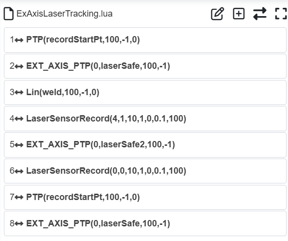

.. centered:: Abbildung 8.15‑22 Beispielprogramm für Punktverfolgung mit Erweiterungsachse und nicht transformierten Laserdaten

Nachdem der Schweißbrenner auf den Versatz zum vorgelagerten Laser ausgerichtet wurde, bewegt sich die Roboter-Erweiterungsachse und führt den Ablauf "gleichzeitig aufzeichnen und reproduzieren" aus. Der vorgelagerte Laser-Tracker zeichnet zuerst die Veränderung der Werkstückschweißnaht während der Bewegung der Erweiterungsachse auf und passt sie nach einer eingestellten Verzögerungsstrecke oder -zeit am Schweißbrenner an.

Funktion zum Abrufen der Position von Laser-Suchpunkten
-----------------------------------------------------------

Systemaufbau zum Abrufen der Position von Laser-Suchpunkten
~~~~~~~~~~~~~~~~~~~~~~~~~~~~~~~~~~~~~~~~~~~~~~~~~~~~~~~~~~~~~~~~~~~~~~~~~~~~~~~~~~~~~~~~~~~~~~~~~~~~~~~~~~~~~~~~~~~~~~~~~~~~~

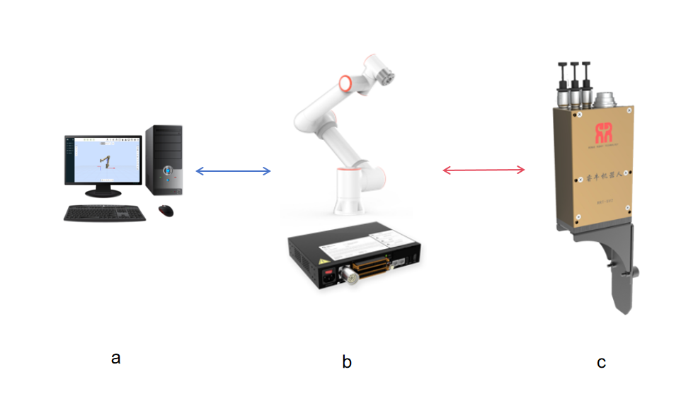

.. centered:: Abbildung 8.16‑1 Topologie des Systems zum Abrufen der Position von Laser-Suchpunkten
.. centered:: Im System ist (a) der Computer, (b) der Roboter und sein Steuerschrank und (c) der Lasersensor.

Lasersensor-Kommunikationskonfiguration
~~~~~~~~~~~~~~~~~~~~~~~~~~~~~~~~~~~~~~~~~~~~~~~~~~~~~~~~~~~~~~~~

Öffnen Sie die WebApp und klicken Sie nacheinander auf "Initiale Einstellungen" -> "Peripherie" -> "Linienlasersensor", um die Sensorkommunikation zu konfigurieren.

.. figure:: robot_peripherals/245.png
   :align: center
   :width: 4in

.. centered:: Abbildung 8.16‑2 Sensorkommunikationskonfiguration

Funktion zum Abrufen der Position von Laser-Suchpunkten
~~~~~~~~~~~~~~~~~~~~~~~~~~~~~~~~~~~~~~~~~~~~~~~~~~~~~~~~~~~~~~~~~~~~~~~~~~~~~~~~

Der Ablauf zum Abrufen der Position von Laser-Suchpunkten ist wie folgt:

**Schritt 1**: Legen Sie vor der Laser-Positionssuche zuerst die Suchstartpunkte "seamStartPt1", "seamStartPt2" fest. Klicken Sie dann auf "Teach-Programm", "Programmierung". Wählen Sie "Punkt-zu-Punkt". Bringen Sie den Laserstrahl des Sensors in die Nähe des Suchstartpunkts 1 "seamStartPt1" in der Nähe des Schweißnaht-1-Startpunkts.

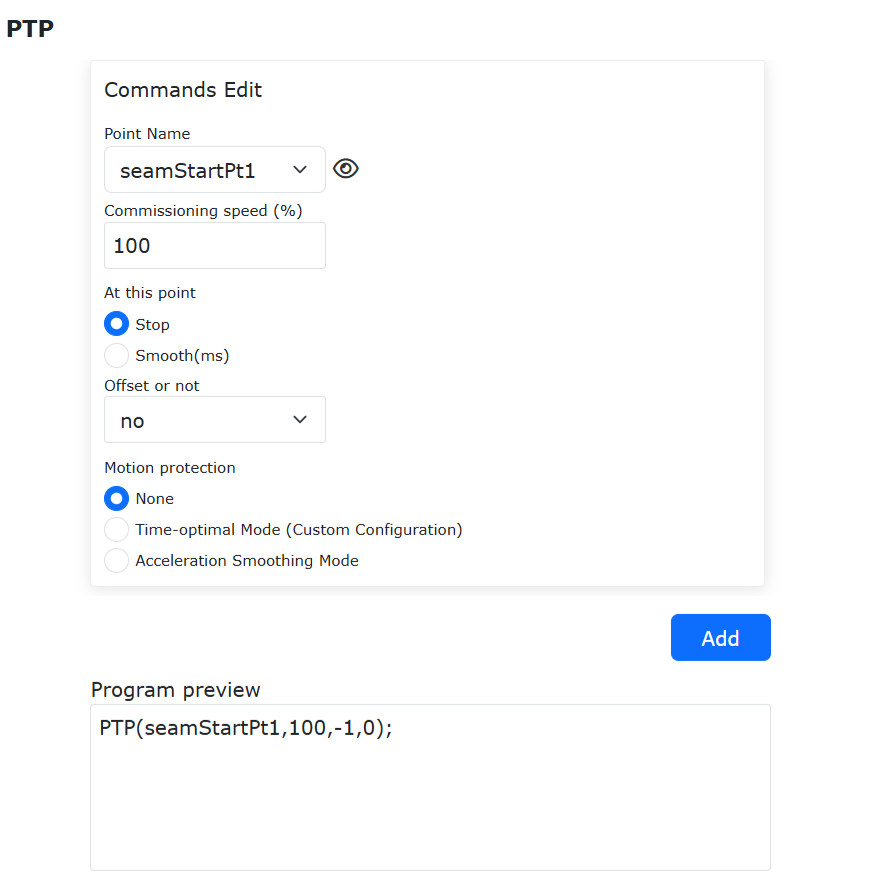

.. centered:: Abbildung 8.16‑3 Befehl zum Bewegen zum Suchstartpunkt 1 hinzufügen

**Schritt 2**: Klicken Sie im Befehlstyp auf "Positionssuche starten". Wählen Sie das kalibrierte Sensor-Koordinatensystem aus. Stellen Sie Suchrichtung, Geschwindigkeit, Länge und maximale Suchzeit ein. Klicken Sie auf die Schaltfläche "Hinzufügen". Klicken Sie dann auf "Positionssuche beenden" und auf die Schaltfläche "Hinzufügen".

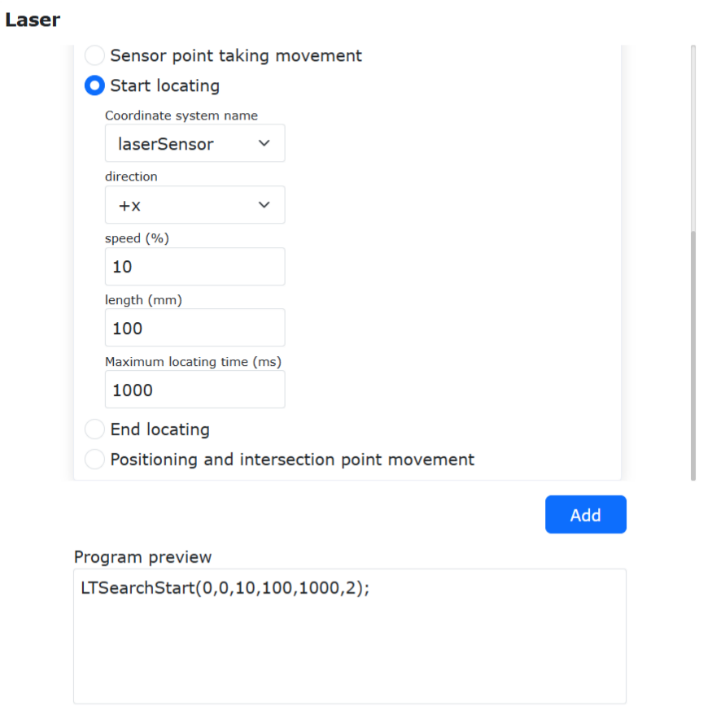

.. centered:: Abbildung 8.16‑4 Befehl zum Starten der Positionssuche hinzufügen

**Schritt 3**: Wählen Sie "Sensorpunktanfahrt". Wählen Sie als Koordinatensystemname das kalibrierte "Lasersensor". Wählen Sie als Bewegungsart "PTP" oder "LIN". Stellen Sie die Testgeschwindigkeit ein und wählen Sie, ob die Pose konfiguriert werden soll ("Pose konfigurieren?"). Klicken Sie auf die Schaltfläche "Hinzufügen". Klicken Sie auf die Schaltfläche "Anwenden", um es zum LUA-Programm hinzuzufügen.

.. figure:: robot_peripherals/263.png
   :align: center
   :width: 6in

.. centered:: Abbildung 8.16‑5 Befehl für Sensorpunktanfahrt hinzufügen

**Schritt 4**: Klicken Sie auf der Oberfläche "Programmierung" auf die Schaltfläche "Modus wechseln". Ändern Sie die Variable "pos" in "pos1". Löschen Sie den Befehl zum Bewegen zum Suchpunkt.

.. figure:: robot_peripherals/264.png
   :align: center
   :width: 4in

.. centered:: Abbildung 8.16‑6 Moduswechsel in der Programmierung

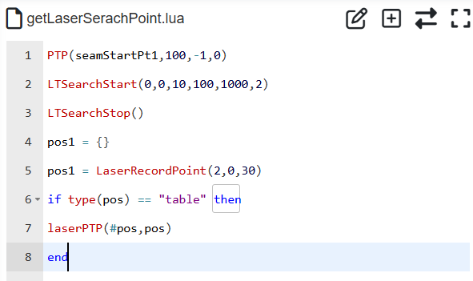

.. centered:: Abbildung 8.16‑7 Ändern des Programms zum Abrufen des Laser-Suchpunkts

**Schritt 5**: Führen Sie die Schritte 1-4 für die zweite Schweißnaht durch, um die Position des Laser-Suchpunkts abzurufen.

.. figure:: robot_peripherals/266.png
   :align: center
   :width: 4in

.. centered:: Abbildung 8.16‑8 Abrufen des Suchpunkts für die zweite Schweißnaht

Anwendung des DARU DFC Kraftregelungs-Schleifkopfs
-----------------------------------------------------------

Überblick
~~~~~~~~~~~~~~~~~~~~~~~~~~~~~~~~~~~~~~~~~~~~~~~~~

Die Montage eines DFC-Schleifkopfs am Roboterflansch ermöglicht eine schnelle Einrichtung von Schleif-, Polier- und Entgratungsanwendungen in verschiedenen Szenarien. Die Kraftregelungsstärke kann je nach Größe und Form des Werkstücks angepasst werden, was die Genauigkeit und Effektivität der Schleifarbeit verbessert.

Hardware-Beschreibung
+++++++++++++++++++++++++++++++++++++++++++++
Der kollaborative Roboter kommuniziert und steuert den DARU DFC-Schleifkopf über Ethernet. Auf der WebApp wird das Kommunikationsprotokoll für den DARU DFC-Schleifkopf generiert. Das Protokoll sendet die Steuerdaten per TCP/IP an das DARU-Kraftregelungs-Controllermodul. Das Modul sendet die empfangenen Steuerdaten dann an den DFC-Kraftregelungsaktor und realisiert so die Steuerung des Schleifkopfs. Das Kraftregelungs-Controllermodul fungiert als Server für die Ethernet-Kommunikation und kann zwei Kanäle von Schleifkopfaktoren verbinden.

.. figure:: robot_peripherals/267.png
   :align: center
   :width: 6in

.. centered:: Abbildung 8.17‑1 Anwendung des DARU DFC-Schleifkopfs mit kollaborativem Roboter

Das Kraftregelungs-Controllermodul muss wie folgt konfiguriert werden: Die Ethernet-Seite wird mit der IP-Adresse 192.168.58.88 und dem Port 2000 konfiguriert.

Funktionskonfiguration
~~~~~~~~~~~~~~~~~~~~~~~~~~~~~~~~~~~~~~~~~~~~~~~~
Öffnen Sie die WebApp und klicken Sie nacheinander auf "Initiale Einstellungen", "Peripherie", "Schleifen". Es gibt zwei Steuerungstypen für den Schleifkopf: "Bereits angepasste Geräte" und "Offenes Peripherieprotokoll":
**Bereits angepasste Geräte**: Für bereits angepasste Schleifkopftypen wird automatisch ein offenes Protokoll generiert und geladen. Der Benutzer muss kein Protokoll schreiben.
**Offenes Peripherieprotokoll**: Der Benutzer schreibt ein offenes Protokoll in Lua für den anzupassenden Schleifkopf, um die Kommunikationssteuerung zu realisieren.

.. figure:: robot_peripherals/268.png
   :align: center
   :width: 6in

.. centered:: Abbildung 8.17‑2 Steuerungstypen für Schleifen

Konfiguration bereits angepasster Geräte
+++++++++++++++++++++++++++++++++++++++++++++++++++++++

Öffnen Sie die WebApp und klicken Sie nacheinander auf "Initiale Einstellungen", "Peripherie", "Schleifkopf", "Bereits angepasste Geräte". Wählen Sie im Gerätestatus den Typ "DARU DFC Schleifkopf". Klicken Sie auf "Konfigurieren". Das eingebettete offene Peripherieprotokoll "CtrlDev_DARUDFCPOLISH.lua" wird automatisch geladen.

.. figure:: robot_peripherals/269.png
   :align: center
   :width: 6in

.. centered:: Abbildung 8.17‑3 Automatisches Laden des offenen Peripherieprotokolls für DARU DFC Geräte

Stellen Sie sicher, dass die Hardware-Verbindung korrekt hergestellt ist. Starten Sie dann das offene Protokoll. Wenn der Betriebsstatus grün ist und der Kommunikationsstatus in der rechten Statusrückmeldungsleiste "Polish" als "Verbindung hergestellt" anzeigt, wurde die Kommunikation zwischen Roboter und Schleifkopf-Controller erfolgreich hergestellt. Über die Parametereinstellung können Sie nun den Schleifkopfkanal, für den die Kraftregelung eingestellt werden soll, und die gewünschte Kraft konfigurieren. Das offene Protokoll sendet zyklisch die eingestellten Werte, den Kanal und die aktuellen rx-, ry-, rz-Werte des Roboters an den Schleifkopf, wie in Abbildung 2-3 gezeigt. Darüber hinaus zeigt die Polish-Statusrückmeldung in Echtzeit den vom Schleifkopf zurückgemeldeten Kraftregelungswert und Warnungen bei Kraftüberschreitung an. Bei einer Warnung erscheint auch oben rechts auf der Seite ein Alarmhinweis, wie in Abbildung 2-4 gezeigt.

.. figure:: robot_peripherals/270.png
   :align: center
   :width: 6in

.. centered:: Abbildung 8.17‑4 Seiteneinstellungen und Statusrückmeldung für DFC-Schleifkopf

.. figure:: robot_peripherals/271.png
   :align: center
   :width: 6in

.. centered:: Abbildung 8.17‑5 Alarm bei Kraftüberschreitung des DFC-Schleifkopfs

Download des offenen Peripherieprotokolls
+++++++++++++++++++++++++++++++++++++++++++++++++++++++

Klicken Sie im Bereich "Offenes Peripherieprotokoll" auf die Schaltfläche "Herunterladen", um das Protokoll auf den lokalen Computer herunterzuladen. Das offene Peripherieprotokoll ist ein zyklisch ausgeführtes LUA-Programm, das in jedem Zyklus die folgenden Schritte ausführt:

① Lesen der Steuerdaten des DFC-Schleifkopfs aus dem Roboter.
② Schreiben der Steuerdaten über einen Socket an den DFC-Schleifkopf.
③ Lesen der Statusdaten über einen Socket vom DFC-Schleifkopf.
④ Rückmeldung der DFC-Schleifkopf-Statusdaten an den Roboter.

Durch die zyklische Ausführung des Kommunikationsprotokolls wird die Kommunikationssteuerung zwischen Roboter und Schleifkopf realisiert. Im Kommunikationsprotokoll können der Zyklus, der zu verbindende Server-Port und die IP-Adresse benutzerdefiniert angepasst werden.

Im Folgenden finden Sie ein Beispiel für den Code des DARU DFC-Schleifkopf-Kommunikationsprotokolls:

.. code-block:: lua
    :linenos:

    local id = 1
    local ctrlValues = {0,0, 0,0, 0,0, 0,0}
    local realTimeState = {0,0, 0,0, 0,0, 0,0}
    socket1 = TCPClientConnect('192.168.58.88', 2000, 500, 10, 2, 3)
    sleepCnt = 100
    while(sleepCnt > 0) do
        local stopFlag = GetOpenLUAStopFlag(id)
        if(stopFlag ~= 0) then
          TCPClientDisconnect(socket1)
          setDFCPolishRealtimeState(0, 0, 0)
          break
        end
      sleepCnt = sleepCnt -1
      sleep_ms(50)
    end
    local cnt = 5
    while(1) do
        channel, force = getDFCPolishSet()
        comState, sendBuff = DFCPolishInput(socket1, channel, force)
        sleep_ms(50)

        byte, error, forceFeedback = DFCPolishOutput(socket1)
        setDFCPolishRealtimeState(comState, error, forceFeedback)
        sleep_ms(50)

      if(comState == 0) then
          TCPClientDisconnect(socket1)
          while(cnt > 0) do
            socket1 = TCPClientConnect('192.168.58.88', 2000, 500, 10, 2, 3)
            cnt = cnt - 1
            if(socket1 > 0)then
              break
            end
          end
      end

        local stopFlag = GetOpenLUAStopFlag(id)
        if(stopFlag ~= 0 or cnt == 0) then
          TCPClientDisconnect(socket1)
          setDFCPolishRealtimeState(0, 0, 0)
          break
        end
    end

Anwendung von LUA-Programmen für DFC-Schleifkopf
~~~~~~~~~~~~~~~~~~~~~~~~~~~~~~~~~~~~~~~~~~~~~~~~~~~~~~~~~~~~~~~~~~~~~~~~~~~~~~~~

Durch Hinzufügen von Befehlen zur DFC-Kraftregelungskonfiguration, Kanalumschaltung und Statusabfrage in Roboter-LUA-Programmen können in Verbindung mit Roboter-Bewegungsbefehlen flexible und bequeme Schleifanwendungen realisiert werden.
Öffnen Sie die WebApp und klicken Sie nacheinander auf "Teach-Programm", "Programmierung". Erstellen Sie ein neues LUA-Programm "testDFC.lua".

.. figure:: robot_peripherals/272.png
   :align: center
   :width: 6in

.. centered:: Abbildung 8.17‑6 Neues Programm "testDFC.lua" erstellen

Wählen Sie den Befehlstyp "Peripheriebefehle". Klicken Sie in den Peripheriebefehlen auf die Schaltfläche "Schleifgerät". Daraufhin erscheint auf der rechten Seite der WebApp die Seite zum Hinzufügen von "Polish"-Schleifbefehlen. Wählen Sie als Gerätetyp "DARU DFC Schleifkopf".

.. figure:: robot_peripherals/273.png
   :align: center
   :width: 6in

.. centered:: Abbildung 8.17‑7 Seite zum Hinzufügen von Schleifkopfbefehlen

Hinzufügen von Schleifkopf-Steuerbefehlen
++++++++++++++++++++++++++++++++++++++++++++++++++++++++++++++++++++

Durch das Schreiben von Schleifkopf-Steuerbefehlen im LUA-Programm können die Kraftregelungseinstellungen und die Kanalauswahl für den DFC realisiert werden.

Klicken Sie auf der Seite zum Hinzufügen von Schleifgerätebefehlen auf "DFC einstellen". Wählen Sie den Schleifkopf-Kanalmodus "2". Stellen Sie die Kraft auf "10" ein. Klicken Sie auf die Schaltfläche "Hinzufügen". Daraufhin wird in der "Programmvorschau" ein Schleifkopf-Einstellbefehl hinzugefügt.

.. figure:: robot_peripherals/274.png
   :align: center
   :width: 6in

.. centered:: Abbildung 8.17‑8 Schleifkopf-Steuerbefehl hinzufügen

Hinzufügen von Befehlen zum Abrufen des Schleifkopfstatus
++++++++++++++++++++++++++++++++++++++++++++++++++++++++++++++++++++++++++++++++++++++++++

Klicken Sie auf "DFC-Daten abrufen". Klicken Sie nacheinander auf die Schaltflächen "Hinzufügen" und "Anwenden". Dadurch wird in "testDFC.lua" ein Befehl zum Abrufen der Schleifkopf-Daten hinzugefügt: "GetDFCState()".

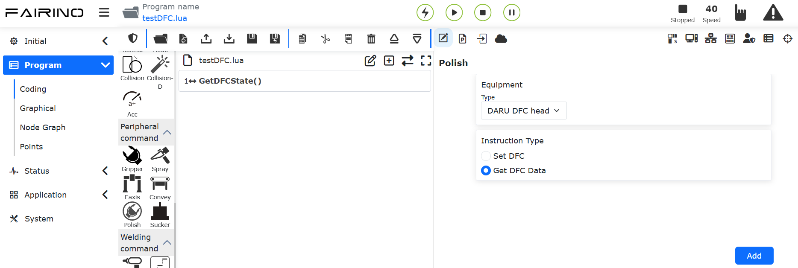

.. centered:: Abbildung 8.17‑9 Befehl zum Abrufen des Schleifkopfstatus hinzufügen

Der Befehl `GetDFCState()` gibt zwei Werte zurück, wie folgt:

**DFCwarn**: Warnung bei Kraftüberschreitung: 0 - normal, 1 - Alarm.
**force**: Rückgemeldeter Kraftwert.

Verwenden Sie in "testDFC.lua" zwei Variablen, um die Rückgabewerte der `GetDFCState()`-Funktion zu empfangen. Zeigen Sie diese Informationen über die LUA-Variablenabfrage im Anzeigebereich der WebApp-Variablenabfrage an.

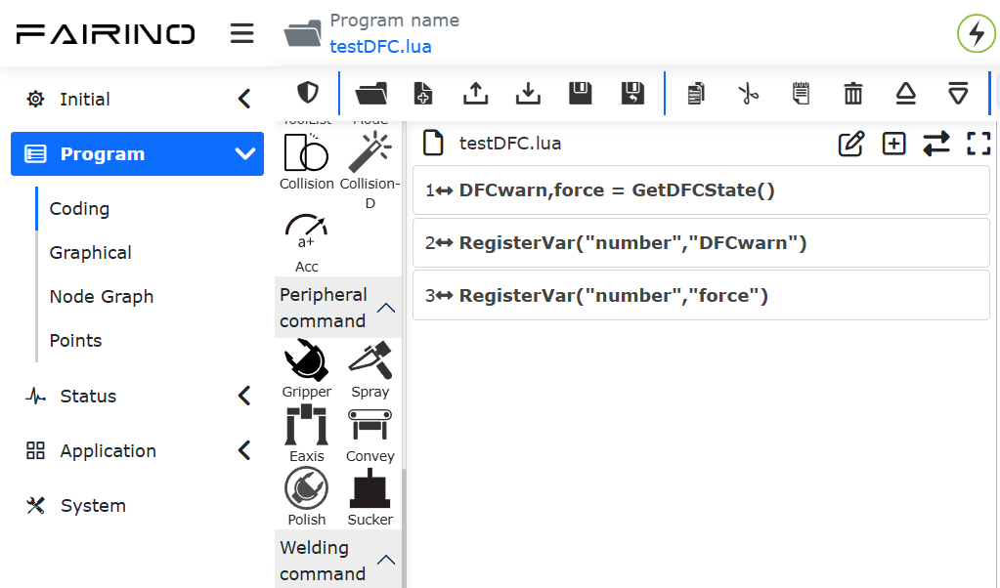

.. centered:: Abbildung 8.17‑10 Programm zum Abrufen des Schleifkopfstatus

Anwendungsbeispiel
+++++++++++++++++++++++++++++++++++++++++++++++++++++++

Das Folgende ist ein Beispiel für ein LUA-Programm zur Steuerung und Überwachung des DFC-Schleifkopfs:

.. code-block:: lua
    :linenos:

    SetDFCForce(0,25)
    while (1) do
        PTP(c1,100,-1,0)
        SetDO(0,1,0,0)
        ARC(c2,0,0,0,0,0,0,0,c3,0,0,0,0,0,0,0,100,-1,0,100,200)
        DFCwarn,force = GetDFCState()
        RegisterVar("number","DFCwarn")
        RegisterVar("number","force")
        if(DFCwarn == 1) then
            PTP(safe,100,-1,0)
            break
        else
            PTP(p6,100,-1,0)
        end
        SetDO(0,0,0,0)
    end

Endeffektor-Transparentübertragungsfunktion
----------------------------------------------------------

Überblick
~~~~~~~~~~~~~~~~~~~~~~~~~~~~~~
Benutzer können die Endeffektor-Transparentübertragungsfunktion konfigurieren, um auf Basis des offenen Protokolls für Endeffektor-Peripheriegeräte + CNDE + SDK-Schnittstelle eine azyklische Datenübertragung und den Empfang sowie die zyklische Datenerfassung für beliebige Endeffektor-Peripheriegeräte zu ermöglichen. Für zyklische Daten muss ein Endeffektor-Lua-Open-Protokoll geschrieben und die Anwendung auf den Endeffektor hochgeladen werden, um eine zyklische Interaktion und Auslesung mit dem Peripheriegerät zu erreichen. Die zyklischen Rückmeldedaten des Peripheriegeräts werden über die CNDE-Konfiguration abgerufen, während azyklische Daten über die SDK-Schnittstelle als Datenrahmen gesendet und empfangen werden.

Anwendungshinweise
~~~~~~~~~~~~~~~~~~~~~~~~~~~~~~~~~~~~~~~~~~~~~~~~~~~~~~~~~~~~~~~~~~~~~~~~~~

**Schritt 1**: Öffnen Sie die Roboterseite und wählen Sie "Grundeinstellungen" -> "Peripheriegeräte" -> "Endeffektor-Transparentübertragung". Laden Sie das Endeffektor-Lua-Open-Protokoll hoch, das an das Peripheriegerät angepasst werden soll, und wenden Sie es an.

.. figure:: robot_peripherals/289.png
   :align: center
   :width: 6in

.. centered:: Abbildung 8.18‑1 Hochladen des Endeffektor-Transparentübertragungsprotokolls

**Schritt 2**: Aktivieren Sie nach dem Neustart des Roboters die Schaltfläche "Endeffektor-Protokoll aktivieren", um diese Funktion zu aktivieren. Es ist zu beachten, dass nach der Aktivierung dieser Funktion andere angepasste Endeffektor-Geräte nicht gleichzeitig verwendet werden können.

.. figure:: robot_peripherals/290.png
   :align: center
   :width: 4in

.. centered:: Abbildung 8.18‑2 Aktivierung des Endeffektor-Transparentübertragungsprotokolls

**Schritt 3**: Öffnen Sie die Roboterseite und wählen Sie "Teach-Programm" -> "Peripheriegeräte-Befehle" -> "Endeffektor-Transparentübertragung". Nach der Aktivierung der Endeffektor-Transparentübertragung können Sie über die Lua-Schnittstelle Debugging-Tests für den Empfang und die Übertragung von azyklischen Daten sowie die Erfassung von zyklischen Daten durchführen. Die tatsächliche Verwendung erfordert die Kombination mit der CNDE-Funktion des Roboters und dem SDK. Die Länge der gesendeten und empfangenen azyklischen Befehlsdaten beträgt maximal 16 Byte, zyklische Daten maximal 128 Byte.

.. figure:: robot_peripherals/291.png
   :align: center
   :width: 6in

.. centered:: Abbildung 8.18‑3 Lua-Schnittstelle für azyklische Daten der Endeffektor-Transparentübertragung

.. figure:: robot_peripherals/292.png
   :align: center
   :width: 6in

.. centered:: Abbildung 8.18‑4 Lua-Schnittstelle für zyklische Daten der Endeffektor-Transparentübertragung

Lua-Skript für die Endeffektor-Transparentübertragungsfunktion
~~~~~~~~~~~~~~~~~~~~~~~~~~~~~~~~~~~~~~~~~~~~~~~~~~~~~~~~~~~~~~

Überblick
++++++++++++++++++++++++

Die Lua-Open-Protokollfunktion wurde um eine allgemeine Daten-Transparentübertragungsschnittstelle erweitert. Lua-Skripte werden gemäß der vereinbarten Lua C-Schnittstelle geschrieben und zusammen mit CNDE verwendet, um die Datenübertragung und den Datenempfang für Endeffektor-montierte Geräte zu ermöglichen.

Hinweise zum Schreiben von Endeffektor-Lua-Skripten
++++++++++++++++++++++++++++++++++++++++++++++++++++++++++++++++++++++++

Lua C-registrierte Funktionen für Rs485-Senden und -Empfangen
*********************************************************************
(1) Lua C-registrierte Funktion für Rs485-Senden: EndTxCustomData(). Diese Funktion sendet Befehle über Rs485 an das montierte Gerät.

.. code-block:: 
    :linenos:

    Tcmd={0}
    EndTxCustomData(Tcmd)

.. centered:: Code 8.18-1 Lua-Skript-Beschreibung

(2) Lua C-registrierte Funktion für Rs485-Empfangen: EndRxCustomData(). Diese Funktion empfängt Antwortbefehle vom montierten Gerät über Rs485-Rückmeldung.

.. code-block:: 
    :linenos:

    Rcmd={0}
    EndRxCustomData(Rcmd)

.. centered:: Code 8.18-2 Lua-Skript-Beschreibung

Lua C-registrierte Funktionen für azyklische Datenübertragung und -rückmeldung
***********************************************************************************

(1) Lua C-registrierte Funktion für azyklische Datenübertragung: GetHostTransparentCmd(). Diese Funktion prüft, ob der Controller einen azyklischen Datenbefehl ausgegeben hat. Wenn ein Befehl ausgegeben wurde, ruft sie den azyklischen Datenbefehl ab. Die Länge der azyklischen Datenbefehlsübertragung beträgt maximal 16 Byte.

.. code-block:: 
    :linenos:

    Tcmd={0}
    RxFlag=0
    RxFlag = GetHostTransparentCmd(Tcmd)
    if(RxFlag == 1)then
    EndTxCustomData(Tcmd)

.. centered:: Code 8.18-3 Lua-Skript-Beschreibung

(2) Lua C-registrierte Funktion für azyklische Datenbefehlsrückmeldung: BackHostTransparentCmd(). Diese Funktion überträgt den vom montierten Gerät zurückgemeldeten azyklischen Datenbefehl transparent an den Controller. Die Länge des azyklischen Datenbefehlsempfangs beträgt maximal 16 Byte.

.. code-block:: 
    :linenos:

    Rcmd={0}
    EndRxCustomData(Rcmd)
    BackHostTransparentCmd(Rcmd)

.. centered:: Code 8.18-4 Lua-Skript-Beschreibung

Lua C-registrierte Funktion für zyklische Datenrückmeldung
*********************************************************************

(1) Lua C-registrierte Funktion für zyklische Datenrückmeldung: SetDWrodInputBack(). Diese Funktion überträgt die vom montierten Gerät ausgelesenen zyklischen Daten transparent an den Controller. Die zyklische Datenrückmeldung umfasst maximal 128 Byte.

.. code-block:: 
    :linenos:

    R = {0}
    TotalNum =0
    PacketNum=0
    TotalNum,PacketNum=SetDWrodInputBack(R)

.. centered:: Code 8.18-5 Lua-Skript-Beschreibung

Lua-Skript, geschrieben am Beispiel des DIO Health Care Moxibustion-Kopfes
***********************************************************************************

.. code-block:: 
    :linenos:

    --***
    --Aufrechterhaltung des normalen Betriebs anderer Endfunktionen
    while(1)
    do
    IwdgTaskHandle()
    MainLoop()
    UpDownLoadHandle()
    SdoRwPara()
    EndErrClear()
    local BFlag=LuaBreak()
    if(BFlag==1)then
    break
    end
    --***
    --***
    --Beispiel für azyklische Datenübertragung
    Rcmd = {0}       --Speichert die vom montierten Gerät zurückgemeldeten azyklischen Daten
    Tcmd = {0}       --Speichert die vom Controller ausgegebenen azyklischen Daten
    RxFlag=0         --Flag, ob der Controller einen Befehl ausgegeben hat
    RxFlag = GetHostTransparentCmd(Tcmd)
    if(RxFlag == 1)then
    EndTxCustomData(Tcmd)
    DelayMs(35)
    EndRxCustomData(Rcmd)
    if((#Rcmd) > 1))and(R[1]==0xAB)and(R[2]==0xBA)) then
    BackHostTransparentCmd(Rcmd)
    end
    end
    --***
    --***
    --Beispiel für zyklische Datenübertragung
    R = {0}          --Speichert die vom montierten Gerät zurückgemeldeten zyklischen Daten
    T = {0xAB,0xBA,0x14,0x01,0xAA,0x24}     --Befehl zum Abfragen zyklischer Daten vom montierten Gerät
    if TotalNum==0 then
    EndTxCustomData(T)
    DelayMs(35)
    EndRxCustomData(R)
    end
    TotalNum =0      --Bei zyklischen Daten, die eine Paketaufteilung erfordern, Gesamtanzahl der Pakete
    PacketNum=0     --Aktuelle Paketsequenznummer
    if((#R==19)and(R[1]==0xAB)and(R[2]==0xBA)and(R[3]==0x14)and(R[4]==0x0E))then
    TotalNum,PacketNum=SetDWrodInputBack(R)
    if PacketNum>TotalNum then
    PacketNum=0
    TotalNum=0
    end
    end
    --***
    LuaGc()
    end