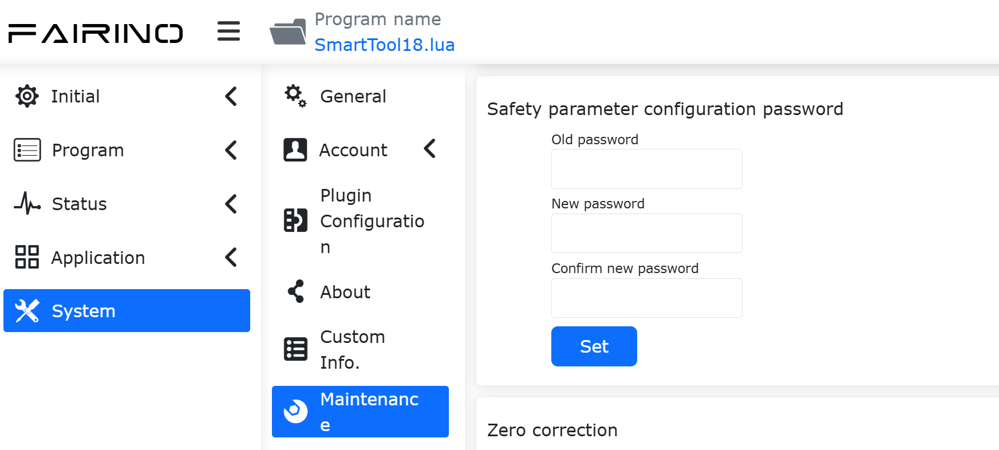
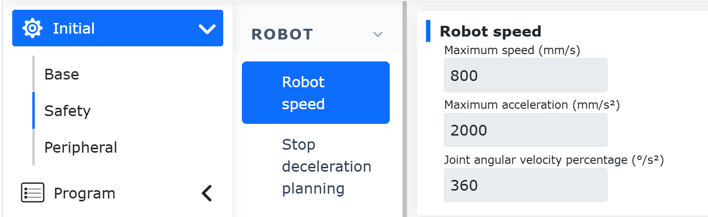
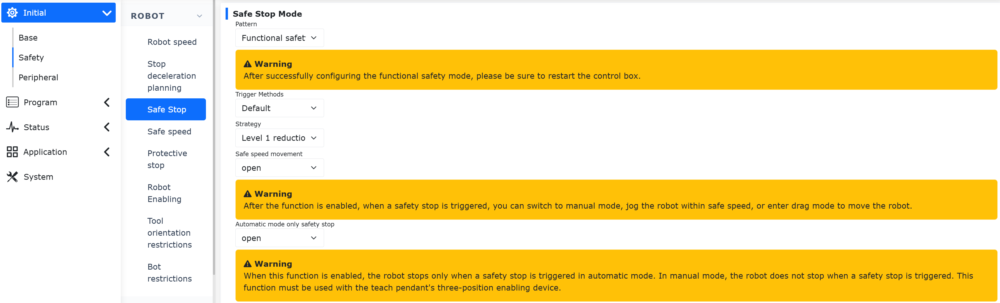
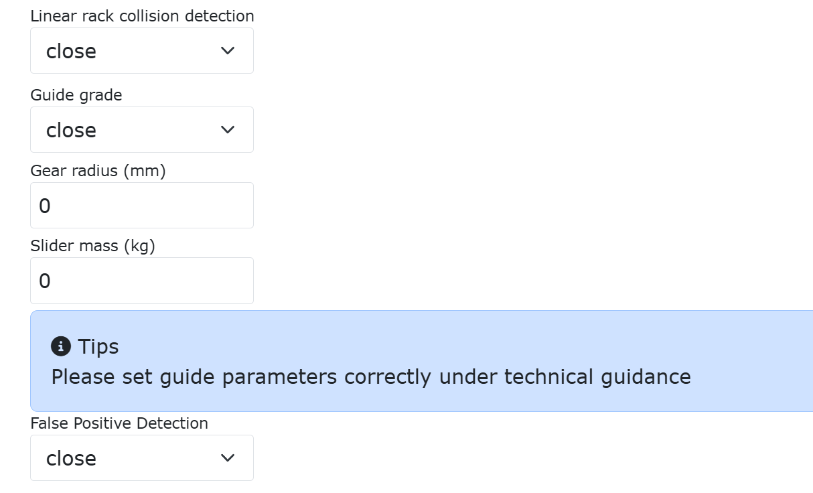
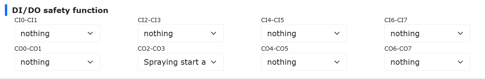

Sicherheit
===============

.. toctree:: 
   :maxdepth: 6

Hintergrund
------------------------------------------------
Als zentrale Ausführungseinheit in der Entwicklung der industriellen intelligenten Fertigung ist die Sicherheitsleistung von Industrierobotern zu einem Kernelement im gesamten Lebenszyklusmanagement von Geräten geworden. Derzeit fordert die Branche allgemein, dass sicherheitsfunktionsbezogene Parameter unveränderlich und manipulationssicher sind und dass ein vollständiger und rückverfolgbarer Verifizierungsmechanismus eingerichtet wird, um strenge Anforderungen an Sicherheitskonformitätsaudits zu erfüllen.
Systemintegratoren und Endbenutzer in Europa haben in der tatsächlichen Projektabnahme weitere klare Anforderungen an die Transparenz und Überprüfbarkeit von Sicherheitskonfigurationen gestellt. Konkret sollte das System nach Abschluss des Debuggings der Sicherheitsfunktionen automatisch einen Sicherheitskonfigurationsbericht mit einer vollständigen Prüfsumme (Checksum) generieren können, und diese Prüfsumme muss in Echtzeit in der Web-Verwaltungsoberfläche des Geräts angezeigt werden. Dieser Mechanismus soll sicherstellen, dass alle Änderungen an Sicherheitsparametern effektiv erkannt und aufgezeichnet werden können, um so eine zuverlässige Grundlage für die Bewertung des Sicherheitszustands des Geräts, die Abnahme vor Ort und die spätere Wartung zu schaffen.
Vor diesem Hintergrund entspricht das Sicherheitsarchitekturdesign dieses Geräts nicht nur den relevanten internationalen Sicherheitsstandards, sondern verfügt auch über integrierte Funktionen zum Export von Sicherheitskonfigurationen und zur Echtzeitanzeige der Prüfsumme, um Bediener und Sicherheitsverantwortliche bei der bequemen und zuverlässigen Durchführung von Konfigurationsbestätigungen und Konformitätsnachweisen zu unterstützen.

Prüfsumme der Sicherheitskonfiguration
------------------------------------------------

Öffnen Sie die Webseite. Die Sicherheitsprüfsumme befindet sich in der oberen rechten Ecke der Seite und wird durch eine 8-stellige Hexadezimalzahl dargestellt. Die Sicherheitsprüfsumme ist eindeutig; wenn sich die Sicherheitskonfigurationsparameter ändern, ändert sich die Sicherheitsprüfsumme entsprechend.

.. image:: safety/001.png
   :width: 4in
   :align: center

.. centered:: Abbildung 7.1-1 Anzeige der Sicherheitskonfigurations-Prüfsumme

Klicken Sie auf die Sicherheitsprüfsumme, um die Menge der Sicherheitskonfigurationsparameter anzuzeigen, die durch die aktuelle Prüfsumme dargestellt wird.

.. image:: safety/002.png
   :width: 6in
   :align: center

.. centered:: Abbildung 7.1-2 Sicherheitskonfigurationsparameter

Die Sicherheitskonfigurationsparameter unterstützen den Export von PDF-Berichten. Klicken Sie auf Download, um eine Vorschau des PDF-Berichts anzuzeigen, und er unterstützt auch den Export. Klicken Sie auf die Schaltfläche Speichern, um den PDF-Bericht herunterzuladen.

.. image:: safety/003.png
   :width: 6in
   :align: center

.. centered:: Abbildung 7.1-3 PDF-Vorschau des Sicherheitskonfigurationsberichts

Verwaltung der Sicherheitskonfigurationsparameter
------------------------------------------------

Alle roboterbezogenen Sicherheitskonfigurationsparameter werden einheitlich auf der Webseite unter "Grundeinstellungen" -> "Sicherheit" verwaltet. Die Änderung von Sicherheitskonfigurationsparametern erfordert die Eingabe des "Sicherheitskonfigurationskennworts" zur Überprüfung. Erst nach erfolgreicher Überprüfung können Änderungen an der Sicherheitsparameterkonfiguration vorgenommen werden.

.. image:: safety/004.png
   :width: 4in
   :align: center

.. centered:: Abbildung 7.2-1 Überprüfung des Sicherheitskonfigurationskennworts

Nach der Änderung der Sicherheitskonfigurationsparameter klicken Sie auf "Übernehmen". Eine zweite Bestätigung der geänderten Sicherheitskonfigurationsparameter ist erforderlich. Klicken Sie auf "Bestätigen", um die Parameter zu übernehmen. Nach erfolgreicher Übernahme der Parameter wird die Sicherheitskonfigurations-Prüfsumme entsprechend aktualisiert.

.. image:: safety/005.png
   :width: 6in
   :align: center

.. centered:: Abbildung 7.2-2 Zweite Bestätigung der Sicherheitskonfigurationsparameter

Verwaltung des Sicherheitskonfigurationskennworts
------------------------------------------------

Das Sicherheitskonfigurationskennwort kann unter "Systemeinstellungen" -> "Wartungsmodus" -> "Sicherheitsparameterkonfiguration" geändert werden. Das Standardkennwort ist 12345678. Zum Ändern des Kennworts ist eine Überprüfung des alten Kennworts erforderlich. Das neue und das alte Kennwort dürfen nicht identisch sein. Die Kennwortlänge beträgt mindestens 1 Zeichen und maximal 8 Zeichen und unterscheidet zwischen Groß- und Kleinbuchstaben sowie Symbolen.

.. centered:: Abbildung 7.3-1 Verwaltung des Sicherheitskonfigurationskennworts

Wenn Sie das alte Kennwort vergessen haben, wenden Sie sich bitte an das entsprechende technische Personal von FAIRINO.

Sicherheitskonfigurationsparameter
--------------------------------------------------------------------------------------------------

Sicherheitsparameter des Roboters
~~~~~~~~~~~~~~~~~~~~~~~~~~~~~~~~~~~~~~~~~~~~~~~~~~~~~~~~~~~~~~~~~~~~~~~

Robotergeschwindigkeit
++++++++++++++++++++++++++++++++++++++++++++++++++++++++++++++

Klicken Sie in der Menüleiste auf "Grundeinstellungen" -> "Sicherheit" und klicken Sie auf das Untermenü "Robotergeschwindigkeit", um zur Konfigurationsoberfläche zu gelangen.

Die Robotergeschwindigkeit wird verwendet, um die maximale Lineargeschwindigkeit, die Linearbeschleunigung und die Gelenkwinkelbeschleunigung des Roboters zu begrenzen.

.. centered:: Abbildung 7.4-1 Robotergeschwindigkeit
 
Stopp-Verzögerungsplanung
++++++++++++++++++++++++++++++++++++++++++++++++++++++++++++++

Klicken Sie in der Menüleiste auf "Grundeinstellungen" -> "Sicherheit" und klicken Sie auf das Untermenü "Stopp-Verzögerungsplanung", um zur Konfigurationsoberfläche zu gelangen.

- Freier Stopp: Beim Stoppvorgang wird die Winkelgeschwindigkeit jeder Achse gemäß dem eingestellten Stopp-Verzögerungsprozentsatz multipliziert mit der maximalen Gelenkbeschleunigung abgebremst und gestoppt;
- Synchronisierter Stopp: Beim Stoppvorgang wird die TCP-Posengeschwindigkeit gemäß dem eingestellten Stopp-Verzögerungsprozentsatz multipliziert mit der maximalen Posenbeschleunigung abgebremst und gestoppt;

Die Stoppverzögerung ist ein Prozentsatz der Beschleunigung.

.. image:: safety/008.png
   :width: 6in
   :align: center

.. centered:: Abbildung 7.4-2 Robot-Stopp-Verzögerungsplanung

Sicherheitsstopp
++++++++++++++++++++++++++++++++++++++++++++++++++++++++++++++

Klicken Sie in der Menüleiste auf "Grundeinstellungen" -> "Sicherheit" und klicken Sie auf "Sicherheitsstopp", um zur Konfigurationsoberfläche zu gelangen, um den Sicherheitsstoppmodus und die Sicherheitsstopp-Strategieparameter einzustellen.

Wenn der Auslösemodus des Sicherheitsstopps auf "Zweikanal" eingestellt ist, müssen beide Kanäle gelöscht werden und die Warnung muss manuell auf der Bedienoberfläche gelöscht werden, bevor der Roboter zurückgesetzt werden kann. Darüber hinaus wurde eine Option für den reduzierten Modus in der Strategiekonfiguration hinzugefügt. Wenn der Benutzer diese Strategie auswählt, wird der Roboter in den reduzierten Modus versetzt.

**Schritt 1**: Klicken Sie auf "Grundeinstellungen" -> "Sicherheit" -> "Sicherheitsstopp". Der Auslösemodus kann als "Standard" oder "Zweikanal" ausgewählt werden. Der Unterschied zwischen den beiden besteht darin: Im "Standard"-Modus wird der Fehler auf der Oberfläche nach der Auslösung und Wiederherstellung automatisch gelöscht; im "Zweikanal"-Modus muss der Fehler auf der Oberfläche nach der Auslösung und Wiederherstellung manuell gelöscht werden. "Sicherheitsstopp-Strategie" kann als "Stopp", "Pause", "Reduzierter Modus Stufe 1" und "Reduzierter Modus Stufe 2" ausgewählt werden. Die detaillierten Beschreibungen lauten wie folgt: Wenn "Stopp" ausgewählt ist, stoppt der Roboter die aktuelle Bewegung; wenn "Pause" ausgewählt ist, pausiert der Roboter die aktuelle Bewegung, und nach der Wiederherstellung und Fehlerlöschung wird die Pause fortgesetzt; wenn "Reduzierter Modus Stufe 1" ausgewählt ist, wechselt der Roboter in den reduzierten Modus Stufe 1; wenn "Reduzierter Modus Stufe 2" ausgewählt ist, wechselt der Roboter in den reduzierten Modus Stufe 2.

.. centered:: Abbildung 7.4-3 Robot-Stopp-Verzögerungsplanung

**Schritt 2**: Wenn der Auslösemodus auf "Standard" eingestellt ist, kann der Fehler auf der Oberfläche nach der Auslösungswiederherstellung automatisch gelöscht werden. Wenn der Auslösemodus auf "Zweikanal" eingestellt ist, lautet der Vorgang: Nach der Auslösungswiederherstellung klicken Sie manuell auf "Löschen" in der oberen rechten Ecke, um den Roboter zurückzusetzen.

Sicherheitsgeschwindigkeit
++++++++++++++++++++++++++++++++++++++++++++++++++++++++++++++

Klicken Sie in der Menüleiste auf "Grundeinstellungen" -> "Sicherheit" und klicken Sie auf "Sicherheitsgeschwindigkeit", um zur Konfigurationsoberfläche zu gelangen, um die Sicherheitsgeschwindigkeit einzustellen. Der manuelle TCP-Geschwindigkeitsbereich beträgt 1-1500mm/s.

Die Sicherheitsgeschwindigkeitsfunktion des Roboters wird in kollaborativen oder dynamischen Umgebungen eingesetzt, um die Betriebsgeschwindigkeit des Roboters aktiv zu begrenzen und kinetische Energie und Aufprallkraft innerhalb von Sicherheitsschwellenwerten zu halten, um so Personenschäden bei versehentlichem Kontakt zu verhindern und Geräte und Werkstücke effektiv vor Kollisionsschäden zu schützen.

**Schritt 1**: Klicken Sie auf "Grundeinstellungen" -> "Sicherheit" -> "Sicherheitsgeschwindigkeit", um die Sicherheitsgeschwindigkeitsparameter einzustellen, die hauptsächlich drei Teile umfassen: "Funktionsaktivierung", "Geschwindigkeitsbegrenzung" und "Modus nach Geschwindigkeitsüberschreitung".

Dabei kann Funktionsaktivierung als "Deaktivieren", "Im Handmodus aktivieren" und "In allen Modi aktivieren" ausgewählt werden;

Bei Geschwindigkeitsbegrenzung wird die Geschwindigkeitsbegrenzung eingestellt. Wenn die lineare Geschwindigkeit des Roboters diese Grenze erreicht, wird sie gemäß den in "Modus nach Geschwindigkeitsüberschreitung" eingestellten Parametern verarbeitet. "Modus nach Geschwindigkeitsüberschreitung" kann als "Stopp mit Alarm", "Automatische Geschwindigkeitsbegrenzung" und "Nach Stopp mit Alarm deaktivieren" ausgewählt werden. Die automatische Geschwindigkeitsbegrenzung ist nur im "Handmodus aktivieren" verfügbar.

Nach dem Einstellen der erforderlichen Parameter sind keine weiteren Aktionen erforderlich. Die Bewegung des Roboters wird gemäß den eingestellten Parametern verarbeitet. Die Parametereinstellungen sind in der Abbildung dargestellt.

.. image:: safety/010.png
   :width: 4in
   :align: center

.. centered:: Abbildung 7.4-4 Einstellungen der Sicherheitsgeschwindigkeitsparameter

Not-Halt
++++++++++++++++++++++++++++++++++++++++++++++++++++++++++++++

Klicken Sie in der Menüleiste auf "Grundeinstellungen" -> "Sicherheit" und klicken Sie auf "Not-Halt", um zur Konfigurationsoberfläche zu gelangen.

Die Not-Halt-Typen 0, 1a, 1b, 2 können eingestellt werden, das Stoppzeitlimit kann eingestellt werden und das Stoppdistanzlimit kann eingestellt werden.

Über die Steuerung, die an die Steuerschrankplatine sendet, unterbricht der Not-Halt Typ 0 direkt die Stromversorgung der Steuerschrankplatine;

- Not-Halt Typ 1a: Nach dem Abbremsen wird die Stromversorgung des Roboterkörpers unterbrochen;
- Not-Halt Typ 1b: Nach dem Abbremsen wird die Stromversorgung des Roboterkörpers nicht unterbrochen, aber der Roboter wird deaktiviert;
- Not-Halt Typ 2: Wenn der Not-Halt betätigt wird, bremst der Roboter ab und bleibt aktiviert. Nach dem Lösen des Not-Halts sollte der Roboter normal funktionieren.

.. image:: safety/011.png
   :width: 4in
   :align: center

.. centered:: Abbildung 7.4-5 Not-Halt-Einstellungen

Schutzstopp
++++++++++++++++++++++++++++++++++++++++++++++++++++++++++++++

Klicken Sie in der Menüleiste auf "Grundeinstellungen" -> "Sicherheit" und klicken Sie auf das Untermenü "Schutzstopp", um zur Konfigurationsoberfläche zu gelangen.

Schutzstopp-Typen 0, 1, 2. Schutzstopp Typ 0 unterbricht direkt die Stromversorgung der Steuerschrankplatine. Schutzstopp Typ 1: Die Steuerschrankplatine benachrichtigt zuerst die Steuerung, um den Roboter zu stoppen, dann gibt die Steuerung eine Rückmeldung an die Steuerschrankplatine, um die Stromversorgung zu unterbrechen. Schutzstopp Typ 2: Die Steuerschrankplatine benachrichtigt die Steuerung, um den Roboter zu stoppen.

.. image:: safety/012.png
   :width: 4in
   :align: center

.. centered:: Abbildung 7.4-6 Schutzstopp-Konfiguration

Automatische Aktivierung beim Einschalten
++++++++++++++++++++++++++++++++++++++++++++++++++++++++++++++

Klicken Sie in der Menüleiste auf "Grundeinstellungen" -> "Sicherheit" und klicken Sie auf das Untermenü "Roboteraktivierung", um zur Konfigurationsoberfläche zu gelangen. Sie können wählen, ob der Roboter beim Einschalten automatisch aktiviert wird oder nicht.

.. image:: safety/013.png
   :width: 4in
   :align: center

.. centered:: Abbildung 7.4-7 Automatische Aktivierung beim Einschalten

Werkzeugorientierungsbegrenzung (Nur im LA-System verwendet)
++++++++++++++++++++++++++++++++++++++++++++++++++++++++++++++

Klicken Sie in der Menüleiste auf "Grundeinstellungen" -> "Sicherheit" und klicken Sie auf das Untermenü "Werkzeugorientierungsbegrenzung", um zur Konfigurationsoberfläche zu gelangen.

Die Werkzeugorientierungsbegrenzung ist eine Schutzfunktion, die im kartesischen Raum des Werkzeugendes des Roboters wirkt, um den Bewegungsumfang der Endpose des Roboters zu begrenzen. Sie umfasst die Aktivierungseinstellung der Funktion, die Einstellung der Referenzwerkzeugrichtung und die Einstellung des maximalen Abweichungswinkels. Der maximale Abweichungswinkel definiert den maximalen Winkelgrenzwert zwischen der Z-Achse des kartesischen Koordinatensystems des Werkzeugendes und der Referenzwerkzeugrichtung, der normalerweise als konischer Raum verstanden werden kann.

.. image:: safety/014.png
   :width: 4in
   :align: center

.. centered:: Abbildung 7.4-8 Werkzeugorientierungsbegrenzung

Roboterbegrenzungen (Nur im LA-System verwendet)
++++++++++++++++++++++++++++++++++++++++++++++++++++++++++++++

Klicken Sie in der Menüleiste auf "Grundeinstellungen" -> "Sicherheit" und klicken Sie auf das Untermenü "Roboterbegrenzungen", um zur Konfigurationsoberfläche zu gelangen.

Die Roboterbegrenzungen umfassen Impuls und Leistung, wobei die Impulsbegrenzung zur Begrenzung des maximalen Impulses des Roboters verwendet wird und die Leistungsbegrenzung zur Begrenzung der vom Roboter geleisteten mechanischen Arbeit.

.. image:: safety/015.png
   :width: 4in
   :align: center

.. centered:: Abbildung 7.4-9 Roboterbegrenzungen

Gelenke
~~~~~~~~~~~~~~~~~~~~~~~~~~~~~~~~~~~~~~~~~~~~~

Weiche Gelenkbegrenzungen
++++++++++++++++++++++++++++++++++++++++++++++++++++++++++++++

Klicken Sie in der Menüleiste auf "Grundeinstellungen" -> "Sicherheit" -> "Gelenke" und klicken Sie auf "Weiche Gelenkbegrenzungen", um zur Oberfläche für weiche Begrenzungen zu gelangen.

Im Bewegungsbereich des Roboters können sich andere Geräte befinden. Die Begrenzungswinkel können eine weiche Begrenzung des Roboters durchführen, um zu verhindern, dass der Roboter über bestimmte Koordinatenwerte hinausfährt und um Kollisionen zu vermeiden. Das Auslösen einer weichen Begrenzung führt zu einem automatischen Stopp des Roboters, ohne Stoppdistanz.

Administratoren können Standardwerte verwenden oder Winkelwerte eingeben. Durch die Eingabe von Winkelwerten können die positiven und negativen Winkel der Robotergelenke separat begrenzt werden. Wenn der eingegebene Wert die in der Tabelle der robotergrundparameter in Abschnitt 2.1-Grundparameter aufgeführten weichen Gelenkbegrenzungswinkel überschreitet, wird der Begrenzungswinkel auf den maximal einstellbaren Wert angepasst. Wenn der Roboter einen Gelenkbefehl-Überschreitungsfehler meldet, muss in den Ziehmodus gewechselt werden, um das Robotergelenk wieder innerhalb des Begrenzungswinkels zu ziehen.

Die Schutzfunktion der weichen Gelenkbegrenzung ist ein aktiver Schutzmechanismus, der den Bewegungszustand der Roboterarmgelenke in Echtzeit überwacht und den Bediener dynamisch daran hindert, beim Zieh-Teach-in den eingestellten weichen Begrenzungsbereich zu überschreiten. Diese Funktion macht weiche Begrenzungen auch im Zieh-Teach-in sinnvoll und erhöht so die Sicherheit der Mensch-Roboter-Kollaboration.

- **Schritt 1**: Melden Sie sich an der Weboberfläche an und klicken Sie nacheinander auf "Grundeinstellungen" -> "Sicherheit" -> "Gelenke" -> "Weiche Gelenkbegrenzungen", um zum Einstellungsmodul für weiche Roboterbegrenzungen zu gelangen.
- **Schritt 2**: Legen Sie basierend auf dem tatsächlichen Arbeitsbereich des Roboters die weichen Begrenzungen für jedes Gelenk sinnvoll fest. Überprüfen Sie zu diesem Zeitpunkt, ob sich die aktuelle Winkelposition jedes Robotergelenks innerhalb des voreingestellten weichen Begrenzungsbereichs befindet. Wenn ja, klicken Sie auf "Übernehmen", um die voreingestellten weichen Begrenzungen zu senden. Wenn nicht, bewegen Sie jedes Gelenk in den voreingestellten Bereich; andernfalls wird beim Klicken auf "Übernehmen" eine Überschreitungsmeldung angezeigt, wie in der folgenden Abbildung dargestellt. Zu diesem Zeitpunkt können Sie das über das Limit hinausgehende Gelenk in Richtung des weichen Begrenzungsbereichs tippen oder ziehen, um den Fehler zu beheben.
- **Schritt 3**: Nachdem der weiche Begrenzungsbereich erfolgreich eingestellt wurde, wählen Sie "Aktivieren" für "Schutz der weichen Gelenkbegrenzung", um diese Funktion zu aktivieren, wie in der folgenden Abbildung dargestellt. Im Ziehmodus werden die eingestellten weichen Begrenzungen wirksam, und beim Ziehen in der Nähe der weichen Begrenzungen ist ein Widerstand spürbar.
- **Schritt 4**: Um die Schutzfunktion der weichen Gelenkbegrenzung zu deaktivieren, klicken Sie auf "Schutz der weichen Gelenkbegrenzung", um sie auszuschalten.

.. image:: safety/016.png
   :width: 4in
   :align: center

.. centered:: Abbildung 7.4-10 Weiche Gelenkbegrenzungen

Kollisionsstufe
++++++++++++++++++++++++++++++++++++++++++++++++++++++++++++++

Klicken Sie in der Menüleiste auf "Grundeinstellungen" -> "Sicherheit" -> "Gelenke" und klicken Sie auf "Kollisionsstufe", um zur Oberfläche der Kollisionsstufe zu gelangen.
Die Kollisionsstufen sind in Stufen 1 bis 10 unterteilt. Die Stufen 1 bis 3 sind empfindlicher, und der Roboter muss mit der empfohlenen Geschwindigkeit laufen. Sie können auch benutzerdefinierte Prozenteinstellungen wählen, wobei 100 % Stufe 10 entspricht. Wie in der folgenden Abbildung dargestellt:

.. image:: safety/017.png
   :width: 6in
   :align: center

.. centered:: Abbildung 7.4-11 Kollisionsstufendiagramm

Die Kollisionsstrategien sind "Stopp bei Kollision", "Pause bei Kollision" und "Bewegung fortsetzen". Um eine Druckkraft zwischen Roboter und Objekten nach einer Kollision zu vermeiden, wurden die Strategien "Schwerkraftmomentmodus", "Schwingungsantwortmodus" und "Kollisionsrückprallmodus" hinzugefügt. Bei Auslösung wechseln alle drei Strategien vom Automatik- oder Handmodus in den Ziehmodus und dann zurück in den Handmodus. Der Schwerkraftmomentmodus bewegt sich basierend auf der Größe und Richtung der Kollisionskraft vom Kollisionspunkt weg; der Schwingungsantwortmodus kehrt nach dem Verlassen des Kollisionspunkts zur Kollisionsposition zurück; der Kollisionsrückprallmodus beschleunigt gemäß den eingestellten Parametern vom Kollisionspunkt weg.

Klicken Sie im Abschnitt "Kollisionsstrategie" auf das Dropdown-Menü und wählen Sie "Kollisionsrückprallmodus". Stellen Sie die Sicherheitszeit auf 1000ms, den Sicherheitsabstand auf 150mm, die Sicherheitsgeschwindigkeit auf 150mm/s und den Sicherheitsfaktor für jedes Gelenk auf 5 ein. Die spezifische Oberfläche ist in der folgenden Abbildung dargestellt.

.. image:: safety/018.png
   :width: 6in
   :align: center

.. centered:: Abbildung 7.4-12 Kollisionsstrategie: Kollisionsrückprallmodus

Bedeutung der einzelnen Parameter:

- Sicherheitszeit: Gibt die Dauer im Ziehmodus nach dem Wechsel vom Automatikmodus in den Ziehmodus an, Bereich [1000-2000]ms;
- Sicherheitsabstand: Gibt die Position an, die der Roboter nach einer Kollision vom Kollisionspunkt entfernt, Bereich [150-200]mm;
- Sicherheitsgeschwindigkeit: Gibt die maximale TCP-Geschwindigkeit an, mit der sich der Roboter nach einer Kollision vom Kollisionspunkt entfernt. Überschreitung dieses Geschwindigkeitslimits begrenzt die Rückprallkraft, Bereich [50-250]mm/s;
- Sicherheitsfaktor: Gibt die Abklinggeschwindigkeit der Rückprallkraft an. Je kleiner der Koeffizient, desto schneller das Abklingen und desto schneller die Rückprallgeschwindigkeit; je größer der Koeffizient, desto langsamer das Abklingen. Bereich [1-10], dimensionslos.
- Bevor der Roboter in den Ziehmodus wechselt, ist eine Drehmomentprüfung erforderlich. Diese Funktion soll verhindern, dass es nach dem Wechsel des Roboters in den Ziehmodus zu abnormalen Phänomenen wie Anheben oder Absinken kommt, die durch falsche Lastparameter oder falsche Installationsmoduseinstellungen des Bedieners verursacht werden. Wenn das Gelenkmoment außerhalb des zulässigen Bereichs liegt, meldet die Steuerung sofort einen Fehler und verhindert, dass der Roboter in den Ziehmodus wechselt.

Schritte zur Aktivierung der Kollisionserkennungsfunktion für lineare Zahnstangenführungen:

- Schritt 1: Stellen Sie sicher, dass sowohl die Führung als auch der Roboter frontmontiert sind. Überprüfen Sie vor der Aktivierung der Kollisionserkennungsfunktion für lineare Zahnstangenführungen, ob die Installationsmethode frontmontiert ist. Stellen Sie konkret zuerst sicher, dass die Führung und der Roboter frontmontiert sind. Klicken Sie dann nacheinander auf "Grundeinstellungen" -> "Basis" -> "Installation", um zur Seite für die freie Installation zu gelangen. Wenn sowohl "Basisrotation" als auch "Basiskippung" 0 sind, ist die Software auf frontmontiert eingestellt; andernfalls müssen sie auf 0 geändert werden. Wenn sie nicht 0 sind, wird auf der Oberfläche ein Fehler angezeigt.
- Schritt 2: Aktivieren Sie die Kollisionserkennungsfunktion für lineare Zahnstangenführungen und stellen Sie die Parameter ein. Klicken Sie nacheinander auf "Grundeinstellungen" -> "Sicherheit" -> "Gelenke" -> "Kollisionsstufe", um zur Seite für die Kollisionsstufeneinstellung zu gelangen. Nachdem Sie auf den Schieberegler der Funktion "Kollisionserkennung für lineare Zahnstangenführungen" geklickt haben, stellen Sie den Zahnradradius und die Schlittenmasse ein. Der Zahnradradius kann aus der Steigung und dem Untersetzungsverhältnis berechnet werden. Die Schlittenmasse umfasst nicht den Roboter und seine Endlast. Es gibt 11 Führungsstufenoptionen, wobei Stufe 1 am einfachsten eine Kollision auslöst und Stufe 10 am schwierigsten ist. Wenn die Steuerung zum ersten Mal eingeschaltet wird und bevor das Anpassungsprogramm ausgeführt wird, sollte die Kollisionsstufe zuerst auf "Deaktiviert" eingestellt werden.

.. centered:: Abbildung 7.4-13 Kollisionserkennungsfunktion für lineare Zahnstangenführungen

- Schritt 3: Führen Sie das Programm "Rail_Adaptation_Program.lua" aus, um sich an die aktuelle Führung anzupassen. Nach jedem Neustart der Steuerung muss das Programm "Rail_Adaptation_Program.lua" ausgeführt werden (um zu verhindern, dass Änderungen am Robotertyp und andere Faktoren die dynamischen Eigenschaften der Führung beeinflussen). Stellen Sie vor der Ausführung des Programms sicher, dass die Kollisionsstufe der Führung auf "Deaktiviert" eingestellt ist. Führen Sie im Automatikmodus das LUA-Programm mit 100 % der Oberflächengeschwindigkeit aus. Nach einem Durchlauf des Programms ist die Anpassung abgeschlossen und die Ausführung kann gestoppt werden.

.. image:: safety/020.png
   :width: 4in
   :align: center

.. centered:: Abbildung 7.4-14 Ausführen von "Rail_Adaptation_Program.lua" zur Anpassung an die aktuelle Führung

- Schritt 4: Legen Sie die Kollisionsstufe der Führung sinnvoll fest und führen Sie Aufgaben aus. Benutzer können die Kollisionsstufe der Führung basierend auf der Motorantriebsleistung und der Aufgabenausführungsgeschwindigkeit sinnvoll festlegen. Wenn die Führung und der Roboter asynchron arbeiten, kann eine Kollision mit dem Roboter oder der Führung einen "8-Achsen-Kollisionsfehler, zurücksetzbar" auslösen. In diesem Fall stoppt die Führung, wie in Abbildung 2-9 dargestellt. Wenn die Führung und der Roboter synchron arbeiten, kann eine Kollision mit dem Roboter einen Alarm auslösen, der die Führung stoppt, während der Roboter gemäß der eingestellten Kollisionsstrategie reagiert.

Reduzierter Modus
++++++++++++++++++++++++++++++++++++++++++++++++++++++++++++++

Klicken Sie in der Menüleiste auf "Grundeinstellungen" -> "Sicherheit" und klicken Sie auf das Untermenü "Reduzierter Modus", um zur Konfigurationsoberfläche zu gelangen. Wählen Sie "Modus Stufe 1/Stufe 2", um die Gelenkgeschwindigkeit und die End-TCP-Geschwindigkeit zu konfigurieren.

.. image:: safety/021.png
   :width: 4in
   :align: center

.. centered:: Abbildung 7.4-15 Reduzierter Modus

I/O
~~~~~~~~~~~~~~~~~~~~~~~~~~~~~~~~~~~~~~~~~~~~~~~~~~~
Klicken Sie in der Menüleiste auf "Grundeinstellungen" -> "Sicherheit" und klicken Sie auf das Untermenü "I/O", um zur Konfigurationsoberfläche zu gelangen.

HMI bietet die Möglichkeit, den Sicherheitszustand für 16 digitale Eingänge und 16 digitale Ausgänge festzulegen, die auf gültig oder ungültig gesetzt werden können. Wenn die Steuerung feststellt, dass sie sich in einem Sicherheitszustand befindet, werden die 16 digitalen Eingänge und die 16 digitalen Ausgänge auf den Sicherheitszustand gesetzt.

.. image:: safety/022.png
   :width: 6in
   :align: center

.. centered:: Abbildung 7.4-16 I/O-Sicherheitszustandskonfiguration

Unter dem LA-System:

"I/O-Sicherheit" bietet DIO-Sicherheitsfunktionen. Die Sicherheitsfunktion ist zweikanaliges DI oder DO. Wenn ein Sicherheits-DI-Signal oder ein Sicherheitszustandsflag ausgelöst wird, wird der DO ausgegeben.

.. centered:: Abbildung 7.4-17 I/O-Sicherheitsfunktionskonfiguration

Hardware
~~~~~~~~~~~~~~~~~~~~~~~~~~~~~~~~~~~~~~~~~~~~~~~~~~~

ServoJT-Leistungserkennung (Nur im QX-System verwendet)
+++++++++++++++++++++++++++++++++++++++++++++++++++++++++++++++++++++++++++++++++++++++++++++++++++++++
Klicken Sie in der Menüleiste auf "Grundeinstellungen" -> "Sicherheit" und klicken Sie auf das Untermenü "Leistungserkennung", um zur Konfigurationsoberfläche zu gelangen.

Wenn direkt auf den Stromregelkreis des Roboters (nur servoJT) eingewirkt wird, wird er verwendet, um die vom Roboter geleistete Arbeit zu begrenzen. Wenn das Integral der Robotergeschwindigkeit und des Drehmoments den Grenzwert überschreitet, wird der Leistungsschutz aktiviert.

.. image:: safety/024.png
   :width: 4in
   :align: center

.. centered:: Abbildung 7.4-18 ServoJT-Leistungserkennung

Ebenen
~~~~~~~~~~~~~~~~~~~~~~~~~~~~~~~~~~~~~~~~~~~

Sicherheitswand
+++++++++++++++++++++++++++++++++++++++++++++++++++++++++++++++++++++++++++++++++++++++++++++++++++++++

Klicken Sie in der Menüleiste auf "Grundeinstellungen" -> "Sicherheit" und klicken Sie auf das Untermenü "Sicherheitswandkonfiguration", um zur Konfigurationsoberfläche zu gelangen.

- Sicherheitswandkonfiguration: Klicken Sie auf die Schaltfläche Aktivieren, um die entsprechende Sicherheitswand zu aktivieren. Wenn für eine Sicherheitswand kein Sicherheitsbereich konfiguriert wurde, wird ein Fehler angezeigt. Klicken Sie auf die Konfigurationsschaltfläche in der oberen rechten Ecke, wählen Sie die Sicherheitswand aus, die Sie einrichten möchten, der Sicherheitsabstand wird automatisch angezeigt (optional, Standard 0), und klicken Sie dann auf die Schaltfläche "Einstellen", um die Einstellung erfolgreich durchzuführen.
- Konfiguration der Sicherheitswand-Referenzpunkte: Nach der Auswahl einer Sicherheitswand können vier Referenzpunkte eingestellt werden. Die ersten drei Punkte sind Ebenenreferenzpunkte, die verwendet werden, um die Ebene der eingestellten Sicherheitswand zu bestätigen. Der vierte Punkt ist der Sicherheitsbereichs-Referenzpunkt, der verwendet wird, um den Sicherheitsbereich der eingestellten Sicherheitswand zu bestätigen.

Wenn die Referenzpunkte erfolgreich eingestellt wurden, wird ein grünes Licht angezeigt. Andernfalls wird ein gelbes Licht angezeigt, bis die Referenzpunkte erfolgreich eingestellt sind und grün werden. Wenn alle vier Referenzpunkte erfolgreich eingestellt wurden, kann der Sicherheitsbereich berechnet werden. Nach erfolgreicher Berechnung wird der Status des Sicherheitsbereichsparameterpunkts auf den Standardwert zurückgesetzt.

.. image:: safety/025.png
   :width: 6in
   :align: center

.. centered:: Abbildung 7.4-19 Einstellungen der Sicherheitsbereichs-Referenzpunkte

- Anwendungseffekt: Aktivieren Sie die erfolgreich konfigurierte Sicherheitswand. Ziehen Sie den Roboter. Wenn sich der TCP des Roboterendes innerhalb des eingestellten Sicherheitsbereichs befindet, ist das System normal. Wenn er sich außerhalb des eingestellten Sicherheitsbereichs befindet, wird ein Fehler angezeigt.

.. image:: safety/026.png
   :width: 6in
   :align: center

.. centered:: Abbildung 7.4-20 Effekt nach erfolgreicher Sicherheitsbereichseinstellung

Interferenzzone
+++++++++++++++++++++++++++++++++++++++++++++++++++++++++++++++++++++++++++++++++++++++++++++++++++++++

Klicken Sie in der Menüleiste auf "Grundeinstellungen" -> "Sicherheit" -> "Interferenzzone" und klicken Sie auf das Untermenü "Einzel", um zur Konfigurationsoberfläche der Interferenzzone zu gelangen.

Wir müssen die Interferenzmethode und den Vorgang beim Betreten der Interferenzzone konfigurieren. Die Interferenzmethoden sind in "Achseninterferenz" und "Quaderinterferenz" unterteilt.

.. image:: safety/027.png
   :width: 4in
   :align: center

.. centered:: Abbildung 7.4-21 Interferenzzonenmethoden

Klicken Sie auf das Symbol der Interferenzzone, verwenden Sie den Schalter, um zu steuern, ob sie aktiviert ist, und klicken Sie auf die Konfigurationsschaltfläche in der oberen rechten Ecke für die Parameterkonfiguration.

.. image:: safety/028.png
   :width: 6in
   :align: center

.. centered:: Abbildung 7.4-22 Interferenzzonenkonfiguration

Konfigurieren Sie zunächst die Interferenzzonenbewegung als "Bewegung fortsetzen" oder "Stopp". Stellen Sie als Nächstes die Ziekkonfiguration beim Betreten der Interferenzzone ein. Benutzer können die Strategie nach dem Betreten der Interferenzzone im Ziehmodus entsprechend ihren Bedürfnissen einstellen: keine Zieheinschränkung, Impedanzrückkehr oder Wechsel in den Handmodus.

Bei Auswahl von Achseninterferenz müssen die Achseninterferenzparameter konfiguriert werden. Die Erkennungsmethode kann "Befehlsposition" oder "Rückmeldeposition" sein. Der Interferenzzonenmodus kann "Interferenz innerhalb des Bereichs" oder "Interferenz außerhalb des Bereichs" sein. Als nächstes stellen Sie den Bereich für jedes Gelenk ein und ob der Bereich für jedes Gelenk aktiviert ist. Sie können Werte eingeben oder das "Aktualisierungs"-Symbol nach "Min" und "Max" verwenden, um die aktuelle Roboterposition zu erfassen, und klicken Sie schließlich auf Konfigurieren.

.. image:: safety/029.png
   :width: 6in
   :align: center

.. centered:: Abbildung 7.4-23 Achseninterferenzkonfiguration

Bei Auswahl von Quaderinterferenz müssen die Quaderinterferenzparameter konfiguriert werden. Die Erkennungsmethode kann "Befehlsposition" oder "Rückmeldeposition" sein. Der Interferenzzonenmodus kann "Interferenz innerhalb des Bereichs" oder "Interferenz außerhalb des Bereichs" sein. Das Referenzkoordinatensystem kann "Basenkoordinate" oder "Werkstückkoordinate" sein, ausgewählt je nach tatsächlicher Verwendung. Als nächstes stellen Sie den Bereich ein. Es gibt zwei Methoden für die Bereichseinstellung. Die erste Methode ist die "Zwei-Punkte-Methode", bei der zwei diagonale Eckpunkte des Quaders verwendet werden. Positionen können eingegeben oder durch Roboter-Teach-in aufgezeichnet werden. Klicken Sie schließlich auf Übernehmen.

.. image:: safety/030.png
   :width: 6in
   :align: center

.. centered:: Abbildung 7.4-24 Quaderinterferenzkonfiguration

Die zweite Methode ist die "Mittelpunkt + Seitenlänge"-Methode, bei der der Mittelpunkt des Quaders und die Seitenlänge des Quaders die Interferenzzone bilden. Positionen können eingegeben oder durch Roboter-Teach-in aufgezeichnet werden. Klicken Sie schließlich auf Übernehmen.

.. image:: safety/031.png
   :width: 6in
   :align: center

.. centered:: Abbildung 7.4-25 Quaderinterferenzkonfiguration

Anhang: Greifer-Warteblockierungsbefehl
~~~~~~~~~~~~~~~~~~~~~~~~~~~~~~~~~~~~~~~~~~~~~~~~~~~~~~~~~~~~~~~~~~~~~~~~~~~~~

Klicken Sie auf "Teach Program" -> "Peripheriebefehle" -> "Greifer", um einen Befehl zum Warten auf den Abschluss der Greiferbewegung hinzuzufügen, der blockieren kann, bis die Greifaktion abgeschlossen ist, um die tatsächliche physische Position des Greifers zu erhalten.

.. image:: safety/032.png
   :width: 4in
   :align: center

.. centered:: Abbildung 7.4-26 Greiferbewegungsabschluss-Wartebefehl
 
- Greiferstatus: Bewegung nicht abgeschlossen, Bewegung abgeschlossen mit keinem Objekt erkannt, Bewegung abgeschlossen mit Objekt erkannt;
- Timeout-Zeit: Einheit ms, -1 bedeutet für immer warten.
- Timeout-Strategie: Sie können zwischen "Stopp mit Fehler" oder "Weiterlaufen" wählen.
- Greifertyp: Sie können zwischen Parallelgreifer oder Drehgreifer wählen.

.. note:: 
   Hinweis: Der Befehl zum Warten auf den Abschluss der Greiferbewegung ist nur für kundenspezifische Protokolle anwendbar; angepasste Geräte unterstützen ihn derzeit nicht.

   Sie können auch direkt GetGripperMotionDone() zur Beurteilung verwenden. Der Eingabeparameter ist der Greifertyp: 0 für Parallelgreifer, 1 für Drehgreifer. Die Rückgabewerte sind Greiferfehler und Greiferstatus. Greiferfehler 0 bedeutet kein Fehler, andere Werte bedeuten, dass ein Fehler vorliegt. Greiferstatus 0 bedeutet Bewegung nicht abgeschlossen, 1 bedeutet Bewegung abgeschlossen mit keinem Objekt erkannt, 2 bedeutet Bewegung abgeschlossen mit Objekt erkannt. Beispielprogramme für das Warten auf den Abschluss der Greiferbewegung und das Abrufen der Greiferposition sind wie folgt:

.. image:: safety/033.png
   :width: 6in
   :align: center

.. centered:: Abbildung 7.4-27 Greiferbewegungs-Beispielprogramm