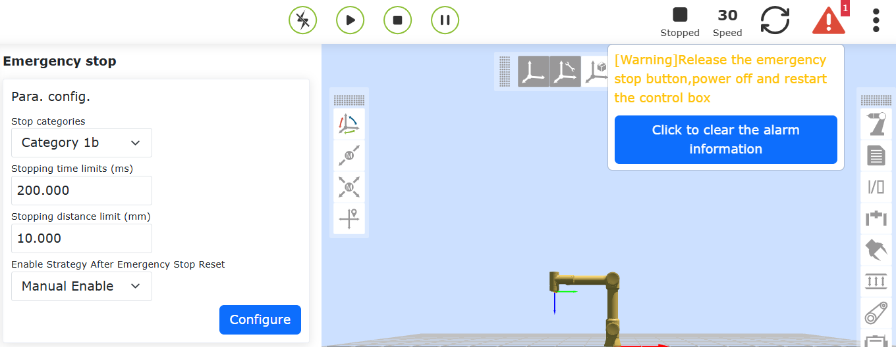
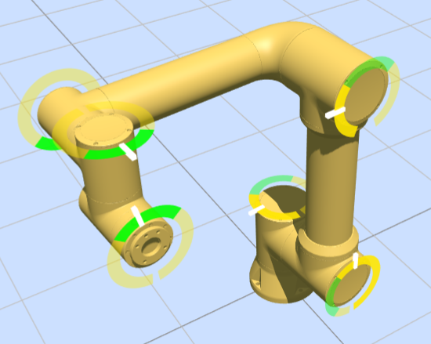
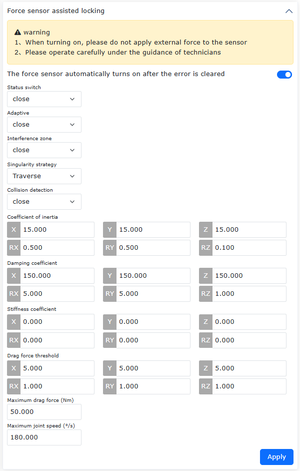
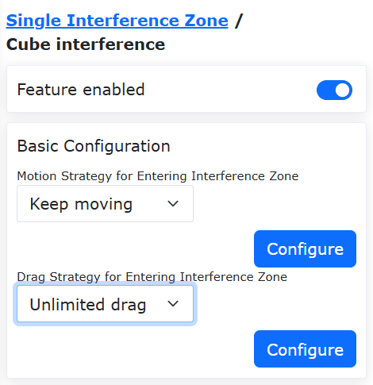
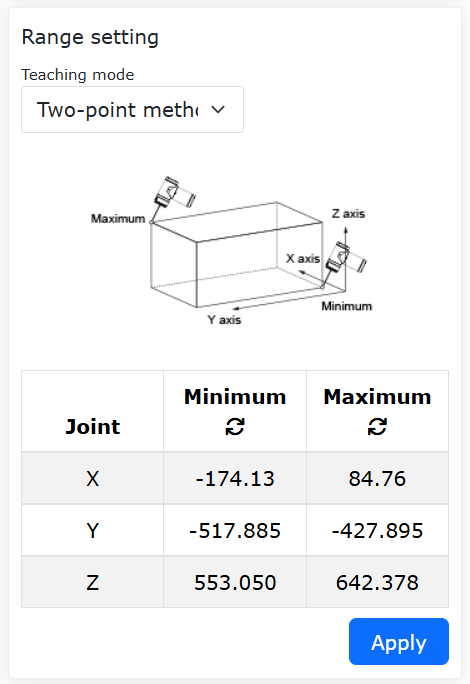
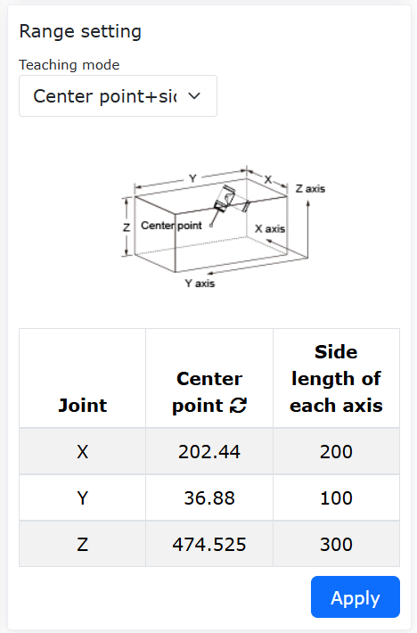
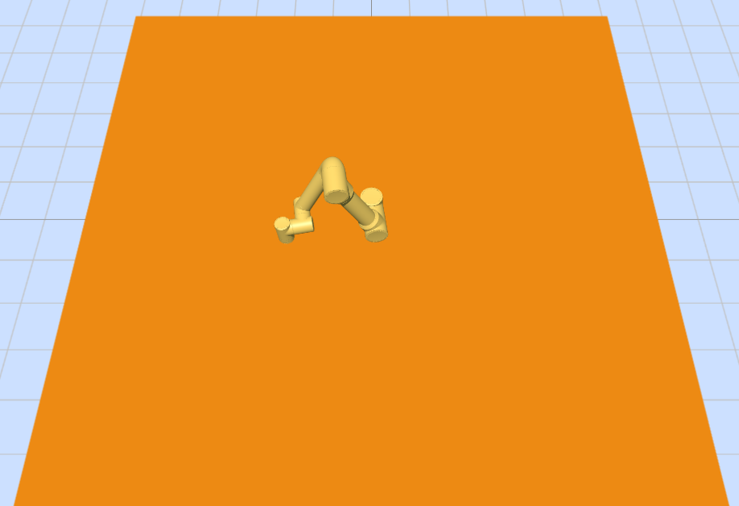

Sicherheit
===============

.. toctree::
   :maxdepth: 6

Sicherheitsstopp
----------------

Klicken Sie in der Menüleiste auf "Initiale Einstellungen" -> "Sicherheit". Klicken Sie auf das Untermenü "Sicherheitsstopp", um zur Konfigurationsoberfläche zu gelangen. Hier stellen Sie den Sicherheitsstopp-Modus und die Parameter der Sicherheitsstopp-Strategie ein.

.. image:: safety/001.png
   :width: 4in
   :align: center

.. centered:: Abbildung 7.1-1 Sicherheitsstopp-Konfiguration

Sicherheitsstopp mit Zweikanal + Reduziertem Modus konfigurierbar
~~~~~~~~~~~~~~~~~~~~~~~~~~~~~~~~~~~~~~~~~~~~~~~~~~~~~~~~~~~~~~~~~~~~~~~~~~~~~~~~~~~~~~~~~~~~~~~~

Überblick
++++++++++++++++++++++++++++++++++++++++++++

Wenn die Auslöseart des Sicherheitsstopps auf "Zweikanal" eingestellt ist, muss der Zustand über beide Kanäle gelöscht sein und der Benutzer muss die Warnung auf der Bedienoberfläche manuell quittieren, bevor der Roboter zurückgesetzt werden kann. Zusätzlich wurde in der Strategiekonfiguration die Option "Reduzierter Modus" hinzugefügt. Wenn der Benutzer diese Strategie wählt, wechselt der Roboter in den reduzierten Bewegungsmodus.

Vorgehen
++++++++++++++++++++++++++++++++++++++++++++

**Schritt 1**: Klicken Sie auf "Initiale Einstellungen" -> "Sicherheit" -> "Sicherheitsstopp". Die Auslöseart kann als "Standard" oder "Zweikanal" gewählt werden. Der Unterschied besteht darin: Im "Standard"-Modus wird die Fehlermeldung auf der Oberfläche nach dem Auslösen und Wiederherstellen automatisch gelöscht. Im "Zweikanal"-Modus muss die Fehlermeldung auf der Oberfläche nach dem Auslösen und Wiederherstellen manuell gelöscht werden. Die "Sicherheitsstopp-Strategie" kann als "Stopp", "Pause", "Erste Reduzierungsstufe" oder "Zweite Reduzierungsstufe" gewählt werden. Die genaue Bedeutung ist wie folgt: Bei Auswahl von "Stopp" stoppt der Roboter die aktuelle Bewegung; bei "Pause" pausiert der Roboter die aktuelle Bewegung; nach Wiederherstellung und Löschen des Fehlers wird die Bewegung fortgesetzt; bei "Erste Reduzierungsstufe" wechselt der Roboter in die erste Reduzierungsstufe; bei "Zweite Reduzierungsstufe" wechselt der Roboter in die zweite Reduzierungsstufe.

.. image:: safety/048.png
   :width: 4in
   :align: center

.. centered:: Abbildung 7.1-2 Einstellung der Sicherheitsstopp-Strategie

**Schritt 2**: Da bei Auswahl der Auslöseart "Standard" die Fehlermeldung auf der Oberfläche nach der Wiederherstellung automatisch gelöscht wird, ist keine weitere Erklärung erforderlich. Daher wird hauptsächlich die Vorgehen bei Auswahl der Auslöseart "Zweikanal" beschrieben: Nach der Wiederherstellung muss der Benutzer oben rechts auf "Löschen" klicken, bevor der Roboter zurückgesetzt werden kann.

.. image:: safety/049.png
   :width: 4in
   :align: center

.. centered:: Abbildung 7.1-3 Manuelles Löschen nach Sicherheitsstopp-Auslösung

Sicherheitsgeschwindigkeit
---------------------------------

Klicken Sie in der Menüleiste auf "Initiale Einstellungen" -> "Sicherheit". Klicken Sie auf das Untermenü "Sicherheitsgeschwindigkeit", um zur Konfigurationsoberfläche zu gelangen und die Sicherheitsgeschwindigkeit einzustellen.

.. note:: TCP-Handgeschwindigkeit unter 250 mm/s.

.. image:: safety/002.png
   :width: 4in
   :align: center

.. centered:: Abbildung 7.2-1 Konfiguration der sicheren Handgeschwindigkeit

Sicherheitsgeschwindigkeitsfunktion
~~~~~~~~~~~~~~~~~~~~~~~~~~~~~~~~~~~~~~~~~~~~~~~~~~

Überblick
+++++++++++++++++++++++++++++

Die Sicherheitsgeschwindigkeitsfunktion des Roboters dient der Mensch-Roboter-Kollaboration oder dynamischen Umgebungen. Sie begrenzt aktiv die Betriebsgeschwindigkeit des Roboters, um kinetische Energie und Aufprallkräfte innerhalb sicherer Schwellenwerte zu halten, wodurch Verletzungen von Personen bei versehentlichem Kontakt verhindert und Geräte sowie Werkstücke wirksam vor Kollisionsschäden geschützt werden.

Ablauf
+++++++++++++++++++++++++++++

**Schritt 1**: Klicken Sie auf die Schaltfläche "Grundeinstellungen" - "Sicherheit" - "Sicherheitsgeschwindigkeit", um die Parameter für die Sicherheitsgeschwindigkeit einzustellen. Die Konfiguration umfasst hauptsächlich drei Teile: "Funktionsaktivierung", "Geschwindigkeitsbegrenzung" und "Modus nach Überschreitung".

Bei der "Funktionsaktivierung" können drei Optionen ausgewählt werden: "Deaktiviert", "Im manuellen Modus aktiviert" und "In allen Modi aktiviert";

Stellen Sie die Geschwindigkeitsbegrenzung im Feld "Geschwindigkeitsbegrenzung" ein. Wenn die Lineargeschwindigkeit des Roboters diese Grenze erreicht, wird sie gemäß den in "Modus nach Überschreitung" eingestellten Parametern behandelt. "Modus nach Überschreitung" bietet drei Modi: "Stopp mit Alarm", "Automatische Geschwindigkeitsbegrenzung" und "Deaktivieren nach Stopp mit Alarm". Die automatische Geschwindigkeitsbegrenzung ist nur verfügbar, wenn "Im manuellen Modus aktiviert" ausgewählt ist.

Nachdem die erforderlichen Parameter eingestellt wurden, sind keine weiteren Aktionen erforderlich. Die Bewegung des Roboters wird gemäß den eingestellten Parametern behandelt. Die Parametereinstellungen sind in der Abbildung dargestellt.

.. image:: safety/056.png
   :width: 4in
   :align: center

.. centered:: Abbildung 7.2-2 Sicherheitsgeschwindigkeits-Parametereinstellung

I/O-Sicherheit
----------------

Klicken Sie in der Menüleiste auf "Initiale Einstellungen" -> "Sicherheit". Klicken Sie auf das Untermenü "I/O-Sicherheit", um zur Konfigurationsoberfläche zu gelangen.

Das HMI ermöglicht die Einstellung des Sicherheitszustands für 16 digitale Eingänge und 16 digitale Ausgänge. Diese können auf "Aktiv" oder "Inaktiv" gesetzt werden. Wenn die Steuerung einen Sicherheitszustand erkennt, werden die 16 digitalen Eingänge und 16 digitalen Ausgänge in den eingestellten Sicherheitszustand versetzt.

.. image:: safety/003.png
   :width: 4in
   :align: center

.. centered:: Abbildung 7.3-1 Konfiguration des I/O-Sicherheitszustands

Unter dem LA-System:
    "I/O-Sicherheit" bietet eine DIO-Sicherheitsfunktion. Die Sicherheitsfunktion verwendet zwei DI oder DO. Wenn ein sicheres DI-Signal oder ein Sicherheitszustandsflag ausgelöst wird, wird das DO ausgegeben.

.. image:: safety/004.png
   :width: 4in
   :align: center

.. centered:: Abbildung 7.3-2 Konfiguration der I/O-Sicherheitsfunktion

Not-Halt-Stopp
----------------

Klicken Sie in der Menüleiste auf "Initiale Einstellungen" -> "Sicherheit". Klicken Sie auf das Untermenü "Not-Halt-Stopp", um zur Konfigurationsoberfläche zu gelangen.

Die Not-Halt-Stopp-Typen 0, 1a, 1b, 2 sind einstellbar. Die Stoppzeitbegrenzung und die Stoppdistanzbegrenzung sind einstellbar.

- Bei Not-Halt-Stopp Typ 0 wird die Steuerschrankplatine direkt stromlos geschaltet.
- Bei Not-Halt-Stopp Typ 1a wird nach einem Verzögerungsstopp die Spannungsversorgung des Roboters unterbrochen.
- Bei Not-Halt-Stopp Typ 1b wird nach einem Verzögerungsstopp die Spannungsversorgung des Roboters **nicht** unterbrochen, der Roboter wird jedoch deaktiviert (Enable entfernt).
- Not-Halt-Stopp Typ 2 bedeutet: Bei Betätigung des Not-Halts stoppt der Roboter verzögert und bleibt aktiviert. Nach dem Lösen des Not-Halts kann der Roboter normal weiterlaufen.

.. image:: safety/005.png
   :width: 4in
   :align: center

.. centered:: Abbildung 7.4-1 Not-Halt-Stopp-Konfiguration

Optionale automatische Aktivierung (Enable) nach Sicherheitsstopp-Wiederherstellung
~~~~~~~~~~~~~~~~~~~~~~~~~~~~~~~~~~~~~~~~~~~~~~~~~~~~~~~~~~~~~~~~~~~~~~~~~~~~~~~~~~~~~~~~~~~~~~~~~~~~~~~~~

Überblick
+++++++++++++++++++++++++++++

Nach einem Not-Halt-Stopp vom Typ 1b bietet der Roboter zwei Modi zur Auswahl: manuelle Aktivierung und automatische Aktivierung. Bei Auswahl der manuellen Aktivierung muss der Benutzer nach dem Lösen des Not-Halt-Tasters den Robotermodus auf Automatik stellen und manuell die Aktivierungstaste drücken, um den Roboter zu aktivieren. Bei Auswahl der automatischen Aktivierung wird der Roboter nach dem Lösen des Not-Halt-Tasters automatisch aktiviert.

Vorgehen
+++++++++++++++++++++++++++++++++++

**Schritt 1**: Klicken Sie auf "Initiale Einstellungen" -> "Sicherheit" -> "Not-Halt-Stopp". Wählen Sie den "Stopp-Typ" als "Typ 1b". Stellen Sie die Parameter "Stoppzeitbegrenzung" und "Stoppdistanzbegrenzung" nach Bedarf ein. Die "Aktivierungsstrategie nach Not-Halt-Reset" kann als "Manuelle Aktivierung" oder "Automatische Aktivierung" gewählt werden.

.. image:: safety/046.png
   :width: 4in
   :align: center

.. centered:: Abbildung 7.4-2 Einstellung der Aktivierungsstrategie

**Schritt 2**: Bei Auswahl von "Automatische Aktivierung" wird der Roboter nach dem Lösen des Not-Halt-Tasters automatisch aktiviert. Bei Auswahl von "Manuelle Aktivierung" muss der Benutzer nach dem Lösen des Not-Halt-Tasters im Automatikmodus manuell die Aktivierungstaste drücken, um den Roboter zu aktivieren.

.. centered:: Abbildung 7.4-3 Manuelle Aktivierung

Schutzhalt
----------------

Klicken Sie in der Menüleiste auf "Initiale Einstellungen" -> "Sicherheit". Klicken Sie auf das Untermenü "Schutzhalt", um zur Konfigurationsoberfläche zu gelangen.

Schutzhalt-Typen 0, 1, 2. Bei Schutzhalt Typ 0 wird die Steuerschrankplatine direkt stromlos geschaltet. Bei Schutzhalt Typ 1 fordert die Steuerschrankplatine die Steuerung auf, den Roboter kontrolliert anzuhalten; danach meldet die Steuerung der Steuerschrankplatine, dass sie stromlos geschaltet werden kann. Bei Schutzhalt Typ 2 fordert die Steuerschrankplatine die Steuerung auf, den Roboter kontrolliert anzuhalten (ohne sie stromlos zu schalten).

.. image:: safety/006.png
   :width: 4in
   :align: center

.. centered:: Abbildung 7.5-1 Schutzhalt-Konfiguration

.. important::
    Das Sicherheitsdaten-Statusflag und die Fehlermeldung der Steuerschrankplatine können über die Webseite im Bereich "Controller-Statusrückmeldung" abgerufen werden. Wenn das Flag auf 1 gesetzt ist, erscheint in der WebAPP-Alarmstatusmeldung ein Hinweis auf eine Anomalie der Sicherheitsdaten. Nach Erhalt eines Fehlers von der Steuerschrankplatine wird die spezifische Fehlermeldung basierend auf dem Fehlercode im WebAPP-Alarmstatus angezeigt.

.. image:: safety/007.png
   :width: 4in
   :align: center

.. centered:: Abbildung 7.5-2 WebAPP-Alarmstatus

Interferenzzonen-Konfiguration
--------------------------------------

Klicken Sie im Menü "Initiale Einstellungen" -> "Sicherheit" -> "Interferenzzone" auf das Untermenü "Einzeln", um zur Funktionsoberfläche für die Interferenzzonen-Konfiguration zu gelangen.

Zuerst müssen wir die Interferenzart und das Verhalten beim Betreten der Interferenzzone konfigurieren. Die Interferenzart wird in "Achsinterferenz" und "Quaderinterferenz" unterteilt.

.. image:: safety/025.png
   :width: 3in
   :align: center

.. centered:: Abbildung 7.6‑1 Interferenzzonen-Arten

Über einen Schieberegler wird gesteuert, ob die Funktion aktiviert ist. Konfigurieren Sie zuerst das Bewegungsverhalten beim Betreten der Interferenzzone: "Bewegung fortsetzen" oder "Stopp". Konfigurieren Sie als nächstes das Verhalten im Ziehemodus beim Betreten der Interferenzzone. Je nach Bedarf kann die Strategie für den Ziehemodus beim Betreten der Zone eingestellt werden: "Ziehen uneingeschränkt", "Impedanzrückführung" oder "Rückkehr in den Handmodus".

.. image:: safety/026.png
   :width: 3in
   :align: center

.. centered:: Abbildung 7.6‑2 Interferenzzonen-Konfiguration

Bei Auswahl von "Achsinterferenz" müssen die Parameter für die Achsinterferenz konfiguriert werden. Die Erkennungsmethode kann entweder "Befehlsposition" oder "Rückmeldeposition" sein. Der Interferenzzonenmodus kann entweder "Interferenz innerhalb des Bereichs" oder "Interferenz außerhalb des Bereichs" sein. Stellen Sie als nächstes den Bereich für jedes Gelenk ein und legen Sie fest, ob der Bereich für jedes Gelenk aktiviert (enable) ist. Die Werte können eingegeben oder über das "Aktualisierungssymbol" hinter "Minimalwert" und "Maximalwert" mit der aktuellen Roboterposition gefüllt werden. Klicken Sie abschließend auf "Konfigurieren".

.. image:: safety/027.png
   :width: 3in
   :align: center

.. centered:: Abbildung 7.6‑3 Achsinterferenz-Konfiguration

Bei Auswahl von "Quaderinterferenz" müssen die Parameter für die Quaderinterferenz konfiguriert werden. Die Erkennungsmethode kann entweder "Befehlsposition" oder "Rückmeldeposition" sein. Der Interferenzzonenmodus kann entweder "Interferenz innerhalb des Bereichs" oder "Interferenz außerhalb des Bereichs" sein. Das Referenzkoordinatensystem kann entweder "Basiskoordinate" oder "Werkstückkoordinate" sein, je nach tatsächlicher Verwendung. Stellen Sie als nächstes den Bereich ein. Es gibt zwei Methoden zur Bereichseinstellung. Betrachten Sie zuerst die erste Methode, die "Zwei-Punkt-Methode". Dabei wird der Quader durch zwei diagonal gegenüberliegende Eckpunkte definiert. Die Positionen können eingegeben oder durch Anteachen des Roboters aufgezeichnet werden. Klicken Sie abschließend auf "Anwenden".

.. image:: safety/028.png
   :width: 3in
   :align: center

.. centered:: Abbildung 7.6‑4 Quaderinterferenz-Konfiguration

Betrachten Sie nun die zweite Methode, "Mittelpunkt + Seitenlänge". Dabei wird der Quader durch seinen Mittelpunkt und seine Seitenlängen definiert. Die Position des Mittelpunkts kann eingegeben oder durch Anteachen des Roboters aufgezeichnet werden. Klicken Sie abschließend auf "Anwenden".

.. image:: safety/029.png
   :width: 3in
   :align: center

.. centered:: Abbildung 7.6‑5 Quaderinterferenz-Konfiguration

Sicherheitsrückruffunktion beim Betreten einer Achsinterferenzzone im kraftunterstützten Ziehemodus
~~~~~~~~~~~~~~~~~~~~~~~~~~~~~~~~~~~~~~~~~~~~~~~~~~~~~~~~~~~~~~~~~~~~~~~~~~~~~~~~~~~~~~~~~~~~~~~~~~~~~~~~~~~~~~~~~~~~~~~~~~~~~~~~~~~~~~~~~~~~~~~~

Überblick
+++++++++++++++++++++++++++++++++

Die Sicherheitsrückruffunktion beim Betreten einer Achsinterferenzzone im kraftunterstützten Ziehemodus kommt zum Tragen, wenn kraftunterstütztes Ziehen und Interferenzzonen gleichzeitig aktiv sind. Wenn der Roboter in eine Interferenzzone eintritt, wechselt er automatisch in den Stromregelungs-Ziehemodus (mit Impedanzrückwirkung). Wenn der Roboter die Interferenzzone wieder verlässt, wechselt er automatisch zurück in den kraftunterstützten Ziehemodus. Dies ermöglicht verschiedene Anwendungsszenarien mit kraftunterstütztem Ziehen.

Vorgehen
++++++++++++++++++++++++++++++++

Gelenkbegrenzungsring (Joint Limit Ring)
************************************************
**Schritt 1**: Melden Sie sich an der Webschnittstelle an und schalten Sie den Schalter "Gelenkbegrenzungsring" ein. Um die Robotergelenke herum erscheinen Gelenkbegrenzungsringe, wie in der folgenden Abbildung gezeigt.

.. image:: safety/030.png
   :width: 4in
   :align: center

.. centered:: Abbildung 7.6‑6 Gelenkbegrenzungsringe in der Webschnittstelle

**Schritt 2**: Der weiße Zeiger auf dem Gelenkbegrenzungsring repräsentiert den tatsächlichen Gelenkwinkel. Die Lücke repräsentiert die Position des Software-Endschalters (Soft-Limit) des entsprechenden Gelenks. Die Größe der Lücke im Gelenkbegrenzungsring ändert sich mit der Größe des Soft-Limits. Wenn sich das Gelenk bewegt, bleibt der Gelenkbegrenzungsring relativ zum Gelenk stationär.

Achsinterferenz-Konfiguration
************************************************
**Schritt 1**: Konfigurieren und aktivieren Sie die Achsinterferenz. Klicken Sie nacheinander auf "Initiale Einstellungen" -> "Sicherheit" -> "Interferenzzone" -> "Einzeln", um zur Interferenzzonen-Konfigurationsseite zu gelangen. Klicken Sie auf die Karte "Achsinterferenz", um zur Oberfläche zu gelangen, und aktivieren Sie den Schieberegler "Funktion aktivieren".

**Schritt 2**: Sie können die "Bewegungsstrategie" auf "Bewegung fortsetzen" setzen. Wählen Sie die "Ziehstrategie" als "Impedanzrückführung" und stellen Sie die Impedanzrückführparameter ein, wie in der folgenden Abbildung gezeigt. Die Impedanzrückführparameter repräsentieren die Rückstellkraft bei der Impedanzrückführung. Je größer der Wert, desto größer die Rückstellkraft. Es wird empfohlen, den Parameter auf "5" zu setzen.

.. image:: safety/031.png
   :width: 4in
   :align: center

.. centered:: Abbildung 7.6‑7 Achsinterferenz-Konfigurationsoberfläche

**Schritt 3**: Stellen Sie den Achsinterferenzbereich ein. Sie können den "Erkennungsmodus" auf "Rückmeldeposition" setzen. Der "Interferenzzonenmodus" kann entweder "Interferenz innerhalb des Bereichs" oder "Interferenz außerhalb des Bereichs" sein. Stellen Sie die Interferenzbereiche für jedes Gelenk ein und wählen Sie "Aktivieren", um den entsprechenden Achsinterferenzbereich einzuschalten, wie in der folgenden Abbildung gezeigt.

.. image:: safety/032.png
   :width: 4in
   :align: center

.. centered:: Abbildung 7.6‑8 Interferenzbereich-Konfigurationsoberfläche

**Schritt 4**: Stellen Sie den "Interferenzzonenmodus" auf "Interferenz innerhalb des Bereichs". In der Webschnittstelle ist der freie Bewegungsbereich auf dem Gelenkbegrenzungsring grün dargestellt, der Interferenzbereich gelb. Der Bereich, in dem sich der weiße Zeiger befindet, wird hervorgehoben, wie in der folgenden Abbildung gezeigt.

.. image:: safety/033.png
   :width: 4in
   :align: center

.. centered:: Abbildung 7.6‑9 Anzeige des Gelenkbegrenzungsrings bei "Interferenz innerhalb des Bereichs"

**Schritt 5**: Stellen Sie den "Interferenzzonenmodus" auf "Interferenz außerhalb des Bereichs". In der Webschnittstelle ist der freie Bewegungsbereich auf dem Gelenkbegrenzungsring grün dargestellt, der Interferenzbereich gelb. Der Bereich, in dem sich der weiße Zeiger befindet, wird hervorgehoben, wie in der folgenden Abbildung gezeigt.

.. centered:: Abbildung 7.6‑10 Anzeige des Gelenkbegrenzungsrings bei "Interferenz außerhalb des Bereichs"

Betreten der Achsinterferenzzone im kraftunterstützten Ziehemodus
++++++++++++++++++++++++++++++++++++++++++++++++++++++++++++++++++++++++++++++++++++++++++++

**Schritt 1**: Klicken Sie nacheinander auf "Hilfsanwendungen" -> "Werkzeuganwendungen" -> "Ziehen sperren". Schalten Sie den "Zustandsschalter" der kraftunterstützten Sperrfunktion auf "Aktivieren". Wählen Sie die Interferenzzonen-Option "Aktivieren". Stellen Sie die entsprechenden Koeffizienten ein und wenden Sie sie an, wie in der folgenden Abbildung gezeigt.

.. centered:: Abbildung 7.6‑11 Konfigurationsoberfläche für kraftunterstütztes Ziehen

**Schritt 2**: Ziehen Sie den Roboter im kraftunterstützten Ziehemodus. Wenn der Gelenkwinkel des Roboters den Interferenzbereich erreicht, wechselt der Robotermodus in den Stromregelungs-Ziehemodus (mit Impedanzrückwirkung), sodass er sich von der Achsinterferenzzone entfernen kann. Nach dem Verlassen des Achsinterferenzbereichs wechselt der Robotermodus zurück in den kraftunterstützten Ziehemodus.

Quaderinterferenz-Konfiguration
++++++++++++++++++++++++++++++++++++++++++++++++++++++++++++++++++

**Schritt 1**: Richten Sie eine Quaderinterferenzzone ein. Klicken Sie nacheinander auf "Initiale Einstellungen" -> "Sicherheit" -> "Interferenzzone" -> "Einzeln", um zur Interferenzzonen-Konfigurationsseite zu gelangen. Klicken Sie auf die Karte "Quaderinterferenz", um zur Oberfläche zu gelangen, und aktivieren Sie den Schieberegler "Funktion aktivieren".

**Schritt 2**: Sie können die "Bewegungsstrategie" auf "Bewegung fortsetzen" setzen. Wählen Sie die "Ziehstrategie" als "Ziehen uneingeschränkt", wie in der folgenden Abbildung gezeigt.

.. centered:: Abbildung 7.6‑12 Quaderinterferenz-Konfiguration

**Schritt 3**: Konfigurieren Sie die Parameter der Quaderinterferenzzone. Sie können den "Erkennungsmodus" auf "Rückmeldeposition" setzen. Der "Interferenzzonenmodus" kann entweder "Interferenz innerhalb des Bereichs" oder "Interferenz außerhalb des Bereichs" sein. Stellen Sie die "Referenzkoordinate" auf "Basiskoordinate".

**Schritt 4**: Wählen Sie die Teach-Methode für den Quaderinterferenzbereich als "Zwei-Punkt-Methode". Teachen Sie zwei Roboterpunkte, den minimalen und maximalen Punkt im kartesischen Raum. Nach dem Klicken auf "Anwenden" erscheint ein virtueller Quader in der Webschnittstelle, wie in der folgenden Abbildung gezeigt.

.. centered:: Abbildung 7.6‑13 Einrichten einer Quaderinterferenzzone mit der "Zwei-Punkt-Methode"

.. image:: safety/038.png
   :width: 4in
   :align: center

.. centered:: Abbildung 7.6‑14 Anzeige des virtuellen Quaders in der Webschnittstelle

**Schritt 5**: Wählen Sie die Teach-Methode für den Quaderinterferenzbereich als "Mittelpunkt + Seitenlänge". Teachen Sie einen Roboterpunkt. Stellen Sie die Seitenlängen für X, Y, Z um diesen Punkt herum ein, wie in der folgenden Abbildung gezeigt. Nach dem Klicken auf "Anwenden" erscheint ein virtueller Quader in der Webschnittstelle.

.. centered:: Abbildung 7.6‑15 Einrichten einer Quaderinterferenzzone mit "Mittelpunkt + Seitenlänge"

**Schritt 6**: Stellen Sie den "Interferenzzonenmodus" auf "Interferenz innerhalb des Bereichs". Wenn sich das Roboterende außerhalb des Quaders befindet, wird der virtuelle Quader in der Webschnittstelle mit 40 % Transparenz gelb angezeigt. Wenn sich das Roboterende innerhalb des Quaders befindet, wird der Quader mit 90 % Transparenz gelb angezeigt und es erscheint die Warnung "Interferenzzone betreten", wie in der folgenden Abbildung gezeigt.

.. image:: safety/040.png
   :width: 4in
   :align: center

.. centered:: Abbildung 7.6‑16 Betreten der Quaderinterferenzzone im Modus "Interferenz innerhalb des Bereichs"

**Schritt 7**: Stellen Sie den "Interferenzzonenmodus" auf "Interferenz außerhalb des Bereichs". Wenn sich das Roboterende innerhalb des Quaders befindet, wird der virtuelle Quader in der Webschnittstelle mit 40 % Transparenz grün angezeigt. Wenn sich das Roboterende außerhalb des Quaders befindet, wird der Quader mit 90 % Transparenz grün angezeigt und es erscheint die Warnung "Interferenzzone betreten", wie in der folgenden Abbildung gezeigt.

.. image:: safety/041.png
   :width: 4in
   :align: center

.. centered:: Abbildung 7.6‑17 Anzeige des Quaders im Modus "Interferenz außerhalb des Bereichs"

Sicherheitswand-Konfiguration
++++++++++++++++++++++++++++++++++++++++++++++++++++++++++++++++++++++++++

**Schritt 1**: Richten Sie eine Sicherheitswand ein. Klicken Sie nacheinander auf "Initiale Einstellungen" -> "Sicherheit" -> "Sicherheitswand", um zur Sicherheitswand-Konfigurationsoberfläche zu gelangen. Die Webschnittstelle unterstützt die gleichzeitige Einrichtung von bis zu 8 Sicherheitswänden. Wählen Sie eine Sicherheitswand aus und konfigurieren Sie sie. Nach Abschluss der Konfiguration aktivieren Sie die entsprechende Sicherheitswand. In der Webschnittstelle erscheint eine virtuelle Wand mit 40 % Transparenz in Orange, wie in der folgenden Abbildung gezeigt.

.. image:: safety/042.png
   :width: 4in
   :align: center

.. centered:: Abbildung 7.6‑18 Sicherheitswand-Konfiguration

.. image:: safety/043.png
   :width: 4in
   :align: center

.. centered:: Abbildung 7.6‑19 Anzeige der virtuellen Wand in der Webschnittstelle

**Schritt 2**: Wenn das Roboterende in die Sicherheitswand eintritt, wird die virtuelle Wand mit 90 % Transparenz orange angezeigt und es erscheint die Warnung "Sicherheitswand betreten", wie in der folgenden Abbildung gezeigt.

.. centered:: Abbildung 7.6‑20 Anzeige der virtuellen Wand beim Betreten durch das Roboterende

Quaderinterferenz-Funktion
~~~~~~~~~~~~~~~~~~~~~~~~~~~~~~~~~~~~~~~~~~~~~~~~~~~~~~~~~~~~~~~~~~~~~~~~~~~~~~~~~~~~~~

Überblick
+++++++++++++++++++++++++++++++++++++++

Die Quaderinterferenz-Funktion unterstützt die gleichzeitige Definition und Aktivierung mehrerer unabhängiger Quader-Interferenzzonen. Die Position und Größe jeder Interferenzzone im dreidimensionalen Raum können unabhängig voneinander eingestellt werden. Darüber hinaus ist jede Interferenzzone mit einem separaten CO-Auslösesignalausgang ausgestattet, der basierend auf der Echtzeitposition des Roboters ein entsprechendes Triggersignal ausgeben kann.

Vorgehen
+++++++++++++++++++++++++++++++++++++++++++++++++++++++++++++++++++++++++++++++++++++++++++++++++++

**Schritt 1**: Aktivieren Sie die Quaderinterferenz-Funktion und führen Sie die Basiskonfiguration durch. Klicken Sie nacheinander auf "Initiale Einstellungen" -> "Sicherheit" -> "Interferenzzone" -> "Quaderinterferenz". Über Schieberegler wird gesteuert, ob jede einzelne Quaderinterferenzzone aktiviert ist, und die Basiskonfiguration durchgeführt.

Die Bewegungsstrategie beim Betreten der Interferenzzone kann als "Bewegung fortsetzen" oder "Stopp" gewählt werden. Bei Auswahl von "Bewegung fortsetzen" wird beim Betreten der Interferenzzone eine Warnung angezeigt, aber die Bewegung wird fortgesetzt. Bei Auswahl von "Stopp" wird beim Betreten der Interferenzzone eine Warnung angezeigt und die Bewegung gestoppt. Die Ziehstrategie beim Betreten der Interferenzzone kann als "Ziehen uneingeschränkt", "Impedanzrückführung" oder "Rückkehr in den Handmodus" gewählt werden.

.. image:: safety/050.png
   :width: 4in
   :align: center

.. centered:: Abbildung 7.6‑21 Quader-Aktivierungssteuerung und Basiskonfiguration

**Schritt 2**: Führen Sie die Konfiguration der Quaderinterferenzzonen durch. Für jede Interferenzzonen-ID können unterschiedliche Konfigurationsparameter eingestellt werden. Zu beachten ist:

(1) Die Erkennungsmethode muss je nach tatsächlichem Funktionsbedarf als "Befehlsposition" oder "Rückmeldeposition" gewählt werden.

(2) Wenn der Interferenzzonenmodus auf "Interferenz außerhalb des Bereichs" gesetzt ist, gilt dies nur für die einzelne Interferenzzone.

.. image:: safety/051.png
   :width: 4in
   :align: center

.. centered:: Abbildung 7.6‑22 Konfiguration der Quaderinterferenzzone

**Schritt 3**: Führen Sie die Bereichseinstellung der Interferenzzone durch. Die Bereichseinstellung kann die Quaderinterferenzzone entweder mit der "Zwei-Punkt-Methode" oder "Mittelpunkt + Seitenlänge" erzeugen. Die "Zwei-Punkt-Methode" erzeugt den Quader durch Angabe zweier diagonal gegenüberliegender Eckpunkte. "Mittelpunkt + Seitenlänge" erzeugt den Quader durch Angabe des Mittelpunkts und der drei Seitenlängen.

.. image:: safety/052.png
   :width: 4in
   :align: center

.. centered:: Abbildung 7.6‑23 Erzeugung einer Interferenzzone mit der "Zwei-Punkt-Methode"

.. image:: safety/053.png
   :width: 4in
   :align: center

.. centered:: Abbildung 7.6‑24 Erzeugung einer Interferenzzone mit "Mittelpunkt + Seitenlänge"

**Schritt 4**: Führen Sie die CO-Signal-Einstellung durch. Klicken Sie nacheinander auf "Initiale Einstellungen" -> "Basis" -> "I/O-Einstellungen" -> "DO". Konfigurieren Sie für jeden Quader den entsprechenden CO-Ausgang.

.. image:: safety/054.png
   :width: 4in
   :align: center

.. centered:: Abbildung 7.6‑25 CO-Ausgangskonfiguration

**Schritt 5**: Jede Quaderinterferenzzone wird entsprechend der eingestellten ID-Nummer auf der Roboteroberfläche angezeigt. Wenn der Mittelpunkt des Roboterendes in die Interferenzzone eintritt, zeigt die Oberfläche die Warnung "Interferenzzone betreten" an und der entsprechende CO-Ausgang gibt ein Signal aus.

.. image:: safety/055.png
   :width: 4in
   :align: center

.. centered:: Abbildung 7.6‑26 Anzeige mehrerer Quaderinterferenzzonen auf der Oberfläche

Reduzierter Modus
-------------------------

Klicken Sie in der Menüleiste auf "Initiale Einstellungen" -> "Sicherheit". Klicken Sie auf das Untermenü "Reduzierter Modus", um zur Konfigurationsoberfläche zu gelangen. Wählen Sie "Erste/Zweite Stufe", um die Gelenkgeschwindigkeiten und die TCP-Endgeschwindigkeit zu konfigurieren.

.. image:: safety/045.png
   :width: 4in
   :align: center

.. centered:: Abbildung 7.7-1 Reduzierter Modus

Sicherheitswand
---------------

Klicken Sie in der Menüleiste auf "Initiale Einstellungen" -> "Sicherheit". Klicken Sie auf das Untermenü "Sicherheitswand-Konfiguration", um zur Konfigurationsoberfläche zu gelangen.

- **Sicherheitswand-Konfiguration**: Klicken Sie auf die Aktivierungsschaltfläche, um die entsprechende Sicherheitswand zu aktivieren. Wenn für die Sicherheitswand kein Sicherheitsbereich konfiguriert ist, wird ein Fehler angezeigt. Klicken Sie auf das Dropdown-Menü, wählen Sie die gewünschte Sicherheitswand aus. Der Sicherheitsabstand wird automatisch übernommen (kann nicht eingestellt werden, Standard ist 0). Klicken Sie dann auf die Schaltfläche "Einstellen". Die Einstellung war erfolgreich.

.. image:: safety/008.png
   :width: 4in
   :align: center

.. centered:: Abbildung 7.8-1 Sicherheitswand-Konfiguration

- **Sicherheitswand-Referenzpunktkonfiguration**: Nach Auswahl einer Sicherheitswand können vier Referenzpunkte eingestellt werden. Die ersten drei Punkte sind Ebenen-Referenzpunkte. Sie dienen zur Bestimmung der Ebene der eingestellten Sicherheitswand. Der vierte Punkt ist der Sicherheitsbereichs-Referenzpunkt. Er dient zur Bestimmung des Sicherheitsbereichs der eingestellten Sicherheitswand.

.. important::
    Wenn die Referenzpunkte erfolgreich eingestellt wurden, leuchtet die Lampe grün. Andernfalls leuchtet sie gelb. Sobald die Referenzpunkte erfolgreich eingestellt wurden, wechselt die Lampe auf grün. Wenn alle vier Referenzpunkte erfolgreich eingestellt wurden, kann der Sicherheitsbereich berechnet werden. Nach erfolgreicher Berechnung kehrt der Status der Sicherheitsbereichsparameterpunkte auf den Standard zurück.

.. image:: safety/009.png
   :width: 4in
   :align: center

.. centered:: Abbildung 7.8-2 Einstellung der Sicherheitsbereichs-Referenzpunkte

-   Anwendungseffekt: Aktivieren Sie die erfolgreich konfigurierte Sicherheitswand. Ziehen Sie den Roboter. Wenn sich das TCP des Roboterendes innerhalb des eingestellten Sicherheitsbereichs befindet, arbeitet das System normal. Befindet es sich außerhalb des eingestellten Sicherheitsbereichs, wird ein Fehler angezeigt.

.. image:: safety/010.png
   :width: 6in
   :align: center

.. centered:: Abbildung 7.8-3 Effekt nach erfolgreicher Sicherheitsbereichseinstellung

Sicherheits-Hintergrundprogramm
---------------------------------------

Klicken Sie in der Menüleiste auf "Initiale Einstellungen" -> "Sicherheit". Klicken Sie auf das Untermenü "Sicherheits-Hintergrundprogramm", um zur Konfigurationsoberfläche zu gelangen.

Der Benutzer kann die Einstellungen des Sicherheits-Hintergrundprogramms über die Schaltfläche "Funktion aktivieren" ein- oder ausschalten. Wählen Sie eine "Unerwartete Situation" und ein "Hintergrundprogramm" aus. Klicken Sie auf die Schaltfläche "Einstellen", um die Parameter für die Behandlung unerwarteter Situationen zu konfigurieren.

Wenn das Sicherheits-Hintergrundprogramm aktiviert ist und Szenarien für unerwartete Situationen sowie Hintergrundprogramme festgelegt wurden, führt der Roboter das entsprechende Hintergrundprogramm aus, wenn während der Programmausführung eine unerwartete Situation eintritt, die mit den eingestellten übereinstimmt. Dies dient dem Sicherheitsschutz.

.. image:: safety/011.png
   :width: 4in
   :align: center

.. centered:: Abbildung 7.9-1 Sicherheits-Hintergrundprogramm

Werkzeugrichtungsbegrenzung (nur unter LA-System)
-------------------------------------------------------

Klicken Sie in der Menüleiste auf "Initiale Einstellungen" -> "Sicherheit". Klicken Sie auf das Untermenü "Werkzeugrichtungsbegrenzung", um zur Konfigurationsoberfläche zu gelangen.

Die Werkzeugrichtungsbegrenzung ist eine Schutzfunktion, die im kartesischen Raum des Roboter-Werkzeugendes wirkt und den Bewegungsbereich der Werkzeugausrichtung einschränkt. Sie umfasst die Aktivierung der Funktion, die Einstellung der Referenzwerkzeugrichtung und die Einstellung des maximalen Abweichungswinkels. Der maximale Abweichungswinkel definiert den maximal zulässigen Winkel zwischen der Z-Achse des Werkzeug-Koordinatensystems und der Referenzwerkzeugrichtung. Dies kann man sich als kegelförmigen Raum vorstellen.

.. image:: safety/012.png
   :width: 4in
   :align: center

.. centered:: Abbildung 7.10-1 Werkzeugrichtungsbegrenzung

Robotergrenzwerte (nur unter LA-System)
---------------------------------------------

Klicken Sie in der Menüleiste auf "Initiale Einstellungen" -> "Sicherheit". Klicken Sie auf das Untermenü "Robotergrenzwerte", um zur Konfigurationsoberfläche zu gelangen.

Die Robotergrenzwerte umfassen Impuls und Leistung. Der Impulsgrenzwert dient zur Begrenzung des maximalen Impulses des Roboters. Der Leistungsgrenzwert dient zur Begrenzung der vom Roboter verrichteten mechanischen Arbeit.

.. image:: safety/013.png
   :width: 4in
   :align: center

.. centered:: Abbildung 7.11-1 Robotergrenzwerte

Leistungserkennung (nur unter QX-System)
---------------------------------------------

Klicken Sie in der Menüleiste auf "Initiale Einstellungen" -> "Sicherheit". Klicken Sie auf das Untermenü "Leistungserkennung", um zur Konfigurationsoberfläche zu gelangen.

Diese Funktion wirkt auf den Stromregelkreis, der direkt auf den Roboter einwirkt (nur Befehl servoJT). Sie dient zur Begrenzung der vom Roboter verrichteten Arbeit. Wenn die Erkennung feststellt, dass das Integral aus Robotergeschwindigkeit und -drehmoment den Grenzwert überschreitet, wird ein Leistungsschutz ausgelöst.

.. image:: safety/014.png
   :width: 4in
   :align: center

.. centered:: Abbildung 7.12-1 Leistungserkennung

Bewegungskonfiguration
---------------------------------------------

Optimierte T-förmige Geschwindigkeitscharakteristik + Blending-Funktion
~~~~~~~~~~~~~~~~~~~~~~~~~~~~~~~~~~~~~~~~~~~~~~~~~~~~~~~~~~~~~~~~~~~~~~~~~~~~~~~~~~~~~~~~~~~~~~~~~~~~~~~~~

Überblick
++++++++++++++++++++++++++++++

Blending zwischen zwei Bewegungssegmenten vermeidet häufige Start-Stopp-Vorgänge, die durch vollständiges Anhalten entstehen würden, und verbessert so die Bewegungseffizienz des Roboters.

Diese Funktion wirkt hauptsächlich auf Blending zwischen den Befehlen PTP-PTP, LIN-LIN, ARC-ARC, LIN-ARC und ARC-LIN. Blending zwischen anderen Befehlskombinationen ist nicht wirksam.

Vorgehen
++++++++++++++++++++++++++++++

Da die Vorgehen für die verschiedenen Befehle ähnlich ist, wird in diesem Handbuch das Blending zwischen PTP-PTP als Beispiel zur Erläuterung der Funktionsweise verwendet. Diese Funktion kann auf zwei Arten realisiert werden: Verwendung von Lua-Befehlen oder Verwendung des Bewegungskonfigurationsschalters.

Verwendung von Lua-Befehlen
*************************************************************

**Schritt 1**: Wählen Sie die Teach-Punkte aus, für die die PTP-Funktion ausgeführt werden soll. In diesem Handbuch werden "A0" bis "A5" als Namen für die Teach-Punkte verwendet.

**Schritt 2**: Klicken Sie auf "Teach-Programm" -> "Programmierung". Wählen Sie den Befehl "Punkt-zu-Punkt" unter "Bewegungsbefehle". Wählen Sie im "Befehlseditor" den Teach-Punkt aus und stellen Sie die Testgeschwindigkeit ein. Wählen Sie als Bewegungsprofil "Beschleunigungs-Glättungsmodus". Stellen Sie den Parameter "Glättungsübergang" für die Punkte ein, an denen eine Glättung erfolgen soll.

.. image:: safety/020.png
   :width: 6in
   :align: center

.. centered:: Abbildung 7.13-1 Einstellung des PTP-Blending-Befehls mit Beschleunigungsglättung

**Schritt 3**: Generieren Sie das Lua-Programm und führen Sie es aus. Die Blending-Funktion zwischen PTP-PTP wird realisiert. Bei dieser Methode werden nur die Befehle zwischen `AccSmoothStart()` und `AccSmoothEnd()` mit der optimierten T-förmigen Geschwindigkeit ausgeführt. Alle anderen Befehle verwenden die ursprüngliche T-förmige Geschwindigkeit.

.. image:: safety/021.png
   :width: 4in
   :align: center

.. centered:: Abbildung 7.13-2 Typisches Programm für PTP-PTP-Blending mittels Lua-Befehl

Verwendung des Bewegungskonfigurationsschalters
*******************************************************************

**Schritt 1**: Klicken Sie auf "Initiale Einstellungen" -> "Sicherheit" -> "Bewegungskonfiguration". Schalten Sie den Schalter "Beschleunigungs-Glättungsmodus" ein.

.. image:: safety/022.png
   :width: 6in
   :align: center

.. centered:: Abbildung 7.13-3 Konfigurationsschalter für den Beschleunigungs-Glättungsmodus

**Schritt 2**: Wählen Sie die Teach-Punkte aus, für die die PTP-PTP-Funktion ausgeführt werden soll. In diesem Handbuch werden "A0" bis "A5" als Namen für die Teach-Punkte verwendet.

**Schritt 3**: Klicken Sie auf "Teach-Programm" -> "Programmierung". Wählen Sie den Befehl "Punkt-zu-Punkt" unter "Bewegungsbefehle". Wählen Sie im "Befehlseditor" den Teach-Punkt aus und stellen Sie die Testgeschwindigkeit ein. Wählen Sie als Bewegungsprofil "Kein". Stellen Sie den Parameter "Glättungsübergang" für die Punkte ein, an denen eine Glättung erfolgen soll.

.. image:: safety/023.png
   :width: 6in
   :align: center

.. centered:: Abbildung 7.13-4 Einstellung des PTP-Blending-Befehls (Standard)

**Schritt 4**: Generieren Sie das Lua-Programm und führen Sie es aus. Die Blending-Funktion zwischen PTP-PTP wird realisiert. Das typische Programm ist identisch mit einem Standard-PTP-Programm. Bei dieser Methode werden **alle** Befehle mit der optimierten T-förmigen Geschwindigkeit ausgeführt.

.. image:: safety/024.png
   :width: 4in
   :align: center

.. centered:: Abbildung 7.13-5 Typisches Programm für PTP-PTP-Blending mittels Konfigurationsschalter

FIR-adaptive Parameterfunktion + FIR-Pause-Fortsetzen-Funktion
~~~~~~~~~~~~~~~~~~~~~~~~~~~~~~~~~~~~~~~~~~~~~~~~~~~~~~~~~~~~~~~~~~~~~~~~~~~~~~~~~~~~~~~~~~~~~~~~~~~~~~~~~

Überblick
++++++++++++++++++++++++++++++

Die Funktion zur adaptiven Parametereinstellung des zeitoptimalen Roboter-Modus ermöglicht es, auf die manuelle Konfiguration seiner Parameter zu verzichten. Die Funktion passt die Parameter des zeitoptimalen Modus basierend auf dem aktuellen Betriebszustand des Roboters automatisch an, was die Inbetriebnahme-Effizienz verbessert.

Vorgehen
++++++++++++++++++++++++++++++

Die grundlegenden Bewegungsbefehle PTP, LIN und ARC des Roboters werden auf ähnliche Weise verwendet. In diesem Beispiel dient der PTP-Bewegungsbefehl im zeitoptimalen Modus als Hauptbeispiel.

**Schritt 1**: Klicken Sie in der Roboter-Websteuerung nacheinander auf "Initiale Einstellungen" -> "Sicherheit" -> "Bewegungskonfiguration", um zur "Bewegungskonfigurations"-Oberfläche zu gelangen.

.. image:: safety/015.png
   :width: 6in
   :align: center

.. centered:: Abbildung 7.13-6 Bewegungskonfigurations-Oberfläche

**Schritt 2**: Klicken Sie in der "Bewegungskonfigurations"-Oberfläche auf den Schalter "Zeitoptimaler Modus", um zur Oberfläche des "Zeitoptimalen Modus" zu gelangen.

.. image:: safety/016.png
   :width: 3in
   :align: center

.. centered:: Abbildung 7.13-7 Oberfläche des Zeitoptimalen Modus

.. note:: Im Bereich "Parametereinstellung" der Oberfläche "Zeitoptimaler Modus" kann im Feld "Einstellkoeffizient" ein Wert von -100 bis 100 eingestellt werden. Dies stellt einen Skalierungsfaktor dar, der den Grad der Zeitoptimalität des Bewegungsbefehls steuert. Der Standardwert ist 1.

**Schritt 3**: Bestimmen Sie die Teach-Punkte, für die die PTP-Bewegung ausgeführt werden soll. In diesem Beispiel werden "A0" bis "A5" als Namen für die Teach-Punkte verwendet.

**Schritt 4**: Klicken Sie in der Roboter-Websteuerung nacheinander auf "Teach-Programm" -> "Programmierung", um zur "Bewegungsbefehle"-Oberfläche zu gelangen.

.. image:: safety/017.png
   :width: 2in
   :align: center

.. centered:: Abbildung 7.13-8 Bewegungsbefehle-Oberfläche

**Schritt 5**: Klicken Sie in der "Bewegungsbefehle"-Oberfläche auf "Punkt-zu-Punkt", um zur Bearbeitungsoberfläche des "PTP"-Befehls zu gelangen. Wählen Sie im Dropdown-Feld "Punktname" den Teach-Punkt aus, stellen Sie im Feld "Testgeschwindigkeit" den gewünschten Geschwindigkeitsprozentsatz ein, wählen Sie im Feld "An diesem Punkt" "Stopp", wählen Sie im Dropdown-Feld "Versatz" "Nein" und im Feld "Bewegungsprofil" "Kein". Klicken Sie dann auf "Hinzufügen".

.. image:: safety/018.png
   :width: 6in
   :align: center

.. centered:: Abbildung 7.13-9 Bearbeitungsoberfläche des PTP-Bewegungsbefehls

**Schritt 6**: Klicken Sie in der Bearbeitungsoberfläche des "PTP"-Bewegungsbefehls auf "Anwenden". Das entsprechende LUA-Programm wird automatisch generiert.

.. image:: safety/019.png
   :width: 4in
   :align: center

.. centered:: Abbildung 7.13-10 Typisches PTP-Bewegungs-LUA-Programm im zeitoptimalen Modus

.. note::
   Das typische PTP-Bewegungs-LUA-Programm im zeitoptimalen Modus unterscheidet sich nicht von einem normalen PTP-Bewegungs-LUA-Programm. Der Unterschied liegt darin, dass im Schritt 2 die Funktion "Zeitoptimaler Modus" bereits aktiviert wurde.

   Wenn der Schalter "Zeitoptimaler Modus" aktiviert ist, befinden sich die grundlegenden Bewegungsbefehle PTP, LIN und ARC im zeitoptimalen Modus. Durch Deaktivieren des Schalters "Zeitoptimaler Modus" in dieser Oberfläche kann der Zustand der grundlegenden Bewegungsbefehle PTP, LIN und ARC wiederhergestellt werden.
   In dieser Oberfläche kann der Schalter "Beschleunigungs-Glättungsmodus" nicht gleichzeitig aktiviert werden.