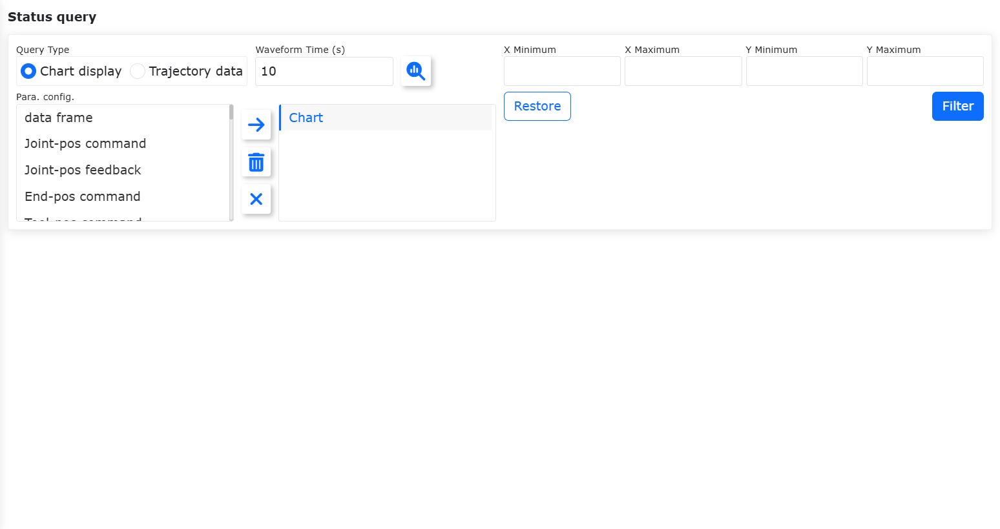
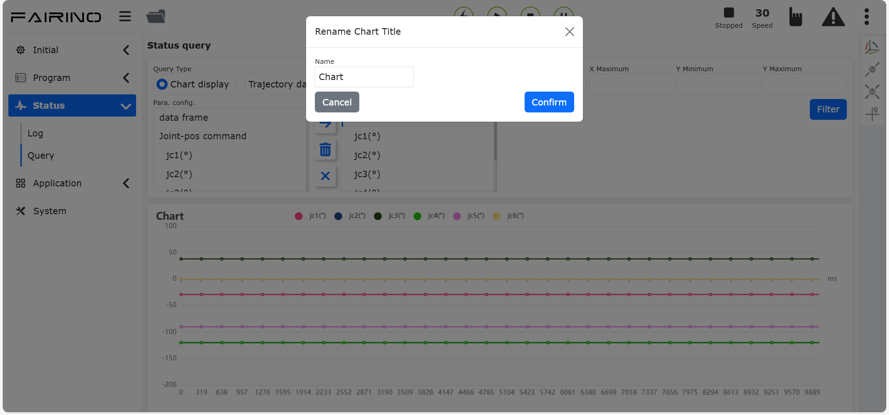

Statusinformationen
===================

.. toctree::
   :maxdepth: 6

Systemprotokoll
---------------

Beim erstmaligen Aufrufen der Oberfläche "Statusinformationen - Systemprotokoll" werden standardmäßig alle Protokolldaten des aktuellen Tages angezeigt.

Die Protokolldaten sind nach Schweregrad unterteilt: Alle, Fehler/Warnung, Grundeinstellungen, Sicherheitseinstellungen, Peripherieeinstellungen, Roboteraktionen, Teachprogramme, Toolanwendungen, Systemeinstellungen und Dateiimport/-export.

In der oberen rechten Ecke der Datentabelle befindet sich ein Suchfeld. Der Benutzer kann basierend auf seinen Suchanforderungen Filterkriterien eingeben, um die Ergebnisse einzugrenzen. Die Oberfläche sieht wie folgt aus:

.. image:: status/001.png
   :width: 6in
   :align: center

.. centered:: Abbildung 13.1‑1 Oberfläche Systemprotokoll

Statusabfrage
-------------

Funktionsverwendung
~~~~~~~~~~~~~~~~~~~~~~~~~~~~

1. Schalten Sie das Steuerungsgehäuse ein und verbinden Sie den PC mit einem Netzwerkkabel.
2. Öffnen Sie auf dem PC einen Browser und rufen Sie die Ziel-IP-Adresse 192.168.58.2 auf. Melden Sie sich mit dem Konto admin und dem Passwort 123 an, um zur Seite zu gelangen.
3. Klicken Sie im linken Menü auf "Statusinformationen" -> "Statusabfrage", um die Oberfläche für die Statusabfrage aufzurufen, wie unten dargestellt.

.. centered:: Abbildung 13.2‑1 Statusabfrage

.. note::
   .. image:: status/006.png
      :width: 0.75in
      :height: 0.75in
      :align: left

   Name: **Schaltfläche "Abfragen"**

   Funktion: Durch Klicken wird der Befehl zum Abfragen von Diagramm-/Trajektoriendaten gesendet. Steht für den Status "Nicht abgefragt".

.. note::
   .. image:: status/007.png
      :width: 0.75in
      :height: 0.75in
      :align: left

   Name: **Schaltfläche "Nach rechts verschieben"**

   Funktion: Durch Klicken wird das links ausgewählte Element zur Liste der Unterelemente auf der rechten Seite hinzugefügt.

.. note::
   .. image:: status/008.png
      :width: 0.75in
      :height: 0.75in
      :align: left

   Name: **Schaltfläche "Löschen"**

   Funktion: Durch Klicken wird das rechts ausgewählte Unterelement gelöscht.

.. note::
   .. image:: status/009.png
      :width: 0.75in
      :height: 0.75in
      :align: left

   Name: **Schaltfläche "Alle löschen"**

   Funktion: Durch Klicken werden alle Unterelemente auf der rechten Seite gelöscht.

4. Wählen Sie die Diagrammanzeige aus, geben Sie die Wellenformzeit ein, wählen Sie links in der Parameterkonfiguration die gewünschten Abfrageparameter aus und klicken Sie auf die Schaltfläche "Nach rechts verschieben", um die Parameter in der rechten Liste zu konfigurieren.

.. note:: Die Wellenformzeit kann individuell eingestellt werden (10-30s). Es können maximal 6 Parameter konfiguriert werden.

5. Klicken Sie auf die Schaltfläche "Abfragen", um die Abfrage zu starten. Entsprechend der Parameterkonfiguration wird das Datenliniendiagramm in Echtzeit angezeigt, wie unten dargestellt.

.. image:: status/003.png
   :width: 6in
   :align: center

.. centered:: Abbildung 13.2‑2 Diagrammanzeige

Diagramm exportieren
~~~~~~~~~~~~~~~~~~~~~~~~

1. Durch Klicken auf den Diagrammtitel öffnet sich ein Dialogfeld, in dem der Diagrammtitel direkt geändert werden kann, wie unten dargestellt:

.. centered:: Abbildung 13.2‑3 Diagrammtitel umbenennen

2. Nach erfolgreichem Stoppen der Abfrage durch Klicken auf die Schaltfläche "Abfrage stoppen" wird die Download-Schaltfläche angezeigt. Nach dem Klicken auf "Download" öffnet der Browser einen Download-Dialog für die Diagrammdatei, deren Name dem Diagrammtitel entspricht. Wie in der folgenden Abbildung dargestellt:

.. image:: status/005.png
   :width: 6in
   :align: center

.. centered:: Abbildung 13.2‑4 Diagramm exportieren

Datenansicht anzeigen
~~~~~~~~~~~~~~~~~~~~~~~~~~~~~

1. Klicken Sie nach dem Stoppen der Abfrage auf die Schaltfläche "Datenansicht" in der oberen rechten Ecke des Diagramms, wie unten dargestellt:

.. image:: status/010.png
   :width: 6in
   :align: center

.. centered:: Abbildung 13.2‑5 Schaltfläche Datenansicht

2. Die Daten in der Ansicht sind wie abgebildet. Der Dateninhalt kann kopiert werden.

.. image:: status/011.png
   :width: 6in
   :align: center

.. centered:: Abbildung 13.2‑6 Anzeige der Datenansicht

Daten filtern
~~~~~~~~~~~~~~~~~~~~~~~~~~~~~

1. Geben Sie nach dem Stoppen der Abfrage die Min-/Max-Werte für x/y ein. Der Datenbereich des Diagramms ändert sich entsprechend, wie unten dargestellt:

.. image:: status/012.png
   :width: 6in
   :align: center

.. centered:: Abbildung 13.2‑7 Oberfläche Datenfilter

2. Klicken Sie auf die Schaltfläche "Zurücksetzen", um den Datenbereich des Diagramms auf die Standardeinstellungen zurückzusetzen, wie unten dargestellt:

.. image:: status/013.png
   :width: 6in
   :align: center

.. centered:: Abbildung 13.2‑8 Daten zurücksetzen