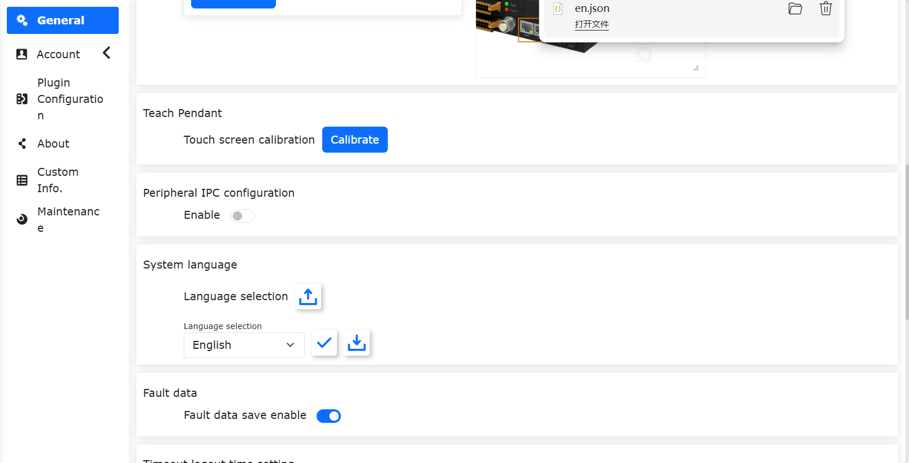
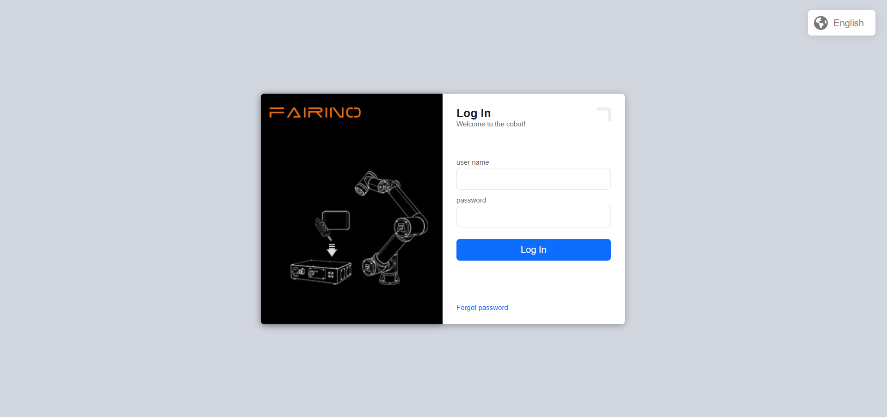
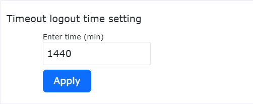
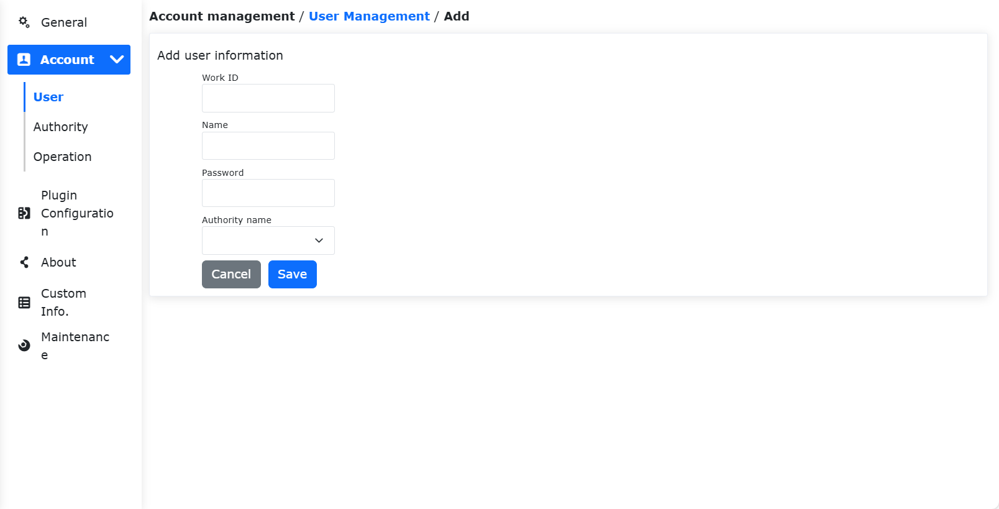
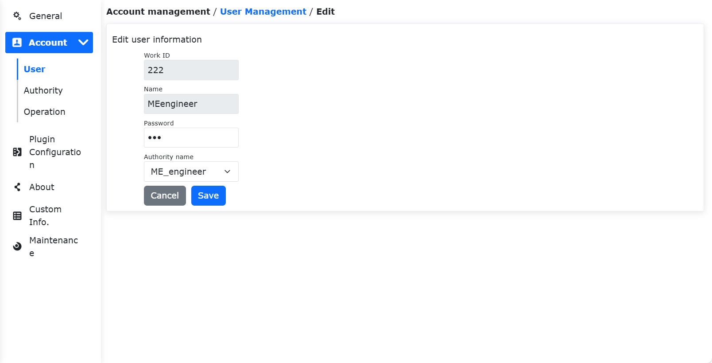
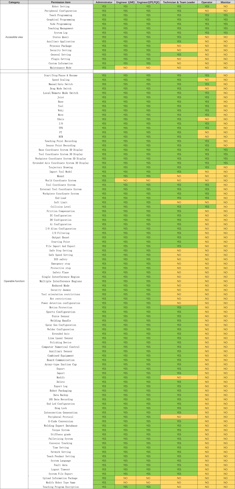
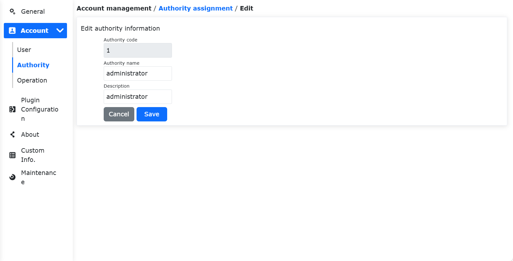
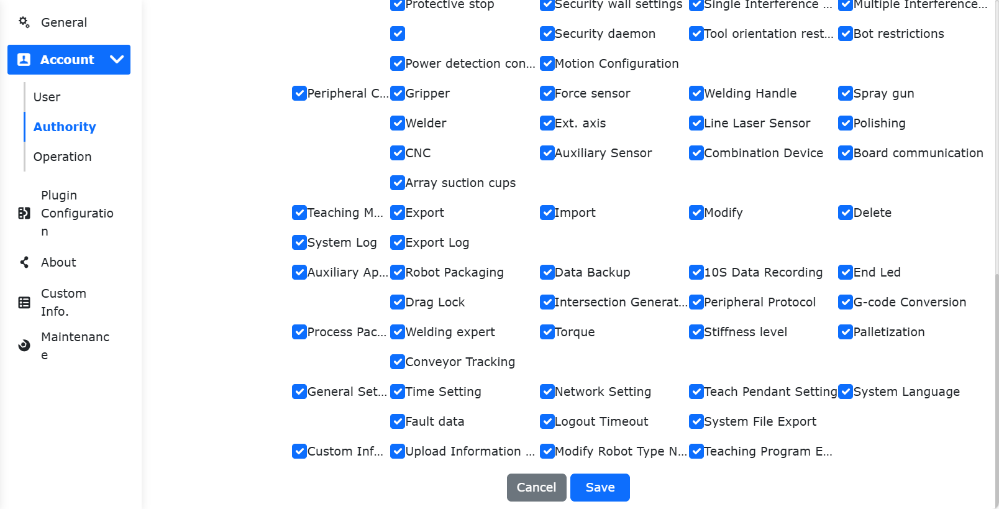
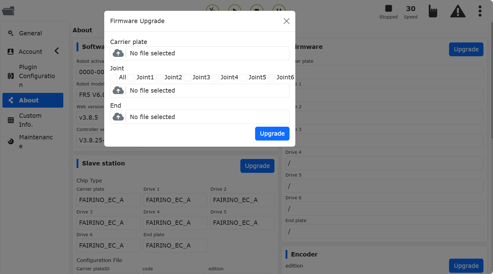
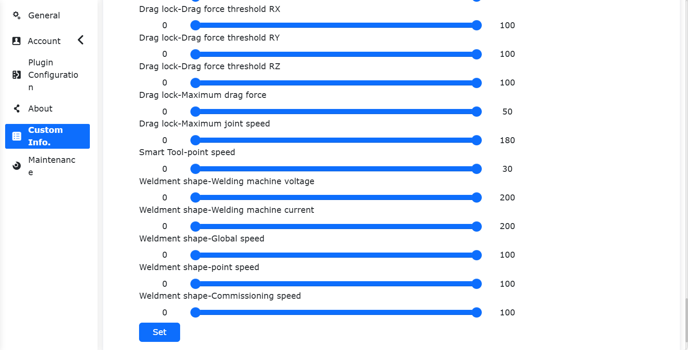

Systemeinstellungen
==========================

.. toctree::
   :maxdepth: 6

Allgemeine Einstellungen
----------------------------------

Klicken Sie in der linken Menüleiste auf "Systemeinstellungen" und dann auf das Untermenü "Allgemeine Einstellungen", um zur Oberfläche der allgemeinen Einstellungen zu gelangen. In den allgemeinen Einstellungen kann die Systemzeit des Roboters basierend auf der aktuellen Computerzeit aktualisiert werden, um die Genauigkeit der Zeitstempel in den Protokollen zu gewährleisten.

.. image:: system/028.png
   :width: 4in
   :align: center

.. centered:: Abbildung 15.1‑1 Zeiteinstellung

In den Netzwerkeinstellungen können die Controller-IP, die Subnetzmaske, das Standard-Gateway, der DNS-Server und die Teach-Pendant-IP konfiguriert werden (diese IP ist gültig, wenn unser FR-HMI-Teach-Pendant verwendet wird; bei Verwendung des FR-HMI-Teach-Pendants muss der Aktivierungsstatus des Teach-Pendants auf "Aktiviert" gesetzt werden). Dies erleichtert die Anpassung an die Einsatzszenarien des Kunden.

Netzwerkeinstellungen
~~~~~~~~~~~~~~~~~~~~~~~~~~~~~~~~

.. image:: system/001.png
   :width: 6in
   :align: center

.. centered:: Abbildung 15.1‑2 Netzwerkeinstellungen (Schema)

- **Netzwerkkarte einstellen**: Geben Sie die IP-Adresse, Subnetzmaske (wird automatisch basierend auf der IP ausgefüllt), das Standard-Gateway und den DNS-Server für die zu kommunizierende Netzwerkkarte ein. Werkseitige Standard-IP für Netzwerkkartenanschluss 0: 192.168.57.2, für Netzwerkkartenanschluss 1: 192.168.58.2.

- **Teach Pendant aktivieren**: Steuert, ob das Teach Pendant aktiviert ist. Standardmäßig ist das Teach Pendant deaktiviert, und das Gerät kann nicht über das Teach Pendant bedient werden. Durch Klicken auf den Schieberegler wird die Bedienung des Geräts über das Teach Pendant aktiviert.

- **Zugriffs-IP**: Wählen Sie die Netzwerkkarte aus, die WebAPP und WebRecovery zugeordnet werden soll. Wenn das Teach Pendant aktiviert ist, wählt WebAPP standardmäßig Netzwerkkarte 1 aus; Netzwerkkarte 0 ist dann nicht wählbar.

- **Netzwerk einstellen**: Klicken Sie auf die Schaltfläche "Netzwerk einstellen". Es erscheint ein Hinweis, dass die Konfiguration läuft. Nach Abschluss der Konfiguration muss das Gerät neu gestartet werden.

Anmeldeloser Betrieb
++++++++++++++++++++++++++++++++++++++++++++++++++++++

Funktionsüberblick
***************************

Nach Aktivierung der Funktion "Anmeldeloser Betrieb über physisches Teach Pendant" können folgende Funktionen realisiert werden:

- Wenn der Benutzer nicht an der Teach-Pendant-Oberfläche angemeldet ist, kann der Roboter durch Drehen des physischen Schlüsselschalters zwischen Hand- und Automatikmodus umgeschaltet werden. Die Farbe der LED am Flansch ändert sich entsprechend.
- Wenn der Benutzer nicht an der Teach-Pendant-Oberfläche angemeldet ist, kann der Roboter im Automatikmodus durch Drücken des physischen Startschalters das aktuell geladene Programm starten.
- Wenn der Benutzer nicht an der Teach-Pendant-Oberfläche angemeldet ist, kann der Roboter im Automatikmodus durch Drücken des physischen Stoppschalters gestoppt werden.

Anwendungshinweise
***************************
Melden Sie sich an der WebAPP-Seite an, klicken Sie auf "Systemeinstellungen", dann auf "Allgemeine Einstellungen". Aktivieren Sie im Bereich Netzwerk - Teach Pendant den Schalter "Teach Pendant aktivieren" und dann den Schalter "Anmeldeloser Betrieb". Nach Aktivierung der Funktion können die physischen Tasten verwendet werden, um den Roboter im Hand-/Automatikmodus zu schalten und das Programm zu starten/stoppen, ohne an der Teach-Pendant-Seite angemeldet zu sein. Diese Konfiguration bleibt nach einem Neustart erhalten.

.. image:: system/045.png
   :width: 6in
   :align: center

.. centered:: Abbildung 15.1‑2-1 Aktivieren der Funktion "Anmeldeloser Betrieb"

Teach-Pendant Touchscreen-Kalibrierung
~~~~~~~~~~~~~~~~~~~~~~~~~~~~~~~~~~~~~~~~~~~~~~~~~~

Nach der Aktivierung des Teach Pendants kann eine Kalibrierung des Touchscreens durchgeführt werden.

.. centered:: Abbildung 15.1‑3 Teach-Pendant Touchscreen-Kalibrierung

Konfiguration des externen Industrie-PCs
~~~~~~~~~~~~~~~~~~~~~~~~~~~~~~~~~~~~~~~~~~~~~~~~~~

Für die Aktivierung eines externen Industrie-PCs muss eine IP-Adresse eingegeben werden. Nach erfolgreicher Konfiguration müssen der Steuerschrank und der Industrie-PC neu gestartet werden.

.. image:: system/030.png
   :width: 4in
   :align: center

.. centered:: Abbildung 15.1‑4 Konfiguration des externen Industrie-PCs

Systemsprache
~~~~~~~~~~~~~~~~~~~~~~~~~~~~~~~~~~

Sprache importieren
++++++++++++++++++++++++

Wählen Sie ein Sprachpaket aus, um den Importvorgang durchzuführen (Hinweis: Das Importdateiformat ist `[Sprachcode].json`). Wenn der Import erfolgreich ist und das Sprachpaket nicht bereits im System vorhanden war, wird dem System ein neuer Eintrag mit den importierten Sprachpaketdaten hinzugefügt.

.. image:: system/031.png
   :width: 4in
   :align: center

.. centered:: Abbildung 15.1‑5 Systemsprache-Oberfläche

Sprache exportieren
+++++++++++++++++++++++++
Wählen Sie eine Systemsprache aus, z.B. Englisch. Klicken Sie auf die Schaltfläche "Exportieren". Die Seite bietet eine herunterladbare Datei zum Export an.

.. centered:: Abbildung 15.1‑6 Systemsprache exportieren

Sprache anwenden
++++++++++++++++++++++++++++

Wählen Sie eine Systemsprache aus und klicken Sie auf die Schaltfläche "Anwenden", um die Systemsprache zu wechseln. Nach erfolgreicher Anwendung der Sprache wird das System automatisch zur Anmeldeseite abgemeldet, und die Systemsprache ist auf die gewählte Sprache umgestellt. Am Beispiel Englisch:

.. centered:: Abbildung 15.1‑7 Oberfläche nach erfolgreichem Sprachwechsel

Systemwiederherstellung im abgesicherten Modus
++++++++++++++++++++++++++++++++++++++++++++++++++++

Wenn ein System-Upgrade/Downgrade durchgeführt werden muss oder das System aufgrund eines fehlerhaften Imports eines Sprachpakets nicht mehr normal startet, muss die Oberfläche "Systemwiederherstellung im abgesicherten Modus" aufgerufen werden. Die genaue Vorgehen ist wie folgt:
1.  Gehen Sie zu Systemeinstellungen -> Allgemeine Einstellungen -> Netzwerkeinstellungen. Stellen Sie die Zugriffs-IP für WebRecovery auf Netzwerkkarte 0 und klicken Sie auf "Netzwerk einstellen".

.. image:: system/037.png
   :width: 6in
   :align: center

.. centered:: Abbildung 15.1‑8 WebRecovery Netzwerkkarteneinstellung

2.  Starten Sie nach erfolgreicher Netzwerkeinstellung den Steuerschrank neu. Ändern Sie die IP-Adresse auf 192.168.57.xxx und verbinden Sie ein Netzwerkkabel mit Netzwerkkarte 0 des Steuerschranks.
3.  Rufen Sie die URL "192.168.57.2:8050" auf, um zur Oberfläche "Systemwiederherstellung im abgesicherten Modus" zu gelangen.

.. image:: system/038.png
   :width: 3in
   :align: center

.. centered:: Abbildung 15.1‑9 Oberfläche "Systemwiederherstellung im abgesicherten Modus"

- Software-Upgrade-Paket importieren: Zum Upgrade/Downgrade des Systemsoftwarepakets.
- Werkseinstellungen der Sprache wiederherstellen: Löscht importierte und angewandte Sprachpaketdaten, stellt das werkseitige Sprachpaket wieder her. Die Standardsprache wird auf Englisch gesetzt.

Fehlerdaten
~~~~~~~~~~~~~~~~~~~~~~~~~~~~~~~~

Aktivieren Sie die Schaltfläche "Fehlerdaten speichern aktivieren". Wenn ein Fehler in der Steuerung auftritt, wird eine Fehlerdatendatei generiert, die die Daten 15 Sekunden vor und nach dem Fehlerzeitpunkt speichert.

Nach Abschluss der Speicherung können Sie in den Systemeinstellungen "Alle Datenquellen exportieren" auswählen und die Datei `error_data.tar.gz` entpacken, um die Fehlerdatendateien einzusehen.

.. image:: system/039.png
   :width: 3in
   :align: center

.. centered:: Abbildung 15.1‑10 Fehlerdaten

Einstellung der automatischen Abmeldung bei Inaktivität
~~~~~~~~~~~~~~~~~~~~~~~~~~~~~~~~~~~~~~~~~~~~~~~~~~~~~~~~~~~~~~~~~

Der Benutzer kann die Zeit für die automatische Abmeldung bei Inaktivität einstellen. Nach Ablauf dieser Zeit wird der Benutzer automatisch abgemeldet. Einheit: Minuten.

.. centered:: Abbildung 15.1‑11 Einstellung der automatischen Abmeldung bei Inaktivität

Systemeinstellungen
~~~~~~~~~~~~~~~~~~~~~~~~~~~~~~~~

Unter "Systemwiederherstellung" können Sie mit "Auf Werkseinstellungen zurücksetzen" alle Benutzerdaten löschen und den Roboter in den Auslieferungszustand zurückversetzen.

Die Funktionen "Slave-Protokoll generieren" und "Controller-Protokoll exportieren" dienen dem Herunterladen von Protokolldateien mit wichtigen Status- oder Fehleraufzeichnungen der Steuerung, um die Fehlersuche am Roboter zu erleichtern.

.. image:: system/034.png
   :width: 4in
   :align: center

.. centered:: Abbildung 15.1‑12 Systemeinstellungen

Kontoeinstellungen
------------------------

Klicken Sie auf das Untermenü "Kontoeinstellungen", um zur Kontoeinstellungsoberfläche zu gelangen. Die Kontoverwaltungsfunktion steht nur Administratoren zur Verfügung. Die Funktion ist in die folgenden drei Module unterteilt:

Benutzerverwaltung
~~~~~~~~~~~~~~~~~~~~~~~~~~~~~~~~

Auf der Benutzerverwaltungsseite werden Benutzerinformationen gespeichert. Es können Personalnummern, Funktionen usw. von Benutzern hinzugefügt werden. Benutzer können sich mit einem in der Benutzerliste vorhandenen Benutzernamen und Passwort anmelden.

.. image:: system/002.png
   :width: 6in
   :align: center

.. centered:: Abbildung 15.2‑1 Benutzerverwaltung

- **Benutzer hinzufügen**: Klicken Sie auf die Schaltfläche "Hinzufügen". Geben Sie Personalnummer, Namen, Passwort ein und wählen Sie eine Funktion aus.

.. important::
   Die Personalnummer ist ein ganzzahliger Wert mit maximal 10 Stellen. Sowohl Personalnummer als auch Passwort müssen eindeutig sein. Das Passwort wird in Blindenschrift (als Punkte) angezeigt. Nach erfolgreichem Hinzufügen des Benutzers kann man sich mit Namen und Passwort neu anmelden.

.. centered:: Abbildung 15.2‑2 Benutzer hinzufügen

- **Benutzer bearbeiten**: Wenn eine Benutzerliste vorhanden ist, klicken Sie auf die Schaltfläche "Bearbeiten" rechts. Personalnummer und Name können nicht geändert werden. Passwort und Funktion können geändert werden. Das Passwort muss ebenfalls eindeutig sein.

.. centered:: Abbildung 15.2‑3 Benutzer bearbeiten

- **Benutzer löschen**: Das Löschen kann einzeln oder als Batch erfolgen.

  1. Klicken Sie rechts in der Liste auf die Schaltfläche "Löschen" für einen einzelnen Eintrag. Es erscheint ein Hinweis "Bitte klicken Sie erneut auf die Lösch-Schaltfläche, um das Löschen zu bestätigen." Ein erneuter Klick löscht diesen Eintrag erfolgreich.

  2. Aktivieren Sie die Kontrollkästchen links, um die zu löschenden Benutzer auszuwählen, und klicken Sie dann oben in der Liste zweimal auf die Batch-Schaltfläche "Löschen", um die Auswahl zu löschen.

.. important::
   Der initiale Benutzer `111` und der aktuell angemeldete Benutzer können nicht gelöscht werden.

.. image:: system/002.png
   :width: 6in
   :align: center

.. centered:: Abbildung 15.2‑4 Benutzer löschen

Rechteverwaltung
~~~~~~~~~~~~~~~~~~~~~~~~~~~~~~~~

.. important::
   Die standardmäßigen Funktionsdaten (Funktionscodes 1-6) können nicht gelöscht werden. Der Funktionscode kann nicht geändert werden. Der Funktionsname, die Funktionsbeschreibung und die Berechtigungen der Funktion können geändert werden.

.. image:: system/006.png
   :width: 6in
   :align: center

.. centered:: Abbildung 15.2‑5 Rechteverwaltung

Es gibt sechs Standardfunktionen. Der Administrator hat keine Funktionseinschränkungen. Bediener und Beobachter können nur einen Teil der Funktionen nutzen. ME-Ingenieure, PE&PQE-Ingenieure sowie Techniker und Gruppenleiter haben teilweise Funktionseinschränkungen. Der Administrator hat keine Funktionseinschränkungen. Die spezifischen Standardberechtigungen sind in der folgenden Tabelle aufgeführt:

.. important::
   Die Standardberechtigungen können geändert werden.

.. centered:: Tabelle 15.2‑1 Berechtigungsdetails

- **Funktion hinzufügen**: Klicken Sie auf die Schaltfläche "Hinzufügen". Geben Sie Funktionscode, Funktionsname und Funktionsbeschreibung ein. Klicken Sie auf die Schaltfläche "Speichern". Nach erfolgreichem Vorgang kehren Sie zur Listenansicht zurück. Der Funktionscode muss eine ganze Zahl größer 0 sein und darf nicht mit einem bereits vorhandenen Funktionscode identisch sein. Alle Eingabefelder sind Pflichtfelder.

.. image:: system/008.png
   :width: 6in
   :align: center

.. centered:: Abbildung 15.2‑6 Funktion hinzufügen

- **Funktionsnamen und -beschreibung bearbeiten**: Klicken Sie in der Tabellenaktionsspalte auf das Symbol "Bearbeiten". Sie können den Funktionsnamen und die Funktionsbeschreibung der aktuellen Funktion ändern. Klicken Sie nach der Änderung unten auf die Schaltfläche "Speichern", um die Änderungen zu bestätigen.

.. centered:: Abbildung 15.2‑7 Funktion bearbeiten

- **Funktionsberechtigungen festlegen**: Klicken Sie in der Tabellenaktionsspalte auf das Symbol "Einstellen". Sie können die Berechtigungen der aktuellen Funktion festlegen. Klicken Sie nach der Einstellung unten auf die Schaltfläche "Speichern", um die Einstellungen zu bestätigen.

.. image:: system/010.png
   :width: 6in
   :align: center

.. centered:: Abbildung 15.2‑8 Funktionsberechtigungen festlegen

- **Funktion löschen**: Klicken Sie in der Tabellenaktionsspalte auf das Symbol "Löschen". Es wird zunächst überprüft, ob die aktuelle Funktion von einem Benutzer verwendet wird. Wenn kein Benutzer die Funktion verwendet, kann sie gelöscht werden; andernfalls ist das Löschen nicht möglich.

.. image:: system/012.png
   :width: 6in
   :align: center

.. centered:: Abbildung 15.2‑9 Funktion löschen

Importieren / Exportieren
~~~~~~~~~~~~~~~~~~~~~~~~~~~~~~~~

.. image:: system/013.png
   :width: 6in
   :align: center

.. centered:: Abbildung 15.2‑10 Kontoeinstellungen Importieren/Exportieren

- **Importieren**: Klicken Sie auf die Schaltfläche "Importieren", um Daten der Benutzerverwaltung und Rechteverwaltung im Batch zu importieren.

- **Exportieren**: Klicken Sie auf die Schaltfläche "Exportieren", um Daten der Benutzerverwaltung und Rechteverwaltung im Batch zu exportieren.

Über
--------------

Klicken Sie auf das Untermenü "Über", um zur Über-Oberfläche zu gelangen. Diese Seite zeigt das Modell und die Seriennummer des Roboters, die vom Roboter verwendete Web-Version und Steuerschrank-Version sowie die Hardware-Version und Firmware-Version an.

.. image:: system/014.png
   :width: 6in
   :align: center

.. centered:: Abbildung 15.3‑1 Über (Schema)

Software-Upgrade
~~~~~~~~~~~~~~~~~~~~~~~~~~~~~~~~~~~~~~~~~~~~~~~~~~~~~~~~~

Vorbereitung
+++++++++++++++++++++++++++++++++++++++

1.  Überprüfen Sie vor dem Upgrade in "Systemeinstellungen - Über" die aktuelle Softwareversion und bestätigen Sie sie.
2.  Das Software-Upgrade-Paket kann unter der entsprechenden Version im FAIRINO-Dokument "Download - Robotersoftware-Download" heruntergeladen werden. Nach dem Entpacken enthält es das Software-Upgrade-Paket `software.tar.gz` für die entsprechende Version.

Wichtige Hinweise
+++++++++++++++++++++++++++++++++++++++

1.  **Datensicherung**: Es wird empfohlen, vor dem Upgrade eine Sicherung durchzuführen (Methode siehe Abschnitt 3.2.1), um Datenverlust aufgrund von Upgrade-Fehlern zu vermeiden.
2.  **Versionsbeschränkungen**:

.. centered:: Tabelle 15.3‑1 Versions-Upgrade-Beschränkungen

.. list-table::
   :widths: 50 50
   :header-rows: 0
   :align: center

   * - **Aktuelle Version**
     - **Maximal upgradebare Version**

   * - < v3.6.1
     - v3.6.1

   * - v3.6.1 - v3.6.4
     - v3.6.5

   * - v3.6.5 - v3.6.8
     - v3.6.9

   * - v3.6.9 - v3.7.4
     - v3.7.5

   * - v3.7.5
     - v3.7.6

   * - ≥ v3.7.6
     - Keine Einschränkung

3.  **Cache leeren**: Nach jedem Upgrade (insbesondere nach größeren Versionssprüngen) wird empfohlen, den Browser-Cache zu leeren, um einen reibungslosen Systembetrieb zu gewährleisten.

Vorgehen
*****************************

**Software-Upgrade**:

1.  Klicken Sie im Menü "Systemeinstellungen" -> "Über" auf die Schaltfläche "Upgrade", um das Software-Upgrade zu starten.

.. image:: system/040.png
   :width: 6in
   :align: center

.. centered:: Abbildung 15.3‑2 System-Upgrade-Oberfläche

2.  Klicken Sie auf "Datei auswählen" und wählen Sie das von der Website heruntergeladene Softwarepaket `software.tar.gz` aus.

.. important::
   Der Name des Software-Upgrade-Pakets muss exakt `software.tar.gz` lauten. Wenn der Paketname abweicht, schlägt das Upgrade fehl. Benennen Sie das Paket in den korrekten Namen um.

3.  Klicken Sie auf "Upgrade-Paket hochladen", um das Upgrade zu starten. Während des Upgrades wird ein Fortschrittsbalken angezeigt.

4.  Wenn der Fortschrittsbalken 100 % erreicht hat, erscheint auf der Oberfläche die Meldung "Upgrade erfolgreich, bitte Steuerschrank neu starten".

.. image:: system/041.png
   :width: 4in
   :align: center

.. centered:: Abbildung 15.3‑3 Software-Upgrade erfolgreich

5.  Starten Sie den Steuerschrank neu. Das Upgrade ist abgeschlossen. Überprüfen Sie die Versionsinformationen unter "Über".

**Firmware-Upgrade**: Versetzen Sie den Roboter in den BOOT-Modus, laden Sie das Upgrade-Komprimierungspaket hoch, wählen Sie die zu aktualisierenden Slaves aus (Steuerschrank-Slave, Hauptantriebs-Slaves 1~6, Flansch-Slave) und führen Sie das Upgrade durch. Der Upgradestatus wird angezeigt.

.. centered:: Abbildung 15.3‑4 Firmware-Upgrade

**Slave-Konfigurationsdatei-Upgrade**: Deaktivieren Sie den Roboter (Enable entfernen), laden Sie die Upgrade-Datei hoch, wählen Sie die zu aktualisierenden Slaves aus (Steuerschrank-Slave, Hauptantriebs-Slaves 1~6, Flansch-Slave) und führen Sie das Upgrade durch. Der Upgradestatus wird angezeigt.

.. image:: system/043.png
   :width: 6in
   :align: center

.. centered:: Abbildung 15.3-5 Slave-Konfigurationsdatei-Upgrade

**Encoder-Upgrade**: Deaktivieren Sie den Roboter (Enable entfernen), laden Sie die Upgrade-Datei hoch, wählen Sie die zu aktualisierenden Gelenke Joint1~Joint6 aus und konfigurieren Sie den Encoder-Modus.

.. image:: system/044.png
   :width: 6in
   :align: center

.. centered:: Abbildung 15.3-6 Encoder-Upgrade

Benutzerdefinierte Informationen
--------------------------------------------

Klicken Sie auf das Untermenü "Benutzerdefinierte Informationen", um zur entsprechenden Oberfläche zu gelangen. Die Funktion für benutzerdefinierte Informationen steht nur Administratoren zur Verfügung. Auf dieser Seite können Benutzerinformationspakete hochgeladen, das Robotermodell konfiguriert und der Verschlüsselungsstatus von Teach-Programmen eingestellt werden.

.. image:: system/015.png
   :width: 6in
   :align: center

.. centered:: Abbildung 15.4‑1 Benutzerdefinierte Informationen (Schema)

Robotermodell
~~~~~~~~~~~~~~~~~~~~~~~~~~~~~~~~~~~~~

.. important::
   1. Die hier konfigurierte Robotermodellbezeichnung ist eine benutzerdefinierte Modellbezeichnung und unterscheidet sich von der Modellbezeichnung, die unter "Systemeinstellungen" -> "Wartungsmodus" -> "Controller-Kompatibilität" konfiguriert wird.
   2. Es wird nicht empfohlen, Bezeichnungen zu verwenden, die mit "FR" oder "ART" beginnen. Wenn ein benutzerdefiniertes Robotermodell mit "FR" oder "ART" am Anfang eingegeben wird, muss der eingegebene Modellname mit der "Modellkurzbezeichnung" in der Robotermodell-Referenztabelle übereinstimmen (die Robotermodell-Referenztabelle ist im Kapitel "Robotermodell-Konfiguration" zu finden).

Parameterbereichskonfiguration
~~~~~~~~~~~~~~~~~~~~~~~~~~~~~~~~~~~~~~~~~~~~~~~~

Die Parameterbereichskonfiguration kann nur vom Administrator vorgenommen werden. Die Parameter anderer berechtigter Mitglieder können nur innerhalb des vom Administrator festgelegten Parameterbereichs eingestellt werden.

Es gibt zwei Möglichkeiten der Parametereinstellung: Ziehen eines Schiebereglers oder manuelle Eingabe.

.. important::
   Der Maximalwert des Parameterbereichs muss größer als der Minimalwert sein. 3 Sekunden nach erfolgreicher Konfiguration des Parameterbereichs wird automatisch zur Anmeldeseite weitergeleitet. Eine erneute Anmeldung ist erforderlich.

.. image:: system/016.png
   :width: 6in
   :align: center

.. centered:: Abbildung 15.4‑2 Parameterbereichskonfiguration (Schema)

Lizenzierte Nutzungsdauer des Roboters
~~~~~~~~~~~~~~~~~~~~~~~~~~~~~~~~~~~~~~~~~~~~~~~~~~~~~~~~~~~~~~~~~~~~~~~~

1.  Sperrbildschirm-Einstellung

Zeigen Sie unter "Benutzerdefinierte Informationen" die lizenzierte Nutzungsdauer des Roboters an und legen Sie fest, ob diese Funktion aktiviert ist. Wenn Sie die Funktion aktivieren möchten, wählen Sie ein Nutzungsende-Datum aus. Wenn Sie kein Datum auswählen, erscheint ein Hinweis "Nutzungsende-Datum darf nicht leer sein".

.. note:: Wenn die Sperrbildschirm-Funktion einmal aktiviert wurde, kann sie nicht erneut konfiguriert werden, und die Systemzeit kann nicht mehr aktualisiert werden.

Wählen Sie das Nutzungsende-Datum aus und klicken Sie auf die Schaltfläche "Konfigurieren".

.. image:: system/023.png
   :width: 6in
   :align: center

.. centered:: Abbildung 15.4‑3 Einstellung der lizenzierten Nutzungsdauer (deaktiviert)

.. image:: system/024.png
   :width: 6in
   :align: center

.. centered:: Abbildung 15.4‑4 Einstellung der lizenzierten Nutzungsdauer (aktiviert)

2.  Ablaufhinweis

Wenn die Funktion "Lizenzierte Nutzungsdauer" aktiviert ist, erscheinen nach der Anmeldung folgende Hinweise:

1) 5 Tage vor Ablauf der Nutzungsdauer erscheint nach erfolgreichem Einschalten und Anmelden ein Popup-Fenster mit einem Hinweis auf die verbleibenden Tage. Durch Drücken von "Zurücksetzen" kann der Hinweis geschlossen werden.

.. image:: system/025.png
   :width: 6in
   :align: center

.. centered:: Abbildung 15.4‑5 Einschalthinweis

2) Wenn das Gerät durchgehend in Betrieb ist, erscheint 5 Tage vor Ablauf der Nutzungsdauer um Mitternacht automatisch ein Popup-Fenster mit einem Hinweis auf die verbleibenden Tage. Durch Drücken von "Zurücksetzen" kann der Hinweis geschlossen werden.

.. image:: system/026.png
   :width: 6in
   :align: center

.. centered:: Abbildung 15.4‑6 Hinweis bei Dauerbetrieb

3.  Entsperren und Anmelden

Wenn die Funktion "Lizenzierte Nutzungsdauer" aktiviert ist und das Gerät abgelaufen ist, gelangt man bei der ersten Anmeldung an der WebApp direkt zur Sperrbildschirm-Oberfläche. Wenn das Gerät durchgehend in Betrieb ist, wird es um Mitternacht nach Abruf der Sperrbildschirmdaten automatisch abgemeldet und zur Sperrbildschirm-Oberfläche weitergeleitet. Geben Sie hier den Entsperrcode ein, um zur Anmeldeoberfläche zu gelangen, und melden Sie sich mit Ihren Anmeldeinformationen an.

.. note:: Der Integrator generiert den verschlüsselten Entsperrcode.

.. image:: system/027.png
   :width: 6in
   :align: center

.. centered:: Abbildung 15.4‑7 Sperrbildschirm-Oberfläche

Robotermodell-Konfiguration
----------------------------------

.. important:: Wenn Sie das Robotermodell ändern müssen, setzen Sie sich bitte mit unserem technischen Support in Verbindung und führen Sie die Änderung nur unter dessen Anleitung durch.

Melden Sie sich nach der Anmeldung an der Web-Konsole des kollaborativen Roboters an und ändern Sie die Konfiguration unter "Systemeinstellungen" -> "Wartungsmodus" -> "Controller-Kompatibilität", indem Sie das entsprechende Modell auswählen. Die Robotermodelle sind in der folgenden Tabelle aufgeführt.

Robotermodell-Tabelle:

.. list-table::
   :widths: 10 58 32
   :header-rows: 0
   :align: center

   * - **Wert**
     - **Modell (Hauptmodell - Hauptversion - Nebenversion)**
     - **Modellkurzbezeichnung**

   * - 0
     - Nicht konfiguriert
     - /

   * - 1
     - FR3-V1-000(V5.0)
     - FR3 V5.0

   * - 2
     - FR3-V1-001(V6.0)
     - FR3 V6.0

   * - 3
     - FR3-V1-002(V6.0 Mirror)
     - FR3 V6.0(Mirror)

   * - ...
     - Reserviert
     - /

   * - 101
     - FR5-V1-000
     - FR5 V4.0

   * - 102
     - FR5-V1-001(V5.0)
     - FR5 V5.0

   * - 103
     - FR5-V1-002(V6.0)
     - FR5 V6.0

   * - ...
     - Reserviert
     - /

   * - 201
     - FR10-V1-000(V5.0)
     - FR10 V5.0

   * - 202
     - FR10-V1-001(V6.0)
     - FR10 V6.0

   * - ...
     - Reserviert
     - /

   * - 301
     - FR16-V1-000(V5.0)
     - FR16 V5.0

   * - 302
     - FR16-V1-001(V6.0)
     - FR16 V6.0

   * - ...
     - Reserviert
     - /

   * - 401
     - FR20-V1-000(V5.0)
     - FR20 V5.0

   * - 402
     - FR20-V1-001(V6.0)
     - FR20 V6.0

   * - ...
     - Reserviert
     - /

   * - 501
     - ART3-V1-000
     - ART3

   * - ...
     - Reserviert
     - /

   * - 601
     - ART5-V1-000
     - ART5

   * - ...
     - Reserviert
     - /

   * - 702
     - FRCustom(7)-V1-001(FR3-WML)
     - FR3-WML

   * - 703
     - FRCustom(7)-V1-001(FR3-WMS)
     - FR3-WMS

   * - ...
     - Reserviert
     - /

   * - 802
     - FRCustom(8)-V1-001(FR5WM)
     - FR5WM

   * - 803
     - FRCustom(8)-V1-002(FR5-WML)
     - FR5-WML

   * - 804
     - FRCustom(8)-V1-003(FR5-C)
     - FR5-C

   * - ...
     - Reserviert
     - /

   * - 901
     - FRCustom(9)-V1-001(FR3MT)
     - FR3MT

   * - 902
     - FRCustom(9)-V1-001(FR10YD)
     - FR10YD

   * - 904
     - FRCustom(9)-V1-001(FR3-C)
     - FR3-C

   * - 905
     - FRCustom(9)-V01-001(FR30L)
     - FR30L

   * - 906
     - FRCustom(9)-V01-001(FR3(C))
     - FR3(C)

   * - 907
     - FRCustom(9)-V01-001(ART3-R6-XM)
     - ART3-R6-XM

   * - 908
     - FRCustom(9)-V01-001(FC3-R6-B)
     - FC3-R6-B

   * - ...
     - Reserviert
     - /

   * - 1001
     - FR30-V1-001(V6.0)
     - FR30 V6.0

   * - ...
     - Reserviert
     - /

.. note:: Es sind 10 Hauptversionen (1-10) und 10 Nebenversionen (1-10) reserviert.