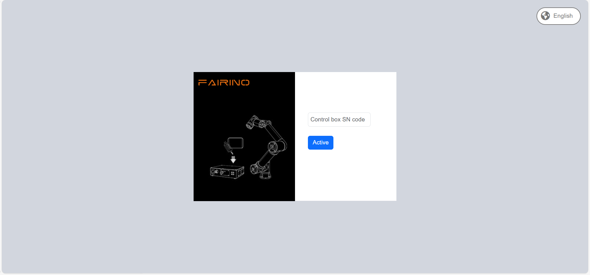

Teachpendant
============

.. toctree::
   :maxdepth: 6

Teachpendant aktivieren
-----------------------

1. Verbinden Sie das Teachpendant mit dem Steuerungsgehäuse und starten Sie es.

2. Melden Sie sich mit dem Konto `admin` und dem Passwort `123` an. Navigieren Sie zu "Systemeinstellungen" -> "Allgemeine Einstellungen" und vergewissern Sie sich, dass das Teachpendant auf "Aktiviert" gesetzt ist.

.. image:: teach_pendant/001.png
   :width: 6in
   :align: center

.. centered:: Abbildung 16.1‑1 Aktivierungsstatus Teachpendant

Spracheinstellungen am Teachpendant
-----------------------------------

1. Die Sprachauswahl kann entweder auf dem Anmeldebildschirm oder (falls zutreffend) auf dem Ersteinrichtungsbildschirm in der oberen rechten Ecke vorgenommen werden.

.. centered:: Abbildung 16.2‑1 Sprache im Aktivierungsbildschirm einstellen

.. image:: teaching_pendant_software/063.png
   :width: 6in
   :align: center

.. centered:: Abbildung 16.2‑2 Sprache im Anmeldebildschirm einstellen

2. Am Beispiel der Spracheinstellung über den Anmeldebildschirm: Wählen Sie die gewünschte Sprache aus. Die folgenden Hinweise (in der entsprechenden Sprache) bestätigen die erfolgreiche Einstellung. Starten Sie das Steuerungsgehäuse neu, um die Sprache zu übernehmen.

.. image:: teach_pendant/004.png
   :width: 6in
   :align: center

.. centered:: Abbildung 16.2‑3 Einstellung auf Chinesisch

.. image:: teach_pendant/005.png
   :width: 6in
   :align: center

.. centered:: Abbildung 16.2‑4 Einstellung auf Englisch

Eingabemethode umschalten
~~~~~~~~~~~~~~~~~~~~~~~~~~~~~~~~~~~~~~~~

Die Standardeingabemethode ist Englisch.

1. Öffnen Sie die Bildschirmtastatur unten rechts und klicken Sie in ein Eingabefeld, z. B. das Feld für den Benutzernamen.

2. Umschalten auf die chinesische Pinyin-Eingabemethode:

   Drücken Sie zweimal die STRG-Taste. Der Tastenzustand wechselt zu Rot. Drücken Sie die Leertaste, um die Eingabemethode auszuwählen. Das Folgende ist die chinesische Eingabemethode.

   .. image:: teach_pendant/006.png
      :width: 6in
      :align: center

   .. centered:: Abbildung 16.2‑5 Chinesische Pinyin-Eingabemethode

3. Zurückschalten auf die englische Eingabemethode:

   Drücken Sie zweimal die STRG-Taste. Der Tastenzustand wechselt zu Rot. Drücken Sie die Leertaste, um die Eingabemethode auszuwählen. Das Folgende ist die englische Eingabemethode.

   .. image:: teach_pendant/007.png
      :width: 6in
      :align: center

   .. centered:: Abbildung 16.2‑6 Englische Eingabemethode

Nach erfolgreicher Anmeldung lädt das System Modelldaten usw. Sobald der Ladevorgang abgeschlossen ist, gelangen Sie zur Startseite.

Sprachinkonsistenz zwischen Teachpendant und WebApp
~~~~~~~~~~~~~~~~~~~~~~~~~~~~~~~~~~~~~~~~~~~~~~~~~~~

Nach der Aktivierung des Teachpendants wird auf dem Anmeldebildschirm ein Abgleich der Sprache zwischen Teachpendant und WebApp durchgeführt. Bei Inkonsistenz wird der folgende Hinweis angezeigt.

.. image:: teach_pendant/008.png
   :width: 6in
   :align: center

.. centered:: Abbildung 16.2‑7 Hinweis auf Sprachinkonsistenz zwischen Teachpendant und WebApp

IP-Reset-Funktion für Controller und physisches Teachpendant
-------------------------------------------------------------

Funktionsübersicht
~~~~~~~~~~~~~~~~~~~~~~~~~~~~~~~~~~~~~~~~~~~~

Diese Optimierung erweitert die Möglichkeiten zum Zurücksetzen der IP-Adressen von Controller und physischem Teachpendant. Die folgenden Aktionen sind möglich:

- 1. Über die Webrecovery-Oberfläche können die IP-Adressen von Netzwerkkarte 0 und Netzwerkkarte 1 des Steuerungsgehäuses zurückgesetzt werden.
- 2. Über die benutzerdefinierte F1-Taste am physischen Teachpendant (konfigurierbar für IP-Reset, 10 Sekunden lang gedrückt halten) können die IP-Adressen von Netzwerkkarte 0, Netzwerkkarte 1 des Steuerungsgehäuses sowie des physischen Teachpendants zurückgesetzt werden.
- 3. Durch gleichzeitiges, 10-sekündiges Drücken der Tasten F2 und F4 am physischen Teachpendant kann die IP-Adresse des Teachpendant-Geräts zurückgesetzt werden, auch wenn nicht in der WebApp angemeldet ist.

.. image:: teach_pendant/010.png
   :width: 5in
   :align: center

.. centered:: Abbildung 16.3‑1 Netzwerkanschlüsse Mini-Steuerungsgehäuse

IP-Reset über die Webrecovery-Oberfläche
~~~~~~~~~~~~~~~~~~~~~~~~~~~~~~~~~~~~~~~~~~~~~~~~~~~~~~~~~~~~~~

Melden Sie sich über Port 8050 an der Webrecovery-Oberfläche an (z. B. Standard-IP: `192.168.57.2:8050`). Klicken Sie im Bereich "Controller-IP zurücksetzen" auf die Schaltfläche "Zurücksetzen". Es erscheint ein zweites Pop-up zur Bestätigung. Klicken Sie auf "Bestätigen" und dann erneut auf die Schaltfläche "Controller-IP zurücksetzen", um den Reset zu bestätigen.

.. image:: teach_pendant/011.png
   :width: 5in
   :align: center

.. centered:: Abbildung 16.3‑2 IP-Reset-Funktion in der Webrecovery-Oberfläche

Nach der zweiten Bestätigung wird ein Hinweis angezeigt, dass ein Neustart erforderlich ist. Nach dem Neustart werden die IP-Adressen von Controller-Netzwerkkarte 0 auf die Standard-IP `192.168.57.2` und von Netzwerkkarte 1 auf die Standard-IP `192.168.58.2` zurückgesetzt.

IP-Reset über die benutzerdefinierte F1-Taste am physischen Teachpendant
~~~~~~~~~~~~~~~~~~~~~~~~~~~~~~~~~~~~~~~~~~~~~~~~~~~~~~~~~~~~~~~~~~~~~~~~~

Um die benutzerdefinierte Funktion der F1-Taste zu nutzen, müssen Sie sich zuerst in der Teachpendant-Oberfläche anmelden und die F-Tasten konfigurieren. Klicken Sie auf "Systemeinstellungen", dann auf "Allgemeine Einstellungen", wählen Sie das Modul "Teachpendant", aktivieren Sie das Teachpendant, konfigurieren Sie die F1-Taste auf "IP-Reset (10s lang gedrückt halten)" und klicken Sie auf "Konfigurieren".

.. image:: teach_pendant/013.png
   :width: 6in
   :align: center

.. centered:: Abbildung 16.3‑3 Benutzerdefinierter IP-Reset über F1-Taste am physischen Teachpendant

Diese Funktion ist nur wirksam, wenn am physischen Teachpendant in der WebApp angemeldet ist. Nach 10-sekündigem Drücken der F1-Taste erscheint ein Hinweis, dass ein Neustart erforderlich ist. Nach dem Neustart werden die IP-Adressen von Controller-Netzwerkkarte 0 auf `192.168.57.2`, Netzwerkkarte 1 auf `192.168.58.2` und die des physischen Teachpendants auf `192.168.58.77` zurückgesetzt.

IP-Reset über die Tastenkombination F2 und F4 am physischen Teachpendant
~~~~~~~~~~~~~~~~~~~~~~~~~~~~~~~~~~~~~~~~~~~~~~~~~~~~~~~~~~~~~~~~~~~~~~~~~

Das physische Teachpendant bietet eine IP-Reset-Funktion, die auch ohne Verbindung zur WebApp ausgeführt werden kann. Halten Sie gleichzeitig die Tasten F2 und F4 für 10 Sekunden gedrückt, um die IP-Adresse des physischen Teachpendants auf die Standard-IP `192.168.58.77` zurückzusetzen. Nach dem Reset muss die Verbindung zur WebApp neu hergestellt werden. Stellen Sie unter "Systemeinstellungen" -> "Allgemeine Einstellungen" die IP-Adresse des physischen Teachpendants auf `192.168.58.77` ein und starten Sie es neu, um die Verbindung wiederherzustellen.

.. image:: installation/060.png
   :width: 6in
   :align: center

.. centered:: Abbildung 16.3‑4 IP-Reset über F2+F4-Kombination am physischen Teachpendant

Benutzerdefinierte Tastenfunktionen am Teachpendant
---------------------------------------------------

Funktionsübersicht
~~~~~~~~~~~~~~~~~~~~~~~~~~~~~~~~~~~~~~~~~~~~

Dieses Dokument beschreibt die Verwendung der benutzerdefinierten Tastenfunktionen am Teachpendant.

Bedienungsanleitung
~~~~~~~~~~~~~~~~~~~~~~~~~~~~~~~~~~~~~~~~~~~~

Funktionskonfiguration
++++++++++++++++++++++

1. Öffnen Sie den Browser, greifen Sie auf die WebApp zu und melden Sie sich an.

2. Klicken Sie im linken Menü auf "Systemeinstellungen" -> "Allgemeine Einstellungen", um die Konfigurationsoberfläche für das Teachpendant-Modul aufzurufen.

   .. image:: teach_pendant/013.png
      :width: 6in
      :align: center

   .. centered:: Abbildung 16.4‑1 Konfigurationsoberfläche für Teachpendant-Tastenfunktionen

3. Nach Aktivierung des Teachpendants umfasst dies die Konfiguration des Schlüsselschalters sowie der Tasten F1-F4. Der Schlüsselschalter kann auf "Ziehmodus" eingestellt werden. Den Tasten F1-F4 können die Funktionen "IP-Reset (10s lang gedrückt halten)", "Fehler quittieren", "DO setzen", "Enable umschalten" und "Lua-Programm starten" zugewiesen werden.

Schlüsselschalter auf "Ziehmodus" einstellen
+++++++++++++++++++++++++++++++++++++++++++++

1. Wenn der Schlüsselschalter auf "Ziehmodus" konfiguriert ist und Sie in der WebApp angemeldet sind, erscheint beim Drehen des Schlüssels am Teachpendant in die benutzerdefinierte Position ein Pop-up-Fenster, in dem Sie die aktuelle Last bestätigen müssen, um Fehler durch falsche Lastangaben zu vermeiden.

   .. image:: installation/061.png
      :width: 6in
      :align: center

   .. centered:: Abbildung 16.4‑2 Beispiel Teachpendant-Modus

2. Bestätigen Sie nach Überprüfung der korrekten Lasteinstellung durch Klicken auf "Bestätigen". Der Roboter wechselt in den Ziehmodus.

   .. image:: teach_pendant/014.png
      :width: 6in
      :align: center

   .. centered:: Abbildung 16.4‑3 Lastbestätigung vor Aktivierung des Ziehmodus

Benutzerdefinierte Funktionen für Tasten F1-F4
++++++++++++++++++++++++++++++++++++++++++++++

.. image:: installation/060.png
   :width: 6in
   :align: center

.. centered:: Abbildung 16.4‑4 Beispiel Teachpendant-Tasten

1. **Funktion "IP-Reset (10s lang gedrückt halten)":** Nach der Konfiguration und einem 10-sekündigen Druck auf die entsprechende Taste erscheint ein Hinweis, dass ein Neustart erforderlich ist. Nach dem Neustart werden die IP-Adressen von Controller-Netzwerkkarte 0 auf die Standard-IP `192.168.57.2`, von Netzwerkkarte 1 auf `192.168.58.2` und die des physischen Teachpendants auf `192.168.58.77` zurückgesetzt.

2. **Funktion "Fehler quittieren":** Wenn auf der aktuellen Oberfläche eine Fehlermeldung angezeigt wird, kann durch Drücken der entsprechenden F-Taste der Fehler quittiert werden.

3. **Funktion "DO setzen":** Nach der Konfiguration dieser Funktion und der Festlegung einer DO-Nummer kann durch Drücken der entsprechenden F-Taste der Zustand des angegebenen Digitalausgangs umgeschaltet werden.

4. **Funktion "Enable umschalten":** Nach der Konfiguration dieser Funktion kann durch Drücken der entsprechenden F-Taste der aktuelle Enable-Status umgeschaltet werden.

5. **Funktion "Lua-Programm starten":** Nach der Konfiguration dieser Funktion und der Auswahl eines Lua-Programms kann durch Drücken der entsprechenden F-Taste das eingestellte Lua-Programm automatisch gestartet werden, wenn sich der Roboter im Automatikmodus befindet.