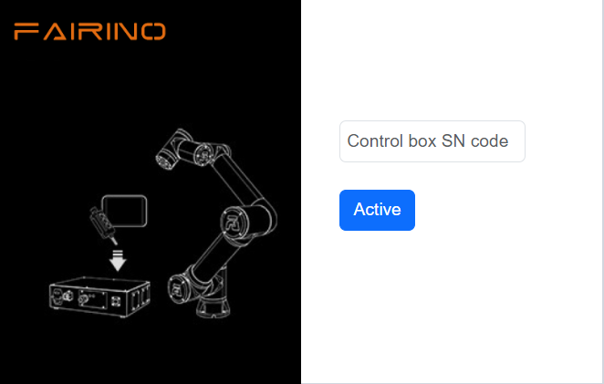
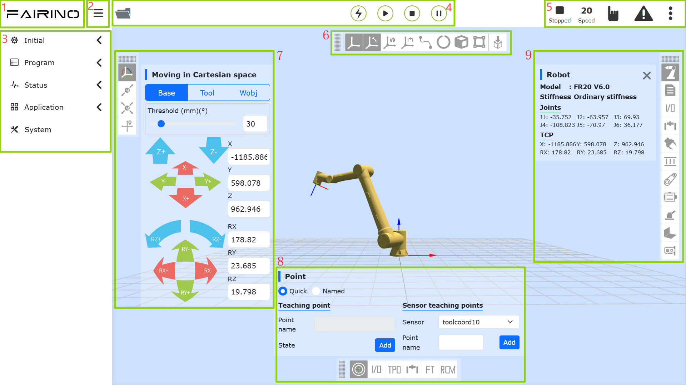
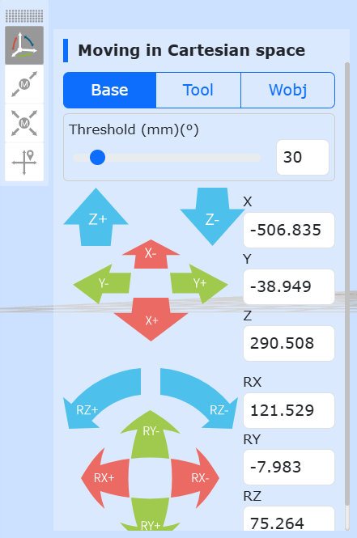
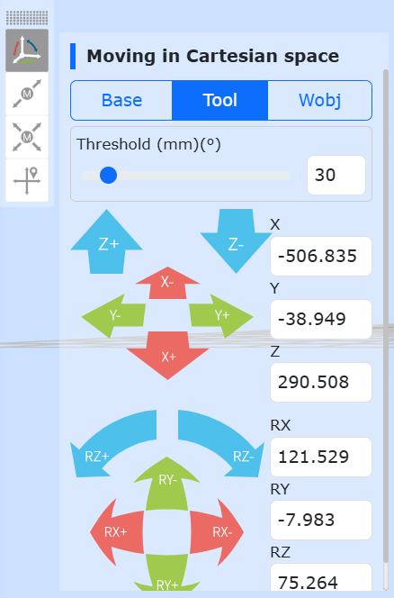
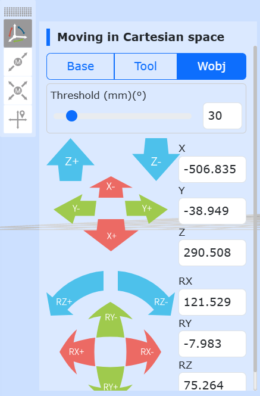
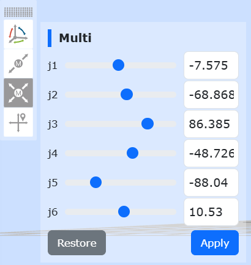
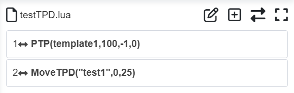
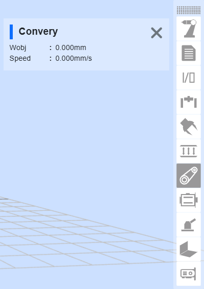

Grundlegende Funktionen der Teach-Pendant-Software
=============================================================

.. toctree::
   :maxdepth: 6

Basisinformationen
-----------------------------

Systemeinführung
~~~~~~~~~~~~~~~~~~~~~~~~~~~

Die Teach-Pendant-Software ist eine für den Roboter entwickelte Begleitsoftware, die im Betriebssystem des Teach Pendants läuft. Ihre Hauptfunktionen und technischen Merkmale sind wie folgt:

-  Ermöglicht die Erstellung von Teach-Programmen für den Roboter.
-  Zeigt die Roboterpositionskoordinaten in Echtzeit an, stellt den Roboter als 3D-Modell dar und ermöglicht die Steuerung der Roboterbewegung.
-  Ermöglicht die Einzelachs-Tippbewegung (Jog) und die Mehrfachachs-Verbundbewegung des Roboters.
-  Ermöglicht die Ansicht des I/O-Status.
-  Benutzer können Passwörter ändern, Systeminformationen einsehen usw.

Erstaktivierung des Roboters
~~~~~~~~~~~~~~~~~~~~~~~~~~~~~~~~~~~~~~~

1. Schalten Sie den Steuerschrank ein und verbinden Sie ihn über ein Netzwerkkabel mit einem PC.

2. Öffnen Sie auf dem PC einen Browser und rufen Sie die Ziel-URL 192.168.58.2 auf. Beim ersten Einschalten des Roboters gelangen Sie zur Aktivierungsseite.

.. centered:: Abbildung 5.1‑1 Aktivierungsoberfläche

3. Geben Sie den SN-Code des Gerätekastens korrekt ein. Klicken Sie nach der Eingabe auf die Schaltfläche "Aktivieren".

4. Das System überprüft Ihren SN-Code. Bei korrekter Eingabe wird der Aktivierungsprozess automatisch abgeschlossen.

.. figure:: teaching_pendant_software/059.png
   :width: 4in
   :align: center

.. centered:: Abbildung 5.1‑2 Oberfläche nach erfolgreicher Aktivierung

5. Die Aktivierung war erfolgreich. Bitte starten Sie den Steuerschrank manuell neu.

6. Rufen Sie nach dem Neustart erneut die Ziel-URL 192.168.58.2 auf. Sie gelangen nun zur Anmeldeseite.

Software starten
~~~~~~~~~~~~~~~~~~~~~~~~~~~

1. Steuerschrank einschalten.
2. Öffnen Sie auf dem Teach Pendant einen Browser und rufen Sie die Ziel-URL 192.168.58.2 auf.
3. Geben Sie Benutzernamen und Passwort ein und klicken Sie auf "Anmelden", um sich im System anzumelden.

Benutzeranmeldung und Rechteaktualisierung
~~~~~~~~~~~~~~~~~~~~~~~~~~~~~~~~~~~~~~~~~~~~~~~~~~~~

.. centered:: Tabelle 5.1-1 Initiale Benutzer

.. list-table::
   :widths: 70 70 70 70
   :header-rows: 0
   :align: center

   * - **Personalnummer**
     - **Initialer Benutzername**
     - **Passwort**
     - **Funktionscode**

   * - 111
     - admin
     - 123
     - 1

   * - 222
     - MEenginer
     - 222
     - 2

   * - 333
     - PEenginer
     - 333
     - 3

   * - 444
     - programmer
     - 444
     - 4

   * - 555
     - operator
     - 555
     - 5

   * - 666
     - monitor
     - 666
     - 6

Benutzer (zur Benutzerverwaltung siehe 15.2.1) sind standardmäßig in sechs Stufen unterteilt. Der Administrator hat keine Funktionseinschränkungen. Bediener und Beobachter können nur einen Teil der Funktionen nutzen. ME-Ingenieure, PE&PQE-Ingenieure sowie Techniker und Gruppenleiter haben teilweise Funktionseinschränkungen. Die spezifischen Standardberechtigungen der Funktionscodes finden Sie unter 15.2.2 Rechteverwaltung.

Die Anmeldeoberfläche ist in der folgenden Abbildung dargestellt:

.. figure:: teaching_pendant_software/001.png
   :width: 4in
   :align: center

.. centered:: Abbildung 5.1‑3 Anmeldeoberfläche

Spracheinstellungen
~~~~~~~~~~~~~~~~~~~~~~~~~~~~~~~~~~~~

- Das System verfügt derzeit über acht integrierte Sprachen: Chinesisch (vereinfacht), Chinesisch (traditionell), Englisch, Französisch, Koreanisch, Japanisch, Russisch und Italienisch.

- Der Name des Sprachpakets muss dem Format `[Sprachcode].json` entsprechen, z.B. `es.json`. Der Sprachcode folgt dem ISO 639-1 Standard.

- Nachfolgend finden Sie eine Sprachtabelle:

.. list-table::
   :widths: 70 70 70 70
   :header-rows: 0
   :align: center

   * - **Sprache**
     - **Lokaler Name**
     - **Sprachcode (ISO 639-1)**
     - **Systemintegriert**

   * - Chinese
     - 中文(汉语)
     - zh
     - Ja

   * - Chinese
     - 中文(汉语繁體)
     - tc
     - Ja

   * - English
     - en
     - ja
     - Ja

   * - French
     - français
     - fr
     - Ja

   * - Japanese
     - 日本語
     - ja
     - Ja

   * - Korean
     - 한국어
     - ko
     - Ja

   * - Russian
     - Русский
     - ru
     - Ja

   * - Italian
     - italiano
     - it
     - Ja

   * - German
     - Deutsch
     - de
     - Ja

1. Wählen Sie die Sprache oben rechts auf der Anmeldeoberfläche (oder auf der Erstaktivierungsoberfläche) aus.

.. image:: teaching_pendant_software/062.png
   :width: 6in
   :align: center

.. centered:: Abbildung 5.1‑5 Sprache auf der Aktivierungsoberfläche einstellen

.. image:: teaching_pendant_software/063.png
   :width: 6in
   :align: center

.. centered:: Abbildung 5.1‑6 Sprache auf der Anmeldeoberfläche einstellen

2. Am Beispiel der Spracheinstellung auf der Anmeldeoberfläche: Wenn Sie eine Sprache auswählen, wechselt der Sprachinhalt der aktuellen Seite zur ausgewählten Sprache, z.B.:

.. image:: teaching_pendant_software/001.png
   :width: 4in
   :align: center

.. centered:: Abbildung 5.1‑7 Anmeldeseite auf Chinesisch

.. image:: teaching_pendant_software/061.png
   :width: 4in
   :align: center

.. centered:: Abbildung 5.1‑8 Anmeldeseite auf Englisch

Nach erfolgreicher Anmeldung lädt das System Daten wie das 3D-Modell. Sobald der Ladevorgang abgeschlossen ist, gelangen Sie zur Startseite.

System-Startoberfläche
----------------------------

Nach erfolgreicher Anmeldung gelangen Sie zur "Startseite". Diese enthält hauptsächlich:

1.  FAIRINO-Logo.
2.  Schaltfläche zum Vergrößern/Verkleinern der Menüleiste.
3.  Menüleiste.
4.  Roboter-Steuerungsbereich.
5.  Roboter-Statusbereich.
6.  3D-Roboter-Modell – 3D-Szenenbedienung.
7.  3D-Roboter-Modell – Bedienung des Roboterarms.
8.  Zusätzliche Roboterfunktionen.
9.  Status des Roboters und der Zusatzfunktionen.

Wie in der folgenden Abbildung der System-Startseite dargestellt:

.. centered:: Abbildung 5.2‑1 System-Startseite (Schema)

Beim Aufrufen von "Initiale Einstellungen", "Teach-Programm" -> "Programmierung", "Teach-Programm" -> "Grafische Programmierung" und "Hilfsanwendungen" in der WebApp wird die Seite mit dem 3D-Roboter-Modell halb aufgeklappt angezeigt. Durch Klicken auf das Symbol zum Aufklappen kann zur System-Startseite zurückgekehrt werden.

.. image:: teaching_pendant_software/054.png
   :align: center
   :width: 6in

.. centered:: Abbildung 5.2‑2 Symbol zum Aufklappen der Seite mit dem 3D-Roboter-Modell

Steuerungsbereich
~~~~~~~~~~~~~~~~~~~~~~~~~

.. note::
   .. image:: teaching_pendant_software/003.png
      :width: 0.75in
      :height: 0.75in
      :align: left

   Bezeichnung: **Aktivierungstaste (Enable)**

   Funktion: Aktiviert den Roboter (Enable).

.. note::
   .. image:: teaching_pendant_software/004.png
      :width: 0.75in
      :height: 0.75in
      :align: left

   Bezeichnung: **Starttaste**

   Funktion: Lädt das Teach-Programm hoch und startet es.

.. note::
   .. image:: teaching_pendant_software/005.png
      :width: 0.75in
      :height: 0.75in
      :align: left

   Bezeichnung: **Stopptaste**

   Funktion: Stoppt die Ausführung des aktuellen Teach-Programms.

.. note::
   .. image:: teaching_pendant_software/006.png
      :width: 0.75in
      :height: 0.75in
      :align: left

   Bezeichnung: **Pause-/Fortsetzen-Taste**

   Funktion: Pausiert und setzt das aktuelle Teach-Programm fort.

.. important::
    Ein Pause-Befehl am Ende des Programms kann nicht ausgewertet werden.

Statusleiste
~~~~~~~~~~~~~~~~~~~~

.. note::
   .. image:: teaching_pendant_software/011.png
      :width: 0.75in
      :height: 0.75in
      :align: left

   Bezeichnung: **Roboter-Laufzeitfehlerstatus**

   Funktion: Zeigt an, ob aktuell ein Fehler im Roboterbetrieb vorliegt. Bei keinem Fehler verborgen.

.. note::
   .. image:: teaching_pendant_software/007.png
      :width: 0.75in
      :height: 0.75in
      :align: left

   Bezeichnung: **Roboterstatus**

   Funktion: Stopped - Gestoppt, Running - Läuft, Pause - Pausiert, Drag - Ziehemodus (Drag).

.. note::
   .. image:: teaching_pendant_software/010.png
      :width: 0.75in
      :height: 0.75in
      :align: left

   Bezeichnung: **Roboter-Werkzeugkoordinatensystem, Werkstückkoordinatensystem, Erweiterungsachsen-Koordinatensystem und Nutzlastnummer**

   Funktion: Oben links - Nummer des aktuellen Werkzeugkoordinatensystems, oben rechts - Nummer des aktuellen Werkstückkoordinatensystems, unten links - Nummer des aktuellen Erweiterungsachsen-Koordinatensystems, unten rechts - Aktuelle Nutzlastnummer.

.. note::
   .. image:: teaching_pendant_software/009.png
      :width: 0.75in
      :height: 0.75in
      :align: left

   Bezeichnung: **Betriebsgeschwindigkeit in Prozent**

   Funktion: Geschwindigkeit des Roboters im aktuellen Modus.

.. note::
   .. image:: teaching_pendant_software/012.png
      :width: 0.75in
      :height: 0.75in
      :align: left

   Bezeichnung: **Automatikmodus**

   Funktion: Automatischer Betriebsmodus des Roboters. Wenn beim Wechsel in den Automatikmodus die Option "Globale Geschwindigkeit anpassen und Geschwindigkeit festlegen" aktiviert ist, wird die globale Geschwindigkeit automatisch auf die festgelegte Geschwindigkeit eingestellt.

.. note::
   .. image:: teaching_pendant_software/013.png
      :width: 0.75in
      :height: 0.75in
      :align: left

   Bezeichnung: **Handmodus**

   Funktion: Manueller Modus des Roboters, zum Durchführen von Teach-Operationen.

.. note::
   .. image:: teaching_pendant_software/065.png
      :width: 0.75in
      :height: 0.75in
      :align: left

   Bezeichnung: **Schaltfläche zum Ein-/Ausklappen des Roboterstatus**

   Funktion: Klappt die Anzeige für Werkzeugkoordinatensystem, Werkstückkoordinatensystem, Erweiterungsachsen-Koordinatensystem, Nutzlast, Roboter-Ziehemodus, Lokal-/Fernmodus, Roboter-Verbindungsstatus, BOOT-Modus und Kontoinformationen ein oder aus.

Klicken Sie auf die Ausklappschaltfläche, um die folgenden Statusinformationen anzuzeigen.

.. note::
   .. image:: teaching_pendant_software/008.png
      :width: 0.75in
      :height: 0.75in
      :align: left

   Bezeichnung: **Nummer des Werkzeugkoordinatensystems**

   Funktion: Zeigt die Nummer des aktuell angewendeten Werkzeugkoordinatensystems an.

.. note::
   .. image:: teaching_pendant_software/027.png
      :width: 0.75in
      :height: 0.75in
      :align: left

   Bezeichnung: **Nummer des Werkstückkoordinatensystems**

   Funktion: Zeigt die Nummer des aktuell angewendeten Werkstückkoordinatensystems an.

.. note::
   .. image:: teaching_pendant_software/028.png
      :width: 0.75in
      :height: 0.75in
      :align: left

   Bezeichnung: **Nummer des Erweiterungsachsen-Koordinatensystems**

   Funktion: Zeigt die Nummer des aktuell angewendeten Erweiterungsachsen-Koordinatensystems an.

.. note::
   .. image:: teaching_pendant_software/066.png
      :width: 0.75in
      :height: 0.75in
      :align: left

   Bezeichnung: **Nutzlast**

   Funktion: Zeigt das aktuell angewendete Nutzlastgewicht und die Schwerpunktkoordinaten X, Y, Z an.

.. note::
   .. image:: teaching_pendant_software/014.png
      :width: 0.75in
      :height: 0.75in
      :align: left

   Bezeichnung: **Roboter-Ziehemodus (Drag) Status**

   Funktion: Der Roboter kann derzeit gezogen werden.

.. note::
   .. image:: teaching_pendant_software/015.png
      :width: 0.75in
      :height: 0.75in
      :align: left

   Bezeichnung: **Roboter-Ziehemodus (Drag) Status**

   Funktion: Der Roboter kann derzeit nicht gezogen werden.

.. note::
   .. image:: teaching_pendant_software/068.png
      :width: 0.75in
      :height: 0.75in
      :align: left

   Bezeichnung: **Roboter Lokalmodus**

   Funktion: Der Roboter wird derzeit über den Steuerschrank gesteuert.

.. note::
   .. image:: teaching_pendant_software/067.png
      :width: 0.75in
      :height: 0.75in
      :align: left

   Bezeichnung: **Roboter Fernmodus (Remote)**

   Funktion: Der Roboter kann derzeit nur über eine SPS gesteuert werden.

.. note::
   .. image:: teaching_pendant_software/017.png
      :width: 0.75in
      :height: 0.75in
      :align: left

   Bezeichnung: **Verbindungsstatus**

   Funktion: Roboter ist verbunden.

.. note::
   .. image:: teaching_pendant_software/016.png
      :width: 0.75in
      :height: 0.75in
      :align: left

   Bezeichnung: **Nicht verbunden**

   Funktion: Roboter ist nicht verbunden.

.. note::
   .. image:: teaching_pendant_software/018.png
      :width: 0.75in
      :height: 0.75in
      :align: left

   Bezeichnung: **Kontoinformationen**

   Funktion: Zeigt Benutzername und Berechtigungen an und ermöglicht die Abmeldung.

Menüleiste
~~~~~~~~~~~~~~~~~~~~

Die Menüleiste ist in der folgenden Tabelle aufgeführt:

.. centered:: Tabelle 5.2‑1 Teach-Pendant Menübereiche

+------------------------+----------------------------+
| Hauptmenü              | Untermenü                  |
+========================+============================+
| Initiale Einstellungen | Basis                      |
+                        +----------------------------+
|                        | Sicherheit                 |
+                        +----------------------------+
|                        | Peripherie                 |
+------------------------+----------------------------+
| Teach-Programm         | Programmierung             |
+                        +----------------------------+
|                        | Grafische Programmierung   |
+                        +----------------------------+
|                        | Knotengraph-Programmierung |
+                        +----------------------------+
|                        | Teach-Punkte               |
+------------------------+----------------------------+
| Statusinformationen    | Systemprotokoll            |
+                        +----------------------------+
|                        | Statusabfrage              |
+------------------------+----------------------------+
| Hilfsanwendungen       | Werkzeuganwendungen        |
+                        +----------------------------+
|                        | Prozesspakete              |
+------------------------+----------------------------+
| Systemeinstellungen    | /                          |
+------------------------+----------------------------+

3D-Roboter-Modell
----------------------

3D-Szenen-Bedienleiste
~~~~~~~~~~~~~~~~~~~~~~~~~~~~~~~~~~~~~~~~~~~

3D-Visualisierung des Roboter-Koordinatensystems
++++++++++++++++++++++++++++++++++++++++++++++++++++++++

Im 3D-Virtualitätsbereich der WebApp werden verschiedene virtuelle 3D-Koordinatensysteme erstellt. Am Beispiel der Anzeige des Basiskoordinatensystems, wie in der folgenden Abbildung gezeigt. Dabei ist die X-Achse rot, die Y-Achse grün und die Z-Achse blau.

.. note::
   .. image:: teaching_pendant_software/021.png
      :width: 0.75in
      :height: 0.75in
      :align: left

   Bezeichnung: **Basiskoordinatensystem**

   Beschreibung: Das Basiskoordinatensystem wird im 3D-Virtualitätsbereich der WebApp standardmäßig angezeigt. Es ist fest an der Unterseite der Roboterbasis markiert. Das virtuelle 3D-Basiskoordinatensystem kann manuell ausgeblendet werden.

.. note::
   .. image:: teaching_pendant_software/022.png
      :width: 0.75in
      :height: 0.75in
      :align: left

   Bezeichnung: **Werkzeugkoordinatensystem**

   Beschreibung: Das Werkzeugkoordinatensystem wird standardmäßig angezeigt und kann manuell ausgeblendet werden. Nach dem Start der WebApp und erfolgreicher Benutzeranmeldung werden der Name des aktuell angewendeten Werkzeugkoordinatensystems und die entsprechenden Parameterdaten abgerufen und das aktuelle Werkzeugkoordinatensystem initialisiert.

.. important::
   Wenn während der Verwendung ein anderes Werkzeugkoordinatensystem angewendet wird und der Befehl zur Anwendung erfolgreich war, wird zuerst das bestehende Werkzeugkoordinatensystem im 3D-Virtualitätsbereich gelöscht. Anschließend werden die Parameterdaten des neu angewendeten Werkzeugkoordinatensystems an die API zur 3D-Koordinatengenerierung übergeben, um das neue Werkzeugkoordinatensystem zu generieren und im 3D-Virtualitätsbereich anzuzeigen.

.. note::
   .. image:: teaching_pendant_software/023.png
      :width: 0.75in
      :height: 0.75in
      :align: left

   Bezeichnung: **Werkstückkoordinatensystem**

   Beschreibung: Das Werkstückkoordinatensystem ist standardmäßig ausgeblendet und kann manuell zur Anzeige eingeschaltet werden. Der Ablauf ist identisch mit dem des Werkzeugkoordinatensystems.

.. note::
   .. image:: teaching_pendant_software/024.png
      :width: 0.75in
      :height: 0.75in
      :align: left

   Bezeichnung: **Externes Achsen-Koordinatensystem**

   Beschreibung: Das externe Achsen-Koordinatensystem ist standardmäßig ausgeblendet und kann manuell zur Anzeige eingeschaltet werden. Der Ablauf ist identisch mit dem des Werkzeugkoordinatensystems.

Virtuelle 3D-Bahn und Import von Werkzeugmodellen
++++++++++++++++++++++++++++++++++++++++++++++++++++++++

.. note::
   .. image:: teaching_pendant_software/020.png
      :width: 0.75in
      :height: 0.75in
      :align: left

   Bezeichnung: **Bahnzeichnung**

   Beschreibung: Klicken Sie auf die Schaltfläche, um die Bahnzeichnungsfunktion zu aktivieren. Beim Ausführen eines Teach-Programms zeichnet das 3D-Roboter-Modell die Bewegungsbahn des Roboters nach.

.. note::
   .. image:: teaching_pendant_software/029.png
      :width: 0.75in
      :height: 0.75in
      :align: left

   Bezeichnung: **Werkzeugmodell importieren**

   Beschreibung: Klicken Sie auf die Schaltfläche. Es öffnet sich ein modales Fenster zum Importieren eines Werkzeugmodells. Nach erfolgreichem Upload der Datei wird das Werkzeugmodell am Roboterflansch angezeigt. Derzeit werden die Werkzeugmodellformate STL und DAE unterstützt.

Bedienleiste für den Roboterarm
~~~~~~~~~~~~~~~~~~~~~~~~~~~~~~~~~~~~~~~~~~~~~~~~~~~~~~~~~~~

TCP
+++++++++++++++++++++++++++

**Base-Tippen (Jog)**: Im Basiskoordinatensystem kann der Roboter durch langes Drücken der entsprechenden Koordinatensystem-Tasten gesteuert werden, um sich linear entlang der X-, Y-, Z-Achsen zu bewegen oder um die RX-, RY-, RZ-Achsen zu drehen. Die Base-Tipp-Funktion ähnelt der Einzelachs-Tipp-Funktion bei der Joint-Bewegung. Die Oberfläche ist unten dargestellt:

.. centered:: Abbildung 5.3-1 Base-Tippen (Schema)

.. important::
   Sie können die Taste jederzeit loslassen, um die Roboterbewegung zu stoppen. Drücken Sie im Notfall den Not-Halt-Taster, um den Roboter zu stoppen.

**Tool-Tippen (Jog)**: Wählen Sie ein Werkzeugkoordinatensystem aus. Der Roboter kann durch langes Drücken der entsprechenden Koordinatensystem-Tasten gesteuert werden, um sich linear entlang der X-, Y-, Z-Achsen zu bewegen oder um die RX-, RY-, RZ-Achsen zu drehen. Die Tool-Tipp-Funktion ähnelt der Einzelachs-Tipp-Funktion bei der Joint-Bewegung. Die Oberfläche ist unten dargestellt:

.. centered:: Abbildung 5.3-2 Tool-Tippen (Schema)

**Wobj-Tippen (Jog)**: Wählen Sie das Werkstück-Tippen aus. Der Roboter kann durch langes Drücken der entsprechenden Koordinatensystem-Tasten gesteuert werden, um sich im Werkstückkoordinatensystem linear entlang der X-, Y-, Z-Achsen zu bewegen oder um die RX-, RY-, RZ-Achsen zu drehen. Die Wobj-Tipp-Funktion ähnelt der Einzelachs-Tipp-Funktion bei der Joint-Bewegung. Die Oberfläche ist unten dargestellt:

.. centered:: Abbildung 5.3-3 Wobj-Tippen (Schema)

Joint-Bewegung
++++++++++++++++++++++++

Im Joint-Betrieb repräsentieren die 6 Schieberegler in der Mitte die Winkel der entsprechenden Achsen. Die Joint-Bewegung wird in Einzelachs-Tippen und Mehrfachachs-Verbundbewegung unterteilt.

**Einzelachs-Tippen (Jog)**: Der Benutzer kann die Roboterbewegung über die kreisförmigen Tasten links und rechts steuern, wie unten gezeigt. Im Handmodus und Gelenkkoordinatensystem wird ein einzelnes Gelenk des Roboters gedreht. Wenn der Roboter aufgrund einer Überschreitung des Bewegungsbereichs (Software-Endschalter) stoppt, kann mit dem Einzelachs-Tippen manuell eingegriffen werden, um den Roboter aus dem überfahrenen Bereich zu bewegen. Das Einzelachs-Tippen ist bei grober Positionierung und größeren Bewegungen oft schneller und bequemer als andere Betriebsarten.

.. image:: teaching_pendant_software/033.png
   :width: 3in
   :align: center

.. centered:: Abbildung 5.3-4 Einzelachs-Tippen (Schema)

.. important::
   Stellen Sie den Parameter "Langdruck-Bewegungsschwelle" (die maximale Distanz, die der Roboter bei gedrückter Taste zurücklegt, Wertebereich 0~300) ein. Drücken und halten Sie die kreisförmige Taste, um den Roboter zu bewegen. Wenn Sie die Taste während der Bewegung loslassen, stoppt der Roboter sofort. Wenn Sie die Taste gedrückt halten, stoppt der Roboter, sobald der durch die Langdruck-Bewegungsschwelle eingestellte Wert erreicht ist.

**Mehrfachachs-Verbundbewegung**: Der Benutzer kann die sechs Schieberegler in der Mitte bedienen, um die entsprechenden Zielpositionen des Roboters einzustellen, wie unten gezeigt. Die Zielposition kann durch Beobachten des virtuellen 3D-Roboters bestimmt werden. Wenn die eingestellte Position nicht den Erwartungen entspricht, klicken Sie auf die Schaltfläche "Zurücksetzen", um den virtuellen 3D-Roboter in seine Ausgangsposition zurückzubringen. Wenn der Benutzer die Zielposition festgelegt hat, kann er auf die Schaltfläche "Anwenden" klicken, und der reale Roboter führt die entsprechende Bewegung aus.

.. centered:: Abbildung 5.3-5 Mehrfachachs-Verbundbewegung (Schema)

.. important::
   Bei der Mehrfachachs-Verbundbewegung darf der eingestellte Wert für das 5. Gelenk j5 nicht kleiner als 0,01 Grad sein. Wenn der gewünschte Wert kleiner als 0,01 Grad ist, kann er zuerst auf 0,011 Grad gesetzt werden und dann das 5. Gelenk j5 über Einzelachs-Tippen feinjustiert werden.

Move-Bewegung
++++++++++++++++++++++++

Wählen Sie "Move-Bewegung". Sie können direkt kartesische Koordinatenwerte eingeben. Klicken Sie auf "Gelenkposition berechnen". Die Gelenkposition wird als berechnetes Ergebnis angezeigt. Wenn keine Gefahr besteht, können Sie auf "Zu diesem Punkt bewegen" klicken, um den Roboter zur eingegebenen kartesischen Pose zu steuern.

.. image:: teaching_pendant_software/035.png
   :width: 3in
   :align: center

.. centered:: Abbildung 5.3‑6 Move-Bewegung (Schema)

.. important::
   Wenn eine vorgegebene Pose nicht erreicht werden kann, überprüfen Sie zunächst, ob die kartesische Pose den Arbeitsbereich des Roboters überschreitet. Überprüfen Sie dann, ob auf dem Weg von der aktuellen Pose zur Zielpose eine singuläre Pose existiert. Wenn eine singuläre Pose existiert, passen Sie die aktuelle Pose an oder fügen Sie eine neue Pose auf dem Weg ein, um die singuläre Pose zu umgehen.

Leiste für zusätzliche Roboterfunktionen
~~~~~~~~~~~~~~~~~~~~~~~~~~~~~~~~~~~~~~~~~~~~~~~~~~~~~~~~~~~~~~~~~

Teach-Punkt-Aufzeichnung
++++++++++++++++++++++++++++++++

Der manuelle Teach-Steuerungsbereich dient hauptsächlich dazu, das Bezugskoordinatensystem im Teach-Modus einzustellen, die Winkel und Koordinatenwerte der einzelnen Roboterachsen in Echtzeit anzuzeigen und Teach-Punkte benennen und speichern zu können.

Beim Speichern eines Teach-Punkts ist das Koordinatensystem dieses Punktes das aktuell vom Roboter angewendete Koordinatensystem.

Die Teach-Punkt-Aufzeichnung wird in zwei Arten unterteilt: "Schnellpunktaufzeichnung" und "Benannte Punktaufzeichnung".

- **Schnellpunktaufzeichnung**: Der Teach-Punkt wird automatisch aufgezeichnet, der Name wird automatisch generiert.
- **Benannte Punktaufzeichnung**: Der Name des Teach-Punkts wird benutzerdefiniert vergeben und setzt sich aus einem Teach-Punkt-Präfix und dem Teach-Punkt-Namen zusammen.

Für Sensor-Teach-Punkte wählen Sie einen bereits kalibrierten Sensor-Werkzeugtyp aus, geben einen Punktnamen ein und klicken auf "Hinzufügen". Die gespeicherte Position ist die Position, die der Sensor erkannt hat.

.. image:: teaching_pendant_software/036.png
   :width: 5in
   :align: center

.. image:: teaching_pendant_software/060.png
   :width: 5in
   :align: center

.. centered:: Abbildung 5.3‑7 Manueller Bedienbereich (Schema)

.. important::
   Stellen Sie bei der ersten Verwendung einen niedrigen Geschwindigkeitswert wie 30 ein, um sich mit der Roboterbewegung vertraut zu machen und Unfälle zu vermeiden.

I/O
++++++++++++++++++++++++++++++++

In dieser Oberfläche können die digitalen Ausgänge, analogen Ausgänge (0-10 V) des Robotersteuerschranks sowie die digitalen Ausgänge und analogen Ausgänge (0-10 V) des Endeffektors manuell gesteuert werden. Wie in der folgenden Abbildung dargestellt:

.. image:: teaching_pendant_software/037.png
   :width: 5in
   :align: center

.. centered:: Abbildung 5.3‑8 I/O-Einstellungen (Schema)

TPD (Teach Programming by Demonstration)
++++++++++++++++++++++++++++++++++++++++

Die Vorgehen für die Teach-Programming-by-Demonstration (TPD)-Funktion ist wie folgt:

- **Schritt 1 Anfangsposition aufzeichnen**: Gehen Sie in den linken Bedienbereich des 3D-Modells und zeichnen Sie die aktuelle Roboterposition auf. Legen Sie den Namen des Punktes im Eingabefeld fest und klicken Sie auf die Schaltfläche "Speichern". Bei erfolgreichem Speichern erscheint der Hinweis "Punkt erfolgreich gespeichert".

- **Schritt 2 Parameter für die Bahnaufzeichnung konfigurieren**: Klicken Sie auf "TPD", um zum TPD-Funktionspunkt zu gelangen, und konfigurieren Sie die Parameter für die Bahnaufzeichnung. Legen Sie den Namen der Bahndatei, den Posen-Typ und die Abtastperiode fest. Konfigurieren Sie DI und DO. Während der Aufzeichnung der TPD-Bahn kann durch Auslösen eines DI der entsprechende, auszugebende DO aufgezeichnet werden.

.. image:: teaching_pendant_software/038.png
   :width: 5in
   :align: center

.. centered:: Abbildung 5.3‑9 TPD-Bahnaufzeichnung

- **Schritt 3 Robotermodus überprüfen**: Überprüfen Sie, ob sich der Roboter im Handmodus befindet. Wenn nicht, schalten Sie in den Handmodus um. Im Handmodus kann auf zwei Arten in den Ziehe-Teaching-Modus gewechselt werden: durch langes Drücken der Endeffektor-Taste oder durch die Umschalttaste für den Ziehemodus auf der Oberfläche. Für die TPD-Aufzeichnung wird empfohlen, den Roboter über die Oberfläche in den Ziehe-Teaching-Modus zu schalten.

.. image:: teaching_pendant_software/039.png
   :width: 3in
   :align: center

.. centered:: Abbildung 5.3‑10 Robotermodus

.. important::
   Bevor Sie über die Oberfläche in den Ziehemodus wechseln, vergewissern Sie sich, dass die Nutzlast und der Schwerpunkt des Endeffektors korrekt eingestellt sind und die Reibungskompensationsfaktoren angemessen sind. Überprüfen Sie dann durch langes Drücken der Endeffektor-Taste, ob das Ziehen normal funktioniert. Wechseln Sie erst nach erfolgreicher Überprüfung über die Oberfläche in den Ziehemodus.

- **Schritt 4 Aufzeichnung starten**: Klicken Sie auf die Schaltfläche "Aufzeichnung starten", um die Bahnaufzeichnung zu beginnen. Ziehen Sie den Roboter, um die gewünschte Bewegung zu demonstrieren (Teaching). Darüber hinaus gibt es in der Endeffektor-DI-Konfiguration einen Konfigurationseintrag "TPD-Aufzeichnung starten/stoppen". Durch Konfiguration dieser Funktion kann der Benutzer die "Aufzeichnung starten"-Funktion über ein externes Signal auslösen. Beachten Sie, dass zunächst die TPD-Bahninformationen auf der Seite konfiguriert sein müssen, bevor die Bahnaufzeichnung über ein externes Signal gestartet werden kann.

- **Schritt 5 Aufzeichnung stoppen**: Nach Abschluss der Bewegungsdemonstration klicken Sie auf die Schaltfläche "Aufzeichnung stoppen", um die Bahnaufzeichnung zu beenden. Schalten Sie den Roboter dann über die Umschalttaste für den Ziehemodus aus dem Ziehe-Teaching-Modus. Die Meldung "Bahnaufzeichnung erfolgreich gestoppt" im Teach Pendant zeigt an, dass die Bahnaufzeichnung erfolgreich war. Wie in Schritt 4 kann nach Konfiguration der Funktion "TPD-Aufzeichnung starten/stoppen" das Stoppen der Aufzeichnung auch über ein externes Signal ausgelöst werden.

- **Schritt 6 Teach-Programmierung**: Klicken Sie auf "Neu", wählen Sie eine leere Vorlage. Klicken Sie, um zum Programmierpunkt der PTP-Funktion zu gelangen, wählen Sie den soeben gespeicherten Anfangspositionspunkt aus, klicken Sie auf die Schaltfläche "Hinzufügen". Nach dem Anwenden wird im Programm eine PTP-Anweisung angezeigt. Klicken Sie dann, um zum Programmierpunkt der TPD-Funktion zu gelangen, wählen Sie die gerade aufgezeichnete Bahn aus, legen Sie fest, ob geglättet werden soll und den Geschwindigkeitsskalierungsfaktor. Klicken Sie auf die Schaltfläche "Hinzufügen". Nach dem Anwenden wird im Programm eine MoveTPD-Anweisung angezeigt, wie in der folgenden Abbildung gezeigt.

.. centered:: Abbildung 5.3‑11 TPD-Programmierung

- **Schritt 7 Bahnreproduktion**: Nachdem das Teach-Programm bearbeitet wurde, wechseln Sie in den Automatikmodus. Klicken Sie oben auf der Oberfläche auf das Symbol "Starten", um das Programm zu starten. Der Roboter beginnt, die demonstrierte Bewegung zu reproduzieren.

- **Schritt 8 Bahnbearbeitung**: Im TPD-Bahnbearbeitungsbereich kann die Bahn visualisiert und beschnitten werden, um eine Vorabanalyse und Optimierung der TPD-Bahn zu ermöglichen. Wählen Sie die entsprechende Bahn aus, um ihre Punkte abzurufen. Die aufgezeichneten Bahnpunkte werden dann im 3D-Raum des Roboters angezeigt. Außerdem kann der Benutzer die Schieberegler "Start" und "Ende" ziehen, um den Start- und Endpunkt der Bahn zu simulieren und zu beschneiden.

TPD-Dateilöschung und Fehlerbehandlung:

- **Bahn-Datei löschen**: Klicken Sie, um zum TPD-Funktionspunkt zu gelangen, wählen Sie die zu löschende Bahndatei aus und klicken Sie auf die Schaltfläche "Bahn löschen". Bei erfolgreichem Löschen erhalten Sie eine entsprechende Erfolgsmeldung.

- **Fehlerbehandlung:**

  + **Anzahl der Befehlspunkte überschritten**: Eine Bahn kann maximal 20.000 Punkte aufzeichnen. Wenn 20.000 Punkte überschritten werden, zeichnet die Steuerung keine weiteren Punkte mehr auf und sendet eine Warnmeldung "Anzahl der Befehlspunkte überschritten" an das Teach Pendant. In diesem Fall muss die Aufzeichnung gestoppt werden.

  + **TPD-Befehlsintervall zu groß**: Wenn das Teach Pendant den Fehler "TPD-Befehlsintervall zu groß" meldet, überprüfen Sie, ob der Roboter in die Ausgangsposition vor der Aufzeichnung zurückgekehrt ist. Wenn der Roboter in der Ausgangsposition ist und der Fehler weiterhin auftritt, löschen Sie die aktuelle Bahn und zeichnen Sie eine neue Bahn auf.

  + Sollten während der TPD-Operation andere Fehler auftreten, stoppen Sie den Roboter sofort über das Teach Pendant oder den Not-Halt-Taster und untersuchen Sie die Ursache.

.. important::
   Während der TPD-Operation müssen die entsprechenden Anweisungen auf dem Teach Pendant genau befolgt werden.

Eaxis-Bewegung
++++++++++++++++++++++++++++++++

Wählen Sie "Eaxis-Bewegung". Dies ist die Tipp-Funktion für die Erweiterungsachse. Sie kann nur verwendet werden, wenn die Erweiterungsachse konfiguriert wurde. Siehe "Kapitel 4 - Roboterperipherie - Konfiguration der Erweiterungsachsen-Peripherie".

.. image:: teaching_pendant_software/041.png
   :width: 5in
   :align: center

.. centered:: Abbildung 5.3‑12 Eaxis-Bewegung (Schema)

FT
++++++++++++++++++++++++++++++++

Wählen Sie die Referenzkoordinate als Referenz für das Ziehen mit Kraftsensor.

.. image:: teaching_pendant_software/042.png
   :width: 5in
   :align: center

.. centered:: Abbildung 5.3‑12 FT (Schema)

Fernzentrumspunkt (RCM)
++++++++++++++++++++++++++++++++

Diese Funktion wird hauptsächlich bei medizinischen Eingriffen eingesetzt. Nach der Einstellung eines festen Fernzentrumspunkts (RCM) bewegt sich das Roboterende immer um diesen Punkt.

.. image:: teaching_pendant_software/043.png
   :width: 5in
   :align: center

.. centered:: Abbildung 5.3‑13 Fernzentrumspunkt (Schema)

Leiste für Roboter- und Zusatzfunktionsstatus
~~~~~~~~~~~~~~~~~~~~~~~~~~~~~~~~~~~~~~~~~~~~~~~~~~~~~~~~~~~~~~~~~~~~~~~~~~~~

Robot
++++++++++++++++++++++++++++++++

Zeigt Informationen zum aktuellen Robotermodell, zur Steifigkeit, zu den Gelenken und zu den Koordinatendaten an.

.. image:: teaching_pendant_software/044.png
   :width: 3in
   :align: center

.. centered:: Abbildung 5.3‑14 Roboterstatus

Program
++++++++++++++++++++++++++++++++

Zeigt Informationen zum aktuell laufenden Programm und zu Unterprogrammen an.

.. image:: teaching_pendant_software/045.png
   :width: 3in
   :align: center

.. centered:: Abbildung 5.3‑15 Programmstatus

I/O
++++++++++++++++++++++++++++++++

Zeigt den aktuellen I/O-Status an. Bei den digitalen Eingängen und Ausgängen wird ein Port grün angezeigt, wenn sein Pegel hoch ist, und weiß, wenn er niedrig ist. Die analogen Eingänge und Ausgänge zeigen Werte von 0-100 an, wobei 100 10 V entspricht.

.. image:: teaching_pendant_software/046.png
   :width: 3in
   :align: center

.. centered:: Abbildung 5.3‑16 IO-Status

ExAxis
++++++++++++++++++++++++++++++++

Zeigt den Servostatus der aktuellen Erweiterungsachse (Steuerung + SPS) an.

.. image:: teaching_pendant_software/047.png
   :width: 3in
   :align: center

.. centered:: Abbildung 5.3‑17 Status der Erweiterungsachse (Steuerung + SPS)

Gripper
++++++++++++++++++++++++++++++++

Zeigt den aktuellen Greiferstatus an.

.. image:: teaching_pendant_software/048.png
   :width: 3in
   :align: center

.. centered:: Abbildung 5.3‑18 Greiferstatus

FT
++++++++++++++++++++++++++++++++

Zeigt den aktuellen Kraftregelungsstatus an.

.. image:: teaching_pendant_software/049.png
   :width: 3in
   :align: center

.. centered:: Abbildung 5.3‑19 Kraftregelungsstatus

Convery
++++++++++++++++++++++++++++++++

Zeigt den aktuellen Förderbandstatus an.

.. centered:: Abbildung 5.3‑20 Förderbandstatus

Servo
++++++++++++++++++++++++++++++++

Zeigt den Status der aktuellen Erweiterungsachse (Steuerung + Servocontroller) an.

.. image:: teaching_pendant_software/051.png
   :width: 3in
   :align: center

.. centered:: Abbildung 5.3‑21 Status der Erweiterungsachse (Steuerung + Servocontroller)

Polish
++++++++++++++++++++++++++++++++

Zeigt den aktuellen Schleifstatus an.

.. image:: teaching_pendant_software/052.png
   :width: 3in
   :align: center

.. centered:: Abbildung 5.3‑22 Schleifstatus

Weld
++++++++++++++++++++++++++++++++

Zeigt den aktuellen Schweißstatus an.

.. image:: teaching_pendant_software/053.png
   :width: 3in
   :align: center

.. centered:: Abbildung 5.3‑23 Schweißstatus

Board I/O
++++++++++++++++++++++++++++++++

Zeigt den aktuellen Kartenstatus an.

.. image:: teaching_pendant_software/069.png
   :width: 3in
   :align: center

.. centered:: Abbildung 5.3‑24 Kartenstatus