Palettier-FRCap
===============

Plugin-Paketverwaltung
----------------------

Rufen Sie in der WebApp des kollaborativen Roboters die Seite "Systemeinstellungen" -> "Plugin-Konfiguration" auf. Klicken Sie auf die Schaltfläche "Importieren", wählen Sie das Palettier-FRCap-Plugin-Paket aus (Namensformat: Plugin-Paketname + Versionsnummer.plugin, Beispiel: Palettierer-v0.0.0.plugin) und laden Sie es hoch. Nach erfolgreichem Upload wird das erfolgreich importierte Palettier-FRCap-Plugin-Paket in der Liste angezeigt, einschließlich Plugin-Status (Aktiviert/Deaktiviert), Name, Versionsnummer, Beschreibung und Autor. In der Aktionsspalte können Sie das Palettier-FRCap-Plugin-Paket "Deaktivieren", "Aktivieren" und "Löschen".

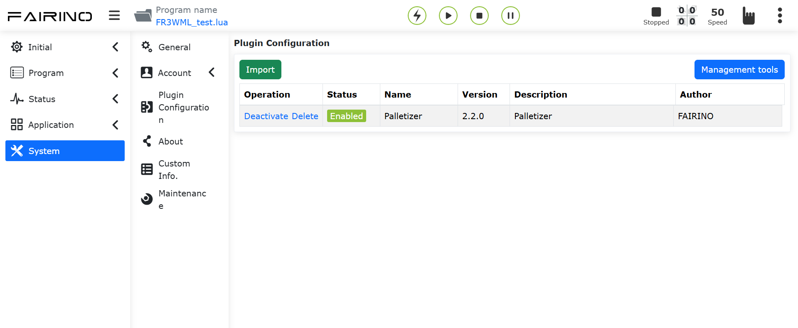

.. centered:: Abbildung 10-1-1 WebApp Plugin-Konfigurationsoberfläche

Nach dem ersten erfolgreichen Import des Palettier-FRCap-Plugin-Pakets ist der Status des Pakets "Deaktiviert". Klicken Sie auf die Schaltfläche "Aktivieren". Nach erfolgreicher Aktivierung wird im Modul "Zusatzanwendungen" der WebApp des kollaborativen Roboters eine Startseite für das Palettier-FRCap-Plugin-Paket hinzugefügt (z. B. lautet der Seitenmodulname für "Palettierer-v0.0.0.plugin" "Palettierer"). Klicken Sie auf die Schaltfläche "Start", um zur Startseite zu gelangen, zeigen Sie die aktuell konfigurierten Palettierrezepte an und verwenden Sie sie nach Bedarf.

.. note::
   Wenn die Rezeptliste leer ist, fügen Sie bitte zuerst ein neues Rezept hinzu oder importieren Sie eines.

.. image:: frcap_pictures/014.png
   :width: 6in
   :align: center

.. centered:: Abbildung 10-1-2 WebApp + Palettier-FRCap-Darstellung

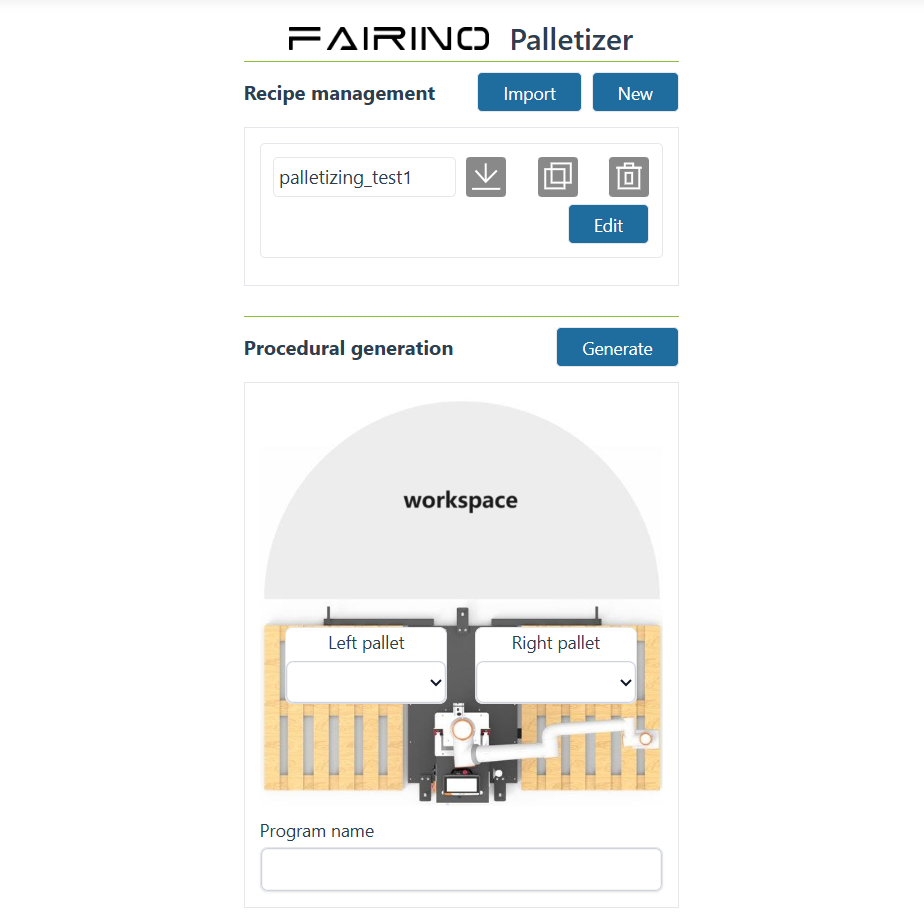

.. centered:: Abbildung 10-1-3 Palettier-FRCap-Startseite

Rezeptverwaltung
----------------
Jedes Rezept ist in drei Hauptbereiche unterteilt: Rezeptname, Rezeptaktionen und Rezeptbearbeitung. Die Schaltflächen im Aktionsbereich sind (von links nach rechts): Umbenennen, Exportieren, Kopieren und Löschen.

.. image:: frcap_pictures/016.png
   :width: 3in
   :align: center

.. centered:: Abbildung 10-2-1 Aufteilung des Rezeptbereichs

.. note::
   .. image:: frcap_pictures/045.png
      :width: 0.5in
      :height: 0.5in
      :align: left

   | Name: **Rezept exportieren**
   | Funktion: Exportiert die Daten des aktuellen Rezepts.

.. note::
   .. image:: frcap_pictures/046.png
      :width: 0.5in
      :height: 0.5in
      :align: left

   | Name: **Rezept kopieren**
   | Funktion: Kopiert die Daten des aktuellen Rezepts.

.. note::
   .. image:: frcap_pictures/047.png
      :width: 0.5in
      :height: 0.5in
      :align: left

   | Name: **Rezept löschen**
   | Funktion: Löscht das aktuelle Rezept.

Abrufen
~~~~~~~
Nach dem Aufrufen der Startseite des Palettier-Plugin-Pakets werden alle aktuellen Rezepte abgerufen. Wenn die Anzahl der Rezepte vier übersteigt, wird im Rezeptanzeigebereich eine Bildlaufleiste angezeigt, mit der der Benutzer nach oben und unten scrollen kann, um die Rezepte einzusehen.

.. note::
   Alle Rezeptnamen beginnen mit "palletizing", z. B. "palletizing_test1".

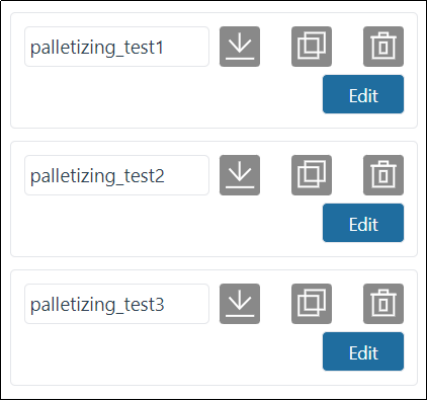

.. centered:: Abbildung 10-2-2 Rezeptabruf

Neu anlegen
~~~~~~~~~~~
Klicken Sie im Aktionsbereich eines beliebigen Rezepts auf die Schaltfläche "Neu anlegen". Es öffnet sich das Pop-up-Fenster "Neues Rezept anlegen". Geben Sie den Namen des Palettierrezepts ein und klicken Sie auf die Schaltfläche "Bestätigen". Nach erfolgreicher Anlage wird das neu angelegte Palettierrezept im Rezeptanzeigebereich hinzugefügt.

.. note::
   Alle Rezeptnamen beginnen mit "palletizing". Sie müssen "palletizing" nicht eingeben, sondern nur den Namen nach dem Unterstrich "_". Für "palletizing_add" geben Sie z. B. einfach "add" ein.

.. image:: frcap_pictures/018.png
   :width: 6in
   :align: center
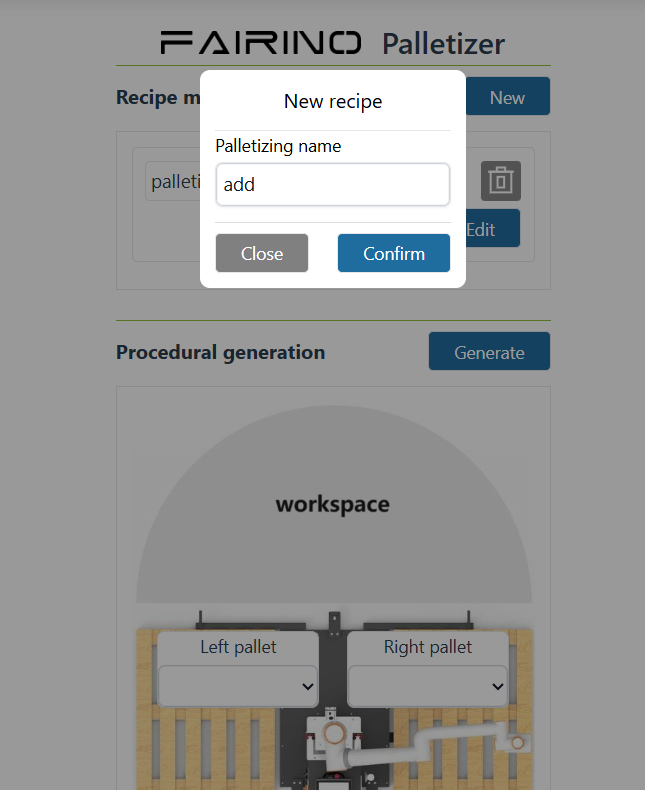

.. centered:: Abbildung 10-2-3 Neues Rezept anlegen

Umbenennen
~~~~~~~~~~
Klicken Sie im Aktionsbereich eines beliebigen Rezepts auf den Rezeptnamen, um ein Eingabefeld anzuzeigen. Es öffnet sich das Pop-up-Fenster "Palettierrezept umbenennen". Geben Sie den neuen Namen des Palettierrezepts ein und klicken Sie auf die Schaltfläche "Bestätigen". Nach erfolgreicher Umbenennung wird der ursprüngliche Rezeptname im Anzeigebereich durch den neuen ersetzt.

.. note::
   Alle Rezeptnamen beginnen mit "palletizing". Sie müssen "palletizing" nicht eingeben; das Modal-Fenster zeigt automatisch den Namen nach dem Unterstrich "_" an. Für "palletizing_rename" wird z. B. automatisch "rename" angezeigt.

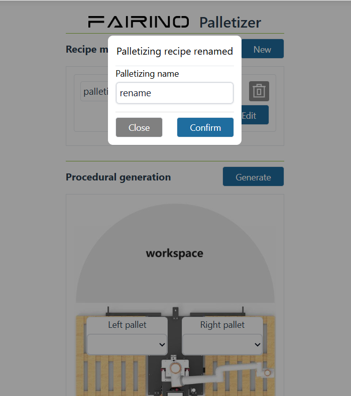

.. centered:: Abbildung 10-2-4 Rezept umbenennen

Exportieren
~~~~~~~~~~~
Klicken Sie im Aktionsbereich eines beliebigen Rezepts auf das Symbol "Exportieren", um alle Daten des aktuellen Rezepts herunterzuladen.

.. image:: frcap_pictures/021.png
   :width: 6in
   :align: center

.. centered:: Abbildung 10-2-5 Rezept exportieren

Kopieren
~~~~~~~~
Klicken Sie im Aktionsbereich eines beliebigen Rezepts auf das Symbol "Kopieren". Es öffnet sich das Pop-up-Fenster "Palettierrezept kopieren". Geben Sie den Namen für das kopierte Palettierrezept ein und klicken Sie auf die Schaltfläche "Bestätigen". Nach erfolgreichem Kopiervorgang wird das kopierte Palettierrezept im Rezeptanzeigebereich hinzugefügt.

.. note::
   Alle Rezeptnamen beginnen mit "palletizing". Sie müssen "palletizing" nicht eingeben; das Modal-Fenster zeigt automatisch den Namen nach dem Unterstrich "_" an. Für "palletizing_copy" wird z. B. automatisch "copy" angezeigt.

.. image:: frcap_pictures/022.png
   :width: 6in
   :align: center

.. centered:: Abbildung 10-2-6 Rezept kopieren

Löschen
~~~~~~~
Klicken Sie im Aktionsbereich eines beliebigen Rezepts auf das Symbol "Löschen", um das aktuelle Rezept zu löschen.

.. image:: frcap_pictures/023.png
   :width: 6in
   :align: center
.. image:: frcap_pictures/024.png
   :width: 6in
   :align: center

.. centered:: Abbildung 10-2-7 Rezept löschen

Bearbeiten
~~~~~~~~~~~~~~~~~~
Klicken Sie bei einem beliebigen Rezept auf die Schaltfläche "Bearbeiten", um zur Konfigurationsoberfläche des aktuellen Rezepts zu gelangen.

.. image:: frcap_pictures/025.png
   :width: 6in
   :align: center

.. centered:: Abbildung 10-2-8 Palettierrezept bearbeiten

Importieren
~~~~~~~~~~~~~~~~~~
Klicken Sie auf die Schaltfläche "Importieren", wählen Sie eine komprimierte Palettierrezept-Datei aus und laden Sie sie hoch. Nach erfolgreichem Import wird das importierte Rezept zu den Palettierrezepten hinzugefügt.

.. note::
   Alle komprimierten Rezeptdateien beginnen mit "palletizing" und enden mit ".tar.gz", z. B. "palletizing_import.tar.gz".

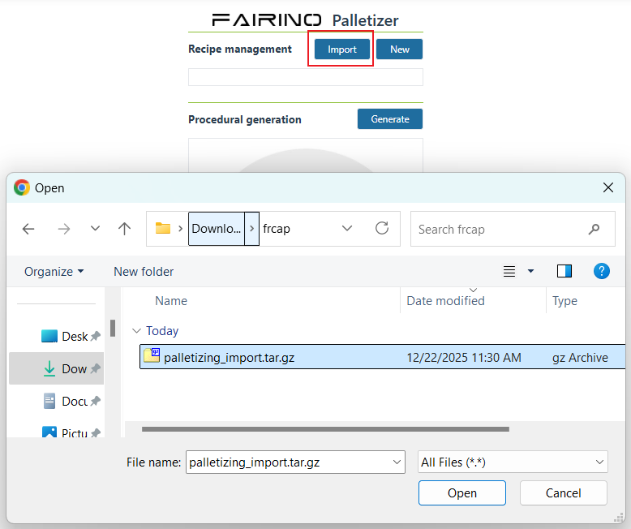

.. centered:: Abbildung 10-2-9 Rezept importieren

.. important::
   Wenn Sie bei "Neues Rezept anlegen", "Umbenennen" oder "Kopieren" einen bereits vorhandenen Rezeptnamen eingeben, erscheint der Hinweis "Ein Rezept mit diesem Namen existiert bereits".

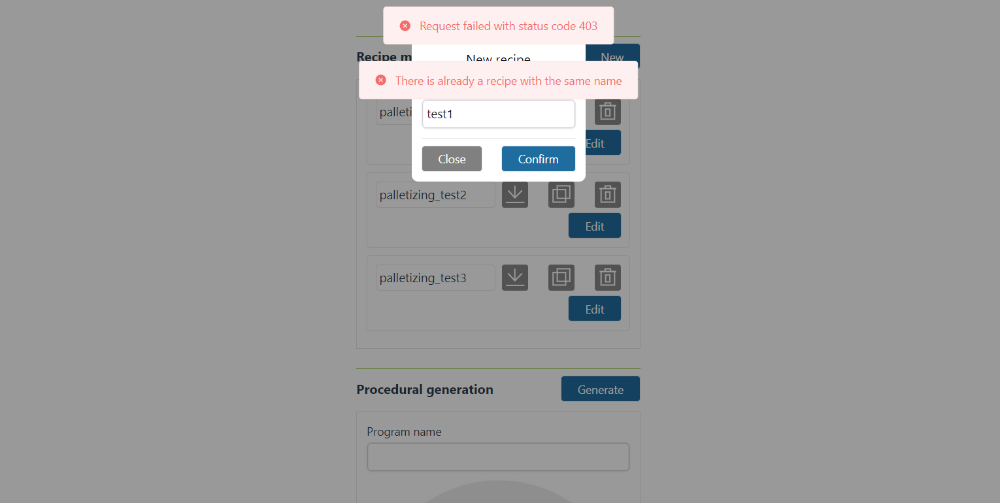

.. centered:: Abbildung 10-2-10 Hinweis auf doppelten Rezeptnamen

Rezeptkonfiguration
-------------------
Die Konfigurationsoberfläche eines beliebigen Rezepts zeigt die Basisinformationen für Kisten, Paletten, Muster und erweiterte Einstellungen an. In den entsprechenden Konfigurationsspalten werden die spezifischen Parameter konfiguriert.

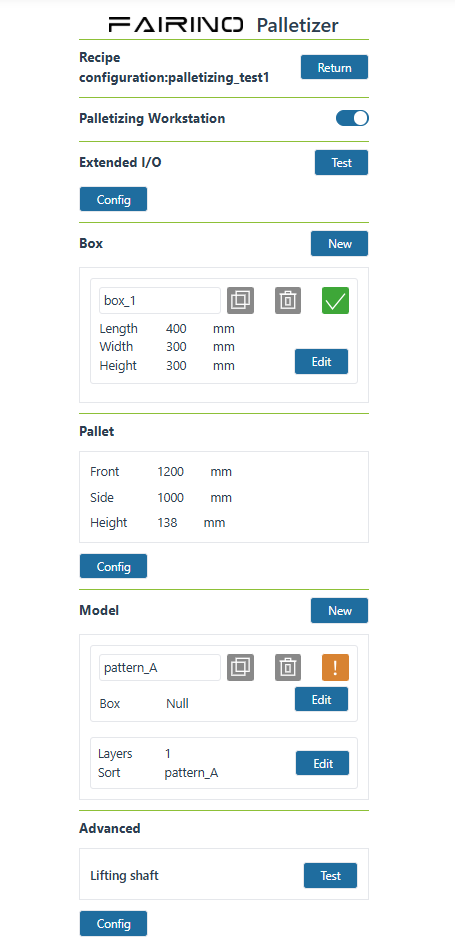

.. centered:: Abbildung 10-3-1 Palettierrezept-Bearbeitungsoberfläche

Arbeitsplatz einrichten
~~~~~~~~~~~~~~~~~~~~~~~~~~~~~~~~

Wählen Sie in der Rezeptbearbeitung, ob eine Palettierarbeitsstation verwendet werden soll. Bei Verwendung einer Palettierarbeitsstation wird die Palettierfunktion über die I/O-Signale der SPS der Station ausgeführt. Wenn Sie "Keine Palettierarbeitsstation" wählen, wird standardmäßig die Palettierfunktion über die I/O-Signale des Steuerungsgehäuses ausgeführt.

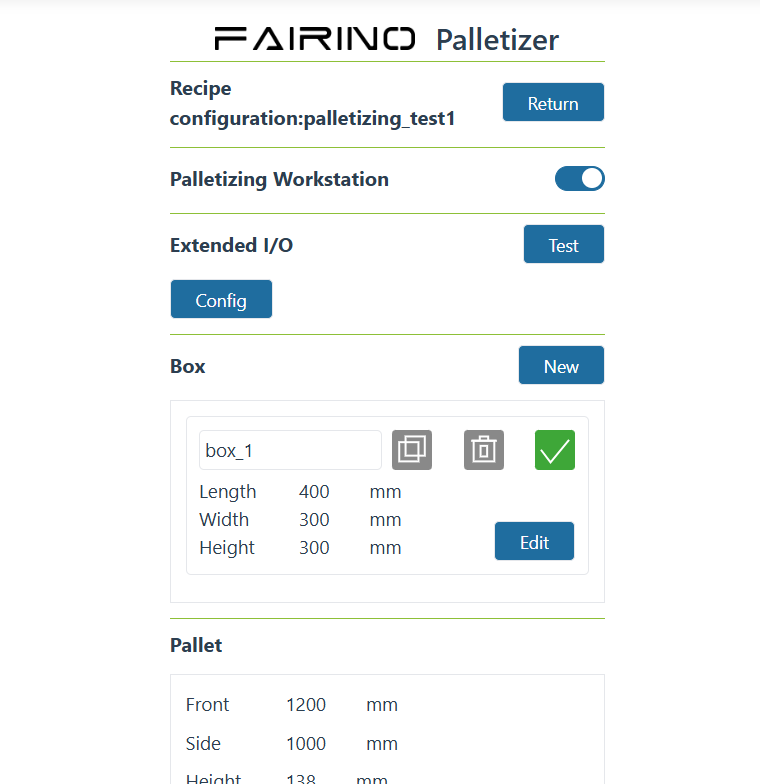

.. centered:: Abbildung 10-3-1-1 Rezeptbearbeitungsseite

I/O-Verdrahtungskonfiguration für Palettierfunktion
~~~~~~~~~~~~~~~~~~~~~~~~~~~~~~~~~~~~~~~~~~~~~~~~~~~~~~~~~~~~~~~~

(1) Nach Auswahl von "Palettierarbeitsstation verwenden" klicken Sie auf "Erweiterte I/O-Konfiguration". Entsprechend der tatsächlichen Verdrahtung der I/O-Schnittstellen der jeweiligen Funktion mit der SPS können Sie die I/O-Signalkonfiguration für die Palettierfunktion benutzerdefiniert auswählen. Die folgende Abbildung zeigt die Standardverdrahtungskonfiguration für die Palettierarbeitsstation.

.. image:: frcap_pictures/077.png
   :width: 4in
   :align: center

.. centered:: Abbildung 10-3-1-2 Standardverdrahtungskonfiguration für Palettierarbeitsstation

(2) Wenn Sie "Keine Palettierarbeitsstation verwenden" wählen, werden standardmäßig die I/O-Signale des Steuerungsgehäuses verwendet. Entsprechend der tatsächlichen Verdrahtung der I/O-Schnittstellen der jeweiligen Funktion mit dem Steuerungsgehäuse können Sie die I/O-Signalkonfiguration für die Palettierfunktion benutzerdefiniert auswählen. Die folgende Abbildung zeigt die Standardverdrahtungskonfiguration ohne Palettierarbeitsstation (Verwendung von Steuerungsgehäuse-I/O).

.. image:: frcap_pictures/078.png
   :width: 4in
   :align: center

.. centered:: Abbildung 10-3-1-3 Standardverdrahtungskonfiguration ohne Palettierarbeitsstation (Steuerungsgehäuse-I/O)

I/O-Kommunikationstest für Palettierfunktion
~~~~~~~~~~~~~~~~~~~~~~~~~~~~~~~~~~~~~~~~~~~~~~~~~~~~~~~~~~~~~~~~

(1) Bei Auswahl von "Palettierarbeitsstation verwenden" und nach Abschluss der Konfiguration der erweiterten I/O-Signale für die Palettierarbeitsstation können Sie auf "Test" klicken, um die Funktion der verdrahteten I/Os zu testen und zu verifizieren.

.. image:: frcap_pictures/079.png
   :width: 4in
   :align: center

.. centered:: Abbildung 10-3-1-4 I/O-Verdrahtungstest für Palettierarbeitsstation

(2) Bei Auswahl von "Keine Palettierarbeitsstation" und nach Abschluss der Konfiguration der Steuerungsgehäuse-I/O-Signale für die Palettierfunktion können Sie auf "Test" klicken, um die Funktion der verdrahteten I/Os zu testen und zu verifizieren.

.. image:: frcap_pictures/080.png
   :width: 4in
   :align: center

.. centered:: Abbildung 10-3-1-5 I/O-Verdrahtungstest ohne Palettierarbeitsstation (Steuerungsgehäuse-I/O)

Kistenkonfiguration
~~~~~~~~~~~~~~~~~~~

Kistenaktionen
++++++++++++++

Es können mehrere unterschiedliche Kistentypen konfiguriert werden.

Klicken Sie auf die Schaltfläche "Neu anlegen". Nach erfolgreicher Anlage wird eine neue Kiste in der aktuellen Reihenfolge hinzugefügt.

.. image:: frcap_pictures/048.png
   :width: 6in
   :align: center
.. image:: frcap_pictures/049.png
   :width: 6in
   :align: center

.. centered:: Abbildung 10-3-2 Neue Kiste anlegen

Klicken Sie auf den Eingabebereich, der den Kistennamen anzeigt. Es öffnet sich das Pop-up-Fenster "Kiste umbenennen". Geben Sie den Namen ein und klicken Sie auf die Schaltfläche "Bestätigen", um die Umbenennung zu bestätigen.

.. image:: frcap_pictures/050.png
   :width: 6in
   :align: center

.. centered:: Abbildung 10-3-3 Kiste umbenennen

Klicken Sie auf das Symbol "Kopieren". Nach erfolgreichem Kopiervorgang wird eine Kiste basierend auf dem aktuellen Kistennamen kopiert.

.. image:: frcap_pictures/051.png
   :width: 6in
   :align: center
.. image:: frcap_pictures/052.png
   :width: 6in
   :align: center

.. centered:: Abbildung 10-3-4 Kiste kopieren

Klicken Sie auf das Symbol "Löschen", um die Kastendaten zu löschen.

.. note::
   Löschen Sie keine Kisten, die bereits in der Musterkonfiguration verwendet werden.

.. image:: frcap_pictures/053.png
   :width: 6in
   :align: center
.. image:: frcap_pictures/054.png
   :width: 6in
   :align: center

.. centered:: Abbildung 10-3-5 Kiste löschen

Klicken Sie bei einer beliebigen Kiste auf die Schaltfläche "Bearbeiten", um zur Oberfläche für die Konfiguration der Kistenparameter zu gelangen. Nach erfolgreicher Konfiguration wird das Symbol für den Konfigurationsstatus der Kiste grün; bei unvollständiger Konfiguration ist das Symbol gelb.

.. image:: frcap_pictures/055.png
   :width: 6in
   :align: center

.. centered:: Abbildung 10-3-6 Kistenparameter-Konfiguration abgeschlossen

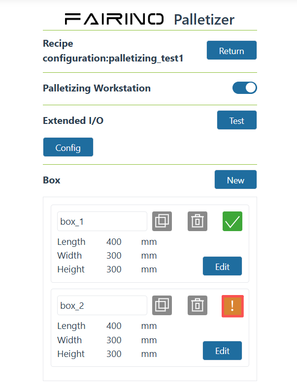

.. centered:: Abbildung 10-3-7 Kistenparameter-Konfiguration unvollständig

Kistenparameter
+++++++++++++++

.. note::
   .. image:: frcap_pictures/057.png
      :width: 0.5in
      :height: 0.5in
      :align: left

   | Name: **Vorherige Kiste**
   | Funktion: Wechselt zur vorherigen Kiste. Bei der ersten Kiste wird zur letzten Kiste gewechselt.

.. note::
   .. image:: frcap_pictures/058.png
      :width: 0.5in
      :height: 0.5in
      :align: left

   | Name: **Nächste Kiste**
   | Funktion: Wechselt zur nächsten Kiste. Bei der letzten Kiste wird zur ersten Kiste gewechselt.

Klicken Sie im Kistenkonfigurationsbereich auf "Bearbeiten", um das Pop-up-Fenster "Kistenkonfiguration" zu öffnen. Stellen Sie "Länge", "Breite", "Höhe", "Last" und "Ausrichtung des Werkstücketiketts" der Kiste ein. Klicken Sie auf die Schaltfläche "Bestätigen", um die Kisteninformationen abzuschließen. Stellen Sie den Greifpunkt der Kiste ein (der Greifpunkt sollte in der Mitte der Kiste liegen; der Saugerfuß sollte beim Kontakt mit der Kiste einen leichten Druck ausüben). Klicken Sie auf die Schaltfläche "Aufzeichnen", um die Einstellung abzuschließen.

.. image:: frcap_pictures/029.png
   :width: 6in
   :align: center

.. centered:: Abbildung 10-3-8 Kistenkonfiguration

.. image:: frcap_pictures/030.png
   :width: 3in
   :align: center

.. centered:: Abbildung 10-3-9 Kisten-Greifpunkt

.. important:: Der Greifpunkt der Kiste muss aufgezeichnet werden, da sonst die Länge, Breite und Höhe der Kiste nicht konfiguriert werden können.

Palettenkonfiguration
+++++++++++++++++++++
Klicken Sie im Palettenkonfigurationsbereich auf "Konfigurieren", um das Pop-up-Fenster "Palettenkonfiguration" zu öffnen. Stellen Sie "Vorderseite (Länge)", "Seite (Breite)" und "Höhe" der Palette ein. Konfigurieren Sie anschließend die Arbeitsplatz-Übergangspunkte. Klicken Sie auf "Konfiguration bestätigen", um die Paletteninformationen abzuschließen.

.. image:: frcap_pictures/031.png
   :width: 6in
   :align: center

.. centered:: Abbildung 10-3-10 Palettenkonfiguration

.. image:: frcap_pictures/032.png
   :width: 3in
   :align: center

.. centered:: Abbildung 10-3-11 Linker Arbeitsplatz-Übergangspunkt

.. image:: frcap_pictures/033.png
   :width: 3in
   :align: center

.. centered:: Abbildung 10-3-12 Rechter Arbeitsplatz-Übergangspunkt

.. important:: Die Arbeitsplatz-Übergangspunkte müssen aufgezeichnet werden, da sonst die generierten Programme nicht gespeichert werden können.

Musterkonfiguration
~~~~~~~~~~~~~~~~~~~

Musteraktionen
++++++++++++++

Bei der Auswahl von Kisten in der Musterkonfiguration können Kisten mit gleicher Höhe, aber unterschiedlicher Länge und Breite ausgewählt werden. Der Musteranzeigebereich ist unterteilt in: Muster hinzufügen (Konfiguration des Paletten-Stapelmusters) und Konfiguration der Palettierlagenanzahl.

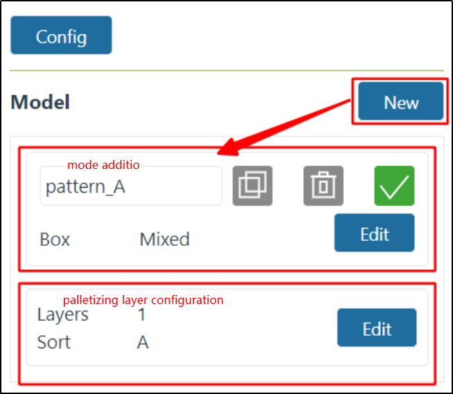

.. centered:: Abbildung 10-3-13 Musteranzeigebereich

Klicken Sie auf die Schaltfläche "Neu anlegen". Nach erfolgreicher Anlage wird ein neues Muster in der aktuellen Reihenfolge hinzugefügt.

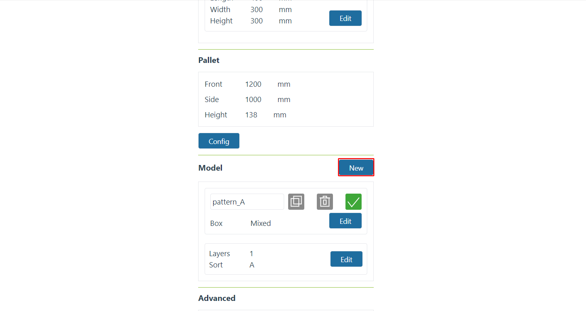
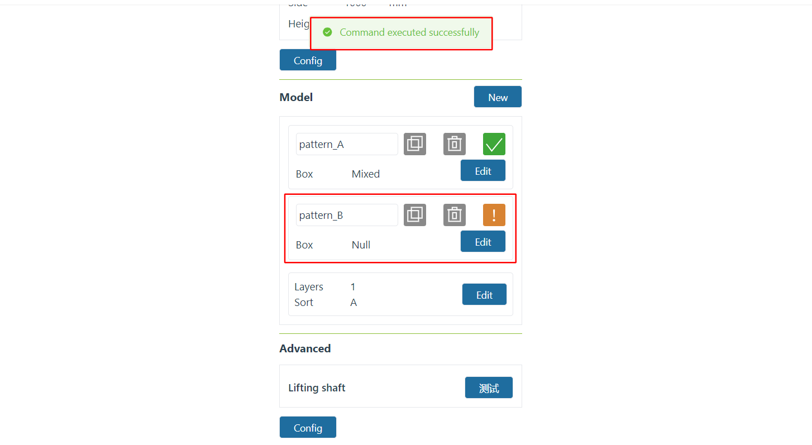

.. centered:: Abbildung 10-3-14 Neues Muster anlegen

Klicken Sie im Musterhinzufügebereich auf den Eingabebereich, der den Musternamen anzeigt. Es öffnet sich das Pop-up-Fenster "Muster umbenennen". Geben Sie den Namen ein und klicken Sie auf die Schaltfläche "Bestätigen", um die Umbenennung zu bestätigen.

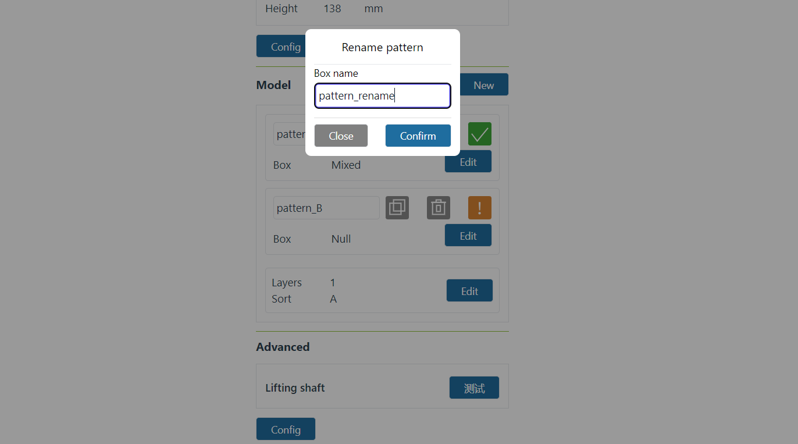

.. centered:: Abbildung 10-3-15 Muster umbenennen

Klicken Sie im Musterhinzufügebereich auf das Symbol "Kopieren". Nach erfolgreichem Kopiervorgang wird ein Muster basierend auf dem aktuellen Musternamen kopiert.

.. image:: frcap_pictures/063.png
   :width: 6in
   :align: center
.. image:: frcap_pictures/064.png
   :width: 6in
   :align: center

.. centered:: Abbildung 10-3-16 Muster kopieren

Klicken Sie im Musterhinzufügebereich auf das Symbol "Löschen", um die aktuellen Musterdaten zu löschen.

.. image:: frcap_pictures/065.png
   :width: 6in
   :align: center
.. image:: frcap_pictures/066.png
   :width: 6in
   :align: center

.. centered:: Abbildung 10-3-17 Muster löschen

Klicken Sie im Musterhinzufügebereich auf die Schaltfläche "Bearbeiten", um das Pop-up-Fenster "Musterkonfiguration" zu öffnen und das Paletten-Stapelmuster für das aktuelle Muster zu konfigurieren. Nach erfolgreicher Konfiguration wird das Symbol für den Konfigurationsstatus der Kiste grün; bei unvollständiger Konfiguration ist das Symbol gelb.

.. image:: frcap_pictures/067.png
   :width: 6in
   :align: center

.. centered:: Abbildung 10-3-18 Musterparameter-Konfiguration abgeschlossen

.. image:: frcap_pictures/068.png
   :width: 6in
   :align: center

.. centered:: Abbildung 10-3-19 Musterparameter-Konfiguration unvollständig

Im Bereich "Palettierlagenanzahl konfigurieren" werden die Anzahl der Lagen und die Sortierreihenfolge angezeigt. Klicken Sie auf die Schaltfläche "Bearbeiten", um das Pop-up-Fenster "Stapelmuster-Sequenz konfigurieren" zu öffnen. Geben Sie die "Anzahl der Palettierlagen" ein, wählen Sie das Muster für jede Lage aus und klicken Sie auf die Schaltfläche "Bestätigen", um die Konfiguration abzuschließen.

.. image:: frcap_pictures/069.png
   :width: 6in
   :align: center

.. centered:: Abbildung 10-3-20 Palettierlagenanzahl konfigurieren

Musterparameter
+++++++++++++++

.. note::
   .. image:: frcap_pictures/057.png
      :width: 0.5in
      :height: 0.5in
      :align: left

   | Name: **Vorheriges Muster**
   | Funktion: Wechselt zum vorherigen Muster. Beim ersten Muster wird zum letzten Muster gewechselt.

.. note::
   .. image:: frcap_pictures/058.png
      :width: 0.5in
      :height: 0.5in
      :align: left

   | Name: **Nächstes Muster**
   | Funktion: Wechselt zum nächsten Muster. Beim letzten Muster wird zum ersten Muster gewechselt.

Klicken Sie im Musterkonfigurationsbereich auf "Konfigurieren", um das Pop-up-Fenster "Musterkonfiguration" zu öffnen. Es ist hauptsächlich in vier Bereiche unterteilt: Musterauswahl, Kistenaktionen und Stapelsimulation.

.. image:: frcap_pictures/040.png
   :width: 6in
   :align: center

.. centered:: Abbildung 10-3-21 Musterkonfiguration

.. important::
   Wenn beim Hinzufügen von Kisten eine Kollision zwischen den Kisten auftritt, wird die Hintergrundfarbe der Werkstücke rot. In diesem Fall können die oben genannten Aktionen nicht ausgeführt werden. Passen Sie die Kistenpositionen an, um Kollisionen zu vermeiden.

Wählen Sie oben im Pop-up-Fenster das Muster aus. Wählen Sie im Bereich "Kistenaktionen" die Kisten aus, die zu diesem Muster hinzugefügt werden sollen. Sie können "Alle hinzufügen" wählen, was standardmäßig die Kisten ohne Abstand mittig auf der Palette anordnet. Sie können den Abstand zwischen den Kisten benutzerdefiniert einstellen, einzeln oder in Chargen hinzufügen. Klicken Sie auf "Bestätigen", um die Mustereinstellungen abzuschließen. Wenn die ausgewählten Kisten unterschiedliche Höhen haben, kann die Konfiguration nicht abgeschlossen werden, und es erscheint der Hinweis "Die Höhen der Kistentypen sind unterschiedlich und können nicht demselben Muster hinzugefügt werden".

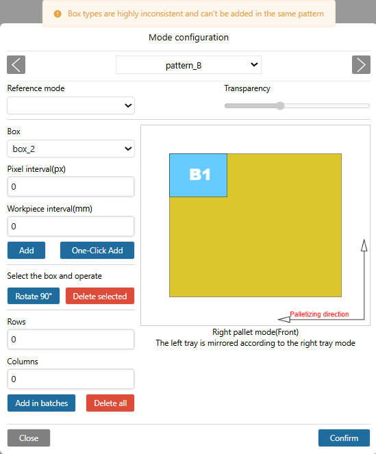

.. centered:: Abbildung 10-3-22 Hinweis auf unterschiedliche Kistenhöhen bei der Auswahl

Wählen Sie ein Referenzmuster (bereits ausgewählte Muster können nicht ausgewählt werden), um vergleichend zu sehen, ob das aktuelle Musterkonfiguration auf Basis dieses Referenzmusters palettiert werden kann. Dies erleichtert dem Benutzer die visuelle Beurteilung der Kistenstapelbilder verschiedener Muster.

.. important::
   Palettierrichtung: Am Beispiel der rechten Palette: Die untere rechte Ecke ist der am weitesten entfernte Punkt. Platzieren Sie eine Reihe Werkstücke vertikal oder horizontal von der unteren rechten Ecke aus, dann die nächste Reihe horizontal oder vertikal darüber usw. (Die Palettierrichtung ist auf der Webseite markiert, bitte beachten). Die linke Palette wird spiegelbildlich zur rechten Palette bestückt.

Erweiterte Konfiguration
~~~~~~~~~~~~~~~~~~~~~~~~
Klicken Sie im Bereich "Erweiterte Konfiguration" auf "Konfigurieren", um das Pop-up-Fenster "Erweiterte Konfiguration" zu öffnen. Die Konfigurationspunkte sind wie folgt:

.. image:: frcap_pictures/041.png
   :width: 6in
   :align: center

.. centered:: Abbildung 10-3-23 Erweiterte Konfiguration

1) **Abmessungen der Palettiereinrichtung**: Die Abmessungen des Palettiertisches.

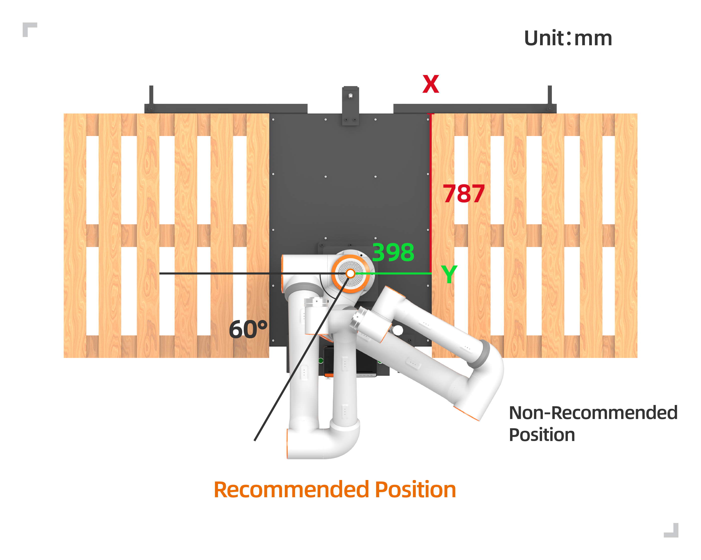
.. image:: frcap_pictures/075.png
   :width: 6in
   :align: center

.. centered:: Abbildung 10-3-24 Palettiertisch

.. important::
   X, Y, Z sind die absoluten Koordinatenwerte des Punktes (oben rechts der linken Palette oder oben links der rechten Palette) relativ zum Roboter-Basiskoordinatensystem. Angle ist der Rotationswinkel bei der Roboterinstallation; der empfohlene Wert bei der Installation ist 0.

2) **Materialentnahme-Anhebehöhe**: Die Höhe, um die der Roboter nach erfolgreicher Materialentnahme vom Greifpunkt angehoben wird (benutzerdefiniert).

3) **Materialentnahme-Wartezeit**: Die vom Benutzer definierte Wartezeit auf das Signal für anliegenden Unterdruck nach dem Ansaugen. Falls das Signal ausbleibt, wird der Ansaugvorgang wiederholt.

4) **Erster/zweiter Versatzabstand**: Der vom Benutzer definierte Versatzabstand für das schräge Stapeln des Roboters am Zielpunkt.

.. note::
   Der Parameter Z für den ersten Versatz muss größer als die Kistenhöhe sein, da es sonst während des Stapelvorgangs zu einer Kollision mit bereits platzierten Kisten kommt.

5) **Trennlagenkonfiguration**: Stellen Sie die Abmessungen "Länge", "Breite" und "Höhe" der Trennlage ein und wählen Sie, ob die Trennlage aktiviert/deaktiviert werden soll.

.. note::
   Wenn die Trennlagenfunktion aktiviert ist, werden die grundlegenden Parameter der Trennlagenkonfiguration im Inhalt der erweiterten Konfiguration in der Rezeptverwaltung angezeigt.

.. image:: frcap_pictures/034.png
   :width: 6in
   :align: center

.. centered:: Abbildung 10-3-25 Trennlagenkonfiguration

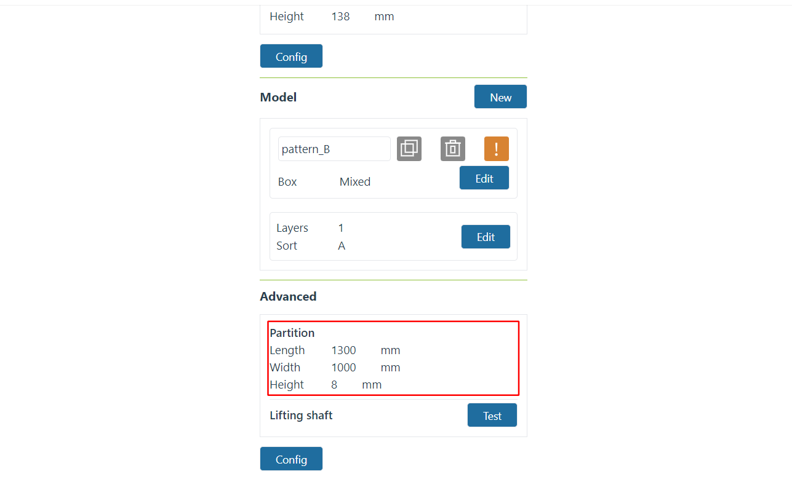

.. centered:: Abbildung 10-3-26 Rezeptverwaltung – Erweiterte Konfiguration zeigt Trennlagenkonfiguration

Konfigurieren Sie anschließend die Trennlagen-Übergangspunkte. Es gibt drei Übergangspunkte für die Trennlage. Der Zweck ihrer Einrichtung besteht darin, nach dem Greifen der Trennlage einen groben Bewegungspfad zu planen, um Kollisionen zu vermeiden und das Platzieren der Trennlage zu ermöglichen.

.. note::
   Übergangspunkt 1 wird teached, nachdem eine gewisse Strecke vom Kisten-Greifpunkt aus bewegt wurde. Übergangspunkt 2 wird teached, nachdem eine gewisse Strecke von Übergangspunkt 1 aus bewegt wurde; er kann auch als mittlerer Übergangspunkt dienen. Übergangspunkt 3 wird teached, nachdem eine gewisse Strecke von Übergangspunkt 2 aus bewegt wurde; es ist der letzte Punkt vor dem Platzieren der Trennlage.

.. image:: frcap_pictures/035.png
   :width: 3in
   :align: center

.. centered:: Abbildung 10-3-27 Trennlagen-Übergangspunkt 1 (am Beispiel des rechten Arbeitsplatzes)

.. image:: frcap_pictures/036.png
   :width: 3in
   :align: center

.. centered:: Abbildung 10-3-28 Trennlagen-Übergangspunkt 2 (am Beispiel des rechten Arbeitsplatzes)

.. image:: frcap_pictures/037.png
   :width: 3in
   :align: center

.. centered:: Abbildung 10-3-29 Trennlagen-Übergangspunkt 3 (am Beispiel des rechten Arbeitsplatzes)

Konfigurieren Sie anschließend den Greifpunkt (der Greifpunkt sollte in der Mitte der Trennlage liegen; der Saugerfuß sollte beim Kontakt mit der Trennlage einen leichten Druck ausüben) und den Ablagepunkt. Klicken Sie auf "Bestätigen", um die Trennlageneinstellungen abzuschließen.

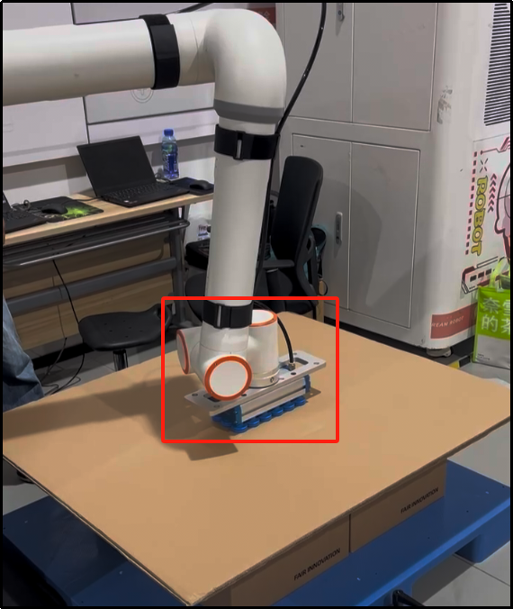

.. centered:: Abbildung 10-3-30 Trennlagen-Greifpunkt (am Beispiel des rechten Arbeitsplatzes)

.. image:: frcap_pictures/039.png
   :width: 3in
   :align: center

.. centered:: Abbildung 10-3-31 Trennlagen-Ablagepunkt (am Beispiel des rechten Arbeitsplatzes)

6) **Hubachse**: Benutzerdefinierte Konfiguration der Hubachse: Aktivierung/Deaktivierung, Kommunikationsparameter (IP-Adresse, Port und Kommunikationszyklus), Lagennummer, ab der die Hubachse aktiv werden soll, sowie Auswahl, ob die Hubachse aktiviert/deaktiviert werden soll.

.. note::
   - Die Hubhöhe der Hubachse bei jedem Arbeitsschritt entspricht der Höhe der Kiste.
   - Wenn die Hubachsenfunktion aktiviert ist, wird auf der Startseite im Inhalt der erweiterten Konfiguration eine Schaltfläche zum Testen der Hubachse angezeigt. Klicken Sie auf die Schaltfläche "Test", um das Pop-up-Fenster "Hubachsentest" zu öffnen und die Genauigkeit des Ladens der Kommunikation, des Hebens und des Senkens der Hubachse zu testen, um Probleme wie Nichtfunktionieren oder große Abweichungen bei der direkten Verwendung zu vermeiden.

.. image:: frcap_pictures/042.png
   :width: 6in
   :align: center

.. centered:: Abbildung 10-3-32 Hubachsenkonfiguration

.. image:: frcap_pictures/072.png
   :width: 6in
   :align: center

.. centered:: Abbildung 10-3-33 Rezeptverwaltung – Erweiterte Konfiguration zeigt Hubachse

.. image:: frcap_pictures/073.png
   :width: 4in
   :align: center

.. centered:: Abbildung 10-3-34 Hubachsentest

Programmgenerierung
-------------------
Sehen Sie sich unterhalb der Rezeptanzeige die "Programmgenerierung" an. Wählen Sie das Rezept basierend auf dem Rezept und den Anforderungen aus. Wenn sowohl für den linken als auch für den rechten Arbeitsplatz ein Rezept ausgewählt wird, muss eine Startpriorität gewählt werden. Wenn nur ein Rezept für den linken oder rechten Arbeitsplatz ausgewählt wird, muss keine Startpriorität gewählt werden. Geben Sie einen Programmnamen ein und klicken Sie auf die Schaltfläche "Generieren".

.. note::
   Alle Programmnamen beginnen mit "palletizing". Sie müssen "palletizing" nicht eingeben, sondern nur den Namen nach dem Unterstrich "_". Für "palletizing_program" geben Sie z. B. einfach "program" ein.

.. image:: frcap_pictures/043.png
   :width: 4in
   :align: center

.. centered:: Abbildung 10-4-1 Programmgenerierung – Rezeptauswahl für linken und rechten Arbeitsplatz

.. image:: frcap_pictures/081.png
   :width: 4in
   :align: center

.. centered:: Abbildung 10-4-2 Programmgenerierung – Rezeptauswahl für linken Arbeitsplatz, kein Rezept für rechten Arbeitsplatz

.. important::
    1. Wenn für den linken oder rechten Arbeitsplatz kein Palettierrezept ausgewählt ist, bedeutet dies, dass dieser Arbeitsplatz nicht aktiviert ist.
    2. Nach erfolgreicher Programmgenerierung müssen alle Unterprogramme und das Hauptprogramm im Programm-Teach manuell gespeichert werden.
    3. Entpalettierprogramme beginnen mit "de". Wenn das Palettierprogramm z. B. "palletizing_program" heißt, lautet das Entpalettierprogramm "depalletizing_program".
    4. Wenn ein Programm ausgeführt wird, für das beide Arbeitsplätze (links und rechts) mit Rezepten konfiguriert sind, wird nach dem gleichzeitigen Empfang der "Werkstück vorhanden"-Signale von beiden Seiten gemäß der eingestellten Priorität gearbeitet.

Programm mit einem Entnahmepunkt
~~~~~~~~~~~~~~~~~~~~~~~~~~~~~~~~~~~~~~~~~~~~~~~~~~~

Ein Programm mit einem Entnahmepunkt tritt in den folgenden zwei Fällen auf:

(1) Für den linken und rechten Arbeitsplatz wird das gleiche Rezept ausgewählt.
(2) Für den linken und rechten Arbeitsplatz werden unterschiedliche Rezepte ausgewählt, aber die im Rezept konfigurierte Pose des Kisten-Greifpunkts ist identisch.

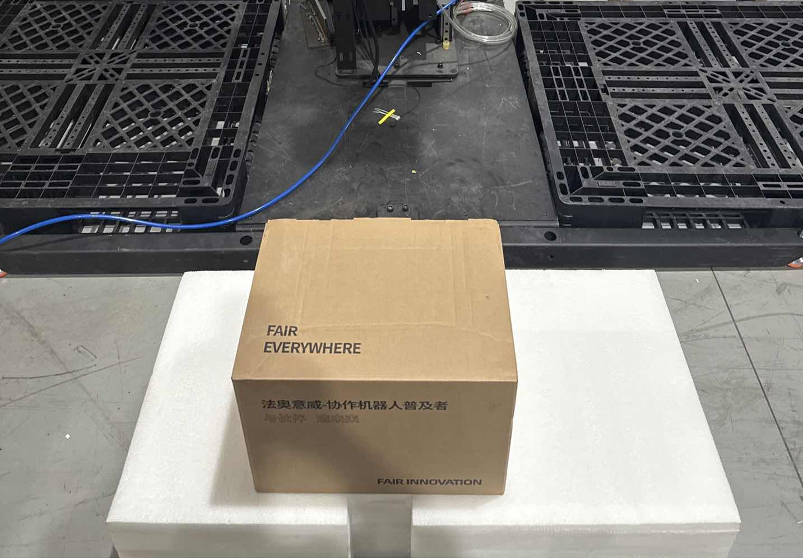

.. centered:: Abbildung 10-4-3 Kisten-Greifpunkt für einen Entnahmepunkt

Programm mit zwei Entnahmepunkten
~~~~~~~~~~~~~~~~~~~~~~~~~~~~~~~~~~~~~~~~~~~~~~~~~~~
Für die Konfiguration eines Programms mit zwei Entnahmepunkten müssen für den linken und rechten Arbeitsplatz unterschiedliche Rezepte ausgewählt werden, und die im Rezept konfigurierte Pose des Kisten-Greifpunkts muss unterschiedlich sein.

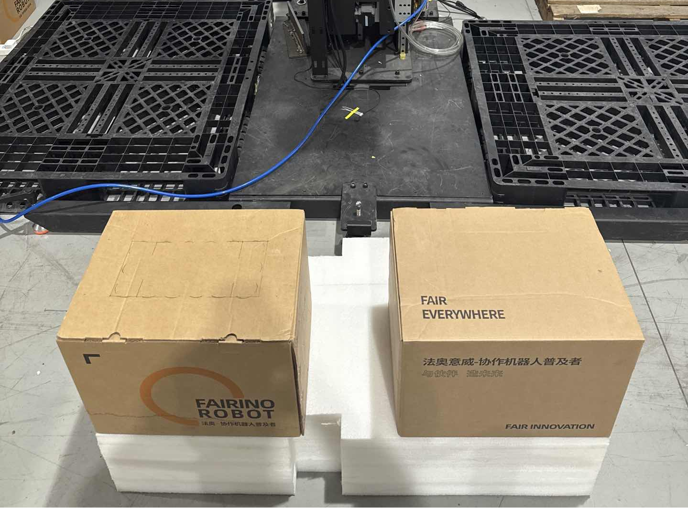

.. centered:: Abbildung 10-4-4 Kisten-Greifpunkte für zwei Entnahmepunkte