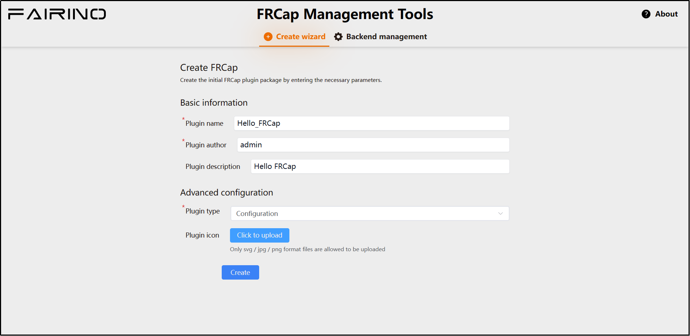

Schnellstart
=========================

.. toctree::
   :maxdepth: 6

Ich habe kein FRCap
---------------------

Wenn Sie derzeit noch kein FRCap besitzen, können Sie in diesem Abschnitt schnell eines erstellen.

Zuerst müssen wir eine Verbindung zum Roboter herstellen und auf die WebApp zugreifen. Öffnen Sie dazu auf Ihrem lokalen Computer einen Browser, geben Sie die Standard-IP-Adresse des Roboters ein (http://192.168.58.2) und melden Sie sich in der WebApp an.

.. image:: frcap_pictures/002.png
   :width: 6in
   :align: center

.. centered:: Abbildung 2-1 Seite "FRCap-Verwaltung" in der WebApp

Klicken Sie in der WebApp nacheinander auf "Systemeinstellungen" -> "FRCap-Verwaltung" -> "Verwaltungstools". Daraufhin wird in Ihrem Browser ein neuer Tab geöffnet und das "FRCap-Verwaltungstool" geladen.

.. image:: frcap_pictures/003.png
   :width: 6in
   :align: center

.. centered:: Abbildung 2-2 FRCap-Verwaltungstool

Wählen Sie im FRCap-Verwaltungstool den Punkt "Erstellungsassistent" aus. Geben Sie die folgenden Plugin-Informationen ein bzw. wählen Sie sie aus:

- **Plugin-Name**: Hello_FRCap
- **Plugin-Autor**: admin
- **Plugin-Beschreibung**: Hello FRCap
- **Plugin-Typ**: Konfiguration

Das Plugin-Symbol muss nicht hochgeladen werden. Nachdem Sie die Parameter eingegeben oder ausgewählt haben, klicken Sie auf "Erstellen", um die Erstellung des FRCap abzuschließen.

.. centered:: Abbildung 2-3 FRCap-Erstellungsassistent

Nach erfolgreicher Erstellung werden Sie zur Erfolgsseite weitergeleitet, die den Namen des soeben erstellten FRCap anzeigt. Klicken Sie auf "Herunterladen", um das erstellte FRCap auf Ihren lokalen Computer herunterzuladen.

.. image:: frcap_pictures/005.png
   :width: 6in
   :align: center

.. centered:: Abbildung 2-4 Herunterladen des Hello FRCap Plugin-Pakets

Ich habe bereits ein FRCap
---------------------------

Wenn Sie bereits einen FRCap-Projektordner besitzen, der der FRCap-Projektstruktur entspricht, lesen Sie bitte direkt unter `FRCap erstellen <frcap_quick_start.html#id3>`__ weiter.

Wenn Sie bereits ein vollständiges Plugin-Paket mit der Dateiendung ".plugin" besitzen, lesen Sie bitte direkt unter `Hello FRCap <frcap_quick_start.html#hello-frcap>`__ weiter.

FRCap erstellen
----------------

Öffnen Sie das in Kapitel 2.1 heruntergeladene FRCap-Projekt oder Ihr vorhandenes FRCap-Projekt.

Öffnen Sie je nach verwendetem Betriebssystem zuerst das Build-Skript. Ändern Sie den Parameter `buildName` in den gewünschten Namen, speichern Sie die Änderungen und schließen Sie die Datei. Führen Sie dann das entsprechende Skript im Terminal aus.

- **Windows**: Starten Sie ein Terminal und führen Sie den folgenden Befehl aus:

.. code-block:: bash
   :linenos:

   ./build.bat

- **Linux**: Starten Sie ein Terminal und führen Sie den folgenden Befehl aus:

.. code-block:: bash
   :linenos:

   ./build.sh

Nach Abschluss des Builds wird im FRCap-Projektverzeichnis eine Paketdatei mit dem Namen des FRCap und der Dateiendung ".plugin" generiert.

.. image:: frcap_pictures/006.png
   :width: 6in
   :align: center

.. centered:: Abbildung 2-5 Fertig gestellte FRCap-Paketdatei

Hello FRCap
------------

Nachdem das FRCap-Projekt erstellt wurde, öffnen Sie auf Ihrem lokalen Computer einen Browser, geben Sie die Standard-IP-Adresse des Roboters ein (http://192.168.58.2) und melden Sie sich in der WebApp an. Klicken Sie nacheinander auf "Systemeinstellungen" -> "FRCap-Verwaltung" -> "Importieren". Wählen Sie die erstellte FRCap-Paketdatei mit der Endung ".plugin" aus und öffnen Sie sie, um den Upload zu starten. Nach erfolgreichem Upload werden die importierten FRCap-Informationen in der Plugin-Informationsliste unten auf der Seite angezeigt.

Über die Aktionsleiste in der Liste können Sie das FRCap aktivieren/deaktivieren und löschen. Im Statusfeld "Aktiviert/Deaktiviert" können Sie den Aktivierungsstatus des FRCap einsehen.

Nach der Aktivierung von Hello FRCap kann es unter "Hilfsanwendungen" -> "FRCap" -> "Hello FRCap" verwendet werden. Diese Seite enthält das Konfigurations-FRCap. Es kann vollflächig oder halbflächig dargestellt werden; standardmäßig wird es halbflächig angezeigt.

Damit haben Sie den gesamten Prozess der schnellen Plugin-Erstellung und -Verwendung durchlaufen.

.. image:: frcap_pictures/007.png
   :width: 6in
   :align: center

.. centered:: Abbildung 2-6 Inhalt von Hello FRCap

Wenn Sie detailliertere Anweisungen zum Erstellungsassistenten wünschen, lesen Sie bitte unter `Erstellungsassistent <frcap_create.html#id1>`__ weiter.

Informationen zu den Werkzeugen und der Umgebung, die für die FRCap-Entwicklung erforderlich sind, sowie entsprechende Anleitungen finden Sie unter `Entwicklungsleitfaden <frcap_development_guidance.html#id1>`__.

Detaillierte Anweisungen zur Verwendung von FRCap in der WebApp finden Sie unter `Verwendung von FRCap in der WebApp <frcap_use.html#webappfrcap>`__.