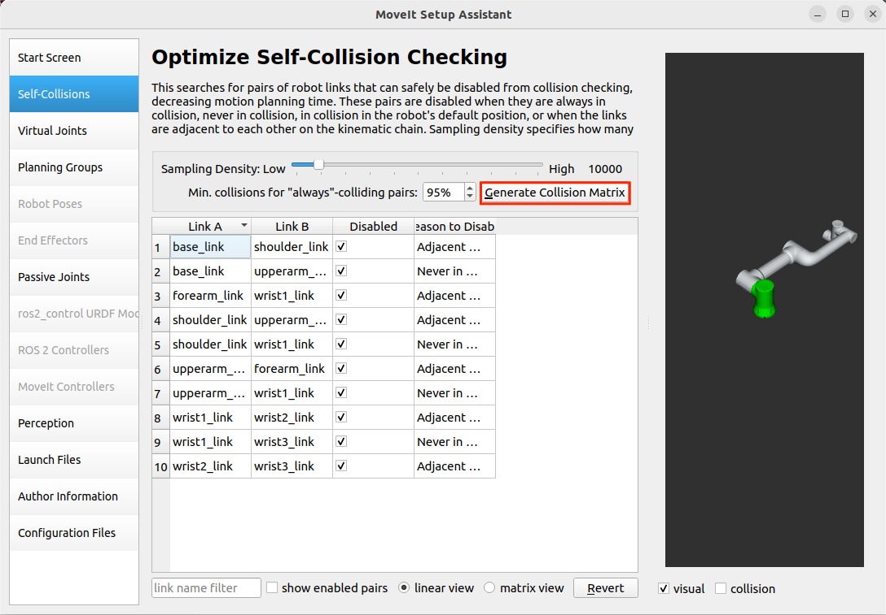
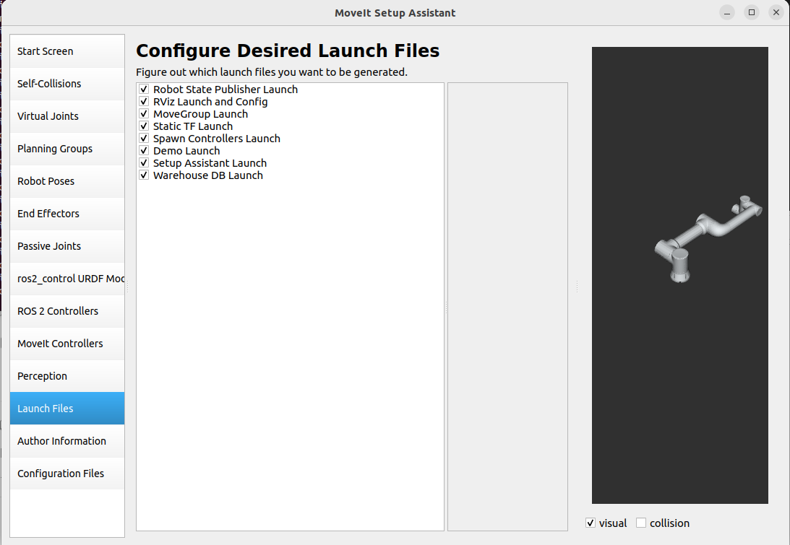
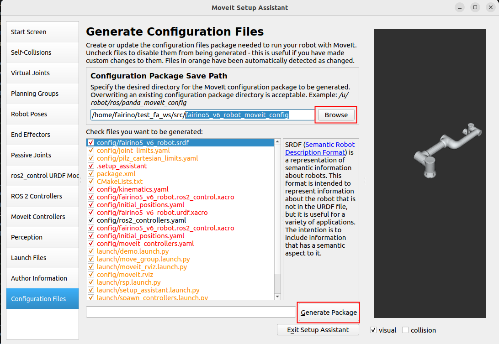
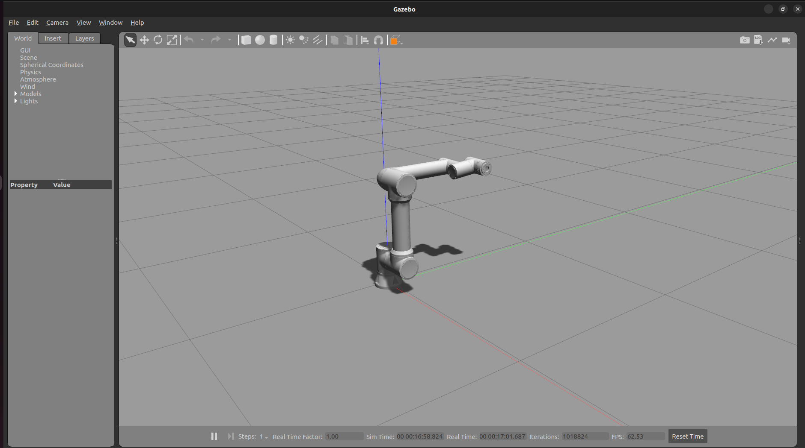

Plugin-Einführung
+++++++++++++++++
Das FAIRINO MoveIt2-Plugin ist ein Plugin, das die Bewegungssteuerung und Bahnplanung für FAIRINO-Roboter unterstützt. Mit dem FAIRINO MoveIt2-Plugin können komplexe Roboter-Bewegungssteuerungen, Bahnplanungen, inverse kinematische Berechnungen und Echtzeit-Kollisionserkennungen realisiert werden. Es eignet sich für verschiedene Anwendungsszenarien von Roboterarmen, wie Industrie, Schweißen, Fertigung, automatisiertes Be- und Entladen, Palettieren, Medizintechnik usw.

Schnellstart
++++++++++++
Dieses Kapitel beschreibt, wie die Ausführungsumgebung der App konfiguriert wird.

Die Verwendung wird unter Ubuntu 22.04 LTS (Jammy) empfohlen. Nach der Systeminstallation kann ROS2 installiert werden. Die Verwendung von ROS2 Humble wird empfohlen. Eine Anleitung zur Installation von ROS2 finden Sie unter: https://docs.ros.org/en/humble/index.html.

Installation und Konfiguration des FAIRINO MoveIt2-Plugin-Pakets
------------------------------------------------------------------
FAIRINO MoveIt2-Plugin klonen
""""""""""""""""""""""""""""""
Klonen Sie das FAIRINO MoveIt2-Plugin lokal und wechseln Sie dann per `cd` in das Zielverzeichnis. Die Hauptdateien umfassen:

- `fairino_msgs`: Funktionspaket für Datentypen der FAIRINO-Roboter-Datenübertragung.
- `fairino_hardware`: Funktionspaket für das FAIRINO `fairino_hardware`-Plugin.
- `fairino_robot/fairino_description`: Funktionspaket für die visuelle Darstellung und URDF-Dateien der FAIRINO-Roboter.
- `fairino_robot/fairino3mt_v6_moveit2_config`, `fairino_robot/fairino3_v6_moveit2_config`, `fairino_robot/fairino5_v6_moveit2_config`, `fairino_robot/fairino10_v6_moveit2_config`, `fairino_robot/fairino16_v6_moveit2_config`, `fairino_robot/fairino20_v6_moveit2_config`, `fairino_robot/fairino30_v6_moveit2_config`: MoveIt2-Konfigurationspakete für FAIRINO-Roboter.
- `fairino_robot/fairino_mtc_demo`: Beispiel-Codepaket für MoveIt Task Constructor (MTC).

.. image:: img/fairino_harware_001.png
    :width: 6in
    :align: center
.. image:: img/fairino_harware_002.png
    :width: 6in
    :align: center

Funktionspakete kompilieren
"""""""""""""""""""""""""""
Kompilieren des `fairino_msgs`-Funktionspakets

.. code-block:: shell
    :linenos:

    cd ros2_ws
    colcon build --packages-select fairino_msgs
    source install/setup.bash

Kompilieren des `fairino_hardware`-Funktionspakets

.. code-block:: shell
    :linenos:

    cd ros2_ws
    colcon build --packages-select fairino_hardware
    source install/setup.bash

Kompilieren des `fairino_description`-Funktionspakets

.. code-block:: shell
    :linenos:

    cd ros2_ws
    colcon build --packages-select fairino_description
    source install/setup.bash

Kompilieren des MoveIt2-Konfigurationspakets für FAIRINO-Roboter, am Beispiel von `fairino5_v6_moveit2_config`

.. code-block:: shell
    :linenos:

    cd ros2_ws
    colcon build --packages-select fairino5_v6_moveit2_config
    source install/setup.bash

Kompilieren des Beispiel-Codepakets `fairino_mtc_demo`. Falls dieses Beispielpaket nicht im offiziellen `ros2_ws`-Arbeitsbereich vorhanden ist, kann es über den Kundendienst bezogen werden.

.. code-block:: shell
    :linenos:

    cd ros2_ws
    colcon build --packages-select fairino_mtc_demo
    source install/setup.bash

Konfiguration des MoveIt2-Modells für den FAIRINO-Roboterarm
-------------------------------------------------------------
Wenn Sie nicht das offizielle, vom Roboter bereitgestellte `moveit2_config`-Konfigurationspaket verwenden möchten, können Sie mit `moveit_setup_assistant` ein benutzerdefiniertes `moveit2_config`-Konfigurationspaket für Ihren Roboter erstellen.

Arbeitsbereich erstellen
""""""""""""""""""""""""
Erstellen Sie einen Arbeitsbereich und ein Funktionspaket.

.. code-block:: shell
    :linenos:

    mkdir -p test_fa_ws/src
    cd test_fa_ws/src
    mkdir fairino5_v6_robot_moveit_config
    cd ..
    cd ..

Kompilieren Sie das Funktionspaket und führen Sie `source` aus.

.. code-block:: shell
    :linenos:

    colcon build
    source install/setup.bash

Starten Sie `moveit_setup_assistant` für die Roboter-Konfiguration.

.. code-block:: shell
    :linenos:

    ros2 launch moveit_setup_assistant setup_assistant.launch.py

Roboter konfigurieren
"""""""""""""""""""""
Konfigurationsoberfläche starten
^^^^^^^^^^^^^^^^^^^^^^^^^^^^^^^^^
Öffnen Sie ein Terminal im Verzeichnis `test_fa_ws`. Wählen Sie in der Konfigurationsoberfläche "Create New Moveit Configuration Package", um ein neues MoveIt-Konfigurationsfunktionspaket zu erstellen.

.. image:: img/fairino_harware_003.png
    :width: 6in
    :align: center

Wählen Sie dann die Beschreibungsdatei des Roboters, d.h. die `.urdf`-Datei, aus. Klicken Sie dann auf "Load Files", um das Robotermodell zu laden. Das Robotermodell sollte daraufhin auf der rechten Seite angezeigt werden.

.. image:: img/fairino_harware_004.png
    :width: 6in
    :align: center

Self-Collisions konfigurieren
^^^^^^^^^^^^^^^^^^^^^^^^^^^^^^
"Self-Collisions" dient der Roboter-Kollisionseinstellung. Ein Klick auf "Generate Collision Matrix" generiert automatisch die Kollisionsmatrix der Gelenke. Dabei wird die Kollisionserkennung zwischen sich berührenden Verbindungen sowie zwischen Verbindungen, die sich niemals berühren können, deaktiviert. Dies konfiguriert die Kollisionsmatrix der Robotergelenke und vermeidet so die Berechnung von Kollisionen zwischen sich berührenden Flächen. Ein Klick auf "Generate Collision Matrix" genügt.

Virtual Joints konfigurieren
^^^^^^^^^^^^^^^^^^^^^^^^^^^^^
"Virtual Joints" sind virtuelle Achsen des Roboters. Wenn der Roboter auf einer mobilen Plattform montiert ist, müssen virtuelle Achsen für ihn eingerichtet werden. Dazu gehören Name der virtuellen Achse, das verbundene Kindglied, der Gelenktyp usw. Wenn sich die mobile Plattform bewegt, bewegen sich die virtuellen Achsen synchron und bewegen so den Roboter. Dies realisiert die Funktion, dass der Roboter sich mit der mobilen Plattform bewegt. In diesem Fall wird der Roboter direkt im Weltkoordinatensystem (`world`) platziert und `virtual_joints` genannt.

.. image:: img/fairino_harware_006.png
    :width: 6in
    :align: center

Planning Groups konfigurieren
^^^^^^^^^^^^^^^^^^^^^^^^^^^^^^
"Planning Groups" sind die Planungsgruppen des Roboters. Gelenke, die bei der kinematischen Berechnung gemeinsam betrachtet werden müssen, werden innerhalb derselben Planungsgruppe zusammengefasst, um gemeinsame Vorwärts- und inverse kinematische Berechnungen durchzuführen. Beispielsweise könnten die vier Gelenke eines AGV-Fahrzeugs in einer Planungsgruppe, die sechs Gelenke eines Roboters in einer anderen und ein Gelenk eines Greifers in einer dritten Gruppe für die kinematische Berechnung zusammengefasst werden.

Da in diesem Fall kein Greifer verwendet wird, wird nur die Gelenkgruppe des Roboters, die `arm`-Gruppe, hinzugefügt. Fügen Sie zunächst die `arm`-Gruppe hinzu. Wählen Sie als Kinematik-Solver (`Kinematic Solver`) `kdl_kinematics_plugin/KDLKinematicsPlugin` aus. Wählen Sie dann als Standard-Planer (`Group Default Planner`) `TRRT` aus. Klicken Sie dann auf "Add Joints", um der Planungsgruppe Gelenke hinzuzufügen.

.. image:: img/fairino_harware_007.png
    :width: 6in
    :align: center

Halten Sie die Umschalttaste (`Shift`) gedrückt, um mehrere Gelenke des `arm` auszuwählen. Klicken Sie auf '>', um sie hinzuzufügen, und dann auf "save", um zu speichern.

.. image:: img/fairino_harware_008.png
    :width: 6in
    :align: center

Die definierte Planungsgruppe sieht wie folgt aus:

.. image:: img/fairino_harware_009.png
    :width: 6in
    :align: center

Robot Poses konfigurieren
^^^^^^^^^^^^^^^^^^^^^^^^^^
"Robot Poses" sind vordefinierte Posen des Roboters. Sie definieren einige voreingestellte Posen für jede Planungsgruppe. Definieren Sie eine `home`-Pose für den `arm`. Diese Pose kann beliebig gewählt werden.

.. image:: img/fairino_harware_010.png
    :width: 6in
    :align: center

Mit "Robot Poses" können für jede Planungsgruppe voreingestellte Posen definiert werden. Wenn der Roboter einen Greifer enthält, kann in "Planning Groups" eine Greifer-Planungsgruppe hinzugefügt werden. Anschließend können bei der Einstellung der Posen in "Robot Poses" auch Posen für den Greifer voreingestellt werden.

End Effectors konfigurieren
^^^^^^^^^^^^^^^^^^^^^^^^^^^^
"End Effectors" sind die Endeffektoren des Roboters. Die Planungsgruppe für den Endeffektor ist hier `hand`. Das standardmäßig verbundene Eltern-Glied (`parent_link`) ist `panda_link8`. Da in diesem Fall kein Endeffektor vorhanden ist, kann dieser Schritt übersprungen werden.

ros2_control URDF Modifications
^^^^^^^^^^^^^^^^^^^^^^^^^^^^^^^^
"ros2_control URDF Modifications" dient hauptsächlich zur Einstellung der Datentypen für die gesendeten Sollwerte und die rückgemeldeten Istwerte der Gelenke. Es kann zwischen Position, Geschwindigkeit und Drehmoment gewählt werden. In diesem Fall wird für beide, Soll- und Istwerte, die Positionsregelung gewählt. Klicken Sie dann einfach auf "Add interfaces".

.. image:: img/fairino_harware_011.png
    :width: 6in
    :align: center

.. important::

   - Hinweis:

     Die Auswahl des Gelenkdatentyps muss mit dem später verwendeten `fairino_hardware`-Plugin übereinstimmen. Wählen Sie die Datentypen für Soll- und Istwerte der Gelenke basierend auf den vom `fairino_hardware`-Plugin übertragenen Daten aus. Da das `fairino_hardware`-Plugin, das die tatsächliche Roboterbewegung steuert, in diesem Fall den `position`-Datentyp verwendet, werden sowohl für Soll- als auch für Istwerte der Gelenke die Positionsregelung gewählt.

ROS 2 Controllers
^^^^^^^^^^^^^^^^^^
"ROS 2 Controllers" dient hauptsächlich zur Generierung der `ros2_controllers.yaml`-Datei. Diese Datei legt die Veröffentlichungsfrequenz, die Gelenknamen, die Controllernamen, die Controller-Typen usw. fest. Konfigurieren Sie "ROS 2 Controllers", indem Sie für jede Planungsgruppe einen Controller konfigurieren. Klicken Sie dazu auf "Auto Add JointTrajectoryController Controllers For Each Planning Group".

.. image:: img/fairino_harware_012.png
    :width: 6in
    :align: center

Moveit Controllers
^^^^^^^^^^^^^^^^^^^
"Moveit Controllers" dient hauptsächlich zur Generierung der `moveit_controllers`-Datei. Diese Datei legt die Controllernamen, die Controller-Typen usw. fest. Es ist wichtig, dass die Controllernamen in `moveit_controllers` mit den Controllernamen in `ros2_controllers` übereinstimmen, da sonst ein reibungsloser Ablauf nicht gewährleistet ist.

Wenn die Controllernamen in `moveit_controllers` mit denen in `ros2_controllers` übereinstimmen, werden die Controller-Typen in `moveit_controllers` automatisch mit den Controller-Typen in `ros2_controllers` verknüpft. Dadurch werden die gesendeten Steuerdaten über `moveit_controllers` an `ros2_controllers` weitergeleitet und dann über das Plugin in `ros2_controllers` die tatsächliche Roboterbewegung angesteuert.

.. image:: img/fairino_harware_013.png
    :width: 6in
    :align: center

Launch Files
^^^^^^^^^^^^^
Konfigurieren Sie die Launch-Dateien. Die Standardkonfiguration kann verwendet werden.

Autoreninformationen
^^^^^^^^^^^^^^^^^^^^^
.. image:: img/fairino_harware_015.png
    :width: 6in
    :align: center

Launch-Dateien generieren
^^^^^^^^^^^^^^^^^^^^^^^^^^
Generieren Sie die Launch-Dateien. Wählen Sie den Speicherort aus. Erstellen Sie in diesem Fall im Verzeichnis `test_fa_ws/src` einen Ordner namens `fairino5_v6_robot_moveit_config` zur Ablage der Konfigurationsdateien und wählen Sie dann "Generate".

Da dies bereits einmal konfiguriert wurde, sollten bei einer Erstkonfiguration die Elemente unter "Check files you want to be generated" schwarz sein, was bedeutet, dass die Launch-Dateien generiert werden können.

Launch starten
""""""""""""""
Nach Abschluss der Konfiguration kann das Funktionspaket kompiliert werden. Sie können das benutzerdefinierte MoveIt2-Konfigurationspaket des Roboters verwenden, um das offizielle FAIRINO MoveIt2-Konfigurationspaket zu ersetzen und so die Plug-in-Kompatibilität für benutzerdefinierte Roboter zu erreichen.

.. code-block:: shell
    :linenos:

    colcon build --packages-select fairino5_v6_robot_moveit_config
    source install/setup.bash

Führen Sie dann direkt die soeben konfigurierte Launch-Datei aus.

.. code-block:: shell
    :linenos:

    ros2 launch fairino5_v6_robot_moveit_config demo.launch.py

Die vollständig konfigurierte RViz2-Oberfläche wird angezeigt.

.. image:: img/fairino_harware_017.png
    :width: 6in
    :align: center

MoveIt2 verwenden
"""""""""""""""""
Nach dem Öffnen des konfigurierten Pakets können Sie die Zielposition des Roboters festlegen, indem Sie die blaue Kugel am Ende des Roboters in der 3D-Ansicht auf der rechten Seite ziehen. Die Orientierung des Roboterendes kann über die drei roten, grünen und blauen Ringe geändert werden.

.. image:: img/fairino_harware_018.png
    :width: 6in
    :align: center

Klicken Sie auf die Schaltfläche "Plan" auf der linken Seite, um die Bewegungsbahn des Roboters zu planen.

.. image:: img/fairino_harware_019.png
    :width: 6in
    :align: center

Klicken Sie auf die Schaltfläche "Execute" auf der linken Seite, um den Roboter entlang der geplanten Bahn zur Zielpose zu bewegen.

.. image:: img/fairino_harware_020.png
    :width: 6in
    :align: center

Die Schaltfläche "Plan&Execute" plant die Bahn und steuert dann automatisch die Roboterbewegung.

Klicken Sie dann auf den Reiter "Joints". Hier können Sie durch Ändern der einzelnen Gelenkwinkel die Zielpose des Roboters verändern und dann über die Schaltflächen "Plan", "Execute" oder "Plan&Execute" die Roboterbewegung steuern.

.. image:: img/fairino_harware_021.png
    :width: 6in
    :align: center

Gazebo-Simulationsumgebung - Funktionspaket für die Anpassung von Serienrobotern
++++++++++++++++++++++++++++++++++++++++++++++++++++++++++++++++++++++++++++++++++++++++++++++++++++++++++++++++++++++++

Einführung
------------------------------------------------------------

Dieses Projekt bietet Simulationsfunktionspakete für FR-Serien-Kollaborationsroboter mit 6 Freiheitsgraden in der Gazebo Classic-Simulationsumgebung, implementiert auf Basis der ROS2 Humble- und ros2_control-Architektur. Jeder Roboter entspricht einem eigenständigen ROS2-Funktionspaket, das die standardmäßige ros2_control GazeboSystem-Hardwareschnittstelle verwendet und Gelenksteuerung sowie Gelenkzustandsrückmeldung unterstützt. Der Standard-Workspace-Name in diesem Handbuch ist FR_Gazebo_ws; bei eigener Anpassung bitte entsprechend ersetzen.

Unterstützte Modelle (11 Funktionspakete)
""""""""""""""""""""""""""""""""""""""""""""""""""""""""""""""""""""""""""""""""""""""""""""""""""""""""""""

Tabelle 1-1 Unterstützte Modelle und Funktionspakete

.. list-table::
   :widths: 50 50
   :header-rows: 0
   :align: center

   * - **Modell** 
     - **Funktionspaket**

   * - FR3
     - fr3v6_ros2_control

   * - FR5
     - fr5v6_ros2_control

   * - FR10
     - fr10v6_ros2_control

   * - FR16
     - fr16v6_ros2_control

   * - FR20
     - fr20v6_ros2_control

   * - FR30
     - fr30v6_ros2_control

   * - FR3C
     - fr3c_ros2_control

   * - FR5C
     - fr5c_ros2_control

   * - FR5WML
     - fr5l_ros2_control

   * - FR3WML
     - fr3wml_ros2_control

   * - FR3WMS
     - fr3wms_ros2_control

Kernfunktionen
""""""""""""""""""""""""""""""""""""""""""""""""""""""""""""""""""""""""""""""""""""""""""""""""""""""""""""

- Einheitliche Gelenkbenennung: Alle Modelle haben 6 Drehgelenke, benannt als j1 ~ j6, in der Reihenfolge: Basis → Schulter → Ellbogen → Handgelenk1 → Handgelenk2 → Handgelenk3.
- Einheitliche Steuerungsschnittstelle: trajectory_msgs/msg/JointTrajectory-Befehle (Positionssteuerung) werden über das Thema /joint_trajectory_controller/joint_trajectory gesendet.
- Gelenkzustandsrückmeldung: Die Gelenkwinkel werden in Echtzeit über das Thema joint_states unter dem Namensraum jedes Modells zurückgemeldet.
- Demonstrationsskripte: Jedes Funktionspaket enthält ein _demo.py-Skript, das automatisch auf die Bereitschaft des Controllers wartet und dann die Bewegung jedes Gelenks demonstriert.

.. image:: img/039.png
    :width: 6in
    :align: center

.. centered:: Abbildung 1-1 Roboter-Ladeeffekt in der Gazebo-Simulationsumgebung

Umgebungsanforderungen
------------------------------

Betriebssystem
""""""""""""""""""""""""""""""""""""""""""""""""""""""""""""""""""""""""""""""""""""""""""""""""""""""""""""

Ubuntu 22.04 LTS (offiziell unterstützte Version für ROS 2 Humble).

Software-Abhängigkeiten
""""""""""""""""""""""""""""""""""""""""""""""""""""""""""""""""""""""""""""""""""""""""""""""""""""""""""""

Tabelle 2-1 Liste der Software-Abhängigkeiten

.. list-table::
   :widths: 30 30 40
   :header-rows: 0
   :align: center

   * - **Software/Komponente** 
     - **Version/Beschreibung**
     - **Installationspfad**

   * - ROS 2
     - Humble
     - /opt/ros/humble

   * - Gazebo
     - Gazebo Classic 11 (gzserver / gzclient)
     - Mit gazebo_ros installiert

   * - ros2_control Quellcode-Workspace
     - Enthält ros2_control, gazebo_ros2_control, ros2_controllers, controller_manager, joint_trajectory_controller, joint_state_broadcaster, usw.
     - ~/ros2_control_ws

   * - Python 3
     - Zum Ausführen von Launch- und Demo-Skripten
     - Systemintegriert
		
.. note:: Die von diesem Projekt benötigten Pakete gazebo_ros2_control, joint_trajectory_controller, joint_state_broadcaster usw. stammen aus dem aus dem Quellcode kompilierten Workspace ~/ros2_control_ws (ros-controls-Repository). Vor dem Starten/Kompilieren muss dieser Workspace gesourct werden, da sonst Fehler wie "Controller/Plugin nicht gefunden" auftreten. Es wird außerdem empfohlen, den Standard-Build-Typ zu verwenden, um Plugin-Ladeprobleme aufgrund von Debug-Symbolen zu vermeiden.

Installations- und Kompilierungsschritte der Funktionspakete
------------------------------------------------------------------------------------------

Vorbereitung: ros2_control-Workspace überprüfen
""""""""""""""""""""""""""""""""""""""""""""""""""""""""""""""""""""""""""""""""""""""""""""""""""""""""""""

Überprüfen, ob ~/ros2_control_ws vorhanden und kompiliert ist (enthält das ros-controls-Repository). Falls bereits vorhanden, direkt mit Abschnitt 3.2 fortfahren. Falls erforderlich, können die folgenden Befehle ausgeführt werden:

.. centered:: Code 3-1 Einrichtung des ros2_control-Workspaces
    
.. code-block:: console

    # 1. Workspace erstellen und ros-controls-Quellcode klonen
    mkdir -p ~/ros2_control_ws/src
    cd ~/ros2_control_ws/src
    git clone https://github.com/ros-controls/ros2_control -b humble

    # 2. Kompilieren (ROS 2 Humble muss bereits gesourct sein)
    source /opt/ros/humble/setup.bash
    cd ~/ros2_control_ws
    rosdep install --from-paths src --ignore-src -r -y
    colcon build
    source ~/ros2_control_ws/install/setup.bash

Repository klonen
""""""""""""""""""""""""""""""""""""""""""""""""""""""""""""""""""""""""""""""""""""""""""""""""""""""""""""

Zuerst die Gazebo-Anpassungsfunktionspakete lokal klonen, darunter fr3c_ros2_control, fr3v6_ros2_control, fr3wml_ros2_control, fr3wms_ros2_control, fr5c_ros2_control, fr5l_ros2_control, fr5v6_ros2_control, fr10v6_ros2_control, fr16v6_ros2_control, fr20v6_ros2_control, fr30v6_ros2_control. Den Ordner FR_Gazebo_ws/src erstellen und die oben genannten Pakete in das src-Verzeichnis klonen.

.. image:: img/040.png
    :width: 6in
    :align: center

.. centered:: Abbildung 3-1 Roboter-Anpassungspakete im src-Verzeichnis

Kompilierung des Workspaces
""""""""""""""""""""""""""""""""""""""""""""""""""""""""""""""""""""""""""""""""""""""""""""""""""""""""""""

Alle Pakete in diesem Projekt sind dateibasierte Pakete (installieren nur URDF/launch/config/meshes).

.. centered:: Code 3-2 Kompilierung des FR_Gazebo_ws-Workspaces
    
.. code-block:: console

    # 1. Umgebungen nacheinander laden (Reihenfolge darf nicht vertauscht werden)
    source /opt/ros/humble/setup.bash
    source ~/ros2_control_ws/install/setup.bash

    # 2. In den Workspace wechseln und kompilieren
    cd ~/FR_Gazebo_ws
    colcon build

    # 3. Nach der Kompilierung die Workspace-Umgebung laden
    source ~/FR_Gazebo_ws/install/setup.bash

Überprüfung des Kompilierungsergebnisses
""""""""""""""""""""""""""""""""""""""""""""""""""""""""""""""""""""""""""""""""""""""""""""""""""""""""""""

Nach erfolgreicher Kompilierung sollten alle 11 Funktionspakete im install/-Verzeichnis erscheinen:

Code 3-3 Überprüfung des Kompilierungsergebnisses
    
.. code-block:: console

    ls ~/FR_Gazebo_ws/install
    # Sollte anzeigen: fr3v6_ros2_control  fr5v6_ros2_control  fr10v6_ros2_control  ... insgesamt 11

.. image:: img/041.png
    :width: 6in
    :align: center

.. centered:: Abbildung 3-2 Erfolgreiche Kompilierung im Terminal

Verwendung
------------------------------------------------------------------------------------------

Simulation starten (am Beispiel FR5)
""""""""""""""""""""""""""""""""""""""""""""""""""""""""""""""""""""""""""""""""""""""""""""""""""""""""""""

.. centered:: Code 4-1 Starten der FR5-Simulation
    
.. code-block:: console

    # 1. Umgebungen nacheinander laden
    cd ~/FR_Gazebo_ws
    source /opt/ros/humble/setup.bash
    source ~/ros2_control_ws/install/setup.bash
    source ~/FR_Gazebo_ws/install/setup.bash

    # 2. Starten (das Launch startet automatisch gzserver/gzclient, erzeugt den Roboter und lädt die Controller. Zum Bereinigen alter Prozesse siehe Hinweis am Ende von Abschnitt 4.2)
    ros2 launch fr5v6_ros2_control spawn_fr5v6.launch.py
    
Während des Starts wartet das Launch automatisch darauf, dass controller_manager bereit ist, bevor die Controller geladen werden. Das folgende Logsignal zeigt die Bereitschaft an. Wenn "Successfully loaded" nach mehr als 3 Minuten nicht angezeigt wird, siehe Abschnitt 5.2 zur Überprüfung der Source-Reihenfolge:

.. centered:: Code 4-2 Erfolgreiches Laden des Controllers
    
.. code-block:: console

    Successfully loaded controller joint_trajectory_controller into state active

.. image:: img/042.png
    :width: 6in
    :align: center

.. centered:: Abbildung 4-1 Erfolgreiches Laden des Controllers im Terminal

.. image:: img/043.png
    :width: 6in
    :align: center

.. centered:: Abbildung 4-2 Roboter-Startpose in der Gazebo-Oberfläche

Startbefehle für alle Modelle
""""""""""""""""""""""""""""""""""""""""""""""""""""""""""""""""""""""""""""""""""""""""""""""""""""""""""""

Der Ablauf ist für alle Modelle gleich, nur der Funktionspaketname, der Launch-Dateiname und der Namensraum unterscheiden sich:

Tabelle 4-1 Startbefehle für alle Modelle

.. list-table::
   :widths: 20 40 20 20
   :header-rows: 0
   :align: center

   * - **Modell** 
     - **Startbefehl**
     - **Namensraum**
     - **Gelenkzustandsthema**

   * - FR3 
     - ros2 launch fr3v6_ros2_control spawn_fr3v6.launch.py
     - fr3v6
     - /fr3v6/joint_states

   * - FR5 
     - ros2 launch fr5v6_ros2_control spawn_fr5v6.launch.py
     - fr5v6
     - /fr5v6/joint_states

   * - FR10 
     - ros2 launch fr10v6_ros2_control spawn_fr10v6.launch.py
     - fr10v6
     - /fr10v6/joint_states

   * - FR16 
     - ros2 launch fr16v6_ros2_control spawn_fr16v6.launch.py
     - fr16v6
     - /fr16v6/joint_states

   * - FR20 
     - ros2 launch fr20v6_ros2_control spawn_fr20v6.launch.py
     - fr20v6
     - /fr20v6/joint_states

   * - FR30 
     - ros2 launch fr30v6_ros2_control spawn_fr30v6.launch.py
     - fr30v6
     - /fr30v6/joint_states

   * - FR3C 
     - ros2 launch fr3c_ros2_control spawn_fr3c.launch.py
     - fr3c
     - /fr3c/joint_states

   * - FR3WML 
     - ros2 launch fr3wml_ros2_control spawn_FR3WML.launch.py
     - fr3wml
     - /fr3wml/joint_states

   * - FR3WMS 
     - ros2 launch fr3wms_ros2_control spawn_FR3WMS.launch.py
     - fr3wms
     - /fr3wms/joint_states

   * - FR5C 
     - ros2 launch fr5c_ros2_control spawn_fr5c.launch.py
     - fr5c
     - /fr5c/joint_states

   * - FR5WML 
     - ros2 launch fr5l_ros2_control spawn_fr5l.launch.py
     - fr5l
     - /fr5l/joint_states
			
.. note:: Es kann immer nur ein Modell gleichzeitig gestartet werden. Zum Wechseln muss zuerst der aktuelle Gazebo-Prozess beendet werden (pkill -9 gzserver; pkill -9 gzclient); andernfalls schlägt die neue Instanz aufgrund von Portkonflikten fehl.

Manuelle Steuerung (Senden von Zielgelenken)
""""""""""""""""""""""""""""""""""""""""""""""""""""""""""""""""""""""""""""""""""""""""""""""""""""""""""""

Nachdem der Controller bereit ist, die Zielgelenke (6 Gelenkwinkel im Bogenmaß) an /joint_trajectory_controller/joint_trajectory senden:

.. centered:: Code 4-3 Manuelles Senden von Gelenktrajektorie-Befehlen
    
.. code-block:: console

    # Zu den Zielgelenken [1.57, -0.78, -1.57, -1.2, 1.57, 1.3] bewegen (Einheit: Bogenmaß)
    ros2 topic pub --once /joint_trajectory_controller/joint_trajectory \
    trajectory_msgs/msg/JointTrajectory \
    "{joint_names: [j1,j2,j3,j4,j5,j6],
        points: [{positions: [1.57, -0.78, -1.57, -1.2, 1.57, 1.3],
                time_from_start: {sec: 2, nanosec: 0}}]}"

    # Zurück zur Nullposition
    ros2 topic pub --once /joint_trajectory_controller/joint_trajectory \
    trajectory_msgs/msg/JointTrajectory \
    "{joint_names: [j1,j2,j3,j4,j5,j6],
        points: [{positions: [0.0, 0.0, 0.0, 0.0, 0.0, 0.0],
                time_from_start: {sec: 2, nanosec: 0}}]}"

.. note:: Die Umrechnungsformel lautet: Bogenmaß = Grad × π / 180. Häufige Werte: 90° ≈ 1.5708, −90° ≈ −1.5708, 100° ≈ 1.7453.

Ausführen der Demo-Skripte
""""""""""""""""""""""""""""""""""""""""""""""""""""""""""""""""""""""""""""""""""""""""""""""""""""""""""""

Jedes Funktionspaket enthält ein Demo-Skript, das automatisch auf die Bereitschaft von controller_manager wartet und dann eine hin- und hergehende Bewegung 0→±90° für jedes Gelenk ausführt:

.. centered:: Code 4-4 Ausführen des Demo-Skripts
    
.. code-block:: console

    # Am Beispiel FR5 (für andere Modelle den Paketnamen im Skriptpfad ersetzen)
    python3 ~/FR_Gazebo_ws/src/fr5v6_ros2_control/scripts/fr5v6_demo.py

Tabelle 4-2 Demo-Skriptpfade für alle Modelle

.. list-table::
   :widths: 30 70
   :header-rows: 0
   :align: center

   * - **Modell** 
     - **Demo-Skriptpfad**

   * - FR3
     - ~/FR_Gazebo_ws/src/fr3v6_ros2_control/scripts/fr3v6_demo.py

   * - FR5
     - ~/FR_Gazebo_ws/src/fr5v6_ros2_control/scripts/fr5v6_demo.py

   * - FR10
     - ~/FR_Gazebo_ws/src/fr10v6_ros2_control/scripts/fr10v6_demo.py

   * - FR16
     - ~/FR_Gazebo_ws/src/fr16v6_ros2_control/scripts/fr16v6_demo.py

   * - FR20
     - ~/FR_Gazebo_ws/src/fr20v6_ros2_control/scripts/fr20v6_demo.py

   * - FR30
     - ~/FR_Gazebo_ws/src/fr30v6_ros2_control/scripts/fr30v6_demo.py

   * - FR3C
     - ~/FR_Gazebo_ws/src/fr3c_ros2_control/scripts/fr3c_demo.py

   * - FR3WML
     - ~/FR_Gazebo_ws/src/fr3wml_ros2_control/scripts/fr3wml_demo.py

   * - FR3WMS
     - ~/FR_Gazebo_ws/src/fr3wms_ros2_control/scripts/fr3wms_demo.py

   * - FR5C
     - ~/FR_Gazebo_ws/src/fr5c_ros2_control/scripts/fr5c_demo.py

   * - FR5WML
     - ~/FR_Gazebo_ws/src/fr5l_ros2_control/scripts/fr5l_demo.py

.. centered:: Abbildung 4-3 Roboterbewegung während der Demo-Skriptausführung

Überwachung des Gelenkzustands
""""""""""""""""""""""""""""""""""""""""""""""""""""""""""""""""""""""""""""""""""""""""""""""""""""""""""""

.. centered:: Code 4-5 Überwachung des Gelenkzustands
    
.. code-block:: console
        
    # Gelenkwinkel in Echtzeit anzeigen
    ros2 topic echo /joint_states

.. image:: img/045.png
    :width: 6in
    :align: center

.. centered:: Abbildung 4-4 Echtzeitausgabe des Gelenkzustands

Häufige Probleme
------------------------------------------------------------------------------------------

Portkonflikt / Gazebo lässt sich nicht öffnen
""""""""""""""""""""""""""""""""""""""""""""""""""""""""""""""""""""""""""""""""""""""""""""""""""""""""""""

- Ursache: Der vorherige Gazebo-Prozess wurde nicht beendet und belegt den Port.
- Lösung: Vor dem Start die verbleibenden Prozesse bereinigen: pkill -9 gzserver; pkill -9 gzclient

Hängen bei "Waiting for controller_manager..." für mehr als 2 Minuten
""""""""""""""""""""""""""""""""""""""""""""""""""""""""""""""""""""""""""""""""""""""""""""""""""""""""""""

- Ursache: controller_manager ist nicht bereit, häufig weil ~/ros2_control_ws/install/setup.bash nicht gesourct wurde oder das Laden der Netze zu langsam ist.
- Lösung: Zuerst mit Ctrl+C beenden; bestätigen, dass die drei Umgebungen in der richtigen Reihenfolge gesourct wurden (ros2 → ros2_control_ws → FR_Gazebo_ws).

Der Roboter bewegt sich nicht bei manuell gesendeten Befehlen
""""""""""""""""""""""""""""""""""""""""""""""""""""""""""""""""""""""""""""""""""""""""""""""""""""""""""""

- Ursache: Meist ein Timing-Problem; der Befehl wurde gesendet, bevor der Controller vollständig in den aktiven Zustand gewechselt ist, und wurde verworfen.
- Lösung: Bestätigen, dass das Terminal "Successfully loaded controller joint_trajectory_controller into state active" ausgibt, bevor Steuerbefehle gesendet werden; oder direkt das Demo-Skript aus Abschnitt 4.4 verwenden.

Fehler: joint_trajectory_controller/gazebo_ros2_control-Plugin nicht gefunden
""""""""""""""""""""""""""""""""""""""""""""""""""""""""""""""""""""""""""""""""""""""""""""""""""""""""""""

- Ursache: ros2_control-bezogene Abhängigkeiten wurden nicht geladen.
- Lösung: Bestätigen, dass ~/ros2_control_ws/install/setup.bash gesourct wurde; und bestätigen, dass die Ladereihenfolge in ~/.bashrc oder im aktuellen Terminal ROS → ros2_control_ws → dieser Workspace ist.

Fehlende Komponenten / unvollständige Gelenke nach dem Laden des Roboters
""""""""""""""""""""""""""""""""""""""""""""""""""""""""""""""""""""""""""""""""""""""""""""""""""""""""""""

- Ursache: Die im URDF referenzierten Netzdaten fehlen.
- Lösung: Bestätigen, dass das meshes/-Verzeichnis des entsprechenden Funktionspakets vorhanden und vollständig ist.

Können zwei Modelle gleichzeitig gestartet werden?
""""""""""""""""""""""""""""""""""""""""""""""""""""""""""""""""""""""""""""""""""""""""""""""""""""""""""""

- Nein. Mehrere Simulationsinstanzen würden um denselben Gazebo-Port konkurrieren; es sollte immer nur ein Modell gleichzeitig gestartet werden.

`fairino_hardware`-Plugin (benutzerdefiniertes MoveIt-Konfigurationspaket für Roboter)
+++++++++++++++++++++++++++++++++++++++++++++++++++++++++++++++++++++++++++++++++++++++++++++++++++++++++
Das `fairino_hardware`-Plugin ist die Zwischenschicht, die MoveIt mit dem Roboter verbindet. Über das `fairino_hardware`-Plugin sendet `move_group` die Bewegungsplanung an `moveit_control`, die dann an `ros2_control` weitergeleitet wird. `ros2_control` treibt dann über das `fairino_hardware`-Plugin die tatsächliche Roboterbewegung an. Darüber hinaus empfängt das `fairino_hardware`-Plugin auch die Rückmeldedaten des tatsächlichen Roboters. Dies ermöglicht die Synchronisation des Robotermodells in der RViz2-Simulationsumgebung mit dem realen Roboter, so dass der Benutzer den realen Roboter über die RViz2-Oberfläche steuern kann.

Durch die Implementierung des `fairino_hardware`-Plugins wird der FAIRINO-Roboter in das `ros2_control`-Steuerungsframework integriert, wodurch er mit Drittanbieter-Funktionspaketen kompatibel wird, die auf `ros2_control` basieren.

Im `fairino_hardware`-Plugin, das an die Roboter-Softwareversion V3.8.3 angepasst ist, wurden ein Drehmomentmodus und eine Schnittstelle für das Solldrehmoment hinzugefügt. Dadurch kann der Roboterarm in den Drehmomentmodus versetzt werden und Solldrehmomente empfangen.

`fairino_hardware`-Plugin kompilieren
----------------------------------------------------------------------------------------
Kompilieren Sie das `fairino_hardware`-Plugin-Funktionspaket im offiziell bereitgestellten `ros2_ws`-Arbeitsbereich. Nach der Kompilierung des `fairino_hardware`-Plugin-Funktionspakets, wie im vorherigen Abschnitt beschrieben, wird im folgenden Pfad

.. code-block:: shell
    :linenos:

    ros2_ws/install/fairino_hardware/lib/fairino_hardware

die vom Plugin generierte `.so`-Datei `libfairino_hardware.so` sichtbar sein. Dies zeigt an, dass die Plugin-Kompilierung erfolgreich war.

Es ist wichtig, dass die Benennung der einzelnen Roboter-Gelenke im `fairino_hardware`-Plugin mit der Benennung der Roboter-Gelenke in der MoveIt2-Konfiguration übereinstimmt. In diesem `fairino_hardware`-Plugin sind die sechs Gelenke des Roboters von der Basisposition bis zum Roboterende als `j1`, `j2`, `j3`, `j4`, `j5`, `j6` benannt. Daher müssen die Gelenke des Roboters bei der MoveIt2-Konfiguration als `j1`, `j2`, `j3`, `j4`, `j5`, `j6` benannt werden.

`fairino_hardware`-Plugin verwenden
----------------------------------------------------------------------------------------
Wenn Sie das konfigurierte, benutzerdefinierte MoveIt-Konfigurationspaket für Ihren Roboter verwenden, navigieren Sie zum Verzeichnis

.. code-block:: shell
    :linenos:

    /home/fairino/test_fa_ws/install/fairino5_v6_robot_moveit_config/share/fairino5_v6_robot_moveit_config/config

und suchen Sie die Datei `fairino5_v6_robot.ros2_control.xacro`. Ersetzen Sie den Parameter in Zeile 3 der Datei

.. code-block:: shell
    :linenos:

    use_fake_hardware:=false

durch

.. code-block:: shell
    :linenos:

    use_fake_hardware:=true

Gemäß der folgenden `if`-Abfrage wird durch Setzen von `use_fake_hardware` auf `true` das Plugin `fairino_hardware/FairinoHardwareInterface` aktiviert. Speichern Sie die Datei und schließen Sie sie.

.. image:: img/fairino_harware_022.png
    :width: 6in
    :align: center

Der in der Hardware-Plug-in-Einstellung verwendete Plugin-Name ist "fairino_hardware/FairinoHardwareInterface". Der genaue Name kann in der Datei `fairino_hardware.xml` im Verzeichnis `/home/fairino/ros2_ws/src/fairino_hardware` eingesehen werden.

.. image:: img/fairino_harware_023.png
    :width: 6in
    :align: center

Beachten Sie, dass der Parameter `robot_control_mode` in Zeile 3 der Datei die beim Laden des Plugins bereitgestellte Befehls-Schnittstelle bestimmt. Der Parameter repräsentiert den Steuerungsmodus: 0 für Positionssteuerungsmodus, das Plugin stellt dann eine `position`-Schnittstelle bereit; 1 für Drehmomentsteuerungsmodus, das Plugin stellt dann eine `effort`-Schnittstelle bereit. Ein Demo für die Drehmomentsteuerungsschnittstelle wird voraussichtlich in einer an die Roboter-Softwareversion V3.8.5 angepassten Version des `fairino_hardware`-Funktionspakets erscheinen.

Der aktuelle MoveIt2-Controller unterstützt nur den Positionssteuerungsmodus. Setzen Sie `robot_control_mode` daher nicht auf 1.

Plugin ausführen
----------------------------------------------------------------------------------------
Öffnen Sie ein Terminal, wechseln Sie in den Arbeitsbereich `ros2_ws` und führen Sie `source` für den Arbeitsbereich aus. Dies dient dazu, das `fairino_hardware`-Plugin hinzuzufügen. Der Pfad kann auch in der Datei `~/.bashrc` geladen werden, was aber nicht empfohlen wird.

.. code-block:: shell
    :linenos:

    cd ros2_ws
    source install/setup.bash

Gehen Sie dann zurück zum Hauptverzeichnis, wechseln Sie in den Arbeitsbereich `test_fa_ws` und führen Sie `source` für diesen Arbeitsbereich aus. Führen Sie dann die Datei `demo.launch.py` aus.

.. code-block:: shell
    :linenos:

    cd ..
    cd test_fa_ws
    source install/setup.bash
    ros2 launch fairino5_v6_robot_moveit_config demo.launch.py

Ausführungsergebnis
----------------------------------------------------------------------------------------
Nach dem Start der Datei `demo.launch.py` sieht die RViz2-Oberfläche wie folgt aus:

.. image:: img/fairino_harware_024.png
    :width: 6in
    :align: center

Der Hauptunterschied der gestarteten RViz2-Oberfläche zu der in Abschnitt 3.3.1 ist die anfängliche Roboterpose. Da nun das `fairino_hardware`-Plugin eingebunden ist, empfängt dieses Plugin in Echtzeit die Gelenkzustände des tatsächlichen Roboters und gibt sie über `ros2_control` an `move_group` zurück. Dies steuert wiederum die Pose des Simulationsroboters auf der RViz2-Oberfläche und synchronisiert so den realen Roboter mit dem RViz2-Simulationsroboter.

Die tatsächliche Roboterpose zu diesem Zeitpunkt ist unten dargestellt:

.. image:: img/fairino_harware_025.png
    :width: 3in
    :align: center

Nun kann der reale Roboter über die RViz2-Oberfläche gesteuert werden. Ziehen Sie die blaue Kugel am Ende des Roboters in der RViz2-Oberfläche, um das Roboterende an eine Zielposition zu bewegen. Ziehen Sie dann die roten, grünen und blauen Ringe am Roboterende, um die Orientierung des Roboterendes zu ändern. Klicken Sie dann auf die Schaltfläche "Planning&Execute" auf der linken Seite. Es wird eine Bewegungsbahn geplant und der Roboter zur Bewegung angesteuert. Sie werden feststellen, dass sich der reale Roboter synchron mit dem Simulationsroboter auf der RViz2-Oberfläche bewegt und an der Zielpose anhält.

Das folgende Bild zeigt die Steuerung des realen Roboters und des RViz2-Simulationsroboters über die RViz2-Oberfläche, bis sie die Zielpose erreicht haben.

.. image:: img/fairino_harware_026.png
    :width: 6in
    :align: center

.. image:: img/fairino_harware_027.png
    :width: 3in
    :align: center

Damit kann der reale Roboter über MoveIt2 synchron mit dem Simulationsroboter auf der RViz2-Oberfläche bewegt werden.

mtc-Beispielcodepaket
++++++++++++++++++++++

Einführung in das mtc-Beispielcodepaket
---------------------------------------------------
Das mtc-Beispielcodepaket bietet eine mit MoveIt2 und dem `fairino_hardware`-Plugin neu gestaltete RViz2-Oberfläche. Der ursprüngliche Reiter "MotionPlanning" wurde durch den Reiter "Motion Planning Tasks" ersetzt, der die verschiedenen Phasen der Roboterbewegung anzeigt. Die RViz2-Oberfläche kann über die Datei `mtc.rviz` im Pfad

.. code-block:: shell
    :linenos:

    ros2_ws/install/fairino_mtc_demo/share/fairino_mtc_demo/launch

bearbeitet werden. Benutzer können die Datei `mtc.rviz` editieren, um eine RViz2-Oberfläche zu erstellen, die ihren funktionalen Anforderungen entspricht.

Darüber hinaus bietet das mtc-Beispielcodepaket ein Beispiel, bei dem der Roboter mit MoveIt2 und dem `fairino_hardware`-Plugin wiederholt ein Ziel greift. Anhand dieses Beispiels können Benutzer lernen, wie sie über Code besser mit MoveIt2 und dem `fairino_hardware`-Plugin interagieren können. Darauf aufbauend können sie individuelle Anpassungen entsprechend ihren Anforderungen vornehmen.

mtc-Beispielcodepaket kompilieren
---------------------------------------------------

mtc-Beispielcodepaket klonen
"""""""""""""""""""""""""""""
Klonen Sie das offiziell bereitgestellte mtc-Beispielcodepaket "fairino_robot" in das `src`-Verzeichnis des Arbeitsbereichs "ros2_ws".

Robotermodell auswählen
""""""""""""""""""""""""
Wählen Sie in der Datei `mtc_demo_env.launch.py` im Verzeichnis

.. code-block:: shell
    :linenos:

    ros2_ws/src/fairino_robot/fairino_mtc_demo/launch

des offiziell bereitgestellten mtc-Beispielcodepakets das Robotermodell aus. Ändern Sie die Zeilen 9, 10 und 11 in dieser Datei, um sie an den gewünschten Roboter anzupassen.

.. image:: img/fairino_harware_030.png
    :width: 6in
    :align: center

Die konkrete Benennung der Robotermodelle kann den Funktionspaketen der verschiedenen Robotermodelle im Verzeichnis

.. code-block:: shell
    :linenos:

    ros2_ws/src/fairino_robot/

entnommen werden.

.. image:: img/fairino_harware_031.png
    :width: 3in
    :align: center

mtc-Beispielcodepaket kompilieren
""""""""""""""""""""""""""""""""""
Kompilieren des `fairino_description`-Funktionspakets
^^^^^^^^^^^^^^^^^^^^^^^^^^^^^^^^^^^^^^^^^^^^^^^^^^^^^^
Öffnen Sie ein Terminal, wechseln Sie in das Verzeichnis `ros2_ws` und kompilieren Sie das Funktionspaket `fairino_description`. Führen Sie anschließend `source` aus.

.. code-block:: shell
    :linenos:

    cd ros2_ws
    colcon build --packages-select fairino_description
    source install/setup.bash

Kompilieren des Robotermodell-Funktionspakets
^^^^^^^^^^^^^^^^^^^^^^^^^^^^^^^^^^^^^^^^^^^^^^
Kompilieren Sie im Verzeichnis `ros2_ws` das Funktionspaket, das dem Robotermodell entspricht, am Beispiel des Roboters `fairino5`.

.. code-block:: shell
    :linenos:

    colcon build --packages-select fairino5_v6_moveit2_config
    source install/setup.bash

Dann muss das `fairino_hardware`-Plugin hinzugefügt werden, um die Synchronisation mit dem tatsächlichen Roboter zu ermöglichen. Wechseln Sie in das Verzeichnis

.. code-block:: shell
    :linenos:

    ros2_ws/install/fairino5_v6_moveit2_config/share/fairino5_v6_moveit2_config/config

und suchen Sie die Datei `fairino5_v6_robot.ros2_control.xacro`. Ersetzen Sie in Zeile 9 der Datei

.. code-block:: shell
    :linenos:

    <plugin>mock_components/GenericSystem</plugin>

durch

.. code-block:: shell
    :linenos:

    <plugin>fairino_hardware/FairinoHardwareInterface</plugin>

Speichern Sie die Datei und schließen Sie sie.

.. image:: img/fairino_harware_032.png
    :width: 6in
    :align: center

Kompilieren des `fairino_mtc_demo`-Funktionspakets
^^^^^^^^^^^^^^^^^^^^^^^^^^^^^^^^^^^^^^^^^^^^^^^^^^^
Kompilieren Sie das Funktionspaket `fairino_mtc_demo` und führen Sie `source` aus.

.. code-block:: shell
    :linenos:

    colcon build --packages-select fairino_mtc_demo
    source install/setup.bash

mtc-Beispielcodepaket ausführen
---------------------------------------------------
RViz2-Oberfläche
""""""""""""""""
Führen Sie die Datei `mtc_demo_env.launch.py` aus, um die angepasste RViz2-Oberfläche zu öffnen. Der Reiter "Motion Planning Tasks" dient zur Anzeige der benutzerdefinierten, einzelnen Bewegungsphasen des Roboters.

.. code-block:: shell
    :linenos:

    cd ros2_ws
    source install/setup.bash
    ros2 launch fairino_mtc_demo mtc_demo_env.launch.py

.. image:: img/fairino_harware_033.png
    :width: 6in
    :align: center

.. image:: img/fairino_harware_034.png
    :width: 3in
    :align: center

Roboterbewegung
"""""""""""""""
Öffnen Sie ein neues Terminal, wechseln Sie in das Verzeichnis `ros2_ws`, führen Sie `source` aus und führen Sie die Datei `mtc_demo_app.launch.py` aus, um die Roboterbewegung auszuführen.

.. code-block:: shell
    :linenos:

    cd ros2_ws
    source install/setup.bash
    ros2 launch fairino_mtc_demo mtc_demo_app.launch.py

Daraufhin werden im Reiter "Motion Planning Tasks" der RViz2-Oberfläche die einzelnen Bewegungsphasen des Roboters angezeigt, und der reale Roboter bewegt sich synchron mit dem Simulationsroboter in der RViz2-Oberfläche.

.. image:: img/fairino_harware_035.png
    :width: 6in
    :align: center

.. image:: img/fairino_harware_036.png
    :width: 3in
    :align: center

Wichtige Hinweise
+++++++++++++++++

Version des `fairino_hardware`-Plugins synchronisieren
---------------------------------------------------------------------------
Voraussetzung für die Verwendung des `fairino_hardware`-Plugins ist, dass die Version des Plugins mit der Version des FAIRINO-Roboters übereinstimmt.

Das `fairino_hardware`-Plugin empfängt die vom FAIRINO-Roboter zurückgemeldeten Daten, wandelt sie in den von `ros2_control` vorgegebenen Befehlsdatentyp um und wandelt dann die von `ros2_control` gesendeten Roboterbewegungsdaten in die für den FAIRINO-Roboter spezifischen Datenframes um.

Daher ist die Übereinstimmung der Datentypen zwischen dem Plugin und dem FAIRINO-Roboter entscheidend. Unterschiedliche Versionen von Plugin und Roboter können zu unterschiedlichen Datentypen führen. Vor dem eigentlichen Testen des `fairino_hardware`-Plugins muss daher überprüft werden, ob die Version des FAIRINO-Roboters mit der Version des `fairino_hardware`-Plugins übereinstimmt. Ist dies nicht der Fall, muss der FAIRINO-Roboter aktualisiert werden.

- Zunächst können die aktuellen Versionsnummern des Roboters auf der "WebAPP-Oberfläche -> Systemeinstellungen -> Über" des FAIRINO-Roboters eingesehen werden.

.. image:: img/fairino_harware_037.png
    :width: 6in
    :align: center

- Bereiten Sie dann das offiziell bereitgestellte Roboter-Softwarepaket vor. Navigieren Sie auf der "WebAPP-Oberfläche -> Zusatzanwendungen -> Roboterbasis -> System-Upgrade" des FAIRINO-Roboters. Klicken Sie auf die Schaltfläche "Datei auswählen", wählen Sie das vorbereitete Roboter-Software-Upgrade-Paket aus, das der Version des `fairino_hardware`-Plugins entspricht, und wählen Sie "Upgrade-Paket hochladen". Warten Sie, bis das Software-Upgrade abgeschlossen ist.

- Nach Abschluss des Upgrades fordert das System zum Neustart des Roboters auf. Stellen Sie den Schalter am Roboter-Steuerkasten auf die Aus-Position, warten Sie etwa 25 Sekunden und starten Sie dann den Roboter. Damit ist das Upgrade der Roboter-Softwareversion abgeschlossen, und die Kompilierung und Verwendung des `fairino_hardware`-Plugins kann fortgesetzt werden.

.. image:: img/fairino_harware_038.png
    :width: 6in
    :align: center

Mögliche Probleme
---------------------------------------------------
Beim Konfigurieren des Roboter-Funktionspakets wird auf der rechten Seite möglicherweise kein Robotermodell geladen.
""""""""""""""""""""""""""""""""""""""""""""""""""""""""""""""""""""""""""""""""""""""""""""""""""""""""""""""""""""""""""""""""""""""""""""""""""""""""""""""""""""""""""""""""""""""
Lösung: Dieser Fehler kann auftreten, wenn die Pfade in der `.urdf`-Datei nicht korrekt sind. Das Problem kann behoben werden, indem die Pfade in der `.urdf`-Datei korrigiert werden und/oder der `meshes`-Ordner in das Verzeichnis `install/test_moveit/share/test_moveit` im Arbeitsbereich kopiert wird.

Nach der Generierung des Pakets treten Laufzeitfehler auf.
""""""""""""""""""""""""""""""""""""""""""""""""""""""""""
Lösung: Löschen Sie in der `launches.py`-Datei in Zeile 203 den Teil `["capabilities"]` in der Zeile `default_value=moveit_config.move_gro-up_capabilities["capabilities"],`. Dies sollte das Problem beheben.

Zusammenfassung
+++++++++++++++
Dieses Handbuch erläutert die Installation, Konfiguration und Verwendung des MoveIt2-Plugins; die Installation und Verwendung des `fairino_hardware`-Plugins zur Realisierung der synchronen Bewegung des RViz2-Simulationsroboters mit dem realen Roboter; sowie die Kompilierung und Ausführung des mtc-Beispielcodepakets, um mit Hilfe von MoveIt2 und dem `fairino_hardware`-Plugin maßgeschneiderte Funktionen zu realisieren.

Wir hoffen, dass diese Anleitung den Benutzern ein umfassenderes Verständnis von MoveIt2 und dem `fairino_hardware`-Plugin vermittelt und ihnen hilft, die Servicemöglichkeiten des FAIRINO-Roboters besser individuell anzupassen.