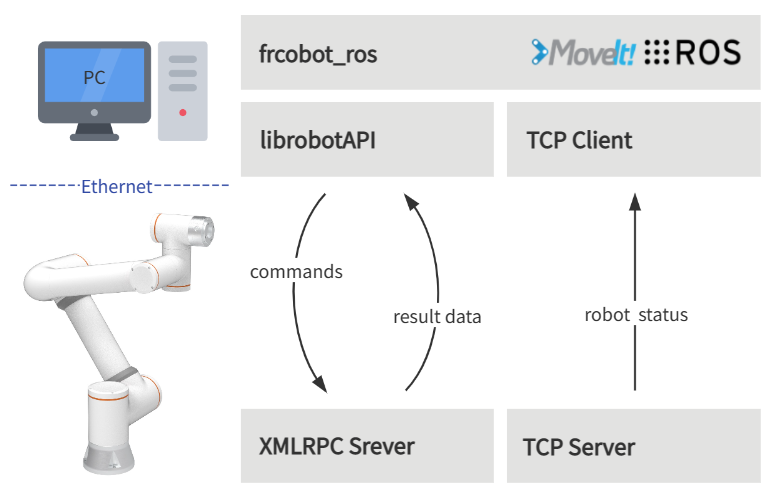

Überblick
+++++++++
Die vereinfachte Architektur von frcobot_ros ist unten dargestellt. Die Seite des kollaborativen Roboters stellt einen XMLRPC-Server und einen TCP-Server bereit.

- Der XMLRPC-Server bietet hauptsächlich die Roboter-Befehlsschnittstelle zur Ausführung von Roboterbewegungen und zum Abrufen von Zustandswerten.
- Der TCP-Server für die Statusrückmeldung bietet eine Echtzeit-Rückmeldung des Roboterzustands mit einem Rückmeldezyklus von 8 ms.

Auf dem Benutzer-PC wurden ROS und Moveit! installiert und frcobot_ros kompiliert. In frcobot_ros enthält jedes Funktionspaket die lib-Bibliothek der Roboter-API sowie einen TCP-Client, der in frcobot_hw die Kommunikation mit dem Statusrückmelde-Server des Roboters herstellt, um die Roboter-Statusrückmeldedaten zu empfangen.

Installation
++++++++++++
Dieses Kapitel beschreibt, wie frcobot_ros erstellt wird und welche Installationsumgebung erforderlich ist.

Systemvoraussetzungen
---------------------
Die empfohlene Umgebung für frcobot_ros ist wie folgt:

.. note::
    - Ubuntu 18.04 LTS Bionic Beaver und ROS Melodic Morenia
    - Ubuntu 20.04 LTS Focal Fossa und ROS Noetic Ninjemys

Die folgenden Anweisungen gelten für Ubuntu 20.04 LTS und ROS Noetic Ninjemys. Wenn Sie Melodic verwenden, ersetzen Sie in den folgenden Befehlszeilen ``noetic`` durch ``melodic``.

ROS-Installationsanforderungen
-------------------------------
Nach der Installation des Ubuntu-Systems `installieren und konfigurieren Sie die ROS Noetic-Umgebung <https://wiki.ros.org/noetic/Installation/Ubuntu>`__.

Nach der Konfiguration von ROS Noetic installieren Sie die folgende erforderliche Umgebung:

.. code-block:: shell
    :linenos:

    echo "source /opt/ros/noetic/setup.bash" >> ~/.bashrc
    source ~/.bashrc
    sudo apt-get install -y \
        ros-noetic-rosparam-shortcuts \
        ros-noetic-ros-control \
        ros-noetic-ros-controllers \
        ros-noetic-moveit \
        libxmlrpcpp-dev

ROS-Pakete kompilieren
----------------------
Erstellen Sie nach korrekter Installation und Konfiguration von ROS Noetic in einem Verzeichnis Ihrer Wahl einen Catkin-Arbeitsbereich.

.. code-block:: shell
    :linenos:

    mkdir -p ~/catkin_ws/src
    cd ~/catkin_ws
    catkin_init_workspace src

Klonen Sie dann die frcobot_ros-Bibliothek von Gitee.

.. code-block:: shell
    :linenos:

    cd ~/catkin_ws/src
    git clone https://gitee.com/fair-innovation/frcobot_ros.git

Erstellen Sie die frcobot_ros-Pakete.

.. code-block::  shell
    :linenos:

    cd ~/catkin_ws
    catkin_make
    echo "source ~/catkin_ws/devel/setup.bash" >> ~/.bashrc
    source ~/.bashrc

Wenn Fehler auftreten, überprüfen Sie bitte, ob alle Pakete aus den ROS-Installationsanforderungen erfolgreich installiert wurden. Kopieren Sie nach erfolgreicher Kompilierung die lib-Bibliothek in die ROS-lib-Umgebung (Pfad: /opt/ros/noetic/lib), damit das Programm normal ausgeführt werden kann.

.. code-block:: shell
    :linenos:

    # Der Standardpfad für catkin_ws ist hier "~". Wenn dies abweicht, ersetzen Sie "~" einfach durch den tatsächlichen Pfad.
    sudo cp ~/catkin_ws/src/frcobot_ros/frcobot_hw/lib/* /opt/ros/noetic/lib

Schnellstart
++++++++++++

frcobot_hw
-----------------
frcobot_hw bietet hauptsächlich die grundlegenden Funktionen für die Kommunikation mit dem kollaborativen Roboter.

.. note::
    - Enthält die msg für die Statusrückmeldung des kollaborativen Roboters.
    - Bietet Befehlsdemonstrationen zur Steuerung des kollaborativen Roboters.
    - Bietet einen Statusrückmeldeknoten und Topics für den kollaborativen Roboter.
    - Über eine Launch-Datei können der Statusserver und die Befehlsdemonstration schnell gestartet werden.

Der Inhalt von frcobot_hw.launch ist wie folgt:

.. code-block:: xml
    :linenos:

    <launch>

        <!-- params -->
        <param name="robot_ip" type="string" value="192.168.58.2"/>
        <param name="robot_port" type="int" value="8083"/>

        <!-- frcobot status node -->
        <node pkg="frcobot_hw" type="frcobot_status_node" name="frcobot_status_node" output="screen" />

        <!-- frcobot control demo -->
        <node pkg="frcobot_hw" type="frcobot_cmd_demo" name="frcobot_cmd_demo" output="screen" />
        
    </launch>

.. important::

    - ``robot_ip`` und ``robot_port`` müssen mit der IP und dem Port des zu steuernden kollaborativen Roboters übereinstimmen.
    - Die Standard-IP des Roboters ab Werk ist 192.168.58.2, der Port für die Benutzer-Statusrückmeldung ist 8083.

Mit dem folgenden Befehl können der Roboterrückmeldeknoten und die Befehlsdemonstration schnell gestartet werden.

.. code-block:: shell
    :linenos:

    roslaunch frcobot_hw frcobot_hw.launch

Öffnen Sie ein neues Terminal, um die Echtzeit-Statusrückmeldedaten mit dem folgenden Befehl auszugeben und anzuzeigen.

.. code-block:: shell
    :linenos:

    rostopic echo /frcobot_status