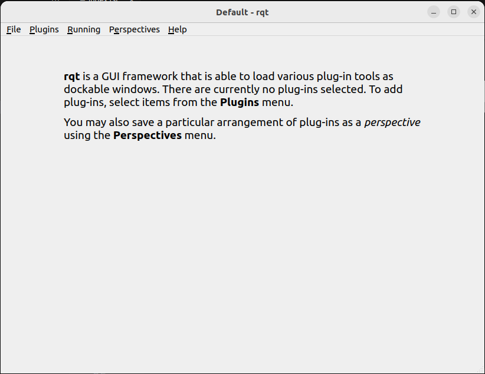

Vorwort
+++++++
fairino_hardware ist eine auf ROS2 basierende API-Schnittstelle für kollaborative FAIRINO-Roboter, die darauf abzielt, Einsteigern die Nutzung des FAIRINO-SDK zu erleichtern. Durch die Konfiguration von Standardparametern in der Parameterkonfigurationsdatei kann es an verschiedene Kundenanforderungen angepasst werden.

fairino_hardware
++++++++++++++++
Dieses Kapitel beschreibt, wie die Ausführungsumgebung der App konfiguriert wird.

Installation der Basissystemumgebung
-------------------------------------
Die Verwendung wird unter Ubuntu 22.04 LTS (Jammy) empfohlen. Nach der Systeminstallation muss ROS2 installiert werden. Die Verwendung von ROS2 Humble wird empfohlen. Eine vollständige Anleitung zur Installation von ROS2 finden Sie unter: https://docs.ros.org/en/humble/index.html.
Vor der endgültigen Kompilierung von fairino_hardware muss auch das offizielle ros2_control-Paket installiert werden. Eine vollständige Anleitung zur Installation von ros2_control finden Sie unter: https://control.ros.org/humble/index.html. Die offizielle Dokumentation bietet zwei Installationsmethoden für ros2_control: Installation über Befehle und Kompilierung aus dem Quellcode. Da die Installation über Befehle möglicherweise zu einer unvollständigen Installation von Funktionspaketen führen kann, wird die Kompilierung aus dem Quellcode empfohlen.

Im Folgenden wird der Prozess für ROS2 (Humble) detailliert beschrieben:

1. Shell-Fenster öffnen

.. code-block:: shell
    :linenos:

    locale  # Auf UTF-8 prüfen

    sudo apt update && sudo apt install locales
    sudo locale-gen en_US en_US.UTF-8
    sudo update-locale LC_ALL=en_US.UTF-8 LANG=en_US.UTF-8
    export LANG=en_US.UTF-8

    locale  # Einstellungen überprüfen

2. Quellen einrichten

.. code-block:: shell
    :linenos:

    sudo apt install software-properties-common
    sudo add-apt-repository universe

    sudo apt update && sudo apt install curl -y
    sudo curl -sSL https://raw.githubusercontent.com/ros/rosdistro/master/ros.key -o /usr/share/keyrings/ros-archive-keyring.gpg

    echo "deb [arch=$(dpkg --print-architecture) signed-by=/usr/share/keyrings/ros-archive-keyring.gpg] http://packages.ros.org/ros2/ubuntu $(. /etc/os-release && echo $UBUNTU_CODENAME) main" | sudo tee /etc/apt/sources.list.d/ros2.list > /dev/null

3. ROS2 installieren

.. code-block:: shell
    :linenos:

    sudo apt update
    sudo apt upgrade
    sudo apt install ros-humble-desktop

4. Abschließend die Entwicklungswerkzeuge installieren

.. code-block:: shell
    :linenos:

    sudo apt install ros-dev-tools

Im Folgenden wird der Installationsprozess für ros2_control detailliert beschrieben:

1. Zuerst die ROS2-Ressourcen sourcen

.. code-block:: shell
    :linenos:

    source /opt/ros/humble/setup.bash

2. ros2_control-Arbeitsbereich erstellen und Ressourcen herunterladen

.. code-block:: shell
    :linenos:

    mkdir -p ~/ros2_control_ws/src
    cd ~/ros2_control_ws/
    wget https://raw.githubusercontent.com/ros-controls/ros2_control_ci/master/ros_controls.$ROS_DISTRO.repos
    vcs import src < ros_controls.$ROS_DISTRO.repos

3. Abhängigkeitspakete installieren

.. code-block:: shell
    :linenos:

    rosdep update --rosdistro=$ROS_DISTRO
    sudo apt-get update
    rosdep install --from-paths src --ignore-src -r -y

4. ros2_control kompilieren

.. code-block:: shell
    :linenos:

    . /opt/ros/${ROS_DISTRO}/setup.sh
    colcon build --symlink-install

fairino_hardware kompilieren und erstellen
-------------------------------------------
1. Einen Colcon-Arbeitsbereich erstellen
fairino_hardware besteht aus zwei Funktionspaketen: einem Funktionspaket für benutzerdefinierte Datenstrukturen namens fairino_msgs und dem Hauptprogramm-Funktionspaket fairino_hardware. Nach der Installation der Basissystemumgebung erstellen Sie zuerst einen Colcon-Arbeitsbereich, z.B.:

Zuerst müssen die ROS2- und ros2_control-Ressourcen gesourct werden.

.. code-block:: shell
    :linenos:

    source /opt/ros/humble/setup.bash
    source ~/ros2_control_ws/install/setup.bash

Dann den Arbeitsbereich erstellen.

.. code-block:: shell
    :linenos:

    cd ~/
    mkdir -p ros2_ws/src

2. Funktionspakete kompilieren
Kopieren Sie den Code des Installationspakets in das Verzeichnis ros2_ws/src. Führen Sie dann im Verzeichnis ros2_ws den folgenden Befehl aus:

.. code-block:: shell
    :linenos:

    source ~/ros2_control_ws/install/setup.bash

Führen Sie nach Abschluss dieses Befehls den folgenden Befehl aus:

.. code-block:: shell
    :linenos:

    colcon build --packages-select fairino_msgs

Warten Sie, bis die Kompilierung des vorherigen Befehls abgeschlossen ist, und kompilieren Sie dann fairino_hardware mit dem folgenden Befehl:

.. code-block::  shell
    :linenos:

    colcon build --packages-select fairino_hardware

Schnellstart
++++++++++++

Startvorgang
------------
Öffnen Sie ein Terminal unter Ubuntu und geben Sie Folgendes ein:

.. code-block::  shell
    :linenos:

    cd ros2_ws
    source install/setup.bash
    ros2 run fairino_hardware ros2_cmd_server

.. image:: img/fr_ros2_001.png
    :width: 6in
    :align: center

Statusrückmeldung des Roboterarms abrufen
------------------------------------------
Der Status des Roboterarms wird über Topics veröffentlicht. Benutzer können die Aktualisierung der Statusdaten mit den mitgelieferten ROS2-Befehlen beobachten oder ein Programm schreiben, um diese Daten zu erhalten. Im Folgenden wird gezeigt, wie die Statusdaten des Roboterarms mit ROS2-Befehlen beobachtet werden können.

Öffnen Sie ein Terminal unter Ubuntu und geben Sie Folgendes ein:

.. code-block:: shell
    :linenos:

    cd ros2_ws
    source install/setup.bash
    ros2 topic echo /nonrt_state_data

Im Terminalfenster werden die sich ständig aktualisierenden Statusdaten angezeigt, wie in der folgenden Abbildung dargestellt.

.. image:: img/fr_ros2_002.png
    :width: 6in
    :align: center

Befehlsausgabe
--------------
Öffnen Sie ein Terminal unter Ubuntu und geben Sie Folgendes ein:

.. code-block:: shell
    :linenos:

    cd ros2_ws
    source install/setup.bash
    rqt

Nach Ausführung des obigen Befehls wird eine rqt-GUI-Oberfläche geöffnet, wie unten dargestellt.

Wählen Sie in der GUI-Oberfläche plugins -> service -> service caller aus. Es öffnet sich die unten gezeigte Oberfläche. Wählen Sie den Eintrag /fairino_remote_command_service aus. Geben Sie im Feld expression den Befehlsstring ein und klicken Sie auf call. Daraufhin wird im unteren Dialogfeld eine Antwortmeldung angezeigt.

.. image:: img/fr_ros2_004.png
    :width: 6in
    :align: center

.. important::

   - Erläuterung der Regeln für Eingabestrings:

    Das Programm filtert die Form des eingegebenen Strings intern. Das Format der Funktionsübergabe muss die Form [Funktionsname]() haben. Die Parameterzeichenfolge in den runden Klammern darf nur aus Buchstaben, Zahlen, Kommas und Minuszeichen bestehen. Das Auftreten anderer Zeichen oder Leerzeichen führt zu einem Fehler.

   - Erläuterung der Befehlsrückgabewerte:

    Bis auf GET-Befehle, die einen String zurückgeben, sind die Rückgabewerte aller anderen Funktionen vom Typ int. Im Allgemeinen bedeutet 0 einen Fehler, 1 eine korrekte Ausführung. Wenn andere Werte auftreten, konsultieren Sie die im xmlrpc SDK definierten Fehlercodes für die entsprechenden Fehler.

Parameter ändern
----------------
Da das vereinfachte SDK eine Weiterentwicklung der ursprünglichen SDK-Schnittstelle ist, basiert die Vereinfachung auf der Zuweisung von Standardwerten zu einigen Parametern. In der praktischen Anwendung kann es vorkommen, dass die Standardparameter den Anforderungen nicht genügen. In diesem Fall können die Werte der entsprechenden Standardparameter geändert und dann in den Knoten geladen werden.

Im Quellcodeverzeichnis gibt es eine Parameterdatei namens fairino_remotecmdinterface_para.yaml. Die Parameter in dieser Datei sind die voreingestellten Standardparameter, die zur Vereinfachung der Befehlseingabeparameter dienen. Sie können die Parameter darin nach Ihren spezifischen Bedürfnissen ändern und dann den Befehl zum dynamischen Ändern der Parameter verwenden: ros2 param load fr_command_server ~/ros2_ws/src/fairino_hardware/fairino_remotecmdinterface_para.yaml.

API-Beschreibung
++++++++++++++++

.. code-block:: c++
    :linenos:

    /*
    Funktionsbeschreibung: Speichert Informationen eines Gelenkpunktes.
    id - ID des zu speichernden Punktes, beginnend bei 1. Beachten Sie, dass diese ID unabhängig von der ID der CARTPoint-Punkte ist.
    double j1-j6 - Positionen der 6 Gelenke, Einheit: Grad.
    */
    int JNTPoint(int id, double j1, double j2, double j3, double j4, double j5, double j6)
    // Beispiel
    JNTPoint(1,10,11,12,13,14,15)

    /*
    Funktionsbeschreibung: Speichert Informationen eines kartesischen Punktes.
    id - ID des zu speichernden Punktes, beginnend bei 1. Beachten Sie, dass diese ID unabhängig von der ID der JNTPoint-Punkte ist.
    double x, y, z, rx, ry, rz - Kartesische Punktinformationen, Positionseinheit: mm, Winkeleinheit: Grad.
    */
    int CARTPoint(int id, double x, y, z, rx, ry, rz)
    // Beispiel
    CARTPoint(1,100,110,200,0,0,0)

    /*
    Funktionsbeschreibung: Ruft die Gelenk- oder kartesischen Positionsinformationen eines Punktes mit einer bestimmten ID ab.
    string name - 'JNT' oder 'CART'. JNT steht für das Abrufen von Gelenkpunktinformationen, 'CART' für das Abrufen von kartesischen Punktinformationen.
    int id - Punkt-ID, beginnend bei 1.
    */
    string GET(string name, int id)
    // Beispiel
    GET(JNT,1)

    /*
    Funktionsbeschreibung: Schalter für den Führungsmodus (Drag & Teach).
    uint8_t state - 1 = Führungsmodus einschalten, 0 = Führungsmodus ausschalten.
    */
    int DragTeachSwitch(uint8_t state)
    // Beispiel
    DragTeachSwitch(0)

    /*
    Funktionsbeschreibung: Schalter für die Roboteraktivierung (Enable).
    uint8_t state - 1 = Roboter aktivieren (Enable), 0 = Roboter deaktivieren (Disable).
    */
    int RobotEnable(uint8_t state)
    // Beispiel
    RobotEnable(1)

    /*
    Funktionsbeschreibung: Modusumschaltung.
    uint8_t state - 1 = Handmodus, 0 = Automatikmodus.
    */
    int Mode(uint8_t state)
    // Beispiel
    Mode(1)

    /*
    Funktionsbeschreibung: Stellt die Geschwindigkeit des Roboters im aktuellen Modus ein.
    float vel - Geschwindigkeitsprozentsatz, Bereich 1-100.
    */
    int SetSpeed(float vel)
    // Beispiel
    SetSpeed(10)

    /*
    Funktionsbeschreibung: Stellt das Werkzeugkoordinatensystem mit der angegebenen ID ein und lädt es.
    int id - Werkzeugkoordinatensystem-Nummer, Bereich 1-15.
    float x, y, z, rx, ry, rz - Versatzinformationen des Werkzeugkoordinatensystems.
    */
    int SetToolCoord(int id, float x, float y, float z, float rx, float ry, float rz)
    // Beispiel
    SetToolCoord(1,0,0,0,0,0,0)

    /*
    Funktionsbeschreibung: Stellt das Werkzeugkoordinatensystem in der Liste ein.
    int id - Werkzeugkoordinatensystem-Nummer, Bereich 1-15.
    float x, y, z, rx, ry, rz - Versatzinformationen des Werkzeugkoordinatensystems.
    */
    int SetToolList(int id, float x, float y, float z, float rx, float ry, float rz);
    // Beispiel
    SetToolList(1,0,0,0,0,0,0)

    /*
    Funktionsbeschreibung: Stellt das externe Werkzeugkoordinatensystem ein.
    int id - Werkzeugkoordinatensystem-Nummer, Bereich 1-15.
    float x, y, z, rx, ry, rz - Versatzinformationen des externen Werkzeugkoordinatensystems.
    */
    int SetExToolCoord(int id, float x, float y, float z, float rx, float ry, float rz);
    // Beispiel
    SetExToolCoord(1,0,0,0,0,0,0)

    /*
    Funktionsbeschreibung: Stellt das externe Werkzeugkoordinatensystem in der Liste ein.
    int id - Werkzeugkoordinatensystem-Nummer, Bereich 1-15.
    float x, y, z, rx, ry, rz - Versatzinformationen des externen Werkzeugkoordinatensystems.
    */
    int SetExToolList(int id, float x, float y, float z, float rx, float ry, float rz);
    // Beispiel
    SetExToolList(1,0,0,0,0,0,0)

    /*
    Funktionsbeschreibung: Stellt das Werkstückkoordinatensystem ein.
    int id - Werkstückkoordinatensystem-Nummer, Bereich 1-15.
    float x, y, z, rx, ry, rz - Versatzinformationen des Werkstückkoordinatensystems.
    */
    int SetWObjCoord(int id, float x, float y, float z, float rx, float ry, float rz);
    // Beispiel
    SetWObjCoord(1,0,0,0,0,0,0)

    /*
    Funktionsbeschreibung: Stellt das Werkstückkoordinatensystem in der Liste ein.
    int id - Werkstückkoordinatensystem-Nummer, Bereich 1-15.
    float x, y, z, rx, ry, rz - Versatzinformationen des Werkstückkoordinatensystems.
    */
    int SetWObjList(int id, float x, float y, float z, float rx, float ry, float rz);
    // Beispiel
    SetWObjList(1,0,0,0,0,0,0)

    /*
    Funktionsbeschreibung: Stellt das Gewicht der Endeffektorlast ein.
    float weight - Lastgewicht, Einheit: kg.
    */
    int SetLoadWeight(float weight);
    // Beispiel
    SetLoadWeight(3.5)

    /*
    Funktionsbeschreibung: Stellt die Koordinaten des Schwerpunkts der Endeffektorlast ein.
    float x, y, z - Schwerpunktkoordinaten, Einheit: mm.
    */
    int SetLoadCoord(float x, float y, float z);
    // Beispiel
    SetLoadCoord(10,20,30)

    /*
    Funktionsbeschreibung: Stellt die Einbauart des Roboters ein.
    uint8_t install - Einbauart: 0 = Bodenmontage, 1 = Wandmontage, 2 = Deckenmontage.
    */
    int SetRobotInstallPos(uint8_t install);
    // Beispiel
    SetRobotInstallPos(0)

    /*
    Funktionsbeschreibung: Stellt die Einbauwinkel des Roboters ein (freie Montage).
    double yangle - Neigungswinkel.
    double zangle - Rotationswinkel.
    */
    int SetRobotInstallAngle(double yangle, double zangle);
    // Beispiel
    SetRobotInstallAngle(90,0)

    // Sicherheitskonfiguration
    /*
    Funktionsbeschreibung: Stellt die Kollisionsstufen des Roboters ein.
    float level1-level6 - Kollisionsstufen der Achsen 1-6, Bereich 1-10.
    */
    int SetAnticollision(float level1, float level2, float level3, float level4, float level5, float level6);
    // Beispiel
    SetAnticollision(1,1,1,1,1,1)

    /*
     * @brief  Stellt die Strategie nach einer Kollision ein.
     * @param [in] strategy  0 = Fehler melden und anhalten, 1 = Weiterlaufen.
     * @param [in] safeTime  Sicherheitsstopp-Zeit [1000 - 2000] ms.
     * @param [in] safeDistance  Sicherheitsstopp-Distanz [1-150] mm.
     * @param [in] safeVel  Sicherheitsgeschwindigkeit [50-250] mm/s.
     * @param [in] safetyMargin  Sicherheitsfaktoren für J1-J6 [1-10].
     * @return  Fehlercode.
    */
    int SetCollisionStrategy(int strategy, int safeTime, int safeDistance, int safeVel, int safetyMargin[])
    // Beispiel
    SetCollisionStrategy(1)

    /*
     * @brief Stellt die Kollisionserkennungsmethode des Roboters ein.
     * @param [in] method Kollisionserkennungsmethode: 0 = Strommodus; 1 = Doppel-Encoder; 2 = Strom und Doppel-Encoder gleichzeitig aktiviert.
     * @param [in] thresholdMode Art des Kollisionsstufen-Schwellwerts; 0 = Fester Schwellwert der Kollisionsstufe; 1 = Benutzerdefinierter Kollisionserkennungsschwellwert.
     * @return Fehlercode.
    */
    int SetCollisionDetectionMethod(int method, int thresholdMode);
    // Beispiel
    SetCollisionDetectionMethod(0,0)

    /*
     * @brief Schaltet die Kollisionserkennung im Stillstand ein/aus.
     * @param [in] status 0 = aus; 1 = ein.
     * @return Fehlercode.
    */
    int SetStaticCollisionOnOff(int status);
    // Beispiel
    SetStaticCollisionOnOff(1)

    /*
     * @brief Gelenk-Drehmoment-/Leistungsüberwachung.
     * @param [in] status 0 = aus; 1 = ein.
     * @param [in] power Maximale eingestellte Leistung (W).
     * @return Fehlercode.
    */
    int SetPowerLimit(int status, double power);
    // Beispiel
    SetPowerLimit(1,100)

    /*
     * @brief  Konfiguriert den Kraftsensor.
     * @param [in] company  Kraftsensor-Hersteller: 17-Kunwei, 19-CASA, 20-ATI, 21-Zhongke Midian, 22-Weihang Minxin, 23-NBIT, 24-Xinjingcheng (XJC), 26-NSR.
     * @param [in] device  Gerätenummer: Kunwei (0-KWR75B), CASA (0-MCS6A-200-4), ATI (0-AXIA80-M8), Zhongke Midian (0-MST2010), Weihang Minxin (0-WHC6L-YB-10A), NBIT (0-XLH93003ACS), Xinjingcheng XJC (0-XJC-6F-D82), NSR (0-NSR-FTSensorA).
     * @param [in] softvesion  Softwareversionsnummer, vorübergehend nicht verwendet, Standard 0.
     * @param [in] bus  Position des Geräts am Endeffektor-Bus, vorübergehend nicht verwendet, Standard 0.
     * @return Fehlercode.
    */
    int FT_SetConfig(int company, int device, int softvesion, int bus);
    // Beispiel
    FT_SetConfig(0,1,0,0)

    /*
     * @brief  Ruft die Kraftsensor-Konfiguration ab.
     * @param [out] company  Kraftsensor-Hersteller (zur Festlegung).
     * @param [out] device  Gerätenummer, vorübergehend nicht verwendet, Standard 0.
     * @param [out] softvesion  Softwareversionsnummer, vorübergehend nicht verwendet, Standard 0.
     * @param [out] bus  Position des Geräts am Endeffektor-Bus, vorübergehend nicht verwendet, Standard 0.
     * @return Fehlercode.
    */
    int FT_GetConfig(int *company, int *device, int *softvesion, int *bus);
    // Beispiel
    FT_GetConfig()

    /*
     * @brief  Aktiviert den Kraftsensor.
     * @param [in] act  0 = Zurücksetzen, 1 = Aktivieren.
     * @return Fehlercode.
    */
    int FT_Activate(uint8_t act);
    // Beispiel
    FT_Activate(1)

    /*
     * @brief  Setzt den Nullpunkt des Kraftsensors (Tarieren).
     * @param [in] act  0 = Nullpunkt entfernen, 1 = Nullpunkt korrigieren.
     * @return Fehlercode.
    */
    int FT_SetZero(uint8_t act);
    // Beispiel
    FT_SetZero(1)

    /*
     * @brief  Kollisionsüberwachung (Force Guard).
     * @param [in] flag 0 = deaktivieren, 1 = aktivieren.
     * @param [in] sensor_id Kraftsensor-Nummer.
     * @param [in] select  Auswahl der sechs Freiheitsgrade für die Kollisionserkennung: 0 = nicht prüfen, 1 = prüfen.
     * @param [in] ft  Kollisionskraft/-moment (Mitte), fx, fy, fz, tx, ty, tz.
     * @param [in] max_threshold Maximaler Schwellwert (obere Toleranz).
     * @param [in] min_threshold Minimaler Schwellwert (untere Toleranz).
     * @note   Erkennungsbereich: (ft - min_threshold, ft + max_threshold).
     * @return Fehlercode.
    */
    int FT_Guard(uint8_t flag, int sensor_id, uint8_t select[6], ForceTorque *ft, float max_threshold[6], float min_threshold[6]);
    // Beispiel (Parameter entsprechend der Struktur anpassen)
    FT_Guard(1,1,0,0,1,0,0,0,0,0,100,0,0,0,0,0,200,0,0,0,0,0,50,0,0,0)

    /*
     * @brief  Kraftregelung (Constant Force Control).
     * @param [in] flag 0 = deaktivieren, 1 = aktivieren.
     * @param [in] sensor_id Kraftsensor-Nummer.
     * @param [in] select  Auswahl der sechs Freiheitsgrade für die Kraftregelung: 0 = nicht regeln, 1 = regeln.
     * @param [in] ft  Soll-Kraft/-Moment, fx, fy, fz, tx, ty, tz.
     * @param [in] ft_pid PID-Parameter für Kraftregelung (fx_p, fx_i, fx_d, tx_p, tx_i, tx_d) – Reihenfolge prüfen.
     * @param [in] adj_sign Adaptive Regelung: 0 = deaktivieren, 1 = aktivieren.
     * @param [in] ILC_sign ILC (Iterative Learning Control): 0 = stop, 1 = training, 2 = practice.
     * @param [in] max_dis Maximale Anpassungsdistanz [mm].
     * @param [in] max_ang Maximaler Anpassungswinkel [°].
     * @param [in] filter_Sign Filter aktivieren: 0 = aus; 1 = an, Standard = aus.
     * @param [in] posAdapt_sign Posennachgiebigkeit aktivieren: 0 = aus; 1 = an, Standard = aus.
     * @param [in] isNoBlock Blockierungs-Flag: 0 = blockierend; 1 = nicht blockierend.
     * @return Fehlercode.
    */
    int FT_Control(uint8_t flag, int sensor_id, uint8_t select[6], ForceTorque *ft, float ft_pid[6], uint8_t adj_sign, uint8_t ILC_sign, float max_dis, float max_ang, int filter_Sign = 0, int posAdapt_sign = 0, int isNoBlock = 0);
    // Beispiel (Parameter entsprechend der Struktur anpassen)
    FT_Control(1,1,0,0,1,0,0,0,0,0,-10,0,0,0,0.0005,0,0,0,0,0,0,0,100,10,0,0,0)

    /*
     * @brief  Nachgiebigkeitsregelung (Compliance) starten.
     * @param [in] p  Positionsregelungsfaktor oder Nachgiebigkeitskoeffizient.
     * @param [in] force  Kraftschwellwert für Aktivierung [N].
     * @return Fehlercode.
    */
    int FT_ComplianceStart(float p, float force);
    // Beispiel
    FT_ComplianceStart(0.005,20)

    /**
     * @brief  Nachgiebigkeitsregelung (Compliance) stoppen.
     * @return Fehlercode.
    */
    int FT_ComplianceStop();
    // Beispiel
    FT_ComplianceStop()

    /*
    Funktionsbeschreibung: Stellt den positiven weichen Endanschlag ein. Beachten Sie, dass der eingestellte Wert innerhalb der harten Endanschläge liegen muss.
    float limit1-limit6 - Grenzwerte der 6 Gelenke.
    */
    int SetLimitPositive(float limit1, float limit2, float limit3, float limit4, float limit5, float limit6);
    // Beispiel
    SetLimitPositive(100,90,90,90,90,90)

    /*
    Funktionsbeschreibung: Stellt den negativen weichen Endanschlag ein. Beachten Sie, dass der eingestellte Wert innerhalb der harten Endanschläge liegen muss.
    float limit1-limit6 - Grenzwerte der 6 Gelenke.
    */
    int SetLimitNegative(float limit1, float limit2, float limit3, float limit4, float limit5, float limit6);
    // Beispiel
    SetLimitNegative(-100,-90,-90,-90,-90,-90)

    /*
    Funktionsbeschreibung: Löscht den Fehlerstatus.
    */
    int ResetAllError();

    /*
    Funktionsbeschreibung: Schalter für die Gelenk-Reibungskompensation.
    uint8_t state - 0 = aus, 1 = an.
    */
    int FrictionCompensationOnOff(uint8_t state);
    // Beispiel
    FrictionCompensationOnOff(1)

    /*
    Funktionsbeschreibung: Stellt die Gelenk-Reibungskompensationskoeffizienten ein - Bodenmontage.
    float coeff1-coeff6 - Kompensationskoeffizienten für 6 Gelenke, Bereich 0-1.
    */
    int SetFrictionValue_level(float coeff1, float coeff2, float coeff3, float coeff4, float coeff5, float coeff6); // Korrigierte Parameterbezeichnung
    // Beispiel
    SetFrictionValue_level(1,1,1,1,1,1)

    /*
    Funktionsbeschreibung: Stellt die Gelenk-Reibungskompensationskoeffizienten ein - Wandmontage.
    float coeff1-coeff6 - Kompensationskoeffizienten für 6 Gelenke, Bereich 0-1.
    */
    int SetFrictionValue_wall(float coeff1, float coeff2, float coeff3, float coeff4, float coeff5, float coeff6); // Korrigierte Parameterbezeichnung
    // Beispiel
    SetFrictionValue_wall(0.5,0.5,0.5,0.5,0.5,0.5)

    /*
    Funktionsbeschreibung: Stellt die Gelenk-Reibungskompensationskoeffizienten ein - Deckenmontage.
    float coeff1-coeff6 - Kompensationskoeffizienten für 6 Gelenke, Bereich 0-1.
    */
    int SetFrictionValue_ceiling(float coeff1, float coeff2, float coeff3, float coeff4, float coeff5, float coeff6); // Korrigierte Parameterbezeichnung
    // Beispiel
    SetFrictionValue_ceiling(0.5,0.5,0.5,0.5,0.5,0.5)

    // Peripheriesteuerung
    /*
    Funktionsbeschreibung: Aktiviert den Greifer.
    int index - Greifernummer.
    uint8_t act - 0 = Zurücksetzen, 1 = Aktivieren.
    */
    int ActGripper(int index, uint8_t act);
    // Beispiel
    ActGripper(1,1)

    /*
    Funktionsbeschreibung: Steuert den Greifer.
    int index - Greifernummer.
    int pos - Positionsprozentsatz, Bereich 0-100.
    */
    int MoveGripper(int index, int pos);
    // Beispiel
    MoveGripper(1,10)

    // I/O-Steuerung
    /*
    Funktionsbeschreibung: Setzt den Digitalausgang des Steuerkastens.
    int id - IO-Nummer, Bereich 0-15.
    uint8_t status - 0 = aus, 1 = ein.
    */
    int SetDO(int id, uint8_t status);
    // Beispiel
    SetDO(1,1)

    /*
    Funktionsbeschreibung: Setzt den Digitalausgang des Werkzeugs.
    int id - IO-Nummer, Bereich 0-1.
    uint8_t status - 0 = aus, 1 = ein.
    */
    int SetToolDO(int id, uint8_t status);
    // Beispiel
    SetToolDO(0,1)

    /*
    Funktionsbeschreibung: Setzt den Analogausgang des Steuerkastens.
    int id - IO-Nummer, Bereich 0-1.
    float value - Prozentwert des Stroms oder der Spannung, Bereich 0-100.
    */
    int SetAO(int id, float value);
    // Beispiel
    SetAO(1,100)

    /*
    Funktionsbeschreibung: Setzt den Analogausgang des Werkzeugs.
    int id - IO-Nummer, Bereich 0.
    float value - Prozentwert des Stroms oder der Spannung, Bereich 0-100.
    */
    int SetToolAO(int id, float value);
    // Beispiel
    SetToolAO(0,100)

    // Bewegungsbefehle
    /*
    Funktionsbeschreibung: Roboter-Tippbetrieb (JOG).
    uint8_t ref - 0 = Gelenk-JOG, 2 = JOG im Basiskoordinatensystem, 4 = JOG im Werkzeugkoordinatensystem, 8 = JOG im Werkstückkoordinatensystem.
    uint8_t nb - 1 = Gelenk 1 (oder x-Achse), 2 = Gelenk 2 (oder y-Achse), 3 = Gelenk 3 (oder z-Achse), 4 = Gelenk 4 (oder Rotation um x-Achse), 5 = Gelenk 5 (oder Rotation um y-Achse), 6 = Gelenk 6 (oder Rotation um z-Achse).
    uint8_t dir - 0 = negative Richtung, 1 = positive Richtung.
    float vel - Geschwindigkeitsprozentsatz, Bereich 0-100.
    */
    int StartJOG(uint8_t ref, uint8_t nb, uint8_t dir, float vel);
    // Beispiel
    StartJOG(1,1,1,10)

    /*
    Funktionsbeschreibung: Stoppt den Roboter-Tippbetrieb (JOG).
    uint8_t ref - 0 = Gelenk-JOG stoppen, 2 = JOG im Basiskoordinatensystem stoppen, 4 = JOG im Werkzeugkoordinatensystem stoppen, 8 = JOG im Werkstückkoordinatensystem stoppen.
    */
    int StopJOG(uint8_t ref);
    // Beispiel
    StopJOG(1)

    /*
    Funktionsbeschreibung: Stoppt den Roboter-Tippbetrieb sofort.
    */
    int ImmStopJOG();

    /*
    Funktionsbeschreibung: Bewegung im Gelenkraum.
    string point_name - Name des voreingestellten Punktes, z.B. JNT1 für den Gelenkpunkt mit ID 1, CART1 für den kartesischen Punkt mit ID 1. Der MoveJ-Befehl unterstützt sowohl Gelenk- als auch kartesische Punkte. Achtung: Da der MoveJ-Befehl in seinen Standardparametern Werkzeug- und Werkstückkoordinatensysteme angibt, kann der Befehl zu einem Fehler führen, wenn diese Koordinatensystemnummern nicht mit den aktuell geladenen übereinstimmen. In diesem Fall müssen die Koordinatensystemparameter in den Standardparametern geändert und die Parameter neu geladen werden, bevor der Bewegungsbefehl ausgeführt wird.
    float vel - Befehlsgeschwindigkeitsprozentsatz, Bereich 0-100.
    int tool - Werkzeugkoordinatensystem-Nummer.
    int user - Werkstückkoordinatensystem-Nummer.
    double expos1 - Position der externen Achse 1.
    double expos2 - Position der externen Achse 2.
    double expos3 - Position der externen Achse 3.
    double expos4 - Position der externen Achse 4.
    */
    int MoveJ(string point_name, float vel, int tool, int user, double expos1, double expos2, double expos3, double expos4);
    // Beispiel
    MoveJ(JNT1,10,1,1,0,0,0,0)

    /*
    Funktionsbeschreibung: Linearbewegung im kartesischen Raum.
    string point_name - Name des voreingestellten Punktes, z.B. JNT1 für den Gelenkpunkt mit ID 1, CART1 für den kartesischen Punkt mit ID 1. Der MoveL-Befehl unterstützt sowohl Gelenk- als auch kartesische Punkte. Achtung: Da der MoveL-Befehl in seinen Standardparametern Werkzeug- und Werkstückkoordinatensysteme angibt, kann der Befehl zu einem Fehler führen, wenn diese Koordinatensystemnummern nicht mit den aktuell geladenen übereinstimmen. In diesem Fall müssen die Koordinatensystemparameter in den Standardparametern geändert und die Parameter neu geladen werden, bevor der Bewegungsbefehl ausgeführt wird.
    float vel - Befehlsgeschwindigkeitsprozentsatz, Bereich 0-100.
    int tool - Werkzeugkoordinatensystem-Nummer.
    int user - Werkstückkoordinatensystem-Nummer.
    double expos1 - Position der externen Achse 1.
    double expos2 - Position der externen Achse 2.
    double expos3 - Position der externen Achse 3.
    double expos4 - Position der externen Achse 4.
    */
    int MoveL(string point_name, float vel, int tool, int user, double expos1, double expos2, double expos3, double expos4);
    // Beispiel
    MoveL(CART1,10,1,1,0,0,0,0)

    /*
    Funktionsbeschreibung: Kreisbogenbewegung im kartesischen Raum.
    string point1_name, point2_name - Namen der voreingestellten Punkte, z.B. JNT1 für den Gelenkpunkt mit ID 1, CART1 für den kartesischen Punkt mit ID 1. Der MoveC-Befehl unterstützt sowohl Gelenk- als auch kartesische Punkte, aber beide Punkte müssen vom gleichen Typ sein (d.h. es wird nicht unterstützt, den ersten Punkt als Gelenkpunkt und den zweiten als kartesischen Punkt einzugeben). Achtung: Da der MoveC-Befehl in seinen Standardparametern Werkzeug- und Werkstückkoordinatensysteme angibt, kann der Befehl zu einem Fehler führen, wenn diese Koordinatensystemnummern nicht mit den aktuell geladenen übereinstimmen. In diesem Fall müssen die Koordinatensystemparameter in den Standardparametern geändert und die Parameter neu geladen werden, bevor der Bewegungsbefehl ausgeführt wird.
    float vel - Befehlsgeschwindigkeitsprozentsatz, Bereich 0-100.
    int tool - Werkzeugkoordinatensystem-Nummer.
    int user - Werkstückkoordinatensystem-Nummer.
    double expos1_p1 - Position der externen Achse 1 für Punkt 1.
    double expos2_p1 - Position der externen Achse 2 für Punkt 1.
    double expos3_p1 - Position der externen Achse 3 für Punkt 1.
    double expos4_p1 - Position der externen Achse 4 für Punkt 1.
    double expos1_p2 - Position der externen Achse 1 für Punkt 2.
    double expos2_p2 - Position der externen Achse 2 für Punkt 2.
    double expos3_p2 - Position der externen Achse 3 für Punkt 2.
    double expos4_p2 - Position der externen Achse 4 für Punkt 2.
    */
    int MoveC(string point1_name, string point2_name, float vel, int tool, int user,
              double expos1_p1, double expos2_p1, double expos3_p1, double expos4_p1,
              double expos1_p2, double expos2_p2, double expos3_p2, double expos4_p2);
    // Beispiel
    MoveC(JNT1,JNT2,10,1,1,0,0,0,0,0,0,0,0)

    /*
    Funktionsbeschreibung: Startet die Spline-Bewegung.
    */
    int SplineStart();

    /*
    Funktionsbeschreibung: Spline-Bewegung im Gelenkraum. Dieser Befehl unterstützt nur die Eingabe von Gelenkdaten wie JNT1. Die Eingabe eines kartesischen Punktes führt zu einem Fehler.
    string point_name - Name des voreingestellten Punktes, z.B. JNT1 für den Gelenkpunkt mit ID 1.
    float vel - Geschwindigkeitsprozentsatz, Bereich 0-100.
    */
    int SplinePTP(string point_name, float vel);
    // Beispiel
    SplinePTP(JNT2,10)

    /*
    Funktionsbeschreibung: Beendet die Spline-Bewegung.
    */
    int SplineEnd();

    /*
    Funktionsbeschreibung: Startet die Spline-Bewegung im kartesischen Raum.
    uint8_t ctlpoint - 0 = Bahn verläuft durch die Pfadpunkte, 1 = Bahn verläuft nicht durch die Kontrollpunkte (mindestens 4 Punkte erforderlich).
    */
    int NewSplineStart(uint8_t ctlpoint);
    // Beispiel
    NewSplineStart(1)

    /*
    Funktionsbeschreibung: Spline-Bewegung im kartesischen Raum. Es können nur kartesische Punkte wie CART1 eingegeben werden. Die Eingabe eines Gelenkpunktes führt zu einem Fehler.
    string point_name - Name des voreingestellten Punktes, z.B. CART1 für den kartesischen Punkt mit ID 1.
    float vel - Geschwindigkeitsprozentsatz, Bereich 0-100.
    int lastflag - 0 = nicht der letzte Punkt, 1 = letzter Punkt.
    */
    int NewSplinePoint(string point_name, float vel, int lastflag);
    // Beispiel
    NewSplinePoint(CART2,20,0)

    /*
    Funktionsbeschreibung: Beendet die Spline-Bewegung im kartesischen Raum.
    */
    int NewSplineEnd();

    /*
    Funktionsbeschreibung: Stoppt die Bewegung.
    */
    int StopMotion();

    /*
    Funktionsbeschreibung: Startet den globalen Punktversatz.
    int flag - 0 = Versatz im Basis-/Werkstückkoordinatensystem, 2 = Versatz im Werkzeugkoordinatensystem.
    double x, y, z, rx, ry, rz - Versatzpose.
    */
    int PointsOffsetEnable(int flag, double x, double y, double z, double rx, double ry, double rz);
    // Beispiel
    PointsOffsetEnable(1,10,10,10,0,0,0)

    /*
    Funktionsbeschreibung: Beendet den globalen Punktversatz.
    */
    int PointsOffsetDisable();