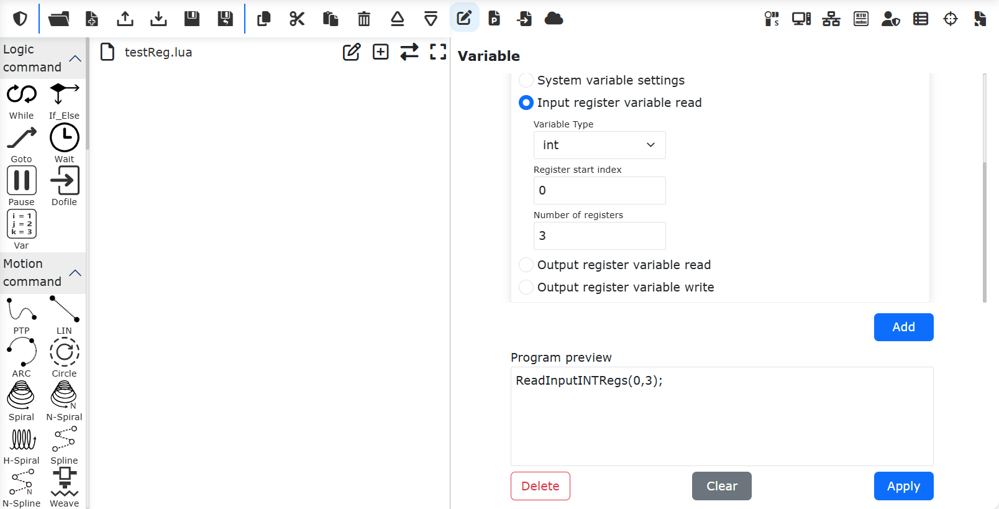

Roboter-Eingabe- und Ausgaberegister
====================================

Der CNDE-Client und der Roboter können über Eingabe- und Ausgaberegister Daten austauschen. Dies umfasst im Wesentlichen zwei Prozesse:

① Die CNDE-Client-Eingangskonfiguration enthält Eingangsregister. Bei der Eingabe von Daten werden die Werte der Eingangsregister geändert. Dem Roboter-LUA-Programm wird ein Befehl zum Lesen der Eingangsregister hinzugefügt. Bei der Ausführung des LUA-Programms können die vom CNDE-Client geänderten Werte der Eingangsregister gelesen werden.

② Dem Roboter-LUA-Programm wird ein Befehl zum Schreiben in Ausgangsregister hinzugefügt. Bei der Ausführung des LUA-Programms werden Werte in die Ausgangsregister geschrieben. Die CNDE-Client-Ausgangskonfiguration enthält Ausgangsregister. Nach dem Starten der CNDE-Statusrückmeldung des Roboters kann der Client durch den Empfang der CNDE-Ausgangsdaten die im LUA-Programm geschriebenen Werte der Ausgangsregister auslesen.

Eingangsregister lesen
~~~~~~~~~~~~~~~~~~~~~~

Öffnen Sie die WebApp, klicken Sie nacheinander auf "Teachprogramm" und "Programmierung" und erstellen Sie ein neues Benutzerprogramm "testReg.lua".

.. image:: cnde/012.png
   :width: 6in
   :align: center

.. centered:: Abbildung 4-1 Neues Programm "testReg.lua" erstellen

Klicken Sie auf "Variable", wählen Sie im rechten Befehlsbereich "Eingangsregistervariable lesen" aus. Wählen Sie den Variablentyp "int", den Startindex des Registers 0, die Anzahl der Register 3 und klicken Sie auf die Schaltflächen "Hinzufügen" und "Übernehmen".

.. centered:: Abbildung 4-2 Befehl zum Lesen von Eingangsregistern hinzufügen

Nun wurde in "testReg.lua" ein Befehl zum Lesen von Eingangsregistern vom Typ "int" hinzugefügt.

.. image:: cnde/014.png
   :width: 6in
   :align: center

.. centered:: Abbildung 4-3 Befehl zum Lesen von Eingangsregistern (Typ "int") hinzugefügt

Klicken Sie auf die Umschalttaste, um in den programmierbaren Modus zu wechseln. Fügen Sie vor dem Befehl zum Lesen der Eingangsregister drei LUA-Programmvariablen hinzu, um die drei gelesenen Eingangsregisterwerte zu empfangen.

.. image:: cnde/015.png
   :width: 6in
   :align: center

.. centered:: Abbildung 4-4 Variablen zum Empfangen der Eingangsregisterwerte hinzufügen

Auf die gleiche Weise können Sie das Lesen von Registerdaten vom Typ "bit" und "double" hinzufügen.

.. image:: cnde/016.png
   :width: 6in
   :align: center

.. centered:: Abbildung 4-5 Lesen von Eingangsregistern der Typen "bit" und "double" hinzufügen

Speichern Sie das obige Programm, schalten Sie den Roboter in den Automatikmodus und führen Sie das Programm aus. Die Werte der Eingangsregister werden in die LUA-Programmvariablen eingelesen.

Ausgangsregister schreiben
~~~~~~~~~~~~~~~~~~~~~~~~~~

Öffnen Sie die WebApp, klicken Sie nacheinander auf "Teachprogramm" und "Programmierung" und erstellen Sie ein neues Benutzerprogramm "testReg.lua".

.. image:: cnde/017.png
   :width: 6in
   :align: center

.. centered:: Abbildung 4-6 Neues Programm "testReg.lua" erstellen

Klicken Sie auf "Variable", wählen Sie im rechten Befehlsbereich "Ausgangsregistervariable schreiben" aus. Wählen Sie den Variablentyp "int", den Startindex des Registers 0, die Anzahl der Register 2, den Registerwert "18,55" und klicken Sie auf "Hinzufügen". Wählen Sie dann erneut "Ausgangsregistervariable lesen" aus, wählen Sie den Variablentyp "int", den Startindex 0, die Anzahl der Register 2 und klicken Sie auf "Hinzufügen" und "Übernehmen".

.. image:: cnde/018.png
   :width: 6in
   :align: center

.. centered:: Abbildung 4-7 Befehle zum Schreiben und Lesen von Ausgangsregistern hinzufügen

Nun wurden in "testReg.lua" Befehle zum Schreiben und Lesen von Ausgangsregistern vom Typ "int" hinzugefügt.

.. image:: cnde/019.png
   :width: 6in
   :align: center

.. centered:: Abbildung 4-8 Befehle zum Schreiben und Lesen von Ausgangsregistern (Typ "int") hinzugefügt

Klicken Sie auf die Umschalttaste, um in den programmierbaren Modus zu wechseln. Fügen Sie vor dem Befehl zum Lesen der Ausgangsregister zwei LUA-Programmvariablen hinzu, um die beiden gelesenen Ausgangsregisterwerte zu empfangen.

.. image:: cnde/020.png
   :width: 6in
   :align: center

.. centered:: Abbildung 4-9 Variablen zum Empfangen der Ausgangsregisterwerte hinzufügen

Speichern Sie das obige Programm, schalten Sie den Roboter in den Automatikmodus und führen Sie das Programm aus. Die Werte der LUA-Programmvariablen "intValue1" und "intValue2" sind nun 18 bzw. 55. Die Operationen für Register der Typen "bit" und "double" sind identisch mit denen für den Typ "int".

Interaktive Anwendung der CNDE-Eingabe- und Ausgaberegister
~~~~~~~~~~~~~~~~~~~~~~~~~~~~~~~~~~~~~~~~~~~~~~~~~~~~~~~~~~~~

.. image:: cnde/021.png
   :width: 4in
   :align: center

.. centered:: Abbildung 4-10 Datenaustausch über Eingabe- und Ausgaberegister

Die Szenarien für den Datenaustausch zwischen Roboter und CNDE-Client über Eingabe- und Ausgaberegister umfassen unter anderem die folgenden Typen:

① Steuerung der Roboterbewegung über Eingangsregister: Der CNDE-Client plant die Zielposition des Roboters und schreibt die Zielposition in die Eingangsregister. Im Roboter-LUA-Programm werden die Werte der Eingangsregister gelesen, um die Zielposition zu erhalten. Anschließend wird der Roboter über Bewegungsbefehle wie PTP, LIN, ServoJ zur Zielposition gesteuert. Ein Beispiel für ein LUA-Programm:

.. code-block:: lua
    :linenos:

    i = 0;
    oldFlag = 0
    while(1) do
        startFlag = ReadInputINTRegs(0,1)
        if(startFlag ~= oldFlag) then
            oldFlag = startFlag
            x, y, z, a, b, c = ReadInputDBLRegs(0,6)
            ServoJ({x, y, z, a, b, c}, {0, 0, 0, 0}, 10, 10, 0.008, 0, 0)
        end	
    end

② Steuerung von Roboteraktionen über Eingangsregister: Der CNDE-Client schreibt unterschiedliche Werte in ein bestimmtes Eingangsregister, um verschiedene Roboteraktionen zu steuern. Das Roboter-LUA-Programm ruft in einer Schleife den Wert des entsprechenden Eingangsregisters ab und führt je nach Wert unterschiedliche Aktionen aus. Beispielprogramm:

.. code-block:: lua
    :linenos:

    runFlag = ReadInputINTRegs(0,1)
    while(runFlag > 0) do
        motion,target = ReadInputINTRegs(1,2)
        if(motion > 0) then
            if(target == 1)then 
                Lin(a1,100,-1,0,0)
            else if(target == 2) then
                Lin(a2,100,-1,0,0)
            else
                Lin(safety,100,-1,0,0)
            end
            end
        else
            sleep_ms(100)
        end
    end

③ Der Roboter schreibt während des Betriebs den aktuellen Programmstatus in die Ausgangsregister. Der CNDE-Client überwacht die Programmausführung des Roboters durch das Lesen des Ausgangsregisterstatus. Beispielprogramm:

.. code-block:: lua
    :linenos:

    local weldCount = 0
    runFlag = ReadInputINTRegs(0,1)
    while(runFlag > 0) do
        Lin(safety,100,-1,0,0)
        Lin(a1,100,-1,0,0)
        ARCStart(0, 0, 3000)
        Lin(a2,100,-1,0,0)
        ARCEnd(0, 0, 3000)
        runFlag = ReadInputINTRegs(0,1)
        weldCount = weldCount + 1
        WriteOutputINTRegs(0,1,{weldCount})
    end