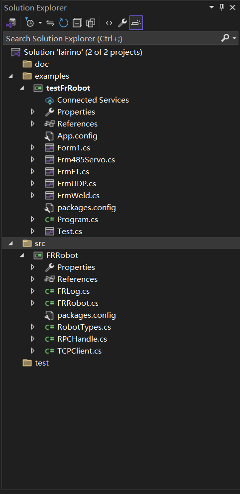
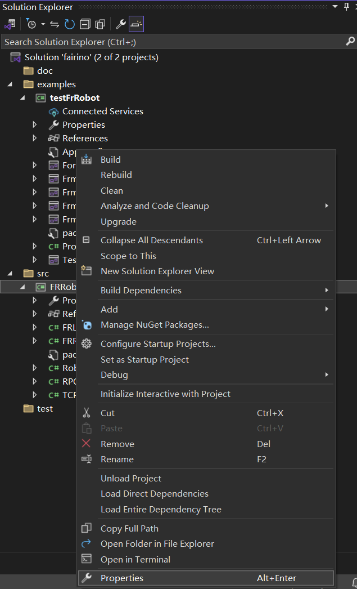
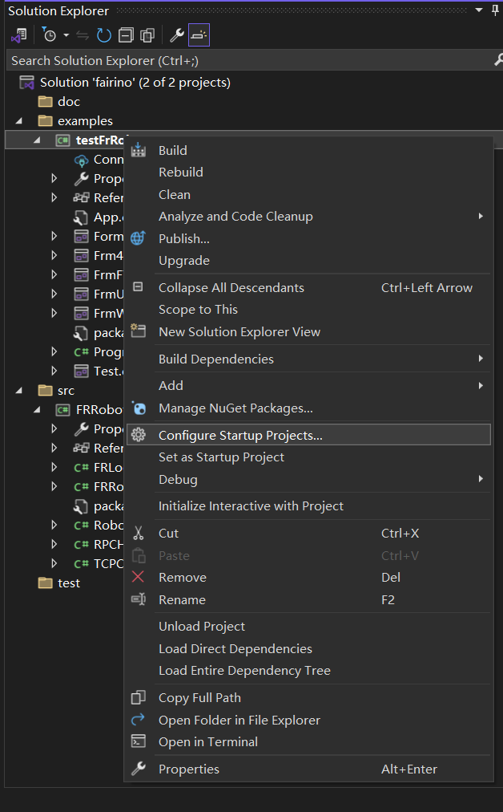

Anhang
=================

.. toctree::
    :maxdepth: 5

Quellcode-Download
------------------------------------------------
Finden Sie im FAIRINO-Dokument (https://fairino-doc-zhs.readthedocs.io/latest/) das Modul "Material-Download". Klicken Sie auf die Schaltfläche "C#SDK". Klicken Sie auf der rechten Seite auf "FAIRINOC#SDK" und warten Sie, bis der Download abgeschlossen ist.

.. image:: image/001.png
   :width: 6in
   :align: center

.. centered:: Abbildung 15.1‑1 #SDK Quellcode-Download (Hinweis: "#" im Titel scheint ein Tippfehler zu sein, sollte "C#SDK" heißen)

Laden Sie das C# SDK herunter und entpacken Sie es. Die Projektverzeichnisstruktur ist unten dargestellt. Das Verzeichnis `examples` enthält Testbeispiele, das Verzeichnis `src` enthält das C# SDK und `Fairino.sln` ist die Projektmappe. Das Verzeichnis `Dlls` enthält die Bibliotheksdateien.

.. image:: image/010.png
   :width: 6in
   :align: center

.. centered:: Abbildung 15.1‑2 Beispiel für die C# SDK-Dateistruktur

Suchen Sie die Projektmappendatei mit dem Namen `fairino.sln` und öffnen Sie sie durch Doppelklick. Die Dateistruktur ist unten dargestellt.

.. centered:: Abbildung 15.1‑3 Beispiel für die Projektdateistruktur in Visual Studio 2022

Quellcode-Kompilierung unter Windows
-----------------------------------------------------

C# SDK kompilieren
~~~~~~~~~~~~~~~~~~~~~~~~~~~~~~~~~~~~~~~~~~~~~~~~~~~~~~~~~~~~~~~~~
Klicken Sie mit der rechten Maustaste auf das Projekt `FRRobot`, wählen Sie "Eigenschaften" und dann die .NET Framework-Version.

.. centered:: Abbildung 15.2‑1 Eigenschaften festlegen

.. image:: image/013.png
   :width: 6in
   :align: center

.. centered:: Abbildung 15.2‑2 .NET Framework auswählen

.. image:: image/014.png
   :width: 6in
   :align: center

.. centered:: Abbildung 15.2‑3 `FRRobot`-Projekt im Release-Modus erstellen

Stellen Sie Visual Studio 2022 auf den Release-Modus um und erstellen Sie das Projekt `FRRobot` neu. Im Verzeichnis `\bin\Release` wird die DLL-Dynamic Link Library generiert.

.. image:: image/015.png
   :width: 6in
   :align: center

.. centered:: Abbildung 15.2‑4 Release-Modus einstellen

.. image:: image/016.png
   :width: 6in
   :align: center

.. centered:: Abbildung 15.2‑5 `FRRobot`-Projekt im Release-Modus neu erstellen

.. image:: image/016.png
   :width: 6in
   :align: center

.. centered:: Abbildung 15.2‑6 DLL-Dynamic Link Library generieren

C# SDK verwenden
~~~~~~~~~~~~~~~~~~~~~~~~~~~~~~~~~~~~~~~~~~~~~~~~~~~~~~~~~~~~~~~~~
Klicken Sie mit der rechten Maustaste auf das Projekt `testFrRobot` und wählen Sie "Als Startprojekt festlegen".

.. centered:: Abbildung 15.2‑7 Als Startprojekt festlegen

Die Testoberfläche des C# SDK ist unten dargestellt.

.. image:: image/018.png
   :width: 6in
   :align: center

.. centered:: Abbildung 15.2‑8 C# SDK Testoberfläche

Wichtige Hinweise
---------------------------------------

Mögliche Probleme
~~~~~~~~~~~~~~~~~~~~~~~~~~~~~~~~~~~~~~~~~~~~~~~~~~~~~~~~~~~~~~~~~

Behandlung, wenn Codeänderungen keine Wirkung zeigen
+++++++++++++++++++++++++++++++++++++++++++++++++++++++++++++++++++++++++++++++
Wenn Sie nach dem Überschreiben des Codes und dem Neustarten des Projekts feststellen, dass das Projekt immer noch den alten Code ausführt, ziehen Sie die folgenden Schritte in Betracht:

**Projekt neu erstellen**: Befolgen Sie die Anleitung in Schritt 3.2, um die Projektkonfiguration und -dateien neu zu erstellen oder zu aktualisieren.

Fehlercodes
+++++++++++++++++++++++++++++++++++++++++++++++++++++++++++++++++++++++++++++++
Ein Rückgabewert von 0 bedeutet, dass der Vorgang normal ausgeführt wurde. Wenn der Rückgabewert nicht 0 ist, schlagen Sie bitte in der Fehlercode-Referenztabelle nach.