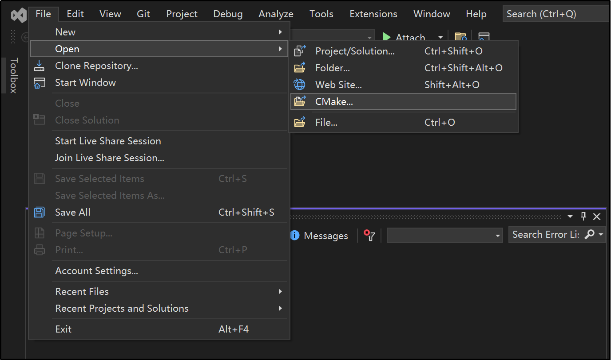

Anhang
=================

.. toctree::
    :maxdepth: 5

Quellcode-Download
------------------------------------------------

Finden Sie im FAIRINO-Dokument (https://fairino-doc-de.readthedocs.io/latest/) das Modul "Material-Download". Klicken Sie auf die Schaltfläche "CPP SDK". Klicken Sie auf der rechten Seite auf "FAIRINO CPP SDK" und warten Sie, bis der Download abgeschlossen ist.

.. image:: image/001.png
   :width: 6in
   :align: center

.. centered:: Abbildung 15.1‑1 C++ SDK Quellcode-Download

Entpacken Sie das Archiv. Das Verzeichnis mit den heruntergeladenen Punktedateien ist wie folgt dargestellt, wobei:

- **windows**: Von gängigen Compilern unter VS2015~VS2019 usw. kompilierte Header-Dateien und Bibliotheksdateien (.lib und .dll), einschließlich Debug- und Release-Modus.
- **linux**: Header-Dateien und Bibliotheksdateien (.so) für gängige Umgebungen wie gcc, rk3399, rk3568.
- **libfairino**: C++ SDK-Quellcode.

.. image:: image/002.png
   :width: 4in
   :align: center

.. centered:: Abbildung 15.1‑2 C++ SDK Quellcode-Verzeichnis

Quellcode-Kompilierung unter Windows
------------------------------------------------
① Öffnen Sie Visual Studio und klicken Sie unten rechts auf "Weiter, aber ohne Code (W)".

.. image:: image/003.png
   :width: 6in
   :align: center

.. centered:: Abbildung 15.2‑1 Visual Studio öffnen

② Klicken Sie nacheinander auf "Datei", "Öffnen", "CMake(M)". Wählen Sie im erscheinenden Dateiauswahlfenster die Datei `\libfairino\CMakeLists.txt` aus dem heruntergeladenen C++ SDK-Quellcode aus. Visual Studio wird das Projekt automatisch basierend auf den Definitionen in `CMakeLists.txt` laden.

.. centered:: Abbildung 15.2‑2 CMake-Projekt öffnen

③ Wählen Sie je nach Bedarf die Zielplattform "x64-Debug" oder "x64-Release" usw. aus und setzen Sie das Startelement auf "fairino.dll".

.. image:: image/005.png
   :width: 6in
   :align: center

.. centered:: Abbildung 15.2‑3 Startelement auswählen

④ Klicken Sie in der Menüleiste nacheinander auf "Erstellen", "fairino.dll neu erstellen". Der Compiler beginnt automatisch mit der Kompilierung.

.. image:: image/006.png
   :width: 6in
   :align: center

.. centered:: Abbildung 15.2‑4 fairino.dll erstellen

⑤ Suchen Sie im Projektverzeichnis rechts den Ordner "build". In diesem Ordner befinden sich die kompilierte `fairino.dll` und die `fairino.lib` Datei.

.. image:: image/007.png
   :width: 6in
   :align: center

.. centered:: Abbildung 15.2‑5 fairino.lib und fairino.dll finden

⑥ Um das C++ SDK für den kollaborativen Roboter zu verwenden, suchen Sie zunächst im rechten Projektverzeichnis das Verzeichnis mit den kompilierten Header-Dateien des Roboters SDK: `/libfairino/src/include/Robot-CN/`. Kopieren Sie die drei Header-Dateien "robot.h", "robot_error.h" und "robot_type.h" in Ihr Projektverzeichnis. Fügen Sie die `fairino.lib` als Linker-Bibliothek hinzu und platzieren Sie schließlich die `fairino.dll` im Verzeichnis der ausführbaren Datei.

Quellcode-Kompilierung unter Linux
------------------------------------------------

Stellen Sie vor der Kompilierung des Linux-Quellcodes sicher, dass der gcc- und g++-Compiler sowie das CMake-Build-System (Version 3.10 oder höher) auf Ihrem System installiert sind.

Das Skript 'buildGcc.sh' im Ordner '\libfairino\linuxBuild\' des C++ Quellcode-Verzeichnisses enthält Befehle wie 'cmake ..', 'make' und das Kopieren der endgültigen Header- und Bibliotheksdateien in den Ordner '\linuxBuild\'. Durch Ausführen dieses Skripts wird die Quellcode-Kompilierung des C++ SDK abgeschlossen.

① Öffnen Sie ein Terminal, navigieren Sie zum Verzeichnis '\libfairino\linuxBuild\' und geben Sie den Befehl 'sh buildGcc.sh' ein und drücken Sie die Eingabetaste. Das SDK beginnt mit der Kompilierung. Warten Sie, bis die Kompilierung abgeschlossen ist.

.. image:: image/008.png
   :width: 6in
   :align: center

.. centered:: Abbildung 15.3‑1 Kompilierungsskript ausführen

② Nach Abschluss der Kompilierung navigieren Sie erneut zum Verzeichnis '\libfairino\linuxBuild\'. Dort finden Sie die Ordner '\include\' und '\lib\'. Dies sind die Verzeichnisse für die benötigten Header-Dateien bzw. Bibliotheksdateien.

.. image:: image/009.png
   :width: 6in
   :align: center

.. centered:: Abbildung 15.3‑2 Kompilierungsergebnis