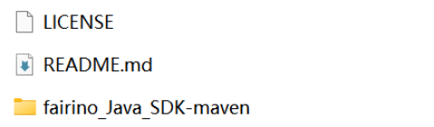
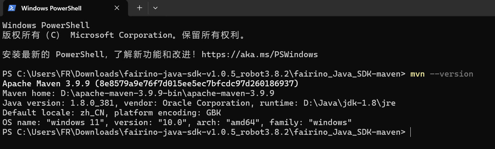

Anhang
======

.. toctree::
    :maxdepth: 5

Quellcode-Download
------------------

Navigieren Sie im FAIRINO-Dokument (https://fairino-doc-de.readthedocs.io/latest/) zum Modul "Download". Klicken Sie auf die Schaltfläche "Java SDK" und klicken Sie auf der rechten Seite auf "FAIRINOJavaSDK". Warten Sie, bis der Download in Ihrem Browser abgeschlossen ist.

.. image:: image/019.png
   :width: 6in
   :align: center

.. centered:: Abbildung 16.1‑1 Java SDK Quellcode-Download

Entpacken Sie das komprimierte Paket. Das Dateiverzeichnis ist wie in der Abbildung dargestellt. Darin enthalten:

`fairino_Java_SDK_maven`: Der unter einem Windows-System kompilierte Quellcode (.java) und die Bibliotheksdateien (.jar).

.. centered:: Abbildung 16.1‑2 Java SDK Dateiverzeichnis

Wechseln Sie in den Ordner `fairino_Java_SDK_maven`. Das Verzeichnis enthält die folgenden Unterordner:

- `lib`: Abhängige JAR-Pakete, die im Quellcode verwendet werden.
- `src`: Quellcodedateien des Java SDK.
- `target`: Aus dem Quellcode generierte Bibliotheksdateien (.jar).

.. image:: image/021.png
   :width: 6in
   :align: center

.. centered:: Abbildung 16.1‑3 Java SDK Quellcode- und Bibliotheksverzeichnis

Quellcode-Kompilierung unter Windows
-------------------------------------

① Installieren und konfigurieren Sie das Build-Tool Maven.

Maven Download-URL: Welcome to Apache Maven – Maven

Nach der Installation und Konfiguration sollte die Ausgabe von `mvn --version` im Terminal wie folgt aussehen:

.. centered:: Abbildung 16.2‑1 Maven-Installation und -Konfiguration

② Öffnen Sie ein Terminal im Verzeichnis des Java SDK-Quellcodes und geben Sie `mvn package` ein. Dadurch werden die Bibliotheksdateien (.jar) generiert.

.. image:: image/023.png
   :width: 6in
   :align: center

.. centered:: Abbildung 16.2‑2 Kompilierung des Java SDK zu Bibliotheksdateien

③ Navigieren Sie im Quellcode-Verzeichnis zum Ordner "target". Dort finden Sie die kompilierten Dateien `fairino-jar-with-dependencies.jar` und `fairino.jar`, wie in der Abbildung gezeigt.

.. image:: image/024.png
   :width: 6in
   :align: center

.. centered:: Abbildung 16.2‑3 Generierte JAR-Dateien

④ Um das Java SDK für den kollaborativen Roboter zu verwenden, fügen Sie in Ihrem IntelliJ IDEA-Projekt die generierte(n) JAR-Datei(en) hinzu. Navigieren Sie dazu zu `File` -> `Project Structure` -> `Libraries` und fügen Sie die JAR-Datei hinzu. Verwenden Sie anschließend in Ihrem Code `import fairino.*;`, um auf die generierte Bibliothek zuzugreifen.