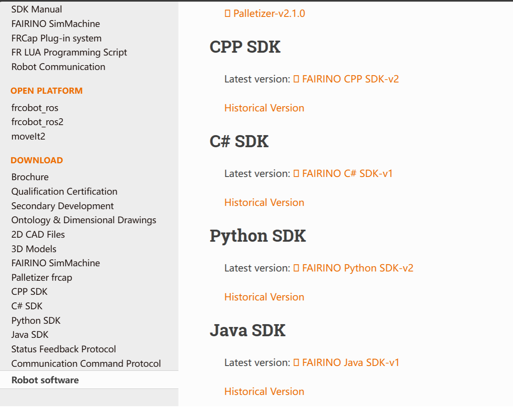
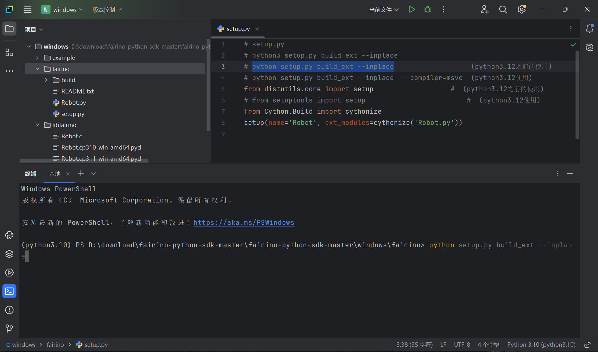
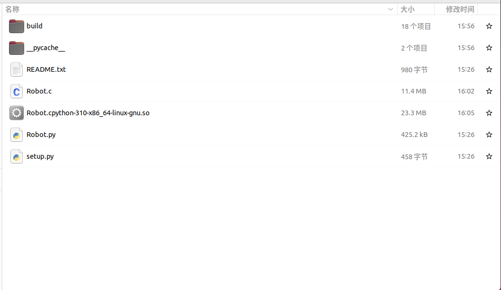

Anhang
======

.. toctree::
    :maxdepth: 5

Quellcode-Download
------------------

Navigieren Sie im FAIRINO-Dokument (https://fairino-doc-de.readthedocs.io/latest/) zum Modul "Download". Klicken Sie auf die Schaltfläche "Python SDK" und klicken Sie auf der rechten Seite auf "FAIRINO Python SDK". Warten Sie, bis der Download in Ihrem Browser abgeschlossen ist.

.. centered:: Abbildung 16.1‑1 Python SDK Quellcode-Download

Laden Sie das Python SDK herunter und entpacken Sie es. Die Projektverzeichnisstruktur ist in der folgenden Abbildung dargestellt. Der Ordner `windows` enthält das Python SDK für Windows-Systeme, der Ordner `linux` das Python SDK für Linux-Systeme.

.. image:: image/026.png
   :width: 6in
   :align: center

.. centered:: Abbildung 16.1‑2 Beispiel für die Python SDK Dateistruktur

Am Beispiel des Windows-Systems: Öffnen Sie den Ordner `windows`. Die Verzeichnisstruktur ist unten abgebildet. Der Ordner `example` enthält Testbeispiele, `fairino` enthält den Python SDK-Quellcode und `libfairino` die Bibliotheksdateien.

.. image:: image/027.png
   :width: 6in
   :align: center

.. centered:: Abbildung 16.1‑3 Beispiel für die Python SDK Dateistruktur unter Windows

Öffnen Sie den `windows`-Ordner mit PyCharm. Die Projektstruktur ist unten dargestellt.

.. image:: image/028.png
   :width: 4in
   :align: center

.. centered:: Abbildung 16.1‑4 Beispiel für die Projektstruktur in PyCharm

Quellcode-Kompilierung
----------------------------------------
Die Generierung der Python-Dynamikbibliothek hängt vom Systemtyp und der Python-Version ab. Beispielsweise wird unter Windows eine Bibliotheksdatei mit der Endung ".pyd" generiert, unter Linux mit der Endung ".so". Dynamische Bibliotheken, die für verschiedene Python-Versionen generiert wurden, können nicht miteinander verwendet werden. Daher müssen vor der Generierung der dynamischen Bibliothek die Python-Version und die Zielplattform festgelegt werden. Dieses Handbuch beschreibt die Kompilierung mit Python 3.10 unter Windows 11 und Ubuntu 22.04.

Kompilieren des Python SDK unter Windows
~~~~~~~~~~~~~~~~~~~~~~~~~~~~~~~~~~~~~~~~~~~~~~~~~~~~~~~~~~~~~~~~~~~~~~~~
Öffnen Sie zunächst die heruntergeladene Python SDK-Datei mit PyCharm und öffnen Sie die Datei `setup.py`.

.. image:: image/029.png
   :width: 6in
   :align: center

.. centered:: Abbildung 16.2‑1 Projektdatei öffnen

Klicken Sie dann unten rechts und wählen Sie den Python-Interpreter aus. Dieses Beispiel verwendet Python 3.10.

.. image:: image/030.png
   :width: 6in
   :align: center

.. centered:: Abbildung 16.2‑2 Python-Version auswählen

Klicken Sie mit der rechten Maustaste auf den Ordner `fairino`, wählen Sie "Öffnen in" und dann "Terminal".

.. image:: image/031.png
   :width: 6in
   :align: center

.. centered:: Abbildung 16.2‑3 Terminal öffnen

Geben Sie im Terminalfenster den Befehl `python setup.py build_ext --inplace` ein und drücken Sie die "Eingabetaste", um die Python SDK-Dynamikbibliothek zu generieren.

.. centered:: Abbildung 16.2‑4 Befehl zur Generierung der Dynamikbibliothek ausführen

Nach Abschluss der Generierung werden im Ordner `fairino` die Dateien `Robot.c` und `Robot.cp310-win_amd64.pyd` erstellt. `Robot.c` ist die in C konvertierte Version von `Robot.py`. `Robot.cp310-win_amd64.pyd` ist die Python SDK-Dynamikbibliothek, wobei "cp310" für die Kompatibilität mit Python 3.10 und "win_amd64" für die Windows-Plattform steht.

.. image:: image/033.png
   :width: 6in
   :align: center

.. centered:: Abbildung 16.2‑5 Generierung der .pyd-Dynamikbibliothek

Kompilieren des Python SDK unter Linux
~~~~~~~~~~~~~~~~~~~~~~~~~~~~~~~~~~~~~~~~~~~~~~~~~~~~~~~~~~~~~~~
Überprüfen Sie zunächst die Python-Version. In diesem Handbuch wird das Tool `pyenv` zur Verwaltung der Python-Version unter Linux verwendet. Führen Sie den Befehl `pyenv versions` aus, um die aktuelle Python-Version anzuzeigen.

.. image:: image/034.png
   :width: 6in
   :align: center

.. centered:: Abbildung 16.2‑6 Python-Version anzeigen

Wechseln Sie dann zur gewünschten Python-Version. Führen Sie für Python 3.10 den Befehl `pyenv global 3.10.3` aus.

.. image:: image/035.png
   :width: 6in
   :align: center

.. centered:: Abbildung 16.2‑7 Python-Version auswählen

Wechseln Sie in das Verzeichnis, das sich auf derselben Ebene wie die Datei `Robot.py` befindet. Führen Sie den Befehl `cd /home/fairino/fairino-python-sdk-master/fairino-python-sdk-master/linux/fairino` aus, um in das Verzeichnis mit `Robot.py` zu wechseln.

.. image:: image/036.png
   :width: 6in
   :align: center

.. centered:: Abbildung 16.2‑8 In das Verzeichnis mit der Datei `Robot.py` wechseln

Bestätigen Sie die Python-Version mit dem Befehl `python --version`.

.. image:: image/037.png
   :width: 6in
   :align: center

.. centered:: Abbildung 16.2‑9 Python-Version anzeigen

Geben Sie im Terminalfenster den Befehl `python setup.py build_ext --inplace` ein und drücken Sie die "Eingabetaste", um die Python SDK-Dynamikbibliothek zu generieren.

.. image:: image/038.png
   :width: 6in
   :align: center

.. centered:: Abbildung 16.2‑10 Befehl zur Generierung der Dynamikbibliothek ausführen

Nach Abschluss der Generierung werden im Ordner `fairino` die Dateien `Robot.c` und `Robot.cpython-310-x86_64-linux-gnu.so` erstellt. `Robot.c` ist die in C konvertierte Version von `Robot.py`. `Robot.cpython-310-x86_64-linux-gnu.so` ist die Python SDK-Dynamikbibliothek, wobei "python-310" für die Kompatibilität mit Python 3.10 und "linux-gnu" für die Linux-Plattform steht.

.. centered:: Abbildung 16.2‑11 Generierung der .so-Dynamikbibliothek

Wichtige Hinweise
----------------------------------

Mögliche Probleme
~~~~~~~~~~~~~~~~~~~~~~~~~~~~~~~~~~~~~~~~

Versionskompatibilität
++++++++++++++++++++++++++++++
Die Python-Dynamikbibliothek ist von der Erzeugungsumgebung und der Python-Version abhängig. Daher muss bei der Verwendung der Python-Dynamikbibliothek überprüft werden, ob die Bibliothek mit dem Systemtyp und der Python-Version übereinstimmt.

Fehlercodes
++++++++++++++++++++++++++++++
Ein Rückgabewert von 0 bedeutet, dass der Vorgang normal ausgeführt wurde. Ist der Rückgabewert nicht 0, schlagen Sie bitte in der Fehlercode-Referenztabelle nach.