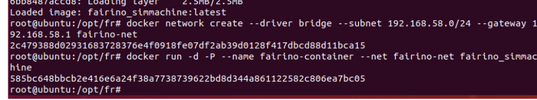
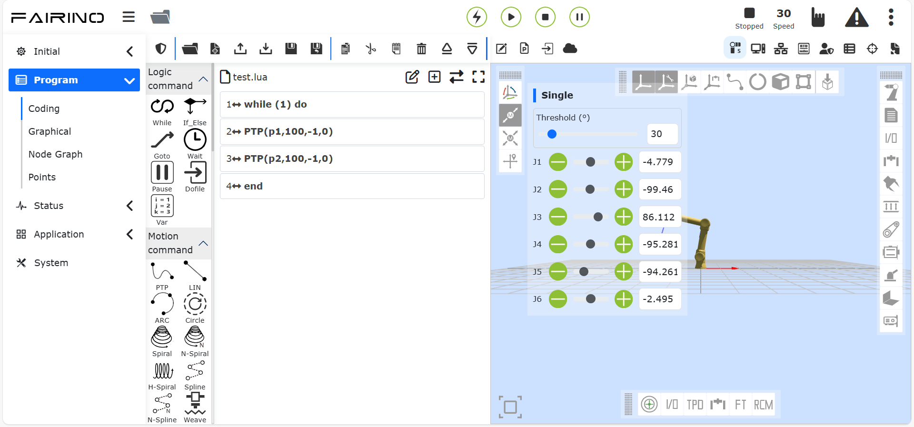
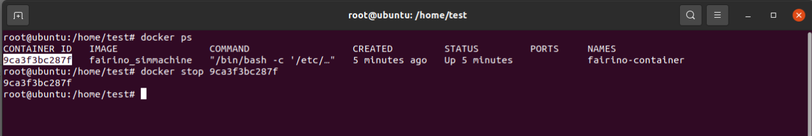
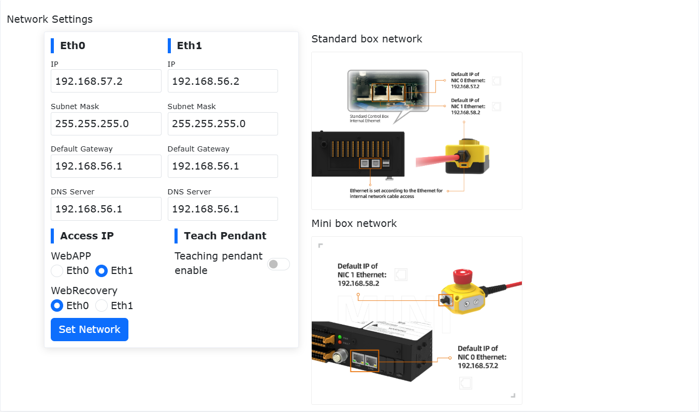

Virtuelle Maschine - Docker
=================================

Linux-Bereitstellung des Docker-Images
---------------------------------------

Betriebsumgebung
~~~~~~~~~~~~~~~~~~~~~~~

System der virtuellen Maschinenumgebung: Ubuntu 18.04.6;

System der virtuellen Maschinenumgebung: RAM 4G, ROM 50G, 6-Kern-CPU;

Betriebsberechtigung: Verwendung der Superuser-Root-Berechtigung, siehe Anhang 3 für die Einrichtungsmethode;

Docker-Installationsdatei: fr_docker.tar.gz;

FAIRINO SimMachine-Image: FAIRINOSimMachine.tar;

Docker installieren
~~~~~~~~~~~~~~~~~~~~~~~~~~~~~~~~

Wenn der Benutzer Docker bereits installiert und bereitgestellt hat, überspringen Sie diesen Abschnitt und fahren Sie mit der Image-Bereitstellung in 1.3 fort.

1. Laden Sie fr_docker.tar.gz herunter und legen Sie es im Ubuntu-Dateipfad /opt/ ab.

2. Entpacken Sie fr_docker.tar.gz, am Beispiel des Verzeichnisses /opt/:

.. code-block:: console
   :linenos:

   cd /opt/ && tar -zxvf fr_docker.tar.gz

.. image:: controller_virtual_machine/036.png
   :width: 6in
   :align: center

3. Führen Sie das Skript zur Docker-Installation aus:

.. code-block:: console
   :linenos:

   sh install.sh docker-27.0.3.tgz

Nachdem das Skript ausgeführt wurde, erscheint die Versionsnummer, was eine erfolgreiche Installation anzeigt.

.. image:: controller_virtual_machine/037.png
   :width: 6in
   :align: center

Image-Konfiguration
~~~~~~~~~~~~~~~~~~~~~~~~~~~~~~~~

Docker-Image importieren
+++++++++++++++++++++++++++++++++

1. Laden Sie das VM-Image FAIRINOSimMachine.tar herunter und entpacken Sie es.

2. Überprüfen Sie die Docker-Version, um zu bestätigen, dass es installiert ist.

.. code-block:: console
   :linenos:

   docker -v

.. image:: controller_virtual_machine/038.png
   :width: 6in
   :align: center

3. Image importieren

.. code-block:: console
   :linenos:

   docker load -i ./FAIRINOSimMachine.tar

Das Erscheinen von fairno_simmachine:latest zeigt den Abschluss des Imports an.

.. image:: controller_virtual_machine/039.png
   :width: 6in
   :align: center

4. Führen Sie `docker images` aus, um zu überprüfen, ob der Import erfolgreich war.

Benutzerdefiniertes Bridge-Netzwerk erstellen
+++++++++++++++++++++++++++++++++++++++++++++++++++++++++++

1. Führen Sie den folgenden Befehl aus, um ein Bridge-Netzwerk mit dem Namen fairino-net und dem Subnetz 192.168.58.0/24 zu erstellen.

.. code-block:: console
   :linenos:

   docker network create --driver bridge --subnet 192.168.58.0/24 --gateway 192.168.58.1 fairino-net

2. Netzwerk anzeigen

.. code-block:: console
   :linenos:

   docker network ls

Die Existenz des fairino-net-Netzwerks zeigt die erfolgreiche Erstellung an.

.. image:: controller_virtual_machine/040.png
   :width: 6in
   :align: center

Docker-Container zum ersten Mal starten
+++++++++++++++++++++++++++++++++++++++++++++++++++++++++++

1. Container erstellen und starten

Starten Sie den Container mit dem fairino-net-Netzwerk und dem fairino_simmachine-Image.

.. code-block:: console
   :linenos:

   docker run -d -P --name fairino-container --privileged -u root --net fairino-net fairino_simmachine

.. code-block:: console
   :linenos:

   docker ps

Überprüfen Sie, ob der Container erfolgreich gestartet wurde. Das Erscheinen von fairino-container zeigt den erfolgreichen Start an.

.. image:: controller_virtual_machine/042.png
   :width: 6in
   :align: center

Web-basierte Bedienung des virtuellen Roboters
-------------------------------------------------------------

Container läuft normal
~~~~~~~~~~~~~~~~~~~~~~~~~~~~~~

Dieser Abschnitt gilt für Container, die nicht zum ersten Mal gestartet werden, falls der Container aufgrund eines Neustarts des Computers oder eines Docker-Stopps nicht im Hintergrund läuft.

1. Docker starten:

.. code-block:: console
   :linenos:

   systemctl start docker

2. Docker-Status anzeigen:

.. code-block:: console
   :linenos:

   systemctl status docker

Grünes active(running) zeigt einen erfolgreichen Start an.

.. image:: controller_virtual_machine/043.png
   :width: 6in
   :align: center

3. Führen Sie `docker ps -a` aus, um die Container-ID anzuzeigen.

.. image:: controller_virtual_machine/044.png
   :width: 6in
   :align: center

4. Führen Sie `docker start [CONTAINER_ID]` aus.

.. image:: controller_virtual_machine/045.png
   :width: 6in
   :align: center

5. Bei erfolgreicher Ausführung führen Sie erneut `docker ps` aus, um zu sehen, dass der Container läuft.

.. image:: controller_virtual_machine/046.png
   :width: 6in
   :align: center

Virtuellen Roboter bedienen
~~~~~~~~~~~~~~~~~~~~~~~~~~~~~~

1. Stellen Sie sicher, dass der Docker-Container läuft.

.. code-block:: console
   :linenos:

   docker ps

Das Erscheinen von fairino-container zeigt an, dass er läuft.

.. image:: controller_virtual_machine/047.png
   :width: 6in
   :align: center

2. Öffnen Sie einen Browser und geben Sie die Standard-IP 192.168.58.2 ein, um auf die Weboberfläche zuzugreifen und den virtuellen Roboter zu bedienen.

.. image:: controller_virtual_machine/048.png
   :width: 6in
   :align: center

3. Melden Sie sich mit dem Konto admin an, Passwort: 123.

Benutzer ändert IP-Adresse
~~~~~~~~~~~~~~~~~~~~~~~~~~~~~~~~~~~~~~

.. image:: controller_virtual_machine/050.png
   :width: 6in
   :align: center

1. Öffnen Sie einen Browser und geben Sie die Standard-IP 192.168.58.2 ein, um die Webseite zu öffnen;
2. Melden Sie sich mit dem Konto admin an, Passwort: 123;
3. Gehen Sie zu "Systemeinstellungen" → "Allgemeine Einstellungen" → "Netzwerkeinstellungen", ändern Sie die IP zur Ziel-IP-Adresse, Subnetzmaske und zum Gateway. Klicken Sie auf "Netzwerk einstellen";
4. Öffnen Sie ein Terminal und stoppen Sie den Container;

Container-ID anzeigen:

.. code-block:: console
   :linenos:

   docker ps -a

.. image:: controller_virtual_machine/052.png
   :width: 6in
   :align: center

Container stoppen:

.. code-block:: console
   :linenos:

   docker stop [CONTAINER_ID]

5. Konfigurieren Sie das Containernetzwerk neu;

Altes Netzwerk entfernen:

.. code-block:: console
   :linenos:

   docker network rm fairino-net

Neues Netzwerk erstellen:

.. code-block:: console
   :linenos:

   docker network create --driver bridge --subnet [ZIEL-IP/SUBNETZMAsKE] --gateway [GATEWAY-IP] fairino-net

Am Beispiel von 192.168.56.0/24: docker network create --driver bridge --subnet 192.168.56.0/24 --gateway 192.168.56.1 fairino-net

.. image:: controller_virtual_machine/054.png
   :width: 6in
   :align: center

6. Verbinden Sie den Container mit dem neu erstellten Netzwerk;

.. code-block:: console
   :linenos:

   docker network connect fairino-net [CONTAINER_ID]

.. image:: controller_virtual_machine/055.png
   :width: 6in
   :align: center

7. Starten Sie den Container neu;

.. code-block:: console
   :linenos:

   docker start [CONTAINER_ID]

8. Öffnen Sie nun den Browser und geben Sie die geänderte IP-Adresse ein, um auf die Weboberfläche zuzugreifen und den virtuellen Roboter zu bedienen.

Upgrade und Downgrade der VM-Version
-------------------------------------

Überblick
~~~~~~~~~~~~~~~~~~~~~~~~~~~~~~

Dieses Handbuch beschreibt detailliert den Standardprozess für Software-Upgrade- und Downgrade-Operationen bei Verwendung der FAIRINO SimMachine Docker-VM und systematisiert die wichtigsten Punkte, die während des Versionswechsels zu beachten sind.

Vorbereitung und Hinweise für Upgrade/Downgrade
~~~~~~~~~~~~~~~~~~~~~~~~~~~~~~~~~~~~~~~~~~~~~~~~~

Betriebsvorbereitung
++++++++++++++++++++++

1. Eine bereitgestellte und ordnungsgemäß funktionierende FAIRINO SimMachine Docker-VM. Das Bereitstellungstutorial finden Sie im "Benutzerhandbuch - Linux-Bereitstellung des Docker-Images";
2. Das Software-Upgrade-Paket für die Docker-VM-Version. Die Download-Adresse finden Sie unter "Download-Materialien - FAIRINO SimMachine Docker". Nach dem Entpacken enthält es das neueste Docker-Image FAIRINOSimMachine.tar und das Software-Upgrade-Paket software.tar.gz.

Wichtige Hinweise
++++++++++++++++++++++++++++++++

1. Datensicherung: Es wird empfohlen, vor dem Upgrade eine Sicherung durchzuführen. Die Methode finden Sie im Kapitel "Datensicherung", um Datenverlust aufgrund von Upgrade-Anomalien zu vermeiden.
2. Versionsbeschränkungen:

.. centered:: Tabelle 2.3-1 Einschränkungen für Upgrade/Downgrade

.. list-table::
   :widths: 50 50 50
   :header-rows: 0
   :align: center

   * - **Operationstyp**
     - **Bedingung/Einschränkung**
     - **Schrittbeschreibung**

   * - **Upgrade**
     - Aktuelle Version >= 3.7.8
     - Direktes Upgrade möglich

   * - **Upgrade**
     - Aktuelle Version < 3.7.8
     - Zuerst Upgrade auf Version 3.7.5 erforderlich oder Verwendung eines Kompatibilitätsplans

   * - **Downgrade**
     - Aktuelle und Zielversion >= 3.7.8
     - Direktes Downgrade möglich

   * - **Downgrade**
     - Aktuelle oder Zielversion < 3.7.8
     - Verwendung eines Kompatibilitätsplans

   * - **Kompatibilitätsplan**
     - Gilt gleichzeitig für anomale Upgrade-/Downgrade-Situationen
     - Siehe detaillierte Schritte im Kapitel "Kompatibilitätsplan"