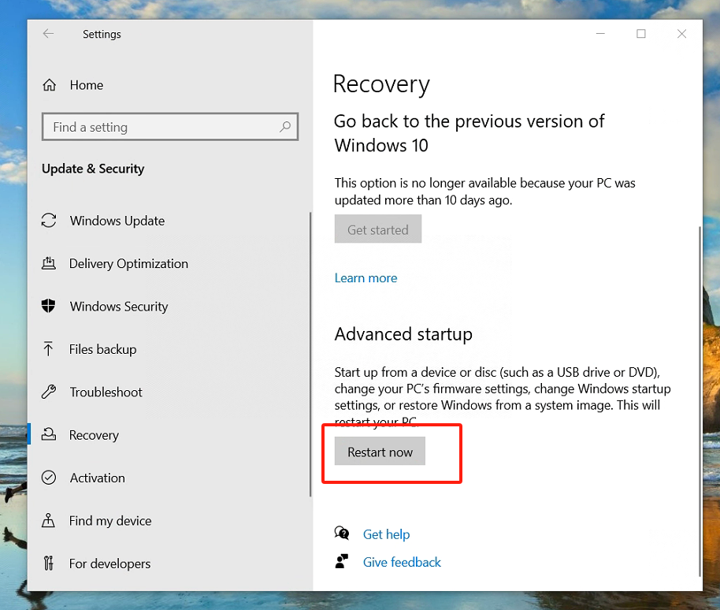
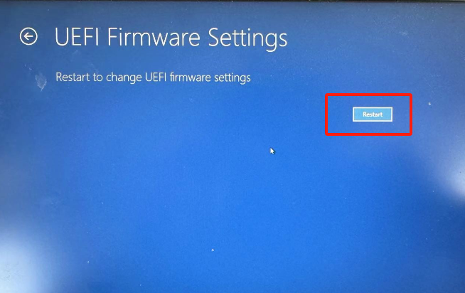
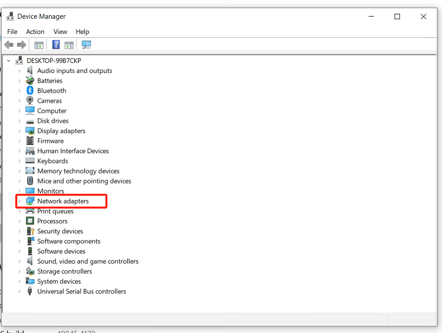
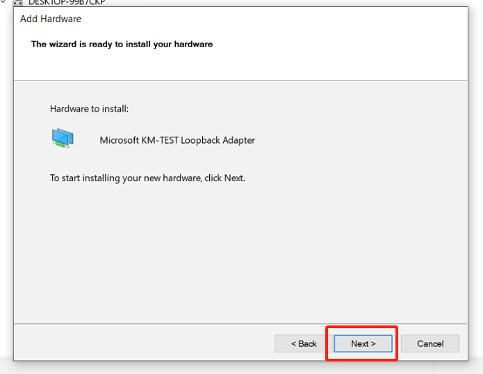
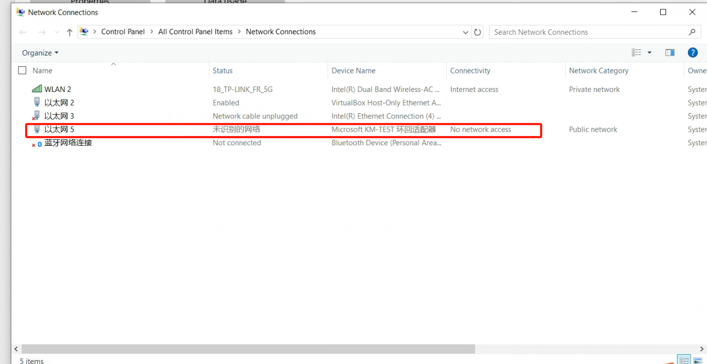

Anhang
===================

Anhang 1: Virtualisierung im BIOS aktivieren
---------------------------------------------

Der Prozess zur Aktivierung der Virtualisierung kann je nach Computermodell variieren. Hier ein Beispiel mit einem Lenovo ThinkPad unter Windows 10:

- Öffnen Sie die PC-Einstellungen und wählen Sie "Update und Sicherheit".

.. image:: controller_virtual_machine/013.png
   :width: 4in
   :align: center

.. image:: controller_virtual_machine/014.png
   :width: 4in
   :align: center

- Wählen Sie "Wiederherstellung".

.. image:: controller_virtual_machine/015.png
   :width: 4in
   :align: center

- Wählen Sie "Jetzt neu starten".

- Wählen Sie "Problembehandlung".

.. image:: controller_virtual_machine/017.png
   :width: 4in
   :align: center

- Wählen Sie "Erweiterte Optionen".

.. image:: controller_virtual_machine/018.png
   :width: 4in
   :align: center

- Wählen Sie "UEFI-Firmwareeinstellungen".

.. image:: controller_virtual_machine/019.png
   :width: 4in
   :align: center

- Wählen Sie "Neustart".

- Wählen Sie unter "Security" den Punkt "Virtualization".

.. image:: controller_virtual_machine/021.png
   :width: 4in
   :align: center

- Wählen Sie "Enabled" und bestätigen Sie mit der "Enter"-Taste.

.. image:: controller_virtual_machine/022.png
   :width: 4in
   :align: center

- Drücken Sie "F10", wählen Sie "Yes" und bestätigen Sie mit "Enter", um die Änderungen zu speichern.

.. image:: controller_virtual_machine/023.png
   :width: 4in
   :align: center

Anhang 2: Hinzufügen einer virtuellen Netzwerkkarte (Loopback-Adapter)
----------------------------------------------------------------------

1. Öffnen Sie den Geräte-Manager, drücken Sie die "Windows-Taste-X" und wählen Sie "Geräte-Manager".

2. Fügen Sie einen Netzwerkadapter hinzu.

.. image:: controller_virtual_machine/025.png
   :width: 4in
   :align: center

.. image:: controller_virtual_machine/026.png
   :width: 4in
   :align: center

.. image:: controller_virtual_machine/027.png
   :width: 4in
   :align: center

.. image:: controller_virtual_machine/028.png
   :width: 4in
   :align: center

.. image:: controller_virtual_machine/029.png
   :width: 4in
   :align: center

.. image:: controller_virtual_machine/031.png
   :width: 4in
   :align: center

3. Überprüfen Sie die virtuelle Netzwerkkarte, drücken Sie "Windows-Taste-X" und wählen Sie "Netzwerkverbindungen".

.. image:: controller_virtual_machine/032.png
   :width: 4in
   :align: center

.. image:: controller_virtual_machine/033.png
   :width: 4in
   :align: center

.. image:: controller_virtual_machine/034.png
   :width: 4in
   :align: center

4. Konfigurieren Sie das Netzwerk des Loopback-Adapters.

- IP-Adresse: 192.168.58.XXX (muss im selben Subnetz wie 192.168.58.2 liegen).
- Subnetzmaske: 255.255.255.0.

.. image:: controller_virtual_machine/012.png
   :width: 6in
   :align: center

5. Öffnen Sie die Netzwerkkonfiguration von Virtualbox, wählen Sie als Schnittstellenname den "Loopback-Adapter" und starten Sie die VM.

.. image:: controller_virtual_machine/013.png
   :width: 6in
   :align: center

Anhang 3: Root-Berechtigungen
--------------------------------------

Nach der Installation von Ubuntu kann sich der Root-Benutzer standardmäßig nicht anmelden, und das Passwort ist leer. Um sich als Root-Benutzer anzumelden, muss zuerst ein Passwort für den Root-Benutzer festgelegt werden.

1. Öffnen Sie ein Terminal, geben Sie `sudo passwd root` ein, drücken Sie die Eingabetaste, geben Sie dann mehrmals ein Passwort ein. Eine Meldung zeigt an, dass das Passwort erfolgreich festgelegt wurde.

.. image:: controller_virtual_machine/057.png
   :width: 6in
   :align: center

2. Geben Sie im Terminal weiter den Befehl `su - root` ein, um den Benutzer zu wechseln, und geben Sie das Passwort ein.

.. warning:: Bei der Eingabe des Befehls muss "-" unbedingt eingegeben werden. Die Option "-" bedeutet, dass auch die Umgebungsvariablen mitgewechselt werden. "-" darf auf keinen Fall fehlen.

.. image:: controller_virtual_machine/058.png
   :width: 6in
   :align: center

Anhang 4: Docker-Grundbefehle
--------------------------------------

1. Docker-Hilfebefehl:

.. code-block:: console
   :linenos:

   docker --help

2. Docker starten:

.. code-block:: console
   :linenos:

   systemctl start docker

3. Docker stoppen:

.. code-block:: console
   :linenos:

   systemctl stop docker

4. Docker neu starten:

.. code-block:: console
   :linenos:

   systemctl restart docker

5. Docker so einstellen, dass er mit dem Systemdienst automatisch startet:

.. code-block:: console
   :linenos:

   systemctl enable docker

6. Docker-Ausführungsstatus anzeigen:

.. code-block:: console
   :linenos:

   systemctl status docker
   -- Wenn er läuft, wird nach Eingabe des Befehls ein grünes "active" angezeigt.

7. Docker-Images:

.. code-block:: console
   :linenos:

   docker images: Listet bereits heruntergeladene Images auf, zeigt Images an.
   docker rmi Image-ID oder -Name: Löscht lokale Images.
   docker rmi -f Image-ID oder -Name: Löscht Images (erzwungen).
   docker build: Erstellt ein Image.
   docker search Image-ID oder -Name: Sucht nach Images mit dem Schlüsselwort im Docker Hub-Repository.
   docker pull Image-ID oder -Name: Lädt ein Image aus dem Repository herunter.

8. Docker-Container:

.. code-block:: console
   :linenos:

   docker ps: Listet laufende Container auf.
   docker ps -a: Zeigt alle Container an, einschließlich gestoppter.
   docker stop Container-ID oder -Name: Stoppt einen Container.
   docker kill Container-ID: Stoppt einen Container erzwungen.
   docker start Container-ID oder -Name: Startet einen gestoppten Container.
   docker inspect Container-ID: Zeigt alle Informationen eines Containers an.
   docker container logs Container-ID: Zeigt Container-Logs an.
   docker top Container-ID: Zeigt Prozesse in einem Container an.
   docker exec -it Container-ID /bin/bash: Betritt einen Container.
   exit: Verlässt den Container.
   docker rm Container-ID oder -Name: Löscht einen gestoppten Container.
   docker rm -f Container-ID: Löscht einen laufenden Container (erzwungen).
   docker exec -it Container-ID sh: Betritt einen Container (mit Shell).