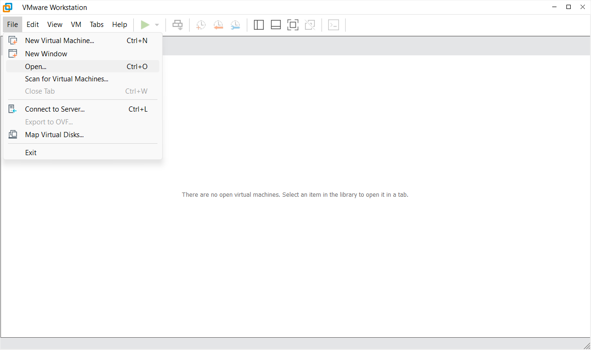
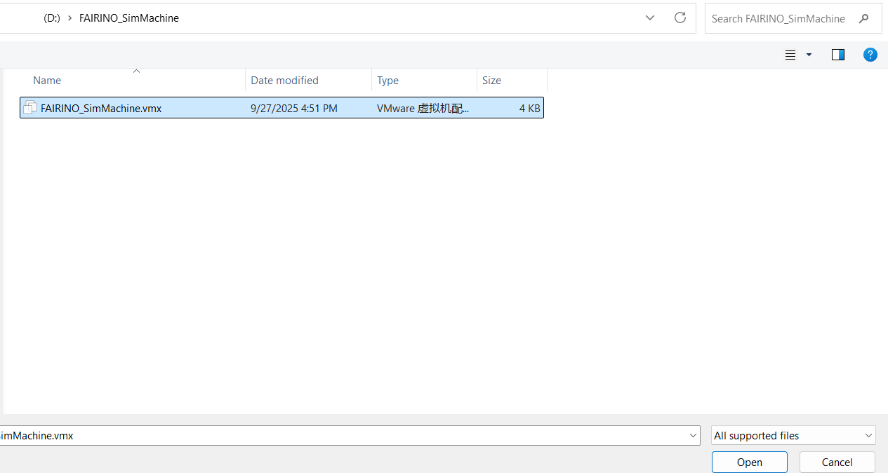

Virtuelle Maschine - VMware
===============================================

Überblick
------------------
Dieses Handbuch soll die Verwendung der FAIRINO SimMachine VM erläutern.

Bedienungsanleitung
------------------------------------

VMware Workstation installieren
~~~~~~~~~~~~~~~~~~~~~~~~~~~~~~~~~~~~~~~~~~~~~~~~~~~~~~~~~~~~

VMware Workstation Demoversion: 17.6.3 (diesen Schritt überspringen, wenn bereits installiert).

Suchen Sie im Browser direkt nach der offiziellen VMware-Website oder klicken Sie direkt auf den Link \ `<https://www.vmware.com>`__\ , laden Sie das Installationspaket herunter und installieren Sie es mit den Standardpfaden.

.. image:: controller_virtual_machine/001.png
   :width: 6in
   :align: center

.. centered:: Abbildung 6.2-1 VMWare-Oberfläche

Image öffnen
~~~~~~~~~~~~~~~~~~~~~~~~~~~~~~~~~~~~~~~~~~~~~~~~~~~~~~~~~~~~

1. Laden Sie das VM-Image FAIRINO_SimMachine.zip herunter und entpacken Sie es.

2. Öffnen Sie VMware und klicken Sie auf File -> Open. Wie in Abbildung 2-2 dargestellt:

.. centered:: Abbildung 6.2-2 Image öffnen

3. Navigieren Sie zum entpackten Ordner und wählen Sie die Datei mit der Endung .vmx aus. Wie in Abbildung 2-3 dargestellt:

.. centered:: Abbildung 6.2-3 Datei auswählen

4. Klicken Sie auf "Power on this virtual machine", um die VM zu starten. Wie in Abbildung 2-4 dargestellt:

.. image:: controller_virtual_machine/004.png
   :width: 6in
   :align: center

.. centered:: Abbildung 6.2-4 VM starten

5. Navigieren Sie im entpackten Ordner zu "fr_get_vm_net" und doppelklicken Sie darauf. Wie in Abbildung 2-5 dargestellt, wird die IP-Adresse der VM ausgegeben. Wie in Abbildung 2-6 dargestellt.

.. note:: Sollte der Abruf fehlschlagen, rufen Sie die IP-Adresse bitte direkt in der VM mit dem Befehl `ifconfig` ab.

.. image:: controller_virtual_machine/005.png
   :width: 6in
   :align: center

.. centered:: Abbildung 6.2-5 fr_get_vm_net.bat

.. image:: controller_virtual_machine/006.png
   :width: 4in
   :align: center

.. centered:: Abbildung 6.2-6 VM-IP-Adresse

Zugriff auf WebApp unter Windows
~~~~~~~~~~~~~~~~~~~~~~~~~~~~~~~~~~~~~~~~~~~~~~~~~~~~~~~~~~~~

1. Geben Sie nach Erhalt der VM-IP-Adresse diese direkt im Windows-Browser ein, um auf die WebApp zuzugreifen. Geben Sie z.B. 192.168.182.222 ein, wie in Abbildung 2-7:

.. image:: controller_virtual_machine/007.png
   :width: 6in
   :align: center

.. centered:: Abbildung 6.2-7 Zugriff auf WebApp über die VM-IP